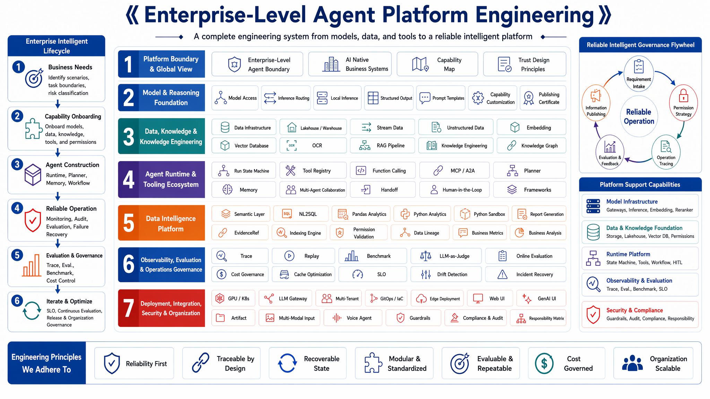

# Enterprise Agent Platform Engineering: From Data Intelligence Foundation to AI-Native Business Systems

[](https://github.com/datagallery-lab/enterprise_agent_platform_engineering)
[](LICENSE)

**English | [中文](README_zh.md)**

**Read online / 在线阅读链接:** [English edition](https://datagallery-lab.github.io/enterprise_agent_platform_engineering/en/) | [中文版本](https://datagallery-lab.github.io/enterprise_agent_platform_engineering/)

## Introduction

Enterprise Agent systems become hard when they leave the demo stage. Teams have to connect models, data, knowledge, tools, runtime state, evaluation, security, deployment, and organizational process into one operating platform. A chat interface or an orchestration framework can start the work; production systems also need permissions, failure recovery, audit evidence, cost control, SLOs, and governance ownership.

This book follows that production chain. The opening chapters define the boundary between Agents and enterprise-grade platforms. The next sections cover model inference, data infrastructure, vector retrieval, knowledge engineering, and the Agent capability layer. The middle of the book uses DataAgent as a running thread, connecting semantic layer engineering, NL2SQL, Python-based analysis, report generation, Trace, and Eval. Later chapters cover cost governance, deployment infrastructure, frontend interaction, multimodality, security, compliance, and organizational evolution.

Readers can use the book as a platform engineering map:

- 🧭 **Enterprise Agent platform boundaries:** how to distinguish Agent applications, Agent frameworks, workflow automation, copilots, and full platform capabilities.
- 🧠 **Model and inference engineering:** model access, inference routing, structured output, prompt contracts, gateway design, and versioned release evidence.
- 🧱 **Data infrastructure for AI systems:** lakehouse, warehouse, streaming, metadata, lineage, permissions, and data contracts for Agent workloads.
- 🔍 **RAG and knowledge pipelines:** document parsing, OCR, semantic chunking, vector indexing, reranking, evidence retrieval, and failure diagnosis.
- 🧩 **Tool-use and protocol ecosystems:** Function Calling, Tool Registry, MCP, A2A, tool permissions, schema validation, and enterprise system integration.
- 🤖 **Agent Runtime and capability chain:** Run state machines, Planner, Memory, multi-agent collaboration, Handoff, HITL, replay, and recovery semantics.
- 📊 **Data Agent platform:** semantic layer, NL2SQL, Text-to-Pandas / Text-to-Python, report generation, EvidenceRef, Trace, Eval, and permission governance.
- 🧪 **Evaluation and benchmark engineering:** offline benchmark construction, LLM-as-Judge, online evaluation, regression sets, cost-aware quality gates, and private leaderboards.
- ⚙️ **Production deployment and infrastructure:** LLM Gateway, multi-tenancy, GPU scheduling, Kubernetes, GitOps, IaC, edge inference, and rollback design.
- 🖥️ **Frontend, interaction, and multimodality:** streaming UI, Generative UI, Artifact, conversational state, multimodal input, voice Agent, and abnormal path handling.
- 🔒 **Trusted enterprise Agents:** Guardrails, permission boundaries, audit evidence, human approval, compliance mapping, and responsibility matrices for internal Agent deployment.
- 🛠️ **Companion mini-platform implementation:** Run states, tool contracts, schema validation, workflow configuration, and tests that can be read alongside the chapters.

After reading the book, readers should be able to judge whether an Agent system has the conditions for platformization, understand the interface between platform layers, and design an enterprise Agent platform around runtime boundaries, failure recovery, evaluation evidence, and governance responsibility.

## Book Architecture

The book follows the construction order of an enterprise Agent platform: platform boundaries first; then model, data, knowledge, and tool foundations; then Agent capabilities, DataAgent, evaluation governance, deployment infrastructure, business interaction, security, compliance, and organizational evolution.



## Table of Contents

```text
11 parts, 53 formal chapters + 8 appendices (A-H)
│
├── Part I   Overview and platform perspective (Ch. 1-4)
├── Part II  Models and inference (Ch. 5-9)
├── Part III Data infrastructure (Ch. 10-15)
├── Part IV  Vectors, retrieval, and knowledge engineering (Ch. 16-21)
├── Part V   Agent capabilities (Ch. 22-31)
├── Part VI  DataAgent deep dive (Ch. 32-37)
├── Part VII Observability, evaluation, and cost (Ch. 38-42)
├── Part VIII Deployment and infrastructure (Ch. 43-46)
├── Part IX  Frontend, interaction, and multimodality (Ch. 47-49)
├── Part X   Security, compliance, and organization (Ch. 50-53)
├── Part XI  Case methodology and case admission
└── Appendices A-H
```

## Highlights

### Enterprise Agent Platform Engineering Map

The book places model integration, data boundaries, knowledge engineering, tool permissions, runtime, evaluation, security, deployment, and organizational ownership on one engineering map. A recurring theme is trusted enterprise Agent operation: permissions must be explicit, actions must leave evidence, risky steps need review paths, and platform teams need enough trace data to explain what happened after the run. Readers can follow what an Agent capability needs before it enters production, and which interfaces and responsibilities should be decided during architecture design.

### Data Agent Platform

The Data Agent platform is the book's most business-facing thread. The related chapters focus on enterprise question answering, metric explanation, business analysis, and data reporting. They cover semantic layer modeling, NL2SQL validation, Python analysis execution, report generation, EvidenceRef, Trace, Eval, and permission governance. Readers can split this path into platform interfaces, runtime evidence, and launch checks.

### Production Runtime Mechanics

Agent systems in production have to handle state, errors, and responsibility. The book explains Run state machines, idempotency, retries, timeouts, degradation, approval, audit, replay, evaluation, cost control, and SLO inside concrete chapters. Readers see how these mechanisms work before launch, during operation, after incidents, and across continuous improvement.

### mini-platform Companion Implementation

The companion `mini-platform/` maps chapter concepts to code structure, including Run states, schema validation, tool bridges, workflow configuration, and test examples. It is reading companion code. Production systems still need their own permission model, deployment model, audit process, and operations design.

## Intended Readers

- AI platform leaders, CTOs, and technical leads
- Enterprise architects, platform architects, and data architects
- Data intelligence engineers, AI engineers, MLOps / LLMOps engineers
- Application developers moving Agent demos toward production systems
- Team leads responsible for AI system security, compliance, audit, and governance

## License

This project is licensed under the terms in [LICENSE](LICENSE).
