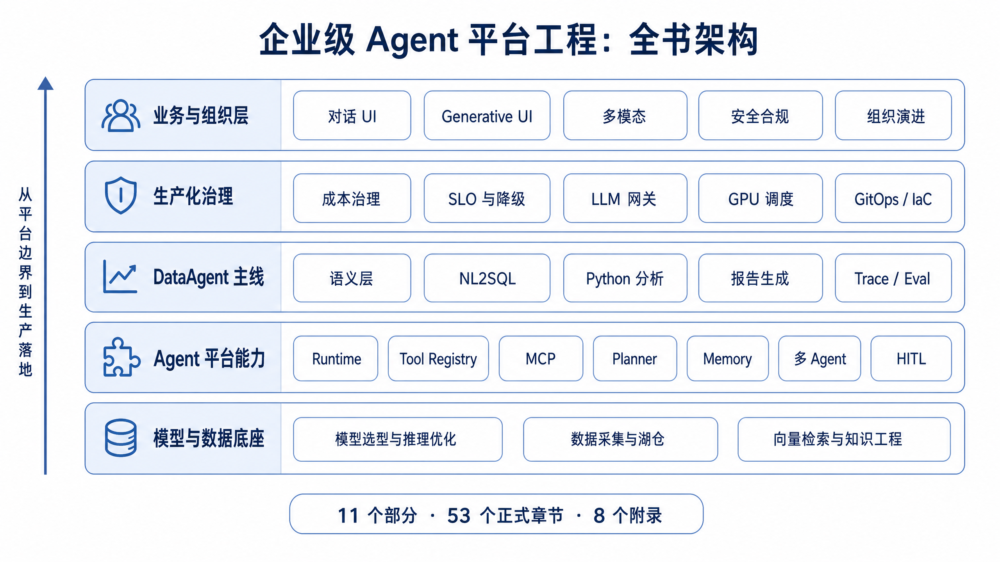

# 《企业级 Agent 平台工程：从数据智能底座到 AI 原生业务系统》

[](https://github.com/datagallery-lab/enterprise_agent_platform_engineering)
[](LICENSE)

**[English](README_en.md) | 中文**


## 简介

企业级 Agent 平台要把模型、数据、知识、工具、运行时、评估、安全和组织流程接成一套可运行的系统。一次工具调用、一个聊天界面或一个编排框架，只能覆盖其中一小段链路。进入生产之后，团队还需要处理权限、状态、失败恢复、证据链、成本、审计和持续治理。

本书围绕这条生产链路展开。前四章建立 Agent 与企业级平台的边界；随后进入模型推理、数据基础设施、向量检索、知识工程和 Agent 能力链；中段以 DataAgent 为主线，串起语义层、NL2SQL、Python 分析、报告生成、Trace 和 Eval；后半部分讨论成本治理、部署基础设施、前端交互、多模态、安全合规和组织演进。

读完本书，读者应能判断一个 Agent 系统是否具备平台化条件，理解各层能力之间的接口关系，并能围绕运行边界、失败恢复、评测证据和治理责任设计自己的企业级 Agent 平台。

本书配套 `mini-platform/` 参考实现，用于对照章节中的接口、状态机和运行边界。它是阅读辅助代码，生产环境仍需结合企业自己的权限、部署、审计和运维体系重新设计。

## 全书架构

本书按企业级 Agent 平台的建设顺序组织：先确定平台边界，再补齐模型、数据、知识与工具底座，随后进入 Agent 能力链、DataAgent 主线、评估治理、部署基础设施和业务交互层，最后讨论安全合规与组织演进。




## 目录结构

```text
全书 11 个部分，53 个正式章节 + 8 个附录（A-H）
│
├── Part I   总论与平台观（第1-4章）
├── Part II  模型与推理（第5-9章）
├── Part III 数据基础设施（第10-15章）
├── Part IV  向量、检索与知识工程（第16-21章）
├── Part V   Agent 能力百科（第22-31章）
├── Part VI  DataAgent 主线深潜（第32-37章）
├── Part VII 可观测性、评估与成本（第38-42章）
├── Part VIII 部署与基础设施（第43-46章）
├── Part IX  前端、交互与多模态（第47-49章）
├── Part X   安全、合规与组织（第50-53章）
├── Part XI  案例方法论与后续案例准入（TODO）
└── 附录 A-H
```

## 核心亮点

### 面向企业级落地

本书从企业系统的真实约束出发讨论 Agent 平台。模型接入、数据边界、工具权限、审计证据、成本控制、SLO、部署方式和组织责任都会进入同一套设计视角。读者可以沿着章节看到，一个 Agent 能力从 Demo 进入生产环境时，需要补齐哪些平台能力，以及哪些能力应该在架构阶段提前设计。

### DataAgent

DataAgent 是本书最贴近业务价值的一条主线。书中围绕企业问数、指标解释、经营分析和数据报告展开，覆盖语义层建模、NL2SQL 校验、Python 分析执行、报告生成、EvidenceRef、Trace、Eval 和权限治理。读者可以用这条主线理解 DataAgent 产品形态，也可以把它拆成可落地的平台接口和上线检查项。

### 生产落地

生产环境里的 Agent 系统必须处理状态、错误和责任。本书把状态机、幂等、重试、超时、降级、审批、审计、回放、评测和成本控制放进具体章节中说明。读者可以看到这些机制在上线前、运行中、事故复盘和持续优化中的作用。

### 工程实现闭环

本书强调接口、状态和证据之间的闭环。Runtime 负责运行语义，Tool Registry 负责工具契约，MCP 负责外部系统接入，Planner 和 Memory 负责决策上下文，HITL、Trace 和 Eval 负责风险控制与质量反馈。配套 `mini-platform/` 把这些概念映射到 Run 状态机、schema 校验、工具桥接、workflow 配置和测试样例。

### 安全、合规与组织治理

企业级 Agent 平台最终会接入权限系统、数据系统、审计系统和组织流程。本书把 Guardrails、内容安全、法规映射、团队分工、平台路线图和治理证据放到工程语境中讨论。读者可以用这些章节判断平台责任边界，设计审批与审计链路，并把技术路线转化为可持续演进的组织机制。

## 适合读者

- AI 平台负责人、CTO、技术负责人
- 企业架构师、平台架构师、数据架构师
- 数据智能工程师、AI 工程师、MLOps / LLMOps 工程师
- 正在把 Agent Demo 推向生产系统的应用开发者
- 关注 AI 系统安全、合规、审计和组织治理的团队负责人

## 许可证

请以仓库 [LICENSE](LICENSE) 文件为准。
