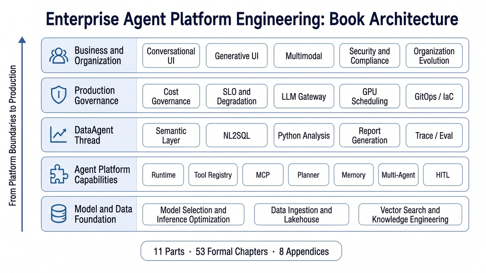

# Enterprise Agent Platform Engineering: From Data Intelligence Foundation to AI-Native Business Systems

[](https://github.com/datagallery-lab/enterprise_agent_platform_engineering)
[](LICENSE)

**English | [中文](README.md)**

## Introduction

An enterprise Agent platform has to connect models, data, knowledge, tools, runtime, evaluation, security, and organizational process into an operating system. A single tool call, chat interface, or orchestration framework covers only a short segment of that chain. Once the system moves toward production, teams also have to handle permission control, state, failure recovery, evidence, cost, audit, and continuous governance.

This book follows that production chain. The opening chapters define the boundary between Agents and enterprise-grade platforms. The next sections cover model inference, data infrastructure, vector retrieval, knowledge engineering, and the Agent capability layer. The middle of the book uses DataAgent as a running thread, connecting semantic layer engineering, NL2SQL, Python-based analysis, report generation, Trace, and Eval. Later chapters cover cost governance, deployment infrastructure, frontend interaction, multimodality, security, compliance, and organizational evolution.

After reading the book, readers should be able to judge whether an Agent system has the conditions for platformization, understand the interface between platform layers, and design an enterprise Agent platform around runtime boundaries, failure recovery, evaluation evidence, and governance responsibility.

The repository includes `mini-platform/`, a reference implementation for the interfaces, state machines, and runtime boundaries discussed in the book. It is reading companion code. Production systems still need their own permission model, deployment model, audit process, and operations design.

## Book architecture

The book follows the construction order of an enterprise Agent platform: platform boundaries first; then model, data, knowledge, and tool foundations; then Agent capabilities, DataAgent, evaluation governance, deployment infrastructure, business interaction, security, compliance, and organizational evolution.



## Table of contents

```text
11 parts, 53 formal chapters + 8 appendices (A-H)
│
├── Part I   Overview and platform perspective (Ch. 1-4)
├── Part II  Models and inference (Ch. 5-9)
├── Part III Data infrastructure (Ch. 10-15)
├── Part IV  Vectors, retrieval, and knowledge engineering (Ch. 16-21)
├── Part V   Agent capabilities (Ch. 22-31)
├── Part VI  DataAgent deep dive (Ch. 32-37)
├── Part VII Observability, evaluation, and cost (Ch. 38-42)
├── Part VIII Deployment and infrastructure (Ch. 43-46)
├── Part IX  Frontend, interaction, and multimodality (Ch. 47-49)
├── Part X   Security, compliance, and organization (Ch. 50-53)
├── Part XI  Case methodology and case admission
└── Appendices A-H
```

## Highlights

### Enterprise deployment

The book starts from the constraints of real enterprise systems. Model integration, data boundaries, tool permissions, audit evidence, cost control, SLO, deployment model, and organizational responsibility are treated as one design space. Readers can follow how an Agent capability moves from demo to production, which platform capabilities must be added, and which decisions should be made during architecture design.

### DataAgent

DataAgent is the book's most business-facing thread. The related chapters focus on enterprise question-answering, metric explanation, business analysis, and data reporting. They cover semantic layer modeling, NL2SQL validation, Python analysis execution, report generation, EvidenceRef, Trace, Eval, and permission governance. Readers can use this thread to understand the product form of DataAgent and split it into platform interfaces and launch checks.

### Production deployment

Agent systems in production have to handle state, errors, and responsibility. The book explains state machines, idempotency, retries, timeouts, degradation, approval, audit, replay, evaluation, and cost control inside concrete chapters. Readers see more than a module list: they see how these mechanisms work before launch, during operation, after incidents, and across continuous improvement.

### Engineering implementation loop

The book emphasizes the loop between interfaces, state, and evidence. Runtime defines execution semantics, Tool Registry defines tool contracts, MCP connects external systems, Planner and Memory carry decision context, and HITL, Trace, and Eval provide risk control and quality feedback. The companion `mini-platform/` maps these ideas to Run state machines, schema validation, tool bridges, workflow configuration, and test examples.

### Security, compliance, and organizational governance

Enterprise Agent platforms eventually connect to permission systems, data systems, audit systems, and organizational process. The book discusses Guardrails, content safety, regulatory mapping, team responsibilities, platform roadmaps, and governance evidence in an engineering context. Readers can use these chapters to define platform responsibility boundaries, design approval and audit flows, and turn technical direction into an organization mechanism that can keep evolving.

## What readers will understand

- The boundary between enterprise Agent platforms, ordinary Agent applications, and Agent frameworks.
- The interface contract between model capabilities, structured output, tool invocation, and runtime.
- How data infrastructure, knowledge engineering, semantic layers, and DataAgent connect.
- Production boundaries for Planner, Memory, multi-agent collaboration, HITL, and protocol interoperability.
- How Trace, Eval, Benchmark, cache, rate limiting, degradation, and cost control work in practice.
- Engineering trade-offs in GPU scheduling, model deployment, LLM gateways, multi-tenancy, GitOps, and edge inference.
- How conversational UI, streaming output, Generative UI, Artifact, multimodal input, and voice Agents fit into business systems.
- How Guardrails, permissions, audit evidence, compliance mapping, team responsibilities, and platform roadmap fit together.

## Intended readers

- AI platform leaders, CTOs, and technical leads
- Enterprise architects, platform architects, and data architects
- Data intelligence engineers, AI engineers, MLOps / LLMOps engineers
- Application developers moving Agent demos toward production systems
- Team leads responsible for AI system security, compliance, audit, and governance

## License

This project is licensed under the terms in [LICENSE](LICENSE).
