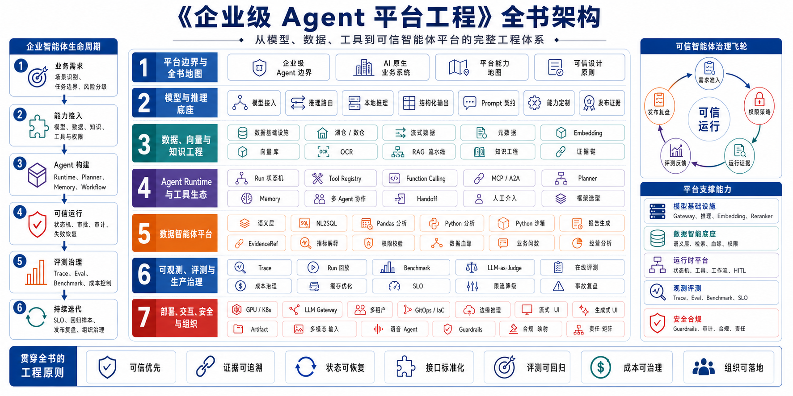

# 《企业级 Agent 平台工程：从数据智能底座到 AI 原生业务系统》

[](https://github.com/datagallery-lab/enterprise_agent_platform_engineering)
[](LICENSE)

**[English](README.md) | 中文**

**在线阅读链接：** [中文版本](https://datagallery-lab.github.io/enterprise_agent_platform_engineering/) | [English edition](https://datagallery-lab.github.io/enterprise_agent_platform_engineering/en/)

## 简介

企业级 Agent 系统一旦离开 Demo 阶段，难点会迅速扩展到模型、数据、知识、工具、运行时状态、评估、安全、部署和组织流程。聊天界面或编排框架可以启动第一步；生产系统还需要权限、失败恢复、审计证据、成本控制、SLO 和治理责任。

本书围绕这条生产链路展开。前四章建立 Agent 与企业级平台的边界；随后进入模型推理、数据基础设施、向量检索、知识工程和 Agent 能力链；中段以 DataAgent 为主线，串起语义层、NL2SQL、Python 分析、报告生成、Trace 和 Eval；后半部分讨论成本治理、部署基础设施、前端交互、多模态、安全合规和组织演进。

读者可以把本书当成一张平台工程地图：

- 🧭 **企业级 Agent 平台边界**：区分 Agent 应用、Agent 框架、Workflow、Copilot 和完整平台能力。
- 🧠 **模型与推理工程**：模型接入、推理路由、结构化输出、Prompt 契约、网关设计和版本化发布证据。
- 🧱 **面向 AI 系统的数据基础设施**：Lakehouse、Warehouse、流式数据、元数据、血缘、权限和数据契约。
- 🔍 **RAG 与知识流水线**：文档解析、OCR、语义切片、向量索引、重排、证据检索和检索失败诊断。
- 🧩 **工具调用与协议生态**：Function Calling、Tool Registry、MCP、A2A、工具权限、schema 校验和企业系统接入。
- 🤖 **Agent Runtime 与能力链**：Run 状态机、Planner、Memory、多 Agent 协作、Handoff、HITL、回放和恢复语义。
- 📊 **数据智能体平台**：语义层、NL2SQL、Text-to-Pandas / Text-to-Python、报告生成、EvidenceRef、Trace、Eval 和权限治理。
- 🧪 **评测与 Benchmark 工程**：离线 benchmark、LLM-as-Judge、在线评测、回归样本集、成本感知质量门禁和私有 leaderboard。
- ⚙️ **生产部署与基础设施**：LLM Gateway、多租户、GPU 调度、Kubernetes、GitOps、IaC、边缘推理和回滚设计。
- 🖥️ **前端交互与多模态**：流式 UI、Generative UI、Artifact、对话状态、多模态输入、语音 Agent 和异常路径处理。
- 🔒 **企业可信智能体**：Guardrails、权限边界、审计证据、人工审批、合规映射和责任矩阵，服务企业内部智能体落地。
- 🛠️ **配套 mini-platform 实现**：Run 状态、工具契约、schema 校验、workflow 配置和测试样例，可对照章节阅读。

读完本书，读者应能判断一个 Agent 系统是否具备平台化条件，理解各层能力之间的接口关系，并能围绕运行边界、失败恢复、评测证据和治理责任设计自己的企业级 Agent 平台。

## 全书架构

本书按企业级 Agent 平台的建设顺序组织：先确定平台边界，再补齐模型、数据、知识与工具底座，随后进入 Agent 能力链、DataAgent 主线、评估治理、部署基础设施和业务交互层，最后讨论安全合规与组织演进。



## 目录结构

```text
全书 11 个部分，53 个正式章节 + 8 个附录（A-H）
│
├── Part I   总论与平台观（第1-4章）
├── Part II  模型与推理（第5-9章）
├── Part III 数据基础设施（第10-15章）
├── Part IV  向量、检索与知识工程（第16-21章）
├── Part V   Agent 能力百科（第22-31章）
├── Part VI  DataAgent 主线深潜（第32-37章）
├── Part VII 可观测性、评估与成本（第38-42章）
├── Part VIII 部署与基础设施（第43-46章）
├── Part IX  前端、交互与多模态（第47-49章）
├── Part X   安全、合规与组织（第50-53章）
├── Part XI  案例方法论与案例准入
└── 附录 A-H
```

## 核心亮点

### 企业级 Agent 平台工程全景

本书把模型接入、数据边界、知识工程、工具权限、运行时、评测、安全、部署和组织责任放进同一张工程地图。企业内智能体的可信运行是贯穿全书的主线：权限要明确，动作要留证据，高风险步骤要有复核路径，平台团队要能在运行后解释每一次关键决策。读者可以沿着章节判断一个 Agent 能力进入生产环境前需要补齐哪些平台能力，哪些接口和责任应在架构阶段明确下来。

### 数据智能体平台

数据智能体平台是全书最贴近业务价值的主线。书中围绕企业问数、指标解释、经营分析和数据报告展开，覆盖语义层建模、NL2SQL 校验、Python 分析执行、报告生成、EvidenceRef、Trace、Eval 和权限治理。读者可以用这条主线理解数据智能体产品形态，也可以把它拆成平台接口、运行证据和上线检查项。

### 生产级运行机制

生产环境里的 Agent 系统必须处理状态、错误和责任。本书把 Run 状态机、幂等、重试、超时、降级、审批、审计、回放、评测、成本控制和 SLO 放进具体章节中说明。读者可以看到这些机制在上线前、运行中、事故复盘和持续优化中的作用。

### mini-platform 对照实现

配套 `mini-platform/` 把章节里的接口和状态机映射到代码结构中，包括 Run 状态、schema 校验、工具桥接、workflow 配置和测试样例。它是阅读辅助代码，生产环境仍需结合企业自己的权限、部署、审计和运维体系重新设计。

## 适合读者

- AI 平台负责人、CTO、技术负责人
- 企业架构师、平台架构师、数据架构师
- 数据智能工程师、AI 工程师、MLOps / LLMOps 工程师
- 正在把 Agent Demo 推向生产系统的应用开发者
- 关注 AI 系统安全、合规、审计和组织治理的团队负责人

## 许可证

请以仓库 [LICENSE](LICENSE) 文件为准。
