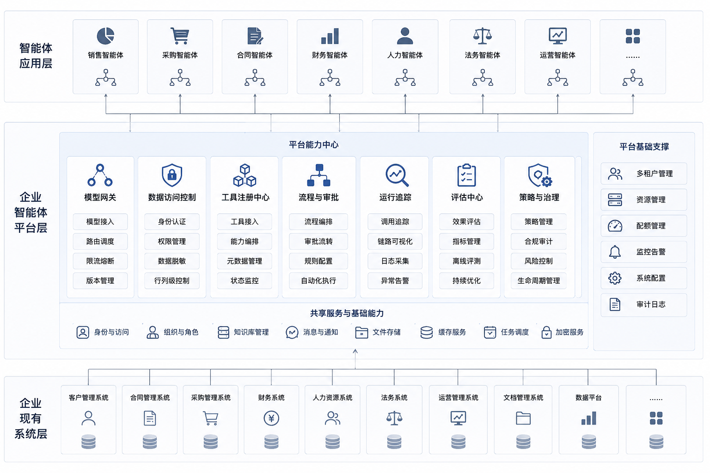
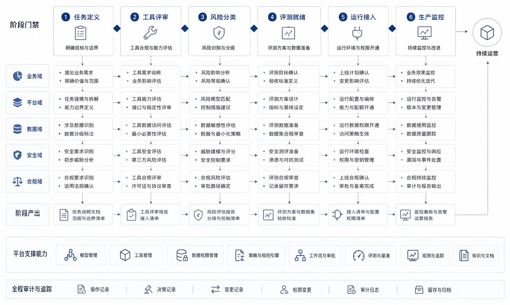

# 第2章 企业级 Agent 平台的边界

---

## 场景引入

第一个 Agent 通常由业务团队自己推进：找一个场景，接几个工具，做出能演示的闭环。第二个、第三个 Agent 出现后，问题会变成平台问题。报价 Agent、经营分析 Agent 和工单 Agent 可能都在调用模型、读取客户数据、写入业务系统，却没有统一的身份、权限、审计和成本口径。平台的价值不在“再做一个更大的 Agent”，而在把这些共性能力收回到同一条治理线上。图 2-1 展示的是这个边界：业务 Agent 可以不同，底层模型、数据、工具、流程和治理能力需要进入统一契约。

第一年做 Agent，很多企业会感觉进展很快。制造板块用一个报价 Agent 跑通了合同查询和报价草稿，零售板块用经营分析 Agent 生成周会材料，客服中心用工单 Agent 做摘要和分派建议，财务共享中心用票据 Agent 做发票识别和凭证草稿。每个项目都能展示价值，业务负责人也能说出节省了多少时间。第二年，问题开始从单点效果转向共同责任。安全团队问：哪些 Agent 可以读取客户明细，哪些只能看汇总？财务团队问：模型调用成本算到哪个部门，临时分析和正式报告用的是不是同一套指标？平台团队问：如果一个 Agent 调错工具，能不能按 run_id 找到当时的输入、模型版本、工具参数和审批状态？业务团队则问得更直接：为什么同样问“销售额”，不同 Agent 给出的口径不一样？

这些问题很难归因于某个应用写得不够好。多个应用同时运行后，系统问题一定会浮出水面。第一个 Agent 可以靠项目组经验撑住，第二个还能靠几位核心工程师记住约定，到了十几个 Agent 同时接入时，口头规则就会失效。工具是谁注册的，权限谁审批，日志写到哪里，失败后谁值班，模型升级影响哪些场景，这些都需要稳定的公共机制。平台由此出现。它不会把所有业务逻辑收走，也不会替业务团队做产品决策。平台要做的是把重复出现、影响权限和成本、关系到审计与恢复的能力沉淀下来，让每个业务 Agent 在相同的底线上运行。业务可以有不同节奏，底层的模型访问、工具契约、运行状态、trace 字段、评估样本和审批策略需要保持一致。

*图2-1：多 Agent 共享平台边界。来源：本书自绘。Alt text：上层是报价、经营分析、工单、票据等面向不同任务的业务 Agent，下层是模型、数据、工具、流程、治理五类共享能力，箭头表示所有业务 Agent 都通过统一平台层访问这些能力。*

业务 Agent 可以面向不同任务，但模型、数据、工具、流程和治理能力必须沉淀到统一平台层。读者在阅读本章时要避免一个误解：平台边界不是组织架构图，也不是采购清单。它是一套“哪些责任必须统一承担”的判断方法。后续章节会介绍模型网关、Tool Registry、Runtime、Trace、Eval、Guardrails 等组件，但这些组件只有在承担统一责任时才构成平台；如果只是各项目的局部实现，就仍然只是应用内部能力。

本章会把三个层次分开：Agent 应用解决某个具体业务任务，Agent 框架帮助工程师编排单个 Agent，Agent 平台负责让多个 Agent 共享基础能力并接受同一套约束。这个区分很重要。企业可以允许应用团队选不同框架，也可以允许不同业务域保留自己的策略；但只要涉及模型入口、工具注册、权限审批、运行记录和评估回放，就必须有统一契约。否则平台只是名字，企业仍然在运行一组互不相认的试点。平台也有反向边界。平台太薄，会退化成模型代理；平台太厚，又会把业务规则吞进公共层，最后每次改折扣、改工单优先级、改报表模板都要等平台排期。合理的平台只在必须统一的地方强约束，在业务变化快、试错频繁的地方留出插槽。本章讨论平台边界，就是为了让后续的组件设计有判断标准。

## 2.1 平台化能力与孤立 Agent 的差异

单个 Agent 从“回答”走向“执行”时，问题主要集中在任务边界、工具调用和责任归属上。视角再往上抬一层，如果一家多业务线企业先做报价助手，随后又做经营分析 Agent、工单 Agent、票据 Agent，新的矛盾会很快出现。直觉上，这应该是一件好事。企业找到了 AI 落地的多个切口，每个团队都在形成自己的成果。现实却常常相反。一家多业务线企业第一年做了四个试点。制造板块的报价 Agent 负责读合同、看库存、生成报价草稿；零售板块的经营分析 Agent 负责问数、找异常、写复盘；客服中心的工单 Agent 负责总结投诉、建议处置动作；财务共享中心的票据 Agent 负责识别发票、匹配订单、生成凭证草稿。

四个试点都证明了“单点可行”。困难出现在集团想把这些能力纳入统一治理之后。平台负责人很快会问一串问题：哪些 Agent 能访问客户身份信息？哪些工具会产生真实业务副作用？哪个模型用得最多、最贵、最容易出错？哪些 Agent 必须接审批，哪些可以自动执行？一个任务出错后，系统能否完整回放它的决策过程？如果这些问题没有统一答案，企业其实还没有进入平台阶段，只是拥有了一组彼此割裂的智能项目。单点 Agent 做出来以后，治理问题会集中到一处：怎样让一组 Agent 在同一套规则下长期运行。

## 2.2 应用、框架、平台：三层边界与平台化风险

Agent 领域里最常见的概念误用，就是把应用、框架、平台混在一起谈。它们相关，但并不处在同一层。

*表2-1：Agent 应用、框架与平台三层各自解决的问题。来源：本书整理。*

| 层级 | 它解决什么问题 | 典型样子 |
|---|---|---|
| Agent 应用 | 某个具体业务任务怎么完成 | 报价 Agent、DataAgent、工单 Agent |
| Agent 框架 | 单个 Agent 怎样编排状态、调用工具、组织记忆 | LangGraph、AutoGen、CrewAI、自研编排框架 |
| Agent 平台 | 多个 Agent 如何共享能力并被统一治理 | 模型网关、工具注册、Runtime、Trace、Eval、Policy |

框架关注的是“如何把一个 Agent 写出来”；平台关注的是“如何让很多 Agent 在企业里长期存在，同时避免彼此打架、重复造轮子和失去治理能力”。企业可以同时坚持两条原则：应用团队可以自由选择合适的框架，所有 Agent 也必须走统一的平台契约。这两句话并不冲突。平台不替代框架，它承接的是框架之上的企业复杂度。低代码工具、Agent Studio、可视化流程编辑器之类的产品，也需要放回这个三层结构里看。它们可能很好地解决了“搭一个 Agent 应用很快”的问题，但这不自动等于它们解决了平台问题。判断一个产品或内部系统是否进入平台层，重点不在控制台或拖拽能力，而在它是否回答得了三类问题：多个 Agent 的模型调用如何统一管理，工具能力如何统一定义、分级和版本化，权限、审批、trace、评估如何统一接入。如果这些问题还停留在“各项目自己处理”，系统仍处在应用集合阶段，还谈不上平台。

## 2.3 平台管理的五类共性问题：模型、数据、工具、流程、治理

企业级 Agent 平台看起来像一堆组件，实际管理的是五类共性问题。模型问题决定调用哪个模型、怎样路由、如何限流、如何归集成本；数据问题决定能看哪些数据、使用哪套口径、以什么身份访问、如何脱敏；工具问题决定有哪些能力、谁能调用、参数是否合法、动作是否会产生副作用；流程问题决定什么可以自动执行、什么必须等待人工、长任务失败后怎样恢复；治理问题决定如何评估、记录、回放、审计和持续改进。把平台理解成“五类共性问题的统一解法”，比理解成“八个模块的集合”更接近企业现实。企业通常不是先有架构图，再长出问题；更常见的路径是重复问题先出现，平台随后被逼出来。

一家多业务线企业前四个试点为什么很快碰到平台问题？因为它们虽然业务不同，但这五类问题几乎完全相同：都要调模型，都要读数据或文档，都要调用工具，都要判断风险，都要在出错后被解释和复盘。很多企业在这一点上会联想到自己曾经做过的数据中台、技术中台、能力中台。这个联想并不奇怪，但需要格外小心。数据平台关注的是数据资产的汇聚、治理和使用；应用平台关注的是研发效率和服务复用；而 Agent 平台关注的是以模型为决策核心的任务执行链路。它会借用数据平台和应用平台的资产，但自己承担的是另一类问题：模型决策、工具副作用、人工审批、任务回放、版本评估。图 2-2 将这些问题收束为模型、数据、工具、流程和治理五类能力，它们共同决定企业级 Agent 能否从单点试点走向长期运行。

*图2-2：平台管理的五类共性问题。来源：本书自绘。Alt text：模型、数据、工具、流程、治理五个并列区块，每个区块下列出对应的共性问题（如模型的路由与成本、工具的权限与副作用、治理的审批与回放），表示这些问题在多个业务 Agent 间重复出现、应由平台统一承接。*

## 2.4 平台边界划分：统一能力与业务自主权

接受“平台是在统一解决共性问题”以后，下一个实际问题就来了：哪些能力应该由平台负责，哪些能力仍应留在应用层？这里没有放之四海而皆准的规则。比较可靠的做法，是先问四个问题：

1. 这个能力会不会跨多个 Agent 重复使用？
2. 它会不会影响权限、成本、审计或评估？
3. 它是不是依赖某个业务域的特殊规则？
4. 平台化它，会不会降低后续接入成本？

这四个问题是划分平台责任的入口。表 2-2 用常见能力做例子，说明哪些能力应收归平台，哪些能力更适合留在业务侧。评审时不要只把它们当成形式化 checklist，而要看能力归属改变后，后续权限、成本、审计和运维责任会怎样变化。

*表2-2：常见能力更适合归平台还是留给业务及其原因。来源：本书整理。*

| 能力 | 更适合的平台归属 | 原因 |
|---|---|---|
| 模型调用入口 | 平台 | 所有 Agent 都会重复用，且涉及成本与限流 |
| 工具注册与风险等级 | 平台 | 直接影响副作用控制与审计 |
| 统一审批通道 | 平台 | 高风险动作不能每个应用各做一套 |
| 制造板块的报价折扣规则 | 应用 | 业务域专属逻辑过强 |
| 客服中心的工单优先级策略 | 应用 | 高度依赖具体部门业务 |
| 统一 trace 字段与 run_id 规范 | 平台 | 否则无法跨 Agent 回放 |
| 语义层底座 | 平台为主 | 指标和口径需要统一 |
| 语义层中的业务解释细节 | 平台与应用共同负责 | 平台定义框架，应用补充具体域知识 |

平台边界没有“越大越好”或“越薄越现代”的固定答案。平台太薄，会退化成模型网关；平台太厚，又会吞掉业务逻辑。成熟平台通常只在需要统一的地方强约束，在允许差异的地方提供插槽。还有一个常被低估的判断维度：变化速度。如果一类能力变化极快、试错频繁、又高度依赖具体业务反馈，过早平台化反而会拖慢业务创新；相反，如果一类能力变化相对慢，却需要稳定一致地被复用，越早平台化越好。

### 2.4.1 平台化建设的触发条件

并不是每家企业一做两个 Agent 就要成立平台团队。更务实的判断方式，是看企业是否已经出现以下三个信号。

*表2-3：提示该把能力收归平台的几个信号及其含义。来源：本书整理。*

| 信号 | 它说明了什么 |
|---|---|
| 重复建设 | 不同团队在重复封装模型、工具、RAG、审批、日志 |
| 治理断裂 | 企业无法统一回答权限、成本、trace、评估的问题 |
| 接入摩擦 | 每个新 Agent 都要重新搭一遍基础设施 |

只要这三个信号同时出现，平台化就已经从可选项变成基础条件；继续放任各团队各自建设，会拖垮后续落地效率。很多企业会有一个错觉：前两个试点做得很顺，第三个开始突然变慢。原因很直接：前两个项目还能靠“各做各的”推进；从第三个项目开始，基础设施和治理成本就会集中爆发。预算审批会追问模型账单归谁，安全团队会追问谁能访问什么数据，业务团队会追问为什么同样的问题不同 Agent 给出不同结论。平台就是在这种压力下被逼出来的。

## 2.5 平台采用：协作机制、准入流程与治理委员会

企业里谈平台，除了技术边界，还要谈责任边界。平台一旦存在，很多原来分散在各团队手里的决策权都会重新分配。进入平台阶段后，很多决策主体会发生变化。模型选择要进入平台策略，应用提出需求和约束；工具接入要先进入统一契约，业务补充领域细节；高风险动作由平台和安全共同定义审批规则，不能只靠业务团队口头约定；trace 要统一 run 语义和字段口径，避免各写各的日志；版本好坏要由平台与业务共同维护评测口径，而非靠演示印象判断。这组变化指向一个现实问题：平台不是一个“大家都喜欢的公共服务中心”。它会重新分配标准制定权、准入权和部分发布权。因此，平台建设既是技术工程，也是组织协商。平台团队常遇到的阻力不只来自技术。业务团队担心平台让接入变慢、限制灵活性、把快速试错拉进统一流程；安全与治理团队担心平台集中放大风险、给系统过大的决策权、制造新的审计黑箱。成熟的平台团队要同时回答这两边的问题：接入效率要保住，边界也要管住。

### 2.5.1 新 Agent 的平台准入流程

平台一旦成立，除了给已有项目复用，还要面对一个现实问题：新的业务团队如何接入？一个可执行的最小准入流程，至少包括五步。

*表2-4：Agent 准入评审各步骤要回答的问题。来源：本书整理。*

| 步骤 | 要回答的问题 |
|---|---|
| 任务定义 | 这个 Agent 到底负责什么，不负责什么？ |
| 工具审查 | 它要调用哪些工具，哪些只读，哪些有副作用？ |
| 风险分级 | 哪些动作可自动执行，哪些必须确认或审批？ |
| 评测准备 | 怎么判断它上线后确实比旧做法更好或至少不更差？ |
| 平台接入 | 是否纳入统一的 Runtime、Gateway、Trace、Policy？ |

这五步看起来是在加门槛，实际是在降低后续代价。平台需要准入流程，目的在于防止每个新 Agent 都重新制造技术债，而非让业务团队排队。从企业沟通的角度说，这五步也承担了翻译层作用。它把业务方口中的“我想做一个智能助手”，翻译成平台团队能接住的问题：任务边界是什么、工具清单是什么、风险等级是什么、如何验收、是否走统一运行链路。新 Agent 从任务定义到生产监控，需要经过工具审查、风险分级、评测准备和运行接入等共同门槛。

*图2-3：平台准入与治理机制。来源：本书自绘。Alt text：一条从左到右的准入流程，业务 Agent 按风险分级走不同路径，低风险走标准准入，中风险由平台与安全联合评审，高风险进入治理委员会，右侧汇入统一的上线与持续治理环节。*

### 2.5.2 平台治理委员会的边界

当企业只有一两个 Agent 试点时，很多决策可以靠项目组临时协商。但当一家多业务线企业同时推进经营分析、报价、客服质检、财务票据、知识助手等多个场景时，临时协商很快会失效。这时需要一个轻量但正式的治理机制。可以叫平台治理委员会，也可以叫 AI 平台评审会，名字不重要，职责是回答三类问题。治理机制通常要稳定处理三类决策。第一类是准入决策：哪些 Agent 可以进入生产，哪些只能留在试点，平台、业务、产品和安全都要参与。第二类是风险决策：哪些动作必须审批，哪些动作禁止自动执行，这需要平台、安全、法务和内控共同确定。第三类是路线决策：哪些能力沉到平台，哪些仍留在应用，需要平台、架构、数据和业务一起判断。

治理委员会的价值，是让决策口径稳定。否则，A 部门的 Agent 可以自动发客户邮件，B 部门却连内部通知都不允许；一个场景的 trace 要求很严格，另一个场景完全不记录；一个团队能接高风险工具，另一个团队被要求重做评审。这样的不一致会迅速消耗平台信用。治理机制如果变成沉重审批，业务团队会绕开平台。它应重点处理跨场景、跨部门、涉及责任边界的问题，不应干预每个提示词、每个页面、每个业务文案。治理委员会负责评审企业 Agent 的边界，不承担产品评审会或代码评审会的职责。

## 2.6 长期运营：反向边界、成本、目录与成熟度

定义平台边界时，很多团队只写平台“应该提供什么”。这还不够。成熟平台还要清楚说明自己“不应该做什么”。否则平台会不断膨胀，拖慢业务，还会背上不该背的责任。平台替业务团队定义业务目标，会造成责任错位。经营分析 Agent 到底服务周会、月会还是专项复盘，报价 Agent 到底服务大客户销售还是渠道销售，这些目标应由业务和产品定义。平台可以提供任务模板和评审方法，但不能替业务判断什么最重要。平台吞掉所有业务规则，也会让公共层被业务变化拖垮。折扣策略、客服质检细则、财务报销口径、法务条款偏好，都有强烈的业务域属性。平台可以要求这些规则以可治理的方式接入，但不应把它们全部写进平台核心。

同样，平台不宜把所有场景都拉进统一节奏。低风险探索场景需要快，高风险生产场景需要稳。平台应该提供分级路径，避免用同一套流程管理所有项目。平台也不宜替代旧有企业平台。数据平台、身份平台、审批平台、服务治理平台仍然有自己的职责。Agent 平台应该连接和增强它们，避免另起一套完全平行的系统。平台以治理之名消灭创新，业务方最终会选择绕开平台。早期 Agent 场景必然有试错。平台要管住生产边界，也要给沙盒、试点和低风险探索留下空间。

*表2-5：平台不该做的事、越界后果与更合理的边界。来源：本书整理。*

| 平台不该做的事 | 如果做了会怎样 | 更合理的边界 |
|---|---|---|
| 替业务定义目标 | 平台变成业务产品团队，责任错位 | 平台提供方法，业务定义目标 |
| 吞掉所有规则 | 平台发布被业务变化拖垮 | 平台管契约，应用管域规则 |
| 所有场景同一流程 | 低风险项目被拖慢，高风险项目又管不住 | 按风险分级管理 |
| 替代已有平台 | 架构重复，治理割裂 | 消费已有平台能力 |
| 消灭试错空间 | 业务绕开平台 | 建立沙盒与准入分层 |

因此，平台成熟度不取决于组件数量，而取决于它是否清楚自己该负责什么、不该负责什么。边界说不清的平台，很容易一边重复建设基础能力，一边把业务变化压进公共层。

### 2.6.1 平台运营：上线以后才进入长期管理

很多企业把平台建设理解成“交付一组能力”。Agent 平台更接近长期运营系统，而非一次性交付物。原因很直接：Agent 的运行环境会不断变化。模型版本会变，业务规则会变，工具接口会变，数据口径会变，用户使用方式也会变。一个今天表现稳定的 Agent，三个月后可能因为促销规则更新、指标口径调整或模型升级而表现下降。没有平台运营，系统会慢慢失真。平台运营至少包括五类工作。场景运营要持续跟踪哪些 Agent 被使用、哪些需求应该合并或下线；质量运营要更新评估样本、沉淀失败案例、分类用户反馈；成本运营要看模型调用、任务成本、部门预算和收益关系；风险运营要定期复查高风险工具、审批策略和敏感数据访问；生态运营要维护文档、模板、培训、样例和支持机制。

一家多业务线企业如果第一年做了四个 Agent，第二年做了二十个，那么平台运营会变得比平台建设更重要。因为从这个阶段开始，企业面对的问题从“有没有能力”变成“这么多能力是否仍然可信、可控、值得继续存在”。平台运营还会改变团队的日常工作方式。早期项目组关注的是把一个场景做出来，运营阶段关注的是哪些场景应该继续投入、哪些场景应该降级、哪些工具应该下线、哪些提示词和评测样本需要更新。一个报价 Agent 如果半年没有产生有效草稿，却持续消耗模型调用和人工复核资源，就不该因为“已经上线”而继续占用平台配额。一个经营分析 Agent 如果每周都被用户修改同一类口径说明，平台就要把这类反馈回写到语义层和模板，而非让用户反复纠正。

这也是平台目录的重要性。企业需要知道当前有哪些 Agent，分别服务哪些业务流程，调用哪些工具，属于什么风险等级，由谁负责运营，最近一次评估是什么时候。没有目录，平台团队只能被动响应事故；有了目录，才能主动发现重复建设、低使用率、高成本和高风险场景。平台目录要让每个 Agent 都有可追踪的责任归属和生命周期，不能只是展示一批 Agent 的静态页面。目录还要和准入、监控、成本视图连在一起。一个 Agent 新接入高风险工具时，目录中的风险等级要同步变化；一个 Agent 长期失败率升高时，目录应提示负责人复查；一个部门反复建设相似能力时，平台团队也能据此推动复用。没有这些运营动作，目录就会退化成静态清单。

### 2.6.2 供应商和外部产品的接入条件

大多数企业不会完全自研所有 Agent 能力。一家多业务线企业可能采购知识库产品、客服质检产品、模型网关产品，也可能引入行业解决方案。关键问题不在于能不能采购，而在于采购产品能不能纳入统一平台边界。外部产品接入 Agent 平台时，至少要看六件事：是否支持统一身份和权限，是否支持工具和数据访问边界，是否支持 trace 或导出关键运行记录，是否能纳入评估机制，是否能纳入成本视图，是否允许企业掌握关键配置和治理策略。这才是“混合路线”的含义。无论采购还是自研，都要进入同一套平台契约。供应商产品可以成为平台生态的一部分，但要避免变成治理孤岛。

## 2.7 平台运营模型与责任分工

平台边界写清以后，还要落到日常运营模型。很多企业在平台建设初期会把工作全部压给平台团队：模型接入找平台，工具接入找平台，评测报表找平台，出了事故也找平台。这样做短期看起来集中，长期会让平台团队变成所有业务 Agent 的交付和背锅中心。更合理的方式，是把平台运营拆成平台责任、业务责任、数据责任和安全责任。平台团队负责统一入口、运行证据、公共工具契约、评测框架和发布门禁；业务团队负责场景目标、验收样本、运营指标和用户反馈；数据团队负责口径、权限、质量和血缘；安全、法务和内控团队负责策略、审批和审计要求。

这种分工要写进 Agent 的生命周期。需求进入平台前，业务团队要说明任务目标和验收方式，平台团队负责判断是否已有可复用能力，数据团队确认数据和口径是否可用，安全团队判断风险等级。开发阶段，平台团队提供 Runtime、Gateway、Registry、Trace 和 Eval 接入方式，业务团队补充领域规则和样本，数据团队提供语义层和权限配置。上线阶段，平台检查运行证据、评测结果、审批策略和回滚方案，业务团队确认产物能否进入真实流程。运营阶段，平台看质量、成本和风险趋势，业务团队看使用率、产出质量和用户反馈，数据团队处理口径和质量变化，安全团队复查高风险动作。

责任分工还要有退出机制。一个 Agent 进入平台目录以后，并不意味着它永久存在。低使用率、持续高成本、长期无人维护、风险等级升高但无人接管，都是下线或降级信号。平台应支持把生产 Agent 降级成试点，把自动执行改成人工确认，把高风险工具临时冻结，把长期无效场景从目录中退役。没有退出机制的平台，会不断积累历史包袱。企业要把 Agent 当成需要运营的能力，而不是一次上线后就固定不变的功能。

## 2.8 平台边界的落地判断

企业级 Agent 平台的边界不能只靠组织架构划分。更可靠的判断方式，是看某项能力是否需要跨业务复用，是否承载风险，是否需要统一证据，是否会影响成本和稳定性。模型路由、工具登记、运行状态、权限策略、Trace、评测和发布门禁，都符合这些条件，应该进入平台层。业务流程、行业规则、验收样本和运营目标，则应由业务团队负责。平台过薄会导致每个 Agent 重复建设。业务团队会各自接模型、写工具、存日志、做审批，短期看很快，长期会在权限、成本和事故复盘上付出代价。平台过厚也有问题：如果平台团队试图接管所有业务逻辑，交付会变慢，业务差异也会被抹平。合适的边界，是平台管住不可妥协的工程责任，给业务留下可配置和可扩展空间。后续章节的分层都服务这个判断。模型层解决能力和成本，数据层解决可信上下文，Agent 能力层解决运行和动作，DataAgent 主线把这些能力串成任务，可观测和安全章节负责上线后的治理。读者可以把本章作为全书的边界检查表：每引入一项能力，都要问它应属于平台、业务应用，还是外部生态。

## 2.9 早期平台的采用节奏

早期企业 Agent 平台应先控制范围，再扩大能力。很多团队一开始就想统一所有模型、所有工具、所有业务流程，结果公共层还没有稳定，业务团队已经等不及绕开平台。更稳的节奏，是先把生产风险最高、跨场景复用最多的能力纳入统一边界：模型网关、工具登记、运行状态、Trace、基础评测、策略拦截和发布记录。业务应用仍然保留场景规则、交互方式和验收样本。这样平台先承担不可重复建设的工程责任，业务团队仍能根据自己的流程推进。

采用节奏还要和风险分级绑定。低风险知识问答可以走标准接入：统一身份、统一模型调用、引用记录和基本评测即可。中风险场景，例如报价草稿、经营分析和客服质检，需要补充工具审查、数据口径确认、人工确认节点和失败样本。高风险场景，例如自动发客户邮件、提交审批、修改主数据和财务处理，应进入正式评审，要求 Policy Engine、HITL、Trace、回滚和事故响应都可用。不同风险使用不同接入路径，平台才不会在低风险场景上过度消耗，也不会在高风险场景上留下缺口。

平台采用还需要一个清晰的迁移策略。已有 Agent 或供应商产品接入时，不必要求第一天就完全重构。可以先接统一身份和审计，再接模型网关和成本视图，然后接工具策略、评测和发布门禁。每一步迁移都应带来可见收益：权限更清楚、成本更可见、事故可回放、质量可比较、风险可拦截。若平台接入只增加流程负担，却没有改善运行证据，业务团队会把它看成审批系统而非基础设施。

退出和降级也属于采用节奏。一个 Agent 如果长期使用率低、人工退回率高、成本超过收益、负责人缺失或风险等级升高，就应从生产目录降级为试点，或者暂停高风险工具。平台要把这些规则写进运营机制，而不是等事故后才讨论。早期平台的成熟度，不在于覆盖多少场景，而在于每个进入平台的场景都有明确准入、证据、责任、降级和退出路径。

## 2.10 平台目录与年度复审

企业级 Agent 平台一旦进入多场景阶段，就需要平台目录来承接运营。目录应成为每个 Agent 的运行档案，而不是展示页。至少要记录业务 owner、平台 owner、数据 owner、风险等级、接入工具、使用模型、调用数据域、评测集版本、最近一次发布、最近一次复审、成本归属和退出条件。这样平台团队才能知道哪些 Agent 仍在被使用，哪些已经无人维护，哪些因为接入新工具而风险等级变化，哪些因为业务流程变化需要重新评估。

年度复审要看生命周期，而不只看功能是否仍能访问。一个知识助手如果长期没有用户、文档版本已经过期、owner 已经变更，就应退回试点或下线；一个 DataAgent 如果业务继续使用，但语义层版本、评测样本和权限策略已经变化，就需要重新跑准入检查；一个供应商 Agent 如果合同范围变化或日志无法导出，就应限制在低风险场景。目录把这些变化显性化，避免平台变成一堆历史项目的集合。

复审还要连接成本和责任。模型调用成本、工具执行成本、人工复核成本和事故处理成本，都应归到具体 Agent 和业务流程。若一个场景成本持续升高，却没有对应的业务采纳和质量提升，平台应推动降级或优化，而不是继续扩大使用范围。若一个高风险场景收益明显，但缺少 owner 或审批链不稳定，也不能因为业务价值高就放松准入。平台目录的价值在于让这些取舍有证据，而非靠会议印象。

早期可以先做轻量目录。每个进入生产的 Agent 都有一条记录，记录 owner、风险、工具、数据、评测、Trace 和退出条件；每季度更新一次使用、成本和事故情况；每年做一次正式复审。随着场景增多，目录再接入自动指标和平台控制台。目录建设不需要等完整平台完成，它本身就是平台边界落地的第一批治理资产。

## 2.11 平台采用节奏与业务自主权

平台化建设容易出现两种节奏失衡：平台团队一次性收走过多决策，业务团队觉得效率下降；业务团队继续各自搭建工具，平台只能事后补审计和成本治理。更稳定的采用节奏，是先把高风险、强共性的能力纳入平台，例如模型网关、工具注册、权限策略、Trace、Eval 和安全门禁；再把低风险、强业务差异的体验留给应用团队，例如页面布局、业务文案、局部流程配置和领域样本维护。这样平台提供统一边界，业务保留足够的迭代空间。

采用节奏还要和组织成熟度匹配。早期平台不必要求所有 Agent 都迁入统一框架，但应要求所有生产 Agent 遵守最低运行契约：模型从统一网关进入，工具通过 Registry 注册，高风险动作经过审批，Trace 能关联用户、工具和证据，安全样本进入发布门禁。满足这些契约后，业务团队可以继续保留自己的框架和界面。平台的价值体现在运行边界和复用能力，而不是把所有应用改造成同一套代码。

平台目录是采用节奏的管理工具。某个能力如果被多个业务重复实现，目录应推动其沉淀为共享能力；某个能力如果只有单一业务使用，且风险可控，可以继续留在应用侧；某个能力如果涉及敏感数据、写操作或外部披露，即使只有一个业务使用，也应进入平台治理。通过这种方式，平台边界会随着业务证据逐步扩展，而不会靠组织命令一次性划死。

## 2.12 平台边界的反向校验

平台边界还需要反向校验。不是所有能力都应该进入平台层。某些业务规则变化快、只服务一个团队、风险低、复用价值有限，放在应用侧更合适；某些能力涉及模型接入、工具权限、审计、评测、安全和成本，即使只有一个业务先使用，也应进入平台治理。判断边界时，要同时看复用性、风险、变更频率和责任归属。

反向校验可以避免平台过厚。平台如果把所有业务逻辑都收走，会拖慢业务迭代，也会让平台团队承担不该承担的业务判断；平台如果过薄，只提供模型网关，就无法治理工具、数据和运行状态。合适的边界应让平台承担共性风险和共性能力，让业务团队保留领域判断和体验创新。

每次新增平台能力，都应回答两个问题：它是否解决多个业务都会遇到的问题，它是否承接了单个业务无法独立承担的风险。如果答案都不成立，就先留在应用侧试验；如果答案成立，就进入平台目录、owner、SLO、评测和复审流程。这样平台边界会随着证据扩展，而不是随着组织偏好摆动。

## 2.13 平台边界的验收材料

平台边界要通过材料验收。一个能力是否应该进入平台，不看它是否被多个团队提到，而看它是否具备可复用契约、运行证据、owner、成本口径和退出方式。若一个工具只服务单一业务流程，规则变化快，且没有复用价值，就可以留在应用层；若多个业务场景都需要同类审批、Trace、评测或工具治理，就应进入平台层。

验收材料应记录能力来源、复用场景、依赖系统、数据和权限范围、SLO、成本归属、支持团队和下线条件。这样平台不会被试点需求无限拉宽，也不会把真正共性的治理能力留在各个应用里重复建设。

## 2.14 平台边界变更的运行证据

平台边界不会一次划定后长期不变。一个能力刚进入平台时，可能只是为了统一模型调用；随着业务接入工具、写操作、审批和外部用户，同一能力会逐步承担更多运行责任。边界变化需要证据支持。平台团队应保存能力进入平台前后的对比材料：业务团队原来如何接模型、如何记录工具调用、如何处理失败、如何统计成本；接入平台后，这些责任由哪些公共能力承接，哪些仍留在业务侧。没有这组证据，平台边界会变成组织口号，业务团队也难以理解为什么某些能力要迁入平台。

边界变更还要记录触发原因。常见触发包括多业务重复建设、工具权限风险上升、成本归因不清、审计要求变化、故障复盘缺少 Trace、供应商能力更替和安全策略调整。每次触发都应对应一个明确动作：沉淀共享工具、收口模型路由、补充评测门禁、增加人工审批、冻结高风险能力或退回应用侧试验。这样平台扩张和收缩都有依据，不会因为一次会议决定就改变工程责任。

早期平台可以把边界变更写入目录复审。每个季度检查哪些能力从应用侧进入平台，哪些能力继续留在业务侧，哪些平台能力因低使用率或责任不清需要退役。复审材料要能回答：这次边界变化减少了哪些重复建设，降低了哪些风险，增加了哪些平台维护成本，后续由谁负责。平台化的成熟度，体现在边界能随证据调整，而不是体现在平台一次性覆盖所有能力。

## 2.15 平台边界争议的复盘方法

平台建设进入多个业务团队后，边界争议会反复出现。业务团队可能认为平台管得太细，影响交付速度；平台团队可能认为业务绕过统一入口，带来安全和运维风险；安全、法务和财务团队又会从权限、数据出域和成本归集角度提出要求。第2章需要给读者一个判断方法：边界争议不能靠“谁拥有更多资源”解决，要回到任务链路、风险后果和复用价值。

复盘时可以先把争议拆成三类。第一类是执行责任争议，例如某个工具调用失败后由业务修还是平台修；第二类是治理责任争议，例如审批、审计和权限策略由谁维护；第三类是资产责任争议，例如 Prompt 模板、评测样本、Trace 和运行台账归谁管理。不同争议对应不同材料。执行责任看接口契约和运行日志，治理责任看合规要求和风险等级，资产责任看复用范围和迁移成本。

平台边界复盘还要避免把所有能力都收进平台。共享能力进入平台会降低重复建设，但也会引入排队、发布门禁和跨团队协调成本。业务侧保留自主空间，可以加快局部试验，但要接受平台对高风险动作、运行证据和公共资产的约束。早期平台可以先要求业务团队接入 Runtime、Registry、Trace 和 Policy，至于 UI、场景流程和低风险 Prompt 模板，可以保留在业务应用内迭代。

边界争议的结论应形成可执行动作。某个能力迁入平台，要写清接入入口、owner、SLO、迁移窗口和退役路径；某个能力留在业务侧，要写清平台保留的审计接口、评测样本和安全限制；某个能力暂时观察，要写清触发迁移的阈值。这样企业级 Agent 平台的边界不会停留在组织口号，而会随着运行证据逐步稳定。

## 2.16 平台边界的读者预期管理

读者进入本书时，容易把企业级 Agent 平台理解成“把常见 Agent 功能集合起来”。这会低估平台化的难度。平台边界首先是一组责任划分：哪些能力由平台统一提供，哪些能力留给业务团队配置，哪些动作必须进入审批和审计，哪些能力暂时只允许试点。边界清楚后，后续章节里的 Runtime、工具、Memory、DataAgent、观测、部署和治理才有共同语境。

本书后续不会把每个章节都写成独立功能介绍。模型推理章节服务于成本、延迟和路由；数据基础设施章节服务于可查、可证和可控；Agent 能力章节服务于任务执行；观测和评测章节服务于复盘和发布；安全组织章节服务于责任和风险。读者可以把平台边界当作全书主线：每新增一个能力，都要问它归谁维护、怎样验证、失败后怎样恢复、是否可以下线。

早期平台不需要覆盖所有能力，但需要保留扩展位置。一个团队可以先统一模型网关、工具注册、Trace 和评测样本，再逐步纳入 Memory、HITL、DataAgent 和多模态入口。边界管理的价值在于让平台建设有节奏，而不是让每个业务场景重新发明一套不兼容的 Agent 运行方式。

## 2.17 平台边界的组织确认

企业级 Agent 平台进入生产后，新增能力不能只看功能是否可用，还要看运行证据能否被不同角色复用。平台需要把能力目录、共享底座、业务 owner、安全门禁和运营证据记录成稳定字段，并和发布单、Trace、评测样本以及事故记录关联起来。这样一次线上问题发生后，团队可以沿着同一组事实判断影响范围、责任归属和修复顺序，而不是在模型日志、业务日志和人工说明之间来回拼接。

这类证据还要服务相邻章节的能力。它和第22章 Runtime、第50章安全和第53章组织治理相连：上游能力提供输入假设，下游能力使用执行结果，治理能力负责保存证据和复审结论。若这些材料没有统一编号和版本，章节里讨论的工程能力在生产中会被拆散。业务 owner 只能看到用户投诉，平台 owner 只能看到系统错误，安全或合规团队只能看到事后说明，最后很难判断问题到底来自数据、模型、工具、流程还是组织责任。

生产环境中常见的风险包括平台团队承接所有业务逻辑、业务团队绕开统一底座、安全团队只在上线前出现。这些问题在演示阶段不明显，因为演示通常只覆盖成功路径；上线后，用户会带来边界问题、重复请求、权限变化和长时间运行状态。平台团队应把失败样本纳入发布节奏，记录哪些样本需要阻断发布，哪些样本可以通过降级处理，哪些样本需要业务 owner 接受剩余风险。

平台边界应写入准入规则和运营节奏，让每类能力有 owner 和复审方式。这份记录不需要复杂，但要包含时间、版本、owner、样本、处置动作和下次复查条件。没有这些字段，复盘会停留在口头经验；有了这些字段，平台才能把一次问题转成后续发布、评测和培训材料。

早期平台可以从少量高风险场景开始。先选择调用量高、业务影响大或涉及敏感数据的路径，要求每次变更都留下证据包，再逐步推广到普通场景。这样章节里的能力不会停留在概念层，而会成为可运行、可解释、可退回的工程系统。

## 2.18 平台建设的阶段性边界

企业级 Agent 平台不需要第一天就覆盖所有能力。更稳妥的节奏是先选少量高价值场景，验证 Runtime、工具、Trace、Eval、人工复核和安全策略能共同运行；再把可复用能力抽到平台层；最后开放更多业务团队自助接入。每个阶段的边界不同，不能用同一套成熟度要求管理探索和生产。

探索阶段允许快速试错，但必须有数据和工具边界。生产阶段要求发布证据、owner、SLO、成本归因和事故路径。规模化阶段才适合强调模板、标准库、治理委员会和组合管理。若顺序反过来，平台会过早承担复杂流程；若长期停在探索阶段，业务会积累大量无法治理的 Agent。

早期读者应带着阶段意识看后续章节。不是每家公司都需要立刻实现所有模块，但每家公司都需要知道哪些能力缺失会阻止生产化。章节的目的，是帮助团队识别当前阶段的最小平台边界和下一步补齐顺序。

## 本章小结

企业的难点不止是写出一个 Agent，还包括管理一组 Agent。应用、框架、平台处在三层；混在一起讨论，后续建设目标会很快变形。平台管理模型、数据、工具、流程、治理五类共性问题。边界不能薄到只剩模型网关，也不能厚到吞掉业务逻辑。该统一的地方强约束，该允许差异的地方留空间。多 Agent 阶段会把标准、准入、责任和运营口径推到台前。下一章继续讨论“AI 原生业务系统”和“在旧系统里加 AI 功能”的差别。

## 参考文献

NIST. (2023). [*Artificial Intelligence Risk Management Framework (AI RMF 1.0)*](https://www.nist.gov/itl/ai-risk-management-framework).

OWASP. (n.d.). [*Top 10 for Large Language Model Applications*](https://owasp.org/www-project-top-10-for-large-language-model-applications/).

Model Context Protocol. (n.d.). [Specification and documentation](https://modelcontextprotocol.io/).

Kubernetes. (n.d.). [Documentation](https://kubernetes.io/docs/).
