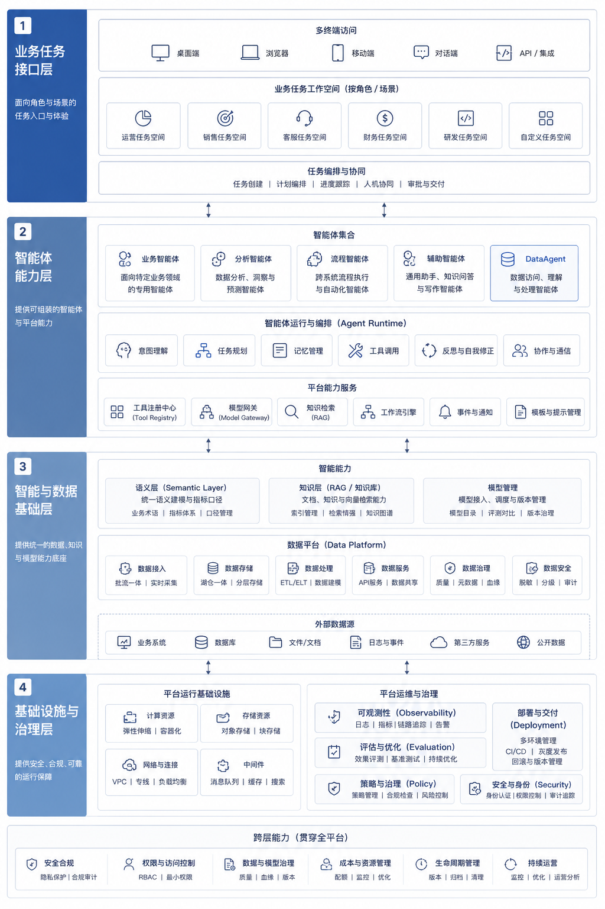
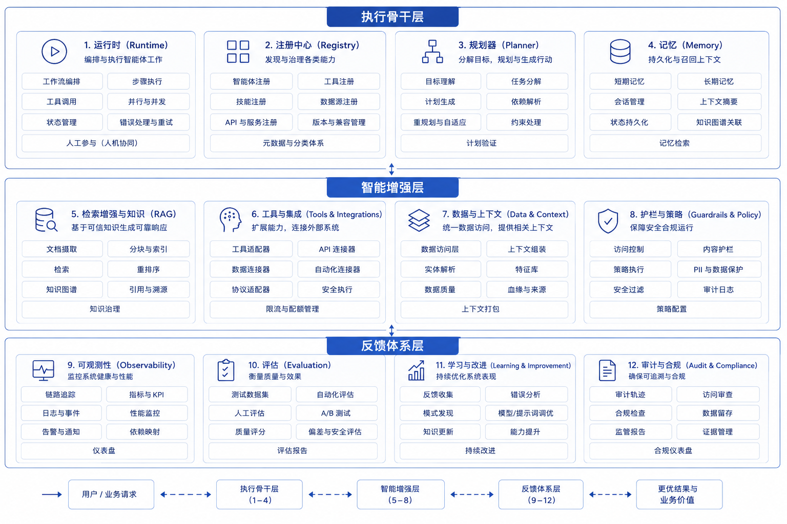
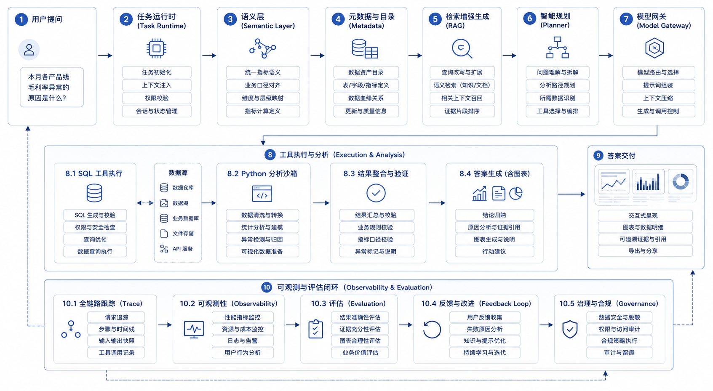

# 第4章 全书地图：平台参考架构与阅读路径

---

前三章分别讨论了 Agent 的边界、平台化的原因和 AI 原生业务系统。读到这里，概念已经不少：Runtime、Tool Registry、RAG、语义层、评估、网关、安全、组织分工。若没有一张地图，后续章节很容易变成组件堆叠，读者也很难判断一个问题应该放到哪一层解决。

企业建设 Agent 平台时，最常见的混乱在于名词之间缺少关系，并非缺少名词。业务负责人说“我们需要一个经营分析 Agent”，数据团队听成 NL2SQL，平台团队听成 Runtime 和工具调用，安全团队听成权限和审计，前端团队听成聊天工作台。大家都在谈 Agent，却在解决不同层的问题。没有一张共同地图，项目会在模型、数据、工具、界面和治理之间来回摆动。

本章的作用，是把前三章的概念判断收束成可使用的阅读地图。企业级 Agent 平台可分为四层：业务任务、运行能力、数据与知识底座、治理与运营底座。围绕这四层，后续章节会反复回到八个能力簇。DataAgent 贯穿全书，是因为它能同时暴露模型、数据、工具、评测、安全和前端问题，而不是因为问数场景时髦。一个经营指标异常问题，几乎会穿过全书所有关键能力。

这张地图也能帮助读者定位当前痛点。模型回答慢，不一定该换模型，可能是推理服务、上下文和网关策略问题；问数答不准，不一定是 NL2SQL 模型弱，可能是语义层、字段权限和评估集缺失；工具调用乱，不一定是框架问题，可能是 Registry、Policy 和 Trace 没建好；前端像聊天机器人，不一定是 UI 不够漂亮，可能是任务状态、证据和业务动作没有进入交互模型。

本章讨论参考架构、能力簇、平台分层、DataAgent 主线、阅读路径和建设路线。读者不需要在这一章记住所有模块名，而要建立一种判断方式：一个平台问题发生在哪一层，依赖哪些前置能力，后续应该看哪些章节。这样后面读到模型推理、数据契约、RAG、Runtime、前端、安全或组织章节时，都能把它们放回同一条任务执行链路里。

这张地图还可以作为团队评审工具。每当一个新 Agent 场景被提出，团队可以沿四层逐项询问：业务任务是否足够清楚，运行时是否支持暂停、恢复和人工确认，数据与知识是否有权限和口径，治理层是否有评估、审计和成本边界。若这些问题答不上来，项目可能仍适合试点，但不宜直接承诺生产化。地图的价值就在于把“能不能做”拆成“哪些前置条件还没满足”。

图 4-1 更接近本书的阅读坐标，而非产品架构蓝图。它把业务任务、Agent 能力、数据与知识、治理与基础设施放在同一张图里，帮助读者理解后续章节为什么按这个顺序展开。

*图4-1：企业级 Agent 平台四层参考架构。来源：本书自绘。Alt text：自上而下四层，业务任务层、Agent 能力层、数据与知识层、治理与基础设施层，每层标注核心职责，箭头表示上层任务依赖下层能力、下层为上层提供约束与支撑。*

从业务任务层、Agent 能力层、智能与数据层，到基础设施与治理层，平台能力需要围绕任务执行链路形成整体。

本章不要求读者记住所有模块名，而是建立一个阅读预期：后续章节不会按“哪个技术最热门”展开，而会按企业平台依赖关系展开。一个章节如果看似偏底层，例如模型路由、数据契约或 GPU 调度，它仍然服务于同一个目标：让 Agent 的任务执行链路可控、可复用、可评估。一个章节如果看似偏产品，例如对话 UI 或 Generative UI，也不能脱离证据、权限和运行状态单独理解。

---

## 4.1 总论地图的收束作用

前三章分别回答了三个问题：什么是 Agent，为什么企业会走向平台化，什么是 AI 原生业务系统。到这里，读者已经能判断一个系统是否属于 Agent，也能理解平台、框架和 AI 原生系统的区别。但如果没有一张全局地图，这些判断仍然容易散开。

企业级 Agent 平台不能按单点技术理解，也不能停留在组件列表。它同时牵涉模型、数据、知识、工具、流程、前端、评估、安全、部署和组织协同。读者如果只记住“Runtime”“语义层”“评估”这些关键词，却不知道它们之间的依赖关系，后面阅读就会变成碎片化知识积累。

一家多业务线企业的平台负责人需要回答“有哪些模块可以做”，也要回答更具体的问题：

- 第一个生产级 Agent 上线前，哪些底座能力必须先有？
- DataAgent 为什么不能简化为“NL2SQL + 图表”？
- Runtime、Tool Registry、审批、trace、评估之间是什么关系？
- 为什么本书先讲模型、数据、知识，再讲 Agent 能力和业务系统？
- 不同读者应该顺序读完，还是按角色跳读？

第四章把前三章的概念判断压缩成一张可执行的阅读地图。它不复述目录，而是说明后面每一章在整个平台中处于什么位置、解决哪类问题、和哪些章节存在前后依赖。

## 4.2 四层参考架构：从业务任务到治理底座

企业级 Agent 平台常见的画法问题，是一上来就罗列太多组件。总论更适合先用四层理解全局。

第一层是业务任务层。这里是用户感知价值的地方：DataAgent、报价 Agent、工单 Agent、经营分析工作台、销售任务工作台，以及后续各种 AI 原生业务系统。它回答“企业用 Agent 完成什么任务”。

第二层是 Agent 能力层。这里决定 Agent 如何被组织和运行：任务状态、工具调用、规划策略、长任务、人工介入、多 Agent 协作、协议与框架选型。它回答“Agent 如何把任务推进下去”。

第三层是智能与数据层。这里为 Agent 提供能力原料：模型推理、结构化输出、RAG、知识工程、语义层、湖仓、OLAP、元数据、血缘、指标口径。它回答“Agent 凭什么理解、判断和生成结果”。

第四层是基础设施与治理层。这里保证系统能长期运行：模型部署、网关、多租户、可观测性、评估、成本、限流、降级、安全、合规和组织机制。它回答“Agent 如何被稳定、可信、可控地运行”。

*表4-1：四层参考架构各层的核心问题与对应章节。来源：本书整理。*

| 层级 | 核心问题 | 主要对应章节 |
|---|---|---|
| 业务任务层 | 用 Agent 完成什么业务任务 | Part VI, Part XI |
| Agent 能力层 | Agent 如何规划、调用工具、执行长任务 | Part V |
| 智能与数据层 | Agent 使用什么模型、数据和知识 | Part II, III, IV |
| 基础设施与治理层 | 系统如何部署、观测、评估、安全运行 | Part VII, VIII, IX, X |

四层结构的作用，是帮助读者把问题放回正确位置。

没有这张层次图，企业很容易发生两种误判：把所有问题都下沉成模型问题，或者把所有问题都抬高成业务问题。明明是语义层缺失、工具契约混乱、审批边界不清，却被归咎于“模型不够强”；明明是 trace 不统一、评估样本缺失、运行状态不可恢复，却被说成“业务场景太复杂”。四层架构提供的，正是定位这两类问题的共同语言。

四层之间还有依赖顺序。业务任务层提出目标，但不能绕过运行能力直接调用模型；Agent 能力层推进任务，但必须从数据与知识层拿到可信上下文；数据与知识层提供证据，但要接受基础设施与治理层的权限、审计和成本约束。把依赖顺序讲清后，平台建设才不会变成并行堆功能。比如前端工作台可以先做原型，但没有 trace 和审批事件，它就无法承担高风险动作；DataAgent 可以先做 NL2SQL，但没有语义层和权限，它就不能直接面向多部门开放。

## 4.3 八个能力簇：平台骨架、智能放大与反馈系统

在四层之中，构成 Agent 平台骨架的，是一组会反复出现在后续章节里的能力簇。本书把它们收束成八个。

这八个能力簇各自回答不同问题。Runtime 处理任务如何被创建、推进、暂停、恢复和终止；Registry 处理工具、Agent、能力和版本如何统一管理；Planner 处理系统如何决定下一步，避免停留在文本生成；Memory 处理会话状态、长期偏好和任务上下文如何延续；RAG / Knowledge 处理文档、元数据和知识上下文如何进入 Agent；Observability 处理 trace、日志、指标和会话回放如何统一记录；Eval 处理如何判断版本变好还是变坏；Policy 处理权限、脱敏、审批和安全边界如何被执行。

这八个能力簇不能当成功能清单。它们对应企业平台需要长期维护的三类能力。

没有 Runtime，系统只能演示，不能可靠执行。没有 Registry，工具会越来越多、越来越乱。没有 Planner，模型会在错误路径上自由发挥。没有 Memory，长任务和多轮任务会迅速失真。没有 RAG 和知识工程，系统难以连接企业上下文。没有 Observability，出错后无法解释。没有 Eval，版本好坏只能靠感觉。没有 Policy，越权、泄漏和绕过审批迟早出现。

也可以换一种方式理解这八个能力簇：Runtime、Registry 和 Policy 构成执行骨架，让 Agent 能被统一运行和约束；Planner、Memory 和 RAG / Knowledge 构成智能放大器，让 Agent 能理解上下文并动态推进；Observability 和 Eval 构成反馈系统，让平台避免黑箱化和失控。

后面章节虽然会展开很多具体技术，但这组三分法可以作为定位工具：当前主题到底是在补执行骨架、智能放大器，还是反馈系统？

*图4-2：企业级 Agent 平台八个能力簇。来源：本书自绘。Alt text：八个能力簇分为执行骨架（Runtime、Registry、Policy）、智能放大器（Planner、Memory、RAG/Knowledge）和反馈系统（Observability、Eval）三组，连线表示各簇之间的调用与反馈关系。*

Runtime、Registry、Planner、Memory、RAG / Knowledge、Observability、Eval 与 Policy 分别承担执行骨架、智能放大器和反馈系统的职责。

## 4.4 DataAgent 主线：让全栈能力显影

本书不只讲 DataAgent，却把 DataAgent 作为主线场景。原因不在于问数最热门，而在于 DataAgent 几乎天然穿过企业级 Agent 平台的主要层级。

一个看似简单的问题，例如“上周华东区毛利率异常的原因是什么”，背后会同时触发多个系统问题：

*表4-2：DataAgent 为何在每一架构层都绕不过去。来源：本书整理。*

| 层级 | DataAgent 为什么绕不过去 |
|---|---|
| 模型层 | 需要理解问题、规划路径、生成 SQL、解释结果 |
| 数据层 | 需要语义层、指标口径、湖仓、OLAP 和数据质量 |
| 知识层 | 需要元数据、历史分析、业务术语、制度和案例 |
| Agent 层 | 需要 Runtime、工具调用、Planner、状态管理和人工介入 |
| 治理层 | 需要权限控制、trace、评估、成本和审计 |
| 前端层 | 需要图表、表格、引用、报告和任务工作台 |

DataAgent 适合作为主线场景。它不是唯一重要的业务场景，却能把企业级 Agent 平台的主要层级都暴露出来。

把这个任务拆开看，一家多业务线企业的一次 DataAgent 请求至少要经过七个检查点。任务创建阶段要确认用户身份、租户和问题范围；上下文加载阶段要拿到指标口径、历史分析和可访问数据；路径规划阶段要决定先查什么、后查什么、是否需要跨多个工具；工具执行阶段要约束 SQL、API、Python 等动作；结果解释阶段要区分事实、推断和建议；治理记录阶段要留下 trace、成本、审批和风险证据；结果交付阶段要给出图表、引用、结论和后续动作。

如果把 DataAgent 误解成“自然语言转 SQL”，平台建设从第一天就会跑偏。它同时连接数据智能、Agent 执行、AI 原生工作台和企业治理。

因此，Part VI 在全书中承担主线地位。它把前面的模型、数据、知识、Agent 能力，以及后面的评估、安全、前端拉到同一个综合场景中，不能把它当成一个孤立案例。

*图4-3：DataAgent 端到端任务链路。来源：本书自绘。Alt text：一条从用户提问出发的横向链路，依次经过意图理解、语义层编译、SQL 生成与执行、结果解释与可视化，每个环节标出所依赖的平台能力簇，末端汇出带证据的业务结论。*

一个经营指标异常问题会同时穿过任务运行时、语义层、元数据、RAG、Planner、模型网关、SQL / Python 工具、trace、评估和结果交付。

## 4.5 全书组织顺序：按平台依赖关系展开

很多 Agent 书会从聊天界面、提示词或工具调用开始讲。这种顺序容易上手，但一旦进入企业落地，就会遇到一个问题：前端体验跑得很快，底层语义、评估、权限、运行时和审计却都没有准备好。

本书的组织顺序，按企业级平台逐步形成的依赖关系安排。

先讲模型与推理，因为没有基础推理、结构化输出、模型路由和推理优化，后面的 Agent 决策无从谈起。

再讲数据基础设施和知识工程，因为企业 Agent 的差异，往往不来自模型本身，而来自它能否安全地连接正确数据、正确口径和正确知识。

接着进入 Agent 基础能力，因为有了模型、数据和知识之后，才有必要讨论 Runtime、Tool Registry、MCP、Planner、Memory、HITL、多 Agent 与框架选型。

随后进入 DataAgent 主线，把前面的底座能力放进一个真实业务场景中检验。

之后进入观测、评估、成本、部署、前端、安全、合规和组织。这些能力决定平台能否长期运行，避免系统停在一次演示上。

*表4-3：全书各部分在依赖链中的位置及如此排序的原因。来源：本书整理。*

| 书中部分 | 为什么放在这里 |
|---|---|
| Part II 模型与推理层 | 建立模型能力与结构化输出基础 |
| Part III 数据基础设施层 | 建立可访问、可信、可治理的数据底座 |
| Part IV 向量、检索与知识工程 | 让 Agent 能连接企业非结构化知识 |
| Part V Agent 基础能力 | 建立任务执行、工具调用和协作机制 |
| Part VI DataAgent 主线深潜 | 用一个综合场景拉通全栈能力 |
| Part VII-X 生产化与治理 | 补齐观测、评估、成本、部署、安全和组织机制 |
| Part XI 案例集 | 把平台能力迁移到更多业务 Agent |

这个顺序来自工程依赖。读者可以跳读，但要保留对上下游依赖的判断。

第四章除了给技术地图，还要给阅读地图。不同角色不需要用完全相同的方式读这本书。

平台负责人和 CTO 可以先抓平台边界、年度路线、成本、治理和组织协同，重点看第1章、第2章、第4章以及 Part VII 到 Part X。架构师更适合把四层架构、八个能力簇和章节依赖关系读通，再进入 Runtime、Tool Registry、RAG、评估和部署章节。数据智能工程师应优先关注语义层、RAG、DataAgent、NL2SQL 和评估体系；AI 应用开发者则应从 Runtime、工具接入、任务工作台和结果交付开始。安全与合规负责人不必先读所有实现细节，但要抓住权限边界、审批、trace、评估、Guardrails 和法规控制矩阵。

团队共读 Part I 时，可以先用第1章和第2章统一概念，确认团队说的 Agent、平台、框架、Workflow 是否指同一件事；再用第3章讨论哪些业务系统值得 AI 原生化，哪些场景只需要在旧系统上增加一个对话入口；最后用第4章把这些判断映射到团队路线图。这样的共读结果更接近一套后续建设时可以反复引用的共同语言。

共读之后，团队最好把现有项目标到这张地图上。哪些项目只有业务任务和前端入口，缺少运行能力；哪些项目有模型和 RAG，却没有评估和权限；哪些项目已经接入工具，但工具注册、审批和审计还散在各处。把项目放到地图上，能避免“每个团队都觉得自己在做平台”的错觉，也能帮助管理者判断哪些能力应由平台团队统一建设，哪些仍应留在业务应用里。

读者已经有实际项目时，也可以按当前痛点跳读。Agent 效果不稳定时，应优先看 Runtime、Planner、Trace 和 Eval，同时检查 prompt 是否承担了过多系统责任；问数经常答不准时，应回到语义层、Schema Linking、NL2SQL 和 DataAgent 评测；工具越来越多、风险难控时，应先看 Tool Registry、Policy、审批和成本治理；平台路线说不清时，应回到 Part I、成本、安全和组织路线；前端像聊天机器人而不像工作台时，应把第3章的 AI 原生业务系统、第47章的对话 UI 和第48章的 Generative UI 连起来看。

这张阅读地图让本书更接近工作手册。读者不必只能从第一页顺序读完，也可以按问题定位章节。

## 4.6 一年建设路线：从首个试点到平台化复制

如果一家多业务线企业准备用一年时间把企业级 Agent 平台从 0 做到可服务多条业务线，比较合理的节奏是围绕真实场景逐步沉淀共性能力，避免一开始就建设“大而全平台”。

*表4-4：一年建设路线各季度的技术、治理与组织重点。来源：本书整理。*

| 阶段 | 技术重点 | 治理重点 | 组织重点 |
|---|---|---|---|
| 第一季度 | Runtime、模型入口、工具注册、基础 trace、首个试点 | 工具风险等级、最小审批准则 | 明确平台团队边界和业务试点负责人 |
| 第二季度 | 评估、成本归集、审批接入、基础管理界面 | 评测样本模板、上线准入标准 | 建立场景共创和复盘机制 |
| 第三季度 | 语义层、RAG、更多工具接入、第二业务线复制 | 统一数据口径、权限和 trace 规范 | 推动业务团队按模板接入 |
| 第四季度 | 灰度、降级、SLO、供应商接入、平台目录 | 事故复盘、版本治理、合规检查 | 建立平台运营节奏和年度路线 |

这张路线图的重点不在季度数字，而在顺序：先把执行链路站稳，再做规模化和组织化。

每个阶段都应该沉淀一种可复用的公共资产。第一季度的资产是统一任务状态模型和工具风险等级：前者决定 Runtime、Trace、审批和恢复能否说同一种语言，后者决定新工具接入时是否能快速判断风险。第二季度要把评测样本模板和上线准入清单固定下来，让后续场景不再从“怎么证明可上线”重新讨论。第三季度的重点是语义层规范、数据权限规范和知识接入规范，因为复制到第二条业务线时，最大的摩擦通常来自指标口径、字段权限、文档边界和责任主体。第四季度再沉淀平台目录、复盘模板、成本与质量运营报表，把平台从项目交付转成持续运营。

这些公共资产看起来不像功能，却决定平台能不能复用。没有任务状态模型，每个 Agent 都会发明自己的“运行中”“等待审批”“失败重试”；没有评测模板，每次上线都只能靠现场演示；没有语义层和权限规范，DataAgent 一旦跨部门就会被口径和授权问题卡住；没有复盘和运营报表，平台团队只能证明自己“做了很多事”，很难证明平台质量是否变好、单位调用成本是否下降、业务线是否真正复用能力。

路线图复盘时也要看这些资产有没有被第二个场景使用。第一个场景写出的工具注册规范，如果第二个场景仍然手写工具调用，说明规范没有真正成立；第一个场景沉淀的评测模板，如果第三个场景无法复用，说明样例结构过于定制。平台化的信号在于后续场景接入时少走了哪些重复步骤，而不在文档数量增加。

这也是全书采用 DataAgent 主线的原因。它提供一个可反复验证的平台样本，并不把所有章节都拉向问数：模型层、数据层、知识层、Agent 层、前端层和治理层都会在这个样本里暴露缺口。读者读完任何一部分，都可以回到 DataAgent 问一句：这个能力怎样让一次经营分析更可信、更可控、更容易复盘。

很多平台路线图失败，原因不一定是技术目标写错，而是只写技术目标，不写治理目标和组织目标。只有技术目标，平台会“建出来但用不好”；只有治理目标，平台会“规矩很多但没人愿意接”；只有组织目标，平台会“讨论很多但缺少可运行底座”。三者要一起推进。

第一版路线图还要克制范围。企业很容易在年度规划里同时写上模型网关、RAG、DataAgent、多 Agent、自动化审批、评估平台和安全治理，最后每一项都只有原型。更稳的做法是选择一条能贯穿全链路的主线场景，把任务状态、工具注册、权限、trace、评估和发布流程先跑通；第二条业务线再验证这些能力是否可复用。平台能力是否成立，要看第二个场景能否少做重复工作，而不只看目录是否完整。

## 4.7 全书主线的阅读方式

本章的地图不应被读成模块清单，而应被读成一条生产链路。企业 Agent 从用户任务开始，经过模型能力、数据上下文、工具动作、运行状态、评测反馈、安全合规和组织运营，最终变成可持续维护的业务系统。任何一层缺失，系统都会在试点和生产之间断开。

读者可以按两种方式使用这张地图。第一种是从上往下读，先建立平台观，再逐层理解模型、数据、工具、运行时和治理能力。第二种是带着项目问题回查：如果当前项目卡在问数准确性，就重点读第33章到第39章；如果卡在工具执行和审批，就重点读第22章到第30章；如果卡在上线稳定性，就回到第38章到第52章。

全书后续章节会保留这种写法：先说明场景和边界，再进入架构与工程实现，最后回到运行证据和上线判断。这样安排是为了避免读者把 Agent 平台理解成一组产品功能。真正需要建设的，是一套能把模型输出约束为企业动作、把动作连接到证据、把证据连接到责任的工程体系。

## 本章小结

第四章给出全书的阅读地图。模型路由对应推理层和成本管理，语义层对应 DataAgent 的数据依赖，Human-in-the-loop 对应企业责任边界，评测、安全和组织机制决定系统能否长期运行。这张地图的用法，是先定位问题发生在哪一层，再判断缺的是执行骨架、智能放大器，还是反馈系统。

企业级 Agent 平台应先按四层定位，再看具体组件。八个能力簇提供后续章节的共同坐标。DataAgent 被选为主线，是因为它同时牵动模型、数据、工具、前端、评测和安全；其他业务场景也可以按同一套坐标拆解。后续章节从模型与推理层进入细节。模型并非平台中唯一的重心，但它是许多能力成立的起点，也最容易把早期试点推向真实成本、延迟和质量约束。

## 参考文献

Bass, L., Clements, P., & Kazman, R. (2021). *Software Architecture in Practice*. Addison-Wesley.

NIST. (2023). [*AI RMF 1.0*](https://www.nist.gov/itl/ai-risk-management-framework).

OpenTelemetry. (n.d.). [Documentation](https://opentelemetry.io/docs/).

Model Context Protocol. (n.d.). [Specification and documentation](https://modelcontextprotocol.io/).
