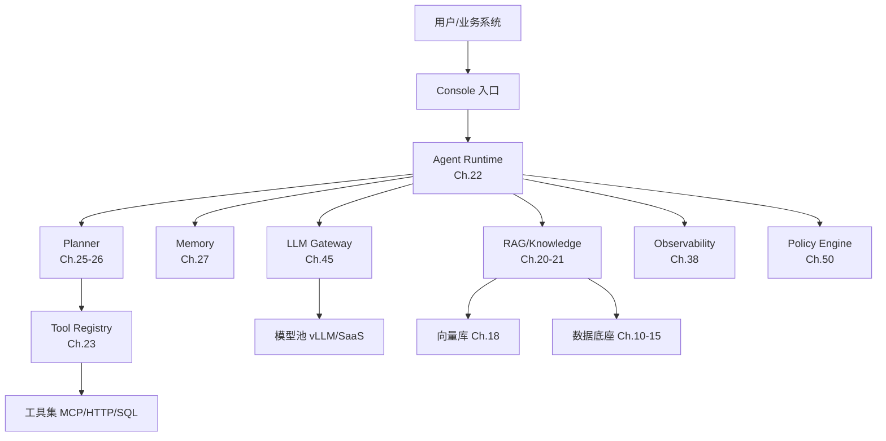
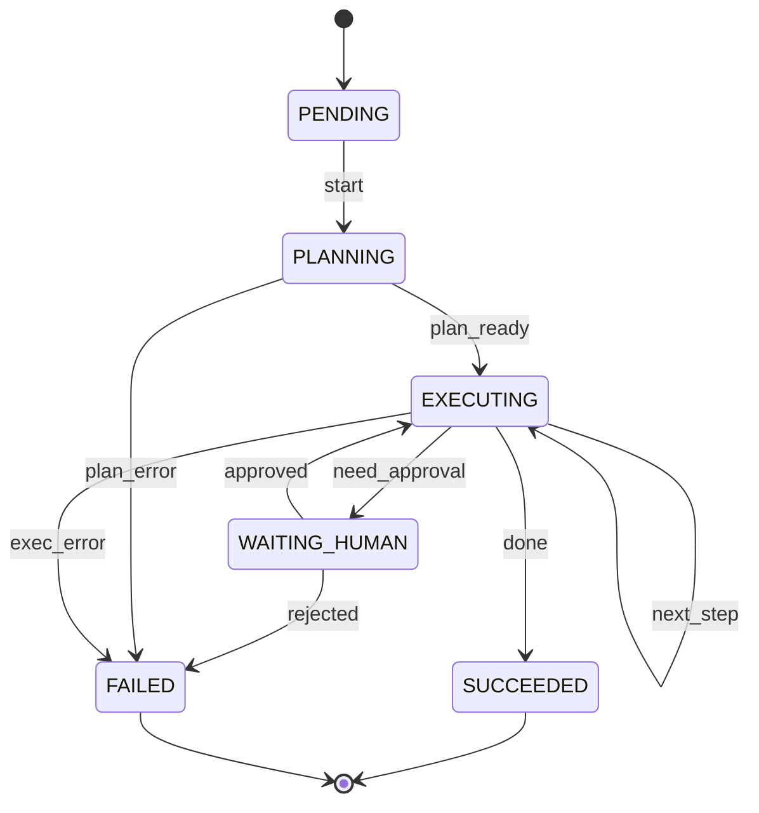

# Ch.01 Agent 的本质：从对话助手到任务执行系统

> **本章目标**：读者学完能区分 Agent、Copilot、Workflow、RAG 四类形态的边界，并能判断企业场景中应该用哪一类。
> **前置阅读**：无（本书第一章）
> **估计阅读**：L1 15 min / L1+L2 45 min / 全章 90 min
> **mini-platform 关联**：`core/runtime/`、`core/registry/`
> **实战项目**：`projects/01-min-runtime/`
> **按角色推荐阅读层**：CTO ⇒ L1 ｜ 架构师 ⇒ L1+L2 ｜ 工程师 ⇒ L1+L2+L3

---

## L1 概念  〔约 30% 篇幅〕

### 1.1 业务场景：为什么企业需要这个能力

「山岚集团」零售子板块的运营总监需要每天回答三类问题：

1. 昨天华东区销售下滑的主要 SKU 是什么？跌幅多少？
2. 上周售后工单里出现了哪些新的投诉模式？需要哪个团队跟进？
3. 下周营销活动的库存够吗？如果不够该补多少？

过去这三类问题分别落在 BI 报表、客服系统、ERP 系统里。运营总监要么自己点击十几个面板做拼接，要么向数据团队、客服团队、供应链团队各发一封邮件，等几小时甚至几天才能拿到答案。

如果有一个系统能够：

- 听懂自然语言提出的复合问题，
- 知道该去查哪个表、调用哪个 API、读取哪个文档，
- 在权限允许范围内自主执行多步操作，
- 把结果按高管能消费的形式（图表 + 简短结论 + 行动建议）交付，
- 并在遇到歧义或敏感操作时**主动暂停**等待人工确认，

那么运营总监的工作流可以从"被动等待数据团队"变成"边问边得"。这正是企业引入 Agent 的根本动机。

Agent 不是对话框，不是聊天机器人，也不是某个孤立的工具。它是一类**以 LLM 为决策内核、能够调用工具完成多步任务的程序实体**。本书的所有内容——从模型推理、数据底座、知识工程到平台治理——都在为"让 Agent 在企业场景中可靠、安全、可控地完成任务"这一目标服务。

### 1.2 核心概念与边界

业界对 Agent 的定义并不统一，常常和 Copilot、Workflow、RAG 等术语混用。这一节用一张对比表把边界讲清楚。

| 概念 | 决策来源 | 步骤数量 | 自主权 | 典型产品 |
|---|---|---|---|---|
| **RAG** | 检索 + LLM 生成 | 1 | 无（被动响应） | 知识助手 v1 |
| **Copilot** | LLM 提建议、用户确认 | 1-N（人主导） | 低（建议，不执行） | GitHub Copilot、Notion AI |
| **Workflow** | 开发者预先编排 | N（固定） | 无（按 DAG 走） | Airflow DAG、n8n |
| **Agent** | LLM 动态决定下一步 | N（动态） | 中到高（调用工具、自我循环） | Devin、Cursor Composer、DataAgent |

四类形态可以叠加。例如一个生产级 DataAgent 内部往往是：

- 用 **RAG** 检索相关表的元数据和样例 SQL；
- 用 **Agent** 做 ReAct 循环：生成 SQL → 执行 → 看结果 → 修正；
- 在关键节点（如执行 DDL）退化为 **Copilot**：让用户确认；
- 最终结果走预先编排的 **Workflow**：审批 → 发邮件 → 入库。

#### Agent 的三要素：感知 — 决策 — 行动

| 要素 | 内容 | 在 LLM 时代的实现 |
|---|---|---|
| **感知** | 接收用户请求、外部数据、工具返回 | 文本/图像/音频 token 化输入 LLM 上下文 |
| **决策** | 决定下一步是回答、调用工具、还是结束 | LLM 输出 Function Call 或终止信号 |
| **行动** | 执行工具调用、产生副作用 | Runtime 调度工具、维护状态、记录 trace |

Agent 与传统软件的本质区别是：**决策不在开发者写好的代码里，而在 LLM 推理的当下生成**。这带来两个后果——能力上限被模型能力决定，可靠性需要工程层补足。

#### 企业级 Agent 与消费级 Agent 的根本差异

消费级 Agent（ChatGPT、Claude、AutoGPT 等）的设计目标是"让单个用户在通用场景中完成任意任务"。企业级 Agent 的目标完全不同：

| 维度 | 消费级 Agent | 企业级 Agent |
|---|---|---|
| 数据 | 公开数据 + 用户上传 | 企业数据底座（湖仓 / 语义层 / 权限上下文） |
| 工具 | 浏览器、Python、几十个插件 | 数百个内部 API、数据库、工单系统 |
| 用户 | 单租户、单人 | 多租户、组织、角色分级 |
| 失败成本 | 重试即可 | 可能涉及数据泄漏、错误决策、合规事件 |
| 评估 | 用户满意度 | 任务成功率、可信度、审计可追溯 |
| 演进 | 模型升级即收益 | 模型 + 数据 + 流程 + 组织协同演进 |

本书所讲的"Agent 平台"指的是**承载多个企业级 Agent 共同运行**的基础设施，不是单个 Agent 的实现。这两者的区别在 Ch.02 会进一步展开。

### 1.3 常见误区

**误区 1：把 ChatBot 升级为 Agent**

很多团队把 Agent 当成 ChatBot 的迭代版——加个 Function Calling、接几个 API 就叫 Agent。这种思路忽略了三件事：(a) Agent 的状态管理远比 ChatBot 复杂，需要持久化、检查点、回放；(b) Agent 的工具调用涉及权限、审计、沙箱，不是直接发请求；(c) Agent 的失败模式（无限循环、错误工具、上下文爆炸）需要专门的治理机制。Ch.02 和 Ch.22 会展开。

**误区 2：以为框架就是平台**

LangGraph、AutoGen、Dify 是 Agent **框架**，解决"如何编排一个 Agent"的问题。企业级 Agent **平台**还要解决：Agent 的注册与发现、工具的版本治理、跨 Agent 的权限模型、可观测性、评估、成本治理、组织流程接入。框架是平台的组件之一，不是平台本身。Ch.31 会做完整的框架对标。

**误区 3：盲目追求"全自主"**

学术界与消费级产品热衷推销"完全自主"的 Agent，似乎人工介入越少越先进。企业场景恰恰相反：**在高风险节点引入人在回路（HITL）是设计目标，不是技术债**。下一个 SQL 操作是 DROP TABLE？财务凭证要不要入账？合同条款要不要签字？这些场景没有"完全自主"的合理性，只有"什么时候、以什么形式让人介入"的设计问题。Ch.30 专门讨论。

---

## L2 架构  〔约 40% 篇幅〕

### 2.1 在平台中的位置

Agent 在企业平台架构中处于"应用层"，但它依赖整个平台的支撑：



> 架构图源：`assets/mermaid/ch01-position.mmd`

可以看出：一个 Agent 调用 LLM 出决策、调用工具产生副作用、查 RAG 补充上下文、读写 Memory 维护状态、向 Observability 发 trace、被 Policy 拦截敏感操作。本章只关注 **Agent 作为整体**的运行轮廓，每个组件的内部设计留给后续章节。

### 2.2 组件划分与接口契约

一个 Agent 在运行时由六类组件协作：

| 组件 | 职责 | 输入 | 输出 | 失败模式 |
|---|---|---|---|---|
| Runtime | 调度循环、状态持久化、超时重试 | 任务定义、当前状态 | 下一次决策请求 | 状态丢失、循环不收敛 |
| Planner | 根据当前上下文产生下一步动作 | 历史 trace + 工具列表 | Function Call 或终止 | 工具选错、参数错误、幻觉 |
| Tool Registry | 注册、检索、鉴权工具 | 工具名 + 版本 | 工具 spec + handler | 版本错配、权限拒绝 |
| Memory | 短期上下文 + 长期偏好 | 写入：消息 / 事件；读取：检索 | 上下文片段 | 上下文超长、漂移 |
| Observability | 记录 trace、metrics、回放 | span 事件 | trace 存档 | 异步丢失、PII 泄漏 |
| Policy | 拦截敏感操作、脱敏字段 | 拟执行的工具调用 | 允许 / 拒绝 / 改写 | 误拦截、绕过 |

Agent 与 Runtime 之间的核心接口契约（语言无关）：

```
POST /agents/{agent_id}/run
Request:
  {
    "input": "<user query>",
    "context": { "user_id": "...", "tenant_id": "...", "scope": [...] }
  }
Response (SSE 流):
  event: state    data: { "state": "planning" }
  event: action   data: { "tool": "sql_executor", "args": {...} }
  event: result   data: { "tool": "sql_executor", "output": {...} }
  event: state    data: { "state": "succeeded", "answer": "..." }
Errors:
  { "code": "TOOL_NOT_FOUND" | "POLICY_DENIED" | "MODEL_TIMEOUT", "reason": "..." }
```

这个契约有几个关键设计：

- **流式输出**：Agent 运行可能持续数秒到数分钟，必须以 SSE 等流式协议返回中间状态，否则前端假死。
- **状态可观察**：每次状态切换都以事件形式发出，便于前端展示和 trace 记录。
- **错误可分类**：不同错误类型对应不同的恢复策略（重试 / 降级 / 人工介入），不能笼统地返回"失败"。

### 2.3 状态机与失败模式

Agent 在一次任务执行中的状态机如下：



> 状态机源：`assets/mermaid/ch01-state.mmd`

这个状态机的设计意图是：**任何一次中断都能从最近的状态恢复**。这意味着 Runtime 必须在每次状态切换时持久化（检查点），Ch.22 会展开实现细节。

典型失败模式：

| 失败模式 | 触发条件 | 恢复策略 |
|---|---|---|
| 模型超时 | LLM 服务延迟超阈值 | 重试 N 次后切换备用模型（Ch.45 网关） |
| 工具不可用 | 下游 API 5xx 或熔断 | 降级为告知用户 + 留下任务 ID 供人工跟进 |
| 工具参数错 | LLM 生成的参数未通过 schema 校验 | 把校验错误回灌给 LLM，重新生成（≤3 次） |
| 上下文超长 | 历史 trace 超出模型窗口 | Memory 压缩或滑窗（Ch.27） |
| 死循环 | 同一工具被相同参数连续调用 | Runtime 强制中断并标记 FAILED |
| 越权操作 | Policy 拦截敏感工具调用 | 转为 WAITING_HUMAN 等待审批（Ch.30） |

### 2.4 设计取舍

**取舍 1：动态规划（ReAct） vs 静态规划（Plan-and-Execute）**

| 方案 | 优势 | 代价 | 适用场景 | mini-platform 选择 |
|---|---|---|---|---|
| ReAct（边想边做） | 灵活、适应不确定环境 | 步数多、成本高、易循环 | 探索性任务、DataAgent 调试 | ⭐ 默认 |
| Plan-and-Execute（先规划后执行） | 步骤可预审计、成本可控 | 计划阶段错误影响全局、不灵活 | 高风险流程、合规审计 | 通过 `planner.mode` 配置切换 |

实践经验：**对调用成本敏感的场景用 Plan-and-Execute，对结果不可预测的场景用 ReAct**。混合模式（先 Plan 后 ReAct 修正）也常见，Ch.25 详述。

**取舍 2：单 Agent vs 多 Agent**

| 方案 | 优势 | 代价 | 适用场景 | mini-platform 选择 |
|---|---|---|---|---|
| 单 Agent | 简单、状态收敛快 | 工具多时上下文爆炸、角色混乱 | <20 个工具、单一职责 | ⭐ 默认起步 |
| 多 Agent（Planner/Executor/Reviewer） | 角色清晰、可独立优化 | 通信成本、协调复杂 | 跨部门流程、需要审核 | 通过 `agents/workflow_agent` 提供 |

多 Agent 不是"越多越好"。业界常见的反模式是把单 Agent 拆成五个角色，结果通信开销和错误传播让总成本翻倍而效果不变。Ch.28 会给出"什么时候该拆"的判据。

---

## L3 工程实现  〔约 30% 篇幅〕

### 3.1 mini-platform 中的实现路径

Ch.01 不引入完整 Runtime，仅用状态机演示 Agent 的执行轮廓。完整 Runtime 见 Ch.22。

- 状态机定义：`mini-platform/core/runtime/state_machine.py`
- 最小 Demo：`mini-platform/projects/01-min-runtime/run.py`

### 3.2 可运行代码

状态机骨架（节选自 `core/runtime/state_machine.py`）：

```python
class AgentState(str, Enum):
    PENDING = "pending"
    PLANNING = "planning"
    EXECUTING = "executing"
    WAITING_HUMAN = "waiting_human"
    SUCCEEDED = "succeeded"
    FAILED = "failed"


@dataclass
class AgentStateMachine:
    state: AgentState = AgentState.PENDING
    transitions: tuple[Transition, ...] = DEFAULT_TRANSITIONS
    history: list[tuple[AgentState, str]] = field(default_factory=list)

    def fire(self, label: str) -> AgentState:
        for t in self.transitions:
            if t.src == self.state and t.label == label:
                self.history.append((self.state, label))
                self.state = t.dst
                return self.state
        raise ValueError(f"Invalid transition '{label}' from '{self.state.value}'")
```

最小 Demo（`projects/01-min-runtime/run.py`）：

```python
from core.runtime import AgentStateMachine

sm = AgentStateMachine()
sm.fire("start")        # PENDING → PLANNING
sm.fire("plan_ready")   # PLANNING → EXECUTING
sm.fire("done")         # EXECUTING → SUCCEEDED
print(sm.state.value)   # "succeeded"
```

运行：

```bash
cd mini-platform/projects/01-min-runtime
python3 run.py
```

预期输出：

```
state=pending
state=planning
state=executing
state=succeeded
done=True
```

### 3.3 生产化 checklist

把这个状态机变成真正的 Agent，还需要补：

- [ ] **检查点持久化**：每次 `fire` 后写入存储（Redis/PostgreSQL），重启后能恢复
- [ ] **超时与重试**：每个状态有最大停留时间，超时自动转 FAILED 或重试
- [ ] **trace 集成**：每次状态切换发出 OTel span（Ch.38）
- [ ] **权限上下文**：状态机绑定用户/租户身份，工具调用时透传（Ch.50）
- [ ] **HITL 接口**：WAITING_HUMAN 状态需要前端配合（Ch.30）
- [ ] **成本核算**：每次 LLM 调用记录 token 用量（Ch.41）
- [ ] **指标暴露**：成功率、平均步数、平均延迟（Ch.42）

Ch.22 会把这些一一补齐。

### 3.4 踩坑记录

**踩坑 1：状态机被 LLM 输出绕过**

一个早期实现里，LLM 直接返回"任务完成"的文本，Runtime 解析后跳到 SUCCEEDED，但实际上工具调用还没返回。事后回放发现 LLM 偶尔会"幻觉式宣布成功"。修复：**SUCCEEDED 状态必须由 Runtime 在工具调用完成后判定，不接受 LLM 直接声明**。

**踩坑 2：循环检测漏掉了语义相同的调用**

最初的循环检测只匹配工具名加参数完全相同。结果 LLM 把 `SELECT * FROM users WHERE id=1` 改成 `SELECT * FROM users WHERE id = 1`（多个空格），就被认为是"新调用"，循环检测失效。修复：参数归一化（去空白、按 schema 字段排序）后再比对。

**踩坑 3：检查点恢复时上下文被截断**

Runtime 重启后恢复状态机，但忘记恢复 Memory 里的 LLM 历史消息，导致 Planner 失忆，重新规划时和原计划相违。修复：**检查点必须包含完整的可恢复上下文**，包括 Memory 引用、工具历史结果、用户原始输入。

---

## 本章小结

### 关键结论

1. **Agent 不是 ChatBot 升级版**，是一类以 LLM 为决策内核、能调用工具完成多步任务的程序实体。
2. **Agent / Copilot / Workflow / RAG 四类形态可叠加**，生产级系统通常混用，关键是知道每一段的形态归属。
3. **企业级 Agent 平台是"承载多个 Agent 的基础设施"**，与单 Agent 框架、消费级 Agent 在数据、工具、用户、失败成本五个维度都有根本差异。
4. **Agent 运行的状态机是平台可靠性的核心**，每一次状态切换都要可观察、可恢复、可审计。
5. **完全自主不是企业 Agent 的设计目标**，在高风险节点引入 HITL 是规范。

### 上线检查清单

- [ ] 你的"Agent"是真的需要 LLM 动态决策，还是一个固定 Workflow 就够？
- [ ] 失败时能否定位到具体状态？能否从该状态恢复？
- [ ] 工具调用能否被 Policy 拦截？敏感操作有没有 HITL 兜底？

### 延伸阅读

- 论文：Yao et al., *ReAct: Synergizing Reasoning and Acting in Language Models*, ICLR 2023
- 论文：Wang et al., *A Survey on Large Language Model based Autonomous Agents*, 2023
- 官方文档：[OpenAI Agents SDK](https://platform.openai.com/docs/guides/agents-sdk/)
- 对标产品：Devin、Cursor Composer、Claude Code、DataAgent（本书主线）
- 相关章节：[Ch.02 平台边界](ch02-agent.md)、[Ch.22 Agent Runtime](../part05-agent-capabilities/ch22-agent-runtime.md)、[Ch.30 HITL 与长任务](../part05-agent-capabilities/ch30-human-in-the-loop.md)
