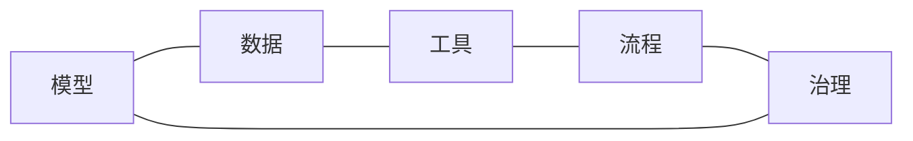
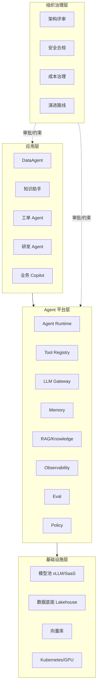
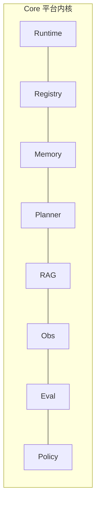

# Ch.02 企业级 Agent 平台的边界

> **本章目标**：读者学完能划清"Agent 应用"、"Agent 框架"与"Agent 平台"三者的边界，并能识别一个团队当前的建设阶段。
> **前置阅读**：[Ch.01 Agent 的本质](ch01-agent.md)
> **估计阅读**：L1 15 min / L1+L2 45 min / 全章 90 min
> **mini-platform 关联**：全仓库（本章是平台总览）
> **实战项目**：暂无（架构总览章）
> **按角色推荐阅读层**：CTO ⇒ L1 ｜ 架构师 ⇒ L1+L2 ｜ 工程师 ⇒ L1+L2

---

## L1 概念  〔约 30% 篇幅〕

### 1.1 业务场景：为什么需要"平台"而不是单个 Agent

「山岚集团」第一年的 AI 落地是这样的：

- 零售子板块基于 LangChain 做了一个 DataAgent，跑在自己的服务器上；
- 客服部门基于 Dify 做了一个工单助手，跑在 SaaS 上；
- 财务部门买了一个商业的发票识别 Agent，独立部署；
- 研发部门用 Cursor 写代码、用 Claude Code 改基础设施。

半年后矛盾出现了：

1. **数据权限混乱**：DataAgent 和工单助手都要访问客户数据库，但权限模型完全不同，安全团队无法统一审计。
2. **能力无法复用**：DataAgent 实现了一个 Schema Linking 模块，工单助手又重新写了一个，质量参差。
3. **模型成本失控**：四个系统各自直连 OpenAI/Anthropic/通义，月账单九千美元，没人能说清哪些调用是必要的。
4. **可观测性缺失**：客户投诉"系统给的金额错了"，回放无从下手——每个 Agent 自己定义 trace 格式。
5. **合规审计无法落地**：监管检查时无法回答"上个月有哪些 Agent 调用了客户身份证字段"。

这些不是单个 Agent 的问题，是**没有 Agent 平台**的问题。企业 AI 真正的护城河在平台，不在框架，更不在某一个 Agent。

### 1.2 核心概念与边界

#### Agent 应用 vs Agent 框架 vs Agent 平台

| 层级 | 解决什么问题 | 典型产品 | 由谁负责 |
|---|---|---|---|
| **Agent 应用** | 完成一类具体业务任务 | DataAgent、知识助手、工单 Agent | 业务团队 |
| **Agent 框架** | 提供编排、记忆、工具调用的编程抽象 | LangGraph、AutoGen、CrewAI | 应用开发者 |
| **Agent 平台** | 提供多 Agent 共存的基础设施 | 自建为主，DB-GPT/Dify/Coze 部分覆盖 | 平台团队 |

注意：**框架不是平台**。LangGraph 解决"一个 Agent 怎么编排状态转移"，但它不解决"Agent A 与 Agent B 怎么共享工具注册中心"、"如何统一计费"、"如何统一审计"。一个企业可能同时使用 LangGraph + AutoGen + 自研框架——它们都跑在同一个 Agent 平台上。

#### 平台的五要素

一个企业级 Agent 平台必须显式管理以下五类资源。任何缺失一项，都不能称之为平台：



| 要素 | 平台需要管什么 | 不管会怎样 |
|---|---|---|
| **模型** | 模型路由、配额、限流、降级、成本核算（Ch.45） | 多 Agent 各自直连，成本失控 |
| **数据** | 数据底座、语义层、权限上下文（Part III/VI） | 数据答案不一致、口径打架 |
| **工具** | Tool Registry、版本治理、权限模型（Ch.23） | 工具能力重复实现，质量参差 |
| **流程** | 任务编排、长任务、HITL、回放（Ch.30） | 关键流程没有审批、回放、回放回滚 |
| **治理** | 可观测性、评估、安全、合规（Part VII/X） | 出事无法溯源，监管无法应付 |

#### 平台 vs 应用 的边界

平台与应用的分层规则可以用一句话概括：**"一个能力如果多个 Agent 都需要，就属于平台；只服务单个 Agent 的，留在应用里。"**

| 能力 | 归属 | 原因 |
|---|---|---|
| LLM 调用 | 平台（Gateway） | 所有 Agent 都需要 |
| 工具注册 | 平台（Registry） | 多 Agent 共享 |
| 通用 RAG 检索 | 平台 | 知识库可被多 Agent 复用 |
| DataAgent 的 Schema Linking 算法 | 应用 | DataAgent 专属逻辑 |
| 工单 Agent 的 SLA 计算规则 | 应用 | 客服业务专属 |
| 可观测性 Trace 收集 | 平台 | 跨 Agent 强约束 |
| Prompt 模板 | 灰色地带 | 通用模板归平台，业务专属留应用 |

灰色地带是常态，重要的不是"绝对正确的归属"，而是**有明确归属决策机制**。这通常由架构委员会按季度评审。

### 1.3 常见误区

**误区 1：用框架代替平台**

"我们用了 Dify，所以有 Agent 平台了。" 错。Dify 提供应用编排和管理界面，但企业还需要：自有数据接入、企业 SSO、跨 Agent 审计、与现有 IAM/SOC 集成、私有部署的多租户隔离。这些 Dify 部分覆盖，但远不是全部。**框架/SaaS 是平台的组件，不是平台本身**。

**误区 2：先建框架再建平台**

很多团队的逻辑是"先把一个 Agent 跑起来，跑通了再抽象成平台"。结果第二个 Agent 上来时，发现要重写 70%。**应该反过来：从一开始就规划五要素的最小可用版本（MVP），把第一个 Agent 当作平台的第一个使用者**。Part V 的设计就是这个思路。

**误区 3：把平台当中间件**

平台不只是一组中间件（Gateway / Registry / Trace），它还包含：组织流程（如何评审一个新 Agent 上线）、人才模型（平台团队和业务团队怎么协作）、演进机制（季度路线图、半年技术评审）。**没有组织配套的平台，最终会被业务绕过**。Ch.53 专门讨论组织维度。

---

## L2 架构  〔约 40% 篇幅〕

### 2.1 平台与应用在企业架构中的位置



> 架构图源：`assets/mermaid/ch02-position.mmd`

四层关系：

- **应用层**消费平台能力，对外承担业务责任
- **平台层**抽象通用能力，对应用提供契约
- **基础设施层**承载平台与应用的运行
- **组织治理层**横切所有层，提供准入、评审、合规约束

这四层缺一不可。少了组织治理层，平台会被业务绕过；少了基础设施层，平台无法落地；少了应用层，平台没有用户。

### 2.2 平台的八大子系统



| 子系统 | 一句话职责 | 主要章节 |
|---|---|---|
| Runtime | 任务调度、状态机、检查点 | Ch.22 |
| Registry | 工具与 Agent 的注册、版本、权限 | Ch.23 |
| Memory | 短期/长期上下文管理 | Ch.27 |
| Planner | 编排模式（ReAct / Plan-and-Execute / Reflexion） | Ch.25-26 |
| RAG | 检索、重排、引用、知识图谱 | Ch.20-21 |
| Observability | Trace、metrics、回放 | Ch.38 |
| Eval | 离线评测、在线评估、回归对比 | Ch.39-40 |
| Policy | 权限、脱敏、敏感操作拦截、内容安全 | Ch.50-51 |

Ch.04 会用一张全景图把这八大子系统串起来。Part V 用 10 章把每个子系统讲透。

### 2.3 接口契约的分层

平台对应用提供三层 API：

| 层 | 调用方 | 协议 | 例子 |
|---|---|---|---|
| **L1 资源管理** | 平台 Console / SRE | RESTful | `POST /tools`、`GET /agents` |
| **L2 运行时** | Agent 应用 | gRPC / SSE | `Agent.run()`、`Tool.invoke()` |
| **L3 协议互通** | 跨平台 Agent | MCP / A2A | tools/list、resources/read |

L1 是"管控面"，L2 是"数据面"，L3 是"互联互通面"。三层各有职责，混用会导致接口臃肿。

例如：注册一个新工具是 L1（用 REST 调 `/tools` 接口）；Agent 调用这个工具是 L2（通过 Registry 拿到 handler 直接调用）；外部 MCP Server 暴露这个工具是 L3（通过 MCP 协议）。Ch.07 和 Ch.29 详述 MCP 与 A2A。

### 2.4 设计取舍

**取舍 1：自建平台 vs 用现成平台**

| 方案 | 优势 | 代价 | 适用场景 | mini-platform 选择 |
|---|---|---|---|---|
| 自建平台 | 完全可控、深度集成内部系统、可演进 | 投入大、需要平台团队 | 中大型企业、独特业务约束 | ⭐ 本书示例 |
| 用现成平台（Dify/Coze/DB-GPT） | 开箱即用、社区生态 | 受限于产品边界、私有部署成本高 | 中小企业、标准场景 | 对标参考，不替代 |
| 混合（自建框架 + 引入网关） | 渐进、可分阶段 | 集成成本、责任边界模糊 | 多数大企业实际路径 | 推荐第二阶段路径 |

**判断标准**：(1) 是否有 10+ 个 Agent？(2) 是否需要跨 Agent 的统一权限/审计？(3) 是否有 5 人以上的平台团队？三个都 yes 才考虑自建。

**取舍 2：API-first vs Console-first**

| 方案 | 优势 | 代价 | 适用场景 | mini-platform 选择 |
|---|---|---|---|---|
| API-first | 可被任何应用集成、易自动化 | 上手陡、需要文档 | 平台型公司、工程师文化强 | ⭐ 默认 |
| Console-first | 业务用户可自助 | 业务诉求会渗透 Console 设计 | 业务团队主导建设 | Console 在第二阶段补 |

mini-platform 走 API-first 路线：Console（Ch.47-48）作为参考实现，但所有能力都先有 API。

**取舍 3：多租户隔离的强度**

| 方案 | 优势 | 代价 | 适用场景 | mini-platform 选择 |
|---|---|---|---|---|
| 逻辑隔离（tenant_id 字段） | 资源利用率高 | 越权风险、数据库共享 | 内部多团队 | 默认 |
| 命名空间隔离（K8s ns） | 中等隔离、可定制配额 | 资源开销中等 | 跨业务部门 | 配置可选 |
| 物理隔离（独立集群） | 最强隔离、合规友好 | 成本高、运维复杂 | 金融/医疗等强合规 | 不在 mini-platform 范围 |

Ch.45 与 Ch.50 会详细讨论租户隔离的实现。

---

## L3 工程实现  〔约 30% 篇幅〕

### 3.1 mini-platform 中的实现路径

本章不引入具体模块。整个 `mini-platform/` 仓库就是这个平台的参考实现，目录结构对应八大子系统：

```
mini-platform/
├── core/
│   ├── runtime/        # Ch.22
│   ├── registry/       # Ch.23
│   ├── memory/         # Ch.27
│   ├── planner/        # Ch.25-26
│   ├── rag/            # Ch.20
│   ├── observability/  # Ch.38
│   ├── eval/           # Ch.39-40
│   ├── policy/         # Ch.50
│   ├── gateway/        # Ch.45
│   └── guardrails/     # Ch.51
├── infra/              # 数据基础设施适配（Part III）
├── tools/              # 内置工具实现
├── agents/             # 参考 Agent 实现
├── console/            # 管理后台
└── projects/           # 16 个实战项目
```

### 3.2 平台能力清单（v0.1 实现状态）

| 子系统 | v0.1 状态 | 计划完成版本 |
|---|---|---|
| Runtime 状态机 | ✓ 最小 stub | v0.2 完整 |
| Tool Registry | ✓ 最小 stub | v0.2 完整 |
| Gateway | 占位 | v0.4 |
| Memory | 占位 | v0.4 |
| Planner | 占位 | v0.4 |
| RAG | 占位 | v0.3 |
| Observability | 占位 | v0.6 |
| Eval | 占位 | v0.6 |
| Policy | 占位 | v0.7 |
| Guardrails | 占位 | v0.7 |

发布路线见仓库根目录 `PLAN.md` 第 6 节。

### 3.3 生产化 checklist

一个 Agent 平台是否"生产可用"，可用以下清单自检：

**模型维度**
- [ ] 是否有统一的 LLM 网关？所有 Agent 都通过它调用？
- [ ] 是否有模型路由策略（主备、按场景、按成本）？
- [ ] 是否有 token 用量统计和按租户/Agent 的成本归集？

**数据维度**
- [ ] Agent 访问的数据是否经过语义层而不是直查物理表？
- [ ] 数据权限是否随 Agent 调用链透传？
- [ ] 敏感字段是否在 Policy 层自动脱敏？

**工具维度**
- [ ] 工具是否集中注册？有版本号？有 schema 校验？
- [ ] 工具调用是否有沙箱（Python/SQL）？
- [ ] 工具是否被分级（公开/内部/敏感）？

**流程维度**
- [ ] 是否有 HITL 接入点？审批流是否对接企业现有系统？
- [ ] 长任务是否有检查点和回放？
- [ ] 失败任务能否人工接管？

**治理维度**
- [ ] 所有 Agent 调用是否都有 trace？trace 是否可回放？
- [ ] 是否有评测集？是否做版本对比？
- [ ] 是否能回答"上个月哪些 Agent 访问了字段 X"？

任何一项缺失都意味着平台尚未生产可用，无论 Agent 单体跑得多顺。

### 3.4 踩坑记录

**踩坑 1：先建框架后建平台**

一个团队先用 LangGraph 落地了三个 Agent，半年后想"统一一下"，发现三个 Agent 的状态格式、工具协议、trace 字段全不兼容。统一改造花了三个月，比一开始就规划平台多花一倍。教训：**第一个 Agent 落地时就要把平台的最小契约定下来**，哪怕 Runtime 只是个空函数。

**踩坑 2：平台 API 太薄，业务被迫绕过**

某团队的平台只暴露 `/agents/run`，业务想拿中间 trace 必须直接读数据库。结果业务方写了一堆直连脚本，绕过了平台的权限和审计。教训：**平台的"控制面"和"观察面"必须从一开始就齐备**，否则业务会找到绕路。

**踩坑 3：把组织治理当后置项**

一个企业的平台技术很完整，但没有"新 Agent 上线评审"流程。结果业务方上线了一个会自动发邮件的 Agent，第一周就因为 prompt injection 发了几百封垃圾邮件给客户。教训：**组织治理（评审 / 审批 / 回滚）必须和技术能力同步建设**，技术再好也填不上流程的坑。

---

## 本章小结

### 关键结论

1. **平台 ≠ 框架 ≠ 应用**。三者由不同团队负责、解决不同问题，混淆会导致建设方向错。
2. **平台的五要素**：模型、数据、工具、流程、治理，缺一不可。
3. **平台 vs 应用的边界**：多 Agent 需要的归平台，单 Agent 专属的留应用。
4. **八大子系统**：Runtime / Registry / Memory / Planner / RAG / Obs / Eval / Policy。Part V 用 10 章逐个展开。
5. **组织治理与技术能力同步建设**，否则平台会被业务绕过。

### 上线检查清单

- [ ] 能上线吗？平台五要素是否都有最小可用版本？
- [ ] 能扩展吗？新 Agent 接入是否有清晰的契约？
- [ ] 能治理吗？跨 Agent 的审计、权限、成本是否可观察？

### 延伸阅读

- 文章：Anthropic, *Building Effective Agents*, 2024
- 官方文档：[OpenAI Agents SDK](https://platform.openai.com/docs/guides/agents-sdk/)、[Anthropic MCP](https://modelcontextprotocol.io/)
- 对标产品：DB-GPT、Dify、Coze、Higress AI Gateway、LiteLLM
- 相关章节：[Ch.04 参考架构总览](ch04.md)、[Ch.31 框架横向对标](../part05-agent-capabilities/ch31.md)、[Ch.53 组织演进](../part10-security-org/ch53.md)
