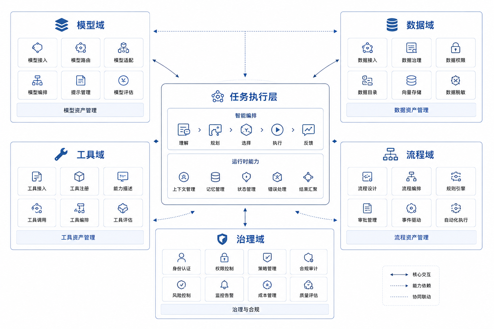

# Ch.02 企业级 Agent 平台的边界

> **本章目标**：帮助读者弄清楚企业真正要建设的“平台”到底是什么，它和 Agent 应用、Agent 框架、低代码工具之间分别解决什么问题，以及为什么企业一旦进入多 Agent 阶段，就必然会遇到平台边界问题。
>
> **适读人群**：平台负责人、架构师、产品负责人、AI 办公室、准备从单点试点走向平台化建设的团队。

*图 2-1 多 Agent 共享平台边界：业务 Agent 可以各自面向不同任务，但模型、数据、工具、流程和治理能力必须沉淀到统一平台层。*

---

## 为什么企业需要平台，而不是一组孤立 Agent

第一章讨论的是单个 Agent 从“回答”走向“执行”时会碰到什么问题。第二章要把视角再往上抬一层：如果山岚集团不只做一个报价助手，而是陆续做出报价 Agent、经营分析 Agent、工单 Agent、票据 Agent，会发生什么？

直觉上，这应该是一件好事。说明企业找到了 AI 落地的多个切口，每个团队都在形成自己的成果。

现实却常常相反。

山岚集团第一年做了四个试点：

- 制造板块的报价 Agent，负责读合同、看库存、生成报价草稿；
- 零售板块的经营分析 Agent，负责问数、找异常、写复盘；
- 客服中心的工单 Agent，负责总结投诉、建议处置动作；
- 财务共享中心的票据 Agent，负责识别发票、匹配订单、生成凭证草稿。

四个试点都证明了“单点可行”。真正的困难出现在集团想把这些能力纳入统一治理之后。

平台负责人很快会问一串问题：

- 哪些 Agent 能访问客户身份信息？
- 哪些工具会产生真实业务副作用？
- 哪个模型用得最多、最贵、最容易出错？
- 哪些 Agent 必须接审批，哪些可以自动执行？
- 如果一个任务出错了，能不能完整回放它的决策过程？

如果这些问题没有统一答案，企业其实还没有真正进入平台阶段，只是拥有了一组彼此割裂的智能项目。

这也是本章的核心立场：**企业的真正难点，从来不只是“能不能做出一个 Agent”，而是“能不能让一组 Agent 在同一套规则下长期运行”。**

## 应用、框架、平台：三层边界与常见误判

Agent 领域里最常见的概念误用，就是把应用、框架、平台混在一起谈。它们相关，但并不处在同一层。

| 层级 | 它解决什么问题 | 典型样子 |
|---|---|---|
| **Agent 应用** | 某个具体业务任务怎么完成 | 报价 Agent、DataAgent、工单 Agent |
| **Agent 框架** | 单个 Agent 怎样编排状态、调用工具、组织记忆 | LangGraph、AutoGen、CrewAI、自研编排框架 |
| **Agent 平台** | 多个 Agent 如何共享能力并被统一治理 | 模型网关、工具注册、Runtime、Trace、Eval、Policy |

这个区分非常重要。

框架关注的是“如何把一个 Agent 写出来”；平台关注的是“如何让很多 Agent 在企业里长期存在，而不彼此打架、不重复造轮子、不失去治理能力”。

一个企业完全可能同时成立这两句话：

1. “我们的应用团队可以自由选择合适的框架。”
2. “所有 Agent 都必须走统一的平台契约。”

这并不矛盾。平台不是为了替代框架，而是为了接住框架之上的企业复杂度。

低代码工具、Agent Studio、可视化流程编辑器之类的产品，也需要被放回这个三层结构里看。它们可能很好地解决了“搭一个 Agent 应用很快”的问题，但这并不自动等于它们解决了平台问题。

所以，判断一个东西是不是“平台”，不要看它有没有控制台，也不要看它能不能拖拽，而要看它有没有回答下面这些问题：

- 多个 Agent 的模型调用如何统一管理？
- 多个 Agent 的工具能力如何统一定义、分级、版本化？
- 多个 Agent 的权限、审批、trace、评估如何统一接入？

如果这些问题还停留在“各项目自己处理”，那就还谈不上平台。

## 平台管理的五类共性问题：模型、数据、工具、流程、治理

企业级 Agent 平台看起来像一堆组件，但从本质上说，它管理的是五类共性问题。

| 共性问题 | 平台必须回答什么 |
|---|---|
| **模型问题** | 调哪个模型、怎么路由、怎么限流、怎么归集成本 |
| **数据问题** | 看哪些数据、用哪套口径、以什么身份访问、如何脱敏 |
| **工具问题** | 有哪些能力、谁能调用、参数是否合法、会不会产生副作用 |
| **流程问题** | 什么可以自动执行、什么必须等待人工、如何恢复长任务 |
| **治理问题** | 如何评估、记录、回放、审计、持续改进 |

把平台理解成“五类共性问题的统一解法”，比把它理解成“八个模块的集合”更接近企业现实。因为企业不是先从架构图开始长出来的，而是先从问题开始长出来的。

山岚集团前四个试点为什么很快碰到平台问题？因为它们虽然业务不同，但这五类问题几乎完全相同：

- 都要调模型；
- 都要读数据或文档；
- 都要调用工具；
- 都要判断风险；
- 都要在出错后被解释和复盘。

也正因为如此，“平台边界”本质上不是技术洁癖，而是共性问题沉淀的结果。

很多企业在这一点上会联想到自己曾经做过的数据中台、技术中台、能力中台。这个联想并不奇怪，但需要格外小心。Agent 平台确实会和这些“平台化前辈”发生关系，却又不能被简单等同。

数据平台关注的是数据资产的汇聚、治理和使用；应用平台关注的是研发效率和服务复用；而 Agent 平台关注的是以模型为决策核心的任务执行链路。它会借用数据平台和应用平台的很多资产，但它自己承担的是另一类问题：模型决策、工具副作用、人工审批、任务回放、版本评估。也就是说，Agent 平台不是替代数据平台或中台，而是长在它们之上的一层新责任。

*图 2-2 平台管理的五类共性问题：模型、数据、工具、流程和治理共同决定企业级 Agent 能否从单点试点走向长期运行。*

## 平台边界如何划分：该统一什么，该留给业务什么

一旦接受“平台是在统一解决共性问题”，下一个实际问题就来了：哪些能力应该由平台负责，哪些能力仍应留在应用层？

这里没有一条放之四海而皆准的规则，但有一套非常实用的判断顺序。

先问四个问题：

1. 这个能力会不会跨多个 Agent 重复使用？
2. 它会不会影响权限、成本、审计或评估？
3. 它是不是依赖某个业务域的特殊规则？
4. 平台化它，会不会显著降低后续接入成本？

根据这四个问题，很多边界其实很清楚：

| 能力 | 更适合的平台归属 | 原因 |
|---|---|---|
| 模型调用入口 | 平台 | 所有 Agent 都会重复用，且涉及成本与限流 |
| 工具注册与风险等级 | 平台 | 直接影响副作用控制与审计 |
| 统一审批通道 | 平台 | 高风险动作不能每个应用各做一套 |
| 制造板块的报价折扣规则 | 应用 | 业务域专属逻辑过强 |
| 客服中心的工单优先级策略 | 应用 | 高度依赖具体部门业务 |
| 统一 trace 字段与 run_id 规范 | 平台 | 否则无法跨 Agent 回放 |
| 语义层底座 | 平台为主 | 因为指标和口径需要统一 |
| 语义层中的业务解释细节 | 平台与应用共同负责 | 平台定义框架，应用补充具体域知识 |

这说明平台边界并不是“平台越大越好”，也不是“平台越薄越现代”。

平台太薄，就会退化成模型网关；平台太厚，又会变成吞掉所有业务逻辑的怪兽。真正成熟的平台，往往只在那些“必须统一”的地方强约束，在那些“应当允许差异”的地方提供插槽。

这里还有一个常被低估的判断维度：**变化速度**。如果一类能力变化极快、试错频繁、又高度依赖具体业务反馈，那么过早平台化反而会拖慢业务创新；相反，如果一类能力变化相对慢，却需要稳定一致地被复用，那么越早平台化越好。很多企业平台之所以被抱怨“挡路”，并不是平台本身错了，而是把高变化业务逻辑也过早收进了平台。

**企业什么时候真的需要平台化。**

并不是每家企业一做两个 Agent 就必须成立平台团队。更务实的判断方式，是看企业是否已经出现以下三个信号：

| 信号 | 它说明了什么 |
|---|---|
| **重复建设** | 不同团队在重复封装模型、工具、RAG、审批、日志 |
| **治理断裂** | 企业无法统一回答权限、成本、trace、评估的问题 |
| **接入摩擦** | 每个新 Agent 都要重新搭一遍基础设施 |

只要这三个信号同时出现，平台化就不是“锦上添花”，而是“再不做就会拖垮后续落地效率”。

这也解释了为什么很多企业会有一个错觉：前两个试点做得很顺，第三个开始突然变慢。因为前两个项目还能靠“各做各的”推进，第三个开始，基础设施和治理成本就会集中爆发。

还有一个经常被忽略的现实：平台化不是因为技术团队喜欢抽象，而是因为企业已经开始承受“每个项目都各做一套”的管理成本。预算审批会开始追问模型账单归谁，安全团队会开始追问谁能访问什么数据，业务团队会开始追问为什么同样的问题不同 Agent 给出不同结论。平台就是在这种压力下被逼出来的。

**三种常见的平台幻觉。**

企业在平台建设早期，最容易陷入三种“看起来像平台，其实还不是”的状态。

第一种，是**网关幻觉**。团队搭了统一模型入口，于是觉得平台已经建立起来了。但如果工具契约、风险分级、trace、评估都还散在业务项目里，这个“平台”其实只是网关。

第二种，是**控制台幻觉**。有了一个漂亮的页面，用户能在上面创建 Agent、看调用记录，于是大家觉得平台问题被解决了。但如果这个页面背后没有统一的运行契约和治理契约，它仍然只是管理界面，不是平台能力。

第三种，是**框架幻觉**。所有应用团队都用同一个 Agent 框架，于是误以为平台已经统一。框架确实降低了应用层实现差异，但多 Agent 共治的问题并不会因此自动消失。

这三种幻觉之所以常见，是因为它们都解决了一个真实痛点，所以很容易被过度命名。但平台比这些都更重，也更慢，因为它要解决的是企业共性问题，而不是单点开发效率。

更进一步说，这三种幻觉之所以危险，不在于它们没价值，而在于它们容易制造一种“平台问题已经解决”的错觉。一旦组织在这个错觉上继续扩张 Agent 数量，后面补治理的代价会成倍增长。

## 平台如何被组织采用：协作机制、准入流程与治理委员会

企业里谈平台，不能只谈技术边界，还要谈责任边界。因为平台一旦存在，很多原来分散在各团队手里的决策权，都会重新分配。

| 决策问题 | 试点阶段通常由谁决定 | 平台阶段更适合由谁决定 |
|---|---|---|
| 用哪个模型 | 项目团队自己决定 | 平台统一策略，应用提出需求 |
| 哪些工具可调用 | 项目团队自己封装 | 平台定义契约，业务补充细节 |
| 哪些动作必须审批 | 业务团队口头约定 | 平台与安全共同定义规则 |
| trace 怎么记 | 各项目自己写日志 | 平台统一字段和 run 语义 |
| 版本好坏怎么判断 | 主观演示 | 平台与业务共同维护评测口径 |

这张表说明了一件非常现实的事：平台不是一个“大家都喜欢的公共服务中心”。它本质上会重新分配标准制定权、准入权和部分发布权。所以真正的平台建设，往往既是技术工程，也是组织协商。

也正因为如此，平台团队最容易遇到的并不是纯技术阻力，而是两类组织阻力。

第一类阻力来自业务团队。他们最担心的是：平台会不会让接入变慢、会不会限制业务灵活性、会不会把一些本来可以快速试错的事情都拉进统一流程。第二类阻力来自安全与治理团队。他们最担心的是：平台是不是把风险集中放大、是不是给了系统过大的决策权、是不是制造了新的审计黑箱。

成熟的平台团队必须同时回答这两边的问题：既要证明“我不会拖慢你”，也要证明“我能把边界管住”。这也是为什么平台不只是写代码，更是在做一种制度设计。

**平台的经济学：为什么“共享”本身不是理由。**

企业里讲平台，最容易说的一句话是“共享复用”。这句话没有错，但太空。共享本身不是目标，降低边际成本才是目标。

如果山岚集团每新增一个 Agent，都要重新接模型、重新接权限、重新接工具、重新做 trace、重新定义审批、重新做评测，那么第一个 Agent 也许很快，第二个还能忍，第三个开始就会变慢。平台的经济学意义，是让第 N 个 Agent 的接入成本显著低于第一个。

可以把成本拆成五类：

| 成本类型 | 没有平台时 | 有平台后理想状态 |
|---|---|---|
| 模型接入成本 | 每个项目独立接入和计费 | 统一路由、统一配额、统一账单 |
| 工具接入成本 | 每个项目重复封装工具 | 工具注册后多 Agent 复用 |
| 治理成本 | 每个项目各自解释风险 | 统一风险分级、审批和审计 |
| 评估成本 | 每个项目靠人工试用 | 共享评测方法和回归流程 |
| 学习成本 | 每个团队重新摸索 | 平台提供模板、样例和准入流程 |

如果平台没有降低这些边际成本，它就只是一个更大的项目，而不是平台。很多所谓平台失败，本质上就是没有让业务团队感到“接入平台比自己做更便宜、更快、更稳”。

这也是为什么平台团队不能只强调治理。治理当然重要，但如果平台只会说“不行”“要审批”“要排期”，业务团队就会绕过平台。好的平台必须同时提供两种价值：让业务更快，让风险更低。

**平台能力应该怎样分阶段沉淀。**

平台不是一次设计出来的，而是在复用中沉淀出来的。山岚集团如果从四个试点出发，可以把平台能力分成三类。

第一类是**立即沉淀能力**。这些能力从第一个生产级 Agent 开始就必须存在，否则系统无法上线或无法治理，比如模型入口、工具风险等级、任务 trace、审批状态。

第二类是**复用后沉淀能力**。这些能力先在具体应用里验证，等两个以上业务场景都需要，再抽象到平台，比如某些行业术语解析、特定文档处理模板、复杂指标解释逻辑。

第三类是**不应平台化能力**。这些能力高度依赖业务策略，平台只需要提供接口和约束，不应该接管逻辑，比如制造板块的折扣策略、客服中心的投诉分级细则。

| 能力类型 | 何时沉淀 | 例子 |
|---|---|---|
| 立即沉淀 | 第一个生产级 Agent 前 | 模型网关、工具风险等级、trace、审批状态 |
| 复用后沉淀 | 出现跨场景复用需求后 | 文档解析模板、评测样本结构、语义层扩展规则 |
| 不应平台化 | 长期留在业务应用 | 折扣政策、客服业务规则、部门专属提示模板 |

这张表能避免两个极端：一开始抽象过度，或者永远不抽象。

**平台和数据平台、业务中台的关系。**

山岚集团如果过去已经建设过数据平台、业务中台或技术中台，Agent 平台到底是新瓶装旧酒，还是一层新平台？

答案是：它不是替代原有平台，而是叠加在它们之上的任务执行层。

数据平台解决“数据从哪里来、质量如何、口径如何、谁能访问”的问题；业务中台解决“业务能力如何复用”的问题；技术平台解决“应用如何开发、部署、观测”的问题。Agent 平台要解决的是：一个以模型为决策核心的系统，如何在这些资源之上动态推进任务。

| 平台类型 | 主要对象 | 主要问题 |
|---|---|---|
| 数据平台 | 表、指标、血缘、质量 | 数据可信与可用 |
| 业务中台 | 业务能力、服务、领域对象 | 能力复用 |
| 技术平台 | 应用、服务、基础设施 | 研发与运行效率 |
| Agent 平台 | 任务、工具、模型决策、trace | 动态执行与治理 |

因此，Agent 平台不应该绕过已有平台。它应该消费数据平台的语义层和权限能力，消费业务中台的服务能力，消费技术平台的部署和观测能力。但它也必须补上原有平台没有覆盖的新东西：模型决策、工具调用风险、任务状态、人工介入、评估回归。

如果把 Agent 平台做成另一个孤岛，就会重复中台时代的老问题；如果把它完全塞进旧平台，又会压扁 Agent 自身的新复杂度。正确位置，是继承旧平台资产，同时补齐任务执行时代的新契约。

**平台不是“公共组件仓库”，而是一套运行制度。**

很多企业最初理解平台，会把它理解成公共组件仓库：这里有模型调用封装、那里有几个工具 SDK，再加一个日志收集器，就叫平台。这个理解太轻。

企业级 Agent 平台之所以复杂，是因为它管理的不是单个函数、单个服务、单个模型，而是一条持续运行的任务链。任务链里有用户目标、有模型判断、有工具动作、有数据访问、有审批、有结果交付，也有失败恢复。平台真正要统一的，是这些环节之间的制度。

可以把平台制度拆成五类：

| 制度 | 它规定什么 |
|---|---|
| **准入制度** | 什么 Agent 可以上线，必须满足哪些条件 |
| **工具制度** | 工具如何注册、分级、授权、废弃 |
| **运行制度** | 任务如何创建、暂停、恢复、终止 |
| **评估制度** | 版本如何比较，质量如何回归 |
| **事故制度** | 出错后如何回放、追责、修复和复盘 |

这些制度最终会落实到代码、配置、流程、文档和组织会议里。它们看起来不如模型能力炫目，但决定了 Agent 能不能进入生产。

山岚集团如果只搭一个模型网关，业务团队仍然会各自定义工具、各自写日志、各自决定审批规则。表面上有了平台，实际上制度仍然分散。真正的平台化，必须让这些制度开始统一。

**平台产品化：让业务团队愿意接入。**

平台团队最容易犯的一个错误，是只从治理方视角设计平台。这样做出来的平台，安全团队会喜欢，业务团队却会绕开。

一个成功的 Agent 平台，必须同时像基础设施、治理系统和产品。它不仅要能管住风险，还要让业务团队觉得接入它是更快、更省心、更有成功率的选择。

从业务团队角度看，他们最关心的不是平台架构有多完整，而是五个非常具体的问题：

| 业务团队的问题 | 平台应该给出的答案 |
|---|---|
| 我想做一个 Agent，第一步找谁？ | 清晰的接入入口和咨询机制 |
| 我需要准备哪些材料？ | 任务定义模板、工具清单模板、评测模板 |
| 多久能跑出第一个版本？ | 标准接入路径和参考样例 |
| 哪些地方会被平台卡住？ | 风险分级和审批规则提前公开 |
| 上线后怎么证明价值？ | 指标口径、反馈收集、版本评估方法 |

如果平台团队回答不了这些问题，业务团队就会觉得平台只是一个抽象的“治理要求”。平台产品化，就是把治理要求转化成业务团队能使用的路径。

这也是为什么本书后面不仅讲 Runtime、Registry、Policy，还会讲前端、评估、组织路线。平台不是一堆后端服务，它必须能被业务团队理解和采用。

**平台的“厚度”应该如何控制。**

平台太薄会失控，平台太厚会拖慢业务。那么到底怎样判断平台厚度是否合适？

一个简单标准是：平台应该厚在治理和复用上，薄在业务差异上。

| 平台应该变厚的地方 | 平台应该保持轻的地方 |
|---|---|
| 模型入口、成本、限流 | 业务专属提示词 |
| 工具 schema、版本、风险等级 | 业务策略细节 |
| trace、评估、审批 | 具体产品话术 |
| 身份、权限、租户隔离 | 单个团队的 UI 偏好 |
| 运行状态、任务恢复 | 业务域内的临时实验 |

这个原则的背后，是平台和应用的速度差异。平台能力一旦确立，就应该稳定、可复用、可审计；应用能力则需要快速试错、贴近业务、不断变化。把应用速度强行压到平台节奏里，业务会痛苦；把平台责任放到应用速度里，治理会崩。

成熟平台的难点，就在于同时容纳这两种速度。

**Agent 平台需要哪些“非技术资产”。**

如果只看代码，平台会显得像一组服务；如果看企业实际落地，平台还需要很多非技术资产。

| 非技术资产 | 作用 |
|---|---|
| 术语表 | 让业务、平台、数据、安全团队使用同一套语言 |
| 场景分级清单 | 明确哪些场景适合试点，哪些暂不适合 |
| 风险分级规范 | 统一判断工具和动作的风险等级 |
| 接入模板 | 降低新 Agent 上线准备成本 |
| 评测样本模板 | 让质量讨论从感受转向样本 |
| 复盘模板 | 出错后能沉淀经验，而不是只修一次 bug |

这些资产不会自动从代码里长出来，需要平台团队有意识地沉淀。没有它们，平台就很难规模化推广；有了它们，新团队接入时才不会每次从零开始。

这也是为什么本书前面反复提“共同语言”。企业级 Agent 平台不是一个人能独立理解和推动的工程，它需要多个团队共享判断标准。

**平台化不是一口吃成，而是一条分阶段演进的路线。**

平台建设最忌讳两种节奏：一种是只想做“足够支撑下一个试点”的临时方案，最后越积越重；另一种是第一天就想把最终平台全部建完，结果三个月没有任何试点可用。

更合理的节奏，通常分成三段：

| 时间尺度 | 目标 | 最少交付 |
|---|---|---|
| **30 天** | 支撑首个生产级试点 | Runtime、模型入口、最小工具注册、基础 trace |
| **90 天** | 建立统一治理底座 | 风险分级、审批通道、成本归集、基础评测 |
| **6-12 个月** | 形成平台化复用能力 | 语义层、平台准入、组织机制、共用组件 |

这里的重点不在于时间数字本身，而在于顺序：**先让执行链路可控，再让平台能力可复用，最后才是规模化和组织化。**

山岚集团如果要从四个成功试点走向真正的平台阶段，就应该用这种思路，而不是一开始就把所有平台能力拉满。

**自建、采购，还是混合路线。**

企业到了一定阶段，几乎一定会讨论一个现实问题：到底是自建平台，还是买一个现成产品？

一个比较诚实的回答通常是：大多数企业最终走的都是混合路线。

| 路线 | 适合什么情况 | 最大风险 |
|---|---|---|
| **采购为主** | 想尽快启动、场景相对标准、内部工程能力有限 | 平台边界受制于产品，深度接入困难 |
| **自建为主** | 业务复杂、数据和工具体系高度定制、合规要求高 | 容易低估长期投入和组织复杂度 |
| **混合路线** | 关键契约自己掌握，通用能力择优引入 | 架构治理不清时容易两头都不彻底 |

对山岚集团这种多业务线企业来说，比较稳妥的思路通常是：模型网关、基础观测、部分通用组件可以借力成熟方案；但工具契约、语义层、风险分级、审批链路和平台准入机制，最好掌握在自己手里。因为这些部分最直接地连接企业自身的业务边界和责任边界。

采购与自建的另一个判断点，是“差异化在哪里”。如果一个能力不会构成企业差异化，也不承载核心责任，可以更多采购；如果一个能力直接连接企业数据、业务流程和责任边界，就应该谨慎外包。

| 能力 | 可采购程度 | 原因 |
|---|---|---|
| 通用模型网关 | 高 | 路由、限流、计费有成熟方案 |
| 通用观测面板 | 中高 | 可先用成熟产品，逐步补企业字段 |
| 通用 RAG 工具 | 中 | 基础能力可采购，但企业知识组织要自定义 |
| 工具风险分级 | 低 | 与企业流程和责任强绑定 |
| 语义层口径 | 低 | 直接决定业务答案可信度 |
| Agent 准入流程 | 低 | 属于企业治理制度 |

这张表不是让所有企业都自研，而是提醒：不要把核心责任边界也一起买出去。

**新 Agent 接入平台，至少要经过哪几步。**

平台一旦成立，就不只是“给已有项目复用”，还要面对一个现实问题：新的业务团队如何接入？

一个真正可执行的最小准入流程，至少包括五步：

| 步骤 | 要回答的问题 |
|---|---|
| **任务定义** | 这个 Agent 到底负责什么，不负责什么？ |
| **工具审查** | 它要调用哪些工具，哪些只读，哪些有副作用？ |
| **风险分级** | 哪些动作可自动执行，哪些必须确认或审批？ |
| **评测准备** | 怎么判断它上线后确实比旧做法更好或至少不更差？ |
| **平台接入** | 是否纳入统一的 Runtime、Gateway、Trace、Policy？ |

这五步看起来像是在加门槛，但本质上是在降低后续代价。平台之所以需要准入流程，不是为了让业务团队排队，而是为了防止每个新 Agent 都重新制造一套技术债。

从企业沟通的角度说，这五步其实也承担了一个“翻译层”作用。它把业务方口中的“我想做一个智能助手”，翻译成平台团队能接住的问题：任务边界是什么、工具清单是什么、风险等级是什么、如何验收、是否走统一运行链路。没有这层翻译，业务和平台常常会在完全不同的语境里对话，最后谁都觉得对方不理解自己。

**平台事故复盘：为什么没有统一 trace 是致命问题。**

设想山岚集团的经营分析 Agent 给出了一条错误结论：“华东区毛利率下降主要来自美妆品类促销折扣过高。”业务团队据此开会调整策略，几天后才发现真正原因是某个物流成本字段被错误计入。

这时，平台团队必须回答一串问题：

- Agent 当时查了哪些表？
- 使用的是哪个指标口径？
- 哪个模型生成了分析计划？
- SQL 是否被语义层校验过？
- 结果解释时有没有引用错误字段？
- 用户是否看到过不确定性提示？
- 这个错误是否会影响其他类似问题？

如果每个 Agent 自己记日志，这些问题很可能答不上来。即使能答，也要从不同系统里拼接。统一 trace 的意义，就在这里：它不是为了让平台看起来专业，而是为了在事故发生时保留系统记忆。

很多企业直到第一次事故后，才意识到 trace 不是“上线后再补”的功能。对于能调用工具、能影响业务判断的 Agent 来说，trace 是上线前提。

**平台指标：怎么判断平台本身做得好不好。**

业务 Agent 有业务指标，平台也应该有平台指标。否则平台团队很容易只证明自己“做了很多能力”，却无法证明这些能力真的降低了企业落地成本。

| 指标 | 说明 |
|---|---|
| 新 Agent 平均接入周期 | 衡量平台是否降低接入成本 |
| 工具复用率 | 衡量 Registry 是否真正被复用 |
| 高风险动作审批覆盖率 | 衡量 Policy 是否接住关键风险 |
| trace 完整率 | 衡量事故回放能力 |
| 评测覆盖率 | 衡量上线质量是否可量化 |
| 单任务平均成本 | 衡量模型和工具调用是否可治理 |
| 业务团队满意度 | 衡量平台是否真的促进业务，而非只增加约束 |

这些指标会迫使平台团队同时看效率和治理。只看效率，平台容易失控；只看治理，平台容易没人用。好的平台，必须让两者同时改善。

**平台团队与业务团队如何协作。**

平台边界不是画在架构图上的，而是画在协作方式里的。很多企业平台失败，并不是因为技术能力不足，而是因为平台团队和业务团队没有形成稳定的合作模型。

在山岚集团，平台团队如果只是对业务团队说“你们以后都必须接平台”，大概率会遭遇抵触。业务团队会觉得平台是额外流程，是管控，是排期瓶颈。反过来，如果业务团队完全自由建设，平台团队又会失去统一治理能力。真正可持续的做法，是把双方职责拆清楚。

| 工作 | 业务团队负责 | 平台团队负责 | 共同完成 |
|---|---|---|---|
| 任务定义 | 说明目标、交付物、业务约束 | 提供任务模板和评审方法 | 判断是否适合 Agent |
| 数据与知识 | 提供业务口径、制度、案例 | 接入语义层、权限和知识底座 | 维护可信上下文 |
| 工具能力 | 提出需要调用的业务动作 | 定义工具契约、风险等级、版本 | 审查副作用边界 |
| 评估验收 | 定义业务成功标准 | 提供评测方法和回归机制 | 建立样本集和指标 |
| 上线运营 | 收集反馈、推动使用 | 提供运行监控、trace、成本视图 | 定期复盘版本效果 |

这张表有一个核心含义：平台团队不应该替业务团队定义业务，业务团队也不应该自己承担平台治理。平台要做的是把“做 Agent 的方法”产品化、制度化，让业务团队能按同一条路进入。

一种可行的协作节奏，是建立“场景共创小队”。每个重点 Agent 场景由业务负责人、产品经理、平台架构师、数据负责人、安全代表组成一个短周期小队。小队的目标不是开很多会，而是在早期把任务边界、数据准备、工具风险、验收标准一次性对齐。

对山岚集团来说，经营分析 Agent 的共创小队可能由运营负责人、BI 产品经理、数据平台架构师、Agent 平台架构师和内控代表组成；报价 Agent 的共创小队则要加入销售管理、法务或商务审批代表。不同场景的小队成员可以变，但方法要一致。

如果平台团队只提供底层能力，而不参与早期场景定义，很多问题会在上线前集中爆发；如果平台团队过度介入业务细节，又会变成另一个“超级产品团队”。好的协作模型，是平台提供方法和边界，业务提供目标和判断，双方共同完成可上线的任务链。

**平台治理委员会：不是为了开会，而是为了统一决策口径。**

当企业只有一两个 Agent 试点时，很多决策可以靠项目组临时协商。但当山岚集团同时推进经营分析、报价、客服质检、财务票据、知识助手等多个场景时，临时协商很快会失效。

这时需要一个轻量但正式的治理机制。可以叫平台治理委员会，也可以叫 AI 平台评审会，名字不重要，关键是它要回答三类问题：

| 决策类型 | 典型问题 | 参与角色 |
|---|---|---|
| 准入决策 | 哪些 Agent 可以进入生产，哪些只能试点 | 平台、业务、产品、安全 |
| 风险决策 | 哪些动作必须审批，哪些动作禁止自动执行 | 平台、安全、法务、内控 |
| 路线决策 | 哪些能力沉到平台，哪些留在应用 | 平台、架构、数据、业务 |

治理委员会最重要的价值，是让决策口径稳定。否则，A 部门的 Agent 可以自动发客户邮件，B 部门却连内部通知都不允许；一个场景的 trace 要求很严格，另一个场景完全不记录；一个团队能接高风险工具，另一个团队被要求重做评审。这样的不一致会迅速消耗平台信用。

当然，治理机制也不能变成沉重审批。它应该重点处理跨场景、跨部门、涉及责任边界的问题，而不是干预每个提示词、每个页面、每个业务文案。治理委员会不是产品评审会，也不是代码评审会，而是企业 Agent 的边界评审会。

一个比较健康的节奏是：低风险场景走标准准入流程；中风险场景由平台和安全联合评审；高风险场景进入治理委员会。这样既不会放任风险，也不会让所有项目都被会议拖住。

*图 2-3 平台准入与治理机制：新 Agent 从任务定义到生产监控，需要经过工具审查、风险分级、评测准备和运行接入等共同门槛。*

**三条建设路线：框架优先、产品优先、平台优先。**

企业进入 Agent 阶段时，常见路线大致有三条。

第一条是框架优先。技术团队先选一个 Agent 框架，快速做出几个应用。这条路启动快，适合探索，但容易把注意力集中在“怎么编排 Agent”，而忽略平台治理。很多技术团队会在这条路上很兴奋，因为短期内能看到能力跃迁；但一旦进入多团队复用，就会发现框架不能替代权限、评估、trace、准入和组织机制。

第二条是产品优先。企业先采购一个 Agent Studio、知识助手或行业应用，让业务尽快用起来。这条路适合快速验证用户需求，也适合内部工程能力不足的组织。但它的风险是平台边界被供应商产品定义，企业自己的工具体系、数据口径和治理制度可能难以深度嵌入。

第三条是平台优先。企业先定义统一模型入口、工具契约、风险分级、trace 和评估机制，再在此基础上推进场景。这条路长期更稳，但如果一开始没有业务场景牵引，很容易变成空转的技术平台。

| 路线 | 优势 | 风险 | 更适合的组织 |
|---|---|---|---|
| 框架优先 | 快速探索、技术自由度高 | 后期治理补课代价大 | 工程能力强、处于试点早期 |
| 产品优先 | 业务见效快、上手门槛低 | 被产品边界限制，深度治理不足 | 想快速启动、场景较标准 |
| 平台优先 | 长期治理稳、复用能力强 | 缺少场景牵引时容易空转 | 多业务线、多 Agent 并发推进 |

对山岚集团这样的多业务线组织来说，最合理的往往不是三选一，而是“场景牵引的平台优先”。也就是说，平台不是关起门来建设，而是选择两到三个代表性场景作为牵引：经营分析代表数据智能，报价代表执行与审批，客服质检代表知识与质量管理。平台能力跟随这些场景逐步沉淀，但沉淀时坚持统一契约。

这条路线的难点，是平台团队必须同时会做两件事：既能服务具体场景，又不被具体场景绑死。它要在每个场景里识别共性能力，并把共性能力抽成平台契约，而不是把某个业务场景的特殊逻辑直接上升为全集团标准。

**平台建设与成本治理：LLM Gateway 只是起点。**

很多企业做 Agent 平台的第一步，是建设 LLM Gateway。这很合理。模型调用入口如果不统一，成本、限流、模型选择、合规审计都会失控。但如果平台只停留在 Gateway，就远远不够。

LLM Gateway 管的是“模型怎么被调用”；Agent 平台还要管“为什么调用、为谁调用、为了完成什么任务调用、调用结果进入了什么动作”。这几个问题不解决，成本治理仍然会很粗。

山岚集团可能会遇到这样的情况：经营分析 Agent 的一次任务要查询多张表、生成多轮分析、反复修改报告；客服质检 Agent 每天处理上万条工单摘要；报价 Agent 在销售高峰期频繁调用模型生成草稿。它们的成本结构完全不同。如果平台只按 token 总量看成本，很难判断哪里浪费、哪里值得投入。

更有意义的成本治理，至少要看四个层次：

| 层次 | 关注点 | 典型问题 |
|---|---|---|
| 模型层 | token、模型单价、路由策略 | 是否用了过强或过贵的模型 |
| 任务层 | 单次任务平均成本 | 一个经营分析任务到底花多少钱 |
| 场景层 | 成本与业务收益关系 | 客服质检每天花费是否换来质检覆盖率提升 |
| 组织层 | 部门配额和预算归属 | 哪个部门、哪个 Agent、哪个版本消耗最多 |

这四层会让成本治理从“省 token”变成“管理业务投入产出”。很多时候，便宜模型不一定带来低成本，因为错误率和返工率可能更高；贵模型也不一定浪费，因为它可能显著减少人工复核。平台要提供的是这种判断能力，而不是简单地压低调用费用。

因此，Gateway 是平台的成本入口，但不是成本治理的全部。真正的 Agent 成本治理，必须和任务、场景、评估、收益放在一起看。

**报价 Agent 接入平台：一个从需求到准入的样例。**

为了把平台准入流程讲得更具体，我们用山岚集团报价 Agent 做一个完整样例。

业务团队最初提出的需求可能只有一句话：“希望系统能根据客户情况自动生成报价，并尽量给出有竞争力的价格。”这句话如果直接进入开发阶段，很危险。平台团队需要把它拆成一组准入问题。

第一步，是明确任务交付物。报价 Agent 的交付物不是“最终报价”，而是“报价草稿 + 折扣依据 + 风险提示 + 审批建议”。这个定义非常关键，因为它把系统定位在草稿与建议层，而不是外部承诺层。

第二步，是明确数据和知识来源。它需要客户等级、历史合同、当前库存、区域价格政策、临时促销规则、竞争策略、毛利底线。这些来源必须有权威系统和更新时间。如果某个规则只存在于销售经理口头经验里，就不能直接作为系统硬依据。

第三步，是明确工具清单。报价 Agent 可能需要查询 CRM、ERP、合同系统、库存系统、审批系统，但在早期不应该直接调用客户邮件发送工具。它可以生成邮件草稿，但不能自动发送给客户。

第四步，是明确风险分级。查询客户历史是只读动作，低风险；生成报价草稿是可撤销写入，中低风险；提交审批是中风险；发送客户报价是高风险；绕过审批或修改价格主数据则应禁止。

第五步，是明确评估样本。不能只靠销售经理试几次觉得好用。平台和业务需要共同准备历史报价样本、异常样本、边界样本，比如新客户、低库存、促销冲突、折扣超限、合同条款特殊等情况。

第六步，是明确上线形态。第一阶段只给内部销售生成草稿；第二阶段允许提交审批；第三阶段才考虑与客户沟通模板联动。每个阶段都要有明确的风险门槛。

把它整理成准入表，会更清楚：

| 准入项 | 报价 Agent 的答案 |
|---|---|
| 任务定位 | 生成报价草稿、依据和审批建议 |
| 不负责事项 | 不直接向客户承诺价格，不绕过审批 |
| 关键数据 | 客户等级、历史合同、库存、价格政策、促销规则 |
| 工具范围 | CRM 查询、ERP 查询、合同查询、审批草稿创建 |
| 高风险动作 | 客户触达、正式报价、价格主数据修改 |
| 人工节点 | 折扣超阈值、政策冲突、正式发送前确认 |
| 评估样本 | 历史报价、异常报价、边界折扣、政策冲突案例 |
| 上线策略 | 先内部草稿，再审批联动，最后考虑外部触达 |

这个样例说明，平台接入不是把业务创意变慢，而是把业务创意变成可以生产运行的任务系统。没有这一步，报价 Agent 很容易在演示里很聪明，在生产里很危险。

**平台成功的三类信号：业务、技术与治理。**

平台到底做得好不好，不能只看组件清单，也不能只看业务试点数量。一个更完整的判断方式，是看三类信号是否同时出现。

第一类是业务信号。业务团队是否愿意主动找平台？新场景是否能更快起步？Agent 是否真正减少了任务耗时、返工和系统切换？如果平台只是让业务团队多填表、多排期、多解释，那业务信号就是弱的。

第二类是技术信号。工具是否被复用？trace 是否完整？评估是否能回归？模型成本是否能按任务和场景归集？如果每个 Agent 仍然各自封装工具、各自记录日志、各自维护提示词和评测，技术信号就是弱的。

第三类是治理信号。企业是否能清楚回答高风险动作有哪些、谁批准了什么、错误如何回放、版本如何下线？如果安全和合规团队仍然只能靠人工问项目组要材料，治理信号就是弱的。

| 信号类型 | 强信号 | 弱信号 |
|---|---|---|
| 业务 | 业务主动接入，场景复制速度提升 | 业务绕过平台，各自试点 |
| 技术 | 工具、trace、评估和成本形成统一视图 | 每个项目各自做一套 |
| 治理 | 风险分级、审批、事故复盘有共同口径 | 出错后靠临时追问和人工拼接 |

真正成熟的平台，不一定一开始能力最多，但一定会同时改善这三类信号。只改善业务信号，平台可能失控；只改善技术信号，平台可能自嗨；只改善治理信号，平台可能没人愿意用。

**平台路线中的常见组织失败。**

最后，还要谈一个不太舒服但很现实的问题：平台失败往往不是失败在架构图，而是失败在组织关系。

第一种失败，是平台团队离业务太远。平台团队做了一套很完整的能力，但没有跟任何真实场景深度绑定。结果平台有很多“应该有”的模块，却没有业务愿意真正接入。这样的失败，本质是缺少场景牵引。

第二种失败，是业务团队离平台太远。每个部门都用自己的预算、自己的供应商、自己的框架做 Agent，短期看很快，长期看治理完全断裂。等集团想统一成本、权限和风险时，发现每个项目都已经长成了自己的小系统。

第三种失败，是安全团队被放在最后。很多项目直到上线前才让安全和合规参与，结果高风险动作、敏感数据、审批边界都要返工。安全不是发布前的一道门，而应该从场景定义阶段就参与。

第四种失败，是把平台团队当成纯基础设施团队。Agent 平台当然需要基础设施能力，但它同时要理解产品、数据、业务流程和治理制度。如果平台团队只会提供 API，不会帮助业务定义任务边界，它很难成为真正的平台。

第五种失败，是没有形成长期运营机制。Agent 上线不是结束，而是开始。模型会变，业务规则会变，数据口径会变，用户使用方式也会变。没有版本复盘、反馈闭环和评测回归，平台很快会退化成一组无人维护的试点。

这些失败都不是某一个团队“做错了”，而是企业没有把 Agent 平台当成一个跨职能系统来经营。第二章讲平台边界，真正想强调的也是这一点：平台边界既是技术边界，也是组织边界。

## 平台如何长期运营：反向边界、成本、目录与成熟度

定义平台边界时，很多团队只写平台“应该提供什么”。这还不够。成熟平台还必须清楚说明自己“不应该做什么”。否则平台会不断膨胀，最后既拖慢业务，又背上不该背的责任。

第一，平台不应该替业务团队定义业务目标。经营分析 Agent 到底要服务周会、月会还是专项复盘，报价 Agent 到底服务大客户销售还是渠道销售，这些目标必须由业务和产品定义。平台可以提供任务模板和评审方法，但不能替业务判断什么最重要。

第二，平台不应该吞掉所有业务规则。折扣策略、客服质检细则、财务报销口径、法务条款偏好，都有强烈的业务域属性。平台可以要求这些规则以可治理的方式接入，但不应把它们全部写进平台核心。否则每个业务变化都会变成平台发布。

第三，平台不应该把所有场景都拉进统一节奏。低风险探索场景需要快，高风险生产场景需要稳。平台应该提供分级路径，而不是用同一套流程管理所有项目。

第四，平台不应该替代旧有企业平台。数据平台、身份平台、审批平台、服务治理平台仍然有自己的职责。Agent 平台应该连接和增强它们，而不是另起一套完全平行的系统。

第五，平台不应该以治理之名消灭创新。早期 Agent 场景必然有试错。平台要管住生产边界，但应该给沙盒、试点和低风险探索留下空间。

| 平台不该做的事 | 如果做了会怎样 | 更合理的边界 |
|---|---|---|
| 替业务定义目标 | 平台变成业务产品团队，责任错位 | 平台提供方法，业务定义目标 |
| 吞掉所有规则 | 平台发布被业务变化拖垮 | 平台管契约，应用管域规则 |
| 所有场景同一流程 | 低风险项目被拖慢，高风险项目又管不住 | 按风险分级管理 |
| 替代已有平台 | 架构重复，治理割裂 | 消费已有平台能力 |
| 消灭试错空间 | 业务绕开平台 | 建立沙盒与准入分层 |

这张反向边界表非常重要。平台不是越负责越成熟，而是越知道自己该负责什么、不该负责什么，越成熟。

**平台运营：上线以后才是真正开始。**

很多企业把平台建设理解成“交付一组能力”。但 Agent 平台不是一次性交付物，而是长期运营系统。

原因很简单：Agent 的运行环境会不断变化。模型版本会变，业务规则会变，工具接口会变，数据口径会变，用户使用方式也会变。一个今天表现稳定的 Agent，三个月后可能因为促销规则更新、指标口径调整或模型升级而表现下降。没有平台运营，系统会慢慢失真。

平台运营至少包括五类工作。

第一类是场景运营。平台团队要持续跟踪哪些 Agent 被使用、哪些场景价值高、哪些需求应该合并或下线。不是所有试点都应该长期存在，平台也需要管理场景组合。

第二类是质量运营。评估样本要更新，失败案例要沉淀，用户反馈要分类。质量不是上线前测一次，而是持续回归。

第三类是成本运营。平台要定期看模型调用、任务成本、部门预算和收益关系。成本治理不能只在账单爆炸时才出现。

第四类是风险运营。高风险工具、审批策略、敏感数据访问要定期复查。业务边界变化后，原来的风险等级可能不再适用。

第五类是生态运营。业务团队、供应商、内部开发者都可能接入平台。平台需要文档、模板、培训、样例和支持机制，而不是只提供接口。

| 运营类型 | 主要问题 | 典型动作 |
|---|---|---|
| 场景运营 | 哪些 Agent 值得继续投入 | 使用分析、价值复盘、场景下线 |
| 质量运营 | 结果是否持续可信 | 评测回归、失败样本沉淀 |
| 成本运营 | 投入是否可控 | 成本归集、模型路由优化 |
| 风险运营 | 边界是否仍然有效 | 风险复查、审批策略更新 |
| 生态运营 | 团队是否愿意接入 | 模板、培训、开发者支持 |

山岚集团如果第一年做了四个 Agent，第二年做了二十个，那么平台运营会变得比平台建设更重要。因为从这个阶段开始，企业面对的不是“有没有能力”，而是“这么多能力是否仍然可信、可控、值得继续存在”。

**平台目录：让能力被发现、被理解、被复用。**

平台要降低接入成本，就必须让能力可发现。很多企业平台能力做出来后没人用，不是因为能力没价值，而是业务团队不知道有什么、怎么用、能不能用。

Agent 平台需要一个“能力目录”。这个目录不只是工具列表，也不是开发者文档，而是一套面向业务、产品、平台、安全多角色的资产视图。

至少有四类目录。

第一类是 Agent 场景目录。记录企业里已经上线或试点的 Agent，包括任务目标、适用范围、负责人、使用指标、风险等级。它可以避免不同部门重复建设同类场景。

第二类是工具能力目录。记录哪些业务工具可以被 Agent 调用，工具用途是什么，参数要求是什么，风险等级是什么，谁负责维护。它是 Tool Registry 的业务可读版本。

第三类是数据与知识目录。记录哪些指标、文档、制度、知识库可以用于 Agent 场景，权威来源在哪里，更新频率如何，适用权限是什么。

第四类是模板与评测目录。记录可复用的任务模板、提示模板、评测样本结构和上线 checklist。它能让新团队不必从零开始。

| 目录类型 | 面向谁 | 价值 |
|---|---|---|
| Agent 场景目录 | 管理者、业务团队 | 看清已有建设和复用机会 |
| 工具能力目录 | 产品、开发、安全 | 明确可调用动作和风险 |
| 数据与知识目录 | 数据团队、业务团队 | 明确可信上下文来源 |
| 模板与评测目录 | 产品、平台、业务 | 降低新场景接入成本 |

这个目录看起来像文档工作，但它其实是平台产品化的核心。没有目录，平台能力只能靠熟人传播；有了目录，平台才真正成为企业可使用的公共资产。

**供应商和外部产品如何接入平台。**

大多数企业不会完全自研所有 Agent 能力。山岚集团可能采购知识库产品、客服质检产品、模型网关产品，也可能引入行业解决方案。问题不在于能不能采购，而在于采购产品能不能纳入统一平台边界。

外部产品接入 Agent 平台时，至少要看六件事。

第一，它是否支持统一身份和权限。不能因为接入外部产品，就绕过企业身份体系。

第二，它是否支持工具和数据访问边界。外部产品能调用哪些企业系统、读取哪些数据，必须被平台看见。

第三，它是否支持 trace 或至少能导出关键运行记录。否则出错后无法复盘。

第四，它是否能纳入评估机制。平台要知道版本变化后质量是否改善，而不能只听供应商说明。

第五，它是否能纳入成本视图。外部产品费用、模型费用、调用费用要能和场景价值对齐。

第六，它是否允许企业掌握关键配置和治理策略。高风险动作、敏感数据、审批边界不能完全交给供应商黑箱决定。

| 接入要求 | 如果缺失会怎样 |
|---|---|
| 统一身份 | 权限绕过，责任不清 |
| 数据边界 | 敏感数据暴露或滥用 |
| 运行记录 | 事故无法回放 |
| 评估机制 | 版本质量不可控 |
| 成本视图 | 投入产出说不清 |
| 治理策略 | 核心风险外包给黑箱 |

这也是“混合路线”的真正含义。不是买一些、自己做一些这么简单，而是无论买还是做，都必须进入同一套平台契约。供应商产品可以成为平台生态的一部分，但不应该成为治理孤岛。

**平台预算：从项目预算走向能力预算。**

Agent 平台建设还会改变预算方式。传统试点往往按项目立项：经营分析 Agent 一个预算，报价 Agent 一个预算，客服质检 Agent 一个预算。早期这样可以启动，但长期会带来问题：每个项目只为自己付费，很难为共享能力买单。

平台化以后，企业需要逐步从项目预算走向能力预算。

项目预算关注某个业务结果：我要做一个报价 Agent，它能带来什么价值。能力预算关注跨场景基础设施：工具注册、trace、评估、语义层、模型治理、审批接入，这些能力不一定只服务某一个项目，却决定后续所有项目的边际成本。

山岚集团如果只按项目预算管理，就会出现一个常见矛盾：每个业务团队都希望使用统一 trace，但没有人愿意为 trace 平台本身买单；每个团队都希望语义层准确，但没人愿意承担公共指标治理成本；每个团队都希望模型调用便宜，但没人愿意投资路由、缓存和评估。

更健康的预算结构，通常包括三部分：

| 预算类型 | 用途 | 谁受益 |
|---|---|---|
| 平台基础预算 | 模型入口、trace、工具目录、审批、评估底座 | 全部 Agent 场景 |
| 场景建设预算 | 具体 Agent 应用和业务工作台 | 对应业务部门 |
| 运营优化预算 | 质量回归、成本优化、模板沉淀、培训 | 平台与业务共同受益 |

这种预算结构能让平台不再完全依赖单个项目“顺便建设”。它也能让管理层更清楚地看到：平台投入不是成本黑洞，而是在降低未来多个 Agent 的接入和治理成本。

当然，能力预算也必须接受考核。平台不能只说自己是公共能力，就不对价值负责。前面提到的新 Agent 接入周期、工具复用率、trace 完整率、评测覆盖率、单任务成本，都是能力预算的考核指标。

**平台成熟度：从项目支撑到企业操作系统底座。**

为了让平台路线更可衡量，可以把 Agent 平台成熟度分成五个阶段。

阶段 0，是项目自建。每个 Agent 项目自己接模型、接工具、写日志、做评估。这个阶段适合探索，但不能规模化。

阶段 1，是统一入口。企业有了模型网关、基础权限和简单调用记录。它解决了部分成本与接入问题，但还没有真正管理任务执行。

阶段 2，是统一运行。Agent 的任务状态、工具调用、trace、审批开始纳入同一套平台契约。企业开始能回答“系统做了什么”。

阶段 3，是统一治理。风险分级、评估回归、成本归集、准入流程、事故复盘形成制度。企业开始能回答“系统是否值得信任”。

阶段 4，是生态化平台。业务团队、内部开发者和外部供应商都能基于平台建设 Agent；平台提供目录、模板、评测、运营和培训。企业开始能持续复制 AI 原生场景。

| 阶段 | 名称 | 典型特征 | 核心问题 |
|---|---|---|---|
| 0 | 项目自建 | 各做各的 | 能不能试出来 |
| 1 | 统一入口 | 模型、权限、调用入口初步统一 | 能不能管住接入 |
| 2 | 统一运行 | 任务、工具、trace、审批统一 | 能不能稳定执行 |
| 3 | 统一治理 | 评估、成本、风险、准入统一 | 能不能长期可信 |
| 4 | 生态化平台 | 目录、模板、供应商、业务共创 | 能不能规模复制 |

山岚集团在第一年最现实的目标，通常不是直接达到阶段 4，而是从阶段 1 走到阶段 2，并为阶段 3 打基础。也就是说，先统一入口，再统一运行，随后统一治理。这个顺序比一开始追求“大而全平台”更可靠。

**为什么这章之后，下一章必须谈 AI 原生业务系统。**

如果第二章只停留在“平台是共享基础设施”这个结论上，读者仍然很容易把平台理解成一堆底层能力。

但平台真正要服务的，不是平台本身，而是新的业务系统形态。

山岚集团之所以最终需要平台，不是因为平台更优雅，而是因为越来越多的业务任务开始呈现出同样的趋势：

- 用户不再只想查一个答案，而是想把一件事做完；
- 系统不再只在单一模块里辅助，而是跨系统推进任务；
- 结果不再只是一个文本输出，而是要进入审批、流转、归档和复盘；
- 责任不再只落在某个页面功能上，而是落在一条完整任务链上。

这就把问题自然推到了第三章：如果平台是为了支撑一类新的业务系统，那么所谓“AI 原生业务系统”到底意味着什么？它和“传统系统加了 AI 功能”之间，边界到底在哪里？

换句话说，第二章虽然在讲平台，但它真正要避免的，是把平台理解成一套自我循环的技术工程。平台的价值不在平台本身，而在它最终让企业可以稳定地长出新一代业务系统。第三章就是顺着这个问题继续往前走：平台所支撑的业务形态，到底与过去有什么根本不同。

## 第二章收束：平台最终服务的是 AI 原生业务系统

这一章真正想交付的，是一个平台判断框架。

第一，企业的真正难点，不在“写出一个 Agent”，而在“管理一组 Agent”。

第二，应用、框架、平台是三层完全不同的问题；把它们混在一起讨论，会让后续建设目标全部变形。

第三，平台真正管理的是模型、数据、工具、流程、治理五类共性问题。平台边界，本质上就是这些共性问题的沉淀边界。

第四，平台既不能薄到只剩模型网关，也不能厚到吞掉业务逻辑。真正成熟的平台，是在该统一的地方强约束，在该允许差异的地方留空间。

第五，平台化不是技术洁癖，而是企业在多 Agent 阶段不可避免要面对的组织性问题。

下一章会把视角进一步上提：既然平台最终服务的，是一类新的业务系统，那么“AI 原生业务系统”到底和“在旧系统里加 AI 功能”有什么本质区别？
