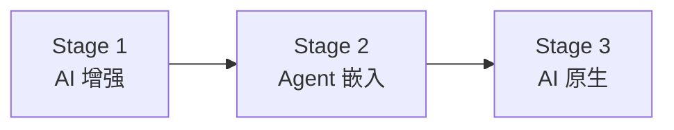
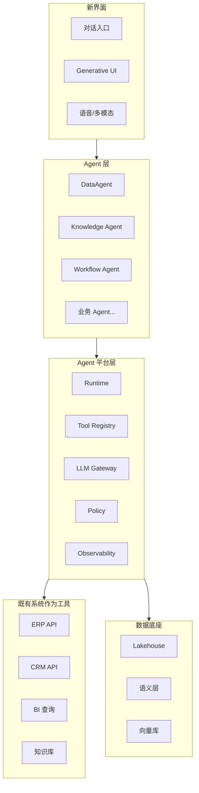
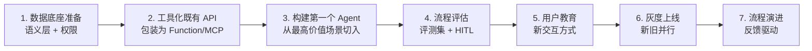

# Ch.03 AI 原生业务系统：Agent 重塑企业软件

> **本章目标**：读者学完能区分"AI 增强的传统系统"与"AI 原生业务系统"，能识别企业当前在哪个阶段，并预判未来 2-3 年的迁移路径。
> **前置阅读**：[Ch.01 Agent 的本质](ch01-agent.md)、[Ch.02 平台边界](ch02-agent.md)
> **估计阅读**：L1 15 min / L1+L2 45 min / 全章 90 min
> **mini-platform 关联**：`agents/`、`console/`（参考形态）
> **实战项目**：暂无（理念章）
> **按角色推荐阅读层**：CTO ⇒ L1+L2 ｜ 架构师 ⇒ L1+L2 ｜ 工程师 ⇒ L1+L2

---

## L1 概念  〔约 30% 篇幅〕

### 1.1 业务场景：山岚集团的「下一代业务系统」

「山岚集团」零售板块目前的业务系统大致是这样的：

- **POS 系统**：门店收银，每天产生 50 万笔交易
- **ERP**：库存、订单、采购、财务凭证
- **BI 平台**：50 张报表，平均访问量月 2000 次
- **CRM**：会员、营销、客服工单
- **内部知识库**：3 万篇文章，员工搜索时基本搜不到想要的

每个系统都做了"AI 增强"——BI 加了自然语言查询入口、CRM 加了智能推荐、知识库加了语义检索。但是：

- 营销总监仍然需要在 BI、CRM、知识库三处来回切换才能写出一份周报；
- 区域经理仍然要打 5 个电话才能确认某个滞销 SKU 的处置方案；
- 财务月结时仍然要 6 个人手动核对 3 天才能完成。

为什么"AI 增强"没有改变业务？因为 AI 只是被嵌入到既有界面，业务流程没变、系统边界没变、协作方式没变。

**AI 原生业务系统**则是另一种形态：

- 营销总监对一个对话入口说："给我做下周华东区周报，重点关注美妆品类的促销 ROI"
- 系统在 2 分钟内自主：检索上周促销活动 → 查询销售与库存 → 计算 ROI → 调用历史报告模板 → 生成图表与文字 → 提交审批 → 入库
- 中间任何节点（数据可信度低、口径有歧义、需要审批）都会主动暂停问

这个系统的"界面"是对话，"主体"是 Agent，"原料"是数据底座和工具能力，"流程"由 Agent 动态编排——这才是 AI 原生。本章讨论的是企业软件从"AI 增强"到"AI 原生"的迁移路径。

### 1.2 核心概念与边界

#### "AI 原生"是什么意思？

| 维度 | AI 增强的传统系统 | AI 原生业务系统 |
|---|---|---|
| 入口 | GUI 为主，AI 是辅助按钮 | 对话/任务为主，GUI 是结果展示 |
| 主体 | 业务对象（订单、客户、商品） | Agent 与任务 |
| 流程 | 预先编排的 Workflow | Agent 动态编排 |
| 数据 | 表 + 报表 | 数据资产 + 语义层 + 工具 |
| 集成 | API 集成（SOAP/REST） | 工具调用（MCP/Function Calling） |
| 用户角色 | 操作员（点按钮） | 决策者（提目标） |
| 演进 | 版本迭代 | 模型/工具/流程协同演进 |

注意"AI 原生"不是"全部 AI 化"。订单录入、库存盘点、合同电子签——这些标准化、低风险、高频次的操作，传统 GUI + Workflow 反而更高效。**AI 原生不替代传统系统，是与传统系统并存的一种新形态**。

#### 三种迁移阶段

| 阶段 | 特征 | 用户体验 | 平台诉求 |
|---|---|---|---|
| **Stage 1 AI 增强** | 在既有系统内增加 AI 入口 | "更智能的旧系统" | RAG、智能搜索、推荐 |
| **Stage 2 Agent 嵌入** | 引入 Agent 完成跨系统任务 | "助理帮我跑了一遍" | 平台五要素 + 部分 Agent |
| **Stage 3 AI 原生** | 业务流程以 Agent 为主入口 | "我提目标系统给结果" | 完整 Agent 平台 + 数据底座 + 流程治理 |

绝大多数企业 2026 年处于 Stage 1 到 Stage 2 之间。Stage 3 当前只有少数前沿团队在尝试，而且通常只在某些场景（数据分析、内部研发、客户支持）局部到达。

#### Agent 作为新界面

传统业务系统的界面是"页面 + 表单 + 按钮"。AI 原生系统的界面是"对话 + 工具调用 + Generative UI"：

- **对话**：用户用自然语言提目标
- **工具调用**：Agent 动态决定调用哪些后端能力
- **Generative UI（Ch.48）**：Agent 输出结构化指令，前端实时渲染图表、表格、表单、确认弹窗

这意味着前端的角色变了。不再是"展示数据库的视图"，而是"渲染 Agent 输出的指令"。Vercel AI SDK、CopilotKit、assistant-ui 都在朝这个方向探索（Ch.47-48 详述）。

### 1.3 常见误区

**误区 1：以为"对话入口"就是 AI 原生**

很多企业在 ERP 上加一个对话框，就宣称"AI 原生 ERP"。事实是：如果对话框背后还是同一套 Workflow，只是把"点按钮"换成"说话"，那本质还是 Stage 1。**AI 原生的判据是流程是否被 Agent 动态编排**，不是入口形态。

**误区 2：AI 原生意味着推翻重写**

AI 原生不要求废弃旧系统。多数情况下，新建一个**Agent 平台 + 数据底座**作为"上层界面"，把旧系统作为"下层工具"接入——这就是渐进式 AI 原生。Stage 2 的本质就是这种共存。完全推翻重写既不现实也不必要。

**误区 3：把 AI 原生当技术运动**

AI 原生不只是技术升级，更是**业务模式、组织结构、决策流程的协同变化**。如果业务方的 KPI 没变、汇报方式没变、考核没变，再先进的 Agent 平台也只是个"高级搜索框"。Ch.53 会讨论组织维度。

---

## L2 架构  〔约 40% 篇幅〕

### 2.1 AI 原生系统的参考架构

> 架构图源：`assets/mermaid/ch03-position.mmd`

关键观察：

- **既有系统不消失**，作为工具被 Agent 调用。ERP/CRM 不再是用户的入口，但仍是数据与能力的来源。
- **数据底座是 AI 原生的真正护城河**。Agent 的能力上限不是模型，而是它能否安全访问到正确口径的数据（Ch.18 详述）。
- **新界面替代旧 GUI**。但替代不是一次性的，业务场景由轻到重逐步迁移。

### 2.2 三种典型形态的对比

AI 原生业务系统在不同场景有不同形态：

| 形态 | 特征 | 典型场景 | 用户感知 |
|---|---|---|---|
| **任务型 Agent** | 用户给目标 → Agent 一次性产出 | DataAgent、报告生成、合规审核 | "我提需求，它做完" |
| **协作型 Agent** | 用户与 Agent 多轮对话、共同完成 | 研发 Agent、咨询助手 | "我们一起做" |
| **嵌入型 Copilot** | Agent 在既有界面内辅助 | CRM 智能建议、BI 数据解读 | "它在我旁边" |

绝大多数企业级 AI 原生系统是三种形态的组合：核心任务由"任务型 Agent"完成，复杂决策由"协作型 Agent"辅助，传统流程保留"嵌入型 Copilot"。

### 2.3 业务流程的迁移模式

把一个传统业务流程改造成 AI 原生形态，通常按以下顺序：

| 阶段 | 关键动作 | 风险 |
|---|---|---|
| 1. 数据底座准备 | 把分散数据接入湖仓、建立语义层、定义权限上下文 | 数据治理工作量大 |
| 2. 工具化既有 API | 把 ERP/CRM 的 API 包装为 MCP server 或 Function | 老系统 API 质量参差 |
| 3. 第一个 Agent | 选高频、容错率较高的场景（如内部数据问答） | 选错场景导致信任崩塌 |
| 4. 流程评估 | 评测集、HITL 接入、回放 | 评估能力跟不上 |
| 5. 用户教育 | 改变用户的"操作"思维为"提目标"思维 | 文化阻力 |
| 6. 灰度上线 | 新旧并行，逐步切量 | 切换不彻底 |
| 7. 流程演进 | 根据 trace 与反馈，迭代 Agent 能力与边界 | 缺少演进机制 |

绝大多数 AI 原生失败案例栽在第 1 步（数据底座没准备好）和第 5 步（业务不接受新交互）。技术层面是次要的。

### 2.4 设计取舍

**取舍 1：从哪个场景切入**

| 切入点 | 优势 | 风险 | 适用 |
|---|---|---|---|
| 内部数据分析 | 容错率高、用户是技术人员、价值明显 | 仅限内部 | 推荐首选 |
| 客户支持/客服 | 高频、ROI 易算 | 客户直接接触，错误成本高 | 第二阶段 |
| 内部研发协作 | 工程师容忍度高 | 工具链复杂 | 推荐 |
| 核心交易流程 | 价值最大 | 风险最高、合规约束最严 | 最后阶段 |

mini-platform 默认从 DataAgent 切入（Part VI），就是基于这个取舍。

**取舍 2：完全自主 vs 总有人在回路**

| 方案 | 优势 | 代价 | 适用 |
|---|---|---|---|
| 高自主（仅审计） | 流转快、体验流畅 | 错误难追责、合规风险 | 低风险场景 |
| 关键节点 HITL | 安全、合规、责任清晰 | 流转慢、用户负担 | 大多数企业场景 |
| 重 HITL（每步确认） | 极保守 | 失去 Agent 价值 | 极高风险场景过渡期 |

企业 AI 原生的合理默认是**关键节点 HITL**。这不是"AI 不够好"，而是企业的责任边界要求如此。Ch.30 详述。

**取舍 3：渐进迁移 vs 全新平台**

| 方案 | 优势 | 代价 | 适用 |
|---|---|---|---|
| 渐进迁移（旧系统继续用） | 风险低、可回滚 | 长期维护两套 | 中大型企业默认 |
| 全新平台（淘汰旧系统） | 架构干净、未来性强 | 转型风险大、成本高 | 新业务、小公司 |
| 双轨并行（明确分流） | 兼顾创新与稳定 | 治理复杂 | 大企业实验阶段 |

mini-platform 假设的是渐进迁移路径，与既有系统通过 MCP/Function 集成（Ch.24）。

---

## L3 工程实现  〔约 30% 篇幅〕

### 3.1 mini-platform 中体现 AI 原生的部分

| 形态 | mini-platform 模块 | 关联章节 |
|---|---|---|
| 任务型 Agent | `agents/data_agent/`、`agents/workflow_agent/` | Ch.32-37, Ch.54 |
| 协作型 Agent | `agents/devops_agent/` | Ch.24-25 |
| Generative UI | `console/`（参考实现） | Ch.47-48 |
| 既有系统工具化 | `tools/mcp_db/`、`tools/mcp_docs/` | Ch.24 |

本章不引入新代码。AI 原生的体现散布在全书。

### 3.2 迁移路线图模板（山岚集团示例）

针对零售板块的 AI 原生迁移，参考路线：

| 季度 | 目标 | 验收 |
|---|---|---|
| Q1 | 数据底座：30 张核心表入湖、语义层定义、权限上下文打通 | 任意数据问题能在 5 秒内拿到正确口径 |
| Q2 | DataAgent v1 上线：覆盖销售、库存、营销三大主题 | NL2SQL 成功率 ≥ 70%，HITL 覆盖 100% 写操作 |
| Q3 | 业务 Agent v1：周报自动生成、滞销 SKU 处置建议 | 减少运营每周 8 小时报表工作 |
| Q4 | Generative UI Console：对话主界面替代部分 BI 入口 | 月活迁移到新界面比例 ≥ 30% |

### 3.3 生产化 checklist

判断一个业务场景是否"AI 原生就绪"，可用以下清单：

- [ ] 该场景的数据是否已入数据底座并有语义层？
- [ ] 该场景涉及的既有系统是否已工具化（API/MCP）？
- [ ] 该场景的成功标准能否被评测集量化？
- [ ] 高风险节点是否定义了 HITL 接入点？
- [ ] 是否有回放与回滚机制？
- [ ] 用户是否接受过新交互方式的培训？
- [ ] 灰度比例是否清晰？切换计划是否有里程碑？

任一项缺失都意味着该场景还不适合 AI 原生改造，应先补齐基础再启动。

### 3.4 踩坑记录

**踩坑 1：先做 Agent 再做数据底座**

某团队先用现成 LLM 加 LangChain 做了一个销售问答 Agent，效果惊艳但很快遇到：口径不一致（不同来源算出的销售额不同）、字段歧义（"销售额"是含税还是不含税）、权限失控（运营拿到了财务专属字段）。最后回头补语义层、补权限上下文，花了三倍时间。教训：**AI 原生的真正护城河是数据底座，不是 Agent 框架**。

**踩坑 2：用户教育不到位**

新的对话入口上线了，但用户仍在旧系统里点按钮，因为他们不知道"该怎么提问"。运营产生的提问质量低，Agent 表现差，进一步降低用户信任。解决：**配套培训 + 提供"问题模板"**（如"分析 X 主题的 Y 维度异常"）逐步引导。

**踩坑 3：用 AI 原生包装失败的传统项目**

一个企业把已经失败的"数据中台"项目重新包装成"AI 原生平台"，希望靠 LLM 解决数据治理问题。结果数据底座问题没解决，只是多了一个会幻觉的 Agent。教训：**AI 原生不能解决底层数据治理问题，它只是在好数据上提供新界面**。

---

## 本章小结

### 关键结论

1. **AI 原生 ≠ AI 增强**。判据是流程是否由 Agent 动态编排，不是入口形态。
2. **三阶段迁移**：AI 增强 → Agent 嵌入 → AI 原生。多数企业目前在 Stage 1-2。
3. **数据底座是真正的护城河**，模型只是表层差异。
4. **企业 AI 原生需要 HITL 作为规范**，不是技术债。
5. **AI 原生是技术+业务+组织的协同变化**，单看技术注定低估难度。

### 上线检查清单

- [ ] 能上线吗？数据底座、工具化、评测集是否齐备？
- [ ] 能扩展吗？是否有清晰的场景扩展路径？
- [ ] 能治理吗？HITL、审计、灰度是否到位？

### 延伸阅读

- 文章：A16Z, *Emerging Architectures for LLM Applications*, 2024
- 文章：Stripe Engineering, *How we built our AI-native product*, 2025
- 对标产品：Glean、Decagon、Sierra、ChatBI 类产品
- 相关章节：[Ch.04 参考架构总览](ch04.md)、Part VI DataAgent 主线、Part XI 业务案例集
