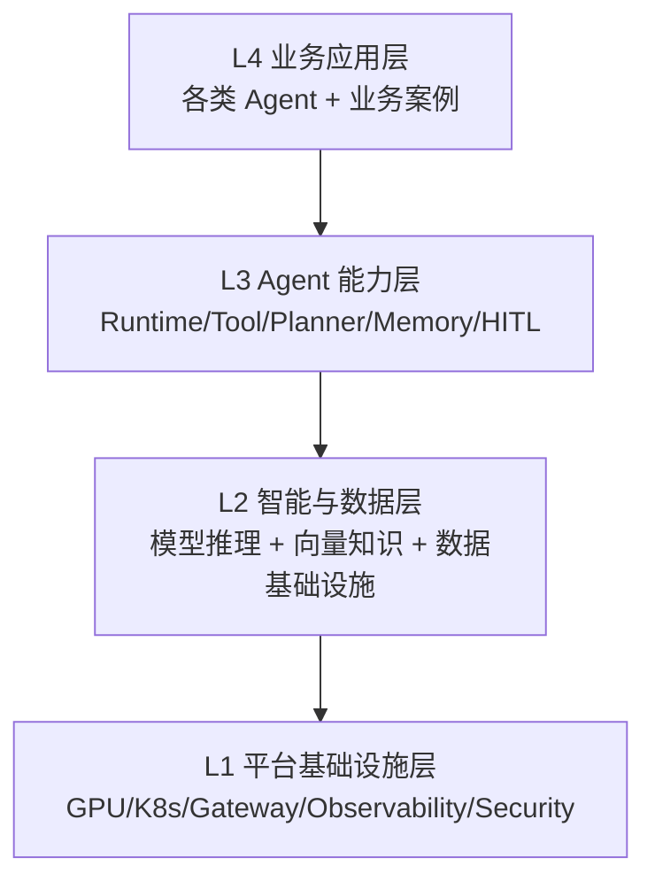
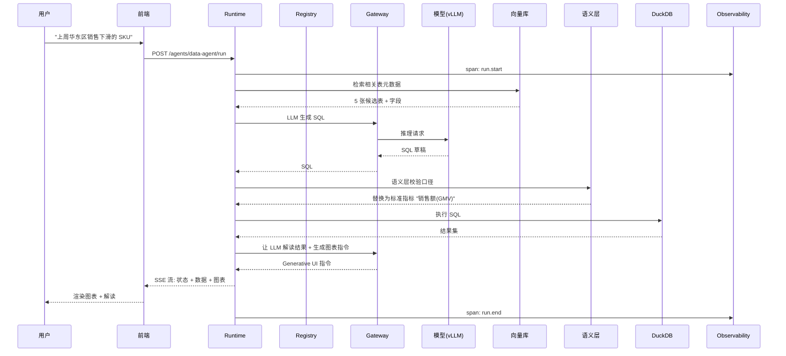
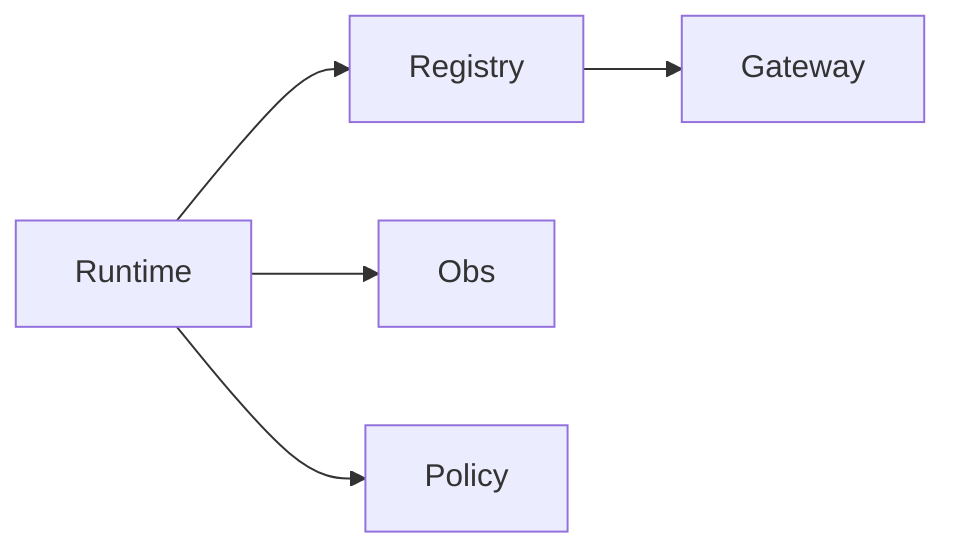

# Ch.04 平台参考架构总览

> **本章目标**：读者学完能在脑中默画出企业级 Agent 平台的完整架构、知道每个组件归哪一 Part，并能据此规划自己企业的平台落地路线。
> **前置阅读**：[Ch.01](ch01-agent.md)、[Ch.02](ch02-agent.md)、[Ch.03](ch03-ai-agent.md)
> **估计阅读**：L1 15 min / L1+L2 45 min / 全章 90 min
> **mini-platform 关联**：整个 `mini-platform/` 仓库
> **实战项目**：所有 16 个项目的关联导航
> **按角色推荐阅读层**：CTO ⇒ L1 ｜ 架构师 ⇒ L1+L2+L3 ｜ 工程师 ⇒ L1+L2+L3（这是后续 51 章的导航）

---

## L1 概念  〔约 30% 篇幅〕

### 1.1 业务场景：从碎片到一张全景图

Ch.01-03 分别讲了 Agent 的本质、平台的边界、AI 原生业务系统。读到这里，读者应该有这样的感受：

- 知道 Agent 不只是 ChatBot
- 知道平台不只是框架
- 知道 AI 原生不只是加对话入口

但还缺一张**完整的架构地图**，能把模型、数据、工具、Agent、评估、部署、安全等所有概念按位置铺开。这张图就是本章要交付的东西。它也是后续 51 章的导航——读者读完本章，应该能回答：

- "我想做 NL2SQL，应该看哪几章？" → Ch.18, Ch.19, Ch.33, Ch.34
- "想了解评测怎么做，看哪几章？" → Ch.39, Ch.40
- "GPU 调度归哪一 Part？" → Part VIII

### 1.2 核心概念与边界

#### 平台架构的四个层次



每一层都依赖下层。本书 11 Part 与四层的对应关系：

| 架构层 | 包含 Part | 章节范围 |
|---|---|---|
| L4 业务应用层 | Part VI DataAgent 主线、Part XI 业务案例 | Ch.32-37, Ch.54-55 |
| L3 Agent 能力层 | Part V Agent 能力百科 | Ch.22-31 |
| L2 智能与数据层 | Part II 模型推理、Part III 数据基础设施、Part IV 向量与知识 | Ch.5-21 |
| L1 平台基础设施层 | Part VII 评估、Part VIII 部署、Part IX 前端、Part X 安全 | Ch.38-53 |

Part I 总论是横切层，为后续 51 章提供概念框架。

#### 八大子系统再展开

Ch.02 提到平台有八大子系统：Runtime / Registry / Memory / Planner / RAG / Obs / Eval / Policy。本章把它们放到完整架构中：

```mermaid
flowchart LR
    subgraph Compute[计算与存储]
        GPU[GPU 集群]
        K8s[Kubernetes]
        Store[对象存储]
    end
    subgraph Models[模型层]
        Inference[推理引擎<br/>vLLM/SGLang]
        Gateway[LLM Gateway<br/>LiteLLM]
    end
    subgraph Data[数据层]
        Lake[Lakehouse<br/>Iceberg/Hudi]
        OLAP[OLAP<br/>StarRocks/DuckDB]
        Meta[元数据/血缘<br/>DataHub]
        Semantic[语义层<br/>Cube]
        Vector[向量库<br/>pgvector/Milvus]
        KG[知识图谱<br/>Neo4j]
    end
    subgraph Core[Agent 核心]
        Runtime[Runtime]
        Registry[Tool Registry]
        Memory[Memory]
        Planner[Planner]
        Rag[RAG]
        Obs[Observability]
        Eval[Eval]
        Policy[Policy]
        Guard[Guardrails]
    end
    subgraph Apps[应用]
        DA[DataAgent]
        KA[Knowledge Agent]
        Other[业务 Agent...]
    end
    subgraph UI[前端]
        Chat[对话]
        GenUI[Generative UI]
    end
    UI --> Apps
    Apps --> Core
    Core --> Models
    Core --> Data
    Models --> Compute
    Data --> Compute
```



> 架构图源：`assets/mermaid/ch04-full-architecture.mmd`

### 1.3 常见误区

**误区 1：把架构图当一次性产物**

很多团队画完一张架构图就贴在 wiki 上不管了。事实是：随着业务和技术演进，架构每个季度都会变化。**架构图应该作为活文档维护**，每次重大决策都要刷新。本章的架构图也会随着本书版本升级。

**误区 2：试图一次实现所有组件**

新团队看到八大子系统会被吓到——是不是要全部建好才能上线？错。**真实路径是按业务优先级分阶段实现**，第一版可能只有 Runtime + Registry + Gateway 三个。Ch.04 的 L2 会给出最小可用集合。

**误区 3：架构与组织脱节**

架构图描述的是技术结构，但每个组件背后是团队。如果"语义层"在架构图上存在，但没有团队负责，它就不存在。**架构图必须与组织映射对齐**。Ch.53 会讨论这种映射。

---

## L2 架构  〔约 40% 篇幅〕

### 2.1 全景架构图（详细版）

```mermaid
flowchart TB
    subgraph Frontend[前端层 · Part IX]
        WebChat[对话 Web]
        Mobile[移动端]
        VoiceUI[语音入口]
        Console[管理 Console]
    end

    subgraph BusinessAgents[业务应用层 · Part VI + XI]
        DA[DataAgent]
        KA[Knowledge Agent]
        TA[Ticket Agent]
        DevA[DevOps Agent]
        SalesA[Sales/Finance/Legal Agent]
        WfA[Workflow Agent]
    end

    subgraph AgentCore[Agent 平台核心 · Part V + VII + X]
        Runtime[Runtime<br/>Ch.22]
        Registry[Tool Registry<br/>Ch.23]
        Memory[Memory<br/>Ch.27]
        Planner[Planner+Agentic<br/>Ch.25-26]
        MultiAgent[Multi-Agent<br/>Ch.28-29]
        HITL[HITL<br/>Ch.30]
        Obs[Observability<br/>Ch.38]
        Eval[Eval<br/>Ch.39-40]
        Cost[Cost+SLO<br/>Ch.41-42]
        Policy[Policy<br/>Ch.50]
        Guard[Guardrails<br/>Ch.51]
    end

    subgraph ModelLayer[模型与推理 · Part II]
        Selector[模型选型<br/>Ch.5]
        VLLM[vLLM/SGLang<br/>Ch.6]
        Opt[推理优化<br/>Ch.7]
        Struct[结构化输出+提示<br/>Ch.8]
        FT[微调对齐<br/>Ch.9]
    end

    subgraph DataPlatform[数据基础设施 · Part III]
        CDC[CDC<br/>Ch.10]
        Lakehouse[Lakehouse<br/>Ch.11]
        OLAP[OLAP<br/>Ch.12]
        Streaming[流式<br/>Ch.13]
        Orch[编排质量<br/>Ch.14]
        MetaSem[元数据/语义/特征<br/>Ch.15]
    end

    subgraph KnowledgeLayer[向量与知识工程 · Part IV]
        Embed[嵌入<br/>Ch.16-17]
        Vector[向量库<br/>Ch.18]
        Parse[文档解析 OCR<br/>Ch.19]
        Rag[RAG<br/>Ch.20]
        KG[知识图谱<br/>Ch.21]
    end

    subgraph Infra[基础设施 · Part VIII]
        GPU[GPU+K8s<br/>Ch.43]
        Deploy[模型部署<br/>Ch.44]
        Gateway[LLM Gateway<br/>Ch.45]
        GitOps[GitOps/边缘<br/>Ch.46]
    end

    subgraph Govern[治理 · Part X]
        Sec[攻防安全<br/>Ch.50]
        Compliance[合规法规<br/>Ch.52]
        Org[组织演进<br/>Ch.53]
    end

    Frontend --> BusinessAgents
    BusinessAgents --> AgentCore
    AgentCore --> ModelLayer
    AgentCore --> KnowledgeLayer
    KnowledgeLayer --> DataPlatform
    ModelLayer --> Infra
    DataPlatform --> Infra
    Govern -.->|约束| AgentCore
    Govern -.->|约束| BusinessAgents
```



这张图就是本书剩余 51 章的导航地图。读者翻到任何一章，都能定位到自己在全栈中的位置。

### 2.2 数据流：一次 DataAgent 调用的端到端轨迹

为了让架构图"活"起来，跟踪一次 DataAgent 调用如何穿过所有层：



> 时序图源：`assets/mermaid/ch04-sequence.mmd`

这次调用涉及：

| 经过的组件 | 章节 |
|---|---|
| 前端流式渲染 | Ch.47, 48 |
| Runtime 状态机 | Ch.22 |
| Registry 工具查询 | Ch.23 |
| Gateway 模型路由 | Ch.45 |
| vLLM 推理 | Ch.6 |
| 向量库元数据检索 | Ch.18 |
| 语义层口径校验 | Ch.33 |
| DuckDB 查询 | Ch.12 |
| Observability 记录 | Ch.38 |

一次"问数"涉及 9 个平台组件协作。这就是为什么"加个 Function Calling 当 Agent"做不出生产级 DataAgent。

### 2.3 最小可用集合（MVP）

不是每个企业上来就建完整平台。本书推荐一个**最小可用集合**：



| 组件 | MVP 实现 | 后续完善 |
|---|---|---|
| Runtime | 状态机 + 简单内存检查点 | 持久化、HA |
| Registry | YAML 注册 + 简单版本号 | 多版本灰度、按租户隔离 |
| Gateway | LiteLLM 单实例 | 集群、智能路由、缓存 |
| Observability | OpenTelemetry + Langfuse | 自建回放 UI |
| Policy | 关键词黑名单 + RBAC | OPA 策略引擎 |

这五个组件覆盖了 80% 的生产级 Agent 场景。先把这五个跑起来，再按场景补 Memory / RAG / Eval / Guardrails。Ch.22-31 会展开实现细节。

### 2.4 设计取舍

**取舍 1：组件耦合度**

| 方案 | 优势 | 代价 | 适用 |
|---|---|---|---|
| 紧耦合（一体化框架） | 性能好、调试方便 | 难替换、技术债快 | 早期 MVP |
| 松耦合（接口契约） | 可替换、可演进 | 集成成本高 | 长期演进 |
| 渐进松耦合 | 兼顾 | 需要架构纪律 | 大多数推荐 ⭐ |

mini-platform 采用"渐进松耦合"：核心组件之间通过 Python 接口隔离，但短期内不强求 RPC，保持调试效率。

**取舍 2：模型部署位置**

| 方案 | 优势 | 代价 | 适用 |
|---|---|---|---|
| 全 SaaS（OpenAI/Anthropic） | 上手快、模型最新 | 数据出域、成本高 | 中小企业、非敏感数据 |
| 全本地（vLLM 自建） | 数据安全、长期成本低 | GPU 投入、运维负担 | 强合规、大规模 |
| 混合（敏感本地+通用 SaaS） | 平衡 | 网关路由复杂度高 | 大多数企业 ⭐ |

Ch.45 LLM 网关详述路由策略。

**取舍 3：数据底座现状利用**

| 方案 | 优势 | 代价 | 适用 |
|---|---|---|---|
| 复用既有数据中台 | 投入小 | 旧中台可能不适配 LLM 场景 | 数据治理已经较好的企业 |
| 单独建 AI 数据层 | 干净 | 资源浪费 | 旧中台不可改造 |
| 既有中台 + AI 增强层 | 平衡 | 治理复杂 | 多数企业 ⭐ |

Part III 假设的是"既有中台 + AI 增强"路径。

---

## L3 工程实现  〔约 30% 篇幅〕

### 3.1 mini-platform 与架构图的对应关系

```
mini-platform/                       架构层
├── core/                            ← Agent 核心
│   ├── runtime/                     ← Ch.22
│   ├── registry/                    ← Ch.23
│   ├── memory/                      ← Ch.27
│   ├── planner/                     ← Ch.25-26
│   ├── rag/                         ← Ch.20
│   ├── observability/               ← Ch.38
│   ├── eval/                        ← Ch.39-40
│   ├── policy/                      ← Ch.50
│   ├── gateway/                     ← Ch.45
│   └── guardrails/                  ← Ch.51
├── infra/                           ← 数据/模型基础设施适配
│   ├── lakehouse/                   ← Ch.11-12
│   ├── metadata/                    ← Ch.15
│   ├── semantic_layer/              ← Ch.33
│   └── vectorstore/                 ← Ch.18
├── tools/                           ← Tool 实现
│   ├── mcp_db/                      ← Ch.24
│   ├── sql_executor/                ← Ch.34
│   ├── python_sandbox/              ← Ch.35
│   └── ...
├── agents/                          ← 业务应用层
│   ├── data_agent/                  ← Ch.32-37
│   ├── knowledge_agent/             ← Ch.22, Ch.54
│   └── ...
├── console/                         ← 前端层（Ch.47-48 参考）
└── projects/                        ← 16 个实战
```

读者可以把这张表打印贴墙上，随时定位"我现在做的事情在哪一层"。

### 3.2 16 个实战项目的架构地图

| 项目 | 主要架构层 | 关联章节 |
|---|---|---|
| 1. 最小 Runtime | Agent 核心 | Ch.22 |
| 2. Tool Registry | Agent 核心 | Ch.23 |
| 3. MCP DB 工具 | Tool 层 + Ch.24 | Ch.24 |
| 4. 知识库 RAG Agent | 应用 + 知识层 | Ch.20, Ch.54 |
| 5. NL2SQL DataAgent | 应用 + 数据层 + 模型层 | Ch.33-34 |
| 6. SQL 安全执行 | Tool + Policy | Ch.34, Ch.50 |
| 7. Python 沙箱与图表 | Tool 层 | Ch.35-36 |
| 8. Trace 与回放 | Observability | Ch.38 |
| 9. DataAgent Eval | Eval 层 | Ch.39 |
| 10. 多 Agent 业务流程 | Multi-Agent + HITL | Ch.28, Ch.30 |
| 11. vLLM + LiteLLM 网关 | 模型层 + 基础设施 | Ch.6, Ch.45 |
| 12. Iceberg + DuckDB | 数据层 | Ch.11-12 |
| 13. 嵌入微调 + 向量 benchmark | 知识层 | Ch.17-18 |
| 14. GraphRAG 知识图谱 | 知识层 | Ch.21 |
| 15. Ragas + Spider 评测 | Eval | Ch.39 |
| 16. Generative UI 前端 | 前端层 | Ch.47-48 |

### 3.3 生产化 checklist：架构成熟度自评

用以下 10 项评估自家 Agent 平台的成熟度，每项 0/1/2 分：

| 维度 | 0 分 | 1 分 | 2 分 |
|---|---|---|---|
| 模型治理 | 各自直连 | 统一网关 | 网关 + 路由 + 成本归集 |
| 工具治理 | 散落各项目 | 集中注册 | 注册 + 版本 + 权限 + 沙箱 |
| 数据底座 | 直连数据库 | 接入湖仓 | 湖仓 + 语义层 + 权限上下文 |
| 知识工程 | 全文搜索 | 向量 RAG | RAG + GraphRAG + 引用 |
| Agent 编排 | 写死流程 | ReAct | 多模式 + 多 Agent + HITL |
| 可观测性 | 看 log | Trace | Trace + 回放 + 自动告警 |
| 评估 | 人工抽检 | 离线评测集 | 离线 + 在线 + 回归 |
| 安全 | 关键词过滤 | OWASP 基线 | 红队 + Guardrails + 内容安全 |
| 部署 | 本地脚本 | Docker | K8s + GitOps + 灰度 |
| 组织 | 无平台团队 | 有团队无流程 | 团队 + 评审 + 演进路线 |

总分 0-6：探索期；7-12：建设期；13-17：成熟期；18-20：领先期。多数企业目前在 5-10 分区间。

### 3.4 踩坑记录

**踩坑 1：架构图与代码不一致**

架构图上写着"Memory 接 Redis"，但代码里实际是 Python dict。新人按图调试找不到 Redis，浪费半天。教训：**架构图必须由 CI 校验**——本书的做法是把架构图源（.mmd）和模块文件同 PR 评审，并加 lint 脚本。

**踩坑 2：MVP 范围过大**

某团队的 MVP 计划包含八大子系统全部，结果三个月没上线。教训：**MVP 就是 Runtime + Registry + Gateway 三件套**，其他都是后置。

**踩坑 3：组件交界处出 bug**

90% 的故障发生在组件交界处——Runtime 与 Memory 状态不一致、Gateway 与 Registry 版本不同步。教训：**接口契约要写在代码里（pydantic 模型），而不只是在文档里**。

---

## 本章小结

### 关键结论

1. **平台四层架构**：业务应用层、Agent 能力层、智能与数据层、平台基础设施层。
2. **八大子系统是核心**：Runtime / Registry / Memory / Planner / RAG / Obs / Eval / Policy（+ Gateway/Guardrails）。
3. **最小可用集合**：Runtime + Registry + Gateway + Observability + Policy 五件套先跑通。
4. **一次 Agent 调用跨 9+ 个组件**，平台的价值在于让这些协作变得可控。
5. **架构图是活文档**，必须与代码、CI、组织同步演进。

### 上线检查清单

- [ ] 能上线吗？最小可用集合是否齐备？
- [ ] 能扩展吗？后续组件是否能按场景增量补齐？
- [ ] 能治理吗？架构图是否与代码、CI、组织映射一致？

### 延伸阅读

- 文章：A16Z, *Emerging Architectures for LLM Applications*
- 文章：Anthropic, *Building Effective Agents*
- 对标产品：DB-GPT、Higress AI Gateway、LiteLLM、Langfuse
- 相关章节：Part V Agent 能力百科（Ch.22-31）、Part III/IV 数据与知识、Part VII/VIII/X 治理与部署

> **进入 Part II 之前的提示**：从下一章起，每一章会专注一个组件深潜。读者可以按全栈技术地图的顺序读，也可以按读者路径跳读。如果遇到术语不清楚，随时翻回 [附录](../appendix/index.md)。
