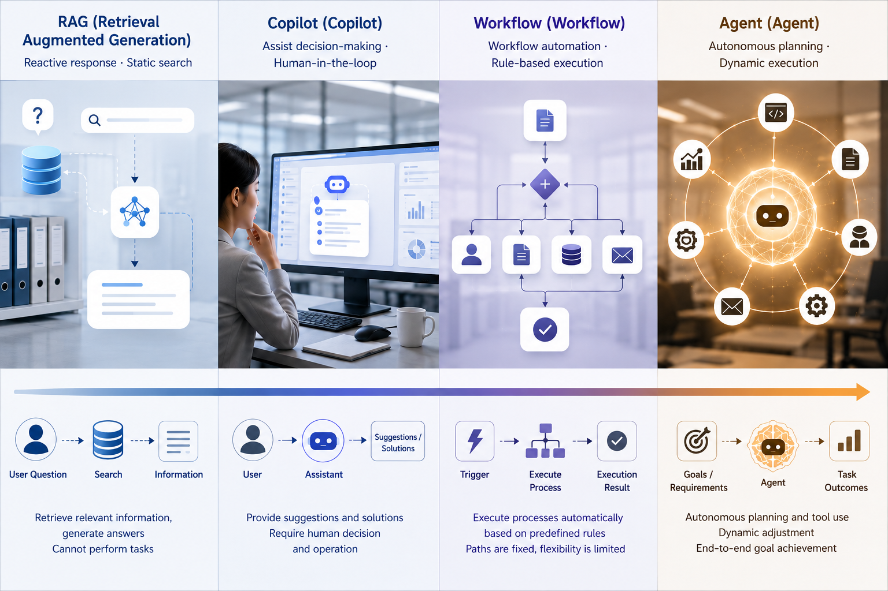

# Chapter 1 Agent Boundaries: From Conversational Assistants To Task Execution Systems

---

## Scenario Introduction

When a quotation assistant moves from looking up references and drafting text to generating a quotation that can be sent to a customer, the system boundary has already changed. In the first case, a wrong answer usually stops at a draft that sales can revise. In the second case, once the system calls discount rules, inventory systems, and approval interfaces, the error enters a real business process. Many enterprises misjudge this moment in their first Agent projects: the demo conversation is smooth and the task appears complete, but the team has not designed whether the system is making decisions, whether it creates side effects, or what needs approval and audit. Figure 1-1 marks that line. When a system moves from giving advice to advancing a task, its engineering responsibility changes with it.

A manufacturing enterprise once used a quotation assistant as a large-model pilot. The early version did three things: searched historical contracts, summarized discount ranges for similar customers, and helped sales draft an explanation. This version did not look highly automatic, but its risk was clear. The system gave suggestions, sales decided whether to use them, and formal quotation still went through the original approval chain. Even if the model misunderstood a historical project, the error stayed in the draft layer, where sales and managers could still catch it.

After the pilot was accepted, the business team wanted to push the process further. Salespeople did not want to switch among the contract system, inventory system, discount rules, and email system, so the team connected these tools to the model. With one sentence, "the customer wants to sign this week; give me a competitive price," the system could generate a quotation. On the surface, the user saved a few clicks. In responsibility terms, the system had become something else. The model began deciding which rules to inspect, which customer tier to apply, whether approval should be triggered, and in what format the result should be returned to sales. What the salesperson saw was no longer an editable suggestion, but a business document that could be forwarded to a customer.

The real problem often appears in this gray zone. The system has not sent the email or signed the contract, so the team may believe the risk is still controlled. Yet it may have already written an expired promotion rule into the quote draft, interpreted "competitive" as a discount level reserved for major accounts, and failed to warn sales that regional-director approval was required. If the salesperson copies and sends the draft while rushed, the consequence is no longer an inaccurate answer. It becomes a pricing commitment, an approval bypass, and a customer-expectation problem. Incidents like this rarely yield to the simple instruction that the model should be more accurate. The system also needs to know which data source is authoritative, which actions are suggestions, which actions change business state, who may confirm them, and how to replay the original input, tool calls, and intermediate decisions after a problem. The first step in discussing enterprise Agents is to make these responsibilities explicit before applying the same name to every intelligent feature.

*Figure 1-1: From conversational assistants to task execution systems. Source: original diagram by the authors. Alt text: The left side shows a conversational assistant receiving questions and returning answers. The right side shows a goal-driven task execution system calling tools, advancing multi-step actions, and producing results with business consequences. Arrows mark the boundary in decision-making and side effects.*

The key change in an Agent is not expression quality, but the way a task is advanced. It begins to organize data, tools, process, and responsibility boundaries into one task chain. Readers should enter this book with a clear expectation: the Agents discussed here are not imaginary systems that finish everything in a demo video. They are constrained, observable, replayable, and degradable task-execution capabilities inside enterprise systems. The book separates intelligent interaction, task execution, and platform responsibility so every capability does not collapse into one vague concept. Later chapters keep returning to one question: when model output starts affecting real business action, what engineering responsibility must the system add?

This chapter establishes the conceptual boundary. By the end, readers should be able to judge whether a system has entered the Agent scope through three plain questions: who makes the final decision, whether the task path can change dynamically, and whether system actions create business side effects. Knowledge lookup should usually start with RAG. Content drafting should usually start with Copilot. Stable process execution should usually start with Workflow. Agent becomes necessary when the task needs cross-system advancement, step adjustment based on feedback, and actions that can change subsequent choices. The purpose of this judgment is to reduce production mismatch, not to attach fashionable labels. Treating RAG as Agent adds unnecessary approval and runtime burden. Treating an Agent as a chat assistant misses permissions, audit, failure recovery, and human confirmation. Enterprise Agent design begins with boundaries, and every concept in this chapter later maps to concrete platform components.

## 1.1 From "Can Answer" To "Can Execute": The Fundamental Turning Point Of Agents

A manufacturing division in a multi-business enterprise once built a quotation assistant. At first, it helped sales retrieve historical contracts, reference discount ranges, and generate quotation drafts. The demo worked well: users stated a need, and the system produced a structured quotation suggestion within seconds while organizing similar past cases. The team soon made a natural but dangerous judgment. If the system could understand the question, find information, and write a result, why not let it complete more of the quotation process?

The assistant was connected to real tools: contract systems, inventory systems, discount policies, approval interfaces, and customer-email draft generation. A salesperson entered, "the customer wants to sign this week; give the most competitive price possible." The system inferred a 12 percent discount from historical cases and generated the quote. On the surface, it had turned a suggestion into a draft. In the actual system chain, it had become an enterprise task: interpreting intent, choosing a pricing strategy, calling tools, and producing an output with business consequences.

The postmortem found three issues. First, the system used an expired promotion rule and did not recognize the new price limit that had taken effect that day. Second, it interpreted "competitive" as close to a major-customer discount, while this customer did not have the same discount authority. Third, it handed a result that should have entered approval directly to the salesperson, where a user in a hurry could forward it to a customer. The case exposes a frequently underestimated turning point. Once a system starts advancing tasks for people, the discussion moves from answer quality to execution responsibility. A question-answering system failure often means a poor answer. An execution-system failure can mean privilege overreach, process bypass, data misuse, and unclear accountability. From this boundary onward, an Agent should be treated as a task execution system rather than a smarter chat assistant. Later chapters on Runtime, Tool Registry, HITL, Trace, and evaluation all follow this responsibility boundary.

## 1.2 RAG, Copilot, Workflow, Agent: Boundaries Among Four System Types

One major source of confusion in enterprise Agent discussions is naming. Many projects call themselves Agents simply because they use a large model. Many fixed-process systems are also repackaged as Agents. Before later chapters discuss platforms, tools, and governance, four common forms need to be separated. RAG finds material, answers questions, and supplies context; the final decision usually remains with the user, and the system does not directly advance business state. Copilot goes further by helping the user draft, revise, complete, and suggest, while the user remains in charge. Workflow handles deterministic processes: rules and paths are specified in advance, and the system follows them. Agent differs because it judges the next step around a goal, calls tools, receives feedback, and continues after task state changes. These forms often combine in a mature system. RAG may provide knowledge and context, Copilot may help draft or revise, Workflow may lock high-risk and compliance-heavy steps, and Agent may handle cross-system advancement that cannot be fully predetermined.

The important test is responsibility, not naming. If the system mainly searches an enterprise knowledge base, it is likely RAG. If a human remains the driver and the model assists on the side, it is closer to Copilot. If the path from start to finish is fixed, it is closer to Workflow. A system enters this book's Agent scope when it understands context around a goal, selects actions, receives feedback, and continues advancing the task. A more useful question is: where is the hard part of this task? If the hard part is knowledge lookup, RAG is often enough. If it is content drafting, Copilot is easier to land. If it is process standardization, Workflow is more stable. Only when the hard part is multi-step judgment, cross-system advancement, and real-time adjustment should the task be treated as an Agent task.

*Figure 1-2: Boundaries among RAG, Copilot, Workflow, and Agent. Source: original diagram by the authors. Alt text: Four system types are arranged along decision authority and execution determinism. RAG and Copilot are user-led and low-execution, Workflow follows fixed paths, and Agent dynamically selects actions under a goal. A dashed line shows that mature systems often combine all four.*

Figure 1-2 is not asking readers to choose exactly one category. Mature systems can combine RAG, Copilot, Workflow, and Agent, but the combination must obey decision authority, process determinism, and execution responsibility. Once a component starts advancing a business action for the user, it should be engineered with Agent-level responsibility.

## 1.3 The Agent Task Closed Loop: Goal, Context, Decision, Action, And Feedback

This section defines Agent through a task loop rather than model capability or product naming. That definition lets later discussions of tools, memory, approval, and evaluation return to the same question: whether the system is truly advancing a task. In plain terms:

> An Agent is a system loop that organizes perception, decision-making, action, and feedback around a task goal.

The emphasis is on the loop. An enterprise Agent usually has to handle five objects. Table 1-1 turns them into five questions that can later map to Runtime, Planner, tool invocation, and Trace.

*Table 1-1: Five elements of the Agent task loop and the questions they answer. Source: compiled by the authors.*

| Element | Question It Answers |
|---|---|
| Goal | What task needs to be completed, and is answering a question enough? |
| Context | What data, rules, documents, and identity information are needed for this task? |
| Decision | Given the current state, what action is most appropriate next? |
| Action | Which tool should be called, and what result or side effect will it produce? |
| Feedback | Does the tool result change the next decision? |

If any part is missing, the system falls back to a weaker form. Without a goal, it becomes generic conversation. Without context, it makes plausible judgments on wrong information. Without decision, it can only write text. Without action, it stays at the suggestion layer. Without feedback, it cannot correct itself or converge. Many products that look like Agents are closer to advanced Copilots: they have conversation, tools, and output, but the task does not form a loop. In enterprise settings, the loop also creates responsibility questions: who allowed the system to act this way, what information it used, when it must stop, and how errors are detected, reviewed, and corrected. These issues cannot be absorbed by one application alone; they eventually return to the platform layer.

### 1.3.1 Why The Agent Concept Spread So Quickly

The rapid spread of the word "Agent" comes from academic definitions and several forces arriving together. Model capability changed first. Earlier enterprise AI systems were good at classification, prediction, retrieval, and local generation, but few organizations allowed them to decide what to do next. Large models raised natural-language understanding, cross-domain knowledge use, and structured output enough for enterprises to see a new possibility: the system could move from answerer to task participant. Tool invocation also matured. Early large-model applications often stayed inside text even when the answer was good. Function Calling, structured output, Code Interpreter, and MCP made models able to do as well as say in a more stable way. That forced enterprises to take execution boundaries seriously.

Enterprise software itself also changed. For more than a decade, modular SaaS dominated: CRM was one system, ERP another, BI another, ticketing another. With large models, users started expressing a clearer expectation: they did not want to switch among systems, but wanted to hand the task to one system. The market heat came quickly, so the word Agent was used to package almost every large-model feature. Whether a system truly enters the Agent category still depends on how much task responsibility it takes on.

## 1.4 Agent Task Fit, Risk Level, And Value Judgment

Enterprise Agent projects often start with boundaries that are too broad. Once a team has a large model and several tools, it may place every intelligent demand under the Agent umbrella, which increases governance pressure. A more controllable path is to classify enterprise tasks first. Query tasks are about finding accurate information and usually start with retrieval, RAG, semantic layer, or BI. Drafting tasks are about generating editable results quickly and usually fit Copilot or content-generation assistants. Diagnostic tasks combine multiple information sources and narrow the problem step by step, where Agent value begins to appear. Execution tasks call tools, move across systems, and create side effects; they usually require Agent, Workflow, and approval chain together.

Concrete scenarios make the judgment clearer. "Check this customer's complaints from the past three months" is primarily a query task; RAG plus a CRM query covers most of the value. "Draft an operational review from this week's sales data" is primarily a drafting task; Copilot or a low-risk task Agent is enough. "Explain why gross margin in East China is abnormal" needs diagnosis across metrics, orders, inventory, and historical explanations, so it is closer to DataAgent. "Generate a quotation and enter approval" touches business action and must be designed together with Workflow, approval, and audit. This classification avoids over-engineering and also shows which scenarios pull platform capability. Diagnostic and execution tasks tend to need Runtime, Registry, Policy, and Trace repeatedly.

Task fit and risk level are separate concerns. A task may fit Agent structurally but still carry high risk, so it can advance only with strong approval. A task may be low risk but not need Agent at all. Enterprises often mix these two judgments, slowing scenes that should move quickly while pushing risky scenes too aggressively.

*Table 1-2: Five risk levels for tasks and corresponding execution controls. Source: compiled by the authors.*

| Risk Level | Typical Action | Recommended Control |
|---|---|---|
| Level 0 read-only | Look up material, check metrics, generate summaries | Execute automatically and preserve evidence |
| Level 1 low-risk write | Create drafts, generate to-dos, write temporary data | Execute automatically with undo |
| Level 2 medium-risk action | Update ticket status, generate quote draft, send internal notification | Confirm key checkpoints |
| Level 3 high-risk action | Send customer email, submit financial voucher, modify master data | Approval plus secondary verification |
| Level 4 extremely high risk | Payment, contract signing, delete high-risk data | Forbid automatic execution by default |

The controlled approach is to first ask whether the task structure fits Agent, then ask how autonomous the Agent may be if it does fit. This book separates Agent definition, platform boundary, and AI-native systems into three chapters for this reason: task fit, governance constraint, and system form belong to different layers.

## 1.5 Enterprise Agent Difficulty: Boundaries, Responsibility, And Organizational Language

Consumer Agents are attractive because they appear able to do anything. Enterprise Agents are difficult because they must know where to stop. Once placed in an enterprise environment, an Agent faces organizational, permission, process, and responsibility boundaries. As a result, enterprise Agent failures usually do not start with whether the model can answer. They usually appear in five forms.

*Table 1-3: Five failure types in enterprise Agents and common root causes. Source: compiled by the authors.*

| Failure Type | Symptom | Common Root Cause |
|---|---|---|
| Understanding failure | User constraints are ignored and the goal drifts | Ambiguous expression, insufficient context |
| Planning failure | Wrong tool, wrong action order, or overly long path | Poor tool descriptions, rough decision strategy |
| Execution failure | Invalid parameters, tool timeout, permission denial | Weak schema, insufficient retry and recovery |
| Governance failure | Privilege overreach, missing approval, no trace, no replay | Missing platform policy |
| Product failure | Users distrust results, do not know how to use them, or cannot take over | Weak frontend and evidence design |

This failure taxonomy prevents teams from blaming every problem on the model. Many enterprise projects react to errors by changing the model or continuing to tune the prompt. The problem may instead come from tool contracts, permissions, semantic layer, or approval chain. Classification restores system analysis. In enterprises, failure handling also has an order. Governance failure decides whether the system can go live. Execution failure decides whether it is stable. Understanding and planning failures decide result quality. Product failure decides whether users will keep using it. Enterprise scenarios first ask whether the system is controllable, then whether the experience is impressive.

### 1.5.1 Limits Of The "Digital Employee" Analogy

Marketing language often calls Agents digital employees, AI colleagues, or virtual specialists. These labels spread easily, but they are risky in engineering. Once an Agent is imagined as an employee, teams tend to expect human-like context understanding, responsibility, discretion, and automatic context completion. Real systems do not possess these abilities by default. They generate the next action from the context, tools, strategy, and model capability they are given.

A more accurate description is that an Agent is a system component in a task chain. It takes on part of perception, decision-making, and execution. It can increase human leverage, while the enterprise responsibility chain still belongs to the organization, process, and surrounding systems. If the team treats the Agent as an employee, the discussion slides toward whether it is smart enough. If the team treats it as a task execution system, the discussion returns to where it is reliable. Enterprise teams need the second question.

### 1.5.2 From Business Language To System Language

The people who propose Agent requirements in enterprises are often business leaders, product managers, operations teams, or functional departments, not engineers. They do not say, "I need a task execution system with Runtime, Tool Registry, and Policy." They say, "I want the system to analyze anomalies automatically," "I want it to follow up with customers like an assistant," or "I want it to prepare monthly closing materials first." These are real needs, but they are not yet system requirements. Agent platform engineers must translate business language into system language.

That translation looks like requirement clarification, but it often decides whether the project can land. When the business says "analyze anomalies automatically," the system must ask what defines an anomaly, what data sources are authoritative, and what diagnostic steps are allowed. When the business says "follow up with customers like an assistant," the system must distinguish reminders, internal to-dos, customer contact, and approval responsibility. When the business says "prepare monthly closing materials," the system must distinguish data that must be accurate, drafts that can be edited, and conclusions that require audit. When the business says "understand the policy and tell me what to do," the system must confirm whether the policy source is authoritative, whether citations are required, and whether the answer can trigger concrete action.

Many failed projects do not fail because the model lacks capability. They fail because the requirement was never decomposed into goal, context, tools, risk, and acceptance criteria. A quotation assistant illustrates the problem. "Give me a competitive price" is natural business language, but at the system layer it needs at least five questions: competitive against similar historical customers or against current inventory pressure; what customer tier and sales discount cap apply; whether regional price limits, campaign rules, or temporary bans exist; whether the system creates a suggestion, a draft, or a direct quotation; and what threshold requires approval. Only after this translation can an Agent move from understanding human language to acting reliably inside enterprise boundaries.

## 1.6 From Pilot To Production: Lifecycle, Task Composition, And Operational Thresholds

Many enterprises design early Agents around one interaction: the user enters a sentence and the system returns a result. That view works for demos, but it is not enough for enterprise Agents. Valuable enterprise tasks are rarely one-off Q&A; they are continuing processes. After a business-analysis Agent answers why gross profit declined, the work continues into meetings, action items, owners, and weekly review. After a quotation Agent generates a draft, the work continues into approval, customer communication, contract signing, and fulfillment tracking. After a customer-service quality Agent finds an anomaly, the work continues into staff training, knowledge-base revision, and service-strategy adjustment.

Once an Agent enters an enterprise, it shifts from one-time execution to long-running operation. Task state must be saved: where the task started, what steps it took, where humans confirmed, and what is still waiting. Task results must be consumable downstream: action items may enter project management or meeting systems, quotation drafts may enter approval, and ticket anomalies may enter finance review. If an Agent's output remains only in chat logs, it is hard to make it part of enterprise work. Task experience must also accumulate. Every user edit, rejection, confirmation, and feedback item is a basis for system improvement. An enterprise Agent is not finished after deployment; it becomes closer to real work through continuous feedback and iteration.

### 1.6.1 Five Thresholds From Pilot To Production

Many Agent projects are not blocked during pilot. They fail because they enter production too soon after a successful pilot. Moving from pilot to production requires at least five thresholds.

*Table 1-4: Five thresholds from pilot to production and their different states in two phases. Source: compiled by the authors.*

| Threshold | Typical Pilot State | Required Production State |
|---|---|---|
| Task stability | A few cases run through | Boundary samples and exceptional scenarios are covered |
| Context credibility | Temporary material stitching | Authoritative sources, versions, and definitions |
| Boundary control | Manual verbal agreement | Explicit risk grading and approval |
| Result reviewability | Only final answer is checked | Evidence, process, and trace |
| Operating mechanism | Temporary project-team maintenance | Continuous feedback, evaluation, and version governance |

These five thresholds belong to the Agent system itself. Agent value comes from execution; once execution begins, stability, credibility, boundary control, reviewability, and operations must keep up. Another often missed threshold is whether the business accepts partial automation. Many pilots try to finish the whole task in one pass during demos. Production systems need to split actions into categories: automatically executable, confirmation required, approval required, and forbidden by default. A quotation assistant can automatically organize historical cases, generate discount suggestions, and write a quote into a draft area. Actions above discount thresholds, customer-facing email, and formal approval submission should be handled by humans or existing processes. This looks less automatic, but it protects long-term operation.

Before go-live, the most important preparation is not a longer prompt. The team needs a task responsibility table: where inputs come from, what tools can do, which steps change business state, which results are suggestions, and which exceptions must stop the run. Engineering teams use it to design tool permissions and Runtime. Business teams use it to confirm process responsibility. Security and internal control use it to judge approval requirements. Without this table, a system may run in demo but still fail to enter production.

The table also exposes a reality: the same task name can have different boundaries in different organizations. Headquarters quotation, regional quotation, and channel quotation may use different discount authority. Internal business review and external customer email require different approval. Agent design cannot rely on task name alone; it must know which business process the Agent enters. Once an enterprise faces these thresholds seriously, it can no longer build only an isolated Agent. It enters the platform problem. That is the starting point of Chapter 2.

## 1.8 From Concept Boundaries To Platform Responsibility

This chapter discusses Agent boundaries to make new enterprise-system responsibilities explicit, not to freeze one industry definition. Once a system moves from answering questions to decomposing tasks, calling tools, and advancing state, it is no longer only a model application. The platform must answer who authorized the execution, which actions were taken, what evidence was used, how failure is recovered, and who reviews the result. Readers will see this boundary repeatedly in later chapters. Chapter 22's Runtime turns a task into a manageable Run. Chapter 23's Tool Registry makes actions registerable and auditable. Chapter 30's HITL stops high-risk actions for human judgment. Chapter 38's Trace makes the process replayable. Without these platform responsibilities, an Agent can remain a demo system: it can generate a plausible answer, but it cannot become an enterprise production system.

When judging whether a scenario fits Agent, model understanding is only the starting point. Teams must also examine whether the task advances across steps, whether it touches enterprise data and tools, and whether it needs an evidence chain and responsibility chain. This judgment directly affects how the rest of the book should be read: the opening chapters establish the platform view, and later chapters add models, data, tools, runtime, evaluation, security, and organizational governance.

## Chapter Recap

Agent is not a general name for large-model applications. It is a system that organizes perception, decision-making, action, and feedback around a task goal. RAG, Copilot, Workflow, and Agent each have boundaries, and many enterprise project failures that look like weak model capability start with wrong requirement classification. The challenge of enterprise Agents is not to make the system more human-like, but to make it know which actions can be automatic, which need confirmation, and which must leave evidence. This book starts from the platform because once a system can advance enterprise tasks, the problem enters runtime, permission, audit, and governance layers rather than staying at the model layer. The next chapter continues with platform boundaries: enterprises are building shared infrastructure for many Agents, not isolated Agents. Applications, frameworks, and low-code tools can all participate, but the platform still carries model access, tool governance, runtime state, evaluation, safety, and audit responsibility.

## References

Yao, S. et al. (2023). [*ReAct: Synergizing Reasoning and Acting in Language Models*](https://arxiv.org/abs/2210.03629). ICLR.

Schick, T. et al. (2023). [*Toolformer: Language Models Can Teach Themselves to Use Tools*](https://arxiv.org/abs/2302.04761). NeurIPS.

Russell, S. & Norvig, P. (2020). *Artificial Intelligence: A Modern Approach*. Pearson.

OpenAI. (n.d.). [Function calling guide](https://platform.openai.com/docs/guides/function-calling).
