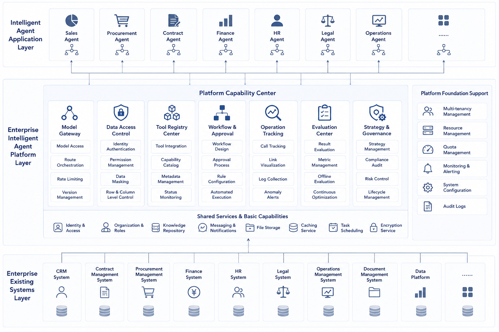

# Chapter 2 Boundaries Of Enterprise Agent Platforms

---

## Scenario Introduction

The first Agent is often driven by a business team: pick a scenario, connect a few tools, and build a loop that can be demonstrated. After the second and third Agents appear, the problem becomes a platform problem. A quotation Agent, business-analysis Agent, and ticket Agent may all call models, read customer data, and write business systems, while lacking unified identity, permissions, audit, and cost vocabulary. The value of a platform is not to build a larger Agent. It is to bring shared capabilities back onto one governance line. Figure 2-1 shows this boundary: business Agents can differ, while model, data, tool, process, and governance capabilities need a unified contract.

In the first year of Agent adoption, many enterprises feel that progress is fast. The manufacturing division uses a quotation Agent to run contract lookup and quote drafting. The retail division uses a business-analysis Agent to prepare weekly meeting materials. The customer service center uses a ticket Agent to summarize and route cases. The finance shared service center uses an invoice Agent to recognize invoices and draft vouchers. Each project can show value, and business owners can describe time saved. In the second year, the problem moves from point value to shared responsibility. Security asks which Agents can read customer detail and which can only read aggregates. Finance asks which department pays for model calls and whether ad hoc analysis and formal reports use the same metric definitions. The platform team asks whether a wrong tool call can be replayed by `run_id`, including input, model version, tool parameters, and approval state. Business teams ask a simpler question: why do different Agents define "revenue" differently?

These questions are hard to blame on one poorly written application. Once multiple applications run at the same time, system problems surface. The first Agent can survive on project-team memory. The second may still rely on a few core engineers remembering conventions. With a dozen Agents connected, verbal rules fail. Who registered a tool, who approved permission, where logs are written, who is on call after failure, and which scenes are affected by a model upgrade all need stable shared mechanisms. This is where the platform appears. It does not take away all business logic, and it does not make product decisions for business teams. It captures capabilities that repeat, affect permissions or cost, and determine audit and recovery, so every business Agent runs on the same baseline. Business teams can move at different speeds, but model access, tool contracts, run state, trace fields, evaluation samples, and approval policies need to stay consistent.

*Figure 2-1: Boundaries of a multi-Agent shared platform. Source: original diagram by the authors. Alt text: The upper layer contains business Agents for quotation, business analysis, ticketing, and invoices. The lower layer contains five shared capabilities: models, data, tools, process, and governance. Arrows show all business Agents accessing these capabilities through a unified platform layer.*

Business Agents can face different tasks, but model, data, tool, process, and governance capabilities must settle into a unified platform layer. Readers should avoid one misunderstanding in this chapter: platform boundary is not an organization chart or a procurement list. It is a method for deciding which responsibilities must be unified. Later chapters introduce model gateways, Tool Registry, Runtime, Trace, Eval, and Guardrails. These components form a platform only when they carry unified responsibility. If they remain local implementations inside separate projects, they are still application-level capabilities.

This chapter separates three layers. Agent applications solve concrete business tasks. Agent frameworks help engineers orchestrate one Agent. Agent platforms let multiple Agents share foundation capabilities under common constraints. This distinction matters. Enterprises may let application teams choose different frameworks and let business domains keep their own strategies. Once model entry, tool registration, permission approval, run records, and evaluation replay are involved, a unified contract is required. Otherwise, "platform" is only a name, and the enterprise is still running pilots that do not recognize one another.

Platforms also need reverse boundaries. A platform that is too thin degenerates into a model proxy. A platform that is too thick swallows business rules, so every discount rule, ticket priority, or report template change waits for platform scheduling. A reasonable platform constrains only what must be unified and leaves extension points where business change is fast and experimentation is frequent. This chapter defines platform boundaries so later component design has a standard for judgment.

## 2.1 Platform Capabilities And Isolated Agents

When a single Agent moves from answering to executing, the main issues are task boundary, tool invocation, and responsibility ownership. Raise the perspective one layer. If a multi-business enterprise first builds a quotation assistant and later adds a business-analysis Agent, ticket Agent, and invoice Agent, new tensions appear quickly. Intuitively this should be good news: the enterprise has found multiple AI landing points, and each team is producing results. In practice, the opposite often happens.

A multi-business enterprise may run four pilots in its first year. The manufacturing quotation Agent reads contracts, checks inventory, and drafts quotes. The retail business-analysis Agent asks data questions, finds anomalies, and writes review material. The customer-service ticket Agent summarizes complaints and suggests handling actions. The finance shared-service invoice Agent recognizes invoices, matches orders, and drafts vouchers. All four prove that the individual scene is feasible. Difficulty begins when the group wants to govern them under one framework.

Platform owners soon face a chain of questions: which Agents may access customer identity data; which tools create business side effects; which model is most used, most expensive, or most error-prone; which Agents must go through approval and which may execute automatically; whether the system can replay the full decision process after a failure. Without unified answers, the enterprise has not entered the platform stage. It only has disconnected intelligent projects. After point Agents are built, the governance question concentrates into one problem: how to keep a group of Agents running for a long time under the same rules.

## 2.2 Applications, Frameworks, Platforms: Three Boundaries And Platformization Risks

The most common conceptual error in the Agent field is mixing applications, frameworks, and platforms. They are related, but they do not live at the same layer.

*Table 2-1: Problems solved by Agent applications, frameworks, and platforms. Source: compiled by the authors.*

| Layer | Problem It Solves | Typical Form |
|---|---|---|
| Agent application | How a specific business task is completed | Quotation Agent, DataAgent, ticket Agent |
| Agent framework | How one Agent orchestrates state, calls tools, and organizes memory | LangGraph, AutoGen, CrewAI, proprietary orchestration framework |
| Agent platform | How multiple Agents share capabilities and receive unified governance | Model gateway, Tool Registry, Runtime, Trace, Eval, Policy |

Frameworks focus on how to build one Agent. Platforms focus on how many Agents can exist in an enterprise for a long time without conflicting, rebuilding the same foundation, or losing governance. An enterprise can hold two principles at the same time: application teams may choose the framework that fits their work, and all Agents must follow a unified platform contract. There is no contradiction. The platform does not replace the framework; it absorbs enterprise complexity above the framework.

Low-code tools, Agent Studios, and visual workflow editors should also be evaluated inside this three-layer structure. They may be good at building an Agent application quickly, but that does not automatically mean they solve platform-level problems. A product or internal system enters the platform layer only if it can answer three categories of questions: how model calls from multiple Agents are managed uniformly; how tool capabilities are defined, risk-graded, and versioned uniformly; and how permissions, approvals, trace, and evaluation are integrated uniformly. If these issues remain handled project by project, the system is still a collection of applications rather than a platform.

## 2.3 Five Common Problems Managed By The Platform: Models, Data, Tools, Process, And Governance

An enterprise Agent platform may look like a set of components, but it actually manages five common problem categories. Model issues decide which model to call, how to route, how to rate limit, and how to aggregate cost. Data issues decide which data can be read, which definitions are used, which identity accesses them, and how masking works. Tool issues decide which capabilities exist, who can call them, whether parameters are valid, and whether actions create side effects. Process issues decide what can execute automatically, what must wait for humans, and how long tasks recover after failure. Governance issues decide how to evaluate, record, replay, audit, and improve continuously.

Understanding a platform as a unified solution to five recurring problem categories is closer to enterprise reality than viewing it as a collection of modules. Enterprises usually do not start with an architecture diagram and then discover problems. Repeated problems usually appear first, and the platform is forced into existence later.

Why did the first four pilots in a multi-business enterprise quickly hit platform questions? Because their business domains differ while the five categories are almost the same: they all call models, read data or documents, invoke tools, judge risk, and require explanation and postmortem after failure. Many enterprises will remember earlier data platforms, technology platforms, or capability platforms. The analogy is useful but must be handled carefully. Data platforms focus on data asset aggregation, governance, and usage. Application platforms focus on engineering efficiency and service reuse. Agent platforms focus on model-centered task execution chains. They reuse assets from data and application platforms, but they carry a different responsibility: model decision, tool side effect, human approval, task replay, and version evaluation.

*Figure 2-2: Five common problem categories in platform management. Source: original diagram by the authors. Alt text: Five parallel blocks labeled models, data, tools, process, and governance. Each lists recurring issues such as model routing and cost, tool permission and side effects, governance approval and replay. The diagram shows these issues recurring across business Agents and being handled by the platform.*

Figure 2-2 gathers these concerns into model, data, tool, process, and governance capabilities. Together they decide whether enterprise Agents can move from point pilots to long-running production.

## 2.4 Platform Boundaries: Unified Capabilities And Business Autonomy

Once the platform is understood as the unified answer to common problems, the next practical question is which capabilities should belong to the platform and which should stay in applications. There is no universal rule. A reliable starting point is four questions:

1. Will this capability be reused across multiple Agents?
2. Will it affect permission, cost, audit, or evaluation?
3. Does it depend on rules specific to one business domain?
4. Would platformizing it significantly reduce future integration cost?

These questions are not a formal checklist; they are the entry point for assigning platform responsibility. Table 2-2 uses common capabilities to show which ones should move to the platform and which ones should remain closer to the business.

*Table 2-2: Platform ownership or business ownership for common capabilities. Source: compiled by the authors.*

| Capability | Better Ownership | Reason |
|---|---|---|
| Model invocation entry | Platform | Every Agent repeats it; it affects cost and rate limiting |
| Tool registration and risk grading | Platform | It directly affects side-effect control and audit |
| Unified approval channel | Platform | High-risk actions should not be implemented separately by each application |
| Manufacturing quotation discount rule | Application | Strong business-domain logic |
| Customer-service ticket-priority strategy | Application | Highly dependent on departmental operation |
| Unified trace fields and `run_id` convention | Platform | Cross-Agent replay is impossible without it |
| Semantic-layer foundation | Mainly platform | Metrics and definitions need consistency |
| Business interpretation details in the semantic layer | Platform and application together | Platform defines the frame; applications add domain knowledge |

Platform boundary has no fixed answer such as bigger is better or thinner is more modern. A thin platform becomes only a model gateway. A thick platform absorbs business logic. Mature platforms strongly constrain what must be unified and provide slots where difference should remain. Rate of change is an often underestimated dimension. If a capability changes quickly, depends on business feedback, and needs frequent experimentation, premature platformization slows business innovation. If a capability changes more slowly and must be reused consistently, earlier platformization usually helps.

### 2.4.1 Triggers For Platformization

Not every enterprise needs a platform team after building two Agents. A more pragmatic judgment is whether three signals have appeared.

*Table 2-3: Signals that a capability should move into the platform. Source: compiled by the authors.*

| Signal | Meaning |
|---|---|
| Duplicate construction | Different teams repeatedly wrap models, tools, RAG, approvals, and logs |
| Governance break | The enterprise cannot answer permission, cost, trace, and evaluation questions uniformly |
| Integration friction | Every new Agent rebuilds foundation infrastructure |

When these three signals appear together, platformization has shifted from optional improvement to basic condition. Allowing each team to keep building alone will damage delivery efficiency later. Many enterprises see a pattern: the first two pilots move smoothly, and the third suddenly slows down. The reason is direct. The first two projects can still proceed separately. From the third project onward, infrastructure and governance costs concentrate. Budget review asks who owns model bills. Security asks who can access which data. Business teams ask why the same question returns different conclusions from different Agents. Platforms are forced out by this pressure.

## 2.5 Platform Adoption: Collaboration, Admission, And Governance Committee

Platform discussions in enterprises must cover responsibility boundaries as well as technical boundaries. Once a platform exists, many decision rights formerly scattered across project teams are redistributed. Model selection enters platform strategy while applications express requirements and constraints. Tool access enters a unified contract before business teams add domain detail. High-risk actions are defined by platform and security together, not by verbal agreement inside one business team. Trace needs unified run semantics and fields instead of separate logs. Version quality needs shared evaluation vocabulary maintained by platform and business, not demonstration impressions.

This redistribution points to a practical reality: a platform is not a public service center that everyone naturally likes. It reallocates standard-setting rights, admission rights, and part of release control. Platform building is therefore both technical engineering and organizational negotiation. Platform teams encounter organizational resistance as well as technical resistance. Business teams worry that the platform slows onboarding, limits flexibility, and pulls fast experimentation into a unified process. Security and governance teams worry that the platform concentrates risk, grants systems too much decision power, and creates new audit black boxes. A mature platform team must answer both sides: keep onboarding efficient and keep the boundary controlled.

### 2.5.1 Platform Admission Process For New Agents

Once a platform exists, it must support reuse from existing projects and define how new business teams join. An executable minimum admission process includes five steps.

*Table 2-4: Questions answered by each step in Agent admission review. Source: compiled by the authors.*

| Step | Question |
|---|---|
| Task definition | What exactly is this Agent responsible for, and what is outside its scope? |
| Tool review | Which tools will it call, which are read-only, and which have side effects? |
| Risk grading | Which actions may execute automatically, and which require confirmation or approval? |
| Evaluation preparation | How do we know it is better than, or at least no worse than, the previous approach after launch? |
| Platform admission | Does it enter unified Runtime, Gateway, Trace, and Policy? |

These five steps may look like extra gates, but they reduce downstream cost. The admission process prevents each new Agent from creating technical debt, rather than making business teams wait in line. It also works as a translation layer in enterprise communication. "I want to build an intelligent assistant" becomes questions the platform can handle: task boundary, tool list, risk level, acceptance method, and unified execution chain. From task definition to production monitoring, a new Agent must pass shared gates such as tool review, risk grading, evaluation preparation, and runtime integration.

*Figure 2-3: Platform admission and governance mechanism. Source: original diagram by the authors. Alt text: A left-to-right admission flow shows business Agents taking different paths by risk level. Low-risk Agents use standard admission, medium-risk Agents are reviewed by platform and security, and high-risk Agents enter the governance committee. All paths then enter unified launch and ongoing governance.*

### 2.5.2 Boundary Of The Platform Governance Committee

When an enterprise has only one or two Agent pilots, many decisions can be handled through temporary project-team negotiation. When a multi-business enterprise simultaneously advances business analysis, quotation, customer-service quality inspection, finance invoices, and knowledge assistants, temporary negotiation fails quickly. A light but formal governance mechanism is then needed. It may be called a platform governance committee or an AI platform review board; the name is less important than the responsibilities.

The mechanism should handle three stable decision classes. Admission decisions determine which Agents may enter production and which remain pilots, with platform, business, product, and security participating. Risk decisions determine which actions require approval and which actions are forbidden from automatic execution, with platform, security, legal, and internal-control teams involved. Roadmap decisions determine which capabilities sink into the platform and which remain in applications, requiring platform, architecture, data, and business judgment.

The value of the governance committee is stable decision vocabulary. Without it, one department's Agent may automatically send customer emails while another cannot send internal notifications; one scenario may require strict Trace while another records nothing; one team may connect a high-risk tool while another repeats the same review. These inconsistencies quickly erode platform credibility. Governance must not become heavy approval. It should focus on cross-scenario, cross-department, responsibility-boundary issues. It should not intervene in every prompt, page, or business phrase. The governance committee reviews enterprise Agent boundaries; it is not a product review board or a code review board.

## 2.6 Long-Term Operation: Reverse Boundaries, Cost, Catalog, And Maturity

When defining platform boundaries, many teams only write what the platform should provide. That is not enough. A mature platform also states what it should not do. Otherwise the platform keeps expanding, slows the business, and takes responsibility it should not carry. The platform should not define business goals for business teams. Whether a business-analysis Agent serves weekly meetings, monthly meetings, or special reviews, and whether a quotation Agent serves key accounts or channel sales, should be defined by business and product. The platform can provide task templates and review methods, but it cannot decide what matters most.

The platform should not absorb every business rule. Discount strategy, customer-service quality details, finance reimbursement rules, and legal clause preferences have strong business-domain attributes. The platform can require them to enter through governable contracts, but it should not write all of them into the platform core. The platform should also avoid forcing all scenes into one rhythm. Low-risk exploration needs speed; high-risk production needs stability. The platform should provide graded paths rather than one process for every project. It should connect to existing data, identity, approval, and service-governance platforms instead of replacing them with a parallel system. Finally, governance should not eliminate experimentation. Early Agent scenes need trial and error. The platform must control production boundaries while leaving room for sandbox, pilot, and low-risk exploration.

*Table 2-5: What the platform should not do, consequences of crossing the boundary, and better boundaries. Source: compiled by the authors.*

| What The Platform Should Not Do | Consequence If It Does | Better Boundary |
|---|---|---|
| Define business goals for business teams | The platform becomes a business product team and responsibility is misplaced | Platform provides methods; business defines goals |
| Absorb all rules | Platform releases are dragged down by business changes | Platform governs contracts; applications govern domain rules |
| Use one process for all scenes | Low-risk projects slow down while high-risk projects remain uncontrolled | Manage by risk level |
| Replace existing platforms | Architecture is duplicated and governance fragments | Consume existing platform capabilities |
| Eliminate experimentation | Business bypasses the platform | Build sandbox and admission layers |

Platform maturity does not depend on the number of components. It depends on whether the platform can state what it owns and what it does not own. A platform with unclear boundaries can simultaneously duplicate foundation capabilities and push business change into the shared layer.

### 2.6.1 Platform Operation Begins After Launch

Many enterprises understand platform construction as delivering a set of capabilities. An Agent platform is closer to a long-term operating system than a one-time deliverable. The reason is direct: the operating environment keeps changing. Model versions change, business rules change, tool interfaces change, data definitions change, and user behavior changes. An Agent that performs steadily today may degrade three months later because of promotion-rule updates, metric-definition changes, or model upgrades. Without platform operation, the system slowly becomes unreliable.

Platform operation includes at least five kinds of work. Scenario operation tracks which Agents are used and which requirements should merge or retire. Quality operation updates evaluation samples, records failure cases, and classifies user feedback. Cost operation watches model calls, task cost, department budget, and benefit. Risk operation periodically reviews high-risk tools, approval strategies, and sensitive-data access. Ecosystem operation maintains documents, templates, training, examples, and support.

For a multi-business enterprise that built four Agents in the first year and twenty in the second, platform operation becomes more important than platform construction. The question changes from whether the capability exists to whether so many capabilities remain trustworthy, controllable, and worth keeping. Operation also changes the team's daily work. Early project teams focus on making one scene work. Operation focuses on which scenes deserve continued investment, which should be downgraded, which tools should be retired, and which prompts and evaluation samples need updates. A quotation Agent that has not produced useful drafts for half a year should not keep platform quota only because it launched. A business-analysis Agent repeatedly corrected for the same metric explanation should feed that correction back into the semantic layer and templates.

This is why the platform catalog matters. The enterprise needs to know which Agents exist, which business processes they serve, which tools they call, what risk level they carry, who operates them, and when they were last evaluated. Without a catalog, the platform team can only react to incidents. With a catalog, it can proactively find duplicate construction, low usage, high cost, and high-risk scenes. The catalog is not a display shelf for Agents. It gives each Agent traceable ownership and lifecycle. It should connect to admission, monitoring, and cost views. When an Agent connects a high-risk tool, its catalog risk level should change. When its failure rate rises for a long period, the catalog should prompt the owner to review. When a department repeatedly builds similar capability, the platform team can use that evidence to promote reuse. Without these operating actions, the catalog becomes a static list.

### 2.6.2 Conditions For Integrating Vendors And External Products

Most enterprises will not build every Agent capability themselves. A multi-business enterprise may buy knowledge-base products, customer-service quality products, model-gateway products, or industry solutions. The key question is not whether a product can be purchased, but whether it can enter the unified platform boundary.

External products should be evaluated on at least six conditions: whether they support unified identity and permissions; whether tool and data access boundaries are clear; whether key run records can be traced or exported; whether they can enter the evaluation mechanism; whether they can enter the cost view; and whether the enterprise controls key configuration and governance policy. This is the meaning of a hybrid route. Whether bought or built, the capability must enter the same platform contract. Vendor products can become part of the platform ecosystem, but they should not become governance islands.

## 2.8 Practical Judgment Of Platform Boundaries

Enterprise Agent platform boundaries cannot be drawn only by organization chart. A more reliable test is whether a capability needs cross-business reuse, carries risk, requires unified evidence, or affects cost and stability. Model routing, tool registration, run state, permission policy, Trace, evaluation, and release gates meet these conditions and should enter the platform layer. Business process, domain rules, acceptance samples, and operating goals should remain business-team responsibilities.

A platform that is too thin leaves every Agent to rebuild the same foundation. Business teams connect models, wrap tools, store logs, and build approval logic by themselves. This looks fast in the short term, but it creates long-term debt in permission, cost, and incident review. A platform that is too thick has the opposite problem. If the platform team tries to own all business logic, delivery slows and business differences disappear. The right boundary is for the platform to hold non-negotiable engineering responsibility while leaving configurable and extensible space for business teams.

The later chapter structure supports this judgment. The model layer handles capability and cost. The data layer handles trusted context. The Agent capability layer handles runs and actions. The DataAgent mainline connects these capabilities into tasks. Observability and security govern production operation. Readers can use this chapter as a boundary checklist: when a new capability appears, ask whether it belongs to the platform, the business application, or the external ecosystem.

## Chapter Recap

The enterprise challenge is managing a group of Agents, not building one Agent in isolation. Applications, frameworks, and platforms are three layers; mixing them quickly distorts the construction goal. A platform manages five common problem categories: models, data, tools, process, and governance. It should not be so thin that it becomes a model gateway, or so thick that it absorbs business logic. The right boundary constrains what must be unified and leaves room where business differences matter. In the multi-Agent stage, standards, admission, responsibility, and operations become front-stage issues. The next chapter discusses the difference between AI-native business systems and adding AI features to old systems.

## References

NIST. (2023). [*Artificial Intelligence Risk Management Framework (AI RMF 1.0)*](https://www.nist.gov/itl/ai-risk-management-framework).

OWASP. (n.d.). [*Top 10 for Large Language Model Applications*](https://owasp.org/www-project-top-10-for-large-language-model-applications/).

Model Context Protocol. (n.d.). [Specification and documentation](https://modelcontextprotocol.io/).

Kubernetes. (n.d.). [Documentation](https://kubernetes.io/docs/).
