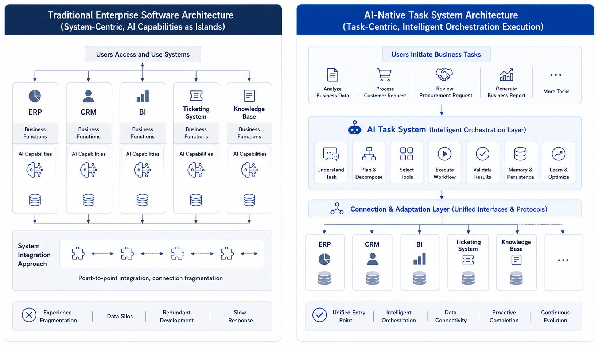
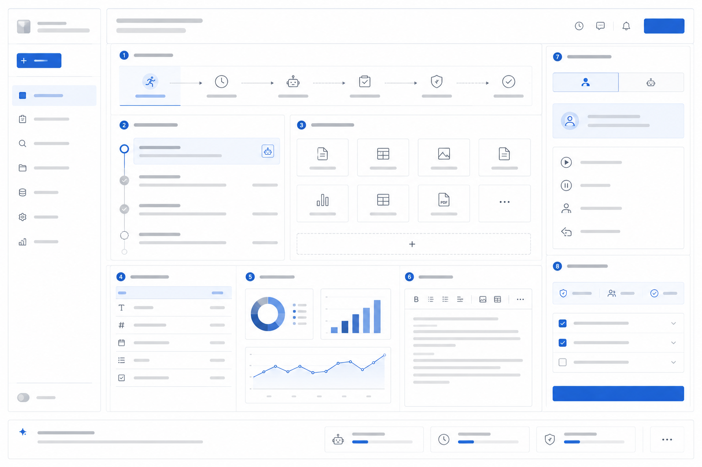

# Ch.03 AI-Native Business Systems: How Agents Reshape Enterprise Software

> **Chapter goal**: Help readers understand what an "AI-native business system" is and how it differs from "adding AI features to traditional systems." The real enterprise change is not merely a new intelligent entry point; business tasks, user mindsets, organizational collaboration, and system layering all change together.
>
> **Intended readers**: Business-system owners, product managers, platform teams, data teams, and enterprise leaders planning an AI-native roadmap.

*Figure 3-1 Traditional systems with AI vs AI-native business systems: the former adds local intelligence to existing modules, while the latter uses business tasks as the entry point and lets Agents re-orchestrate underlying system capabilities.*

---

## Why "Adding AI to Old Systems" Is Not AI-Native

Shanlan Group's informatization is not backward. Retail has BI, manufacturing has ERP, the service center has a ticket system, the finance shared-service center has an invoice platform, and headquarters has a knowledge base. Over the past few years, these systems have gradually added AI capabilities:

- BI can answer data questions in natural language;
- CRM can automatically summarize customer status;
- ERP can warn about inventory anomalies;
- The ticket system can summarize and classify automatically;
- The knowledge base can perform semantic search.

All of these are real progress, but they do not fundamentally change business collaboration.

For example, before a group operating-analysis meeting, the operations owner still repeats the same actions: open BI to view sales data, open the inventory system to check shortages, open the service system to inspect complaints, open the knowledge base to review last month's campaign, and then organize everything into a meeting pack. AI inside each system helps locally, but no system is responsible for the whole task of "preparing operating-analysis material that can be used in a meeting."

This is the fundamental difference between AI enhancement and AI-native systems.

AI enhancement adds smarter capabilities inside old systems.
AI-native systems make "completing the task" the center of the system again.

Both matter, but they must not be confused. The former improves local efficiency; the latter rewrites system responsibility.

## From Page-Centered to Task-Centered: What AI-Native Really Changes

When many teams hear "AI-native," their first reaction is interface change: buttons become conversations, forms become chat boxes. If understanding stops there, it is too shallow.

AI-native business systems change at least four things:

| Change | Traditional business system | AI-native business system |
|---|---|---|
| **Entry** | User enters a system module and operates it | User states a goal or task |
| **Process** | Process is predefined by pages and rules | Agent dynamically organizes steps around the goal |
| **Responsibility** | Each system is responsible only for its module | Agent is responsible for an end-to-end task result |
| **Collaboration** | Humans switch and stitch across systems | The system switches among tools; humans constrain and confirm |

The operating-analysis meeting at Shanlan Group makes this easy to understand.

In the traditional mode, the user's job is to "stitch everything together." In the AI-native mode, the user's job gradually becomes "define the goal, add constraints, and judge whether to adopt the result."

In other words, user mindset shifts from "operating systems" to "managing tasks."

A deeper change is often overlooked: in traditional systems, the page is the first organizing principle; in AI-native systems, the task begins to replace the page as the first organizing principle. Enterprise software once trained people to be "module users." AI-native software trains them to be "task initiators." These two ways of training users reshape product design, data organization, and even departmental collaboration.

This change invalidates many traditional assumptions in enterprise software. Previously, system design centered on "which action the user completes on which page." Now, system design asks "after the user states a goal, how does the system organize a controllable task chain?" Previously, product managers cared most about smooth page flows. Now they must also care whether task state is transparent, evidence is sufficient, risk nodes are confirmable, and failures can continue.

AI-native therefore does not mean replacing the old system entry point with natural language. It pushes system design from "page-centered" to "task-centered," from "functional modules" to "execution chains," and from "users stitching by themselves" to "systems helping orchestrate." This sounds abstract, but in real business it is concrete: operating analysis is no longer merely a BI report entry; quotation is no longer merely an ERP form action. Both may be repackaged as end-to-end tasks.

**How AI-native differs from automation, digitization, and intelligence.**

Enterprises have already experienced several rounds of system upgrades: digitization, automation, and intelligentization. AI-native is not a slogan from nowhere. It evolves on top of those phases.

| Stage | Core goal | Typical system form | Limitation |
|---|---|---|---|
| **Digitization** | Move business objects and processes into systems | ERP, CRM, OA, data warehouse | Many systems, hard boundaries, users must stitch |
| **Automation** | Give stable processes to rules | Workflow, RPA, approval flow | Suits deterministic processes, weak for open-ended tasks |
| **Intelligentization** | Add prediction, recommendation, and generation to local functions | Smart search, recommendation, summarization | Local functions become smarter, but end-to-end tasks still rely on humans |
| **AI-native** | Let systems dynamically organize capabilities around task goals | Agent workbench, task Agents, Generative UI | Requires platform, data, governance, and organization together |

This table shows that AI-native does not negate the previous stages. Without digitization, there would be no callable data and systems. Without automation, there would be no workflow nodes to embed. Without accumulated intelligent capabilities, there would be insufficient local capability. AI-native raises "task" into a new organizing center on top of these foundations.

If Shanlan Group had no ERP, BI, CRM, ticket system, or knowledge base, an operating-analysis Agent would have nothing to call. If it had no approval flow, a quotation Agent could not safely enter the business process. AI-native does not overthrow past informatization. It re-orchestrates those assets.

## Old Systems Will Not Disappear; They Will Be Toolized and Re-Orchestrated

Another misunderstanding about AI-native is the belief that all old systems will be replaced by a conversational entry point. This is too simple.

ERP, CRM, BI, ticket, and finance systems will not disappear because Agents appear. The reason is direct: they carry enterprise facts, rules, permissions, audit, and transactional consistency. Agents should not bypass these systems. They should turn them into callable, explainable, and governable tools.

The role of old systems changes:

| Old-system role | In the past | In the AI-native stage |
|---|---|---|
| ERP | Users directly operated pages | Provides tools for orders, inventory, procurement, finance |
| CRM | Users maintained customers and opportunities | Provides customer context, communication history, action suggestions |
| BI | Users viewed reports | Provides metric query, semantic layer, data explanation |
| Ticket system | Users handled tickets | Provides event stream, status changes, handling actions |
| Knowledge base | Users searched materials | Provides citable policies, cases, and explanatory documents |

The key of AI-native systems is not to "kill old systems." It is to gradually turn systems that users must operate directly into tools that Agents can call within permission boundaries. If done well, user experience becomes far simpler. If done badly, Agents bypass systems, permissions lose control, and results become untraceable.

That is why Chapter 2 emphasized Tool Registry, Policy, and Trace. Once old systems become tools, tool risk levels, call permissions, and result records become platform responsibilities.

**Why user mindset must change at the same time.**

Many enterprises underestimate user-mindset change. The capability is launched, but users continue to work in the old way, and value releases slowly.

Traditional systems train users to ask:

- Which page should I go to first?
- What should I put in this field?
- Which button takes me to the next step?
- How do I export the result and send it to others?

AI-native systems require another set of abilities:

- What task do I actually want to complete?
- Which constraints should I give the system?
- Where is this task now?
- Is the result trustworthy, and where do I need to confirm?

This is not a small change. The user is no longer primarily a "system operator," but more like a "task initiator" and "result arbiter."

If the enterprise does not help users complete this mindset migration, AI-native systems show a familiar symptom: technically runnable, but hard for the business to use.

## Which Businesses Become AI-Native First: Scenario Ordering and Migration Priorities

Not every business domain enters the AI-native stage at the same time. In reality, the earliest transformed tasks are usually those that cross systems, knowledge sources, and roles, not highly structured, transactional, one-step operations.

| Task type | Why it is suitable early | Example in Shanlan Group |
|---|---|---|
| **Cross-system information integration** | Manual system switching and result stitching are costly | Operating analysis, sales review, after-sales diagnosis |
| **Document-intensive tasks** | Rules and evidence are scattered in documents and knowledge bases | Compliance review, bid response, contract review |
| **Draft-output tasks** | Results can be generated first and confirmed by humans | Quotation draft, weekly operating report, customer-reply suggestion |
| **Diagnostic tasks** | Need to gradually narrow the problem, not run one lookup | Gross-margin anomaly analysis, inventory anomaly cause analysis |

By contrast, fully structured, one-off, strongly transactional processes are usually not the first to become Agentic. Payment, signing, and master-data deletion do not suddenly become fit for automation because the phrase "AI-native" exists.

For platform construction, this means AI-native is not a full rebuild of enterprise software. It is an ordered system migration.

Some businesses should not receive the AI-native label too early:

| Scenario not suitable for early transformation | Reason |
|---|---|
| Core processes with strong transactions | Extremely low error tolerance; boundaries must be hardened first |
| Processes with clear and stable rules | Workflow is often more direct and cheaper |
| Scenarios with poor data quality | AI amplifies existing disorder instead of fixing it automatically |
| Scenarios whose business goals cannot be quantified | Hard to prove value and justify continued investment |

This is not conservatism. It is rhythm. One major AI-native risk is betting early in the wrong place and consuming platform credibility along the way.

**How to rank AI-native scenarios.**

If Shanlan Group can advance only three to five AI-native scenarios in a year, how should it rank them? "Which department is most enthusiastic" is not reliable. A steadier approach scores four dimensions.

| Dimension | High-score trait | Low-score trait |
|---|---|---|
| **Business value** | Frequent, time-consuming, affects core metrics | Occasional, peripheral, value hard to explain |
| **Task structure** | Cross-system, diagnostic, can progress in steps | Single-step, fixed, rules clear |
| **Data readiness** | Definitions clear, data accessible, knowledge assets relatively complete | Data scattered, definitions disputed, permissions unclear |
| **Risk controllability** | Can produce drafts first, can roll back, can approve | Direct external commitment, affects money or legal responsibility |

Under this model, Shanlan Group may get this ranking:

| Scenario | Business value | Task structure | Data readiness | Risk controllability | Recommendation |
|---|---|---|---|---|---|
| Operating-analysis material generation | High | High | Medium-high | High | Priority pilot |
| Service-ticket quality inspection | Medium-high | Medium | High | High | Priority pilot |
| Quotation draft generation | High | Medium-high | Medium | Medium | Pilot after strengthening approval |
| Automatic customer email reply | Medium | Medium | Medium | Low | Cautious |
| Automatic payment approval | High | Low | Medium | Very low | Do not automate with Agent yet |

The point is not absolute correctness. The point is transparent decision-making. Many AI projects fail not because scenarios have no value, but because the first scenario chosen has high value, high risk, and poor data readiness at the same time. Trust is then consumed quickly.

**How AI-native systems build trust.**

Whether an AI-native system is adopted by business users ultimately depends on trust. Trust here does not mean "users think the model is smart." It means users dare to hand real tasks to the system.

Enterprise-user trust usually comes from five sources:

| Trust source | What the system must provide |
|---|---|
| **Visible process** | Users know what the system is doing instead of waiting in a black box |
| **Verifiable evidence** | Conclusions trace back to data, documents, rules, or tool results |
| **Controllable risk** | High-risk actions require confirmation, approval, or downgrade |
| **Recoverability** | After failure, the task can retry, be taken over, roll back, or continue |
| **Continuous improvement** | User feedback enters evaluation and version iteration |

If an Agent produces beautiful output but offers no evidence, business users may only find it "inspiring." If it provides evidence, state, and approval entry points, users begin to treat it as a work system.

This explains why an AI-native workbench cannot be only a chat box. Chat boxes are good at expression, but poor at carrying trust mechanisms. Task state, evidence areas, approval controls, and replay entry points may not look "intelligent," but they are essential for enterprise adoption.

## AI-Native Product Forms: Task Assistants, Embedded Copilots, and Agent Workbenches

Using Shanlan Group's path as a summary, enterprises roughly pass through three stages.

The first stage is **AI enhancement**. Each system adds some intelligence, but system boundaries and collaboration modes do not fundamentally change. BI is still BI, CRM is still CRM; they only understand natural language and summarize content better.

The second stage is **Agent embedding**. Cross-system task Agents appear. They are no longer just single-point functions; they can organize a short task chain. Operating-analysis Agents, quotation Agents, and service-quality Agents usually belong here.

The third stage is **AI-native business systems**. Users no longer primarily face one old system. They face a task-centered workbench. The system organizes steps, generates intermediate results, initiates approvals, consolidates evidence, and old systems gradually move into the tool layer.

Most enterprises will remain between the first and second stage for a long time. The third stage is not completed at once, and not every department enters it simultaneously. It usually begins in the most suitable business domains and then spreads.

Many enterprises make a judgment error here: they believe only the third stage counts as "really AI-native." Not so. The second stage is exactly where enterprises must be most serious, because this is where platform, business, data, and organization collide for the first time. Many "AI-native failures" happen because the second stage was never stabilized before the organization announced it had reached the third.

From a construction-strategy perspective, the second stage is the key. It is more than local AI enhancement, but not yet a full redesign of business systems. It is a controllable test field where the enterprise can validate task Agents, platform integration, semantic layer, approval, evaluation, and user workbench in a limited scope.

If the second stage is solid, the third stage grows naturally. If the second stage is hollow, the third becomes a slogan.

*Figure 3-2 Three-stage migration of AI-native business systems: enterprises usually move from AI enhancement inside old systems, to embedded cross-system Agents, and finally to task-centered AI-native business systems.*

**An AI-native system is not a chat box. It is a task workbench.**

The easiest misunderstanding in AI-native frontends is this: replacing a search box with a chat box means becoming AI-native.

It is clearly not enough.

A truly usable AI-native workbench must show at least five categories of information:

| Workbench element | Purpose |
|---|---|
| **Task state** | Tells users whether the system is planning, executing, waiting for approval, or failing |
| **Evidence and citations** | Tells users which data, rules, and documents the result comes from |
| **Structured result area** | Charts, tables, drafts, and to-dos should not drown in chat bubbles |
| **Human takeover entry** | When the system is uncertain, users must be able to take over, modify, and continue |
| **Approval and confirmation controls** | High-risk actions cannot be buried in a normal message stream |

This means the AI-native frontend is usually a combination of "conversation + task flow + structured results + approval controls," not a larger input box.

This is also why later chapters cover frontend and Generative UI separately. Enterprise AI-native frontends are not accessories; they are part of the task system.

At a finer level, a mature workbench usually carries four layers of information:

| Layer | What users care about most |
|---|---|
| **Task layer** | What exactly is being done now? |
| **Process layer** | What has the system done, and what will it do next? |
| **Result layer** | Can the current conclusion, chart, draft, or suggestion be adopted? |
| **Responsibility layer** | Where do I need to confirm, approve, take over, or endorse? |

If any one layer is missing, the AI-native frontend easily degrades. Only the task layer becomes a chat tool. Only the result layer becomes a flashy report. Only the responsibility layer becomes an annoying approval portal. A good workbench makes all four layers clear at the same time.

Consider an operating-analysis scenario.

The user should not merely type "generate operating-analysis material" and wait for a long passage. A better experience: the system first shows the task goal and scope, asks the user to confirm that this analysis focuses on East China, gross margin, and last week's data; then it shows which metrics it plans to query and which data sources it will cite; if a metric has two definitions, it pauses for the user to choose; finally it outputs charts, conclusions, citations, and to-dos, and allows the user to submit the result into the meeting-material approval flow.

That is an AI-native workbench, not "a report inside a chat box."

*Figure 3-3 AI-native task workbench structure: an enterprise task workbench must present task state, execution process, evidence citations, structured results, human takeover, and approval confirmation together.*

**Why organizations and roles are also rewritten.**

If AI-native were only an interface change, it would not strongly affect organizations. In reality, it almost certainly rewrites collaboration.

| Role | Traditional responsibility | New responsibility in the AI-native stage |
|---|---|---|
| **Product manager** | Design pages, flows, fields | Design task entries, risk nodes, acceptance criteria |
| **Data team** | Provide reports and interfaces | Provide semantic layer, evaluation sets, explainable data assets |
| **Platform team** | Manage models or infrastructure | Manage Runtime, tools, trace, evaluation, approval |
| **Business user** | Operate systems | Define goals, add constraints, judge whether results are adopted |
| **Security and compliance team** | Audit after the fact | Define boundaries, approvals, and sensitive-action policies in advance |

This table carries a key implication: **if organizational structure does not move at all, AI-native projects usually cannot go deep.**

AI-native is not merely "stronger technology." It reorganizes work that was scattered across teams around the task chain.

This also means disputes in AI-native projects rarely stay at the technical-solution layer. They often show up as:

- Product managers worrying task boundaries are too fuzzy to define requirements as before;
- Data teams worrying semantic layers and evaluation sets will become long-term maintenance burdens;
- Business teams worrying systems that are too "smart" will blur accountability;
- Security teams worrying high-risk actions will be packaged as ordinary interactions.

From this angle, AI-native business systems do not simply replace old systems. They renegotiate "how much the system does for humans" and "how much humans must backstop the system." That is an organizational problem.

**The migration route is not only technical. It is also an ROI route.**

When enterprises evaluate AI-native projects, they often look only at model cost or demo quality. A more useful approach considers three kinds of benefits:

| Benefit type | Example | Better measurement |
|---|---|---|
| **Time benefit** | Weekly report from 4 hours to 20 minutes | Total task time, per-person task time |
| **Quality benefit** | Fewer omissions in quotation drafts; more complete citations in analysis material | Error rate, rework rate, citation completeness |
| **Collaboration benefit** | Fewer system switches, coordination emails, and repeated meetings | System-switch count, human handoff count |

If a scenario is weak across all three benefit types, it is usually not a good early AI-native transformation candidate.

At the same time, three kinds of cost are often underestimated:

| Cost type | Manifestation |
|---|---|
| **Data cost** | Sorting semantic layers, definitions, permissions, and knowledge assets is much slower than expected |
| **Process cost** | Approval, rollback, and human takeover mechanisms must be redesigned |
| **Organizational cost** | Product, data, platform, and security teams need new collaboration modes |

Looking at benefits and costs together makes the AI-native route real rather than merely visionary.

Many enterprises make the mistake of replacing "long-term operating metrics" with "single-demo performance." AI-native projects should often be judged six months later: did they reduce system switching, reduce manual stitching, and make key tasks deliver more steadily? Ultimately the value returns to the business operating-system level, not to whether one model answer looks beautiful.

AI-native ROI often has a "worse before better" curve. In the first months, the enterprise must build semantic layers, evaluation, approval, and platform integration. Short term, this looks like added complexity. Only after the foundation stabilizes do benefits such as fewer switches, steadier task delivery, and lower collaboration cost appear. Without patience, many projects are misjudged as having unclear value at the very moment investment matters most.

**A spectrum of AI-native product forms.**

AI-native is not one product form. Across stages and scenarios, enterprises see a spectrum. Distinguishing these forms prevents every system from being designed as the same chat assistant.

The first form is the **task assistant**. It helps around one clear task, such as generating an operating weekly report, preparing customer-visit material, or summarizing ticket complaints. It usually does not directly change the business process; it makes a high-frequency task faster and more complete. Its advantage is fast start and low risk; its limitation is limited end-to-end responsibility.

The second form is the **embedded Copilot**. It lives inside old systems, such as a data-question assistant in BI, a customer-summary assistant in CRM, or a reply-suggestion assistant in the ticket system. It enhances old systems but remains constrained by old system boundaries. The user mindset is still "I am operating inside a system, with AI helping beside me."

The third form is the **autonomous workflow assistant**. It no longer merely suggests; it advances part of a process around a goal. A quotation Agent may collect customer context, generate a quotation draft, check discount rules, and submit an approval recommendation. It starts crossing old system boundaries, but still needs Workflow and approval constraints.

The fourth form is the **Agent workbench**. It puts multiple tasks, tools, and result areas into one workspace so users manage tasks rather than operate systems. Operating-analysis workbenches, sales-operation workbenches, and service-operation workbenches all belong here. This is often the most typical frontend expression of AI-native business systems.

The fifth form is the **task operating system**. This is a longer-term form. Users enter work through tasks, roles, and goals rather than systems. Old systems recede into the tool layer; Agents, task state, evidence, approval, and organizational collaboration become the first interface. Not every enterprise can reach this soon, but it explains why AI-native will reshape SaaS.

| Product form | Main object facing the user | Typical value | Typical limitation |
|---|---|---|---|
| Task assistant | Single task | Fast start, reduces local burden | Limited end-to-end responsibility |
| Embedded Copilot | A function inside an old system | Enhances existing system experience | System boundaries remain fragmented |
| Autonomous workflow assistant | A cross-system process segment | Reduces manual advancement and switching | Requires strong governance and approval |
| Agent workbench | Tasks, evidence, results, approval | Changes daily work patterns | Higher product and organizational transformation cost |
| Task operating system | Role goals and business tasks | Reorganizes enterprise software entry | Requires mature platform and organization |

This spectrum helps enterprises set reasonable goals. Shanlan Group's operating-analysis scenario does not need to become a task operating system on day one. It can begin as a task assistant for "generating weekly operating reports," then embed into BI and the data platform, then evolve into a DataAgent that organizes the analysis chain, and eventually enter an operating-analysis workbench. The route can be gradual, but the direction should be clear.

**The relationship between AI-native and SaaS: not replacement, but entry reorganization.**

Many people ask whether AI-native means traditional SaaS will be replaced. A more accurate statement is that AI-native reorganizes the entry and boundaries of SaaS; it does not simply eliminate SaaS.

Traditional SaaS is valuable because it manages objects, processes, permissions, and data within a business domain. CRM manages customers and opportunities; ERP manages orders and inventory; BI manages metrics and analysis; ticket systems manage service events. These values do not disappear because Agents exist. On the contrary, reliable Agent execution depends on these systems providing factual data, rules, and action entries.

Change happens at the user-entry layer. Previously, to finish a task, users needed to know which SaaS to open, which module to enter, which field to query, and which result to copy. After AI-native, users increasingly start from tasks: "prepare tomorrow's customer visit," "explain why this region's gross margin dropped," "turn these abnormal tickets into handling suggestions." The SaaS systems behind the task still exist, but users no longer always face them directly.

This leads to an important result: SaaS competition will no longer happen only on functional completeness. It will also happen on whether a system is easy for Agents to call, explain, and govern. A system with good APIs, clear permissions, stable data contracts, and auditable operation logs enters AI-native task chains more easily. A system usable only through pages, with confused data definitions and coarse permissions, becomes friction in the Agent era.

From Shanlan Group's perspective, AI-native does not replace CRM, ERP, and BI. It reorganizes them into the task-tool layer:

| Old system | Past entry value | New value after AI-native |
|---|---|---|
| CRM | Sales maintained customers directly | Provides customer context and sales-action tools |
| ERP | Business users handled orders and inventory directly | Provides inventory, orders, procurement, and pricing constraints |
| BI | Users viewed reports | Provides metrics, semantic layer, and data explanation |
| Ticket system | Service agents handled events | Provides event state, handling records, and quality samples |
| OA/approval | Users submitted workflows | Provides human confirmation, authorization, and responsibility chain |

AI-native business systems therefore stand not against SaaS, but above it. They gradually turn SaaS from "the user's first entry" into "the task-execution tool layer." That is why Chapter 2 emphasized platform boundaries: the platform is not the application. The platform lets applications and old systems be safely called by Agents.

**Migration priority across business domains.**

AI-native migration is not uniform. Different domains have different data readiness, risk levels, task structures, and organizational resistance. Enterprises need to know which domains are suitable early and which should wait.

For a diversified enterprise like Shanlan Group, six domains can be roughly distinguished.

The first is data analysis and business management. These tasks are mostly read-only, high value, and involve obvious cross-system switching. They are suitable for the earliest AI-native entry. Operating analysis, sales review, inventory anomaly diagnosis, and gross-margin root-cause analysis belong here.

The second is service and operation quality inspection. These tasks have large sample volume, relatively clear standards, and results that can be reviewed by humans first. They are also suitable early. Service summaries, complaint attribution, quality sampling, and knowledge-base recommendation are good starting points.

The third is sales and commercial support. It is high value, but involves customer commitments and pricing strategy, so risk is higher than the first two domains. It should begin with customer-material organization, visit preparation, and quotation drafts rather than external communication automation.

The fourth is finance shared services and invoice processing. Processes are clear and repetitive, but compliance demands are high. Agents fit anomaly explanation, material completion, voucher drafts, and human-review assistance rather than direct automatic accounting and payment.

The fifth is R&D, operations, and internal IT. Technical users have high acceptance and fast feedback, but tool side effects are strong. Code changes, environment operations, and configuration changes must be tightly controlled. These scenarios can be platform capability test fields, but governance must not relax just because users are technical.

The sixth is legal, compliance, and high-risk decision-making. These scenarios are knowledge-intensive and high value, but liability risk is also high. Early versions should support retrieval, summarization, clause comparison, and risk hints, not independent final legal judgment.

| Business domain | Migration priority | Starting method | Main risk |
|---|---|---|---|
| Data analysis and business management | High | Read-only analysis, material generation, anomaly diagnosis | Metric-definition errors |
| Service and operation quality | High | Summary, classification, quality suggestions | Employee evaluation and customer commitments |
| Sales and commercial support | Medium-high | Customer preparation, quotation draft, approval suggestion | External commitments, discount overreach |
| Finance shared services | Medium | Invoice recognition, anomaly explanation, voucher draft | Compliance responsibility, fund risk |
| R&D and operations | Medium | Diagnosis, script suggestion, change assistance | Tool side effects, system stability |
| Legal and compliance | Medium-low | Clause retrieval, summarization, risk hints | Legal responsibility, explanation boundary |

This ordering is not a fixed answer, but it reflects a principle: early scenarios should be high value, reviewable, recoverable, and primarily internal. After platform, data, evaluation, and organization mature, enterprises can gradually move into high-risk external commitment scenarios.

## Operating-Analysis Meeting Case and Product Organization: From Manual Material Stitching to a Task Workbench

Now consider a complete case to see how an AI-native business system changes work.

Shanlan Group holds an operating-analysis meeting every Monday morning. In the traditional mode, from Friday afternoon onward, the operations owner asks each region to submit data. The data team exports sales, gross margin, inventory, promotion, and complaint reports. Operations staff organize results from several systems into slides and then ask regional managers to confirm causes. By Monday, the material exists, but it has three problems: metric definitions are easy to mismatch; anomaly root-cause analysis often depends on human experience; follow-up actions scatter into email and chat messages.

With only AI enhancement, each system becomes a little smarter. BI can answer "What was East China's gross margin last week?" The ticket system can summarize complaints. The knowledge base can retrieve campaign reviews. User experience improves, but the operations owner still stitches everything manually.

In the Agent-embedded stage, an operating-analysis Agent can take over part of the task chain. The user states the goal: "Prepare material for next Monday's operating-analysis meeting, focusing on the East China gross-margin anomaly." The system first confirms scope: time, region, metric, and meeting template. Then it queries sales, gross margin, promotion, inventory, and complaint data, discovers that the margin decline concentrates in two categories, and further checks whether it relates to promotion discounts, logistics cost, or shortage-substitution sales. If a metric definition conflicts, the system pauses for the user to choose.

The final output is not a chat answer. It is a set of meeting material: anomaly summary, charts, evidence citations, possible causes, questions to confirm, and suggested action items. The user can revise conclusions and assign action items to regional owners.

If this develops into an AI-native operating workbench, the change is more obvious. Operating analysis is no longer temporary material assembly every week. It becomes a continuously running task space. The system monitors key metrics, creates tasks when anomalies appear, accumulates evidence, and reminds relevant owners to add explanations. Before the meeting, the material is simply a summary of this week's task states, evidence, and decisions. After the meeting, action items continue in the same workbench.

The three-stage difference can be summarized as:

| Stage | What users mainly do | What the system mainly does | How meeting material is formed |
|---|---|---|---|
| Traditional mode | Manually query, stitch, ask people | Provides reports and records | Manually organized |
| AI enhancement | Ask AI inside multiple systems | Each system answers local questions | Humans stitch AI outputs |
| Agent embedding | Define analysis goal and confirm key nodes | Cross-system root-cause analysis and draft material | Agent generates, human reviews |
| AI-native workbench | Manage continuous tasks and action items | Continuous monitoring, attribution, evidence consolidation | Workbench summarizes automatically |

This case shows that AI-native is not "automatically writing slides." The real change is that operating analysis moves from temporary material preparation to continuous task management. The system does not only generate content. It reorganizes the relationship among data, evidence, meetings, and actions.

*Figure 3-4 Operating-analysis meeting from manual material stitching to task workbench: an AI-native system organizes cross-system data retrieval, anomaly root-cause analysis, evidence consolidation, report generation, and action-item follow-up into a continuous task chain.*

**User training should focus on task templates, not prompts.**

Many enterprises launch AI-native systems and immediately organize "prompt training." This is useful, but if training only teaches users how to write prompts, it can mislead the effort. Enterprise users need to learn not how to chat with models, but how to express work as executable tasks.

For example, "help me analyze East China" is too broad. A better task expression includes scope, goal, constraints, and deliverable: "Analyze why East China's gross margin fell last week, compare the impact of promotions, inventory, and logistics cost, output a meeting-material draft, and mark questions that regional managers need to confirm." This is not prompt craft. It is task-definition ability.

Therefore, AI-native systems should provide task templates, not only blank input boxes. Task templates help users express goals and help the system understand boundaries stably.

| Template element | Purpose |
|---|---|
| Task goal | Clarifies what to complete instead of asking vaguely |
| Analysis scope | Limits time, region, category, customer, or process |
| Constraints | Specifies definitions, rules, and risk boundaries |
| Deliverable | States whether the output is report, chart, draft, suggestion, or action item |
| Human node | Specifies where confirmation or approval is required |

Shanlan Group can prepare task templates for operating analysis, quotation drafts, service quality, invoice anomalies, and contract-clause review. Users start from business tasks, not blank conversation. This lowers the usage threshold and makes platform evaluation and governance easier.

Task templates have an additional value: they codify organizational experience. How experienced operations managers prepare analysis meetings, how senior salespeople judge quotation risk, and how finance supervisors inspect invoice anomalies can all be consolidated into templates. The long-term value of AI-native systems emerges through this consolidation.

**Four reasons AI-native projects fail.**

When AI-native projects fail, surface reasons differ: poor model answers, low user adoption, high cost, slow launch. Deeper down, they often reduce to four root causes.

First, data is not ready. The system tries to do operating analysis, but metric definitions are inconsistent; it tries quotation suggestions, but historical contracts and pricing policies cannot be reliably linked; it tries service quality, but policy-document versions are chaotic. AI-native amplifies data problems because it attempts to organize tasks across systems. The more chaotic the data, the more likely the system produces fluent but untrustworthy results.

Second, process boundaries are unclear. Many teams define only "what the system should output," not "where the system must stop." Can a quotation Agent submit approval? Can it generate customer emails? Can it modify a quotation form? If these boundaries are unclear, launch will trigger disputes.

Third, evaluation is missing. AI-native systems cannot be accepted only through demos. Operating analysis must check attribution accuracy, quotation must check compliance with discount rules, service quality must check whether high-risk samples are missed. Without evaluation samples and regression mechanisms, every upgrade feels like a new gamble.

Fourth, the organization has not accepted new responsibilities. AI-native requires users to define goals, confirm key nodes, and review results; it also requires data, platform, and security teams to operate together. If the organization still treats it as "IT delivering a tool," the project cannot go deep.

| Failure root cause | Typical manifestation | Early warning signal |
|---|---|---|
| Data not ready | Answers are fluent but untrustworthy | Frequent definition disputes and unstable citations |
| Process undefined | Unclear where the system should stop | High-risk actions rely on verbal agreement |
| Evaluation missing | Version quality cannot be explained | Acceptance looks only at demos |
| Organization not accepting | Users do not use it or route around it | No task templates; feedback has no owner |

These four causes also explain why AI-native cannot be driven by one team alone. Data assets, process boundaries, evaluation mechanisms, and organizational operation must all be present.

**Milestones from stage one to stage two and three.**

An enterprise should not announce migration from AI enhancement to AI-native by slogan. It should look at milestones.

To move from stage one, "AI enhancement," to stage two, "Agent embedding," at least five signals should appear: the system works around tasks rather than one-off Q&A; it can call two or more real tools or data sources; it keeps task state and process evidence; it lets humans confirm key nodes; it can evaluate task results with samples.

To move from stage two to stage three, "AI-native business system," more is required: users begin work from task entry points rather than old system entry points; multiple old systems reliably recede into the tool layer; task templates, evaluation, approval, and feedback form an ongoing operating mechanism; business metrics show end-to-end benefit; organizational roles begin to reorganize around the task chain.

The milestones can be summarized:

| Migration stage | Key milestones | Risk if not reached |
|---|---|---|
| AI enhancement -> Agent embedding | Task closure, tool calling, state evidence, human confirmation, sample evaluation | Merely several AI features stitched together |
| Agent embedding -> AI-native | Task entry, old systems as tools, ongoing operation, end-to-end benefit, organizational role change | Only an advanced assistant, not a rewritten business system |

If Shanlan Group wants to judge whether operating analysis has reached stage three, it should not look only at whether the interface resembles a workbench. It should look at whether the operations team truly reduces cross-system stitching, whether meeting material is automatically summarized from ongoing tasks, whether action items continue in the same chain, and whether the data team has moved from repeated extraction to maintaining semantic layers and evaluation samples.

These milestones close the chapter's argument: AI-native is not a label. It is a set of observable system and organizational changes.

**AI-native product and organizational design: task maps, human-machine collaboration, and team changes.**

Traditional enterprise software has a default assumption: users know which system to enter, where fields are, and which table or process represents real status. This assumption has existed for years and has trained a class of "system experts." Skilled users appear efficient, but behind that efficiency sits hidden cost: remembering system boundaries, understanding field meaning, aligning definitions across systems, and manually stitching results.

AI-native systems should change this assumption. They should no longer require users to manage system complexity. Instead, the system should manage part of that complexity and present key boundaries transparently.

This sounds like a product principle, but it is also a platform principle. Users are forced to manage complexity not only because frontend design is poor, but because underlying systems lack unified task semantics. BI metrics, CRM customers, ERP orders, service complaints, and knowledge-base policies may each be correct, but they are not organized around the user's task. AI-native does not simply connect these systems to a chat box. It reorganizes them into an understandable, controllable, replayable task chain.

In operating analysis, the traditional system hands complexity to the operations owner: know which report contains gross margin, which system contains promotion cost, how to read inventory turnover, how to judge complaint impact, and how to organize meeting material. An AI-native workbench should layer that complexity:

| Complexity type | Who bears it in traditional mode | How AI-native systems should handle it |
|---|---|---|
| System location | User remembers system entry points | System selects tools by task |
| Data definition | User judges alone | System displays definitions and authoritative sources |
| Analysis path | User investigates from experience | Agent provides visible plan and intermediate results |
| Risk boundary | User handles alone | System asks for confirmation or approval at key nodes |
| Result organization | User organizes manually | Workbench generates structured material and action items |

This principle explains why a simple chat box is insufficient. Although chat lowers the input barrier, it may hide system complexity more deeply. If users cannot see what the system checked, what it missed, why it judged as it did, and whether the next step creates side effects, they cannot truly trust it.

AI-native product design is therefore not about "reducing a few clicks." It is about "stopping users from doing stitching work the system should handle, while still letting humans hold key judgment rights."

**From function menus to task maps.**

Traditional SaaS navigation is usually a function menu: customers, orders, inventory, reports, tickets, approvals. This structure is clear because it corresponds to system modules and data objects. But users' real work usually does not follow menus; it follows tasks.

A Shanlan Group sales manager's day is not "use CRM, then ERP, then BI." It is "prepare customer visits, evaluate quotation space, follow contract risks, handle customer complaints, and synchronize team progress." These tasks cross multiple systems. Traditional software asks users to switch between menus. AI-native systems should bring the tasks themselves to the foreground.

Enterprise software organization therefore shifts from function menus to task maps.

A task map is not a fancy new navigation pattern. It organizes key enterprise tasks by role, frequency, risk, and value. Shanlan Group can build task maps for core roles:

| Role | High-frequency tasks | AI-native entry |
|---|---|---|
| Operations owner | Operating analysis, anomaly root-cause analysis, action follow-up | Operating-analysis workbench |
| Sales manager | Customer preparation, quotation draft, contract follow-up | Sales task workbench |
| Service supervisor | Ticket quality inspection, complaint attribution, knowledge revision | Service-operation workbench |
| Finance supervisor | Invoice anomalies, month-end material, voucher review | Finance shared-service workbench |
| Management | Metric review, risk scan, decision tracking | Management cockpit + Agent |

This shift affects how product teams write requirements. Traditional requirement documents often start with pages and fields. AI-native requirements should start with a task map: which high-value tasks does this role have? Which tasks cross systems? Which need AI diagnosis? Which require approval? Which should remain in old systems?

The task map also prevents enterprises from turning AI-native into a "boundless assistant." When all requirements are stuffed into a universal entry, the system looks unified but becomes hard to evaluate and govern. Task maps keep entries clear and give each Agent context, templates, and acceptance criteria.

*Figure 3-5 From function menus to role task maps: AI-native business systems no longer organize entry only by functional modules; they create workspaces around high-value tasks for different roles.*

**Human-machine collaboration patterns in AI-native systems.**

AI-native does not mean systems fully replace humans. It changes collaboration between humans and systems. Different risk levels and task structures require different collaboration patterns.

The first pattern is "system drafts, human revises." It suits reports, emails, summaries, and analysis material. The system reduces blank-page cost; humans judge accuracy, tone, and external readiness.

The second pattern is "system diagnoses, human decides." It suits anomaly analysis, customer-risk judgment, and ticket attribution. The system collects evidence and proposes candidate causes; humans select credible conclusions and follow-up actions.

The third pattern is "system advances, human confirms." It suits quotation, approval preparation, and finance review. The system completes low-risk steps, but pauses at key nodes for human confirmation.

The fourth pattern is "system monitors, human intervenes." It suits operating metrics, service risk, and inventory anomalies. The system observes signals over time, creates tasks when anomalies appear, and humans handle them.

The fifth pattern is "system learns, human calibrates." It suits long-term operation. User edits, rejections, confirmations, and supplements enter feedback mechanisms that improve task templates, evaluation samples, and knowledge assets.

| Collaboration pattern | Suitable tasks | Human's main responsibility | System's main responsibility |
|---|---|---|---|
| System drafts, human revises | Weekly reports, emails, summaries | Revise, confirm, endorse | Generate draft and structure |
| System diagnoses, human decides | Anomaly cause analysis, customer risk | Judge conclusion and action | Aggregate evidence and candidate causes |
| System advances, human confirms | Quotation, approval, review | Confirm key nodes | Execute low-risk steps |
| System monitors, human intervenes | Metrics, complaints, inventory | Handle anomalies | Detect signals and create tasks |
| System learns, human calibrates | All long-term tasks | Feedback and calibration | Consolidate templates and evaluation |

This table helps product teams choose interaction forms. Not every scenario needs the same "chat + result" interface. Draft tasks need editing experiences; diagnostic tasks need evidence panels; advancing tasks need state and approval; monitoring tasks need task queues; learning tasks need feedback mechanisms.

The diversity of AI-native frontends comes from the diversity of human-machine collaboration patterns. Designing every scenario as chat ignores that difference.

**What AI-native means for data teams.**

Although Chapter 3 is not a data-engineering chapter, it must state this early: AI-native significantly changes the data team's focus.

Previously, data teams mainly delivered reports, metrics, datasets, and data interfaces. Business users raised requirements; data teams built tables, dashboards, and explained definitions. In the AI-native stage, those responsibilities remain, but three new ones appear.

First, data teams must provide a semantic layer that Agents can understand. Agents cannot face a pile of tables and fields and guess business meaning. Gross margin, sell-through rate, shortage rate, customer tier, and promotion cost all need clear definitions, applicable scope, definition versions, and permission boundaries.

Second, data teams must participate in evaluation sample construction. The quality of a DataAgent cannot rely only on user impressions. Which questions represent common analysis? Which questions are error-prone? Which SQL or metric combinations are correct? Data and business teams must consolidate these together.

Third, data teams must help build evidence mechanisms. When AI-native systems output conclusions, they must state which metrics, time ranges, and data sources support them. The data team does not only provide data; it makes data into explainable evidence.

| Traditional data delivery | New requirement in the AI-native stage |
|---|---|
| Reports | Metric capabilities callable and explainable by Agents |
| Datasets | Context with business semantics, permissions, and definitions |
| Data interfaces | Toolized, auditable, replayable data queries |
| Definition notes | Citable and versioned semantic assets |
| Data quality | Bound to Agent evaluation and trust mechanisms |

This explains why AI-native cannot bypass the data platform. Many failures that look like model problems eventually return to data semantics and evidence. If Shanlan Group's operating-analysis Agent cannot reliably distinguish "book gross margin" from "operating gross margin," no model can make the conclusion trustworthy.

AI-native therefore moves data teams from "report producers" toward "operators of semantic and evidence assets." This is not a job-title change. It is a change in responsibility focus.

**What AI-native means for product managers.**

Product managers also face a fundamental change in the AI-native stage: requirements are no longer only pages, fields, and processes. They are tasks, boundaries, and trust.

Traditional product managers ask: on which page does the user do what? What fields are needed? How should buttons be arranged? How should exceptions be written? These questions still matter, but they are not enough. AI-native product managers must also ask:

- What is the user's real task, not which system was opened?
- What is the success criterion for this task?
- How far may the system advance autonomously?
- Which intermediate results must show evidence?
- When should the user intervene?
- If the system is uncertain, should it ask, downgrade, or hand off to a person?
- How will this task be evaluated and continuously improved?

These questions move product managers from "feature designers" to "task designers." Task designers must understand business goals, system capability, risk boundaries, and user trust at the same time.

For a quotation Agent, the product manager should not design only an input box and a result page. They need to design the full task experience: how sales selects customer and product, how the system displays available context, how quotation rationale expands, how discount risk is shown, how approval nodes appear, how users edit drafts, and how final results enter the contract process.

This also means AI-native product documentation changes. Past PRDs often followed pages; future task-oriented PRDs should follow task chains:

| PRD section | Traditional writing | AI-native writing |
|---|---|---|
| User entry | Which page or menu entry | Which role, task goal, and task template |
| Process design | Fixed page flow and field validation | Task state, branching, pause points, takeover paths |
| Result design | One result page or exported file | Structured result, evidence, citation, next action |
| Risk design | Error messages and permission checks | Risk levels, approval nodes, prohibited actions |
| Acceptance | UI and functional acceptance | Task samples, quality metrics, regression criteria |

Management must avoid two extremes. One extreme is treating AI-native as a pure cost-reduction tool and asking only how many people it can reduce. This creates organizational resistance and ignores quality, speed, and collaboration gains. The other extreme is treating AI-native as a strategic slogan, building showcase projects without tracking business metrics. This removes operating discipline.

A healthier management view is to see AI-native as an upgrade of enterprise task capability. Management should track five categories of metrics:

| Management metric | What it reflects |
|---|---|
| Key task duration | Whether AI reduces end-to-end task friction |
| Task quality | Whether omissions, errors, and rework decrease |
| Reuse capability | Whether the organization moves from isolated projects to platform replication |
| Risk controllability | Whether approvals, trace, evaluation, and incident review exist |
| Organizational adoption | Whether users continue using and giving feedback |

These metrics matter more than "how many models are connected" or "how many assistants are launched." Launching fifty unused, unevaluable, ungovernable assistants is less valuable than launching five AI-native systems that truly change key tasks.

For Shanlan Group's management, a reasonable annual goal is not "every department builds an Agent." It is "around four key tasks, operating analysis, quotation, service quality, and finance invoices, establish a replicable platform and operating mechanism." Such a goal has business value and drives platform consolidation.

**Migration blueprint: what should really happen within twelve months.**

If Shanlan Group decides to advance AI-native business systems over one year, the roadmap should not be "launch several assistants every month." A better blueprint is to let scenarios pull the platform forward and let the platform feed scenarios back.

In the first three months, focus on choosing scenarios and drawing boundaries. Pick one or two high-value, internal, reviewable scenarios such as operating analysis and service quality. At this stage, the most important deliverables are not number of features, but task definition, data definitions, risk grading, evaluation samples, and user feedback mechanisms.

From month four to month six, turn pilots into operable systems. The operating-analysis Agent should not merely generate material; it must retain evidence, support human editing, consolidate failure samples, and connect to meeting action items. The service-quality Agent should not merely classify; it must support supervisor review, standard updates, and quality regression.

From month seven to month nine, copy into a second batch of scenarios. Quotation drafts, finance invoice anomalies, and sales-visit preparation can enter. Platform capabilities should begin to be reused: unified task templates, tool catalog, trace, evaluation methods, and approval integration.

From month ten to month twelve, form early AI-native workbenches. Not all scenarios need to merge into one large system. Key roles should get stable task entries: operating workbench, sales task workbench, and service-operation workbench. Management should see task value, cost, quality, and risk views.

| Time | Focus | Success sign |
|---|---|---|
| Months 1-3 | Scenario selection and boundary definition | Task templates, data definitions, risk, and evaluation samples take shape |
| Months 4-6 | Pilot operationalization | Evidence, feedback, review, and version regression can run |
| Months 7-9 | Replication to second-batch scenarios | Platform capabilities begin to be reused |
| Months 10-12 | Workbench prototype | Users enter key work through task entry points |

The blueprint avoids two traps: only doing pilots without operation, and only building a platform without serving scenarios. AI-native migration must advance scenarios, platforms, and organization together.

**Why AI-native ultimately returns to the platform.**

Although Chapter 3 focuses on business systems, its conclusion is not "platform is unimportant and product is more important." On the contrary, after understanding AI-native, the importance of the platform becomes clearer.

Because once AI-native is real:

- Old systems must become tools, which requires tool contracts and permission governance;
- Users must enter through tasks, which requires task state and context management;
- Systems must organize results across data, knowledge, and processes, which requires semantic layers and evidence mechanisms;
- High-risk actions must be confirmed or approved, which requires process and responsibility chains;
- Results must remain trustworthy, which requires evaluation, trace, feedback, and version governance;
- Multiple business domains must replicate, which requires platform catalogs, templates, and operating mechanisms.

In other words, the further AI-native business systems move, the more they pull platform capability. Without platforms, AI-native remains a local experience. Without business systems, platforms become idle infrastructure. They are two sides of one thing.

That is the structure of Part I: Chapter 1 defines Agents, Chapter 2 defines platform boundaries, Chapter 3 defines AI-native business systems, and Chapter 4 gives the map of the whole book. Reading only one chapter leads to bias. Looking only at Agents turns the problem into model capability. Looking only at platforms turns it into infrastructure. Looking only at AI-native turns it into product experience. Together, the three chapters define the true subject of this book: how enterprises build Agent platforms that support AI-native business systems.

**Why this chapter must return to the platform panorama.**

By this point, the reader should see a clear line:

Chapter 1 explains that an Agent is not an ordinary assistant, but a task execution system.
Chapter 2 explains that once an enterprise enters the multi-Agent stage, platformization becomes necessary.
Chapter 3 further explains that the platform ultimately serves not just a few experiments, but a new form of business system.

This naturally leads to Chapter 4:

If an enterprise really wants AI-native business systems, how should models, data, knowledge, Runtime, tools, approvals, trace, evaluation, security, and frontend be organized globally? Why are the following 55 chapters arranged in the current structure?

In other words, Chapter 3 does not mystify AI-native. It explains why a whole-book map is necessary.

It also has a more implicit function: it reminds readers not to treat AI-native as a frontend trend or product vision. If Chapter 3 stopped at product experience, readers might think the next step should be UI, interaction, and Copilot design. But because AI-native ultimately returns to platform, data, evaluation, and security, Chapter 4 must immediately pull the viewpoint back to the whole system.

## Chapter 3 Closing: AI-Native Ultimately Returns to the Platform Panorama

This chapter demystifies the phrase "AI-native business system."

First, AI-native is not "one more chat box." It means systems organize themselves around tasks rather than pages.

Second, user mindset shifts from "operating systems" toward "managing tasks," which requires product, frontend, and organization to support together.

Third, the best early AI-native scenarios are tasks that cross systems and knowledge sources, can generate drafts, and benefit from diagnosis.

Fourth, the AI-native frontend is fundamentally a task workbench, not a larger version of a chat interface.

Fifth, AI-native is not a purely technical movement. It inevitably changes collaboration among product, data, platform, security, and business teams.

The next chapter consolidates these judgments into a complete map: if Agent platforms ultimately serve AI-native business systems, why does the rest of this book proceed through models, data, knowledge, platform capabilities, evaluation, and security in this order?
