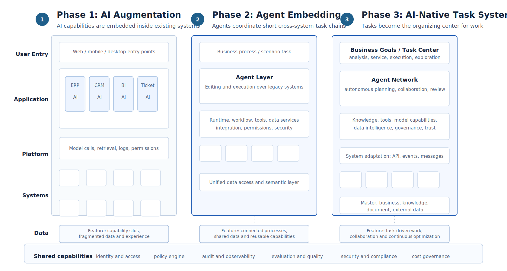
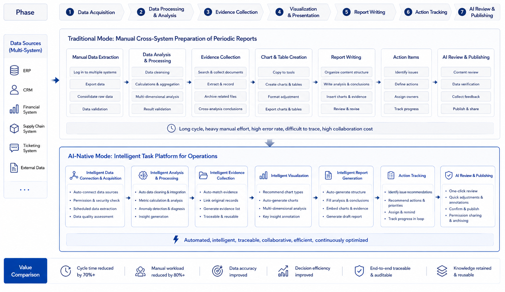
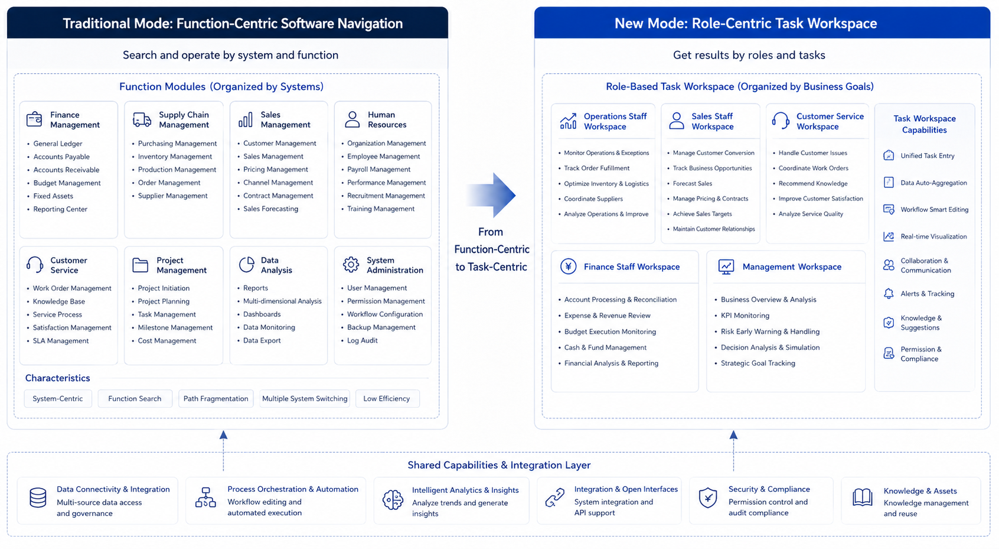

# Chapter 3 AI-Native Business Systems: Agents Reshape Enterprise Software

---

## Scenario introduction

An enterprise has already added AI functions to BI, CRM, ERP, and ticketing systems. Each system is easier to use than before: users can ask questions, summarize records, and receive anomaly hints. Yet before an operational review meeting, the owner still switches among systems, combines data manually, traces causes, and writes the meeting material. AI has been added to old pages, but the task is still stitched together by people. AI-native business systems change that division of labor. Users no longer start from a page. They hand a task to the system, such as preparing an operational analysis, handling a customer complaint, or generating quotation material. The Agent then orchestrates the underlying tools. Figure 3-1 contrasts legacy systems with added AI against systems organized around tasks.

In the past few years, many enterprise systems have gained AI entry points. BI pages support natural language questions. CRM pages summarize customer status. ERP pages warn about inventory anomalies. Ticketing systems classify complaints. Knowledge bases support semantic search. Each function saves time and improves a local experience. In real work, however, users still decide which system to open first, which table to query next, which conclusion to put into a report, and which issue needs another person to confirm.

An operational review meeting is a typical example. On Friday afternoon, the operations owner prepares material for the following Monday. They inspect sales and gross margin in BI, check shortages in the inventory system, review complaints in the customer-service system, look up last month's campaign retrospective, and finally assemble data, charts, and explanations into slides. Every system has an AI assistant beside it, but those assistants only know their own page. The BI assistant does not know whether inventory is short. The ticketing assistant does not know the campaign rhythm. The knowledge-base assistant will not write the query result into meeting material. The human remains the orchestrator of the task chain.

AI-native business systems change the organizing principle. The user moves from opening a page and completing an operation to stating a task and managing execution. After receiving "prepare operating analysis material for East China," the system needs to confirm the time range and metric definition, call BI, inventory, customer service, and knowledge tools, pause when it detects a conflict, and finally produce charts, conclusions, and to-dos with evidence. Legacy systems do not disappear. They become callable tools. Users remain in the responsibility chain; their attention shifts to goals, constraints, confirmation, and judgment.

*Figure 3-1: Comparison between Legacy Systems with Added AI and AI-Native Business Systems. Source: drawn by the author. Alt text: On the left, the "Legacy System plus AI" has an assistant attached to the original page, and the user still operates features one by one; on the right, the "AI-Native" system is task-centered, where the user states a goal and the system orchestrates multiple legacy systems to accomplish it. The comparison shows the shift of interaction entry points from pages to tasks.*

Legacy systems add localized intelligence within existing modules, while AI-native business systems take business tasks as the entry point and use Agents to reorganize underlying capabilities. Readers should distinguish AI augmentation from AI native: the former makes a page smarter, while the latter gives the system more responsibility for organizing a task. The practical judgment is also important. Not every business should become AI native immediately. Priority usually comes from whether the task crosses systems, depends heavily on documents, requires repeated diagnosis, and can keep risk under confirmation and approval.

---

## 3.1 Why "Old Systems Plus AI" Is Not the Same as AI-Native

A multi-business enterprise's digital infrastructure is not outdated. The retail division has BI, the manufacturing division uses ERP, the customer service center operates a ticketing system, the financial shared service center manages a billing platform, and the headquarters maintains a knowledge base. Over the past few years, AI capabilities have been gradually added to these systems:

- BI supports natural language queries.
- CRM can automatically summarize customer statuses.
- ERP can alert on inventory anomalies.
- The ticketing system can automatically summarize and categorize tickets.
- The knowledge base supports semantic search.

These capabilities represent genuine progress, but they have not fundamentally changed how business collaboration occurs. For example, before the group's operational review meeting, the operations director still needs to repeat the same routine: open BI to check sales data, open the inventory system to identify shortages, open the customer service system to review complaints, open the knowledge base to revisit last month's activity review, then compile all this information into a single report. Each system's AI helps locally, but none take overall responsibility for the task of "preparing a usable operational review report for the meeting."

This shows the fundamental difference between AI-augmented and AI-native systems. AI-augmented systems add smarter capabilities within existing legacy systems. AI-native systems put task completion at the center of system design. The former improves local efficiency; the latter rewrites system roles and division of labor.

## 3.2 From Page-Centered Systems To Task-Centered Systems

Many teams, when they first hear "AI native," immediately think of interface changes: buttons replaced by conversations, forms replaced by chat windows. That view is too shallow. AI-native business systems change at least four aspects.

*Table 3-1: From Entry to Interaction: Comparison Between Traditional Business Systems and AI Native Systems. Source: Compiled by the author.*

| Change | Traditional Business System | AI Native Business System |
|---|---|---|
| **Entry** | User operates within a specific system module | User states a goal or a task |
| **Process** | Process steps predefined by pages and rules | Agent dynamically organizes steps around the goal |
| **Responsibility** | Each system responsible only for its own module | Agent responsible for end-to-end task results |
| **Collaboration** | Humans switch and piece together different systems | Systems switch between tools; humans provide constraints and validation |

In the traditional model, the user's job is to "piece it together themselves"; in the AI native model, the user's role shifts to "defining goals, supplementing constraints, and deciding whether to accept results." User mindset shifts from "operating systems" to "managing tasks." There is also a deeper change often overlooked: in traditional systems, the page is the primary organizing principle of the system; in AI native systems, tasks begin to replace pages as the core organizing principle. Previously, enterprise software trained people to be "module users"; AI native systems train people to be "task initiators." These two kinds of training feed back into product design, data organization, and even departmental collaboration styles.

This change will invalidate many traditional assumptions in enterprise software. In the past, the core design question was "which page does the user perform which action on"; now, system design becomes "after the user states a goal, how does the system organize a controllable task chain." Previously, product managers mainly cared about smooth page flows; now they must also care whether task status is transparent, evidence is sufficient, risk points are identifiable, and whether the process can continue after failures.

### 3.2.1 The Relationship Between AI Native, Digitization, Automation, and Intelligence

Enterprises have already gone through multiple rounds of system upgrades: digitization, automation, and intelligence. AI native is not a new slogan popping out of thin air; it evolves on top of these stages.

*Table 3-2: Goals, System Forms, and Limitations from Digitization, Automation, Intelligence to AI Native. Source: Compiled by the author.*

| Stage | Core Goal | Typical System Form | Limitations |
|---|---|---|---|
| **Digitization** | Bring business objects and processes into the system | ERP, CRM, OA, data warehouse | Many systems with rigid boundaries; users must piece together manually |
| **Automation** | Delegate stable processes to rule execution | Workflow, RPA, approval flows | Suited for fixed processes; not good for open-ended tasks |
| **Intelligence** | Add prediction, recommendation, generation to local functions | Intelligent search, recommendations, summarization | Intelligence is local; end-to-end tasks still organized by humans |
| **AI Native** | Enable dynamic organization of capabilities around task goals | Agent workbenches, task-based agents, generative UI | Requires platform, data, governance, and organizational support |

This table illustrates that AI native does not negate previous stages. Without digitization, there are no data or systems to call on; without automation, there are no embedded process nodes; without intelligence accumulation, there are insufficient local capabilities. AI native builds on this foundation by elevating "tasks" to a new organizing center.

If a multi-line enterprise does not have ERP, BI, CRM, ticketing systems, and knowledge bases, operational analysis agents have nothing to call on; without approval flows, quotation agents cannot safely access business processes. Therefore, AI native does not overthrow past informatization. It reorchestrates existing informatization assets.

## 3.3 Legacy Systems Will Be Toolified And Reorchestrated

When discussing AI-native systems, a common misconception is that all legacy systems will be replaced by a single conversational interface. ERP, CRM, BI, ticketing, and financial systems will not disappear because Agents emerge. They embody enterprise facts, rules, permissions, auditing, and transactional consistency. Agents should not bypass these systems. They should turn them into callable, interpretable, and governable tools.

*Table 3-3: Legacy systems like ERP and CRM shift from direct page operations to providing tool capabilities. Source: compiled by the author.*

| Legacy System Role | Past | AI Native Stage |
|---|---|---|
| ERP | Users directly operate pages | Provide tool capabilities for orders, inventory, procurement, finance, etc. |
| CRM | Users maintain customers and opportunities | Provide customer context, communication history, and action suggestions |
| BI | Users view reports | Provide metric queries, semantic layers, and data explanations |
| Ticketing System | Users process tickets | Provide event streams, status changes, and disposition actions |
| Knowledge Base | Users search materials | Provide referenceable policies, cases, and documentation |

The key to AI-native systems is to gradually transform legacy systems from user-operated interfaces into tools that Agents can call within authorization scopes. If done well, user experience becomes simpler. If done poorly, Agents bypass systems, lose permission control, and produce untraceable outcomes. The emphasis in Chapter 2 on Tool Registry, Policy, and Trace reflects this principle. After legacy systems are toolified, the risk level of tools, call permissions, and outcome recording become essential platform management responsibilities.

### 3.3.1 Why User Mental Models Must Evolve Together

Many enterprises underestimate the importance of changing user mental models. As a result, system capabilities roll out, but users continue using the system in old ways, causing slow value realization. Users trained on traditional systems have a mental model like this: Which page should I go to first? What should I enter in this field? Which button leads to the next step? How do I export the results to hand off to someone else? AI native systems require a different set of skills: What exactly am I trying to accomplish? What constraints should I provide to the system? At what step is the task now? Are the results trustworthy, and do I need to confirm key points?

This is not a minor change. Users are no longer primarily system operators. They become task initiators and result adjudicators. If enterprises do not help users with this mental shift, a technically functional AI-native system may still fail to be adopted.

## 3.4 AI-Native Scenario Prioritization And Migration Order

Not all business domains enter the AI-native stage simultaneously. In practice, early migration usually fits tasks that cross systems, knowledge sources, and roles. Highly structured, strongly transactional, one-step operations usually should not be first.

*Table 3-4: Types of Tasks Suited for Priority AI-Native Transformation with Examples from a Multi-Business-Line Enterprise. Source: Compiled in this book.*

| Task Type                     | Why It's Suitable for Priority Transformation     | Example from a Multi-Business-Line Enterprise       |
|-------------------------------|--------------------------------------------------|-----------------------------------------------------|
| **Cross-System Information Integration** | High cost of manual system switching and result stitching | Operational analysis, sales review, after-sales diagnosis |
| **Document-Intensive Tasks**            | Rules and bases scattered across documents and knowledge bases | Compliance review, bid response, contract review    |
| **Draft-Type Outputs**                  | Results can be generated first, then verified by humans | Quotation drafts, weekly operation reports, customer reply suggestions |
| **Diagnostic Tasks**                    | Require stepwise narrowing-down, not single-point queries | Gross profit anomaly analysis, inventory exception root cause |

In contrast, completely structured, one-time, strong transactional processes are usually not the first to be agent-automated. For example, actions like payment, contract signing, or master data deletion won't suddenly become suited for automation just because of the phrase "AI-native." If a multi-business-line enterprise can only focus on three to five AI-native scenarios in a year, it should not pick based solely on which department is most enthusiastic. A more reliable approach is to simultaneously consider business value, task structure, data readiness, and risk controllability.

*Table 3-5: Typical Scenarios Scored Across Dimensions of Value, Structure, Data, and Risk with Recommendations. Source: Compiled in this book.*

| Scenario                    | Business Value | Task Structure | Data Readiness | Risk Controllability | Recommendation      |
|-----------------------------|----------------|----------------|----------------|----------------------|---------------------|
| Operational Analysis Material Generation | High           | High           | Medium-High    | High                 | Pilot with priority  |
| Customer Service Ticket Quality Inspection | Medium-High   | Medium         | High           | High                 | Pilot with priority  |
| Quotation Draft Generation  | High           | Medium-High    | Medium         | Medium               | Pilot with enhanced approval |
| Automatic Customer Email Reply | Medium      | Medium         | Medium         | Low                  | Proceed cautiously    |
| Automatic Payment Approval  | High           | Low            | Medium         | Very Low             | Defer Agent automation |

This prioritization is not about absolute correctness but about ensuring decision transparency. Many AI projects fail not because the scenario lacked value but because they initially chose a scenario with high value but also very high risk and unprepared data, ultimately exhausting organizational trust.

### 3.4.1 How AI-Native Systems Build Trust

Whether an AI-native system is adopted by the business ultimately depends on trust. This trust is not about "users thinking the model is smart"; it's about whether users dare to entrust real tasks to the system. Enterprise user trust typically comes from five sources.

*Table 3-6: Types of System Deliverables Required to Build User Trust. Source: Compiled in this book.*

| Trust Source           | What the System Must Provide                          |
|------------------------|------------------------------------------------------|
| **Visible Process**       | Users know what the system is doing instead of waiting blindly |
| **Verifiable Evidence**   | Conclusions can be traced back to data, documents, rules, or tool outputs |
| **Controllable Risk**     | High-risk actions require confirmation, approval, or downgrade |
| **Recoverability**        | Ability to retry, take over, rollback, or continue after failure |
| **Sustainable Improvement** | User feedback is incorporated into evaluation and version iterations |

If an Agent's output looks polished but does not provide evidence, business users at best treat it as inspiration. If it provides evidence, status, and approval gateways, users start taking it seriously as a work system. This also explains why an AI-native workbench needs more than a chat box. Chat boxes are good for expression, but they are weak carriers of trust mechanisms. Task status, evidence zones, approval controls, and replay entry points may look less "intelligent," yet they decide whether enterprise users are willing to adopt the system.

## 3.5 AI-Native Product Forms: Task Assistants, Embedded Copilots, And Agent Workbenches

The journey of a multi-business-line enterprise can be summarized in three broad phases. The first phase is **AI Augmentation**. Every system gains a degree of intelligence, but system boundaries and collaboration patterns remain fundamentally unchanged. BI is still BI; CRM is still CRM. They simply do a better job of understanding natural language and summarizing content.

The second phase is **Agent Embedding**. Agents capable of handling cross-system tasks begin to appear. instead of serving as isolated point solutions, these agents can orchestrate short task chains. Operational analysis agents, quotation agents, and customer-service quality-inspection agents typically belong to this phase.

The third phase is a true **AI-Native Business System**. At this point, what users interact with is no longer primarily a legacy system but a task-centric workbench. The system organizes its own steps, generates intermediate results, initiates approvals, and persists an audit trail, while legacy systems gradually recede to the tooling layer.

Most enterprises will spend a prolonged period between the first and second phases. The third phase is neither achieved in a single effort nor entered simultaneously across all departments. It typically begins in the business domain where the fit is strongest and then spreads gradually.

*Figure 3-2: Three-phase migration toward AI-native business systems. Source: original illustration by the authors. Alt text: Three phases shown left to right: Digitization (moving operations into systems), AI Augmentation (adding assistants to legacy systems), and AI Native (restructuring around tasks) with arrows indicating that capabilities accumulate progressively instead of replacing what came before.*

Enterprises typically move from AI augmentation within legacy systems, through cross-system agent embedding, and ultimately arrive at a task-centric AI-native business system.

### 3.5.1 AI-native systems as task workbenches

When the topic of AI-native front ends comes up, the most common misconception is that swapping a search box for a chat box counts as AI-native. That is clearly insufficient. A genuinely usable AI-native workbench must surface at least five categories of information for the user.

*Table 3-7: The role of each element in a task workbench. Source: compiled by the authors.*

| Workbench Element | Role |
|---|---|
| **Task Status** | Tells the user whether the system is planning, executing, awaiting approval, or has failed |
| **Evidence and Citations** | Tells the user which data sources, rules, and documents produced the result |
| **Structured Result Area** | Charts, tables, drafts, and action items must not all be buried inside conversation bubbles |
| **Human Takeover Entry Point** | When the system is uncertain, the user must be able to intervene, edit, and resume |
| **Approval and Confirmation Controls** | High-risk actions must not be hidden inside an ordinary message stream |

This means an AI-native front end is typically a combination of conversation, task flow, structured results, and approval controls, instead of simply a larger input box. Users do more than type "generate an operational analysis report" and wait for the system to emit a wall of text. A better experience looks like this: the system first displays the task goal and scope, asking the user to confirm that this analysis will focus on East China, gross margin, and last week's data; it then shows which metrics it intends to query and which data sources it will reference; if it discovers mid-execution that a particular metric has two conflicting definitions, it pauses and asks the user to choose; finally, it delivers charts, conclusions, citations, and action items, and allows the user to submit the output to an approval workflow for meeting materials. That is an AI-native workbench, not a report stuffed into a chat box.

*Figure 3-3: Structure of an AI-native task workbench. Source: original illustration by the authors. Alt text: The workbench is divided into zones for task objectives, execution progress, evidence sources, and human confirmation entry points; the central area shows the system invoking multiple tools to advance the task, reflecting "task" instead of "page" as the organizing principle.*

An enterprise-grade task workbench must simultaneously present task status, execution progress, evidence citations, structured results, human takeover controls, and approval confirmations.

## 3.6 Business Analysis Meeting Case Study: From Manual Material Compilation To Task Workbench

A business analysis meeting shows how AI-native systems change the way work is organized.

A multi-line business enterprise holds its weekly business analysis meeting every Monday morning. Traditionally, starting Friday afternoon, the operations lead asks each region to submit data. The data team exports reports on sales, gross margin, inventory, promotions, and customer complaints. The operations specialist manually consolidates results from multiple systems into a PPT and then consults regional managers for explanations. By the Monday meeting, materials are usually ready, but they have three problems: first, inconsistent data definitions; second, root cause analysis often relies on manual experience; third, action items and follow-ups tend to get scattered across emails and chat groups.

If AI is just used to enhance existing systems, each system becomes a little smarter. The BI tool can answer "What was the gross margin in East China last week?" The ticket system can summarize complaints. The knowledge base can retrieve promotional reviews. The user experience improves, but the operations lead still has to do manual stitching.

If the system enters an Agent embedding phase, a business analysis Agent can take over a whole task chain. The user states the objective: "Prepare the business analysis meeting materials for next Monday, focusing on East China's abnormal gross margin." The system first confirms analysis scope: time, region, metrics, meeting templates. It then queries sales, gross margin, promotions, inventory, complaints data, finds the margin decrease mainly comes from two categories, and further checks if it relates to promotional discounts, logistics costs, or out-of-stock substitution sales. If conflicting metric definitions exist, the system pauses for the user to select the preferred definition. Ultimately, it doesn't generate a chat response but a set of meeting materials: anomaly summary, charts, evidence references, possible causes, questions to confirm, and suggested actions. Users can edit conclusions or assign actions to regional managers.

If further developed into an AI-native business workbench, the change is more drastic. Business analysis is no longer just preparing materials weekly on demand but a continuously running task space. The system continuously monitors key metrics, generates tasks upon anomalies, accumulates evidence, and prompts responsible persons to add explanations. Before meetings, materials just aggregate this week's task status, evidence, and decision recommendations. After meetings, action items continue to be tracked in the same workbench. The differences across these three stages can be summarized as follows:

*Table 3-8: Human-Machine Division of Labor at Each Stage of Business Analysis Meeting: From Traditional Mode to Task Workbench. Source: Compiled by this book.*

| Stage                | What User Mainly Does                                   | What System Mainly Does                             | How Meeting Materials Are Formed                   |
|----------------------|--------------------------------------------------------|----------------------------------------------------|----------------------------------------------------|
| Traditional Mode     | Manually query, manually compile, manually ask people  | Provide reports and records                         | Manually organized                                |
| AI Enhancement       | Ask AI in multiple systems                              | Each answers partial questions                      | Manually stitch together AI outputs                |
| Agent Embedding      | Define analysis goals, confirm key nodes               | Cross-system root cause analysis, generate drafts  | Agent generates, human reviews                      |
| AI-Native Workbench  | Manage ongoing tasks and action items                   | Continuous monitoring, attribution, evidence accumulation | Workbench auto-aggregates                           |

This case shows that AI-native's essence is not "automatically writing PPTs." The real transformation is turning business analysis from one-time, ad hoc material preparation into continuous task management. The system does more than generate content. It reorganizes relationships between data, evidence, meetings, and actions.

*Figure 3-4: Business Analysis Meeting: From Manual Material Compilation to Task Workbench. Source: Self-drawn for this book.*
*Alt text: Top 'Traditional Mode' shows operations staff manually querying and compiling materials across BI, inventory, and customer service systems. Bottom 'Task Workbench' shows user setting analysis goals, system automatically retrieving data and diagnosing, generating evidence-backed materials. The arrows show the step count difference between the two paths.*

AI-native systems organize cross-system data retrieval, anomaly root cause analysis, evidence accumulation, report generation, and action item follow-up into a continuous task chain.

### 3.6.1 User Training Focus: Task Templates, Not Prompts

Many enterprises immediately organize "prompt training" after launching AI-native systems. While helpful, simply teaching users how to write prompts can misdirect focus. What enterprise users truly need to learn is not chatting with the model but expressing work as executable tasks. For example, "Help me analyze East China" is too vague. A better task definition should specify scope, goals, constraints, and deliverables: "Analyze last week's East China gross margin decline causes, focusing on comparing impact of promotions, inventory, and logistics costs; output draft meeting materials and show questions needing regional manager confirmation." This is not prompt engineering but task definition skill. Therefore, AI-native systems should provide task templates instead of a blank input box alone. Task templates help users express goals clearly and help the system consistently understand boundaries.

*Table 3-9: Roles of Various Elements in a Business Analysis Task Template. Source: Compiled by this book.*

| Template Element | Purpose                                                  |
|------------------|----------------------------------------------------------|
| Task Goal        | Clarify what to accomplish instead of asking a vague question |
| Analysis Scope   | Limit by time, region, product category, customer, process |
| Constraints      | Specify definitions, rules, risk boundaries               |
| Deliverables     | Specify report, charts, draft, recommendations, action items|
| Human Nodes      | Indicate where confirmation or approval is needed         |

A multi-line business can prepare a set of task templates for different scenarios: business analysis template, quotation draft template, customer service quality inspection template, invoice anomaly template, contract clause review template. Users start from business tasks, not from blank dialogs. This lowers entry barriers and makes platform evaluation and governance easier.

Task templates also have an added value: they solidify organizational experience. How excellent operations managers prepare business analysis meetings, how senior sales judge quotation risks, and how finance supervisors check invoice anomalies can all gradually be embedded into templates. The long-term value of AI-native systems emerges through this accumulation.

*Figure 3-5: From Functional Menus to Role Task Maps. Source: Self-drawn for this book.*
*Alt text: On the left, a functional menu tree organized by system modules; on the right, a high-frequency task map organized by roles such as operations, sales, and customer service. Arrows indicate the product organization shifting from "function-first" to "role-task-first."*

AI-native business systems should build workspaces around high-value tasks for different roles while keeping the necessary functional modules available as support.

## 3.7 Review Method For AI-Native Migration

AI-native migration should not be judged only by whether the interface has a chat entry or whether the model can generate a complete answer. The better review object is a task chain. A team can evaluate an existing process from three angles. First, does the task involve obvious cross-system stitching? If users copy information among BI, CRM, ticketing, knowledge bases, and approval systems every day, the task entry has value to reorganize. Second, does the task require explanation and evidence? Operational analysis, contract review, and service quality inspection cannot be accepted as bare conclusions; users need to know where evidence comes from and which parts require confirmation. Third, can the task be separated into actions that are automatic, confirmable, approval-bound, and forbidden? If every action is strongly transactional, heavily regulated, and difficult to reverse, migration should start with assistance and drafts.

The review must also identify the authority boundary of legacy systems. An AI-native workbench can organize tasks, but it should not replace systems of record. Customer master data should remain in CRM, orders and inventory in ERP, metric facts in the data platform and semantic layer, and contract versions in the contract system or document-governance system. The Agent may call these capabilities, explain their results, and organize them into task artifacts. It should not maintain an unauditable shadow version of enterprise facts. Many AI-native projects fail because they bypass authoritative data, approval responsibility, and change records in pursuit of a smoother experience.

The review should produce a task migration note. It states the current manual steps, which steps remain in legacy systems, which become tool calls, which are orchestrated by the Agent, where humans confirm, and which artifacts may enter downstream workflows. Product, platform, data, and security teams can then discuss the same material instead of separately debating interface, model, data, and permission. The migration goal is to move frequent, valuable, verifiable task chains into observable systems step by step, not to turn every operation into automatic execution at once.

## 3.8 Migration path for AI-native systems

AI-native business systems do not emerge by replacing every page with a chat box. A more realistic migration path starts by identifying business processes that already involve heavy system switching, manual copying, metric interpretation, and approval waiting. Those processes can then be turned into task entry points. The Agent coordinates the task: it understands the goal, calls tools, organizes evidence, waits for confirmation, and produces the final artifact. The interface may be a conversation, a workbench, a report page, or an embedded Copilot. The important change is that the task becomes the organizing unit.

Migration must protect the boundaries of existing systems. CRM, ERP, BI, the data warehouse, and ticketing systems remain systems of record. If an Agent bypasses them and maintains another version of the truth, reconciliation, audit, and permission control will break later. The AI-native layer is better understood as a task orchestration and explanation layer. It organizes existing system capabilities into a smoother workflow while keeping business data governed by the original authoritative systems. In that arrangement, the Agent platform owns intent, state, evidence, and action coordination.

The migration should usually follow three steps. First, start with an AI-enhanced page or embedded Copilot in an existing system, where risk is low and user habits remain familiar. Second, extract a cross-system task chain and let an Agent coordinate it under explicit approval and trace requirements. Third, turn repeated task chains into a role-based workbench with templates, state, evidence, structured results, and follow-up actions. The goal is not a dramatic interface change. The goal is to move real work from manual stitching to controlled task execution.

## 3.9 Migration Rhythm And Verification Evidence

AI-native migration needs rhythm. The first step is usually not rebuilding the entire system. It is finding a high-frequency task chain inside an existing system and showing users how AI reduces searching, copying, explaining, and organizing work within a familiar entry point. Examples include anomaly-explanation Copilots in BI pages, quality-inspection summaries in customer-service systems, and clause-review drafts in contract systems. The goal at this stage is to collect real questions, samples, and boundaries. Adoption patterns, repeated edits, and disputed metric definitions become material for later platformization.

The second step is extracting the cross-system chain. When a task repeatedly reads several systems, organizes evidence, generates a draft, and waits for confirmation, it can move into Agent orchestration. The system should make state explicit: task created, evidence collected, tool running, waiting for user confirmation, waiting for approval, artifact generated, submitted downstream, or failed. Once state is visible, product and engineering teams can discuss recovery. If business-analysis material generation fails, the system may rerun data retrieval, degrade to a draft, hand over to a human, or delay material submission. Those choices belong in the task chain.

The third step is turning repeated tasks into a role workbench. A workbench is more than a larger chat window. It brings templates, state, evidence, structured artifacts, approval, action items, and review into one space. At this stage, value comes from accumulated task knowledge as well as generated content: which anomalies appear repeatedly, which explanations the business accepts, which actions improve metrics, and which approval nodes block progress. The platform can feed these records back into the semantic layer, evaluation sets, templates, and tool policy, so the system becomes closer to how the organization works.

Migration success should be judged by evidence, not by demos. Teams should keep at least four materials: the manual process steps and time before migration, state records after migration, user edits and rejection samples, and quality of artifacts that entered downstream workflows. A polished generated report does not prove success when metric definitions, citations, human confirmations, and action-item execution remain invisible. AI-native acceptance should ask whether work is completed more reliably, not whether the interface feels more conversational.

## 3.10 Acceptance Material For Task Workbenches

Acceptance material for an AI-native workbench should be tied to real work, not to a scripted demo. The first material is a before-and-after process comparison: which systems users opened, which fields they copied, and which people they waited for before migration; after migration, which steps are handled by tool calls, Agent orchestration, human confirmation, or approval flows. The second material is evidence and state records: when the task was created, which data sources were read, which evidence was cited, which nodes paused, and who accepted the final artifact. The third material is user-edit samples: which conclusions users deleted, which explanations they added, and which action items they rejected. These samples show how far the system is from real work.

The workbench also needs organizational validation. A business-analysis workbench that only lets an operations lead generate slides remains at the content-generation layer if it cannot send confirmation questions to regional managers, push action items into the task system, or bring follow-up status back into the next analysis. The value of AI-native migration appears when the task keeps running: anomalies have owners, evidence has sources, decisions have records, actions have follow-up, and the next task can reuse that history. When acceptance material covers these links, the team can judge whether the workbench has changed how the business operates.

## 3.11 Migration Boundaries For AI-Native Systems

AI-native business systems do not require an enterprise to replace existing systems wholesale. A more common path is to identify tasks that need natural-language understanding, tool orchestration, evidence citation, and human review, then extract those tasks into manageable chains. Orders, customers, contracts, tickets, reports, and approvals can remain in existing systems. The Agent platform organizes tasks across them, preserves evidence, and handles exceptions. Migration then becomes a task-centered runtime layer instead of a large rebuild.

Migration boundaries should state read and write responsibility. Read-only queries can enter Agent workflows earlier. Actions that change business state need Tool Registry, Policy Engine, HITL, and Trace to be ready together. Cross-system writes need idempotency, compensation, and rollback. Many projects fail because Agents take over write operations before old systems expose recoverable interfaces and before business teams define ownership. AI-native construction should start with tasks whose evidence is strong and whose risk is manageable.

Migration should also preserve user habits. Enterprise users already know filters, approval flows, reports, and field names in existing systems. Natural language can lower the entry barrier, but it should not hide every old operation inside a black box. A first version is better used to explain the current task, recommend the next step, call governed tools, and write results back to auditable locations in existing systems. Once operating evidence is stable, more workflows can move into AI-native experience.

## 3.12 Organizational acceptance signals after migration

After an AI-native migration, acceptance should not depend only on whether users open the new entry point. More useful signals come from whether the task has changed: whether users copy less information across systems, whether anomalies enter meetings with evidence, whether action items move into downstream systems, and whether human edits are recorded and returned to the platform. If users still copy Agent output into documents and process it manually, the system has added a generation entry point without changing the way work is organized.

Acceptance should also check whether responsibility is clearer. In legacy systems, responsibility often sits with the operator. Once an AI-native workbench introduces Agents, responsibility spreads across data owners, tool owners, approvers, report reviewers, and platform owners. Launch review should verify that each important point has an owner, especially metric-definition conflict, wrong automatic suggestion, approval timeout, and unfinished action item. When ownership is unclear, a smoother experience can hide more risk.

A first AI-native migration can track a small set of observable indicators: task completion time, cross-system switches, user rewrite rate, human rejection reason, evidence click-through, action-item completion, and incident review count. These indicators do not prove success by themselves, but they show whether the migration is moving in the right direction. AI-native maturity is less about a conversational interface and more about whether the organization starts operating around tasks, evidence, and responsibility.

## 3.13 Review material for task workbenches

After a task workbench goes live, it should preserve review material: task template, user input, system calls, evidence references, human edits, action items, and final state. Without these records, the team can only judge whether the interface feels convenient. It cannot tell whether the AI-native migration reduced cross-system copying, metric disputes, or follow-up gaps after meetings.

Review material also helps the product converge. If users repeatedly delete one conclusion type, the report template or evidence choice is weak. If users often add the same explanation, the semantic layer or knowledge base is missing content. If action items are not accepted by downstream owners, the workbench is not connected to the real process. AI-native migration improves through these operating records.

## 3.14 Reverse correction after AI-native migration

AI-native migration also needs a reverse-correction mechanism. Real tasks after launch expose problems that early design cannot see. Users may bypass certain tools repeatedly because the task chain does not match their habits. Reports may be rewritten by reviewers because templates or evidence selection are unstable. Action items may receive no owner because the workbench is not connected to the real organization process. Approval nodes may stay open because responsibility and notification were underdesigned. These problems should not be dismissed as training issues. They should feed task design, semantic layers, tool contracts, approval flow, and evaluation samples.

Reverse correction needs a fixed entry point. Each month, a task workbench can sample real Runs and inspect user rewrites, tool failures, evidence replacement, approval rejection, and action-item closure. Product teams revise the workbench flow, data teams improve semantic layers and knowledge bases, platform teams adjust Runtime, Registry, and Trace, and security teams add policy samples. AI-native migration then becomes continuous improvement after launch.

A first version can limit reverse correction to a few frequent tasks. A business-analysis workbench may track anomaly explanations, evidence citation, action assignment, and meeting-material export. A customer-service workbench may track quality-inspection summaries, knowledge citation, ticket creation, and human takeover. Each task type gets review samples, an owner, and the next revision plan. Migration quality does not come from designing the full system in one pass. It comes from using real tasks to keep correcting platform capability.

## 3.15 Operating calibration after AI-native migration

After AI-native migration finishes, teams still need operating calibration. The old system usually used pages, buttons, and approval flows as boundaries. The new system uses tasks, Runs, tool calls, and artifacts. Users may find the task entry more natural, but they may also lose visibility when the system decomposes steps automatically. Business owners may see faster delivery while responsibility records, human review, and exception recovery remain unclear. Migration acceptance should inspect runtime semantics along with interface usability.

Calibration should start from real task samples. Teams can choose tasks that existed before and after migration, such as meeting-material preparation, contract-clause lookup, operating-metric explanation, ticket assignment, and report publication. Comparison should include completion time, shorter user input, quality of clarification, reduced manual copying through tool calls, evidence completeness, correct approval routing, and recovery from exceptions. Migration value then lands in the task path instead of a vague feeling that the interface is more intelligent.

Calibration also needs to handle user-habit changes. AI-native systems hide some previously explicit operations in the background, which can reduce user control. They also make some previously implicit judgments visible, which can make the process feel longer. Product design should expose high-risk actions, waiting states, evidence references, and human nodes so users understand what the system is doing. Low-risk tasks can reduce intermediate confirmation. Tasks that change business state should keep explicit confirmation and withdrawal paths.

A first version can run a 30-day review after each migration scenario goes live. The material includes task completion, human takeover, user cancellation, tool failure, report rejection, approval timeout, and user feedback. If users frequently return to the old system, the task entry or runtime explanation is weak. If Agent completion is high but disputes are frequent, evidence and responsibility records are weak. AI-native migration quality should be verified through operating calibration.

## 3.16 Changes in user work patterns during AI-native migration

AI-native migration eventually changes how users work. Traditional systems bring users to pages, menus, and fields, and users decide the next step themselves. A task workbench places goal, evidence, tools, and artifacts in one runtime path. Users no longer only click buttons. They confirm plans, add evidence, review artifacts, handle exceptions, and decide whether to publish. If product design still follows page functions, AI capability becomes another entry point without changing task completion.

This change needs expectation management. Users need to know which actions the Agent performs automatically, which actions require their confirmation, which conclusions are drafts, and which outputs have entered a formal process. Business owners also need to know which evidence the system keeps, which feedback enters evaluation, and which errors trigger human review. The usability of an AI-native system depends on model capability and on whether users understand their position in the task path.

A first migration can choose one frequent but controllable task, such as operating-analysis material preparation, initial contract-clause review, or support knowledge Q&A. The team should first make input, tools, evidence, approval, and artifact governance work together, then expand to more workflows. AI-native migration then moves from adding an assistant to reorganizing systems around tasks, which also explains why the later platform-engineering chapters matter.

## 3.17 Engineering judgment for AI-native systems

After AI-native business systems reaches production, a successful demo is not enough evidence. The platform needs stable fields for task boundary, data contract, human review, system feedback, and operating metric, and those fields should connect to release records, Trace, evaluation samples, and incident notes. When a production issue appears, teams can follow one set of facts to understand scope, ownership, and repair order instead of stitching together model logs, business logs, and verbal explanations.

This evidence also connects the surrounding chapters. It links to Chapter 22 on Runtime, Chapter 32 on DataAgent, and Chapter 53 on organizational governance: upstream capabilities provide assumptions, downstream capabilities consume the result, and governance capabilities preserve evidence and review decisions. If these materials do not share identifiers and versions, the production system splits apart. Business owners see user complaints, platform owners see system errors, and security or compliance teams see explanations written after the fact. That separation makes it hard to decide whether the issue came from data, model behavior, tool contracts, workflow state, or organizational ownership.

Common production risks include teams treating a chat entry as a business system, model advice being stored as process state, and missing review or withdrawal mechanisms. These risks are less visible during demos because demos usually exercise the successful path. Production users bring boundary cases, repeated requests, permission changes, and long-running state. The platform team should turn such failures into release samples. Some samples should block launch, some can be handled by degradation, and some require the business owner to accept the remaining risk with a review date.

AI-native systems should begin with business state and responsibility chains, then decide how the model participates. The record can stay compact, but it should include time, version, owner, sample, action, and the next review condition. Without those fields, review remains informal experience. With them, one production issue can become material for later releases, evaluation suites, and training.

A first platform version can start with a small set of high-risk paths. Choose flows with high traffic, high business impact, or sensitive data, require an evidence package for each change, and then expand the practice to ordinary scenarios. This keeps the capability at the engineering level: runnable, explainable, and recoverable.
## 3.18 Launch threshold for AI-native business systems

The launch threshold for an AI-native business system should be higher than that for a conversational application. If the system changes ticket state, generates business reports, triggers approval, calls external tools, or affects customer communication, it has entered the business process. Acceptance should then inspect more than fluent model answers. It should verify traceable state, withdrawable tool actions, effective human review, and user understanding of result confidence.

The threshold can have three layers. The first is task boundary: which requests can be automated and which stay in assisted mode. The second is operating evidence: each Run should have input, plan, tool actions, output, human actions, and final artifact. The third is organizational ownership: business owner, platform owner, data owner, and security contact should all exist. If one layer is missing, the system may remain a pilot, but it should not expand into core business processes.

## Chapter Recap

AI native does not mean adding another chat box to a legacy system. It means organizing the system around tasks instead of pages. Legacy systems continue to provide facts, rules, permissions, audit records, and transactional consistency, but they increasingly expose those capabilities as tools that Agents can call under governance.

The first AI-native scenarios should usually be cross-system, document-intensive, draft-oriented, or diagnostic tasks where risk can be controlled through confirmation and approval. The frontend should be a task workspace with status, evidence, structured results, takeover, and approval controls. AI-native transformation affects product design, data foundations, platform capabilities, security, and business collaboration at the same time. The next chapter turns these conclusions into the full-book map.

## References

Yao, S. et al. (2023). [*ReAct: Synergizing Reasoning and Acting in Language Models*](https://arxiv.org/abs/2210.03629). ICLR.

Schick, T. et al. (2023). [*Toolformer: Language Models Can Teach Themselves to Use Tools*](https://arxiv.org/abs/2302.04761). NeurIPS.

Model Context Protocol. (n.d.). [Specification and documentation](https://modelcontextprotocol.io/).

NIST. (2023). [*AI RMF 1.0*](https://www.nist.gov/itl/ai-risk-management-framework).
