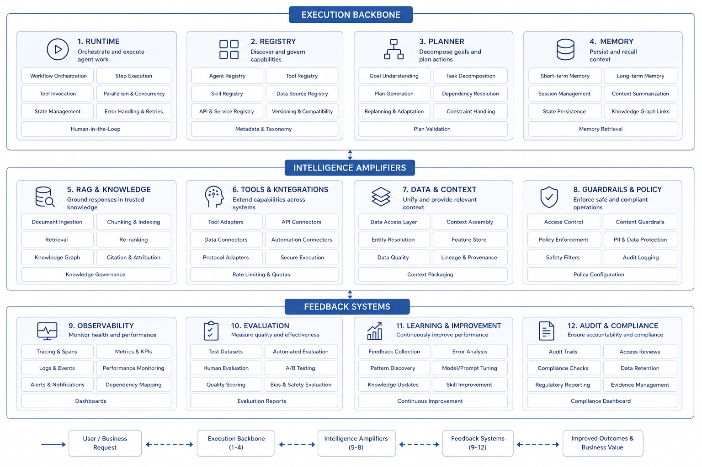

# Chapter 4 Full-Book Map: Platform Reference Architecture And Reading Path

---

The first three chapters discussed Agent boundaries, why enterprises move toward platformization, and what AI-native business systems mean. By this point, many concepts have appeared: Runtime, Tool Registry, RAG, semantic layer, evaluation, gateway, security, and organizational responsibility. Without a map, later chapters can easily become a pile of components, and readers may struggle to decide which layer should own a given problem. The most common confusion in enterprise Agent platform work is not a shortage of terminology. It is the lack of relationships among the terms. A business owner says the company needs an operational analysis Agent. The data team hears NL2SQL. The platform team hears Runtime and tool invocation. The security team hears permission and audit. The frontend team hears a chat workbench. Everyone is talking about Agent, but each group is solving a different layer of the problem. Without a shared map, the project swings among model, data, tools, interface, and governance.

This chapter turns the conceptual judgments of the first three chapters into a usable reading map. An enterprise Agent platform can be divided into four layers: business tasks, execution capabilities, data and knowledge foundation, and governance and operations foundation. Around these four layers, later chapters repeatedly return to eight capability clusters. DataAgent runs through the book because it exposes model, data, tool, evaluation, security, and frontend issues at the same time, not because question answering over data is fashionable. A business-metric anomaly can pass through almost every core capability in the platform.

The map also helps readers locate current pain points. Slow model responses may point to inference service, context construction, or gateway policy instead of model replacement. Inaccurate data answers may point to semantic layer, field permissions, or missing evaluation sets instead of a weak NL2SQL model. Chaotic tool calls may point to missing Registry, Policy, and Trace instead of a framework problem. A frontend that feels like a chatbot may lack task state, evidence, and business actions in the interaction model instead of visual polish.

This chapter covers the reference architecture, capability clusters, platform layering, the DataAgent mainline, reading paths, and a build roadmap. Readers do not need to memorize every module name here. The important habit is to ask where a platform problem sits, which prerequisite capabilities it depends on, and which later chapters should be read next. When a new Agent scenario is proposed, the team can walk through the four layers: whether the business task is clear, whether the runtime supports pause, resume, and human confirmation, whether data and knowledge have permission and definitions, and whether governance has evaluation, audit, and cost boundaries. If these questions cannot be answered, the project may still be a good pilot, but it should not be promised as production.

Figure 4-1 is closer to a reading coordinate system than a product architecture blueprint. It places business tasks, Agent capabilities, data and knowledge, and governance infrastructure in the same diagram so the later chapter order becomes easier to understand.

*Figure 4-1: Four-layer reference architecture for enterprise Agent platforms. Source: original diagram by the authors. Alt text: Four layers from top to bottom: business task layer, Agent capability layer, data and knowledge layer, and governance and infrastructure layer. Each layer lists its core responsibility. Arrows show upper tasks depending on lower capabilities, while lower layers provide constraints and support.*

From business task layer to Agent capability layer, data and knowledge layer, and infrastructure and governance layer, platform capabilities must form a whole around the task execution chain. Later chapters are not arranged by technology popularity. They follow enterprise platform dependencies. A chapter that looks low-level, such as model routing, data contracts, or GPU scheduling, still serves one goal: making Agent task execution controllable, reusable, and evaluable. A chapter that looks product-facing, such as conversational UI or Generative UI, still needs to be understood together with evidence, permission, and run state.

---

## 4.1 Role Of The Overview Map

The first three chapters answered three questions: what an Agent is, why enterprises move toward platforms, and what AI-native business systems are. Readers can now judge whether a system belongs in the Agent category and can distinguish platform, framework, and AI-native system. Without a global map, these judgments still scatter. An enterprise Agent platform cannot be understood as a single technology or a component list. It involves models, data, knowledge, tools, process, frontend, evaluation, security, deployment, and organizational collaboration. If readers only remember that Runtime, semantic layer, or evaluation matters, but do not know their dependencies, the rest of the book becomes fragmented knowledge accumulation.

A platform leader in a multi-business enterprise needs to answer more than which modules are available. The harder questions are which foundation capabilities must exist before the first production Agent goes live, why DataAgent cannot be reduced to NL2SQL plus charts, how Runtime, Tool Registry, approval, trace, and evaluation relate to one another, why the book covers models, data, and knowledge before Agent capabilities and business systems, and how different readers should read selectively without losing the dependency chain. Chapter 4 compresses the first three chapters into an executable reading map. It does not restate the table of contents. It explains where each later chapter sits in the platform, which problem it solves, and which chapters it depends on.

## 4.2 Four-Layer Reference Architecture: From Business Tasks To Governance Foundation

Enterprise Agent architecture diagrams often fail by listing too many components too early. The overview is more useful when it starts with four layers. The first is the business task layer, where users perceive value: DataAgent, quotation Agents, ticket Agents, operational analysis workbenches, sales taskboards, and other AI-native business systems. It answers what business tasks the enterprise completes with Agents.

The second is the Agent capability layer. It decides how Agents are organized and run: task state, tool invocation, planning strategy, long-running tasks, human intervention, multi-Agent collaboration, protocol choice, and framework choice. It answers how Agents advance tasks. The third is the intelligence and data layer, which supplies the ingredients for Agent capability: model inference, structured output, RAG, knowledge engineering, semantic layer, lakehouse, OLAP, metadata, lineage, and metric definitions. It answers what Agents rely on to understand, judge, and generate results. The fourth is the infrastructure and governance layer, which keeps the system operating over time: model deployment, gateway, multi-tenancy, observability, evaluation, cost, rate limiting, degradation, security, compliance, and organizational mechanisms. It answers how Agents are operated in a stable, trusted, and controllable way.

*Table 4-1: Core questions and corresponding chapters of the four-layer reference architecture. Source: compiled by the authors.*

| Layer | Core Question | Main Corresponding Chapters |
|---|---|---|
| Business task layer | What business tasks are completed with Agents? | Part VI, Part XI |
| Agent capability layer | How do Agents plan, invoke tools, and execute long tasks? | Part V |
| Intelligence and data layer | What models, data, and knowledge do Agents use? | Part II, III, IV |
| Infrastructure and governance layer | How is the system deployed, observed, evaluated, secured, and operated? | Part VII, VIII, IX, X |

The four-layer structure helps readers place problems in the right location. Without this layer map, enterprises often make two mistakes. One is to push every problem down into the model: missing semantic layers, chaotic tool contracts, and unclear approval boundaries are blamed on weak models. The other is to lift every problem into the business domain: inconsistent trace, missing evaluation samples, and unrecoverable runtime state are dismissed as complex business scenarios. The four-layer architecture gives teams a common language for both kinds of diagnosis.

The layers also have dependency order. The business task layer proposes goals, but it cannot bypass runtime and call the model directly. The Agent capability layer advances tasks, but it must obtain trusted context from the data and knowledge layer. The data and knowledge layer provides evidence, but it must obey permissions, audit, and cost constraints from infrastructure and governance. Once the dependency order is clear, platform construction stops being parallel feature accumulation. A frontend workbench can be prototyped early, but without trace and approval events it cannot support high-risk actions. DataAgent can start with NL2SQL, but without semantic layer and permission control it cannot be opened to multiple departments.

## 4.3 Eight Capability Clusters: Platform Skeleton, Intelligence Amplification, And Feedback System

Inside the four layers, the skeleton of the Agent platform is a set of capability clusters that recur throughout the book. This book groups them into eight. Runtime handles how tasks are created, advanced, paused, resumed, and terminated. Registry handles how tools, Agents, capabilities, and versions are managed uniformly. Planner handles how the system decides the next step instead of staying at text generation. Memory handles how session state, long-term preferences, and task context continue across time. RAG / Knowledge handles how documents, metadata, and knowledge context enter the Agent. Observability handles how trace, logs, metrics, and session replay are recorded. Eval handles how teams decide whether a version improved or regressed. Policy handles how permissions, masking, approval, and security boundaries are enforced.

These eight clusters should not be read as a feature checklist. They correspond to long-term platform responsibilities. Without Runtime, the system can demonstrate but cannot execute reliably. Without Registry, tools multiply and become unmanageable. Without Planner, the model freely follows the wrong path. Without Memory, long tasks and multi-turn tasks drift quickly. Without RAG and knowledge engineering, the system cannot connect enterprise context. Without Observability, errors cannot be explained. Without Eval, version quality becomes a matter of feeling. Without Policy, privilege overreach, leakage, and approval bypass will eventually appear.

Another way to read the eight clusters is through three groups. Runtime, Registry, and Policy form the execution skeleton, allowing Agents to be run and constrained uniformly. Planner, Memory, and RAG / Knowledge form intelligence amplifiers, allowing Agents to understand context and advance dynamically. Observability and Eval form the feedback system, keeping the platform from becoming a black box. Later chapters expand many technologies, but this grouping remains useful: the current topic is either strengthening the execution skeleton, amplifying intelligence, or improving feedback.

*Figure 4-2: Eight capability clusters of enterprise Agent platforms. Source: original diagram by the authors. Alt text: Eight clusters are grouped into execution skeleton (Runtime, Registry, Policy), intelligence amplifiers (Planner, Memory, RAG/Knowledge), and feedback system (Observability, Eval). Lines show invocation and feedback relations among clusters.*

## 4.4 DataAgent Mainline: Making Full-Stack Capabilities Visible

This book covers more than DataAgent, but uses DataAgent as the mainline scenario. The reason is that DataAgent naturally crosses the major layers of an enterprise Agent platform. A seemingly simple question such as "what caused the gross margin anomaly in East China last week" triggers multiple system problems at once.

*Table 4-2: Why DataAgent appears across every architecture layer. Source: compiled by the authors.*

| Layer | Why DataAgent Cannot Be Bypassed |
|---|---|
| Model layer | It must understand the question, plan a path, generate SQL, and explain results |
| Data layer | It needs semantic layer, metric definitions, lakehouse, OLAP, and data quality |
| Knowledge layer | It needs metadata, historical analyses, business terms, policies, and cases |
| Agent layer | It needs Runtime, tool calls, Planner, state management, and human intervention |
| Governance layer | It needs permission control, trace, evaluation, cost, and audit |
| Frontend layer | It needs charts, tables, citations, reports, and task workbench |

DataAgent is a good mainline scenario because it makes the major layers visible at the same time. If a DataAgent request is decomposed, a multi-business enterprise has at least seven checkpoints. Task creation must confirm user identity, tenant, and question scope. Context loading must obtain metric definitions, historical analysis, and accessible data. Path planning must decide what to query first, what comes next, and whether multiple tools are needed. Tool execution must constrain SQL, API, and Python actions. Result interpretation must separate facts, inferences, and suggestions. Governance recording must leave trace, cost, approval, and risk evidence. Result delivery must provide charts, citations, conclusions, and follow-up actions.

If DataAgent is misunderstood as natural language to SQL, the platform roadmap is skewed from the first day. DataAgent connects data intelligence, Agent execution, AI-native workbench, and enterprise governance. Part VI therefore has a mainline role in the book. It should not be read as an isolated case. A business-metric anomaly passes through task runtime, semantic layer, metadata, RAG, Planner, model gateway, SQL / Python tools, trace, evaluation, and result delivery.

*Figure 4-3: End-to-end DataAgent task chain. Source: original diagram by the authors. Alt text: A horizontal chain starts from a user question and moves through intent understanding, semantic-layer compilation, SQL generation and execution, result explanation, and visualization. Each step marks its dependent platform capability cluster and ends with an evidence-backed business conclusion.*

## 4.5 Book Organization Sequence: Expanded By Platform Dependency

Many books on Agents start with chat interfaces, prompts, or tool calls. That order is easy to enter, but enterprise implementation soon hits a problem: frontend experience moves quickly while semantic layer, evaluation, permission, runtime, and audit are not ready. This book follows the dependency order by which an enterprise platform forms. It first covers models and inference, because later Agent decisions depend on inference, structured output, model routing, and inference optimization.

It then covers data infrastructure and knowledge engineering, because enterprise Agent differences often come from whether the system can safely connect to correct data, definitions, and knowledge, instead of from the model itself. Agent foundation capabilities come next: after models, data, and knowledge exist, it becomes meaningful to discuss Runtime, Tool Registry, MCP, Planner, Memory, HITL, multi-Agent collaboration, and framework choices. DataAgent then pulls these foundation capabilities into a real business scenario. Observability, evaluation, cost, deployment, frontend, security, compliance, and organization come after that because they determine whether the platform can operate for a long time instead of remaining a demo.

*Table 4-3: Book parts and their position in the dependency chain. Source: compiled by the authors.*

| Book Part | Why It Appears Here |
|---|---|
| Part II Model and inference layer | Establishes model capability and structured-output foundations |
| Part III Data infrastructure layer | Establishes accessible, trusted, governable data foundation |
| Part IV Vector, retrieval, and knowledge engineering | Lets Agents connect to enterprise unstructured knowledge |
| Part V Agent foundation capabilities | Builds task execution, tool invocation, and collaboration mechanisms |
| Part VI DataAgent mainline deep dive | Uses one comprehensive scenario to connect full-stack capabilities |
| Part VII-X Production and governance | Completes observability, evaluation, cost, deployment, security, and organization mechanisms |
| Part XI Case collection | Transfers platform capabilities to more business Agents |

This order comes from engineering dependency. Readers can skip around, but they should keep upstream and downstream dependencies in view. Chapter 4 provides both a technical map and a reading map. Platform leaders and CTOs can first focus on platform boundaries, yearly roadmap, cost, governance, and organizational collaboration, especially Chapter 1, Chapter 2, Chapter 4, and Parts VII to X. Architects should read through the four-layer architecture, eight capability clusters, and chapter dependencies before entering Runtime, Tool Registry, RAG, evaluation, and deployment. Data-intelligence engineers should prioritize semantic layer, RAG, DataAgent, NL2SQL, and evaluation. AI application developers can start with Runtime, tool integration, task workbench, and result delivery. Security and compliance leads can focus first on permission boundaries, approval, trace, evaluation, Guardrails, and regulatory controls.

When a team reads Part I together, it can use Chapter 1 and Chapter 2 to align concepts: whether Agent, platform, framework, and Workflow refer to the same things across the team. Chapter 3 helps decide which business systems deserve AI-native reconstruction and which only need an AI entry point on an existing system. Chapter 4 then maps those judgments onto the team roadmap. Teams should mark current projects on this map: which projects have only business task and frontend entry, which have model and RAG but lack evaluation and permission, and which have tools connected while tool registration, approval, and audit remain scattered. This prevents the illusion that every team is building a platform and helps managers decide which capabilities should be built centrally.

Readers with active projects can also enter by pain point. If Agent behavior is unstable, read Runtime, Planner, Trace, and Eval first, and check whether Prompt is carrying too much system responsibility. If data answers are inaccurate, return to semantic layer, schema linking, NL2SQL, and DataAgent evaluation. If tools multiply and risk becomes hard to control, read Tool Registry, Policy, approval, and cost governance. If the platform roadmap is unclear, return to Part I, cost, security, and organization. If the frontend feels like a chatbot instead of a workbench, connect Chapter 3's AI-native business systems with Chapter 47's conversational UI and Chapter 48's Generative UI. This map makes the book closer to a working handbook. It can be read from front to back, or by problem.

## 4.6 One-Year Build Roadmap: From First Pilot To Platform Replication

If a multi-business enterprise wants to build an enterprise Agent platform from zero to serving multiple business lines within one year, the reasonable pace is to accumulate shared capabilities around real scenarios instead of starting with a large all-in-one platform. Table 4-4 separates technical, governance, and organizational focus by quarter to show which shared assets should be created at each stage. The quarters are not fixed dates; real projects should adjust the pace according to business risk, team capability, and existing infrastructure.

*Table 4-4: Technical, governance, and organizational focus by quarter in a one-year build roadmap. Source: compiled by the authors.*

| Phase | Technical Focus | Governance Focus | Organizational Focus |
|---|---|---|---|
| Q1 | Runtime, model entry, tool registration, basic trace, first pilot | Tool risk levels, minimal approval rules | Clarify platform-team boundary and business pilot owners |
| Q2 | Evaluation, cost aggregation, approval integration, basic management UI | Evaluation sample templates, launch admission standards | Establish scenario co-creation and review mechanism |
| Q3 | Semantic layer, RAG, more tools, second business-line replication | Unified data definitions, permissions, and trace conventions | Drive business teams to onboard through templates |
| Q4 | Canary, degradation, SLO, vendor integration, platform catalog | Incident review, version governance, compliance checks | Establish platform operating rhythm and annual roadmap |

The quarter labels matter less than the order. Stabilize the execution chain first, then scale and organize. Each stage should produce one reusable shared asset. Q1 should leave a unified task-state model and tool-risk levels. The former allows Runtime, Trace, approval, and recovery to speak the same language; the latter lets new tools be judged quickly. Q2 should fix evaluation sample templates and launch admission lists so later scenes do not reopen the question of how to prove launch readiness. Q3 should establish semantic-layer conventions, data-permission conventions, and knowledge-access conventions, because the second business line usually exposes friction in metrics, field permissions, document boundary, and owner responsibility. Q4 should produce a platform catalog, review template, cost report, and quality operation report, moving the platform from project delivery into continuous operation.

These shared assets do not look like product features, but they decide whether the platform can be reused. Without a task-state model, every Agent invents its own labels for running, waiting for approval, and failed retry. Without evaluation templates, every launch relies on live demo. Without semantic layer and permission conventions, DataAgent stalls as soon as it crosses departments. Without review and operation reports, the platform team can prove that it did many things but cannot prove whether platform quality improved, unit invocation cost decreased, or business lines reused capabilities. During roadmap review, teams should check whether the second scenario reused the assets from the first. If the tool-registration convention from the first scenario is bypassed in the second, the convention has not become real. If the evaluation template from the first scenario cannot serve the third, the example structure is too customized. The signal of platformization is not more documents; it is fewer repeated steps in later onboarding.

This is also why the book uses DataAgent as the mainline. The goal is not to pull every chapter toward data Q&A, but to provide a reusable platform sample. Model layer, data layer, knowledge layer, Agent layer, frontend layer, and governance layer all expose gaps in this sample. After reading any part, readers can return to DataAgent and ask how the capability makes one business analysis task more trustworthy, more controllable, and easier to review. Many platform roadmaps fail because they list only technical goals and omit governance and organizational goals. Technical goals alone produce platforms that are built but underused. Governance goals alone produce many rules and few adopters. Organizational goals alone produce discussions without a runnable foundation. The three must advance together.

The first roadmap should also keep scope restrained. Annual plans often list model gateway, RAG, DataAgent, multi-Agent, automated approval, evaluation platform, and security governance at once, and then every item remains a prototype. A steadier route is to choose one mainline scenario that crosses the whole chain, make task state, tool registration, permission, trace, evaluation, and release process work, and then use the second business line to test reuse. Platform capability is proven by the second scenario doing less repeated work, not by a complete-looking catalog.

## 4.7 Reading The Mainline Of The Book

The map in this chapter should be read as a production chain instead of a module list. An enterprise Agent starts from a user task, passes through model capability, data context, tool action, run state, evaluation feedback, security and compliance, and organizational operation, and eventually becomes a maintainable business system. Missing any layer can break the system between pilot and production.

Readers can use the map in two ways. The first is top-down reading: build the platform view first, then understand model, data, tool, runtime, and governance capabilities layer by layer. The second is problem-driven lookup. If the current project is stuck on data-answer accuracy, focus on Chapter 33 through Chapter 39. If it is stuck on tool execution and approval, focus on Chapter 22 through Chapter 30. If it is stuck on production stability, return to Chapter 38 through Chapter 52. Later chapters keep the same pattern: first the scenario and boundary, then architecture and engineering implementation, then operating evidence and launch judgment. This prevents readers from treating an Agent platform as a set of product features. The system to build is an engineering structure that constrains model output into enterprise action, connects action to evidence, and connects evidence to responsibility.

## 4.8 Mapping Existing Projects To The Book Map

Many readers will not start from a blank platform. They may already have several pilots: a knowledge assistant, a metric Q&A page, an approval-draft generator, a customer-service quality script, or a chat interface connected to a few tools. The useful reading action is not to rename these projects first, but to map them onto the four-layer architecture and the eight capability clusters. For each project, write down the user task, then mark the model, data, knowledge, tools, run state, evaluation, security, and frontend capabilities it depends on. The gaps usually become visible quickly. Some projects have only frontend and prompt, with no Runtime. Some have RAG without document versions or permission filtering. Some can call tools but lack Registry, Trace, and approval events. Some have evaluation but no way to bring online failure samples back into the test set.

This mapping also guides investment. If several pilots repeat model integration, tool adapters, and logging, the platform should prioritize the model gateway, Tool Registry, and Trace. If several pilots are blocked by metric definitions and field permissions, semantic layer, metric governance, and data access policy should come before another round of Agent framework selection. If business users do not trust the result, the issue may lie in evidence presentation, citations, review entry points, and failure explanation; the model may be only one part of the problem. The purpose is not to score every project. It is to turn scattered pain points into a platform roadmap, so a local success is not mistaken for platform maturity and one failed pilot does not invalidate the whole direction.

For managers, the same mapping clarifies ownership. Business teams own scenario goals, acceptance samples, and operating outcomes. Platform teams own reusable foundation, runtime evidence, and release gates. Data teams own definitions, permissions, and quality. Security and legal teams own policy, audit, and review requirements. A project with only a business owner and no platform owner will lose control over tool governance and run responsibility. A project with only a platform owner and no business owner will become a general capability with weak adoption. Mapping existing projects back to the book map turns the reading path into an organizational collaboration path. Later chapters can be selected from this mapping, and the mapping can also correct the team's annual roadmap.

## 4.9 From Map To Review Actions

The map has to become a review practice. In many enterprise discussions, everyone agrees that a new Agent scenario is worth a pilot, but nobody writes down the distance between a pilot and production. Chapter 1 discussed boundaries, Chapter 2 discussed platformization, and Chapter 3 discussed AI-native business systems. This chapter turns those judgments into questions that a team can review. When a scenario enters planning, start by writing the task chain: what goal the user states, which data the system reads, which tools it may call, which steps change business state, and who consumes the final artifact. After that, place every step on the four-layer architecture. If a step has no owner in the map, the team has not decided whether it belongs to the business application, the platform, the data foundation, or governance.

The review should separate a working demo from an operable system. A knowledge assistant that answers policy questions has model, retrieval, and frontend pieces, but without document versions, permission filtering, citations, and failure-sample return, it remains a pilot. A DataAgent that generates SQL has model and semantic-prompt capability, but without metric definitions, query isolation, field permissions, and SQL replay, it is not ready for multi-department use. An approval-draft Agent that writes email can demonstrate generation quality, but without approval object, release authority, outbound audit, and rollback path, it should not replace the formal process. The map helps the team write down these gaps explicitly, so a smooth demo does not stand in for production judgment.

A review using this map should produce three kinds of decisions. The first is an admission decision: exploratory prototype, controlled pilot, limited production, or platform catalog entry. The second is a gap decision: missing semantic layer, Tool Registry, Runtime state, evaluation samples, HITL, Trace, security policy, or workbench experience. The third is an ownership decision: which gaps need business samples, which need data definitions, which need platform capabilities, and which need security or compliance gates. Without these decisions, the roadmap tends to collapse into vague statements about improving the model or improving the platform, and later reviews cannot tell what was actually completed.

The review meeting does not need to be heavy, but it should be evidence-led. Business teams bring real tasks, failure examples, and adoption criteria. Platform teams bring reusable capabilities and known limits. Data teams bring metric definitions, permission boundaries, and data-quality status. Security and compliance teams bring risk levels and audit requirements. By the end, the team should be able to place the scenario on the book map: which chapter capabilities it depends on, which are ready, and which must be built next. The rest of the book goes into implementation detail, but the judgment returns here: whether a capability makes the task chain clearer, the runtime evidence more complete, and the responsibility boundary easier to enforce.

## 4.10 Reader Expectations and Version Boundary

The book map also manages reader expectations. This is not a handbook that grows from isolated tricks into a complete system by accumulation. It is closer to a construction and review framework for enterprise Agent platforms. Different readers will use it differently by stage. At the first pilot, the main question is task boundary and platform boundary. At the second scenario, the main question is which capability can be reused and which remains business-specific. At scale, the main question is whether runtime evidence, cost, SLO, security, and organizational responsibility can keep up. Chapter 4 puts these questions on one map so later chapters do not become disconnected technical essays.

This book has a clear boundary. It brings the main platform capabilities to a level where they can be reviewed, implemented, and operated, but it does not turn every industry scenario into a full case study. It also does not present the mini-platform as a replacement for a commercial enterprise system. The mini-platform provides the smallest runnable path, showing how Runtime, Registry, semantic layer, Trace, Eval, HITL, and related capabilities connect. A real production system still has to integrate the enterprise's own identity system, permission model, data catalog, approval workflow, monitoring stack, and release process.

When using the map, readers should not ask only which component is missing. A better review asks what evidence the task needs before launch, which actions create side effects, which data definitions may cause disputes, which failures users should see, and which responsibilities must remain in a human process. A project that can call a model, retrieve documents, and invoke tools has only proved an initial functional chain. If it cannot answer these review questions, it still has distance from an enterprise-grade platform. Later chapters return to this review style repeatedly, pairing implementation with launch evidence.

The same boundary also applies to cases and diagrams. This book favors a clear mainline, consistent concepts, complete engineering chains, and stable evidence standards. The case chapters therefore keep admission and review methods where public evidence is insufficient, instead of filling space with stories that cannot be inspected. Additional material can add more cases, diagrams, and industry extensions when material is ready, but every new item should still map back to the four-layer architecture and the eight capability clusters. This keeps the book from scattering as cases increase and prevents short-lived technical trends from weakening the platform mainline.

Teams can use Chapter 4 as a gap-location worksheet during internal review. For every active Agent project, write down the user task, data source, tool action, runtime state, evidence record, and responsible owner, then place the project back onto the four-layer architecture. If a project has no runtime state, Runtime or Trace has not been integrated. If it has no data definition, semantic layer and data catalog are not ready. If it has no owner, the organizational process is still at pilot stage. This review is more useful than debating whether to "adopt Agents" in the abstract, because it turns direction into the next engineering task.

Chapter 4 also sets the writing scale for the rest of the book. Each later chapter should be able to state where it sits on the map: which layer it serves, which capability cluster it strengthens, which launch risk it reduces, and how it connects to DataAgent or other business Agents. If a section only explains a concept without showing its effect on task chains, runtime evidence, or governance responsibility, it should be shortened or rewritten. This standard reduces material dumping and keeps the book in an engineering-book rhythm.

For readers, this also means Chapter 4 is worth revisiting. When later chapters discuss models, data, Agents, deployment, or security, readers can return to the map and ask which part of the task chain the capability improves, whether runnable evidence exists, and whether business, data, platform, or compliance teams need to maintain it together. The map turns a complex system into construction units that can be discussed, assigned, and reviewed.

## 4.11 From Book Map To Revision Actions

The book map can also serve as a revision checklist. When a chapter adds material, the author should state which capability cluster it belongs to, which earlier chapters it depends on, and which later chapters receive evidence from it. If inference service adds replay material, it should connect to Trace in Chapter 38 and Eval in Chapter 39. If MCP adds Server admission, it should connect to Tool Registry in Chapter 23 and security in Chapter 50. If DataAgent adds report publication boundaries, it should connect semantic layer, EvidenceRef, human review, and frontend Artifact. When a new paragraph cannot explain these connections, it is probably conceptual filler and should not become a first-version expansion priority.

The map also constrains deletion and rewriting. Overview and case chapters should avoid dense classification tables and present relationships through continuous argument. Engineering chapters can keep tables for parameters, protocols, risks, and evaluation, but each table needs surrounding prose that explains how to use it. Deployment and security chapters can keep checklists when the checklist maps to owners, evidence, and recovery actions. This keeps the book from becoming a collection of materials as it grows. Expansion should help readers make engineering judgments.

For readers and project teams, Chapter 4 offers one shared line of questioning: Does this passage support enterprise deployment? Does it connect to the platform mainline? Does it preserve evidence? Does it guide post-launch review? If the answers are stable, the passage can stay and be polished. If they are unclear, the passage should be merged, trimmed, or rewritten. This discipline keeps the chapter connected to engineering judgment rather than page count.

## 4.12 Using The Map For Version Planning

The book map can also guide platform planning. The roadmap should keep the mainline complete: model access, tool governance, Runtime, DataAgent, Trace, Eval, security, and case method form a closed chain. Additional material can add more industry cases, deployment variants, and organizational operations. This keeps writing and platform construction from being pulled by local trends or by whichever chapter happens to have the most material.

Version planning should follow dependencies. Without a stable semantic layer, DataAgent cases are hard to make concrete. Without Trace and Eval, security and compliance chapters lack operating evidence. Without tool registration and HITL, high-risk actions in business cases cannot be explained. The map exposes these dependencies so authors can decide which chapters need depth first and which should wait for stronger material.

For readers, this planning also reduces reading burden. They do not need to absorb all 55 chapters at once. Pilot teams can read boundary and minimum loop. Platform teams can read runtime and governance. Data teams can read the DataAgent mainline. Security teams can read attack, Guardrails, and compliance chapters. The map gives several routes into the book and a coordinate system for later revision.

## 4.13 Version acceptance driven by the book map

The book map can also serve as a platform acceptance tool. The book cannot give every direction the same depth, but the main path should remain readable: business tasks enter the platform, models and data provide capability, Runtime organizes execution, observability and evaluation provide evidence, security and compliance set boundaries, and organizational governance keeps the system operating. If new material in a chapter cannot be placed back onto this path, it may be local material accumulation and should be repositioned through the map.

Acceptance can start from reader paths. A technical lead should be able to see which shared capabilities an enterprise Agent platform needs. A data lead should see how semantic layer, metadata, and evidence chain support DataAgent. Security and compliance leads should find policy, audit, release, and incident review. Business leaders should understand how pilots move into platform operation. Each reader path does not need to cover every section, but it should not break at the main nodes.

The map also controls first-edition scope. Content without complete engineering implementation can be marked as later expansion. Chapters without enough real case material can keep methods and review standards. Capabilities already in the main path should include operating evidence and responsibility boundaries. This makes the book feel selective instead of spreading concepts evenly.

## 4.14 Map-driven order for chapter deepening

Book expansion should follow the map. Short chapters should not be expanded only to add volume, or the result will be long chapters with weak mainline value while important links remain thin. A steadier order is to deepen nodes that affect many later chapters first: Runtime, Tool Registry, DataAgent, Trace, Eval, security, and deployment. Then deepen the supporting layers around models, data, knowledge engineering, and frontend interaction. Case method and organizational operation can follow after the platform spine is clearer. This order lets readers see the platform skeleton before local detail and prevents the book from becoming a flat inventory of capabilities.

The map also helps judge whether new material is necessary. A new paragraph belongs in the mainline if it explains how runtime state changes, how evidence is preserved, how failure recovers, or how responsibility is assigned. If it only adds a definition, a product name, or a broad value claim, it should be delayed or removed. This chapter should help readers make enterprise deployment decisions. Volume growth has to serve engineering judgment.

Later editions can use the same map for gap review. If readers find the DataAgent mainline clear but deployment thin, Chapters 43 to 46 should receive priority. If security and compliance are readable but short on samples, Chapters 50 to 52 need more replay material. If case chapters still feel like method lists, the next revision should add real case evidence instead of more narrative color. The map connects writing plans, platform construction, and reader feedback, so the book can grow without losing direction.

## 4.15 The book map as a team collaboration contract

The book map can also serve as a collaboration contract for teams. When an enterprise builds an Agent platform, product, data, platform, security, and business teams often use different language. Product teams talk about experience, data teams about metrics, platform teams about runtime, security teams about policy, and business teams about delivery. Without a shared map, reviews become a stack of local viewpoints. The four layers and eight capability clusters in Chapter 4 translate those viewpoints into one set of questions: where the task enters, where evidence comes from, who executes actions, how risk is blocked, and how results are evaluated.

The collaboration contract should produce material. During scenario approval, product teams provide user tasks and artifact examples. Data teams provide data contracts and quality state. Platform teams provide integration paths for Runtime, Registry, Trace, and Eval. Security teams provide permission and approval boundaries. Business owners provide acceptance samples and responsible owners. The book map can set the review order, but it should not become a checklist. Each item should answer what users see if it fails, how the platform recovers, and who repairs it.

The map also reduces separation between chapters. When readers reach Chapter 6 on inference services, they can return to the map and see how it affects Chapter 7 optimization, Chapter 8 structured output, and Chapter 45 gateway routing. When they reach Chapter 34 on NL2SQL, the map leads back to Chapter 11 lakehouses, Chapter 15 semantic layer, Chapter 38 Trace, and Chapter 39 Eval. The book then reads as a layered platform engineering problem instead of separate topics.

A first version can use the map in internal reading sessions or project reviews. After each part, teams can place their current project back onto the map: which capabilities are already on the platform, which remain in applications, which lack evidence, and which lack owners. This practice is more useful than discussing chapters in the abstract because it turns the manuscript into a deployment reference and also shows where the book still needs more depth.

## 4.16 Reading paths and first-version trade-offs

The book map should not make teams believe they must build the full platform at once. It helps readers see dependency order. Model gateway, tool registry, Trace, evaluation samples, and permission boundaries are early foundations. Memory, multi-Agent collaboration, DataAgent, Generative UI, and multimodal entry points expand after the foundation stabilizes. Security, compliance, and organizational governance should join from day one, while initial coverage can focus on high-risk paths. Chapter order is a maturity path, not a project schedule template.

First-version trade-offs depend on the business chain. A team building data-analysis Agents should prioritize data infrastructure, semantic layer, NL2SQL, Trace, and Eval. A team building office-automation Agents should prioritize tool registry, Planner, HITL, Guardrails, and frontend event model. A team building a unified platform should bring deployment, gateway, cost, and organizational governance forward. Different readers can skip around, but evidence, permission, evaluation, and recovery should stay in every path.

Later chapters return to the same operating questions: whether capability can be reused, whether evidence is traceable, whether failure can recover, whether ownership is clear, and whether cost can be explained. If readers use these questions to inspect each chapter, the technical topics connect into platform engineering instead of remaining separate knowledge points.

## 4.17 Reading rhythm for the book mainline

After the reading map reaches production, a successful demo is not enough evidence. The platform needs stable fields for chapter dependencies, platform capabilities, engineering evidence, risk boundaries, and reader roles, and those fields should connect to release records, Trace, evaluation samples, and incident notes. When a production issue appears, teams can follow one set of facts to understand scope, ownership, and repair order instead of stitching together model logs, business logs, and verbal explanations.

This evidence also connects the surrounding chapters. It links to the part introductions, the DataAgent mainline, and the security governance chapters: upstream capabilities provide assumptions, downstream capabilities consume the result, and governance capabilities preserve evidence and review decisions. If these materials do not share identifiers and versions, the production system splits apart. Business owners see user complaints, platform owners see system errors, and security or compliance teams see explanations written after the fact. That separation makes it hard to decide whether the issue came from data, model behavior, tool contracts, workflow state, or organizational ownership.

Common production risks include readers treating chapters as isolated topics, starting with cases while skipping the foundation, and focusing on models while missing operational responsibility. These risks are less visible during demos because demos usually exercise the successful path. Production users bring boundary cases, repeated requests, permission changes, and long-running state. The platform team should turn such failures into release samples. Some samples should block launch, some can be handled by degradation, and some require the business owner to accept the remaining risk with a review date.

Readers can choose a path by role, but they should keep the shared background of Runtime, Trace, Eval, and governance. The record can stay compact, but it should include time, version, owner, sample, action, and the next review condition. Without those fields, review remains informal experience. With them, one production issue can become material for later releases, evaluation suites, and training.

A first platform version can start with a small set of high-risk paths. Choose flows with high traffic, high business impact, or sensitive data, require an evidence package for each change, and then expand the practice to ordinary scenarios. This keeps the capability at the engineering level: runnable, explainable, and recoverable.
## 4.18 Reader paths and trade-offs

The book map should give readers explicit paths. Platform leaders can read Chapters 1 through 4 first, then Runtime, Trace, Eval, security, and organizational governance, because those chapters determine whether the platform can scale. Data leaders should focus on data infrastructure, knowledge engineering, and the DataAgent mainline, because those chapters determine whether Agents can use trusted context. Application engineers can enter through tools, Planner, HITL, and frontend interaction, but they should still read Trace and release evidence; otherwise they may build applications that demo well and operate poorly.

These paths reduce the burden of first reading. Readers do not need to read all 55 chapters in order, but they should know what they lose when they skip. Reading only models and prompts underestimates tool side effects, data permission, and cost governance. Reading only DataAgent underestimates Runtime, evaluation, and compliance evidence. Reading only cases hides the platform constraints behind the cases. The table of contents should set this expectation so later numbering, figures, and references feel connected.

The first version can allow chapters to differ in depth, but the mainline must remain clear: model capability enters the platform, platform capability enters business systems, and business systems enter governance and operation. Along this path, Trace, Eval, Guardrails, owners, and release evidence become the shared language of enterprise deployment.

## Chapter Recap

Chapter 4 provides the reading map for the book. Model routing belongs to inference and cost management; semantic layer is a core dependency of DataAgent; Human-in-the-loop corresponds to enterprise responsibility boundaries; evaluation, security, and organizational mechanisms determine whether the system can operate over time. The map should be used by first locating the layer where a problem occurs, then deciding whether the missing capability belongs to the execution skeleton, intelligence amplifiers, or feedback system.

Enterprise Agent platforms should first be located in four layers, then decomposed into concrete components. The eight capability clusters provide a shared coordinate system for later chapters. DataAgent is the mainline because it touches model, data, tools, frontend, evaluation, and security at the same time. Other business scenarios can be decomposed with the same coordinates. The next chapters enter the model and inference layer. The model is not the only center of the platform, but it is the starting point for many constraints around cost, latency, and quality.

## References

Bass, L., Clements, P., & Kazman, R. (2021). *Software Architecture in Practice*. Addison-Wesley. NIST. (2023). [*AI RMF 1.0*](https://www.nist.gov/itl/ai-risk-management-framework). OpenTelemetry. (n.d.). [Documentation](https://opentelemetry.io/docs/). Model Context Protocol. (n.d.). [Specification and documentation](https://modelcontextprotocol.io/).
