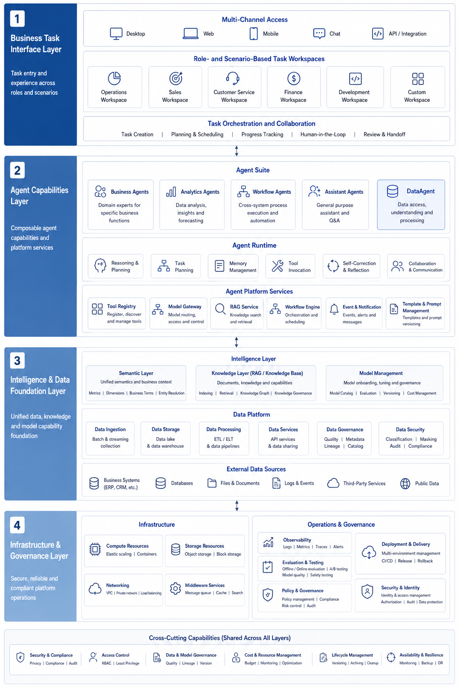
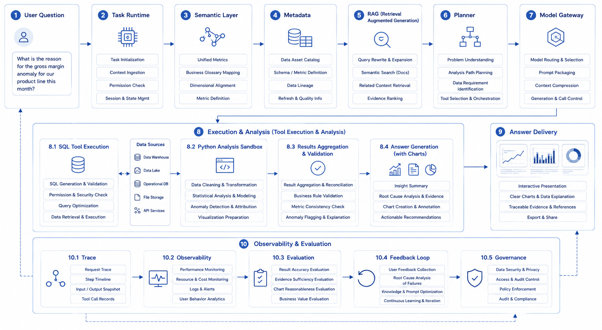

# Ch.04 Book Map: Platform Reference Architecture and Reading Paths

> **Chapter goal**: Before entering the technical chapters, give readers a map they can repeatedly return to: what layers make up an enterprise Agent platform, how core capabilities depend on each other, why this book uses DataAgent as its main thread, and how different roles should use the book.
>
> **Intended readers**: All readers. Especially platform leaders, architects, data-intelligence engineers, and readers who want to build a global view before jumping into specific chapters.

*Figure 4-1 Four-layer reference architecture for an enterprise Agent platform: from the business task layer and Agent capability layer to the intelligence and data layer and the infrastructure and governance layer, platform capabilities must form an integrated task-execution chain.*

---

## Why the Overview Must End with a Map

The previous three chapters answered three questions: what an Agent is, why enterprises move toward platforms, and what an AI-native business system is. At this point, readers can judge whether a system is truly an Agent, and they can understand that a platform is not a framework and that AI-native does not mean "a chat box." But without a global map, these judgments can still drift apart.

An enterprise Agent platform is not a single technology point, nor a collection of attractive components. It involves models, data, knowledge, tools, processes, frontend experience, evaluation, security, deployment, and organizational collaboration. If readers only remember that Runtime is important, semantic layers are important, and evaluation is important, but do not understand their dependencies, the later chapters will become fragmented knowledge.

What the platform owner of Shanlan Group really needs to answer is not "which modules can we build," but more concrete questions:

- Before the first production-grade Agent goes live, which foundation capabilities must already exist?
- Why is DataAgent not simply "NL2SQL plus charts"?
- What is the relationship among Runtime, Tool Registry, approvals, trace, and evaluation?
- Why does this book discuss models, data, and knowledge before Agent capabilities and business systems?
- Should different readers read sequentially, or jump according to role?

The role of Chapter 4 is to compress the conceptual judgments from the first three chapters into an executable reading map. It is not a directory recap. It tells readers where each later chapter sits in the overall platform, what class of problem it solves, and which other chapters it depends on.

## Four-Layer Reference Architecture: From Business Tasks to Governance Foundations

The easiest way to draw an enterprise Agent platform badly is to list too many components at the beginning. A better overview starts with four layers.

The first layer is the **business task layer**. This is where users perceive value: DataAgent, quoting agents, ticket agents, operations-analysis workbenches, sales task workbenches, and other AI-native business systems. It answers: "What business tasks does the enterprise complete with Agents?"

The second layer is the **Agent capability layer**. This determines how Agents are organized and run: task state, tool calls, planning strategies, long-running tasks, human intervention, multi-Agent collaboration, protocols, and framework choices. It answers: "How does the Agent push the task forward?"

The third layer is the **intelligence and data layer**. This provides the raw material for Agent capability: model inference, structured output, RAG, knowledge engineering, semantic layers, lakehouse, OLAP, metadata, lineage, and metric definitions. It answers: "What does the Agent rely on to understand, judge, and generate results?"

The fourth layer is the **infrastructure and governance layer**. This keeps the system running over the long term: model deployment, gateway, multi-tenancy, observability, evaluation, cost, rate limiting, degradation, security, compliance, and organizational mechanisms. It answers: "How does the Agent run in a stable, trustworthy, and controllable way?"

| Layer | Core question | Main corresponding parts |
|---|---|---|
| **Business task layer** | What business tasks are completed with Agents | Part VI, Part XI |
| **Agent capability layer** | How Agents plan, call tools, and execute long-running tasks | Part V |
| **Intelligence and data layer** | What models, data, and knowledge Agents use | Part II, III, IV |
| **Infrastructure and governance layer** | How the system is deployed, observed, evaluated, and secured | Part VII, VIII, IX, X |

These four layers are not a memory aid. They help readers put problems back in the right place.

Without this layered map, enterprises easily make two mistakes. The first is to push every problem down into the model layer. Missing semantic layers, chaotic tool contracts, and unclear approval boundaries are all blamed on "the model is not strong enough." The second is to raise every problem up into the business layer. Missing trace semantics, lack of evaluation samples, and unrecoverable runtime state are described as "the business scenario is too complex."

The value of the four-layer architecture is that it gives teams a shared language for locating problems.

## Eight Capability Clusters: Platform Backbone and Failure Modes

Within the four layers, the true backbone of the Agent platform is a set of capability clusters that recur throughout the later chapters. This book condenses them into eight.

| Capability cluster | Problem it solves |
|---|---|
| **Runtime** | How tasks are created, advanced, paused, recovered, and terminated |
| **Registry** | How tools, Agents, capabilities, and versions are managed uniformly |
| **Planner** | How the system decides the next step instead of merely generating text |
| **Memory** | How session state, long-term preferences, and task context persist |
| **RAG / Knowledge** | How documents, metadata, and knowledge context enter the Agent |
| **Observability** | How trace, logs, metrics, and session replay are recorded uniformly |
| **Eval** | How to determine whether a version is better or worse |
| **Policy** | How permissions, masking, approvals, and security boundaries are enforced |

These eight capability clusters are not a feature list. They are the inverse of an enterprise failure-mode list.

Without Runtime, the system can demo but cannot execute reliably. Without Registry, tools multiply and become disorderly. Without Planner, the model freely follows the wrong path. Without Memory, long-running and multi-turn tasks quickly distort. Without RAG and knowledge engineering, the system cannot truly connect to enterprise context. Without Observability, errors cannot be explained. Without Eval, version quality depends on feeling. Without Policy, overreach, leakage, and approval bypasses will eventually appear.

Another way to view these eight clusters is:

| Type | Capabilities | Role in the platform |
|---|---|---|
| **Execution backbone** | Runtime, Registry, Policy | Lets Agents run and be constrained uniformly |
| **Intelligence amplifiers** | Planner, Memory, RAG / Knowledge | Lets Agents understand context and advance dynamically |
| **Feedback systems** | Observability, Eval | Keeps the platform from becoming a black box or losing control |

Later chapters will expand into many concrete technologies, but readers can always return to this table: is the current topic strengthening the execution backbone, the intelligence amplifiers, or the feedback systems?

*Figure 4-2 Eight capability clusters of an enterprise Agent platform: Runtime, Registry, Planner, Memory, RAG / Knowledge, Observability, Eval, and Policy together form the execution backbone, intelligence amplifiers, and feedback systems.*

## The DataAgent Thread: Making the Full Stack Visible

This book is not only about DataAgent, but it uses DataAgent as its main thread. The reason is not that querying data is fashionable. It is that DataAgent naturally cuts across the major layers of an enterprise Agent platform.

A seemingly simple question, such as "What caused the abnormal gross margin in East China last week?", triggers multiple system problems at once:

| Layer | Why DataAgent cannot avoid it |
|---|---|
| **Model layer** | It must understand the question, plan a path, generate SQL, and explain results |
| **Data layer** | It needs semantic layers, metric definitions, lakehouse, OLAP, and data quality |
| **Knowledge layer** | It needs metadata, historical analyses, business terms, policies, and cases |
| **Agent layer** | It needs Runtime, tool calls, Planner, state management, and human intervention |
| **Governance layer** | It needs access control, trace, evaluation, cost, and audit |
| **Frontend layer** | It needs charts, tables, citations, reports, and task workbenches |

This is DataAgent's special value: it is not the only important business scenario, but it is particularly suitable for explaining why an enterprise Agent platform is a full-stack problem.

If we break down one Shanlan Group DataAgent request, it must pass through at least seven checkpoints:

| Checkpoint | Real problem to solve |
|---|---|
| **Task creation** | Whether user identity, tenant, and question scope are clear |
| **Context loading** | Whether metric definitions, historical analyses, and accessible data are complete |
| **Path planning** | What to query first, what to query next, and whether multiple tools are needed |
| **Tool execution** | Whether SQL, APIs, Python, and other actions are controlled |
| **Result explanation** | Whether facts, inferences, and suggestions are clearly separated |
| **Governance recording** | Whether trace, cost, approval, and risk are recorded |
| **Result delivery** | Whether charts, citations, conclusions, and next actions are provided |

If DataAgent is misunderstood as "natural language to SQL," platform construction will go off course from day one. DataAgent actually connects data intelligence, Agent execution, AI-native workbenches, and the enterprise governance loop.

This is why Part VI plays the role of the main thread in the book. It is not an isolated case. It pulls together models, data, knowledge, Agent capabilities, evaluation, security, and frontend experience into one comprehensive scenario.

*Figure 4-3 End-to-end DataAgent task flow: one operating-metric anomaly question passes through task runtime, semantic layer, metadata, RAG, Planner, model gateway, SQL / Python tools, trace, evaluation, and result delivery.*

## Book Organization: Following Platform Dependencies

Many books on Agents begin with chat interfaces, prompts, or tool calls. That path is easy to enter, but once an enterprise tries to land the system, the ordering problem appears: the frontend experience moves quickly, while semantic definitions, evaluation, permissions, runtime, and audit remain unprepared.

This book is organized according to how enterprise platforms actually grow through dependencies.

It begins with models and inference, because without basic inference, structured output, model routing, and inference optimization, later Agent decisions have no foundation.

It then moves to data infrastructure and knowledge engineering, because the real differentiation of enterprise Agents rarely comes from the model alone. It comes from whether the Agent can safely connect to the right data, the right metric definitions, and the right knowledge.

Only after models, data, and knowledge are in place does it make sense to discuss Agent capabilities: Runtime, Tool Registry, MCP, Planner, Memory, HITL, multi-Agent collaboration, and framework choices.

Then the DataAgent thread pulls the previous foundation capabilities into a real business scenario.

Finally, the book enters observability, evaluation, cost, deployment, frontend, security, compliance, and organization. These are not decorations. They are the operating loop that a production-grade platform must close.

| Part of the book | Why it appears here |
|---|---|
| **Part II Models and Inference Layer** | Establishes model capability and structured-output foundations |
| **Part III Data Infrastructure Layer** | Establishes accessible, trustworthy, governable data foundations |
| **Part IV Vector, Retrieval, and Knowledge Engineering** | Lets Agents connect to enterprise unstructured knowledge |
| **Part V Agent Core Capabilities** | Establishes task execution, tool calling, and collaboration mechanisms |
| **Part VI DataAgent Main Thread** | Uses one comprehensive scenario to connect the full stack |
| **Part VII-X Productionization and Governance** | Completes observability, evaluation, cost, deployment, security, and organization |
| **Part XI Case Collection** | Migrates platform capabilities to more business Agents |

This order is not directory aesthetics. It is an engineering dependency chain. Readers can jump, but they should not misunderstand the dependencies.

**How different readers should use this book.**

Chapter 4 provides not only a technical map, but also a reading map. Different roles should not read this book in exactly the same way.

| Reader | What to grasp first |
|---|---|
| **Platform leader / CTO** | Platform boundaries, annual roadmap, cost, governance, and organizational collaboration |
| **Architect** | Four-layer architecture, eight capability clusters, and chapter dependencies |
| **Data-intelligence engineer** | Semantic layer, RAG, DataAgent, NL2SQL, and evaluation system |
| **AI application developer** | Runtime, tool integration, task workbench, and result delivery |
| **Security / compliance leader** | Permission boundaries, approvals, trace, evaluation, Guardrails, and regulation |

If a team reads Part I together, it can organize the discussion by theme:

| Shared-reading theme | Recommended chapters | Purpose |
|---|---|---|
| **Align concepts** | Ch.01-Ch.02 | Clarify what an Agent is and what a platform is |
| **Align business direction** | Ch.03 | Discuss which businesses should be AI-native first |
| **Align the build roadmap** | Ch.04 | Map later chapters to the team's roadmap |

Readers with active projects can also jump according to current pain points:

| Current problem | Topics to prioritize |
|---|---|
| Agent behavior is unstable | Runtime, Planner, Trace, Eval |
| Data questions are often wrong | Semantic layer, Schema Linking, NL2SQL, DataAgent evaluation |
| Tools are multiplying and risk is hard to control | Tool Registry, Policy, approvals, cost governance |
| Platform roadmap is unclear | Part I, platform capabilities, cost, security, organization |
| Frontend looks like a chatbot, not a workbench | AI-native business systems, conversational UI, Generative UI |

This reading map makes the book more like a working manual than a textbook that must be read strictly from page one to the end.

## One-Year Build Roadmap: From First Pilot to Platform Replication

If Shanlan Group plans to take one year to build an enterprise Agent platform from zero to serving multiple business lines, the right rhythm is not to build a "large and complete platform" on day one. It is to use real scenarios to gradually sediment shared capabilities.

| Stage | Technical focus | Governance focus | Organizational focus |
|---|---|---|---|
| **Q1** | Runtime, model entry point, tool registration, basic trace, first pilot | Tool risk levels, minimum approval rules | Clarify platform-team boundary and business pilot owners |
| **Q2** | Evaluation, cost attribution, approval integration, basic management UI | Evaluation sample templates, launch admission standards | Establish scenario co-creation and review mechanisms |
| **Q3** | Semantic layer, RAG, more tool integration, second business-line replication | Unified metric definitions, permissions, and trace standards | Drive business teams to onboard through templates |
| **Q4** | Gray release, degradation, SLO, vendor integration, platform catalog | Incident review, version governance, compliance checks | Establish platform operations rhythm and annual roadmap |

The point of this roadmap is not the quarter labels themselves. It is the order: stabilize the execution chain first, then scale and institutionalize.

Each stage should sediment one truly reusable shared asset:

| Stage | Shared assets to sediment |
|---|---|
| Q1 | Unified task-state model, tool risk levels |
| Q2 | Evaluation sample templates, launch admission checklist |
| Q3 | Semantic-layer conventions, data-permission and knowledge-access conventions |
| Q4 | Platform catalog, review templates, cost and quality operations reports |

Many platform roadmaps fail not because the technical goals are wrong, but because they only include technical goals and omit governance and organizational goals. With only technical goals, the platform is "built but not used well." With only governance goals, the platform has "many rules but little adoption." With only organizational goals, the team "discusses a lot but lacks a runnable foundation." All three must move together.

## Chapter 4 Closing: Making the Later Chapters More Than Scattered Points

If the whole book is a map, Part I is the legend, and Chapter 4 is the index page. Its value is not to summarize the first three chapters, nor to recite the table of contents. Its value is to help readers relocate every later topic.

When reading model routing, readers know it sits in the inference layer and also affects cost governance. When reading semantic layers, they know why it is essential for DataAgent. When reading Human-in-the-loop, they know it is not a local interaction pattern, but part of the enterprise responsibility boundary. When reading evaluation, security, and organization, they know these are not closing chapters, but parts of the platform loop.

What this chapter ultimately delivers is the way to use the book.

First, enterprise Agent platforms are better understood as four layers than as a pile of independent components.

Second, the platform core can be condensed into eight capability clusters, and many later chapters revolve around these clusters.

Third, DataAgent is chosen as the main thread not because it is the only important scenario, but because it best connects the full-stack problem.

Fourth, the organization of the book comes from real dependencies, not directory aesthetics.

Fifth, the meaning of Part I is not to replace the later deep chapters, but to give readers a reliable map before entering the technical deep water.

The next part begins with models and inference. This is not because models are the most important thing, but because they are one of the starting points that make all later capabilities possible.
