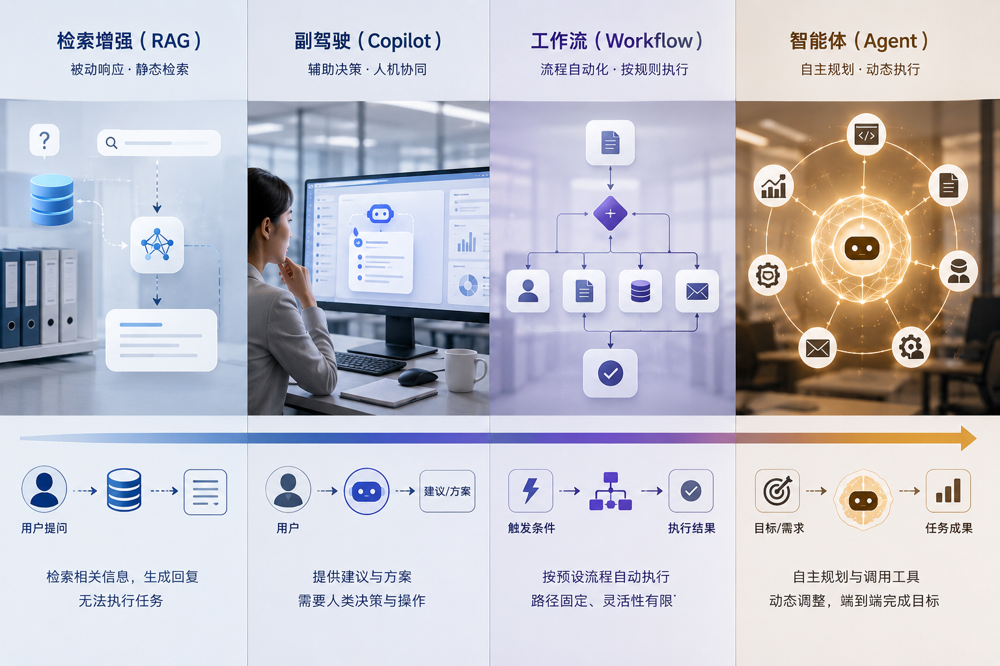

# Ch.01 Agent 的本质：从对话助手到任务执行系统

> **本章目标**：帮助读者建立第一个关键判断：什么才算 Agent，什么只是 RAG、Copilot 或 Workflow；为什么企业一旦让系统“去做事”，问题就不再只是模型能力问题。
>
> **适读人群**：第一次系统理解 Agent 的产品负责人、平台负责人、架构师、数据团队与业务负责人。

*图 1-1 从对话助手到任务执行系统：Agent 的关键变化不是“更会说话”，而是开始围绕企业任务目标组织数据、工具、流程和责任边界。*

---

## 从“会回答”到“会执行”：Agent 的根本转折

山岚集团制造板块曾经做过一个报价助手。最初它只是帮助销售查询历史合同、参考折扣区间、生成报价草稿。演示时效果很好：用户提出需求，系统几秒钟内就能给出一份结构化报价建议，还能顺手整理出过去类似项目的参考案例。

团队很快产生了一个自然但危险的判断：既然它已经能“看懂问题、找到信息、写出结果”，那不如再往前走一步，让它直接帮销售完成报价动作。于是报价助手被接上了真实工具：合同系统、库存系统、折扣策略、审批接口，甚至还可以自动生成对客户的报价邮件草稿。

问题随之而来。

有一次，一位销售输入：“客户希望这周签约，给一个尽量有竞争力的价格。”系统按照历史案例推断出 12% 的折扣方案，并生成了报价单。形式上看，这只是“把建议变成草稿”；实质上，系统已经在做一个企业任务：理解意图、判断价格策略、调用工具、产出带业务后果的结果。

事后复盘发现三处问题：

- 它调用了过期的促销规则，没有意识到当天生效的新限价。
- 它默认把“尽量有竞争力”理解为“向历史大客户靠拢”，却忽略了这个客户并不具备同等级折扣权限。
- 它把本应进入审批链的结果提前送到了销售手里，用户稍不留神就可能转发给客户。

这个案例很重要，因为它揭示了一个经常被低估的转折点：**当系统从“帮人回答”变成“替人推进任务”，它面对的就不再是问答问题，而是执行问题。**

问答系统出错，常常只是答案不好；执行系统出错，可能意味着权限越界、流程绕过、数据误用、责任不清。正是在这个意义上，Agent 不只是“更聪明的聊天助手”，而是另一类系统。

本书从第一章开始反复强调这一点，不是为了抬高 Agent 的概念，而是为了防止企业把原本只是“助手”的东西，误当成“可执行系统”投入生产。

## RAG、Copilot、Workflow、Agent：四类系统的边界

企业讨论 Agent 时，最大的混乱之一是命名混乱。很多项目只要用了大模型，就自称 Agent；很多本质上是固定流程的系统，也被包装成 Agent。为了避免后续讨论失焦，我们先把四类最常见的形态分开。

| 形态 | 系统主要在做什么 | 谁做最后决策 | 是否有动态多步推进 | 是否接近真实执行 |
|---|---|---|---|---|
| **RAG** | 找资料、给答案、补上下文 | 用户 | 很弱 | 很低 |
| **Copilot** | 给建议、写草稿、陪人完成工作 | 用户 | 中等 | 低到中 |
| **Workflow** | 按预定义规则推进流程 | 开发者或业务规则 | 低 | 中到高 |
| **Agent** | 根据目标动态判断下一步，并调用工具推进任务 | 系统与人共同完成 | 高 | 中到高 |

这四类并不是互斥关系。一个成熟系统往往是混合体：

- 用 RAG 提供知识与上下文；
- 用 Copilot 帮用户更快表达目标或修改结果；
- 用 Workflow 固定住高风险、强合规的环节；
- 用 Agent 处理那些无法提前写死、又必须跨系统推进的部分。

真正的关键不在于“名字叫不叫 Agent”，而在于你有没有看清系统的本质职责。

如果一个系统只是在企业知识库里找答案，它大概率是 RAG。
如果一个系统始终由人主导，模型只是在旁边给建议，它更像 Copilot。
如果一个系统从第一步到最后一步的路径都是固定的，它更接近 Workflow。
只有当系统需要围绕一个目标，在执行过程中不断理解上下文、选择动作、接收反馈并继续推进时，我们才有理由把它叫作 Agent。

这里有一个非常实用的判断方式：不要先问“能不能上 Agent”，而是先问“这件事真正困难的地方是什么”。

- 困难在知识查找，优先做 RAG。
- 困难在内容起草，优先做 Copilot。
- 困难在流程规范，优先做 Workflow。
- 困难在多步判断、跨系统推进和实时调整，才值得考虑 Agent。

这会直接决定你后面是建设一个平台，还是只是做一个功能。

*图 1-2 RAG、Copilot、Workflow 与 Agent 的边界：四类系统可以组合使用，但它们在决策主体、流程确定性和执行责任上有明显差异。*

## Agent 的任务闭环：目标、上下文、决策、行动与反馈

如果要用一句尽可能朴素的话定义 Agent，本书会这样说：

> **Agent 不是一种聊天风格，而是一种围绕任务目标组织感知、决策、行动和反馈的系统闭环。**

这个定义里最重要的，不是“模型”，而是“闭环”。

一个企业级 Agent 至少要处理五件事：

| 要素 | 它回答的问题 |
|---|---|
| **目标** | 这次到底要完成什么任务，而不仅是回答什么问题？ |
| **上下文** | 为了完成这个任务，需要哪些数据、规则、文档和身份信息？ |
| **决策** | 面对当前状态，下一步最合适的动作是什么？ |
| **行动** | 应该调用什么工具，产生什么结果或副作用？ |
| **反馈** | 工具执行后的结果，是否改变了后续决策？ |

少了任何一个环节，闭环就不成立。

没有目标，系统会退化成泛对话。
没有上下文，系统会在错误信息上做看似合理的判断。
没有决策，系统只能写字，不能推进任务。
没有行动，它只能停留在建议层。
没有反馈，它就无法纠错，也无法收敛。

这也是为什么很多“看起来像 Agent”的产品，最终只是高级 Copilot。它们有对话、有工具、有结果，但没有形成真正的任务闭环。

对企业来说，这个闭环还有一个额外含义：一旦系统能够闭环推进任务，它就会天然碰到责任问题。谁允许它这么做？它依据什么信息做出判断？它在什么条件下必须停下？它做错之后如何被发现、复盘和修正？

这些问题，决定了 Agent 一开始就不只是一个产品问题，而是平台问题。

**为什么这两年几乎所有系统都开始自称 Agent。**

如果把时间线往后拉一点，会发现“Agent”这个词的快速流行，本身也值得解释。因为它并不是单纯来自学术定义，而是来自三股力量同时叠加。

第一股力量，是模型能力的跃迁。过去的企业 AI 系统大多擅长分类、预测、检索和生成某个局部结果，很少敢让系统自己决定“下一步做什么”。大模型把自然语言理解、跨域知识调用和结构化输出能力显著拉高之后，企业第一次普遍看到一种可能性：系统不只是回答，而是开始像一个任务参与者。

第二股力量，是工具调用能力的成熟。早期的大模型应用，即使回答质量不错，也常常停留在文本世界里。Function Calling、结构化输出、Browser / Code Interpreter、MCP 这类能力逐渐成熟之后，模型终于不再只是“说”，而能比较稳定地“做”。这使得企业第一次必须认真面对“执行边界”问题。

第三股力量，是企业软件形态本身在变化。过去十几年，企业软件的主导范式是模块化 SaaS：CRM 是一个系统，ERP 是一个系统，BI 是一个系统，工单又是一个系统。大模型出现之后，用户第一次明确表达出一种新期待：我不想自己切来切去，我只想把任务交给系统。这种需求倒逼 Agent 这个概念从研究和消费产品走入企业场景。

正因为这三股力量一起发生，Agent 才迅速从一个研究名词变成企业战略词汇。

但热度本身也带来副作用。很多团队开始用“Agent”一词包装任何大模型功能，因为这个名字更像趋势、更容易拿预算、更容易获得组织注意。于是概念边界在真正落地之前就被稀释了。第一章之所以写得这么慢、这么细，正是为了先把热词剥掉，让读者重新看到系统本质。

**企业最容易在第一步就犯的三种误判。**

山岚集团报价助手的例子只是一个入口。更普遍地看，企业在刚进入 Agent 讨论阶段时，最容易出现三种误判。

第一种误判，是把“会理解自然语言”误判成“能承担任务责任”。一个系统能把用户的话听懂，并不等于它就能安全地推进任务。理解只是开始，责任链条才是关键。

第二种误判，是把“接了几个工具”误判成“具备执行能力”。如果工具调用没有风险等级、没有状态机、没有审批边界，系统只是拥有了更大的失误半径，而不是真正拥有了执行能力。

第三种误判，是把“演示里顺畅完成一次任务”误判成“可以稳定运行”。企业里最难的从来不是第一次成功，而是第一百次、第一千次仍然说得清为什么成功、为什么失败、为什么这次和上次不一样。

这三种误判几乎解释了大部分企业早期 Agent 项目的兴奋与失望。它们的共同根源，是把 Agent 当成一种更强的模型能力，而不是一种新的系统责任形式。

## 什么任务适合 Agent：场景分型、风险分级与价值判断

企业做 Agent，最容易犯的错误不是做少了，而是做泛了。很多团队一旦有了大模型和几个工具，就试图把所有智能需求都归到 Agent 下面。这种冲动通常会带来治理失控。

一个更稳妥的方式，是先把企业任务分型。

| 任务类型 | 本质难点 | 更适合的方式 |
|---|---|---|
| **查询型任务** | 找到准确信息 | 检索、RAG、语义层、BI |
| **草稿型任务** | 快速生成可修改结果 | Copilot、内容生成助手 |
| **诊断型任务** | 组合多源信息、逐步缩小问题 | Agent |
| **执行型任务** | 调用工具、跨系统推进、有副作用 | Agent + Workflow + 审批 |

把山岚集团的几个任务放进去就很清楚：

| 山岚集团场景 | 最合适的起步方式 |
|---|---|
| “查一下某客户近三个月投诉记录” | 查询型：RAG + CRM 查询 |
| “根据这周销售数据起草经营复盘” | 草稿型：Copilot 或低风险任务型 Agent |
| “解释华东区毛利率为什么异常” | 诊断型：DataAgent |
| “生成报价并进入审批” | 执行型：Agent + Workflow |

这套分类法有两个价值。

第一，它让企业避免过度设计。不是所有问题都需要动态多步决策。
第二，它让后续平台建设更清楚：只有真正的诊断型和执行型任务，才会稳定拉动 Runtime、Registry、Policy、Trace 这些平台能力。

我们甚至可以再进一步，给任务加上风险维度。

| 风险级别 | 典型动作 | 推荐控制方式 |
|---|---|---|
| **0 级只读** | 查资料、查指标、生成摘要 | 自动执行，保留证据 |
| **1 级低风险写入** | 创建草稿、生成待办、写入临时区 | 自动执行，可撤销 |
| **2 级中风险动作** | 更新工单状态、生成报价草稿、发内部通知 | 关键节点确认 |
| **3 级高风险动作** | 发客户邮件、提交财务凭证、修改主数据 | 审批 + 二次校验 |
| **4 级极高风险动作** | 付款、签约、删除关键数据 | 默认禁止自动执行 |

这不是为了让风险表看起来完整，而是因为企业讨论 Agent 时，真正需要的是一套可协商的秩序。否则“是不是危险”就会永远停留在抽象争论。

再进一步看，任务适配度和风险等级其实是两张不同的表。一个任务可能非常适合 Agent，但风险等级很高，因此只能在强审批前提下推进；也可能风险不高，但其实根本不需要 Agent。企业经常把这两件事混为一谈，于是该快的场景做得很慢，该谨慎的场景又做得太冒进。

更稳妥的做法，是先判断“这个任务结构上是否适合 Agent”，再判断“即使适合，它允许 Agent 自主到什么程度”。这也是为什么本书会把 Agent 的本质、平台边界和 AI 原生系统分成三章来讲：任务适配、治理约束、系统形态，本来就是三个不同层次的问题。

## 企业级 Agent 为什么难：边界、责任与组织语言

消费级 Agent 最吸引人的地方，是它看起来什么都能做；企业级 Agent 最困难的地方，是它必须知道什么不能做。

一旦放进企业环境，Agent 面对的不是一个开放互联网，而是组织边界、权限边界、流程边界和责任边界。也因此，企业级 Agent 的困难，通常并不优先出现在“模型会不会回答”，而是出现在下面五种失败上：

| 失败类型 | 表现 | 常见根因 |
|---|---|---|
| **理解失败** | 忽略用户约束，目标理解跑偏 | 表达模糊、上下文不足 |
| **规划失败** | 选错工具、动作顺序错误、路径过长 | 工具描述差、决策策略粗糙 |
| **执行失败** | 参数不合法、工具超时、权限拒绝 | schema 薄弱、重试与恢复机制不足 |
| **治理失败** | 越权、未审批、无 trace、无法回放 | 平台策略缺失 |
| **产品失败** | 用户不信结果、不会使用、无法接管 | 前端与证据设计不足 |

这张失败谱系有一个特别重要的作用：它防止团队把一切问题都归咎于模型。

很多企业项目一出错，第一反应是“换模型”或者“继续调 Prompt”。但明明可能是工具契约问题、权限问题、语义层问题、审批链问题。把问题分类，本质上是在恢复系统分析能力。

而且这五类失败有明显的处理优先级：

1. 先解决治理失败，因为它决定能不能上线。
2. 再解决执行失败，因为它决定系统稳不稳定。
3. 然后处理理解与规划失败，因为它决定结果好不好。
4. 最后处理产品失败，因为它决定用户愿不愿意长期用。

这就是企业视角和消费产品视角最大的区别：企业首先关心的是可控，其次才是惊艳。

**为什么这本书要从“平台”讲起。**

如果 Agent 只是一个会聊天、会写草稿的能力，那么写一本到处都是“平台”的书，似乎太重了。

但如果 Agent 的本质，是一个能够围绕目标动态调用工具、跨系统推进任务、并在企业内部留下责任链条的系统，那么平台就不是“为了显得高级”才出现，而是天然出现。

山岚集团报价助手的问题，本质上就不是一个单点产品问题。它暴露的是整个平台短板：

- 没有统一的工具契约；
- 没有明确的风险分级；
- 没有审批和中断边界；
- 没有可追溯的任务链路；
- 没有可评估、可复盘的运行证据。

这也是本书写作顺序的原因。

第一章先把 Agent 从概念上讲清楚。
第二章接着讲平台边界，因为企业真正要建设的是多 Agent 共存的基础设施。
第三章再把视角抬高到业务系统层，解释为什么 AI 原生不是“加一个聊天框”。
第四章才给出全书地图，告诉读者接下来的 55 章为什么按现在这个结构展开。

换句话说，Part I 不是为了快速进入实现，而是为了先把“我们到底在建设什么”讲清楚。这个共识如果没有建立，后面的模型、RAG、MCP、Runtime、Eval、安全和前端，都会变成碎片化知识点。

还有一个更深的原因：企业里真正稀缺的，往往不是写出一个 Demo 的能力，而是形成共同语言的能力。不同团队对 Agent 的理解如果不一致，后面所有技术讨论都会不断跑偏。产品团队会觉得 Agent 是一种更好的交互方式，数据团队会觉得 Agent 是一种新的问数入口，平台团队会觉得 Agent 是一套运行时，安全团队会觉得 Agent 是新的风险源。所有这些理解都各有道理，但如果没有一层总论去统一问题意识，后面的书写就很难形成同一个工程对象。

所以，第一章本质上是一本书的“定对象”章节。它要先把读者从“我在看一个流行概念”带到“我在理解一类企业系统”。

**Agent 概念并不新，新的是企业终于能承受它的复杂度。**

如果从计算机科学和人工智能的发展史看，Agent 不是一个突然冒出来的新词。很早以前，智能体就被用来描述能够在环境中感知、决策并行动的系统。机器人、游戏 AI、自动交易系统、规划系统，都曾经使用过类似思想。

那为什么今天它重新变得重要？

原因不是今天的人突然发现了“智能体”这个概念，而是大模型让 Agent 第一次具备了进入通用企业软件的可能性。过去的 Agent 往往依赖严格建模的环境、明确规则、有限动作空间。它们可以在棋盘、仓库、交易策略、游戏世界里工作，但很难直接理解企业自然语言任务，也很难处理大量非结构化知识。

大模型改变了三件事。

第一，它让系统能理解开放的自然语言目标。业务用户不必把目标翻译成固定表单，系统可以直接处理“帮我准备经营分析会材料”“解释这个客户为什么迟迟不签约”这类表达。

第二，它让系统能把文本、表格、代码、工具描述、业务规则放进同一个上下文中推理。过去这些信息分散在不同系统里，现在至少有可能被统一组织进一次任务链。

第三，它让系统能生成结构化动作。只要工具描述、schema、权限和上下文设计得足够好，模型就不只是生成自然语言，还能选择工具、填写参数、读取结果。

也就是说，Agent 概念本身不新；新的是企业第一次拥有了把自然语言目标、企业数据、工具系统、业务流程连接起来的现实可能。

但这也解释了为什么 Agent 落地比普通大模型应用更难。它不是把模型能力往前推一步，而是把模型放进一个由工具、数据、流程和责任组成的复杂环境里。企业能否承受这种复杂度，才是 Agent 能否生产化的关键。

**不要把 Agent 想象成“数字员工”。**

市场宣传里很喜欢把 Agent 称为“数字员工”“AI 同事”“虚拟专员”。这些说法有传播效果，但在工程上很危险。

因为一旦把 Agent 想象成“员工”，团队就很容易期待它像人一样理解语境、承担责任、知道分寸、自动补全上下文。但真实系统并不会天然拥有这些能力。它只是在给定上下文、工具、策略和模型能力下生成下一步动作。

把 Agent 看成“数字员工”，会带来三种误导：

| 误导 | 风险 |
|---|---|
| 以为它会自动理解组织默契 | 实际上它只知道上下文里显式提供的信息 |
| 以为它会自然遵守边界 | 实际上边界必须由权限、策略和流程明确表达 |
| 以为它能承担责任 | 实际上责任仍然在人、组织和平台治理机制上 |

更准确的说法是：Agent 是一个能够在任务链中承担部分感知、决策和执行工作的系统组件。它可以提高人的杠杆率，但不能替代企业责任链。

这个区分非常重要。因为如果把 Agent 当成员工，你会问“它够不够聪明”；如果把 Agent 当成任务执行系统，你会问“它在什么边界内可靠”。企业真正需要的是后一个问题。

**Agent 与人的关系：不是替代，而是重新分工。**

企业引入 Agent 后，人与系统之间的分工会变化，但这不等于人被简单替代。

在人主导的传统流程里，人承担几乎所有事情：理解目标、查找信息、判断路径、执行操作、解释结果、承担责任。系统更多是被动工具。

在 Agent 参与的流程里，一部分工作会转移给系统：

| 工作 | 传统模式 | Agent 参与后 |
|---|---|---|
| 信息收集 | 人跨系统查找 | Agent 自动检索数据、文档和工具结果 |
| 路径判断 | 人决定下一步 | Agent 给出计划或直接推进低风险步骤 |
| 中间产出 | 人手工整理 | Agent 生成草稿、图表、分析框架 |
| 风险判断 | 人凭经验判断 | 平台按规则触发确认或审批 |
| 最终责任 | 人承担 | 人仍承担，但系统提供证据链 |

可以看到，人并没有消失，而是从“操作每一个步骤的人”，变成“定义目标、约束边界、确认关键动作、裁决结果的人”。

这也是为什么企业 Agent 的设计不能只追求自动化比例。真正成熟的系统，应该清楚地区分哪些事情交给 Agent，哪些事情必须留给人。过度自动化会带来风险，过度确认又会让 Agent 失去价值。好的设计，在这两者之间找到稳定边界。

**Agent 的价值，不是替你省掉一个人，而是减少任务摩擦。**

很多企业在讨论 Agent ROI 时，容易把问题简化成“能不能少几个人”。这个视角太窄，也容易引发组织抵触。

Agent 更直接的价值，通常体现在减少任务摩擦上：

- 减少系统切换；
- 减少信息拼接；
- 减少重复解释；
- 减少人工整理；
- 减少低价值等待；
- 减少跨部门来回确认。

以山岚集团经营分析为例，Agent 的价值不一定是“少一个数据分析师”，而是让运营负责人不必在 BI、库存、客服、知识库之间反复切换，让数据团队不必反复回答同类问题，让会议材料有更稳定的数据来源和引用证据。

这类价值有时比“节省人力”更真实。因为企业里大量低效并不是来自某个人不会做事，而是来自任务在系统与组织之间来回摩擦。Agent 如果设计得好，减少的是这种摩擦。

这也是为什么本书后面会一直强调平台、数据、工具和流程。没有这些底座，Agent 很难减少摩擦；它反而可能制造新的摩擦。

**Agent 的四个成熟度阶段。**

为了避免把所有 Agent 项目混为一谈，可以用一个简单成熟度模型来看。

| 阶段 | 特征 | 常见风险 |
|---|---|---|
| **阶段 0：对话问答** | 能回答问题，但不调用真实工具 | 被误认为已经接近 Agent |
| **阶段 1：工具增强** | 能调用少量工具，完成简单动作 | 工具风险和权限边界不清 |
| **阶段 2：任务执行** | 能围绕目标多步推进任务 | 状态、审批、trace、评估开始成为瓶颈 |
| **阶段 3：平台化运行** | 多个 Agent 共享平台能力并统一治理 | 组织协作和平台边界成为核心问题 |

山岚集团报价助手最初处在阶段 1 和阶段 2 之间：它已经能调用工具，但还没有真正具备任务执行系统需要的治理能力。因此它看起来像 Agent，实际上还没有完成从“工具增强”到“平台化运行”的跃迁。

这个成熟度模型有一个实用意义：不要把阶段 1 的系统拿去承担阶段 3 的责任。否则所有风险都会集中爆发。

**读者在第一章结束时应该形成的四个判断。**

第一章并不要求读者掌握后续所有技术细节，但至少要形成四个判断。

第一，Agent 不是一个界面形态。聊天框可以承载 Agent，也可以只承载 RAG；没有聊天框的后台系统，也可能是 Agent。关键不在界面，而在任务闭环。

第二，Agent 不是一个模型能力。模型是 Agent 的决策核心之一，但 Agent 还需要上下文、工具、状态、反馈和治理。

第三，Agent 不是自动化的最高级形态。很多事情用 Workflow 更稳、更便宜、更容易审计。Agent 适合的是路径不确定、需要动态判断、又必须跨系统推进的任务。

第四，企业级 Agent 的价值和风险都来自“执行”。它一旦能够推进任务，就必须被平台化治理。

如果读者能带着这四个判断进入第二章，就不会再把平台边界讨论理解成纯技术抽象。平台之所以出现，是因为 Agent 的任务属性已经把企业带入了一个新的问题域。

**从业务语言到系统语言：Agent 的需求该如何被翻译。**

企业里提出 Agent 需求的人，往往不是工程师，而是业务负责人、产品经理、运营团队或职能部门。他们不会说“我需要一个带 Runtime、Tool Registry 和 Policy 的任务执行系统”，他们通常会说：

- “我希望系统能自动帮我分析异常。”
- “我希望它能像一个助理一样跟进客户。”
- “我希望它能把月结材料先整理出来。”
- “我希望它能看懂制度，然后告诉我该怎么处理。”

这些表达都是真实需求，但它们还不是系统需求。Agent 平台工程师要做的第一件事，就是把业务语言翻译成系统语言。

| 业务表达 | 需要翻译成的系统问题 |
|---|---|
| “自动帮我分析异常” | 异常定义是什么？数据来源是什么？需要哪些诊断步骤？ |
| “像助理一样跟进客户” | 哪些动作只是提醒，哪些动作会触达客户？谁批准？ |
| “把月结材料整理出来” | 哪些数据必须准确，哪些内容只是草稿，哪些要审计？ |
| “看懂制度然后告诉我怎么处理” | 制度来源是否权威？答案是否需要引用？是否能形成动作？ |

这个翻译过程看起来像需求澄清，其实是 Agent 项目成败的分水岭。很多失败项目，并不是模型能力不够，而是业务语言直接被塞进提示词，没有被翻译成目标、上下文、工具、风险和验收标准。

以山岚集团报价助手为例，“给一个有竞争力的价格”在业务语言里很自然，但在系统语言里至少要拆成五个问题：

1. 有竞争力，是相对历史同类客户，还是相对当前库存压力？
2. 客户等级和销售权限允许的折扣上限是多少？
3. 当前是否存在区域限价、活动政策或临时禁售规则？
4. 系统生成的是建议、草稿，还是可以直接进入报价流程？
5. 超出什么阈值必须进入审批？

只有完成这种翻译，Agent 才能从“会听懂人话”走向“能在企业边界内做事”。

**Agent 需求评审：第一章给出的十个问题。**

为了让这种翻译更可操作，本书建议每一个企业 Agent 需求，在立项前都回答十个问题。

| 问题 | 为什么重要 |
|---|---|
| 这个任务的最终交付物是什么？ | 防止把开放聊天当成任务系统 |
| 任务成功的判断标准是什么？ | 没有验收标准，就无法评估 |
| 任务需要哪些数据和知识？ | 决定是否需要语义层、RAG、知识库 |
| 任务需要调用哪些工具？ | 决定是否涉及副作用和权限 |
| 哪些动作是只读，哪些动作会写入？ | 决定风险等级 |
| 哪些节点必须人工确认？ | 决定 HITL 边界 |
| 失败后如何恢复或回滚？ | 决定系统能否生产化 |
| 结果是否需要引用或证据？ | 决定用户是否信任 |
| 谁对最终结果负责？ | 决定责任链 |
| 这个需求是否真的需要动态决策？ | 防止滥用 Agent |

这十个问题比“选什么模型”“用什么框架”更早。因为如果任务边界没定义清楚，后面模型和框架选得再好，也只是把不清楚的问题自动化。

在企业里，最适合主持这类评审的人，往往不是某个单一角色，而是产品、平台、数据、安全和业务共同参与。产品负责明确用户目标，平台负责识别执行链路，数据团队负责判断上下文是否可用，安全团队负责风险边界，业务团队负责验收标准。Agent 的跨职能属性，从需求评审第一天就已经出现。

**Agent 的“自主性”应该被分层，而不是被神化。**

Agent 讨论中还有一个高频词：自主性。很多人会把自主性当作越高越好，仿佛一个系统越少让人介入，就越先进。企业场景恰恰相反。

自主性应该被分层，而不是被神化。

| 自主层级 | 系统能做什么 | 适合场景 |
|---|---|---|
| **建议自主** | 系统给出建议，人决定是否采纳 | 报告、分析、内容草稿 |
| **步骤自主** | 系统能自动完成低风险中间步骤 | 数据查询、信息汇总、草稿整理 |
| **流程自主** | 系统能推进一段端到端流程，但关键点需确认 | 报价、工单处理、经营分析 |
| **结果自主** | 系统能直接产生最终业务结果 | 低风险、可回滚、强约束场景 |
| **外部承诺自主** | 系统能对客户、资金、合同产生外部承诺 | 企业默认不应开放 |

这个分层能帮助团队避免两个极端。一个极端是过度保守，每一步都让用户确认，结果 Agent 变成一个很慢的表单系统；另一个极端是过度激进，让系统直接对外承诺，风险不可控。

企业级 Agent 的合理目标，不是追求最高自主，而是为每类任务找到合适自主层级。

山岚集团报价场景中，系统可以在“建议自主”和“步骤自主”上大胆一些：自动收集历史报价、库存、折扣政策，生成报价草稿；但在“流程自主”和“结果自主”上必须保守：超过折扣阈值必须审批，对客户发送正式报价必须由人确认。

这就是企业 Agent 与消费 Agent 的关键差异之一：企业不是在追求“完全自动”，而是在设计“可控自动”。

**Agent 系统中的“解释”有三种，不要混在一起。**

企业用户经常要求 Agent “可解释”。但可解释也不是一个单一概念。至少有三种解释需要区分。

第一种是**答案解释**：为什么你得出这个结论？比如 DataAgent 说毛利率异常，是因为哪些品类、哪些区域、哪些成本项变化？

第二种是**过程解释**：你做了哪些步骤？查了哪些数据？调用了哪些工具？有没有跳过某些信息？

第三种是**责任解释**：这一步是谁授权的？什么策略允许它执行？如果结果有问题，应该由哪个环节负责修正？

| 解释类型 | 面向谁 | 典型问题 |
|---|---|---|
| 答案解释 | 业务用户 | 这个结论为什么成立？ |
| 过程解释 | 产品、运营、平台团队 | 系统是怎么做出来的？ |
| 责任解释 | 安全、合规、管理者 | 谁允许它做，出了问题怎么追？ |

很多系统只做了第一种解释，也就是让答案看起来有道理。但企业级 Agent 至少还需要第二种和第三种解释。否则系统回答得越像人，责任链反而越模糊。

这也是为什么后续章节会反复讲 trace、评估、审计和审批。它们不是工程细节，而是企业级解释能力的基础。

**Agent 是企业软件的新边界条件。**

到这里，我们可以把第一章的观点再往前推进一步：Agent 不只是企业软件中的一个新功能，而是企业软件的新边界条件。

过去，企业软件的边界大多由页面、模块、流程和权限定义。一个用户能不能做某件事，取决于他能不能进入某个页面、点击某个按钮、提交某个表单。

Agent 出现后，边界变得更复杂。用户可能只说一句话，系统就开始跨系统理解、查数据、调用工具、生成结果。边界不再只体现在页面上，而体现在任务解释、上下文选择、工具调用和风险控制的全过程。

这意味着企业软件的设计对象发生了变化：

| 过去的设计对象 | Agent 时代新增的设计对象 |
|---|---|
| 页面 | 任务入口 |
| 按钮 | 工具调用 |
| 表单 | 参数 schema |
| 流程节点 | 状态机与审批点 |
| 日志 | trace 与回放 |
| 权限 | 身份上下文 + 动作风险 |

这张表也解释了为什么本书不能只写成“如何做一个 Agent”。真正的工程问题，已经扩展到企业平台和业务系统层面。

**Agent 与传统自动化的关系：不是替代，而是补上“不确定路径”。**

很多读者第一次接触 Agent 时，都会把它和 RPA、规则引擎、Workflow 放在一起比较。这种比较很有价值，因为企业并不是从零开始进入自动化时代。过去二十年，企业已经积累了大量自动化手段：审批流、ETL、规则引擎、RPA、低代码流程平台、自动化测试、调度系统。Agent 并不是把这些东西全部推翻，而是补上它们长期处理不好的那一块：开放目标下的不确定路径。

传统自动化最擅长的是路径确定、输入明确、规则稳定的任务。比如山岚集团的发票报销流程，如果发票金额、供应商、订单号、审批人、预算科目都能明确匹配，那么用 Workflow 或规则引擎完成，通常比 Agent 更便宜、更稳定、更容易审计。这个场景不需要系统“思考下一步”，只需要按规则严格执行。

RPA 擅长的是在旧系统接口不足时模拟人类操作。它能帮企业快速填补系统之间的缝隙，但它对页面变化、异常分支和语义理解很敏感。一旦页面字段变化，或者任务需要理解业务意图，RPA 就会变得脆弱。

规则引擎擅长的是把明确规则结构化表达。比如“客户等级 A 且合同金额超过 100 万时，折扣不得超过 8%”。这类规则应该被写进规则引擎，而不是交给模型临场判断。Agent 如果绕过明确规则，就不是智能，而是风险。

Agent 更适合的是另一类问题：任务目标相对明确，但路径无法在设计时完全写死。比如“解释上周华东区毛利率异常”“整理这个客户为什么迟迟不签约”“根据当前库存和历史合同生成报价建议”。这些任务往往需要先理解目标，再决定查什么、问什么、比对什么、是否需要继续追问或转交审批。它们不是完全开放的闲聊，也不是完全固定的流程。

可以把几类自动化方式放在同一张连续谱上看：

| 形态 | 路径确定性 | 语义理解需求 | 最适合的任务 |
|---|---:|---:|---|
| 规则引擎 | 高 | 低 | 稳定规则判断 |
| Workflow | 高 | 低到中 | 审批、流转、状态推进 |
| RPA | 中 | 低 | 旧系统页面操作补缝 |
| Copilot | 低到中 | 高 | 草稿、辅助、建议 |
| Agent | 中到低 | 高 | 诊断、编排、跨系统任务推进 |

这个连续谱能帮助企业避免一个常见错误：为了追逐新技术，把所有自动化都 Agent 化。实际上，企业里越关键、越稳定、越高风险的流程，越应该优先用确定性机制表达；只有当路径不确定、信息分散、需要动态判断时，Agent 才真正有优势。

因此，Agent 与传统自动化不是替代关系，而是组合关系。Workflow 给 Agent 提供可控的流程边界，规则引擎给 Agent 提供不可逾越的硬约束，RPA 在必要时补上旧系统接口缺口，Agent 负责处理那些传统自动化难以提前穷举的判断和编排。

这也是企业级 Agent 的一个基本建设原则：**能用规则稳定表达的，不要交给模型临场发挥；必须依赖动态判断的，才让 Agent 进入任务链。**

**为什么企业往往先从内部场景开始。**

如果 Agent 的想象力这么大，企业为什么不一开始就做面向客户的外部场景？为什么很多成功路径都先从经营分析、知识助手、客服质检、销售辅助、财务票据这些内部场景开始？

原因不是内部场景价值低，恰恰相反，内部场景更适合企业完成第一轮学习。

第一，内部场景的风险边界更容易控制。经营分析 Agent 给出一份材料，哪怕有问题，也可以先由业务负责人判断；客服质检 Agent 给出处置建议，也可以先由班组长复核；报价 Agent 生成草稿，也可以先进入审批。相比之下，直接对客户承诺价格、解释合同、发送外部邮件，风险会高很多。

第二，内部场景更容易形成反馈闭环。企业员工会告诉系统哪里不好用、哪里不可信、哪里不符合业务习惯；外部客户往往只会流失、投诉或不再使用。Agent 早期最需要的是高质量反馈，而不是最大规模曝光。

第三，内部场景更容易补齐企业上下文。山岚集团内部员工知道指标口径、审批习惯、客户等级、库存限制和业务暗语，能够帮助平台团队把这些隐性知识逐步显性化。面向外部客户时，系统必须自己承担更多解释和兜底责任，难度更高。

第四，内部场景更容易跨部门推动平台化。经营分析、客服质检、报价、票据这些场景虽然业务不同，但它们共同拉动模型、数据、工具、流程和治理能力。它们能让平台团队看见共性问题，而不是只服务某个单点应用。

以山岚集团为例，第一批内部 Agent 可以形成一条非常清晰的学习曲线：

| 场景 | 学到的核心能力 | 为什么适合作为起点 |
|---|---|---|
| 经营分析 Agent | 语义层、指标解释、证据引用 | 只读为主，价值高，反馈明确 |
| 客服质检 Agent | 文档理解、分类标准、人工复核 | 风险可控，样本丰富 |
| 报价 Agent | 工具调用、折扣规则、审批边界 | 贴近业务结果，但可先做草稿 |
| 财务票据 Agent | 文档抽取、订单匹配、异常提示 | 流程清晰，可逐步提高自动化 |

这四个场景不是随便挑的。它们分别覆盖了数据、知识、工具、流程四类能力，又都能用“先建议、后确认”的方式控制风险。这样的组合，比一上来做一个“万能企业助手”更接近真实平台建设路径。

**Agent 采用动机：速度、质量、协同与知识复用。**

企业为什么要采用 Agent？如果答案只是“因为大模型很火”，这个项目大概率走不远。一个严肃的 Agent 项目，至少应该对应四类清晰动机。

第一类动机是速度。很多任务本身不难，但耗时在系统切换、资料查找、重复整理上。经营分析材料、客户拜访准备、售后问题诊断，往往就是这样。Agent 的作用，是把原来分散在多个系统里的动作收拢成一条任务链。

第二类动机是质量。企业里很多错误不是因为人不会做，而是因为人遗漏了信息、引用了旧口径、没有检查例外情况。Agent 如果能稳定补充检查步骤、引用证据、提醒异常，就能提高任务质量。

第三类动机是协同。跨部门任务最容易在交接中丢信息。销售问财务、运营问数据、客服问产品、法务问业务，每一次交接都可能引入等待和解释成本。Agent 可以把部分上下文整理、证据归集和状态同步工作前置，让协同更顺畅。

第四类动机是知识复用。企业里大量知识沉在制度文档、历史案例、专家经验和旧系统记录里。新员工不知道怎么找，老员工也不一定记得全。Agent 的价值不是简单“记住更多”，而是能在任务发生时把相关知识带到现场。

这四类动机对应的衡量方式也不一样：

| 动机 | 不该只看什么 | 更应该看什么 |
|---|---|---|
| 速度 | 单次回答耗时 | 端到端任务耗时、系统切换次数 |
| 质量 | 生成文本是否流畅 | 漏项率、返工率、引用完整率 |
| 协同 | 用户是否觉得新鲜 | 交接次数、等待时间、重复沟通次数 |
| 知识复用 | 知识库命中率 | 关键任务中知识被正确使用的比例 |

山岚集团经营分析 Agent 的价值，就不能只看它“几秒生成一段分析”。更重要的是，它是否减少了运营负责人准备会议材料的总时间，是否减少了数据团队重复回答指标口径的次数，是否让异常分析更少漏掉库存、促销和客服投诉这些关键因素。

这个视角会改变 Agent 项目的目标设定。项目不是为了展示模型能力，而是为了减少业务任务中的摩擦、遗漏和等待。只要目标变成这个，很多设计选择就会更稳。

**四个连续案例：从问答到任务执行。**

为了让本章的概念不悬空，我们把山岚集团的四个典型场景放在一起看。它们都可以使用大模型，但只有其中一部分真正需要 Agent。

第一个场景是经营分析。运营负责人问：“为什么华东区上周毛利率下降？”如果系统只是查一个指标、返回一个数字，它是 BI 或 RAG；如果系统进一步查看品类、门店、促销、库存、物流成本和投诉数据，并根据结果决定继续追查哪个方向，它就开始接近 DataAgent。这里的关键不是回答是否自然，而是系统是否能围绕异常诊断形成多步分析闭环。

第二个场景是客服质检。客服主管希望系统每天抽检高风险工单，识别是否有违规承诺、情绪失控、错误解释政策等问题。这个任务需要读取通话摘要、制度文档、历史投诉和质检标准。它的早期形态可以是 RAG 加分类模型，但当系统需要自动发现异常模式、生成复核清单、把高风险样本推给主管时，它就具备了任务型 Agent 的特征。

第三个场景是报价。销售希望系统根据客户背景、历史合同、库存、折扣政策和竞争态势生成报价建议。这个场景天然涉及工具调用和风险控制。Agent 可以负责收集信息、生成草稿、解释依据，但不能绕过折扣上限、审批流程和客户触达边界。它是最能体现“Agent + Workflow + 规则”的组合场景。

第四个场景是财务票据。财务共享中心希望系统自动识别发票、匹配采购订单、提示异常并生成凭证草稿。这里有大量结构化流程，也有一些不确定判断。票据识别和订单匹配可以高度自动化；异常解释、缺失信息追问和凭证草稿生成，则可以由 Agent 参与。这个场景提醒我们：一个业务系统里可以同时存在规则、Workflow、RPA 和 Agent，不需要用一个概念覆盖全部。

把四个场景放在一起，会得到一张更有用的判断表：

| 场景 | 起点能力 | 何时需要 Agent | 必须控制的边界 |
|---|---|---|---|
| 经营分析 | BI + 语义层 | 需要跨指标追因和生成分析材料时 | 指标口径、数据权限、证据引用 |
| 客服质检 | 文档理解 + 分类 | 需要自动组织复核任务和发现模式时 | 质检标准、人工复核、员工隐私 |
| 报价 | 规则 + CRM/ERP 查询 | 需要动态组合客户、库存、政策和审批时 | 折扣上限、外部承诺、审批 |
| 财务票据 | OCR + Workflow | 需要解释异常和补齐缺失信息时 | 凭证责任、财务合规、可回滚 |

这张表背后有一个重要结论：Agent 不是某个场景的全部，而是场景中负责“不确定路径”的那一部分。企业越早意识到这一点，越能避免把 Agent 设计成一个既想管规则、又想管流程、还想管责任的混乱系统。

**为什么 Agent 的失败更像系统事故，而不只是回答错误。**

普通问答系统答错了，用户可能刷新、追问或忽略。Agent 一旦进入任务执行链，失败的性质就变了。

原因在于 Agent 的输出可能被后续系统消费。经营分析 Agent 的错误结论可能影响会议决策；报价 Agent 的错误草稿可能进入审批；客服质检 Agent 的错误判断可能影响员工绩效；财务票据 Agent 的错误匹配可能进入凭证流程。也就是说，Agent 的错误不是停在屏幕上的文字，它会沿着业务链路继续传播。

因此，Agent 失败更像系统事故，至少有四个层次：

| 层次 | 表现 | 影响 |
|---|---|---|
| 答案错误 | 结论不准确、引用不完整 | 用户不信任 |
| 过程错误 | 查错数据、漏掉步骤、误用工具 | 结果难以复盘 |
| 边界错误 | 越权访问、绕过审批、错误写入 | 形成治理风险 |
| 传播错误 | 错误结果进入后续流程 | 影响业务决策或外部承诺 |

企业真正害怕的，往往不是第一层错误，而是后三层。因为答案错误还能被人发现，过程错误和边界错误却可能藏在系统内部，传播错误则会把局部问题放大成组织问题。

这也是为什么本书在第一章就不断强调证据、trace、审批和责任链。它们不是“后面再加的企业功能”，而是任务执行系统的基本属性。如果一个 Agent 能够推进任务，却无法解释过程、无法约束边界、无法阻止错误传播，那么它越能干，风险越大。

**一张适合放在会议室里的判断表。**

很多企业需要一个足够简单的表，帮助跨职能团队在立项会上快速判断：这个需求到底应该做成什么？下面这张表可以作为第一章的实际落地工具。

| 立项问题 | 如果答案是这样 | 更可能的系统形态 |
|---|---|---|
| 用户主要想要什么？ | 找资料、问制度、查说明 | RAG |
| 用户主要想要什么？ | 起草文本、润色材料、生成建议 | Copilot |
| 任务路径是否固定？ | 是，步骤和分支都清楚 | Workflow |
| 是否需要跨系统动态追查？ | 是，下一步取决于中间结果 | Agent |
| 是否会产生业务副作用？ | 是，且影响客户、财务、合同或主数据 | Agent + Workflow + 审批 |
| 是否能清楚定义成功标准？ | 不能 | 暂缓，不宜直接做 Agent |
| 数据和知识是否可信？ | 不可信或口径混乱 | 先补数据与知识基础 |
| 用户是否能复核结果？ | 不能 | 不宜从高自主 Agent 起步 |

这张表的意义不是替代深入分析，而是防止第一步就走偏。它尤其适合放在平台团队、产品团队和业务团队共同评审时使用。很多争论一旦回到这几个问题上，就会从“要不要做 Agent”的抽象讨论，变成“这个任务的结构到底是什么”的具体讨论。

**读者常见误区：第一章先拆掉五个幻觉。**

在进入第二章之前，还需要把几个常见误区明确拆掉。

第一个误区，是认为 Agent 越像人越好。企业系统不是在追求拟人，而是在追求可控执行。一个说话像人的系统，如果边界不清、证据不足、责任不明，反而更危险。

第二个误区，是认为工具越多越强。工具越多，动作空间越大，错误半径也越大。企业 Agent 的工具不是越多越好，而是越清楚越好：清楚用途、清楚参数、清楚风险、清楚权限。

第三个误区，是认为自主性越高越先进。对企业来说，最高自主不一定最有价值。很多高价值场景最合理的形态，是系统自动完成低风险步骤，在关键节点把选择权交还给人。

第四个误区，是认为 Agent 能自动补齐组织知识。模型不会天然知道山岚集团的折扣习惯、指标口径、审批偏好和部门职责。企业知识必须被显式组织，才能被系统稳定使用。

第五个误区，是认为第一个 Demo 成功就代表生产可行。Demo 验证的是一次任务能否跑通，生产验证的是长期运行能否被信任、被复盘、被治理。这两者之间隔着平台、评估和组织机制。

拆掉这些幻觉之后，Agent 的吸引力并不会下降，反而会变得更真实。它不是一个神奇的新同事，而是一种新的企业系统形态：能够围绕目标推进任务，但必须被边界、证据和责任约束。

## 从试点到生产：生命周期、任务组合与运营门槛

很多企业在早期设计 Agent 时，会把注意力放在一次交互上：用户输入一句话，系统输出一个结果。这个视角适合做演示，却不适合理解企业级 Agent。

企业里真正有价值的任务，往往不是一次问答，而是一段持续过程。经营分析不是问一次“毛利为什么下降”就结束；它还会继续进入会议、行动项、责任人、下周复盘。报价不是生成一次草稿就结束；它还要进入审批、客户沟通、合同签署、履约跟踪。客服质检不是发现一次异常就结束；它还要进入人员培训、知识库修订、服务策略调整。

也就是说，Agent 一旦进入企业，就会从“一次执行”变成“长期运行”。

这带来三个新的问题。

第一，任务状态必须被保存。系统不能只记住最后答案，还要知道任务从哪里开始、经历了哪些步骤、哪些地方被人确认过、哪些地方还在等待。否则，一个长任务中途停下后就无法继续，也无法交接给另一个人。

第二，任务结果必须能被后续消费。经营分析 Agent 生成的行动项，可能要进入项目管理或会议系统；报价 Agent 生成的草稿，可能要进入审批系统；票据 Agent 发现的异常，可能要进入财务复核队列。Agent 的结果如果只是聊天记录，就很难成为企业工作的一部分。

第三，任务经验必须能被沉淀。用户每一次修改、驳回、确认和反馈，都是系统改进的依据。企业级 Agent 不是上线后就完成，而是在持续反馈中变得更贴近企业。

因此，Agent 的生命周期至少包括六个阶段：

| 阶段 | 关键问题 | 企业关注点 |
|---|---|---|
| 任务发起 | 用户到底要完成什么 | 目标、范围、身份 |
| 任务理解 | 系统如何解释目标和约束 | 上下文、澄清、模板 |
| 任务推进 | 下一步做什么，调用什么 | 工具、数据、状态 |
| 人工介入 | 哪些节点需要确认或审批 | 风险、授权、接管 |
| 结果交付 | 结果如何进入业务系统 | 草稿、报告、审批、行动项 |
| 复盘改进 | 成功和失败如何沉淀 | 反馈、评估、版本 |

这张生命周期表把 Agent 从“模型调用”拉回“企业任务”。如果一个系统只考虑前两步，它更像问答或 Copilot；如果它要承担后四步，就必须进入平台和业务系统的视角。

山岚集团经营分析 Agent 的长期价值，正是在后四步里出现。它不是每次都重新回答一个孤立问题，而是逐渐知道经营分析会需要什么材料，哪些指标口径容易争议，哪些区域经理经常需要补充解释，哪些行动项上周没有完成。只有进入这种长期运行状态，Agent 才会从“聪明工具”变成企业工作方式的一部分。

**任务组合：企业真正需要的往往不是一个 Agent。**

第一章一直在讲“Agent”，但企业真实任务往往不是由一个 Agent 独立完成的。更常见的情况是，一条业务任务链里会出现多个能力角色。

比如山岚集团准备季度经营复盘，可能需要：

- 一个 DataAgent 负责分析销售、毛利、库存和客诉指标；
- 一个知识 Agent 负责检索活动复盘、制度和历史会议纪要；
- 一个报告助手负责把分析结果组织成材料；
- 一个审批或协同助手负责分发行动项、跟踪责任人；
- 一个人工负责人负责裁决关键结论。

这不是为了制造“多 Agent”概念，而是因为企业任务本身就有多种能力需求。一个 Agent 如果试图同时承担所有职责，很容易变得边界模糊；多个能力角色如果没有统一平台，又会变成难以治理的碎片。

更稳妥的方式，是把任务组合拆成几个角色：

| 角色 | 它负责什么 | 不应该负责什么 |
|---|---|---|
| 目标解释者 | 把用户目标翻译成任务范围 | 不直接做高风险动作 |
| 信息收集者 | 汇总数据、文档和历史记录 | 不擅自得出最终业务决策 |
| 分析诊断者 | 比对证据、形成候选原因 | 不绕过口径和规则 |
| 结果生成者 | 输出报告、草稿、行动项 | 不替人背书 |
| 风险守门者 | 判断审批、权限、敏感动作 | 不替业务定义目标 |
| 人类裁决者 | 确认、修改、批准和承担责任 | 不应被系统淹没在细节操作里 |

这个拆法能帮助企业避免两个极端。一个极端是“万能 Agent”，它看起来强大，但难以评估、难以治理、难以解释；另一个极端是“碎片助手”，每个助手只做一点，用户仍然要自己拼接。成熟系统往往介于两者之间：任务由一个统一工作台承载，内部由多个能力角色协同。

从第一章角度看，这个问题还不需要进入具体技术实现。读者只需要先形成一个判断：企业级 Agent 的单位，不一定是“一个会话里的一个智能体”，而可能是“一条任务链里的多个责任角色”。第二章讲平台时，这个判断会非常重要，因为平台必须管理的不是某个孤立智能体，而是一组能共同推进任务的能力。

**哪些需求应该被拒绝：Agent 立项的反向清单。**

企业平台团队不仅要知道哪些任务适合 Agent，还要敢于拒绝一些听起来很有吸引力的需求。拒绝不是保守，而是保护平台信用。

第一类应该拒绝的，是目标无法验收的需求。比如“做一个懂业务的智能助手”“让员工效率更高”“像专家一样回答所有问题”。这些表达可以作为愿景，但不能作为 Agent 立项。没有明确交付物、成功标准和任务边界，系统做出来也无法判断好坏。

第二类应该拒绝的，是数据和知识明显不可用的需求。如果业务方希望系统分析毛利异常，但企业内部连毛利口径都没有统一；如果希望系统解释制度，但制度文档版本混乱、没有权威来源；如果希望系统生成报价，却没有可靠的价格政策和客户等级数据，那么 Agent 只会把混乱包装成流畅文本。

第三类应该拒绝的，是要求系统承担外部承诺但没有审批边界的需求。比如自动给客户发正式报价、自动承诺赔付、自动解释法律条款、自动批准付款。这些任务不是永远不能做，而是不能在没有制度、审批和责任链的情况下直接做。

第四类应该拒绝的，是本来可以用确定性流程解决的需求。规则明确、路径稳定、风险高的任务，应该优先用规则、Workflow 或传统系统完成。把它做成 Agent，往往只是增加不确定性。

第五类应该拒绝的，是业务团队不愿投入反馈和样本的需求。Agent 不是一次性交付。业务方如果只希望“技术团队做一个给我用”，却不愿提供样本、规则、复核和反馈，这类项目很难长期成功。

可以把反向清单整理如下：

| 反向信号 | 为什么危险 | 更合理的处理 |
|---|---|---|
| 成功标准说不清 | 无法评估，容易陷入主观争论 | 先收敛任务和交付物 |
| 数据口径混乱 | 会生成流畅但错误的结论 | 先补数据治理和语义层 |
| 直接外部承诺 | 风险半径过大 | 先做内部草稿和审批 |
| 规则稳定明确 | Agent 不是必要选择 | 用 Workflow 或规则引擎 |
| 业务不参与反馈 | 无法持续改进 | 建立共创和复盘机制 |

这张反向清单对平台负责人尤其重要。平台的早期声誉很脆弱，几个选错的场景就可能让组织觉得“Agent 不可靠”。反过来，如果早期坚持选择边界清楚、反馈充分、风险可控的场景，平台会更容易建立信任。

**Agent 的组织语言：让不同团队说同一件事。**

Agent 概念之所以在企业里容易混乱，是因为不同团队使用不同语言。

业务团队说的是目标语言：“我想更快准备经营分析会”“我想减少报价来回确认”“我想让客服主管更快发现风险工单”。

产品团队说的是体验语言：“用户从哪里进入”“结果怎么展示”“哪些地方需要确认”“怎样让用户愿意用”。

数据团队说的是资产语言：“指标口径是什么”“表和字段是否可信”“知识库版本是否权威”“血缘是否清楚”。

平台团队说的是运行语言：“任务状态怎么管理”“工具如何注册”“风险如何分级”“trace 如何回放”。

安全合规团队说的是责任语言：“谁授权”“谁审批”“哪些数据敏感”“出了问题怎么追责”。

这些语言都正确，但如果不翻译，会议就会变成各说各话。第一章要建立的，就是一种跨团队共同语言：把 Agent 看成围绕任务目标组织感知、决策、行动和反馈的系统闭环。

有了这个共同语言，很多争论会变得更清楚：

| 原来的争论 | 换成 Agent 共同语言后的问题 |
|---|---|
| 这个助手够不够智能？ | 它能否在明确边界内完成任务闭环？ |
| 要不要接更多工具？ | 这些工具在任务链中承担什么动作，风险几级？ |
| 用户为什么不用？ | 任务入口、证据、接管和结果交付是否清楚？ |
| 安全为什么卡住？ | 哪些动作产生责任，是否有审批和 trace？ |
| 为什么答案不准？ | 是理解、数据、规划、工具还是评估问题？ |

这也是一本总论章节应该承担的工作：不是急着给出技术答案，而是先把问题问对。只有问题问对，后面的平台、数据、模型、评估、安全和前端才会进入同一条逻辑链。

**Agent 从试点到生产的五道门槛。**

最后，在第一章结束前，还需要把“试点”和“生产”的差距讲清楚。很多 Agent 项目失败，不是因为试点失败，而是因为试点成功后被过早推向生产。

从试点到生产，至少有五道门槛。

第一道门槛是任务稳定性。系统是否能在相同任务类型下稳定表现，而不是只在少数精心挑选的演示问题上表现好？

第二道门槛是上下文可信度。系统使用的数据、知识、规则是否有权威来源？如果上下文过期、冲突或缺失，系统是否会提示不确定，而不是强行回答？

第三道门槛是边界控制。系统是否知道哪些动作只能建议，哪些动作可以自动执行，哪些动作必须审批，哪些动作默认禁止？

第四道门槛是结果可复核。用户是否能看到证据、过程、引用和不确定性？平台是否能在出错后回放任务链？

第五道门槛是运营机制。上线后谁维护任务模板、谁处理用户反馈、谁更新评估样本、谁决定版本回退或扩展？

| 门槛 | 试点阶段常见状态 | 生产阶段必须具备 |
|---|---|---|
| 任务稳定性 | 少量案例跑通 | 覆盖边界样本和异常样本 |
| 上下文可信度 | 临时拼接资料 | 权威来源、版本和口径 |
| 边界控制 | 人工口头约定 | 明确风险分级和审批 |
| 结果可复核 | 只看最终答案 | 证据、过程、trace |
| 运营机制 | 项目组临时维护 | 持续反馈、评估和版本治理 |

这五道门槛不是后续章节才会出现的“工程细节”，而是理解 Agent 本质的一部分。因为 Agent 的价值来自执行，执行就必然要求稳定、可信、可控、可复核、可运营。

这也把第一章和第二章自然连接起来：一旦企业开始认真面对这五道门槛，它就已经不可能只做一个孤立 Agent，而必然要进入平台问题。

## 第一章收束：Agent 是企业软件的新边界条件

这一章真正想交付给读者的，不是一个流行定义，而是一套起手判断。

第一，Agent 不是大模型应用的总称，它是一类围绕任务目标组织感知、决策、行动和反馈闭环的系统。

第二，RAG、Copilot、Workflow、Agent 各有边界。企业最常见的错误，不是技术做不到，而是需求分类做错。

第三，企业级 Agent 的本质难点，不在“让系统更像人”，而在“让系统知道什么该做、什么不能做、什么做了必须留下证据”。

第四，这本书之所以从平台讲起，是因为一旦系统能够在企业里“推进任务”，它就必然落进平台问题，而不仅仅是模型问题。

下一章会进一步回答：既然企业真正要建设的不是一个孤立 Agent，而是一组 Agent 共享的基础设施，那么“平台”的边界究竟在哪里？它和应用、框架、低代码工具之间，到底是什么关系？
