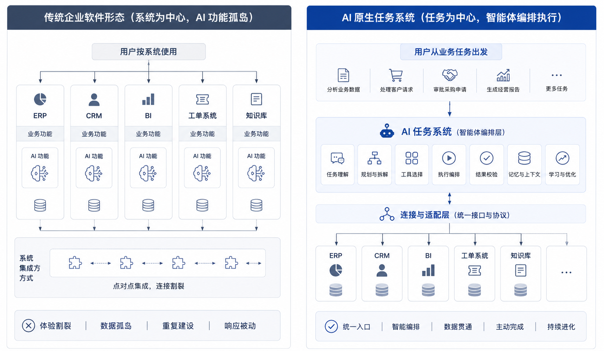
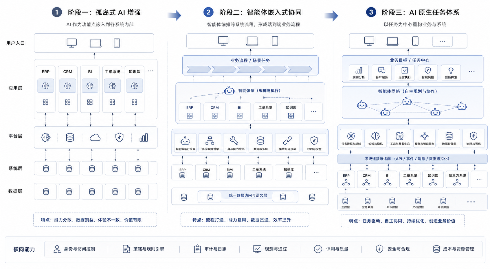
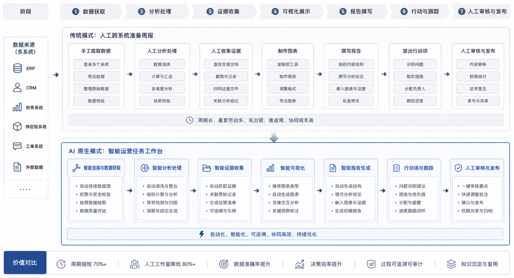
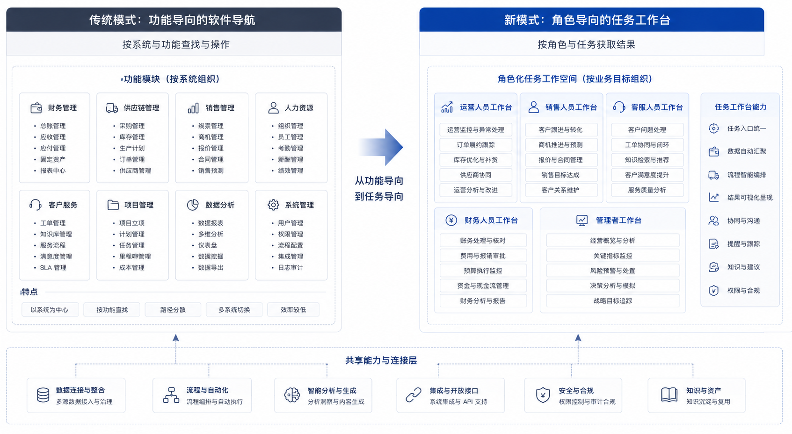

# Ch.03 AI 原生业务系统：Agent 重塑企业软件

> **本章目标**：帮助读者理解什么是“AI 原生业务系统”，它和“传统系统加 AI 功能”之间的差别在哪里；为什么企业真正的变化，不只是多了一个智能入口，而是业务任务、用户心智、组织协作和系统分层都在发生变化。
>
> **适读人群**：业务系统负责人、产品经理、平台团队、数据团队、准备规划 AI 原生路线的企业管理者。

*图 3-1 旧系统加 AI 与 AI 原生业务系统对比：前者是在原有模块里增加局部智能，后者则把业务任务作为入口，由 Agent 重新编排底层系统能力。*

---

## 为什么“旧系统加 AI”不等于 AI 原生

山岚集团的信息化并不落后。零售板块有 BI，制造板块有 ERP，客服中心有工单系统，财务共享中心有票据平台，总部有知识库。过去几年，这些系统都逐步加上了 AI 功能：

- BI 能做自然语言问数；
- CRM 能自动总结客户状态；
- ERP 能提示库存异常；
- 工单系统能自动摘要与分类；
- 知识库能做语义搜索。

这些能力都是真实进步，但它们没有根本改变业务协作方式。

例如，集团经营分析会前，运营负责人仍然需要重复同样的动作：打开 BI 看销售数据，打开库存系统查缺货，打开客服系统看投诉，打开知识库翻上月活动复盘，再把这些信息整理成一份材料。每个系统里的 AI 都在局部帮忙，但没有一个系统对“准备一份可开会使用的经营分析材料”这个任务整体负责。

这正是 AI 增强和 AI 原生之间最根本的差别。

AI 增强，是在旧系统里增加更聪明的能力；
AI 原生，是把“完成任务”本身重新变成系统的中心。

这两者都重要，但不能混为一谈。前者提升局部效率，后者改写系统分工。

## 从页面中心到任务中心：AI 原生到底改变了什么

很多团队一听“AI 原生”，第一反应是界面变化：从按钮变成对话，从表单变成聊天框。但如果只停留在这个层面，理解就太浅了。

AI 原生业务系统至少改变了四件事：

| 变化 | 传统业务系统 | AI 原生业务系统 |
|---|---|---|
| **入口** | 用户进入某个系统模块操作 | 用户提出目标或任务 |
| **流程** | 流程由页面与规则预先定义 | Agent 围绕目标动态组织步骤 |
| **责任** | 每个系统只对自己模块负责 | Agent 对端到端任务结果负责 |
| **协作** | 人在系统之间切换与拼接 | 系统在工具之间切换，人负责约束和确认 |

如果把山岚集团经营分析会的例子放进来，就很容易理解。

在传统模式下，用户的工作是“自己去拼”；在 AI 原生模式下，用户的工作逐渐变成“定义目标、补充约束、判断是否采纳结果”。

也就是说，用户心智会从“操作系统”转向“管理任务”。

还有一个更深层的变化常常被忽略：在传统系统里，页面是系统的第一组织原则；在 AI 原生系统里，任务开始取代页面，成为系统的第一组织原则。过去企业软件把人训练成“模块使用者”，AI 原生则在把人训练成“任务发起者”。这两种训练方式会反过来塑造产品设计、数据组织方式，甚至部门协作方式。

这个变化会让企业软件的许多传统假设失效。过去，系统设计的核心问题是“用户在哪个页面完成哪个动作”；现在，系统设计开始变成“用户提出目标后，系统如何组织一条可控任务链”。过去，产品经理最关心页面路径是否顺畅；现在，产品经理还必须关心任务状态是否透明、证据是否充分、风险节点是否可确认、失败后是否能继续。

所以，AI 原生并不是把旧系统的入口换成自然语言。它会把系统设计从“页面中心”推向“任务中心”，从“功能模块”推向“执行链路”，从“用户自己拼接”推向“系统帮助编排”。这个变化听起来抽象，但在真实业务里非常具体：经营分析不再只是 BI 的一个报表入口，报价也不再只是 ERP 的一个表单动作，它们都可能被重新包装成一个端到端任务。

**AI 原生与自动化、数字化、智能化的区别。**

企业过去已经经历过多轮系统升级：数字化、自动化、智能化。AI 原生不是凭空出现的新口号，它是在这些阶段之上继续演进。

| 阶段 | 核心目标 | 典型系统形态 | 局限 |
|---|---|---|---|
| **数字化** | 把业务对象和流程搬进系统 | ERP、CRM、OA、数据仓库 | 系统多、边界硬、用户需要自己拼接 |
| **自动化** | 把稳定流程交给规则执行 | Workflow、RPA、审批流 | 适合确定流程，不擅长开放任务 |
| **智能化** | 在局部功能中加入预测、推荐、生成 | 智能搜索、智能推荐、智能摘要 | 局部变聪明，端到端任务仍靠人组织 |
| **AI 原生** | 让系统围绕任务目标动态组织能力 | Agent 工作台、任务型 Agent、Generative UI | 需要平台、数据、治理和组织共同支撑 |

这张表说明，AI 原生不是否定前几个阶段。没有数字化，就没有可调用的数据和系统；没有自动化，就没有可嵌入的流程节点；没有智能化积累，就没有足够的局部能力。AI 原生是在这些基础上，把“任务”提升为新的组织中心。

山岚集团如果没有 ERP、BI、CRM、工单系统和知识库，经营分析 Agent 根本没有东西可调用；如果没有审批流，报价 Agent 也无法安全进入业务流程。因此，AI 原生不是推翻过去的信息化，而是重新编排过去的信息化资产。

## 旧系统不会消失，而是被工具化和重新编排

谈 AI 原生时，还有一个常见误解：以为未来所有旧系统都会被一个对话入口替代。这个判断过于简单。

ERP、CRM、BI、工单、财务系统不会因为 Agent 出现就消失。原因很直接：它们承载着企业事实、规则、权限、审计和事务一致性。Agent 不应该绕过这些系统，而应该把它们变成可调用、可解释、可治理的工具。

这意味着旧系统的角色会发生变化：

| 旧系统角色 | 过去 | AI 原生阶段 |
|---|---|---|
| ERP | 用户直接进入页面操作 | 提供订单、库存、采购、财务等工具能力 |
| CRM | 用户维护客户与机会 | 提供客户上下文、沟通历史、动作建议 |
| BI | 用户查看报表 | 提供指标查询、语义层和数据解释能力 |
| 工单系统 | 用户处理工单 | 提供事件流、状态变更、处置动作 |
| 知识库 | 用户搜索资料 | 提供可引用的制度、案例、说明文档 |

所以，AI 原生系统的关键不是“干掉旧系统”，而是让旧系统从用户必须亲自操作的界面，逐渐变成 Agent 可以在权限范围内调用的工具。这个过程如果做得好，用户体验会显著简化；如果做得不好，就会变成 Agent 绕过系统、权限失控、结果不可追溯。

这也是为什么第二章讲平台边界时强调 Tool Registry、Policy、Trace。旧系统工具化之后，工具的风险等级、调用权限、结果记录，都会成为平台必须管理的内容。

**用户心智为什么必须一起变化。**

很多企业低估了用户心智变化这一层，结果系统能力已经上线，用户却还在按旧方式使用，于是价值释放得很慢。

传统系统训练出来的用户心智是这样的：

- 我应该先去哪个页面？
- 这个字段该填什么？
- 哪个按钮能进入下一步？
- 我怎样导出结果再交给别人？

AI 原生系统要求的是另一套能力：

- 我到底想完成什么任务？
- 我应该给系统哪些约束？
- 这个任务现在进行到哪一步？
- 结果是否可信，是否需要我在关键节点确认？

这不是一个小变化。它意味着用户不再主要是“系统操作者”，而更像“任务发起者”和“结果裁决者”。

如果企业不帮助用户完成这种心智迁移，AI 原生系统就会出现很典型的问题：技术上能跑，业务上却用不起来。

## 哪些业务最先 AI 原生化：场景排序与迁移优先级

并不是所有业务域都会同时进入 AI 原生阶段。现实中，最先被改造的往往是那些“跨系统、跨知识源、跨角色”的任务，而不是那些高度结构化、强事务、一步到位的操作。

| 任务类型 | 为什么适合优先改造 | 山岚集团里的例子 |
|---|---|---|
| **跨系统信息整合** | 人工切换系统和拼接结果成本很高 | 经营分析、销售复盘、售后诊断 |
| **文档密集型任务** | 规则和依据散落在文档与知识库中 | 合规审查、投标响应、合同审阅 |
| **草稿型输出** | 结果可以先生成，再交由人确认 | 报价草稿、经营周报、客户回复建议 |
| **诊断型任务** | 需要逐步缩小问题范围，而不是单点查询 | 毛利异常分析、库存异常追因 |

相反，完全结构化、一次性、强事务性的流程，通常不会最先被 Agent 化。比如付款、签约、主数据删除这类动作，不会因为“AI 原生”四个字就突然适合自动化。

这对平台建设意味着一件事：AI 原生并不是“全量重做企业软件”，而是一种有优先级、有顺序的系统迁移。

反过来看，也有一些业务不适合被过早贴上 AI 原生标签：

| 不适合优先改造的场景 | 原因 |
|---|---|
| 强事务核心流程 | 容错空间极小，先需要把边界写死 |
| 规则高度明确且长期稳定的流程 | Workflow 往往更直接、更便宜 |
| 数据质量本身很差的场景 | AI 会把原有混乱放大，而不是自动修复 |
| 业务目标无法量化的场景 | 做了也很难证明价值和持续投入理由 |

这不是保守，而是节奏感。AI 原生最大的风险之一，就是在不适合的地方提前下注，结果把平台信用一并消耗掉。

**如何给 AI 原生场景排序。**

如果山岚集团一年只能重点推进三到五个 AI 原生场景，应该怎么排优先级？仅凭“哪个部门最积极”并不可靠。一个更稳的方式，是用四个维度打分。

| 维度 | 高分特征 | 低分特征 |
|---|---|---|
| **业务价值** | 高频、耗时、影响核心指标 | 偶发、边缘、价值难解释 |
| **任务结构** | 跨系统、需诊断、可分步骤推进 | 单步、固定、规则明确 |
| **数据准备度** | 口径清楚、数据可访问、知识资产较完整 | 数据分散、口径争议大、权限不清 |
| **风险可控性** | 可先产草稿、可回滚、可审批 | 直接对外承诺、影响资金或法律责任 |

按照这个模型，山岚集团可能得到这样的排序：

| 场景 | 业务价值 | 任务结构 | 数据准备度 | 风险可控性 | 建议 |
|---|---|---|---|---|---|
| 经营分析材料生成 | 高 | 高 | 中高 | 高 | 优先试点 |
| 客服工单质检 | 中高 | 中 | 高 | 高 | 优先试点 |
| 报价草稿生成 | 高 | 中高 | 中 | 中 | 加强审批后试点 |
| 自动客户邮件回复 | 中 | 中 | 中 | 低 | 谨慎 |
| 自动付款审批 | 高 | 低 | 中 | 极低 | 暂不做 Agent 自动化 |

这个排序不是为了追求绝对正确，而是为了让决策透明。很多 AI 项目失败，并不是因为场景没有价值，而是因为一开始选了一个价值高但风险也极高、数据又没准备好的场景，最后消耗了组织信任。

**AI 原生系统如何建立信任。**

AI 原生系统能不能被业务采用，最终取决于信任。这里的信任不是“用户觉得模型很聪明”，而是用户敢不敢把真实任务交给系统。

企业用户的信任通常来自五个来源：

| 信任来源 | 系统需要提供什么 |
|---|---|
| **可见过程** | 用户知道系统正在做什么，而不是黑箱等待 |
| **可查证据** | 结论能追溯到数据、文档、规则或工具结果 |
| **可控风险** | 高风险动作必须确认、审批或降级 |
| **可恢复性** | 失败后能重试、接管、回滚或继续 |
| **可持续改进** | 用户反馈能进入评估和版本迭代 |

如果一个 Agent 输出很漂亮，但不给证据，业务用户最多会觉得它“有启发”；如果它能给证据、给状态、给审批入口，用户才会开始把它当成工作系统。

这也解释了为什么 AI 原生工作台不能只是聊天框。聊天框擅长表达，但不擅长承载信任机制。任务状态、证据区、审批控件、回放入口，这些看起来没有“智能感”的东西，反而是企业采用的关键。

## AI 原生产品形态：任务助手、嵌入式 Copilot 与 Agent 工作台

用山岚集团的路径来概括，企业大致会经历三个阶段。

第一阶段，是**AI 增强**。每个系统都加上一点智能能力，但系统边界和协作方式没有本质变化。BI 还是 BI，CRM 还是 CRM，只是它们更会理解自然语言、更会总结内容。

第二阶段，是**Agent 嵌入**。出现一些跨系统任务的 Agent，它们不再只是单点功能，而是能够组织一小段任务链。经营分析 Agent、报价 Agent、客服质检 Agent，往往都属于这个阶段。

第三阶段，才是**AI 原生业务系统**。这时，用户面对的不再主要是某个旧系统，而是一个以任务为中心的工作台。系统自己组织步骤、生成中间结果、发起审批、沉淀证据，旧系统则逐渐退居工具层。

多数企业会长期停留在第一阶段和第二阶段之间。第三阶段不是一次性完成的，也不是所有部门同步进入的。它通常从最适合的业务域开始，然后再逐步扩散。

很多企业会犯一个判断错误：觉得只有进入第三阶段才算“真正做 AI 原生”。其实不然。第二阶段恰恰是企业最需要认真对待的阶段，因为这是平台、业务、数据和组织第一次真实碰撞的地方。很多所谓“AI 原生失败”，本质上是在第二阶段没有站稳，便急于宣布自己已经到了第三阶段。

从建设策略上看，第二阶段最关键。因为它既不像第一阶段那样只是局部功能增强，也还没有第三阶段那样全面改造业务系统。它是一个“可控试验场”：企业可以在有限范围内验证任务型 Agent、平台接入、语义层、审批、评估和用户工作台。

如果第二阶段做得好，第三阶段会自然长出来；如果第二阶段做得虚，第三阶段就会变成口号。

*图 3-2 AI 原生业务系统的三阶段迁移：企业通常会从旧系统内的 AI 增强，走向跨系统 Agent 嵌入，最后形成任务中心的 AI 原生业务系统。*

**AI 原生系统不是聊天框，而是任务工作台。**

一说到 AI 原生前端，最容易出现的误解就是：把搜索框换成聊天框，就算 AI 原生。

这显然不够。

一个真正可用的 AI 原生工作台，至少要让用户看到五类东西：

| 工作台要素 | 作用 |
|---|---|
| **任务状态** | 告诉用户系统是在规划、执行、等待审批还是失败 |
| **证据与引用** | 告诉用户结果来自哪些数据、规则和文档 |
| **结构化结果区** | 图表、表格、草稿、待办不应全部淹没在对话气泡里 |
| **人工接管入口** | 当系统不确定时，用户必须能接手、修改、继续 |
| **审批与确认控件** | 高风险动作不能埋在普通消息流中 |

这意味着 AI 原生前端通常是“对话 + 任务流 + 结构化结果 + 审批控件”的组合，而不是一个更大的输入框。

这也解释了为什么本书后面还要单独讲前端与 Generative UI：因为企业 AI 原生前端不是附属品，而是任务系统的重要组成部分。

如果再往细一点拆，一个成熟工作台通常会同时承载四层信息：

| 层次 | 用户最关心什么 |
|---|---|
| **任务层** | 现在到底在做哪件事 |
| **过程层** | 系统已经做了什么、接下来准备做什么 |
| **结果层** | 当前结论、图表、草稿、建议是否可采纳 |
| **责任层** | 哪些地方需要我确认、审批、接管或背书 |

这四层一旦缺失一层，AI 原生前端就容易退化：只剩任务层，会变成聊天工具；只剩结果层，会变成花哨报表；只剩责任层，会变成烦人的审批门户。真正好的工作台，是这四层同时清楚。

我们可以用经营分析场景具体想象这个工作台。

用户不是只输入一句“生成经营分析材料”，然后等系统吐出一段长文。更好的体验应该是：系统先显示任务目标和范围，让用户确认本次分析聚焦华东区、毛利率、上周数据；随后展示它准备查询哪些指标、引用哪些数据源；中间如果发现某个指标口径有两个版本，系统应暂停让用户选择；最后输出图表、结论、引用和待办，并允许用户把结果提交给会议材料审批流。

这才是 AI 原生工作台，而不是“聊天框里塞一份报告”。

*图 3-3 AI 原生任务工作台结构：企业级任务工作台需要同时呈现任务状态、执行过程、证据引用、结构化结果、人工接管和审批确认。*

**组织和岗位为什么也会被改写。**

如果 AI 原生只是一种界面变化，它就不会对组织造成太大冲击。现实是，它几乎一定会改写协作分工。

| 角色 | 传统职责 | AI 原生阶段的新职责 |
|---|---|---|
| **产品经理** | 设计页面、流程、字段 | 设计任务入口、风险节点、验收标准 |
| **数据团队** | 提供报表和接口 | 提供语义层、评测集、可解释数据资产 |
| **平台团队** | 管模型或基础设施 | 管 Runtime、工具、trace、评估、审批 |
| **业务用户** | 操作系统 | 定义目标、补充约束、判断结果是否采纳 |
| **安全合规团队** | 事后审计 | 事前定义边界、审批、敏感动作策略 |

这张表有一个很关键的含义：**如果组织结构完全不动，AI 原生项目通常也做不深。**

因为 AI 原生并不只是“技术更强”，而是把原来分散在多个团队的工作，重新围绕任务链条重组了一遍。

这也意味着，AI 原生项目的争议往往不会只发生在技术方案层。它常常会表现为：

- 产品经理担心任务边界太模糊，无法像原来那样定义清晰需求；
- 数据团队担心语义层和评测集会成为长期维护负担；
- 业务团队担心系统太“聪明”，反而让职责边界模糊；
- 安全团队担心高风险动作被包装成普通交互。

从这个角度看，AI 原生业务系统不是单纯替代旧系统，而是在重新协商“系统替人做多少”“人替系统兜多少”。这本身就是组织问题。

**迁移路线不只是技术路线，也是收益路线。**

企业在评估 AI 原生项目时，经常只盯着模型费用，或者只盯着“演示效果好不好”。更有意义的方式，是同时看三类收益：

| 收益类型 | 例子 | 更适合的衡量方法 |
|---|---|---|
| **时间收益** | 周报从 4 小时降到 20 分钟 | 任务总耗时、人均耗时 |
| **质量收益** | 报价草稿漏项减少、分析材料引用更完整 | 错误率、返工率、引用完整率 |
| **协同收益** | 少切系统、少发协调邮件、少重复拉会 | 系统切换次数、人工交接次数 |

如果一个场景在这三类收益里都不强，那它通常就不是企业优先做 AI 原生改造的好对象。

与此同时，也要看到三类经常被低估的成本：

| 成本类型 | 表现 |
|---|---|
| **数据成本** | 语义层、口径、权限和知识资产的整理远比想象中慢 |
| **流程成本** | 审批、回滚、人工接管机制需要重新设计 |
| **组织成本** | 产品、数据、平台、安全团队需要新的协作方式 |

把这些收益和成本一起看，AI 原生路线才会显得真实，而不是只停留在愿景层。

很多企业在这一步最容易犯的错误，是用“单次演示效果”替代“长期经营指标”。但 AI 原生项目真正该看的，往往是半年后是否减少了系统切换、是否减少了人工拼接、是否让关键任务有更稳定的交付节奏。也就是说，它最终会回到业务操作系统层面的收益，而不是单个模型回答得漂不漂亮。

更进一步说，AI 原生项目的 ROI 往往有一个“前期先变差、后期才变好”的特征。因为在最初几个月里，企业要先补语义层、评测、审批、平台接入这些基础工作，短期内看上去像是在“增加复杂度”。只有等这些底座站稳之后，系统切换减少、任务交付节奏稳定、组织协同成本下降这些收益才会出现。如果组织没有这个耐心，很多项目会在最该投入的时候被误判为“收益不明确”。

**AI 原生业务系统的产品形态谱系。**

AI 原生不是单一产品形态。企业在不同阶段、不同场景里，会看到一组连续谱。把这些形态分清楚，有助于避免把所有系统都设计成同一种聊天助手。

第一种形态，是**任务型助手**。它围绕一个明确任务提供帮助，比如生成经营周报、整理客户拜访材料、总结工单投诉。这类系统通常不直接改变业务流程，而是把某个高频任务做得更快、更完整。它的优势是启动快，风险低；局限是端到端责任有限。

第二种形态，是**嵌入式 Copilot**。它存在于旧系统内部，比如 BI 里的问数助手、CRM 里的客户总结助手、工单系统里的回复建议助手。它能增强旧系统，但仍然受旧系统边界限制。用户心智仍然是“我在某个系统里操作，只是旁边有 AI 帮我”。

第三种形态，是**自主工作流助手**。它不再只是给建议，而是能围绕一个目标推进一段流程。比如报价 Agent 自动收集客户背景、生成报价草稿、检查折扣规则、提交审批建议。它开始跨越旧系统边界，但仍然需要 Workflow 和审批机制约束。

第四种形态，是**Agent 工作台**。它把多个任务、多个工具、多个结果区域放在同一个工作空间里，让用户管理任务而不是操作系统。经营分析工作台、销售作战工作台、客服运营工作台，都可能属于这种形态。它通常是 AI 原生业务系统最典型的前端表达。

第五种形态，是**任务操作系统**。这是更长期的形态。用户不再按系统进入工作，而是按任务、角色和目标进入工作空间。旧系统退居工具层，Agent、任务状态、证据、审批、组织协同成为第一界面。这不是每个企业短期都能达到的状态，但它解释了 AI 原生为什么会重塑 SaaS。

| 产品形态 | 用户面对的主要对象 | 典型价值 | 典型限制 |
|---|---|---|---|
| 任务型助手 | 单个任务 | 快速起步，降低局部负担 | 端到端责任有限 |
| 嵌入式 Copilot | 旧系统中的某个功能 | 增强既有系统体验 | 系统边界仍然割裂 |
| 自主工作流助手 | 一段跨系统流程 | 减少人工推进和切换 | 需要强治理与审批 |
| Agent 工作台 | 任务、证据、结果、审批 | 改变日常工作方式 | 产品与组织改造成本较高 |
| 任务操作系统 | 角色目标与业务任务 | 重组企业软件入口 | 需要成熟平台和组织机制 |

这张谱系也能帮助企业设定合理目标。山岚集团经营分析场景，不一定第一天就要做成任务操作系统。它可以先从“生成经营周报”的任务型助手开始，再嵌入 BI 和数据平台，随后发展成能组织分析链路的 DataAgent，最后进入经营分析工作台。路线可以渐进，但方向要清楚。

**AI 原生与 SaaS 的关系：不是替代，而是重组入口。**

很多人会问：AI 原生是不是意味着传统 SaaS 会被替代？更准确的说法是，AI 原生会重组 SaaS 的入口和边界，而不是简单消灭 SaaS。

传统 SaaS 的价值，在于把某个业务域里的对象、流程、权限和数据管理起来。CRM 管客户和机会，ERP 管订单和库存，BI 管指标和分析，工单系统管服务事件。这些价值不会因为 Agent 出现而消失。恰恰相反，Agent 能否可靠执行，依赖这些系统提供真实数据、规则和动作入口。

变化发生在用户入口层。过去，用户为了完成一个任务，必须知道该进哪个 SaaS、打开哪个模块、查询哪个字段、复制哪段结果。AI 原生之后，用户会越来越倾向于从任务出发：“帮我准备明天的客户拜访”“解释这个区域为什么掉毛利”“把这批异常工单整理成处理建议”。系统背后的 SaaS 仍然存在，但用户不再总是直接面对它们。

这会带来一个重要结果：SaaS 的竞争不再只发生在“功能完整性”上，也会发生在“是否容易被 Agent 调用、解释和治理”上。一个拥有良好 API、清晰权限、稳定数据契约、可审计操作日志的系统，会更容易进入 AI 原生任务链。一个只能通过页面操作、数据口径混乱、权限粒度粗糙的系统，会在 Agent 时代变成阻力。

从山岚集团角度看，AI 原生不是把 CRM、ERP、BI 全部换掉，而是把它们重新组织成任务工具层：

| 旧系统 | 过去的入口价值 | AI 原生后的新价值 |
|---|---|---|
| CRM | 销售直接维护客户 | 提供客户上下文和销售动作工具 |
| ERP | 业务直接处理订单库存 | 提供库存、订单、采购、价格约束 |
| BI | 用户查看报表 | 提供指标、语义层和数据解释 |
| 工单系统 | 客服处理事件 | 提供事件状态、处置记录和质量样本 |
| OA/审批 | 用户提交流程 | 提供人工确认、授权和责任链 |

因此，AI 原生业务系统不是站在 SaaS 对面，而是站在 SaaS 之上。它把 SaaS 从“用户第一入口”逐步变成“任务执行工具层”。这也是为什么第二章讲平台边界时强调：平台不是应用，平台要让应用和旧系统能被 Agent 安全调用。

**不同业务域的迁移优先级。**

AI 原生迁移不是平均用力。不同业务域的数据准备度、风险等级、任务结构和组织阻力都不同。企业需要知道哪些领域适合早做，哪些领域适合晚做。

对山岚集团这样的综合型企业，可以粗略分成六类业务域。

第一类是数据分析与经营管理。这类任务通常以只读为主，价值高，跨系统切换成本明显，适合最早进入 AI 原生。经营分析、销售复盘、库存异常诊断、毛利追因，都属于这一类。

第二类是客服与运营质检。这类任务样本量大、标准相对明确、结果可以先给人复核，因此也适合早期推进。客服摘要、投诉归因、质检抽检、知识库推荐，都是很好的起点。

第三类是销售与商务支持。它价值很高，但涉及客户承诺和价格策略，风险比前两类高。适合从客户资料整理、拜访准备、报价草稿开始，而不是一上来自动对外沟通。

第四类是财务共享与票据处理。它流程清晰、重复度高，但合规要求强。适合把 Agent 用在异常解释、资料补齐、凭证草稿和人工复核辅助上，而不是直接放开自动记账和付款。

第五类是研发、运维和内部 IT。这类场景技术用户接受度高，反馈快，但工具副作用也强。代码修改、环境操作、配置变更必须严格控制。它适合作为平台能力试验场，但不能因为用户是技术人员就放松治理。

第六类是法务、合规和高风险决策。这类场景知识密集、价值高，但责任风险也高。早期更适合做检索、摘要、条款比对和风险提示，不适合让 Agent 独立给出最终法律判断。

| 业务域 | 迁移优先级 | 起步方式 | 主要风险 |
|---|---|---|---|
| 数据分析与经营管理 | 高 | 只读分析、材料生成、异常诊断 | 指标口径错误 |
| 客服与运营质检 | 高 | 摘要、分类、质检建议 | 员工评价与客户承诺 |
| 销售与商务支持 | 中高 | 客户准备、报价草稿、审批建议 | 对外承诺、折扣越界 |
| 财务共享 | 中 | 票据识别、异常解释、凭证草稿 | 合规责任、资金风险 |
| 研发与运维 | 中 | 诊断、脚本建议、变更辅助 | 工具副作用、系统稳定 |
| 法务与合规 | 中低 | 条款检索、摘要、风险提示 | 法律责任、解释边界 |

这个排序不是固定答案，但体现了一个原则：早期优先选择“高价值、可复核、可回滚、以内部使用为主”的场景。等平台、数据、评估和组织机制成熟后，再逐步进入高风险外部承诺场景。

## 经营分析会案例与产品组织设计：从手工拼材料到任务工作台

我们用一个完整案例来看 AI 原生业务系统到底如何改变工作方式。

山岚集团每周一上午开经营分析会。传统模式下，周五下午开始，运营负责人会让各区域提交数据，数据团队导出销售、毛利、库存、促销、客诉等报表，运营专员把多个系统里的结果整理到 PPT，再找区域经理确认原因。到周一开会时，材料通常已经有了，但它有三个问题：一是数据口径容易不一致；二是异常追因常常依赖人工经验；三是会议上的行动项和后续跟进容易散落在邮件和群消息里。

如果只是 AI 增强，每个系统都会变聪明一点。BI 能回答“华东区上周毛利率是多少”，工单系统能总结投诉，知识库能检索促销复盘。用户体验会改善，但运营负责人仍然要自己拼接。

如果进入 Agent 嵌入阶段，经营分析 Agent 可以接管一段任务链。用户提出目标：“准备下周一经营分析会材料，重点看华东区毛利率异常。”系统会先确认分析范围：时间、区域、指标、会议模板。随后它查询销售、毛利、促销、库存、客诉等数据，发现毛利率下降主要集中在两个品类，并进一步检查是否与促销折扣、物流成本、缺货替代销售相关。如果某个指标口径存在冲突，系统暂停让用户选择口径。

最终，它生成的不是一段聊天回答，而是一组会议材料：异常摘要、图表、证据引用、可能原因、待确认问题、建议行动项。用户可以修改结论，也可以把行动项派给区域负责人。

如果进一步发展成 AI 原生经营工作台，变化就更明显。经营分析不再是每周临时拼材料，而是一个持续运行的任务空间。系统平时就监控关键指标，发现异常后生成任务，积累证据，提醒相关负责人补充解释。会议前，材料只是把这一周的任务状态、证据和决策建议汇总起来。会议后，行动项继续在同一个工作台里跟进。

这三个阶段的差别可以概括为：

| 阶段 | 用户主要做什么 | 系统主要做什么 | 会议材料如何形成 |
|---|---|---|---|
| 传统模式 | 手动查、手动拼、手动问人 | 提供报表和记录 | 人工整理 |
| AI 增强 | 在多个系统里问 AI | 各自回答局部问题 | 人工拼接 AI 输出 |
| Agent 嵌入 | 定义分析目标，确认关键节点 | 跨系统追因，生成材料草稿 | Agent 生成，人复核 |
| AI 原生工作台 | 管理持续任务和行动项 | 持续监控、归因、沉淀证据 | 工作台自动汇总 |

这个案例说明，AI 原生的本质不是“自动写 PPT”。真正改变的是经营分析从一次临时材料准备，变成一个持续的任务管理过程。系统不只是生成内容，而是在重组数据、证据、会议和行动之间的关系。

*图 3-4 经营分析会从手工拼材料到任务工作台：AI 原生系统把跨系统取数、异常追因、证据沉淀、报告生成和行动项跟进组织成连续任务链。*

**用户培训的重点不是提示词，而是任务模板。**

很多企业上线 AI 原生系统后，会立刻组织“提示词培训”。这当然有用，但如果只教用户怎么写 prompt，反而会把问题带偏。企业用户真正需要学习的，不是如何和模型聊天，而是如何把工作表达成可执行任务。

比如“帮我分析一下华东区”这个输入太宽泛。一个更好的任务表达应该包含范围、目标、约束和交付物：“分析上周华东区毛利率下降原因，重点比较促销、库存和物流成本影响，输出会议材料草稿，并标明需要区域经理确认的问题。”这不是提示词技巧，而是任务定义能力。

因此，AI 原生系统更应该提供任务模板，而不是只提供一个空白输入框。任务模板可以帮助用户表达目标，也可以帮助系统稳定理解边界。

| 模板要素 | 作用 |
|---|---|
| 任务目标 | 明确要完成什么，而不是泛泛提问 |
| 分析范围 | 限定时间、区域、品类、客户或流程 |
| 约束条件 | 指定口径、规则、风险边界 |
| 交付物 | 说明要报告、图表、草稿、建议还是行动项 |
| 人工节点 | 指明哪些地方需要确认或审批 |

山岚集团可以为不同场景准备一组任务模板：经营分析模板、报价草稿模板、客服质检模板、票据异常模板、合同条款审阅模板。用户不是从空白对话开始，而是从业务任务开始。这会显著降低使用门槛，也会让平台更容易评估和治理。

任务模板还有一个额外价值：它把组织经验固化下来。优秀运营经理如何准备经营分析会，资深销售如何判断报价风险，财务主管如何检查票据异常，这些经验都可以逐步沉淀进模板。AI 原生系统的长期价值，正是在这种沉淀中出现。

**AI 原生失败的四个原因。**

AI 原生项目失败时，表面原因各不相同：模型回答不好、用户不用、成本太高、上线太慢。但往深处看，常常可以归结为四类根因。

第一，数据没有准备好。系统想做经营分析，但指标口径不统一；想做报价建议，但历史合同和价格政策无法可靠关联；想做客服质检，但制度文档版本混乱。AI 原生会放大数据问题，因为它试图跨系统组织任务。数据越混乱，系统越容易给出看似流畅但不可信的结果。

第二，流程没有定义清楚。很多团队只定义了“系统应该输出什么”，没有定义“系统做到哪一步必须停下”。比如报价 Agent 能不能提交审批？能不能生成客户邮件？能不能修改报价单？这些边界不清，系统上线后就会引发争议。

第三，评估缺失。AI 原生系统不能只靠演示验收。经营分析要看异常归因是否准确，报价要看是否遵守折扣规则，客服质检要看是否漏掉高风险样本。没有评估样本和回归机制，系统每次升级都像重新赌博。

第四，组织没有接受新分工。AI 原生要求用户定义目标、确认关键节点、复核结果，也要求数据、平台、安全团队共同运营。如果组织仍然把它当成“IT 交付一个工具”，项目很难深入。

| 失败根因 | 典型表现 | 早期预警信号 |
|---|---|---|
| 数据未准备 | 答案流畅但不可信 | 口径争议频繁、引用不稳定 |
| 流程未定义 | 不知道哪里该停 | 高风险动作靠口头约定 |
| 评估缺失 | 版本好坏说不清 | 验收只看演示效果 |
| 组织未接受 | 用户不用或绕开系统 | 没有任务模板、反馈没人处理 |

这四个原因也解释了为什么 AI 原生不能只由某一个团队推动。它需要数据资产、流程边界、评估机制和组织运营同时在场。

**从阶段一走向阶段二、阶段三的里程碑。**

企业从 AI 增强走向 AI 原生，不应该靠口号宣布，而应该看里程碑。

从阶段一“AI 增强”走向阶段二“Agent 嵌入”，至少要出现五个信号：系统能围绕任务而不只是单次问答；能调用两个以上真实工具或数据源；能保留任务状态和过程证据；能在关键节点让人确认；能用样本评估任务结果。

从阶段二走向阶段三“AI 原生业务系统”，还需要更进一步：用户开始从任务入口进入工作，而不是从旧系统入口进入；多个旧系统稳定退居工具层；任务模板、评估、审批、反馈形成持续运营机制；业务指标开始体现端到端收益；组织角色也开始围绕任务链重组。

可以把里程碑整理成一张表：

| 迁移阶段 | 关键里程碑 | 没达到时的风险 |
|---|---|---|
| AI 增强 → Agent 嵌入 | 任务闭环、工具调用、状态证据、人工确认、样本评估 | 只是多个 AI 功能拼在一起 |
| Agent 嵌入 → AI 原生 | 任务入口、旧系统工具化、持续运营、端到端收益、组织分工变化 | 只是高级助手，没有改写业务系统 |

山岚集团如果要判断经营分析场景是否已经进入阶段三，不应只看系统界面是否像工作台，而要看运营团队是否真的减少了跨系统拼接，会议材料是否从持续任务中自动汇总，行动项是否能在同一链路里跟进，数据团队是否从重复取数转向维护语义层和评估样本。

这些里程碑也给第三章一个收束：AI 原生不是一个标签，而是一组可以被观察到的系统和组织变化。

**AI 原生产品与组织设计：任务地图、人机协同和团队变化。**

传统企业软件有一个默认假设：用户知道自己要进哪个系统，知道哪个字段在哪里，知道哪张表或哪个流程代表真实状态。这个假设在企业里存在了很久，也训练出了一整套“系统熟练工”。熟练员工看起来效率很高，但效率背后其实是大量隐性成本：记住系统边界、理解字段含义、跨系统对齐口径、手动拼接结果。

AI 原生系统应该改变这个假设。它不应该再要求用户管理系统复杂度，而应该让系统自己管理一部分复杂度，并把关键边界透明地呈现给用户。

这句话听起来像产品原则，其实也是平台原则。因为用户之所以被迫管理复杂度，往往不是前端设计不好，而是底层系统之间缺少统一的任务语义。BI 的指标、CRM 的客户、ERP 的订单、客服系统的投诉、知识库的制度，都各自正确，但它们没有围绕“用户要完成的任务”组织起来。AI 原生要做的，不只是把这些系统接到一个聊天框里，而是把它们重新组织成一条可理解、可控制、可复盘的任务链。

以经营分析为例，传统系统把复杂度交给运营负责人：你要知道毛利率在哪个报表，促销费用在哪个系统，库存周转怎么看，客诉影响如何判断，会议材料怎么组织。AI 原生工作台则应该把复杂度分层：

| 复杂度类型 | 传统模式谁承担 | AI 原生系统应如何处理 |
|---|---|---|
| 系统位置 | 用户记住系统入口 | 系统按任务自动选择工具 |
| 数据口径 | 用户自己判断 | 系统显示口径和权威来源 |
| 分析路径 | 用户凭经验追查 | Agent 提供可见计划和中间结果 |
| 风险边界 | 用户自己把握 | 系统在关键节点确认或审批 |
| 结果组织 | 用户手动整理 | 工作台生成结构化材料和行动项 |

这个原则也能解释为什么简单聊天框不够。聊天框虽然降低了输入门槛，却可能把系统复杂度藏得更深。用户看不到系统查了什么、漏了什么、为什么这样判断、下一步会不会产生副作用，就很难真正信任它。

因此，AI 原生产品设计的关键不是“让用户少点几次鼠标”，而是“让用户不用再替系统承担不该由人承担的拼接工作，同时让人仍然掌握关键判断权”。

**从功能菜单到任务地图。**

传统 SaaS 的导航通常是功能菜单：客户、订单、库存、报表、工单、审批。这个结构很清楚，因为它对应系统模块和数据对象。但用户真正的工作往往不是围绕菜单展开，而是围绕任务展开。

山岚集团销售经理的一天，不是“先使用 CRM，再使用 ERP，再使用 BI”，而是“准备客户拜访、评估报价空间、跟进合同风险、处理客户投诉、同步团队进展”。这些任务会穿过多个系统。传统软件让用户在菜单之间切换，AI 原生系统则应该把任务本身放到前台。

这意味着企业软件的组织方式会从功能菜单转向任务地图。

任务地图不是一个花哨的新导航，而是把企业关键任务按照角色、频率、风险和价值组织起来。比如山岚集团可以为几个核心角色建立任务地图：

| 角色 | 高频任务 | AI 原生入口 |
|---|---|---|
| 运营负责人 | 经营分析、异常追因、行动项跟进 | 经营分析工作台 |
| 销售经理 | 客户准备、报价草稿、合同跟进 | 销售任务工作台 |
| 客服主管 | 工单质检、投诉归因、知识修订 | 客服运营工作台 |
| 财务主管 | 票据异常、月结材料、凭证复核 | 财务共享工作台 |
| 管理层 | 指标复盘、风险扫描、决策跟踪 | 管理驾驶舱 + Agent |

这个变化会影响产品团队的需求方法。过去需求文档常常从页面和字段开始；AI 原生需求应该从任务地图开始：这个角色有哪些高价值任务？哪些任务跨系统？哪些任务需要 AI 诊断？哪些任务需要审批？哪些任务应该保留在旧系统里？

任务地图还有一个好处：它能防止企业把 AI 原生做成“无边界助手”。当所有需求都塞进一个万能入口，系统看起来统一，实际却难以评估和治理。任务地图让入口保持清晰，让每个 Agent 都有上下文、模板和验收标准。

*图 3-5 从功能菜单到角色任务地图：AI 原生业务系统不再只按功能模块组织入口，而是围绕不同角色的高价值任务建立工作空间。*

**AI 原生系统中的人机协同模式。**

AI 原生不是让系统完全取代人，而是改变人和系统的协作方式。不同风险、不同任务结构下，人机协同模式也不同。

第一种模式是“系统起草，人修改”。这适合报告、邮件、总结、分析材料等草稿型任务。系统主要减少空白页成本，人负责判断内容是否准确、是否符合语气、是否可以对外。

第二种模式是“系统诊断，人裁决”。这适合异常分析、客户风险判断、工单归因等诊断型任务。系统负责收集证据、提出候选原因，人负责选择可信结论和后续动作。

第三种模式是“系统推进，人确认”。这适合报价、审批准备、财务复核等任务。系统能完成低风险步骤，但在关键节点暂停，让人确认。

第四种模式是“系统监控，人介入”。这适合经营指标、客服风险、库存异常等持续监控任务。系统长期观察信号，发现异常后生成任务，人进入处理。

第五种模式是“系统学习，人校准”。这适合长期运营。用户的修改、驳回、确认和补充会进入反馈机制，帮助任务模板、评估样本和知识资产不断改进。

| 协同模式 | 适合任务 | 人的主要职责 | 系统的主要职责 |
|---|---|---|---|
| 系统起草，人修改 | 周报、邮件、总结 | 修改、确认、背书 | 生成草稿和结构 |
| 系统诊断，人裁决 | 异常追因、客户风险 | 判断结论和行动 | 汇总证据和候选原因 |
| 系统推进，人确认 | 报价、审批、复核 | 确认关键节点 | 执行低风险步骤 |
| 系统监控，人介入 | 指标、投诉、库存 | 处理异常 | 发现信号并建任务 |
| 系统学习，人校准 | 所有长期任务 | 反馈和校准 | 沉淀模板和评估 |

这张表能帮助产品团队决定交互形态。不是所有场景都需要同样的“聊天 + 结果”界面。起草型任务需要编辑体验，诊断型任务需要证据面板，推进型任务需要状态和审批，监控型任务需要任务队列，学习型任务需要反馈机制。

AI 原生前端的多样性，来自人机协同模式的多样性。把所有场景都做成聊天，就等于忽略了这种差异。

**AI 原生对数据团队意味着什么。**

第三章虽然不是数据工程章节，但必须提前说明：AI 原生会显著改变数据团队的工作重心。

过去，数据团队的核心交付往往是报表、指标、数据集、数据接口。业务用户提出需求，数据团队建表、做看板、解释口径。AI 原生阶段，数据团队仍然要做这些事，但还会增加三类新责任。

第一，数据团队要提供可被 Agent 理解的语义层。Agent 不能直接面对一堆表和字段猜业务含义。毛利率、动销率、缺货率、客户等级、促销费用，都必须有清楚定义、适用范围、口径版本和权限边界。

第二，数据团队要参与评估样本建设。DataAgent 的好坏不能只靠用户感觉。哪些问题代表高频分析？哪些问题容易出错？哪些 SQL 或指标组合是正确答案？这些都需要数据团队和业务共同沉淀。

第三，数据团队要帮助构建证据机制。AI 原生系统输出结论时，必须能说明依据来自哪些指标、哪些时间范围、哪些数据源。数据团队不只是提供数据，还要让数据成为可解释证据。

| 传统数据交付 | AI 原生阶段新增要求 |
|---|---|
| 报表 | 可被 Agent 调用和解释的指标能力 |
| 数据集 | 有业务语义、权限和口径的上下文 |
| 数据接口 | 工具化、可审计、可回放的数据查询 |
| 口径说明 | 可引用、可版本化的语义资产 |
| 数据质量 | 与 Agent 评估和信任机制绑定 |

这解释了为什么 AI 原生不能绕开数据平台。很多看起来是模型问题的失败，最后都会回到数据语义和证据问题。山岚集团经营分析 Agent 如果无法稳定区分“账面毛利”和“经营毛利”，再强的模型也会给出不可靠结论。

所以，AI 原生会把数据团队从“报表生产者”推向“语义和证据资产的经营者”。这不是职位名称变化，而是责任重心变化。

**AI 原生对产品经理意味着什么。**

产品经理在 AI 原生阶段也会遇到一个根本变化：需求不再只是页面、字段和流程，而是任务、边界和信任。

传统产品经理会问：用户在哪个页面做什么？有哪些字段？按钮怎么排？异常提示怎么写？这些问题仍然重要，但已经不够。AI 原生产品经理还要问：

- 用户的真实任务是什么，而不是他打开了哪个系统？
- 这个任务的成功标准是什么？
- 系统可以自主推进到哪一步？
- 哪些中间结果必须展示证据？
- 用户什么时候应该介入？
- 如果系统不确定，应该追问、降级还是交给人？
- 这个任务如何被评估和持续改进？

这些问题会让产品经理从“功能设计者”变成“任务设计者”。任务设计者要同时理解业务目标、系统能力、风险边界和用户信任。

以报价 Agent 为例，产品经理不应该只设计一个输入框和一个报价结果页，而要设计完整任务体验：销售如何选择客户和产品，系统如何展示可用上下文，报价依据如何展开，折扣风险如何提示，审批节点如何出现，用户如何修改草稿，最终结果如何进入合同流程。

这也意味着 AI 原生产品文档的结构会变化。过去的 PRD 可能按页面写；未来的任务型 PRD 需要按任务链写：

| PRD 部分 | 传统写法 | AI 原生写法 |
|---|---|---|
| 用户入口 | 哪个页面或菜单入口 | 哪个角色、任务目标和任务模板 |
| 流程设计 | 固定页面流和字段校验 | 任务状态、分支、暂停点、接管路径 |
| 结果设计 | 一个结果页或导出文件 | 结构化结果、证据、引用和下一步动作 |
| 风险设计 | 异常提示和权限校验 | 风险等级、审批节点、禁止动作 |
| 验收方式 | UI 和功能验收 | 任务样本、质量指标、回归标准 |

管理层需要避免两个极端。一个极端是把 AI 原生看成单纯降本工具，只问能减少多少人。这个视角会让组织天然抵触，也会忽略质量、速度和协同收益。另一个极端是把 AI 原生看成战略口号，只做展示性项目，不追踪真实业务指标。这个视角会让项目失去经营约束。

更健康的管理视角，是把 AI 原生看成企业任务能力的升级。管理层应该看五类指标：

| 管理指标 | 它反映什么 |
|---|---|
| 关键任务耗时 | AI 是否减少端到端任务摩擦 |
| 任务质量 | 是否减少漏项、错误、返工 |
| 复用能力 | 是否从单点项目走向平台化复制 |
| 风险可控性 | 是否有审批、trace、评估和事故复盘 |
| 组织接受度 | 用户是否持续使用，是否愿意反馈 |

这些指标比“接入了多少模型”“上线了多少助手”更有意义。一个企业上线 50 个没人用、不可评估、不可治理的助手，不如上线 5 个真正改变关键任务的 AI 原生系统。

对山岚集团管理层来说，一个合理的年度目标不是“每个部门都做一个 Agent”，而是“围绕经营分析、报价、客服质检、财务票据四类关键任务，建立可复制的平台和运营机制”。这类目标既有业务价值，也能推动平台沉淀。

**迁移蓝图：十二个月内真正应该发生什么。**

如果山岚集团决定用一年时间推进 AI 原生业务系统，路线不应该是“每个月上线几个助手”。更合理的蓝图，是用场景牵引平台，用平台反哺场景。

前三个月，重点是选场景和立边界。选择一到两个高价值、内部使用、可复核的场景，比如经营分析和客服质检。此时最重要的不是功能数量，而是任务定义、数据口径、风险分级、评估样本和用户反馈机制。

第四到第六个月，重点是把试点变成可运营系统。经营分析 Agent 不只是能生成材料，还要能保留证据、支持人工修改、沉淀失败样本、接入会议行动项。客服质检 Agent 不只是能分类，还要能支持主管复核、标准更新和质量回归。

第七到第九个月，重点是复制到第二批场景。报价草稿、财务票据异常、销售拜访准备可以进入。此时平台能力应该开始复用：统一任务模板、工具目录、trace、评估方法、审批接入。

第十到第十二个月，重点是形成 AI 原生工作台雏形。不是所有场景都要合并成一个大系统，而是让关键角色拥有稳定任务入口：运营工作台、销售任务工作台、客服运营工作台。管理层可以看到任务价值、成本、质量和风险视图。

| 时间 | 重点 | 成功标志 |
|---|---|---|
| 1-3 个月 | 场景选择与边界定义 | 任务模板、数据口径、风险和评估样本成型 |
| 4-6 个月 | 试点运营化 | 证据、反馈、复核和版本回归可运行 |
| 7-9 个月 | 第二批场景复制 | 平台能力开始被复用 |
| 10-12 个月 | 工作台雏形 | 用户从任务入口进入关键工作 |

这张蓝图的重点，是避免两个陷阱：一是只做试点不运营，二是只建平台不服务场景。AI 原生迁移必须同时推进场景、平台和组织。

**为什么 AI 原生最终会回到平台。**

第三章一直在讲业务系统，但结论并不是“平台不重要，产品更重要”。恰恰相反，讲完 AI 原生之后，平台的重要性会更清楚。

因为 AI 原生一旦成立，就意味着：

- 旧系统要被工具化，这需要工具契约和权限治理；
- 用户要从任务入口进入，这需要任务状态和上下文管理；
- 系统要跨数据、知识和流程组织结果，这需要语义层和证据机制；
- 高风险动作要被确认或审批，这需要流程和责任链；
- 结果要持续可信，这需要评估、trace、反馈和版本治理；
- 多个业务域要复制，这需要平台目录、模板和运营机制。

换句话说，AI 原生业务系统越往前走，越会拉动平台能力。没有平台，AI 原生只能停留在局部体验；没有业务系统，平台又会变成空转基础设施。两者是一体两面。

这也是 Part I 的结构安排：第一章定义 Agent，第二章定义平台边界，第三章定义 AI 原生业务系统，第四章再给出全书地图。读者如果只看其中一章，很容易偏。只看 Agent，会把问题理解成模型能力；只看平台，会把问题理解成基础设施；只看 AI 原生，会把问题理解成产品体验。三章连起来，才是这本书真正要讨论的对象：企业如何建设一套支撑 AI 原生业务系统的 Agent 平台。

**为什么这一章之后，必须落回“平台全景”。**

到这里为止，读者应该已经能看见一条清晰的线索：

第一章说明，Agent 不是普通助手，而是任务执行系统。
第二章说明，一旦企业进入多 Agent 阶段，就必须平台化。
第三章进一步说明，平台最终服务的，不只是若干实验项目，而是一类新的业务系统形态。

这就自然把问题推向第四章：

如果企业真的要走向 AI 原生业务系统，那么模型、数据、知识、Runtime、工具、审批、trace、评估、安全、前端，这些东西到底在全局上如何组织？后面的 55 章又为什么按今天这个结构展开？

换句话说，第三章的作用，不是把 AI 原生神秘化，而是把“为什么需要一张全书地图”这件事讲透。

它还有一个更隐含的作用：提醒读者不要把 AI 原生理解成“前端趋势”或“产品愿景”。如果第三章只停在产品体验层，就会让人觉得接下来应该直接进入 UI、交互、Copilot 设计；但实际上，正是因为 AI 原生最终会回到底层平台、数据、评估和安全问题，所以第四章必须马上把视角重新拉到全局。

## 第三章收束：AI 原生最终会回到平台全景

这一章真正想交付给读者的，是对“AI 原生业务系统”四个字的去神秘化理解。

第一，AI 原生不是“多一个聊天框”，而是让系统围绕任务而不是页面来组织自己。

第二，用户心智会从“操作系统”逐渐转向“管理任务”，这需要产品、前端和组织共同支撑。

第三，最适合优先进入 AI 原生阶段的，是那些跨系统、跨知识源、可生成草稿、可做诊断的任务。

第四，AI 原生前端本质上是任务工作台，而不是聊天界面的简单放大版。

第五，AI 原生不是纯技术运动，它必然牵动产品、数据、平台、安全与业务协作方式。

下一章会把这些判断重新收束到一张完整地图中：既然 Agent 平台最终服务的是 AI 原生业务系统，那么整本书接下来为什么要按模型、数据、知识、平台、评估、安全这样一条路线展开？
