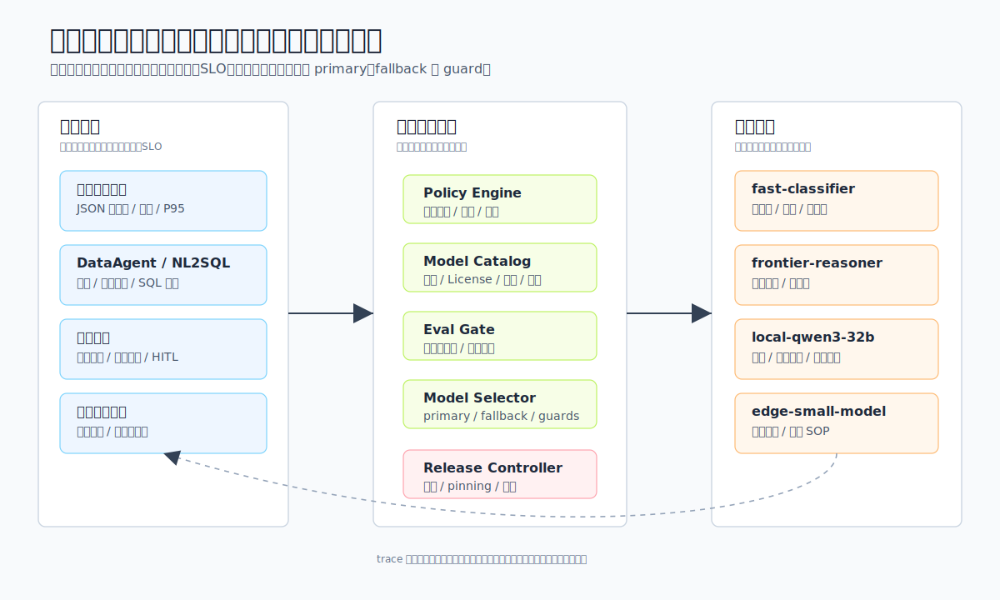
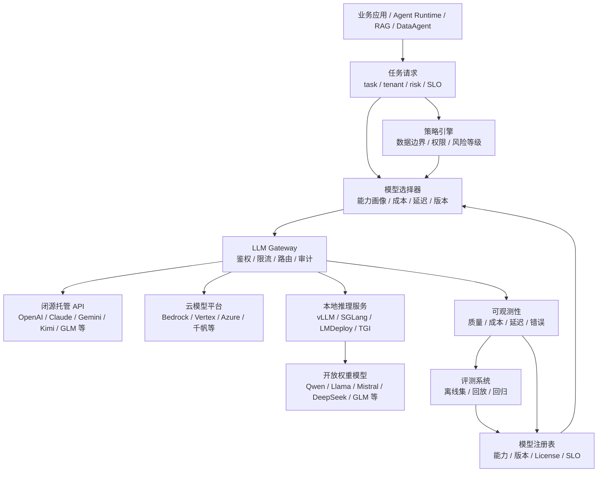
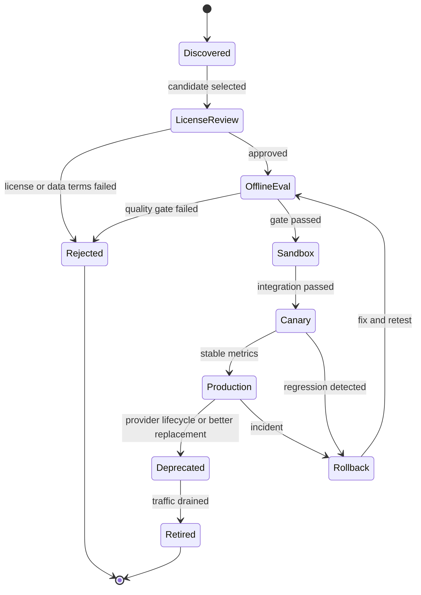
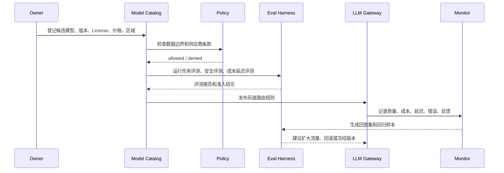

# 第5章 大模型选型

---

大模型选型不能停留在一次性产品比较上，它会逐步变成由任务画像、数据边界、SLO、成本和生命周期共同约束的运行时决策。选型的目标是为不同任务匹配合适模型，并让这套匹配能随业务和模型迭代调整，而不是选出一个“最强模型”。业务任务、模型矩阵、运行时路由、闭源与开源、大模型与小模型的取舍，共同构成企业模型选型的判断框架。

大模型选型一旦进入企业，就不再是模型团队单独挑供应商。业务方关心结果质量，平台团队关心路由和回滚，安全团队关心数据边界，财务团队关心成本。选型评审要同时容纳这些约束：先写清任务画像，再决定候选模型和路由策略，并用企业自己的评测集和运行数据持续校准。

模型选型在企业内部很少以一张排行榜结束。试点阶段，团队通常会选一个能力强、接入快的模型先跑起来；到了生产阶段，同一个模型要同时面对客服高并发、财务问数、合同审阅、代码生成和门店离线查询。每个场景对延迟、成本、上下文长度、结构化输出、数据出域和版本稳定性的要求都不同。若仍把选型理解成“全公司统一用一个模型”，平台会在很短时间内遇到两类问题：低风险任务承担了过高成本，高风险任务又缺少足够的推理和审计能力。

真实评审会通常比模型对比表复杂。业务负责人会追问准确率和上线时间，安全团队会追问数据能否离开内网，平台团队要确认网关、限流、降级和回滚能否支持，财务团队则希望费用能按租户和任务归因。模型团队如果只拿公开 benchmark 说明“这个模型更强”，很难回答这些问题。企业需要的不是一次采购结论，而是一套持续运行的模型矩阵：任务先被画像，再进入路由和评测，最后由运行数据反过来校准策略。

一个常见失败案例是把复杂 DataAgent 和简单分类任务都路由到同一个强模型。前者需要高质量 SQL、工具调用和解释能力，后者只需要稳定标签和低延迟。统一模型让早期上线看起来简单，账单和排队延迟却会迅速放大；当强模型版本升级导致输出格式变化时，所有业务一起受影响。更稳的做法是把模型视为可治理资源，把能力、成本、合规和生命周期写入平台配置，让不同任务在同一控制面下选择不同模型。

## 5.1 选型从业务任务开始

### 5.1.1 多业务线企业的模型矩阵需求

一家多业务线企业启动 Agent 平台时，最先遇到的问题往往是到底用哪个模型，而不是 Agent 循环怎么写。客服团队希望低成本处理每天数万条工单；财务团队希望 DataAgent 能生成可执行、可审计的 SQL；法务团队希望合同助手不要编造条款；研发团队希望代码助手能理解内部仓库；门店团队希望在网络不稳定时也能用离线助手查询 SOP。这些需求都叫“大模型能力”，但它们对模型的要求完全不同。

如果只按公开排行榜选一个模型，平台很快会撞到现实约束。

- 客服分类任务并不需要最贵的推理模型，但需要稳定 JSON、低延迟和极低单次成本。
- DataAgent 需要强推理、结构化输出、工具调用和 SQL 安全校验，不能按普通对话体验选型。
- 合同审阅需要证据引用、拒答边界和人工确认，不能把“回答流畅”当作“结论可靠”。
- 内部代码助手需要长上下文、仓库检索、补丁生成和沙箱执行，普通聊天模型不一定合适。
- 门店离线助手更关心本地部署、轻量化、中文能力和数据不出现场。

因此，企业模型选型不能停在一次采购，也不能停在“统一用某某模型”这类口号上。更可靠的做法是把它做成持续运行的工程机制：先定义任务画像，再选择候选模型，用企业自己的评测集验证，通过 LLM Gateway 路由到不同模型，并持续监控质量、成本、延迟和版本生命周期。

一家多业务线企业需要的是模型矩阵，不是“一个最佳模型”。

*表5-1：不同业务场景的首要指标、模型倾向与兜底策略。来源：本书整理。*

| 业务场景 | 首要指标 | 模型倾向 | 兜底策略 |
|---|---|---|---|
| 客服工单分类 | JSON 合法率、成本、P95 延迟 | 低成本通用模型或轻量本地模型 | 置信度低时转人工或强模型复判 |
| DataAgent / NL2SQL | SQL 正确率、工具调用可靠性、权限安全 | 推理模型 + 结构化输出能力强的模型 | 执行前校验，失败时强模型修复或人工审核 |
| 合同审阅 | 证据引用、风险分级、拒答边界 | 高能力闭源模型或私有部署强模型 | 强制引用证据，关键结论进入 HITL |
| 内部知识问答 | RAG 事实一致性、长上下文、引用 | 通用模型 + RAG，必要时长上下文模型 | 无证据不回答，改走检索增强 |
| 代码助手 | 代码理解、补丁质量、工具调用 | 代码专用模型或强推理模型 | 沙箱测试、review gate、回滚 |
| 门店离线助手 | 数据本地性、部署成本、响应速度 | 小型开放权重模型、本地推理 | 网络恢复后同步日志和知识库 |



*图5-1：企业模型矩阵与运行时路由。来源：本书自绘。Alt text：左侧是按成本与能力排列的模型池（轻量本地模型、国产托管、全球强模型等），中间是接收任务画像与治理策略的模型网关，右侧是不同业务任务，箭头表示网关按任务把请求路由到合适的模型并保留 fallback。*

图 5-1 展示三层关系：左侧是业务任务画像，中间是治理与选择层，右侧是可路由模型池。它承接上面的业务场景表，后续 5.2 会展开中间治理层如何在运行时工作。

表 5-1 指向一个基本事实：模型选型要从业务任务出发，而不是从模型品牌出发。不同模型供应商、不同部署形态、不同版本和不同推理参数，都应被平台抽象成可治理的“模型能力资源”。

### 5.1.2 候选模型的分类轴与能力维度

企业讨论模型选型时，常会把几个维度混在一起：闭源、开源、国产、自托管、云服务、推理模型、长上下文模型。它们并不是同一个分类轴。

*表5-2：闭源托管、开放权重等模型类别的定义与选型须问的问题。来源：本书整理。*

| 概念 | 定义 | 选型时要问的问题 |
|---|---|---|
| 闭源托管模型 | 权重不开放，通过厂商 API 或云平台调用 | 数据能否出域，SLA 和价格是否可接受，版本是否稳定 |
| 开放权重模型 | 权重可下载或可在私有环境部署，License 各不相同 | License 是否允许商用，团队能否部署、调优和运维 |
| 国产模型 | 由中国团队或中国云服务提供的模型或平台 | 是否满足数据合规、中文场景、采购和本地服务要求 |
| 自托管模型 | 企业自己运行模型权重和推理服务 | 是否有 GPU、推理引擎、运维和安全隔离能力 |
| 云模型平台 | 通过 Bedrock、Vertex AI、Azure、千帆等平台访问多模型 | 是否需要统一 IAM、区域、账单、私网和模型生命周期管理 |
| 推理模型 | 更偏复杂推理、规划、代码和数学，通常延迟和成本更高 | 任务是否真的需要深推理，是否能接受更长响应时间 |
| 长上下文模型 | 支持大上下文窗口的模型 | 是不是应该先用 RAG、摘要和上下文压缩减少输入 |
| 多模态模型 | 能处理文本、图像、音频、视频等输入 | 业务输入是否真的包含多模态证据，输出如何校验 |

“国产模型”和“开放权重模型”尤其不能混为一谈。一个国产模型可能是闭源 API，也可能开放权重；一个开放权重模型也可能来自境外团队。企业需要把模型拆成多个属性：供应商、部署区域、License、权重可得性、数据边界、能力、成本、延迟、上下文长度、工具调用、结构化输出和生命周期。

模型选型至少要看八个维度。

*表5-3：任务能力、成本等候选模型评估维度的关键问题与度量。来源：本书整理。*

| 维度 | 关键问题 | 典型度量 |
|---|---|---|
| 任务能力 | 模型是否能完成业务任务 | 任务成功率、SQL 正确率、分类准确率、代码测试通过率 |
| 输出可控性 | 是否能稳定返回 schema、工具参数或引用 | JSON 合法率、tool call 成功率、解析重试率 |
| 事实可靠性 | 是否基于证据回答，是否容易幻觉 | groundedness、引用命中率、无证据拒答率 |
| 延迟与吞吐 | 是否满足交互或批处理 SLO | TTFT、TPOT、P95/P99 延迟、tokens/s |
| 成本 | 单次任务和月度总成本是否可控 | input/output token 成本、缓存命中收益、GPU 利用率 |
| 数据边界 | 输入输出是否可进入该供应商或区域 | 数据分类、出域策略、日志留存、加密和审计 |
| 可运维性 | 是否能监控、限流、灰度和回滚 | 错误率、版本 pinning、健康检查、降级策略 |
| 生态兼容 | 是否支持现有 SDK、推理引擎和工具链 | OpenAI 兼容 API、vLLM/SGLang 支持、Tokenizer 一致性 |

这八个维度的权重由业务场景决定。客服摘要通常优先考虑成本和延迟，合同审阅要优先考虑证据和风险控制，DataAgent 要优先考虑结构化输出、工具调用和 SQL 校验。选型的第一步是写清楚任务画像，不是先列模型。

### 5.1.3 任务画像：把需求写成可评测约束

一个任务画像可以用下面的问题描述。

*表5-4：把任务需求写成可评测约束的提问清单与示例。来源：本书整理。*

| 问题 | 示例答案 |
|---|---|
| 输入是什么 | 用户自然语言问题 + 表结构 + 权限上下文 |
| 输出给谁消费 | DataAgent Runtime 和前端图表 |
| 输出是否机器消费 | 是，需要返回查询计划和 SQL 草稿 |
| 失败成本多高 | 中高，错误 SQL 可能误导经营决策 |
| 是否包含敏感数据 | 是，包含销售、库存和会员聚合数据 |
| 延迟目标 | P95 30 秒内返回可解释结果 |
| 可否人工介入 | 可以，敏感查询需要确认 |
| 是否需要本地部署 | 生产数据默认不出内网，优先本地或专有云 |

写清楚这些约束后，模型选型才会从“技术偏好”变成“工程决策”。

### 5.1.4 选型错误到生产风险的传导

排行榜第一不能直接等同于生产首选。

公开 benchmark 可以用于初筛，但不能替代企业评测。许多榜单关注通用知识、数学、代码或多模态能力，而一家多业务线企业关心的是客服枚举、内部指标口径、SQL 执行成功、合同证据引用和安全拒答。榜单高分模型如果在企业 schema 上频繁输出非法 JSON，也不能直接上线。

“一个强模型覆盖所有任务”会带来成本和风险失衡。

单一模型最容易管理，但成本和风险都不经济。低风险、高频任务用强模型会浪费预算；高风险任务用普通模型会放大错误。企业平台应让模型矩阵服务不同任务，并通过网关把复杂度挡在业务应用之外。

开放权重不等于免费。

开放权重减少了供应商锁定，也可能降低长期推理成本，但它带来 GPU、推理引擎、容量规划、模型安全、License 审查、量化评测和运维人力成本。自托管不是不用付钱，只是把 API 成本换成基础设施和平台工程成本。

国产模型不自动完成合规。

国产模型能降低部分采购、服务和数据出境压力，但合规仍取决于部署区域、日志留存、数据分类、合同条款、访问控制、审计和供应商安全承诺。模型国别不是合规的充分条件。

只看模型能力、不看版本生命周期，会让系统在供应商变更中失稳。

厂商会发布新模型、下线旧模型、调整上下文窗口、价格、速率限制和 API 参数。企业如果没有模型版本 pinning、灰度和回归评测，就会在一次供应商升级后发现 Agent 行为变了。模型选型需要包含生命周期治理。

---

## 5.2 模型矩阵的运行时治理

### 5.2.1 模型矩阵在调用链路中的三种路由模式

模型选型能力位于业务应用和模型调用之间。它由 LLM Gateway、模型注册表、评测系统、策略引擎和可观测性共同组成，属于运行时决策层，不应停留在离线 Excel 表里。



这条链路里，业务应用不应该直接写死 `model="某个厂商最新模型"`。应用只声明任务、租户、风险等级、延迟目标、输出格式和数据分类。模型选择器根据注册表和策略选择候选模型，LLM Gateway 负责实际调用、重试、审计和降级。

在一家多业务线企业，模型选型层需要支持三种运行模式。

*表5-5：显式、规则与自动三种模型路由模式及适用场景。来源：本书整理。*

| 模式 | 说明 | 适用场景 |
|---|---|---|
| 显式模型 | 业务或评测任务指定某个模型版本 | 离线评测、回归测试、问题复现 |
| 策略路由 | 业务声明任务画像，由平台选择模型 | 生产默认模式 |
| 多模型仲裁 | 多个模型生成或复判，平台做投票/裁决 | 高风险合同审阅、SQL 修复、客服质检抽检 |

显式模型适合可复现，策略路由适合规模化，多模型仲裁适合高风险。平台需要同时支持三者，否则要么不可控，要么不经济。

### 5.2.2 模型目录、策略引擎与路由契约

一个生产级模型选型系统至少包含七个组件。

*表5-6：模型目录、策略引擎与路由契约的职责、输入输出与失败模式。来源：本书整理。*

| 组件 | 职责 | 输入 | 输出 | 失败模式 |
|---|---|---|---|---|
| Model Catalog | 记录模型供应商、版本、能力、License、价格、区域 | 厂商文档、模型卡、内部测试 | 可查询模型清单 | 信息过期、License 漏审 |
| Capability Profiler | 用统一评测集刻画模型能力 | 候选模型、任务评测集 | 任务分数和能力标签 | 评测集偏差、测试污染 |
| Policy Engine | 判断数据边界、租户权限和风险等级 | tenant、data_class、region、risk | 允许模型集合 | 策略缺失、过度放行 |
| Model Selector | 在允许集合中按质量、成本、延迟选择 | 任务画像、模型画像、SLO | primary / fallback / guard model | 路由规则冲突 |
| Provider Adapter | 统一不同厂商和推理引擎 API | 标准请求 | 标准响应 / 流式事件 | 参数不兼容、错误码不统一 |
| Release Controller | 管理灰度、回滚、弃用和版本冻结 | 评测报告、发布策略 | 路由版本规则 | 新旧版本行为漂移 |
| Cost & Quality Monitor | 记录线上质量、成本、延迟和错误 | trace、usage、feedback | 报表、告警、回放集 | 日志缺字段、PII 泄漏 |

模型目录不应该只是模型名称列表。它至少要记录这些字段。

```yaml
model_id: local-qwen3-32b-instruct
display_name: Qwen3 32B Instruct Local
provider: internal
deployment: self_hosted
endpoint: http://llm-gateway.internal/v1/chat/completions
api_style: openai_compatible
weight_access: open_weight
license_review: approved
data_boundary:
  allowed_data_classes:
    - public
    - internal
    - confidential_aggregate
  region: cn-private
capabilities:
  text: true
  vision: false
  tool_calling: true
  structured_output: true
  reasoning: medium
  code: medium
limits:
  context_tokens: 32768
  max_output_tokens: 4096
slo:
  p95_latency_ms: 12000
  monthly_budget_usd: 5000
eval:
  customer_service_json_validity: 0.985
  dataagent_sql_exec_success: 0.78
  safety_refusal_accuracy: 0.93
release:
  status: production
  pinned_version: "2026-06-01"
  fallback_model: frontier-reasoner
```

业务侧请求也要避免直接表达厂商细节。下面是一个任务级模型选择请求。

```json
{
  "task": "dataagent_sql_planning",
  "tenant": "retail-analytics",
  "risk_level": "high",
  "data_class": "confidential_aggregate",
  "slo": {
    "p95_latency_ms": 30000,
    "max_cost_usd": 0.30
  },
  "required_capabilities": {
    "structured_output": true,
    "tool_calling": true,
    "reasoning": "high"
  },
  "response_contract": {
    "type": "json_schema",
    "schema_id": "dataagent_query_plan",
    "schema_version": "1.2.0"
  }
}
```

模型选择器返回的是一组路由决策，不是一个裸模型名。

```json
{
  "primary": {
    "model_id": "frontier-reasoner-private",
    "reason": "passed data boundary; highest sql planning score within SLO"
  },
  "fallbacks": [
    {
      "model_id": "local-qwen3-32b-instruct",
      "when": "provider_timeout_or_budget_exceeded"
    }
  ],
  "guards": {
    "pre_check": "pii_redaction_v2",
    "post_check": "sql_policy_validator_v3"
  },
  "release_policy": {
    "pinned": true,
    "canary_percent": 10
  }
}
```

这个契约的重点是把模型选择变成可审计决策：为什么选它，什么时候降级，哪些数据允许进入，输出经过哪些校验，都应该留在 trace 中。

### 5.2.3 生命周期、灰度与回退策略

模型从候选到生产，应该走一个明确的生命周期。



上线前的时序可以这样理解。



模型生命周期进入生产后，主要风险会落在路由、版本、价格、配额、结构化输出和数据边界上。表 5-7 将这些风险放回运行时控制点，便于后续把灰度、回滚和审计做成平台能力。

*表5-7：模型服务常见失败模式的信号与恢复策略。来源：本书整理。*

| 失败模式 | 典型信号 | 恢复策略 |
|---|---|---|
| 供应商 API 故障 | 5xx、超时、区域不可用 | 网关切换 fallback，记录事件，触发供应商告警 |
| 模型版本漂移 | 同样 prompt 输出行为变化 | 使用 pinned version，升级前跑回归评测 |
| 价格或限流变化 | 单次成本上升、429 增多 | 调整路由权重、启用缓存、迁移低风险任务 |
| 结构化输出退化 | JSON 解析失败率升高 | 降级到更稳模型，或打开约束解码 / 重试 |
| 数据边界误配 | 敏感字段进入不允许供应商 | Policy 前置拦截，审计事件，回放修复路由规则 |
| 长上下文拖垮 SLO | TTFT 和成本突增 | 上下文压缩、RAG 重排、限制输入 token |
| 自托管容量不足 | 队列长度、GPU 显存、P99 延迟上升 | 限流、批处理、扩容、切云端备用模型 |
| 模型质量回退 | 用户反馈、抽检准确率下降 | 冻结流量，回滚版本，补充评测集 |

这些失败模式说明，模型选型不能停在一次性决策。生产中还要能发现模型行为变差、解释为什么路由到了某个模型，并在事故发生时快速回滚。

## 5.3 从模型选择到治理策略

### 5.3.1 闭源托管、开放权重与专有云

闭源托管模型适合早期验证和高难任务兜底。它的优势是能力强、接入快、无需维护推理集群；代价是数据边界、版本变化、成本波动和供应商锁定都要被纳入治理。开放权重自托管更适合高频、稳定、敏感的内部任务，尤其是客服分类、内网知识问答和 DataAgent 常规问数；它把数据控制权留在企业内，也把 GPU、推理优化、量化、监控和 License 审查成本交给企业。专有云或私有化托管介于两者之间，适合金融、政企和核心数据场景，但商务周期、部署周期和价格都要单独评估。

mini-platform 不应把三类模型写成单选题。更合理的路径是：早期用托管模型快速验证业务价值；中期把高频、稳定、敏感任务迁到开放权重或专有云；长期保留少量强闭源模型处理复杂推理、多模态和兜底任务。这个组合只有在网关、Policy 和 Eval 都能表达任务风险时才成立，否则它会退化成业务代码里到处写死模型名。

### 5.3.2 国产模型与全球模型

国产模型和全球模型也不应被写成简单的能力排序。国产托管模型在中文、采购、服务响应、数据驻留和本地生态上更容易落地，适合国内业务、中文客服和政企合规场景；全球托管模型在前沿能力、工具生态和多模态更新速度上仍有优势，但数据出境、采购链路和网络可用性需要 Policy 严格控制。国产开放权重则适合本地部署、边缘节点、内网知识问答和高频 DataAgent 任务，前提是企业愿意承担推理运维与调优成本。

国产模型不是一个单独技术等级，它同时涉及供应链、合规、服务和生态维度。企业应把国产模型和全球模型同时纳入评测，用数据边界决定可用范围，用业务评测决定流量比例。对 mini-platform 来说，较稳妥的做法是把国产托管、全球托管和国产开放权重都放进候选池，再由 `core/policy/` 和 `core/eval/` 决定哪些任务能走哪些模型。

### 5.3.3 单一强模型与模型矩阵

单一强模型在原型期很有吸引力：接入简单，行为相对一致，排障也容易。但它会把成本、供应商风险和能力瓶颈集中到一个点上。双模型策略更适合早期生产：一个通用模型处理常规任务，一个强模型处理兜底和高难任务，路由规则比较简单，成本也更可控。模型矩阵是规模化后的目标形态，它按任务类型、风险等级、租户、成本和延迟选择模型，但前提是注册表、评测、网关、监控和回滚机制已经具备。

一家多业务线企业不应该第一天就维护几十个模型。比较稳的路线是：先建立双模型策略，等评测和网关成熟后，再扩展到客服、DataAgent、代码、合同、多模态、本地离线等模型池。模型数量增加以后，治理压力会从“如何接模型”转为“如何解释一次路由为什么选择这个模型”。这正是模型矩阵需要平台化的原因。

### 5.3.4 长上下文模型与 RAG / 上下文工程

长上下文能力很有价值，尤其适合临时文档分析、单文档审阅和低频探索。但它不应成为“把所有材料塞进 prompt”的理由。长上下文会带来更高成本、更长 TTFT，也会让无关材料增加幻觉概率。需要引用、权限过滤和知识更新的知识库、政策、手册、指标口径场景，RAG 加重排仍然是默认工程路径。多轮对话、长 Trace 和批量文档则更适合摘要与压缩上下文，把稳定事实保留下来，把可重新读取的大对象转成引用。

因此，mini-platform 应把长上下文当成受控能力，而不是知识系统的替代品。直接长上下文可以服务少量高价值任务；RAG 负责可引用、可更新、可权限过滤的知识；摘要和压缩负责控制多轮上下文的成本。三者组合后，模型看到的是经过选择的上下文，而不是任意堆叠的材料。

### 5.3.5 质量、成本、延迟的三角关系

企业平台不可能在所有任务上同时追求最高质量、最低成本和最低延迟。模型选型的工作，就是把这个三角关系显式化，并把决策固化到路由策略中。

高风险任务通常优先质量，可以使用强模型、多模型复判和更完整的上下文，但要接受更高成本和延迟。高频低风险任务通常优先成本，可以使用轻量模型、缓存、批处理或本地推理，但必须通过评测确认质量没有跌破可用线。交互式任务更看重 TTFT 和 P95 延迟，适合小模型、短上下文、流式输出和区域就近路由。真正可持续的策略通常是分级路由：常规任务先走低成本路径，失败或风险升高时再升级模型。


*图5-2：质量、成本、延迟三角与治理边界。来源：本书自绘。Alt text：一个以质量、成本、延迟为三个顶点的三角形，中心标注"不可三者同时最优"，外圈是 SLO 与预算构成的治理边界，示意选型只能在三者间按任务取舍。*

图 5-2 不给出唯一最优点，而是提醒读者把不同任务放进不同策略区间：高风险任务优先质量，高频低风险任务优先成本，交互式任务优先 TTFT 和 P95，再由网关固化路由与回退路径。

---

## 5.4 模型矩阵在运行时的落点

### 5.4.1 模型矩阵在平台中的落点

当前 mini-platform 还处在 v0.1 骨架阶段，模型选型应先落在网关、评测、策略和观测四个边界上，不应直接实现一个复杂模型平台。

在 mini-platform 中，模型矩阵应落在几条清晰边界上。`core/gateway/` 负责统一模型调用接口、primary/fallback 选择和供应商差异封装；`core/eval/` 保存评测集、运行离线评测并产出准入门槛；`core/policy/` 判断租户、数据分类、区域和供应商是否匹配；`core/guardrails/` 做输入脱敏、输出检查和敏感任务拦截；`core/observability/` 记录 trace、usage、latency、cost 和质量反馈；知识型任务则默认经 `core/rag/` 检索，而不是把长上下文当作唯一方案。

后续若要把模型矩阵做成更完整的教学实现，可以逐步增加 `core/gateway/model_catalog.py`、`core/gateway/model_selector.py`、`core/gateway/provider_adapter.py`、`core/eval/model_selection_eval.py` 和 `core/policy/model_policy.py`。这些文件分别承载模型画像、选择策略、供应商适配、准入评测和数据边界判断。本章不要求现在实现它们，原因是模型平台很容易过早膨胀；第一版更重要的是把调用、评测、策略和观测边界写清楚，避免业务代码直接在各处写死模型名。

### 5.4.2 模型选择器与配置示例

下面示例展示一个极简模型选择器。它不是完整生产实现，但表达了 mini-platform 应有的工程边界：任务画像、模型画像、策略过滤和按分数选择。

```python
# 来源建议：mini-platform/core/gateway/model_selector.py
from __future__ import annotations

from dataclasses import dataclass, field

@dataclass(frozen=True)
class TaskProfile:
    task: str
    tenant: str
    data_class: str
    risk_level: str
    max_latency_ms: int
    max_cost_usd: float
    required_capabilities: set[str] = field(default_factory=set)

@dataclass(frozen=True)
class ModelProfile:
    model_id: str
    provider: str
    deployment: str
    allowed_data_classes: set[str]
    capabilities: set[str]
    p95_latency_ms: int
    cost_per_1k_output_tokens: float
    eval_scores: dict[str, float]
    status: str = "production"

@dataclass(frozen=True)
class ModelRoute:
    primary: str
    fallback: str | None
    reason: str

class ModelSelector:
    def __init__(self, models: list[ModelProfile]) -> None:
        self._models = models

    def select(self, task: TaskProfile) -> ModelRoute:
        candidates = [
            model
            for model in self._models
            if model.status == "production"
            and task.data_class in model.allowed_data_classes
            and task.required_capabilities <= model.capabilities
            and model.p95_latency_ms <= task.max_latency_ms
            and model.cost_per_1k_output_tokens <= task.max_cost_usd
        ]

        if not candidates:
            raise ValueError(f"no model satisfies policy for task={task.task}")

        ranked = sorted(
            candidates,
            key=lambda model: (
                model.eval_scores.get(task.task, 0.0),
                -model.cost_per_1k_output_tokens,
                -model.p95_latency_ms,
            ),
            reverse=True,
        )

        primary = ranked[0]
        fallback = ranked[1].model_id if len(ranked) > 1 else None
        return ModelRoute(
            primary=primary.model_id,
            fallback=fallback,
            reason=(
                f"selected by task score for {task.task}; "
                f"provider={primary.provider}; deployment={primary.deployment}"
            ),
        )
```

配套配置可以从 YAML 开始，后续再进入数据库或配置中心。

```yaml
models:
  - model_id: frontier-reasoner-private
    provider: commercial-api
    deployment: managed_private
    allowed_data_classes: [public, internal, confidential_aggregate]
    capabilities: [text, reasoning_high, tool_calling, structured_output]
    p95_latency_ms: 25000
    cost_per_1k_output_tokens: 0.08
    eval_scores:
      dataagent_sql_planning: 0.86
      contract_risk_review: 0.90
      customer_service_classification: 0.93

  - model_id: local-qwen3-32b-instruct
    provider: internal
    deployment: self_hosted
    allowed_data_classes: [public, internal, confidential_aggregate, confidential_raw]
    capabilities: [text, reasoning_medium, tool_calling, structured_output]
    p95_latency_ms: 12000
    cost_per_1k_output_tokens: 0.01
    eval_scores:
      dataagent_sql_planning: 0.78
      contract_risk_review: 0.74
      customer_service_classification: 0.91

  - model_id: fast-classifier
    provider: internal
    deployment: self_hosted
    allowed_data_classes: [public, internal]
    capabilities: [text, structured_output]
    p95_latency_ms: 1500
    cost_per_1k_output_tokens: 0.002
    eval_scores:
      customer_service_classification: 0.88

routes:
  customer_service_classification:
    primary: fast-classifier
    fallback: local-qwen3-32b-instruct
    escalation:
      low_confidence: frontier-reasoner-private

  dataagent_sql_planning:
    primary: frontier-reasoner-private
    fallback: local-qwen3-32b-instruct
    guards:
      - pii_redaction_v2
      - sql_policy_validator_v3
```

模型评测配置也要版本化。不要把“模型能用”写在人的记忆里。

```yaml
eval_suite: model_selection_gate_v1
datasets:
  - name: customer_service_classification
    path: datasets/eval/customer_service_classification.jsonl
    metrics:
      json_validity_min: 0.98
      category_accuracy_min: 0.88
      p95_latency_ms_max: 3000
  - name: dataagent_sql_planning
    path: datasets/eval/dataagent_sql_planning.jsonl
    metrics:
      schema_validity_min: 0.97
      sql_exec_success_min: 0.75
      forbidden_table_access_max: 0
  - name: safety_regression
    path: datasets/eval/safety_regression.jsonl
    metrics:
      refusal_accuracy_min: 0.95
      sensitive_leakage_max: 0
release_gate:
  require_license_approval: true
  require_cost_owner: true
  require_rollback_model: true
```

这个配置的核心价值是让模型替换可复现。未来换成 OpenAI、Claude、Gemini、Qwen、DeepSeek、Kimi、GLM、ERNIE、Llama、Mistral 或本地量化模型时，业务应用不需要改代码，只需要模型目录、评测报告和路由策略发生变化。

### 5.4.3 路由策略的发布证据留存

- 权限：每个模型声明可处理的数据分类、租户范围、区域和供应商边界。
- 审计：每次路由记录任务、模型版本、prompt 模板、schema、数据分类和 fallback 原因。
- 成本：按租户、任务、模型和项目统计 token、缓存命中、GPU 成本和月度预算。
- 性能：监控 TTFT、TPOT、P50/P95/P99、队列长度、429、超时和重试。
- 稳定性：所有生产路由都有 fallback、超时、熔断、灰度和回滚策略。
- 质量：上线前通过企业评测集，线上抽样进入回放和回归评测。
- 结构化输出：机器消费场景需要 schema validate、业务 validate 和重试上限。
- 数据安全：敏感字段在网关前脱敏或阻断，日志留存策略区分调试与审计。
- 许可证：开放权重模型需要完成商用、再分发、训练数据和模型输出条款审查。
- 灾难恢复：供应商不可用、本地 GPU 故障、模型下线时有替代路径和通知机制。

### 5.4.4 选型判断出错后怎样复盘

失效场景 1：只用一批短 prompt 选模型。

短 prompt 测出来的延迟和质量经常过于乐观。RAG、DataAgent 和合同审阅的真实输入可能包含数千到数万 Token，还会带工具 schema、历史 trace 和引用片段。选型评测要覆盖短请求、长上下文、高并发、结构化输出和失败重试。

失效场景 2：没有区分“模型失败”和“系统失败”。

SQL 错误不一定是模型差，也可能是表结构上下文缺失、语义层口径不清、工具返回错误或权限策略拦截。模型选型评测要保存完整 trace，否则团队会错误地更换模型，却没有修复实际的系统问题。

失效场景 3：把供应商 alias 当稳定版本。

有些模型名是固定快照，有些是会指向新版本的别名。生产系统如果只写 alias，供应商升级后行为可能变化。关键任务应使用明确版本或内部 pinned alias，并在升级前跑回归评测。

模型选型进入生产后，还会遇到表 5-7 中这类失效场景。

失效场景 4：低成本模型没有设置升级路径。

客服分类用低成本模型是合理的，但低置信度、解析失败、投诉升级、VIP 客户、监管关键词等样本需要升级到强模型或人工。没有升级路径的低成本路由，会把少量高风险样本悄悄处理错。

失效场景 5：自托管模型没有算运维成本。

GPU 空闲、峰值扩容、模型加载、驱动升级、推理引擎兼容、日志审计和安全补丁都会消耗团队时间。当负载稳定、数据边界重要、平台团队具备推理运维能力时，自托管的长期收益才会兑现。

---

模型矩阵还要进入发布流程。新增一个候选模型时，平台应明确它能服务哪些任务、评测样本覆盖哪些失败模式、默认 fallback 是什么，以及版本升级后由谁确认结果。若这些信息只停留在选型会议纪要里，网关无法执行，事故复盘也无法说明某次请求为什么落到这个模型上。

选型完成后，团队要继续观察线上分布。某个模型在评测集上表现很好，但真实用户问题可能集中在长上下文、口径澄清或工具调用失败上；另一个低成本模型在分类任务上稳定，却可能在节假日促销期间因为输入分布变化而误判。运行日志、人工复核和成本报表会不断改变模型矩阵的权重。

因此，模型选型的交付物不应只是“推荐模型清单”。更有用的交付物包括任务画像、候选模型评测结果、路由策略、fallback 策略、成本预算、数据出域说明和版本观察窗口。平台把这些材料固化下来，后续模型替换才不会变成重新争论。

模型选型还要考虑“谁有权改变路由”。生产环境里，临时把某个任务切到强模型、把某个租户切到本地模型、把某个供应商下线，都不是单纯技术动作。它会改变成本、延迟、合规路径和用户体验。平台应把这些变更纳入审批或发布流程，至少保留变更原因、影响范围、回滚条件和观察窗口。否则，模型矩阵很快会变成一组没人敢动的历史配置。

评测样本也不能只由模型团队维护。业务团队要提供真实任务和可接受答案，数据团队要说明口径和权限，安全团队要补充拒答和数据出域样本，平台团队要补充超时、限流、结构化输出失败和 fallback 场景。这样选型结果才会覆盖上线后真正会发生的问题。一个模型在通用推理题上领先，并不代表它适合承接企业里的审批建议、指标解释或合同条款抽取。

运行一段时间后，模型矩阵应形成自己的复盘节奏。每月可以查看不同任务的命中模型、失败分布、人工复核比例、单位成本和延迟分布。若某个任务长期被 fallback 接管，说明首选模型或 Prompt 不稳定；若某个低风险任务持续使用强模型，说明路由策略过于保守；若某个模型版本上线后人工驳回增加，说明离线评测没有覆盖真实问题。复盘不是为了追责，而是让模型选择继续贴近业务。

企业还要为模型退出做好准备。供应商价格变化、区域合规要求、服务不可用、模型版本退役，都会迫使平台调整模型池。只要任务画像、评测集、路由策略和回放日志保存完整，替换模型时就能用同一套门禁比较新旧版本；若早期只记住“当时选了某个模型”，迁移就会变成重新建设。

模型选型最终会落到一个很务实的问题：当某次回答出错时，平台能否解释为什么选了这个模型。能解释，说明选型已经进入工程系统；不能解释，说明选型仍停留在会议结论。

模型矩阵还需要和采购流程衔接。采购合同里常写的是调用量、区域、价格和 SLA，平台运行时真正关心的是任务适配、版本稳定、数据处理方式和故障切换。若采购材料和运行配置分离，供应商承诺很难落到工程系统。更实际的做法是在试点阶段就把采购问题转成可验证条款：模型版本是否固定，是否提前通知退役，日志是否可关闭，数据是否用于训练，区域和专线如何配置，限流和故障时的通知机制是什么。

选型还会影响开发体验。模型支持的工具调用格式、结构化输出能力、上下文长度和流式响应方式不同，开发团队需要为这些差异写适配。若平台把差异直接暴露给每个 Agent，应用代码会充满供应商判断；若全部隐藏，又可能让应用误以为所有模型能力相同。LLM Gateway 应提供统一接口，同时把能力差异作为路由条件和评测条件保存下来。这样业务应用不必关心供应商细节，平台又不会把不支持工具调用的模型路由到需要工具调用的任务。

模型升级前要准备回放集。回放集来自真实 Run，包含原始输入、上下文摘要、工具结果、期望输出和风险标签。新模型通过通用评测还不够，还要在这些真实链路上检查结构化输出、拒答、引用、SQL、报告语气和成本变化。回放集不是为了追求完全一致，而是观察关键行为是否退化。若新模型在部分任务上更好、在高风险任务上更差，平台可以先灰度到低风险场景，而不是全局替换。

模型选型还涉及组织信任。业务团队容易相信强模型能解决所有问题，平台团队容易担心成本和不可控，安全团队会关注数据边界。选型文档要把这些关注放在同一张决策表里：哪些任务追求质量，哪些任务追求成本，哪些任务受合规限制，哪些任务允许人工兜底。这样讨论就能从“哪个模型最好”转向“哪个任务用哪个模型最合适”。

当模型矩阵成熟后，企业会形成一套稳定节奏。新模型进入候选池，先跑标准评测和真实回放，再进入小流量灰度；线上观察通过后，路由策略逐步扩大；出现异常时，网关切回旧模型并保留差异样本。这个节奏比一次性选型更重要，因为模型生态变化很快，企业真正需要的是持续吸收新模型而不破坏业务的能力。

模型矩阵还可以服务容量规划。不同模型的并发、上下文长度和响应时间差异很大，平台不能只按调用次数估算资源。财务问数的少量长上下文请求，可能比客服分类的大量短请求更占资源；代码生成的输出 token 长，可能让排队时间在高峰期明显增加。把这些特征和任务画像绑定后，SRE 才能为模型服务、网关和预算设置合理容量。

模型选择也会影响用户期望。强模型慢一些，用户可能愿意等待；低成本模型快一些，但需要把不确定性表达清楚。产品层可以根据任务类型展示不同体验：即时回答、异步报告、需要审批的高风险分析。模型选型不只是后台策略，也会改变前端交互和 SLA 承诺。

当企业同时使用自建模型和外部模型时，数据分级会成为路由硬约束。公开资料总结可以走外部强模型，客户明细、员工数据和未公开财报应留在本地或专有环境。路由系统要把这些规则写成可执行策略，而不是依赖开发者在 Prompt 里提醒模型。这样模型矩阵才能承载合规责任。

## 本章小结

企业模型选型要建立一套决策系统，不能停留在“某个最强模型”的比较上。任务画像、模型画像、数据边界、SLO、成本和生命周期都要进入同一张选择表。

闭源、开放权重、国产、自托管和云模型平台属于不同分类轴，需要拆开评估。国产模型不自动等于合规，开放权重也不自动等于低成本。进入生产后，模型矩阵要靠注册表、评测准入、策略路由、fallback、可观测性和版本治理来维护。

模型版本和价格变化很快。生产选型应以实时官方文档、合同条款和企业内部评测为准，本章的模型清单只作为决策框架示例。

## 5.5 模型资料入口

以下链接是本章写作时使用的官方资料入口，适合在做真实选型前重新核对模型版本、区域可用性、上下文长度、计费方式和数据处理条款。

- [OpenAI Models](https://platform.openai.com/docs/models)
- [Anthropic Claude Models](https://docs.anthropic.com/en/docs/about-claude/models)
- [Google Gemini Models](https://ai.google.dev/gemini-api/docs/models)
- [Amazon Bedrock Model Availability and Compatibility](https://docs.aws.amazon.com/bedrock/latest/userguide/models.html)
- [Qwen Documentation](https://qwen.readthedocs.io/)
- [DeepSeek API Documentation](https://api-docs.deepseek.com/)
- [Mistral Model Selection Guide](https://docs.mistral.ai/models/model-selection-guide)
- [Meta Llama](https://llama.meta.com/)
- [Kimi API Documentation](https://platform.moonshot.cn/docs/guide/start-using-kimi-api)
- [智谱 AI 开放文档](https://docs.bigmodel.cn/cn/guide/start/introduction)
- [百度千帆模型列表](https://intl.cloud.baidu.com/en/doc/qianfan/s/7m95lyy43-intl-en)

## 参考文献

Liang, P. et al. (2023). [*Holistic Evaluation of Language Models*](https://arxiv.org/abs/2211.09110). TMLR.

NIST. (2023). [*AI RMF 1.0*](https://www.nist.gov/itl/ai-risk-management-framework).

LiteLLM. (n.d.). [Documentation](https://docs.litellm.ai/).

Hugging Face. (n.d.). [Open LLM Leaderboard](https://huggingface.co/spaces/open-llm-leaderboard/open_llm_leaderboard).
