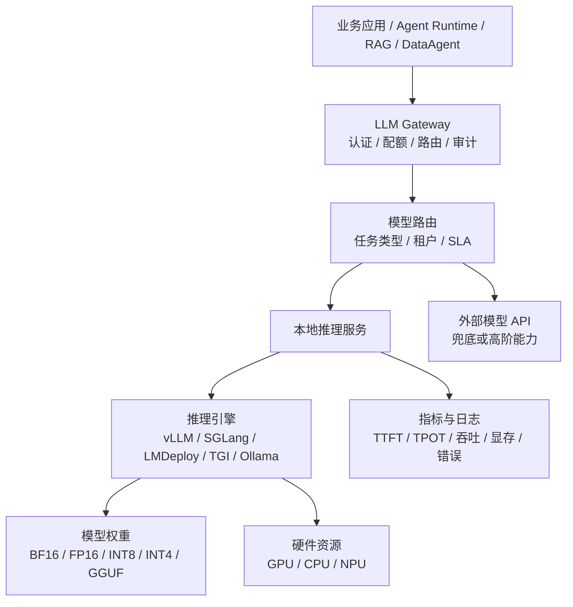
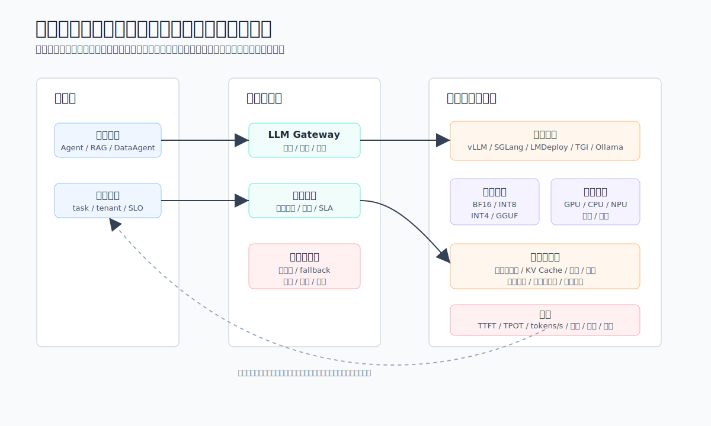
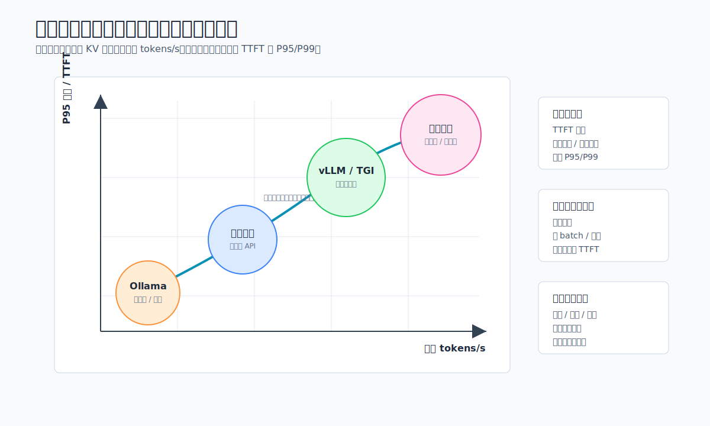
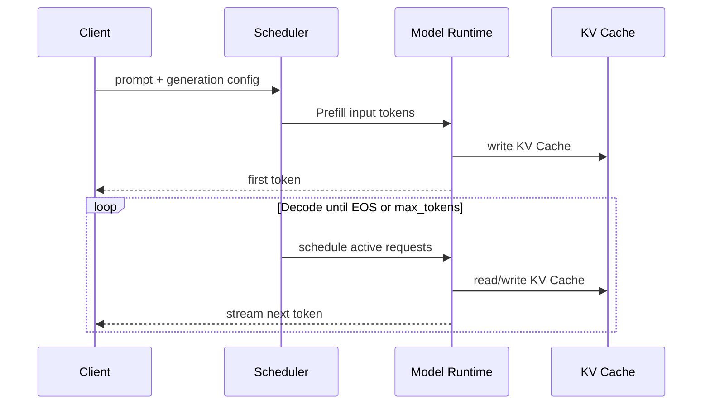

# 第6章 本地推理引擎的吞吐、延迟与部署边界

---

本地推理常被低估，因为它看起来像一次部署，实际很快会变成容量、延迟和治理问题。一个模型在单机演示中响应很快，不代表它能同时承接客服摘要、DataAgent 问数和代码助手的高峰请求。推理服务一旦进入平台，就要同时回答吞吐、首 Token 延迟、显存、结构化输出、租户隔离和版本发布这些问题。企业第一次自建推理服务，往往从一个很简单的需求开始：敏感数据不能出域，或者外部 API 成本太高，于是团队把一个开源模型部署到内网 GPU 上，给几个业务试点使用。前几天一切正常，用户量上来后问题开始出现。客服摘要的批量任务把 GPU 占满，DataAgent 的长上下文请求让首 Token 延迟飙升，研发助手的代码生成拖慢普通问答，某个部门临时把最大输出 Token 调大，其他租户的请求开始排队。模型没有坏，平台却已经失去容量控制。

本地推理服务介于模型权重、GPU 资源和平台治理之间。它还涉及把模型跑起来，还要把请求排队、连续批处理、KV Cache、Prefix Caching、量化、结构化输出、流式返回、指标监控和版本发布组织成服务。企业自建推理服务的核心矛盾，是在有限 GPU 上同时满足并发吞吐和单请求延迟，而这两者往往相互拉扯。后台摘要追求吞吐，前台助手追求首 Token，DataAgent 追求结构化输出和长上下文，代码助手追求 Decode 速度。混在同一个服务池里，任何一个场景的优化都可能伤到另一个场景。

推理引擎选型也不能只看 benchmark。vLLM、SGLang、LMDeploy、TGI、Ollama 解决的问题不同，适合的组织阶段也不同。个人验证阶段，启动速度和模型管理体验更重要；生产服务阶段，连续批处理、显存管理、OpenAI 兼容接口、结构化输出、监控和多副本治理更重要；平台级服务阶段，还要考虑 LLM Gateway、租户配额、审计日志、灰度发布、回滚和故障兜底。引擎能力如果不能纳入这些平台流程，速度再快也只能支撑局部试点。本章讨论本地推理、部署形态、吞吐与延迟、连续批处理、KV Cache、Prefix Caching 和推理引擎选型。读者需要先判断工作负载的瓶颈在吞吐、首 Token 延迟、Decode 速度还是显存，再决定使用哪类引擎和优化机制。本地模型服务的目标，是在统一网关、配额、审计和回滚流程下稳定承接企业 Agent 任务；单机速度只是上线判断中的一个维度。

自建推理还有一个容易晚出现的问题：服务上线后，模型团队、平台团队和业务团队看到的不是同一组指标。模型团队说某模型在离线评测里更好，平台团队看到 P99 TTFT 超标，业务团队抱怨流式输出中途断开，安全团队追问 prompt 和输出是否进入日志。若引擎只作为某台 GPU 上的进程存在，这些问题会落到临时排查；若引擎已经接入网关、监控、配额和发布系统，团队就能沿着请求、队列、Prefill、Decode、输出和日志逐步定位。因此，本地推理的早期设计最好把“可运营”放在“极致性能”之前。一个稍慢但有稳定指标、灰度发布和回滚路径的服务，比一个压测数据漂亮却无人能解释排队和显存波动的服务更适合生产。后续第7章会讨论优化技术，本章先建立部署边界：业务应用不直接认识推理引擎，引擎不直接承担租户和合规责任，所有请求都通过统一网关进入可观测、可限制、可替换的服务池。

---

## 6.1 本地推理服务的部署入口

企业讨论“本地推理”时，决策点是推理能力是否进入自己的平台边界：模型权重、推理服务、调用协议、配额、日志、成本核算、灰度发布和故障兜底是否都能被企业控制。模型放在云上还是机房，只是部署位置问题。一家多业务线企业如果把客服知识库、生产质检 SOP、财务指标口径和内部代码库都交给外部模型接口处理，就会在数据出域、审计、延迟和成本预测上遇到阻力；如果只是把一个开源模型下载到 GPU 服务器上，用临时脚本启动，也无法支撑多业务、多租户和 Agent 长任务。本地推理引擎位于模型权重和业务应用之间。它把模型文件、GPU/CPU/NPU 资源、请求调度、Token 流式生成、缓存、量化、并行和服务 API 封装成一个可运营的服务。对企业 Agent 平台来说，它通常不直接暴露给最终业务系统，而是被 LLM Gateway、Agent Runtime、RAG 服务和 DataAgent 通过统一协议调用。




*图6-1：本地推理服务在企业平台中的位置。来源：本书自绘。Alt text：分层图中部是本地推理服务，向上对接模型网关与各业务 Agent，向下占用 GPU 资源池，左右接入模型仓库与监控，标出它作为"模型能力供给层"的位置。*

图 6-1 强调职责分界：业务请求止步于 LLM Gateway 和模型路由，本地推理引擎只作为受治理的服务池。这样后续替换 vLLM、SGLang、LMDeploy、TGI 或 Ollama 时，上层业务契约不需要变化。

这条链路里，应用侧应该只关心“我要哪个能力、最大延迟是多少、能接受什么质量”，而不应该知道某个模型是跑在 vLLM、SGLang、LMDeploy、TGI 还是 Ollama 上。平台侧则要把本地推理服务变成一组可治理的资源池：哪些模型能服务哪些租户，哪些请求可以排队，哪些请求必须降级，哪些模型允许返回结构化输出，哪些请求需要进入审计日志。

服务边界清楚后，后续替换引擎才不会影响业务系统。比如一开始用 Ollama 快速验证内部助手，第二阶段切到 vLLM 承接更多并发，第三阶段为结构化 Agent 任务引入 SGLang；只要网关契约、模型名、生成参数和响应格式保持稳定，业务侧就不必为每次引擎变化重写集成代码。反过来，如果业务系统直接绑定某个引擎的私有参数，迁移时会把 prompt、超时、错误码、流式协议和审计逻辑一起拖进改造。

## 6.2 吞吐与延迟对部署形态的影响

本地推理服务可以按运行边界分成五种基本形态。它们对应不同负载和组织阶段，不是一条从低到高的成熟度曲线。

*表6-1：单机、容器化、集群等推理部署形态的边界、优势与适用场景。来源：本书整理。*

| 形态 | 典型工具 | 服务边界 | 优势 | 主要限制 | 适用场景 |
|---|---|---|---|---|---|
| 单机交互式运行 | Ollama | 本机进程或桌面应用 | 上手快、便于试模型、依赖少 | 缺少多租户治理和生产调度 | 个人验证、提示词实验、模型初筛 |
| 单机 HTTP 服务 | Ollama API、LMDeploy 单机服务 | 一台机器暴露 REST 或 OpenAI 兼容接口 | 便于接入应用，成本低 | 并发和高可用能力有限 | 小团队内部工具、边缘节点、离线场景 |
| GPU 多卡服务 | vLLM、SGLang、LMDeploy、TGI | 单节点多 GPU 或多副本服务 | 吞吐高，支持连续批处理和张量并行 | 需要显存规划、调度和监控 | 企业内部门户、客服、知识问答 |
| 分布式推理集群 | vLLM、SGLang、TGI | 多节点 GPU 集群 | 支持大模型、多租户和高并发 | 运维复杂，网络与调度影响明显 | 平台级模型服务、核心业务 Agent |
| 边缘或轻量本地推理 | Ollama | 门店终端、开发机、私有小节点 | 数据不出现场，网络依赖低 | 模型规模、上下文长度和并发能力受限 | 门店助手、低带宽场景、离线原型 |

第一种形态适合“把模型跑起来”，不适合“把模型管起来”。Ollama 降低了模型下载、量化权重运行和本地聊天的门槛，适合工程师快速比较 Qwen、Llama、Mistral、Gemma 等模型在企业语料上的表现。此时平台团队关注的是模型质量、提示词格式、上下文长度和基本速度，而非高并发。第二种形态开始形成服务边界。许多工具都能暴露 OpenAI 兼容接口，应用代码可以把 `base_url` 指向企业内网地址，从而复用现有 SDK、Agent 框架和评测脚本。这一步的价值很大：模型服务从“某台机器上的命令行”变成了“可被网关代理的 API”。但它仍然不能替代平台，因为鉴权、限流、审计、灰度、熔断、预算和数据脱敏通常还不在引擎内部完成。

第三种形态是企业最常见的生产起点。一个 7B、14B 或 32B 级别模型可以部署在单节点多卡服务器上，通过连续批处理提高吞吐，通过张量并行放下更大的模型，通过流式输出降低用户感知延迟。一家多业务线企业的内部知识助手如果日常并发在几十到几百之间，通常先从这一形态开始：一个模型服务池承接普通问答，另一个模型服务池承接代码或数据分析任务，中间由 LLM Gateway 做路由。

第四种形态解决平台规模问题。模型更大、上下文更长、租户更多之后，单机多卡会遇到显存、队列和故障隔离上限。此时要把模型副本、GPU 池、请求队列、滚动升级和跨节点通信纳入 Kubernetes、Ray、Triton 或厂商云原生调度体系。难点不止是“更多 GPU”，还包括尾延迟控制：一次长上下文请求可能占用大量 KV Cache，使其它短请求排队。平台必须把请求长度、最大输出 Token、租户优先级和模型副本健康状态纳入路由。

第五种形态服务的是数据边界。制造、门店、金融风控和医疗场景经常要求数据在现场或专用网络内处理。边缘推理通常使用更小模型、更低 bit 量化和更短上下文，牺牲一部分通用能力换取低网络依赖和更强隐私控制。它不适合替代总部模型平台，但适合承接固定流程：设备故障解释、门店 SOP 问答、离线工单摘要、现场质检描述等。本地推理服务上线前，至少要定义五组接口条件。

*表6-2：模型、资源等各类服务边界必须回答的问题与平台要求。来源：本书整理。*

| 边界 | 必须回答的问题 | 平台侧要求 |
|---|---|---|
| 模型边界 | 哪些模型、版本和量化格式允许上线 | 模型卡、License、评测结果和发布记录可追溯 |
| 请求边界 | 最大上下文、最大输出、是否允许工具调用 | 网关强制校验，避免业务绕过引擎限制 |
| 租户边界 | 谁可以调用哪个模型，额度是多少 | 认证、授权、限流、预算和审计分离 |
| 性能边界 | TTFT、TPOT、吞吐、并发和超时阈值 | 指标进入 SLO，异常可定位到模型或引擎 |
| 数据边界 | 输入输出是否包含敏感信息 | 脱敏、日志采样、留存周期和出域策略明确 |

其中 TTFT（Time To First Token）和 TPOT（Time Per Output Token）是推理服务最重要的两个延迟指标。TTFT 主要受排队、Prefill、上下文长度和调度影响；TPOT 主要受 Decode 阶段、并发批大小、显存带宽和采样策略影响。企业不要只看“每秒多少 Token”，还要看 P95/P99 TTFT 是否稳定。对客服和办公助手来说，用户往往能接受总生成时间稍长，但不能接受首 Token 长时间无响应；对离线摘要和批量标注来说，吞吐和成本比交互延迟更重要。



*图6-2：吞吐与延迟的取舍曲线。来源：本书自绘。Alt text：横轴为并发吞吐、纵轴为单请求延迟的曲线，随批量增大吞吐上升但延迟也升高，曲线上标出"延迟敏感区"和"吞吐优先区"两段不同的工作点选择。*

图 6-2 表达部署形态的相对位置，不是某个引擎的精确 benchmark。右侧三类策略分别对应交互负载的 TTFT、后台任务的吞吐，以及平台层的限流、熔断、请求长度治理和成本核算。

## 6.3 调度、缓存与约束：引擎能力的共同底座

大模型推理的核心成本来自两个阶段：Prefill 和 Decode。Prefill 阶段把输入上下文一次性送入模型，计算所有输入 Token 的注意力并写入 KV Cache；Decode 阶段每次生成一个或一小批新 Token，并在每一步读取历史 KV Cache。输入越长，Prefill 越重；输出越长，Decode 越重；并发越高，KV Cache 对显存的压力越大。


推理优化要在不明显牺牲回答质量的前提下，减少显存占用、提高 GPU 利用率、降低排队时间或减少每个 Token 的计算量。常见机制如下。

*表6-3：连续批处理、缓存等优化机制的目标、思路与风险。来源：本书整理。*

| 优化机制 | 解决的问题 | 基本思路 | 主要风险 |
|---|---|---|---|
| 连续批处理 | 固定 batch 等齐导致 GPU 空转 | 每个 Decode step 动态加入新请求、移除完成请求 | 高并发下尾延迟和公平性需要调度策略 |
| KV Cache 管理 | 长上下文和并发请求占满显存 | 复用、分页、压缩或卸载历史 Key/Value | 实现复杂，可能引入碎片或精度损失 |
| PagedAttention | KV Cache 预分配和碎片浪费 | 像虚拟内存一样按 block 管理 KV Cache | 依赖引擎内核实现，跨后端能力不同 |
| Prefix Caching | 多请求共享相同系统提示词或长前缀 | 复用已计算的前缀 KV Cache | 前缀命中率低时收益有限 |
| 张量并行 | 单卡放不下模型或吞吐不足 | 将矩阵计算切到多 GPU 并行 | 通信开销增加，跨节点更敏感 |
| 量化 | 权重和 KV Cache 占用过高 | FP16/BF16 降到 FP8、INT8、INT4 等 | 可能影响质量，校准和模型适配成本高 |
| FlashAttention / 高效注意力内核 | 注意力计算访存开销大 | 优化 GPU kernel 和显存访问模式 | 受硬件、驱动、模型结构影响 |
| 推测解码 | Decode 一步一 Token 太慢 | 小模型先草拟多个 Token，大模型验证 | 草拟命中率低时收益下降 |
| 结构化输出约束 | JSON/函数调用容易格式错误 | 用有限状态机、正则或 grammar 限制解码 | 约束过强会影响自然语言质量 |

连续批处理是生产推理服务的基础优化。传统批处理会等一组请求凑齐再一起执行，某个请求生成完成后，其余请求仍要继续等待同一批结束；连续批处理则在每个 Decode step 重新调度活跃请求，完成的请求立即释放位置，新请求可以插入进来。这样可以提高 GPU 利用率，尤其适合请求长度差异很大的在线服务。代价是调度器变成核心组件：如果只追求吞吐，长请求可能挤占短请求；如果只追求短请求延迟，吞吐会下降。

KV Cache 是大模型推理绕不开的内存问题。Transformer 自回归生成时，每一步都需要访问历史 Token 的 Key 和 Value。缓存这些中间结果可以避免重复计算，但会随着上下文长度、层数、头数和并发请求线性增长。以企业知识问答为例，一段包含政策、表格和引用的长上下文可能让单个请求占用大量显存；如果同时来几十个长请求，模型权重本身还没满，KV Cache 已经成为瓶颈。

PagedAttention 和分页式 KV 管理的价值就在这里。vLLM 论文提出将 KV Cache 按 block 管理，减少内存碎片，并允许请求之间共享缓存块。这个思想影响了后续大量推理引擎。对平台工程师来说，不必把它理解成单个产品功能，而应理解成一类设计：不要按最大上下文为每个请求一次性预留连续显存，而要把可变长序列映射到更灵活的内存块。这样可以提高并发容量，但也要求引擎、注意力 kernel 和调度器紧密配合。

Prefix Caching 适合企业 Agent 平台。许多 Agent 请求共享相同的系统提示词、工具说明、安全规则和企业背景资料。如果这些前缀每次都重新 Prefill，会浪费大量计算。前缀缓存可以把相同前缀的 KV Cache 复用起来，让后续请求只计算新增部分。它的收益取决于 prompt 规范化：同一段系统提示词里如果混入时间戳、随机 trace id 或不稳定字段，缓存命中率会明显下降。平台应把动态字段放在后缀，把稳定规则放在前缀。

量化解决的是显存和带宽。权重量化把模型参数从 BF16/FP16 压到 INT8、INT4、FP8 等格式，能让更大的模型放进有限显存，也能减少内存带宽压力。KV Cache 量化则进一步降低长上下文并发时的显存占用。风险是模型质量可能下降，尤其在数学、代码、长上下文检索和结构化输出场景中更明显。企业上线量化模型前，需要用自己的评测集验证，覆盖客服工单、财务口径、SQL 生成、工具调用和安全拒答，而非只看通用榜单。

张量并行和流水并行用于大模型多卡部署。张量并行把同一层的大矩阵计算切分到多张 GPU 上，适合单层参数太大或吞吐要求高的场景；流水并行把不同层放到不同 GPU 上，适合模型深度较大但会引入 pipeline bubble。在线 LLM 服务更常用张量并行，因为它对单请求延迟更友好。并行不是免费午餐：GPU 间通信、NCCL 配置、拓扑、PCIe/NVLink 差异都会影响实际吞吐。

推测解码用一个更小或更快的 draft model 先生成候选 Token，再由目标模型一次性验证多个 Token。如果候选命中率高，Decode 阶段会加速；如果命中率低，额外 draft 计算反而浪费。它更适合分布稳定、输出风格明确的场景，例如代码补全、格式化摘要、固定模板客服回复；对复杂推理和高随机采样的对话，收益不一定稳定。结构化输出约束对 Agent 很关键。企业平台大量调用要返回 JSON、函数参数、SQL 片段或工作流下一步动作，不能按自由聊天处理。仅靠提示词要求“请输出合法 JSON”并不可靠。推理引擎如果支持 grammar、regex、JSON schema 或 guided decoding，就能在解码阶段限制非法 Token，减少解析失败和重试成本。这里的取舍是：约束越强，格式越稳；但如果 schema 设计不合理，模型可能生成空洞字段或被迫输出语义不自然的内容。优化不能孤立启用。一个常见错误是同时打开最大上下文、最高并发、最激进量化、Prefix Caching 和推测解码，然后只用单条 prompt 测速度。正确做法是按工作负载分层测试：

*表6-4：不同工作负载的主要瓶颈与应优先采取的优化。来源：本书整理。*

| 工作负载 | 主要瓶颈 | 优先优化 | 不宜优先追求 |
|---|---|---|---|
| 在线客服问答 | 首 Token、短请求并发 | 连续批处理、流式输出、Prefix Caching | 超长上下文和复杂推测解码 |
| RAG 长上下文 | Prefill、KV Cache | 分块检索、Prefix Caching、Paged KV、上下文压缩 | 盲目提高 max_model_len |
| 批量摘要 | 吞吐、成本 | 大 batch、量化、离线队列 | 过低 TTFT |
| 代码补全 | TPOT、格式稳定性 | 推测解码、低温采样、专用模型 | 大而泛的通用模型 |
| DataAgent / NL2SQL | 结构化输出、正确性 | guided decoding、评测集、工具校验 | 只看 Tokens/s |

## 6.4 引擎选型：vLLM、SGLang、LMDeploy、TGI、Ollama

主流推理引擎的差异，不能用“谁更快”概括。企业选型应先确定四个问题：模型来源是什么，硬件资源是什么，服务接口要多标准，负载是在线还是离线，平台团队是否具备底层调优能力。

*表6-5：vLLM、SGLang、LMDeploy、TGI、Ollama 的定位、优势与适用场景。来源：本书整理。*

| 引擎 | 核心定位 | 典型优势 | 主要限制 | 更适合的企业场景 |
|---|---|---|---|---|
| vLLM | 通用高吞吐 LLM Serving | PagedAttention、连续批处理、OpenAI 兼容接口、生态活跃 | 极致性能仍需按模型和硬件调参 | 企业内部通用模型服务、RAG、Agent 平台默认候选 |
| SGLang | 面向结构化生成和复杂 LLM 程序的运行时 | RadixAttention、结构化输出、并发调度、OpenAI 风格接口 | 生态仍在快速演进，企业需验证稳定性 | Agent、多轮工具调用、JSON/函数调用密集场景 |
| LMDeploy | 面向大模型部署的推理工具链 | TurboMind、量化、OpenAI 兼容服务，中文模型生态友好 | 企业采用度需结合模型栈评估 | Qwen 等中文/开源模型的快速部署和评测 |
| Hugging Face TGI | Hugging Face 生态下的生产推理服务 | 部署体验成熟，支持连续批处理、张量并行、流式输出 | 对非 HF 生态和深度自定义 kernel 的弹性有限 | 已使用 Hugging Face 模型仓库和工具链的团队 |
| Ollama | 本地模型管理和开发者体验 | 模型拉取、运行和 API 简单，部分 OpenAI 兼容 | 更偏开发和轻量服务，不是完整企业推理平台 | 快速试模型、原型验证、个人办公助手 |

vLLM 常被作为企业本地推理的默认起点。它围绕 PagedAttention、连续批处理、前缀缓存、分布式推理和 OpenAI 兼容 API 构建，适合把开源模型快速服务化。对一家多业务线企业这类要同时服务知识问答、客服、办公助手和 DataAgent 的平台，vLLM 的优势是“够通用”：模型支持广，API 易接入，社区资料多。选用 vLLM 时，平台团队要重点压测三类指标：长上下文下的 KV Cache 压力，高并发短请求下的 TTFT，结构化输出和工具调用的稳定性。TGI 适合已经围绕 Hugging Face 建模、下载、评测和部署的团队。它提供生产化文本生成服务能力，支持连续批处理、张量并行和流式输出。它的优势不在单点性能绝对领先，而在 Hugging Face 生态的一致性：模型仓库、Tokenizer、配置和部署文档相互衔接。企业如果模型治理和微调流程已经落在 Hugging Face 体系内，TGI 可以减少集成成本。

SGLang 的特点是把推理服务和结构化生成程序结合得更紧。它关注的不止是“给 prompt 返回文本”，还包括多轮分支、约束解码、工具调用和复杂生成流程。SGLang 的 RadixAttention 面向前缀和 KV Cache 复用，适合大量共享上下文或程序化生成的场景。Agent 平台如果经常让模型在固定系统提示词、工具 schema 和中间状态之间来回生成，SGLang 值得单独压测。LMDeploy 在中文开源模型和量化部署场景中经常出现。它的 TurboMind 后端、量化支持和 OpenAI 兼容服务，适合希望快速把 Qwen 等模型跑成 API 的团队。是否作为平台主引擎，取决于企业模型族、硬件、稳定性验证和团队熟悉度。Ollama 代表轻量本地路线。它把模型拉取、运行和本地 API 管理做得简单，适合开发者试模型、业务原型和低并发内部助手。它可以进入企业平台，但定位应清楚：它服务离线、边缘、低并发或快速验证场景，不能替代数据中心 GPU Serving。企业可以按下面的规则做第一轮筛选。

*表6-6：按决策条件选择推理引擎的首选方向与原因。来源：本书整理。*

| 决策条件 | 首选方向 | 原因 |
|---|---|---|
| 要最快把开源模型变成生产 HTTP 服务 | vLLM 或 TGI | API 成熟，生态资料多，适合作为平台默认服务层 |
| 模型和工具链深度依赖 Hugging Face | TGI | 仓库、Tokenizer、部署流程一致 |
| Agent 结构化输出和复杂生成程序很多 | SGLang 或 vLLM guided decoding | 更关注约束解码、前缀复用和程序化生成 |
| 边缘、消费级 GPU 或离线节点 | Ollama | 部署轻，模型管理简单 |
| 中文开源模型快速部署和量化评测 | LMDeploy / vLLM | 结合模型族和团队经验评估 |

mini-platform 在 v0.1 不应把某个引擎写死为唯一实现，而应在 `core/gateway/` 抽象出统一调用契约。一个合理的接口最少包含：模型名、输入消息、生成参数、租户信息、trace id、超时、流式开关和结构化输出 schema。底层可以先接 vLLM 或 TGI，后续再挂 SGLang、LMDeploy、Ollama 等服务。
```json
{
  "model": "qwen3-32b-instruct",
  "messages": [
    {"role": "system", "content": "你是一家多业务线企业内部助手。"},
    {"role": "user", "content": "总结本周客服投诉的三个主要原因。"}
  ],
  "tenant": "retail-customer-service",
  "stream": true,
  "timeout_ms": 30000,
  "generation": {
    "temperature": 0.2,
    "max_tokens": 1024
  },
  "response_format": {
    "type": "json_schema",
    "schema_name": "complaint_summary"
  }
}
```

这个契约的目的，是把业务调用和推理引擎解耦。一家多业务线企业可以先用 vLLM 服务知识助手，用 SGLang 服务结构化 Agent 流程，用 LMDeploy 服务中文开源模型快速评测，用 Ollama 服务门店离线节点；上层应用仍然只调用同一个网关。平台能力不取决于“选择了哪个最快的引擎”，而取决于是否能持续测量、路由、降级和替换。实际落地时，建议把每个引擎的接入都当作一次供应能力登记。登记内容包括支持的模型族、上下文长度、并发上限、结构化输出能力、流式协议、错误码、监控指标和回滚方式。这样网关路由时可以按能力和风险选择目标服务：客服摘要走吞吐优先池，DataAgent 走结构化输出更稳定的池，敏感租户走私有化池，临时高峰再使用外部模型兜底，而不是盲目按模型名转发。登记完成后，还要把能力暴露给发布流程。新模型服务上线时，发布单里应包含压测报告、失败样例、兼容的请求格式和已知限制；下线旧引擎时，也要说明哪些租户、哪些任务和哪些评测集已经迁移。这样推理层不会变成一组长期无人敢动的服务端口。

## 6.5 推理引擎接入统一网关的条件

推理引擎进入平台统一网关前，至少要通过下面这些检查。检查的目的，是确认协议、观测、配额和错误语义都已经落到同一条接入标准上。

- 模型 License、权重来源、量化方式和上线版本可追溯。
- OpenAI 兼容接口或内部统一接口通过网关代理，不允许业务直连裸引擎。
- 压测覆盖短请求、高并发、长上下文、批量任务和结构化输出。
- 指标至少包含 TTFT、TPOT、tokens/s、队列长度、显存占用、KV Cache 使用率、错误率。
- 网关限制最大输入、最大输出、超时、租户额度和并发。
- 引擎升级、模型切换和量化版本发布有灰度和回滚方案。
- 日志策略明确区分调试日志、审计日志和敏感内容留存。

## 6.6 上线证据与故障诊断链路

推理服务上线时，平台不能只保存一份压测截图。更可用的上线证据应覆盖四类材料：服务版本、负载边界、质量回归和故障预案。服务版本包括模型权重 digest、Tokenizer 版本、推理引擎版本、镜像版本、启动参数、量化格式和上下文上限。负载边界包括短请求、长上下文、批处理、结构化输出和流式输出的压测结果，并明确每类负载的 P95/P99 TTFT、TPOT、错误率和显存峰值。质量回归要使用企业自己的样本，覆盖摘要、RAG、DataAgent、结构化 JSON、拒答和敏感内容处理。故障预案则要说明队列堆积、KV Cache OOM、流式中断、模型输出格式漂移、节点重启和网关熔断时的恢复动作。

这些证据需要进入发布记录，而不是散落在聊天记录或压测脚本目录里。模型服务一旦被多个业务 Agent 共享，任何一次参数调整都会影响上层任务。把 `max_model_len` 调大，可能让长上下文问答变好，也可能让短请求排队；把温度默认值改低，可能让结构化输出更稳定，也可能让客服回复更僵硬；把量化版本切换到 INT4，可能降低成本，也可能让 NL2SQL 和代码生成退化。发布记录要能回答“本次变化影响了哪些租户、哪些任务、哪些评测样本和哪些回滚路径”。没有这些材料，故障发生后只能凭经验猜。

故障诊断应沿请求链路展开。用户看到首 Token 很慢时，平台先看网关排队，再看模型路由，再看引擎队列和 Prefill 时长；若问题集中在长上下文请求，就继续检查上下文长度、Prefix Cache 命中率和 KV Cache 占用。用户看到流式输出中断时，不能只看模型进程是否存活，还要检查代理超时、客户端断连、网关重试和引擎错误码。结构化输出解析失败时，也要区分模型自由生成、guided decoding 配置、schema 版本和下游工具校验。诊断链路写清后，平台团队才能判断是扩容、限流、降级、切换模型，还是回滚引擎版本。

本地推理服务还要准备降级策略。低风险摘要任务可以在本地服务拥堵时转入异步队列；普通知识问答可以切到更小模型或外部兜底模型；DataAgent、财务、合同和高风险工具调用不能简单降级为“随便给一个答案”，应停在可解释错误、人工复核或稍后重试。降级策略要写进网关路由和运行记录。一次降级如果没有进入 Trace，后续评测会误以为模型正常回答，只是答案质量波动。推理层的生产化能力，最终体现在这些不起眼的运行证据和故障路径上。

## 6.7 推理服务的发布准入与运行台账

本地推理服务从“能跑”进入“可发布”，中间隔着一套运行台账。台账的第一部分是资产来源：权重来自哪个仓库，License 是否允许企业使用，是否经过量化或合并，Tokenizer 与模型配置是否匹配，镜像和启动参数是否可复现。很多推理事故并不来自模型本身，而来自部署材料缺失。权重被替换、Tokenizer 版本不一致、量化参数没有记录、镜像标签复用，都会让团队在故障时无法回到上一个稳定状态。

台账的第二部分是能力边界。每个 backend 都应记录支持的上下文长度、最大并发、推荐 batch、流式协议、结构化输出能力、工具调用兼容性和已验证任务类型。这个边界不能只写成理论上限。一个模型宣称支持 128K 上下文，并不代表它在企业 RAG、DataAgent 和报告生成中都能稳定运行。发布记录应写出实测条件：硬件类型、GPU 数量、显存、并发、Prompt 长度、输出长度、P95/P99 延迟、错误率和失败样例。这样网关在路由时才能知道某个 backend 适合客服摘要，还是适合长上下文分析。

台账的第三部分是降级与回滚。推理服务出问题时，平台不能只提供“重启服务”这一种动作。队列拥塞可以限流或转异步，长上下文 OOM 可以缩短上下文或切到高显存池，结构化输出失败可以切换 guided decoding 配置或高精度 backend，流式中断可以调整代理超时或改成非流式返回。不同故障对应不同恢复路径。把这些路径写进发布台账，SRE 和平台团队才能在事故时快速判断，而不是临时翻配置。

台账还应与 Trace 和成本视图连接。一次请求经过哪个网关规则、哪个模型版本、哪个 backend、哪个量化格式、哪个缓存策略，都要能回查。否则上层 Agent 的质量波动会被误判成 Prompt 或业务问题。比如 DataAgent 的 SQL 正确率下降，可能来自模型版本切换，也可能来自量化、采样参数、schema 变更或网关路由调整。推理层如果没有记录，评测团队只能看到结果变差，却无法定位原因。

早期平台可以从轻量台账开始：每个模型服务保留一份资产清单、一份压测报告、一组任务评测样本、一份错误码说明和一条回滚路径。台账不必覆盖所有细节，但必须让平台回答四个问题：当前服务是什么版本，适合哪些任务，发生故障时先看哪里，出现质量退化时如何回到上一版。能回答这些问题，本地推理才算进入平台能力，而不是一组临时启动的进程。

## 6.8 推理服务的周期复审

推理服务上线后还要定期复审。复审内容包括模型和引擎版本是否仍被维护，License 与权重来源是否仍符合企业要求，评测集是否覆盖新增任务，成本和延迟是否偏离基线，回滚目标是否仍可启动。很多推理服务刚上线时材料完整，半年后因为补丁、量化、镜像替换和路由调整，已经无法复现最初状态。周期复审的目的，是让模型服务保持可解释、可替换和可退回，而不是等事故发生后再补台账。复审结论也应进入发布记录。

## 6.9 推理服务的异常回放与回滚边界

推理服务的异常回放要覆盖模型、引擎、网关和请求形态。一次线上投诉可能表现为首 token 很慢、流式响应中断、结构化输出缺字段、相同问题前后答案不同，排查时不能只看模型名称。平台应保存必要的回放材料：模型服务名、Revision、权重 digest、引擎版本、启动参数、上下文长度、输入 token、输出 token、采样参数、网关路由、租户配额和错误码。涉及敏感数据时，回放材料可以脱敏或只保存摘要，但必须能解释运行条件。

回放材料还要区分“可重跑”和“不可重跑”。普通问答可以在隔离环境重放；写操作、外部系统调用和审批类请求不能直接重放，只能重放模型输入、工具返回摘要和网关决策。若平台没有这个边界，事故复盘时很容易为了定位问题再次触发副作用。第23章工具契约、第30章 HITL 和第38章 Trace 都要参与这条链路：工具结果提供证据摘要，审批记录说明人工确认状态，Trace 串起请求、模型和工具阶段。

回滚边界也要提前写清。引擎版本回滚通常比模型回滚更快，但它可能改变 batching、缓存和结构化输出行为；模型回滚可以恢复质量，但可能和当前 Prompt、schema 或向量索引不兼容；网关策略回滚可以立即恢复路由，却无法修复引擎内部 OOM。上线材料要说明每类回滚的触发条件、预计耗时、影响范围和验证样本。这样推理引擎才能成为可诊断、可回放、可恢复的平台部件。

## 6.10 推理服务与业务高峰的联动演练

推理服务需要和业务高峰一起演练。月末关账、促销活动、客服高峰、集中报告生成、批量评测都会改变请求形态。平时稳定的模型服务，到了高峰期可能因为长上下文、流式连接、工具等待和批处理排队出现尾延迟。平台不能只等监控告警触发，而要在业务高峰前准备样本、容量、降级策略和回滚路径。

演练材料应包含真实任务组合。客服场景要看首 token、连续对话和知识引用；DataAgent 要看 NL2SQL、查询等待和报告生成；批量评测要看队列和成本；报告场景要看长输出、EvidenceRef 和导出动作。每类任务都要设定可接受延迟、失败提示和降级模型。若高峰期间需要临时扩容，扩容结束后的回收和成本归因也要进入演练结论。

这类演练能把模型服务从单点能力拉回业务节奏。业务 owner 知道哪些任务会被保护，SRE 知道哪些池需要预热，平台团队知道网关如何限流，FinOps 知道临时成本来自哪次活动。第6章的推理服务因此连接到第43章 GPU 调度、第45章网关和第41章成本治理，形成上线前后都能复盘的运行证据。

## 6.11 推理服务容量变更的验收

推理服务上线后，容量变更比首次部署更常见。新增模型副本、切换量化版本、调整 KV cache、开启 speculative decoding、修改批处理参数，都会改变延迟、吞吐、成本和输出稳定性。容量变更不能只看压测结果，还要回放真实业务样本，确认结构化输出、工具参数、长上下文回答和安全拒答没有退化。很多故障发生在“性能优化成功，业务输出变差”的位置。

容量变更应留下发布记录。记录包括模型版本、引擎版本、GPU 类型、显存配置、batch 参数、并发限制、路由权重、灰度范围、回滚目标和观察窗口。若变更后 p95 延迟下降，但格式错误率上升，平台需要知道这次变化来自推理引擎还是模型路由；若某个租户成本突然上升，也要能回到路由和 batch 参数。推理服务是平台共享底座，缺少这些记录会让多个应用同时受到影响。

早期可以先建立几类固定回放样本：短问答、长上下文、结构化 JSON、工具参数生成、拒答和高并发报告任务。每次容量变更都跑这些样本，再观察真实流量中的超时、重试、截断和人工退回。这样推理服务优化会围绕业务稳定性展开，单次 benchmark 数字只作为其中一类证据。

## 6.12 推理服务的变更影响面评估

推理服务的变更往往影响多个上层系统。一次引擎升级可能改变流式事件节奏，前端会感到输出抖动；一次量化切换可能让结构化 JSON 错误增加，Tool Registry 和 DataAgent 会受到影响；一次上下文长度调整可能让 RAG 质量改善，却让短请求排队变长；一次网关路由调整可能改变数据出域路径。变更前要列出影响面，至少覆盖前端、Runtime、Tool Registry、DataAgent、Trace、Eval、安全和成本视图。

影响面评估要从任务样本出发。平台可以为每类推理服务维护固定样本：客服摘要、知识问答、长文档 RAG、NL2SQL、结构化输出、拒答样本、流式报告和高并发批任务。每次变更都跑这些样本，记录质量、延迟、错误码、降级动作和人工复核结果。若某个变更只影响低风险摘要，可以小范围灰度；若影响结构化输出或高风险拒答，就要提高发布门槛，并保留旧服务池。

早期影响面评估可以写进发布单。发布单不需要很长，但要说明变更对象、受影响任务、回放样本、灰度范围、回滚目标和观察指标。这样推理服务不会因为底层优化而让上层 Agent 悄悄退化。推理层越共享，变更评估越重要。

## 6.13 推理服务的运行证据归档

推理服务进入平台后，日常运行证据要能被长期归档。一次请求经过业务入口、LLM Gateway、模型服务池、调度队列和流式输出，任何一层只留下局部日志，事故复盘都会变成猜测。运行证据应覆盖请求进入时的租户、任务类型、模型路由、引擎版本、资源池、输入长度、输出长度、错误码、重试动作、降级动作和最终用户可见结果。这样第38章的 Trace 才能把模型服务行为和上层 Agent 行为接起来。

归档不是把所有 token 和上下文永久保存。企业环境中，提示词、用户输入、检索片段和模型输出可能包含敏感信息，平台要区分可长期保存的结构化元数据、需要脱敏保存的文本摘要、只在短窗口内保留的原始内容。对推理服务而言，最有价值的是能够解释运行事实的字段：请求为什么进入这个池，为什么排队，是否触发降级，是否被限流，是否命中过缓存，是否因超时重试。缺少这些字段时，后续排查很容易把模型质量、资源不足和网关策略混在一起。

早期可以先建立模型服务运行台账，把每次发布和每天运行的汇总证据放在一起。发布侧记录模型、引擎、资源、参数和回滚目标；运行侧记录请求量、延迟分位数、错误类型、拒答变化、结构化输出错误和人工退回样本。若某次业务争议发生在报告生成或 DataAgent 查询中，团队可以沿着台账追到当时的推理服务状态，而不是只看最终回答文本。推理服务越接近共享基础设施，就越需要这种可审计的运行记忆。

运行证据还应进入容量规划。若台账显示高峰时段主要由长上下文报告占用显存，平台可以调整独立池或异步队列；若结构化输出错误集中在某个量化版本，路由可以把工具调用任务迁回更稳定的服务；若某个租户反复触发限流，FinOps 和业务 owner 可以重新确认配额。推理层的治理价值不在于记录更多日志，而在于让发布、排障、成本和容量决策使用同一组事实。

## 6.14 开源模型上线后的责任边界

开源模型进入企业平台后，责任边界会变得更具体。模型权重、推理框架、量化方式、服务镜像、许可证、微调数据和安全样本都可能由不同团队维护。若平台只把它当作“可自托管模型”，生产事故时很难判断责任归属：是权重选择错误、量化损伤、镜像构建问题、网关路由问题，还是业务样本没有覆盖。

上线前要把责任写进模型发布材料。模型团队负责权重来源、评测和能力边界；平台团队负责服务稳定性、资源、路由和回滚；安全合规团队负责许可证、数据来源和风险样本；业务 owner 负责确认任务是否适合使用该模型。每个角色都需要可验证材料，而不是口头认可。这样开源模型的灵活性不会变成责任真空。

开源模型还要处理补丁节奏。推理框架、CUDA、驱动、算子库和安全依赖都会更新，某个依赖升级可能改变吞吐、延迟或输出稳定性。平台应为开源模型建立版本锁定、回放样本和回滚镜像。若模型承担高风险任务，依赖升级要像模型升级一样进入发布门禁。

早期可以把开源模型分成三类：实验模型、内部低风险模型和生产模型。实验模型允许快速试错；内部低风险模型要求基础评测和成本记录；生产模型要求许可证、样本、镜像、路由、降级和退役材料齐备。这样的分级能保留开源模型的迭代速度，也能避免生产系统被非受控实验影响。

## 6.15 推理服务的上线证据

推理服务进入生产后，新增能力不能只看功能是否可用，还要看运行证据能否被不同角色复用。平台需要把模型版本、吞吐、延迟、错误码、降级路由、灰度范围和回滚条件记录成稳定字段，并和发布单、Trace、评测样本以及事故记录关联起来。这样一次线上问题发生后，团队可以沿着同一组事实判断影响范围、责任归属和修复顺序，而不是在模型日志、业务日志和人工说明之间来回拼接。

这类证据还要服务相邻章节的能力。它和第44章模型服务、第45章网关和第41章成本治理相连：上游能力提供输入假设，下游能力使用执行结果，治理能力负责保存证据和复审结论。若这些材料没有统一编号和版本，章节里讨论的工程能力在生产中会被拆散。业务 owner 只能看到用户投诉，平台 owner 只能看到系统错误，安全或合规团队只能看到事后说明，最后很难判断问题到底来自数据、模型、工具、流程还是组织责任。

生产环境中常见的风险包括压测只覆盖平均延迟、错误码无法区分模型失败和网络失败、回滚后缓存仍指向旧结果。这些问题在演示阶段不明显，因为演示通常只覆盖成功路径；上线后，用户会带来边界问题、重复请求、权限变化和长时间运行状态。平台团队应把失败样本纳入发布节奏，记录哪些样本需要阻断发布，哪些样本可以通过降级处理，哪些样本需要业务 owner 接受剩余风险。

推理服务上线应留下可复查证据，使模型质量、成本和可用性可以共同判断。这份记录不需要复杂，但要包含时间、版本、owner、样本、处置动作和下次复查条件。没有这些字段，复盘会停留在口头经验；有了这些字段，平台才能把一次问题转成后续发布、评测和培训材料。

早期平台可以从少量高风险场景开始。先选择调用量高、业务影响大或涉及敏感数据的路径，要求每次变更都留下证据包，再逐步推广到普通场景。这样章节里的能力不会停留在概念层，而会成为可运行、可解释、可退回的工程系统。

## 本章小结

本地推理不是“下载模型并启动服务”。进入企业平台后，权重来源、推理引擎、调度策略、资源池、日志、审计和路由都要纳入同一条运行边界。业务应用通过 LLM Gateway 使用统一契约，平台再根据租户、任务类型、SLO 和成本把请求分配到合适的模型服务池。吞吐和延迟必须按工作负载评估。交互式助手关注 TTFT，长上下文 RAG 关注 Prefill 和 KV Cache，批处理任务关注 tokens/s 和成本，DataAgent 还要关注结构化输出与工具调用的稳定性。vLLM、SGLang、LMDeploy、TGI、Ollama 的价值点不同，选型要和第7章的优化评测联动，尤其要覆盖 KV Cache、Prefix Cache、量化和结构化输出能力。真正成熟的推理层，是业务高峰、模型升级和引擎替换发生时仍能解释请求去了哪里、为什么排队、何时降级、怎样回滚。

## 参考文献

Kwon, W. et al. (2023). [*Efficient Memory Management for Large Language Model Serving with PagedAttention*](https://arxiv.org/abs/2309.06180). SOSP.vLLM. (n.d.). [Documentation](https://docs.vllm.ai/).SGLang. (n.d.). [Documentation](https://docs.sglang.ai/).Hugging Face. (n.d.). [Text Generation Inference documentation](https://huggingface.co/docs/text-generation-inference/).NVIDIA. (n.d.). [TensorRT-LLM documentation](https://nvidia.github.io/TensorRT-LLM/).
