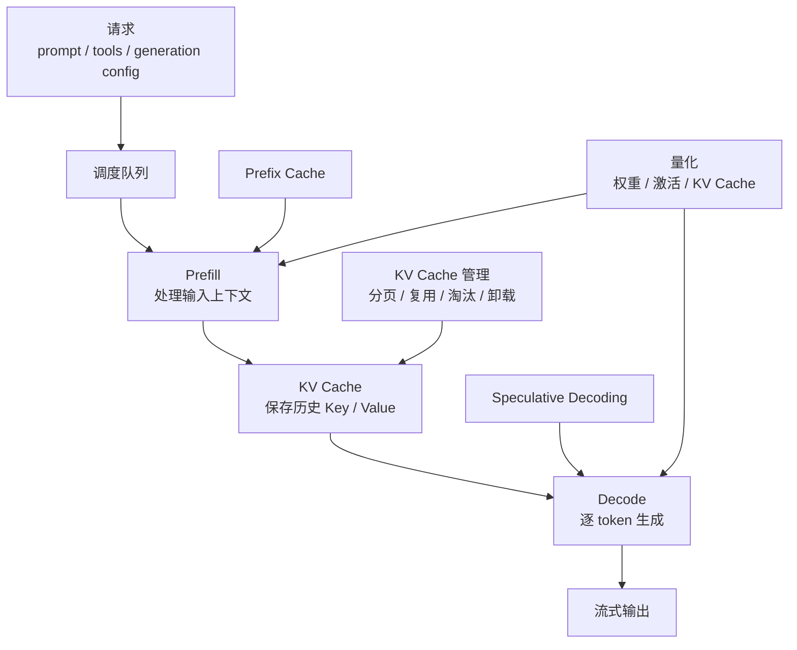
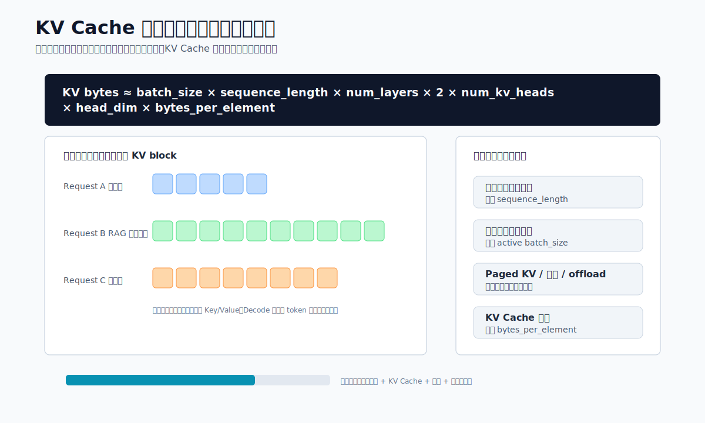
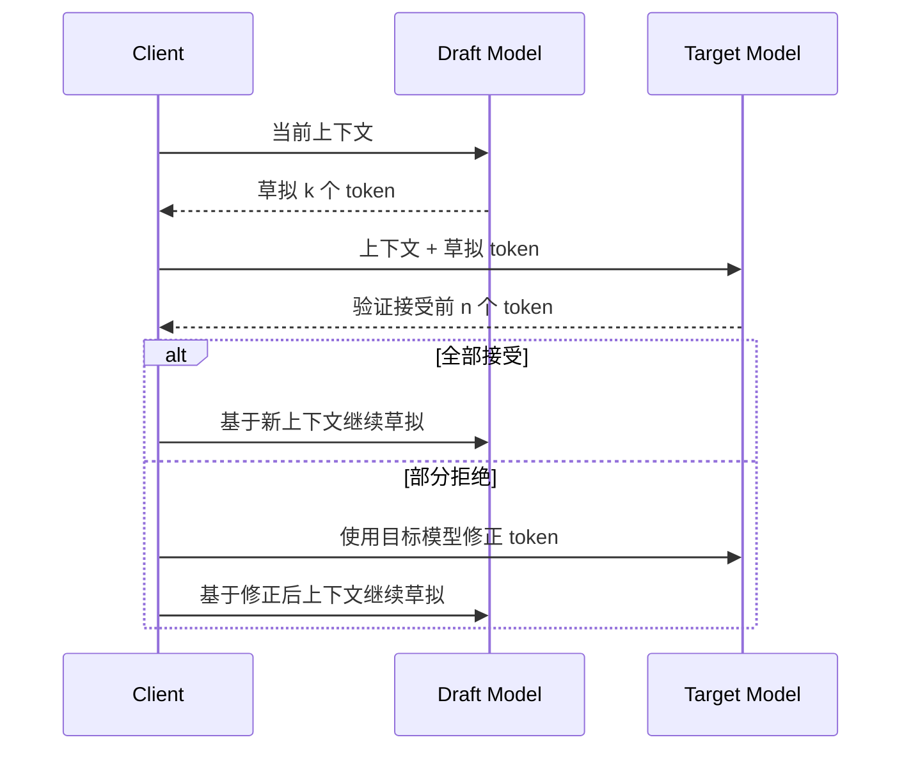

# 第7章 推理优化技术

---

客服摘要服务上线后，平台团队发现 GPU 利用率很高，首 Token 延迟却没有明显下降。有人建议打开量化和投机解码，也有人建议扩大 batch。排查后才发现，几类负载混在一起：客服摘要追求吞吐，DataAgent 追求结构化输出正确率，知识助手又被长上下文 Prefill 拖慢。推理优化不能按“能开就开”的思路做。KV Cache、Prefix Cache、量化、投机解码都可能降低成本或延迟，也可能带来质量回退、显存碎片、调度复杂度和排障成本。企业平台需要先定位瓶颈，再选择机制，并用同一批业务评测样本确认优化没有破坏结果质量。

优化事故往往来自机制用在了错误瓶颈上。一个服务 TTFT 高，可能是请求排队，也可能是长上下文 Prefill，也可能是 Prefix Cache 命中率低；Decode 慢，才更适合考虑投机解码或模型大小；显存紧张，才优先看 KV Cache 管理、上下文限制和量化。如果不先分清这些位置，团队会把所有开关都打开，最后得到一个更快但更难解释的系统。

企业场景还要把质量回归放在同等位置。量化可能让财务口径解释变得不稳定，KV Cache 量化可能影响长上下文推理，投机解码在固定模板摘要里收益明显，在复杂 DataAgent 推理里收益不一定稳定，Prefix Cache 如果把动态字段放进前缀，命中率会很低。推理优化要在吞吐、首 Token、显存、质量和排障成本之间做选择；若只压低延迟和成本，系统可能更快地给出更难解释的结果。

本章讨论推理优化、KV Cache、Prefix Cache、投机解码、量化和瓶颈定位。读者需要区分显存、首 Token 延迟、吞吐和 Decode 速度这几类瓶颈，并为每一项优化设计验证方法：它改善了哪个指标，影响了哪些业务样本，失败时如何回滚，是否改变结构化输出、拒答和工具调用质量。没有这套验证，优化就会从工程能力变成新的不确定性来源。

生产环境里的优化通常是逐步累积的。第一次上线可能只打开连续批处理，第二次为了长上下文加入分页 KV，第三次为了成本做权重量化，第四次为了模板摘要尝试投机解码。每一步单独看都有理由，但叠加后排障会变难：一次回答变慢，可能是排队策略变化；一次 JSON 解析失败，可能是量化影响了结构化输出；一次短请求被拖慢，可能是同池长上下文请求占满 KV Cache。优化要像发布模型一样管理版本，记录配置、指标、评测结果和回滚条件。

对企业平台来说，推理优化还会牵动组织责任。模型团队往往关注输出质量，SRE 关注延迟和可用性，FinOps 关注单位 Token 成本，业务团队关注任务是否完成。若没有统一评估口径，某个团队看到的“优化成功”可能是另一个团队看到的质量退化。比较稳的做法，是每次优化都明确受益负载、可能受损负载和观察窗口，在灰度阶段同时看性能、成本、结构化输出、拒答、安全拦截和人工反馈。

---

## 7.1 先定位瓶颈，再选择优化机制

第 6 章讨论“选哪个推理引擎、如何理解吞吐与延迟的取舍”。进入具体优化后，判断标准要更朴素：这个机制能否稳定降低成本、延迟或显存占用，同时不破坏模型质量和业务正确性。优化名词是否先进，并不构成上线理由。一家多业务线企业的内部知识助手、客服摘要、DataAgent 和代码助手面对的瓶颈并不相同。知识助手常见瓶颈是长上下文 Prefill 和 KV Cache 显存；客服摘要常见瓶颈是批量吞吐；DataAgent 常见瓶颈是结构化输出正确率和重试成本；代码助手常见瓶颈是 Decode 阶段每 Token 延迟。推理优化必须先识别瓶颈，再选择机制。盲目打开所有优化选项，往往会扩大故障面，服务也未必更稳定。


推理优化可以按作用位置分成四类：KV Cache 优化作用在显存与长上下文并发；Prefix Cache 作用在共享前缀的重复 Prefill；Speculative Decoding 作用在 Decode 阶段的逐 Token 生成；量化作用在模型权重、激活和 KV Cache 的存储与带宽。它们可以组合，但组合前必须有评测和回滚依据。


*图7-1：推理优化机制作用位置。来源：本书自绘。Alt text：一条从请求进入到 Token 输出的推理流水线，标出批处理作用于调度阶段、KV/Prefix Cache 作用于 Prefill、量化作用于权重加载、投机解码作用于 Decode，体现各机制处在流水线的不同环节。*

图 7-1 先按瓶颈位置组织优化机制：Prefill 重就看前缀复用和上下文治理，Decode 慢再看推测解码，显存紧张才优先看 KV 管理和量化。图中的指标监控和质量评测是所有组合优化的前提。

定位瓶颈时，日志粒度要能支撑拆解。一个请求的总延迟至少应拆成网关排队、调度等待、Prefill、首 Token、Decode、工具等待和流式传输几个部分。否则团队看到“请求慢”只能猜测原因。对 DataAgent 这类任务，还要把模型生成 SQL、执行 SQL、解释结果和生成图表分开记录；如果只记录最终耗时，推理优化可能会掩盖真正瓶颈，例如 OLAP 查询或权限校验。

## 7.2 KV Cache：显存和长上下文的主约束

KV Cache 是自回归 Transformer 推理的核心缓存。模型生成第 `t` 个 Token 时，需要访问前面所有 Token 的 Key 和 Value。如果每一步都重新计算完整上下文，生成会极慢；因此推理引擎会在 Prefill 阶段把输入 Token 的 Key/Value 写入缓存，在 Decode 阶段每生成一个新 Token，就追加一份新的 Key/Value。这样可以避免重复计算历史上下文，但显存占用会随上下文长度和并发请求快速增长。KV Cache 的规模可以用一个近似公式理解：
```text
KV Cache bytes
≈ batch_size
  × sequence_length
  × num_layers
  × 2
  × num_kv_heads
  × head_dim
  × bytes_per_element
```

这里的 `2` 代表 Key 和 Value 两份缓存。公式背后有三个直接含义：长上下文会同时增加 Prefill 计算和 Decode 阶段显存占用；并发请求越多，KV Cache 会按活跃序列数叠加；FP16/BF16 降到 FP8 或 INT8 时，`bytes_per_element` 变小，可承载的上下文和并发也会随之变化。



*图7-2：KV Cache 如何随上下文和并发增长。来源：本书自绘。Alt text：三维示意图中 KV Cache 显存占用随上下文长度和并发请求数同时上升，标出显存上限平面，超过即触发排队或拒绝，说明长上下文与高并发共同挤占显存。*

图 7-2 把公式落到容量规划：上下文长度、活跃请求数和 bytes_per_element 分别对应请求治理、调度限流和 KV Cache 量化。评估长上下文、并发和显存预算时，可以反复对照这三个变量。以平台工程视角看，KV Cache 有四种典型压力。

*表7-1：显存与上下文压力的来源、现象、根因与处理方式。来源：本书整理。*

| 压力来源 | 现象 | 根因 | 优先处理方式 |
|---|---|---|---|
| 长上下文 | 单请求显存高，TTFT 长 | Prefill 计算量大，KV Cache 序列长度长 | 限制上下文、检索压缩、分块、Prefix Cache |
| 高并发 | GPU 显存接近上限，请求排队 | 活跃请求各自持有 KV Cache | 连续批处理、分页 KV、调度限流 |
| 长输出 | Decode 阶段越来越慢或被迫淘汰 | 输出 Token 也会追加 KV Cache | 限制 max_tokens、分段生成、任务拆分 |
| 共享系统提示词 | 重复计算相同前缀 | 多请求包含相同工具说明、角色设定或文档 | Prefix Cache、prompt 规范化 |

优化显存占用时，应先减少无效上下文，再讨论压缩。企业 RAG 常犯的错误是把检索到的文档全部塞进 prompt，以为长上下文模型能自动消化。实际结果是 TTFT 变长、KV Cache 占用上升、并发下降，无关证据还会增加幻觉风险。更可靠的做法是先做检索质量、去重、片段压缩和引用选择，再把必要上下文送入模型。分页式 KV 管理解决的是显存碎片和混合长度请求的问题。以 vLLM 的 PagedAttention 为代表，推理引擎不再为每个请求按最大上下文预留连续显存，而是把 KV Cache 拆成固定大小的 block，像虚拟内存一样映射到物理显存。TensorRT-LLM 等高性能推理栈也提供 KV Cache 复用、卸载和淘汰相关能力。平台团队不需要手写这些机制，但要理解它们对并发容量的影响：同一张 GPU 能跑多少请求，很多时候取决于 KV Cache 管理，而不只取决于模型权重。

KV Cache 淘汰和卸载需要按请求价值分层。正在 Decode 的请求要保留；刚完成、可能被共享前缀命中的缓存可以短期保留；低命中概率或低优先级租户的缓存可以优先淘汰；极长上下文可以考虑 CPU offload，但要接受 PCIe 传输带来的延迟波动。企业平台要把缓存策略纳入 SLO，不能把它完全交给引擎内部默认值。KV Cache 量化把 BF16/FP16 降到 FP8 或更低 bit，可以提升长上下文并发能力，但要单独做质量回归。客服摘要这类容错较高的任务，FP8 KV Cache 可能是合理选择；财务口径解释、SQL 生成、合规拒答和代码生成，则要用业务评测集确认输出质量、格式稳定性和事实一致性没有明显回退。

KV Cache 还涉及多租户公平性。长上下文租户如果没有上限，会持续占用显存，让短请求在队列里等待；短请求如果优先级过高，又可能让长任务长期得不到执行。平台需要把上下文长度、最大输出、缓存保留时间和租户优先级写进网关策略。这样调度器面对显存压力时，知道应该拒绝超长输入、压缩上下文、转入批处理，还是让低优先级请求排队。KV Cache 优化的发布前检查项如下。

- 明确每个模型的最大上下文、默认上下文和租户级上限。
- 监控 KV Cache 使用率、命中率、淘汰次数、显存碎片和请求排队时间。
- 分别压测短请求、高并发、长上下文和长输出场景。
- 对 KV Cache 量化做业务评测，通用 benchmark 只能作为参考。
- 对超长请求设置降级路径，例如压缩上下文、改走批处理或提示用户缩小范围。

## 7.3 Prefix Cache：复用稳定前缀降低 TTFT

Prefix Cache 是 KV Cache 复用的一种典型形式。当两个请求拥有相同前缀时，第二个请求不必重新计算这段前缀的 Prefill，而是直接复用已经生成的 KV Cache。vLLM 文档将 Automatic Prefix Caching 描述为复用已有查询的 KV Cache，让共享前缀的新查询跳过共享部分计算。对企业 Agent 平台来说，这个机制非常重要，因为许多请求天然共享前缀。常见共享前缀包括：

*表7-2：Prefix Cache 在各类场景的共享前缀、加速收益与风险。来源：本书整理。*

| 场景 | 共享前缀内容 | 加速收益 | 风险 |
|---|---|---|---|
| 多轮对话 | 历史对话、系统提示词、企业角色设定 | 后续轮次减少重复 Prefill | 历史太长时缓存占用持续升高 |
| RAG 问答 | 同一长文档、同一制度文件、同一知识包 | 同文档多问题降低 TTFT | 检索片段顺序变化会降低命中 |
| Agent 工具调用 | 工具 schema、权限规则、安全策略 | 工具说明不必每次重算 | 动态字段混入前缀会破坏命中 |
| 批量抽取 | 同一任务说明、同一输出格式 | 大批量任务吞吐提升 | 输出 schema 变体过多会降低复用 |
| DataAgent | 同一语义层说明、指标口径、表结构 | 多个自然语言问题共享元数据上下文 | 表结构版本变化需要缓存失效 |

Prefix Cache 的收益主要体现在 TTFT，对每个输出 Token 的 Decode 速度影响较小。它减少的是重复 Prefill 计算：共享前缀越长，命中率越高，收益越明显。如果请求只共享很短的系统提示词，收益有限；如果请求共享几千到几万 Token 的长文档、工具 schema 或表结构说明，收益会很可观。要让 Prefix Cache 生效，prompt 组织方式比引擎开关更重要。平台应把稳定内容放在前缀，把动态内容放在后缀。例如：
```text
稳定前缀：
1. 系统角色
2. 安全规则
3. 工具 schema
4. 企业术语表
5. 长文档或表结构

动态后缀：
1. 用户本轮问题
2. trace_id
3. 当前时间
4. 临时过滤条件
5. 上一步工具结果
```

如果把 `trace_id`、当前时间、随机 nonce、用户姓名等动态字段放在开头，即使后面的大段工具说明完全相同，缓存也可能无法命中。对于一家多业务线企业的 DataAgent，语义层说明、指标口径、表结构和 SQL 安全规则应尽量稳定地放在前缀；用户问题、筛选条件和会话状态放在后缀。这样同一业务域的多次查询可以复用前缀 KV Cache。多轮对话场景还要注意“缓存收益”和“上下文膨胀”的冲突。多轮历史越长，可复用内容越多，但 KV Cache 占用也越大。如果每一轮都把完整历史追加进去，后续请求会越来越慢。生产系统通常需要结合会话摘要、历史裁剪和重要事实记忆，把对话历史压缩成稳定前缀，而非无限增长。Prefix Cache 实现时要关注四个指标。

*表7-3：Prefix Cache 相关监控指标的含义与异常解读。来源：本书整理。*

| 指标 | 含义 | 异常说明 |
|---|---|---|
| prefix_cache_hit_rate | 共享前缀命中比例 | 低命中通常是 prompt 不稳定或动态字段位置错误 |
| saved_prefill_tokens | 因缓存复用省掉的 Prefill Token | 低数值说明共享前缀太短，收益有限 |
| cache_eviction_count | 前缀缓存被淘汰次数 | 频繁淘汰说明显存压力或缓存策略不合理 |
| TTFT before/after | 首 Token 延迟变化 | 命中率高但 TTFT 无改善，可能瓶颈在排队或 Decode |

Prefix Cache 不能加速完全不同的 prompt，也不能修复检索质量差的问题。它还可能提高显存占用，因为引擎需要保留可复用的 KV Cache。平台要按业务域设置缓存策略：客服知识库、固定工具 schema 和 DataAgent 表结构适合保留；一次性长文档、低频租户和超大临时上下文应更积极淘汰。缓存策略还要避免泄漏和串租户。即使两段前缀文本相同，不同租户也未必允许共享缓存；同一业务域内，权限版本变化、工具 schema 变化或策略升级也应触发缓存失效。把 Prefix Cache 当成纯性能功能，会漏掉这些治理条件。更稳的方式是把缓存 key 设计成由模型版本、系统提示词 hash、工具版本、租户或安全域、策略版本共同组成，命中率会下降一些，但可解释性和隔离性更强。

## 7.4 Speculative Decoding：用草稿模型加速 Decode

Speculative Decoding 的核心思想是用一个更快的 draft model 先生成多个候选 Token，再由目标大模型一次性验证这些候选。如果候选 Token 符合目标模型的分布，就可以一次接受多个 Token；如果不符合，就回退到目标模型的采样结果。Leviathan、Kalman 和 Matias 在 ICML 2023 的论文中提出，该方法可以在不改变输出分布的情况下加速自回归生成。它解决的是 Decode 阶段瓶颈。大模型生成通常是一 Token 一步，每一步都要跑一次大模型前向计算。Prefill 可以并行处理输入序列，但 Decode 天然串行。Speculative Decoding 通过“小模型草拟，大模型批量验证”把多个 Decode step 合并到一次或少数几次大模型计算中，从而降低每个输出 Token 的平均成本。


Speculative Decoding 的“无损”指的是在正确实现的采样校正下，最终输出分布与直接使用目标模型采样一致。它没有用小模型替代大模型，也不应通过牺牲质量换速度。收益取决于 draft model 的接受率：小模型越能预测大模型接下来会生成什么，接受率越高，加速越明显；如果小模型和大模型行为差异大，草拟 Token 经常被拒绝，额外的小模型计算就会变成负担。适合 Speculative Decoding 的场景包括：

*表7-4：投机解码适合的场景及各自的注意事项。来源：本书整理。*

| 场景 | 为什么适合 | 注意事项 |
|---|---|---|
| 代码补全 | 局部模式强，候选 Token 可预测 | 需要同族或专门训练的 draft model |
| 固定格式摘要 | 输出模板稳定，接受率高 | schema 变化过多会降低收益 |
| 客服标准回复 | 语言风格和句式相对固定 | 要评估安全拒答和事实一致性 |
| 低温采样任务 | 随机性低，draft 更容易命中 | 高温创意生成收益通常不稳定 |

复杂推理、开放式创作、多工具分支、强随机采样、多语言混杂和高不确定性问答，draft model 的接受率往往偏低。DataAgent 的 SQL 生成也要谨慎：如果小模型频繁草拟错误 SQL 片段，大模型验证虽然能纠正分布，端到端吞吐未必提升，调试复杂度还会上升。企业上线 Speculative Decoding 时，不应只看“平均加速倍数”，而要同时看四个指标。

*表7-5：投机解码相关监控指标的含义与目标值。来源：本书整理。*

| 指标 | 含义 | 目标 |
|---|---|---|
| acceptance_rate | draft token 被目标模型接受的比例 | 越高越好，低于阈值应关闭 |
| tokens_per_target_forward | 每次目标模型前向平均接受 Token 数 | 衡量大模型调用是否被有效摊薄 |
| end_to_end_latency | 包含 draft 计算后的总延迟 | 必须优于不开启时的 P50/P95 |
| quality_regression | 业务评测质量回退 | 无损实现理论不改分布，工程实现仍需验证 |

Speculative Decoding 还有一个平台层面的取舍：需要额外部署 draft model，增加模型管理、显存、路由和监控复杂度。如果 draft model 与目标模型不同族，Tokenizer、词表、对齐方式和采样策略都可能带来集成问题。因此它更适合作为“针对特定高流量任务的优化”，不适合作为所有模型服务的默认开关。对一家多业务线企业来说，优先尝试的场景可以是客服标准摘要、代码补全和固定格式工单生成；暂缓尝试的场景是财务解释、合规问答和复杂 DataAgent 推理。前者输出模式稳定，易测收益；后者质量风险高，且失败成本更大。

## 7.5 量化：用精度换容量、吞吐和成本

量化是把模型中的高精度数值表示换成低精度表示，从而减少显存、存储和内存带宽占用。大模型推理中的量化至少包括四类：权重量化、激活量化、KV Cache 量化和全链路低精度推理。企业最常见的是权重量化和 KV Cache 量化。

*表7-6：权重量化与激活量化的对象、格式、收益与风险。来源：本书整理。*

| 类型 | 作用对象 | 典型格式 | 主要收益 | 主要风险 |
|---|---|---|---|---|
| 权重量化 | 模型参数 | INT8、INT4、GPTQ、AWQ、bitsandbytes 4-bit/8-bit | 降低模型显存，让更大模型可部署 | 可能影响推理、代码、数学和长上下文质量 |
| 激活量化 | 中间激活值 | INT8、FP8 | 降低计算和带宽开销 | 校准复杂，对模型结构和硬件敏感 |
| KV Cache 量化 | Decode 历史缓存 | FP8、INT8、INT4 等 | 提升长上下文并发能力 | 长上下文检索和细粒度引用可能回退 |
| 混合精度 | 不同层或不同张量使用不同精度 | FP16/BF16 + INT4/FP8 | 平衡质量和成本 | 配置复杂，测试矩阵变大 |

权重量化解决的是“模型放不放得下”和“每 Token 计算成本”。例如一个 BF16 模型如果降到 INT4，理论参数存储可以大幅下降，单卡可部署的模型规模随之提升。GPTQ、AWQ、bitsandbytes 等方法都服务于这个目标，但权重量化不是无风险压缩。模型越小、任务越精细、输出越结构化，量化误差越可能变成业务错误。KV Cache 量化解决的是“长上下文和高并发放不放得下”。当模型权重已经固定，活跃请求越多、上下文越长，KV Cache 会成为主要显存瓶颈。把 KV Cache 从 BF16/FP16 降到 FP8 或更低精度，可以提高可承载的上下文 Token 数。但它对长文档问答、needle-in-a-haystack 检索、代码引用和 SQL 生成的影响必须单独测。权重量化过了评测，不代表 KV Cache 量化也安全。量化方法还可以按是否需要训练/校准分为三类。

*表7-7：PTQ 与 QAT 等量化方法的说明、优势与代价。来源：本书整理。*

| 方法类型 | 说明 | 优势 | 代价 |
|---|---|---|---|
| 训练后量化 PTQ | 用校准数据或二阶近似等方法量化已训练模型 | 部署快，适合大多数开源模型 | 依赖校准集，极低 bit 可能损失质量 |
| 量化感知训练 QAT | 训练阶段模拟低精度误差 | 质量更稳，适合严肃生产模型 | 成本高，需要训练流程 |
| 运行时量化 | 推理时对部分张量低精度存储或计算 | 配置灵活，便于灰度 | 对引擎、硬件和 kernel 依赖强 |

企业评估量化时，不应只看困惑度或通用排行榜。一家多业务线企业至少需要四类业务评测集。

*表7-8：量化质量验证各评测集的关注点与典型失败。来源：本书整理。*

| 评测集 | 关注点 | 示例失败 |
|---|---|---|
| 客服问答 | 事实一致性、拒答、安全话术 | 把政策日期或赔付条件说错 |
| DataAgent / NL2SQL | 表名、列名、聚合逻辑、SQL 合法性 | 少加过滤条件或生成不存在字段 |
| 代码助手 | 语法、依赖、边界条件 | 生成可读但不可运行的代码 |
| 合规与安全 | 敏感信息、越权、注入防护 | 量化后拒答边界漂移 |

量化上线可以采用“从保守到激进”的路径。先在低风险任务上验证格式、延迟和成本，再逐步进入高吞吐或高风险链路，能减少一次性切换带来的回滚压力。

1. 先用 BF16/FP16 模型建立质量和性能基线。
2. 尝试 INT8 或 FP8，验证质量、TTFT、TPOT、吞吐和显存。
3. 对成本敏感且质量稳定的任务尝试 INT4 权重量化。
4. 对长上下文服务单独测试 KV Cache FP8 或更低精度。
5. 对每个量化版本建立模型卡，记录量化方法、校准集、评测集和适用任务。

量化也会影响推理优化之间的组合。例如，INT4 权重量化可能释放显存，让平台能开更大的 batch；KV Cache FP8 可能提升长上下文并发；但量化模型配合 Speculative Decoding 时，draft model 和 target model 的分布差异可能改变接受率。Prefix Cache 与量化也要一起验证，因为复用的是特定精度下的 KV Cache。生产环境中，量化版本不应被当作同一模型的无差别替代品。平台应把 `qwen3-32b-bf16`、`qwen3-32b-awq-int4`、`qwen3-32b-fp8-kv` 视为不同可路由版本，分别配置适用任务、租户、SLO 和回滚策略。这样当 DataAgent 在 INT4 版本上 SQL 错误率升高时，可以只把 DataAgent 路由回 BF16，而非影响客服摘要等低风险任务。

## 7.6 推理优化的上线评估

推理优化不能只看单点吞吐。企业 Agent 平台通常同时关心 TTFT、总延迟、并发、显存占用、成本、输出质量和失败恢复。KV Cache、Prefix Cache、Speculative Decoding 和量化会影响不同指标：有的降低首 token，有的提高 decode 吞吐，有的减少显存，有的降低成本，但它们也可能改变尾延迟、输出稳定性或结构化输出成功率。上线评估应使用真实任务分布。普通问答、DataAgent 查询、报告生成、工具调用、长上下文总结和多轮对话的资源画像不同，不能用一组短 prompt 压测替代。长报告任务会放大 KV Cache 压力，结构化输出任务会放大采样和格式稳定性问题，工具调用任务会放大首 token 和解析失败的影响。评估结果要按任务类型拆开看，避免平均值掩盖关键场景。

优化策略还要与第43章和第45章连接。第43章负责 GPU 调度和容量，第45章负责网关路由和租户配额。模型服务层如果启用了量化或 speculative decoding，网关需要知道该 backend 的适用任务和质量边界；GPU 调度层也需要知道不同 backend 的显存和并发画像。否则网关可能把高风险报告路由到不适合的量化模型，或者把长上下文任务打到显存余量不足的副本。

## 7.7 优化策略的回滚与灰度

推理优化也需要灰度和回滚。量化模型、缓存策略、草稿模型和 decoding 参数都可能改变用户可见行为。上线时应先在影子流量或低风险租户中观察，再逐步扩大。观察指标不只包括延迟和成本，还包括拒答率、结构化解析失败率、工具参数错误率、报告人工退回率和用户追问率。回滚策略要具体到 backend 和任务类型。某个量化模型在普通问答中表现稳定，但在财务报告中数值错误上升，可以只把高风险任务回滚到高精度 backend；某个 Prefix Cache 策略导致权限上下文复用风险，应立即禁用跨用户缓存，而非回滚整个模型服务。优化策略越细，回滚策略也要越细。早期平台可以先建立固定评测集和少量灰度规则。每次调整推理参数或模型后，先跑结构化输出、DataAgent、长上下文和工具调用样本，再进入少量租户灰度。这样推理优化就不会变成“省成本”的单向动作，而是进入可验证、可回退的工程链路。

## 7.8 优化指标的观测口径

推理优化的观测指标要和用户体验对齐。平均延迟下降不代表体验改善，P95、P99、首 token 延迟、输出中断、重试次数和降级次数更能反映真实问题。对于流式输出，TTFT 决定用户是否觉得系统响应及时，总生成时间决定任务完成效率，token 抖动会影响前端展示稳定性。不同指标要分开看，不能合成一个“推理性能分”。观测口径还要按模型、租户和任务类型拆分。一个模型在普通问答中表现很好，不代表它适合长上下文报告；一个租户的缓存命中率高，不代表其他租户也能复用；一个 backend 的平均成本低，不代表它在高峰期仍能满足 SLO。第45章的网关需要把 `model`、`backend`、`tenant_id`、`route_rule_id` 写入 Trace，第43章的 GPU 调度需要提供节点池和队列状态，二者合在一起才能解释性能变化。

优化指标最终要服务决策。延迟高时，是增加副本、缩短上下文、启用缓存、切换模型，还是拒绝低优先级请求；成本高时，是调路由、调量化、调缓存，还是限制某类任务。没有这些决策映射，指标只能说明系统变慢或变贵，不能指导平台怎么改。这些决策也要进入发布记录。一次性能优化如果没有说明适用任务、观测指标和回滚条件，后续团队很难判断它是稳定收益，还是只适合某个短期流量窗口。记录本身也应进入 Trace 与发布台账。

发布台账还应保留对照版本。比如量化前后的模型、缓存策略切换前后的 TTFT、投机解码启用前后的接受率和失败样例，都要能回查。否则半年后团队只知道“某天我们打开了一个优化”，却不知道它解决了什么问题，也不知道能否关闭。推理优化的评审也要看用户可见行为。首 token 更快但回答中断更多，平均成本降低但高风险任务错误率上升，GPU 利用率提高但 P99 变差，都不能算稳定收益。评审会应让平台、SRE、业务和安全团队同时看同一份结果：性能曲线、质量回归、失败样例、成本变化和回滚条件。只有这些证据同时成立，优化才适合从灰度进入默认配置。有些优化还应只服务特定任务。模板摘要可以接受更激进的量化和投机解码，财务 DataAgent 更适合保持高精度和严格结构化输出，普通知识问答可以用缓存换 TTFT，合规问答则要优先保留引用和拒答质量。把所有请求打到同一套优化参数上，管理简单，却会把不同风险场景的取舍混在一起。因此，优化参数最好由网关按任务类型路由，而非写死在单个模型服务里。这样某个场景回滚时，只需要调整路由和策略，不必同时影响所有业务。这让优化成为可管理的路由策略，而非服务进程里的隐藏开关。

## 7.9 推理优化的发布门禁

推理优化进入生产前，应当像模型版本一样通过发布门禁。门禁的第一项是基线对照。团队要保留优化前的模型版本、推理引擎版本、路由规则、硬件类型、并发配置和评测结果，否则上线后很难判断收益来自优化机制、负载变化还是网关流量变化。门禁的第二项是任务分层。客服摘要、知识问答、DataAgent、代码助手、合规问答和内部批处理应分开看，不能用一个平均延迟证明所有任务都受益。门禁的第三项是失败样例。每次优化至少要检查结构化输出失败、长上下文引用错误、拒答边界变化、工具参数漂移和流式中断这些样例；如果这些样例没有覆盖，优化很可能只在性能指标上好看。

发布门禁还要明确哪些指标可以换取，哪些指标不能换取。客服摘要可以接受少量措辞变化换取吞吐提升，但不能接受事实字段错误；内部知识问答可以接受回答稍慢换取引用更稳定；DataAgent 可以接受成本上升换取 SQL 正确率和字段权限稳定；合规问答则应先保护拒答和引用，再讨论速度。把这些取舍写进门禁，评审时就不会只围绕“快了多少”和“省了多少”讨论。不同任务的容错边界不同，优化策略也应不同。

灰度期间要设置观察窗口。很多优化在短压测中表现很好，进入真实流量后才暴露问题。Prefix Cache 的命中率会受业务日历、用户行为和文档版本影响；量化模型的错误可能集中在少数高风险问题上；投机解码的接受率会随 Prompt 模板和输出格式变化；KV Cache 策略在平峰稳定，在高峰可能触发更多淘汰。观察窗口应覆盖平峰、高峰、长上下文、批处理和至少一次模型或知识库变更。若观察窗口太短，团队容易把偶然收益当成稳定能力。

发布门禁还需要和事故响应连起来。优化上线后如果出现结构化输出失败率上升，平台要能快速定位是模型版本、量化配置、采样参数、缓存策略还是网关路由引起；如果 DataAgent 报告退回率增加，团队要能按任务类型回滚到高精度 backend；如果 GPU 队列拥塞，SRE 要能判断是优化带来的 batch 配置变化，还是请求画像变化。优化配置应写入 Trace 和发布台账，包括模型版本、backend、量化格式、KV Cache 精度、Prefix Cache key、draft model、采样参数和路由规则。这样一次用户投诉可以回到具体配置，避免排查停留在“当前模型服务是否正常”。

早期平台可以先建立轻量门禁：固定五类评测样本，保存一份基线报告，灰度两个租户或一个业务域，观察一周，再决定是否扩大。门禁不需要一开始很复杂，但要能约束优化行为。缺少门禁时，推理优化会变成一串临时开关；建立门禁后，它会成为模型平台的可管理发布动作。

## 7.10 优化配置的运行台账

推理优化上线后，应进入运行台账。台账记录模型版本、推理引擎、量化格式、KV Cache 精度、Prefix Cache key、draft model、采样参数、网关路由、GPU 节点池、灰度范围、评测集版本和回滚目标。一次延迟下降如果没有这些上下文，后续团队无法判断收益来自模型服务、流量变化、缓存命中、硬件调度，还是任务结构变化。一次质量退化如果没有这些上下文，也很难知道该回滚量化、关闭缓存，还是调整网关路由。

运行台账还要记录“未采用”的方案。某个 INT4 版本因为 DataAgent 字段错误率过高被拒绝，某个投机解码方案因为接受率低被放弃，某个 Prefix Cache 策略因为权限上下文不稳定被限制到单租户，这些结论都应保存。半年后模型、硬件或任务分布变化时，团队可以重新评估，而不是从头重复实验。推理优化的知识积累来自这些对照记录。只有保留成功和失败的配置，平台才能把优化从临时调参变成可复用的工程经验。

## 7.11 推理优化变更的回归证据

推理优化进入生产后，最重要的材料是变更前后的可比证据，单次压测分数只能作为参考。量化、KV Cache 策略、Prefix Cache、batch 参数、Speculative Decoding、并行方式和上下文长度都会影响质量、延迟和成本。一次优化可能让平均吞吐变好，却让长上下文请求更容易 OOM；也可能让 P50 延迟下降，却让结构化输出更容易缺字段。平台在发布前要保存同一批任务样本的结果、错误类型、TTFT、TPOT、显存峰值、GPU 小时和回滚版本。

回归证据要覆盖任务形态。客服摘要、知识问答、DataAgent NL2SQL、长报告生成、工具调用规划、批量评测对推理引擎的压力不同。只用短问答压测，会高估优化收益；只看吞吐，会低估用户等待和输出稳定性。更可靠的做法是给每类任务维护一小组代表样本，并在每次优化变更后重跑。若某个优化只适合批处理，不应默认进入在线推理池；若某个量化方案影响结构化输出，就要限制它服务的任务类型。

优化回滚也要有边界。关闭某个 cache 策略、恢复旧量化、切回旧引擎版本、调整 batch 参数，看起来都属于“回滚”，但它们影响的风险不同。回滚计划应说明会牺牲哪些性能指标、是否需要重新预热、是否影响正在运行的流式会话、是否需要同步更新网关路由。推理优化的成熟度，体现在团队能解释每次性能变化的代价，而不是只追逐更高吞吐。

## 7.12 优化参数的运行台账

推理优化参数需要运行台账。`max_batch_size`、`max_num_batched_tokens`、KV Cache 策略、量化方式、并行度、上下文上限、预热样本、超时设置和降级模型，都会影响线上表现。若这些参数只存在启动脚本里，事故时很难判断某次延迟变化来自业务流量、模型版本，还是优化参数调整。

台账应记录参数来源和适用任务。批处理参数适合评测和离线报告，不一定适合客服对话；长上下文设置适合报告生成，可能会挤压短问答并发；激进量化适合低风险摘要，可能影响结构化输出。平台在路由时应根据任务类型选择 backend，而不是让所有请求共享同一套优化参数。

参数台账还要和成本复盘连接。某次优化节省了 GPU 小时，却增加了重试率或人工复核；某次扩容降低了延迟，却让空闲成本升高。这些取舍需要在同一份记录里解释。推理优化需要持续平衡质量、延迟、成本和恢复能力，单次调参结果只能作为阶段性证据。

## 7.13 优化策略的业务回归样本

推理优化的回归样本要来自真实业务任务。KV Cache、Prefix Cache、Speculative Decoding 和量化都可能改善延迟或成本，但它们对不同任务的影响不同。短问答可能只关心首 token 延迟，长报告关心上下文保留和截断，工具调用关心结构化参数稳定性，合规问答关心拒答和证据引用。若回归样本只看通用 benchmark，优化策略容易在业务边界上退化。

业务回归样本应记录输入、期望输出形态、允许延迟、上下文长度、是否调用工具、是否需要引用、是否属于高风险场景。优化前后比较时，不只看平均延迟，还要看格式错误、截断、工具参数缺失、拒答变化和人工退回。对于 speculative decoding，还要观察草稿模型是否让特定格式更容易出错；对于量化，还要观察数值、代码和结构化输出是否更不稳定。

早期平台可以把优化策略和样本绑定。某个模型路由启用量化，就必须声明适用任务和禁止任务；某个 prefix cache 规则上线，就要说明哪些系统提示和上下文片段可以复用。这样推理优化会成为可审计的发布行为，而不是隐藏在基础设施里的性能调参。

## 7.14 优化收益的长期复核

推理优化的收益需要长期复核。一次灰度通过，只说明当时的模型、任务分布、硬件和路由策略下收益成立。几个月后，Prompt 模板、RAG 文档、语义层、用户问题、业务高峰和模型版本都可能变化，同一套优化参数可能不再适合。平台应定期查看优化收益是否仍然存在：缓存命中是否下降，量化错误是否集中在新任务上，投机解码接受率是否降低，长上下文请求是否挤压短请求。

长期复核要同时看收益和副作用。延迟降低但人工退回上升，说明优化代价进入了业务流程；成本下降但重试次数增加，说明账单节省被质量问题抵消；GPU 利用率提高但 P99 变差，说明调度策略可能伤害交互体验。复核材料应把性能、质量、成本和用户反馈放在同一页，避免各团队只看自己负责的指标。

早期可以每季度复核核心优化策略。复核结论分为继续默认启用、限制到部分任务、回退到候选策略、补充样本后再观察。这样推理优化不会成为长期无人敢动的隐性配置，而会像模型版本一样进入持续治理。

## 7.15 优化副作用的定位与隔离

推理优化上线后，副作用往往先出现在业务层。用户看到的是答案变慢、格式不稳定、引用丢失、工具参数缺字段或报告生成超时，底层原因可能来自 batch 参数、KV cache 策略、量化版本、draft model、调度队列或网关路由。排查时如果直接回滚全部优化，会损失已经验证过的收益；如果只盯着模型输出，又会漏掉资源调度和缓存命中的变化。优化副作用需要按层定位。

定位可以从同一条任务样本开始。先固定模型版本和 Prompt，比较启用与关闭优化后的输出差异；再固定优化策略，比较不同路由池和并发压力下的延迟、截断和错误码；最后检查 Trace 中的缓存命中、batch 等待、draft 接受率、量化版本和重试次数。这样可以把问题缩小到“质量退化”“排队退化”“格式退化”或“成本退化”中的一种，而不是把所有异常都归为推理优化失败。

隔离策略要按任务风险设计。低风险摘要可以继续使用激进量化和缓存策略，但结构化输出、工具参数生成和高风险拒答应保留更保守的路由；同步对话可以限制长上下文任务对 GPU 池的挤占，异步报告则可以接受更长排队时间换取更低成本。若某个优化策略只在特定租户或任务类型上出问题，平台应支持租户级、任务级和模型级关闭，而不是全局回退。

早期平台可以把副作用定位写入优化复盘。每次复盘记录触发样本、影响任务、定位路径、临时隔离动作、最终策略和后续观察窗口。这样第7章的优化不会停留在性能技巧，而会与第6章的推理服务运行证据、第8章的结构化输出、第41章的成本治理形成同一条生产链路。优化的目标是让能力稳定进入业务，而不是让一次 benchmark 更好看。

## 7.16 优化策略的业务验收口径

推理优化上线前，需要把技术指标翻译成业务验收口径。吞吐提升、显存降低和 TTFT 缩短并不自动代表用户体验改善。对于经营报告任务，用户可能更关心首段摘要是否及时出现、最终数字是否稳定、长任务是否能恢复；对于客服问答，用户更关心响应是否连续、是否出现重复片段、是否能在权限拒绝时快速给出解释。优化验收应按任务类型定义，而不是用一个平均延迟指标覆盖所有场景。

业务验收还要关注输出形态。Speculative Decoding 可能让流式 token 节奏更不稳定，用户看到的打字感变化会影响前端体验；量化可能对一般问答影响很小，却让表格数字、代码、SQL 和长链路推理更容易出错；Prefix Cache 能降低稳定前缀成本，但若缓存边界处理不好，会让不同租户或不同权限上下文互相污染。每一种优化都应配套一组业务样本，覆盖正常任务、边界任务和高风险任务。

早期平台可以把优化验收写入发布单：目标任务、基线版本、优化参数、收益指标、护栏指标、失败样本、回滚条件和 owner。发布后七天内继续观察真实流量，若收益集中在低价值任务，而副作用出现在高价值任务，应停止扩大流量。推理优化的目标是让平台在成本和体验之间做可解释选择，而不是追求单一 benchmark 数字。

## 7.17 模型路由策略的证据化

模型路由进入生产后，新增能力不能只看功能是否可用，还要看运行证据能否被不同角色复用。平台需要把请求类型、数据等级、模型版本、降级原因、成本和质量样本记录成稳定字段，并和发布单、Trace、评测样本以及事故记录关联起来。这样一次线上问题发生后，团队可以沿着同一组事实判断影响范围、责任归属和修复顺序，而不是在模型日志、业务日志和人工说明之间来回拼接。

这类证据还要服务相邻章节的能力。它和第44章模型服务、第45章网关和第52章合规相连：上游能力提供输入假设，下游能力使用执行结果，治理能力负责保存证据和复审结论。若这些材料没有统一编号和版本，章节里讨论的工程能力在生产中会被拆散。业务 owner 只能看到用户投诉，平台 owner 只能看到系统错误，安全或合规团队只能看到事后说明，最后很难判断问题到底来自数据、模型、工具、流程还是组织责任。

生产环境中常见的风险包括路由只按价格选择、降级模型改变输出风格、敏感数据进入不合适的供应商。这些问题在演示阶段不明显，因为演示通常只覆盖成功路径；上线后，用户会带来边界问题、重复请求、权限变化和长时间运行状态。平台团队应把失败样本纳入发布节奏，记录哪些样本需要阻断发布，哪些样本可以通过降级处理，哪些样本需要业务 owner 接受剩余风险。

路由策略应进入模型目录，并随评测样本和合规规则共同更新。这份记录不需要复杂，但要包含时间、版本、owner、样本、处置动作和下次复查条件。没有这些字段，复盘会停留在口头经验；有了这些字段，平台才能把一次问题转成后续发布、评测和培训材料。

早期平台可以从少量高风险场景开始。先选择调用量高、业务影响大或涉及敏感数据的路径，要求每次变更都留下证据包，再逐步推广到普通场景。这样章节里的能力不会停留在概念层，而会成为可运行、可解释、可退回的工程系统。

## 7.18 路由策略的业务解释材料

模型路由策略需要能被业务理解。一次请求为什么进入高成本模型，为什么降级到小模型，为什么被限制外部供应商，不能只留在网关配置里。平台应为高风险或高成本路由保留解释材料：请求类型、数据等级、候选模型、选择理由、预算影响和质量样本。业务 owner 看到这些材料后，才能判断当前策略是否符合场景价值。

解释材料还可以减少模型升级时的争议。模型服务层可能认为新模型质量更好，成本治理可能认为新模型太贵，安全团队可能关注供应商边界，业务团队只关心结果是否稳定。路由说明把这些视角放到同一个记录里，避免策略讨论变成单点指标争论。对于高频场景，路由策略应定期复审，确认模型选择仍然和数据等级、用户预期以及预算承诺一致。

## 本章小结

推理优化要从瓶颈出发，而非按功能清单逐个打开。不同任务可能分别卡在 Prefill、Decode、KV Cache、结构化输出或队列调度；同一个优化机制在客服摘要、DataAgent、代码助手和合规问答中的收益也不一样。优化发布时要写清楚受益任务、风险任务、观察指标和回滚路径，避免把一次性能实验变成长期不可解释的配置。KV Cache 决定长上下文和高并发的显存上限，Prefix Cache 只有在前缀稳定、命中率足够高时才会稳定降低 TTFT。Speculative Decoding 更适合输出模式稳定、draft model 接受率高的高流量任务，不宜作为所有场景的默认开关。量化版本则应作为独立可路由模型治理，并按业务评测集验证质量、格式、事实性和安全边界。第8章进入结构化输出后，这些优化还会继续影响 JSON、函数参数和工具调用的稳定性。延伸资料可参考 vLLM Automatic Prefix Caching、vLLM Prefix Caching Design、TensorRT-LLM KV Cache System、TensorRT-LLM Quantization、Hugging Face Transformers Quantization、Fast Inference from Transformers via Speculative Decoding 和 GPTQ 相关论文。

## 参考文献

Dao, T. et al. (2022). [*FlashAttention: Fast and Memory-Efficient Exact Attention with IO-Awareness*](https://arxiv.org/abs/2205.14135). NeurIPS.

Kwon, W. et al. (2023). [*Efficient Memory Management for Large Language Model Serving with PagedAttention*](https://arxiv.org/abs/2309.06180). SOSP.

Leviathan, Y. et al. (2023). [*Fast Inference from Transformers via Speculative Decoding*](https://arxiv.org/abs/2211.17192). ICML.

Lin, J. et al. (2024). [*AWQ: Activation-aware Weight Quantization for LLM Compression and Acceleration*](https://arxiv.org/abs/2306.00978). MLSys.
