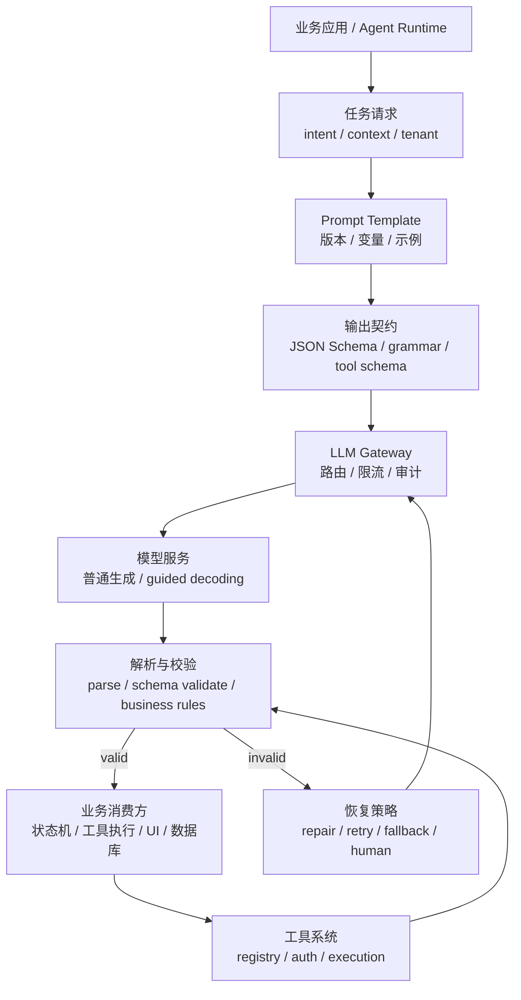
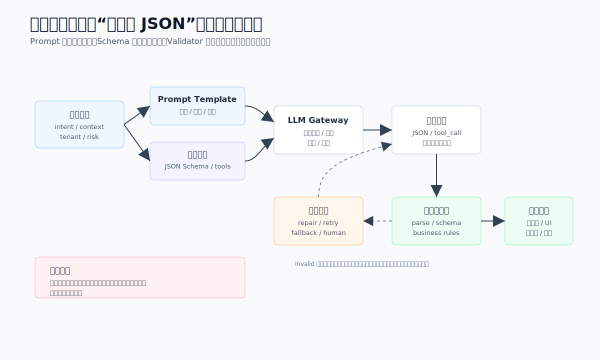
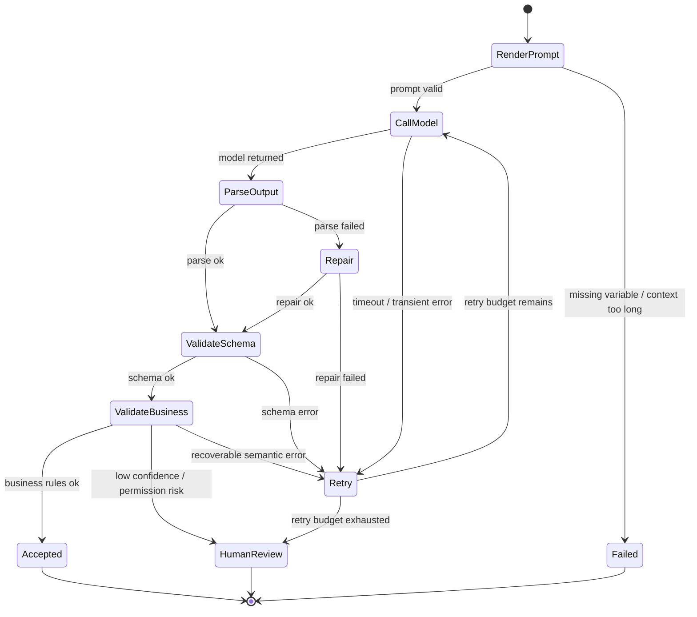

# 第8章 结构化输出与提示工程

---

模型输出要从可读文本变成可被系统消费的接口结果。企业应用很少只把回答展示给用户，更多时候要把结果写入工单、合同库、审批流、SQL 执行器或前端组件树。只靠 Prompt 要求“输出 JSON”并不可靠，系统还需要 schema、解析器、业务校验、重试策略、工具权限和审计日志。本章把 Prompt 看作输入侧接口，把结构化输出看作输出侧契约，把工具调用看作受控系统动作，说明三者如何一起进入发布和回滚流程。

客服中心希望模型把投诉归类后自动进入工单系统；合同助手希望模型抽取付款节点并写入提醒表；DataAgent 希望模型生成下一步工具调用参数；生成式 UI 希望模型返回组件树。它们看起来都是“让模型按格式回答”，但生产风险并不相同。

如果模型把 `delivery_delay` 写成“物流比较慢”，人能理解，系统却无法稳定入库。如果模型在退款工具参数里多填了一个未定义字段，工具执行器可能拒绝，也可能被业务代码误读。如果模型输出的证据句并不存在于原文，JSON 语法完全正确也没有用。因此，结构化输出属于接口治理问题，而不是单纯的格式问题。

结构化输出最容易在演示阶段被低估。模型返回一段 JSON，前端能渲染，业务看起来已经跑通；等到它进入工单、合同、SQL 执行器和审批流，字段名、枚举值、证据位置和失败恢复都会变成接口责任。一个字段多了空格、一个枚举写成自然语言、一个证据引用找不到原文，下游系统都可能把问题放大。

企业里常见的事故并非 JSON 语法错误，而是语义正确性和执行边界混在一起。模型把退款原因分类成 `delivery_delay`，系统能入库；但证据句来自用户猜测，客服据此自动退款，后续争议就会落到业务流程上。模型生成一个工具调用参数，schema 通过了；但权限范围没有校验，执行器读取了当前用户不该看的明细。结构化输出只有和业务校验、权限策略、幂等键和审计日志一起设计，才算进入生产。

Prompt 在这里承担输入侧契约，schema 承担输出侧契约，工具调用承担执行侧契约。三者分开管理时，发布很容易错位：Prompt 要求新增字段，schema 没更新；schema 允许的枚举变了，评测样本仍按旧值；工具参数多了风险字段，审批页面却没有展示。真正可靠的结构化任务，需要把这些资产当作同一个版本发布。

## 8.1 从自由文本到可验证动作

### 8.1.1 结构化输出的系统价值

大模型刚接入业务时，团队通常先把它当作文本接口：业务拼一段 Prompt，模型返回自然语言，前端展示给用户。原型阶段这样最快，但进入生产后会碰到一组很具体的限制。

自由文本很难被下游系统稳定消费。客服工单、合同抽取、审批建议和 SQL 执行计划都需要字段、类型、枚举和证据；Prompt、模型版本、生成参数和上下文稍有变化，输出又可能换一种写法。出了事故之后，团队还需要知道模型返回了什么字段、哪个字段没通过校验、哪个工具被调用、是否进入人工队列。仅靠一段自然语言，复现和审计都会变得困难。

结构化输出要把一次模型生成拆成可验证的动作：输入是什么，输出必须满足什么结构，哪些失败可以重试，哪些失败必须拒绝或交给人工。

*表8-1：常见结构化任务的输出对象与失败后果。来源：本书整理。*

| 任务 | 输出对象 | 下游消费方 | 主要风险 |
|---|---|---|---|
| 工单分类 | 类别、置信度、证据句、人工复核标记 | CRM、客服工单系统 | 误分派、自动化越权 |
| 合同抽取 | 日期、金额、义务、风险条款、证据位置 | 合同库、提醒系统 | 脏数据入库、遗漏风险 |
| DataAgent 规划 | 工具名、参数、停止条件、澄清问题 | Runtime、SQL 执行器、权限系统 | 调错工具、越权查询 |
| 生成式 UI | 表单 schema、组件树、数据绑定 | 前端渲染层 | 页面不可渲染、交互错位 |

这些任务的共同点是输出会继续驱动系统动作。它们需要有版本、有校验、有错误处理的接口契约，而不是“像 JSON 的文本”。

### 8.1.2 Prompt、schema 与工具调用的三类契约

Prompt、结构化输出和工具调用经常被混在一起。它们确实相互依赖，但职责不同。

Prompt 是输入侧契约，负责告诉模型任务、上下文、业务规则和输出要求。结构化输出是输出侧契约，负责规定返回对象的字段、类型、枚举和必填项。工具调用是执行侧契约，负责把模型给出的工具名和参数交给平台校验，再由平台决定是否执行。


*图8-1：结构化任务的四层契约。来源：本书自绘。Alt text：图中从上到下展示 Prompt 输入契约、模型生成、schema 输出契约和下游消费四层，每层都有校验点，输出通过 schema 后才能进入业务系统。*

图 8-1 强调的是“契约绑定”。一个结构化任务发布时，Prompt 模板、schema、工具契约、模型版本、生成参数、评测样本和回滚策略应该作为同一个发布包管理。

结构化任务至少包含四层契约。

*表8-2：结构化任务的四层契约。来源：本书整理。*

| 层次 | 关键问题 | 典型资产 |
|---|---|---|
| 语义契约 | 模型要完成什么业务动作 | 任务说明、边界规则、示例 |
| 结构契约 | 输出必须长什么样 | JSON Schema、枚举、字段说明 |
| 执行契约 | 是否允许调用工具，工具如何执行 | tool schema、权限策略、幂等键 |
| 治理契约 | 怎样发布、评测、灰度和回滚 | template 版本、schema 版本、评测报告、trace |

这四层缺一层，生产风险都会转移到后面的系统。只写 Prompt，系统会被格式错误拖垮；只写 schema，模型可能语义正确率很低；只做工具调用，安全和幂等问题会被隐藏到执行阶段。

在评审结构化任务时，可以要求作者把这四层逐项落到具体文件或配置上。说不清 Prompt 版本在哪里，说明行为难以复现；说不清 schema 失败进入哪里，说明恢复路径没有设计；说不清工具执行由谁授权，说明模型输出和系统动作之间缺少隔离层。

### 8.1.3 Prompt 模板的接口化设计

企业 Prompt 不应写成一次性提示词。一个稳定模板至少要说明角色边界、任务目标、上下文变量、业务规则、输出契约和失败策略。

例如投诉分类任务可以这样设计：

```text
你是客服质检助手，只做投诉原因归类，不生成赔付承诺。

任务：
从工单文本中识别主投诉原因，并给出最多三个来自原文的证据句。

业务规则：
- category 只能从 delivery_delay、quality_issue、refund_dispute、service_attitude、unknown 中选择。
- 信息不足时选择 unknown，并填写 missing_info。
- 如果投诉涉及退款和物流，优先选择导致升级的原因。

输出：
返回符合 complaint_classification_v2 的 JSON。不要输出 Markdown。
```

这段 Prompt 的价值不在措辞，而在边界可测。业务规则能转成测试样例；枚举能转成 schema；失败出口能被监控；“不生成赔付承诺”能被安全评测覆盖。

Few-shot、分步推理、多分支推理和多次采样投票都可以提高某些任务的稳定性，但它们不能替代接口契约。示例越多，Prompt 越长，维护成本也越高；显式推理越多，泄露草稿和增加成本的风险也越大。生产系统应先把结构、规则和校验做好，再按任务风险决定是否加入这些技巧。

### 8.1.4 结构化输出的失效模式

最常见的失效来自把“输出 JSON”当作结构化输出。模型仍可能输出 Markdown 代码块、尾随解释、缺字段、非法枚举或半截对象。Prompt 是第一道约束，后面还需要解析、schema 和业务校验。

schema 也不是越复杂越可靠。过深嵌套、过多可选字段和含糊字段名会增加失败率，也会让业务难以定位问题。生产 schema 应从最小可用字段开始，优先使用短枚举、数字、日期、布尔值和证据引用。

更高风险的做法是让模型直接操作系统。模型可以建议调用哪个工具和使用哪些参数，但执行必须由平台完成。发送邮件、退款、创建工单、执行 SQL 这类动作，需要鉴权、参数校验、幂等控制、审计和人工确认。

---

## 8.2 解析、校验与异常处理

### 8.2.1 链路位置

结构化输出能力位于业务应用、LLM Gateway、推理服务和工具系统之间。上游给出任务、上下文和风险等级；下游接收状态更新、工具调用、数据库写入或 UI 渲染。





*图8-2：结构化输出的校验与恢复闭环。来源：本书自绘。Alt text：图中展示模型生成、解析、schema 校验、业务校验和下游消费的循环；校验失败会进入修复、重试、降级或人工复核分支。*

图 8-2 中最重要的是 invalid 分支。很多生产事故并非模型完全不会回答，而是输出“看起来差不多”：字段名接近、证据缺失、枚举拼错、权限越界或工具参数不完整。只要这类结果越过校验层，问题就会进入业务系统。

### 8.2.2 请求契约

结构化请求可以用统一对象描述。下面示例不绑定任何模型 SDK，只表达平台需要保存和传递的信息。

```json
{
  "task": "complaint_classification",
  "tenant": "demo-retail",
  "prompt": {
    "template_id": "complaint_classifier",
    "version": "2.1.0",
    "variables": {
      "ticket_text": "用户反馈包裹延迟三天，客服多次未响应，要求退款。",
      "channel": "online_chat"
    }
  },
  "model": {
    "name": "qwen3-32b-instruct",
    "temperature": 0.1,
    "max_tokens": 512
  },
  "response_format": {
    "type": "json_schema",
    "schema_id": "complaint_classification",
    "schema_version": "2.0.0"
  },
  "recovery": {
    "max_retries": 2,
    "repair": true,
    "fallback": "human_review"
  }
}
```

对应的 schema 应保持小而明确。

```json
{
  "type": "object",
  "required": ["category", "confidence", "evidence", "requires_human_review"],
  "additionalProperties": false,
  "properties": {
    "category": {
      "type": "string",
      "enum": [
        "delivery_delay",
        "quality_issue",
        "refund_dispute",
        "service_attitude",
        "unknown"
      ]
    },
    "confidence": {
      "type": "number",
      "minimum": 0,
      "maximum": 1
    },
    "evidence": {
      "type": "array",
      "items": {"type": "string"},
      "minItems": 1,
      "maxItems": 3
    },
    "requires_human_review": {"type": "boolean"},
    "missing_info": {"type": "string"}
  }
}
```

这里有两个设计点。`additionalProperties: false` 限制模型输出未定义字段，避免下游误读。`unknown` 给模型一个合法的失败出口，否则模型会被迫在几个错误类别中选择一个。

### 8.2.3 生命周期与失败分层

结构化输出请求在运行时会进入一个状态机。



失败处理要分层。JSON 解析失败可以 repair 一次；schema 失败可以把错误反馈给模型重试；证据缺失需要补检索或人工确认；参数越权必须直接拒绝并记录安全事件。把所有失败都重试，会增加成本和延迟；把所有失败都交给人工，又会让自动化失去意义。

*表8-3：结构化请求的失败类型与恢复策略。来源：本书整理。*

| 失败类型 | 典型触发条件 | 处理方式 |
|---|---|---|
| Prompt 渲染失败 | 缺变量、上下文过长、敏感信息未脱敏 | 阻断请求，要求补变量或裁剪上下文 |
| 解析失败 | 输出包含代码块、注释、尾随文本或半截 JSON | repair 一次，仍失败则重试 |
| schema 失败 | 缺字段、类型错误、非法枚举 | 带校验错误重试，超过预算进入人工 |
| 业务校验失败 | 证据句不存在、金额单位缺失、置信度过低 | 补检索、要求澄清或人工复核 |
| 工具校验失败 | 工具不存在、参数越权、动作需确认 | 拒绝执行，记录 trace 和安全事件 |
| 执行不确定 | 工具超时、网络中断、非幂等动作未知 | 用 idempotency key 查状态，禁止盲目重试 |

生产系统还要记录足够的 trace 信息：template_id、schema_id、model、generation_config、raw_output、parse_error、validation_error、retry_count、tool_call、tool_result、latency、token_usage 和最终状态。用户文本、手机号、证件号、合同金额等敏感字段需要按第10章之后的安全治理策略处理。

---

## 8.3 结构化输出的四组工程决策

### 8.3.1 Prompt 约束、约束解码与后置校验

Prompt 约束兼容性最好，但格式失败率最高。后置校验容易接入，能发现错误并触发重试，但仍会浪费一次模型调用。约束解码能在生成阶段减少非法格式，适合高并发抽取和工具参数生成，但依赖推理服务能力，也不能替代业务校验。

实际生产中常用组合策略：Prompt 说清任务和边界，推理阶段尽量启用 JSON Schema 或 grammar 约束，输出后再做 schema 校验和业务校验。约束解码解决“形状正确”，业务校验解决“是否能用”。

### 8.3.2 大 schema 一次生成与小 schema 多步生成

简单表单可以一次生成完整对象。复杂任务更适合拆成多个小 schema：合同处理先判断合同类型，再按类型抽取条款；DataAgent 先判断查询意图，再生成 SQL 或工具参数；客服工单先分类，再对高风险类别抽取证据和升级原因。

小 schema 多步生成会增加调用次数和延迟，但错误定位更清楚，重试范围也更小。对高风险任务来说，这个成本通常值得支付。

### 8.3.3 显式推理过程与证据输出

企业系统不应默认把模型的完整推理草稿展示给用户或写入业务记录。更可靠的做法是让模型输出结论、证据引用和必要解释，而不是输出完整思维链。对高风险任务，系统应保留原始输入、检索片段、模型输出和人工复核记录。

### 8.3.4 模型选工具与工作流控工具

开放式办公助手可以让模型在低风险工具中自主选择。审批、退款、数据库查询和外发消息这类生产流程，应由工作流根据状态和权限裁剪工具列表，再让模型在有限集合中填参数。工具越多，误调用概率越高，也会占用上下文并影响缓存命中。

---

## 8.4 结构化输出的生产验收边界

结构化输出上线前，验收对象不应只是一段 prompt 或一个 JSON schema，而是一条从模型响应到业务动作的完整链路。平台需要证明四件事：模型能在正常输入下稳定生成目标结构，解析器能把异常输出归类，校验器能拦住语义不可用的字段，Runtime 能把失败转成可恢复状态。缺少其中任何一环，结构化输出都会退回“看起来像 JSON 的自由文本”。

最常见的失误，是把 schema 当成接口契约的全部。schema 能检查字段是否存在、类型是否匹配，却不能判断字段是否符合业务语义。例如 `date_range` 结构合法，但时间范围可能跨越未授权账期；`metric_name` 是字符串，但可能不是语义层登记过的指标；`action` 是枚举值，但当前用户没有执行权限。因此，结构化输出进入工具调用前，还要经过语义层、Policy 和 Registry 的二次判断。第33章的指标版本、第23章的工具参数、第50章的安全策略，都要在这里接上。

回归样本也要按失败类型组织。格式错误样本用于验证解析器和重试策略；字段缺失样本用于验证 schema 变更是否兼容；语义冲突样本用于验证业务校验；越权样本用于验证 Policy 是否在工具调用前生效。只有把这些样本放进发布门禁，团队才知道一次 prompt 修改影响的是表达格式、业务语义，还是工具执行边界。

对前端来说，结构化输出还决定错误能否解释。用户不需要看到“JSON parse failed”，但需要知道系统是在重新生成、等待补充条件，还是因为权限不足停止执行。Conversation API 应把结构化失败映射为稳定错误码，前端再决定展示重试、补充信息、申请审批或转人工。这样结构化输出才真正成为平台接口，而不是模型输出格式的一层装饰。

## 8.5 结构化输出的运行时契约

### 8.5.1 结构化输出在网关与工具层的分工

当前仓库已有两个相关基础模块：`mini-platform/core/gateway/` 承担模型调用和路由抽象，`mini-platform/core/registry/tool_registry.py` 表达工具名、描述、参数 schema 和 handler 的关系。结构化输出可以在这个基础上补三类能力。

*表8-4：结构化输出相关能力的建议路径。来源：本书整理。*

| 能力 | 建议路径 | 说明 |
|---|---|---|
| Prompt 模板 | `mini-platform/core/gateway/prompt_template.py` | 管理模板变量、版本和渲染 |
| 结构化解析 | `mini-platform/core/gateway/structured_output.py` | parse、JSON Schema validate、repair result |
| 工具调用校验 | `mini-platform/core/registry/tool_registry.py` | 在工具 schema 基础上增加参数校验和策略 |

轻量实现可以先只支持 JSON 对象解析和基础字段校验。生产系统再替换为 Pydantic、jsonschema、Instructor、Outlines 或推理引擎内置 guided decoding。

### 8.5.2 结构化解析示例

下面代码展示结构化输出网关的核心思路。它不是完整 JSON Schema 实现，只用于说明解析、字段校验和错误返回的边界。

```python
# 来源建议：mini-platform/core/gateway/structured_output.py
from __future__ import annotations

import json
from dataclasses import dataclass
from typing import Any

@dataclass(frozen=True)
class ValidationError:
    path: str
    message: str

@dataclass(frozen=True)
class StructuredResult:
    ok: bool
    data: dict[str, Any] | None
    errors: list[ValidationError]
    raw: str

def parse_structured_json(raw: str, required: set[str]) -> StructuredResult:
    try:
        data = json.loads(raw)
    except json.JSONDecodeError as exc:
        return StructuredResult(False, None, [ValidationError("$", exc.msg)], raw)

    if not isinstance(data, dict):
        return StructuredResult(False, None, [ValidationError("$", "expected object")], raw)

    errors = [
        ValidationError(field, "missing required field")
        for field in sorted(required)
        if field not in data
    ]
    return StructuredResult(not errors, data if not errors else None, errors, raw)
```

工具调用要通过注册表查找和执行。模型最多给出工具名与参数，平台负责验证。

```python
# 来源建议：mini-platform/core/gateway/tool_calling.py
from __future__ import annotations

from typing import Any

from core.registry import ToolRegistry

def execute_validated_tool_call(
    registry: ToolRegistry,
    name: str,
    version: str,
    arguments: dict[str, Any],
    *,
    tenant: str,
    idempotency_key: str,
) -> Any:
    tool = registry.get(name, version)

    if not idempotency_key:
        raise ValueError("idempotency key is required")

    # 生产代码还需要校验 arguments、tenant 权限和动作风险等级。
    return tool.handler(**arguments)
```

### 8.5.3 schema 变更的回归样本

结构化输出进入生产链路前至少要通过五类检查。

*表8-5：结构化输出发布准入。来源：本书整理。*

| 验收项 | 检查问题 | 证据 |
|---|---|---|
| 契约完整性 | Prompt、schema、工具契约和模型版本是否绑定发布 | 发布记录、版本号、回滚目标 |
| 失败恢复 | 解析失败、schema 失败、工具失败是否有路径 | 重试配置、人工队列、降级策略 |
| 安全边界 | 高风险工具是否需要权限和人工确认 | 工具策略、审计日志、权限测试 |
| 成本与性能 | 重试和多次采样是否有预算 | token usage、P95 延迟、失败成本 |
| 回归评测 | 成功、边界、拒答、恶意输入样例是否覆盖 | 评测报告、失败样本清单 |

这些验收项不要求一次做成庞大平台。第一版只要能做到版本可追踪、失败可归类、工具不可绕过，就已经比“Prompt 字符串加 JSON parse”稳得多。

结构化输出的第一版也不必追求复杂。一个真实可用的起点，是把三类任务做扎实：一类信息抽取任务、一类工具调用任务、一类需要人工复核的高风险任务。三类任务跑通后，团队才能看清 schema 设计、重试预算和审计字段是否足够。

### 8.5.4 结构化输出失效的定位路径

#### JSON 被 Markdown 代码块包裹

示例里使用了代码块，模型照着输出，解析器直接失败。修复方式是示例只保留裸 JSON，解析器对代码块做一次 repair，高频任务启用 JSON Schema 或 grammar 约束。

#### 字段合法与语义不可用

`category` 是合法枚举，`confidence` 也是数字，但证据句并不存在于原始工单。修复方式是增加证据回指校验，要求 evidence 来自输入原文或检索片段。

#### 重试导致重复创建工单

第一次工具调用超时后，平台重试又创建了一张工单。修复方式是所有非幂等工具都接收 idempotency_key，工具端按 key 去重，并把执行状态写入审计日志。

#### Few-shot 示例携带过期政策

模型学到了旧政策，分类准确但建议错误。修复方式是让示例只示范格式和边界，易变化政策从受控知识源注入，并记录知识版本。

---

## 8.6 结构化输出的版本治理

结构化输出一旦被下游系统消费，就进入了接口治理范畴。Prompt 文案、JSON Schema、工具参数和解析器版本都可能影响运行结果。只改 Prompt、不改 schema，看似没有接口变化，实际可能改变字段含义、枚举选择或缺省值；只改 schema、不改评测样本，也可能让模型继续按旧格式输出。生产系统不能把这些变化混在一次普通配置修改里。

版本治理需要把 Prompt、schema、解析器和评测样本绑定起来。每个可发布版本都应当说明支持哪些字段、哪些字段必填、哪些字段允许为空、枚举值是否向后兼容、下游工具能否接受旧版本输出。灰度时不能只看模型是否返回合法 JSON，还要看业务动作是否仍然符合预期。比如审批工具新增 `risk_reason` 字段后，模型能输出该字段只是第一步；平台还要确认审批页面、审计日志和告警规则都能读取这个字段。

schema 漂移的风险尤其高。业务团队常常会把一个字段从字符串改成对象，或者把枚举值从中文标签改成英文代码。如果旧样本没有覆盖这些变化，结构化输出会在低频场景里才暴露问题。比较稳妥的做法是保留一组契约回归样本，覆盖正常输入、缺字段、非法枚举、长文本、工具拒绝和多轮修复。每次 Prompt 或 schema 变化都要跑这组样本，并把失败样本进入第39章的评测库。

## 8.7 结构化输出的证据与恢复

结构化输出失败时，系统不能只返回解析错误。平台需要区分三类失败：模型没有按格式输出、输出格式正确但业务字段不合理、字段合理但下游工具拒绝执行。三类失败的恢复方式不同。格式错误可以要求模型按 schema 重试，业务字段不合理需要回到用户澄清或补充上下文，工具拒绝执行则要根据错误码决定重试、降级或人工处理。

恢复过程也要保留证据。一次失败至少应当记录原始模型输出、解析错误、校验错误、重试 Prompt、修复后的结构化结果和最终工具响应。这样第38章的 Trace 才能看出错误发生在模型、解析器、schema 还是工具层。没有这些证据，团队会倾向于继续调 Prompt，而忽略真正的问题可能是 schema 设计含糊或下游工具错误码不清楚。

结构化输出的工程目标不是让模型“更听话”，而是让模型输出进入可验证、可回放、可恢复的接口链路。只要输出要驱动工具、审批、SQL、报告或外部系统，就应该按接口契约治理。Prompt 可以帮助模型理解任务，但接口责任必须由平台承担。

## 8.8 接口契约的组织协作

结构化输出的维护不应只交给模型工程师。业务团队定义字段含义，平台团队维护解析和重试，安全团队定义高风险动作，前端团队负责把错误状态展示给用户。若这些角色没有共同契约，字段名看起来一致，实际语义却会分叉。例如 `reason` 在模型输出中可能表示判断依据，在审批系统中可能表示拒绝原因，在审计系统中又可能表示风险说明。字段复用如果没有解释文档，会让下游系统读到合法但错误的值。

因此，每个结构化任务都应当有简短的契约说明，写清楚字段来源、字段用途、默认值、空值含义、失败状态和下游消费者。契约说明不需要做成厚重文档，但必须跟随版本发布。接口变更时，相关样本、前端展示、工具校验和审计字段要一起检查。这个习惯会让结构化输出从 Prompt 技巧变成跨团队可以维护的接口资产。

第一版平台可以先选三条链路建立这套协作：信息抽取、工具调用和审批恢复。三条链路覆盖了读、写和人工确认，能暴露大部分结构化输出问题。等这些契约稳定后，再把同样方法推广到 NL2SQL、报告生成和多 Agent Handoff。

结构化输出还需要约定观测口径。团队应当统计解析失败率、业务校验失败率、重试成功率、人工介入率和下游工具拒绝率，而不是只统计“JSON 合法率”。JSON 合法只能说明模型输出形状正确，不能说明接口可用。把这些指标接入 Trace 后，平台才能判断一次 schema 或 Prompt 变更究竟改善了格式稳定性，还是把错误推到了下游工具。

当这些指标长期稳定后，结构化输出才适合扩大到更多业务动作。否则团队会在新场景里重复处理同样的解析、校验和恢复问题。第一版平台要先把少数契约跑稳，再扩展任务类型。

这也是后续工具调用和 DataAgent 链路的基础。输出契约越稳定，Planner、Runtime 和前端越容易复用同一套错误处理。

结构化输出上线后，团队要持续查看失败类型。语法失败说明模型或约束解码不稳定；字段缺失说明 schema 设计或上下文提示不足；业务校验失败说明模型理解和规则存在差距；审批驳回说明证据展示没有让人放心。不同失败类型对应不同修复路径，不能都靠“再优化 Prompt”处理。

版本管理也会影响恢复能力。一次结构化任务至少要记录 Prompt 版本、schema 版本、模型版本、工具版本和校验规则版本。用户投诉某个自动分类结果时，平台要能复现当时的完整契约，而不是用今天的 Prompt 和 schema 重新生成一个看似合理的结果。

把结构化输出看成接口工程后，很多取舍会清楚得多。字段少一些，系统更容易稳定消费；证据要求严一些，模型可能多触发人工复核，但事故后更容易解释；重试次数少一些，成本可控，失败也更早暴露。生产系统关心的是可恢复和可追责，而不仅是一次回答看起来格式正确。

结构化输出的上线评审可以从一个失败样本开始。让团队拿出一条格式正确但业务错误的结果，说明它会在哪里被拦截。若 schema 能通过，业务校验也能通过，工具还能执行，说明接口契约缺少关键规则。若错误只能靠人工阅读最终答案发现，说明结构化链路没有真正承担生产责任。

前端也要理解结构化输出的状态。字段缺失、证据不足、工具参数被拒绝、模型重试中、进入人工复核，这些状态不应都显示成“生成失败”。用户需要知道系统卡在格式、语义、权限还是业务规则上。状态说清楚后，用户可以补充信息，审批人可以要求补证据，平台团队也能定位修复点。

对开发团队来说，结构化输出最容易被忽略的是兼容性。新增字段、修改枚举、收紧必填项，都会影响下游消费者。一个报告生成 Agent 可能已经依赖旧字段渲染图表，一个工单系统可能按旧枚举做自动分派。schema 变更应像 API 变更一样有版本、灰度和回滚，而不是随着 Prompt 一起随手修改。

审计记录要保存“原始输出”和“校验后对象”。原始输出能帮助模型团队排查生成问题，校验后对象能说明业务系统实际消费了什么。若只保存其中一个，复盘都会缺证据。尤其是工具调用场景，平台还应记录被丢弃的字段、默认补齐的字段和最终执行参数，避免模型输出和实际动作之间出现不可见差异。

当结构化输出成为平台通用能力后，业务团队可以更快上线新任务。它们复用 schema 管理、解析、重试、校验、审计和人工复核，而不是每个应用重写一遍 JSON 处理逻辑。这种复用才是提示工程进入工程化的标志。

结构化输出还要处理部分成功。合同抽取任务可能成功识别付款日期，却无法确认违约条款；DataAgent 可能生成了可执行 SQL，但图表配置缺少维度；工单分类可能给出类别，却无法给出足够置信度。生产系统不能把这些情况都当作完全失败，也不能直接进入下游。更合适的做法是让 schema 表达状态，把可用字段、缺失字段、待人工确认字段和失败原因分开。

字段设计要从下游动作倒推。若字段只用于展示，可以允许自然语言摘要；若字段要进入数据库、审批流或工具参数，就要有严格类型、枚举和单位。金额字段必须说明币种和精度，时间字段必须说明时区和业务日期，证据字段必须能定位到原文。很多结构化输出事故来自字段看起来合理，但下游无法判断它到底代表什么。

重试策略也要克制。格式错误可以短重试，证据不足不能靠重试解决，权限拒绝更不能重试到成功。平台应把解析错误、schema 错误、业务校验错误和策略拒绝分开，给每类错误配置不同恢复动作。若所有失败都重新请求模型，系统会增加成本，也会把真实规则问题掩盖掉。

提示词模板的评审要和 schema 评审一起做。模板要求“请给出风险等级”，schema 却允许任意字符串；模板要求引用证据，schema 没有证据字段；模板要求模型在不确定时拒答，schema 没有拒答状态。这些不一致在代码审查中很难发现，只有把模板、schema 和评测样本放在同一个发布包里，才容易检查。

结构化输出的质量还要看长期稳定性。一次任务在今天输出合法 JSON，不代表模型版本、上下文和业务规则变化后仍然稳定。平台可以保留一组小型结构化回归集，每次模板、schema、模型或工具变化时运行。回归集不需要很大，但要覆盖枚举、缺字段、边界值、拒答、证据缺失和工具参数。这样结构化任务才能像普通 API 一样演进。

结构化输出还要考虑下游幂等。模型重复返回同一工具参数时，系统应识别这是重试还是新的动作。创建工单、发送邮件、写入审批记录这类动作，都需要业务幂等键和执行状态。否则一次网络重试就可能造成重复副作用，而复盘时只能看到两次格式正确的模型输出。

字段默认值也要谨慎。解析器为了让对象完整，可能给缺失字段补默认值；但默认值一旦进入业务系统，就会变成真实决策。比如风险等级缺失时默认低风险，审批原因缺失时默认“模型建议通过”，都会掩盖问题。高风险字段缺失时，更稳妥的动作是进入人工复核或要求补充证据。

结构化输出的文档要面向多角色。模型工程师关注 Prompt 和失败样本，后端工程师关注 schema 和兼容性，前端工程师关注状态展示，业务负责人关注字段含义和人工兜底。把这些信息写在同一份契约中，能减少字段语义在不同系统之间漂移。

## 本章小结

Prompt 是输入侧接口，结构化输出是输出侧契约，工具调用是受控系统动作。三者都需要绑定版本、评测和回滚，不能只靠“请输出 JSON”这类提示词约束。解析校验、schema 校验、业务校验、重试和人工兜底都要进入链路。

模型可以生成工具调用建议，但执行必须由平台完成，鉴权、参数校验、幂等和审计不能交给模型文本决定。schema 应从最小可用字段开始；复杂任务更适合拆成多个小对象、多步校验和局部重试。结构化输出的成熟度不取决于 Prompt 写得多复杂，而取决于失败能否被分类、恢复、复现和回滚。

## 参考文献

JSON Schema. (n.d.). [Specification](https://json-schema.org/).

OpenAI. (n.d.). [Structured Outputs guide](https://platform.openai.com/docs/guides/structured-outputs).

Guidance. (n.d.). [Documentation](https://guidance.readthedocs.io/).

Instructor. (n.d.). [Documentation](https://python.useinstructor.com/).
