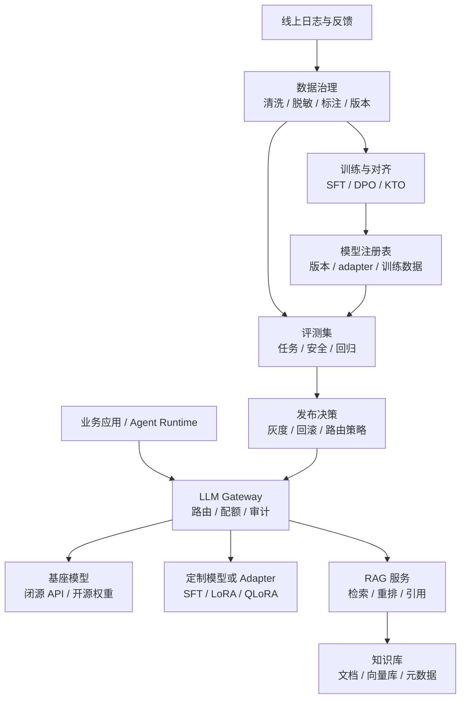
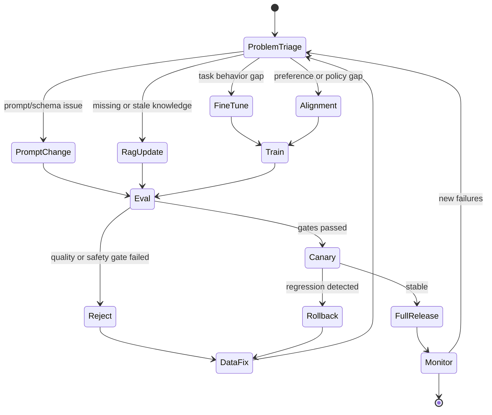

# 第9章 模型能力定制与知识增强

---

企业遇到模型效果问题时，要先判断该改 Prompt、接 RAG、做微调，还是引入偏好对齐。很多团队一看到模型答错就想到 fine-tune，但线上失败的根因可能是知识过期、输出格式不稳、权限边界缺失或评测样本不足。微调适合学习任务模式和领域表达，RAG 适合接入可更新、可引用的企业知识，对齐适合调整拒答、风格和安全偏好。这些路线应放在同一条闭环中：从失败样本分诊开始，经过数据治理、训练或知识更新、评测、灰度和回滚，再回到线上监控。一个企业助手上线后，业务团队通常会很快反馈“模型不懂我们”。客服团队说分类口径不稳定，法务团队说风险等级不符合内部规范，数据团队说模型总是用错指标口径，人力团队说制度问答引用了旧政策。这些问题表面相似，处理方式却不同。

如果模型不知道上周刚更新的休假政策，应该更新知识库，不要训练模型记住新政策。如果模型能理解问题，却总是不按固定 JSON 输出，应先检查 Prompt、schema 和结构化输出链路。如果模型长期写出错误 SQL 模式，说明任务分布与基座模型差异较大，才可能需要 SFT 或 LoRA。如果模型在灰区问题上喜欢给出过度承诺，就要处理偏好和安全边界。能力定制的第一步是分诊：先确认问题来自知识、输出契约、任务分布还是偏好边界，再选择 RAG、Prompt、微调或对齐手段。企业团队说“模型不懂我们”时，背后可能是完全不同的问题。模型不知道最新制度，是知识更新问题；模型总把字段映射错，是任务分布问题；模型能答对但格式不稳，是接口契约问题；模型在敏感场景回答过于激进，是偏好和安全策略问题。若一开始就把所有问题归为“需要微调”，团队会花很大成本训练出一个仍然无法上线的模型。

能力定制的第一步应是失败样本分诊。每个失败样本都要还原输入、上下文、候选知识、模型输出、工具结果和人工判断。数据团队可以判断是否缺少语义层口径，平台团队可以判断是否缺少结构化校验，模型团队再判断是否需要 SFT、LoRA 或偏好对齐。没有这一步，RAG、微调和 Prompt 优化会互相替代，最后没人能说明哪项改动真正解决了问题。一个典型场景是制度问答助手在政策更新后继续引用旧条款。业务方会要求“训练模型记住新制度”，但更合适的动作通常是修复知识库更新、文档切分、版本索引和引用校验。另一个场景是 DataAgent 长期生成错误的指标口径，即使知识库里有定义仍然选错字段，这时才可能需要微调模型学习企业任务模式。定制路线要服务失败原因，而非服务团队偏好的技术路线。

## 9.1 先判断问题类型

### 9.1.1 能力定制的三条路线

企业想让模型“更懂业务”，通常会走三条路线：微调、RAG 和对齐。它们可以组合，但不能互相替代。

*表9-1：能力定制路线与适用问题。来源：本书整理。*

| 路线 | 改变什么 | 适合解决 | 更新频率 |
|---|---|---|---|
| 微调 | 模型参数或 adapter | 任务习惯、领域语言、固定输出模式 | 周级到月级 |
| RAG | 外部上下文 | 最新政策、产品手册、合同条款、指标口径 | 小时级到天级 |
| 对齐 | 模型偏好与拒答倾向 | 风格、安全边界、合规话术、风险分级 | 周级到季度 |

客服助手可能同时使用这三类能力：RAG 检索最新政策，LoRA 学习工单分类口径，对齐模型避免越权承诺赔付。每个失败样本都要说明根因，不能把所有问题都归为“模型不够懂业务”。

### 9.1.2 失败样本分诊

失败样本应先进入分诊表，不要直接进入训练集。分诊的目标是回答两个问题：模型缺的是知识、格式、任务能力，还是偏好边界；这个问题能不能通过低成本、可回滚的方式解决。

*表9-2：常见失败症状、可能根因与优先方案。来源：本书整理。*

| 症状 | 可能根因 | 优先方案 |
|---|---|---|
| 回答不知道最新政策、价格、库存、合同状态 | 知识不在上下文或已过期 | RAG、工具查询、知识库快照 |
| 信息基本正确，但输出不符合接口格式 | Prompt 与 schema 不稳定 | Prompt、结构化输出、回归样例 |
| 在特定领域术语、SQL 模式、代码框架上长期错误 | 任务分布与基座模型差异大 | SFT、LoRA、QLoRA |
| 回答语气、拒答、风险等级不符合规范 | 偏好和安全边界未对齐 | 偏好数据、DPO/KTO、护栏策略 |
| 错误偶发，样本数量很少 | 评测和数据不足 | 先补评测集和日志标注 |

表9-2 背后有一个实用原则：先做可解释、可回滚、链路局部的改动。Prompt 和 schema 可以很快灰度和回滚；RAG 知识快照也能追踪。微调会改变模型行为，应该在评测证明必要之后再做。

分诊还要保留反例。比如同一类“回答错误”里，可能同时有知识过期、检索噪声和模型推理失败。只记录成功修复的样本，会让后续训练集越来越单一；保留失败修复记录，才能帮助团队判断下一轮是该补知识、改检索，还是进入模型训练。


*图9-1：能力定制技术路线选择。来源：本书自绘。Alt text：图中以问题分诊为起点，分别指向知识过期、格式不稳、能力不足和偏好边界四类问题，并对应 RAG、Prompt、微调和对齐路线。*

图 9-1 的重点是先分诊再选路线。知识缺失先走外部知识或工具，格式不稳先修结构化输出，长期任务行为差异再进入微调，偏好和安全边界问题才进入对齐。

### 9.1.3 Prompt、RAG、微调与对齐的分工

Prompt 调整改变的是请求上下文。它适合表达任务规则、输出格式和少量边界案例。RAG 改变的是回答前能看到的外部知识，适合需要引用来源和频繁更新的事实。微调改变的是模型参数或 adapter，适合让模型长期学习某类任务模式。对齐改变的是模型偏好，适合处理“应该怎么回答”和“什么时候拒答”。这几个边界在工程上很重要。把动态知识写进模型参数，会导致更新慢、不可追溯、难删除。把任务能力问题全交给 RAG，会得到更多上下文，但不一定得到更稳定的推理和格式。把安全问题全交给 DPO，也不能替代权限、脱敏、工具白名单和审计。

### 9.1.4 不适合微调的场景

微调不能永久写入企业知识。微调更适合学习任务模式和表达习惯，不适合承载频繁变化的事实。员工制度、商品价格、库存、合同状态和指标口径版本应通过 RAG、工具或数据库查询接入。RAG 也不能替代模型能力。RAG 能提供知识，但不能自动让模型学会复杂任务。检索到了财务口径文档，不代表模型就能稳定生成正确 SQL；检索到了合同模板，也不代表模型就能正确抽取风险条款。对齐不能单独解决安全问题。对齐可以提高拒答倾向和风格一致性，但不能替代权限、审计、脱敏、工具白名单和业务规则。模型即使倾向于拒绝越权请求，工具执行层仍然必须做硬校验。训练数据也不是越多越好。低质量、重复、冲突、过期的数据会让模型退化。企业微调最怕把历史噪声当成真理：旧政策、错误客服话术、临时 workaround 和 SQL 反模式都会被模型学进去。

---

## 9.2 从失败样本到灰度发布

### 9.2.1 能力定制在模型、知识与评测之间的位置

模型能力定制位于模型平台、数据平台、评测平台和业务应用之间。它是一条持续反馈回路，不应被当作一次训练任务：线上问题进入样本池，样本经过治理后进入训练、对齐、RAG 更新或 Prompt 修订，再通过评测、灰度和监控回到线上。



*图9-2：模型能力定制的持续闭环。来源：本书自绘。Alt text：图中展示线上失败样本进入数据治理、训练或知识更新、评测、灰度发布和监控的闭环，模型版本、adapter 和知识快照都进入注册表。*

图 9-2 里有三个关键边界。业务应用不应该直接关心模型是否经过 LoRA 或是否接入 RAG，它只声明任务、租户、风险等级和知识域。训练数据和评测数据必须隔离，否则微调后的分数只是记住了测试题。RAG 知识库、adapter、Prompt 模板和模型版本都要进入注册表，线上回答才能被复现和回滚。

### 9.2.2 数据、训练、知识和发布组件

能力定制链路可以拆成若干组件，但核心职责并不复杂：收样本，治数据，训练或更新知识，评测，通过网关灰度。图 9-1 按这个顺序展开，目的是把微调、RAG 和对齐放回同一条发布链路中比较。

*表9-3：能力定制闭环的核心组件。来源：本书整理。*

| 组件 | 职责 | 主要风险 |
|---|---|---|
| Sample Collector | 收集线上失败、用户反馈、人工改写和专家样例 | 偏差采样、敏感数据混入 |
| Data Curator | 清洗、脱敏、去重、标注、分层抽样、版本化 | 标签冲突、训练污染评测集 |
| Knowledge Pipeline | 文档解析、切分、索引、元数据过滤 | 过期文档、权限错配 |
| Trainer | 执行 SFT、LoRA、QLoRA、DPO、KTO | 过拟合、灾难性遗忘、过度拒答 |
| Eval Harness | 评测任务能力、事实性、安全性、成本和延迟 | 指标单一、测试污染 |
| Registry & Release | 管理模型、adapter、知识快照、灰度和回滚 | 版本不可追踪、无法快速回滚 |

训练任务的契约至少要把模型、数据、方法和评测门槛写清楚。这样做目的在于让后续灰度、回滚和复盘都能找到同一套依据，文档好看只是手段之一。
```yaml
job_id: customer_service_sft_2026_06
base_model: qwen3-32b-instruct
method: lora_sft
dataset:
  train: datasets/customer_service/sft/train-2026-06.jsonl
  validation: datasets/customer_service/sft/validation-2026-06.jsonl
  data_policy: pii_redacted_v2
training:
  lora_rank: 16
  learning_rate: 0.0001
  epochs: 2
  max_seq_length: 4096
evaluation:
  suites:
    - customer_service_classification
    - refusal_and_compliance
    - structured_output_regression
  gates:
    task_accuracy_min: 0.88
    json_validity_min: 0.98
    safety_regression_max: 0.01
release:
  canary_tenants:
    - demo-retail
  rollback_to: qwen3-32b-instruct@baseline
```

RAG 管线的契约关注点和训练任务不同，重点在知识版本、索引策略和权限过滤。下面这份配置示例故意把这些信息单独列出来，便于和模型训练配置区分。
```yaml
knowledge_domain: employee_policy
snapshot: 2026-06-01
sources:
  - hr_policy_handbook
  - benefits_faq
index:
  embedding_model: bge-m3
  chunk_policy: policy_v3
  vectorstore: enterprise_vectorstore
retrieval:
  top_k: 20
  rerank_top_k: 6
  require_citation: true
security:
  metadata_filters:
    tenant: demo-company
    visibility: employee
```

这类配置不是形式主义。线上问题发生时，团队需要知道回答用了哪个 adapter、哪个 Prompt、哪个知识库快照、哪个评测报告和哪条灰度规则。没有这些记录，模型能力定制就很难进入可运维状态。

### 9.2.3 生命周期与回退策略

能力定制不是一次训练完成就结束，它有一条持续进入问题分诊、评测、灰度和回退的发布链。下面的状态机把这条链路压缩成便于讨论的最小骨架。


失败恢复也要按类型处理。

*表9-4：能力定制链路的失败模式与修复路径。来源：本书整理。*

| 失败模式 | 触发条件 | 修复路径 |
|---|---|---|
| 选错技术路线 | 用微调解决知识过期，或用 RAG 解决格式稳定性 | 重新分诊样本，记录根因类别 |
| 数据泄露 | 日志中含手机号、合同、薪酬等敏感字段 | 脱敏、权限审批、样本留存策略 |
| 评测污染 | 训练数据包含评测样本或近似改写 | 数据指纹、去重、评测集隔离 |
| 过拟合 | 训练集指标上升，线上泛化下降 | 降低 epoch，扩展验证集和样本多样性 |
| 灾难性遗忘 | 领域能力提升，通用能力或安全能力下降 | 混合回归样本，按任务路由 adapter |
| 过度拒答 | 对齐后正常问题也大量拒答 | 补充安全可答正例，拆分风险等级 |
| RAG 噪声注入 | 检索片段相关性低或权限错配 | 检索评测、重排、元数据过滤 |
| 发布不可回滚 | 模型、adapter、Prompt、索引版本未绑定 | 注册表记录完整版本并支持网关回滚 |

表9-4 可以直接用于上线评审。它提醒团队：训练失败不一定发生在训练脚本里，更多时候发生在样本、评测、发布和回滚边界。

---

## 9.3 能力定制路线的决策框架

### 9.3.1 Prompt、RAG、微调和对齐的选择

Prompt 调整成本低、上线快、易回滚，适合规则清楚、样本较少、格式约束明确的任务。RAG 适合知识更新快、需要引用来源、权限可控的任务。SFT / LoRA 适合分类、抽取、SQL、固定工作流等任务模式长期不稳定的场景。DPO / KTO 适合客服话术、合规拒答和安全偏好，但需要高质量偏好数据。工程顺序通常是：先修 Prompt、schema、RAG 和评测，再决定是否微调。只有当评测证明低成本手段无法稳定解决问题，并且训练样本足够干净时，微调才值得进入发布流程。

判断路线时还要看问题是否可被“外部化”。知识、权限、时间和数据状态通常应该外部化，由 RAG、工具或数据库在调用时提供；任务格式、术语习惯和稳定分类口径才适合让模型长期学习。把可外部化的问题写进模型，会让删除、纠错和审计变得困难；把稳定任务能力全部放到外部上下文，又会让每次调用都携带大量规则，增加延迟和不确定性。因此，路线选择不应只由模型团队决定。业务 Owner 要确认规则是否稳定，数据团队要确认知识是否可版本化，安全团队要确认样本能否用于训练，平台团队要确认发布和回滚是否可控。一个样本在进入微调前，至少应回答“是否有更低成本修复方式”“修复后如何评测”“失败时如何回滚”三个问题。

### 9.3.2 全量微调与 LoRA / QLoRA

全量微调调整能力强，但成本高，回滚和多租户治理都复杂。LoRA 和 QLoRA 更适合多数企业任务，因为 adapter 小、发布快、回滚简单，也方便同一个基座模型服务多个业务域。它们的代价是能力上限受基座模型影响，训练稳定性和评测仍要认真处理。adapter 的治理价值很高。网关可以按租户、任务和风险等级选择 adapter；新版本出问题时，也可以只回滚某个业务域，避免影响所有任务。

### 9.3.3 知识写进模型还是放在外部

事实性知识越动态、越敏感、越需要引用，就越不应该写进模型参数。员工制度、产品价格、库存、订单状态、合同条款和指标口径应走 RAG、工具或数据库查询。模型参数更适合学习稳定术语、任务格式、领域语言和长期不变的表达习惯。

### 9.3.4 单一通用模型与领域模型矩阵

早期平台可以用单一通用模型降低运维复杂度。任务增多后，通用模型加 adapter 是更可靠的折中。只有在金融、法务、代码等高价值领域，且评测和运维体系成熟后，才适合维护多个领域专用模型。模型矩阵越复杂，越需要统一注册、评测、路由和成本治理。

---

## 9.4 能力定制的发布与回退链路

### 9.4.1 定制策略的模型目录与评测链路

mini-platform 当前相关模块以边界表达为主：`mini-platform/core/gateway/` 负责网关与模型路由，`mini-platform/core/eval/` 负责评测反馈链路，`mini-platform/core/rag/` 表达 RAG 抽象，`mini-platform/infra/vectorstore/` 表达向量库基础设施，`mini-platform/core/observability/` 负责可观测性。后续实现可以增加以下文件。这组路径要先表达发布边界，而非急着堆训练脚本。`mini-platform/core/gateway/customization_policy.py` 负责根据任务、知识域和风险等级选择 Prompt、RAG 或 adapter；`mini-platform/core/gateway/model_registry.py` 记录基座模型、adapter、评测结果和发布状态；`mini-platform/core/eval/model_eval.py` 汇总任务评测、安全评测和回归评测；`mini-platform/core/rag/retriever.py` 根据知识域检索上下文并返回引用；`mini-platform/infra/vectorstore/client.py` 则封装索引、查询、过滤和版本快照。把这些职责拆开，是为了让每次发布都能被复现。`customization_policy.py` 决定某次调用使用哪种能力组合；`model_registry.py` 记录可回滚对象；`model_eval.py` 给出是否能进入灰度的证据；RAG 与向量库接口则把知识快照和权限过滤留在模型参数之外。这样，线上回答出现问题时，团队能沿着 route、adapter、prompt、knowledge snapshot 和 eval report 逐层定位，而非只看到一个模型名称。

### 9.4.2 定制策略示例

下面示例展示一个线上网关可用的能力定制策略。它不训练模型，只决定当前任务应该使用哪种能力组合。
```python
# 来源建议：mini-platform/core/gateway/customization_policy.py
from __future__ import annotations

from dataclasses import dataclass

@dataclass(frozen=True)
class ModelRoute:
    base_model: str
    adapter: str | None = None
    prompt_template: str | None = None
    rag_domain: str | None = None
    require_citation: bool = False
    safety_profile: str = "default"

@dataclass(frozen=True)
class TaskContext:
    task: str
    tenant: str
    risk_level: str
    knowledge_domain: str | None = None

class CustomizationPolicy:
    def resolve(self, ctx: TaskContext) -> ModelRoute:
        if ctx.task == "employee_policy_qa":
            return ModelRoute(
                base_model="qwen3-32b-instruct",
                prompt_template="policy_qa_v3",
                rag_domain="employee_policy",
                require_citation=True,
                safety_profile="hr_policy",
            )

        if ctx.task == "customer_service_classification":
            return ModelRoute(
                base_model="qwen3-32b-instruct",
                adapter="customer_service_lora_v2",
                prompt_template="complaint_classifier_v2",
                safety_profile="customer_service",
            )

        if ctx.risk_level == "high":
            return ModelRoute(
                base_model="qwen3-32b-instruct",
                prompt_template="high_risk_default_v1",
                safety_profile="strict",
            )

        return ModelRoute(base_model="qwen3-32b-instruct", prompt_template="default_v1")
```

模型注册表里不应只保存模型名，还要把训练数据、评测结果和发布状态一起挂上去。这样线上出现回归时，团队才能顺着同一条记录追到训练批次、评测证据和发布窗口。
```json
{
  "model_version": "customer_service_lora_v2",
  "base_model": "qwen3-32b-instruct",
  "adapter_uri": "models/adapters/customer_service_lora_v2",
  "training_data": "datasets/customer_service/train-2026-06.jsonl",
  "eval_report": "reports/customer_service_lora_v2.json",
  "status": "canary",
  "created_at": "2026-06-09",
  "rollback_to": "qwen3-32b-instruct@baseline"
}
```

RAG 侧也需要快照化。
```json
{
  "rag_domain": "employee_policy",
  "snapshot": "2026-06-01",
  "embedding_model": "bge-m3",
  "chunk_policy": "policy_v3",
  "top_k": 20,
  "rerank_top_k": 6,
  "require_citation": true
}
```

### 9.4.3 adapter、Prompt 与 RAG 版本的发布门禁

能力定制进入生产流量前至少要看五类证据。表 9-8 将这些证据拆开，是为了让发布评审能同时看到质量、成本、回滚和审计材料。

*表9-5：模型能力定制上线前验证项。来源：本书整理。*

| 验收项 | 检查问题 | 证据 |
|---|---|---|
| 路线选择 | 是否明确问题属于 Prompt、RAG、微调或对齐 | 分诊记录、失败样本标注 |
| 数据治理 | 训练样本是否脱敏、去重、分层并隔离评测集 | 数据版本、脱敏策略、指纹去重报告 |
| 评测结果 | 任务能力、安全、结构化输出和通用能力是否通过 gate | eval report、回归失败清单 |
| 发布控制 | 模型、adapter、Prompt、知识快照能否灰度和回滚 | Registry 记录、网关路由策略 |
| 线上监控 | 新版本的拒答率、幻觉率、引用命中率、成本和延迟是否可观测 | dashboard、trace、用户反馈 |

这些验收项的目的，是让失败有迹可循，不是拖慢发布。没有评测和版本治理的微调，会把模型从“偶尔答错”推向“行为不可解释”。早期平台可以先把验收做成发布清单和脚本检查，不必一开始就建设完整 MLOps 系统。只要每次发布都能拿到样本版本、评测报告、路由策略和回滚目标，模型能力定制就从一次性实验进入了可复审的工程流程。发布门禁还要避免只看平均分。一个 adapter 的总体准确率可能上升，但安全拒答、JSON 有效率或长尾业务类别下降；RAG 快照的引用命中率可能提高，但权限过滤漏掉了边界样本。发布报告应展示主指标、反指标和失败样例，而非只写“通过”。只有失败样例能被复现，灰度期间的线上问题才能回到样本治理环节。

### 9.4.4 能力定制出问题时先分清责任层

#### 用微调解决政策更新

上线当天回答正确，几周后制度更新，模型仍引用旧政策。修复方式是把政策问答改为 RAG，微调只保留回答格式、引用规范和拒答边界。

#### 客服微调后 JSON 有效率下降

模型语气更自然，但结构化分类接口解析失败增加。修复方式是按任务分层训练集，结构化任务单独评测，并把 JSON validity 放进发布 gate。

#### DPO 后过度拒答

合规风险下降，但正常问题也频繁回答“无法处理”。修复方式是补充安全可答正例，按风险等级拆分安全策略。

#### RAG 检索到无权限文档

普通员工问福利政策时，回答引用了仅 HR 可见的内部说明。修复方式是在索引写入租户、部门、密级和有效期等 metadata，检索时强制过滤。

#### 新 adapter 发布后无法复现问题

日志只记录模型名，没有记录 adapter 和 Prompt 版本。修复方式是每次调用记录 base_model、adapter、prompt_template、schema、RAG snapshot 和 release_id。

---

## 9.5 能力定制的发布证据

模型能力定制不能只凭一组离线分数上线。Prompt 调整、RAG 扩容、LoRA adapter 和对齐策略都会改变模型行为，但改变的范围不同，回滚成本也不同。上线前需要准备发布证据，说明这次定制解决了哪些失败样本，影响了哪些业务域，是否引入新的拒答、幻觉、格式错误或安全风险。没有这份证据，能力定制很容易变成“感觉更好”的经验判断。发布证据应当覆盖四类样本。第一类是目标样本，也就是本次定制要修复的问题；第二类是邻近样本，检查模型是否把相似但不同的意图混在一起；第三类是反向样本，确认不该回答、不该调用工具、不该越权的场景仍然被拦住；第四类是历史高频样本，防止新版本破坏已经稳定的能力。对于 RAG 和微调组合使用的系统，还要区分答案改善来自模型参数、检索内容还是 Prompt 编排。发布证据要进入模型目录和评测系统。模型目录记录版本、adapter、Prompt、知识库、训练数据摘要和适用范围；评测系统记录样本、指标和失败分析。两者结合起来，平台才能在问题发生时判断应该回滚模型、回滚 adapter、回滚知识库，还是只修复 Prompt。能力定制应纳入持续发布过程，不能被当作一次训练任务。

## 9.6 定制策略的生产边界

并不是所有能力缺口都适合通过微调解决。业务口径频繁变化、权限强相关、需要实时数据、答案必须带证据的场景，更适合放在 RAG、工具调用或语义层里。微调适合稳定表达风格、结构化任务习惯、领域术语理解和特定格式输出，但不适合承载每天变化的企业事实。把事实写进模型，会让更新、审计和删除都变得困难。生产边界还包括数据治理。训练样本、偏好样本和失败样本可能包含客户信息、内部流程、敏感字段或业务策略。平台需要在进入训练前完成脱敏、授权和用途登记，并记录样本来源。若用户要求删除某类数据，团队要知道它是否进入了训练集、评测集、RAG 索引或日志。相比 RAG，微调后的删除和追溯成本更高，因此更需要前置审查。能力定制的最终判断标准，是它是否降低了平台复杂度。一个 adapter 如果让业务链路更稳定、评测更清楚、回滚更简单，它就是合适的；如果它只是把 Prompt 和知识库的问题藏进模型参数里，后续治理会更困难。读者在设计企业 Agent 平台时，应当把能力定制看作发布工程，而非模型训练技巧。

## 9.7 失败样本的分层归因

能力定制的第一步是把失败样本分层归因，再选择训练、检索、Prompt 或策略手段。一个回答失败可能来自指令理解、知识缺失、工具选择、格式输出、业务规则、权限限制或安全策略。若团队没有先做归因，就很容易用微调解决检索问题，用 RAG 解决格式问题，或者用 Prompt 掩盖权限问题。短期看似有效，长期会让系统边界越来越不清楚。归因时应保留原始问题、模型输出、检索结果、工具调用、用户反馈和人工修正。对每个样本先判断“模型是否拥有完成任务所需信息”，再判断“模型是否有正确动作空间”，最后判断“输出是否符合接口和业务规则”。如果信息缺失，优先考虑知识库、语义层或工具；如果动作空间错误，优先调整工具暴露和策略；如果表达和格式不稳定，再考虑 Prompt、结构化输出或微调。

这套分层会让能力定制更慢一些，但能避免错误投资。模型训练和 adapter 维护有持续成本，一旦把错误样本混进训练集，后续还涉及其他场景。企业平台需要的是可解释的能力演进，而非每次遇到失败都启动一轮新训练。能力定制还要有停用机制。某个 adapter 或 Prompt 版本长期没有带来质量收益，或者只服务少量低价值场景，就应当进入观察和下线流程。下线前要确认依赖它的 Agent、评测样本和发布配置，避免直接破坏线上能力。模型能力资产越多，治理成本越高；定期清理无效版本，是保持平台可维护性的必要工作。停用机制也能让团队更谨慎地引入新版本。每次新增 adapter、知识增强策略或对齐配置，都意味着后续要维护评测、回滚和解释材料。把生命周期成本算进去，能力定制才不会变成无边界的版本堆叠。

能力定制还要明确 owner。Prompt、RAG、adapter 和安全对齐通常由不同团队维护，线上问题发生后必须知道由谁判断、谁回滚、谁补样本。没有 owner 的定制版本，即使效果不错，也不适合进入核心链路。owner 还负责判断能力边界是否仍然成立。业务变化后，原本有效的定制策略可能不再适用，必须重新评估样本和发布范围。能力定制还需要灰度和回退。微调模型、RAG 索引、Prompt 模板和偏好策略都可能改善一类任务，同时伤害另一类任务。发布前的评测集要覆盖成功样本、历史失败样本和高风险边界样本；发布后还要观察真实用户问题是否偏离评测集。

数据治理是定制质量的底座。训练样本、检索文档和偏好数据都要标明来源、时间、适用范围和脱敏状态。把临时工单、个人偏好或过期制度混进训练数据，会让模型形成难以定位的错误习惯。定制后的模型越强，数据污染带来的事故越隐蔽。最终，企业应把能力定制做成一条运营链路：失败样本进入分诊，分诊决定路线，路线产生可发布资产，资产经过评测和灰度，再由线上监控继续补充样本。这样团队才知道什么时候该改知识库，什么时候该改 Prompt，什么时候值得训练模型。能力定制还要明确资产归属。Prompt 模板归应用团队维护，知识库归内容或数据团队维护，训练数据归模型团队和业务专家共同确认，评测集归平台质量体系维护。归属不清时，线上失败会在多个团队之间流转，最后变成“模型效果不好”的泛化结论。归属清楚后，每类问题都有入口和处理时限。

定制路线的成本结构也不同。RAG 的成本主要在文档治理、解析、索引和检索评测；微调的成本在样本构造、训练、推理部署和回归；偏好对齐的成本在成对样本、人工标注和安全验证。业务方提出“让模型更懂我们”时，平台需要把这些成本说清楚，帮助业务选择足够好而非最复杂的方案。发布后的观察窗口尤其重要。微调模型可能在历史样本上提升明显，却在新业务问题上过拟合；RAG 更新可能让新政策可见，同时引入重复文档和冲突版本；偏好策略可能让模型更安全，也可能过度拒答。观察窗口内要看人工驳回、无答案率、引用错误、格式失败和用户追问，而非只看离线准确率。失败样本进入训练或知识更新前，还要做脱敏和范围判断。一次客服个案中的特殊处理，不应被模型学成通用规则；一个地区的制度口径，也不应自动影响全国。样本带着来源、时间和适用范围进入资产库，后续才有机会解释模型为什么形成某种行为。

能力定制做得成熟后，团队会少一些路线争论，多一些证据判断。看到失败样本，先判断缺知识、缺格式、缺策略还是缺任务能力，再选择 RAG、Prompt、微调或对齐。这个顺序能减少无效训练和无效调参。失败样本分诊要进入工具链，而非依赖临时会议。每个线上失败都可以记录为一张卡片：用户问题、上下文来源、模型输出、实际后果、人工修正、初步归因和建议路线。模型团队看到的是训练或对齐线索，数据团队看到的是知识和口径缺口，平台团队看到的是运行时和校验问题。卡片积累到一定规模，团队才能看出哪类问题最值得投入。微调前还要确认推理链路是否稳定。如果 Prompt、schema、检索、权限和评测都还在频繁变化，训练出的模型很快会追不上平台状态。很多企业第一次微调失败，原因是训练目标持续漂移，并非训练技术本身无法使用。更稳的路径是先固定任务定义和评测集，再用一小批高质量样本验证微调是否真的改善目标问题。

RAG 更新也需要发布门禁。新增文档后，旧问题是否仍能答对，新文档是否被正确召回，冲突版本是否被处理，敏感内容是否被过滤，都要检查。知识库不是文件夹，不能只看“上传成功”。尤其是制度、合同和产品手册，文档版本变化会直接改变答案，发布流程必须留下证据。偏好对齐要谨慎使用。让模型更礼貌、更保守或更符合品牌表达是有价值的，但偏好数据也可能压制必要的拒答或改变专业判断。合规、财务和法律类场景里，风格偏好不能覆盖事实和证据。对齐评测要单独检查拒答率、风险提示、证据引用和关键结论是否发生变化。能力定制还有一个容易被忽略的指标：维护成本。微调模型需要重新部署和回归，RAG 需要持续整理知识，Prompt 需要版本管理，偏好数据需要标注。团队选择路线时，应看未来三个月谁来维护，而非只看当前哪种方法看起来最先进。能被持续维护的中等方案，往往比没人维护的复杂方案更可靠。

定制后的能力还要防止局部优化。一个 LoRA adapter 可能提升某个部门的术语表达，却降低通用问答稳定性；一个 RAG 索引可能让新制度可见，却因为重复文档降低召回精度。平台应按租户、任务和知识域控制定制能力的生效范围，避免把局部改动扩散成全局行为。训练数据的负样本同样重要。只收集正确示例，模型会学会输出格式，却不一定学会拒绝越权问题、识别证据不足或处理冲突口径。企业能力定制应把拒答、澄清、转人工和失败恢复样本纳入训练或评测。这样模型学到的范围才能覆盖“怎么答”和“什么时候不该答”。能力定制的复盘要看真实业务后果。分类准确率提升是否减少了人工分派，制度问答引用改善是否减少了客服升级，SQL 生成提升是否缩短了分析周期。若指标只停留在离线分数，团队很难判断定制投入是否值得继续扩大。

## 9.8 定制资产台账与租户化路由

能力定制进入平台后，要被当作资产管理，而不是散落在训练脚本、Prompt 文件和知识库配置里的临时改动。资产台账至少记录 base model、adapter、Prompt 模板、RAG 快照、训练样本版本、评测集版本、适用租户、适用任务、风险等级、owner、灰度范围和回滚目标。这样一次线上问题才能被定位到具体资产组合。用户投诉“回答不符合新政策”时，团队需要知道当时是否启用了旧 RAG 快照；结构化输出失败时，要知道是否路由到了带客服语气微调的 adapter；安全拒答异常升高时，要知道偏好策略是否刚刚发布。

租户化路由要比“哪个模型效果最好”更具体。不同租户的数据权限、术语、合规要求和成本预算不同，同一个 adapter 不能自动扩散到所有租户。平台可以把能力定制写成路由条件：某个租户的客服工单分类使用 `adapter_a`，内部制度问答使用 RAG 快照 `policy_2026_06`，高风险外发内容仍走基础模型加审核策略。路由记录进入 Trace 后，团队才能解释为什么同样的问题在不同租户得到不同处理。若没有这层记录，能力定制会让线上行为变得难以复现。

台账还要支持下线。训练样本过期、业务 owner 离开、评测集长期无人维护、线上收益低于维护成本时，定制资产应进入观察、冻结或下线流程。下线前要确认依赖它的 Agent、Prompt、评测样本和路由规则，并保留一段回滚窗口。能力定制的治理目标，是让每个版本都能说明适用范围、证据来源、运行成本和退出条件。只有这样，模型能力才会随业务演进，而不会沉积成越来越难解释的版本堆。

## 9.9 能力定制的发布证据与回收边界

模型能力定制上线前，要证明定制确实服务业务任务。微调、LoRA、RAG 增强、Prompt 模板、工具示例和评测样本都可能让模型在某类任务上表现更好，也可能让它在通用任务上退化。发布证据不能只展示几个成功例子，应包含基线对比、失败样本、适用范围、不可用场景、成本变化和回滚方式。

定制能力还要有回收边界。某个业务术语、流程、产品或政策过期后，对应的定制样本可能继续影响模型行为。平台需要记录定制来源、业务 owner、样本有效期、评测覆盖和下线条件。若定制样本来自临时项目，项目结束后应进入复审；若定制模型长期无人使用，应退回通用能力或归档；若定制引发安全或合规问题，应能快速切回基础模型。

能力定制的运营要连接第39章 Eval 和第41章成本治理。定制带来的质量收益、额外推理成本、维护成本和数据标注成本应放在一起看。若收益只体现在少量样本上，可能更适合通过 Prompt 或工具示例解决；若收益稳定覆盖高价值流程，才值得保留专门模型或专门策略。这样定制不会变成模型团队的单点优化，而会进入平台投资判断。

## 9.10 定制能力的业务复审周期

能力定制上线后，需要固定复审周期。业务术语、政策、产品、客户分层和流程规则都会变化，原本有效的 adapter、Prompt、RAG 快照或偏好策略，可能在几个月后变成误导来源。复审不应等到线上事故出现才启动。平台可以按月或按季度检查定制资产的使用量、失败样本、业务 owner、成本、评测结果和下线条件。

复审材料要区分“能力仍有价值”和“能力仍可维护”。某个定制模型可能仍然提高少数样本分数，但业务 owner 已经离开，训练样本无人维护，评测集不再覆盖新流程，这种能力不适合继续扩大。另一个简单 Prompt 模板可能分数提升有限，却服务稳定高频任务，owner 清晰，回滚容易，就值得保留。能力复审的目标，是让定制资产跟随业务变化更新，而不是把早期项目遗留成长期运行负担。

当复审发现资产退化时，处理方式可以分级：先冻结新流量，再补样本或更新知识库；若仍无法证明收益，就把路由退回基础模型或通用策略。退役记录应保留一段时间，方便解释历史 Trace 中为什么使用过某个定制能力。能力定制进入这个生命周期后，平台才不会被越来越多模型版本、Prompt 版本和知识快照拖慢。

## 9.11 定制能力的影响评估

能力定制是否值得保留，不能只看离线样本分数。评估应把业务结果、维护成本、运行成本和风险变化放在一起看。一个 LoRA adapter 可能让客服分类准确率提高，但如果它增加了路由复杂度、带来额外推理延迟、需要单独维护回归集，并且只覆盖低频场景，就未必适合进入主链路。相反，一个简单 Prompt 模板可能分数提升有限，却稳定服务高频任务、owner 清晰、回滚成本低，就更适合作为平台能力沉淀。

影响评估要从任务链路出发。业务方提出“让模型更懂业务”时，平台应先定义它要改善的具体行为：减少人工分派、降低政策问答升级、提高结构化字段可用率、减少 DataAgent 查询失败，还是让报告更容易通过复核。每个行为都要有可观测指标和样本来源。若指标不能进入 Trace、Eval 或人工复核记录，后续就无法判断定制是否真的带来价值。定制前后的对比应覆盖成功路径和失败路径，尤其要观察拒答、澄清、引用错误、格式失败和人工接管是否发生变化。

维护成本也要进入决策。微调模型需要样本清洗、训练、部署、回归和安全复核；RAG 定制需要文档解析、索引刷新、冲突处理和检索评测；偏好对齐需要成对样本、标注规范和安全边界检查。若业务 owner 无法长期维护样本和规则，定制能力上线后很快会过期。平台应在发布记录中写明 owner、复审周期、评测集、下线条件和替代路线。没有这些信息，定制能力会变成线上行为差异的来源，而不是能力提升。

定制能力还要评估路由影响。一个平台里可能同时存在基础模型、租户 adapter、任务 Prompt、知识库快照和安全策略。路由规则越复杂，线上复现越困难。影响评估应检查这次定制是否真的需要独立路由，是否可以通过工具示例、知识库更新或 schema 修正解决，是否会影响其他租户或任务。若定制只服务少量用户，应限制生效范围，并在 Trace 中记录命中的原因。这样线上问题发生时，团队能快速判断是基础能力问题，还是某个定制资产带来的局部行为。

退役信号也应提前定义。使用量下降、owner 缺失、评测集失效、维护成本高于收益、与新基础模型能力重叠、线上失败长期无人处理，都说明定制资产需要复审。退役不等于删除历史记录，而是停止新流量、保留历史 Trace 可解释性，并把仍有价值的样本迁入通用评测集。这样能力定制才会形成健康的生命周期：引入时有证据，运行中有观察，收益不足时能收回。

## 9.12 定制能力的退役与知识回收

能力定制上线后，也要设计退役。某个微调模型、LoRA、RAG 增强包或 Prompt 策略可能在试点阶段有效，但随着基础模型升级、业务规则变化、知识库重构或安全策略调整，它的收益会下降。若这些定制能力长期留在路由中，平台会积累大量难以解释的特殊路径，后续事故复盘也会更复杂。

退役前要先判断定制能力带来的真实收益。平台可以比较启用和关闭定制后的业务样本，观察质量、成本、延迟、人工退回、安全拒答和用户接受情况。若定制能力只改善少数低价值任务，却增加模型维护和评测成本，可以移入观察池；若定制能力依赖过期知识或旧业务规则，应冻结新请求；若基础模型已经覆盖同类能力，应把定制资产逐步回收。

知识回收同样重要。定制能力里沉淀的失败样本、业务术语、领域问答、拒答规则和工具使用模式，不应随模型退役一起丢失。团队可以把有效样本回收到 Eval，把稳定术语回收到 Glossary，把高质量知识片段回收到知识库，把风险样本回收到 Guardrails。这样退役不会浪费试点经验，反而能让平台能力更通用。

早期可以为每个定制能力建立退役条件：连续低调用量、质量优势消失、维护成本过高、知识过期、安全事件或基础模型替代。退役流程记录资产迁移、历史 Run 解释和替代路由。能力定制因此会成为可收可放的工程手段，而不是上线后无人敢动的长期分叉。

## 9.13 能力定制的版本冻结与客户承诺

能力定制上线后，平台要管理客户承诺。某个租户可能依赖定制 Prompt、专属工具、特定模型路由、私有知识库或业务模板。若平台在未通知的情况下升级基础模型、调整工具 schema 或替换模板，客户看到的行为会变化，却不知道变化来自哪里。能力定制必须有版本冻结和变更通知机制。

冻结不意味着永远不升级。它表示某个客户或业务线当前使用的是一组明确版本：模型、Prompt、工具、知识库、策略和评测样本。平台可以在新版本中修复问题，但要先在客户样本上回放，确认输出结构、口径、权限和成本没有不可接受变化。若变化影响正式承诺，应提供灰度、对比报告和回滚窗口。

定制能力还要避免长期分叉。每个租户都复制一套 Prompt 和工具，会让平台维护成本快速上升。平台应区分可配置参数、可复用模板和真正专属能力。能用配置解决的需求，不应 fork 模板；能沉淀为通用模板的需求，应回到平台资产；只有涉及专有流程、权限或术语的部分才保留专属版本。

早期可以为定制能力建立客户版本卡：当前版本组合、适用范围、承诺指标、样本集、变更窗口、owner 和退役条件。这样能力定制既能满足业务差异，也不会把平台推向不可维护的分支集合。

## 9.14 能力定制的验收材料

模型能力定制进入生产后，新增能力不能只看功能是否可用，还要看运行证据能否被不同角色复用。平台需要把定制目标、训练或配置来源、评测样本、灰度用户、失败样本和撤回条件记录成稳定字段，并和发布单、Trace、评测样本以及事故记录关联起来。这样一次线上问题发生后，团队可以沿着同一组事实判断影响范围、责任归属和修复顺序，而不是在模型日志、业务日志和人工说明之间来回拼接。

这类证据还要服务相邻章节的能力。它和第16章嵌入模型、第39章 Eval 和第44章模型服务相连：上游能力提供输入假设，下游能力使用执行结果，治理能力负责保存证据和复审结论。若这些材料没有统一编号和版本，章节里讨论的工程能力在生产中会被拆散。业务 owner 只能看到用户投诉，平台 owner 只能看到系统错误，安全或合规团队只能看到事后说明，最后很难判断问题到底来自数据、模型、工具、流程还是组织责任。

生产环境中常见的风险包括定制后只看演示样例、旧能力退化无人发现、灰度人群和生产人群不同。这些问题在演示阶段不明显，因为演示通常只覆盖成功路径；上线后，用户会带来边界问题、重复请求、权限变化和长时间运行状态。平台团队应把失败样本纳入发布节奏，记录哪些样本需要阻断发布，哪些样本可以通过降级处理，哪些样本需要业务 owner 接受剩余风险。

能力定制应先证明目标收益，再证明原有能力没有不可接受的退化。这份记录不需要复杂，但要包含时间、版本、owner、样本、处置动作和下次复查条件。没有这些字段，复盘会停留在口头经验；有了这些字段，平台才能把一次问题转成后续发布、评测和培训材料。

早期平台可以从少量高风险场景开始。先选择调用量高、业务影响大或涉及敏感数据的路径，要求每次变更都留下证据包，再逐步推广到普通场景。这样章节里的能力不会停留在概念层，而会成为可运行、可解释、可退回的工程系统。

## 本章小结

微调、RAG 和对齐解决的问题不同：微调学任务，RAG 接知识，对齐调偏好。动态、敏感、需要引用的事实应优先走 RAG 或工具，不应写进模型参数。LoRA / QLoRA 更适合企业多租户和多任务定制，因为 adapter 易发布、易回滚、易路由。对齐不能替代权限、审计、脱敏、工具白名单和业务规则。能力定制必须以评测和版本治理为中心；缺少样本版本、评测报告、路由策略和回滚目标时，训练越多，系统越难解释和回滚。

## 参考文献

Hu, E. J. et al. (2022). [*LoRA: Low-Rank Adaptation of Large Language Models*](https://arxiv.org/abs/2106.09685). ICLR.Hugging Face. (n.d.). [PEFT documentation](https://huggingface.co/docs/peft/).Lewis, P. et al. (2020). [*Retrieval-Augmented Generation for Knowledge-Intensive NLP Tasks*](https://arxiv.org/abs/2005.11401). NeurIPS.Ouyang, L. et al. (2022). [*Training Language Models to Follow Instructions with Human Feedback*](https://arxiv.org/abs/2203.02155). NeurIPS.
