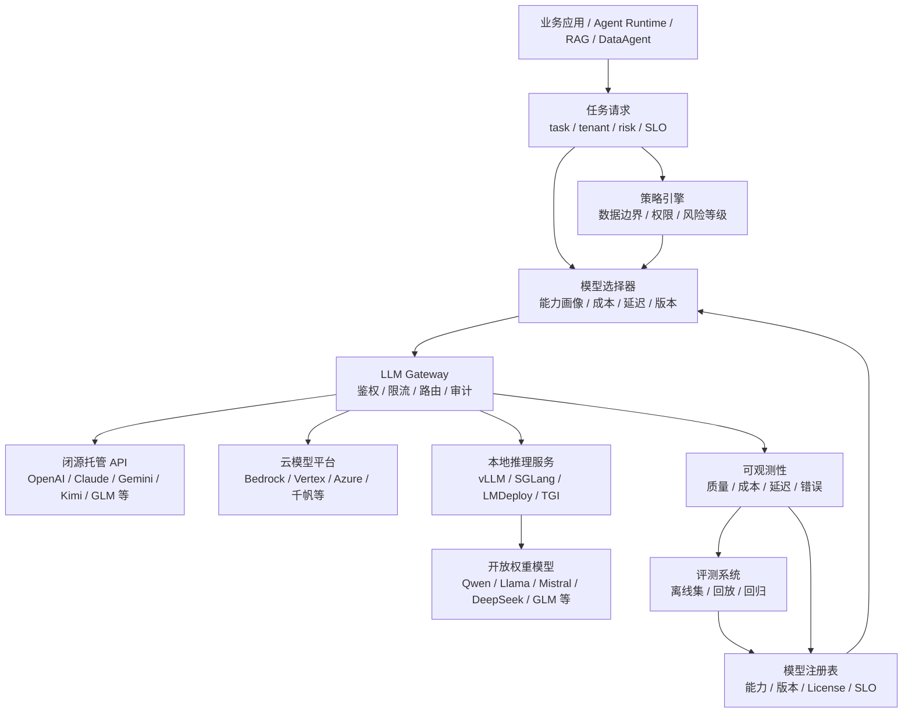
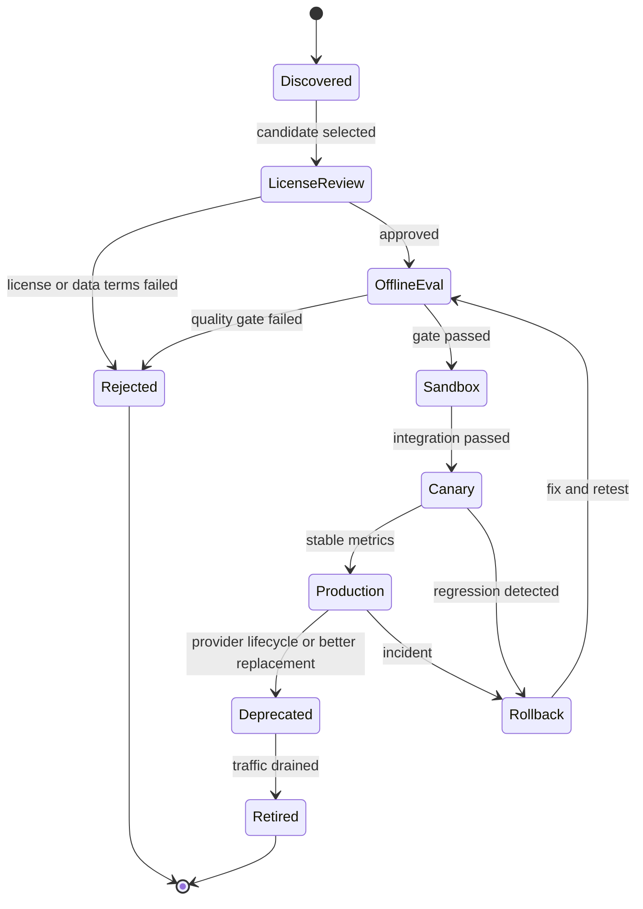
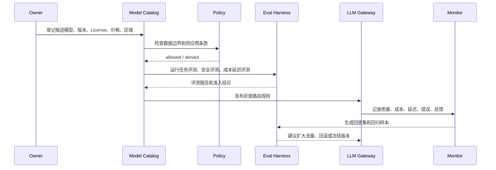
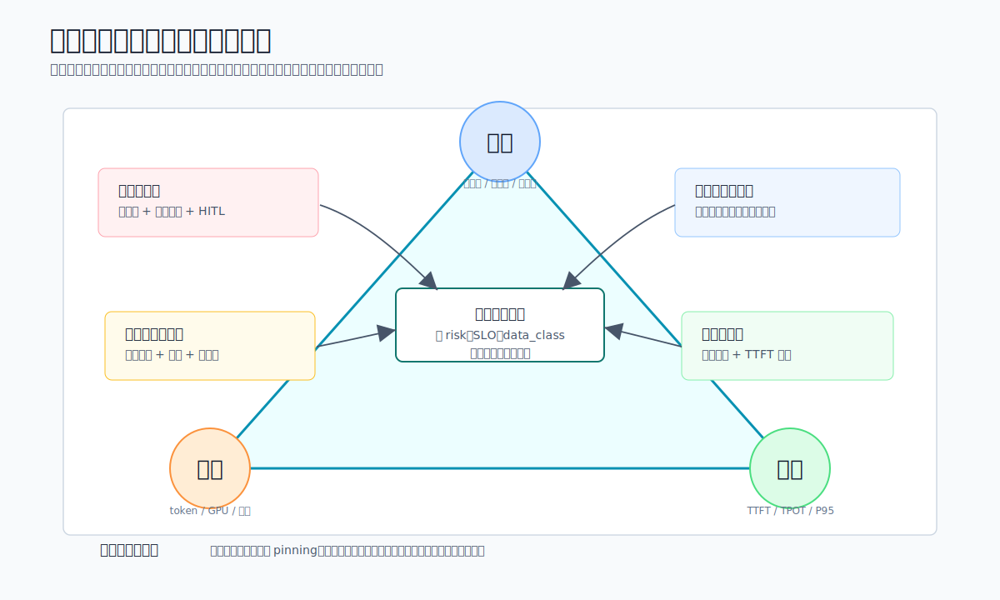

# Ch.05 大模型选型

> **本章目标**：读者学完能把企业业务需求拆成模型能力、数据边界、SLO、成本和治理约束，并能设计一个可评测、可路由、可回滚的模型矩阵。
> **关键议题**：闭源 / 开放权重 / 国产模型对比；能力维度；场景适配；模型矩阵；评测准入；模型版本治理
> **前置阅读**：Ch.01 Agent 的本质 / Ch.04 平台参考架构总览
> **估计阅读**：快速浏览 20 min / 架构决策 50 min / 含工程实现 90 min
> **mini-platform 关联**：`core/gateway/`、`core/eval/`、`core/policy/`、`core/observability/`
> **实战项目**：`projects/05-model-selection/`（规划中）
> **阅读路径**：业务负责人看选型原则与取舍；架构师看模型矩阵与治理闭环；工程师看路由契约、评测配置和上线清单。

---

## 1. 选型从业务任务开始

### 1.1 山岚集团为什么不能只选“最强模型”

山岚集团启动 Agent 平台时，最先遇到的问题不是“怎么写 Agent 循环”，而是“到底用哪个模型”。客服团队希望低成本处理每天数万条工单；财务团队希望 DataAgent 能生成可执行、可审计的 SQL；法务团队希望合同助手不要编造条款；研发团队希望代码助手能理解内部仓库；门店团队希望在网络不稳定时也能用离线助手查询 SOP。所有需求都叫“大模型能力”，但它们对模型的要求完全不同。

如果只按公开排行榜选一个模型，平台很快会撞到现实约束。

- 客服分类任务并不需要最贵的推理模型，但需要稳定 JSON、低延迟和极低单次成本。
- DataAgent 需要强推理、结构化输出、工具调用和 SQL 安全校验，不能只看对话体验。
- 合同审阅需要证据引用、拒答边界和人工确认，不能把“回答流畅”当作“结论可靠”。
- 内部代码助手需要长上下文、仓库检索、补丁生成和沙箱执行，普通聊天模型不一定合适。
- 门店离线助手更关心本地部署、轻量化、中文能力和数据不出现场。

因此，企业模型选型不是一次采购，也不是一句“我们统一用某某模型”。它是一套持续运行的工程机制：先定义任务画像，再选择候选模型，用企业自己的评测集验证，通过 LLM Gateway 路由到不同模型，最后持续监控质量、成本、延迟和版本生命周期。

山岚集团最终需要的不是“一个最佳模型”，而是一个模型矩阵。

| 业务场景 | 首要指标 | 模型倾向 | 兜底策略 |
|---|---|---|---|
| 客服工单分类 | JSON 合法率、成本、P95 延迟 | 低成本通用模型或轻量本地模型 | 置信度低时转人工或强模型复判 |
| DataAgent / NL2SQL | SQL 正确率、工具调用可靠性、权限安全 | 推理模型 + 结构化输出能力强的模型 | 执行前校验，失败时强模型修复或人工审核 |
| 合同审阅 | 证据引用、风险分级、拒答边界 | 高能力闭源模型或私有部署强模型 | 强制引用证据，关键结论进入 HITL |
| 内部知识问答 | RAG 事实一致性、长上下文、引用 | 通用模型 + RAG，必要时长上下文模型 | 无证据不回答，改走检索增强 |
| 代码助手 | 代码理解、补丁质量、工具调用 | 代码专用模型或强推理模型 | 沙箱测试、review gate、回滚 |
| 门店离线助手 | 数据本地性、部署成本、响应速度 | 小型开放权重模型、本地推理 | 网络恢复后同步日志和知识库 |


读图时先看三层关系：左侧是业务任务画像，中间是治理与选择层，右侧是可路由模型池。它承接上面的业务场景表，后续 2.1 会展开中间治理层如何在运行时工作。

这张表已经暴露出一个核心事实：模型选型必须从业务任务出发，而不是从模型品牌出发。不同模型供应商、不同部署形态、不同版本和不同推理参数，都应该被平台抽象成可治理的“模型能力资源”。

### 1.2 候选模型的分类轴与能力维度

企业讨论模型选型时，最容易把几个维度混在一起：闭源、开源、国产、自托管、云服务、推理模型、长上下文模型。它们并不是同一个分类轴。

| 概念 | 定义 | 选型时真正要问的问题 |
|---|---|---|
| 闭源托管模型 | 权重不开放，通过厂商 API 或云平台调用 | 数据能否出域，SLA 和价格是否可接受，版本是否稳定 |
| 开放权重模型 | 权重可下载或可在私有环境部署，License 各不相同 | License 是否允许商用，团队能否部署、调优和运维 |
| 国产模型 | 由中国团队或中国云服务提供的模型或平台 | 是否满足数据合规、中文场景、采购和本地服务要求 |
| 自托管模型 | 企业自己运行模型权重和推理服务 | 是否有 GPU、推理引擎、运维和安全隔离能力 |
| 云模型平台 | 通过 Bedrock、Vertex AI、Azure、千帆等平台访问多模型 | 是否需要统一 IAM、区域、账单、私网和模型生命周期管理 |
| 推理模型 | 更偏复杂推理、规划、代码和数学，通常延迟和成本更高 | 任务是否真的需要深推理，是否能接受更长响应时间 |
| 长上下文模型 | 支持大上下文窗口的模型 | 是不是应该先用 RAG、摘要和上下文压缩减少输入 |
| 多模态模型 | 能处理文本、图像、音频、视频等输入 | 业务输入是否真的包含多模态证据，输出如何校验 |

“国产模型”和“开放权重模型”尤其不能混为一谈。一个国产模型可能是闭源 API，也可能开放权重；一个开放权重模型也可能来自境外团队。企业真正需要的是把模型拆成多个属性：供应商、部署区域、License、权重可得性、数据边界、能力、成本、延迟、上下文长度、工具调用、结构化输出和生命周期。

模型选型至少要看八个维度。

| 维度 | 关键问题 | 典型度量 |
|---|---|---|
| 任务能力 | 模型是否能完成业务任务 | 任务成功率、SQL 正确率、分类准确率、代码测试通过率 |
| 输出可控性 | 是否能稳定返回 schema、工具参数或引用 | JSON 合法率、tool call 成功率、解析重试率 |
| 事实可靠性 | 是否基于证据回答，是否容易幻觉 | groundedness、引用命中率、无证据拒答率 |
| 延迟与吞吐 | 是否满足交互或批处理 SLO | TTFT、TPOT、P95/P99 延迟、tokens/s |
| 成本 | 单次任务和月度总成本是否可控 | input/output token 成本、缓存命中收益、GPU 利用率 |
| 数据边界 | 输入输出是否可进入该供应商或区域 | 数据分类、出域策略、日志留存、加密和审计 |
| 可运维性 | 是否能监控、限流、灰度和回滚 | 错误率、版本 pinning、健康检查、降级策略 |
| 生态兼容 | 是否支持现有 SDK、推理引擎和工具链 | OpenAI 兼容 API、vLLM/SGLang 支持、Tokenizer 一致性 |

这八个维度的权重由业务场景决定。客服摘要可以把成本和延迟放在前面，合同审阅要把证据和风险控制放在前面，DataAgent 要把结构化输出、工具调用和 SQL 校验放在前面。选型的第一步不是列模型，而是写清楚任务画像。

### 1.3 任务画像：把需求写成可评测约束

一个任务画像可以用下面的问题描述。

| 问题 | 示例答案 |
|---|---|
| 输入是什么 | 用户自然语言问题 + 表结构 + 权限上下文 |
| 输出给谁消费 | DataAgent Runtime 和前端图表 |
| 输出是否机器消费 | 是，必须返回查询计划和 SQL 草稿 |
| 失败成本多高 | 中高，错误 SQL 可能误导经营决策 |
| 是否包含敏感数据 | 是，包含销售、库存和会员聚合数据 |
| 延迟目标 | P95 30 秒内返回可解释结果 |
| 可否人工介入 | 可以，敏感查询必须确认 |
| 是否需要本地部署 | 生产数据默认不出内网，优先本地或专有云 |

只有写清楚这些约束，模型选型才会从“技术偏好”变成“工程决策”。

### 1.4 常见误区

**误区 1：把排行榜第一当生产首选。**

公开 benchmark 可以用于初筛，但不能替代企业评测。许多榜单关注通用知识、数学、代码或多模态能力，而山岚集团关心的是客服枚举、内部指标口径、SQL 执行成功、合同证据引用和安全拒答。榜单高分模型如果在企业 schema 上频繁输出非法 JSON，也不能直接上线。

**误区 2：认为“一个强模型”能覆盖所有任务。**

单一模型最容易管理，但成本和风险都不经济。低风险、高频任务用强模型会浪费预算；高风险任务用普通模型会放大错误。企业平台应让模型矩阵服务不同任务，并通过网关把复杂度挡在业务应用之外。

**误区 3：把开放权重等同于免费。**

开放权重减少了供应商锁定，也可能降低长期推理成本，但它带来 GPU、推理引擎、容量规划、模型安全、License 审查、量化评测和运维人力成本。自托管不是不用付钱，只是把 API 成本换成基础设施和平台工程成本。

**误区 4：把国产模型等同于合规完成。**

国产模型能降低部分采购、服务和数据出境压力，但合规仍取决于部署区域、日志留存、数据分类、合同条款、访问控制、审计和供应商安全承诺。模型国别不是合规的充分条件。

**误区 5：只看模型，不看版本生命周期。**

厂商会发布新模型、下线旧模型、调整上下文窗口、价格、速率限制和 API 参数。企业如果没有模型版本 pinning、灰度和回归评测，就会在一次供应商升级后发现 Agent 行为变了。模型选型必须包含生命周期治理。

---

## 2. 模型矩阵的运行时治理

### 2.1 平台位置与三种路由模式

模型选型能力位于业务应用和模型调用之间。它不是一个离线 Excel 表，而是 LLM Gateway、模型注册表、评测系统、策略引擎和可观测性共同组成的运行时决策层。



这条链路里，业务应用不应该直接写死 `model="某个厂商最新模型"`。应用只声明任务、租户、风险等级、延迟目标、输出格式和数据分类。模型选择器根据注册表和策略选择候选模型，LLM Gateway 负责实际调用、重试、审计和降级。

在山岚集团，模型选型层需要支持三种运行模式。

| 模式 | 说明 | 适用场景 |
|---|---|---|
| 显式模型 | 业务或评测任务指定某个模型版本 | 离线评测、回归测试、问题复现 |
| 策略路由 | 业务声明任务画像，由平台选择模型 | 生产默认模式 |
| 多模型仲裁 | 多个模型生成或复判，平台做投票/裁决 | 高风险合同审阅、SQL 修复、客服质检抽检 |

显式模型适合可复现，策略路由适合规模化，多模型仲裁适合高风险。平台必须同时支持三者，否则要么不可控，要么不经济。

### 2.2 模型目录、策略引擎与路由契约

一个生产级模型选型系统至少包含七个组件。

| 组件 | 职责 | 输入 | 输出 | 失败模式 |
|---|---|---|---|---|
| Model Catalog | 记录模型供应商、版本、能力、License、价格、区域 | 厂商文档、模型卡、内部测试 | 可查询模型清单 | 信息过期、License 漏审 |
| Capability Profiler | 用统一评测集刻画模型能力 | 候选模型、任务评测集 | 任务分数和能力标签 | 评测集偏差、测试污染 |
| Policy Engine | 判断数据边界、租户权限和风险等级 | tenant、data_class、region、risk | 允许模型集合 | 策略缺失、过度放行 |
| Model Selector | 在允许集合中按质量、成本、延迟选择 | 任务画像、模型画像、SLO | primary / fallback / guard model | 路由规则冲突 |
| Provider Adapter | 统一不同厂商和推理引擎 API | 标准请求 | 标准响应 / 流式事件 | 参数不兼容、错误码不统一 |
| Release Controller | 管理灰度、回滚、弃用和版本冻结 | 评测报告、发布策略 | 路由版本规则 | 新旧版本行为漂移 |
| Cost & Quality Monitor | 记录线上质量、成本、延迟和错误 | trace、usage、feedback | 报表、告警、回放集 | 日志缺字段、PII 泄漏 |

模型目录不应该只是模型名称列表。它至少要记录这些字段。

```yaml
model_id: local-qwen3-32b-instruct
display_name: Qwen3 32B Instruct Local
provider: internal
deployment: self_hosted
endpoint: http://llm-gateway.internal/v1/chat/completions
api_style: openai_compatible
weight_access: open_weight
license_review: approved
data_boundary:
  allowed_data_classes:
    - public
    - internal
    - confidential_aggregate
  region: cn-private
capabilities:
  text: true
  vision: false
  tool_calling: true
  structured_output: true
  reasoning: medium
  code: medium
limits:
  context_tokens: 32768
  max_output_tokens: 4096
slo:
  p95_latency_ms: 12000
  monthly_budget_usd: 5000
eval:
  customer_service_json_validity: 0.985
  dataagent_sql_exec_success: 0.78
  safety_refusal_accuracy: 0.93
release:
  status: production
  pinned_version: "2026-06-01"
  fallback_model: frontier-reasoner
```

业务侧请求也要避免直接表达厂商细节。下面是一个任务级模型选择请求。

```json
{
  "task": "dataagent_sql_planning",
  "tenant": "retail-analytics",
  "risk_level": "high",
  "data_class": "confidential_aggregate",
  "slo": {
    "p95_latency_ms": 30000,
    "max_cost_usd": 0.30
  },
  "required_capabilities": {
    "structured_output": true,
    "tool_calling": true,
    "reasoning": "high"
  },
  "response_contract": {
    "type": "json_schema",
    "schema_id": "dataagent_query_plan",
    "schema_version": "1.2.0"
  }
}
```

模型选择器返回的不是一个裸模型名，而是一组路由决策。

```json
{
  "primary": {
    "model_id": "frontier-reasoner-private",
    "reason": "passed data boundary; highest sql planning score within SLO"
  },
  "fallbacks": [
    {
      "model_id": "local-qwen3-32b-instruct",
      "when": "provider_timeout_or_budget_exceeded"
    }
  ],
  "guards": {
    "pre_check": "pii_redaction_v2",
    "post_check": "sql_policy_validator_v3"
  },
  "release_policy": {
    "pinned": true,
    "canary_percent": 10
  }
}
```

这个契约的重点是把模型选择变成可审计决策：为什么选它，什么时候降级，哪些数据允许进入，输出经过哪些校验，都应该留在 trace 中。

### 2.3 生命周期、灰度与失败恢复

模型从候选到生产，应该走一个明确的生命周期。



上线前的时序可以这样理解。



运行时的失败模式和恢复策略如下。

| 失败模式 | 典型信号 | 恢复策略 |
|---|---|---|
| 供应商 API 故障 | 5xx、超时、区域不可用 | 网关切换 fallback，记录事件，触发供应商告警 |
| 模型版本漂移 | 同样 prompt 输出行为变化 | 使用 pinned version，升级前跑回归评测 |
| 价格或限流变化 | 单次成本上升、429 增多 | 调整路由权重、启用缓存、迁移低风险任务 |
| 结构化输出退化 | JSON 解析失败率升高 | 降级到更稳模型，或打开约束解码 / 重试 |
| 数据边界误配 | 敏感字段进入不允许供应商 | Policy 前置拦截，审计事件，回放修复路由规则 |
| 长上下文拖垮 SLO | TTFT 和成本突增 | 上下文压缩、RAG 重排、限制输入 token |
| 自托管容量不足 | 队列长度、GPU 显存、P99 延迟上升 | 限流、批处理、扩容、切云端备用模型 |
| 模型质量回退 | 用户反馈、抽检准确率下降 | 冻结流量，回滚版本，补充评测集 |

这张表说明，模型选型不是“选完就结束”。生产中真正重要的是能否发现模型行为变差、能否解释为什么路由到了某个模型、能否在事故发生时快速回滚。

## 3. 关键取舍：把模型选择变成治理策略

### 3.1 闭源托管、开放权重与专有云

| 方案 | 优势 | 代价 | 适用场景 | mini-platform 选择 |
|---|---|---|---|---|
| 闭源托管模型 | 能力强、接入快、无需运维推理集群 | 数据边界、成本、版本和供应商锁定风险 | 高价值低频、复杂推理、多模态、早期验证 | 作为强能力和兜底候选 |
| 开放权重自托管 | 数据可控、可调优、长期成本可优化 | GPU、推理、量化、监控和 License 审查成本 | 高频内部任务、敏感数据、稳定负载 | 作为平台长期核心 |
| 专有云 / 私有化托管 | 兼顾能力和数据边界 | 商务和部署周期长，价格不一定低 | 金融、政企、核心数据场景 | 作为高合规选项 |

合理路径通常是：早期用托管模型快速验证业务价值；中期把高频、稳定、敏感任务迁到开放权重或专有云；长期保留少量强闭源模型处理高难任务和兜底。

### 3.2 国产模型与全球模型

| 方案 | 优势 | 代价 | 适用场景 | mini-platform 选择 |
|---|---|---|---|---|
| 国产托管模型 | 中文、服务、采购、数据驻留和本地生态更友好 | 国际化和部分前沿能力需实测 | 国内业务、中文客服、政企合规 | 默认候选池之一 |
| 全球托管模型 | 前沿能力、工具生态和多模态能力更新快 | 数据出境、采购和网络可用性限制 | 低敏数据、全球业务、复杂推理 | 受 Policy 控制使用 |
| 国产开放权重 | 可本地部署，中文和国内生态适配好 | 运维和调优成本由企业承担 | 内网知识问答、DataAgent、边缘节点 | 推荐重点评估 |

国产不是单独的技术等级，而是供应链、合规、服务和生态维度。企业应把国产模型和全球模型同时纳入评测，用数据边界决定可用范围，用业务评测决定流量比例。

### 3.3 单一强模型与模型矩阵

| 方案 | 优势 | 代价 | 适用场景 | mini-platform 选择 |
|---|---|---|---|---|
| 单一强模型 | 接入简单、行为一致、排障容易 | 成本高，无法按任务优化，供应商风险集中 | 原型期、任务少 | 只用于起步 |
| 双模型策略 | 一个通用模型 + 一个强兜底模型 | 路由规则较简单，成本可控 | 早期生产 | 推荐 v0.1 起步 |
| 模型矩阵 | 按任务、风险、租户、成本选择模型 | 需要注册表、评测、网关和监控 | 多业务、多租户、规模化平台 | 目标形态 |

山岚集团不应该第一天就维护几十个模型。比较稳的路线是：先建立双模型策略，等评测和网关成熟后，再扩展到客服、DataAgent、代码、合同、多模态、本地离线等模型池。

### 3.4 长上下文模型与 RAG / 上下文工程

| 方案 | 优势 | 代价 | 适用场景 | mini-platform 选择 |
|---|---|---|---|---|
| 直接长上下文 | 接入简单，减少检索工程 | 成本高、TTFT 长、无关信息增加幻觉 | 临时文档分析、单文档审阅 | 谨慎使用 |
| RAG + 重排 | 可控、可引用、更新快 | 检索链路复杂，需要评测 | 知识库、政策、手册、指标口径 | 默认 |
| 摘要 / 压缩上下文 | 降低 token 和延迟 | 可能丢失细节 | 多轮对话、长 trace、批量文档 | 与 RAG 组合 |

长上下文能力很有价值，但不应成为“把所有材料塞进 prompt”的理由。需要引用、权限过滤和知识更新的场景，RAG 仍然是默认工程路径。

### 3.5 质量、成本、延迟的三角关系

| 优先目标 | 策略 | 风险 |
|---|---|---|
| 最高质量 | 使用强模型、多模型复判、更多上下文 | 成本高、延迟高，不适合高频任务 |
| 最低成本 | 使用轻量模型、缓存、批处理、本地推理 | 质量和泛化能力可能不足 |
| 最低延迟 | 使用小模型、短上下文、流式输出、区域就近 | 复杂推理能力受限 |
| 平衡策略 | 按任务分级路由，失败时升级模型 | 需要完善的评测和网关治理 |

企业平台不可能在所有任务上同时追求最高质量、最低成本和最低延迟。模型选型的工作，就是把这个三角关系显式化，并把决策固化到路由策略中。



这张图不是要给出唯一最优点，而是提醒读者把不同任务放进不同策略区间：高风险任务优先质量，高频低风险任务优先成本，交互式任务优先 TTFT 和 P95，再由网关固化路由与回退路径。

---

## 4. mini-platform 落地路径

### 4.1 实现边界

当前 mini-platform 还处在 v0.1 骨架阶段，模型选型应先落在网关、评测、策略和观测四个边界上，而不是直接实现一个复杂模型平台。

| 能力 | 当前或建议路径 | 职责 |
|---|---|---|
| 模型路由 | `mini-platform/core/gateway/` | 统一模型调用接口、选择 primary/fallback、封装供应商差异 |
| 任务评测 | `mini-platform/core/eval/` | 保存评测集、运行离线评测、产出准入门槛 |
| 数据策略 | `mini-platform/core/policy/` | 判断租户、数据分类、区域和供应商是否匹配 |
| 安全护栏 | `mini-platform/core/guardrails/` | 输入脱敏、输出检查、敏感任务拦截 |
| 可观测性 | `mini-platform/core/observability/` | 记录 trace、usage、latency、cost、quality feedback |
| RAG 场景 | `mini-platform/core/rag/` | 知识任务默认通过检索而不是盲目长上下文 |
| 实战项目 | `mini-platform/projects/05-model-selection/` | 演示模型矩阵配置、评测和路由 |

后续可以增加以下文件，但本章不要求现在实现。

| 建议文件 | 作用 |
|---|---|
| `mini-platform/core/gateway/model_catalog.py` | 定义模型画像、版本、能力和成本 |
| `mini-platform/core/gateway/model_selector.py` | 根据任务画像选择模型 |
| `mini-platform/core/gateway/provider_adapter.py` | 统一 OpenAI 兼容、Anthropic 风格、本地推理接口 |
| `mini-platform/core/eval/model_selection_eval.py` | 运行模型准入评测 |
| `mini-platform/core/policy/model_policy.py` | 判断数据边界和模型可用性 |

### 4.2 模型选择器与配置示例

下面示例展示一个极简模型选择器。它不是完整生产实现，但表达了 mini-platform 应有的工程边界：任务画像、模型画像、策略过滤和按分数选择。

```python
# 来源建议：mini-platform/core/gateway/model_selector.py
from __future__ import annotations

from dataclasses import dataclass, field


@dataclass(frozen=True)
class TaskProfile:
    task: str
    tenant: str
    data_class: str
    risk_level: str
    max_latency_ms: int
    max_cost_usd: float
    required_capabilities: set[str] = field(default_factory=set)


@dataclass(frozen=True)
class ModelProfile:
    model_id: str
    provider: str
    deployment: str
    allowed_data_classes: set[str]
    capabilities: set[str]
    p95_latency_ms: int
    cost_per_1k_output_tokens: float
    eval_scores: dict[str, float]
    status: str = "production"


@dataclass(frozen=True)
class ModelRoute:
    primary: str
    fallback: str | None
    reason: str


class ModelSelector:
    def __init__(self, models: list[ModelProfile]) -> None:
        self._models = models

    def select(self, task: TaskProfile) -> ModelRoute:
        candidates = [
            model
            for model in self._models
            if model.status == "production"
            and task.data_class in model.allowed_data_classes
            and task.required_capabilities <= model.capabilities
            and model.p95_latency_ms <= task.max_latency_ms
            and model.cost_per_1k_output_tokens <= task.max_cost_usd
        ]

        if not candidates:
            raise ValueError(f"no model satisfies policy for task={task.task}")

        ranked = sorted(
            candidates,
            key=lambda model: (
                model.eval_scores.get(task.task, 0.0),
                -model.cost_per_1k_output_tokens,
                -model.p95_latency_ms,
            ),
            reverse=True,
        )

        primary = ranked[0]
        fallback = ranked[1].model_id if len(ranked) > 1 else None
        return ModelRoute(
            primary=primary.model_id,
            fallback=fallback,
            reason=(
                f"selected by task score for {task.task}; "
                f"provider={primary.provider}; deployment={primary.deployment}"
            ),
        )
```

配套配置可以从 YAML 开始，后续再进入数据库或配置中心。

```yaml
models:
  - model_id: frontier-reasoner-private
    provider: commercial-api
    deployment: managed_private
    allowed_data_classes: [public, internal, confidential_aggregate]
    capabilities: [text, reasoning_high, tool_calling, structured_output]
    p95_latency_ms: 25000
    cost_per_1k_output_tokens: 0.08
    eval_scores:
      dataagent_sql_planning: 0.86
      contract_risk_review: 0.90
      customer_service_classification: 0.93

  - model_id: local-qwen3-32b-instruct
    provider: internal
    deployment: self_hosted
    allowed_data_classes: [public, internal, confidential_aggregate, confidential_raw]
    capabilities: [text, reasoning_medium, tool_calling, structured_output]
    p95_latency_ms: 12000
    cost_per_1k_output_tokens: 0.01
    eval_scores:
      dataagent_sql_planning: 0.78
      contract_risk_review: 0.74
      customer_service_classification: 0.91

  - model_id: fast-classifier
    provider: internal
    deployment: self_hosted
    allowed_data_classes: [public, internal]
    capabilities: [text, structured_output]
    p95_latency_ms: 1500
    cost_per_1k_output_tokens: 0.002
    eval_scores:
      customer_service_classification: 0.88

routes:
  customer_service_classification:
    primary: fast-classifier
    fallback: local-qwen3-32b-instruct
    escalation:
      low_confidence: frontier-reasoner-private

  dataagent_sql_planning:
    primary: frontier-reasoner-private
    fallback: local-qwen3-32b-instruct
    guards:
      - pii_redaction_v2
      - sql_policy_validator_v3
```

模型评测配置也要版本化。不要把“模型能用”写在人的记忆里。

```yaml
eval_suite: model_selection_gate_v1
datasets:
  - name: customer_service_classification
    path: datasets/eval/customer_service_classification.jsonl
    metrics:
      json_validity_min: 0.98
      category_accuracy_min: 0.88
      p95_latency_ms_max: 3000
  - name: dataagent_sql_planning
    path: datasets/eval/dataagent_sql_planning.jsonl
    metrics:
      schema_validity_min: 0.97
      sql_exec_success_min: 0.75
      forbidden_table_access_max: 0
  - name: safety_regression
    path: datasets/eval/safety_regression.jsonl
    metrics:
      refusal_accuracy_min: 0.95
      sensitive_leakage_max: 0
release_gate:
  require_license_approval: true
  require_cost_owner: true
  require_rollback_model: true
```

这个配置的核心价值是让模型替换可复现。未来换成 OpenAI、Claude、Gemini、Qwen、DeepSeek、Kimi、GLM、ERNIE、Llama、Mistral 或本地量化模型时，业务应用不需要改代码，只需要模型目录、评测报告和路由策略发生变化。

### 4.3 生产化清单

- [ ] **权限**：每个模型声明可处理的数据分类、租户范围、区域和供应商边界。
- [ ] **审计**：每次路由记录任务、模型版本、prompt 模板、schema、数据分类和 fallback 原因。
- [ ] **成本**：按租户、任务、模型和项目统计 token、缓存命中、GPU 成本和月度预算。
- [ ] **性能**：监控 TTFT、TPOT、P50/P95/P99、队列长度、429、超时和重试。
- [ ] **稳定性**：所有生产路由都有 fallback、超时、熔断、灰度和回滚策略。
- [ ] **质量**：上线前通过企业评测集，线上抽样进入回放和回归评测。
- [ ] **结构化输出**：机器消费场景必须有 schema validate、业务 validate 和重试上限。
- [ ] **数据安全**：敏感字段在网关前脱敏或阻断，日志留存策略区分调试与审计。
- [ ] **License**：开放权重模型必须完成商用、再分发、训练数据和模型输出条款审查。
- [ ] **灾难恢复**：供应商不可用、本地 GPU 故障、模型下线时有替代路径和通知机制。

### 4.4 踩坑记录

**坑 1：只用一批短 prompt 选模型。**

短 prompt 测出来的延迟和质量经常过于乐观。RAG、DataAgent 和合同审阅的真实输入可能包含数千到数万 Token，还会带工具 schema、历史 trace 和引用片段。选型评测必须覆盖短请求、长上下文、高并发、结构化输出和失败重试。

**坑 2：没有区分“模型失败”和“系统失败”。**

SQL 错误不一定是模型差，也可能是表结构上下文缺失、语义层口径不清、工具返回错误或权限策略拦截。模型选型评测要保存完整 trace，否则团队会错误地更换模型，却没有修复真正的系统问题。

**坑 3：把供应商 alias 当稳定版本。**

有些模型名是固定快照，有些是会指向新版本的别名。生产系统如果只写 alias，供应商升级后行为可能变化。关键任务应使用明确版本或内部 pinned alias，并在升级前跑回归评测。

**坑 4：低成本模型没有设置升级路径。**

客服分类用低成本模型是合理的，但低置信度、解析失败、投诉升级、VIP 客户、监管关键词等样本必须升级到强模型或人工。没有升级路径的低成本路由，会把少量高风险样本悄悄处理错。

**坑 5：自托管模型没有算运维成本。**

GPU 空闲、峰值扩容、模型加载、驱动升级、推理引擎兼容、日志审计和安全补丁都会消耗团队时间。只有当负载稳定、数据边界重要、平台团队具备推理运维能力时，自托管的长期收益才会兑现。

---

## 5. 本章小结

### 关键结论

- 企业模型选型的对象不是“某个最强模型”，而是任务画像、模型画像、数据边界、SLO、成本和生命周期共同组成的决策系统。
- 闭源、开放权重、国产、自托管和云模型平台是不同分类轴，必须拆开评估；国产不自动等于合规，开放权重也不自动等于低成本。
- 生产级 Agent 平台应通过模型注册表、评测准入、策略路由、fallback、可观测性和版本治理维护模型矩阵。

### 上线检查清单

- [ ] 任务画像是否写清楚输入、输出、失败成本、数据分类、SLO 和人工介入策略？
- [ ] 候选模型是否经过 License、数据边界、供应商条款和安全审查？
- [ ] 是否用企业评测集验证任务质量、结构化输出、事实一致性、延迟和成本？
- [ ] 业务应用是否只调用网关，而不是直连某个供应商或本地推理引擎？
- [ ] 每条生产路由是否有 pinned version、fallback、灰度、回滚和监控？
- [ ] 模型升级、弃用、价格变化和供应商故障是否有应急预案？

### 延伸阅读

模型版本和价格变化很快。以下链接是本章写作时使用的官方资料入口，生产选型必须以实时官方文档、合同条款和企业内部评测为准。

- [OpenAI Models](https://platform.openai.com/docs/models)
- [Anthropic Claude Models](https://docs.anthropic.com/en/docs/about-claude/models)
- [Google Gemini Models](https://ai.google.dev/gemini-api/docs/models)
- [Amazon Bedrock Model Availability and Compatibility](https://docs.aws.amazon.com/bedrock/latest/userguide/models.html)
- [Qwen Documentation](https://qwen.readthedocs.io/)
- [DeepSeek API Documentation](https://api-docs.deepseek.com/)
- [Mistral Model Selection Guide](https://docs.mistral.ai/models/model-selection-guide)
- [Meta Llama](https://llama.meta.com/)
- [Kimi API Documentation](https://platform.moonshot.cn/docs/guide/start-using-kimi-api)
- [智谱 AI 开放文档](https://docs.bigmodel.cn/cn/guide/start/introduction)
- [百度千帆模型列表](https://intl.cloud.baidu.com/en/doc/qianfan/s/7m95lyy43-intl-en)
