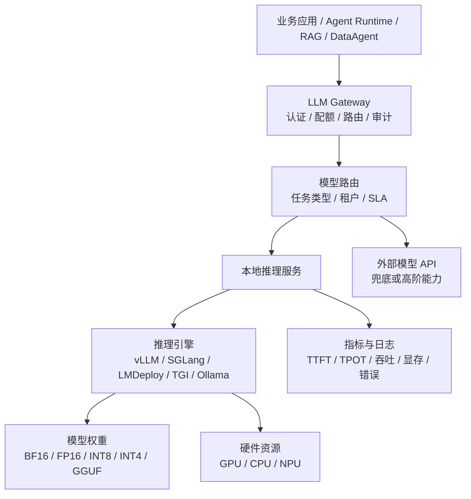
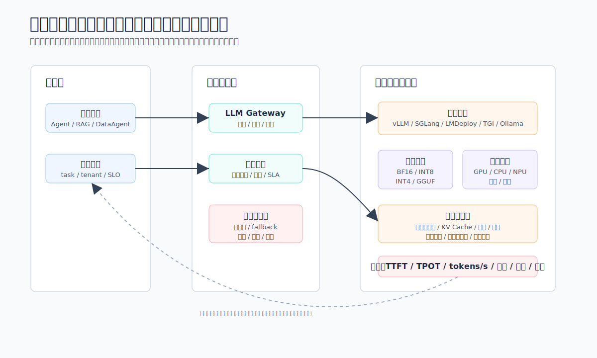
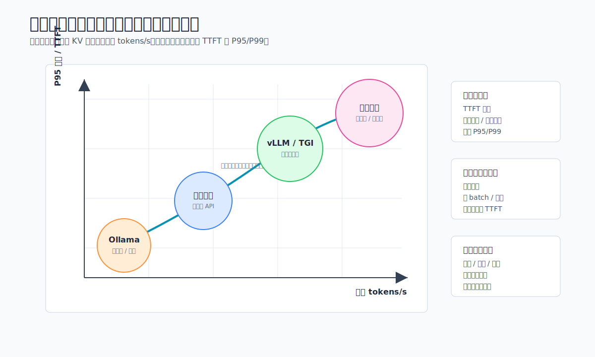
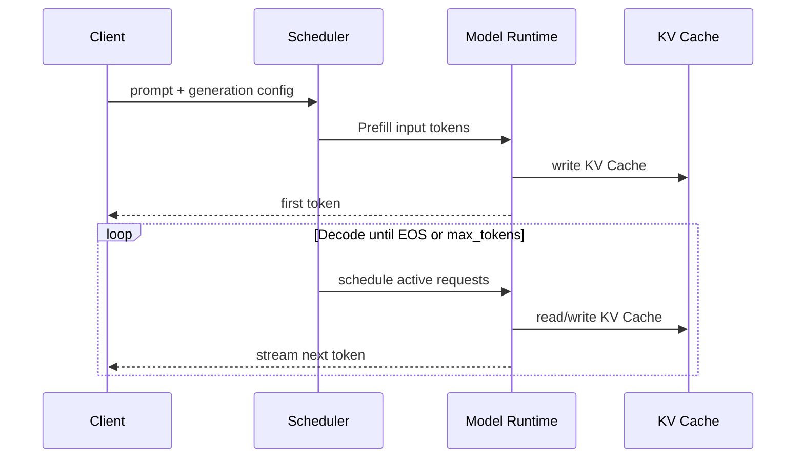

# Ch.06 本地推理引擎吞吐与延迟取舍分析

> **本章目标**：读者学完能解释本地推理引擎中吞吐与延迟的核心取舍，并能在 vLLM、SGLang、LMDeploy、TGI、Ollama 之间做出符合业务负载的选型。
> **关键议题**：吞吐、延迟、TTFT、TPOT、KV Cache、连续批处理、PagedAttention、张量并行、量化、推测解码、OpenAI 兼容接口
> **前置阅读**：Ch.05 大模型选型
> **建议衔接**：Ch.07 推理优化技术 / Ch.08 结构化输出与提示工程
> **估计阅读**：快速浏览 20 min / 引擎选型 45 min / 含工程细节 90 min
> **mini-platform 关联**：`core/gateway/`
> **实战项目**：`projects/06-local-inference/`（规划中）

---

## 1. 本地推理服务的边界

企业讨论“本地推理”时，真正要决策的不是“模型放云上还是放机房”这么简单，而是推理能力是否进入了自己的平台边界：模型权重、推理服务、调用协议、配额、日志、成本核算、灰度发布和故障兜底是否都能被企业控制。山岚集团如果把客服知识库、生产质检 SOP、财务指标口径和内部代码库都交给外部模型接口处理，就会在数据出域、审计、延迟和成本预测上遇到阻力；但如果只是把一个开源模型下载到 GPU 服务器上，用临时脚本启动，也无法支撑多业务、多租户和 Agent 长任务。

本地推理引擎位于模型权重和业务应用之间。它把模型文件、GPU/CPU/NPU 资源、请求调度、Token 流式生成、缓存、量化、并行和服务 API 封装成一个可运营的服务。对企业 Agent 平台来说，它通常不直接暴露给最终业务系统，而是被 LLM Gateway、Agent Runtime、RAG 服务和 DataAgent 通过统一协议调用。





读图时重点看职责分界：业务请求止步于 LLM Gateway 和模型路由，本地推理引擎只作为受治理的服务池。这样后续替换 vLLM、SGLang、LMDeploy、TGI 或 Ollama 时，上层业务契约不需要变化。

这条链路里，应用侧应该只关心“我要哪个能力、最大延迟是多少、能接受什么质量”，而不应该知道某个模型是跑在 vLLM、SGLang、LMDeploy、TGI 还是 Ollama 上。平台侧则要把本地推理服务变成一组可治理的资源池：哪些模型能服务哪些租户，哪些请求可以排队，哪些请求必须降级，哪些模型允许返回结构化输出，哪些请求需要进入审计日志。

## 2. 吞吐与延迟如何决定部署形态

本地推理服务可以按运行边界分成五种基本形态。它们不是成熟度从低到高的单线演进，而是面向不同负载和组织阶段的选择。

| 形态 | 典型工具 | 服务边界 | 优势 | 主要限制 | 适用场景 |
|---|---|---|---|---|---|
| 单机交互式运行 | Ollama | 本机进程或桌面应用 | 上手快、便于试模型、依赖少 | 缺少多租户治理和生产调度 | 个人验证、提示词实验、模型初筛 |
| 单机 HTTP 服务 | Ollama API、LMDeploy 单机服务 | 一台机器暴露 REST 或 OpenAI 兼容接口 | 便于接入应用，成本低 | 并发和高可用能力有限 | 小团队内部工具、边缘节点、离线场景 |
| GPU 多卡服务 | vLLM、SGLang、LMDeploy、TGI | 单节点多 GPU 或多副本服务 | 吞吐高，支持连续批处理和张量并行 | 需要显存规划、调度和监控 | 企业内部门户、客服、知识问答 |
| 分布式推理集群 | vLLM、SGLang、TGI | 多节点 GPU 集群 | 支持大模型、多租户和高并发 | 运维复杂，网络与调度影响明显 | 平台级模型服务、核心业务 Agent |
| 边缘或轻量本地推理 | Ollama | 门店终端、开发机、私有小节点 | 数据不出现场，网络依赖低 | 模型规模、上下文长度和并发能力受限 | 门店助手、低带宽场景、离线原型 |

第一种形态适合“把模型跑起来”，不适合“把模型管起来”。Ollama 降低了模型下载、量化权重运行和本地聊天的门槛，适合工程师快速比较 Qwen、Llama、Mistral、Gemma 等模型在企业语料上的表现。此时平台团队关注的是模型质量、提示词格式、上下文长度和基本速度，而不是高并发。

第二种形态开始形成服务边界。许多工具都能暴露 OpenAI 兼容接口，应用代码可以把 `base_url` 指向企业内网地址，从而复用现有 SDK、Agent 框架和评测脚本。这一步的价值很大：模型服务从“某台机器上的命令行”变成了“可被网关代理的 API”。但它仍然不能替代平台，因为鉴权、限流、审计、灰度、熔断、预算和数据脱敏通常还不在引擎内部完成。

第三种形态是企业最常见的生产起点。一个 7B、14B 或 32B 级别模型可以部署在单节点多卡服务器上，通过连续批处理提高吞吐，通过张量并行放下更大的模型，通过流式输出降低用户感知延迟。山岚集团的内部知识助手如果日常并发在几十到几百之间，通常先从这一形态开始：一个模型服务池承接普通问答，另一个模型服务池承接代码或数据分析任务，中间由 LLM Gateway 做路由。

第四种形态解决平台规模问题。模型更大、上下文更长、租户更多之后，单机多卡会遇到显存、队列和故障隔离上限。此时要把模型副本、GPU 池、请求队列、滚动升级和跨节点通信纳入 Kubernetes、Ray、Triton 或厂商云原生调度体系。难点不只是“更多 GPU”，而是尾延迟控制：一次长上下文请求可能占用大量 KV Cache，使其它短请求排队。平台必须把请求长度、最大输出 Token、租户优先级和模型副本健康状态纳入路由。

第五种形态服务的是数据边界。制造、门店、金融风控和医疗场景经常要求数据在现场或专用网络内处理。边缘推理通常使用更小模型、更低 bit 量化和更短上下文，牺牲一部分通用能力换取低网络依赖和更强隐私控制。它不适合替代总部模型平台，但适合承接固定流程：设备故障解释、门店 SOP 问答、离线工单摘要、现场质检描述等。

本地推理服务上线前，至少要定义五个接口边界。

| 边界 | 必须回答的问题 | 平台侧要求 |
|---|---|---|
| 模型边界 | 哪些模型、版本和量化格式允许上线 | 模型卡、License、评测结果和发布记录可追溯 |
| 请求边界 | 最大上下文、最大输出、是否允许工具调用 | 网关强制校验，避免业务绕过引擎限制 |
| 租户边界 | 谁可以调用哪个模型，额度是多少 | 认证、授权、限流、预算和审计分离 |
| 性能边界 | TTFT、TPOT、吞吐、并发和超时阈值 | 指标进入 SLO，异常可定位到模型或引擎 |
| 数据边界 | 输入输出是否包含敏感信息 | 脱敏、日志采样、留存周期和出域策略明确 |

其中 TTFT（Time To First Token）和 TPOT（Time Per Output Token）是推理服务最重要的两个延迟指标。TTFT 主要受排队、Prefill、上下文长度和调度影响；TPOT 主要受 Decode 阶段、并发批大小、显存带宽和采样策略影响。企业不要只看“每秒多少 Token”，还要看 P95/P99 TTFT 是否稳定。对客服和办公助手来说，用户往往能接受总生成时间稍长，但不能接受首 Token 长时间无响应；对离线摘要和批量标注来说，吞吐和成本比交互延迟更重要。



这张图用于表达部署形态的相对位置，不是某个引擎的精确 benchmark。读者应关注右侧三类策略：交互负载守 TTFT，后台任务追吞吐，平台层补齐限流、熔断、请求长度治理和成本核算。

## 3. 调度、缓存与约束：引擎能力的共同底座

大模型推理的核心成本来自两个阶段：Prefill 和 Decode。Prefill 阶段把输入上下文一次性送入模型，计算所有输入 Token 的注意力并写入 KV Cache；Decode 阶段每次生成一个或一小批新 Token，并在每一步读取历史 KV Cache。输入越长，Prefill 越重；输出越长，Decode 越重；并发越高，KV Cache 对显存的压力越大。



推理优化的本质，是在不明显牺牲回答质量的前提下，减少显存占用、提高 GPU 利用率、降低排队时间或减少每个 Token 的计算量。常见机制如下。

| 优化机制 | 解决的问题 | 基本思路 | 主要风险 |
|---|---|---|---|
| 连续批处理 | 固定 batch 等齐导致 GPU 空转 | 每个 Decode step 动态加入新请求、移除完成请求 | 高并发下尾延迟和公平性需要调度策略 |
| KV Cache 管理 | 长上下文和并发请求占满显存 | 复用、分页、压缩或卸载历史 Key/Value | 实现复杂，可能引入碎片或精度损失 |
| PagedAttention | KV Cache 预分配和碎片浪费 | 像虚拟内存一样按 block 管理 KV Cache | 依赖引擎内核实现，跨后端能力不同 |
| Prefix Caching | 多请求共享相同系统提示词或长前缀 | 复用已计算的前缀 KV Cache | 前缀命中率低时收益有限 |
| 张量并行 | 单卡放不下模型或吞吐不足 | 将矩阵计算切到多 GPU 并行 | 通信开销增加，跨节点更敏感 |
| 量化 | 权重和 KV Cache 占用过高 | FP16/BF16 降到 FP8、INT8、INT4 等 | 可能影响质量，校准和模型适配成本高 |
| FlashAttention / 高效注意力内核 | 注意力计算访存开销大 | 优化 GPU kernel 和显存访问模式 | 受硬件、驱动、模型结构影响 |
| 推测解码 | Decode 一步一 Token 太慢 | 小模型先草拟多个 Token，大模型验证 | 草拟命中率低时收益下降 |
| 结构化输出约束 | JSON/函数调用容易格式错误 | 用有限状态机、正则或 grammar 限制解码 | 约束过强会影响自然语言质量 |

**连续批处理**是生产推理服务的基础优化。传统批处理会等一组请求凑齐再一起执行，某个请求生成完成后，其余请求仍要继续等待同一批结束；连续批处理则在每个 Decode step 重新调度活跃请求，完成的请求立即释放位置，新请求可以插入进来。这样可以显著提高 GPU 利用率，尤其适合请求长度差异很大的在线服务。代价是调度器变成核心组件：如果只追求吞吐，长请求可能挤占短请求；如果只追求短请求延迟，吞吐会下降。

**KV Cache**是大模型推理绕不开的内存问题。Transformer 自回归生成时，每一步都需要访问历史 Token 的 Key 和 Value。缓存这些中间结果可以避免重复计算，但会随着上下文长度、层数、头数和并发请求线性增长。以企业知识问答为例，一段包含政策、表格和引用的长上下文可能让单个请求占用大量显存；如果同时来几十个长请求，模型权重本身还没满，KV Cache 已经成为瓶颈。

**PagedAttention**和分页式 KV 管理的价值就在这里。vLLM 论文提出将 KV Cache 按 block 管理，减少内存碎片，并允许请求之间共享缓存块。这个思想影响了后续大量推理引擎。对平台工程师来说，不必把它理解成单个产品功能，而应理解成一类设计：不要按最大上下文为每个请求一次性预留连续显存，而要把可变长序列映射到更灵活的内存块。这样可以提高并发容量，但也要求引擎、注意力 kernel 和调度器紧密配合。

**Prefix Caching**适合企业 Agent 平台。许多 Agent 请求共享相同的系统提示词、工具说明、安全规则和企业背景资料。如果这些前缀每次都重新 Prefill，会浪费大量计算。前缀缓存可以把相同前缀的 KV Cache 复用起来，让后续请求只计算新增部分。它的收益取决于 prompt 规范化：同一段系统提示词里如果混入时间戳、随机 trace id 或不稳定字段，缓存命中率会明显下降。平台应把动态字段放在后缀，把稳定规则放在前缀。

**量化**解决的是显存和带宽。权重量化把模型参数从 BF16/FP16 压到 INT8、INT4、FP8 等格式，能让更大的模型放进有限显存，也能减少内存带宽压力。KV Cache 量化则进一步降低长上下文并发时的显存占用。风险是模型质量可能下降，尤其在数学、代码、长上下文检索和结构化输出场景中更明显。企业上线量化模型前，不能只看通用榜单，要用自己的评测集验证：客服工单、财务口径、SQL 生成、工具调用和安全拒答都要覆盖。

**张量并行和流水并行**用于大模型多卡部署。张量并行把同一层的大矩阵计算切分到多张 GPU 上，适合单层参数太大或吞吐要求高的场景；流水并行把不同层放到不同 GPU 上，适合模型深度较大但会引入 pipeline bubble。在线 LLM 服务更常用张量并行，因为它对单请求延迟更友好。并行不是免费午餐：GPU 间通信、NCCL 配置、拓扑、PCIe/NVLink 差异都会影响实际吞吐。

**推测解码**用一个更小或更快的 draft model 先生成候选 Token，再由目标模型一次性验证多个 Token。如果候选命中率高，Decode 阶段会加速；如果命中率低，额外 draft 计算反而浪费。它更适合分布稳定、输出风格明确的场景，例如代码补全、格式化摘要、固定模板客服回复；对复杂推理和高随机采样的对话，收益不一定稳定。

**结构化输出约束**对 Agent 很关键。企业平台大量调用不是自由聊天，而是要返回 JSON、函数参数、SQL 片段或工作流下一步动作。仅靠提示词要求“请输出合法 JSON”并不可靠。推理引擎如果支持 grammar、regex、JSON schema 或 guided decoding，就能在解码阶段限制非法 Token，减少解析失败和重试成本。这里的取舍是：约束越强，格式越稳；但如果 schema 设计不合理，模型可能生成空洞字段或被迫输出语义不自然的内容。

优化不能孤立启用。一个常见错误是同时打开最大上下文、最高并发、最激进量化、Prefix Caching 和推测解码，然后只用单条 prompt 测速度。正确做法是按工作负载分层测试：

| 工作负载 | 主要瓶颈 | 优先优化 | 不宜优先追求 |
|---|---|---|---|
| 在线客服问答 | 首 Token、短请求并发 | 连续批处理、流式输出、Prefix Caching | 超长上下文和复杂推测解码 |
| RAG 长上下文 | Prefill、KV Cache | 分块检索、Prefix Caching、Paged KV、上下文压缩 | 盲目提高 max_model_len |
| 批量摘要 | 吞吐、成本 | 大 batch、量化、离线队列 | 过低 TTFT |
| 代码补全 | TPOT、格式稳定性 | 推测解码、低温采样、专用模型 | 大而泛的通用模型 |
| DataAgent / NL2SQL | 结构化输出、正确性 | guided decoding、评测集、工具校验 | 只看 Tokens/s |

## 4. 引擎选型：vLLM、SGLang、LMDeploy、TGI、Ollama

主流推理引擎的差异，不能只用“谁更快”概括。企业选型应先确定四个问题：模型来源是什么，硬件资源是什么，服务接口要多标准，负载是在线还是离线，平台团队是否具备底层调优能力。

| 引擎 | 核心定位 | 典型优势 | 主要限制 | 更适合的企业场景 |
|---|---|---|---|---|
| vLLM | 通用高吞吐 LLM Serving | PagedAttention、连续批处理、OpenAI 兼容接口、生态活跃 | 极致性能仍需按模型和硬件调参 | 企业内部通用模型服务、RAG、Agent 平台默认候选 |
| SGLang | 面向结构化生成和复杂 LLM 程序的运行时 | RadixAttention、结构化输出、并发调度、OpenAI 风格接口 | 生态仍在快速演进，企业需验证稳定性 | Agent、多轮工具调用、JSON/函数调用密集场景 |
| LMDeploy | 面向大模型部署的推理工具链 | TurboMind、量化、OpenAI 兼容服务，中文模型生态友好 | 企业采用度需结合模型栈评估 | Qwen 等中文/开源模型的快速部署和评测 |
| Hugging Face TGI | Hugging Face 生态下的生产推理服务 | 部署体验成熟，支持连续批处理、张量并行、流式输出 | 对非 HF 生态和深度自定义 kernel 的弹性有限 | 已使用 Hugging Face 模型仓库和工具链的团队 |
| Ollama | 本地模型管理和开发者体验 | 模型拉取、运行和 API 简单，部分 OpenAI 兼容 | 更偏开发和轻量服务，不是完整企业推理平台 | 快速试模型、原型验证、个人办公助手 |

**vLLM**常被作为企业本地推理的默认起点。它围绕 PagedAttention、连续批处理、前缀缓存、分布式推理和 OpenAI 兼容 API 构建，适合把开源模型快速服务化。对山岚集团这类要同时服务知识问答、客服、办公助手和 DataAgent 的平台，vLLM 的优势是“够通用”：模型支持广，API 易接入，社区资料多。选用 vLLM 时，平台团队要重点压测三类指标：长上下文下的 KV Cache 压力，高并发短请求下的 TTFT，结构化输出和工具调用的稳定性。

**TGI**适合已经围绕 Hugging Face 建模、下载、评测和部署的团队。它提供生产化文本生成服务能力，支持连续批处理、张量并行和流式输出。它的价值不是单点性能绝对领先，而是 Hugging Face 生态的一致性：模型仓库、Tokenizer、配置和部署文档相互衔接。企业如果模型治理和微调流程已经落在 Hugging Face 体系内，TGI 可以减少集成成本。

**SGLang**的特点是把推理服务和结构化生成程序结合得更紧。它关注的不只是“给 prompt 返回文本”，还包括多轮分支、约束解码、工具调用和复杂生成流程。SGLang 的 RadixAttention 面向前缀和 KV Cache 复用，适合大量共享上下文或程序化生成的场景。Agent 平台如果经常让模型在固定系统提示词、工具 schema 和中间状态之间来回生成，SGLang 值得单独压测。

**LMDeploy**在中文开源模型和量化部署场景中经常出现。它的 TurboMind 后端、量化支持和 OpenAI 兼容服务，适合希望快速把 Qwen 等模型跑成 API 的团队。是否作为平台主引擎，取决于企业模型族、硬件、稳定性验证和团队熟悉度。

**Ollama**代表轻量本地路线。它把模型拉取、运行和本地 API 管理做得简单，适合开发者试模型、业务原型和低并发内部助手。它可以进入企业平台，但定位应清楚：不是替代数据中心 GPU Serving，而是服务离线、边缘、低并发或快速验证场景。

企业可以按下面的规则做第一轮筛选。

| 决策条件 | 首选方向 | 原因 |
|---|---|---|
| 要最快把开源模型变成生产 HTTP 服务 | vLLM 或 TGI | API 成熟，生态资料多，适合作为平台默认服务层 |
| 模型和工具链深度依赖 Hugging Face | TGI | 仓库、Tokenizer、部署流程一致 |
| Agent 结构化输出和复杂生成程序很多 | SGLang 或 vLLM guided decoding | 更关注约束解码、前缀复用和程序化生成 |
| 边缘、消费级 GPU 或离线节点 | Ollama | 部署轻，模型管理简单 |
| 中文开源模型快速部署和量化评测 | LMDeploy / vLLM | 结合模型族和团队经验评估 |

mini-platform 在 v0.1 不应把某个引擎写死为唯一实现，而应在 `core/gateway/` 抽象出统一调用契约。一个合理的接口最少包含：模型名、输入消息、生成参数、租户信息、trace id、超时、流式开关和结构化输出 schema。底层可以先接 vLLM 或 TGI，后续再挂 SGLang、LMDeploy、Ollama 等服务。

```json
{
  "model": "qwen3-32b-instruct",
  "messages": [
    {"role": "system", "content": "你是山岚集团内部助手。"},
    {"role": "user", "content": "总结本周客服投诉的三个主要原因。"}
  ],
  "tenant": "retail-customer-service",
  "stream": true,
  "timeout_ms": 30000,
  "generation": {
    "temperature": 0.2,
    "max_tokens": 1024
  },
  "response_format": {
    "type": "json_schema",
    "schema_name": "complaint_summary"
  }
}
```

这个契约的目的，是把业务调用和推理引擎解耦。山岚集团可以先用 vLLM 服务知识助手，用 SGLang 服务结构化 Agent 流程，用 LMDeploy 服务中文开源模型快速评测，用 Ollama 服务门店离线节点；上层应用仍然只调用同一个网关。真正的平台能力不在于“选择了哪个最快的引擎”，而在于是否能持续测量、路由、降级和替换。

## 5. 上线检查与延伸阅读

生产上线时，推理引擎选型至少要通过以下检查。

- [ ] 模型 License、权重来源、量化方式和上线版本可追溯。
- [ ] OpenAI 兼容接口或内部统一接口通过网关代理，不允许业务直连裸引擎。
- [ ] 压测覆盖短请求、高并发、长上下文、批量任务和结构化输出。
- [ ] 指标至少包含 TTFT、TPOT、tokens/s、队列长度、显存占用、KV Cache 使用率、错误率。
- [ ] 网关限制最大输入、最大输出、超时、租户额度和并发。
- [ ] 引擎升级、模型切换和量化版本发布有灰度和回滚方案。
- [ ] 日志策略明确区分调试日志、审计日志和敏感内容留存。

关键结论：

- 本地推理不是“下载模型并启动服务”，而是把权重、引擎、调度、资源池、日志、审计和路由纳入平台边界。
- 吞吐和延迟必须按工作负载评估：交互式助手关注 TTFT，长上下文 RAG 关注 Prefill 和 KV Cache，批处理任务关注 tokens/s 和成本。
- vLLM、SGLang、LMDeploy、TGI、Ollama 的价值点不同，上层应用应通过 LLM Gateway 调用统一契约，而不是直连裸引擎。
- 引擎选型要和 Ch.07 的优化评测联动，尤其是 KV Cache、Prefix Cache、量化和结构化输出能力。

延伸资料：[vLLM 文档](https://docs.vllm.ai/)、[SGLang 文档](https://docs.sglang.ai/)、[LMDeploy 文档](https://lmdeploy.readthedocs.io/)、[Hugging Face Text Generation Inference 文档](https://huggingface.co/docs/text-generation-inference/en/index) 和 [Ollama 文档](https://docs.ollama.com/)。
