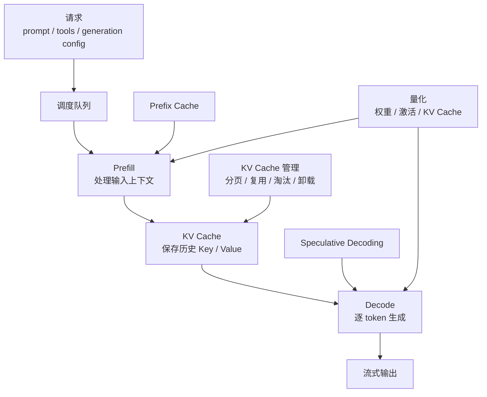
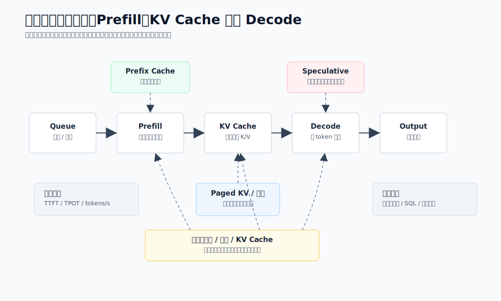
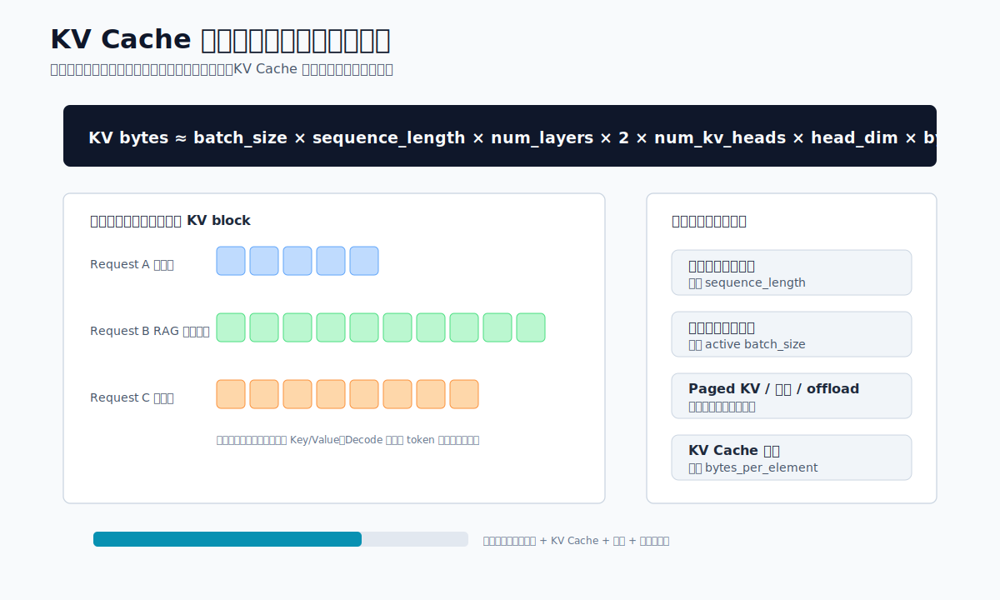
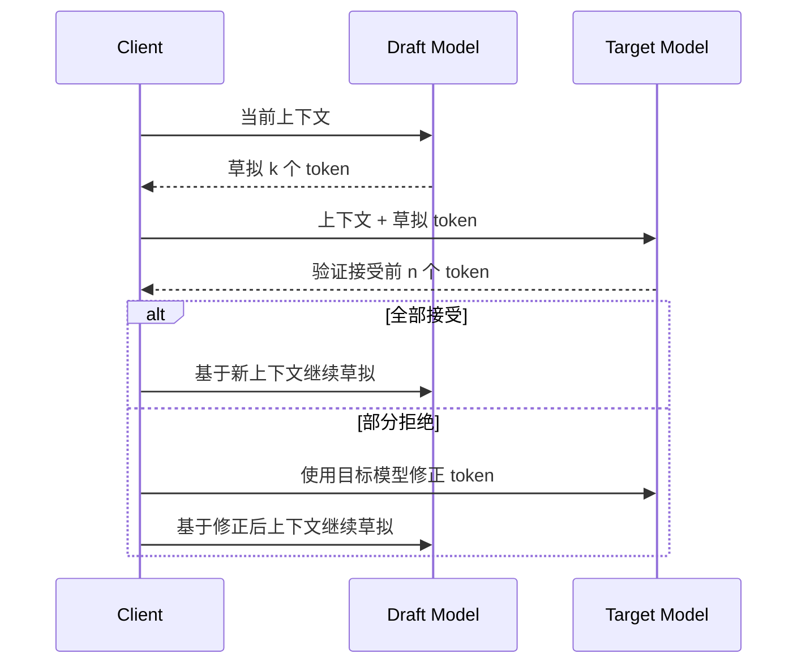

# Ch.07 推理优化技术

> **本章目标**：读者学完能解释 KV Cache、Prefix Cache、Speculative Decoding 和量化如何影响大模型推理的显存、吞吐、首 Token 延迟和输出质量，并能为企业本地推理服务制定优化优先级。
> **关键议题**：KV Cache、Prefix Cache、Speculative Decoding、权重量化、KV Cache 量化、显存预算、无损加速、质量回归评测
> **前置阅读**：Ch.05 大模型选型 / Ch.06 本地推理引擎吞吐与延迟取舍分析
> **估计阅读**：快速浏览 20 min / 优化方案选择 45 min / 含工程评测 90 min
> **mini-platform 关联**：`core/gateway/`
> **实战项目**：`projects/07-inference-optimization/`（规划中）

---

## 1. 先定位瓶颈，再选择优化机制

第 6 章讨论的是“选哪个推理引擎、如何理解吞吐与延迟的取舍”。本章进一步进入推理优化机制本身。企业平台团队真正关心的问题通常不是某个优化名词是否先进，而是它能否稳定降低成本、延迟或显存占用，同时不破坏模型质量和业务正确性。

山岚集团的内部知识助手、客服摘要、DataAgent 和代码助手面对的瓶颈并不相同。知识助手常见瓶颈是长上下文 Prefill 和 KV Cache 显存；客服摘要常见瓶颈是批量吞吐；DataAgent 常见瓶颈是结构化输出正确率和重试成本；代码助手常见瓶颈是 Decode 阶段每 Token 延迟。推理优化必须先识别瓶颈，再选择机制。盲目打开所有优化选项，往往会得到更复杂的故障面，而不是更稳定的服务。



推理优化可以按作用位置分成四类：KV Cache 优化作用在显存与长上下文并发；Prefix Cache 作用在共享前缀的重复 Prefill；Speculative Decoding 作用在 Decode 阶段的逐 Token 生成；量化作用在模型权重、激活和 KV Cache 的存储与带宽。它们可以组合，但组合前必须有评测闭环。



读图时先定位瓶颈位置，再选择机制：Prefill 重就看前缀复用和上下文治理，Decode 慢再看推测解码，显存紧张才优先看 KV 管理和量化。图中的指标闭环和质量闭环是所有组合优化的前提。

## 2. KV Cache：显存和长上下文的主约束

KV Cache 是自回归 Transformer 推理的核心缓存。模型生成第 `t` 个 Token 时，需要访问前面所有 Token 的 Key 和 Value。如果每一步都重新计算完整上下文，生成会极慢；因此推理引擎会在 Prefill 阶段把输入 Token 的 Key/Value 写入缓存，在 Decode 阶段每生成一个新 Token，就追加一份新的 Key/Value。这样可以避免重复计算历史上下文，但显存占用会随上下文长度和并发请求快速增长。

KV Cache 的规模可以用一个近似公式理解：

```text
KV Cache bytes
≈ batch_size
  × sequence_length
  × num_layers
  × 2
  × num_kv_heads
  × head_dim
  × bytes_per_element
```

这里的 `2` 代表 Key 和 Value 两份缓存。这个公式说明三个事实。第一，长上下文不是只增加 Prefill 计算，也会持续占用 Decode 阶段的显存。第二，并发请求越多，KV Cache 会按活跃序列数叠加。第三，FP16/BF16 到 FP8 或 INT8 的 KV Cache 量化，直接影响 `bytes_per_element`，因此能显著改变可承载的上下文和并发。



这张图把公式落到容量规划：上下文长度、活跃请求数和 bytes_per_element 分别对应请求治理、调度限流和 KV Cache 量化。它适合在评估长上下文、并发和显存预算时反复对照。

以平台工程视角看，KV Cache 有四种典型压力。

| 压力来源 | 现象 | 根因 | 优先处理方式 |
|---|---|---|---|
| 长上下文 | 单请求显存高，TTFT 长 | Prefill 计算量大，KV Cache 序列长度长 | 限制上下文、检索压缩、分块、Prefix Cache |
| 高并发 | GPU 显存接近上限，请求排队 | 活跃请求各自持有 KV Cache | 连续批处理、分页 KV、调度限流 |
| 长输出 | Decode 阶段越来越慢或被迫淘汰 | 输出 Token 也会追加 KV Cache | 限制 max_tokens、分段生成、任务拆分 |
| 共享系统提示词 | 重复计算相同前缀 | 多请求包含相同工具说明、角色设定或文档 | Prefix Cache、prompt 规范化 |

显存占用优化首先不是压缩，而是减少无效上下文。企业 RAG 常犯的错误是把检索到的文档全部塞进 prompt，以为长上下文模型能自动消化。实际结果是 TTFT 变长、KV Cache 占用上升、并发下降，而且无关证据还会增加幻觉风险。更稳的做法是先做检索质量、去重、片段压缩和引用选择，再把必要上下文送入模型。

第二类优化是分页式 KV 管理。以 vLLM 的 PagedAttention 为代表，推理引擎不再为每个请求按最大上下文预留连续显存，而是把 KV Cache 拆成固定大小的 block，像虚拟内存一样映射到物理显存。这样可以减少碎片，提高不同长度请求混跑时的显存利用率。TensorRT-LLM 等高性能推理栈也提供 KV Cache 复用、卸载和淘汰相关能力。平台团队不需要手写这些机制，但必须理解它们对并发容量的影响：同一张 GPU 能跑多少请求，很多时候不是模型权重决定的，而是 KV Cache 管理决定的。

第三类优化是 KV Cache 淘汰和卸载。在线推理服务中，并不是所有缓存都同等重要。正在 Decode 的请求必须保留；刚完成、可能被共享前缀命中的缓存可以短期保留；低命中概率或低优先级租户的缓存可以优先淘汰；极长上下文可以考虑 CPU offload，但要接受 PCIe 传输带来的延迟波动。企业平台要把缓存策略纳入 SLO，而不是只把它当作引擎内部细节。

第四类优化是 KV Cache 量化。KV Cache 从 BF16/FP16 降到 FP8 或更低 bit，可以提升长上下文并发能力，但必须做质量回归。对客服摘要这类容错较高的任务，FP8 KV Cache 可能是合理选择；对财务口径解释、SQL 生成、合规拒答和代码生成，必须用业务评测集确认输出质量、格式稳定性和事实一致性没有明显回退。

KV Cache 优化的上线检查清单如下。

- [ ] 明确每个模型的最大上下文、默认上下文和租户级上限。
- [ ] 监控 KV Cache 使用率、命中率、淘汰次数、显存碎片和请求排队时间。
- [ ] 分别压测短请求、高并发、长上下文和长输出场景。
- [ ] 对 KV Cache 量化做业务评测，而不是只看通用 benchmark。
- [ ] 对超长请求设置降级路径，例如压缩上下文、改走批处理或提示用户缩小范围。

## 3. Prefix Cache：复用稳定前缀降低 TTFT

Prefix Cache 是 KV Cache 复用的一种典型形式。当两个请求拥有相同前缀时，第二个请求不必重新计算这段前缀的 Prefill，而是直接复用已经生成的 KV Cache。vLLM 文档将 Automatic Prefix Caching 描述为复用已有查询的 KV Cache，让共享前缀的新查询跳过共享部分计算。对企业 Agent 平台来说，这个机制非常重要，因为许多请求天然共享前缀。

常见共享前缀包括：

| 场景 | 共享前缀内容 | 加速收益 | 风险 |
|---|---|---|---|
| 多轮对话 | 历史对话、系统提示词、企业角色设定 | 后续轮次减少重复 Prefill | 历史太长时缓存占用持续升高 |
| RAG 问答 | 同一长文档、同一制度文件、同一知识包 | 同文档多问题显著降低 TTFT | 检索片段顺序变化会降低命中 |
| Agent 工具调用 | 工具 schema、权限规则、安全策略 | 工具说明不必每次重算 | 动态字段混入前缀会破坏命中 |
| 批量抽取 | 同一任务说明、同一输出格式 | 大批量任务吞吐提升 | 输出 schema 变体过多会降低复用 |
| DataAgent | 同一语义层说明、指标口径、表结构 | 多个自然语言问题共享元数据上下文 | 表结构版本变化需要缓存失效 |

Prefix Cache 的收益主要体现在 TTFT，而不是每个输出 Token 的 Decode 速度。它减少的是重复 Prefill 计算：共享前缀越长，命中率越高，收益越明显。如果请求只共享很短的系统提示词，收益有限；如果请求共享几千到几万 Token 的长文档、工具 schema 或表结构说明，收益会很可观。

要让 Prefix Cache 生效，prompt 组织方式比引擎开关更重要。平台应把稳定内容放在前缀，把动态内容放在后缀。例如：

```text
稳定前缀：
1. 系统角色
2. 安全规则
3. 工具 schema
4. 企业术语表
5. 长文档或表结构

动态后缀：
1. 用户本轮问题
2. trace_id
3. 当前时间
4. 临时过滤条件
5. 上一步工具结果
```

如果把 `trace_id`、当前时间、随机 nonce、用户姓名等动态字段放在开头，即使后面的大段工具说明完全相同，缓存也可能无法命中。对于山岚集团的 DataAgent，语义层说明、指标口径、表结构和 SQL 安全规则应尽量稳定地放在前缀；用户问题、筛选条件和会话状态放在后缀。这样同一业务域的多次查询可以复用前缀 KV Cache。

多轮对话场景还要注意“缓存收益”和“上下文膨胀”的冲突。多轮历史越长，可复用内容越多，但 KV Cache 占用也越大。如果每一轮都把完整历史追加进去，后续请求会越来越慢。生产系统通常需要结合会话摘要、历史裁剪和重要事实记忆，把对话历史压缩成稳定前缀，而不是无限增长。

Prefix Cache 的工程落地要关注四个指标。

| 指标 | 含义 | 异常说明 |
|---|---|---|
| prefix_cache_hit_rate | 共享前缀命中比例 | 低命中通常是 prompt 不稳定或动态字段位置错误 |
| saved_prefill_tokens | 因缓存复用省掉的 Prefill Token | 低数值说明共享前缀太短，收益有限 |
| cache_eviction_count | 前缀缓存被淘汰次数 | 频繁淘汰说明显存压力或缓存策略不合理 |
| TTFT before/after | 首 Token 延迟变化 | 命中率高但 TTFT 无改善，可能瓶颈在排队或 Decode |

Prefix Cache 不是万能缓存。它不能加速完全不同的 prompt，也不能修复检索质量差的问题。它还可能提高显存占用，因为引擎需要保留可复用的 KV Cache。平台要按业务域设置缓存策略：客服知识库、固定工具 schema 和 DataAgent 表结构适合保留；一次性长文档、低频租户和超大临时上下文应更积极淘汰。

## 4. Speculative Decoding：用草稿模型加速 Decode

Speculative Decoding 的核心思想是用一个更快的 draft model 先生成多个候选 Token，再由目标大模型一次性验证这些候选。如果候选 Token 符合目标模型的分布，就可以一次接受多个 Token；如果不符合，就回退到目标模型的采样结果。Leviathan、Kalman 和 Matias 在 ICML 2023 的论文中提出，该方法可以在不改变输出分布的情况下加速自回归生成。

它解决的是 Decode 阶段瓶颈。大模型生成通常是一 Token 一步，每一步都要跑一次大模型前向计算。Prefill 可以并行处理输入序列，但 Decode 天然串行。Speculative Decoding 通过“小模型草拟，大模型批量验证”把多个 Decode step 合并到一次或少数几次大模型计算中，从而降低每个输出 Token 的平均成本。



Speculative Decoding 的“无损”指的是在正确实现的采样校正下，最终输出分布与直接使用目标模型采样一致。它不是用小模型替代大模型，也不是牺牲质量换速度。真正的收益取决于 draft model 的接受率：小模型越能预测大模型接下来会生成什么，接受率越高，加速越明显；如果小模型和大模型行为差异大，草拟 Token 经常被拒绝，额外的小模型计算就会变成负担。

适合 Speculative Decoding 的场景包括：

| 场景 | 为什么适合 | 注意事项 |
|---|---|---|
| 代码补全 | 局部模式强，候选 Token 可预测 | 需要同族或专门训练的 draft model |
| 固定格式摘要 | 输出模板稳定，接受率高 | schema 变化过多会降低收益 |
| 客服标准回复 | 语言风格和句式相对固定 | 要评估安全拒答和事实一致性 |
| 低温采样任务 | 随机性低，draft 更容易命中 | 高温创意生成收益通常不稳定 |

不适合的场景也很明确。复杂推理、开放式创作、多工具分支、强随机采样、多语言混杂和高不确定性问答，draft model 的接受率可能偏低。DataAgent 的 SQL 生成也要谨慎：如果小模型频繁草拟错误 SQL 片段，大模型验证虽然能纠正分布，但端到端吞吐未必提升，且调试复杂度会上升。

企业上线 Speculative Decoding 时，不应只看“平均加速倍数”，而要同时看四个指标。

| 指标 | 含义 | 目标 |
|---|---|---|
| acceptance_rate | draft token 被目标模型接受的比例 | 越高越好，低于阈值应关闭 |
| tokens_per_target_forward | 每次目标模型前向平均接受 Token 数 | 衡量大模型调用是否被有效摊薄 |
| end_to_end_latency | 包含 draft 计算后的总延迟 | 必须优于不开启时的 P50/P95 |
| quality_regression | 业务评测质量回退 | 无损实现理论不改分布，工程实现仍需验证 |

Speculative Decoding 还有一个平台层面的取舍：需要额外部署 draft model，增加模型管理、显存、路由和监控复杂度。如果 draft model 与目标模型不同族，Tokenizer、词表、对齐方式和采样策略都可能带来集成问题。因此它更适合作为“针对特定高流量任务的优化”，而不是所有模型服务的默认开关。

对山岚集团来说，优先尝试的场景可以是客服标准摘要、代码补全和固定格式工单生成；暂缓尝试的场景是财务解释、合规问答和复杂 DataAgent 推理。前者输出模式稳定，易测收益；后者质量风险高，且失败成本更大。

## 5. 量化：用精度换容量、吞吐和成本

量化是把模型中的高精度数值表示换成低精度表示，从而减少显存、存储和内存带宽占用。大模型推理中的量化至少包括四类：权重量化、激活量化、KV Cache 量化和全链路低精度推理。企业最常见的是权重量化和 KV Cache 量化。

| 类型 | 作用对象 | 典型格式 | 主要收益 | 主要风险 |
|---|---|---|---|---|
| 权重量化 | 模型参数 | INT8、INT4、GPTQ、AWQ、bitsandbytes 4-bit/8-bit | 降低模型显存，让更大模型可部署 | 可能影响推理、代码、数学和长上下文质量 |
| 激活量化 | 中间激活值 | INT8、FP8 | 降低计算和带宽开销 | 校准复杂，对模型结构和硬件敏感 |
| KV Cache 量化 | Decode 历史缓存 | FP8、INT8、INT4 等 | 提升长上下文并发能力 | 长上下文检索和细粒度引用可能回退 |
| 混合精度 | 不同层或不同张量使用不同精度 | FP16/BF16 + INT4/FP8 | 平衡质量和成本 | 配置复杂，测试矩阵变大 |

权重量化解决的是“模型放不放得下”和“每 Token 计算成本”。例如一个 BF16 模型如果降到 INT4，理论参数存储可以大幅下降，单卡可部署的模型规模随之提升。GPTQ、AWQ、bitsandbytes 等方法都服务于这个目标，但权重量化不是无风险压缩。模型越小、任务越精细、输出越结构化，量化误差越可能变成业务错误。

KV Cache 量化解决的是“长上下文和高并发放不放得下”。当模型权重已经固定，活跃请求越多、上下文越长，KV Cache 会成为主要显存瓶颈。把 KV Cache 从 BF16/FP16 降到 FP8 或更低精度，可以显著提高可承载的上下文 Token 数。但它对长文档问答、needle-in-a-haystack 检索、代码引用和 SQL 生成的影响必须单独测。权重量化过了评测，不代表 KV Cache 量化也安全。

量化方法还可以按是否需要训练/校准分为三类。

| 方法类型 | 说明 | 优势 | 代价 |
|---|---|---|---|
| 训练后量化 PTQ | 用校准数据或二阶近似等方法量化已训练模型 | 部署快，适合大多数开源模型 | 依赖校准集，极低 bit 可能损失质量 |
| 量化感知训练 QAT | 训练阶段模拟低精度误差 | 质量更稳，适合严肃生产模型 | 成本高，需要训练流程 |
| 运行时量化 | 推理时对部分张量低精度存储或计算 | 配置灵活，便于灰度 | 对引擎、硬件和 kernel 依赖强 |

企业评估量化时，不应只看困惑度或通用排行榜。山岚集团至少需要四类业务评测集。

| 评测集 | 关注点 | 示例失败 |
|---|---|---|
| 客服问答 | 事实一致性、拒答、安全话术 | 把政策日期或赔付条件说错 |
| DataAgent / NL2SQL | 表名、列名、聚合逻辑、SQL 合法性 | 少加过滤条件或生成不存在字段 |
| 代码助手 | 语法、依赖、边界条件 | 生成可读但不可运行的代码 |
| 合规与安全 | 敏感信息、越权、注入防护 | 量化后拒答边界漂移 |

量化上线可以采用“从保守到激进”的路径。

1. 先用 BF16/FP16 模型建立质量和性能基线。
2. 尝试 INT8 或 FP8，验证质量、TTFT、TPOT、吞吐和显存。
3. 对成本敏感且质量稳定的任务尝试 INT4 权重量化。
4. 对长上下文服务单独测试 KV Cache FP8 或更低精度。
5. 对每个量化版本建立模型卡，记录量化方法、校准集、评测集和适用任务。

量化也会影响推理优化之间的组合。例如，INT4 权重量化可能释放显存，让平台能开更大的 batch；KV Cache FP8 可能提升长上下文并发；但量化模型配合 Speculative Decoding 时，draft model 和 target model 的分布差异可能改变接受率。Prefix Cache 与量化也要一起验证，因为复用的是特定精度下的 KV Cache。

生产环境中，量化版本不应被当作同一模型的无差别替代品。平台应把 `qwen3-32b-bf16`、`qwen3-32b-awq-int4`、`qwen3-32b-fp8-kv` 视为不同可路由版本，分别配置适用任务、租户、SLO 和回滚策略。这样当 DataAgent 在 INT4 版本上 SQL 错误率升高时，可以只把 DataAgent 路由回 BF16，而不是影响客服摘要等低风险任务。

## 6. 本章小结

关键结论：

- 推理优化要从瓶颈出发，而不是按功能清单逐个打开；不同任务可能分别卡在 Prefill、Decode、KV Cache、结构化输出或队列调度。
- KV Cache 决定长上下文和高并发的显存上限，Prefix Cache 只有在前缀稳定、命中率足够高时才会稳定降低 TTFT。
- Speculative Decoding 适合输出模式稳定、draft model 接受率高的高流量任务，不应作为所有场景的默认开关。
- 量化版本要作为独立可路由模型治理，必须按业务评测集验证质量、格式、事实性和安全边界。

上线前检查：

- [ ] 已按短请求、高并发、长上下文、长输出和结构化输出分别建立性能基线。
- [ ] 每项优化都有独立开关、评测报告、适用任务、回滚策略和监控指标。
- [ ] 指标同时覆盖 TTFT、TPOT、吞吐、显存、KV Cache 命中/淘汰、质量回归和成本变化。
- [ ] 优化组合经过端到端压测，而不是只在单条 prompt 上测 tokens/s。

延伸资料：[vLLM Automatic Prefix Caching](https://docs.vllm.ai/en/v0.13.0/features/automatic_prefix_caching/)、[vLLM Prefix Caching Design](https://docs.vllm.ai/en/stable/design/prefix_caching/)、[TensorRT-LLM KV Cache System](https://nvidia.github.io/TensorRT-LLM/features/kvcache.html)、[TensorRT-LLM Quantization](https://nvidia.github.io/TensorRT-LLM/latest/features/quantization.html)、[Hugging Face Transformers Quantization](https://huggingface.co/docs/transformers/v4.38.1/main_classes/quantization)、[Fast Inference from Transformers via Speculative Decoding](https://proceedings.mlr.press/v202/leviathan23a.html) 和 [GPTQ: Accurate Post-Training Quantization for Generative Pre-trained Transformers](https://arxiv.org/abs/2210.17323)。
