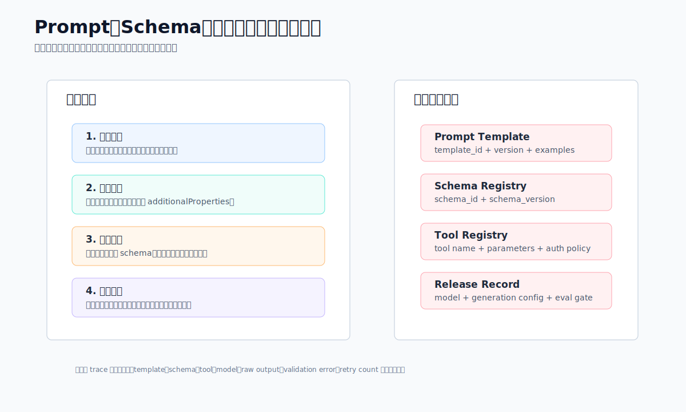
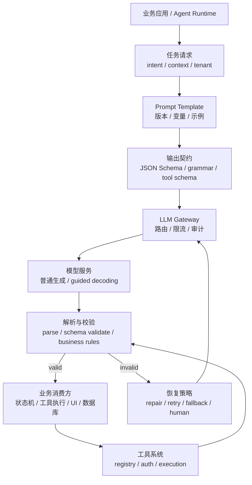
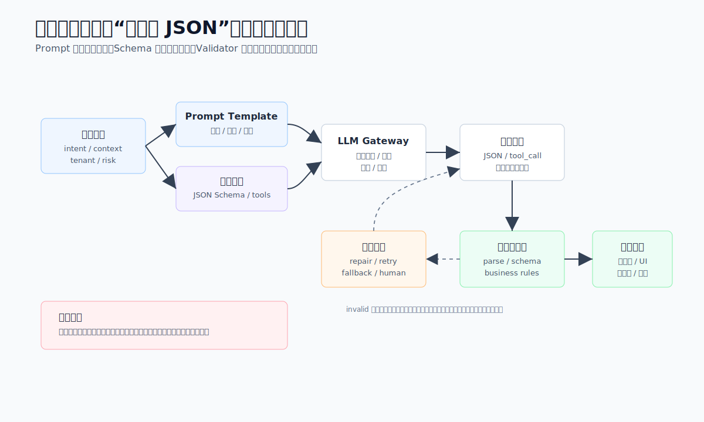
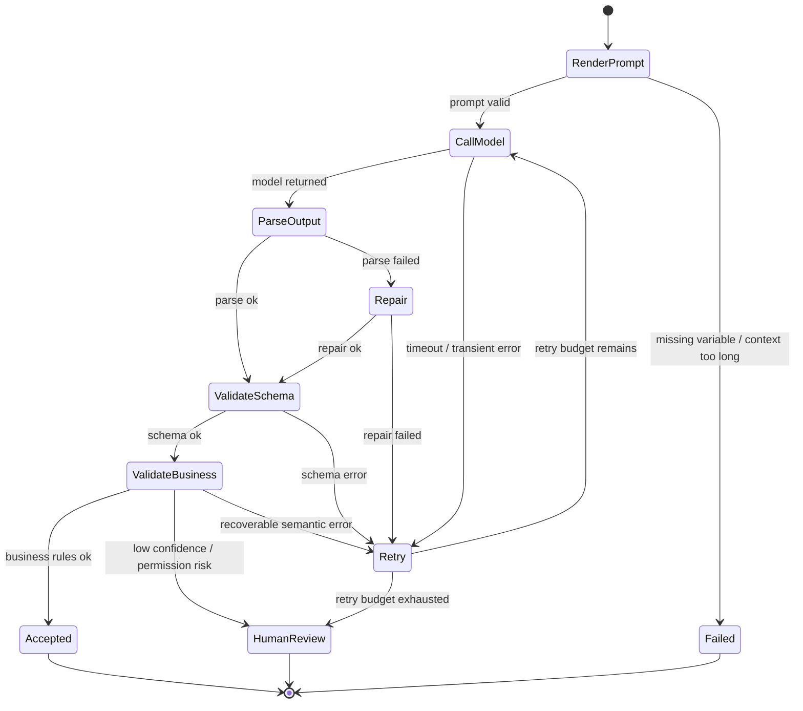
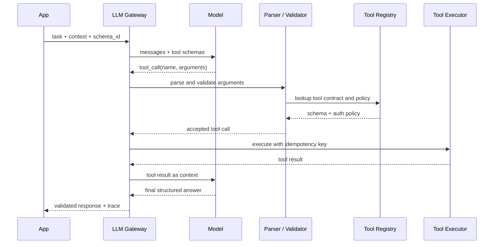

# Ch.08 结构化输出与提示工程

> **本章目标**：读者学完能把企业任务拆成可版本化的 Prompt、可校验的结构化输出契约和可审计的工具调用闭环，并能为 JSON Schema、约束解码、解析重试和人工兜底制定工程策略。
> **关键议题**：Prompt 设计基础、结构化生成方法、工具调用与系统交互、JSON Schema、Outlines、Instructor、Few-shot、CoT、ToT、Self-Consistency
> **前置阅读**：Ch.06 本地推理引擎 / Ch.07 推理优化技术 / Ch.23 Tool Registry & Function Calling
> **估计阅读**：快速浏览 20 min / 架构闭环 50 min / 含工程实现 90 min
> **mini-platform 关联**：`core/gateway/`、`core/registry/`
> **实战项目**：`projects/08-structured-output/`（规划中）
> **阅读路径**：业务负责人看输出契约和风险边界；架构师看校验恢复闭环；工程师看 schema、解析、工具调用和 trace 设计。

---

## 1. 从自由文本到可验证动作

### 1.1 业务场景：为什么企业需要这个能力

大模型刚接入业务系统时，团队通常先把它当作“会说话的文本接口”：业务拼一段 prompt，模型返回一段自然语言，前端展示即可。这个阶段很快能做出原型，但离生产系统还很远。山岚集团的客服工单分类、合同条款抽取、DataAgent 查询规划、采购审批助手和 IT 运维助手，都不能只依赖一段看起来合理的回答。系统真正需要的是可解析、可校验、可追踪、可重试的输出。

例如客服中心希望模型把用户投诉归类为固定枚举：`delivery_delay`、`quality_issue`、`refund_dispute`、`service_attitude`。如果模型返回“这个客户主要是不满意物流速度”，人能理解，系统却无法稳定写入工单字段。合同助手要抽取付款节点、违约责任和到期日期，如果日期格式混乱或金额单位丢失，后续提醒系统就会出错。DataAgent 要决定下一步调用哪个工具、传入哪些参数、是否需要用户补充权限，这更不是一段自由文本能承载的。

结构化输出与提示工程要解决的就是这类问题：把“让模型回答”变成“让模型在明确上下文、明确输出契约和明确系统边界内完成一次可验证动作”。它既包含 Prompt 设计，也包含 JSON Schema、约束解码、解析校验、工具调用、错误恢复和日志审计。提示词不是孤立文案，而是模型应用的接口设计。

在企业平台里，结构化输出通常服务四类高频任务。

| 任务类型 | 期望输出 | 典型后续动作 | 失败影响 |
|---|---|---|---|
| 信息抽取 | JSON 字段、枚举、日期、金额、证据片段 | 写入 CRM、合同库、风控表 | 脏数据进入主系统 |
| 决策分类 | 类别、置信度、拒绝原因 | 分派工单、触发审批、升级人工 | 误分派或越权自动化 |
| Agent 规划 | 下一步工具、参数、停止条件 | 调用搜索、数据库、工单、邮件等工具 | 调错工具或循环调用 |
| 生成式 UI | 表单 schema、组件树、操作建议 | 渲染前端界面或工作流节点 | 页面不可渲染或交互错位 |

这四类任务的共同点是：输出会被机器消费，而不是只给人阅读。因此平台必须回答三个问题。第一，模型应该看到什么上下文；第二，模型必须返回什么结构；第三，当模型无法满足结构或业务规则时，系统如何恢复。

### 1.2 Prompt、结构化输出与工具调用的边界

Prompt 设计、结构化输出和工具调用经常被混在一起讨论。它们确实互相依赖，但边界不同。

| 概念 | 定义 | 与相邻概念的区别 |
|---|---|---|
| Prompt | 提供给模型的任务说明、上下文、示例、约束和输出要求 | Prompt 是输入侧契约，不能替代输出校验 |
| Prompt Template | 可参数化、可版本化的提示词模板 | 模板强调复用和治理，不等同于单次 prompt 文案 |
| 结构化输出 | 让模型返回符合 schema、grammar 或固定格式的数据 | 关注机器可消费结果，不只关注自然语言质量 |
| JSON Schema | 描述 JSON 对象字段、类型、枚举、必填项和嵌套结构的契约 | 是校验契约，不保证模型一定生成正确语义 |
| 约束解码 | 在生成 token 时限制非法 token，减少格式错误 | 作用在推理阶段，不能替代业务规则校验 |
| 解析与修复 | 对模型输出做 parse、validate、repair、retry | 是输出侧防线，不应掩盖 schema 设计问题 |
| Function Calling | 模型选择工具并生成工具参数，由系统执行工具 | 工具调用强调系统动作，结构化输出只要求返回数据 |
| Agent 工作流 | 多轮模型判断、工具调用、状态更新和终止控制 | 是跨步骤编排，依赖结构化输出和工具契约 |

结构化输出不是“把结果包成 JSON”这么简单。一个合格的结构化任务至少有四层契约。

1. **语义契约**：模型要完成什么业务动作。例如“判断投诉原因，并给出不超过三个证据句”。
2. **结构契约**：字段、类型、枚举、嵌套关系和必填项。例如 `category` 必须来自固定枚举，`evidence` 是字符串数组。
3. **执行契约**：是否允许调用工具，工具参数如何校验，工具失败如何重试。
4. **治理契约**：Prompt 和 schema 如何版本化，日志记录什么，敏感字段如何脱敏，错误如何进入人工队列。



读图时把四层契约理解为同一个发布包，而不是四份孤立文档：Prompt、schema、tool contract 和 release record 需要绑定版本、评测和回滚策略。

### 1.3 Prompt 设计不是文案，而是接口设计

Prompt 设计的核心也不是“写得更礼貌”。企业 Prompt 应该像接口一样设计：输入字段清楚，业务规则显式，输出格式可测试，失败行为可预期。一个稳定 Prompt 通常包含以下部分。

| 部分 | 作用 | 示例 |
|---|---|---|
| 角色与边界 | 限定模型承担的任务和不承担的任务 | “你是山岚集团客服质检助手，只做投诉归因，不生成赔付承诺。” |
| 任务目标 | 描述要完成的动作 | “从工单文本中识别主投诉原因和证据句。” |
| 上下文 | 给出业务文本、政策、用户信息或检索证据 | “工单内容：...” |
| 业务规则 | 写明枚举、优先级、冲突处理 | “若同时出现退款和物流，优先选择导致投诉升级的原因。” |
| 输出契约 | 指定 schema、字段含义和格式 | “返回符合 complaint_classification_v2 的 JSON。” |
| 失败策略 | 说明缺证据、冲突或越权时如何输出 | “信息不足时 category=unknown，并填写 missing_info。” |

提示工程方法也有层次。Few-shot 通过示例稳定输出模式；Chain-of-Thought 让模型在内部或显式草稿中分步推理；Tree-of-Thought 尝试探索多个推理分支；Self-Consistency 用多次采样投票降低偶然错误。这些方法有用，但不能无条件用于所有生产任务。

| 方法 | 适合场景 | 主要代价 | 生产注意点 |
|---|---|---|---|
| Zero-shot | 简单分类、格式固定、模型能力足够 | 容错低 | 必须配合 schema 校验 |
| Few-shot | 输出风格、边界案例、字段解释需要示范 | Prompt 变长，维护成本上升 | 示例要版本化，避免泄露真实敏感数据 |
| CoT / 分步推理 | 数学、规划、复杂规则判断 | Token 成本高，可能暴露推理草稿 | 对外输出应只暴露结论和依据 |
| ToT / 多分支推理 | 高价值复杂决策、规划搜索 | 延迟和成本高 | 更适合离线或人工辅助场景 |
| Self-Consistency | 答案可投票、错误代价高 | 多次调用成本高 | 要定义投票规则和冲突处理 |

### 1.4 常见误区

**误区 1：只要 prompt 写“必须输出合法 JSON”，系统就稳定了。**

模型仍可能输出 Markdown 代码块、尾随解释、缺字段、类型错误、非法枚举或半截 JSON。企业系统必须有 parse、schema validate、业务 validate、retry 和 fallback。提示词是第一道约束，不是最后一道防线。

**误区 2：schema 越复杂，结果越可靠。**

过深的嵌套、过多可选字段和含糊字段名会让模型更容易犯错，也会让业务难以判定失败原因。生产 schema 应该从最小可用字段开始，优先使用枚举、短字符串、数字、日期和证据引用，复杂对象要拆成多步生成。

**误区 3：工具调用就是让模型直接操作系统。**

模型只能建议调用哪个工具和使用哪些参数，真正执行必须由平台完成。平台需要鉴权、参数校验、幂等控制、速率限制、审计和人工确认。尤其是发送邮件、修改订单、退款、创建工单、执行 SQL 这类动作，不能把模型输出当作自动执行许可。

**误区 4：提示词是应用代码里的字符串常量。**

Prompt 一旦进入生产，就需要版本、评测、灰度、回滚和审计。把提示词散落在业务代码里，会导致行为不可追踪。平台应把 Prompt Template、schema、模型版本、生成参数和评测结果绑定成可发布资产。

---

## 2. 结构化输出的校验与恢复闭环

### 2.1 平台位置与职责边界

结构化输出能力位于业务应用、LLM Gateway、推理引擎和工具系统之间。它的上游是业务任务和上下文，下游是工作流状态、工具调用、数据库写入或前端渲染。





读图时重点看 invalid 分支：模型输出即使语法接近正确，也必须先经过解析、schema 校验和业务规则校验；只有 valid 输出才能进入工具执行、状态机、数据库或 UI。

这条链路有两个关键原则。

第一，结构化输出契约应该尽量靠近业务语义，而不是靠近模型实现。业务方关心的是“投诉分类结果是否可入库”“下一步工具调用是否安全”，不是底层使用 JSON mode、regex、grammar 还是普通采样。平台可以根据模型和推理引擎能力选择不同实现，但上层契约要稳定。

第二，模型输出不能直接越过校验进入系统动作。即使推理引擎支持强约束 JSON，仍然只解决语法问题。业务规则、权限边界、幂等性和审计必须由平台执行。

在 mini-platform 的职责划分上，`core/gateway/` 负责把业务请求转换为模型调用契约，控制模型、参数、超时、流式和响应格式；`core/registry/` 负责工具定义、参数 schema 和工具查找。未来如果补充结构化输出模块，可以放在 `core/gateway/structured_output.py` 或独立的 `core/structured_output/` 下，提供 Prompt 渲染、schema 校验、重试策略和结果对象。

### 2.2 结构化链路的七个组件与请求契约

一个可生产的结构化输出链路可以拆成七个组件。

| 组件 | 职责 | 输入 | 输出 | 失败模式 |
|---|---|---|---|---|
| Prompt Template Registry | 管理 prompt 模板、变量、示例和版本 | template_id、version、变量 | 渲染后的消息列表 | 模板缺变量、版本不存在 |
| Schema Registry | 管理 JSON Schema、tool schema、grammar | schema_id、version | 输出契约 | schema 不兼容、字段含义漂移 |
| Prompt Renderer | 将业务上下文注入模板 | 模板、变量、租户策略 | messages / prompt | 上下文过长、敏感信息未脱敏 |
| Model Gateway | 路由模型并调用推理服务 | messages、schema、generation config | 原始模型输出 | 超时、限流、模型不可用 |
| Structured Parser | 解析并校验模型输出 | 原始文本或工具调用结果 | typed object / validation errors | JSON 解析失败、类型错误 |
| Business Validator | 校验业务规则和权限 | typed object、上下文、租户 | accepted / rejected | 越权、枚举不合法、证据缺失 |
| Recovery Manager | 根据错误类型修复、重试、降级或人工兜底 | validation errors、retry budget | 新请求或最终失败 | 重试风暴、错误被掩盖 |

接口契约可以用一个统一请求表达。下面示例不绑定具体 SDK，只表达平台需要保存和传递的信息。

```json
{
  "task": "complaint_classification",
  "tenant": "retail-customer-service",
  "prompt": {
    "template_id": "complaint_classifier",
    "version": "2.1.0",
    "variables": {
      "ticket_text": "用户反馈包裹延迟三天，客服多次未响应，要求退款。",
      "channel": "online_chat"
    }
  },
  "model": {
    "name": "qwen3-32b-instruct",
    "temperature": 0.1,
    "max_tokens": 512
  },
  "response_format": {
    "type": "json_schema",
    "schema_id": "complaint_classification",
    "schema_version": "2.0.0"
  },
  "recovery": {
    "max_retries": 2,
    "repair": true,
    "fallback": "human_review"
  }
}
```

对应的 schema 可以保持小而明确。

```json
{
  "type": "object",
  "required": ["category", "confidence", "evidence", "requires_human_review"],
  "additionalProperties": false,
  "properties": {
    "category": {
      "type": "string",
      "enum": [
        "delivery_delay",
        "quality_issue",
        "refund_dispute",
        "service_attitude",
        "unknown"
      ]
    },
    "confidence": {
      "type": "number",
      "minimum": 0,
      "maximum": 1
    },
    "evidence": {
      "type": "array",
      "items": {"type": "string"},
      "minItems": 1,
      "maxItems": 3
    },
    "requires_human_review": {"type": "boolean"},
    "missing_info": {"type": "string"}
  }
}
```

注意这里的 `additionalProperties: false` 很重要。它限制模型输出未定义字段，减少下游误读。`unknown` 也很重要：没有“无法判断”的合法出口时，模型会被迫在几个错误类别中选一个。

工具调用契约比普通结构化输出多一层执行语义。模型输出不再只是结果对象，而是“建议调用某个工具”。平台必须在执行前校验工具是否存在、调用者是否有权限、参数是否符合 schema、动作是否需要人工确认。

```json
{
  "tool_call": {
    "name": "create_refund_review_ticket",
    "arguments": {
      "customer_id": "C1024",
      "order_id": "O9001",
      "reason": "delivery_delay",
      "priority": "normal"
    }
  }
}
```

这类输出只能进入工具执行器，不能让模型直接写数据库。工具执行器的职责是把模型建议转换为受控系统动作。

### 2.3 请求生命周期、工具时序与失败分层

结构化输出请求的生命周期可以抽象为一个状态机。



一次工具调用型交互的时序如下。



失败模式要分层处理。把所有失败都简单重试，会造成成本浪费和不稳定；把所有失败都交给人工，又会让自动化失去价值。

| 失败模式 | 触发条件 | 恢复策略 |
|---|---|---|
| 上下文过长 | Prompt 渲染后超过模型或网关限制 | 压缩上下文、裁剪低优先级片段、要求用户缩小范围 |
| JSON 解析失败 | 输出包含代码块、注释、尾随文本或半截对象 | 一次 repair；失败后带错误信息重试 |
| Schema 校验失败 | 缺必填字段、类型错误、非法枚举 | 将校验错误反馈给模型重试；超过预算进入人工 |
| 业务规则失败 | 证据句不存在、金额单位缺失、置信度过低 | 补充检索、要求澄清或人工审核 |
| 工具不存在 | 模型生成未注册工具名 | 拒绝执行，重新提供工具列表重试 |
| 参数越权 | 模型请求访问无权限订单、客户或数据库 | 直接拒绝，记录安全事件，必要时人工处理 |
| 非幂等动作重复 | 重试导致重复创建工单、发送邮件或扣减库存 | 使用 idempotency key，工具端去重 |
| 重试风暴 | 上游模型异常或 schema 设计不合理 | 熔断、降级到无工具回答或人工队列 |

生产系统还要记录足够的 trace 信息：template_id、template_version、schema_id、schema_version、model、generation_config、raw_output、parse_error、validation_error、retry_count、tool_call、tool_result、latency、token_usage 和最终状态。日志中涉及用户文本、证件号、手机号、合同金额等敏感字段时，应按 Ch.10 之后的安全治理策略脱敏或加密。

## 3. 关键取舍：格式稳定、语义正确与系统安全

### 3.1 提示词约束、约束解码与后置校验

| 方案 | 优势 | 代价 | 适用场景 | mini-platform 选择 |
|---|---|---|---|---|
| 只靠 Prompt | 实现简单，兼容所有模型 | 格式失败率高，难以治理 | 原型、人工阅读回答 | 不作为生产默认 |
| Prompt + 后置校验 | 易接入，能发现错误并重试 | 仍会浪费失败调用成本 | 大多数结构化任务 | 默认基线 |
| 约束解码 + 校验 | 格式稳定，重试少 | 依赖模型服务能力，schema 受限 | 高并发抽取、工具参数生成 | 优先支持 |
| 手写规则替代模型 | 可解释、稳定、便宜 | 泛化能力弱，规则维护重 | 简单枚举、确定性转换 | 可作为前置或兜底 |

最稳的策略通常是组合：Prompt 说清楚任务，推理阶段尽量启用 JSON Schema 或 grammar 约束，输出后再做 schema 与业务校验。约束解码解决“形状正确”，校验解决“是否能用”。

### 3.2 大 schema 一次生成与小 schema 多步生成

| 方案 | 优势 | 代价 | 适用场景 | mini-platform 选择 |
|---|---|---|---|---|
| 一次生成大对象 | 调用次数少，链路简单 | 错误定位困难，字段相互干扰 | 简单表单、字段少 | 小对象可采用 |
| 多步生成小对象 | 每步目标清晰，易校验和重试 | 调用次数和延迟增加 | 合同抽取、DataAgent 规划 | 复杂任务优先 |
| 先粗分类再细抽取 | 降低无关字段干扰 | 需要状态机编排 | 多业务类型混合输入 | 推荐 |

复杂 schema 不应一开始就追求“一次全抽”。合同处理可以先判断合同类型，再按类型选择对应 schema；DataAgent 可以先输出查询意图，再生成 SQL 或工具调用参数；客服工单可以先分类，再对高风险类别抽取证据和赔付信息。

### 3.3 显式推理过程与隐式推理结果

| 方案 | 优势 | 代价 | 适用场景 | mini-platform 选择 |
|---|---|---|---|---|
| 要求模型输出完整推理过程 | 便于人工审阅和调试 | 成本高，可能泄露不应展示的草稿 | 离线分析、专家审核 | 谨慎使用 |
| 内部推理、只输出结论和证据 | 用户体验稳，泄露风险低 | 调试信息较少 | 生产交互、自动入库 | 默认 |
| 多次采样投票 | 降低随机错误 | 成本和延迟成倍增加 | 高价值分类、离线批处理 | 按任务配置 |

企业系统不应把模型的内部推理草稿直接展示为事实依据。更好的做法是要求模型输出“证据引用”或“使用了哪些输入片段”，而不是输出完整思维链。对高风险决策，应该保留人工审阅入口和原始证据。

### 3.4 模型自主选择工具与工作流显式控制

| 方案 | 优势 | 代价 | 适用场景 | mini-platform 选择 |
|---|---|---|---|---|
| 模型自主选择工具 | 灵活，适合开放任务 | 可预测性较弱，安全边界复杂 | 办公助手、探索式 Agent | 低风险场景 |
| 工作流限定可用工具 | 行为稳定，便于审计 | 灵活性较低 | 审批、退款、数据库查询 | 默认生产策略 |
| 规则先筛选工具，模型填参数 | 平衡稳定性和智能性 | 需要维护路由规则 | 企业业务流程 | 推荐 |

对生产 Agent 来说，最重要的不是让模型“知道所有工具”，而是让它在当前状态只看到允许使用的工具。工具列表越大，误调用概率越高，工具 schema 也会占用更多上下文，影响成本和 Prefix Cache 命中。

---

## 4. mini-platform 落地路径

### 4.1 实现边界

当前仓库已有两个相关基础模块。

- 网关抽象：`mini-platform/core/gateway/`
- 工具注册：`mini-platform/core/registry/tool_registry.py`
- 工具注册测试：`mini-platform/tests/test_registry.py`

`ToolRegistry` 已经表达了工具名、描述、参数 schema 和 handler 的关系。结构化输出章节可以在此基础上扩展三类能力。

| 能力 | 建议路径 | 说明 |
|---|---|---|
| Prompt 模板 | `mini-platform/core/gateway/prompt_template.py` | 管理模板变量、版本和渲染 |
| 结构化解析 | `mini-platform/core/gateway/structured_output.py` | parse、JSON Schema validate、repair result |
| 工具调用校验 | `mini-platform/core/registry/tool_registry.py` | 在现有工具 schema 基础上增加参数校验和策略 |

一个轻量实现可以先不引入复杂依赖，只用 Python 标准库完成 JSON 解析和基础校验。生产系统再替换为 Pydantic、jsonschema、Instructor、Outlines 或推理引擎内置 guided decoding。

### 4.2 结构化解析、Prompt 模板与工具调用示例

下面代码展示结构化输出网关的核心思路。完整实现可以在后续项目 `projects/08-structured-output/` 中落地。

```python
# 来源建议：mini-platform/core/gateway/structured_output.py
from __future__ import annotations

import json
from dataclasses import dataclass
from typing import Any


@dataclass(frozen=True)
class ValidationError:
    path: str
    message: str


@dataclass(frozen=True)
class StructuredResult:
    ok: bool
    data: dict[str, Any] | None
    errors: list[ValidationError]
    raw: str


class SimpleJsonObjectValidator:
    """Small validator for examples; production code should use a full JSON Schema library."""

    def __init__(self, schema: dict[str, Any]) -> None:
        self.schema = schema

    def validate(self, data: dict[str, Any]) -> list[ValidationError]:
        errors: list[ValidationError] = []
        required = self.schema.get("required", [])
        properties = self.schema.get("properties", {})

        for key in required:
            if key not in data:
                errors.append(ValidationError(key, "missing required field"))

        if self.schema.get("additionalProperties") is False:
            for key in data:
                if key not in properties:
                    errors.append(ValidationError(key, "unexpected field"))

        for key, spec in properties.items():
            if key not in data:
                continue
            value = data[key]
            expected_type = spec.get("type")

            if expected_type == "string" and not isinstance(value, str):
                errors.append(ValidationError(key, "expected string"))
            elif expected_type == "number" and not isinstance(value, int | float):
                errors.append(ValidationError(key, "expected number"))
            elif expected_type == "boolean" and not isinstance(value, bool):
                errors.append(ValidationError(key, "expected boolean"))
            elif expected_type == "array" and not isinstance(value, list):
                errors.append(ValidationError(key, "expected array"))

            if "enum" in spec and value not in spec["enum"]:
                errors.append(ValidationError(key, "value not in enum"))
            if "minimum" in spec and isinstance(value, int | float) and value < spec["minimum"]:
                errors.append(ValidationError(key, "below minimum"))
            if "maximum" in spec and isinstance(value, int | float) and value > spec["maximum"]:
                errors.append(ValidationError(key, "above maximum"))

        return errors


def parse_structured_json(raw: str, schema: dict[str, Any]) -> StructuredResult:
    try:
        data = json.loads(raw)
    except json.JSONDecodeError as exc:
        return StructuredResult(
            ok=False,
            data=None,
            errors=[ValidationError("$", f"invalid json: {exc.msg}")],
            raw=raw,
        )

    if not isinstance(data, dict):
        return StructuredResult(
            ok=False,
            data=None,
            errors=[ValidationError("$", "expected top-level object")],
            raw=raw,
        )

    errors = SimpleJsonObjectValidator(schema).validate(data)
    return StructuredResult(ok=not errors, data=data if not errors else None, errors=errors, raw=raw)
```

Prompt 模板可以用结构化配置保存，而不是散落在业务代码中。

```yaml
# 来源建议：mini-platform/configs/prompts/complaint_classifier.yaml
id: complaint_classifier
version: 2.1.0
model_defaults:
  temperature: 0.1
  max_tokens: 512
response_format:
  type: json_schema
  schema_id: complaint_classification
  schema_version: 2.0.0
messages:
  - role: system
    content: |
      你是山岚集团客服质检助手。你只做投诉归因，不生成赔付承诺。
      输出必须符合 complaint_classification_v2，不要输出 Markdown。
  - role: user
    content: |
      工单渠道：{{ channel }}
      工单内容：
      {{ ticket_text }}
```

如果使用支持结构化输出的模型服务，请求可以把 schema 交给网关，网关再映射到底层模型 API。

```json
{
  "model": "qwen3-32b-instruct",
  "messages": [
    {"role": "system", "content": "你是山岚集团客服质检助手。"},
    {"role": "user", "content": "工单内容：包裹延迟三天，客服未响应。"}
  ],
  "temperature": 0.1,
  "response_format": {
    "type": "json_schema",
    "json_schema": {
      "name": "complaint_classification",
      "schema": {
        "type": "object",
        "required": ["category", "confidence", "evidence", "requires_human_review"],
        "additionalProperties": false,
        "properties": {
          "category": {
            "type": "string",
            "enum": ["delivery_delay", "quality_issue", "refund_dispute", "service_attitude", "unknown"]
          },
          "confidence": {"type": "number", "minimum": 0, "maximum": 1},
          "evidence": {"type": "array", "items": {"type": "string"}},
          "requires_human_review": {"type": "boolean"}
        }
      }
    }
  }
}
```

工具调用则应通过 `ToolRegistry` 查找和执行。伪代码如下。

```python
# 来源建议：mini-platform/core/gateway/tool_calling.py
from __future__ import annotations

from typing import Any

from core.registry import ToolRegistry


def execute_validated_tool_call(
    registry: ToolRegistry,
    name: str,
    version: str,
    arguments: dict[str, Any],
    *,
    tenant: str,
    idempotency_key: str,
) -> Any:
    tool = registry.get(name, version)

    # Production code should validate arguments against tool.parameters_schema
    # and check tenant permissions before execution.
    if not idempotency_key:
        raise ValueError("idempotency key is required")

    return tool.handler(**arguments)
```

这里刻意把工具执行放在平台代码中，而不是让模型输出“执行结果”。模型最多生成工具名和参数，平台负责验证和执行。

运行方式在后续项目落地后可以统一为：

```bash
cd mini-platform/projects/08-structured-output
python run.py
```

### 4.3 生产化清单

- [ ] 权限：工具调用前必须检查租户、用户、资源和动作权限；高风险动作需要人工确认。
- [ ] 审计：记录 template、schema、model、参数、原始输出、校验错误、工具调用和最终状态。
- [ ] 成本：为重试、Self-Consistency、多分支推理设置预算；记录 token usage 和失败成本。
- [ ] 性能：监控结构化输出成功率、解析失败率、schema 失败率、重试次数、P95 延迟。
- [ ] 稳定性：为模型超时、schema 失败、工具失败和上游限流定义降级路径。
- [ ] 可观测性：每次结构化请求必须有 trace_id，能串起 prompt 渲染、模型调用、解析、校验和工具执行。
- [ ] 灾难恢复：Prompt 或 schema 新版本出错时能回滚；工具误调用要有补偿流程。
- [ ] 数据安全：日志脱敏，训练样本和 few-shot 示例不得包含未授权真实敏感信息。
- [ ] 版本治理：Prompt、schema、工具契约和模型版本应绑定发布，不允许单独漂移。
- [ ] 评测：每个模板至少有成功样例、边界样例、拒答样例、恶意输入样例和回归样例。

### 4.4 踩坑记录

**踩坑 1：JSON 外面包了 Markdown 代码块**

- 现象：模型输出以 Markdown 的 json 代码块开头，解析器直接失败。
- 根因：Prompt 只说“输出 JSON”，但示例使用了 Markdown 代码块；模型模仿了示例。
- 修复：示例中只保留裸 JSON；解析器对代码块做一次 repair；高频任务启用 JSON Schema 或 grammar 约束。

**踩坑 2：字段合法但语义不可用**

- 现象：`category` 是合法枚举，`confidence` 也是数字，但证据句并不存在于原始工单。
- 根因：只做 schema 校验，没有做业务校验。
- 修复：增加证据回指校验，要求 evidence 必须来自输入原文或检索片段；失败后进入重试或人工审核。

**踩坑 3：重试导致重复创建工单**

- 现象：模型第一次工具调用超时，平台重试后创建了两张人工审核工单。
- 根因：工具调用没有幂等键，平台把“未知执行结果”当成“未执行”。
- 修复：所有非幂等工具必须接收 idempotency_key；工具执行器按 key 去重，并把执行状态写入审计日志。

**踩坑 4：Few-shot 示例让模型学到过期政策**

- 现象：客服助手分类准确，但赔付建议仍引用上季度政策。
- 根因：Prompt 示例里包含旧政策文本，且没有进入知识库版本治理。
- 修复：Few-shot 示例只示范格式和边界，不携带易过期政策；政策内容从受控知识源注入，并记录版本。

**踩坑 5：工具列表太大导致误调用**

- 现象：一个普通查询任务调用了退款审核工具。
- 根因：Agent 每次都看到全量工具列表，模型在相似描述中选错。
- 修复：按工作流状态和权限动态裁剪工具列表；高风险工具默认隐藏，只在明确状态下开放。

---

## 5. 本章小结

### 关键结论

1. Prompt 是模型应用的输入侧接口，结构化输出是输出侧契约，工具调用是受控系统动作；三者必须一起治理。
2. 生产系统不能只依赖“请输出 JSON”，应组合 Prompt、schema、约束解码、解析校验、业务校验、重试和人工兜底。
3. 工具调用必须由平台执行鉴权、参数校验、幂等、审计和风险控制，模型输出不能直接变成系统操作。
4. Prompt、schema、模型版本、工具契约和评测集应作为一组可发布资产管理，支持灰度和回滚。

### 上线检查清单

- [ ] 能上线吗？核心模板和 schema 已覆盖成功、失败、边界、恶意输入和回归样例。
- [ ] 能扩展吗？Prompt Template、Schema Registry、Tool Registry 之间有稳定版本关系。
- [ ] 能治理吗？所有结构化请求都能追踪到模型、模板、schema、工具调用和最终业务动作。
- [ ] 能恢复吗？解析失败、schema 失败、工具失败和超时都有明确重试、降级或人工兜底策略。
- [ ] 能审计吗？高风险工具调用记录了权限、参数、幂等键、执行结果和操作者上下文。

### 延伸阅读

- JSON Schema 官方文档：[https://json-schema.org/](https://json-schema.org/)
- Outlines 文档：[https://dottxt-ai.github.io/outlines/](https://dottxt-ai.github.io/outlines/)
- Instructor 文档：[https://python.useinstructor.com/](https://python.useinstructor.com/)
- OpenAI Structured Outputs 文档：[https://platform.openai.com/docs/guides/structured-outputs](https://platform.openai.com/docs/guides/structured-outputs)
- 相关章节：Ch.06 本地推理引擎、Ch.07 推理优化技术、Ch.23 Tool Registry & Function Calling、Ch.24 MCP 与企业工具生态
