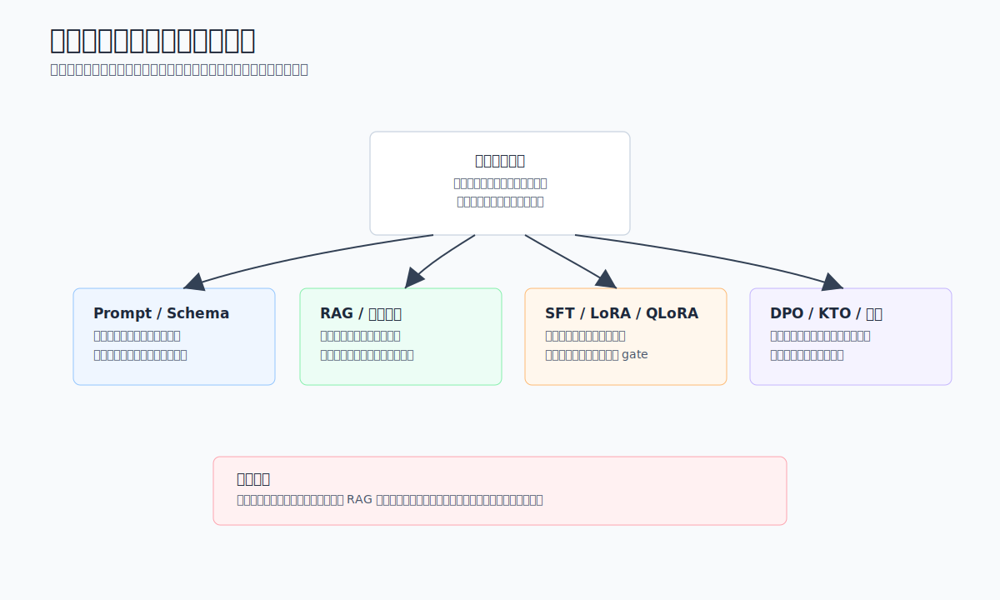
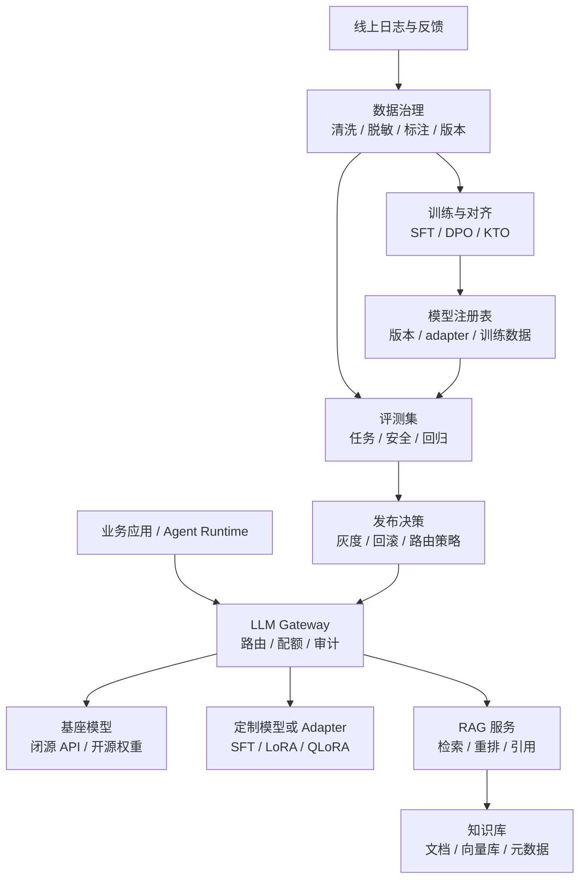
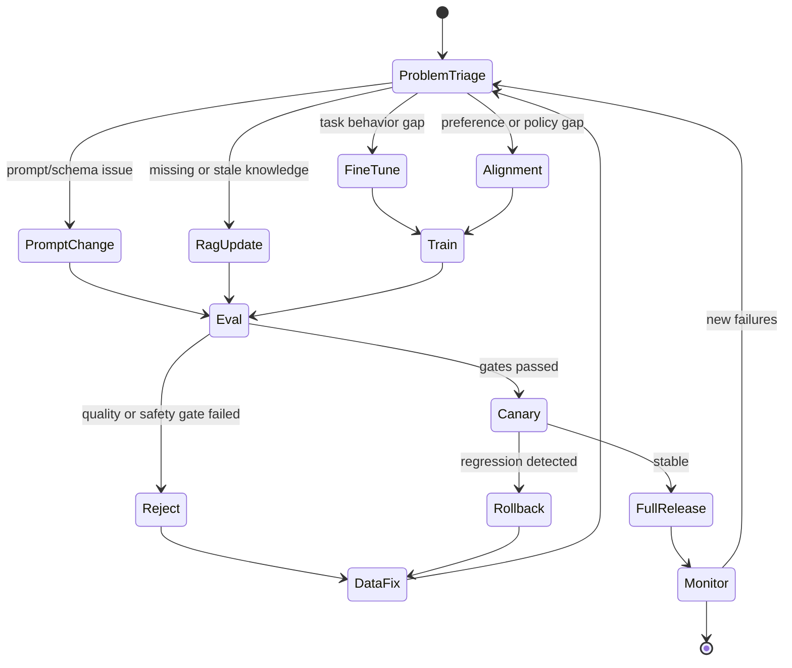
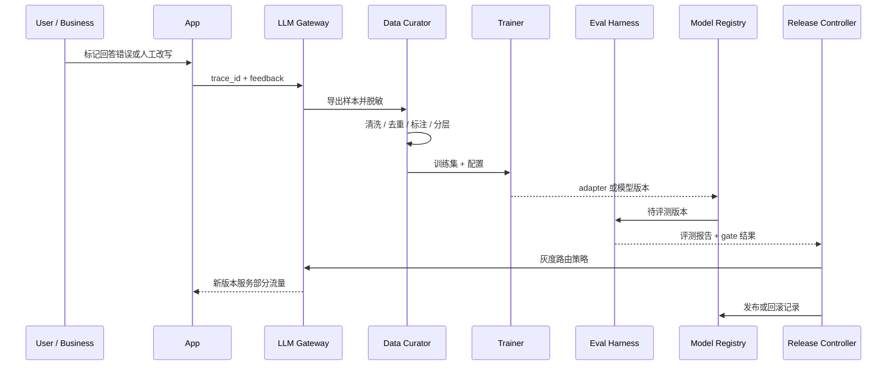

# Ch.09 模型能力定制与知识增强

> **本章目标**：读者学完能区分何时使用微调、对齐、RAG 或提示工程，并能为企业模型能力定制设计数据、训练、评测、发布和回滚闭环。
> **关键议题**：微调、LoRA、QLoRA、PEFT、SFT、DPO、KTO、偏好对齐、领域适配、RAG、知识增强、模型版本治理
> **前置阅读**：Ch.05 大模型选型 / Ch.08 结构化输出与提示工程 / Ch.16 嵌入模型 / Ch.20 RAG 工程与高级检索
> **估计阅读**：快速浏览 20 min / 技术路线决策 50 min / 含工程实现 90 min
> **mini-platform 关联**：`core/gateway/`、`core/eval/`、`core/rag/`、`infra/vectorstore/`
> **实战项目**：`projects/09-model-customization/`（规划中）
> **阅读路径**：业务负责人看问题分诊和取舍；架构师看数据、训练、知识与发布闭环；工程师看策略对象、训练配置和版本追踪。

---

## 1. 先判断问题类型，再选择定制手段

### 1.1 业务场景：为什么企业需要模型能力定制

第 5 章讨论的是“选哪个模型”，第 8 章讨论的是“如何把模型输出变成可靠接口”。但企业真正上线后，很快会遇到另一个问题：通用模型足够聪明，却不一定稳定适配企业自己的任务、口径、规范和知识。

山岚集团的业务团队会提出三类诉求。客服团队希望模型学会集团内部的投诉分类口径和话术规范；法务团队希望模型在合同审阅中遵守固定风险分级和红线表述；DataAgent 团队希望模型理解财务指标口径、表结构和查询习惯；人力团队希望模型回答员工制度时引用最新政策，而不是凭训练记忆猜测。它们看起来都在要求“让模型更懂企业”，但技术路径并不相同。

模型能力定制至少有三条路线。

| 路线 | 解决什么问题 | 典型例子 | 更新频率 |
|---|---|---|---|
| 微调 | 让模型更会做某类任务、遵守某种输出模式或领域语言 | 工单分类、SQL 生成风格、合同条款抽取 | 周级到月级 |
| 对齐 | 让模型更符合企业偏好、规范、安全边界和拒答策略 | 合规话术、风险分级、客服语气、禁止承诺赔付 | 周级到季度 |
| RAG | 让模型接入外部、实时、可追溯的企业知识 | 员工制度、产品手册、合同库、指标口径文档 | 小时级到天级 |

三者不是互斥关系。一个生产级客服助手可能同时使用：RAG 检索最新政策，微调模型学习工单分类和固定 JSON 输出，对齐模型避免越权承诺赔付。关键不是“哪种技术更高级”，而是把问题拆清楚：缺的是能力、偏好，还是知识。

可以用一个简单判断框架：

| 症状 | 更可能的根因 | 优先方案 |
|---|---|---|
| 模型不知道最新政策、库存、价格、合同条款 | 知识不在模型上下文或已过期 | RAG / 工具查询 |
| 模型知道信息但总是不按企业格式输出 | 任务行为不稳定 | Prompt + 结构化输出；必要时 SFT |
| 模型会做任务，但风格、边界、拒答不符合企业规范 | 偏好和安全边界未对齐 | 偏好数据 + DPO/KTO/RLHF 或规则护栏 |
| 模型在特定领域术语、SQL 模式、代码框架上长期错误 | 领域任务分布与基座模型差异大 | 领域 SFT / LoRA / QLoRA |
| 模型偶发错误，且样本很少 | 数据不足或评测不足 | 先做评测集、Prompt、RAG 和工具校验 |

这张表的含义很重要：微调不是默认答案。很多企业一遇到模型答错就说“要不要 fine-tune”，但如果问题是知识过期，微调只会把旧知识写进参数，下一次政策更新还要重新训练；如果问题是权限和风险，微调也不能替代系统级鉴权和审计。



读图时从失败样本的根因出发，而不是从训练手段出发。格式不稳先改 Prompt 和 schema，知识缺失先走 RAG 或工具，长期任务分布不匹配再考虑 SFT / LoRA，偏好和安全边界问题才进入对齐。

### 1.2 Prompt、RAG、微调与对齐的边界

本章把能力定制分成四层：提示工程、RAG、微调、对齐。它们改变模型行为的方式不同。

| 能力 | 改变位置 | 输入资产 | 输出资产 | 最适合解决 |
|---|---|---|---|---|
| 提示工程 | 请求上下文 | Prompt、示例、工具说明、schema | 模板和调用策略 | 任务说明、输出格式、少量规则 |
| RAG | 外部上下文 | 文档、向量库、检索器、重排器 | 检索上下文和引用 | 新知识、长尾知识、可追溯事实 |
| 微调 | 模型参数或适配器 | 指令数据、标注样本、领域语料 | 新模型版本或 adapter | 任务习惯、领域语言、格式稳定性 |
| 对齐 | 模型偏好或策略 | 偏好对、拒答样例、规范样例 | 更符合偏好的模型版本 | 风格、安全、价值取向、企业规范 |

**微调**是用任务数据继续训练模型，让模型参数或 adapter 学到某类输入输出映射。企业最常见的是 SFT（Supervised Fine-Tuning）：给定指令、上下文和理想答案，让模型模仿标注结果。LoRA 和 QLoRA 是参数高效微调方法，它们不更新全部模型权重，而是在部分层上训练小规模低秩参数，降低显存和训练成本。PEFT 是这类参数高效方法的统称。

**对齐**关注的不是“会不会做”，而是“更偏好怎么做”。比如客服助手在政策不明确时应该建议人工审核，而不是编造赔付承诺；法务助手应该明确风险等级和证据，不应给出确定法律意见；DataAgent 在权限不足时应拒绝查询，而不是尝试绕过。DPO、KTO、RLHF 等方法都服务于偏好优化，但企业落地时更重要的是偏好数据质量和评测闭环。

**RAG**让模型在回答前检索外部知识，把相关片段放进上下文，并要求模型基于证据回答。它适合知识更新快、答案需要引用来源、事实必须可追溯的场景。本章只讨论 RAG 在能力定制决策中的位置，分块、混合检索、RRF、重排、Parent-Child、Small-to-Big 等工程细节放到 Ch.20。

**能力定制不是模型训练团队的独角戏。**它涉及业务专家、数据工程、模型平台、评测平台、安全合规和应用团队。没有高质量评测集的微调，只是在盲目改变模型；没有知识治理的 RAG，只是在把更多噪声塞进上下文；没有审计和回滚的对齐，也可能把模型变得“更安全但不可用”。

### 1.3 常见误区

**误区 1：微调可以把企业知识永久写进模型。**

微调更适合学习任务模式和表达习惯，不适合承载频繁变化的事实。员工制度、商品价格、库存、合同状态、指标口径版本都应该通过 RAG、工具或数据库查询接入。把这些知识写进模型参数，会带来更新慢、不可追溯、难回滚的问题。

**误区 2：RAG 可以替代模型能力。**

RAG 能提供知识，但不能自动让模型学会复杂任务。检索到了财务口径文档，不代表模型就能稳定生成正确 SQL；检索到了合同模板，不代表模型就能正确抽取风险条款。RAG 解决“知道什么”，微调和提示工程解决“怎么做”。

**误区 3：有了 DPO 或 KTO，安全问题就解决了。**

对齐可以提高模型偏好，但不能替代权限、审计、脱敏、工具白名单和业务规则。模型即使倾向于拒绝越权请求，系统也必须在工具执行层做硬校验。

**误区 4：训练数据越多越好。**

低质量、重复、冲突、过期的数据会让模型退化。企业微调最怕“把业务历史噪声当真理”：旧政策、错误客服话术、人工临时 workaround、SQL 反模式都会被模型学进去。数据筛选、去重、版本标记和评测集隔离比样本数量更关键。

---

## 2. 能力定制的持续闭环

### 2.1 平台位置与版本边界

模型能力定制位于模型平台、数据平台、评测平台和业务应用之间。它不是一次训练任务，而是一条持续闭环：从线上问题收集样本，经过数据治理和训练，再通过评测、灰度和监控回到线上。




这张图的重点是两个闭环：线上失败样本回到数据治理与评测，发布决策再回到网关路由。只有模型、adapter、Prompt、RAG snapshot 和评测报告一起进入注册表，线上问题才可复现、可灰度、可回滚。

这张图里有三个关键边界。

第一，业务应用不应该直接知道模型是否经过 LoRA、是否接了 RAG、是否走了偏好对齐。它只应该声明任务、租户、风险等级、SLO 和知识域。LLM Gateway 根据策略路由到合适的模型版本、adapter 或 RAG 管线。

第二，训练数据和评测数据必须隔离。线上日志可以进入候选训练池，但进入训练前必须脱敏、去重、清洗和人工审核；评测集更要单独维护，不能被训练污染。否则微调后看似分数提升，只是模型记住了测试题。

第三，RAG 知识库、模型 adapter 和 prompt 模板都要版本化。一次线上回答到底用了哪个模型、哪个 adapter、哪个 prompt、哪个知识库快照，必须能在审计中还原。

### 2.2 数据、训练、知识与发布组件

企业模型能力定制可以拆成八个组件。

| 组件 | 职责 | 输入 | 输出 | 失败模式 |
|---|---|---|---|---|
| Sample Collector | 收集线上失败、人工改写、用户反馈和专家样例 | 日志、工单、人工标注 | 候选样本池 | 敏感数据混入、偏差采样 |
| Data Curator | 清洗、脱敏、去重、分层抽样、版本化 | 候选样本 | 训练集、验证集、评测集 | 数据泄露、标签冲突 |
| Knowledge Pipeline | 文档解析、切分、索引、元数据治理 | 文档、表结构、政策 | 可检索知识库 | 过期文档、权限错配 |
| Fine-tune Trainer | 执行 SFT、LoRA、QLoRA 等训练 | 模型、训练集、配置 | adapter 或模型权重 | 过拟合、灾难性遗忘 |
| Preference Trainer | 执行 DPO、KTO、RLHF 类偏好优化 | 偏好对、规范样例 | 对齐后模型版本 | 过度拒答、风格漂移 |
| Eval Harness | 评测任务能力、事实性、安全性、成本和延迟 | 模型版本、评测集 | 评测报告 | 指标单一、测试污染 |
| Model Registry | 管理模型、adapter、数据版本和发布状态 | 训练产物、评测报告 | 可路由版本 | 版本不可追踪 |
| Release Controller | 灰度、回滚、租户路由和流量分配 | 发布策略、SLO | 线上路由规则 | 无法快速回滚 |

一个训练任务的接口契约应该显式记录模型、数据、方法和评测门槛。

```yaml
job_id: customer_service_sft_2026_06
base_model: qwen3-32b-instruct
method: lora_sft
dataset:
  train: datasets/customer_service/sft/train-2026-06.jsonl
  validation: datasets/customer_service/sft/validation-2026-06.jsonl
  data_policy: pii_redacted_v2
training:
  lora_rank: 16
  learning_rate: 0.0001
  epochs: 2
  max_seq_length: 4096
evaluation:
  suites:
    - customer_service_classification
    - refusal_and_compliance
    - structured_output_regression
  gates:
    task_accuracy_min: 0.88
    json_validity_min: 0.98
    safety_regression_max: 0.01
release:
  canary_tenants:
    - retail-customer-service
  rollback_to: qwen3-32b-instruct@baseline
```

RAG 管线的接口契约则更像知识版本和检索策略声明。

```yaml
knowledge_domain: employee_policy
snapshot: 2026-06-01
sources:
  - hr_policy_handbook
  - benefits_faq
index:
  embedding_model: bge-m3
  chunk_policy: policy_v3
  vectorstore: enterprise_vectorstore
retrieval:
  top_k: 20
  rerank_top_k: 6
  require_citation: true
security:
  metadata_filters:
    tenant: shanlan-group
    visibility: employee
```

把训练任务和 RAG 管线都写成可审计契约，有两个好处。第一，出了问题可以回溯；第二，平台可以把它们纳入统一发布流程，而不是每个业务团队各自写脚本。

### 2.3 生命周期、发布时序与失败恢复

模型能力定制的生命周期可以抽象为以下状态机。



一次“线上问题到模型发布”的时序如下。



失败模式与恢复策略如下。

| 失败模式 | 触发条件 | 恢复策略 |
|---|---|---|
| 选错技术路线 | 用微调解决知识过期，或用 RAG 解决稳定格式 | 先做问题分诊，记录根因类别 |
| 训练数据泄露 | 日志中包含手机号、合同、薪酬等敏感字段 | 脱敏、权限审批、样本留存策略 |
| 训练污染评测集 | 训练数据包含评测样本或相似改写 | 数据指纹、去重、评测集隔离 |
| 过拟合 | 训练集分数上升，线上泛化下降 | 降低 epoch、增加验证集、扩展多样性 |
| 灾难性遗忘 | 领域能力提升，通用能力或安全能力下降 | 混合通用样本、回归评测、adapter 路由 |
| 过度对齐 | 模型拒答过多，业务可用性下降 | 增加正向可答样例，拆分安全策略 |
| RAG 噪声注入 | 检索片段相关性低或权限错配 | 检索评测、重排、元数据过滤 |
| 发布不可回滚 | 模型、adapter、prompt、索引版本未绑定 | 注册表记录完整版本并支持路由回滚 |

## 3. 关键取舍：能力、知识、偏好与治理成本

### 3.1 Prompt / RAG / 微调 / 对齐如何选择

| 方案 | 优势 | 代价 | 适用场景 | mini-platform 选择 |
|---|---|---|---|---|
| Prompt 调整 | 成本低、上线快、易回滚 | 对复杂任务稳定性有限 | 规则清楚、样本少、格式约束 | 默认第一步 |
| RAG | 知识可更新、可引用、可控权限 | 检索质量和上下文成本敏感 | 政策、文档、手册、指标口径 | 知识型任务默认 |
| SFT / LoRA | 学习任务模式和领域表达 | 需要高质量样本和训练评测 | 分类、抽取、SQL、固定工作流 | 数据足够时采用 |
| DPO / KTO | 改善偏好、风格和拒答边界 | 偏好数据难构造，可能过度拒答 | 客服话术、合规、安全规范 | 高风险场景谨慎采用 |

工程上应优先做低成本、可回滚、可解释的改动。只有当评测证明 Prompt 和 RAG 不能稳定解决问题，且有足够高质量样本时，才进入微调。

### 3.2 全量微调与 LoRA / QLoRA

| 方案 | 优势 | 代价 | 适用场景 | mini-platform 选择 |
|---|---|---|---|---|
| 全量微调 | 调整能力强，适合深度领域模型 | 显存和成本高，回滚与多租户复杂 | 大规模专用模型团队 | v0.1 不作为默认 |
| LoRA | 成本低，adapter 易管理 | 能力上限受限于基座模型 | 大多数企业任务适配 | 推荐 |
| QLoRA | 显存更省，可在较小硬件训练 | 训练稳定性和精度需验证 | 预算有限、模型较大 | 可选 |
| 只训练分类头或小模型 | 成本极低，可解释 | 不适合生成式任务 | 明确分类、路由、打分 | 作为前置组件 |

对企业平台来说，adapter 的治理价值很高：同一个基座模型可以挂不同业务 adapter，网关按租户和任务路由，回滚也更简单。

### 3.3 把知识写进模型与放在外部知识库

| 方案 | 优势 | 代价 | 适用场景 | mini-platform 选择 |
|---|---|---|---|---|
| 写进模型参数 | 推理时不依赖检索，表达自然 | 更新慢、不可追溯、难删除 | 稳定术语、固定风格、长期领域语言 | 只写稳定能力 |
| RAG 外部知识 | 更新快、可引用、权限可控 | 依赖检索质量和上下文窗口 | 政策、产品、合同、指标文档 | 默认 |
| 工具 / 数据库查询 | 精确、实时、可审计 | 需要工具契约和权限系统 | 库存、订单、账户、报表 | 强事实任务优先 |

事实性知识越动态、越敏感、越需要引用，就越不应该写进模型参数。

### 3.4 单一通用模型与领域专用模型矩阵

| 方案 | 优势 | 代价 | 适用场景 | mini-platform 选择 |
|---|---|---|---|---|
| 单一通用模型 | 运维简单，行为一致 | 难兼顾多业务偏好和成本 | 早期平台、任务少 | 起步阶段 |
| 通用模型 + adapter | 平衡复用和定制 | 需要路由和 adapter 管理 | 多业务共享基座 | 推荐 |
| 多个领域模型 | 能力和隔离更强 | 成本高、评测矩阵复杂 | 金融、法务、代码等高价值领域 | 成熟阶段 |

模型矩阵越复杂，越需要统一模型注册、评测和路由策略。否则每个团队都维护自己的模型版本，平台很快失控。

---

## 4. mini-platform 落地路径

### 4.1 实现边界

当前 mini-platform 里相关模块还以占位为主，但目录已经能表达能力边界。

- 网关与模型路由：`mini-platform/core/gateway/`
- 评测闭环：`mini-platform/core/eval/`
- RAG 抽象：`mini-platform/core/rag/`
- 向量库基础设施：`mini-platform/infra/vectorstore/`
- 可观测性：`mini-platform/core/observability/`

后续实现可以增加以下文件。

| 能力 | 建议路径 | 职责 |
|---|---|---|
| 定制决策 | `mini-platform/core/gateway/customization_policy.py` | 根据任务、知识域、风险等级选择 Prompt、RAG、adapter |
| 模型注册 | `mini-platform/core/gateway/model_registry.py` | 记录基座模型、adapter、评测结果、发布状态 |
| 评测报告 | `mini-platform/core/eval/model_eval.py` | 统一任务评测、安全评测和回归评测结果 |
| RAG 查询 | `mini-platform/core/rag/retriever.py` | 根据知识域检索上下文并返回引用 |
| 向量库接口 | `mini-platform/infra/vectorstore/client.py` | 封装索引、查询、过滤和版本快照 |

### 4.2 定制策略、训练配置与版本记录示例

下面示例展示一个模型能力定制策略对象。它不负责训练本身，而是让线上网关知道当前任务应该使用哪种能力组合。

```python
# 来源建议：mini-platform/core/gateway/customization_policy.py
from __future__ import annotations

from dataclasses import dataclass


@dataclass(frozen=True)
class ModelRoute:
    base_model: str
    adapter: str | None = None
    prompt_template: str | None = None
    rag_domain: str | None = None
    require_citation: bool = False
    safety_profile: str = "default"


@dataclass(frozen=True)
class TaskContext:
    task: str
    tenant: str
    risk_level: str
    knowledge_domain: str | None = None


class CustomizationPolicy:
    def resolve(self, ctx: TaskContext) -> ModelRoute:
        if ctx.task == "employee_policy_qa":
            return ModelRoute(
                base_model="qwen3-32b-instruct",
                prompt_template="policy_qa_v3",
                rag_domain="employee_policy",
                require_citation=True,
                safety_profile="hr_policy",
            )

        if ctx.task == "customer_service_classification":
            return ModelRoute(
                base_model="qwen3-32b-instruct",
                adapter="customer_service_lora_v2",
                prompt_template="complaint_classifier_v2",
                safety_profile="customer_service",
            )

        if ctx.risk_level == "high":
            return ModelRoute(
                base_model="qwen3-32b-instruct",
                prompt_template="high_risk_default_v1",
                safety_profile="strict",
            )

        return ModelRoute(base_model="qwen3-32b-instruct", prompt_template="default_v1")
```

训练配置可以用 YAML 管理，并进入模型注册表。

```yaml
# 来源建议：mini-platform/configs/training/customer_service_lora.yaml
name: customer_service_lora_v2
base_model: qwen3-32b-instruct
method: lora_sft
data:
  train: datasets/customer_service/train-2026-06.jsonl
  validation: datasets/customer_service/validation-2026-06.jsonl
  pii_policy: redacted
lora:
  rank: 16
  alpha: 32
  dropout: 0.05
training:
  learning_rate: 0.0001
  epochs: 2
  max_seq_length: 4096
release_gates:
  json_validity_min: 0.98
  classification_accuracy_min: 0.88
  safety_regression_max: 0.01
```

模型注册表中不要只保存模型名，还要保存训练数据、评测结果和发布状态。

```json
{
  "model_version": "customer_service_lora_v2",
  "base_model": "qwen3-32b-instruct",
  "adapter_uri": "models/adapters/customer_service_lora_v2",
  "training_data": "datasets/customer_service/train-2026-06.jsonl",
  "eval_report": "reports/customer_service_lora_v2.json",
  "status": "canary",
  "created_at": "2026-06-09",
  "rollback_to": "qwen3-32b-instruct@baseline"
}
```

RAG 侧也需要快照化。一次线上回答应能知道用的是哪个知识库版本。

```json
{
  "rag_domain": "employee_policy",
  "snapshot": "2026-06-01",
  "embedding_model": "bge-m3",
  "chunk_policy": "policy_v3",
  "top_k": 20,
  "rerank_top_k": 6,
  "require_citation": true
}
```

运行方式在项目落地后可以统一为：

```bash
cd mini-platform/projects/09-model-customization
python run.py --task employee_policy_qa --tenant shanlan-group
```

### 4.3 生产化清单

- [ ] 权限：训练样本、评测样本、RAG 文档和线上日志都要有访问控制；RAG 检索必须带租户和可见性过滤。
- [ ] 审计：每次回答记录 base_model、adapter、prompt、RAG snapshot、工具调用、评测版本和 trace_id。
- [ ] 成本：评估训练成本、推理成本、RAG 检索成本、重排成本和灰度期间双跑成本。
- [ ] 性能：监控 TTFT、TPOT、检索延迟、重排延迟、adapter 加载耗时和上下文长度。
- [ ] 稳定性：模型、adapter、prompt、知识库快照都能独立回滚。
- [ ] 可观测性：对微调版本和 RAG 版本分别统计成功率、拒答率、幻觉率、引用命中率和用户反馈。
- [ ] 灾难恢复：新模型版本失败时自动回退到基座模型或上一版 adapter；知识库索引失败时使用上一快照。
- [ ] 数据治理：训练数据脱敏、去重、标注一致性检查、训练/评测隔离和样本来源记录。
- [ ] 安全：对齐不能替代护栏；高风险动作仍要走工具权限和人工确认。
- [ ] 评测：上线前必须通过任务能力、结构化输出、安全拒答、RAG 事实性和通用能力回归评测。

### 4.4 踩坑记录

**踩坑 1：用微调解决政策更新**

- 现象：模型在上线当天回答正确，几周后员工制度更新，模型仍引用旧政策。
- 根因：把动态知识写进微调样本，而不是接入可更新知识库。
- 修复：政策问答改为 RAG，微调只保留回答格式、引用规范和拒答边界。

**踩坑 2：客服微调后模型更会聊天，但 JSON 有效率下降**

- 现象：客服语气更自然，但结构化分类接口解析失败增加。
- 根因：SFT 数据混入大量自由文本回答，缺少结构化输出回归样本。
- 修复：训练集按任务分层，结构化任务单独评测；发布 gate 增加 JSON validity。

**踩坑 3：DPO 后模型过度拒答**

- 现象：合规风险下降，但正常问题也频繁回答“无法处理”。
- 根因：偏好数据里拒答样本过多，可答边界样本不足。
- 修复：补充“安全可答”的正例，按风险等级拆分安全策略，不把所有模糊问题都标成拒答。

**踩坑 4：RAG 检索到了无权限文档**

- 现象：普通员工问福利政策时，回答引用了仅 HR 可见的内部说明。
- 根因：向量库只按语义检索，没有做元数据权限过滤。
- 修复：索引写入租户、部门、密级、有效期等 metadata，检索时强制过滤。

**踩坑 5：新 adapter 发布后无法复现线上问题**

- 现象：用户反馈错误，但日志只记录了模型名，没有记录 adapter 和 prompt 版本。
- 根因：模型注册和网关路由没有统一 trace。
- 修复：每次调用记录 base_model、adapter、prompt_template、schema、RAG snapshot 和 release_id。

---

## 5. 本章小结

### 关键结论

1. 微调、对齐和 RAG 解决的问题不同：微调学任务，对齐学偏好，RAG 接知识。
2. 动态、敏感、需要引用的事实应优先走 RAG 或工具，不应写进模型参数。
3. LoRA / QLoRA 更适合企业多租户和多任务定制，因为 adapter 易发布、易回滚、易路由。
4. 对齐能改善模型偏好，但不能替代权限、审计、脱敏、工具白名单和业务规则。
5. 能力定制必须以评测和版本治理为中心，否则训练越多，系统越难解释和回滚。

### 上线检查清单

- [ ] 能上线吗？已明确问题属于 Prompt、RAG、微调还是对齐，并通过对应评测 gate。
- [ ] 能扩展吗？模型、adapter、prompt、RAG snapshot 和评测报告都进入注册表。
- [ ] 能治理吗？训练数据来源、脱敏策略、评测集隔离和发布审批都有记录。
- [ ] 能回滚吗？网关可以按租户、任务和风险等级切回上一模型或上一知识库快照。
- [ ] 能审计吗？线上回答可以还原使用的模型版本、知识来源、提示模板和工具调用。

### 延伸阅读

- LoRA: Hu et al., Low-Rank Adaptation of Large Language Models, 2021
- QLoRA: Dettmers et al., QLoRA: Efficient Finetuning of Quantized LLMs, 2023
- DPO: Rafailov et al., Direct Preference Optimization, 2023
- RAG: Lewis et al., Retrieval-Augmented Generation for Knowledge-Intensive NLP Tasks, 2020
- Hugging Face PEFT 文档：[https://huggingface.co/docs/peft](https://huggingface.co/docs/peft)
- Hugging Face TRL 文档：[https://huggingface.co/docs/trl](https://huggingface.co/docs/trl)
- 相关章节：Ch.08 结构化输出与提示工程、Ch.16 嵌入模型、Ch.20 RAG 工程与高级检索、Ch.40 LLM-as-Judge
