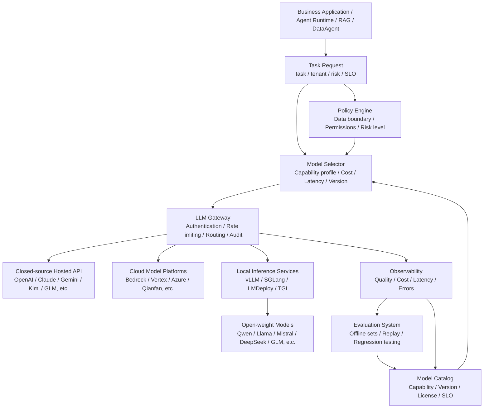
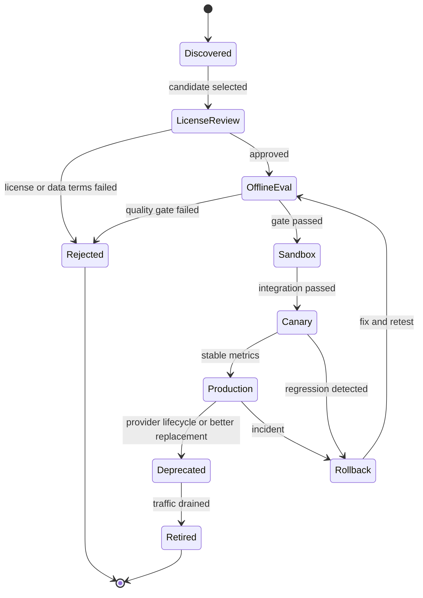
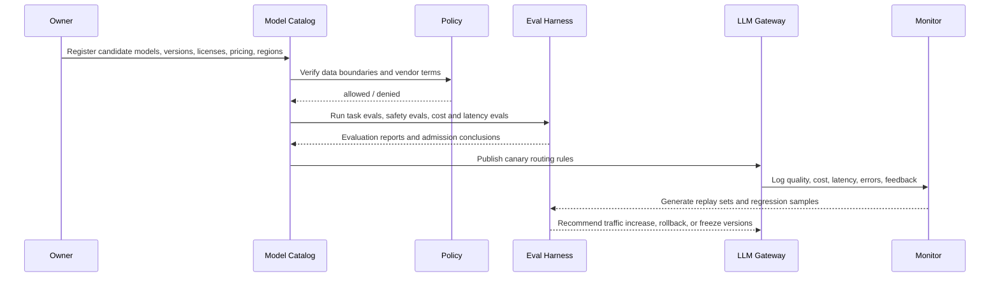
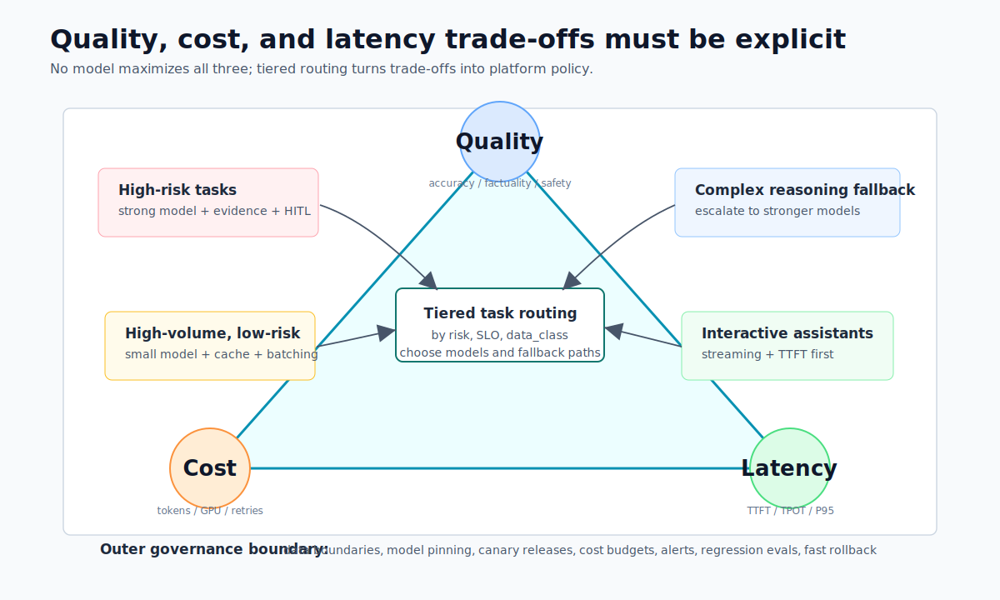

# Chapter 5 Model Selection for Large Language Models

---

Model selection cannot remain a one-time product comparison. In an enterprise platform, it becomes a runtime decision constrained by task profiles, data boundaries, SLOs, cost, and lifecycle management. The goal is to match suitable models to different tasks and let that matching change as business needs and model versions evolve. Business tasks, a model matrix, runtime routing, hosted and self-hosted options, and the tradeoff between large and small models form the decision framework for enterprise model selection.

Once model selection enters the enterprise, it is no longer a supplier choice made only by the model team. Business owners care about result quality, platform teams care about routing and rollback, security teams care about data boundaries, and finance teams care about cost. A useful selection review has to hold these constraints together: define the task profile first, decide candidate models and routing strategy next, then keep calibrating the decision with enterprise evaluation sets and runtime data.

Model selection rarely ends with a leaderboard. During a pilot, a team may choose a capable model that is easy to integrate. In production, the same model may have to serve high-volume customer service, finance analytics, contract review, code generation, and offline store assistants. These scenarios have different requirements for latency, cost, context length, structured output, data egress, and version stability. If the organization still treats selection as "one model for the whole company," the platform soon hits two problems: low-risk tasks carry excessive cost, while high-risk tasks lack enough reasoning and auditability.

Real review meetings are more complicated than model-comparison tables. Business owners ask about accuracy and launch time. Security asks whether data can leave the intranet. Platform teams need to confirm gateway, throttling, degradation, and rollback support. Finance wants cost attribution by tenant and task. A public benchmark score cannot answer these questions by itself. Enterprises need a running model matrix: tasks are profiled, routed, evaluated, and then adjusted with runtime evidence.

A common failure is routing both a complex DataAgent task and a simple classification task to the same strong model. The former needs high-quality SQL, tool calling, and explainability; the latter needs stable labels and low latency. A single model makes early launch simple, but cost and queueing delay grow quickly. If the strong model changes output format after a version upgrade, all businesses are affected together. A better approach is to treat models as governed resources and put capability, cost, compliance, and lifecycle into platform configuration, so different tasks can choose different models under one control plane.

---

## 5.1 Model Selection Begins with Business Tasks

### 5.1.1 Model Matrix Needs in Multi-Line Enterprises

When a multi-business-line enterprise launches an Agent platform, the first question is often which model to use, not how to write the Agent loop. The customer-support team wants low-cost processing for tens of thousands of tickets per day. Finance wants DataAgent to generate executable and auditable SQL. Legal wants contract assistants that do not invent clauses. Engineering wants code assistants that understand internal repositories. Store operations wants offline assistants that can query SOPs when the network is unstable. These all require large-model capability, but the model requirements differ sharply. Choosing a model solely by public rankings will quickly hit real constraints:

- Customer support classification does not need the costliest reasoning model, but it needs stable JSON output, low latency, and very low per-query cost.
- DataAgent needs reasoning, structured output, tool invocation, and SQL safety checks; normal chat quality is not enough.
- Contract review needs evidence citation, refusal boundaries, and human-in-the-loop checks; fluent writing is not a reliable conclusion.
- Internal code assistants need long context windows, repo retrieval, patch generation, and sandboxed execution; ordinary chat models may not suffice.
- Store offline assistants prioritize local deployment, lightweight models, Chinese language support, and data residency.

Enterprise model selection should not stop at procurement or a slogan that the whole company will standardize on one model. It should become a continuous engineering mechanism: define task profiles, select candidate models, validate them on enterprise benchmarks, route requests through an LLM Gateway, and monitor quality, cost, latency, and version lifecycle. A multi-business enterprise needs a *model matrix*, not a single best model.

*Table 5-1: Primary metrics, model preferences, and fallback strategies by business scenario. Source: compiled by the authors.*

| Business Scenario             | Primary Metrics                     | Model Preferences                      | Fallback Strategy                             |
|------------------------------|-----------------------------------|--------------------------------------|-----------------------------------------------|
| Customer Support Ticket Classification | JSON validity, cost, P95 latency      | Low-cost general or lightweight local model | Escalate low confidence cases to human or strong model recheck |
| DataAgent / NL2SQL            | SQL correctness, tool reliability, permission security | Reasoning model + strong structured output | Pre-execution validation, fallback to strong model repair or manual review |
| Contract Review               | Evidence citation, risk grading, refusal boundary | High-capability closed-source or private deployment strong model | Enforce citation, key conclusions go to human-in-the-loop (HITL) |
| Internal Knowledge Q&A        | RAG factual consistency, long context, citation | General model + RAG, or long-context model as needed | No answer without evidence, favor retrieval-augmented generation (RAG) |
| Code Assistant               | Code understanding, patch quality, tool invocation | Code-specialized or strong reasoning model | Sandbox testing, review gate, rollback capability |
| Store Offline Assistant      | Data locality, deployment cost, response speed | Small open-weight model, local inference | Sync logs and knowledge repository after network recovery |


*Figure 5-1: Enterprise model matrix and runtime routing. Source: original diagram by the authors. Alt text: The left side is a model pool arranged by cost and capability, including lightweight local models, domestic hosted models, and strong global models. The middle is a model gateway receiving task profiles and governance policies. The right side shows business tasks. Arrows show routing by task with fallback reserved.*

Figure 5-1 illustrates a three-layer relationship: business task profiles, the governance and selection layer, and the routable model pool. It follows Table 5-1 and leads into Section 5.2, where the middle governance layer becomes a runtime capability. The basic point is that selection starts from business tasks, not model brands. Vendors, deployment forms, versions, and inference parameters should all be abstracted by the platform into governable model-capability resources.

### 5.1.2 Candidate Model Classification Axes and Capability Dimensions

In enterprise model discussions, it's easy to confuse dimensions like closed-source, open source, domestic, self-hosted, cloud service, inference model, and long-context model. They are distinct classification axes.

*Table 5-2: Definitions and selection questions for hosted, open-weight, and other model categories. Source: compiled by the authors.*

| Concept              | Definition                                   | Key Questions for Selection                        |
|----------------------|----------------------------------------------|---------------------------------------------------|
| Closed-source hosted model | Model weights are not public; accessed via vendor API or cloud platform | Can data leave domain? Are SLA and pricing acceptable? Version stability? |
| Open-weight model     | Model weights can be downloaded or privately deployed; licenses vary | Is license commercial-use allowed? Can team deploy, fine-tune, and maintain? |
| Domestic model        | Model or platform provided by Chinese teams or cloud service | Does it meet data compliance, Chinese scenarios, procurement, and local service requirements? |
| Self-hosted model     | Enterprise runs model weights and inference service itself | Does the enterprise have GPU, inference engine, operations, and security isolation? |
| Cloud model platform  | Access to multiple models through platforms like Bedrock, Vertex AI, Azure, Qianfan | Need for unified IAM, region, billing, private network, and model lifecycle management? |
| Inference model       | Models focused on complex reasoning, planning, code, math; often higher latency and cost | Does the task truly require deep reasoning? Is longer response acceptable? |
| Long-context model    | Models supporting large context windows     | Should RAG, summarization, or context compression be used first to limit input? |
| Multimodal model      | Models processing text, images, audio, video inputs | Does business input involve multimodal evidence? How is output verified? |

"Domestic model" and "open-weight model" should not be conflated. A domestic model may be a closed API or an open-weight model. An open-weight model may also come from an overseas team. Enterprises need to decompose models into multiple attributes: vendor, deployment region, license, weight availability, data boundary, capability, cost, latency, context length, tool calling, structured output, and lifecycle. Model selection should consider at least eight dimensions.

*Table 5-3: Evaluation dimensions, questions, and metrics for candidate models. Source: compiled by the authors.*

| Dimension          | Key Question                                 | Typical Metrics                                    |
|--------------------|----------------------------------------------|---------------------------------------------------|
| Task Capability    | Can the model accomplish the business task? | Task success rate, SQL correctness, classification accuracy, code test pass rate |
| Output Controllability | Can the model stably return schema, tool parameters, or citations? | JSON validity rate, tool call success rate, parse retry rate |
| Factual Reliability | Does the model answer based on evidence? How prone to hallucination? | Groundedness, citation hit rate, refusal without evidence rate |
| Latency and Throughput | Meets interactive or batch SLO?                 | TTFT, TPOT, P95/P99 latency, tokens/sec           |
| Cost               | Are per-task and monthly costs controllable?    | Input/output token cost, cache hit benefits, GPU utilization |
| Data Boundary      | Are inputs/outputs allowed by vendor or region? | Data classification, domain exit policies, log retention, encryption, audit |
| Operability        | Can model be monitored, throttled, grayed, and rolled back? | Error rates, version pinning, health checks, downgrade policies |
| Ecosystem Compatibility | Supports existing SDKs, inference engines, toolchains? | OpenAI compatible API, vLLM/SGLang support, tokenizer consistency |

Weights on these eight dimensions vary by business scenario. Customer support prioritizes cost and latency; contract review prioritizes evidence and risk control; DataAgent prioritizes structured output, tool calls, and SQL validation. The first step is not listing models but clearly writing the task profile.

### 5.1.3 Task Profiling: Turning Requirements into Measurable Constraints

A task profile can be described by answering the questions below.

*Table 5-4: Questions and example answers for translating task requirements into measurable constraints. Source: compiled by the authors.*

| Question                  | Sample Answer                                     |
|---------------------------|--------------------------------------------------|
| What is the input?        | User natural language query + table schema + permission context |
| Who consumes the output?  | DataAgent runtime and frontend dashboards         |
| Is the output machine-consumable? | Yes, must return query plan and draft SQL         |
| What's the failure cost?  | Medium-high; incorrect SQL may mislead business decisions |
| Does it contain sensitive data? | Yes, includes sales, inventory, and membership aggregate data |
| Latency goal              | P95 return interpretable result within 30 seconds |
| Allowed human intervention? | Yes, sensitive queries require confirmation          |
| Need local deployment?    | Production data must not leave network; prioritize local or private cloud |

Once these constraints are written down, model selection can move from technical preference to engineering decision. The review can discuss candidate models with evidence instead of arguing over vendor brands or personal preference.

### 5.1.4 Propagation From Selection Error to Production Risk

Public benchmarks are useful for initial screening, but the top model on a leaderboard is not automatically the first production choice. Many leaderboards focus on general knowledge, math, code, or multimodal ability. A multi-business enterprise cares about customer-service enums, internal metric definitions, SQL execution success, contract evidence citation, and safe refusal. A high-scoring model that frequently emits invalid JSON against enterprise schemas cannot go straight to production.

A single strong model also creates cost and risk imbalance. It is easy to manage, but low-risk, high-volume tasks waste budget when they use a strong model, and high-risk tasks amplify errors when they use an ordinary model. The platform should let a model matrix serve different tasks while hiding the complexity behind the gateway.

Open weights reduce vendor lock-in and may reduce long-term inference cost, but "open" does not mean free. The enterprise still bears GPU cost, inference-engine work, capacity planning, model security, license review, quantization evaluation, and operations staffing. Self-hosting replaces API spending with infrastructure and platform-engineering cost. Domestic models can reduce procurement, service, and data-egress pressure, but model origin does not automatically satisfy compliance. Compliance depends on deployment region, log retention, data classification, contract terms, access control, audit, and vendor security commitments.

Lifecycle is part of selection. Vendors release new models, retire old ones, adjust context windows, change prices, update rate limits, and modify API parameters. Without version pinning, canaries, and regression evaluation, an Agent's behavior can change after a supplier upgrade. Model selection must include lifecycle governance from the beginning.

---

## 5.2 Runtime Governance of the Model Matrix

### 5.2.1 Three Routing Modes in the Call Chain

Model selection capability sits between business applications and model calls. It is not an offline spreadsheet. It is a runtime decision layer composed of an LLM Gateway, model catalog, evaluation system, policy engine, and observability.



In this chain, business applications should not hardcode `model="vendor_latest_model"`. Instead, they declare tasks, tenants, risk levels, latency goals, output formats, and data classification. The model selector chooses candidates based on registry and policies, and the LLM Gateway handles calls, retries, audits, and downgrade. A multi-line enterprise's model selection layer must support three runtime modes.

*Table 5-5: Explicit, policy-based, and arbitration routing modes. Source: compiled by the authors.*

| Mode            | Description                             | Applicable Scenario                    |
|-----------------|----------------------------------------|--------------------------------------|
| Explicit model  | Business or evaluation specifies specific model version | Offline evaluation, regression testing, reproduce issues |
| Policy routing  | Business declares task profile, platform chooses model | Default production mode               |
| Multi-model arbitration | Multiple models generate or re-judge, platform votes or adjudicates | High-risk contract review, SQL repair, spot-checking customer service quality |

Explicit models fit reproducibility, policy routing suits scale, multi-model arbitration fits high risk. Platforms must support all three; otherwise, either control or cost efficiency suffers.

### 5.2.2 Model Catalog, Policy Engine, and Routing Contract

A production-grade model selection system typically includes seven components.

*Table 5-6: Responsibilities, inputs, outputs, and failure modes of the model catalog, policy engine, and routing contract. Source: compiled by the authors.*

| Component         | Responsibility                        | Input                           | Output                  | Failure Mode                     |
|-------------------|------------------------------------|--------------------------------|-------------------------|----------------------------------|
| Model Catalog     | Records vendors, versions, capabilities, license, pricing, regions | Vendor docs, model cards, internal tests | Queryable model list      | Outdated info, missing license review |
| Capability Profiler | Characterizes model abilities on unified eval sets | Candidate models, task eval sets | Task scores and capability tags | Evaluation bias, test contamination |
| Policy Engine     | Determines data boundary, tenant permissions, risk levels | tenant, data_class, region, risk | Allowed model set        | Missing policy, excessive permission |
| Model Selector    | Selects models by quality, cost, latency within allowed set | Task profile, model profile, SLO | primary / fallback / guard models | Routing rule conflicts          |
| Provider Adapter  | Unifies APIs across vendors and inference engines | Standardized request          | Standard response / streaming | Incompatible parameters, inconsistent error codes |
| Release Controller | Manages canary, rollback, deprecation, version pinning | Eval reports, release policies | Routing version rules    | Behavior drift between versions  |
| Cost & Quality Monitor | Logs online quality, cost, latency, errors | Traces, usage, feedback        | Reports, alerts, replay sets | Missing fields, PII leaks         |

The model catalog is more than a list of model names. It should record at least these fields:

```yaml
model_id: local-qwen3-32b-instruct
display_name: Qwen3 32B Instruct Local
provider: internal
deployment: self_hosted
endpoint: http://llm-gateway.internal/v1/chat/completions
api_style: openai_compatible
weight_access: open_weight
license_review: approved
data_boundary:
  allowed_data_classes:
    - public
    - internal
    - confidential_aggregate
  region: cn-private
capabilities:
  text: true
  vision: false
  tool_calling: true
  structured_output: true
  reasoning: medium
  code: medium
limits:
  context_tokens: 32768
  max_output_tokens: 4096
slo:
  p95_latency_ms: 12000
  monthly_budget_usd: 5000
eval:
  customer_service_json_validity: 0.985
  dataagent_sql_exec_success: 0.78
  safety_refusal_accuracy: 0.93
release:
  status: production
  pinned_version: "2026-06-01"
  fallback_model: frontier-reasoner
```

Business requests should avoid specifying vendor details directly. Below is an example task-level model selection request:

```json
{
  "task": "dataagent_sql_planning",
  "tenant": "retail-analytics",
  "risk_level": "high",
  "data_class": "confidential_aggregate",
  "slo": {
    "p95_latency_ms": 30000,
    "max_cost_usd": 0.30
  },
  "required_capabilities": {
    "structured_output": true,
    "tool_calling": true,
    "reasoning": "high"
  },
  "response_contract": {
    "type": "json_schema",
    "schema_id": "dataagent_query_plan",
    "schema_version": "1.2.0"
  }
}
```

The model selector returns not a bare model name but a set of routing decisions:

```json
{
  "primary": {
    "model_id": "frontier-reasoner-private",
    "reason": "passed data boundary; highest sql planning score within SLO"
  },
  "fallbacks": [
    {
      "model_id": "local-qwen3-32b-instruct",
      "when": "provider_timeout_or_budget_exceeded"
    }
  ],
  "guards": {
    "pre_check": "pii_redaction_v2",
    "post_check": "sql_policy_validator_v3"
  },
  "release_policy": {
    "pinned": true,
    "canary_percent": 10
  }
}
```

The key to this contract is turning model selection into an auditable decision: why was this model chosen, when to degrade, which data is allowed, and what checks the output went through should remain traceable.

### 5.2.3 Lifecycle, Canary, and Failure Recovery

Models move through a clear lifecycle from candidate to production.



The pre-launch sequence flow:



Once in production, risks center on routing, versions, pricing, quotas, structured output, and data boundaries. Table 5-7 maps these risks back to runtime control points to enable platform-level canary, rollback, and audit capabilities.

*Table 5-7: Common model-service failure modes, signals, and recovery strategies. Source: compiled by the authors.*

| Failure Mode           | Typical Signal                        | Recovery Strategy                                  |
|-----------------------|-------------------------------------|--------------------------------------------------|
| Vendor API failure    | 5xx errors, timeouts, region unavailability | Gateway switches to fallback, logs event, triggers vendor alerts |
| Model version drift   | Same prompt yields different behavior | Use pinned version, run regression tests before upgrade |
| Price or rate limit change | Increased per-task cost, more 429s       | Adjust routing weights, enable caching, move low-risk tasks |
| Structured output degradation | Increasing JSON parse failures          | Downgrade to more stable model, enable constrained decoding or retries |
| Data boundary misconfiguration | Sensitive fields entering forbidden vendor | Policy engine blocks, audit event, replay to fix routes |
| Long context impacts SLO | TTFT and costs spike                   | Compress context, reorder RAG, limit input tokens |
| Self-hosting capacity shortage | Queue length, GPU memory, P99 latency rise | Throttle, batch, scale out, switch to cloud backup models |
| Model quality regression | User feedback, sample check accuracy drop | Freeze traffic, rollback version, expand eval dataset |

These failure modes show why selection cannot stop at one decision. Production work must detect model behavior degradation, explain why a request routed to a model, and roll back quickly during incidents.

---

## 5.3 From Model Selection to Governance Strategy

### 5.3.1 Closed-Source Hosted, Open-Weight, and Private Cloud

Closed-source hosted models fit early validation and difficult-task fallback. Their advantages are strong capability, quick integration, and no inference-cluster operations. Their costs are data-boundary review, version changes, price changes, and vendor lock-in. Open-weight self-hosting fits high-frequency, stable, sensitive internal tasks, especially customer-service classification, intranet knowledge Q&A, and routine DataAgent questions. It keeps data control inside the enterprise and transfers GPU, inference optimization, quantization, monitoring, and license-review cost to the enterprise. Private cloud or on-prem hosting sits between the two. It fits finance, government, and core-data scenarios, but business negotiation, deployment cycle, and price all need separate evaluation.

Mini-platform should not treat these options as a single-choice question. A practical path is to use hosted models early to validate business value, move high-frequency and sensitive stable tasks to open-weight or private-cloud deployments in the middle phase, and keep a small number of strong hosted models for difficult reasoning, multimodal tasks, and fallback. This combination works only when Gateway, Policy, and Eval can express task risk. Otherwise it devolves into hardcoded model names scattered through business code.

### 5.3.2 Domestic Models vs. Global Models

Domestic and global models should not be reduced to a simple capability ranking. Domestic hosted models are often easier to adopt for Chinese language, procurement, service response, data residency, and local ecosystem needs. They fit domestic business, Chinese customer service, and government/enterprise compliance scenarios. Global hosted models may still lead in frontier capability, tool ecosystem, and multimodal update speed, but data export, procurement path, and network availability need strict Policy control. Domestic open-weight models fit local deployment, edge nodes, intranet knowledge Q&A, and high-frequency DataAgent tasks when the enterprise can handle inference operations and tuning.

Domestic model is not a technical grade. It spans supply chain, compliance, service, and ecosystem. Enterprises should evaluate domestic and global models together, use data boundaries to decide where each model is allowed, and use business evaluation to decide traffic share. For mini-platform, the safer path is to put domestic hosted, global hosted, and domestic open-weight models in the candidate pool, then let `core/policy/` and `core/eval/` decide which tasks can route to which models.

### 5.3.3 Single Strong Model vs. Model Matrix

One strong model is attractive during prototyping: integration is simple, behavior is relatively consistent, and troubleshooting is easier. It concentrates cost, supplier risk, and capability bottlenecks in one place. A two-model strategy is a better early-production shape: one general model handles routine tasks, one strong model handles fallback and difficult tasks, and routing rules stay simple. A full model matrix is the target state after the platform scales. It selects models by task type, risk level, tenant, cost, and latency, but it assumes that the registry, evaluation, gateway, monitoring, and rollback mechanisms already exist.

A multi-line enterprise should not maintain dozens of models on day one. A stable path starts with a two-model strategy, then expands to customer service, DataAgent, code, contract, multimodal, local offline, and other pools after evaluation and gateway are mature. As model count grows, the governance pressure shifts from "how to call a model" to "how to explain why this request routed to this model." That is why the model matrix needs platform support.

### 5.3.4 Long-Context Models vs. RAG / Context Engineering

Long-context capability is valuable, especially for temporary document analysis, single-document review, and low-frequency exploration. It should not become a reason to put every possible material into the prompt. Long context increases cost and TTFT, and irrelevant material can raise hallucination risk. For knowledge bases, policies, manuals, and metric definitions that need citation, access filtering, and updates, RAG with reranking remains the default engineering path.

Multi-turn conversations, long traces, and batch documents are better handled with summarization and context compression: keep stable facts, preserve references to large objects, and reread source material when needed. Mini-platform should treat long context as a controlled capability instead of a replacement for the knowledge system. Direct long context can serve a small number of high-value tasks. RAG handles citeable, updatable, permission-filtered knowledge. Summarization and compression control the cost of multi-turn context. Together they ensure the model sees selected context instead of arbitrary piles of material.

### 5.3.5 The Quality-Cost-Latency Triangle

No enterprise platform can simultaneously pursue highest quality, lowest cost, and lowest latency for all tasks. Model selection work means making this triangle explicit and embedding decisions into routing policies. High-risk tasks usually prioritize quality. They can use strong models, multi-model rejudgment, and more complete context, but they accept higher cost and latency. High-frequency, low-risk tasks usually prioritize cost. They can use lightweight models, caching, batching, or local inference, but evaluation must prove quality stays above the usable line. Interactive tasks care more about TTFT and P95 latency, so they fit smaller models, short context, streaming output, and nearby regions. A sustainable strategy is tiered routing: routine tasks first take the low-cost path, then escalate when failure or risk increases.



*Figure 5-2: Quality, cost, and latency triangle and governance boundary. Source: original diagram by the authors. Alt text: A triangle has quality, cost, and latency as vertices. The center notes that all three cannot be optimal at the same time. The outer ring shows SLO and budget as governance boundaries.*

Figure 5-2 does not provide one optimal point. It reminds readers to place different tasks in different strategy zones: high-risk tasks prioritize quality, high-frequency low-risk tasks prioritize cost, and interactive tasks prioritize TTFT and P95 latency. The gateway then turns those choices into routing and fallback paths.

---

## 5.4 Runtime Landing Point for the Model Matrix

### 5.4.1 Platform Landing Point for the Model Matrix

The current mini-platform is in v0.1 skeleton stage. Model selection should first focus on four boundaries: gateway, evaluation, policy, and observability, before building a complex full model platform. In mini-platform, the model matrix should land on a few clear boundaries. `core/gateway/` unifies model-call interfaces, primary/fallback selection, and vendor differences. `core/eval/` stores evaluation sets, runs offline evaluations, and produces admission thresholds. `core/policy/` checks tenant, data classification, region, and vendor availability. `core/guardrails/` handles input redaction, output checks, and sensitive-task blocking. `core/observability/` records trace, usage, latency, cost, and quality feedback. Knowledge tasks should default to retrieval through `core/rag/` instead of treating long context as the only option.

If the teaching implementation later expands the model matrix, it can add `core/gateway/model_catalog.py`, `core/gateway/model_selector.py`, `core/gateway/provider_adapter.py`, `core/eval/model_selection_eval.py`, and `core/policy/model_policy.py`. These files would carry model profiles, selection policy, provider adaptation, admission evaluation, and data-boundary decisions. This chapter does not require implementing them now because model platforms expand too easily. The first version should make the call, evaluation, policy, and observation boundaries explicit and prevent business code from hardcoding model names.

### 5.4.2 Model Selector and Configuration Example

The example below shows a minimal model selector. It is not a complete production implementation, but expresses mini-platform engineering boundaries: task profiling, model profiling, policy filtering, and score-based selection.

```python
# Suggested source: mini-platform/core/gateway/model_selector.py
from __future__ import annotations

from dataclasses import dataclass, field

@dataclass(frozen=True)
class TaskProfile:
    task: str
    tenant: str
    data_class: str
    risk_level: str
    max_latency_ms: int
    max_cost_usd: float
    required_capabilities: set[str] = field(default_factory=set)

@dataclass(frozen=True)
class ModelProfile:
    model_id: str
    provider: str
    deployment: str
    allowed_data_classes: set[str]
    capabilities: set[str]
    p95_latency_ms: int
    cost_per_1k_output_tokens: float
    eval_scores: dict[str, float]
    status: str = "production"

@dataclass(frozen=True)
class ModelRoute:
    primary: str
    fallback: str | None
    reason: str

class ModelSelector:
    def __init__(self, models: list[ModelProfile]) -> None:
        self._models = models

    def select(self, task: TaskProfile) -> ModelRoute:
        candidates = [
            model
            for model in self._models
            if model.status == "production"
            and task.data_class in model.allowed_data_classes
            and task.required_capabilities <= model.capabilities
            and model.p95_latency_ms <= task.max_latency_ms
            and model.cost_per_1k_output_tokens <= task.max_cost_usd
        ]

        if not candidates:
            raise ValueError(f"no model satisfies policy for task={task.task}")

        ranked = sorted(
            candidates,
            key=lambda model: (
                model.eval_scores.get(task.task, 0.0),
                -model.cost_per_1k_output_tokens,
                -model.p95_latency_ms,
            ),
            reverse=True,
        )

        primary = ranked[0]
        fallback = ranked[1].model_id if len(ranked) > 1 else None
        return ModelRoute(
            primary=primary.model_id,
            fallback=fallback,
            reason=(
                f"selected by task score for {task.task}; "
                f"provider={primary.provider}; deployment={primary.deployment}"
            ),
        )
```

Supporting configuration can start from YAML. The point is to make routing, validation, and canary strategy reviewable as text first. When versions, tenants, and release workflows become more complex, the same information can migrate to a database or configuration center.

```yaml
models:
  - model_id: frontier-reasoner-private
    provider: commercial-api
    deployment: managed_private
    allowed_data_classes: [public, internal, confidential_aggregate]
    capabilities: [text, reasoning_high, tool_calling, structured_output]
    p95_latency_ms: 25000
    cost_per_1k_output_tokens: 0.08
    eval_scores:
      dataagent_sql_planning: 0.86
      contract_risk_review: 0.90
      customer_service_classification: 0.93

  - model_id: local-qwen3-32b-instruct
    provider: internal
    deployment: self_hosted
    allowed_data_classes: [public, internal, confidential_aggregate, confidential_raw]
    capabilities: [text, reasoning_medium, tool_calling, structured_output]
    p95_latency_ms: 12000
    cost_per_1k_output_tokens: 0.01
    eval_scores:
      dataagent_sql_planning: 0.78
      contract_risk_review: 0.74
      customer_service_classification: 0.91

  - model_id: fast-classifier
    provider: internal
    deployment: self_hosted
    allowed_data_classes: [public, internal]
    capabilities: [text, structured_output]
    p95_latency_ms: 1500
    cost_per_1k_output_tokens: 0.002
    eval_scores:
      customer_service_classification: 0.88

routes:
  customer_service_classification:
    primary: fast-classifier
    fallback: local-qwen3-32b-instruct
    escalation:
      low_confidence: frontier-reasoner-private

  dataagent_sql_planning:
    primary: frontier-reasoner-private
    fallback: local-qwen3-32b-instruct
    guards:
      - pii_redaction_v2
      - sql_policy_validator_v3
```

Model evaluation configs should also be versioned. "Model usable" should never live only in people's memory.

```yaml
eval_suite: model_selection_gate_v1
datasets:
  - name: customer_service_classification
    path: datasets/eval/customer_service_classification.jsonl
    metrics:
      json_validity_min: 0.98
      category_accuracy_min: 0.88
      p95_latency_ms_max: 3000
  - name: dataagent_sql_planning
    path: datasets/eval/dataagent_sql_planning.jsonl
    metrics:
      schema_validity_min: 0.97
      sql_exec_success_min: 0.75
      forbidden_table_access_max: 0
  - name: safety_regression
    path: datasets/eval/safety_regression.jsonl
    metrics:
      refusal_accuracy_min: 0.95
      sensitive_leakage_max: 0
release_gate:
  require_license_approval: true
  require_cost_owner: true
  require_rollback_model: true
```

This configuration's core value is reproducible model replacement. In the future, switching from OpenAI, Claude, Gemini, Qwen, DeepSeek, Kimi, GLM, ERNIE, Llama, Mistral, or a local quantized model should not require application code changes. The model catalog, evaluation reports, and routing strategies should change instead.

### 5.4.3 Release Evidence for Routing Policies

Routing policies need release evidence in addition to configuration. Each model should declare allowed data classification, tenant scope, region, and vendor boundary. Each route should log task, model version, prompt template, schema, data class, and fallback reason. Cost should be attributed by tenant, task, model, and project, including tokens, cache hits, GPU cost, and monthly budget. Performance monitoring should cover TTFT, TPOT, P50/P95/P99 latency, queue length, 429s, timeouts, and retries.

Production routes also need stability evidence. Every route should have fallback, timeout, circuit breaker, canary, and rollback policy. Quality evidence should come from enterprise evaluation sets before release and online replay after release. Machine-consumed outputs need schema validation, business validation, and retry limits. Sensitive fields should be redacted or blocked before the gateway, and logging policy should distinguish debug logs from audit logs. Open-weight models need license review for commercial use, redistribution, training-data terms, and model-output terms. Disaster recovery should cover vendor outage, local GPU failure, and model deprecation, with substitute paths and notification rules.

### 5.4.4 Review Path After Selection Mistakes

Selecting models with only short prompt samples produces optimistic latency and quality. Real inputs for RAG, DataAgent, and contract review may include thousands or tens of thousands of tokens, tool schemas, history, traces, and citations. Selection evaluation should cover short requests, long contexts, high concurrency, structured output, and retry paths.

SQL errors also need careful attribution. They may come from missing schema context, unclear semantic-layer definitions, tool errors, or permission blocking, instead of model quality alone. Evaluation should preserve full traces so the team does not switch models while leaving the real system problem untouched.

Vendor aliases create another risk. Some model names are fixed snapshots; others point to new versions over time. Production systems that call aliases directly can see behavior drift after supplier upgrades. high-risk tasks should use explicit versions or internally pinned aliases and run regression tests before upgrades.

The failure modes in Table 5-7 also appear after production. A low-cost model is reasonable for customer-service classification, but without an escalation path it can mishandle low-confidence cases, parse failures, complaint escalations, VIP customers, or regulatory keywords. Self-hosted models can also look cheap before operations are counted. Idle GPUs, peak scaling, model loading, driver upgrades, inference-engine compatibility, logging audit, and security patches all consume team capacity. Self-hosting pays off when load is stable, data boundaries matter, and the platform team can operate inference systems.

Model matrices should enter the release process. When a candidate model is added, the platform should state which tasks it can serve, which failure modes are covered by evaluation samples, what the default fallback is, and who confirms results after version upgrades. If this information stays in meeting notes, the gateway cannot execute it and incident reviews cannot explain why a request landed on that model.

After selection, teams should keep observing online distribution. A model may perform well on evaluation sets while real users concentrate on long context, metric clarification, or tool-call failure. Another low-cost model may handle classification well, then misclassify when a holiday promotion changes input distribution. Logs, human review, and cost reports should keep adjusting matrix weights. The selection deliverable should therefore include task profiles, candidate evaluation results, routing policy, fallback policy, cost budget, data-egress statement, and version observation window, instead of ending with a recommended model list.

The platform also needs to define who can change routing. Switching a task to a strong model, moving a tenant to a local model, or disabling a vendor changes cost, latency, compliance path, and user experience. These changes should enter an approval or release process that records reason, impact scope, rollback condition, and observation window. Otherwise the model matrix becomes a historical configuration that no one dares to touch.

Evaluation samples should not be maintained only by the model team. Business teams provide real tasks and acceptable answers, data teams clarify metric definitions and permissions, security teams add refusal and data-boundary samples, and platform teams add timeout, rate-limit, structured-output failure, and fallback cases. A model leading on general reasoning tasks may still be a poor fit for approval recommendations, metric explanations, or contract-clause extraction.

After a period of operation, the model matrix should have a review cadence. A monthly review can inspect selected models by task, failure distribution, human-review ratio, unit cost, and latency distribution. If fallback handles a task most of the time, the primary model or prompt is unstable. If a low-risk task keeps using a strong model, the routing policy is too conservative. If a model version increases human rejection after launch, offline evaluation missed real cases. The review is not for blame; it keeps model selection close to the business.

Enterprises also need an exit path. Supplier price changes, regional compliance requirements, service outages, and model retirement can all force changes to the model pool. If task profiles, evaluation sets, routing policies, and replay logs are intact, replacement can compare old and new models through the same gate. If the organization only remembers that it chose one model months ago, migration becomes a rebuild.

The practical question is whether the platform can explain a wrong answer. If it can explain why this model was selected, which policy allowed it, which fallback existed, and which evaluation gate it passed, selection has entered the engineering system. If it cannot, selection is still a meeting conclusion.

Model selection also needs to connect with procurement. Contracts often focus on volume, region, price, and SLA, while runtime systems care about task fit, version stability, data handling, and failure switching. During pilots, procurement questions should be translated into verifiable clauses: whether model versions are fixed, whether retirement is announced in advance, whether logs can be disabled, whether data is used for training, how regions and private links are configured, and how rate limits or outages are reported.

Model choice affects developer experience. Tool-call format, structured-output capability, context length, and streaming style vary by provider. If the platform exposes these differences to every Agent, application code fills with provider branches. If it hides every difference, applications may assume all models have the same capability. LLM Gateway should provide a common interface while keeping capability differences as routing and evaluation conditions.

Model upgrades need replay sets from real runs. A replay set includes original input, context summary, tool result, expected output, and risk label. Passing generic benchmarks is not enough; the new model must be checked on structured output, refusal, citation, SQL, report tone, and cost in real chains. The replay set does not require identical output. It checks whether important behavior regresses. If a new model improves some tasks and hurts high-risk tasks, the platform can canary it into low-risk traffic instead of replacing globally.

The matrix eventually becomes an operating rhythm. New models enter the candidate pool, run standard evaluations and real replay, move into small-traffic canary, expand when online observation passes, and fall back when anomalies appear. This rhythm matters more than one-time selection because the model ecosystem changes quickly. The enterprise needs the ability to absorb new models without breaking business.

Capacity planning should start from task profiles. A small number of long-context finance-analysis requests may consume more resources than many short customer-service classifications. Code generation has long output and can raise queueing delay during peaks. Binding these characteristics to task profiles lets SRE plan model serving, gateway capacity, and budget more accurately. Model choice shapes user expectations: strong models may be slower and worth waiting for; fast low-cost models need clear uncertainty and escalation states. Product experience should reflect task type with immediate answers, asynchronous reports, or approval-gated analysis.

When enterprises use both self-hosted and external models, data classification becomes a hard routing constraint. Public-summary tasks can use external strong models; customer details, employee data, and unpublished financial reports should remain local or in a private environment. The routing system should express these as executable policies, not prompt reminders.

## 5.5 Organizational coordination for the model matrix

After a model matrix enters production, organizational coordination shapes the technical result. The model team can maintain candidate pools and evaluation scripts, but it cannot decide alone whether a task can accept higher latency, whether a refusal fits the business context, or whether a data domain can use an external model. Business owners, data owners, security owners, platform owners, and procurement teams all need to participate in model-matrix maintenance. The coordination material can stay compact, but it must put task fit, data boundary, cost budget, quality gate, and rollback responsibility in one place.

Coordination should also prevent uncontrolled use of fallback to stronger models. When quality problems appear, business teams may ask to send all traffic to the strongest model. When cost pressure appears, platform teams may move tasks to cheaper models. Both actions create risk when samples and boundaries are missing. A steadier approach limits stronger-model fallback to explicit conditions: low confidence, repeated structured-output failure, VIP customers, regulatory keywords, high-risk reports, or escalation from human review. Each fallback should enter Trace and cost views so later review can judge whether it was necessary protection or evidence that the primary model, prompt, or upstream context needs repair.

The model matrix should support organizational learning. A business line that keeps using expensive models may be handling complex work, or it may be compensating for weak semantic layers, tool returns, or report templates. A low-cost model that passes offline evaluation but triggers frequent human review online may reveal that the evaluation set misses real tasks. Review should therefore inspect upstream and downstream capability together with model replacement options. Mature model selection shifts the discussion from which model is stronger to which task chain lacks which evidence or capability.

## 5.6 Model reference entry points

The following links are official reference entry points used while writing this chapter. Before real selection, teams should recheck model versions, regional availability, context length, billing, and data-processing terms. For production procurement or launch, reviewing original documentation again is usually safer than relying on second-hand summaries.

- [OpenAI Models](https://platform.openai.com/docs/models)
- [Anthropic Claude Models](https://docs.anthropic.com/en/docs/about-claude/models)
- [Google Gemini Models](https://ai.google.dev/gemini-api/docs/models)
- [Amazon Bedrock Model Availability and Compatibility](https://docs.aws.amazon.com/bedrock/latest/userguide/models.html)
- [Qwen Documentation](https://qwen.readthedocs.io/)
- [DeepSeek API Documentation](https://api-docs.deepseek.com/)
- [Mistral Model Selection Guide](https://docs.mistral.ai/models/model-selection-guide)
- [Meta Llama](https://llama.meta.com/)
- [Kimi API Documentation](https://platform.moonshot.cn/docs/guide/start-using-kimi-api)
- [BigModel AI Open Docs](https://docs.bigmodel.cn/cn/guide/start/introduction)
- [Baidu Qianfan Model List](https://intl.cloud.baidu.com/en/doc/qianfan/s/7m95lyy43-intl-en)

## 5.7 Model retirement and candidate-pool review

After model selection, the candidate pool still needs periodic review. The common enterprise problem is often too many models, not too few. General models, code models, long-context models, small local models, vendor-specific models, and temporary trial models can all remain in the routing table. As the candidate pool grows, routing policy becomes harder to explain, evaluation samples multiply, cost attribution gets harder, and security review carries more weight. The model matrix needs a retirement process.

Retirement decisions should come from operating evidence. A model with little routing traffic may have no business value. A costly model whose advantage appears only in a few tasks can be limited to those scenarios. A model that often fails structured output or safety refusal should leave high-risk tasks. A model with an unstable vendor endpoint should receive lower routing weight or a prepared replacement. Retirement does not judge the model in the abstract. It keeps the platform candidate pool explainable.

Model retirement should preserve historical Runs. Reports, Trace, evaluation samples, and user disputes still need to know which model, version, and routing policy were used at the time. The platform can stop new requests from using a model while retaining metadata, evaluation results, and replay notes. If a model is replaced, the same business samples should compare old and new models on quality, cost, latency, format stability, and safety behavior. Retirement then avoids breaking historical evidence.

A first version can review the model candidate pool every quarter. The material includes call volume, task distribution, cost, quality, failure types, vendor stability, and safety incidents. Outcomes can be default routing, limited routing, observation pool, frozen for new requests, or formal retirement. Model selection then becomes continuous governance instead of a one-time purchase or technical evaluation.

## 5.8 Evidence and retirement after model onboarding

After a model is connected, the platform should record more than the fact that the model can be called. The durable asset is model evidence: source, license, context length, tool-call capability, cost accounting, latency distribution, safety policy, suitable tasks, failure samples, and retirement condition. If this information lives across gateway configuration, experiment notes, and personal memory, later routing changes, cost reviews, and incident reviews depend on recollection. The model catalog should be a platform asset, not a list of names.

Launch evidence should cover business tasks. A model that works for general Q&A may still be unsuitable for NL2SQL, report writing, tool planning, or compliance explanation. Each onboarding should bind to task samples and state which tasks pass, which remain pilots, and which are excluded from production. Sample results should connect to gateway routing, evaluation records, and safety policy. When the model is upgraded or degraded, the team can then see which business chains are affected.

Model retirement also needs a plan. A model may leave production because cost is high, the provider changes, license terms shift, capability falls behind, or safety samples fail. Before retirement, the platform should find dependent Agents, prompts, evaluation sets, caches, report templates, and customer commitments. After retirement, historical Runs still need the model version and output evidence. Otherwise, when old and new reports differ on the same question, the team cannot tell whether the difference came from the model, data, or prompt.

A first version can keep one card for each production model: use case, tenant, routing rule, sample pass rate, cost owner, degradation route, replacement model, and retirement condition. Model onboarding then becomes part of an auditable lifecycle instead of a temporary backend addition.

## 5.9 Release notes for model capability boundaries

After model capability management reaches production, a successful demo is not enough evidence. The platform needs stable fields for context length, tool use, structured output, refusal boundary, cost, and known limitation, and those fields should connect to release records, Trace, evaluation samples, and incident notes. When a production issue appears, teams can follow one set of facts to understand scope, ownership, and repair order instead of stitching together model logs, business logs, and verbal explanations.

This evidence also connects the surrounding chapters. It links to Chapter 6 on inference services, Chapter 8 on prompt contracts, and Chapter 45 on the gateway: upstream capabilities provide assumptions, downstream capabilities consume the result, and governance capabilities preserve evidence and review decisions. If these materials do not share identifiers and versions, the production system splits apart. Business owners see user complaints, platform owners see system errors, and security or compliance teams see explanations written after the fact. That separation makes it hard to decide whether the issue came from data, model behavior, tool contracts, workflow state, or organizational ownership.

Common production risks include model upgrades changing output style, structured-output capability regressing, and call cost exceeding the business budget. These risks are less visible during demos because demos usually exercise the successful path. Production users bring boundary cases, repeated requests, permission changes, and long-running state. The platform team should turn such failures into release samples. Some samples should block launch, some can be handled by degradation, and some require the business owner to accept the remaining risk with a review date.

Model release notes should tell business and platform teams what changed in capability instead of listing only the vendor version. The record can stay compact, but it should include time, version, owner, sample, action, and the next review condition. Without those fields, review remains informal experience. With them, one production issue can become material for later releases, evaluation suites, and training.

A first platform version can start with a small set of high-risk paths. Choose flows with high traffic, high business impact, or sensitive data, require an evidence package for each change, and then expand the practice to ordinary scenarios. This keeps the capability at the engineering level: runnable, explainable, and recoverable.
## Chapter Recap

Enterprise model selection needs a decision system, not a comparison of one strongest model. Task profiles, model profiles, data boundaries, SLOs, cost, and lifecycle should enter the same selection table. Closed-source, open-weight, domestic, self-hosted, and cloud model platforms are different classification axes and should be evaluated separately. Domestic models do not automatically satisfy compliance, and open weights do not automatically produce low cost. In production, the model matrix is maintained through a registry, admission evaluation, policy routing, fallback, observability, and version governance. Model versions and prices change quickly; production selection should rely on current official documentation, contract terms, and enterprise evaluation. The model list in this chapter is only an example of the decision framework.

## References

Liang, P. et al. (2023). [*end-to-end Evaluation of Language Models*](https://arxiv.org/abs/2211.09110). TMLR.

NIST. (2023). [*AI RMF 1.0*](https://www.nist.gov/itl/ai-risk-management-framework).

LiteLLM. (n.d.). [Documentation](https://docs.litellm.ai/).

Hugging Face. (n.d.). [Open LLM Leaderboard](https://huggingface.co/spaces/open-llm-leaderboard/open_llm_leaderboard).
