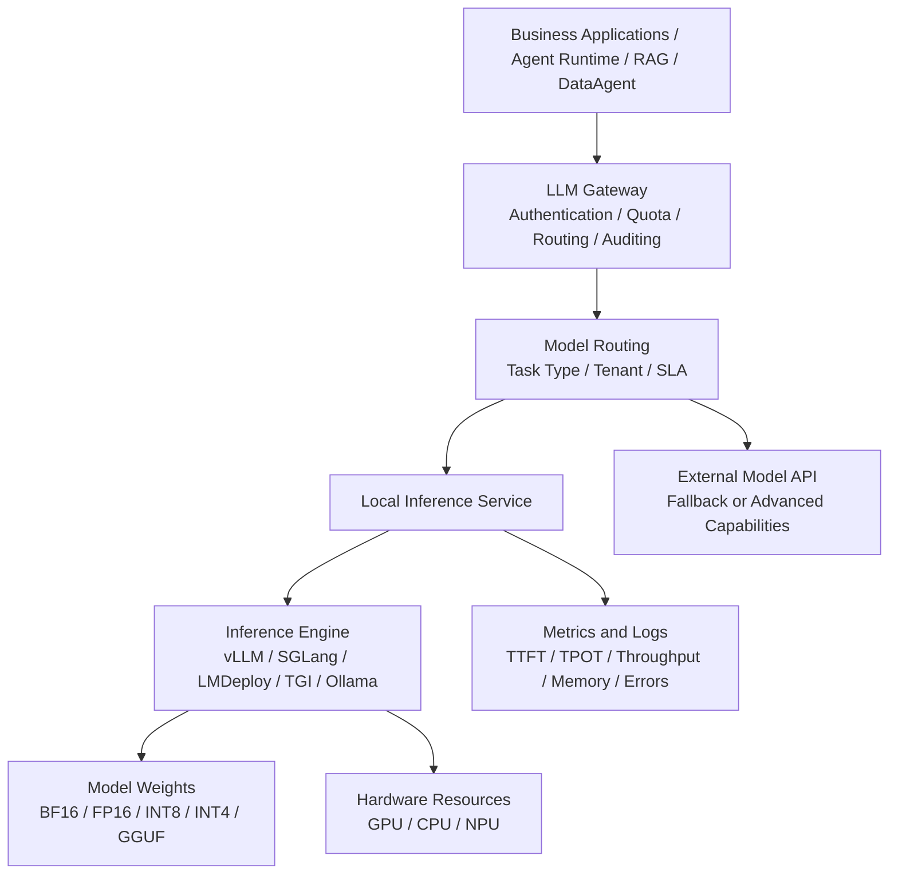
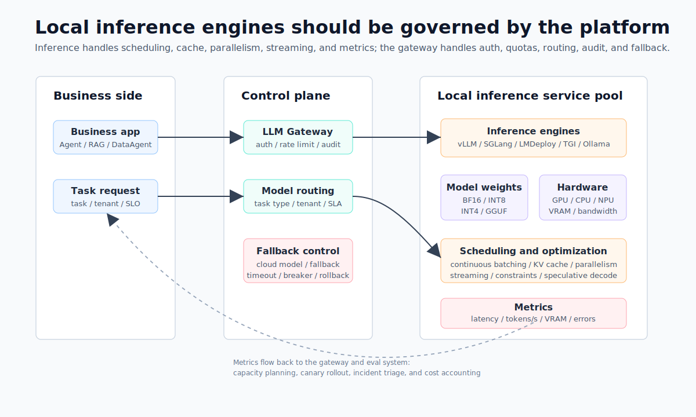
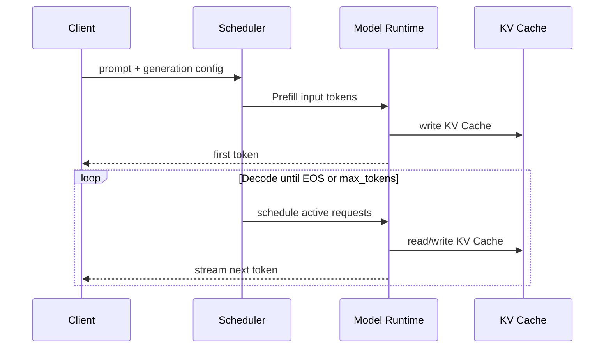

# Chapter 6 Throughput, Latency, and Deployment Boundaries of Local Inference Engines

---

Local inference is often underestimated because it looks like deployment work. It quickly becomes a capacity, latency, and governance problem. A model that responds quickly in a single-machine demo may fail to serve peak traffic from customer-service summarization, DataAgent analytics, and code assistance at the same time. Once inference becomes a platform service, it has to answer questions about throughput, time to first token, GPU memory, structured output, tenant isolation, and version release.

Many enterprises start self-built inference with a simple requirement: sensitive data cannot leave the domain, or external API cost is too high. The team deploys an open-weight model on an internal GPU and lets a few business pilots use it. The first days look fine. After usage grows, batch customer-service summaries occupy the GPU, long-context DataAgent requests push first-token latency up, code generation slows ordinary Q&A, and one department raises its max output tokens, causing other tenants to queue. The model is not broken; the platform has lost capacity control.

Local inference sits between model weights, GPU resources, and platform governance. It does more than start a model process. It organizes request queues, continual batching, KV Cache, Prefix Caching, quantization, structured output, streaming, metrics, and release management into a service. The central contradiction is that enterprise teams need both concurrency throughput and single-request latency on limited GPUs, while these two goals often pull against each other. Background summarization wants throughput, front-office assistants want first token latency, DataAgent wants structured output and long context, and code assistants want decode speed. Mixed in the same service pool, optimization for one workload can harm another.

Inference-engine selection should not rely only on benchmarks. vLLM, SGLang, LMDeploy, TGI, and Ollama solve different problems and fit different organizational stages. During personal validation, startup speed and model-management experience matter more. In production serving, continual batching, memory management, OpenAI-compatible APIs, structured output, monitoring, and multi-replica governance matter more. At platform scale, LLM Gateway integration, tenant quotas, audit logs, canary release, rollback, and fallback become part of the engine decision. An engine that cannot enter those platform processes can support only a local pilot, even if its benchmark result is strong.

This chapter discusses local inference, deployment forms, throughput and latency, continual batching, KV Cache, Prefix Caching, and inference-engine selection. The reader should first identify whether a workload is bottlenecked by throughput, first-token latency, decode speed, or memory, and only then choose engines and optimization mechanisms. The goal is not to produce the fastest single-machine result. The goal is to let local model services carry enterprise Agent workloads under a unified gateway, quota, audit, and rollback process.

Another issue often appears after launch: model, platform, and business teams look at different metrics. The model team says the model is better in offline evaluation. The platform team sees P99 TTFT breaches. The business team complains that streaming output breaks midway. Security asks whether prompts and outputs entered logs. If the engine is just a process on a GPU server, these questions become ad hoc debugging. If the engine is already connected to gateway, monitoring, quota, and release systems, teams can trace through request, queue, prefill, decode, output, and logs. For the first production version, operability should come before extreme performance. A slightly slower service with stable metrics, canary release, and rollback is more suitable than a service with impressive benchmark numbers but unexplained queueing and memory swings.

The deployment boundary also matters. Business applications should not know the private parameters of an inference engine. Engines should not own tenant policy, compliance decisions, or audit vocabulary. Requests should enter through a gateway, be routed by capability and SLO, and leave enough evidence for later replay. Chapter 7 discusses optimization mechanisms in more detail. This chapter establishes the operating boundary first: local inference is a governed service pool, not a GPU process exposed to applications.

---

## 6.1 Deployment Entry Point for Local Inference Services

When enterprises discuss local inference, the decision is not simply whether a model runs in the cloud or on-prem. The real question is whether inference capability enters the enterprise's own platform boundary: model weights, inference service, call protocol, quota, logs, cost accounting, canary release, and fault tolerance should all be controllable by the enterprise. A multi-business enterprise that sends customer knowledge bases, production-quality SOPs, financial metrics, and internal code repositories to external model APIs faces data-egress, audit, latency, and cost-prediction pressure. Downloading an open-weight model to one GPU server and launching it with a temporary script does not solve the multi-business, multi-tenant, long-running Agent problem either.

The local inference engine sits between model weights and business applications. It packages model files, GPU/CPU/NPU resources, request scheduling, token streaming generation, caching, quantization, parallelism, and service APIs into a manageable service. For enterprise Agent platforms, this engine typically is not directly exposed to end business systems but is instead invoked via unified protocols by components such as the LLM Gateway, Agent Runtime, RAG service, and DataAgent.





*Figure 6-1: Position of local inference services within an enterprise platform. Source: original diagram by the authors. Alt text: The layered diagram places local inference service in the middle. It connects upward to the model gateway and business Agents, downward to the GPU resource pool, and sideways to the model repository and monitoring.*

Figure 6-1 shows the division of responsibilities: business requests stop at LLM Gateway and model routing; the local inference engine functions only as a governed service pool. This abstraction means that replacing engines like vLLM, SGLang, LMDeploy, TGI, or Ollama later does not require changes to upstream business contracts.

Within this chain, the application layer should only concern itself with the required capability, maximum acceptable delay, and tolerable quality. It should not know whether a particular model runs on vLLM, SGLang, LMDeploy, TGI, or Ollama. The platform layer must turn the local inference service into a set of governable resource pools: which models can serve which tenants, which requests can queue, which must degrade, which may return structured output, and which require audit logging.

Once the service boundary is clear, engine replacement does not disturb business systems. A team may first use Ollama to validate an internal assistant, move to vLLM for higher concurrency, then introduce SGLang for structured Agent tasks. As long as the gateway contract, model name, generation parameters, and response format stay stable, business code does not need to be rewritten for each engine change. If applications bind directly to private engine parameters, migration drags prompts, timeouts, error codes, streaming protocols, and audit logic into every change.

## 6.2 How Throughput and Latency Determine Deployment Forms

Local inference services fall into five basic deployment forms based on operational boundaries. These are not a linear maturity progression but different choices for different loads and organizational stages.

*Table 6-1: Boundaries, advantages, and applicable scenarios for inference deployment forms. Source: compiled by the authors.*

| Form | Typical Tools | Service Boundary | Advantages | Main Limitations | Applicable Scenarios |
|---|---|---|---|---|---|
| Single-machine interactive | Ollama | Local process or desktop app | Easy to start, model trial friendly, few dependencies | Lacks multi-tenant governance and production scheduling | Personal validation, prompt experiments, initial model screening |
| Single-machine HTTP service | Ollama API, LMDeploy single-node service | One machine exposing REST or OpenAI-compatible interface | Easy app integration, low cost | Limited concurrency and high availability | Small team internal tools, edge nodes, offline use |
| Multi-GPU single node service | vLLM, SGLang, LMDeploy, TGI | Multi-GPU or multi-replica single node | High throughput, supports continual batching and tensor parallelism | Requires GPU memory planning, scheduling, monitoring | Internal portals, customer service, knowledge Q&A |
| Distributed inference cluster | vLLM, SGLang, TGI | Multi-node GPU cluster | Supports large models, multi-tenancy, high concurrency | Complex ops, network and scheduling sensitivity | Platform-level services, core business Agents |
| Edge or lightweight local inference | Ollama | Store terminals, developer machines, private small nodes | Data stays onsite, low network dependency | Limited model size, context length, concurrency | Store assistants, low bandwidth, offline prototypes |

The first form suits model execution more than model operations. Ollama reduces barriers for model download, quantized weight running, and local chat, suitable for engineers quickly comparing models like Qwen, Llama, Mistral, and Gemma on enterprise text. At this stage, platform teams focus on model quality, prompt format, context length, and basic speed, not high concurrency.

The second form starts to define a service boundary. Many tools expose OpenAI-compatible APIs so application code can point a `base_url` to an intranet address, reusing SDKs, Agent frameworks, and benchmark scripts. This step is valuable: the model service changes from a command line on one machine into an API that can be proxied by a gateway. Yet it cannot replace a full platform, since auth, rate limiting, auditing, staged rollout, circuit breaking, budgeting, and data masking typically remain outside the engine.

The third form is the most common production starting point for enterprises. Models at 7B, 14B, or 32B parameter scale can be deployed on multi-GPU single-node servers. Throughput improves with continual batching; larger models run via tensor parallelism; streaming output reduces perceived latency. For an internal multi-business knowledge assistant with concurrency from tens to hundreds, starting here is typical: one model service pool handles general Q&A, another pool handles code or data analytic tasks, with routing handled by LLM Gateway.

The fourth form addresses platform scale. Larger models, longer contexts, and more tenants hit limits of GPU memory, queues, and fault isolation for single-node multi-GPU setups. At this point, replicas, GPU pools, request queues, rolling upgrades, and cross-node communication must be integrated within Kubernetes, Ray, Triton, or native vendor cloud schedulers. Additional GPUs do not solve the problem by themselves; tail latency control becomes the harder task. A long-context request may consume large KV cache, delaying shorter requests. The platform must incorporate request length, max output tokens, tenant priorities, and replica health into routing.

The fifth form serves data boundary requirements. Manufacturing, retail stores, financial risk control, and healthcare scenarios often require data to remain onsite or inside private networks. Edge inference typically uses smaller models, lower-bit quantization, and shorter contexts, trading some general capability for low network dependency and stronger privacy controls. It is not a substitute for a central model platform but fits fixed processes such as device failure explanations, store SOP Q&A, offline work order summaries, and onsite quality inspection descriptions. Before local inference services go live, at least five interface boundaries must be defined.

*Table 6-2: Service-boundary questions and platform requirements. Source: compiled by the authors.*

| Boundary | Key Questions to Answer | Platform Requirements |
|---|---|---|
| Model boundary | Which models, versions, and quantization formats are allowed? | Model cards, licenses, benchmark results, and release records must be traceable |
| Request boundary | Max context length, max output, tool call permissions? | Gateway enforces limits to avoid bypassing engine constraints |
| Tenant boundary | Who can call which model, with what quota? | Separate authentication, authorization, rate limiting, budget, and auditing |
| Performance boundary | TTFT, TPOT, throughput, concurrency, timeout thresholds? | Metrics integrated into SLO, anomalies traceable to model or engine |
| Data boundary | Does input/output contain sensitive data? | Clear desensitization, log sampling, retention period, and data egress policies |

TTFT (Time To First Token) and TPOT (Time Per Output Token) are the two most important latency metrics for inference services. TTFT is primarily affected by queuing, prefill, context length, and scheduling; TPOT mainly depends on decode phase, concurrent batch size, GPU memory bandwidth, and sampling strategy. Enterprises should track tokens per second together with P95/P99 TTFT stability. For customer service and office assistant scenarios, users tolerate longer total generation times but not long delays before the first token. For offline summarization or batch tagging, throughput and cost are more important than interactivity delay.


*Figure 6-2: Trade-off curve between throughput and latency. Source: original diagram by the authors. Alt text: The x-axis is concurrent throughput and the y-axis is single-request latency. As batch size grows, throughput rises and latency also rises. The curve marks latency-sensitive and throughput-priority zones.*

Figure 6-2 expresses the relative position of deployment forms instead of precise benchmarks of any engine. The three strategies on the right correspond respectively to TTFT for interactive loads, throughput for background tasks, and platform-level rate limiting, circuit breaking, request length governance, and cost accounting.

## 6.3 Scheduling, Caching, and Constraints: Shared Foundations of Engine Capabilities

The core cost of large model inference arises from two phases: Prefill and Decode. Prefill inputs the entire prompt context at once, computing attention for all input tokens and writing KV Cache; Decode generates one or a small batch of new tokens at a time, reading historical KV Cache at each step. Longer inputs impose more Prefill cost; longer outputs increase Decode cost; higher concurrency pressures KV Cache GPU memory usage.



Inference optimization aims to reduce GPU memory usage, improve GPU utilization, minimize queuing time, or reduce per-token compute without noticeably degrading response quality. Common mechanisms include:

*Table 6-3: Objectives, approaches, and risks of continual batching, caching, and other optimizations. Source: compiled by the authors.*

| Optimization | Problem Addressed | Basic Approach | Main Risks |
|---|---|---|---|
| Continual batching | Fixed batch causes GPU idle time | Dynamically add new requests and remove finished ones each decode step | Tail latency and fairness need scheduler policies at high concurrency |
| KV Cache management | Long context and concurrent requests fill GPU memory | Reuse, paging, compress, or offload historical KV entries | Complex to implement, may cause fragmentation or accuracy loss |
| PagedAttention | KV Cache preallocation and fragmentation waste | Manage KV Cache by blocks like virtual memory | Depends on engine kernel support; varies across backends |
| Prefix Caching | Multiple requests share same system prompt or long prefix | Reuse prefilled prefix KV Cache | Limited gains if prefix hit rate is low |
| Tensor Parallelism | Model too big or throughput insufficient on single GPU | Split matrix computation across multiple GPUs | Communication overhead; worse cross-node |
| Quantization | Weight and KV Cache memory pressure too high | Reduce FP16/BF16 weights to FP8, INT8, INT4, etc. | Possible quality drop; calibration/model adaptation cost |
| FlashAttention / efficient attention kernels | Attention visitation memory access overhead | Optimize GPU kernels and memory access patterns | Hardware, drivers, model architecture dependences |
| Speculative Decoding | Stepwise Decode too slow | Smaller draft model pre-generates tokens, verified by target model | Low hit rate wastes compute |
| Structured output constraints | JSON/function calls prone to format errors | Use FSM, regex, or grammar to constrain decoding | Excessive constraints affect natural language fluency |

**Continual batching** is the foundational optimization in production. Traditional batching waits to gather a fixed group of requests then executes jointly; requests finishing early still wait for the batch to finish. Continual batching reschedules active requests on every decode step, releasing finished slots immediately and inserting new requests on the fly. This boosts GPU utilization, especially when requests vary widely in length. The trade-off is the scheduler becomes core: prioritizing throughput may let long requests block short ones; prioritizing short request latency may reduce throughput.

**KV Cache** is an unavoidable memory constraint for large models. During autoregressive generation, each step accesses the cached Key and Value matrices for all past tokens. Caching avoids recomputation but grows linearly with context length, layers, attention heads, and concurrent requests. In enterprise knowledge Q&A, a long prompt containing policies, tables, and citations can consume large memory for one request; several such long concurrent requests may overwhelm free memory before model weights do.

**PagedAttention** and paged KV management address this. The vLLM paper proposes managing KV Cache in blocks to reduce fragmentation and allow sharing cache blocks between requests. This concept influenced many later inference engines. Platform engineers should think of this less as a single product feature but rather as a design pattern: avoid reserving maximum context length contiguous memory per request. Instead, map variable-length sequences onto flexible memory blocks, boosting concurrent capacity. This requires tight coordination between engine, attention kernels, and scheduler.

**Prefix Caching** suits enterprise Agent platforms. Many Agent requests share the same system prompts, tool descriptions, security policies, and enterprise background data. Re-prefilling these prefixes wastes computation. Prefix caching reuses the prefilled KV Cache for the same prefix so subsequent requests only compute the new suffix. The gain depends on prompt normalization: if the system prompt includes timestamps, random trace IDs, or unstable fields, cache hits drop. Platforms should put dynamic fields in suffixes and keep stable rules in prefixes.

**Quantization** reduces memory and bandwidth pressure. Weight quantization compresses model parameters from BF16/FP16 to INT8, INT4, FP8, etc., fitting larger models in limited GPU memory and lowering memory access pressure. KV Cache quantization further lowers GPU memory usage under long-context concurrency. Its downside is possible quality degradation, especially on math, code, long-context retrieval, and structured output tasks. Enterprises must validate quantized models on their own evaluation sets before production, covering customer tickets, financial metrics, SQL generation, tool calls, and safety responses.

**Tensor parallelism and pipeline parallelism** serve large multi-GPU model deployment. Tensor parallelism splits large matrix computations of a single layer into multiple GPUs, suitable when layer size or throughput demands are high. Pipeline parallelism partitions layers onto different GPUs to lower per-GPU memory but introduces pipeline bubbles. Online LLM services favor tensor parallelism for lower per-request latency. Parallelism comes at communication cost; NCCL setup, topology, and PCIe/NVLink configurations also influence real-world throughput.

**Speculative decoding** uses a smaller/faster draft model to pre-generate candidate tokens and then the target model verifies multiple tokens at once. If draft hit rate is high, decoding accelerates; otherwise, extra draft computation wastes time. This suits scenarios with stable distributions and well-defined output styles, e.g. code completion, formatted summarization, fixed-template customer replies. Gains are less stable for complex reasoning and high-randomness conversational tasks.

**Structured output constraints** are central to Agent workloads. Many enterprise calls do not generate free chat but structured JSON, function arguments, SQL fragments, or workflow actions. Asking the model to output valid JSON via prompts is unreliable. If the engine supports grammar, regex, JSON schema, or guided decoding, it can restrict invalid token generation during decoding, reducing parse failures and retry costs. The trade-off is direct: stronger constraints yield stable formats but may force unnatural, hollow output if the schema is not well designed. Optimizations should not be enabled in isolation. A common mistake is to enable max context length, highest concurrency, aggressive quantization, prefix caching, and speculative decoding simultaneously, then test speed on a single prompt. The correct approach is layered testing by workload:

*Table 6-4: Major bottlenecks and prioritized optimizations for different workloads. Source: compiled by the authors.*

| Workload | Main Bottleneck | Priority Optimizations | Not Recommended To Prioritize |
|---|---|---|---|
| Online customer service Q&A | First token latency, short request concurrency | Continual batching, streaming output, prefix caching | Super long context, complex speculative decoding |
| RAG long context retrieval | Prefill, KV Cache | Chunked retrieval, prefix caching, paged KV, context compression | Blindly increasing max model length |
| Batch summarization | Throughput, cost | Large batch, quantization, offline queue | Very low TTFT |
| Code completion | TPOT, format stability | Speculative decoding, low-temp sampling, dedicated models | Large generic models |
| DataAgent / NL2SQL | Structured output, correctness | Guided decoding, eval sets, tool validation | Solely measuring tokens/s |

## 6.4 Engine Selection: vLLM, SGLang, LMDeploy, TGI, Ollama

Key differences among mainstream inference engines go beyond speed. Enterprises should first clarify four questions: what is the model source, what hardware resources are available, how standardized must service interfaces be, is the load online or offline, and does the platform team have low-level tuning expertise.

*Table 6-5: Positioning, strengths, limitations, and suitable enterprise scenarios for vLLM, SGLang, LMDeploy, TGI, and Ollama. Source: compiled by the authors.*

| Engine | Core Positioning | Typical Strengths | Main Limitations | More Suitable Enterprise Scenarios |
|---|---|---|---|---|
| vLLM | General high-throughput LLM serving | PagedAttention, continual batching, OpenAI-compatible API, active ecosystem | Extreme tuning depends on model & hardware | Internal general model service, RAG, Agent platforms default choice |
| SGLang | Runtime for structured generation and complex LLM programs | RadixAttention, structured output, concurrency scheduling, OpenAI-style API | Ecosystem rapidly evolving; enterprise must verify stability | Agents, multi-turn tool calls, JSON/function-heavy scenarios |
| LMDeploy | Inference toolkit for large model deployment | TurboMind backend, quantization, OpenAI-compatible service, Chinese model ecosystem friendly | Enterprise uptake depends on model stack evaluation | Fast deployment and evaluation for Qwen and other Chinese/open source models |
| Hugging Face TGI | Production inference for Hugging Face ecosystem | Mature deployment, supports continual batching, tensor parallelism, streaming | Limited elasticity for non-HF ecosystem and custom kernels | Teams using Hugging Face model repo and tools extensively |
| Ollama | Local model management and developer experience | Simple model fetching, running, and API; partly OpenAI-compatible | More developer- and lightweight-focused; not a full enterprise inference platform | Rapid model trials, prototypes, personal assistants |

**vLLM** is often the default starting point for enterprise local inference. Built around PagedAttention, continual batching, prefix caching, distributed inference, and OpenAI-compatible API, vLLM suits rapid service enabling of open-source models. For multi-business enterprises simultaneously serving knowledge Q&A, customer service, office assistants, and DataAgent workflows, its practical strengths are wide model support, easy API integration, and extensive community resources. Platform teams using vLLM should focus benchmarking on three metrics: KV Cache pressure under long context, TTFT under high-concurrency short requests, and stability of structured output and tool calls.

**TGI** fits teams already centered on the Hugging Face modeling, download, evaluation, and deployment stack. It provides production text-generation serving capabilities with continual batching, tensor parallelism, and streaming output. Its value comes from ecosystem consistency: model repo, tokenizer, config, and deployment docs work smoothly together, even when single-point speed is not the main differentiator. Enterprises with Hugging Face-governed models and fine-tuning pipelines can reduce integration cost by adopting TGI.

**SGLang** tightly integrates inference services with structured generation programs. Its focus extends from prompt-to-text generation to multi-turn branching, constrained decoding, tool calling, and complex generation workflows. Its RadixAttention supports prefix and KV Cache reuse, suitable for high shared context or programmatic generation. Agent platforms requiring frequent transitions among fixed system prompts, tool schemas, and intermediate state should benchmark SGLang separately.

**LMDeploy** frequently appears in Chinese open-source model and quantized deployment scenarios. Its TurboMind backend, quantization support, and OpenAI-compatible service suit teams wanting fast Qwen and similar model API deployment. Whether it is the main platform engine depends on enterprise model fleet, hardware, stability validation, and team familiarity.

**Ollama** represents a lightweight local inference approach. It simplifies model management, running, and local API, targeting developers experimenting with models, business prototypes, and low-concurrency internal assistants. Ollama can join an enterprise platform but its positioning is clear: not a data center GPU serving replacement, but a solution for offline, edge, low concurrency, or rapid validation. Enterprises can apply these rules for first-round filtering.

*Table 6-6: Preferred inference engine direction and reasons by decision criteria. Source: compiled by the authors.*

| Decision Criteria | Preferred Direction | Reason |
|---|---|---|
| Need to quickly serve open-source models as HTTP APIs | vLLM or TGI | Mature APIs, rich ecosystem, good default platform service |
| Model and toolchain deeply tied to Hugging Face ecosystem | TGI | Consistent repo, tokenizer, deployment workflows |
| Heavy Agent structure, structured output, complex generation workflows | SGLang or vLLM guided decoding | Focus on constrained decoding, prefix reuse, programmatic generation |
| Edge, consumer-grade GPUs, or offline nodes | Ollama | Lightweight deployment, easy model management |
| Rapid deployment and quantized evaluation of Chinese open-source models | LMDeploy / vLLM | Depends on model family and team experience |

The mini-platform version 0.1 should avoid hard-coding any engine as the only implementation, and instead abstract a unified call contract under `core/gateway/`. A good interface should minimally include: model name, input messages, generation parameters, tenant info, trace ID, timeout, streaming switch, and structured output schema. Underneath, it can initially connect to vLLM or TGI, then later attach SGLang, LMDeploy, Ollama, or other services.

```json
{
  "model": "qwen3-32b-instruct",
  "messages": [
    {"role": "system", "content": "You are an internal assistant for a multi-business enterprise."},
    {"role": "user", "content": "Summarize the top three reasons for customer complaints this week."}
  ],
  "tenant": "retail-customer-service",
  "stream": true,
  "timeout_ms": 30000,
  "generation": {
    "temperature": 0.2,
    "max_tokens": 1024
  },
  "response_format": {
    "type": "json_schema",
    "schema_name": "complaint_summary"
  }
}
```

The purpose of this contract is to decouple business calls from inference engines. A multi-business enterprise may serve knowledge assistants on vLLM, use SGLang for structured Agent flows, deploy LMDeploy for rapid Chinese open model evaluation, and Ollama for store offline nodes, while upper layers call the same gateway. Platform value comes from continuous measurement, routing, degradation, and replacement capabilities, not from a one-time choice of the fastest engine.

In practice, each engine integration should be treated as a capability registration. Registration should include supported model families, context length, concurrency ceiling, structured-output support, streaming protocol, error codes, monitoring metrics, and rollback method. The gateway should not blindly forward by model name. It should choose a target service by capability and risk: customer-service summaries can use a throughput-priority pool, DataAgent can use a pool with more stable structured output, sensitive tenants can use private deployment, and temporary peaks can fall back to external models.

After registration, the same capability should enter the release process. A new model service release should include load-test reports, failure samples, compatible request formats, and known limits. When an old engine is retired, the release record should state which tenants, tasks, and evaluation suites have migrated. This prevents the inference layer from becoming a collection of service ports that no one is willing to touch.

## 6.5 Conditions for Connecting Inference Engines to a Unified Gateway

Before an inference engine enters the unified platform gateway, it should pass a small set of admission checks. The goal is not to create a long checklist, but to confirm that protocol, observability, quota, and error semantics follow one integration standard. Model license, weight source, quantization method, and release version should be traceable. OpenAI-compatible or internal unified interfaces should be proxied through the gateway, and business applications should not call bare engines directly. Load tests should cover short requests, high concurrency, long context, batch tasks, and structured output. Metrics should include at least TTFT, TPOT, tokens/s, queue length, memory usage, KV Cache usage, and error rate. The gateway should enforce maximum input length, maximum output length, timeout, tenant quota, and concurrency. Engine upgrades, model switches, and quantized-version releases should have canary and rollback plans. Logging policy should clearly separate debug logs, audit logs, and sensitive-content retention.

## 6.6 Launch Evidence And Fault Diagnosis Chain

When an inference service goes live, the platform should not keep only a load-test screenshot. Useful launch evidence covers four categories: service version, load boundary, quality regression, and failure plan. Service version includes model-weight digest, tokenizer version, inference engine version, container image, startup parameters, quantization format, and context limit. Load boundary covers short requests, long context, batch work, structured output, and streaming output, with P95/P99 TTFT, TPOT, error rate, and peak memory for each workload. Quality regression should use enterprise samples, including summarization, RAG, DataAgent, structured JSON, refusal, and sensitive-content handling. The failure plan explains recovery actions for queue buildup, KV Cache OOM, streaming interruption, output-format drift, node restart, and gateway circuit breaking.

This evidence belongs in the release record. Once a model service is shared by multiple business Agents, even a small parameter change can affect upstream tasks. Increasing `max_model_len` may improve long-context Q&A and also delay short requests. Lowering default temperature may stabilize structured output and make customer-service replies stiff. Moving to INT4 quantization may reduce cost and degrade NL2SQL or code generation. The release record should answer which tenants, tasks, evaluation samples, and rollback paths are affected by the change. Without that record, incidents turn into guesswork.

Fault diagnosis should follow the request path. When the first token is slow, the platform should inspect gateway queueing, model routing, engine queueing, and Prefill time before changing models. If the issue concentrates on long-context requests, the next checks are context length, Prefix Cache hit rate, and KV Cache usage. When streaming output breaks, the team should inspect proxy timeout, client disconnects, gateway retries, and engine error codes; a live model process alone does not prove the service path is healthy. When structured output fails to parse, the diagnosis should separate free-form generation, guided-decoding configuration, schema version, and downstream tool validation. Once this path is explicit, the platform can decide whether to scale out, rate limit, degrade, switch models, or roll back the engine.

Local inference also needs degradation rules. Low-risk summarization can move into an async queue when the local service is congested. Ordinary knowledge Q&A can switch to a smaller model or an external fallback. DataAgent, finance, contract, and high-risk tool tasks should not silently degrade into a casual answer; they should stop with an explainable error, human review, or retry-later state. The gateway route and Trace record should capture every degradation. If degradation is invisible, later evaluation will treat the model as normal and misread quality changes. The production value of the inference layer shows up in these operating records and failure paths.

## 6.7 Release Admission And Runtime Ledger For Inference Services

A local inference service needs a runtime ledger before it can be released as a platform capability. The first part of the ledger is asset origin: where the weights came from, whether the license permits enterprise use, whether the model was quantized or merged, whether tokenizer and model configuration match, and whether the image and startup parameters can be reproduced. Many inference incidents come from missing deployment material. Replaced weights, mismatched tokenizer versions, unrecorded quantization parameters, and reused image tags all make it hard to return to the last stable state.

The second part is capability boundary. Each backend should record supported context length, maximum concurrency, recommended batch, streaming protocol, structured-output support, tool-call compatibility, and verified task types. This boundary should be based on measurements, not vendor claims or theoretical limits. A model advertised with 128K context may still fail under enterprise RAG, DataAgent, or report-generation workloads. The release record should state hardware type, GPU count, memory, concurrency, prompt length, output length, P95/P99 latency, error rate, and failure samples. With that evidence, the gateway can decide whether a backend fits customer-service summarization or long-context analysis.

The third part is degradation and rollback. When inference service fails, the platform needs more options than restarting the process. Queue congestion may need rate limiting or async execution. Long-context OOM may need shorter context or a high-memory pool. Structured-output failure may need a guided-decoding configuration change or a higher-precision backend. Streaming interruptions may need proxy timeout changes or a non-streaming response. Different failures require different recovery paths. Writing these paths into the release ledger lets SRE and platform teams act during incidents without searching through ad hoc configuration.

The ledger should connect to Trace and cost views. A request should be searchable by gateway rule, model version, backend, quantization format, and cache policy. Without that record, quality changes in upper-layer Agents may be misread as prompt or business problems. If DataAgent SQL accuracy declines, the cause may be a model switch, quantization, sampling parameter, schema change, or gateway route change. When inference has no record, evaluation can show that quality declined but cannot explain the cause.

The first platform version can start with a light ledger: one asset sheet, one load-test report, one task-evaluation sample set, one error-code note, and one rollback path for each model service. The ledger does not need to cover every detail at the beginning, but it should let the platform answer four questions: which version is running, which tasks it fits, where to look first during an incident, and how to return to the previous version after quality regression. Once those questions have answers, local inference becomes a platform capability instead of a group of temporary processes.

## 6.8 Periodic Review For Inference Services

Inference services also need periodic review after launch. The review should check whether the model and serving engine are still maintained, whether license and weight origin still meet enterprise requirements, whether evaluation sets cover new tasks, whether cost and latency have drifted from the baseline, and whether the rollback target can still be started. Many services have complete release material on day one, then become hard to reproduce after patches, quantization changes, image replacement, and routing edits. Periodic review keeps the service explainable, replaceable, and recoverable before an incident forces the team to rebuild the ledger. Review conclusions should also enter the release record.

## 6.9 Exception Replay And Rollback Boundaries For Inference Services

Exception replay for inference services should cover the model, engine, gateway, and request shape. A production complaint may show up as slow first token, interrupted streaming, missing fields in structured output, or different answers for the same question. Debugging should not stop at the model name. The platform should preserve replay material such as service name, Revision, weight digest, engine version, startup parameters, context length, input tokens, output tokens, sampling parameters, gateway route, tenant quota, and error code. Sensitive data can be masked or summarized, but the operating conditions must remain explainable.

Replay material should also separate requests that can be rerun from requests that cannot. Ordinary Q&A can run again in an isolated environment. Write operations, external system calls, and approval workflows should not be replayed directly; only model inputs, tool-result summaries, and gateway decisions should be replayed. Without this boundary, incident review may trigger side effects again while trying to diagnose them. The tool contracts in Chapter 23, HITL records in Chapter 30, and Trace in Chapter 38 all participate in this path: tool results provide evidence summaries, approval records state human-confirmation status, and Trace connects request, model, and tool phases.

Rollback boundaries need to be written before launch. Engine rollback is often faster than model rollback, but it can change batching, caching, and structured-output behavior. Model rollback can restore quality but may no longer fit the current prompt, schema, or vector index. Gateway-policy rollback can restore routing immediately, but it cannot repair OOM inside the engine. Release material should state the trigger, expected duration, impact scope, and validation samples for each rollback type. The inference engine then becomes a diagnosable, replayable, and recoverable platform component.

## 6.10 Joint Rehearsal Between Inference Services And Business Peaks

Inference services need rehearsal with business peaks. Month-end close, promotions, customer-service spikes, concentrated report generation, and batch evaluation all change request shape. A model service that is stable on ordinary days may show tail latency during peaks because of long context, streaming connections, tool waits, and batch queues. The platform should prepare samples, capacity, degradation policy, and rollback paths before the peak instead of waiting for alerts.

Rehearsal material should include real task mixes. Customer service should test first token, continued dialogue, and knowledge citation. DataAgent should test NL2SQL, query wait, and report generation. Batch evaluation should test queues and cost. Reporting scenarios should test long output, EvidenceRef, and export actions. Each task class needs acceptable latency, failure copy, and degradation model. If temporary capacity is required, capacity reclamation and cost attribution after the event should enter the rehearsal conclusion.

This rehearsal connects model serving to business rhythm. Business owners know which tasks receive protection. SRE knows which pools need warm-up. Platform teams know how the gateway should throttle. FinOps knows which event caused temporary cost. The inference service in Chapter 6 then connects to GPU scheduling in Chapter 43, gateway policy in Chapter 45, and cost governance in Chapter 41 through operating evidence.

## 6.11 Acceptance for inference capacity changes

After an inference service goes live, capacity changes happen more often than first deployment. Adding model replicas, switching quantized versions, tuning KV cache, enabling speculative decoding, and changing batching parameters all affect latency, throughput, cost, and output stability. Capacity changes should not be accepted by load tests alone. The platform should replay real business samples and check structured output, tool parameters, long-context answers, and safety refusals for regression. Many incidents sit exactly where performance improves while business output gets worse.

Capacity changes should leave release records. The record should include model version, engine version, GPU type, memory configuration, batch parameters, concurrency limit, routing weight, canary scope, rollback target, and observation window. If p95 latency improves but format errors rise, the platform needs to know whether the change came from the inference engine or the routing policy. If one tenant's cost rises suddenly, the team should be able to inspect routing and batching parameters. Inference is a shared foundation, so weak records can affect several applications at once.

A first version can use a fixed replay set: short Q&A, long context, structured JSON, tool-parameter generation, refusal, and high-concurrency report tasks. Each capacity change runs these samples and then observes timeout, retry, truncation, and human rejection in live traffic. Inference optimization then stays tied to business stability instead of a single benchmark number.

## 6.12 Impact assessment for inference-service changes

Inference-service changes often affect several upstream systems. An engine upgrade can change the rhythm of streaming events and make the frontend feel unstable. A quantization switch can increase structured JSON errors and affect Tool Registry or DataAgent. A context-length adjustment can improve RAG quality while increasing queueing for short requests. A gateway routing change can alter the data-egress path. Before a change ships, the platform should list affected surfaces: frontend, Runtime, Tool Registry, DataAgent, Trace, Eval, security, and cost views.

Impact assessment should start from task samples. The platform can maintain fixed samples for each inference-service class: customer-service summary, knowledge Q&A, long-document RAG, NL2SQL, structured output, refusal samples, streaming report, and high-concurrency batch tasks. Each change reruns these samples and records quality, latency, error code, degradation action, and human-review outcome. A change that affects only low-risk summary can enter a narrow canary. A change that affects structured output or high-risk refusal should face a higher release gate and keep the old service pool available.

A first version can put this assessment into the release form. The form can stay short, but it should state the changed object, affected tasks, replay samples, canary scope, rollback target, and observation metrics. This prevents lower-level inference optimization from silently degrading upper-layer Agents. The more shared the inference layer becomes, the more important change-impact assessment becomes.

## 6.13 Runtime evidence archive for inference services

After inference services become part of the platform, their operating evidence needs a durable archive. A request passes through the business entry point, LLM Gateway, model-service pool, scheduling queue, and streaming output. If each layer keeps only local logs, incident review turns into guesswork. The evidence should cover tenant, task type, model route, engine version, resource pool, input length, output length, error code, retry action, degradation action, and the result visible to the user. Chapter 38 can then connect model-service behavior to upper-layer Agent behavior through Trace.

Archiving evidence does not mean storing every token and full context forever. In enterprise settings, prompts, user inputs, retrieved passages, and model outputs may contain sensitive data. The platform should separate structured metadata that can be kept long term, text summaries that require masking, and raw content that is kept only for a short window. For inference services, the most useful fields explain the operating facts: why the request entered this pool, why it queued, whether degradation fired, whether the gateway limited it, whether cache was hit, and whether timeout caused retry. Without these fields, teams easily mix model quality, resource shortage, and gateway policy into one vague failure.

A first version can maintain a model-service operating ledger that brings release evidence and daily runtime evidence together. The release side records model, engine, resource, parameters, and rollback target. The runtime side records request volume, latency percentiles, error types, refusal changes, structured-output errors, and human rejection samples. If a dispute later appears in report generation or DataAgent query, the team can trace back to the inference-service state at that time instead of inspecting only the final answer text. The closer inference becomes to shared infrastructure, the more it needs auditable operating memory.

Operating evidence should also feed capacity planning. If the ledger shows that long-context reports consume most memory during peak periods, the platform can move them to a separate pool or asynchronous queue. If structured-output errors concentrate in one quantized version, routing can move tool-calling tasks back to a more stable service. If one tenant repeatedly hits limits, FinOps and the business owner can revisit quota. The value of inference governance is not more logs; it is one set of facts for release, diagnosis, cost, and capacity decisions.

## 6.14 Responsibility boundaries after open model launch

Once an open model enters the enterprise platform, responsibility becomes concrete. Model weights, serving framework, quantization method, service image, license, fine-tuning data, and safety samples may be owned by different teams. If the platform treats it only as a self-hosted model, production incidents become hard to assign: wrong weight choice, quantization damage, image build issue, gateway routing issue, or missing business samples can all look similar from the outside.

Release material should state ownership before launch. The model team owns weight source, evaluation, and capability boundary. The platform team owns serving stability, resources, routing, and rollback. Security and compliance teams own license, data source, and risk samples. Business owners confirm whether the task should use this model. Each role needs verifiable material instead of verbal approval. This keeps the flexibility of open models without creating an accountability gap.

Open models also need patch governance. Serving frameworks, CUDA, drivers, operator libraries, and security dependencies all change. A dependency upgrade can affect throughput, latency, or output stability. The platform should keep version pins, replay samples, and rollback images for open models. If the model serves high-risk tasks, dependency upgrades should pass the same release gate as model upgrades.

A first version can divide open models into three classes: experimental models, internal low-risk models, and production models. Experimental models can move quickly. Internal low-risk models need basic evaluation and cost records. Production models require license, samples, image, routing, degradation, and retirement material. This classification preserves iteration speed while keeping uncontrolled experiments away from production behavior.

## 6.15 Launch evidence for inference services

After inference services reaches production, a successful demo is not enough evidence. The platform needs stable fields for model version, throughput, latency, error code, fallback route, canary scope, and rollback condition, and those fields should connect to release records, Trace, evaluation samples, and incident notes. When a production issue appears, teams can follow one set of facts to understand scope, ownership, and repair order instead of stitching together model logs, business logs, and verbal explanations.

This evidence also connects the surrounding chapters. It links to Chapter 44 on model serving, Chapter 45 on the gateway, and Chapter 41 on cost governance: upstream capabilities provide assumptions, downstream capabilities consume the result, and governance capabilities preserve evidence and review decisions. If these materials do not share identifiers and versions, the production system splits apart. Business owners see user complaints, platform owners see system errors, and security or compliance teams see explanations written after the fact. That separation makes it hard to decide whether the issue came from data, model behavior, tool contracts, workflow state, or organizational ownership.

Common production risks include load tests covering only average latency, error codes failing to distinguish model failure from network failure, and caches still pointing to old results after rollback. These risks are less visible during demos because demos usually exercise the successful path. Production users bring boundary cases, repeated requests, permission changes, and long-running state. The platform team should turn such failures into release samples. Some samples should block launch, some can be handled by degradation, and some require the business owner to accept the remaining risk with a review date.

Inference-service launch should leave reviewable evidence so model quality, cost, and availability can be judged together. The record can stay compact, but it should include time, version, owner, sample, action, and the next review condition. Without those fields, review remains informal experience. With them, one production issue can become material for later releases, evaluation suites, and training.

A first platform version can start with a small set of high-risk paths. Choose flows with high traffic, high business impact, or sensitive data, require an evidence package for each change, and then expand the practice to ordinary scenarios. This keeps the capability at the engineering level: runnable, explainable, and recoverable.
## Chapter Recap

Local inference is not downloading a model and starting a service. Once it enters an enterprise platform, weight source, inference engine, scheduling policy, resource pool, logs, audit, and routing all belong to the same operating boundary. Business applications should use one LLM Gateway contract; the platform then routes requests to suitable model-service pools by tenant, task type, SLO, and cost.

Throughput and latency must be evaluated by workload. Interactive assistants care about TTFT. Long-context RAG cares about prefill and KV Cache. Batch work cares about tokens/s and cost. DataAgent also cares about structured output and tool-call stability. vLLM, SGLang, LMDeploy, TGI, and Ollama have different value points, and their selection should connect to the optimization evaluation in Chapter 7, especially KV Cache, Prefix Cache, quantization, and structured-output capability. A mature inference layer can explain where a request went, why it queued, when it degraded, and how it rolls back during traffic spikes, model upgrades, and engine replacement.

## References

Kwon, W. et al. (2023). [*Efficient Memory Management for Large Language Model Serving with PagedAttention*](https://arxiv.org/abs/2309.06180). SOSP.

vLLM. (n.d.). [Documentation](https://docs.vllm.ai/).

SGLang. (n.d.). [Documentation](https://docs.sglang.ai/).

Hugging Face. (n.d.). [Text Generation Inference documentation](https://huggingface.co/docs/text-generation-inference/).

NVIDIA. (n.d.). [TensorRT-LLM documentation](https://nvidia.github.io/TensorRT-LLM/).
