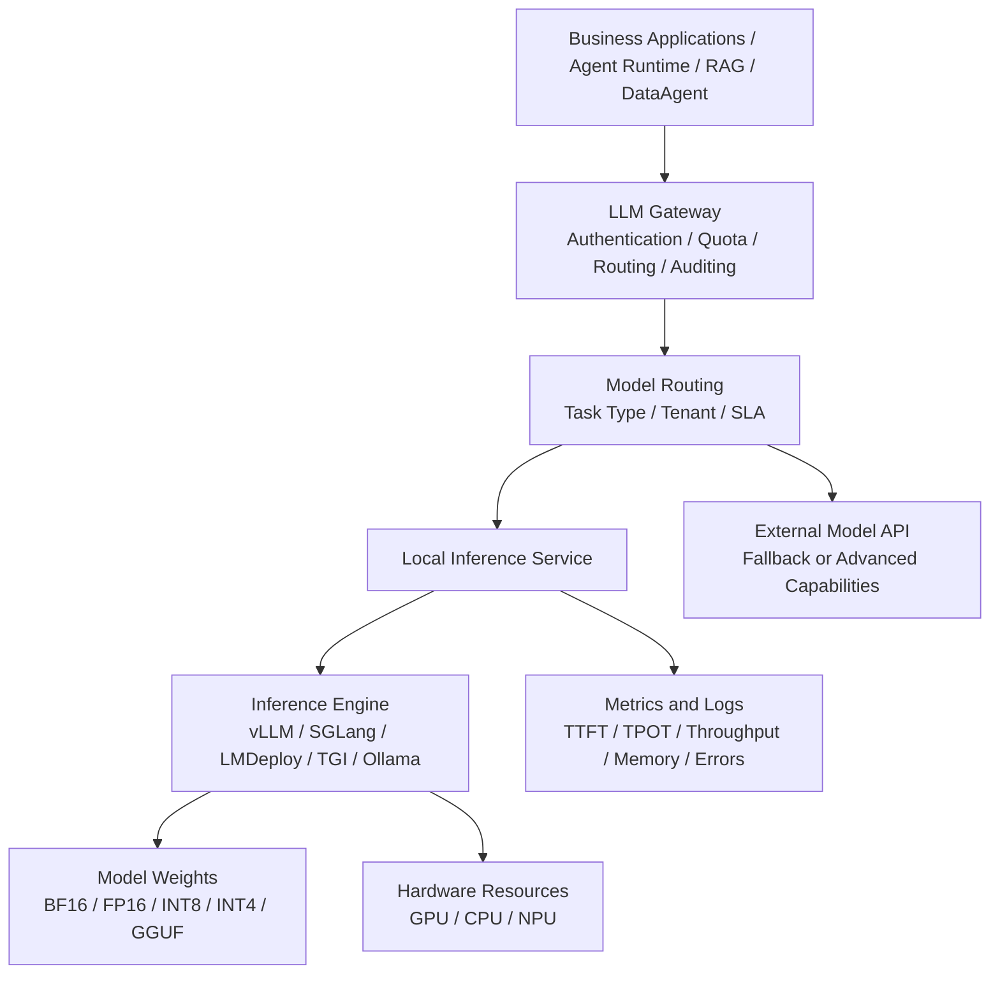
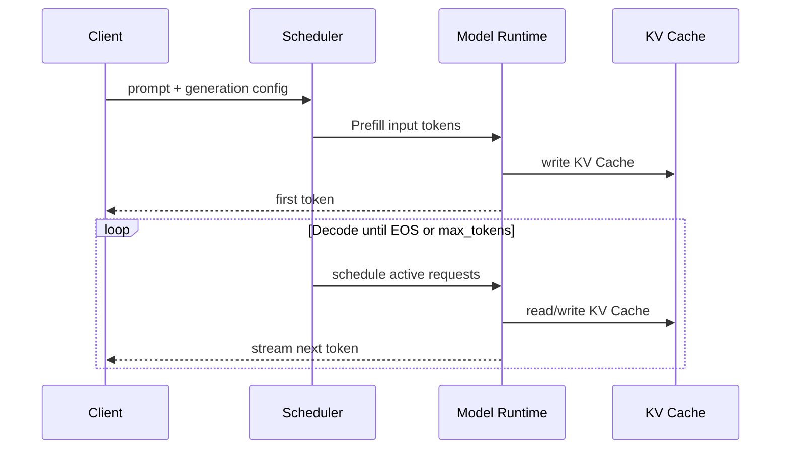

# Chapter 6 Throughput, Latency, and Deployment Boundaries of Local Inference Engines

---

Local inference is often underestimated because it looks like deployment work. It quickly becomes a capacity, latency, and governance problem. A model that responds quickly in a single-machine demo may fail to serve peak traffic from customer-service summarization, DataAgent analytics, and code assistance at the same time. Once inference becomes a platform service, it has to answer questions about throughput, time to first token, GPU memory, structured output, tenant isolation, and version release.

Many enterprises start self-built inference with a simple requirement: sensitive data cannot leave the domain, or external API cost is too high. The team deploys an open-weight model on an internal GPU and lets a few business pilots use it. The first days look fine. After usage grows, batch customer-service summaries occupy the GPU, long-context DataAgent requests push first-token latency up, code generation slows ordinary Q&A, and one department raises its max output tokens, causing other tenants to queue. The model is not broken; the platform has lost capacity control.

Local inference sits between model weights, GPU resources, and platform governance. It does more than start a model process. It organizes request queues, continual batching, KV Cache, Prefix Caching, quantization, structured output, streaming, metrics, and release management into a service. The central contradiction is that enterprise teams need both concurrency throughput and single-request latency on limited GPUs, while these two goals often pull against each other. Background summarization wants throughput, front-office assistants want first token latency, DataAgent wants structured output and long context, and code assistants want decode speed. Mixed in the same service pool, optimization for one workload can harm another.

Inference-engine selection should not rely only on benchmarks. vLLM, SGLang, LMDeploy, TGI, and Ollama solve different problems and fit different organizational stages. During personal validation, startup speed and model-management experience matter more. In production serving, continual batching, memory management, OpenAI-compatible APIs, structured output, monitoring, and multi-replica governance matter more. At platform scale, LLM Gateway integration, tenant quotas, audit logs, canary release, rollback, and fallback become part of the engine decision. An engine that cannot enter those platform processes can support only a local pilot, even if its benchmark result is strong.

This chapter discusses local inference, deployment forms, throughput and latency, continual batching, KV Cache, Prefix Caching, and inference-engine selection. The reader should first identify whether a workload is bottlenecked by throughput, first-token latency, decode speed, or memory, and only then choose engines and optimization mechanisms. The goal is not to produce the fastest single-machine result. The goal is to let local model services carry enterprise Agent workloads under a unified gateway, quota, audit, and rollback process.

Another issue often appears after launch: model, platform, and business teams look at different metrics. The model team says the model is better in offline evaluation. The platform team sees P99 TTFT breaches. The business team complains that streaming output breaks midway. Security asks whether prompts and outputs entered logs. If the engine is just a process on a GPU server, these questions become ad hoc debugging. If the engine is already connected to gateway, monitoring, quota, and release systems, teams can trace through request, queue, prefill, decode, output, and logs. For the first production version, operability should come before extreme performance. A slightly slower service with stable metrics, canary release, and rollback is more suitable than a service with impressive benchmark numbers but unexplained queueing and memory swings.

---

## 6.1 Deployment Entry Point for Local Inference Services

When enterprises discuss local inference, the decision is not simply whether a model runs in the cloud or on-prem. The real question is whether inference capability enters the enterprise's own platform boundary: model weights, inference service, call protocol, quota, logs, cost accounting, canary release, and fault tolerance should all be controllable by the enterprise. A multi-business enterprise that sends customer knowledge bases, production-quality SOPs, financial metrics, and internal code repositories to external model APIs faces data-egress, audit, latency, and cost-prediction pressure. Downloading an open-weight model to one GPU server and launching it with a temporary script does not solve the multi-business, multi-tenant, long-running Agent problem either.

The local inference engine sits between model weights and business applications. It packages model files, GPU/CPU/NPU resources, request scheduling, token streaming generation, caching, quantization, parallelism, and service APIs into a manageable service. For enterprise Agent platforms, this engine typically is not directly exposed to end business systems but is instead invoked via unified protocols by components such as the LLM Gateway, Agent Runtime, RAG service, and DataAgent.




*Figure 6-1: Position of local inference services within an enterprise platform. Source: original diagram by the authors. Alt text: The layered diagram places local inference service in the middle. It connects upward to the model gateway and business Agents, downward to the GPU resource pool, and sideways to the model repository and monitoring.*

Figure 6-1 shows the division of responsibilities: business requests stop at LLM Gateway and model routing; the local inference engine functions only as a governed service pool. This abstraction means that replacing engines like vLLM, SGLang, LMDeploy, TGI, or Ollama later does not require changes to upstream business contracts.

Within this chain, the application layer should only concern itself with the required capability, maximum acceptable delay, and tolerable quality. It should not know whether a particular model runs on vLLM, SGLang, LMDeploy, TGI, or Ollama. The platform layer must turn the local inference service into a set of governable resource pools: which models can serve which tenants, which requests can queue, which must degrade, which may return structured output, and which require audit logging.

Once the service boundary is clear, engine replacement does not disturb business systems. A team may first use Ollama to validate an internal assistant, move to vLLM for higher concurrency, then introduce SGLang for structured Agent tasks. As long as the gateway contract, model name, generation parameters, and response format stay stable, business code does not need to be rewritten for each engine change. If applications bind directly to private engine parameters, migration drags prompts, timeouts, error codes, streaming protocols, and audit logic into every change.

## 6.2 How Throughput and Latency Determine Deployment Forms

Local inference services fall into five basic deployment forms based on operational boundaries. These are not a linear maturity progression but different choices for different loads and organizational stages.

*Table 6-1: Boundaries, advantages, and applicable scenarios for inference deployment forms. Source: compiled by the authors.*

| Form | Typical Tools | Service Boundary | Advantages | Main Limitations | Applicable Scenarios |
|---|---|---|---|---|---|
| Single-machine interactive | Ollama | Local process or desktop app | Easy to start, model trial friendly, few dependencies | Lacks multi-tenant governance and production scheduling | Personal validation, prompt experiments, initial model screening |
| Single-machine HTTP service | Ollama API, LMDeploy single-node service | One machine exposing REST or OpenAI-compatible interface | Easy app integration, low cost | Limited concurrency and high availability | Small team internal tools, edge nodes, offline use |
| Multi-GPU single node service | vLLM, SGLang, LMDeploy, TGI | Multi-GPU or multi-replica single node | High throughput, supports continual batching and tensor parallelism | Requires GPU memory planning, scheduling, monitoring | Internal portals, customer service, knowledge Q&A |
| Distributed inference cluster | vLLM, SGLang, TGI | Multi-node GPU cluster | Supports large models, multi-tenancy, high concurrency | Complex ops, network and scheduling sensitivity | Platform-level services, core business Agents |
| Edge or lightweight local inference | Ollama | Store terminals, developer machines, private small nodes | Data stays onsite, low network dependency | Limited model size, context length, concurrency | Store assistants, low bandwidth, offline prototypes |

The first form suits model execution more than model operations. Ollama reduces barriers for model download, quantized weight running, and local chat, suitable for engineers quickly comparing models like Qwen, Llama, Mistral, and Gemma on enterprise text. At this stage, platform teams focus on model quality, prompt format, context length, and basic speed, not high concurrency.

The second form starts to define a service boundary. Many tools expose OpenAI-compatible APIs so application code can point a `base_url` to an intranet address, reusing SDKs, Agent frameworks, and benchmark scripts. This step is valuable: the model service changes from a command line on one machine into an API that can be proxied by a gateway. Yet it cannot replace a full platform, since auth, rate limiting, auditing, staged rollout, circuit breaking, budgeting, and data masking typically remain outside the engine.

The third form is the most common production starting point for enterprises. Models at 7B, 14B, or 32B parameter scale can be deployed on multi-GPU single-node servers. Throughput improves with continual batching; larger models run via tensor parallelism; streaming output reduces perceived latency. For an internal multi-business knowledge assistant with concurrency from tens to hundreds, starting here is typical: one model service pool handles general Q&A, another pool handles code or data analytic tasks, with routing handled by LLM Gateway.

The fourth form addresses platform scale. Larger models, longer contexts, and more tenants hit limits of GPU memory, queues, and fault isolation for single-node multi-GPU setups. At this point, replicas, GPU pools, request queues, rolling upgrades, and cross-node communication must be integrated within Kubernetes, Ray, Triton, or native vendor cloud schedulers. Additional GPUs do not solve the problem by themselves; tail latency control becomes the harder task. A long-context request may consume large KV cache, delaying shorter requests. The platform must incorporate request length, max output tokens, tenant priorities, and replica health into routing.

The fifth form serves data boundary requirements. Manufacturing, retail stores, financial risk control, and healthcare scenarios often require data to remain onsite or inside private networks. Edge inference typically uses smaller models, lower-bit quantization, and shorter contexts, trading some general capability for low network dependency and stronger privacy controls. It is not a substitute for a central model platform but fits fixed processes such as device failure explanations, store SOP Q&A, offline work order summaries, and onsite quality inspection descriptions.

Before local inference services go live, at least five interface boundaries must be defined.

*Table 6-2: Service-boundary questions and platform requirements. Source: compiled by the authors.*

| Boundary | Key Questions to Answer | Platform Requirements |
|---|---|---|
| Model boundary | Which models, versions, and quantization formats are allowed? | Model cards, licenses, benchmark results, and release records must be traceable |
| Request boundary | Max context length, max output, tool call permissions? | Gateway enforces limits to avoid bypassing engine constraints |
| Tenant boundary | Who can call which model, with what quota? | Separate authentication, authorization, rate limiting, budget, and auditing |
| Performance boundary | TTFT, TPOT, throughput, concurrency, timeout thresholds? | Metrics integrated into SLO, anomalies traceable to model or engine |
| Data boundary | Does input/output contain sensitive data? | Clear desensitization, log sampling, retention period, and data egress policies |

TTFT (Time To First Token) and TPOT (Time Per Output Token) are the two most important latency metrics for inference services. TTFT is primarily affected by queuing, prefill, context length, and scheduling; TPOT mainly depends on decode phase, concurrent batch size, GPU memory bandwidth, and sampling strategy. Enterprises should track tokens per second together with P95/P99 TTFT stability. For customer service and office assistant scenarios, users tolerate longer total generation times but not long delays before the first token. For offline summarization or batch tagging, throughput and cost are more important than interactivity delay.


*Figure 6-2: Trade-off curve between throughput and latency. Source: original diagram by the authors. Alt text: The x-axis is concurrent throughput and the y-axis is single-request latency. As batch size grows, throughput rises and latency also rises. The curve marks latency-sensitive and throughput-priority zones.*

Figure 6-2 expresses the relative position of deployment forms rather than precise benchmarks of any engine. The three strategies on the right correspond respectively to TTFT for interactive loads, throughput for background tasks, and platform-level rate limiting, circuit breaking, request length governance, and cost accounting.

## 6.3 Scheduling, Caching, and Constraints: Shared Foundations of Engine Capabilities

The core cost of large model inference arises from two phases: Prefill and Decode. Prefill inputs the entire prompt context at once, computing attention for all input tokens and writing KV Cache; Decode generates one or a small batch of new tokens at a time, reading historical KV Cache at each step. Longer inputs impose more Prefill cost; longer outputs increase Decode cost; higher concurrency pressures KV Cache GPU memory usage.



Inference optimization aims to reduce GPU memory usage, improve GPU utilization, minimize queuing time, or reduce per-token compute without noticeably degrading response quality. Common mechanisms include:

*Table 6-3: Objectives, approaches, and risks of continual batching, caching, and other optimizations. Source: compiled by the authors.*

| Optimization | Problem Addressed | Basic Approach | Main Risks |
|---|---|---|---|
| Continual batching | Fixed batch causes GPU idle time | Dynamically add new requests and remove finished ones each decode step | Tail latency and fairness need scheduler policies at high concurrency |
| KV Cache management | Long context and concurrent requests fill GPU memory | Reuse, paging, compress, or offload historical KV entries | Complex to implement, may cause fragmentation or accuracy loss |
| PagedAttention | KV Cache preallocation and fragmentation waste | Manage KV Cache by blocks like virtual memory | Depends on engine kernel support; varies across backends |
| Prefix Caching | Multiple requests share same system prompt or long prefix | Reuse prefilled prefix KV Cache | Limited gains if prefix hit rate is low |
| Tensor Parallelism | Model too big or throughput insufficient on single GPU | Split matrix computation across multiple GPUs | Communication overhead; worse cross-node |
| Quantization | Weight and KV Cache memory pressure too high | Reduce FP16/BF16 weights to FP8, INT8, INT4, etc. | Possible quality drop; calibration/model adaptation cost |
| FlashAttention / efficient attention kernels | Attention visitation memory access overhead | Optimize GPU kernels and memory access patterns | Hardware, drivers, model architecture dependences |
| Speculative Decoding | Stepwise Decode too slow | Smaller draft model pre-generates tokens, verified by target model | Low hit rate wastes compute |
| Structured output constraints | JSON/function calls prone to format errors | Use FSM, regex, or grammar to constrain decoding | Excessive constraints affect natural language fluency |

**Continual batching** is the foundational optimization in production. Traditional batching waits to gather a fixed group of requests then executes jointly; requests finishing early still wait for the batch to finish. Continual batching reschedules active requests on every decode step, releasing finished slots immediately and inserting new requests on the fly. This boosts GPU utilization, especially when requests vary widely in length. The trade-off is the scheduler becomes core: prioritizing throughput may let long requests block short ones; prioritizing short request latency may reduce throughput.

**KV Cache** is an unavoidable memory constraint for large models. During autoregressive generation, each step accesses the cached Key and Value matrices for all past tokens. Caching avoids recomputation but grows linearly with context length, layers, attention heads, and concurrent requests. In enterprise knowledge Q&A, a long prompt containing policies, tables, and citations can consume large memory for one request; several such long concurrent requests may overwhelm free memory before model weights do.

**PagedAttention** and paged KV management address this. The vLLM paper proposes managing KV Cache in blocks to reduce fragmentation and allow sharing cache blocks between requests. This concept influenced many later inference engines. Platform engineers should think of this less as a single product feature but rather as a design pattern: avoid reserving maximum context length contiguous memory per request. Instead, map variable-length sequences onto flexible memory blocks, boosting concurrent capacity. This requires tight coordination between engine, attention kernels, and scheduler.

**Prefix Caching** suits enterprise Agent platforms. Many Agent requests share the same system prompts, tool descriptions, security policies, and enterprise background data. Re-prefilling these prefixes wastes computation. Prefix caching reuses the prefilled KV Cache for the same prefix so subsequent requests only compute the new suffix. The gain depends on prompt normalization: if the system prompt includes timestamps, random trace IDs, or unstable fields, cache hits drop. Platforms should put dynamic fields in suffixes and keep stable rules in prefixes.

**Quantization** reduces memory and bandwidth pressure. Weight quantization compresses model parameters from BF16/FP16 to INT8, INT4, FP8, etc., fitting larger models in limited GPU memory and lowering memory access pressure. KV Cache quantization further lowers GPU memory usage under long-context concurrency. Its downside is possible quality degradation, especially on math, code, long-context retrieval, and structured output tasks. Enterprises must validate quantized models on their own evaluation sets before production, covering customer tickets, financial metrics, SQL generation, tool calls, and safety responses.

**Tensor parallelism and pipeline parallelism** serve large multi-GPU model deployment. Tensor parallelism splits large matrix computations of a single layer into multiple GPUs, suitable when layer size or throughput demands are high. Pipeline parallelism partitions layers onto different GPUs to lower per-GPU memory but introduces pipeline bubbles. Online LLM services favor tensor parallelism for lower per-request latency. Parallelism comes at communication cost; NCCL setup, topology, and PCIe/NVLink configurations also influence real-world throughput.

**Speculative decoding** uses a smaller/faster draft model to pre-generate candidate tokens and then the target model verifies multiple tokens at once. If draft hit rate is high, decoding accelerates; otherwise, extra draft computation wastes time. This suits scenarios with stable distributions and well-defined output styles, e.g. code completion, formatted summarization, fixed-template customer replies. Gains are less stable for complex reasoning and high-randomness conversational tasks.

**Structured output constraints** are central to Agent workloads. Many enterprise calls do not generate free chat but structured JSON, function arguments, SQL fragments, or workflow actions. Asking the model to output valid JSON via prompts is unreliable. If the engine supports grammar, regex, JSON schema, or guided decoding, it can restrict invalid token generation during decoding, reducing parse failures and retry costs. The trade-off is direct: stronger constraints yield stable formats but may force unnatural, hollow output if the schema is not well designed.

Optimizations should not be enabled in isolation. A common mistake is to enable max context length, highest concurrency, aggressive quantization, prefix caching, and speculative decoding simultaneously, then test speed on a single prompt. The correct approach is layered testing by workload:

*Table 6-4: Major bottlenecks and prioritized optimizations for different workloads. Source: compiled by the authors.*

| Workload | Main Bottleneck | Priority Optimizations | Not Recommended To Prioritize |
|---|---|---|---|
| Online customer service Q&A | First token latency, short request concurrency | Continual batching, streaming output, prefix caching | Super long context, complex speculative decoding |
| RAG long context retrieval | Prefill, KV Cache | Chunked retrieval, prefix caching, paged KV, context compression | Blindly increasing max model length |
| Batch summarization | Throughput, cost | Large batch, quantization, offline queue | Very low TTFT |
| Code completion | TPOT, format stability | Speculative decoding, low-temp sampling, dedicated models | Large generic models |
| DataAgent / NL2SQL | Structured output, correctness | Guided decoding, eval sets, tool validation | Solely measuring tokens/s |

## 6.4 Engine Selection: vLLM, SGLang, LMDeploy, TGI, Ollama

Key differences among mainstream inference engines go beyond speed. Enterprises should first clarify four questions: what is the model source, what hardware resources are available, how standardized must service interfaces be, is the load online or offline, and does the platform team have low-level tuning expertise.

*Table 6-5: Positioning, strengths, limitations, and suitable enterprise scenarios for vLLM, SGLang, LMDeploy, TGI, and Ollama. Source: compiled by the authors.*

| Engine | Core Positioning | Typical Strengths | Main Limitations | More Suitable Enterprise Scenarios |
|---|---|---|---|---|
| vLLM | General high-throughput LLM serving | PagedAttention, continual batching, OpenAI-compatible API, active ecosystem | Extreme tuning depends on model & hardware | Internal general model service, RAG, Agent platforms default choice |
| SGLang | Runtime for structured generation and complex LLM programs | RadixAttention, structured output, concurrency scheduling, OpenAI-style API | Ecosystem rapidly evolving; enterprise must verify stability | Agents, multi-turn tool calls, JSON/function-heavy scenarios |
| LMDeploy | Inference toolkit for large model deployment | TurboMind backend, quantization, OpenAI-compatible service, Chinese model ecosystem friendly | Enterprise uptake depends on model stack evaluation | Fast deployment and evaluation for Qwen and other Chinese/open source models |
| Hugging Face TGI | Production inference for Hugging Face ecosystem | Mature deployment, supports continual batching, tensor parallelism, streaming | Limited elasticity for non-HF ecosystem and custom kernels | Teams using Hugging Face model repo and tools extensively |
| Ollama | Local model management and developer experience | Simple model fetching, running, and API; partly OpenAI-compatible | More developer- and lightweight-focused; not a full enterprise inference platform | Rapid model trials, prototypes, personal assistants |

**vLLM** is often the default starting point for enterprise local inference. Built around PagedAttention, continual batching, prefix caching, distributed inference, and OpenAI-compatible API, vLLM suits rapid service enabling of open-source models. For multi-business enterprises simultaneously serving knowledge Q&A, customer service, office assistants, and DataAgent workflows, its practical strengths are wide model support, easy API integration, and extensive community resources. Platform teams using vLLM should focus benchmarking on three metrics: KV Cache pressure under long context, TTFT under high-concurrency short requests, and stability of structured output and tool calls.

**TGI** fits teams already centered on the Hugging Face modeling, download, evaluation, and deployment stack. It provides production text-generation serving capabilities with continual batching, tensor parallelism, and streaming output. Its value comes from ecosystem consistency: model repo, tokenizer, config, and deployment docs work smoothly together, even when single-point speed is not the main differentiator. Enterprises with Hugging Face-governed models and fine-tuning pipelines can reduce integration cost by adopting TGI.

**SGLang** tightly integrates inference services with structured generation programs. Its focus extends from prompt-to-text generation to multi-turn branching, constrained decoding, tool calling, and complex generation workflows. Its RadixAttention supports prefix and KV Cache reuse, suitable for high shared context or programmatic generation. Agent platforms requiring frequent transitions among fixed system prompts, tool schemas, and intermediate state should benchmark SGLang separately.

**LMDeploy** frequently appears in Chinese open-source model and quantized deployment scenarios. Its TurboMind backend, quantization support, and OpenAI-compatible service suit teams wanting fast Qwen and similar model API deployment. Whether it is the main platform engine depends on enterprise model fleet, hardware, stability validation, and team familiarity.

**Ollama** represents a lightweight local inference approach. It simplifies model management, running, and local API, targeting developers experimenting with models, business prototypes, and low-concurrency internal assistants. Ollama can join an enterprise platform but its positioning is clear: not a data center GPU serving replacement, but a solution for offline, edge, low concurrency, or rapid validation.

Enterprises can apply these rules for first-round filtering.

*Table 6-6: Preferred inference engine direction and reasons by decision criteria. Source: compiled by the authors.*

| Decision Criteria | Preferred Direction | Reason |
|---|---|---|
| Need to quickly serve open-source models as HTTP APIs | vLLM or TGI | Mature APIs, rich ecosystem, good default platform service |
| Model and toolchain deeply tied to Hugging Face ecosystem | TGI | Consistent repo, tokenizer, deployment workflows |
| Heavy Agent structure, structured output, complex generation workflows | SGLang or vLLM guided decoding | Focus on constrained decoding, prefix reuse, programmatic generation |
| Edge, consumer-grade GPUs, or offline nodes | Ollama | Lightweight deployment, easy model management |
| Rapid deployment and quantized evaluation of Chinese open-source models | LMDeploy / vLLM | Depends on model family and team experience |

The mini-platform version 0.1 should avoid hard-coding any engine as the only implementation, and instead abstract a unified call contract under `core/gateway/`. A good interface should minimally include: model name, input messages, generation parameters, tenant info, trace ID, timeout, streaming switch, and structured output schema. Underneath, it can initially connect to vLLM or TGI, then later attach SGLang, LMDeploy, Ollama, or other services.

```json
{
  "model": "qwen3-32b-instruct",
  "messages": [
    {"role": "system", "content": "You are an internal assistant for a multi-business enterprise."},
    {"role": "user", "content": "Summarize the top three reasons for customer complaints this week."}
  ],
  "tenant": "retail-customer-service",
  "stream": true,
  "timeout_ms": 30000,
  "generation": {
    "temperature": 0.2,
    "max_tokens": 1024
  },
  "response_format": {
    "type": "json_schema",
    "schema_name": "complaint_summary"
  }
}
```

The purpose of this contract is to decouple business calls from inference engines. A multi-business enterprise may serve knowledge assistants on vLLM, use SGLang for structured Agent flows, deploy LMDeploy for rapid Chinese open model evaluation, and Ollama for store offline nodes, while upper layers call the same gateway. Platform value comes from continuous measurement, routing, degradation, and replacement capabilities, not from a one-time choice of the fastest engine.

In practice, each engine integration should be treated as a capability registration. Registration should include supported model families, context length, concurrency ceiling, structured-output support, streaming protocol, error codes, monitoring metrics, and rollback method. The gateway should not blindly forward by model name. It should choose a target service by capability and risk: customer-service summaries can use a throughput-priority pool, DataAgent can use a pool with more stable structured output, sensitive tenants can use private deployment, and temporary peaks can fall back to external models.

After registration, the same capability should enter the release process. A new model service release should include load-test reports, failure samples, compatible request formats, and known limits. When an old engine is retired, the release record should state which tenants, tasks, and evaluation suites have migrated. This prevents the inference layer from becoming a collection of service ports that no one is willing to touch.

## 6.5 Conditions for Connecting Inference Engines to a Unified Gateway

Before an inference engine enters the unified platform gateway, it should pass a small set of admission checks. The goal is not to create a long checklist, but to confirm that protocol, observability, quota, and error semantics follow one integration standard.

Model license, weight source, quantization method, and release version should be traceable. OpenAI-compatible or internal unified interfaces should be proxied through the gateway, and business applications should not call bare engines directly. Load tests should cover short requests, high concurrency, long context, batch tasks, and structured output. Metrics should include at least TTFT, TPOT, tokens/s, queue length, memory usage, KV Cache usage, and error rate. The gateway should enforce maximum input length, maximum output length, timeout, tenant quota, and concurrency. Engine upgrades, model switches, and quantized-version releases should have canary and rollback plans. Logging policy should clearly separate debug logs, audit logs, and sensitive-content retention.

## Chapter Recap

Local inference is not downloading a model and starting a service. Once it enters an enterprise platform, weight source, inference engine, scheduling policy, resource pool, logs, audit, and routing all belong to the same operating boundary. Business applications should use one LLM Gateway contract; the platform then routes requests to suitable model-service pools by tenant, task type, SLO, and cost.

Throughput and latency must be evaluated by workload. Interactive assistants care about TTFT. Long-context RAG cares about prefill and KV Cache. Batch work cares about tokens/s and cost. DataAgent also cares about structured output and tool-call stability. vLLM, SGLang, LMDeploy, TGI, and Ollama have different value points, and their selection should connect to the optimization evaluation in Chapter 7, especially KV Cache, Prefix Cache, quantization, and structured-output capability.

A mature inference layer can explain where a request went, why it queued, when it degraded, and how it rolls back during traffic spikes, model upgrades, and engine replacement.

## References

Kwon, W. et al. (2023). [*Efficient Memory Management for Large Language Model Serving with PagedAttention*](https://arxiv.org/abs/2309.06180). SOSP.

vLLM. (n.d.). [Documentation](https://docs.vllm.ai/).

SGLang. (n.d.). [Documentation](https://docs.sglang.ai/).

Hugging Face. (n.d.). [Text Generation Inference documentation](https://huggingface.co/docs/text-generation-inference/).

NVIDIA. (n.d.). [TensorRT-LLM documentation](https://nvidia.github.io/TensorRT-LLM/).
