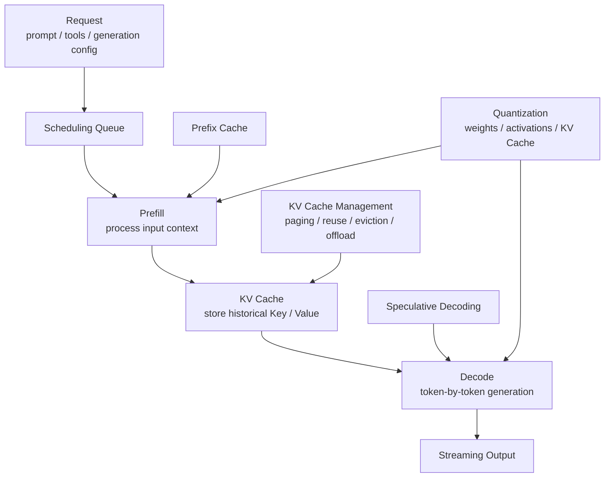
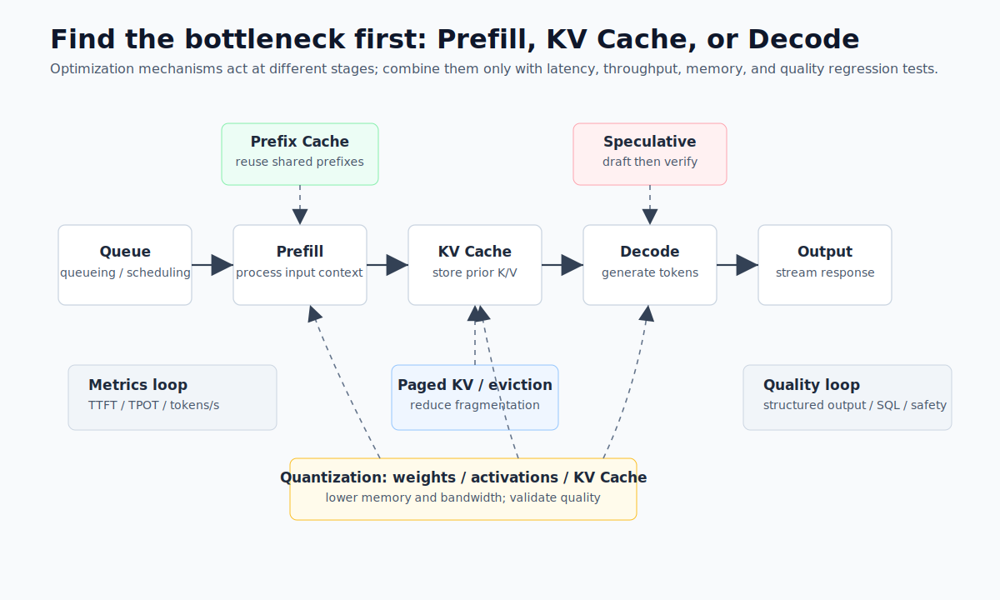
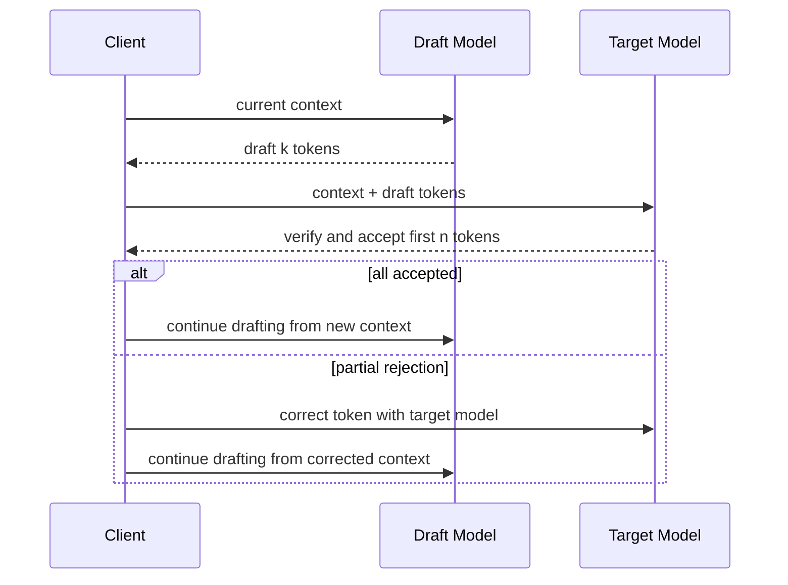

# Chapter 7 Inference Optimization Techniques

---

After a customer-service summarization service goes live, the platform team may see high GPU utilization without any real improvement in time to first token. One engineer suggests quantization and speculative decoding. Another suggests a larger batch size. The root cause often turns out to be workload mixing: customer-service summaries need throughput, DataAgent tasks need structured-output correctness, and knowledge assistants are slowed by long-context Prefill. Inference optimization cannot follow a "turn on every switch" playbook. KV Cache, Prefix Cache, quantization, and speculative decoding can reduce cost or latency, but they can also introduce quality regression, memory fragmentation, scheduler complexity, and harder incident analysis. Enterprise platforms must first locate the bottleneck, then choose the mechanism, and finally verify the change with the same business evaluation samples used for model release.

Optimization failures rarely come from a mechanism being bad in itself. They usually come from applying the mechanism to the wrong bottleneck. High TTFT may come from queueing, long-context Prefill, or a low Prefix Cache hit rate. Slow Decode is a better candidate for speculative decoding or model-size changes. Memory pressure should first direct attention to KV Cache management, context limits, and quantization. When the team cannot separate these positions, it tends to enable every option at once and ends up with a system that may be faster on one benchmark but harder to explain in production.

Enterprise workloads also require quality regression to sit beside latency and cost. Quantization may make financial explanations unstable. KV Cache quantization may affect long-context reasoning. Speculative decoding can help fixed-template summaries but may be less stable for complex DataAgent reasoning. Prefix Cache will miss frequently if dynamic fields are placed inside the prefix. Inference optimization is therefore a set of choices among throughput, first-token latency, memory, quality, and troubleshooting cost.

This chapter discusses inference optimization, KV Cache, Prefix Cache, speculative decoding, quantization, and bottleneck diagnosis. Readers should learn to distinguish memory pressure, first-token latency, throughput, and Decode speed, then design validation for each optimization: which metric it improves, which business samples it affects, how it rolls back, and whether it changes structured output, refusal behavior, or tool-call quality. Without this validation loop, optimization becomes a new source of uncertainty instead of an engineering capability.

Production optimization usually accumulates over time. The first release may enable continual batching. The second adds paged KV for long contexts. The third introduces weight quantization to control cost. The fourth tries speculative decoding for templated summaries. Each step has a reasonable local explanation, but the combined system becomes harder to debug: a slow answer may come from queue policy; a JSON parse failure may come from quantization; a short request may be delayed by long-context requests occupying KV Cache. Optimization should be managed like model release, with recorded configuration, metrics, evaluation results, and rollback conditions.

For enterprise platforms, inference optimization also changes organizational responsibility. Model teams focus on output quality. SRE teams focus on latency and availability. FinOps teams focus on unit token cost. Business teams care whether the task completes. Without one evaluation vocabulary, an optimization that looks successful to one team may appear as quality regression to another. A sound rollout names the workloads that should benefit, the workloads that may be harmed, and the observation window. During canary, the team should monitor performance, cost, structured output, refusal behavior, safety blocking, and human feedback at the same time.

---

## 7.1 Identify Bottlenecks Before Choosing Optimization Mechanisms

Chapter 6 discussed inference-engine selection and the trade-off between throughput and latency. Once the discussion moves to concrete optimization, the test becomes simpler: does the mechanism reduce cost, latency, or memory pressure without damaging model quality and business correctness? The sophistication of an optimization is not a release reason by itself.

Internal knowledge assistants, customer-service summarizers, DataAgent workflows, and code assistants face different constraints. Knowledge assistants often suffer from long-context Prefill and KV Cache memory. Customer-service summarization usually needs batch throughput. DataAgent workloads often pay retry cost for structured-output failures. Code assistants are sensitive to per-token Decode latency. Inference optimization must begin with bottleneck identification; enabling every option at once usually widens the failure surface and does not make the service more stable.



Inference optimizations can be grouped by their position in the pipeline. KV Cache optimization acts on memory and long-context concurrency. Prefix Cache reduces repeated Prefill for shared prefixes. Speculative decoding acts on token-by-token Decode. Quantization changes the storage and bandwidth profile of model weights, activations, and KV Cache. These mechanisms can be combined, but every combination needs evaluation and rollback evidence.



*Figure 7-1: Operational stages of inference optimization mechanisms. Source: original diagram by the authors. Alt text: A pipeline from request input to token output, marking batching in scheduling, KV and Prefix Cache during Prefill, quantization around weights and cache, and speculative decoding during Decode.*

Figure 7-1 organizes optimization by bottleneck position. Heavy Prefill points to prefix reuse and context governance. Slow Decode points to speculative decoding. Memory pressure points to KV management and quantization. The metric and quality loops shown in the diagram are prerequisites for combined optimization.

Bottleneck diagnosis requires logs with enough detail. Total request latency should be split into gateway queueing, scheduling wait, Prefill, first token, Decode, tool wait, and streaming transfer. Otherwise, a slow request becomes guesswork. For DataAgent tasks, the system should separately record SQL generation, SQL execution, result explanation, and chart generation. If only end-to-end latency is recorded, inference optimization may hide the real bottleneck, such as an OLAP query or permission check.

## 7.2 KV Cache: The Primary Constraint On Memory And Long Context

KV Cache is the core cache in autoregressive Transformer inference. When the model generates token `t`, it must access the Keys and Values for all prior tokens. Recomputing the entire context at every step would be prohibitively slow, so inference engines write Key/Value tensors during Prefill and append new Key/Value tensors during Decode. This avoids repeated computation, but memory use grows quickly with context length and concurrent requests. The KV Cache size can be approximated as:

```text
KV Cache bytes
~= batch_size
   * sequence_length
   * num_layers
   * 2
   * num_kv_heads
   * head_dim
   * bytes_per_element
```

The factor `2` represents separate Key and Value tensors. The formula has three direct implications. Long contexts increase both Prefill compute and Decode-stage memory. More concurrent requests add KV Cache for each active sequence. Reducing `bytes_per_element`, for example from FP16/BF16 to FP8 or INT8, changes the amount of context and concurrency the system can carry.


*Figure 7-2: How KV Cache grows with context length and concurrency. Source: original diagram by the authors. Alt text: A three-dimensional view in which KV Cache memory rises with both context length and concurrent request count. A memory-limit plane marks where requests must queue or be rejected.*

Figure 7-2 turns the formula into capacity planning. Context length, active request count, and bytes per element correspond to request governance, scheduling limits, and KV Cache quantization. Platform teams should revisit these three variables whenever they evaluate long context, concurrency, and memory budget. From an engineering perspective, KV Cache has four common sources of pressure.

*Table 7-1: Sources, symptoms, root causes, and mitigations for memory and context pressure. Source: compiled by the authors.*

| Pressure Source | Symptom | Root Cause | Priority Mitigation |
|---|---|---|---|
| Long context | High per-request memory and long TTFT | Large Prefill compute and long KV Cache sequence | Context limits, retrieval compression, chunking, Prefix Cache |
| High concurrency | GPU memory approaches the limit and requests queue | Active requests each hold KV Cache | Continual batching, paged KV, scheduling limits |
| Long output | Decode slows or cache eviction is forced | Output tokens also append KV Cache | `max_tokens` limits, segmented generation, task decomposition |
| Shared system prompts | Same prefix is repeatedly computed | Requests share tool descriptions, role settings, or documents | Prefix Cache and prompt normalization |

Memory optimization should first remove useless context, then consider compression. A common RAG mistake is to place every retrieved document into the prompt because a long-context model is available. The result is longer TTFT, larger KV Cache, lower concurrency, and more irrelevant evidence that can increase hallucination risk. A safer sequence is to improve retrieval quality, remove duplicates, compress passages, choose citations, and send only the necessary context into the model.

Paged KV management addresses fragmentation and mixed-length requests. vLLM's PagedAttention is a representative design: instead of reserving contiguous memory for the maximum context of each request, the engine splits KV Cache into fixed-size blocks and maps them to physical GPU memory like virtual memory. TensorRT-LLM and other inference stacks also provide mechanisms for KV Cache reuse, offload, and eviction. Platform teams do not need to implement these mechanisms by hand, but they must understand how much they affect concurrency. The number of requests that fit on a GPU often depends on KV Cache management as much as model weights.

Eviction and offload should follow request value. Requests currently decoding should be retained. Recently completed caches that may hit shared prefixes can remain briefly. Low-priority tenants and low-hit-probability caches can be evicted earlier. Extremely long contexts may use CPU offload, accepting latency variance from PCIe transfer. Enterprise platforms should include cache policy in SLO design instead of treating it as an opaque engine default.

KV Cache quantization lowers memory use by storing the cache in FP8 or lower precision. It can increase long-context concurrency, but it needs separate quality regression testing. Customer-service summarization may tolerate FP8 KV Cache. Financial metric explanations, SQL generation, compliance refusals, and code generation need business evaluation for output quality, format stability, and factual consistency before production use.

KV Cache also affects multi-tenant fairness. A long-context tenant without limits can occupy memory and leave short requests waiting. If short requests receive excessive priority, long jobs may never progress. The platform should express context length, maximum output, cache retention time, and tenant priority in gateway policy. Under memory pressure, the scheduler then knows whether to reject oversized input, compress context, move work to batch processing, or queue a lower-priority request. Before publishing a KV Cache optimization, the team should confirm the model's maximum context, default context, tenant limits, cache hit and eviction metrics, stress tests for short and long requests, quality evaluation for cache quantization, and downgrade paths for oversized input.

## 7.3 Prefix Cache: Reusing Stable Prefixes To Reduce TTFT

Prefix Cache is a common form of KV Cache reuse. When two requests share the same prefix, the second request can skip repeated Prefill for that prefix and reuse the existing KV Cache. vLLM describes Automatic Prefix Caching as reuse of KV Cache from previous queries so later queries with shared prefixes can avoid recomputing the shared part. This matters in enterprise Agent platforms because many requests naturally share long, stable prefixes.

*Table 7-2: Shared prefixes, acceleration benefits, and risks of Prefix Cache. Source: compiled by the authors.*

| Scenario | Shared Prefix | Acceleration Benefit | Risk |
|---|---|---|---|
| Multi-turn dialogue | History, system prompts, enterprise role settings | Later turns reduce repeated Prefill | Long history keeps increasing cache use |
| RAG Q&A | Same long document, policy file, or knowledge package | Many questions over the same document reduce TTFT | Changed retrieval order lowers hit rate |
| Agent tool calls | Tool schema, permission rules, safety policies | Tool descriptions avoid repeated computation | Dynamic fields in the prefix break hits |
| Batch extraction | Same task instruction and output format | Bulk task throughput improves | Too many schema variants reduce reuse |
| DataAgent | Semantic-layer description, metric definitions, table structures | Many questions share metadata context | Table-version changes require cache invalidation |

Prefix Cache mainly improves TTFT. It does not substantially speed each output token in Decode. It saves repeated Prefill compute: the longer and more stable the shared prefix, the more useful it becomes. If requests share only a short system prompt, the gain is limited. If they share thousands of tokens of long documents, tool schemas, table structures, or security policies, the gain can be material. Prompt organization matters more than the engine switch. Stable content should be placed in the prefix; dynamic content should be placed in the suffix.

```text
Stable prefix:
1. System role
2. Safety rules
3. Tool schema
4. Enterprise glossary
5. Long documents or table structures

Dynamic suffix:
1. User's current question
2. trace_id
3. Current time
4. Temporary filters
5. Previous tool results
```

If `trace_id`, current time, random nonce, or user name is placed at the beginning, the cache may miss even when the later tool schema is identical. For a multi-business DataAgent, semantic-layer descriptions, metric definitions, table schemas, and SQL safety rules should remain in a stable prefix; user questions, filters, and session state should appear in the suffix. This lets questions in the same business domain reuse prefix KV Cache.

Multi-turn dialogue exposes a tension between cache benefit and context growth. Longer history increases reusable content, but also increases KV Cache use. If every turn appends the full history, later requests become slower. Production systems usually combine session summarization, history pruning, and important-fact memory so the conversation becomes a compact stable prefix instead of an endlessly growing prompt. Prefix Cache implementation should be evaluated with cache-specific metrics.

*Table 7-3: Prefix Cache monitoring metrics and anomaly interpretation. Source: compiled by the authors.*

| Metric | Meaning | Anomaly Interpretation |
|---|---|---|
| `prefix_cache_hit_rate` | Ratio of shared-prefix hits | Low hit rate usually means unstable prompts or dynamic fields in the prefix |
| `saved_prefill_tokens` | Prefill tokens saved through reuse | Low value means the shared prefix is too short |
| `cache_eviction_count` | Number of prefix-cache evictions | Frequent eviction indicates memory pressure or poor cache policy |
| TTFT before/after | Change in time to first token | High hit rate without TTFT improvement points to queueing or Decode as the bottleneck |

Prefix Cache cannot speed unrelated prompts, and it cannot repair poor retrieval quality. It may also increase memory use because the engine retains reusable KV Cache. Cache policy should be set by business domain: customer-service knowledge bases, fixed tool schemas, and DataAgent table structures are good candidates for retention; one-off long documents, low-frequency tenants, and oversized temporary contexts should be evicted more aggressively.

Cache policy also needs isolation. Two identical prefixes may still be forbidden to share cache across tenants. Within one business domain, permission-version changes, tool-schema changes, and policy upgrades should invalidate the cache. Treating Prefix Cache as pure performance work misses these governance requirements. A more explainable cache key includes model version, system-prompt hash, tool version, tenant or security domain, and policy version. Hit rate may decrease, but isolation and incident analysis improve.

## 7.4 Speculative Decoding: Using A Draft Model To Accelerate Decode

Speculative decoding uses a faster draft model to generate several candidate tokens, then lets the target large model verify those candidates in one pass. If the candidate tokens match the target model's distribution, several tokens can be accepted at once. If they do not match, the process falls back to the target model's sampling result. Leviathan, Kalman, and Matias showed that this method can accelerate autoregressive generation without changing the output distribution when sampling correction is implemented correctly.

It targets Decode. Large-model generation typically runs one forward pass per token. Prefill can process the input sequence in parallel, but Decode is naturally serial. Speculative decoding uses a smaller model to draft tokens and the target model to verify them in batches, lowering the average target-model cost per accepted output token.



"Lossless" means that with correct sampling correction, the final output distribution matches direct sampling from the target model. The small model does not replace the large model, and speed should not be bought by sacrificing quality. The gain depends on draft acceptance rate: when the draft model predicts the target model's next tokens well, acceptance is high and acceleration is clear; when the two models differ, rejected draft tokens become extra work.

*Table 7-4: Suitable scenarios for speculative decoding and their cautions. Source: compiled by the authors.*

| Scenario | Why It Fits | Caution |
|---|---|---|
| Code completion | Local patterns are strong and candidate tokens are predictable | Requires a related or specially trained draft model |
| Fixed-format summarization | Output templates are stable and acceptance can be high | Frequent schema changes reduce benefit |
| Customer-service standard replies | Style and sentence patterns are relatively fixed | Safety refusals and factual consistency still need evaluation |
| Low-temperature tasks | Low randomness makes draft hits more likely | High-temperature creative tasks usually produce unstable gains |

Complex reasoning, open-ended writing, multi-tool branching, high-randomness sampling, multilingual mixing, and uncertain Q&A often produce low draft acceptance. DataAgent SQL generation also needs care. If the draft model frequently proposes wrong SQL fragments, the target model may correct the distribution but the end-to-end system may not become faster, and debugging becomes more complex. Speculative decoding should be judged with more than average speedup.

*Table 7-5: Speculative decoding monitoring metrics, meanings, and targets. Source: compiled by the authors.*

| Metric | Meaning | Target |
|---|---|---|
| `acceptance_rate` | Ratio of draft tokens accepted by the target model | Higher is better; disable below the threshold |
| `tokens_per_target_forward` | Average accepted tokens per target-model forward pass | Measures whether large-model calls are amortized |
| `end_to_end_latency` | Total latency including draft computation | Must beat the baseline at P50 and P95 |
| `quality_regression` | Business-evaluation quality regression | Theoretical distribution preservation still requires engineering validation |

Speculative decoding adds a second model to deploy, monitor, route, and roll back. It also consumes memory and may introduce tokenizer, vocabulary, alignment, and sampling differences when draft and target models come from different families. For this reason, it is better treated as an optimization for specific high-traffic tasks instead of a default switch for all model services.

For a multi-business enterprise, the first candidates are customer-service standard summaries, code completion, and fixed-format ticket generation. These workloads have stable output patterns and measurable gains. Financial explanation, compliance Q&A, and complex DataAgent reasoning should usually wait until evidence is stronger because their quality risk and failure cost are higher.

## 7.5 Quantization: Trading Precision For Capacity, Throughput, And Cost

Quantization replaces high-precision numeric representation with lower-precision representation to reduce memory, storage, and memory bandwidth. In large-model inference, quantization includes at least weight quantization, activation quantization, KV Cache quantization, and full-pipeline low-precision inference. Enterprises most often start with weight quantization and KV Cache quantization.

*Table 7-6: Targets, formats, benefits, and risks of quantization. Source: compiled by the authors.*

| Type | Target | Typical Formats | Main Benefit | Main Risk |
|---|---|---|---|---|
| Weight quantization | Model parameters | INT8, INT4, GPTQ, AWQ, bitsandbytes 4-bit/8-bit | Lowers model memory and allows larger models to fit | Can harm reasoning, code, math, and long-context quality |
| Activation quantization | Intermediate activations | INT8, FP8 | Lowers compute and bandwidth cost | Calibration is complex and hardware-sensitive |
| KV Cache quantization | Decode history cache | FP8, INT8, INT4 | Improves long-context concurrency | May weaken long-context retrieval and fine-grained citation |
| Mixed precision | Different tensors or layers use different precision | FP16/BF16 plus INT4/FP8 | Balances quality and cost | Configuration and test matrix become larger |

Weight quantization addresses whether the model fits and the compute cost per token. Reducing a BF16 model to INT4 can greatly reduce parameter storage and let a larger model run on a single card. GPTQ, AWQ, bitsandbytes, and related methods serve this goal, but compression is not risk-free. Smaller models, fine-grained tasks, and structured outputs are more likely to turn quantization error into business error.

KV Cache quantization addresses long-context and high-concurrency capacity. Once model weights are fixed, active requests and context length can make KV Cache the dominant memory bottleneck. Reducing the cache from BF16/FP16 to FP8 or lower can raise the supported token budget. Its effect on long-document Q&A, needle-in-a-haystack retrieval, code references, and SQL generation must be tested separately. Passing a weight-quantization evaluation does not prove that KV Cache quantization is safe. Quantization methods can also be grouped by whether they require training or calibration.

*Table 7-7: PTQ, QAT, and runtime quantization methods. Source: compiled by the authors.*

| Method Type | Description | Advantage | Cost |
|---|---|---|---|
| Post-Training Quantization (PTQ) | Quantizes a trained model using calibration data or approximation methods | Fast deployment; fits most open models | Depends on calibration data; very low bit width may degrade quality |
| Quantization-Aware Training (QAT) | Simulates low-precision error during training | More stable quality for serious production models | High cost and requires a training pipeline |
| Runtime quantization | Stores or computes selected tensors in lower precision during inference | Flexible and easy to canary | Depends on engine, hardware, and kernels |

Enterprise evaluation should go beyond perplexity and general leaderboards. A multi-business enterprise needs business evaluation sets that reflect its risk surface.

*Table 7-8: Focus and typical failures in quantization quality validation. Source: compiled by the authors.*

| Evaluation Set | Focus | Example Failure |
|---|---|---|
| Customer-service Q&A | Factual consistency, refusal behavior, safety wording | Incorrect policy date or compensation rule |
| DataAgent / NL2SQL | Table names, column names, aggregation logic, SQL validity | Missing filter or nonexistent column |
| Code assistant | Syntax, dependencies, boundary conditions | Readable but non-runnable code |
| Compliance and security | Sensitive data, privilege boundaries, injection defense | Refusal boundary shifts after quantization |

Quantization rollout should move from conservative to aggressive. First establish BF16/FP16 quality and performance baselines. Then try INT8 or FP8 and verify quality, TTFT, TPOT, throughput, and memory. For cost-sensitive tasks with stable quality, test INT4 weight quantization. Long-context services need separate tests for KV Cache FP8 or lower. Each quantized version should have a model card recording method, calibration set, evaluation set, applicable tasks, and rollback route.

Quantization also changes how other optimizations behave. INT4 weight quantization can free memory for larger batches. FP8 KV Cache can improve long-context concurrency. A quantized target model used with speculative decoding may change draft acceptance rate if the draft and target distributions diverge. Prefix Cache with quantization also needs joint validation because it reuses KV Cache at a specific precision.

In production, quantized versions should not be treated as interchangeable with the original model. The platform should route `qwen3-32b-bf16`, `qwen3-32b-awq-int4`, and `qwen3-32b-fp8-kv` as distinct model versions with their own tasks, tenants, SLOs, and rollback strategies. If DataAgent SQL errors rise on the INT4 version, only DataAgent traffic should return to BF16; lower-risk customer-service summarization can keep using the cheaper version if its quality remains stable.

## 7.6 Production Evaluation For Inference Optimization

Inference optimization cannot be judged by single-point throughput. Enterprise Agent platforms care about TTFT, total latency, concurrency, memory, cost, output quality, and failure recovery. KV Cache, Prefix Cache, speculative decoding, and quantization affect different indicators. One mechanism lowers first token latency, another improves Decode throughput, another reduces memory, and another lowers cost. Each may also change tail latency, output stability, or structured-output success rate.

Evaluation should use the real task distribution. General Q&A, DataAgent queries, report generation, tool calls, long-context summaries, and multi-turn conversations have different resource profiles. A set of short prompts cannot replace this mix. Long reports amplify KV Cache pressure. Structured-output tasks amplify sampling and format-stability problems. Tool-call tasks amplify first-token delay and parse failures. Results should be broken down by task type so averages do not hide the high-risk cases.

Optimization strategy must also connect to Chapter 43 and Chapter 45. Chapter 43 handles GPU scheduling and capacity. Chapter 45 handles gateway routing and tenant quota. If the model service enables quantization or speculative decoding, the gateway needs to know which backend fits which task and where its quality boundary lies. The GPU scheduler also needs memory and concurrency profiles for each backend. Otherwise, the gateway may send a high-risk report to an unsuitable quantized model, or a long-context job to a replica that lacks memory headroom.

## 7.7 Canary And Rollback For Optimization Strategies

Inference optimization needs canary and rollback just as model release does. Quantized models, cache policies, draft models, and decoding parameters can all change user-visible behavior. A rollout should start with shadow traffic or low-risk tenants before expanding. Observation should cover latency and cost, but also refusal rate, structured-parse failure rate, tool-argument error rate, report return rate from human review, and user follow-up rate.

Rollback should be specific to backend and task type. A quantized model may be stable for general Q&A but cause more numeric errors in financial reports. In that case, only high-risk report tasks should return to a higher-precision backend. A Prefix Cache policy may introduce permission-context reuse risk; the immediate response should be disabling cross-user cache instead of rolling back the entire model service. The finer the optimization strategy, the finer the rollback strategy must be.

The first platform version can start with fixed evaluation sets and a few canary rules. After every inference-parameter or model change, run structured-output, DataAgent, long-context, and tool-call samples before exposing the backend to a small tenant group. This keeps optimization as a verifiable engineering path instead of a one-way cost-saving action.

## 7.8 Observation Vocabulary For Optimization Metrics

Optimization metrics should align with user experience. Lower average latency does not necessarily mean a better service. P95, P99, TTFT, stream interruption, retry count, and downgrade count are often more useful. For streaming output, TTFT determines whether users feel the system is responsive; total generation time determines task efficiency; token jitter affects frontend display stability. These indicators should be kept separate instead of compressed into one inference-performance score.

Metrics also need to be segmented by model, tenant, and task type. A model that works well for general Q&A may be poor for long-context reports. A tenant with high cache hit rate says little about other tenants. A backend with low average cost may still miss SLOs during peak traffic. Chapter 45's gateway should write `model`, `backend`, `tenant_id`, and `route_rule_id` into Trace. Chapter 43's GPU scheduler should provide node-pool and queue state. Only the combination can explain performance changes.

Optimization metrics should drive decisions. When latency is high, the platform needs to know whether to add replicas, shorten context, enable caching, switch models, or reject low-priority requests. When cost is high, it needs to know whether to change routing, quantization, cache policy, or task limits. Without this mapping, metrics only say the system is slower or more expensive. They do not guide a platform change. The decision mapping should enter the release record together with the metric change.

Release records should retain paired versions. Quantized and non-quantized models, old and new cache policies, speculative decoding before and after, acceptance rate, and failure samples should remain searchable. Without this evidence, the team may only know that an optimization was enabled at some point, not what it solved or whether it can be turned off. Review should include user-visible behavior: faster TTFT with more interruptions, lower average cost with higher high-risk task errors, or higher GPU utilization with worse P99 are not stable wins.

Some optimizations should serve only specific tasks. Template summarization can accept more aggressive quantization and speculative decoding. Financial DataAgent workloads should keep higher precision and stricter structured output. General knowledge Q&A can trade cache for TTFT. Compliance Q&A should protect citation and refusal quality first. Sending all requests to one optimization profile is operationally simple, but it mixes different risk choices. It is better for the gateway to route optimization parameters by task type instead of hard-code them inside a model service. A rollback then changes routing and policy instead of disrupting every business workload.

## 7.9 Release Gates For Inference Optimization

Inference optimization should pass a release gate in the same way as a model version. The first gate is a baseline comparison. The team should preserve the model version, serving engine, routing rule, hardware profile, concurrency setting, and evaluation result from the previous state. Without that record, a later improvement cannot be attributed with confidence: the gain may come from the optimization, a workload shift, or a gateway traffic change. The second gate is task segmentation. Customer-service summarization, knowledge Q&A, DataAgent, code assistance, compliance Q&A, and internal batch jobs should be reviewed separately. One average latency number cannot prove that every workload benefited. The third gate is failure evidence. Each optimization should check structured-output failures, long-context citation errors, refusal-boundary changes, tool-argument drift, and streaming interruptions. If these samples are absent, the optimization may look good in performance charts while weakening the user-visible service.

The release gate should also define which metrics may be traded and which ones are protected. Customer-service summarization may tolerate small wording changes in exchange for higher throughput, but factual fields must remain correct. Internal knowledge Q&A may accept slower answers for more stable citations. DataAgent workloads may accept higher cost when SQL accuracy and field-level permission checks improve. Compliance Q&A should protect refusal behavior and citation quality before speed is discussed. Once these trade-offs are written into the gate, the review meeting moves beyond "how much faster" and "how much cheaper." Each task has its own error tolerance, so each task needs its own optimization policy.

Canary rollout needs an observation window. Many optimizations look strong in a short load test and fail only after real traffic arrives. Prefix Cache hit rate changes with the business calendar, user behavior, and document versions. Quantization errors may cluster in a small set of high-risk questions. Speculative decoding acceptance rate changes with prompt templates and output formats. KV Cache strategy may be stable during quiet hours but evict more aggressively at peak load. The window should cover off-peak traffic, peak traffic, long context, batch jobs, and at least one model or knowledge-base change. A window that is too short turns incidental gains into assumed platform capability.

The gate should connect directly to incident response. If structured-output failure rate rises after an optimization, the platform should locate whether the cause is the model version, quantization configuration, sampling parameter, cache policy, or gateway route. If DataAgent report rejection rises, the team should be able to return specific task types to a higher-precision backend. If the GPU queue becomes congested, SRE should know whether the change came from batch settings introduced by the optimization or from a request-profile shift. Optimization configuration should enter Trace and the release ledger, including model version, backend, quantization format, KV Cache precision, Prefix Cache key, draft model, sampling parameters, and routing rules. A user complaint can then be traced to a concrete configuration instead of staying at the level of checking whether the current model service is alive.

The first platform version can keep this gate light: fix five groups of evaluation samples, store one baseline report, canary on two tenants or one business domain, observe for a week, and then decide whether to expand. The gate does not need to be heavy at the beginning, but it must constrain optimization behavior. Without a gate, inference optimization becomes a string of temporary switches. With a gate, it becomes a managed release action inside the model platform.

## 7.10 Operating Ledger For Optimization Configurations

After inference optimization goes live, it should enter an operating ledger. The ledger records model version, serving engine, quantization format, KV Cache precision, Prefix Cache key, draft model, sampling parameters, gateway route, GPU node pool, canary scope, evaluation-set version, and rollback target. A latency drop without this context cannot be attributed later: it may come from model serving, traffic mix, cache hits, hardware scheduling, or task-shape changes. A quality regression without this context is equally hard to repair because the team cannot tell whether to roll back quantization, disable cache, or change gateway routing.

The ledger should also record rejected options. An INT4 version may be rejected because DataAgent field errors rise. A speculative-decoding setup may be abandoned because acceptance rate is low. A Prefix Cache policy may be limited to one tenant because permission context is unstable. These decisions should be preserved. When models, hardware, or task distribution change six months later, the team can revisit them without repeating the full experiment. Optimization knowledge comes from these comparison records. Keeping both successful and failed configurations turns tuning into reusable engineering experience.

## 7.11 Regression Evidence For Inference Optimization Changes

After inference optimization enters production, the most important material is comparable evidence before and after a change. Quantization, KV Cache policy, Prefix Cache, batch parameters, speculative decoding, parallelism, and context length all affect quality, latency, and cost. One change may improve average throughput while making long-context requests more likely to OOM. Another may reduce P50 latency while increasing missing fields in structured output. Before release, the platform should preserve results, error classes, TTFT, TPOT, peak memory, GPU hours, and rollback version for the same task samples.

Regression evidence should cover task forms. Customer-service summarization, knowledge Q&A, DataAgent NL2SQL, long report generation, tool-use planning, and batch evaluation stress inference engines differently. Short Q&A load tests overstate optimization gains. Throughput alone understates user waiting and output stability. A better practice is to keep a small representative sample set for each task form and rerun it after every optimization change. An optimization that fits batch work should not automatically enter the online inference pool. A quantization scheme that hurts structured output should be limited to suitable task types.

Rollback needs boundaries as well. Disabling a cache policy, restoring old quantization, switching back to an earlier engine, and changing batch parameters all look like rollback, but they carry different risks. The rollback plan should state which performance indicators will be sacrificed, whether warm-up is required, whether active streaming sessions are affected, and whether gateway routing must change. Mature inference optimization means the team can explain the cost of each performance gain.

## 7.12 Operating Ledger For Optimization Parameters

Inference optimization parameters need an operating ledger. `max_batch_size`, `max_num_batched_tokens`, KV Cache policy, quantization format, parallelism, context limit, warm-up samples, timeout settings, and degradation models all affect production behavior. If these parameters live only in startup scripts, incident review cannot tell whether latency changed because of traffic, model version, or optimization settings.

The ledger should record parameter source and suitable tasks. Batch parameters may fit evaluation and offline reports but not customer-service dialogue. Long-context settings may fit report generation while reducing short-Q&A concurrency. Aggressive quantization may fit low-risk summarization while hurting structured output. Routing should select backends by task type instead of making every request share one optimization profile.

The parameter ledger should also connect to cost review. One optimization may save GPU hours while increasing retry or human review. One scale-up may reduce latency while raising idle cost. These trade-offs need to be explained in the same record. Inference optimization is continuous balancing among quality, latency, cost, and recovery.

## 7.13 Business regression samples for optimization strategies

Regression samples for inference optimization should come from real business tasks. KV Cache, Prefix Cache, speculative decoding, and quantization can improve latency or cost, but they affect tasks differently. Short Q&A may care mostly about time to first token. Long reports care about context retention and truncation. Tool calls care about structured parameter stability. Compliance Q&A cares about refusal and evidence citation. If regression samples cover only generic benchmarks, optimization can regress at business boundaries.

Business regression samples should record input, expected output shape, allowed latency, context length, whether tools are called, whether citations are required, and whether the task is high risk. Comparison should include average latency, format errors, truncation, missing tool parameters, refusal change, and human rejection. For speculative decoding, observe whether the draft model makes specific formats less stable. For quantization, observe whether numbers, code, and structured output become more fragile.

A first platform version can bind optimization strategies to samples. If a model route enables quantization, it should state applicable tasks and prohibited tasks. If a prefix-cache rule goes live, it should state which system prompts and context fragments may be reused. Inference optimization then becomes an auditable release behavior, not hidden infrastructure tuning.

## 7.14 Long-term review of optimization gains

Inference-optimization gains need long-term review. A successful canary proves that the gain held under the model, task distribution, hardware, and routing policy at that time. Months later, prompt templates, RAG documents, semantic layers, user questions, business peaks, and model versions may have changed. The same optimization parameters may no longer fit. The platform should periodically check whether each gain still exists: whether cache hit rate has fallen, whether quantization errors concentrate in new tasks, whether speculative-decoding acceptance has dropped, and whether long-context requests are crowding out short requests.

Long-term review should inspect gains and side effects together. Lower latency with more human rejection means the cost has moved into the business process. Lower bill with more retries means quality issues consumed part of the saving. Higher GPU utilization with worse P99 latency may hurt interactive experience. Review material should put performance, quality, cost, and user feedback on the same page so each team does not see only its own metric.

A first version can review core optimization strategies every quarter. Conclusions can be: keep enabled by default, limit to some tasks, move back to candidate strategy, or observe after adding samples. Inference optimization then avoids becoming hidden configuration that no one wants to touch, and enters the same governance rhythm as model versions.

## 7.15 Locating and isolating optimization side effects

After inference optimization ships, side effects often appear first in business workflows. Users see slower answers, unstable formats, missing citations, incomplete tool parameters, or report-generation timeouts. The lower-level cause may sit in batch parameters, KV cache policy, quantized versions, draft models, scheduling queues, or gateway routing. If the team rolls back all optimization immediately, it loses benefits that may still be valid. If it inspects only model output, it can miss resource scheduling and cache-hit changes. Optimization side effects need layer-by-layer diagnosis.

Diagnosis can start from the same task sample. First fix the model version and prompt, then compare output with the optimization enabled and disabled. Next fix the optimization strategy and compare latency, truncation, and error codes under different route pools and concurrency pressure. Finally inspect Trace fields for cache hit, batch wait, draft acceptance, quantized version, and retry count. This narrows the issue to quality regression, queueing regression, format regression, or cost regression, instead of treating every abnormal result as a generic optimization failure.

Isolation should follow task risk. Low-risk summarization may continue to use aggressive quantization and caching, while structured output, tool-parameter generation, and high-risk refusal should keep more conservative routes. Interactive chat can protect its GPU pool from long-context jobs, while asynchronous reports may accept longer queueing for lower cost. If one strategy fails only for a tenant or task type, the platform should support tenant-level, task-level, and model-level disablement instead of a global rollback.

A first platform version can include side-effect diagnosis in optimization reviews. Each review records the triggering sample, affected tasks, diagnosis path, temporary isolation action, final strategy, and observation window. Inference optimization then becomes part of the production chain that also includes Chapter 6 operating evidence, Chapter 8 structured output, and Chapter 41 cost governance. The aim is stable business capability, not a better standalone benchmark number.

## 7.16 Business acceptance criteria for optimization strategies

Before inference optimization reaches production, technical metrics need business acceptance criteria. Higher throughput, lower memory use, and shorter TTFT do not automatically improve user experience. For management-report tasks, users may care more about timely first summaries, stable final numbers, and resumable long jobs. For support Q&A, users may care more about continuous responses, absence of repeated fragments, and quick explanations when permission blocks the answer. Acceptance should be defined by task type, not by one average latency number.

Output form matters as well. Speculative decoding can make streaming rhythm less predictable, which changes the perceived typing experience. Quantization may have little effect on ordinary Q&A while increasing errors in tables, code, SQL, and long reasoning chains. Prefix Cache can lower the cost of stable prefixes, but poorly defined cache boundaries may mix tenants or permission contexts. Each optimization should carry business samples that cover normal tasks, boundary tasks, and high-risk tasks.

A first platform version can put optimization acceptance into the release record: target task, baseline version, optimization parameters, gain metrics, guardrail metrics, failure samples, rollback condition, and owner. Real traffic should continue to be observed for seven days after release. If gains concentrate on low-value tasks while side effects appear in high-value tasks, traffic expansion should stop. The goal of inference optimization is to make cost and experience trade-offs explainable, not to chase one benchmark number.

## 7.17 Evidence-backed model-routing policy

After model routing reaches production, a successful demo is not enough evidence. The platform needs stable fields for request type, data level, model version, degradation reason, cost, and quality sample, and those fields should connect to release records, Trace, evaluation samples, and incident notes. When a production issue appears, teams can follow one set of facts to understand scope, ownership, and repair order instead of stitching together model logs, business logs, and verbal explanations.

This evidence also connects the surrounding chapters. It links to Chapter 44 on model serving, Chapter 45 on the gateway, and Chapter 52 on compliance: upstream capabilities provide assumptions, downstream capabilities consume the result, and governance capabilities preserve evidence and review decisions. If these materials do not share identifiers and versions, the production system splits apart. Business owners see user complaints, platform owners see system errors, and security or compliance teams see explanations written after the fact. That separation makes it hard to decide whether the issue came from data, model behavior, tool contracts, workflow state, or organizational ownership.

Common production risks include routing by price alone, fallback models changing output style, and sensitive data reaching an unsuitable provider. These risks are less visible during demos because demos usually exercise the successful path. Production users bring boundary cases, repeated requests, permission changes, and long-running state. The platform team should turn such failures into release samples. Some samples should block launch, some can be handled by degradation, and some require the business owner to accept the remaining risk with a review date.

Routing policy should live in the model catalog and change together with evaluation samples and compliance rules. The record can stay compact, but it should include time, version, owner, sample, action, and the next review condition. Without those fields, review remains informal experience. With them, one production issue can become material for later releases, evaluation suites, and training.

A first platform version can start with a small set of high-risk paths. Choose flows with high traffic, high business impact, or sensitive data, require an evidence package for each change, and then expand the practice to ordinary scenarios. This keeps the capability at the engineering level: runnable, explainable, and recoverable.
## 7.18 Business explanation material for routing policy

Model-routing policy should be understandable to business owners. When a request uses an expensive model, falls back to a smaller model, or avoids an external provider, the reason should not live only in gateway configuration. The platform should preserve explanation material for high-risk or high-cost routing: request type, data level, candidate models, selection reason, budget impact, and quality samples. With that material, business owners can judge whether the current policy fits scenario value.

Explanation material also reduces disputes during model upgrades. The serving team may see better quality in a new model, cost governance may see higher spend, security may focus on provider boundaries, and business teams may care mainly about stability. A routing note puts those views into one record and keeps policy discussion from collapsing into one metric. For high-volume scenarios, routing policy should be reviewed periodically against data level, user expectation, and budget commitment.

## Chapter Recap

Inference optimization should start from bottlenecks instead of a list of toggles. Different tasks may be constrained by Prefill, Decode, KV Cache, structured output, or queue scheduling, and the same mechanism behaves differently in customer-service summarization, DataAgent, code assistance, and compliance Q&A. Each optimization release should name the benefited tasks, risk-bearing tasks, observation metrics, and rollback path.

KV Cache determines the memory ceiling for long context and high concurrency. Prefix Cache reliably lowers TTFT only when prefixes are stable and hit rate is high. Speculative decoding fits high-volume tasks with stable output patterns and high draft acceptance; it should not be a default for every workload. Quantized versions should be governed as separate routable models and validated against business evaluation sets for quality, format, factuality, and safety. Chapter 8 moves into structured output. The optimization choices in this chapter continue to affect JSON, function arguments, and tool-call stability, so inference optimization should remain connected to schema validation, runtime recovery, and evaluation evidence.

## References

Dao, T. et al. (2022). [*FlashAttention: Fast and Memory-Efficient Exact Attention with IO-Awareness*](https://arxiv.org/abs/2205.14135). NeurIPS.

Kwon, W. et al. (2023). [*Efficient Memory Management for Large Language Model Serving with PagedAttention*](https://arxiv.org/abs/2309.06180). SOSP.

Leviathan, Y. et al. (2023). [*Fast Inference from Transformers via Speculative Decoding*](https://arxiv.org/abs/2211.17192). ICML.

Lin, J. et al. (2024). [*AWQ: Activation-aware Weight Quantization for LLM Compression and Acceleration*](https://arxiv.org/abs/2306.00978). MLSys.
