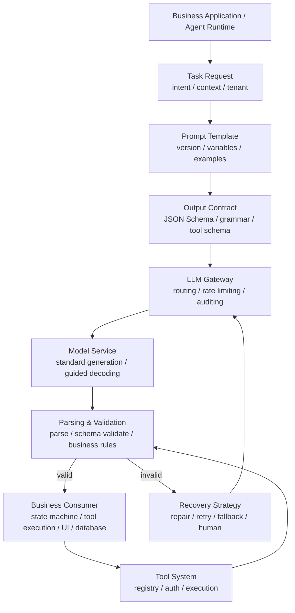
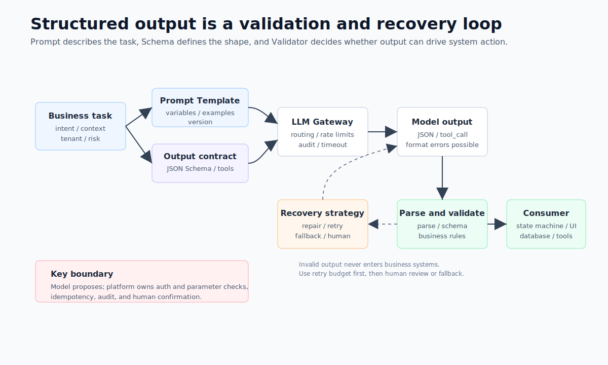
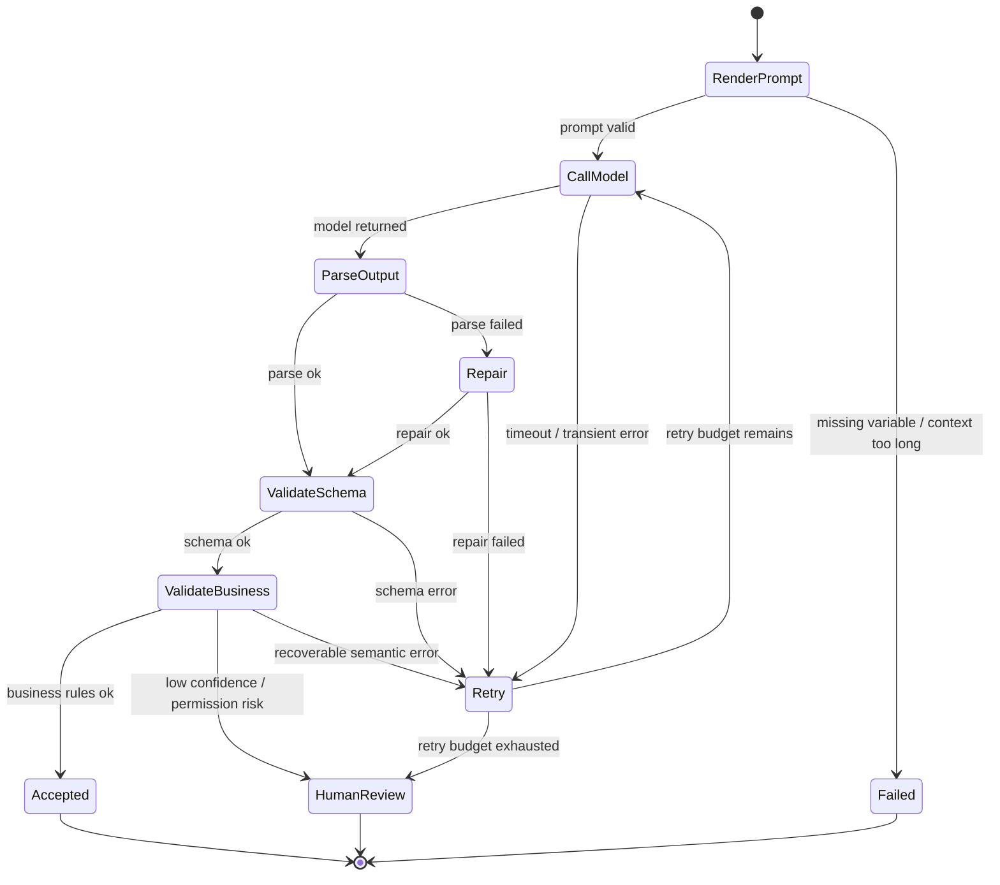

# Chapter 8 Structured Output and Prompt Engineering

---
Model output has to move from readable text to an interface result that systems can consume. Enterprise applications rarely stop at showing an answer to a user. The result often has to enter a ticketing system, a contract repository, an approval workflow, a SQL executor, or a front-end component tree. A prompt that says "output JSON" cannot carry that responsibility by itself. The system also needs schemas, parsers, business validation, retry policies, tool permissions, and audit logs. This chapter treats the prompt as the input-side interface, structured output as the output-side contract, and tool calling as a controlled system action. The goal is to show how these three assets enter the same release and rollback process.

A customer-service center may ask the model to classify complaints and create tickets automatically. A contract assistant may extract payment milestones and write them into a reminder table. DataAgent may ask the model to produce parameters for the next tool call. A generative UI layer may ask for a component tree. These all look like formatting tasks during a demo, but the production risks differ. If the model writes `delivery_delay` as "the logistics are slow," a person understands the meaning, while the system cannot ingest it reliably. If a refund tool receives an undefined extra field, the executor may reject it or, worse, business code may misread it. If an evidence sentence does not exist in the source document, syntactically valid JSON still fails the business requirement.

Structured output is therefore an interface-governance problem. It is easy to underestimate during the demo phase because the model returns a JSON-like object, the front end renders it, and the flow appears complete. Once the same output enters tickets, contracts, SQL execution, approvals, or external tools, field names, enum values, evidence locations, and recovery behavior become interface responsibilities. A stray space in a field name, an enum written as prose, or an evidence reference that cannot be resolved can all be amplified by downstream systems.

Many enterprise incidents are semantic or operational failures rather than JSON syntax failures. A model may classify a refund reason as `delivery_delay`, pass schema validation, and still rely on a speculative user sentence as evidence. A tool-call object may pass the schema while exceeding the current user's permission scope. Structured output enters production only when business validation, permission policy, idempotency keys, and audit logs are designed together with the prompt and schema.

The prompt carries the input contract, the schema carries the output contract, and tool calling carries the execution contract. If they are managed separately, releases drift. A prompt asks for a new field while the schema still rejects it; a schema enum changes while the evaluation samples still use old values; a tool parameter becomes risky while the approval screen does not display it. Reliable structured tasks treat these assets as one versioned release unit.

---
## 8.1 From Free Text to Verifiable Actions

### 8.1.1 System Value of Structured Output

When teams first integrate a large language model into a product, they typically treat it as a text interface: the application assembles a prompt, the model returns natural language, and the front end displays it to the user. This approach is fast enough for prototyping, but three limitations emerge in production.

First, free text is hard for downstream systems to consume reliably. Customer-service tickets, contract extraction, approval recommendations, and SQL execution plans all require specific fields, types, enumerations, and evidence. Second, free text is difficult to reproduce. Small changes in the prompt, model version, generation parameters, or context can cause the output to be phrased differently. Third, free text resists auditing. After an incident, teams need to know what fields the model returned, which fields failed validation, which tool was invoked, and whether the case was routed to a human queue.

Structured output reframes a model generation as a set of verifiable actions: what the input is, what structural constraints the output must satisfy, which failures are retryable, and which failures must be rejected or escalated to a human.

*Table 8-1: Output objects and failure consequences for common structured tasks. Source: compiled by the authors.*

| Task | Output Object | Downstream Consumer | Primary Risk |
|---|---|---|---|
| Ticket classification | Category, confidence, evidence sentences, human-review flag | CRM, customer-service ticketing system | Misrouting, unauthorized automation |
| Contract extraction | Dates, amounts, obligations, risk clauses, evidence locations | Contract repository, reminder system | Dirty data ingestion, missed risks |
| DataAgent planning | Tool name, parameters, stopping condition, clarifying questions | Runtime, SQL executor, permission system | Wrong tool invoked, unauthorized queries |
| Generative UI | Form schema, component tree, data bindings | Front-end rendering layer | Non-renderable page, broken interactions |

What these tasks share is that their outputs continue to drive system actions. They need a versioned, validated interface contract with defined error handling, rather than text that merely resembles JSON.

### 8.1.2 Prompt, Schema, and Tool Calling Contracts

Prompts, structured output, and tool calls are often lumped together. They do depend on one another, but their responsibilities differ.

A prompt is the input-side contract: it tells the model the task, context, business rules, and output requirements. Structured output is the output-side contract: it specifies the fields, types, enumerations, and required properties of the returned object. Tool calling is the execution-side contract: it hands the tool name and parameters the model produces to the platform for validation, after which the platform decides whether to execute.


*Figure 8-1: The four-layer contract of a structured task. Source: original diagram by the authors. Alt text: The diagram shows four layers from top to bottom: prompt input contract, model generation, schema output contract, and downstream consumption. Each layer has a validation checkpoint, and output must pass the schema before entering the business system.*

Figure 8-1 emphasizes "contract binding." A structured task cannot publish only a prompt, nor only a schema. The prompt template, schema, tool contract, model version, generation parameters, evaluation samples, and rollback strategy should all be managed as a single release bundle.

A structured task can be decomposed into four layers.

*Table 8-2: The four-layer contract of a structured task. Source: compiled by the authors.*

| Layer | Key Question | Typical Artifact |
|---|---|---|
| Semantic contract | What business action should the model perform? | Task description, boundary rules, examples |
| Structural contract | What must the output look like? | JSON Schema, enumerations, field descriptions |
| Execution contract | Is tool invocation allowed, and how are tools executed? | Tool schema, permission policy, idempotency key |
| Governance contract | How is the task released, evaluated, canary-deployed, and rolled back? | Template version, schema version, evaluation report, trace |

If any of these four layers is missing, production risk shifts to a later system. With only a prompt, the system will be brought down by formatting errors; with only a schema, the model's semantic accuracy may remain low; with only tool calls, security and idempotency issues will be hidden until execution time.

When reviewing a structured task, ask the author to map each of these four layers to a concrete file or configuration artifact. If the prompt version cannot be located, behavior is not reproducible. If the destination of a schema failure is unclear, the recovery path has not been designed. If there is no clear owner for tool-call authorization, there is no isolation layer between model output and system action.

### 8.1.3 Prompt Template Interface Design

Enterprise prompts should not be written as one-off instructions. A stable template must at minimum specify: role boundaries, task objective, context variables, business rules, output contract, and failure strategy.

For example, a complaint classification task can be designed as follows:

```text
You are a customer-service quality-assurance assistant. Your only responsibility is to
categorize the reason for a complaint. Do not generate any refund or compensation commitments.

Task:
Identify the primary complaint reason from the ticket text and provide up to three
evidence sentences drawn directly from the original text.

Business rules:
- category must be one of: delivery_delay, quality_issue, refund_dispute,
  service_attitude, unknown.
- If there is insufficient information, use unknown and populate missing_info.
- If the complaint involves both a refund and a logistics issue, prioritize the
  reason that caused the escalation.

Output:
Return JSON conforming to complaint_classification_v2. Do not output Markdown.
```

The value of this prompt lies in the testability of its boundaries. Business rules can be converted into test cases; enumerations can be converted into a schema; failure exits can be monitored; and "do not generate refund commitments" can be covered by safety evaluations.

Few-shot examples, chain-of-thought reasoning, multi-branch reasoning, and majority-vote sampling can improve stability on certain tasks, but they cannot substitute for an interface contract. More examples make prompts longer and maintenance more expensive; more explicit reasoning increases the risk of leaking intermediate drafts and raises cost. Production systems should first establish solid structure, rules, and validation, then decide, based on task risk, whether to incorporate these additional techniques.

### 8.1.4 Failure Modes in Structured Output

The most common misconception is treating "output JSON" as equivalent to structured output. The model can still produce Markdown code fences, trailing explanations, missing fields, invalid enumerations, or truncated objects. The prompt is the first constraint, not the last line of defense.

The second misconception is that a more complex schema is more reliable. Deeply nested structures, excessive optional fields, and ambiguous field names all increase failure rates and make it harder for teams to pinpoint problems. A production schema should start with the minimum viable set of fields and prioritize short enumerations, numbers, dates, booleans, and evidence references.

The third misconception is allowing the model to operate systems directly. The model can suggest which tool to call and what parameters to use, but actual execution must be performed by the platform. Actions such as sending emails, issuing refunds, creating tickets, and executing SQL require authentication, parameter validation, idempotency control, auditing, and human confirmation.

---
## 8.2 Parsing, Validation, and Exception Handling

### 8.2.1 Chain Position

The structured output capability sits between business applications, the LLM Gateway, inference services, and tool systems. Upstream components provide tasks, context, and risk levels; downstream components receive status updates, tool invocations, database writes, or UI rendering.





*Figure 8-2: Verification and recovery loop for structured output. Source: drawn by the authors. Alt text: The figure illustrates a cycle of model generation, parsing, schema validation, business validation, and downstream consumption; validation failures lead to repair, retry, fallback, or human review branches.*

The most important part in Figure 8-2 is the **invalid** branch. Many production incidents are caused by outputs that look almost correct: field names are close, evidence is missing, enumerations are misspelled, permissions are violated, or tool parameters are incomplete. Once such results pass the validation layer, the problem enters the business system.

### 8.2.2 Request Contract

Structured requests can be described with a unified object. The example below is not tied to any model SDK; it only expresses the information the platform needs to preserve and pass along.

```json
{
  "task": "complaint_classification",
  "tenant": "demo-retail",
  "prompt": {
    "template_id": "complaint_classifier",
    "version": "2.1.0",
    "variables": {
      "ticket_text": "User reported package delayed by three days; customer service unresponsive several times, requests refund.",
      "channel": "online_chat"
    }
  },
  "model": {
    "name": "qwen3-32b-instruct",
    "temperature": 0.1,
    "max_tokens": 512
  },
  "response_format": {
    "type": "json_schema",
    "schema_id": "complaint_classification",
    "schema_version": "2.0.0"
  },
  "recovery": {
    "max_retries": 2,
    "repair": true,
    "fallback": "human_review"
  }
}
```

The corresponding schema should remain small and clear.

```json
{
  "type": "object",
  "required": ["category", "confidence", "evidence", "requires_human_review"],
  "additionalProperties": false,
  "properties": {
    "category": {
      "type": "string",
      "enum": [
        "delivery_delay",
        "quality_issue",
        "refund_dispute",
        "service_attitude",
        "unknown"
      ]
    },
    "confidence": {
      "type": "number",
      "minimum": 0,
      "maximum": 1
    },
    "evidence": {
      "type": "array",
      "items": {"type": "string"},
      "minItems": 1,
      "maxItems": 3
    },
    "requires_human_review": {"type": "boolean"},
    "missing_info": {"type": "string"}
  }
}
```

There are two design points here. Setting `additionalProperties: false` restricts the model output from containing undefined fields, avoiding downstream misinterpretation. Including `"unknown"` gives the model a legitimate failure exit; otherwise, the model might be forced to choose among several incorrect categories.

### 8.2.3 Lifecycle and Failure Stratification

Structured output requests can be viewed as a state machine.



Failure handling requires stratification. JSON parsing failures can be repaired once; schema errors can be sent back with the validation error to the model for retry; missing evidence requires supplemental retrieval or manual confirmation; parameter overreach must be rejected outright and logged as a security incident. Retrying every failure increases cost and latency; sending every failure to manual review undermines automation.

*Table 8-3: Failure Types and Recovery Strategies for Structured Requests. Source: compiled by the authors.*

| Failure Type           | Typical Trigger Condition                             | Handling Method                                      |
|-----------------------|-----------------------------------------------------|----------------------------------------------------|
| Prompt Rendering Fail  | Missing variables, context too long, sensitive info not masked | Block request; require variable completion or context trimming |
| Parsing Fail          | Output contains code blocks, comments, trailing text, or partial JSON | Repair once; if still fail, retry                   |
| Schema Fail           | Missing fields, type errors, invalid enumerations   | Retry with validation error feedback; exceed budget triggers manual review |
| Business Validation Fail| Evidence sentence missing, amount unit missing, confidence too low | Supplemental retrieval, clarification request, or manual review |
| Tool Validation Fail  | Tool not found, parameter out of bounds, action needs confirmation | Reject execution; record trace and security events  |
| Execution Uncertainty | Tool timeout, network interruption, unknown non-idempotent action | Use idempotency key to check status; forbid blind retries |

Production systems must also log sufficient trace information: `template_id`, `schema_id`, `model`, `generation_config`, `raw_output`, `parse_error`, `validation_error`, `retry_count`, `tool_call`, `tool_result`, `latency`, `token_usage`, and final status. Sensitive fields like user text, phone numbers, ID numbers, contract amounts must be handled according to the security governance strategies described in Chapter 10 and beyond.

---
## 8.3 Four Engineering Decisions for Structured Output

### 8.3.1 Prompt Constraints, Constrained Decoding, and Post-Validation

Prompt constraints offer the best compatibility but have the highest formatting failure rate. Post-validation is easy to integrate and can detect errors that trigger retries, but it still spends one model call before discovering the problem. Constrained decoding reduces invalid formats during generation, making it suitable for high-concurrency extraction and tool parameter generation. It depends on inference-service capability and still cannot replace business validation.

In practice, teams usually combine the approaches: the prompt states the task and boundary, JSON Schema or grammar constraints run during inference where available, and the output then goes through schema and business validation. Constrained decoding checks the shape; business validation decides whether the content can be used.

### 8.3.2 Single Generation with Large Schema vs. Multi-step Generation with Small Schemas

Simple forms can generate the entire object in one go. Complex tasks are better split into multiple small schemas: contract processing first determines the contract type, then extracts clauses by type; DataAgent first identifies query intent, then generates SQL or tool parameters; customer service tickets are first classified, then evidence and escalation reasons are extracted for high-risk categories.

Multi-step generation with small schemas increases number of calls and latency but improves error localization and narrows retry scope. For high-risk tasks, this extra cost is usually worthwhile.

### 8.3.3 Explicit Reasoning Process and Evidence Output

Enterprise systems should not by default expose the model's full reasoning drafts to users or write them into business logs. A safer approach is for the model to output conclusions, evidence references, and necessary explanations rather than a full chain of thought. For high-risk tasks, the system should retain original input, retrieved snippets, model outputs, and manual review records.

### 8.3.4 Model-Selected Tools vs. Workflow-Controlled Tools

Open-ended office assistants can let the model freely choose among low-risk tools. For production workflows like approvals, refunds, database queries, and outbound messaging, the workflow should filter the tool list based on status and permissions, then let the model fill parameters within the limited set. The more tools available, the higher the chance of mis-invocations, and larger context usage which harms cache hit rates.

---
## 8.4 Production Acceptance Boundary for Structured Output

Structured output should not be accepted for production by reviewing a prompt or a JSON schema in isolation. The acceptance target is the full chain from model response to business action. The platform has to prove four things: the model can generate the target structure under normal inputs, the parser can classify abnormal outputs, the validator can block fields that are syntactically valid but unusable, and the Runtime can turn failures into recoverable states. If any part is missing, structured output falls back into free text that happens to look like JSON.

The common mistake is treating the schema as the whole interface contract. A schema can check whether a field exists and whether its type matches. It cannot decide whether the field carries the right business meaning. A `date_range` object may be structurally valid while crossing an unauthorized accounting period. A `metric_name` string may pass type checks while referring to a metric that the semantic layer has never registered. An `action` enum may be legal while the current user lacks permission to execute it. Before structured output enters tool calling, the semantic layer, Policy, and Registry need to make a second decision. Chapter 33's metric versions, Chapter 23's tool parameters, and Chapter 50's security policies all meet at this boundary.

Regression samples should be organized by failure type. Format-error samples test the parser and retry policy. Missing-field samples test schema compatibility. Semantic-conflict samples test business validation. Unauthorized-action samples test whether Policy fires before tool execution. Once these samples become part of the release gate, the team can tell whether a prompt change affected surface formatting, business meaning, or the execution boundary.

The front end also depends on this boundary. Users do not need to see "JSON parse failed," but they do need to know whether the system is regenerating, waiting for more information, stopping on insufficient permission, or routing to a human reviewer. The Conversation API should map structured-output failures to stable error codes; the front end can then show retry, clarification, approval request, or human handoff states. Structured output becomes a platform interface only when these states are explicit.

## 8.5 Runtime Contract for Structured Output

### 8.5.1 Division of Responsibility Across Gateway and Tool Layers

The current repository already includes two related foundational modules: `mini-platform/core/gateway/` handles model invocation and routing abstraction, and `mini-platform/core/registry/tool_registry.py` represents the relationship among tool names, descriptions, parameter schemas, and handlers. Structured output capabilities can be added on top of this foundation in three areas.

*Table 8-4: Suggested paths for structured-output capabilities. Source: compiled by the authors.*

| Capability           | Suggested Path                                      | Description                                |
|---------------------|----------------------------------------------------|--------------------------------------------|
| Prompt Templates    | `mini-platform/core/gateway/prompt_template.py`    | Manage template variables, versions, and rendering |
| Structured Parsing  | `mini-platform/core/gateway/structured_output.py`  | Parse, JSON Schema validation, and repair results |
| Tool Invocation Validation | `mini-platform/core/registry/tool_registry.py` | Add parameter validation and policies on top of tool schemas |

A lightweight implementation can initially support JSON object parsing and basic field validation. Production systems can later replace it with Pydantic, jsonschema, Instructor, Outlines, or an inference engine's built-in guided decoding.

### 8.5.2 Structured Parsing Example

The following code demonstrates the core approach of the structured output gateway. It is not a full JSON Schema implementation but illustrates the boundaries of parsing, field validation, and error reporting.

```python
# Suggested source: mini-platform/core/gateway/structured_output.py
from __future__ import annotations

import json
from dataclasses import dataclass
from typing import Any

@dataclass(frozen=True)
class ValidationError:
    path: str
    message: str

@dataclass(frozen=True)
class StructuredResult:
    ok: bool
    data: dict[str, Any] | None
    errors: list[ValidationError]
    raw: str

def parse_structured_json(raw: str, required: set[str]) -> StructuredResult:
    try:
        data = json.loads(raw)
    except json.JSONDecodeError as exc:
        return StructuredResult(False, None, [ValidationError("$", exc.msg)], raw)

    if not isinstance(data, dict):
        return StructuredResult(False, None, [ValidationError("$", "expected object")], raw)

    errors = [
        ValidationError(field, "missing required field")
        for field in sorted(required)
        if field not in data
    ]
    return StructuredResult(not errors, data if not errors else None, errors, raw)
```

Tool calls must be located and executed via a registry. The model outputs at most the tool name and parameters; the platform is responsible for validation.

```python
# Suggested source: mini-platform/core/gateway/tool_calling.py
from __future__ import annotations

from typing import Any

from core.registry import ToolRegistry

def execute_validated_tool_call(
    registry: ToolRegistry,
    name: str,
    version: str,
    arguments: dict[str, Any],
    *,
    tenant: str,
    idempotency_key: str,
) -> Any:
    tool = registry.get(name, version)

    if not idempotency_key:
        raise ValueError("idempotency key is required")

    # Production code also needs to validate arguments, tenant permissions, and action risk levels.
    return tool.handler(**arguments)
```

### 8.5.3 Schema Change Regression Samples

Before structured output enters a production path, it should pass at least five types of checks. These checks cover the schema, parser, retry behavior, downstream consumer, and observation evidence. The point is to avoid a path where the model appears to return JSON while the risk is left to the business system.

*Table 8-5: Release gates for structured output. Source: compiled by the authors.*

| Gate               | Inspection Items                                     | Evidence                            |
|--------------------|-----------------------------------------------------|-----------------------------------|
| Contract Integrity | Are prompt, schema, tool contracts, and model versions linked in the release? | Release record, version numbers, rollback targets |
| Failure Recovery   | Are there fallback paths for parse failure, schema failure, tool failure? | Retry settings, manual queues, fallback strategies |
| Security Boundaries | Do high-risk tools require permissions and manual approval? | Tool policies, audit logs, permission tests |
| Cost and Performance | Is there budget for retries and multiple samplings? | Token usage, P95 latency, failure cost |
| Regression Testing | Are success, boundary, refusal, and adversarial input samples adequately covered? | Evaluation reports, failure sample lists |

These gates do not require building a large platform all at once. The first version only needs version traceability, failure categorization, and enforced tool boundaries to be far safer than a prompt string followed by `JSON.parse`.

The initial version of structured output also does not need to be complex. A practical starting point is to solidly implement three types of tasks: one for information extraction, one for tool invocation, and one for high-risk tasks requiring human review. Only after these three run smoothly can the team clarify whether the schema design, retry budgets, and audit fields are sufficient.

### 8.5.4 Failure Localization Path

#### JSON Wrapped in Markdown Code Fences

The prompt example uses a code block, and the model imitates it. The parser then fails before schema validation even begins. The fix is to keep examples as bare JSON, let the parser perform one code-fence repair pass, and enable JSON Schema or grammar constraints for high-frequency tasks.

#### Valid Fields With Unusable Semantics

`category` is a legal enum and `confidence` is a number, but the evidence sentence does not appear in the original ticket. The fix is to add evidence back-reference validation and require `evidence` to come from input text or retrieved snippets.

#### Duplicate Ticket Creation From Retry

The first tool call times out, the platform retries, and a second ticket is created. The fix is to require every non-idempotent tool to accept an `idempotency_key`, deduplicate by that key on the tool side, and write execution state into the audit log.

#### Outdated Policy in Few-Shot Examples

The model learns an old policy from an example. The classification is correct, but the advice is wrong. The fix is to use examples for format and boundary only, inject volatile policies from governed knowledge sources, and record the knowledge version used by the run.

---
## 8.6 Version Governance for Structured Output

Once structured output is consumed by downstream systems, it becomes part of interface governance. Prompt wording, JSON Schema, tool parameters, and parser versions can all change runtime behavior. A prompt-only change may look harmless while changing field meaning, enum choice, or default behavior. A schema-only change may pass code review while the model still emits the old format. Production systems should not treat these updates as ordinary configuration edits.

Version governance binds prompts, schemas, parsers, and evaluation samples together. Each publishable version should state which fields it supports, which fields are required, which fields may be empty, whether enum values remain backward compatible, and whether downstream tools can consume old outputs. A canary cannot inspect only whether the model returned legal JSON. It must inspect whether the business action still matches expectations. When an approval tool adds a `risk_reason` field, model output is only the first step. The platform also has to confirm that the approval page, audit log, and alerting rules can read the field.

Schema drift is a frequent source of failures. Teams often change a field from a string to an object, or replace human-readable enum labels with code values. If old samples do not cover the change, structured output may fail only in low-frequency cases. A safer practice is to keep a small contract-regression set that covers normal input, missing fields, invalid enums, long text, tool rejection, and multi-turn repair. Each prompt or schema change should run this set, and failed samples should enter the evaluation library discussed in Chapter 39.

## 8.7 Evidence and Recovery for Structured Output

When structured output fails, the system should return more than a parser error. The platform needs to distinguish three cases: the model did not follow the format, the format is valid but the business fields are unusable, or the fields are valid while the downstream tool refuses execution. Each case has a different recovery path. Format errors can retry against the schema. Unusable business fields may require clarification from the user or additional context. Tool rejection needs an error-code-driven decision: retry, degrade, stop, or route to a human.

The recovery process also has to preserve evidence. A failed run should record at least the raw model output, parse error, validation error, retry prompt, repaired structured result, and final tool response. Chapter 38's Trace can then show whether the error came from the model, parser, schema, business rule, or tool layer. Without this evidence, teams often keep tuning the prompt while the real issue is an ambiguous schema or a downstream tool with unclear error codes.

The engineering goal of structured output is not to make the model more obedient. The goal is to let model output enter a verifiable, replayable, recoverable interface chain. Any output that drives tools, approvals, SQL, reports, or external systems should be governed as an interface contract. Prompts help the model understand the task; the platform owns the interface responsibility.

## 8.8 Organizational Collaboration Around Interface Contracts

Structured output should not be maintained by model engineers alone. Business teams define field meaning, platform teams maintain parsing and retry behavior, security teams define high-risk actions, and front-end teams decide how error states appear to users. If these roles do not share a contract, fields can look consistent while their meanings drift. `reason` may mean evidence in the model output, rejection reason in an approval system, and risk explanation in an audit system. Reusing a field without documented meaning lets downstream systems consume legal but wrong values.

Each structured task should therefore have a short contract note that states field source, field purpose, default values, null semantics, failure states, and downstream consumers. The note should follow the version release. Interface changes should trigger checks across samples, front-end display, tool validation, and audit fields. This habit turns structured output from a prompt technique into an interface asset that multiple teams can maintain.

The first platform version can establish this collaboration on three chains: information extraction, tool calling, and approval recovery. These cover read, write, and human-confirmation paths and expose most structured-output problems. Once those contracts are stable, the same method can extend to NL2SQL, report generation, and multi-agent handoff.

Observation metrics also need to be shared. Teams should track parse failure rate, business-validation failure rate, retry success rate, human-intervention rate, and downstream tool rejection rate. JSON validity only proves that the output has the expected shape. It does not prove that the interface is usable. After these metrics enter Trace, the platform can tell whether a schema or prompt change improved format stability or merely pushed errors into downstream tools.

Version management also affects recovery. A structured task should record prompt version, schema version, model version, tool version, and validation-rule version. When a user disputes an automatic classification, the platform must reproduce the full contract from that time instead of regenerating a plausible answer with today's prompt and schema. Audit logs should save both raw output and the validated object. Raw output helps the model team debug generation; the validated object shows what the business system actually consumed. In tool-calling paths, the platform should also record discarded fields, defaulted fields, and final execution parameters so that the difference between model output and business action remains visible.

Compatibility deserves the same care as an API change. Adding a field, changing an enum, or tightening a required field may affect a report Agent that renders charts or a ticketing system that routes work by an old enum. Schema changes should have versions, canaries, and rollback paths. Parser defaults should be treated carefully: a missing risk level should not quietly become low risk, and a missing approval reason should not become "model recommends approval." High-risk missing fields should route to human review or request more evidence.

Structured output also has to express partial success. A contract-extraction task may find payment dates but fail to confirm penalty clauses. DataAgent may produce executable SQL while missing chart dimensions. A ticket classifier may find a category but lack enough confidence. Production systems should represent usable fields, missing fields, fields pending human confirmation, and failure reasons separately. Field design should start from downstream action: fields used only for display can tolerate prose, while fields entering databases, approval flows, or tool parameters need strict types, enums, units, and evidence locations.

Once structured output becomes a platform capability, business teams can launch new tasks faster. They reuse schema management, parsing, retry, validation, audit, and human review instead of rewriting JSON handling in each application. That reuse is the point where prompt engineering becomes engineering practice.

---
## Chapter Recap

1. The prompt serves as the input-side interface; structured output is the output-side contract; tool invocation represents controlled system actions. These three components require version binding, evaluation, and rollback mechanisms.

2. Production systems cannot rely on "please output JSON." Parsing validation, schema validation, business logic validation, retries, and manual fallback all need to be integrated into the workflow.

3. The model can generate tool invocation suggestions, but execution must be performed by the platform. Authentication, parameter validation, idempotency, and auditing belong outside model text.

4. Schemas should start from the minimally viable fields. Complex tasks are better suited to splitting into multiple small objects, multi-step validation, and partial retries.

5. Structured-output maturity depends on whether failures can be classified, recovered, reproduced, and rolled back.

## References

JSON Schema. (n.d.). [Specification](https://json-schema.org/).

OpenAI. (n.d.). [Structured Outputs guide](https://platform.openai.com/docs/guides/structured-outputs).

Guidance. (n.d.). [Documentation](https://guidance.readthedocs.io/).

Instructor. (n.d.). [Documentation](https://python.useinstructor.com/).
