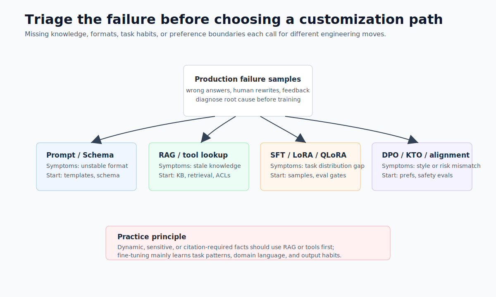
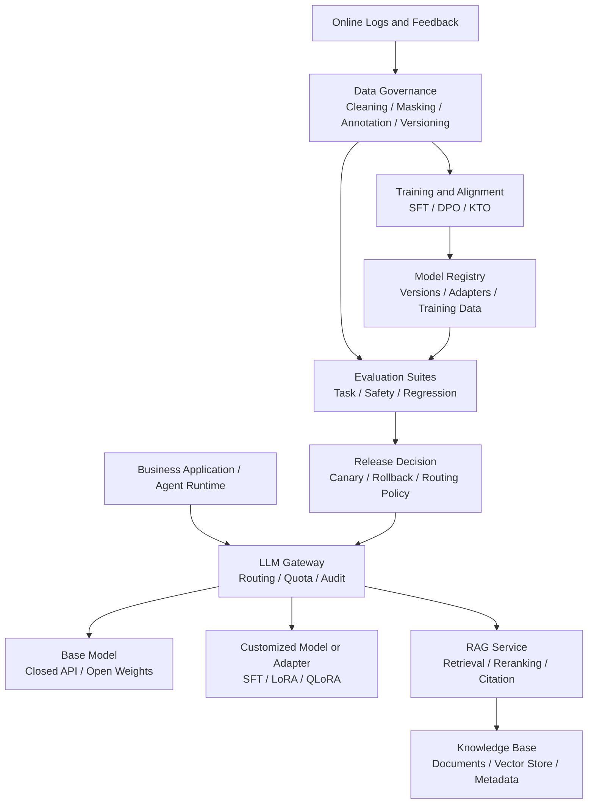
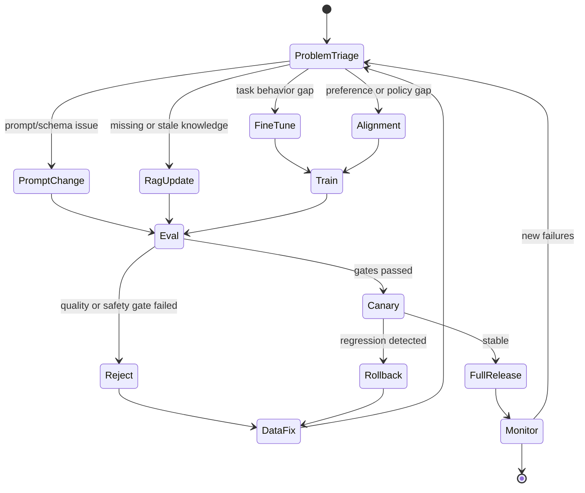

# Chapter 9 Customized Model Capabilities And Knowledge Augmentation

---

When an enterprise sees poor model behavior, the first question is whether to revise the prompt, connect RAG, fine-tune, or introduce preference alignment. Many teams reach for fine-tuning as soon as a model gives a wrong answer, but production failures may come from stale knowledge, unstable output format, missing permission boundaries, or insufficient evaluation samples. Fine-tuning is suitable for task patterns and domain expression. RAG is suitable for updatable and citable enterprise knowledge. Alignment is suitable for refusal behavior, tone, and safety preferences. These routes belong in one loop: failure-sample triage, data governance, training or knowledge update, evaluation, canary, rollback, and online monitoring.

After an enterprise assistant launches, business teams often report that the model does not understand their work. Customer service complains about unstable classification rules. Legal says risk levels do not match internal standards. Data teams say the model uses the wrong metric definitions. HR says policy Q&A cites outdated rules. These failures look similar at first, but they require different actions.

If the model misses last week's leave policy update, update the knowledge base instead of training the model to memorize the new policy. If the model understands the question but fails to produce fixed JSON, inspect the prompt, schema, and structured-output path first. If the model repeatedly produces wrong SQL patterns, the task distribution may differ enough from the base model to justify SFT or LoRA. If the model over-promises in gray-zone scenarios, the issue is preference and safety boundary. Capability customization begins with triage: identify whether the problem is knowledge, output contract, task distribution, or preference boundary, then choose RAG, Prompt, fine-tuning, or alignment.

The phrase "the model does not understand us" hides different problems. The model may lack the newest policy. It may map fields incorrectly. It may answer correctly but violate an interface contract. It may be too aggressive in sensitive scenarios. If the team labels every case as a fine-tuning need, it may spend heavily and still produce a model that cannot go live.

Failure samples should be triaged before they enter a training set. Each sample should preserve the input, context, candidate knowledge, model output, tool result, and human judgment. Data teams can judge whether semantic-layer definitions are missing. Platform teams can judge whether structured validation is missing. Model teams can then decide whether SFT, LoRA, or preference alignment is warranted. Without this step, RAG, fine-tuning, and prompt revisions compete with one another, and no one can explain which change solved the problem.

A common case is policy Q&A that continues to cite old clauses after a policy update. The business request may be "train the model on the new policy," but the more appropriate fix is usually knowledge-base update, document chunking, versioned indexing, and citation validation. Another case is DataAgent repeatedly using the wrong metric definition even when the knowledge base contains the definition. This may justify fine-tuning the model on enterprise task patterns. The customization route should serve the failure cause, not a team's preferred technique.

## 9.1 Identify The Problem Type First

### 9.1.1 Three Routes For Capability Customization

Enterprises usually follow three routes when they want a model to understand business work better: fine-tuning, RAG, and alignment. These routes can be combined, but they cannot replace one another.

*Table 9-1: Capability-customization routes and suitable problem types. Source: compiled by the authors.*

| Route | What It Changes | Suitable For | Update Cadence |
|---|---|---|---|
| Fine-tuning | Model parameters or adapters | Task habits, domain language, fixed output patterns | Weekly to monthly |
| RAG | External context | Current policies, product manuals, contract clauses, metric definitions | Hourly to daily |
| Alignment | Model preferences and refusal tendencies | Style, safety boundary, compliant wording, risk tier | Weekly to quarterly |

A customer-service assistant may use all three routes at once: RAG retrieves current policies, LoRA learns ticket-classification conventions, and alignment prevents unauthorized compensation promises. Every failure sample still needs a root-cause label. It is not enough to say that the model does not know the business.

### 9.1.2 Failure-Sample Triage

Failure samples should enter a triage table before they enter a training set. Triage answers two questions: whether the model lacks knowledge, format stability, task capability, or preference boundary; and whether the problem can be solved in a lower-cost, rollback-friendly way.

*Table 9-2: Common failure symptoms, likely causes, and preferred remedies. Source: compiled by the authors.*

| Symptom | Likely Cause | Preferred Remedy |
|---|---|---|
| The answer misses the latest policy, price, inventory, or contract status | Knowledge is absent from context or stale | RAG, tool query, knowledge-base snapshot |
| The information is mostly correct, but output violates the interface format | Prompt and schema are unstable | Prompt revision, structured output, regression examples |
| Persistent errors on domain terms, SQL patterns, or code frameworks | Task distribution differs from the base model | SFT, LoRA, QLoRA |
| Tone, refusal, or risk level violates policy | Preference and safety boundary are not aligned | Preference data, DPO/KTO, guardrail policy |
| Errors are sporadic and samples are too few | Evaluation and data are insufficient | Expand evaluation sets and log annotation first |

The practical rule behind Table 9-2 is to start with interpretable, rollback-friendly, local changes. Prompt and schema changes can canary and roll back quickly. RAG knowledge snapshots are traceable. Fine-tuning changes model behavior and should wait until evaluation proves that the change is necessary.

Triage should also preserve negative evidence. The same category of wrong answers may include stale knowledge, retrieval noise, and model reasoning failure. Recording only samples that were successfully repaired narrows future training data. Recording failed repair attempts helps the team decide whether the next iteration should add knowledge, improve retrieval, or train the model.



*Figure 9-1: Selecting a capability-customization route. Source: original diagram by the authors. Alt text: A triage diagram starts from the failure problem and branches to stale knowledge, unstable format, capability gap, and preference boundary, mapped respectively to RAG, Prompt, fine-tuning, and alignment.*

Figure 9-1 puts triage before route selection. Missing knowledge should first use external knowledge or tools. Format instability should first use structured output. Persistent task-behavior gaps may justify fine-tuning. Preference and safety-boundary issues belong to alignment.

### 9.1.3 Roles Of Prompt, RAG, Fine-Tuning, And Alignment

Prompt changes the request context. It is suitable for task rules, output formats, and a small number of boundary cases. RAG changes the external knowledge available before answering; it is suitable for frequently updated facts that require citations. Fine-tuning changes model parameters or adapters; it is suitable for teaching the model durable task patterns. Alignment changes model preference; it is suitable for how the model should answer and when it should refuse.

These boundaries matter in engineering. Writing dynamic knowledge into model parameters makes updates slow, deletion difficult, and traceability weak. Giving every task-capability problem to RAG adds more context, but it does not guarantee better reasoning or stable format. Giving every safety problem to DPO cannot replace permissions, masking, tool allowlists, and audit.

### 9.1.4 Scenarios Unsuitable For Fine-Tuning

Fine-tuning should not be used to permanently store enterprise knowledge. It is better for task patterns and expression habits than for frequently changing facts. Employee policies, product prices, inventory, contract status, and metric-version definitions should come from RAG, tools, or database queries. RAG cannot replace model capability. It can provide knowledge, but it does not automatically teach complex tasks. Retrieving the financial metric definition does not mean the model can generate correct SQL. Retrieving a contract template does not mean the model can extract risk clauses correctly. Alignment cannot solve security alone. It can increase refusal tendency and style consistency, but it cannot replace permissions, audit, masking, tool allowlists, and business rules. Even if the model tends to refuse an unauthorized request, the tool-execution layer must enforce hard checks.

Training data is not better simply because there is more of it. Low-quality, duplicated, conflicting, or stale data can degrade the model. Enterprise fine-tuning is especially vulnerable to treating historical noise as truth: old policies, wrong customer-service scripts, temporary workarounds, and SQL anti-patterns can all become model behavior.

---

## 9.2 From Failure Samples To Canary Release

### 9.2.1 Position Between Model, Knowledge, And Evaluation

Model capability customization sits between model platform, data platform, evaluation platform, and business applications. It is a continuous loop instead of a one-time training job: online issues enter a sample pool; governed samples become training, alignment, RAG updates, or prompt revisions; evaluation, canary, and monitoring then bring the change back into production.




*Figure 9-2: Continuous loop for model capability customization. Source: original diagram by the authors. Alt text: Online failure samples enter data governance, training or knowledge update, evaluation, canary release, and monitoring. Model versions, adapters, and knowledge snapshots all enter the registry.*

Figure 9-2 has three important boundaries. Business applications should not care whether the model uses LoRA or RAG; they declare task, tenant, risk level, and knowledge domain. Training and evaluation data must be isolated, or fine-tuned scores only show memorized tests. RAG knowledge bases, adapters, prompt templates, and model versions must all enter the registry so online answers can be reproduced and rolled back.

### 9.2.2 Data, Training, Knowledge, And Release Components

The customization pipeline can be split into components, but the core responsibilities are straightforward: collect samples, govern data, train or update knowledge, evaluate, and canary through the gateway. This structure puts fine-tuning, RAG, and alignment back into one release path.

*Table 9-3: Core components in the capability-customization loop. Source: compiled by the authors.*

| Component | Responsibility | Main Risk |
|---|---|---|
| Sample Collector | Collect online failures, user feedback, human rewrites, and expert examples | Biased sampling, sensitive data mixed into samples |
| Data Curator | Clean, mask, deduplicate, annotate, stratify, and version samples | Label conflicts, evaluation contamination |
| Knowledge Pipeline | Parse documents, chunk, index, and filter metadata | Stale documents, permission mismatch |
| Trainer | Run SFT, LoRA, QLoRA, DPO, or KTO | Overfitting, catastrophic forgetting, excessive refusal |
| Eval Harness | Evaluate task ability, factuality, safety, cost, and latency | Single-metric evaluation, test contamination |
| Registry & Release | Manage models, adapters, knowledge snapshots, canary, and rollback | Untraceable versions, slow rollback |

The training job contract should record model, data, method, and evaluation gates. This is not documentation theater; it gives canary, rollback, and incident review one shared basis.

```yaml
job_id: customer_service_sft_2026_06
base_model: qwen3-32b-instruct
method: lora_sft
dataset:
  train: datasets/customer_service/sft/train-2026-06.jsonl
  validation: datasets/customer_service/sft/validation-2026-06.jsonl
  data_policy: pii_redacted_v2
training:
  lora_rank: 16
  learning_rate: 0.0001
  epochs: 2
  max_seq_length: 4096
evaluation:
  suites:
    - customer_service_classification
    - refusal_and_compliance
    - structured_output_regression
  gates:
    task_accuracy_min: 0.88
    json_validity_min: 0.98
    safety_regression_max: 0.01
release:
  canary_tenants:
    - demo-retail
  rollback_to: qwen3-32b-instruct@baseline
```

The RAG pipeline contract has a different focus: knowledge version, indexing strategy, and permission filtering.

```yaml
knowledge_domain: employee_policy
snapshot: 2026-06-01
sources:
  - hr_policy_handbook
  - benefits_faq
index:
  embedding_model: bge-m3
  chunk_policy: policy_v3
  vectorstore: enterprise_vectorstore
retrieval:
  top_k: 20
  rerank_top_k: 6
  require_citation: true
security:
  metadata_filters:
    tenant: demo-company
    visibility: employee
```

These configurations matter because online failures require reconstruction. The team needs to know which adapter, prompt, knowledge snapshot, evaluation report, and canary rule produced the answer. Without those records, capability customization cannot be operated.

### 9.2.3 Lifecycle And Rollback Strategy

Capability customization does not end when training finishes. It should keep flowing through problem triage, evaluation, canary, and rollback. The following state machine shows the minimal lifecycle.



Failure recovery should follow failure type.

*Table 9-4: Failure modes and recovery paths in capability customization. Source: compiled by the authors.*

| Failure Mode | Trigger | Recovery Path |
|---|---|---|
| Wrong technical route | Fine-tuning used for stale knowledge, or RAG used for format stability | Re-triage samples and record root-cause category |
| Data leakage | Logs contain phone numbers, contracts, salary, or other sensitive fields | Mask data, add permission review, define sample retention policy |
| Evaluation contamination | Training data includes evaluation samples or near duplicates | Use fingerprints, deduplicate, isolate evaluation set |
| Overfitting | Training metrics rise but online generalization falls | Lower epochs, expand validation set and sample diversity |
| Catastrophic forgetting | Domain ability rises but general or safety ability falls | Mix regression samples and route adapters by task |
| Excessive refusal | Alignment causes normal questions to be refused | Add safe-answer positives and split risk levels |
| RAG noise injection | Retrieved chunks are low relevance or permission-mismatched | Evaluate retrieval, rerank, enforce metadata filters |
| Non-rollbackable release | Model, adapter, prompt, and index versions are not bound | Record full versions in registry and support gateway rollback |

Table 9-4 can be used directly in release review. It reminds teams that training failures often occur outside the training script, at sample, evaluation, release, and rollback boundaries.

---

## 9.3 Decision Framework For Customization Routes

### 9.3.1 Choosing Among Prompt, RAG, Fine-Tuning, And Alignment

Prompt changes are low-cost, fast to release, and easy to roll back. They fit tasks with clear rules, limited samples, and explicit format constraints. RAG fits fast-changing knowledge, citation requirements, and permission-controlled answers. SFT and LoRA fit stable long-term patterns such as classification, extraction, SQL, and fixed workflows. DPO and KTO fit customer-service tone, compliance refusal, and safety preference, but they require high-quality preference data. The usual engineering order is to fix Prompt, schema, RAG, and evaluation before deciding to fine-tune. Fine-tuning should enter the release process only when evaluation shows that lower-cost methods do not solve the problem and the training samples are clean enough.

Route selection also depends on whether the problem can be externalized. Knowledge, permission, time, and data state should usually stay external and be provided at call time through RAG, tools, or databases. Task format, terminology habit, and stable classification rules are better candidates for long-term model learning. Writing externalizable facts into the model makes deletion, correction, and audit difficult. Putting stable task ability entirely into external context increases latency and uncertainty. A sample should answer three questions before fine-tuning: whether a lower-cost fix exists, how the fix will be evaluated, and how it rolls back.

### 9.3.2 Full Fine-Tuning And LoRA / QLoRA

Full fine-tuning has strong adjustment power, but it is expensive and complicates rollback and multi-tenant governance. LoRA and QLoRA fit most enterprise tasks better because adapters are small, fast to release, easy to roll back, and allow one base model to serve multiple business domains. The cost is that the capability ceiling depends on the base model, and training stability still needs serious evaluation. Adapter governance has high platform value. The gateway can choose adapters by tenant, task, and risk level. If a new version fails, rollback can target one business domain without affecting all tasks.

### 9.3.3 Knowledge In The Model Or External Knowledge

The more dynamic, sensitive, and citation-dependent a fact is, the less it belongs in model parameters. Employee policies, product prices, inventory, order status, contract clauses, and metric-version definitions should use RAG, tools, or database queries. Model parameters are better for stable terminology, task format, domain language, and durable expression patterns.

### 9.3.4 Single General Model And Domain Model Matrix

Early platforms can reduce operational complexity with one general model. As tasks grow, a general model plus adapters is usually a better compromise. Multiple domain-specific models are appropriate only for high-value areas such as finance, legal, and code, and only after evaluation and operations are mature. A more complex model matrix requires unified registry, evaluation, routing, and cost governance.

---

## 9.4 Release And Rollback Path For Capability Customization

### 9.4.1 Model Catalog And Evaluation Path For Customization Policies

The current mini-platform primarily expresses boundaries: `mini-platform/core/gateway/` handles gateway and model routing, `mini-platform/core/eval/` handles the evaluation loop, `mini-platform/core/rag/` expresses the RAG abstraction, `mini-platform/infra/vectorstore/` expresses vector-store infrastructure, and `mini-platform/core/observability/` handles observability. Future implementation can add the following files.

This file group should express release boundaries before adding training scripts. `mini-platform/core/gateway/customization_policy.py` selects Prompt, RAG, or adapter by task, knowledge domain, and risk level. `mini-platform/core/gateway/model_registry.py` records base models, adapters, evaluation results, and release status. `mini-platform/core/eval/model_eval.py` aggregates task, safety, and regression evaluation. `mini-platform/core/rag/retriever.py` retrieves context by knowledge domain and returns citations. `mini-platform/infra/vectorstore/client.py` wraps indexing, querying, filtering, and versioned snapshots.

Splitting responsibilities this way makes each release reproducible. `customization_policy.py` decides which capability combination a call uses. `model_registry.py` records rollback targets. `model_eval.py` provides canary evidence. RAG and vector-store interfaces keep knowledge snapshots and permission filters outside model parameters. When an online answer fails, the team can trace route, adapter, prompt, knowledge snapshot, and evaluation report layer by layer instead of seeing only a model name.

### 9.4.2 Customization Policy Example

The following example shows a capability-customization policy that an online gateway can use. It does not train a model; it chooses which capability combination applies to the current task.

```python
# Suggested source: mini-platform/core/gateway/customization_policy.py
from __future__ import annotations

from dataclasses import dataclass

@dataclass(frozen=True)
class ModelRoute:
    base_model: str
    adapter: str | None = None
    prompt_template: str | None = None
    rag_domain: str | None = None
    require_citation: bool = False
    safety_profile: str = "default"

@dataclass(frozen=True)
class TaskContext:
    task: str
    tenant: str
    risk_level: str
    knowledge_domain: str | None = None

class CustomizationPolicy:
    def resolve(self, ctx: TaskContext) -> ModelRoute:
        if ctx.task == "employee_policy_qa":
            return ModelRoute(
                base_model="qwen3-32b-instruct",
                prompt_template="policy_qa_v3",
                rag_domain="employee_policy",
                require_citation=True,
                safety_profile="hr_policy",
            )

        if ctx.task == "customer_service_classification":
            return ModelRoute(
                base_model="qwen3-32b-instruct",
                adapter="customer_service_lora_v2",
                prompt_template="complaint_classifier_v2",
                safety_profile="customer_service",
            )

        if ctx.risk_level == "high":
            return ModelRoute(
                base_model="qwen3-32b-instruct",
                prompt_template="high_risk_default_v1",
                safety_profile="strict",
            )

        return ModelRoute(base_model="qwen3-32b-instruct", prompt_template="default_v1")
```

The model registry should store model names together with training data, evaluation result, and release status. When online regression appears, the team can follow the same record to the training batch, evaluation evidence, and release window.

```json
{
  "model_version": "customer_service_lora_v2",
  "base_model": "qwen3-32b-instruct",
  "adapter_uri": "models/adapters/customer_service_lora_v2",
  "training_data": "datasets/customer_service/train-2026-06.jsonl",
  "eval_report": "reports/customer_service_lora_v2.json",
  "status": "canary",
  "created_at": "2026-06-09",
  "rollback_to": "qwen3-32b-instruct@baseline"
}
```

RAG also needs snapshots.

```json
{
  "rag_domain": "employee_policy",
  "snapshot": "2026-06-01",
  "embedding_model": "bge-m3",
  "chunk_policy": "policy_v3",
  "top_k": 20,
  "rerank_top_k": 6,
  "require_citation": true
}
```

### 9.4.3 Release Gates For Adapter, Prompt, And RAG Versions

Before capability customization reaches production traffic, at least five kinds of evidence should be reviewed. Table 9-5 separates these evidence types so release review can see quality, cost, rollback, and audit materials together.

*Table 9-5: Validation items before model capability customization goes live. Source: compiled by the authors.*

| Validation Item | Question | Evidence |
|---|---|---|
| Route selection | Is the problem clearly categorized as Prompt, RAG, fine-tuning, or alignment? | Triage record, failed-sample annotation |
| Data governance | Are training samples masked, deduplicated, stratified, and isolated from evaluation? | Data version, masking policy, fingerprint deduplication report |
| Evaluation result | Do task ability, safety, structured output, and general capability pass gates? | Eval report, regression failure list |
| Release control | Can the model, adapter, Prompt, and knowledge snapshot canary and roll back? | Registry record, gateway routing policy |
| Online monitoring | Are refusal rate, hallucination rate, citation hit rate, cost, and latency observable for the new version? | Dashboard, trace, user feedback |

The goal of these gates is traceable failure, not slower release. Fine-tuning without evaluation and version governance can move the model from occasionally wrong to behavior that cannot be explained. A first platform version can implement gates as a release checklist and script checks before building a full MLOps system. If each release preserves sample version, evaluation report, routing policy, and rollback target, capability customization becomes a reviewable engineering process instead of a one-off experiment.

Release gates should also avoid averages alone. An adapter may improve overall accuracy while lowering safety refusals, JSON validity, or long-tail class quality. A RAG snapshot may improve citation hit rate while missing permission boundary cases. A release report should show primary metrics, counter-metrics, and failure examples instead of a single pass statement. Only reproducible failure examples can return canary issues to sample governance.

### 9.4.4 Responsibility Layers When Customization Fails

#### Fine-Tuning Used For Policy Updates

The answer is correct on launch day. A few weeks later, the policy changes, and the model still cites the old rule. The fix is to move policy Q&A to RAG while fine-tuning retains only answer format, citation style, and refusal boundary.

#### JSON Validity Drops After Customer-Service Fine-Tuning

The model tone becomes more natural, but structured classification parsing failures increase. The fix is to stratify training by task, evaluate structured tasks separately, and include JSON validity in the release gate.

#### Excessive Refusal After DPO

Compliance risk falls, but normal questions are frequently answered with refusal. The fix is to add positive examples that are safe to answer and split safety policy by risk level.

#### RAG Retrieves Unauthorized Documents

An ordinary employee asks about benefits, and the answer cites an HR-only internal note. The fix is to write tenant, department, confidentiality level, and validity period into metadata, then enforce filtering during retrieval.

#### New Adapter Issues Cannot Be Reproduced

Logs record only the model name, not the adapter or prompt version. The fix is to record `base_model`, `adapter`, `prompt_template`, `schema`, `rag_snapshot`, and `release_id` on every call.

---

## 9.5 Release Evidence For Capability Customization

Model capability customization should not go live on a set of offline scores alone. Prompt changes, RAG expansion, LoRA adapters, and alignment policies all change model behavior, but they change different surfaces and have different rollback costs. Release evidence should state which failure samples the customization fixes, which business domains it affects, and whether it introduces new refusals, hallucinations, format errors, or safety risks. Without this evidence, customization becomes a subjective judgment that something feels better.

Release evidence should cover four sample groups. Target samples are the failures this customization is meant to fix. Neighbor samples check whether the model confuses similar but different intents. Reverse samples confirm that scenes requiring refusal, no tool call, or no privilege escalation remain blocked. Historical high-frequency samples prevent the new version from damaging stable capabilities. For systems combining RAG and fine-tuning, evidence should also separate whether improvement comes from model parameters, retrieval content, or prompt composition.

The evidence should enter both the model catalog and evaluation system. The model catalog records version, adapter, prompt, knowledge base, training-data summary, and applicable scope. The evaluation system records samples, metrics, and failure analysis. Together, they let the platform decide whether to roll back the model, adapter, knowledge base, or only the prompt. Capability customization is a continuous release process, not a one-time training job.

## 9.6 Production Boundaries Of Customization Strategies

Not every capability gap should be solved by fine-tuning. Business definitions that change often, depend heavily on permission, need real-time data, or require evidence should stay in RAG, tool calls, or the semantic layer. Fine-tuning fits stable expression style, structured task habits, domain terminology, and specific output formats. It does not fit enterprise facts that change daily. Writing facts into the model makes update, audit, and deletion difficult.

Production boundaries also include data governance. Training samples, preference samples, and failure samples may include customer information, internal processes, sensitive fields, or business strategy. Before training, the platform needs masking, authorization, purpose registration, and sample-source records. If a user requests data deletion, the team must know whether the data entered training sets, evaluation sets, RAG indexes, or logs. Compared with RAG, deletion and traceability after fine-tuning are more expensive, so review must happen earlier.

The final question is whether customization reduces platform complexity. An adapter is appropriate when it makes the business flow more stable, the evaluation clearer, and rollback simpler. If it merely hides prompt or knowledge-base problems inside model parameters, later governance becomes harder. Enterprise Agent platforms should treat capability customization as release engineering instead of model-training technique.

## 9.7 Layered Attribution For Failure Samples

The first step in capability customization is not choosing a training method; it is layered attribution of failure samples. A failed answer may come from instruction understanding, missing knowledge, tool selection, format output, business rules, permission limits, or safety policy. Without attribution, teams can easily use fine-tuning for retrieval problems, RAG for format problems, or Prompt for permission problems. The short-term result may look acceptable, but system boundaries become less clear over time.

Attribution should retain the original user question, model output, retrieval result, tool call, user feedback, and human correction. For each sample, first ask whether the model had the required information, then whether it had the correct action space, and finally whether the output matched interface and business rules. If information is missing, prioritize knowledge base, semantic layer, or tools. If the action space is wrong, adjust exposed tools and policy. If expression or format is unstable, then consider Prompt, structured output, or fine-tuning.

This layered process is slower, but it prevents wrong investment. Model training and adapter maintenance carry ongoing cost. Once bad samples enter training, they can affect other scenarios. Enterprise platforms need explainable capability evolution instead of starting a new training run for every failure. Customization also needs a retirement mechanism. An adapter or prompt version that no longer improves quality, or only serves a small low-value scenario, should enter observation and deprecation. Before deprecation, the team must check dependent Agents, evaluation samples, and release configuration so live capability is not broken.

The more model capability assets a platform has, the higher the governance cost. Regularly removing ineffective versions is part of maintainability. Retirement also makes teams more careful when adding new adapters, knowledge-augmentation strategies, or alignment configurations, because every new asset adds evaluation, rollback, and explanation material.

Capability customization needs owners. Prompt, RAG, adapter, and safety alignment are often maintained by different teams. During an online incident, the platform must know who diagnoses, who rolls back, and who adds samples. A customization version without an owner should not enter a core path even if its current quality looks good. Owners also judge whether the capability boundary still holds after business changes.

Data governance is the foundation of customization quality. Training samples, retrieval documents, and preference data should record source, time, scope, and masking status. Temporary tickets, personal preference, or old policies should not enter training as general rules. The stronger the customized model becomes, the harder data pollution is to see. A mature process turns customization into an operating loop: failures enter triage, triage chooses a route, the route creates a releasable asset, the asset passes evaluation and canary, and online monitoring feeds the next sample batch.

Cost structure differs by route. RAG cost lies in document governance, parsing, indexing, and retrieval evaluation. Fine-tuning cost lies in sample construction, training, inference deployment, and regression. Preference alignment cost lies in pairwise samples, human labeling, and safety validation. When the business asks the model to understand them better, the platform should explain these costs and help choose a sufficient solution, not the most complex one.

The post-release observation window is especially important. A fine-tuned model may improve historical samples but overfit new business questions. A RAG update may make a new policy visible while introducing duplicate documents and conflicting versions. A preference policy may improve safety while increasing over-refusal. During observation, watch human rejection, no-answer rate, citation error, format failure, user follow-up, and offline accuracy together.

Before failures enter training or knowledge updates, the team must also judge scope. A special handling rule in one customer-service case should not become a general rule. A regional policy should not affect national answers. Samples need source, time, and scope before they enter the asset library; otherwise, future teams cannot explain why the model learned a behavior.

When customization matures, teams argue less about routes and more about evidence. A failure sample first gets classified as knowledge, format, policy, or task-capability gap. Then the team chooses RAG, Prompt, fine-tuning, or alignment. This sequence reduces ineffective training and tuning. Failure-sample triage should become part of the toolchain instead of a meeting artifact. Each online failure can become a card: user question, context source, model output, business consequence, human correction, initial attribution, and suggested route. Model teams see training or alignment signals. Data teams see knowledge and definition gaps. Platform teams see runtime and validation issues.

Before fine-tuning, the inference path should be stable. If Prompt, schema, retrieval, permission, and evaluation are still changing frequently, the trained model will chase a moving target. Many first fine-tuning attempts fail because the training target drifts, not because the training technology is poor. A steadier path is to fix task definition and evaluation first, then use a small set of high-quality samples to prove that fine-tuning improves the target failure.

RAG updates also need release gates. After new documents are added, old questions should still be answered correctly, new documents should be retrieved, conflicting versions should be handled, and sensitive content should be filtered. A knowledge base is not a folder; upload success is not release success. Policies, contracts, and product manuals change answers directly, so release evidence must remain.

Preference alignment should be used carefully. Making the model more polite, conservative, or brand-consistent can be valuable, but preference data can also suppress necessary refusals or alter professional judgment. In compliance, finance, and legal scenes, style preference must not override facts and evidence. Alignment evaluation should separately inspect refusal rate, risk notice, citation, and key conclusions.

Maintenance cost is often ignored. Fine-tuned models require redeployment and regression. RAG requires ongoing knowledge curation. Prompts require version management. Preference data requires annotation. Route selection should consider who will maintain the asset over the next three months, not which method looks most advanced today. A maintainable moderate solution is often more reliable than a complex solution with no owner.

Customized capabilities should also avoid local optimization leaking into global behavior. A LoRA adapter may improve terminology for one department while weakening general Q&A. A RAG index may expose a new policy while duplicate documents lower retrieval precision. The platform should control customization scope by tenant, task, and knowledge domain.

Negative samples matter as much as positive samples. If training collects only correct examples, the model may learn how to answer but not when to refuse, clarify, hand off, or recover from failure. Enterprise customization should include refusal, clarification, human handoff, and failure-recovery samples in training or evaluation. Review should connect customization to business outcome: whether classification accuracy reduces manual dispatch, whether better policy citations reduce escalation, and whether SQL generation shortens analysis cycles. Offline scores alone do not prove that customization deserves expansion.

## 9.8 Customization Asset Ledger and Tenant-Aware Routing

Once capability customization enters the platform, it should be managed as an asset, not as scattered changes in training scripts, prompt files, and knowledge-base configs. The asset ledger should record base model, adapter, prompt template, RAG snapshot, training-sample version, evaluation-set version, applicable tenants, applicable tasks, risk level, owner, canary scope, and rollback target. This lets incidents be tied to a concrete asset combination. If a user reports that an answer ignores a new policy, the team needs to know whether an old RAG snapshot was active. If structured output begins to fail, the team needs to know whether traffic was routed to an adapter trained for customer-service tone. If safety refusal rises, the team needs to know whether a preference policy was just released.

Tenant-aware routing should be more precise than choosing the model with the highest score. Tenants differ in data permissions, terminology, compliance rules, and budget. An adapter that works for one tenant should not automatically apply to all tenants. The platform can express customization as routing conditions: one tenant's support-ticket classifier uses `adapter_a`, internal policy Q&A uses RAG snapshot `policy_2026_06`, and high-risk outbound content still uses the base model with review policy. When routing records enter Trace, the team can explain why the same question was handled differently across tenants. Without this record, customization makes online behavior hard to reproduce.

The ledger also needs deprecation support. When samples expire, the business owner changes, the evaluation set is no longer maintained, or online benefit falls below maintenance cost, the asset should enter observation, freeze, or retirement. Before retirement, the team checks dependent Agents, prompts, evaluation samples, and routing rules, then keeps a rollback window. Customization governance should let every version state its scope, evidence source, operating cost, and exit condition. That is how model capability can follow business change without accumulating opaque versions.

## 9.9 Release Evidence And Retirement Boundaries For Capability Customization

Before customized model capability goes live, it should prove that customization serves a business task. Fine-tuning, LoRA, RAG augmentation, prompt templates, tool examples, and evaluation samples can improve one task class while degrading general behavior. Release evidence should not rely on a few successful examples. It should include baseline comparison, failure samples, applicable scope, unsuitable scenarios, cost change, and rollback method.

Customized capability also needs retirement boundaries. When a business term, process, product, or policy expires, related customization samples may continue influencing model behavior. The platform should record customization source, business owner, sample validity, evaluation coverage, and retirement condition. If samples came from a temporary project, they should enter review after the project ends. If a customized model has no active users, it should return to general capability or archive. If customization creates security or compliance problems, the platform should switch back to the base model quickly.

Customization operations should connect to Eval in Chapter 39 and cost governance in Chapter 41. Quality gain, extra inference cost, maintenance cost, and labeling cost should be reviewed together. If improvement appears only in a small sample set, prompt or tool examples may be enough. If improvement consistently covers high-value workflows, a dedicated model or strategy may be worth keeping. Customization then becomes a platform investment decision, not a local model-team optimization.

## 9.10 Business review cadence for customized capabilities

Customized capabilities need a fixed review cadence after release. Business terms, policies, products, customer segments, and process rules all change. An adapter, prompt, RAG snapshot, or preference policy that worked at launch may become a source of wrong behavior months later. Review should not wait for an incident. The platform can check usage, failure samples, business owner, cost, evaluation result, and retirement condition monthly or quarterly.

Review material should separate value from maintainability. A customized model may still improve a few sample scores, but if its business owner has left, its training samples are no longer maintained, and its evaluation set no longer covers the new process, it should not keep expanding. A simple prompt template may show a smaller score gain but serve a stable high-frequency task with a clear owner and easy rollback. The goal of review is to keep customized assets aligned with business change, instead of letting early project artifacts become long-term operating burden.

When review finds degradation, the response can be staged: freeze new traffic, add samples or update knowledge, then route back to the base model or general policy if benefit remains unproven. The retirement record should stay available for a period so historical Trace can explain why a customized capability was used. Once customization follows this lifecycle, the platform is less likely to be slowed by an expanding pile of model versions, prompt versions, and knowledge snapshots.

## 9.11 Impact assessment for customized capability

Whether a customized capability should stay in production cannot be judged by offline scores alone. Assessment should combine business outcome, maintenance cost, runtime cost, and risk movement. A LoRA adapter may improve support-ticket classification, but if it adds routing complexity, increases latency, requires a separate regression set, and covers only rare cases, it may not belong in the main path. A simple prompt template may show a smaller score gain yet serve a stable high-frequency task with a clear owner and low rollback cost.

Impact assessment should start from the task chain. When a business team asks the model to understand the business better, the platform should define the behavior that must improve: fewer manual assignments, fewer escalations in policy Q&A, higher structured-field usability, fewer DataAgent query failures, or reports that pass review more often. Each behavior needs an observable metric and sample source. If the metric cannot enter Trace, Eval, or manual review records, the team will not be able to judge later whether the customization helped. The before-and-after comparison should cover success and failure paths, especially refusal, clarification, citation error, format failure, and human takeover.

Maintenance cost should be part of the decision. Fine-tuned models require sample cleaning, training, deployment, regression, and safety review. RAG customization requires document parsing, index refresh, conflict handling, and retrieval evaluation. Preference alignment requires pairwise samples, labeling rules, and safety-boundary inspection. If the business owner cannot maintain samples and rules, the customized capability will expire quickly after release. Release records should name the owner, review cadence, evaluation set, retirement condition, and fallback route. Without that information, customization becomes a source of unexplained online variation.

Routing impact also needs review. One platform may contain a base model, tenant adapters, task prompts, knowledge snapshots, and safety policies at the same time. More routing branches make online reproduction harder. The assessment should ask whether the customization needs an independent route, whether tool examples, knowledge updates, or schema fixes would solve the same issue, and whether other tenants or tasks could be affected. If a customized asset serves only a narrow user group, scope it tightly and record the routing reason in Trace. During incidents, the team can then distinguish a base-capability issue from a local customized asset.

Retirement signals should be defined before launch. Falling usage, missing ownership, stale evaluation sets, maintenance cost above benefit, overlap with a stronger base model, or long-unhandled online failures all indicate that the asset needs review. Retirement does not mean deleting history. It means stopping new traffic, keeping historical Trace explainable, and migrating useful samples into the general evaluation set. Customized capability then has a healthy lifecycle: evidence when introduced, observation while running, and withdrawal when benefit no longer justifies cost.

## 9.12 Retirement and knowledge recovery for customized capabilities

Customized capabilities also need retirement design after launch. A fine-tuned model, LoRA, RAG enhancement package, or prompt policy may work during a pilot, but its value can decline after base-model upgrades, business-rule changes, knowledge-base restructuring, or security-policy updates. If these customized paths stay in routing forever, the platform accumulates special cases that are hard to explain and harder to review after incidents.

Before retirement, teams should measure the real value of the customized capability. The platform can compare business samples with the capability enabled and disabled, looking at quality, cost, latency, human rejection, safety refusal, and user acceptance. If the capability improves only a few low-value tasks while adding model maintenance and evaluation cost, it can move into an observation pool. If it depends on stale knowledge or old business rules, new requests should freeze. If the base model now covers the same capability, the customized asset should be phased out.

Knowledge recovery matters as well. Failure samples, business terminology, domain Q&A, refusal rules, and tool-use patterns captured during customization should not disappear with the retired model. Teams can move useful samples into Eval, stable terms into Glossary, high-quality passages into the knowledge base, and risk samples into Guardrails. Retirement then preserves pilot learning and makes platform capability more general.

A first version can define retirement triggers for every customized capability: sustained low traffic, lost quality advantage, high maintenance cost, stale knowledge, safety incident, or replacement by a base model. The retirement flow records asset migration, historical Run interpretation, and replacement route. Capability customization then becomes an engineering tool that can be introduced and removed, not a permanent branch no one wants to touch.

## 9.13 Version freeze and customer commitments for customized capabilities

After customized capabilities go live, the platform has to manage customer commitments. A tenant may depend on a custom prompt, dedicated tool, specific model route, private knowledge base, or business template. If the platform upgrades the base model, changes a tool schema, or replaces a template without notice, customer behavior changes and the source of change is unclear. Customized capabilities need version freeze and change notification.

Freeze does not mean upgrades stop forever. It means the customer or business line currently uses a defined combination: model, prompt, tool, knowledge base, policy, and evaluation samples. The platform can still repair issues in a new version, but it should replay customer samples first and check output structure, interpretation, permission, and cost. If the change affects a formal commitment, the platform should provide canary, comparison report, and rollback window.

Customization also needs to avoid long-term forks. If every tenant copies its own prompt and tool set, maintenance cost grows quickly. The platform should separate configurable parameters, reusable templates, and truly dedicated capabilities. A need that can be solved through configuration should not fork a template. A need that can become a common template should return to platform assets. Only proprietary workflow, permission, or terminology should remain tenant specific.

An early platform version can keep a customer version card for each customized capability: current version combination, scope, committed metrics, sample set, change window, owner, and retirement condition. Customized capabilities can then support business differences without turning the platform into an unmaintainable set of branches.

## 9.14 Acceptance material for capability customization

After capability customization reaches production, a successful demo is not enough evidence. The platform needs stable fields for customization goal, training or configuration source, evaluation samples, canary users, failure samples, and withdrawal conditions, and those fields should connect to release records, Trace, evaluation samples, and incident notes. When a production issue appears, teams can follow one set of facts to understand scope, ownership, and repair order instead of stitching together model logs, business logs, and verbal explanations.

This evidence also connects the surrounding chapters. It links to Chapter 16 on embedding models, Chapter 39 on Eval, and Chapter 44 on model serving: upstream capabilities provide assumptions, downstream capabilities consume the result, and governance capabilities preserve evidence and review decisions. If these materials do not share identifiers and versions, the production system splits apart. Business owners see user complaints, platform owners see system errors, and security or compliance teams see explanations written after the fact. That separation makes it hard to decide whether the issue came from data, model behavior, tool contracts, workflow state, or organizational ownership.

Common production risks include teams reviewing only demo examples after customization, old capabilities regressing unnoticed, and canary users differing from production users. These risks are less visible during demos because demos usually exercise the successful path. Production users bring boundary cases, repeated requests, permission changes, and long-running state. The platform team should turn such failures into release samples. Some samples should block launch, some can be handled by degradation, and some require the business owner to accept the remaining risk with a review date.

Capability customization should prove the target gain and also prove that existing capability has not regressed beyond the accepted threshold. The record can stay compact, but it should include time, version, owner, sample, action, and the next review condition. Without those fields, review remains informal experience. With them, one production issue can become material for later releases, evaluation suites, and training.

A first platform version can start with a small set of high-risk paths. Choose flows with high traffic, high business impact, or sensitive data, require an evidence package for each change, and then expand the practice to ordinary scenarios. This keeps the capability at the engineering level: runnable, explainable, and recoverable.
## Chapter Recap

Fine-tuning, RAG, and alignment solve different problems: fine-tuning learns tasks, RAG connects knowledge, and alignment adjusts preference. Dynamic, sensitive, or citation-required facts should use RAG or tools instead of model parameters. LoRA and QLoRA suit enterprise multi-tenant and multi-task customization because adapters are easier to release, roll back, and route. Alignment cannot replace permissions, audit, masking, tool allowlists, or business rules. Capability customization must center on evaluation and version governance. Without sample versions, evaluation reports, routing policy, and rollback targets, more training makes the system harder to explain and harder to recover.

## References

Hu, E. J. et al. (2022). [*LoRA: Low-Rank Adaptation of Large Language Models*](https://arxiv.org/abs/2106.09685). ICLR. Hugging Face. (n.d.). [PEFT documentation](https://huggingface.co/docs/peft/). Lewis, P. et al. (2020). [*Retrieval-Augmented Generation for Knowledge-Intensive NLP Tasks*](https://arxiv.org/abs/2005.11401). NeurIPS. Ouyang, L. et al. (2022). [*Training Language Models to Follow Instructions with Human Feedback*](https://arxiv.org/abs/2203.02155). NeurIPS.
