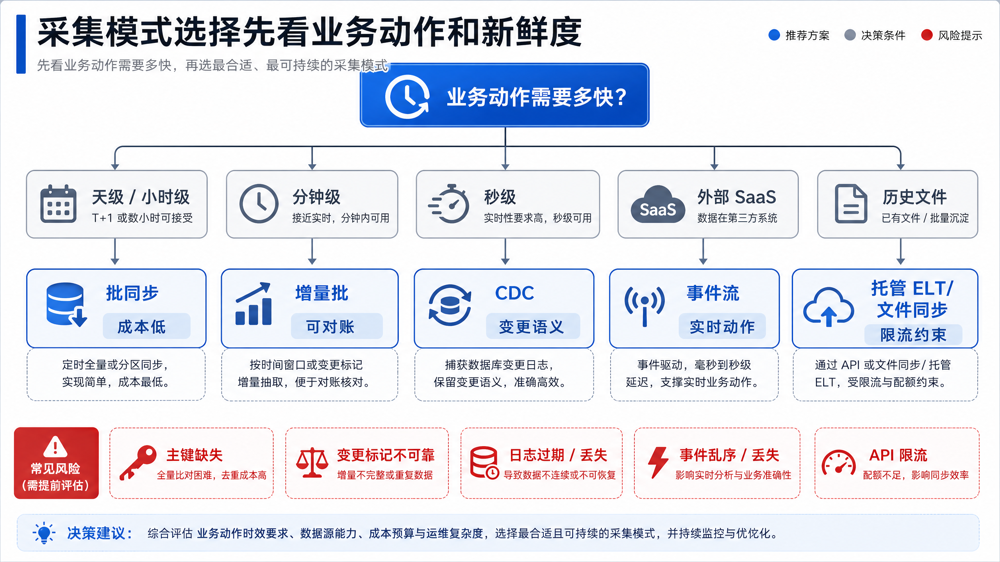
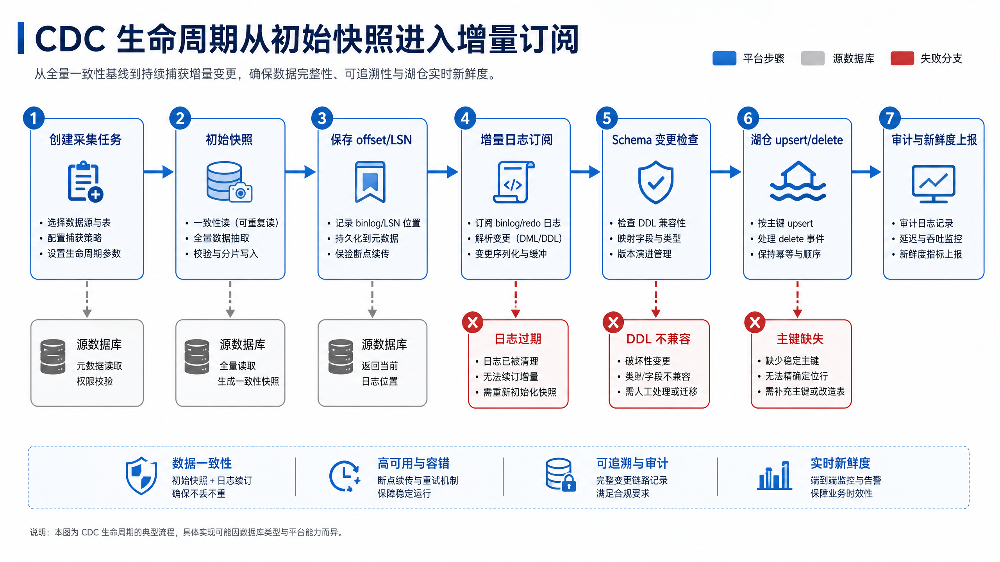
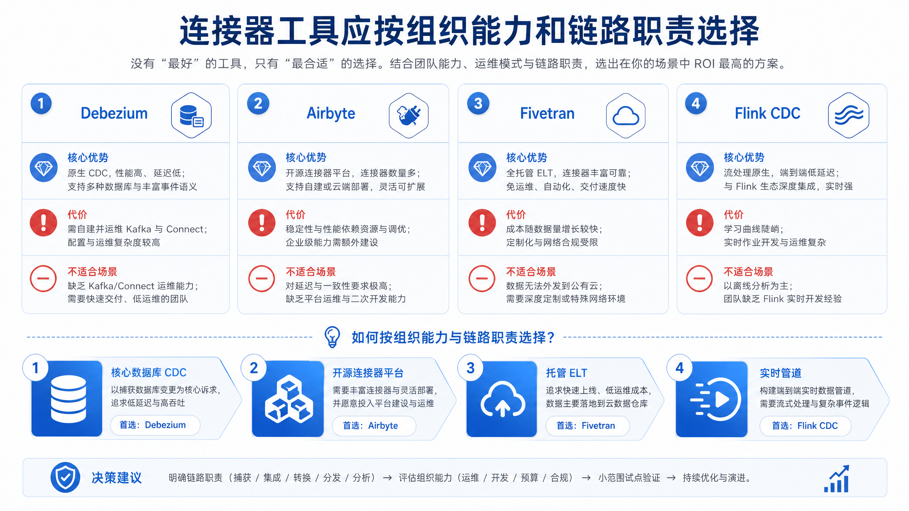
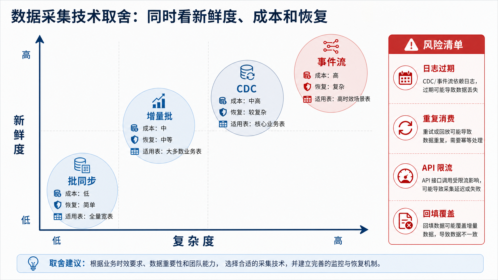
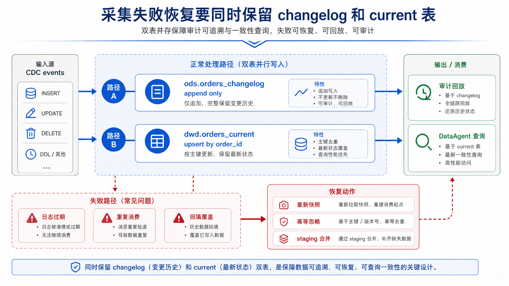
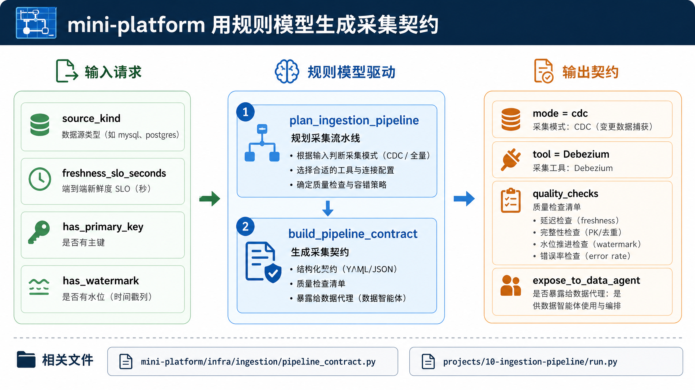

# 第10章 数据采集与集成

---

数据采集层决定企业 Agent 能看到哪些事实、看到多新的事实，以及这些事实是否还能追溯。DataAgent 回答得准不准，往往不取决于模型，而取决于上游采集到的数据是否新鲜、完整、口径一致。源系统接入、CDC、文件与 API 采集、契约管理和失败恢复，是采集层最容易影响下游可信度的几个位置。

运营负责人问“哪些门店今天可能缺货”，DataAgent 查到的却是昨天夜间批处理后的库存。系统回答得很流畅，甚至给出了补货建议，但建议依据已经落后于门店真实销售。排查后发现，源库、采集任务和湖仓表都没有报错，只是库存数据没有按业务需要进入分钟级更新链路。

这类问题不能靠换模型解决。采集层要先说明哪些数据被接入、变化如何被识别、失败时是否能隔离和重放，以及数据新鲜度如何暴露给上层 Agent。否则，下游所有分析都可能建立在过期或不完整的事实之上。

数据采集层经常被当成底层工程，只有在 Agent 答错时才被重新看见。业务用户看到的是自然语言答案，平台看到的是模型调用，真正决定答案是否可信的事实却早在源系统接入时就被决定了。库存表是否包含门店调拨、订单状态是否处理取消、文件是否重复导入、API 游标是否丢页，都会在下游表现成“模型分析错了”。

企业的数据源通常由不同系统拥有。OMS、WMS、CRM、ERP、SaaS 平台和历史文件的更新节奏、主键语义、删除语义和权限范围都不同。采集层若只追求“抽到数据”，就会把这些差异埋到湖仓表里。等 DataAgent 生成 SQL 时，它只能看到一张看似完整的表，无法知道某些字段来自昨晚批处理，某些字段来自近实时 CDC，某些字段又是供应商每周上传的 Excel。

采集层的工程责任是把源系统变化转换成平台可解释的数据事实。它要记录数据从哪里来、何时到达、如何识别增量、失败后能否重放、schema 变化影响谁、哪些字段包含敏感信息。只有这些控制信息进入数据产品，Agent 才能在回答中说明数据时效，也能在失败时把问题定位回源系统、连接器、落地表或质量门禁。

## 10.1 数据采集层要解决的业务边界

一家多业务线企业同时经营零售、制造、金融和物流业务。门店订单来自订单管理系统（Order Management System，OMS），库存状态来自仓储管理系统（Warehouse Management System，WMS），客户信息来自客户关系管理系统（Customer Relationship Management，CRM），供应商结算来自企业资源计划系统（Enterprise Resource Planning，ERP），设备质检来自工厂采集平台。DataAgent 要回答“哪些门店正在缺货”“某个供应商延期是否影响毛利”“客户授信变化后还有哪些未履约订单”时，不能直接访问这些生产系统。

生产系统面向交易处理，优先保证短事务、权限隔离和稳定性。Agent 平台面向分析、解释、问答和自动化动作，需要可查询、可追溯、可治理的数据副本。因此，数据采集层的职责是把源系统中的业务事实转换成平台可使用的数据产品入口。

这里的关键转变是：源系统中的一条记录，只有在进入平台后带上来源、时间、版本、质量和权限语义，才适合被 Agent 使用。订单库中的 `orders.status` 只是一个字段；进入数据采集层后，它需要被解释为“订单当前履约状态”，需要说明来自哪个系统、同步到哪个位点、是否包含删除、是否允许 DataAgent 查询。没有这一层转换，Agent 即使查到了数据，也无法判断这份数据是否新鲜、完整和可对外解释。

数据采集层也承担“节奏隔离”的作用。生产系统按业务事务节奏变化，湖仓和语义层按分析节奏组织数据，Agent 按用户问题的节奏发起查询。三者节奏不同，若让 Agent 直接访问生产库，分析查询会影响交易系统，字段变化会直接击穿问答链路，权限规则也会分散到多个入口。采集层把这些节奏隔开，使源系统可以继续稳定处理交易，下游可以围绕统一契约消费数据。


*图10-1：数据采集层把源系统和 Agent 平台隔离开。来源：本书自绘。Alt text：左侧是 ERP、CRM、文件、API 等异构源系统，中间是统一采集层，右侧是 Agent 平台数据底座，采集层作为缓冲使源系统变更不直接冲击下游。*

图 10-1 的关键是边界，而非工具名称。源系统只向采集层暴露受控接口；湖仓、OLAP、语义层和 DataAgent 只消费采集层沉淀的契约。这样做可以降低四类风险：直接查询源库导致业务抖动；字段含义变化后 Agent 仍按旧口径回答；权限和个人可识别信息（Personally Identifiable Information，PII）绕过治理；数据延迟或质量失败时无法解释。图中同时有两条线：数据流从源系统进入湖仓和分析层，控制流从采集契约把权限、质量、新鲜度和血缘约束传给下游。

### 10.1.1 从业务事件到可分析数据

数据进入平台前通常有四种形态。

*表10-1：表数据、事件、文件等数据形态的来源、采集关注点与对 Agent 的意义。来源：本书整理。*

| 数据形态 | 典型来源 | 采集关注点 | 对 Agent 的意义 |
|---|---|---|---|
| 表数据 | OMS、WMS、ERP、CRM 数据库 | 主键、水印、删除、字段演化 | 提供订单、库存、客户、结算等结构化事实 |
| 事件数据 | 支付、风控、设备、用户行为 | 事件时间、事件 ID、幂等、重放 | 提供实时上下文和动作触发条件 |
| 应用程序接口（Application Programming Interface，API）数据 | SaaS、广告平台、客服平台 | 分页、限流、增量游标、权限范围 | 扩展外部业务信息，但新鲜度受接口限制 |
| 文件数据 | 供应商、财务、历史归档 | 命名、分区、完整性、重复导入 | 支持低频批量导入和历史回填 |

DataAgent 要判断这份数据能否被可信地使用，仅知道“数据从哪里来”还不够。数据采集层需要把源系统差异收敛为统一的契约：数据源、目标表、同步模式、主键、分区、新鲜度、质量检查、血缘和暴露策略。

四种数据形态的差异，主要体现在“变化如何被识别”。表数据通常靠主键、水印、更新时间或数据库日志识别变化；事件数据本身就是变化事实，需要处理重复和乱序；API 数据要服从外部接口的分页、限流和游标规则；文件数据则常靠文件名、分区目录、清单文件和校验和判断是否完整。若忽略这种差异，把所有来源都当作“抽一批数据”处理，平台很容易在删除、补数、重复导入和字段漂移上出错。

接入边界可以先拆成三个问题，再选择连接器：平台拿到的是“当前状态”还是“变化过程”；源系统能否提供稳定的身份标识、时间标识和版本标识；下游需要的是可查询的最新状态、可回放的历史过程，还是低频归档数据。不同答案会直接影响目标表模型、质量检查和失败恢复策略。


*图10-2：源系统数据形态决定接入边界。来源：本书自绘。Alt text：表数据、事件流、文件、API 四类数据形态分列，各自连向对应的采集方式与关注点（主键水印、乱序、解析、限流），说明形态不同接入边界也不同。*

图 10-2 表明，数据形态决定采集边界。表数据需要主键、水印和删除语义；事件数据需要事件时间、事件 ID 和幂等；API 数据需要游标、限流和权限范围；文件数据需要命名、分区和完整性检查。每类来源右侧的控制点决定了数据能否被回放、对账和解释。

### 10.1.2 批处理、流处理、CDC 与 API 同步的选择模型

采集模式选择不应从工具开始，而应从业务动作开始。一家多业务线企业的月度财务结算只需要稳定、完整、可审计的数据，批处理更合适。门店库存接近售罄时要触发补货提醒，分钟级增量批或变更数据捕获（Change Data Capture，CDC）更合适。支付异常拦截依赖秒级动作，事件流和实时计算更合适。SaaS 营销平台数据通常受 API 限流约束，托管抽取加载转换（Extract Load Transform，ELT）或连接器平台更现实。

一个更可操作的选择方法，是把需求拆成五个维度：新鲜度、完整性、删除语义、回放能力和源系统改造成本。新鲜度决定是天级、小时级、分钟级还是秒级；完整性决定是否需要对账和补数；删除语义决定是否能只追加数据；回放能力决定是否必须保留 changelog；源系统改造成本决定能否要求业务系统主动发事件。只有把这五个维度放在一起，采集模式才不会被“实时”“开源”“托管”等单一标签带偏。

例如，门店库存看似需要实时，但若业务只要求每 10 分钟触发一次补货建议，增量批可能比 CDC 更稳定。订单状态看似也可以按更新时间增量抽取，但若涉及取消、退款和状态回滚，CDC 保留的变化顺序会更有价值。营销 SaaS 数据虽然也有“增量”需求，但平台不能控制外部接口的限流和字段变更，因此托管 ELT 或成熟连接器常常比自研脚本更可维护。

*表10-2：批同步、流处理、CDC、API 同步四种采集模式的优势、代价与适用场景。来源：本书整理。*

| 模式 | 工作方式 | 优势 | 代价 | 适用场景 | 本书建议 |
|---|---|---|---|---|---|
| 批同步 | 定时全量或分区抽取 | 简单、便宜、易对账 | 延迟高，删除捕获弱 | 财务、历史回填、低频维表 | 默认保留 |
| 增量批 | 按水印或游标周期抽取 | 复杂度适中，新鲜度较好 | 水印可靠性决定正确性 | 门店库存、订单状态准实时同步 | mini-platform 默认可选 |
| CDC | 读取数据库日志传播行级变化 | 低侵入、保留变更语义 | 依赖日志、主键和 DDL 管理 | 订单、库存、工单关键事实表 | 关键表增强 |
| 托管 ELT | 连接器或服务周期同步 | 运维成本低，覆盖 SaaS 多 | 成本、合规和厂商绑定 | CRM、客服、营销平台 | 视组织能力选择 |
| 事件流 | 业务系统主动发送事件 | 低延迟、语义清晰 | 需要业务系统改造 | 支付、风控、设备告警 | 第13章 展开 |



*图10-3：采集模式选择先看业务动作和新鲜度。来源：本书自绘。Alt text：决策流图从"业务对新鲜度的要求"出发分出秒级、分钟级、小时级、天级分支，分别指向 CDC/流、CDC、批同步等模式，体现按时效需求选模式。*

图 10-3 把采集模式选择收敛到两个问题：业务动作需要多快的新鲜度，源系统能否稳定提供主键、游标或事件语义。先回答这两个问题，再选择批同步、增量批、CDC、托管 ELT 或事件流，能避免从工具偏好反推架构。图中的箭头表达的是决策顺序：由业务动作确定新鲜度目标，由源系统能力确定可行路径，再落到工具和目标表设计。

### 10.1.3 采集模式选择的约束条件

实时并不是越快越好。低延迟会带来常驻计算、状态恢复、消息积压和运维值班成本。若业务动作只要求小时级新鲜度，把链路压到秒级通常是浪费。判断是否需要实时，应看“迟到的数据是否会导致错误动作”。如果只是报表展示，延迟通常可以被标注和解释；如果是支付拦截、库存冻结或风险止付，延迟才会直接变成业务损失。

CDC 也不能替代所有批处理。CDC 擅长捕获数据库行级变化，不擅长外部文件、历史回填、低频维表和受限 API。成熟平台通常同时保留批同步、增量批、CDC 和事件流。CDC 解决“变化怎么来”，但历史修复仍需要批量回填和对账能力。一旦源表曾经漏同步、字段曾经写错，仅靠日志订阅无法补回正确结果。

连接器工具也不等于数据治理。Debezium、Airbyte、Fivetran、Flink CDC 等工具解决接入问题，不自动解决字段口径、PII 脱敏、质量门禁、血缘、权限和指标一致性。连接器能把数据搬到平台，治理则要回答“谁能用、用哪个版本、失败时谁负责、结果能否解释”。这两个问题不能混为一谈。

---

## 10.2 CDC 架构：快照、增量日志、Schema 演化与一致性

CDC 链路通常分成两个阶段。第一阶段是初始快照，把源表已有数据同步到目标端。第二阶段是增量订阅，从数据库事务日志继续读取插入、更新和删除。两个阶段之间必须保存位点，例如 PostgreSQL 的 WAL 日志序列号（Log Sequence Number，LSN）或 MySQL binlog position。

理解 CDC 时，应把它看成变化过程的记录机制，不要简单归类为“更快的同步方式”。批同步通常关心某个时间点的最终状态，CDC 关心从一个状态变到另一个状态的过程。这个过程包含插入、更新、删除、事务顺序和源库位点。对 DataAgent 来说，过程信息可以解释“为什么库存从 10 变成 4”“哪一次订单状态回滚导致报表变化”，而不是只给出一个最新数字。

CDC 的难点在于快照和增量之间不能出现缝隙。若初始快照还没有结束，源表已经产生新变更，平台必须知道这些变更是否已经被快照覆盖、是否还需要从日志重放。成熟链路会在快照开始、快照结束和增量订阅之间保存一致的 source position，并让 sink 端按照主键和版本做幂等写入。否则一次重启就可能造成漏数或重复。



*图10-4：CDC 生命周期从初始快照进入增量订阅。来源：本书自绘。Alt text：时间轴上先是一次性初始快照阶段，随后切换到持续的增量日志订阅阶段，中间标出位点交接点，说明 CDC 从快照平滑过渡到增量。*

图 10-4 展示 CDC 的两个阶段：先用初始快照建立全量基线，再从日志位点持续订阅增量变化。两个阶段之间的位点保存，是后续断点恢复、重复消费控制和历史对账的前提。平台需要记录三类信息：快照覆盖了哪些主键范围，增量从哪个日志位点开始，目标表提交到了哪个批次。

CDC 的核心挑战有四个。

*表10-3：CDC 落地的典型挑战、表现与处理策略。来源：本书整理。*

| 挑战 | 表现 | 处理策略 |
|---|---|---|
| 初始快照压力 | 大表扫描拖慢业务库 | 使用只读副本、低峰期执行、分片快照、限流 |
| 位点恢复 | Connector 故障后不知道从哪里继续 | offset 外部持久化，恢复前校验日志保留窗口 |
| Schema 演化 | 源表新增、删除、改类型 | 建立兼容性规则和变更审批，记录 schema version |
| 删除语义 | 下游只 append，无法反映 delete | 明确 tombstone、软删除或 merge-on-read 策略 |

### 10.2.1 采集契约：把连接器状态转成平台语义

平台不应让湖仓写入器、元数据系统和 DataAgent 分别理解每一种连接器的内部状态。采集层应向下游暴露统一接口契约。

契约的作用，是把“工具能做到什么”翻译成“平台承诺什么”。连接器可能记录的是 topic、partition、offset、cursor、job id 或内部 checkpoint；DataAgent 需要知道的是这张表来自哪里、多久更新一次、是否有主键、质量是否通过、是否允许查询。没有契约，下游只能猜测数据状态，出了问题也很难定位责任边界。

契约还决定了失败恢复的语言。若契约声明 `primary_key`，sink 端可以做幂等 merge；若声明 `freshness_slo_seconds`，观测系统可以判断是否违反新鲜度目标；若声明 `quality_checks`，编排系统可以在质量失败时阻断暴露给 Agent。采集契约应作为采集链路与治理系统、查询系统之间的机器可读协议，而不是项目文档里的附件。

*表10-4：采集链路各组件的职责、输入输出与失败模式。来源：本书整理。*

| 组件 | 职责 | 输入 | 输出 | 失败模式 |
|---|---|---|---|---|
| Source Connector | 连接源系统并抽取数据 | 数据库日志、API、文件、事件 | 规范化记录或事件 | 权限不足、限流、日志过期 |
| Offset Store | 保存读取进度 | connector checkpoint | offset、LSN、cursor | 位点丢失、重复消费 |
| Schema Manager | 管理字段结构变化 | DDL、schema registry | schema version | 字段漂移、类型不兼容 |
| Buffer / Queue | 缓冲变更事件 | CDC event、业务事件 | topic、partition event | 积压、乱序、重复 |
| Sink Writer | 写入目标表 | 规范化事件 | 湖仓表、OLAP 表 | 幂等失败、写入冲突 |
| Audit Logger | 记录运行过程 | run state、metrics | 审计日志、血缘事件 | 无法追责 |

接口契约示例：

```json
{
  "pipeline_id": "orders-postgres-to-iceberg",
  "source": {
    "type": "postgres",
    "database": "oms",
    "table": "public.orders"
  },
  "destination": {
    "type": "iceberg",
    "table": "dwd.orders"
  },
  "mode": "cdc",
  "primary_key": ["order_id"],
  "freshness_slo_seconds": 60,
  "expose_to_data_agent": true,
  "quality_checks": [
    "row_count_reconciliation",
    "primary_key_uniqueness",
    "freshness_slo",
    "schema_compatibility"
  ]
}
```


*图10-5：采集契约把工具状态收敛为平台字段。来源：本书自绘。Alt text：左侧多个连接器输出格式各异的原始记录，经过采集契约层映射，右侧收敛为统一的平台标准字段，体现契约层做规范化。*

图 10-5 说明采集契约的价值：把连接器内部状态转成平台统一字段，让湖仓写入器、元数据系统和 DataAgent 看到同一套同步模式、主键、新鲜度、质量检查和暴露策略。图中从左到右的转换，表达的是“工具状态”到“平台语义”的转换：源端细节可以不同，但进入平台后的契约字段必须稳定。

这份契约会被三类下游使用。湖仓写入器根据 `mode`、`primary_key` 和 `quality_checks` 决定 append、merge 或回填；元数据系统记录源表、目标表、Schema 版本和新鲜度；DataAgent 在回答时判断数据是否足够新，必要时拒绝基于过期或质量失败的数据回答。

### 10.2.2 工具生态对比

工具介绍必须服务于架构取舍。Debezium 更适合以 Kafka 为中心的数据库 CDC 事件总线；Airbyte 更适合作为开源连接器平台；Fivetran 更适合希望降低连接器运维的托管 ELT 场景；Flink CDC 更适合 CDC 后立即进入实时转换、路由和多 sink 的链路。

选择工具时，读者应把工具放回组织能力中评估。平台团队若已经有 Kafka 和流式运维能力，Debezium 或 Flink CDC 的可控性更高；若团队主要目标是快速接入大量 SaaS，Airbyte 或 Fivetran 的连接器覆盖更重要；若数据涉及敏感字段和复杂内网权限，托管服务的合规边界就必须被提前评估。工具没有绝对优劣，只有与链路职责和团队能力是否匹配。

*表10-5：Debezium、Flink CDC 等采集工具的适用与不适用场景。来源：本书整理。*

| 工具 | 为什么用 | 不适合什么场景 | 替代方案 | 本书建议 |
|---|---|---|---|---|
| Debezium | 数据库日志捕获成熟，适合核心表 CDC | 不适合大量 SaaS API 和低频文件 | Flink CDC、数据库原生复制 | 用于订单、库存等关键事实表 |
| Airbyte | 连接器覆盖广，自建可控 | 连接器质量和运维需要平台补强 | Fivetran、Meltano、批脚本 | 用于多源快速接入 |
| Fivetran | 托管体验好，减少连接器维护 | 成本、合规和厂商绑定需评估 | Airbyte、自研批同步 | 用于外部 SaaS 和低运维团队 |
| Flink CDC | CDC 后可直接做实时转换和多 sink | 没有 Flink 运维能力时成本高 | Debezium + Sink、Spark 微批 | 用于实时数据管道 |



*图10-6：连接器工具应按组织能力和链路职责选择。来源：本书自绘。Alt text：二维矩阵以"组织工程能力"和"链路关键程度"为轴，把 Debezium、Flink CDC、SaaS 连接器、自建连接器分别落入不同象限，给出选型指引。*

图 10-6 对比了四类连接器工具的边界。Debezium 更像数据库日志事件源，Airbyte 更像自建连接器平台，Fivetran 更像托管 ELT 服务，Flink CDC 更适合把 CDC 与实时计算放在同一条链路中。图中的“工具职责”应与前文契约字段一起理解：无论底层选择哪个工具，进入平台后都要产出同样的 source、destination、mode、freshness 和 quality 信息。

### 10.2.3 面向 DataAgent 的新鲜度、延迟、成本与可靠性边界

DataAgent 的新鲜度需求容易被误解为“越实时越智能”。实际情况是，Agent 更需要“知道自己基于什么时间点的数据回答”。如果平台能明确告诉 Agent 数据截至 10 分钟前，Agent 可以在回答中说明限制；如果平台给出秒级链路但经常重复、乱序或质量失败，Agent 反而更容易生成看似精确但不可追责的结论。

这里的决策不能停留在“慢”和“快”的二选一上，还要同时比较业务价值、恢复复杂度和解释能力。关键事实表可以承受更高链路成本，低频维表不适合强行实时化；敏感数据优先选择可控链路，低敏外部数据可以用托管连接器加速接入。

#### 批同步与 CDC

*表10-6：批同步与 CDC 在新鲜度、成本、可靠性上的取舍。来源：本书整理。*

| 方案 | 优势 | 代价 | 适用场景 | 本书建议 |
|---|---|---|---|---|
| 批同步 | 成本低、对账简单、故障恢复直观 | 新鲜度差，删除捕获弱 | 财务、维表、历史回填 | 作为默认基础能力 |
| CDC | 新鲜度好，保留 insert/update/delete 语义 | 依赖日志、主键、Schema 管理和值班 | 订单、库存、工单关键事实表 | 只给高价值表启用 |

#### 自建连接器与托管 ELT

*表10-7：采购连接器与自建连接器的取舍。来源：本书整理。*

| 方案 | 优势 | 代价 | 适用场景 | 本书建议 |
|---|---|---|---|---|
| 自建连接器 | 可控、可审计、可贴合内部治理 | 需要维护连接器、调度和告警 | 核心系统、敏感数据、复杂权限 | 平台团队掌握核心链路 |
| 托管 ELT | 接入快、运维少、SaaS 支持多 | 成本、合规和厂商锁定 | 外部系统、低敏数据、连接器标准化场景 | 作为补充路径 |



*图10-7：数据采集技术取舍同时看新鲜度、成本和恢复。来源：本书自绘。Alt text：以新鲜度、成本、恢复难度为三轴的雷达图，批同步、CDC、流处理三种方案各画一条曲线，直观对比它们在三个维度上的强弱。*

图 10-7 强调采集技术取舍要同时看延迟、新鲜度、成本、故障恢复、审计能力和组织运维能力。否则，低延迟链路可能变成高成本且难恢复的生产负担。每条链路都要接受同一个问题检验：如果今天凌晨失败，明天上午能否解释影响范围并补回正确数据。

### 10.2.4 采集链路的断点与补数策略

*表10-8：重复、乱序、字段漂移等采集失败模式的检测与恢复策略。来源：本书整理。*

| 失败模式 | 触发条件 | 影响 | 检测方式 | 恢复策略 |
|---|---|---|---|---|
| 日志过期 | Connector 停止时间超过源库日志保留 | 无法从原位点恢复 | 监控复制槽积压、binlog/WAL 保留 | 重新快照受影响表并对账 |
| 重复消费 | at-least-once 投递或恢复重放 | 指标偏高、重复记录 | 主键唯一性检查、事件版本检查 | sink 端幂等 merge，保留 changelog |
| 乱序到达 | 网络抖动、跨分区消费、大事务 | 当前状态被旧事件覆盖 | 事件时间与版本监控 | 按版本号或 source position 比较后更新 |
| 字段漂移 | 源系统新增、删除、改类型 | 写入失败或字段错位 | Schema diff、兼容性检查 | 自动兼容新增字段，破坏性变更人工审批 |
| 回填覆盖实时 | 历史修复与 CDC 同写 current 表 | 最新状态被旧数据覆盖 | 写入批次审计、更新时间比较 | 回填写 staging，按版本原子合并 |

这些失败模式有一个共同点：它们通常不会在链路刚上线时暴露，而是在重启、回填、字段变更和流量高峰时出现。平台除了监控“任务是否成功”，还要监控“产出的数据是否仍然可信”。例如，同步任务成功结束但主键重复，DataAgent 统计会偏高；CDC 仍在运行但日志位点落后，回答会滞后；Schema 自动兼容新增字段但语义没有登记，Agent 可能误用字段。



*图10-8：采集失败恢复要同时保留 changelog 和 current 表。来源：本书自绘。Alt text：图中并列两张表，记录每次变更的 changelog 表和保存最新状态的 current 表，箭头表示故障时可用 changelog 重放重建 current 表，说明两者须并存。*

图 10-8 表示一个实用原则：同一条采集链路应同时保留 append-only 的变更日志表和面向查询的 current 表。变更日志表用于审计、回放和故障修复；current 表用于 DataAgent 查询最新业务状态。只保留 current 表会降低追溯能力，只保留 changelog 表会把查询复杂度转嫁给下游。图中两张表分别服务“解释过去”和“查询现在”两个目标。

---

## 10.3 采集配置、落地表与最小可运行链路

本章的 mini-platform 实现不连接真实数据库或 Kafka，而是把采集模式选择和 DataAgent 可读契约固化为可测试代码。这样做的原因是：企业平台在接入真实工具前，必须先统一“什么样的数据可以暴露给 Agent”这一层语义。

这段实现刻意从规则模型开始，而不是从连接器客户端开始。真实连接器会引入网络、权限、数据库版本和运行环境差异，容易让初学者把注意力放在工具参数上。mini-platform 先把“源类型、新鲜度、主键、水印、暴露策略”建模清楚，使读者看到平台的最小流程：需求输入、模式选择、契约输出、测试验证。

- 入口：`mini-platform/infra/ingestion/__init__.py`
- 核心实现：`mini-platform/infra/ingestion/pipeline_contract.py`
- 测试：`mini-platform/tests/test_ingestion_pipeline_contract.py`
- 实战项目：`mini-platform/projects/10-ingestion-pipeline/run.py`



*图10-9：mini-platform 用规则模型生成采集契约。来源：本书自绘。Alt text：流程图显示源 schema 经规则模型分析后自动生成采集契约（字段、类型、水印、主键），再下发给连接器，体现契约的半自动生成。*

图 10-9 对应本章 mini-platform 的最小流程：输入源系统类型、新鲜度、主键和目标表信息，规则模型选择采集模式与工具，再生成 DataAgent 可读的数据采集契约。

`mini-platform/infra/ingestion/pipeline_contract.py`：

```python
class SourceKind(str, Enum):
    DATABASE = "database"
    SAAS_API = "saas_api"
    FILE = "file"
    EVENT_STREAM = "event_stream"

class IngestionMode(str, Enum):
    BATCH = "batch"
    INCREMENTAL_BATCH = "incremental_batch"
    CDC = "cdc"
    MANAGED_ELT = "managed_elt"
    EVENT_STREAM = "event_stream"
```

同一文件中的 `plan_ingestion_pipeline` 根据源类型、新鲜度、主键和水印做第一轮模式选择。下面是核心分支的节选：

```python
def plan_ingestion_pipeline(request: dict[str, Any]) -> PipelineDecision:
    source_kind = SourceKind(request["source_kind"])
    freshness = int(request.get("freshness_slo_seconds", 86_400))
    has_primary_key = bool(request.get("has_primary_key", False))

    if source_kind is SourceKind.DATABASE and freshness <= 300 and has_primary_key:
        return PipelineDecision(
            mode=IngestionMode.CDC,
            tool="Debezium",
            reason="数据库关键事实表需要分钟级新鲜度，且具备稳定主键。",
            freshness_slo_seconds=freshness,
            requires_primary_key=True,
            requires_watermark=False,
        )
```

`build_pipeline_contract` 把规则决策转换为下游可消费的契约：

```python
def build_pipeline_contract(request: dict[str, Any]) -> PipelineContract:
    decision = plan_ingestion_pipeline(request)
    primary_key = tuple(request.get("primary_key", ()))
    quality_checks = (
        "row_count_reconciliation",
        "primary_key_uniqueness" if primary_key else "source_file_completeness",
        "freshness_slo",
        "schema_compatibility",
    )

    return PipelineContract(
        pipeline_id=request["pipeline_id"],
        source=request["source"],
        destination=request["destination"],
        mode=decision.mode,
        primary_key=primary_key,
        freshness_slo_seconds=decision.freshness_slo_seconds,
        expose_to_data_agent=bool(request.get("expose_to_data_agent", False)),
        quality_checks=quality_checks,
    )
```

运行测试：

```bash
cd enterprise_agent_platform_book/mini-platform
python3 -m pytest tests/test_ingestion_pipeline_contract.py -q
```

运行项目：

```bash
cd enterprise_agent_platform_book/mini-platform/projects/10-ingestion-pipeline
PYTHONPATH=../.. python3 run.py
```

预期输出：

```text
orders-postgres-to-iceberg -> cdc
tool=Debezium freshness=60s
checks=row_count_reconciliation,primary_key_uniqueness,freshness_slo,schema_compatibility
```

这段输出对应图 10-9 的最小流程：输入是一家多业务线企业订单表采集需求，规则选择 CDC 和 Debezium，输出是 DataAgent 可读的数据契约。真实生产系统还需要把这份契约写入第15章的元数据系统，并把运行状态、血缘、质量检查和告警接入第14章的编排与质量平台。

### 10.3.1 数据采集进入 Agent 链路的准入标准

数据采集一旦进入 Agent 链路，就会影响回答口径、权限判断和后续审计。上线评审应先看四类证据。

第一类是访问证据。CDC 用户、API token 和文件读取账号只授予必要范围；所有凭证进入 secret 管理，不写入仓库、配置样例或日志；同步表使用 allowlist，避免默认同步全库；敏感字段进入湖仓或语义层前完成标注、脱敏或策略过滤。

第二类是恢复证据。offset、LSN、binlog position 和 API cursor 要持久化并可审计；源库日志保留时间要大于最大恢复窗口；大表初始快照应采用限流、分片和低峰窗口；新增字段、删除字段和类型变更都有兼容性规则。

第三类是质量证据。sink 端要处理重复事件，历史回填写入 staging 后按版本原子合并；关键表定义 freshness SLO，并暴露给 DataAgent；行数、主键唯一性、非空、枚举值和 Schema 兼容性检查自动运行。

第四类是运营证据。平台记录 source、connector、destination、schema version 和运行时间；延迟、错误率、积压、同步失败和日志空间占用都进入告警。缺少这些证据时，Agent 可以试用这批数据，但不应把它用于对外结论。

### 10.3.2 采集延迟、重复和补数的恢复策略

#### 日志保留不足导致 Connector 无法恢复

- 现象：周末 CDC Connector 停止两天，周一恢复时找不到原 binlog/WAL 位点。
- 根因：源库日志保留时间小于停止时间，offset 指向的日志已经被清理。
- 修复：增加日志保留，监控停止时长和复制槽积压；恢复时重新快照受影响表，并通过 changelog 与 current 表对账。

#### 全量快照拖慢源库

- 现象：首次同步订单明细表时，业务系统查询延迟明显升高。
- 根因：快照扫描大表，占用源库 I/O 和锁资源。
- 修复：改为只读副本执行快照，降低并发，按主键范围分片，把首次同步安排在低峰期。

#### 源表缺少主键导致 upsert 目标表持续重复

- 现象：目标湖仓表中同一业务记录出现多行，DataAgent 统计订单数偏高。
- 根因：源表没有稳定主键，sink writer 无法判断重复事件。
- 修复：与业务方确认业务唯一键；无法确认时写入 changelog 表，并在下游建模层通过窗口函数取最新版本。

#### 回填任务覆盖实时增量

- 现象：修复历史订单时，实时订单状态被旧数据覆盖。
- 根因：回填任务和 CDC sink 同时写 current 表，没有版本比较。
- 修复：回填写入 staging 表，根据源系统更新时间和 source position 做合并，合并期间暂停相关分区或使用冲突检测。

### 10.3.3 采集契约与 DataAgent 证据链

数据采集层不是 DataAgent 的后台细节。用户看到的每个指标、每份报告和每次异常归因，都依赖采集链路提供稳定事实。采集契约因此要进入回答证据链：源系统、同步模式、最后成功同步时间、质量状态、schema 版本和回填状态，都应能被语义层和 Trace 查询到。用户不需要看到连接器配置，但平台需要知道回答使用的是哪一次同步后的数据。

采集契约还要处理“数据可用但不适合回答”的情况。某张表刚完成快照但增量还没有追平，某个 API 同步成功但缺少关键字段，某次回填正在重算历史分区，这些状态都不能简单标为 available。DataAgent 可以在低风险探索中使用这类数据，但不应在正式报告里给出确定结论。比较稳妥的做法是把资产状态分成可查询、可观察、阻断和废弃，回答层据此决定继续、降级、澄清或拒答。

采集层的运营也要回流到第14章的数据质量和第15章元数据系统。连接器延迟升高、重复事件增多、schema 变更频繁，都会影响 Agent 可信度。若这些信号只停留在数据工程告警里，业务用户看到的只是“Agent 回答不稳定”。把采集状态接入 Trace 后，平台才能解释一次错误回答到底来自模型、语义层、查询执行，还是源数据尚未稳定。

---

采集链路上线后，最重要的指标不是任务成功次数，而是新鲜度、完整性和可恢复性。一个任务每天都成功运行，却持续晚到两小时，对经营监控仍然是失败；一个 CDC 任务没有报错，但删除事件没有同步，会让库存和订单口径长期偏高。

平台团队还要给采集失败设计隔离区。源系统字段漂移、文件校验失败、API 限流和日志位点异常，都不应直接污染下游生产表。失败数据进入隔离区后，数据负责人可以决定补数、跳过、回滚或暂停下游任务。这个流程越清楚，DataAgent 的回答越能被业务信任。

对 Agent 平台而言，采集层的交付物包括连接器配置、数据契约、位点记录、质量检查、血缘和告警规则。它们看起来不像模型能力，却决定模型能否基于正确事实工作。没有这层，后续语义层、NL2SQL 和评测都会在错误数据上继续优化。

采集层还要处理“看似成功”的失败。任务按时结束，但源系统当天没有产生文件；API 返回 200，但分页游标少取了一页；CDC 位点继续推进，但某类删除事件被过滤；文件校验通过，但供应商把金额单位从元改成万元。这类问题不会自动变成红色告警，只有把业务规则写进契约和质量检查，平台才能提前发现。

数据新鲜度应对上层可见。DataAgent 查询库存、价格、风控状态或客服工单时，需要知道数据截至哪个时间点。如果数据延迟超过业务容忍范围，系统应该提示用户，或者拒绝生成强结论。把新鲜度藏在数据平台后台，会让模型用过期事实生成非常流畅的错误答案。

采集变更也要有发布流程。新增源表、修改增量字段、切换连接器、调整分区策略，都可能影响下游语义层和评测集。数据团队应在变更前说明影响对象，平台团队应在变更后跑关键问数样本。若采集变更和 Agent 发布互相独立，问题往往会在用户追问时才暴露。

跨系统对账是采集层的另一个责任。订单、支付、库存和结算通常来自不同系统，单表质量通过并不代表整体一致。Agent 做归因分析时，会把这些来源放在一起解释；如果对账没有完成，模型可能把系统间延迟解释成业务异常。对账状态进入元数据后，Agent 才能知道哪些结论需要谨慎。

采集层越早把状态暴露出来，后面的模型越少背锅。很多所谓“模型幻觉”，其实是平台没有告诉模型数据已经延迟、缺失、重复或口径变化。数据事实不可靠时，最好的模型也只能给出不可靠分析。

源系统接入前要做数据合同访谈。业务系统负责人需要说明主键是否稳定、删除如何表达、更新时间是否可信、字段枚举是否会变、历史数据是否会被回写。数据平台如果只拿到连接串和表名，很难判断这些语义。访谈结果应写进采集契约，后续 Agent 使用这些数据时才能解释来源和限制。

批处理、CDC 和 API 同步还会带来不同的事故形态。批处理常见问题是分区缺失、重复导入和补数覆盖；CDC 常见问题是位点丢失、schema 演化和乱序；API 同步常见问题是限流、分页游标和供应商字段变化。平台要为每种形态准备对应的监控，而不是只看任务是否成功。

采集层还要服务成本控制。全量抽取简单但昂贵，CDC 精细但运维复杂，API 同步受外部限制，文件接入依赖供应商纪律。选择采集方式时，要把业务新鲜度、源系统改造成本、数据量和恢复能力放在一起看。为了追求实时而引入复杂 CDC，如果业务每天只看一次报表，维护成本就可能超过收益。

数据源权限也要前置。源系统允许数据平台读取，不代表 Agent 可以直接使用所有字段。采集层应在落地时标记敏感字段、租户字段、授权范围和脱敏要求。后续语义层和查询执行器根据这些标记控制访问，避免把权限问题留给模型临时判断。

采集链路的文档应能被事故复盘使用。某张表来自哪个源库，增量位点在哪里，最近一次 schema 变化是什么，质量检查是否通过，失败后补数范围是多少，这些信息在平时看起来琐碎，事故时却决定排障速度。把这些材料结构化保存，Agent 平台才能在数据问题出现时快速收敛。

采集层还要给历史回填留通道。新接入一个源系统时，平台通常既要同步未来增量，也要回填历史数据。历史回填会影响分区、质量检查、血缘和下游缓存，如果处理不好，Agent 会在同一问题上看到不完整时间段。回填计划应说明范围、顺序、校验方式和对下游问数的影响。

源系统压力也是采集设计的一部分。直接大批量抽取生产库，可能影响交易系统；API 拉取频率过高，可能触发供应商限流。采集层需要用副本库、只读账号、限速、分批和低峰窗口保护源系统。Agent 平台要获取数据，但不能为了问答能力破坏业务系统稳定性。

采集配置还要接受审计。谁新增了数据源，谁调整了字段映射，谁关闭了质量规则，谁执行了补数，都应有记录。数据一旦被 Agent 用于业务解释，这些配置变化就成为回答依据的一部分。没有审计，数据错误很难追溯到具体变更。

采集负责人还应定期抽查下游问数样本。数据能被抽取，不代表适合被 Agent 使用；抽查能发现字段含义、时效和权限在进入分析链路后的真实表现。

## 本章小结

数据采集层是企业 Agent 平台的数据入口，直接影响 DataAgent 的新鲜度、可信度和可审计性。批同步、增量批、CDC、托管 ELT 和事件流各有边界，一个工具无法覆盖所有来源。

采集链路必须暴露统一契约，包括源、目标、模式、主键、新鲜度、质量检查和 Agent 暴露策略。生产级 CDC 的难点集中在快照、位点、Schema 演化、删除语义、幂等写入和回填恢复。mini-platform 的最小实现先固化规则和契约，真实连接器应在这个契约之后接入。

## 参考文献

Debezium. (n.d.). [Documentation](https://debezium.io/documentation/).

Airbyte. (n.d.). [Documentation](https://docs.airbyte.com/).

Apache Flink. (n.d.). [Flink CDC documentation](https://nightlies.apache.org/flink/flink-cdc-docs-stable/).

Apache Kafka. (n.d.). [Documentation](https://kafka.apache.org/documentation/).
