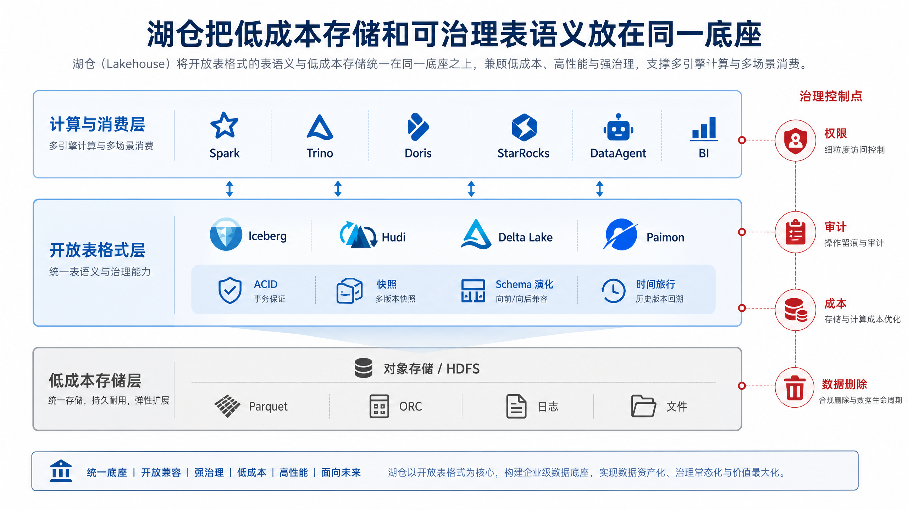
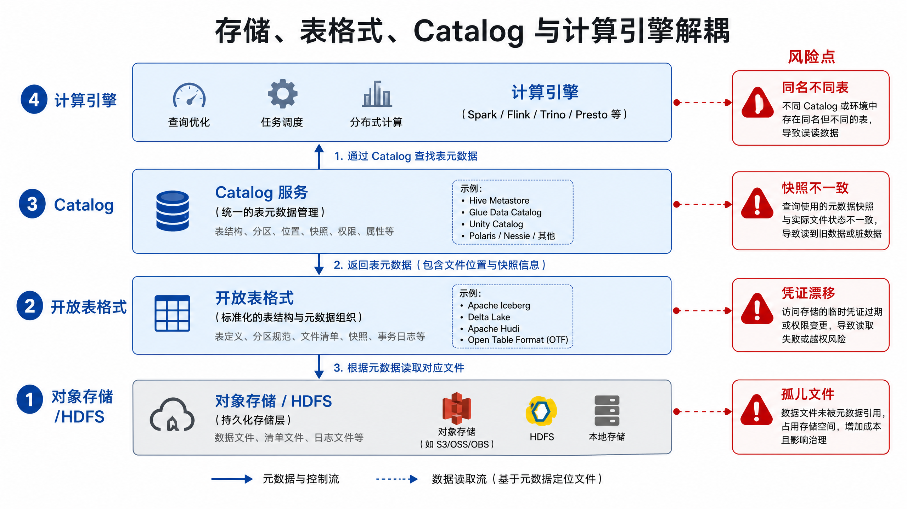
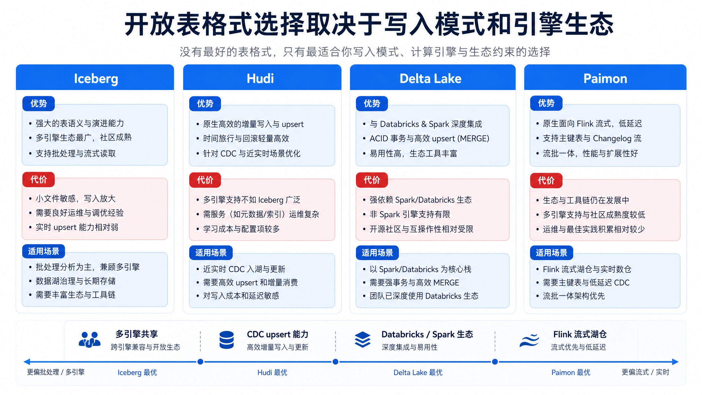
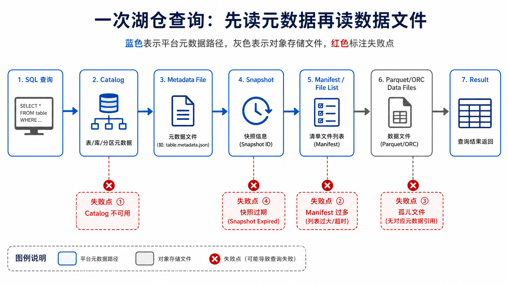

# 第11章 数据湖与湖仓

---

财务团队复盘上周的一次经营分析，发现同一个问题在本周重新运行后得到不同结果。SQL 没变，模型版本也没变，差异来自底层明细表被补数覆盖：系统只能看到“当前文件目录”，却说不清上周回答时读到的是哪一批数据。

Agent 平台要支持回放和审计，底层数据就不能只是对象存储上的一堆文件。湖仓需要提供事务、快照、Schema 演化和时间旅行，让一次回答能够绑定到明确的数据版本，也让后续补数、回滚和口径修正有可追踪的边界。

真实项目里的问题往往更细。运营同学问“上周华东区域退款率为什么升高”，DataAgent 先查订单表，再查售后表，最后追到客服工单。三张表来自不同链路：订单每天批量补数，售后用 CDC 几分钟写入一次，工单由 SaaS API 拉取。若底层只是按日期目录堆放 Parquet 文件，平台很难保证三次查询读到的是同一个业务时间点，也很难在事故复盘时说明“当时到底读了哪些文件”。当用户把答案截图发到周会里，这种不确定性就会变成责任问题：分析师怀疑 Agent 编错 SQL，数据团队怀疑补数任务覆盖了旧分区，业务团队只看到两个互相冲突的数字。

湖仓的价值就在这种追责场景里显出来。对象存储负责把数据低成本保存下来，开放表格式负责把一批文件声明为一次可见提交，Catalog 负责让不同引擎找到同一张表并执行同一套权限规则。一次回答如果记录了 `snapshot_id`、Schema 版本和查询引擎，后续复查就能回到同一份数据视图；如果补数产生了新快照，旧答案也不会因为目录文件被替换而失去依据。对 DataAgent 来说，湖仓是把可变数据变成可引用证据的工程层，不能只理解成“比数仓便宜的存储”。

这也解释了为什么很多团队从数据湖走向湖仓。早期数据湖通常先解决“放得下”：日志、明细、图片解析结果、外部 API 返回都能进对象存储。随着 Agent 开始直接读取这些数据，问题转向“读得准”和“查得回”。同一个表名在 Spark、Trino、Doris 外表和 Notebook 中指向不同目录，会让权限和口径失控；小文件长期堆积，会让一次看似简单的分析扫描成千上万个对象；字段新增后没有 Schema 演化记录，Agent 生成的 SQL 可能在一部分分区上成功、在另一部分分区上失败。本章讨论的开放表格式、Catalog、事务提交和文件布局，都是为了让这些问题有明确的工程抓手。

---

## 11.1 Agent 平台的数据底座需要可追溯、可回放

第10章 解决“数据如何进入平台”，本章解决“数据进入后如何可靠保存”。一家多业务线企业的 DataAgent 不只回答当前库存和订单状态，还要解释“这个答案来自哪些数据”“能否复现上周同一问题的结果”“某个字段变更是否影响了历史回答”。若底层只有一堆文件，Agent 的回答会缺少可审计依据。

数据湖提供低成本、开放格式和多类型数据存储，适合保存原始文件、日志、明细和历史归档。数据仓库提供事务、建模、权限、查询优化和稳定口径，适合服务报表和分析。湖仓架构的目标是把二者结合起来：用对象存储或分布式文件系统承载大规模数据，用开放表格式管理事务、快照、Schema、分区和版本，让多个计算引擎在同一份数据之上协作。

对初学者来说，最容易混淆的是“存了很多文件”和“拥有一张表”之间的区别。文件只回答“字节在哪里”，表还要回答“这些文件共同表示什么数据版本”。当一次订单同步生成 100 个 Parquet 文件时，如果没有表格式，查询引擎只能看到目录中的文件列表，很难知道哪些文件属于同一次提交、哪些文件已经被删除、哪个 Schema 是当前有效版本。Agent 的回答需要可解释来源，因此它需要表语义，不需要一堆孤立文件。

湖仓还解决一个长期演进问题。企业数据不会一次设计完：字段会新增，分区策略会调整，写入引擎会更换，查询引擎也会扩展。若数据只绑定在某个数据库或某套引擎内部，后续迁移和复用成本会很高。开放表格式把表的事务、快照和文件清单放在引擎之外，使数据资产可以被多个引擎共享，同时保留治理和审计边界。

在 Agent 平台里，这种共享还会影响上线方式。开发阶段可能用 DuckDB 或 Spark 跑样例，生产查询通过 Trino 或 Doris 提供低延迟接口，离线修复任务又回到 Spark/Flink。若每个引擎各自维护一份表定义，语义层就要处理多套字段、权限和分区规则，排障时也很难判断问题来自 Agent、SQL 生成、执行引擎还是数据版本。湖仓把表语义前移到独立元数据层后，平台可以要求所有查询都先解析到同一张受管表，再记录快照和授权结果。这个约束会增加接入成本，却能换来跨引擎一致性和事故复盘能力。



*图11-1：湖仓把低成本存储和可治理表语义放在同一底座。来源：本书自绘。Alt text：底层是对象存储提供的低成本文件，上层叠加开放表格式提供的事务与 schema 语义，两层合为同一底座，左侧标注成本优势、右侧标注治理能力。*

图 11-1 的重点是“表语义”。对象存储只知道文件，无法天然表达“这批文件属于同一次事务提交”“当前表版本是什么”“某个字段从何时开始出现”“查询应该读哪个快照”。开放表格式把这些信息放进元数据层，使湖上的数据具备接近仓库表的管理能力。对象存储是低成本物理底座，表格式则是让这些文件具备事务、版本和治理含义的控制层。

### 11.1.1 从数据湖到湖仓：对象存储、开放表格式与计算引擎解耦

湖仓不是把所有数据倒进对象存储后直接查询。它至少包含四层边界。

这四层边界的价值，在于把“谁负责什么”说清楚。存储层负责持久化文件，不负责判断当前表版本；表格式层负责描述哪些文件属于哪个快照，不负责所有权限和业务目录；Catalog 层负责发现、命名、权限入口和元数据位置，不负责执行查询；计算层负责读写和计算，不应该把数据资产锁在自己的私有目录结构里。边界越清楚，多引擎协作时越不容易出现同名表、旧 Schema 和权限漂移。

*表11-1：存储层、表格式层、计算引擎层的职责与边界。来源：本书整理。*

| 层次 | 职责 | 典型对象 | 与相邻层的区别 |
|---|---|---|---|
| 存储层 | 保存物理文件 | 对象存储、HDFS、Parquet、ORC | 只提供文件读写，不理解表事务 |
| 表格式层 | 管理快照、事务、Schema、分区和文件清单 | Iceberg、Hudi、Delta Lake、Paimon | 定义表语义，不负责所有查询优化 |
| Catalog 层 | 登记表名、库名、权限和元数据位置 | Hive Metastore、REST Catalog、Unity Catalog 等 | 解决发现和治理，不直接保存所有数据文件 |
| 计算层 | 读取和写入表，执行 SQL 或作业 | Spark、Flink、Trino、Doris、StarRocks、DuckDB | 执行计算，不应独占数据资产 |



*图11-2：存储、表格式、Catalog 与计算引擎解耦。来源：本书自绘。Alt text：四个可独立替换的方块，对象存储、开放表格式、Catalog、计算引擎，用接口线相连，表示任一层可独立升级而不影响其他层。*

图 11-2 展示湖仓的四层边界：存储层保存文件，表格式层定义事务和快照，Catalog 层负责发现和治理，计算层执行查询和写入。边界清晰后，数据资产才不会被单一引擎绑定。自下而上是物理文件逐步变成可治理表资产的过程，自上而下是查询引擎把用户请求解析成文件扫描的过程。

解耦让数据资产摆脱单一计算引擎的绑定。同一张订单 Iceberg 表可以被 Spark 写入，被 Trino 探索，被 StarRocks 加速，被 DataAgent 通过语义层查询。治理控制点也会更清晰：权限、血缘、审计和生命周期可以围绕 Catalog 和表契约管理，不必散落在每个引擎的私有配置里。

### 11.1.2 湖仓核心能力

企业 Agent 平台尤其依赖六类湖仓能力。

这些能力不是并列的功能清单，更像一条可信回答链。ACID 保证 Agent 不会读到半提交结果；快照让一次回答固定在某个版本；时间旅行让历史回答可以被复查；Schema 演化让字段变化有可追踪记录；分区演化让数据增长后仍能调整布局；Compaction 则让频繁写入不会长期拖垮查询。缺少任何一环，Agent 都可能在“答得出来”和“答得可信”之间出现断层。

*表11-2：ACID、时间旅行等湖仓核心能力对 DataAgent 的价值。来源：本书整理。*

| 能力 | 含义 | 对 DataAgent 的价值 |
|---|---|---|
| 原子性、一致性、隔离性、持久性（Atomicity, Consistency, Isolation, Durability，ACID） | 多文件提交要么全部可见，要么全部不可见 | 避免 Agent 读到半提交数据 |
| 快照 | 每次提交形成稳定版本 | 回答可复现，可固定查询版本 |
| 时间旅行 | 按历史快照或时间点读取 | 审计历史回答和回放事故 |
| Schema 演化 | 字段新增、改名、类型变化有规则 | Agent 能识别字段变化和影响范围 |
| 分区演化 | 分区策略可随业务增长调整 | 避免早期分区设计锁死长期查询 |
| Compaction | 合并小文件、整理数据布局 | 降低 OLAP 查询成本和延迟 |


*图11-3：湖仓核心能力服务可复现回答。来源：本书自绘。Alt text：ACID 提交、快照、时间旅行三项能力指向同一目标"同一查询在同一快照上结果可复现"，说明这些能力共同支撑 Agent 回答可复查。*

图 11-3 把湖仓能力和 Agent 回答可靠性连接起来。ACID、快照、时间旅行、Schema 演化、分区演化和 Compaction 都会影响回答质量。它们共同决定一个答案能否复现、能否解释、能否在字段变化后继续可信。图中的每个能力都应对应到一个用户追问：数据是否完整提交、当时读的是哪个版本、字段变化是否影响结论、查询成本为什么突然升高。

### 11.1.3 湖仓治理要守住的三条线

常见失效条件之一，是把对象存储等同于湖仓。对象存储保存文件，但不提供表事务、快照隔离和 Schema 演化。没有表格式和 Catalog，湖仓会退化成难治理的文件堆。判断一个系统是否具备湖仓语义，不应只看它是否使用对象存储，还要看它能否回答当前快照、历史版本、字段演化、权限和清理策略。

另一个误判，是以为开放表格式能自动带来高性能查询。表格式提供元数据和事务语义，查询性能还依赖第12章中的引擎、统计信息、分区、文件大小、排序和缓存。表格式能告诉引擎哪些文件可能相关，但不能替代合理的数据布局和执行计划。

表格式也不应只为一个工具而选。湖仓底座应优先服务长期数据资产开放性和治理，不能迁就某个短期计算引擎的默认格式。若组织已经明确绑定某一平台，也要评估导出、跨引擎读取和历史迁移成本。表格式选择一旦落到核心数据资产上，后续迁移会牵动采集、调度、权限、指标和 Agent 语义层。

---

## 11.2 开放表格式对比：Iceberg、Hudi、Delta Lake 与 Paimon

开放表格式的选型要看写入模式、查询引擎、流批一体、社区生态和组织已有平台。以下对比强调企业落地场景，不罗列功能。

选型时应先判断表的主要写入形态。若大多数表是批量写入、跨引擎读取和长期归档，Iceberg 的快照、分区演化和多引擎生态会更自然。若主要场景是 CDC 入湖、频繁 upsert 和增量消费，Hudi 或 Paimon 的更新链路更值得评估。若组织已经深度采用 Spark 或 Databricks，Delta Lake 的平台集成会降低工程成本。表格式不是孤立选择，它会影响采集 sink、Catalog、Compaction、读写引擎和治理工具。

选型还要看团队能否稳定运维表服务。高频 upsert 表如果没有清理、合并和失败重试策略，很快会被小文件、删除标记和冲突提交拖垮；偏批处理的明细表如果过早引入复杂更新模型，也会让简单链路背上不必要的运维负担。DataAgent 面向的是长期可复用数据资产，表格式的“功能更强”不等于“更适合”。一个保守但可解释的选择，通常比一套功能齐全却无人能排障的链路更适合进入生产问答。

湖仓选型还要考虑数据团队已有习惯。若历史作业主要用 Spark，Delta 或 Iceberg 的接入成本不同；若实时链路重度依赖 Flink，Paimon 或 Hudi 的运维经验会影响落地；若查询服务主要由 Trino、Doris 或 StarRocks 承接，Catalog 和外表兼容性就会成为关键。表格式选择不能只由平台团队拍板，它会影响采集、调度、查询、权限、审计和故障恢复。

对 Agent 平台来说，最重要的是把选择结果转成使用契约。哪些表允许时间旅行，哪些表只能读当前快照，哪些表有主键和删除语义，哪些表还缺少数据质量保证，都要进入元数据和语义层。这样 Agent 生成查询时，知道哪些表适合自动分析，哪些表需要提示用户确认或转人工复核。

这份使用契约也要进入审计日志。一次 DataAgent 回答不只记录 SQL，还要记录表格式、快照、Catalog、数据新鲜度、权限判定和质量状态。若后续业务方发现结果异常，团队可以沿着这些字段判断是补数改变了快照、Catalog 指向了旧元数据、还是某张表当时就没有通过质量门禁。

湖仓因此承担了比存储更重的责任。它要让数据变便宜，也要让数据变得可被引用、可被回滚、可被解释。对企业 Agent 平台来说，后者往往更关键，因为一次错误回答的成本，不只是重新跑一条 SQL，还包括业务信任和合规责任。

这也是湖仓成为 DataAgent 默认底座的原因：它让数据版本、访问权限和回答证据可以落到同一套表资产上。

有了这套表资产，Agent 的回答才有可以复查的地基。

*表11-3：Iceberg、Hudi、Delta Lake 三种开放表格式的优势、代价与适用场景。来源：本书整理。*

| 方案 | 优势 | 代价 | 适用场景 | 本书建议 |
|---|---|---|---|---|
| Iceberg | 快照、Schema/分区演化和多引擎生态成熟，REST Catalog 路线清晰 | 流式更新和增量消费要结合引擎能力评估 | 多引擎共享湖仓、长期开放数据资产 | mini-platform 默认表格式 |
| Hudi | Upsert、增量拉取和流批一体经验丰富 | 表服务和参数较多，运维复杂度较高 | CDC 入湖、近实时更新、增量消费 | 适合高频 upsert 链路 |
| Delta Lake | 与 Spark/Databricks 生态结合紧密，事务体验好 | 非 Databricks 环境需逐项确认兼容性 | 已采用 Databricks 或 Spark 主平台 | 平台绑定场景可优先 |
| Paimon | 面向流式湖仓和实时更新，适合 Flink 生态 | 多引擎生态仍需按版本验证 | Flink 实时链路、流批一体表 | 第13章 实时场景重点评估 |



*图11-4：开放表格式选择取决于写入模式和引擎生态。来源：本书自绘。Alt text：二维矩阵以"写入模式（append/upsert/流式）"和"引擎生态广度"为轴，把 Iceberg、Delta、Hudi 落入不同区域，给出选型指引。*

图 11-4 提醒选型不要只看功能清单。Iceberg、Hudi、Delta Lake 和 Paimon 的差异，最终会落到写入模式、查询引擎、流批一体需求、社区生态和组织已有平台上。其中“写入模式”和“引擎生态”同样重要：写入决定表如何变化，引擎生态决定这些变化能被哪些系统正确读取。

### 11.2.1 Catalog、Manifest、元数据文件与对象存储上的表管理

湖仓表的读取通常不是“列出目录下所有文件”。计算引擎先从 Catalog 找到表元数据位置，再读取表格式元数据、manifest 或事务日志，确定当前快照包含哪些数据文件，然后按分区和谓词裁剪读取必要文件。

理解这个过程很重要，因为湖仓的性能和一致性都从这里开始。Catalog 解决“表在哪里”和“谁能访问”；metadata file 解决“当前表定义是什么”；manifest 或文件清单解决“当前快照包含哪些文件”；数据文件才是被扫描的内容。若任何一层缺失或漂移，查询可能仍然能跑，但读到的版本、权限或文件范围就可能不正确。

*表11-4：Catalog、Manifest、元数据文件等表管理组件的职责与失败模式。来源：本书整理。*

| 组件 | 职责 | 输入 | 输出 | 失败模式 |
|---|---|---|---|---|
| Catalog | 管理表名、命名空间、权限和元数据位置 | 表名、用户身份、操作类型 | 元数据入口、权限结果 | 同名不同表、权限漂移、Catalog 不可用 |
| Metadata File | 记录表级 Schema、分区、快照列表 | 提交操作、Schema 变更 | 表当前元数据 | 元数据版本过多、提交冲突 |
| Manifest / File List | 记录快照包含的数据文件和统计信息 | 数据文件、分区、统计信息 | 可裁剪文件清单 | 小文件过多、统计信息缺失 |
| Data File | 保存实际业务数据 | Parquet、ORC 等列式文件 | 可扫描列数据 | 文件损坏、布局不佳、孤儿文件 |
| Snapshot | 固定一次提交后的可见文件集合 | commit id、时间戳 | 稳定读版本 | 读写快照不一致、过早过期 |



*图11-5：一次湖仓查询先读元数据再读数据文件。来源：本书自绘。Alt text：查询流程从 Catalog 定位表，到读 Manifest 元数据做分区/文件裁剪，再只读命中的数据文件，箭头体现"先元数据后数据"减少扫描量。*

图 11-5 说明湖仓查询不是直接扫描目录。引擎先通过 Catalog 找到元数据入口，再读取快照、manifest 和文件统计信息，然后裁剪并扫描必要的数据文件。图中的顺序也解释了为什么 Catalog 不可用、manifest 过多或统计信息缺失都会影响查询，即使底层数据文件本身没有损坏。

接口契约示例：

```json
{
  "table": "dwd.orders",
  "table_format": "iceberg",
  "catalog": "demo",
  "snapshot_id": "742",
  "primary_key": ["order_id"],
  "partition_fields": ["order_date"],
  "schema_version": "orders.v7",
  "data_freshness_seconds": 60,
  "time_travel_enabled": true
}
```

这份契约使 DataAgent 不只知道表名，还知道读哪个快照、是否具备时间旅行、主键和分区是否明确、新鲜度是否达标。没有这些字段，Agent 在回答中很难解释“数据截至何时”和“为什么这次结果可以复现”。它相当于 DataAgent 查询湖仓表前的准入证：表存在只是第一步，只有版本、新鲜度、主键、分区和时间旅行能力都明确，表才适合进入自动化分析链路。

契约还应进入运行日志。一次回答失败时，排障人员需要看到 Catalog 返回的表位置、读取的快照、实际扫描文件数、分区裁剪命中情况和权限判定结果。若日志只保存最终 SQL，就只能猜测错误发生在哪一层；若日志记录了表契约和执行侧反馈，就能判断是 Agent 选错表、Catalog 指向旧元数据、统计信息缺失，还是某次补数提交改变了业务口径。湖仓元数据只有被纳入 Agent 的审计链路，才能真正服务可解释回答。

### 11.2.2 数据写入路径：批量导入、流式写入、Upsert、Compaction 与小文件治理

湖仓写入不是把文件直接上传到目录。写入器需要先生成数据文件，再用表格式的事务提交把文件加入新快照。若是 CDC 或 upsert 链路，还要处理主键、删除、版本比较和冲突检测。

“先写文件，再提交元数据”是湖仓写入的核心思想。数据文件可以先写到 staging 区，只有当所有文件、统计信息和校验都准备好后，写入器才通过一次原子提交把它们加入表快照。这样即使写入过程中某个任务失败，读者也不会看到半成品。对 Agent 平台来说，这意味着查询要么看到旧版本，要么看到新版本，不能看到一半订单已经更新、一半库存还停留在旧状态。


*图11-6：湖仓写入路径从 staging 到原子提交。来源：本书自绘。Alt text：写入流程先把数据写入 staging 文件，再生成新快照并原子切换 Catalog 指针，箭头表示提交前下游始终读到旧快照、提交后整体可见。*

图 11-6 展示湖仓写入路径的关键控制点。写入器应先在 staging 区生成数据文件，再通过表格式事务提交到新快照；CDC 或 upsert 链路还要在提交前处理主键、删除语义和冲突检测。staging 区用于隔离未提交文件，commit 步骤用于建立可见版本，Compaction 则用于在后续整理文件布局。

#### Append 表与 Upsert 表

*表11-5：Append 与 Upsert 两类写入模式的优势、代价与适用场景。来源：本书整理。*

| 方案 | 优势 | 代价 | 适用场景 | 本书建议 |
|---|---|---|---|---|
| Append 表 | 写入简单、审计友好、可完整保留事件 | 查询最新状态需要窗口或聚合 | 行为日志、审计日志、changelog | 原始层优先 append |
| Upsert 表 | 查询最新状态简单，适合业务 current 表 | 需要主键、版本和删除语义 | 订单当前状态、库存当前状态、客户状态 | 服务 Agent 的 dwd 表常用 |

#### 即时写入与异步 Compaction

*表11-6：批量写入与即时写入在可见性与小文件成本上的取舍。来源：本书整理。*

| 方案 | 优势 | 代价 | 适用场景 | 本书建议 |
|---|---|---|---|---|
| 即时写入 | 数据更快可见，链路简单 | 小文件多，查询成本上升 | 低吞吐、低延迟链路 | 关键表可用，但要监控文件数 |
| 异步 Compaction | 查询更稳定，文件布局更好 | 结果可见和整理存在延迟 | 高频写入、CDC 入湖、实时明细 | 生产默认需要表服务 |

Append 与 Upsert 的区别，实际是在“保留过程”和“查询当前状态”之间取舍。原始层通常应保留完整变化过程，方便审计和回放；面向 Agent 的明细层或服务层，则常需要 current 表降低查询复杂度。即时写入与异步 Compaction 的区别，则是在“更快可见”和“长期查询稳定”之间取舍。频繁小批写入能降低新鲜度，但如果长期不整理，第12章的 OLAP 查询会被大量小文件和元数据拖慢。

### 11.2.3 数据读取路径：快照隔离、谓词下推、分区裁剪与版本固定

读取湖仓表时，计算引擎应在三个层面减少不必要扫描：固定快照，确保整个查询读到同一个版本；利用分区裁剪和谓词下推，只读取相关日期、门店或业务线的数据文件；利用列式文件统计信息跳过不可能匹配的数据块。

这三个层面分别解决不同问题。固定快照解决一致性：同一个回答过程中的多次查询应基于同一版本。分区裁剪解决范围：按日期、城市或业务线缩小文件集合。谓词下推和列式统计解决块级跳过：即使文件被选中，也不一定要读取所有列和所有数据块。初学者常把读取性能完全归因于引擎，其实表格式元数据和文件布局会在引擎执行前就决定大量扫描成本。


*图11-7：湖仓读取路径用快照和裁剪控制成本。来源：本书自绘。Alt text：读取路径标出按快照锁定版本、按分区裁剪、按列裁剪、按文件统计跳过四道过滤，逐步缩小实际扫描的数据量。*

图 11-7 表明读取路径同时服务一致性和成本控制。固定快照保证多轮查询读到同一版本，分区裁剪、谓词下推和列式统计信息则减少不必要的文件与列扫描。图中“先定版本、再裁剪文件、再扫描数据”的顺序，是湖仓查询可复现和可控成本的共同基础。

对 Agent 平台而言，版本固定比单纯性能优化更重要。DataAgent 在多轮对话中可能先查订单总数，再查异常门店，再查供应商影响。如果三次查询读到不同快照，回答可能自相矛盾。平台应把 `snapshot_id` 或等价的读版本写入查询上下文和审计日志。

### 11.2.4 湖仓治理：权限、生命周期、审计、数据分层与成本控制

湖仓治理不能停在对象存储目录权限。表级、列级、行级权限，PII 标签，生命周期策略，快照保留，审计日志和成本归因都应围绕 Catalog 和表契约统一管理。

原因在于湖仓通常被多个引擎同时访问。若只在对象存储目录上设置权限，Spark、Trino、Doris 外表和 Notebook 可能各自绕出不同路径；若只在某一个引擎内部授权，其他引擎又可能看不到同样的策略。治理必须回到表资产本身，把权限、生命周期、快照、PII 和审计都挂到 Catalog 与表契约上，再发布到各个执行引擎。


*图11-8：湖仓治理控制点围绕 Catalog 和表契约展开。来源：本书自绘。Alt text：以 Catalog 为中心，向外辐射权限、生命周期、审计、分层、成本五个治理控制点，表示治理统一挂在 Catalog 与表契约上。*

图 11-8 把湖仓治理控制点收敛到 Catalog 和表契约。权限、生命周期、快照、PII、成本和审计都应围绕表资产统一发布，否则不同引擎会逐渐形成互相矛盾的治理口径。Catalog 是治理入口，表契约是治理规则的载体，各查询引擎是规则的执行端。

*表11-7：权限、生命周期、审计等湖仓治理对象的控制点与缺失风险。来源：本书整理。*

| 治理对象 | 推荐控制点 | 缺失后的风险 |
|---|---|---|
| 权限 | Catalog 授权、行列级策略、引擎权限对账 | 不同引擎看到不同数据 |
| 生命周期 | 原始层、明细层、汇总层分层保留 | 存储成本失控或历史不可追溯 |
| 快照 | 按表价值定义保留窗口 | 历史回答无法复现 |
| PII | 字段标签、脱敏策略、审计 | Agent 泄露敏感信息 |
| 成本 | 文件大小、分区、查询扫描量归因 | 对象存储和计算费用不可控 |
| 审计 | 记录提交、读取、删除和权限变更 | 事故无法定位责任和影响范围 |

## 11.3 湖仓表面向 DataAgent 的暴露方式

当前 mini-platform 不连接真实 Iceberg Catalog，也不在本章内嵌 DuckDB 查询。它先实现湖仓表暴露给 DataAgent 前的最小契约和可读性检查，为第12章的引擎路由打基础。

这一步的教学重点，是把湖仓能力落实成可检查字段。真实平台中，Iceberg、Hudi、Delta Lake 或 Paimon 会有复杂的 Catalog 和元数据实现；mini-platform 只保留 DataAgent 最关心的最小集合：表格式、Catalog、快照、主键、分区、新鲜度和时间旅行。这样读者可以先理解“什么样的表适合给 Agent 查询”，再进入真实引擎和 Catalog 对接。

- 入口：`mini-platform/infra/lakehouse/__init__.py`
- 核心实现：`mini-platform/infra/lakehouse/table_contract.py`
- 测试：`mini-platform/tests/test_lakehouse_table_contract.py`
- 运行入口：`mini-platform/projects/11-lakehouse-contract/run.py`

`mini-platform/infra/lakehouse/table_contract.py`：

```python
class TableFormat(str, Enum):
    ICEBERG = "iceberg"
    HUDI = "hudi"
    DELTA = "delta"
    PAIMON = "paimon"
```

核心契约对象如下：

```python
@dataclass(frozen=True)
class LakehouseTableContract:
    table: str
    table_format: TableFormat
    catalog: str
    snapshot_id: str
    primary_key: tuple[str, ...]
    partition_fields: tuple[str, ...]
    schema_version: str
    data_freshness_seconds: int
    time_travel_enabled: bool
```

可读性检查只保留四个最小控制点：主键、分区、新鲜度和时间旅行。

```python
def validate_agent_readiness(contract: LakehouseTableContract) -> dict[str, Any]:
    missing: list[str] = []
    if not contract.primary_key:
        missing.append("primary_key")
    if not contract.partition_fields:
        missing.append("partition_fields")
    if contract.data_freshness_seconds > 3600:
        missing.append("freshness_slo")
    if not contract.time_travel_enabled:
        missing.append("time_travel")

    return {
        "table": contract.table,
        "ready": not missing,
        "missing_controls": tuple(missing),
        "snapshot_id": contract.snapshot_id,
    }
```

运行测试：

```bash
cd enterprise_agent_platform_book/mini-platform
python3 -m pytest tests/test_lakehouse_table_contract.py -q
```

运行项目：

```bash
cd enterprise_agent_platform_book/mini-platform/projects/11-lakehouse-contract
PYTHONPATH=../.. python3 run.py
```

预期输出：

```text
dwd.orders snapshot=742 format=iceberg
agent_ready=True missing=()
```

这段输出说明 `dwd.orders` 具备主键、分区、快照、新鲜度和时间旅行控制点，可以进入 DataAgent 可读候选表。若缺少任一控制点，项目会返回 `ready=False` 和缺失清单；真实平台应把这些信号写入第15章的数据目录和第34章的 NL2SQL 表选择逻辑。

### 11.3.1 湖仓表进入 Agent 链路前的必备条件

- Catalog：生产表统一登记到一个受治理 Catalog，不允许多引擎私自维护同名表。
- 表格式：核心湖仓表明确使用 Iceberg、Hudi、Delta Lake 或 Paimon，并记录版本兼容性。
- 快照：关键表保留足够长的快照窗口，满足审计和 Agent 回答复现。
- Schema：字段新增、删除、改名、类型变化必须走兼容性检查和公告。
- 分区：分区字段服务主要查询模式，避免过细分区和高基数字段分区。
- 小文件：监控文件数、平均文件大小、manifest 数量和 compaction 延迟。
- 权限：Catalog、对象存储、查询引擎三层权限定期对账。
- PII：字段标签和脱敏策略进入表契约，Agent 查询前必须执行策略过滤。
- 生命周期：原始层、明细层、汇总层、沙箱层分别定义保留策略。
- 审计：记录表提交、读快照、删除、权限变更和清理任务。
- 成本：按表、团队、引擎记录扫描量和对象存储请求成本。
- 灾难恢复：Catalog 元数据、对象存储数据和关键快照有备份和恢复演练。

### 11.3.2 湖仓表异常时的优先证据

#### 对象存储目录被当成表直接删除

- 现象：清理临时目录时误删生产表部分数据文件，查询开始出现文件不存在。
- 根因：运维脚本绕过表格式和 Catalog，按路径直接删除对象。
- 修复：所有删除通过表格式工具和 Catalog 审计执行；对象存储目录权限收紧，只允许表服务账号写入。

#### 快照保留窗口过短导致历史回答无法复现

- 现象：业务追问一周前 DataAgent 的回答依据，平台已清理当时快照。
- 根因：快照清理只按存储成本设置，没有按审计需求分级。
- 修复：关键表按业务价值设置快照保留；回答审计记录保存 `snapshot_id`，长期归档必要元数据。

#### 小文件导致 OLAP 查询成本突然升高

- 现象：CDC 入湖后文件数暴涨，Trino 和 StarRocks 外表查询延迟上升。
- 根因：微批间隔太小，Compaction 任务滞后，manifest 读取开销变大。
- 修复：调大写入批次，设置 compaction 调度和告警，把高频查询数据物化到服务层。

#### 多个引擎维护不同 Catalog 名称

- 现象：Spark 写入 `dwd.orders`，Trino 读到旧路径，DataAgent 与报表结果不一致。
- 根因：Spark、Trino、BI 工具各自维护表定义，Catalog 没有统一发布。
- 修复：建立统一 Catalog 和发布流程；查询审计记录 catalog、table、snapshot_id，禁止生产查询使用私有路径。

---

## 本章小结

湖仓是在开放存储上补齐表事务、快照、Schema、分区和治理语义。Iceberg、Hudi、Delta Lake 和 Paimon 都能承担这类职责，但写入模式、引擎生态和组织前提不同，不能只按名称选型。

DataAgent 读取湖仓时，表名之外还需要 Catalog、快照、主键、分区、新鲜度和时间旅行能力。小文件、快照清理、Schema 演化、Catalog 漂移和孤儿文件都容易变成生产事故。mini-platform 先用最小表契约固化 Agent 可读性检查，真实湖仓连接应在契约和治理边界清楚后接入。

## 参考文献

Apache Iceberg. (n.d.). [Documentation](https://iceberg.apache.org/docs/latest/).

Delta Lake. (n.d.). [Documentation](https://docs.delta.io/).

Apache Hudi. (n.d.). [Documentation](https://hudi.apache.org/docs/overview/).

Apache Paimon. (n.d.). [Documentation](https://paimon.apache.org/docs/).
