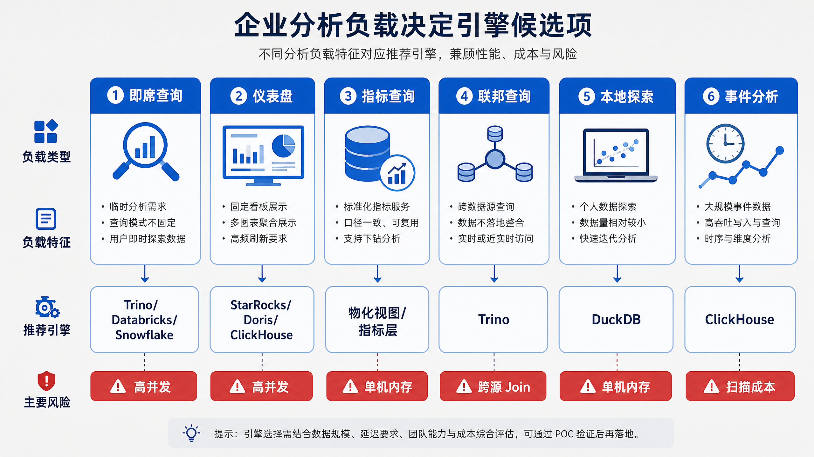
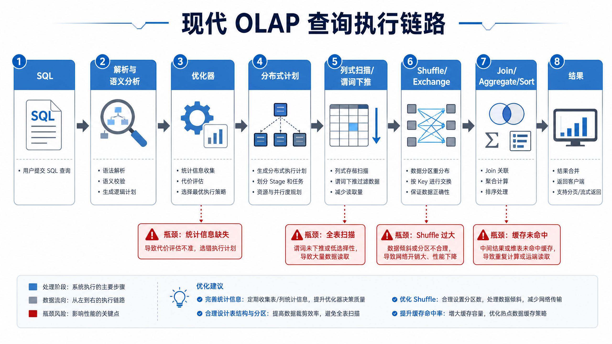
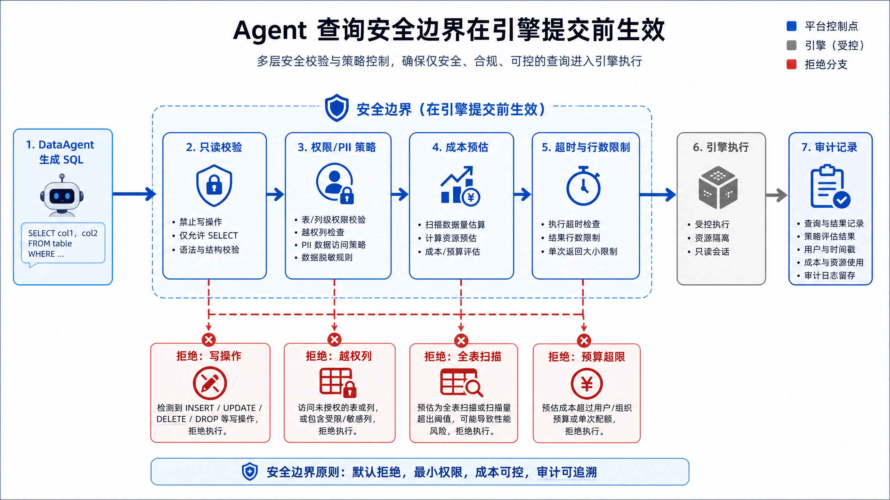
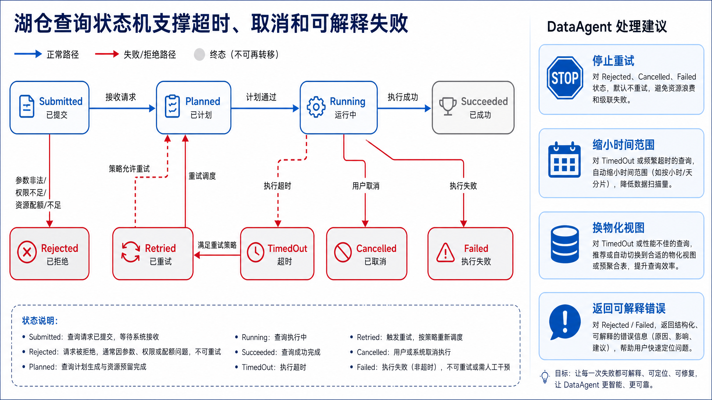

# 第12章 湖仓引擎与 OLAP

---

湖仓引擎与 OLAP 是 Agent 分析链路中的执行层。DataAgent 生成的 SQL 最终要落到某个引擎上执行，选 Trino、ClickHouse 还是 StarRocks，直接影响延迟、并发和成本。多引擎路由、查询控制、安全边界和性能工程决定不同查询该走哪条执行路径，也决定平台能否用资源控制、超时和权限边界防止一条失控 SQL 拖垮系统。湖仓表已经保存好了数据，并不意味着查询链路已经可靠。一个经营分析 Agent 生成了跨三年订单明细的 Join 查询，默认路由到交互式引擎，结果占满资源池，财务看板和运营临时查询一起变慢。查询本身并非恶意，但它没有进入合适的执行队列，也没有被扫描量、超时和权限策略提前约束。OLAP 层要把自然语言生成的 SQL 变成受控执行。平台需要按工作负载、权限、预算和数据快照选择引擎，并把查询失败、慢查询和资源争抢反馈给 Agent，而非让模型直接把 SQL 扔给任意数据库。

OLAP 层是 DataAgent 从“会生成 SQL”走向“能稳定执行分析”的地方。用户不会关心查询跑在 Trino、ClickHouse 还是 StarRocks 上，但平台必须知道。一个跨年宽表 Join、一个明细级导出、一个秒级看板查询和一个离线归因任务，对引擎、队列、缓存和权限的要求完全不同。若所有 SQL 都丢给同一个入口，失控查询会占满资源，正常分析也会被拖慢。企业里常见的故障，是查询被放到了错误路径；数据库不可用只是一类情况。经营分析 Agent 为了回答一个追问，扫描了三年订单明细；临时分析占用了交互式资源池；用户以为系统卡住，反复重试，成本继续上升。模型生成的 SQL 语法正确，但执行层没有给它资源上限、超时、扫描量控制和队列隔离。湖仓和 OLAP 的设计要把 SQL 执行变成受控动作。Catalog 负责解释表在哪里，开放表格式负责维持快照和 schema，查询引擎负责执行，路由器负责把任务放到合适资源池。DataAgent 只负责提出分析意图和候选 SQL，最终执行要接受平台的权限、成本和性能约束。

## 12.1 OLAP 引擎在 DataAgent 分析执行链路中的角色

第11章 解决湖仓表如何可靠保存，第12章 解决这些表如何被查询、分析和服务。一家多业务线企业的数据已经通过采集链路进入湖仓，订单、库存、会员、工单和设备数据以开放表格式管理。但业务问题并不都适合同一个计算系统。财务看板要求稳定秒级返回，运营团队要高并发查询当天销售，数据科学家要在 Notebook 中读抽样文件，DataAgent 需要跨 MySQL、Iceberg 和指标层做探索。在线分析处理（Online Analytical Processing，OLAP）引擎的职责是面向大范围扫描、过滤、聚合、Join、排序和窗口函数做优化。它不同于在线事务处理（Online Transaction Processing，OLTP）数据库，后者服务短事务、点查、行级更新和高并发写入。Agent 平台若直接把复杂分析压到 OLTP 源库，会影响生产系统；若只把所有分析交给一个通用引擎，又会在延迟、成本或治理上付出代价。

OLAP 引擎可以理解为湖仓表和业务消费之间的“计算适配层”。湖仓保存数据资产，但用户需要的是指标、报表、探索结果和可解释 SQL 输出。不同消费方式对计算适配层的要求不同：看板要求稳定低延迟，临时分析要求灵活 SQL，事件分析要求高吞吐写入和时间过滤，本地探索要求低成本和易嵌入。若没有这层区分，平台会把所有查询塞进同一个系统，结果要么慢查询拖垮看板，要么为了低延迟报表牺牲探索灵活性。对 DataAgent 来说，OLAP 引擎还承担“可控执行”的职责。Agent 生成查询后，平台需要选择合适引擎、限制扫描量、应用权限策略、设置超时、记录审计并返回可解释错误。引擎不能被看作被动数据库，它是 Agent 分析链路中的执行边界。


*图12-1：OLAP 引擎把湖仓数据变成可消费的数据服务。来源：本书自绘。Alt text：底层湖仓表经 OLAP 引擎查询后，向上提供给看板、API、DataAgent 等消费方，引擎位于"存储"与"消费"之间作为查询服务层。*

图 12-1 展示了“同一份湖仓资产，多种消费方式”。DataAgent 的临时探索可以走 Trino，固定经营看板可以走 StarRocks 或 Doris，日志与事件分析可以走 ClickHouse，统一数据工程和机器学习可以走 Databricks，云数仓标准报表可以走 Snowflake，本地抽样验证可以走 DuckDB。重点不在于多装几个引擎，而在于用统一入口控制路由、权限、成本和审计。这里需要回答两个问题：哪类工作负载走哪条路径，以及这些路径是否仍被统一治理。

### 12.1.1 企业分析负载分类

引擎选型要从负载分类开始。产品名称本身不能说明问题，因为同一个 SQL 引擎在不同负载下表现可能完全不同。即席查询重视灵活连接和容错，固定仪表盘重视并发和稳定延迟，指标查询重视口径一致和可缓存，联邦查询重视连接器能力，本地探索重视单机效率和易用性，事件分析重视时间过滤和写入吞吐。先分清负载，平台才能给每类查询设置不同的延迟目标、预算、权限和降级策略。

*表12-1：即席查询、报表、明细检索等分析负载的延迟目标与适配引擎。来源：本书整理。*

| 负载 | 典型问题 | 延迟目标 | 更自然的引擎方向 |
|---|---|---:|---|
| 即席查询 | “这个异常门店还能关联哪些供应商？” | 秒到分钟 | Trino、Databricks、Snowflake |
| 仪表盘 | “今日门店销售额按城市刷新” | 亚秒到数秒 | StarRocks、Doris、ClickHouse、Snowflake |
| 指标查询 | “同店同比、复购率、支付成功率” | 稳定秒级 | 物化视图、指标层、实时 OLAP |
| 联邦查询 | “湖仓订单 join MySQL 促销配置” | 秒到分钟 | Trino、Databricks federation |
| 本地探索 | “抽样 Parquet 验证口径” | 单机交互式 | DuckDB |
| 事件分析 | “最近 5 分钟点击流异常” | 秒级 | ClickHouse、StarRocks、Doris |



*图12-2：企业分析负载决定引擎候选项。来源：本书自绘。Alt text：左侧列出即席查询、固定报表、明细点查、实时大屏等负载，箭头分别指向更合适的引擎类型，说明先看负载特征再定引擎。*

图 12-2 表明，引擎选型应先识别负载类型。即席查询、仪表盘、指标查询、联邦查询、本地探索和事件分析对延迟、并发、成本和治理的要求不同，因此自然会落到不同的候选引擎组合。图中的候选项只是提示读者先把“查询为什么存在”讲清楚，再选择执行系统，并不是固定答案。

### 12.1.2 OLAP 核心机制

现代 OLAP 引擎通常围绕六类机制优化：列式存储只读必要列；编码和压缩减少 I/O；向量化执行批量处理数据；大规模并行处理（Massively Parallel Processing，MPP）把任务拆到多节点；优化器基于统计信息选择计划；缓存和物化视图减少重复计算。这些机制共同服务一个目标：用可接受的成本扫描大量数据并快速得到聚合结果。列式存储让查询只读 `city` 和 `amount` 这样的必要列，避免读取整行订单；压缩和编码减少磁盘与网络传输；向量化执行让 CPU 批量处理数据；MPP 把扫描和聚合拆到多个节点；优化器决定过滤和 Join 的顺序；缓存和物化视图减少重复计算。理解这些机制后，团队才能判断慢查询来自数据布局、统计信息、Join 计划，还是资源隔离。



*图12-3：现代 OLAP 查询执行链路。来源：本书自绘。Alt text：横向链路依次为 SQL 解析、逻辑计划、优化器、分布式执行、结果返回，各阶段标注关键动作，体现一条查询从文本到结果的处理过程。*

图 12-3 中容易被忽略的是优化器和数据布局。若没有统计信息，引擎可能选择错误 Join 顺序；若分区和排序键不匹配查询条件，再强的向量化执行也会变成大范围扫描。第11章的表格式、分区、文件大小和快照管理，会直接影响本章的查询成本。一次查询要先解析、优化、拆分、调度，再扫描和聚合；任何一步缺少输入信息，都会把成本放大到后续阶段。

### 12.1.3 OLAP 选型要先看工作负载

OLAP 引擎选型有三类常见偏差。第一类是认为有了湖仓表格式就不需要 OLAP 引擎。表格式解决数据资产开放性，查询性能仍取决于执行引擎、数据布局、统计信息、缓存和并发控制。表格式回答“读哪些文件才一致”，OLAP 引擎回答“如何高效读并计算这些文件”。第二类是把所有分析场景强行统一到一个引擎。统一能降低治理复杂度，也会牺牲特定负载的成本或延迟。更现实的做法是统一元数据、权限和审计，允许多个引擎围绕同一份数据协同。这里要统一的是控制平面，不是执行引擎本身。第三类是只看基准测试排行榜。基准测试不能替代对真实数据分布、真实 SQL、并发、写入模式、权限模型、成本和团队运维能力的评估。一个引擎在标准测试上很快，不代表它适合一家多业务线企业的权限模型、数据倾斜、冷热分层和 Agent 查询模式。

---

## 12.2 湖仓查询路径：Catalog、开放表格式、对象存储与计算引擎协作

一次受控湖仓查询通常经过五个步骤：用户或 DataAgent 提交查询意图；查询路由器选择引擎；策略控制器校验权限、预算和超时；Catalog 适配器解析表、快照和连接信息；执行适配器提交到具体引擎并返回结果句柄。这个路径的核心思想是“先控制，再执行”。DataAgent 生成的 SQL 只是查询意图的一种表达，还不能直接提交给底层引擎。平台必须先判断查询适合哪类负载，用户是否有权限，是否超过扫描预算，是否需要固定快照，是否应读取脱敏视图。只有这些判断完成后，执行适配器才把查询交给 Trino、StarRocks、Snowflake 或其他引擎。


*图12-4：受控湖仓查询先过路由、策略和 Catalog。来源：本书自绘。Alt text：查询进入后依次经过查询路由器、策略引擎（权限/限额）、Catalog（元数据/行列权限），三道关卡通过后才提交引擎执行。*

图 12-4 展示受控查询入口的基本路径。用户或 DataAgent 的查询意图先经过路由和策略校验，再通过 Catalog 解析表、快照和连接信息，然后提交给具体执行引擎。图中路由、策略和 Catalog 位于引擎之前，说明治理是执行前必须经过的控制点，而非查询完成后的审计补丁。

平台不建议让 DataAgent、BI 工具或业务系统直接裸连所有引擎。裸连会带来三个问题：权限口径不一致，成本无法归因，失败无法解释。统一接入层不一定是重型网关，也可以先从规则路由和审计记录开始。对早期平台来说，先记录工作负载标签、选择引擎、用户身份、快照和错误码，就已经能让排障和审计有据可查。

### 12.2.1 引擎生态对比

*表12-2：平台型湖仓、MPP、实时 OLAP 等引擎类型的代表产品与适用场景。来源：本书整理。*

| 类型 | 代表产品 | 为什么用 | 不适合什么场景 | 替代方案 |
|---|---|---|---|---|
| 平台型湖仓 | Databricks | 数据工程、SQL、机器学习和治理一体化 | 只服务单一低延迟看板时成本较高 | Snowflake、Doris/StarRocks + Spark |
| 云原生数仓 | Snowflake | SQL 数仓、弹性 warehouse、低运维 | 极低延迟事件分析或强本地化部署 | Databricks、ClickHouse、Doris |
| 实时 OLAP | Doris、StarRocks | 高并发报表、物化视图、MySQL 生态 | 任意跨源探索和重型数据工程 | Trino、Databricks、Snowflake |
| 事件分析 | ClickHouse | 日志、事件、时序和大宽表聚合 | 表设计不明确或频繁更新的强事务表 | StarRocks、Doris |
| 联邦查询 | Trino | 多源连接、开放湖仓入口 | 高频固定报表和高成本跨源 Join | 预建数据集、物化视图 |
| 嵌入式分析 | DuckDB | 本地文件、Notebook、轻量 ETL | 多租户、高并发、集群级治理 | Trino、Spark、本地服务化引擎 |

表 12-2 不是产品排名。Databricks 和 Snowflake 更像平台或托管服务，能覆盖较宽的治理和工程场景；Doris、StarRocks、ClickHouse 更偏向低延迟服务化分析；Trino 的价值在开放连接和联邦查询；DuckDB 的价值在本地与嵌入式。企业常见做法是先确定主路径，再给特殊负载保留合适工具，不必选一个赢家。


*图12-5：七类湖仓与 OLAP 引擎的系统边界不同。来源：本书自绘。Alt text：七种引擎类型并排，各自标出存储耦合度、延迟特征、并发能力和适用负载，对比它们的系统边界差异。*

图 12-5 的重点是系统边界。Databricks、Snowflake、Doris、StarRocks、ClickHouse、Trino 和 DuckDB 都能服务分析，但它们分别偏向平台化、托管数仓、实时服务、事件分析、联邦查询或本地探索。选型时要看每类引擎“负责到哪里”：有的包含治理和工程平台，有的主要负责执行，有的适合嵌入在本地进程中。

图 12-5 的含义是先确定系统边界，再比较产品能力。Databricks 和 Snowflake 偏平台化或托管体验；Doris、StarRocks、ClickHouse 偏低延迟服务化分析；Trino 偏连接器和联邦查询；DuckDB 偏单机本地分析。同一张 Iceberg 表可以被多个引擎读取，但每条访问路径都需要不同的 SLA、预算和运维 playbook。

### 12.2.2 SQL 方言、权限模型、资源组与多租户隔离

多引擎协同时，平台最容易低估的是非性能问题。SQL 方言差异会导致 DataAgent 生成的语句在一个引擎可运行、另一个引擎失败；权限模型差异会导致同一用户在不同入口看到不同列；资源组和 warehouse 配置差异会导致成本和并发不可控。路由器需要返回引擎名称，也要返回工作负载类型、SQL 方言、可访问表列、扫描预算，以及失败时能否换引擎。对 DataAgent 来说，方言差异尤其重要：同一个日期函数、JSON 函数或近似聚合函数，在不同引擎中的语法和语义可能不同。平台要么在生成 SQL 前绑定方言，要么在提交前做语法转换和校验。

*表12-3：查询路由器、策略引擎等组件的职责、输入输出与失败模式。来源：本书整理。*

| 组件 | 职责 | 输入 | 输出 | 失败模式 |
|---|---|---|---|---|
| 查询路由器 | 根据工作负载、数据位置、延迟和预算选择引擎 | 查询意图、SQL、用户、工作负载标签 | 引擎选择、查询提交请求 | 路由规则过期、误路由 |
| Catalog 适配器 | 映射平台资产到各引擎 catalog/schema/table | 元数据、权限、快照 | 引擎可识别的数据源定义 | 元数据漂移、凭证失效 |
| 策略控制器 | 执行权限、行列级策略、成本预算和并发限制 | 用户、角色、数据分级、预算 | 允许、拒绝或降级 | 权限漏放、预算失控 |
| 执行适配器 | 适配不同引擎协议 | 查询请求、连接信息、超时 | 查询状态、结果句柄 | 连接池耗尽、引擎不可用 |
| 可观测性采集器 | 记录耗时、扫描量、费用、错误和血缘 | 查询生命周期事件 | Trace、Metrics、审计日志 | 日志缺失、成本归因失败 |

接口契约示例：
```text
POST /api/lakehouse/query
Request:
{
  "principal": "user:finance_analyst_01",
  "workload": "realtime_bi",
  "sql": "select city, sum(amount) from mart.sales group by city",
  "latency_budget_ms": 3000,
  "cost_budget": "low",
  "result_mode": "preview"
}

Response:
{
  "query_id": "q_20260611_001",
  "engine": "StarRocks",
  "state": "submitted",
  "result_ref": "lakehouse-results/q_20260611_001"
}

Errors:
{
  "code": "POLICY_DENIED | ENGINE_UNAVAILABLE | QUERY_TIMEOUT | COST_BUDGET_EXCEEDED",
  "reason": "...",
  "retryable": true
}
```

这个接口契约把查询执行拆成可观测状态，而非简单返回一张结果表。`workload` 帮助路由器选择引擎，`latency_budget_ms` 和 `cost_budget` 帮助策略控制器做预算判断，`result_mode` 决定返回预览还是落地结果。错误码中的 `retryable` 也很关键：权限拒绝和预算超限通常不应自动重试，引擎暂时不可用才可能触发降级或换路由。

### 12.2.3 性能工程：物化视图、Rollup、数据分布、冷热分层与查询加速

性能工程要从查询模板和数据布局开始，而非先加机器。固定看板应优先使用物化视图、汇总表、Rollup 或服务化宽表；探索查询应限制扫描量和并发；日志事件分析应围绕排序键、分区和压缩设计；冷历史查询应接受更高延迟或走低成本引擎。性能工程的第一步，是把查询分成“重复发生”和“临时发生”。重复发生的查询，应尽量通过预计算、物化视图、缓存和宽表把成本前移；临时发生的查询，则要控制扫描范围和并发，避免少数探索请求拖垮共享集群。对 DataAgent 尤其如此，因为 Agent 可能在多轮对话中自动发起多个探索查询，如果没有预算和缓存，很容易把一次自然语言追问变成一组昂贵 SQL。


*图12-6：性能工程把负载分流到预计算、缓存和探索路径。来源：本书自绘。Alt text：查询按特征分流，高频固定查询走物化视图/Rollup 预计算，重复查询走缓存，低频探索走联邦/直查，三条路径分别标注收益。*

图 12-6 说明，性能工程先做负载分流，再谈扩容。高频看板走预计算和缓存，探索查询限制扫描量和并发，冷历史查询接受更高延迟或走低成本引擎。图中的分流逻辑与 12.2 的负载分类一一对应：先分类，再决定是否预计算、缓存、限流或降级。

#### 单引擎统一与多引擎协同

*表12-4：单引擎统一与多引擎路由两种架构的取舍。来源：本书整理。*

| 方案 | 优势 | 代价 | 适用场景 | mini-platform 选择 |
|---|---|---|---|---|
| 单引擎统一 | 治理简单、运维集中、用户体验一致 | 特定负载性能或成本不优 | 组织早期、负载单一 | 可作为初始策略 |
| 多引擎协同 | 按负载选择成本和性能最优解 | 路由、权限、审计和一致性复杂 | 多团队、多负载、既有系统复杂 | 默认建模方式 |

#### 联邦查询与预建数据集

*表12-5：物化视图、联邦查询等查询加速手段的优势与代价。来源：本书整理。*

| 方案 | 优势 | 代价 | 适用场景 | mini-platform 选择 |
|---|---|---|---|---|
| 联邦查询 | 快速跨源探索，不必先搬数 | 跨源 Join 成本和稳定性难预测 | 临时分析、低频探索、数据发现 | `federated_query` 路由到 Trino |
| 预建数据集 | 延迟稳定、成本可控、权限清晰 | 需要建模、调度和维护 | 高频报表、DataAgent 常用指标 | 生产路径优先 |

单引擎统一适合作为早期平台的过渡策略，但一旦负载分化，就需要至少在逻辑上区分执行路径。联邦查询也应被当作探索工具，而非长期报表路径；当某个联邦查询被频繁使用时，就应该沉淀成预建数据集、物化视图或指标层能力。这个转化过程，是数据平台从“能查”走向“稳定服务”的关键。

### 12.2.4 Agent 查询安全：只读执行、超时、限额、结果脱敏与审计

Agent 生成 SQL 后必须经过安全执行边界。最低要求包括只读执行、禁止危险语句、限制扫描量、设置超时、限制返回行数、脱敏敏感列、记录 SQL 摘要和结果去向。若查询失败，错误码需要能区分权限拒绝、预算超限、引擎不可用和 SQL 语义错误，避免 Agent 无意义重试。这里的安全需要同时防止删除表，也要防止“合法但危险”的查询。一个只读 `SELECT` 仍可能扫描全量历史、跨源 Join 巨表、返回过多敏感明细，或在用户没有授权的维度上聚合。Agent 的自动化能力越强，执行边界越要前置。平台应把 SQL 安全、数据权限、成本预算和结果脱敏作为同一条链路处理，避免拆成四个互相独立的开关。



*图12-7：Agent 查询安全边界在引擎提交前生效。来源：本书自绘。Alt text：在 SQL 提交到引擎之前设置只读校验、超时、行数限额、结果脱敏四道关卡，箭头表示任一不通过即拦截，体现安全前置。*

图 12-7 强调安全边界必须在查询提交前生效。只读执行、危险语句拦截、扫描量限制、超时、脱敏和审计应由平台统一执行，不能依赖 Agent 自觉生成安全 SQL。控制点都位于执行适配器之前，意味着不通过策略的查询根本不应到达底层引擎。状态机如下。

*表12-6：Agent 查询从提交到完成各状态的进入条件与失败处理。来源：本书整理。*

| 状态 | 进入条件 | 下一步 | 失败处理 |
|---|---|---|---|
| Submitted | 用户或 Agent 提交请求 | Planned 或 Rejected | 权限和预算不通过则拒绝 |
| Planned | 路由和策略通过 | Running 或 Failed | 引擎连接失败则返回可解释错误 |
| Running | 引擎接受查询 | Succeeded、TimedOut、Cancelled、Failed | 超时取消，避免无限重试 |
| Succeeded | 结果完成 | 审计并返回 result_ref | 大结果集分页或落对象存储 |
| TimedOut | 超过预算 | Retried 或 Failed | 改写查询、加过滤或换物化视图 |
| Cancelled | 用户或策略取消 | 终止 | 释放引擎资源并记录原因 |



*图12-8：湖仓查询状态机支撑超时、取消和可解释失败。来源：本书自绘。Alt text：状态机含 Submitted、Planned、Running、Succeeded、Failed、Cancelled 等节点，标出超时和取消的转移边，说明每次失败都有明确状态可解释。*

图 12-8 给出查询生命周期的状态边界。平台需要区分提交、规划、运行、成功、超时、取消和失败，才能正确决定是否重试、是否降级，以及向 Agent 返回什么可解释错误。状态机可以防止“失败就重试”的简单策略：权限拒绝应停止，超时应缩小范围或走物化视图，引擎不可用才考虑备用引擎。

## 12.3 湖仓引擎路由器与查询执行契约

mini-platform 不直接连接 Databricks、Snowflake、Doris、StarRocks、Trino、ClickHouse 或 DuckDB，而是先实现“负载到候选引擎”的规则模型。这样做的原因是：真实执行适配器之前，平台必须先定义工作负载分类、默认引擎、替代引擎、延迟预算和扫描预算。这个实现先定义路由规则，再接执行适配器。真实引擎连接会涉及账号、网络、驱动和部署环境；在这些工程细节之前，平台必须已经知道 `realtime_bi` 为什么默认走 StarRocks，`federated_query` 为什么默认走 Trino，`local_analytics` 为什么默认走 DuckDB。mini-platform 用规则模型先展示选型依据，避免一开始就陷入连接字符串和客户端参数。

- 入口：`mini-platform/infra/lakehouse/__init__.py`
- 核心实现：`mini-platform/infra/lakehouse/engine_selector.py`
- 测试：`mini-platform/tests/test_lakehouse_engine_selector.py`
- 实战项目：`mini-platform/projects/12-lakehouse-engine/run.py`


*图12-9：mini-platform 用工作负载标签生成引擎路由决策。来源：本书自绘。Alt text：查询带上工作负载标签（如 adhoc、report、realtime）进入路由器，路由器据标签和数据位置输出目标引擎，体现标签驱动路由。*

图 12-9 对应本章 mini-platform 的路由流程：输入工作负载标签和延迟预算，规则模型返回主引擎、备选引擎、扫描预算和可行性判断。它展示的是查询控制面的最小版本，生产系统还需要接入权限、队列、缓存和审计。`mini-platform/infra/lakehouse/engine_selector.py`：

```python
class Workload(str, Enum):
    PLATFORM = "platform"
    CLOUD_WAREHOUSE = "cloud_warehouse"
    REALTIME_BI = "realtime_bi"
    FEDERATED_QUERY = "federated_query"
    EVENT_ANALYTICS = "event_analytics"
    LOCAL_ANALYTICS = "local_analytics"
```

核心规则节选：
```python
_RULES: dict[Workload, EngineChoice] = {
    Workload.REALTIME_BI: EngineChoice(
        primary="StarRocks",
        alternatives=("Apache Doris", "ClickHouse"),
        reason="高并发看板、低延迟聚合、物化视图和 MySQL 协议生态。",
        latency_budget_ms=3000,
        max_scan_gb=200,
    ),
    Workload.FEDERATED_QUERY: EngineChoice(
        primary="Trino",
        alternatives=("Apache Doris", "Databricks Lakehouse Federation"),
        reason="以连接器访问多源数据，适合作为开放湖仓 SQL 入口。",
        latency_budget_ms=30000,
        max_scan_gb=1024,
    ),
}
```

`route_query` 在 `choose_engine` 之上叠加调用方延迟预算：
```python
def route_query(request: dict) -> dict:
    choice = choose_engine(request["workload"])
    requested = request.get("latency_budget_ms")
    effective_budget = choice.latency_budget_ms
    latency_feasible = True
    if requested is not None:
        effective_budget = min(effective_budget, requested)
        latency_feasible = requested >= choice.latency_budget_ms

    return {
        "engine": choice.primary,
        "alternatives": choice.alternatives,
        "latency_budget_ms": effective_budget,
        "max_scan_gb": choice.max_scan_gb,
        "latency_feasible": latency_feasible,
        "reason": choice.reason,
    }
```

运行测试：
```bash
cd enterprise_agent_platform_book/mini-platform
python3 -m pytest tests/test_lakehouse_engine_selector.py -q
```

运行项目：
```bash
cd enterprise_agent_platform_book/mini-platform/projects/12-lakehouse-engine
PYTHONPATH=../.. python3 run.py
```

预期输出：
```text
realtime_bi -> StarRocks
federated_query -> Trino
local_analytics -> DuckDB
route realtime_bi@1500ms -> StarRocks budget=1500ms feasible=False
```

示例的末行说明：调用方要求 1500ms，但 `realtime_bi` 在规则中目标延迟是 3000ms。路由器仍返回 StarRocks，同时标记 `latency_feasible=False`，提示上层缩小时间范围、走物化视图或调整 SLA，而非盲目提交慢查询。

### 12.3.1 查询执行链路的上线准入标准

- 权限：查询入口接入统一身份系统，行列级权限以平台策略为准。
- 审计：记录用户、SQL 摘要、引擎、数据集、快照、扫描量、耗时、错误码和结果去向。
- 成本：按用户、团队、工作负载和引擎设置预算；对全表扫描和跨源 Join 做预估拦截。
- 性能：高频查询建立物化视图、结果缓存或预建数据集；探索查询限制并发和扫描量。
- 稳定性：设置超时、取消、连接池上限、并发上限和降级策略。
- 可观测性：连接 DataAgent 调用、SQL 生成、查询执行和结果解释 trace。
- 灾难恢复：核心报表有备份路径和备用引擎；路由规则、权限和 Catalog 配置版本化。
- 数据一致性：生产看板读取发布快照或稳定数据集，不直接读取正在提交的中间表。

### 12.3.2 查询失败在引擎、权限与数据布局中的定位

#### 把 Trino 当成高并发报表数据库

- 现象：DataAgent 和 BI 看板共用 Trino，临时跨源查询拖慢固定经营看板。
- 根因：Trino 适合开放湖仓入口和跨源探索，但不负责热点数据物化和报表服务隔离。
- 修复：固定看板迁移到 StarRocks、Doris、ClickHouse 或 Snowflake warehouse；Trino 保留探索入口，并设置并发与扫描量上限。

#### 只看引擎性能，不看数据布局

- 现象：压测表现很好，上线后部分查询仍然慢。
- 根因：排序键、分区、物化视图、统计信息和数据倾斜没有按真实查询模式设计。
- 修复：先收集 Top 查询模板，再设计主键、排序键、分区、物化视图和冷热分层，用真实数据分布做回归压测。

#### 多个引擎权限口径不一致

- 现象：同一用户在 BI 中看不到某列，在另一个 SQL 客户端却能查到。
- 根因：平台元数据、引擎内部权限和外部 catalog 没有统一发布流程。
- 修复：平台策略优先，自动生成引擎权限配置；新增引擎时先接 Catalog 适配器和策略控制器，再接执行适配器。

#### 本地 DuckDB 分析结果无法复现到生产

- 现象：数据科学家在 Notebook 中直接读文件得到结论，生产看板复现时口径不同。
- 根因：本地分析绕过语义层、数据版本和指标口径管理。
- 修复：DuckDB 用于探索，但必须记录输入文件、湖仓快照、SQL 和指标定义；进入生产前转为受治理的数据集或指标层查询。

### 12.3.3 OLAP 执行结果的证据管理

OLAP 查询结果进入 DataAgent 后，就还涉及一次数据库响应。平台需要保存查询文本、参数、引擎、Catalog、快照版本、权限策略、扫描量、返回行数和结果去向。这样用户质疑某个数字时，团队能判断问题来自 SQL 生成、引擎执行、数据布局、权限裁剪还是报告解释。只保存最终表格，会让排查停在“当时查出来就是这个数”。证据管理还要覆盖结果缓存。固定看板和高频问数可以使用缓存，但缓存必须带上语义层版本、数据快照、权限上下文和过期策略。否则同一个自然语言问题可能在不同用户之间复用错误结果，或者在数据刷新后继续返回旧口径。缓存命中不是问题，问题是用户和审计系统不知道命中的是什么版本。多引擎环境下，证据管理尤其重要。Trino、StarRocks、Doris、ClickHouse、Snowflake 和 DuckDB 对 SQL 方言、权限模型和时间函数的处理并不完全一致。DataAgent 不能把“SQL 成功执行”当成最终验收，还要确认执行结果符合语义层口径和用户权限。第34章的 NL2SQL 负责生成查询，第38章的 Trace 负责保存过程，本章的 OLAP 执行契约负责把底层引擎差异收敛成可治理的结果。

---

多引擎路由上线后，团队要观察每类任务的真实分布。即席问数是否经常退化成明细扫描，报表查询是否绕过物化视图，低优先级任务是否挤占交互式队列，这些都能从查询日志和 Trace 中看到。发现问题后，修复点可能在语义层，也可能在路由策略或表设计。OLAP 层还要向 Agent 返回可理解的失败。超时、权限不足、扫描量超限、快照不存在和语法错误，对 Planner 来说是不同信号。只有错误类型明确，Agent 才能选择改写 SQL、请求澄清、降级到聚合指标，或把问题交给人工。最终，湖仓引擎不是被动执行 SQL 的黑盒。它是 DataAgent 的运行保护层，负责把自然语言带来的不确定性压到可管理范围内。没有这层保护，模型越会生成查询，平台越容易被错误查询拖垮。

查询执行前的预估很关键。平台可以在真正提交前估算扫描分区、读取列、Join 规模和结果行数。超过阈值的查询进入澄清、降级或审批，而非直接占用资源。预估不一定完全准确，但它能把明显失控的查询挡在执行层外。执行后的反馈也要回到 Planner。若查询因为扫描量超限失败，Planner 可以尝试缩小时间窗口；若因为权限不足失败，应请求用户换口径或申请权限；若因为引擎繁忙失败，可以排队或切换到离线引擎。错误信息越结构化，Agent 越可能采取正确恢复动作。物化视图和预聚合需要被语义层知道。很多经营问题并不需要扫明细，已有宽表或指标表就能回答。若模型只看到底层明细表，它会生成昂贵 SQL；若语义层暴露合适的指标入口，OLAP 层压力会小得多，回答也更接近业务口径。

多引擎环境还要管理一致性。同一张 Iceberg 表在不同引擎上的函数、时区、类型转换和权限实现可能有差异。一个 SQL 在 Trino 上正确，不代表在 ClickHouse 或 StarRocks 上同义。平台需要把这些差异写进引擎能力描述，并在路由时避开不兼容路径。OLAP 的生产验收可以从几个高风险问题开始：大范围扫描是否被拦截，低权限用户是否被拒绝，慢查询是否能取消，失败是否回写 Trace，重试是否会重复占用资源。通过这些问题，才说明 DataAgent 的 SQL 执行进入了受控系统。查询路由还要考虑用户意图。用户只是想知道“是否下降”，可能聚合表已经足够；用户要求“列出异常订单”，才需要明细查询。Planner 可以表达意图，语义层可以提供候选查询，OLAP 路由器再根据资源和权限决定执行路径。三者协作后，系统会少很多不必要的大查询。

资源隔离要和业务优先级绑定。管理层会议前的经营看板、普通探索式问数、离线评测批跑和开发调试，不应共享同一队列。队列隔离用于防止低优先级查询拖慢高价值流程，不是为了增加架构复杂度。Agent 自动生成 SQL 后，查询数量会增加，资源优先级更需要清楚。结果缓存也要谨慎使用。相同 SQL 在不同数据快照、用户权限和时间语义下可能代表不同答案。缓存命中前要校验数据版本、租户、权限和参数；缓存命中后，也要在回答中保留数据时间。否则系统会用旧结果快速回答新问题，速度提升了，可信度下降了。OLAP 层要给数据团队提供回放能力。某次用户投诉数字错误时，团队需要拿到当时 SQL、引擎、参数、快照、执行时间和结果 artifact。只有这些信息完整，才能判断是模型生成错了、引擎执行错了，还是数据在查询后发生了变化。缺少回放，很多数字争议会陷入口头解释。

引擎选型最后要回到工作负载。Trino 适合联邦和湖仓查询，ClickHouse 适合高并发明细分析，StarRocks 适合低延迟聚合和物化视图场景。企业往往会并存多个引擎，平台价值在于让 Agent 不直接感知复杂性，又能把每类查询送到合适位置。SQL 生成和执行之间可以加入计划审查。平台不必把模型生成的 SQL 直接送给引擎，而是先解析语法树，检查表权限、扫描范围、危险函数、笛卡尔积和导出风险。审查通过后再执行，失败时把结构化原因交给 Planner。这个步骤能把很多资源和安全问题挡在引擎前。查询结果也需要大小控制。模型可能请求返回明细，实际结果有数百万行；前端和模型都不适合接收这么大结果。执行层可以返回聚合摘要、分页 artifact 或要求用户缩小范围。结果大小控制同时保护系统，也避免模型基于过大样本做不稳定解释。OLAP 层的 SLO 要按任务定义。交互式追问需要秒级反馈，异步报告可以等待更久，评测批跑可以排队。把所有查询都要求低延迟，会导致成本过高；把所有查询都放进离线队列，又会破坏用户体验。SLO 分层能让资源和业务价值对齐。

## 12.4 OLAP 口径漂移与查询证据

OLAP 系统支撑 DataAgent 时，指标口径漂移会直接影响用户信任。同一个“销售额”可能因为退货处理、税费口径、渠道归属、时间分区、汇率折算变化而产生不同结果。传统 BI 场景中，用户可以通过报表说明慢慢校准；Agent 场景中，系统会把查询结果转成自然语言结论，口径差异更容易被读者当成事实冲突。平台需要把 OLAP 口径变化和查询证据绑定起来。

每次指标变更都应留下语义层版本、SQL 片段、数据快照范围、影响报表、影响 Agent 样本和生效时间。DataAgent 回答时，应能引用当时的指标版本和查询证据。若用户复盘历史问题，平台要解释“当时的结果”来自哪个口径，而不是用当前口径重新计算后覆盖历史。这样 OLAP 查询才能成为可追溯证据，而不是一次临时计算。

口径漂移复盘还要关注查询性能。为了修正指标而增加复杂 join、窗口函数或大范围扫描，可能让 Agent 延迟和成本上升。数据团队、平台团队和业务 owner 应共同评估：是否需要预聚合，是否需要新增物化视图，是否需要限制自然语言查询范围，是否需要提示用户切换到异步报告。OLAP 的工程质量，最终会体现在 Agent 回答是否稳定、可解释、可复盘。

## 12.5 OLAP 查询策略与语义层协同

OLAP 层不能独立决定所有查询策略。自然语言问题进入 DataAgent 后，语义层会先给出指标、维度、时间范围和候选数据集，OLAP 层再根据引擎能力、资源队列和权限策略选择执行路径。若语义层没有表达清楚指标口径，OLAP 层即使执行得很快，也可能返回错误答案；若 OLAP 层没有把资源和执行状态反馈回去，语义层也无法知道哪些问题适合改写、降级或转成异步报告。

协同的关键是让计划审查成为正式接口。一个查询计划在提交前，应包含指标版本、候选表、过滤条件、预估扫描量、目标延迟、用户权限和结果规模。语义层负责解释“这个问题应该查什么”，OLAP 层负责判断“这个计划能不能在当前资源和权限下执行”。当计划失败时，返回的原因也要结构化：缺指标、缺权限、扫描量过大、引擎不支持、数据未刷新、结果过大。Planner 拿到这些原因后，才能选择缩小时间范围、换指标入口、请求澄清或进入人工确认。

这层协同还能降低成本。很多自然语言问题看起来需要明细查询，其实只需要已经发布的指标表；很多追问看起来是新问题，其实可以复用同一快照和同一中间结果。语义层保存任务上下文，OLAP 层保存执行证据，两者配合后，系统可以少做重复扫描，也能避免为了追求即时回答而滥用高成本引擎。对早期平台来说，先把查询计划、执行证据和失败原因接成稳定接口，比接入更多 OLAP 产品更重要。

## 12.6 OLAP 引擎变更的回答一致性检查

OLAP 引擎变更后，要检查 DataAgent 回答一致性。把查询从 Trino 切到 StarRocks，或把明细查询改成物化视图，可能让函数语义、时区、空值处理、近似聚合和权限实现发生变化。SQL 仍然成功执行，回答里的数字却可能改变。

一致性检查应选择一组高频业务问题，同时比较旧引擎、新引擎、语义层指标和人工确认结果。若差异来自性能优化，需要说明可接受范围；若差异来自口径变化，要更新语义层版本和用户提示；若差异来自权限实现，要暂停切流。OLAP 切换的验收对象应落到用户最终看到的业务答案，不能停在引擎层。

## 12.7 OLAP 查询策略的灰度与回滚

OLAP 查询策略进入灰度时，变更对象通常会超过引擎本身。一次看似简单的路由调整，可能同时改变资源队列、扫描阈值、物化视图优先级、缓存命中条件、结果分页方式和失败返回码。DataAgent 依赖这些信号判断是否继续追问、是否改写 SQL、是否请求人工确认，因此查询策略发布要按照业务域、租户、指标组和任务类型逐步放量。灰度期间，平台应同时保存旧策略和新策略的执行证据，比较最终业务答案、扫描成本、延迟、失败类型、缓存复用和用户追问比例。只有这些指标稳定，才能说明策略变更没有把问题转移到 Planner、语义层或前端解释层。

回滚设计要早于灰度开始。查询策略回滚不能只恢复一段配置，因为新策略可能已经写入缓存、生成报告 artifact、改变中间结果或触发异步任务。平台需要给策略版本、语义层版本、数据快照和缓存条目建立关联。若某个指标组在灰度后出现异常，回滚应能按租户、业务域或指标范围收窄影响，而不是全平台切回旧策略。已经生成的结果也要标记策略版本，避免用户在复盘时把旧策略和新策略下的数字放在一起比较。对高风险经营指标，回滚后还应触发一组历史问题回放，确认回答内容、图表和引用证据都回到可接受状态。

OLAP 策略发布还要给业务方可读的解释。用户不需要知道引擎路由细节，但需要知道为什么同一个问题今天变慢、为什么某个明细查询被转为异步、为什么系统要求缩小时间范围。若平台只返回技术错误，用户会继续换问法，反而制造更多昂贵查询。更合适的做法是把资源限制、权限限制和数据刷新状态翻译成任务级提示，并在 Trace 中保留原始错误。这样前端给用户清楚预期，后台仍能做工程复盘。OLAP 灰度的成败，最终要看 DataAgent 是否还能给出稳定、可解释、可追溯的业务回答。

## 12.8 查询结果缓存的证据边界

OLAP 查询缓存能降低成本和延迟，但在 DataAgent 场景中要特别谨慎。用户追问时，系统可能复用上一轮查询结果；高峰期，平台可能返回已缓存的指标；报告生成时，中间结果可能被多个图表共享。缓存如果没有证据边界，用户看到的数字就可能脱离数据快照、权限范围和指标版本。缓存命中越高，越要解释缓存对应的事实。

缓存证据至少要包含查询语义、SQL、语义层版本、数据快照、权限上下文、生成时间、失效条件和使用场景。若用户权限发生变化，缓存不能继续复用；若指标版本变化，缓存应失效；若底层分区刷新，平台要判断缓存是否仍在可接受时间窗内。对高风险经营指标，缓存结果还应记录是否经过人工确认或报告发布。这样缓存不会把旧事实包装成新回答。

缓存策略也要区分交互和报告。交互式问数可以接受短时间缓存，以减少重复扫描；正式报告应明确绑定快照，不能因为缓存命中而丢失查询证据；探索性分析可以复用中间结果，但要在用户确认前标明草稿状态。不同任务使用同一缓存策略，会在成本和可信度之间制造隐性冲突。平台需要让 Planner 和前端知道当前结果来自实时查询、可接受缓存，还是历史 artifact。

早期可以给 OLAP 查询接口增加 `cache_source` 和 `evidence_scope` 字段。`cache_source` 说明结果来自实时执行、同会话缓存、跨会话缓存或历史报告；`evidence_scope` 说明结果绑定的数据快照、权限和指标版本。这样第12章的查询性能优化能继续服务 DataAgent 的可信回答，而不会因为追求速度破坏可复盘性。

## 12.9 OLAP 查询证据与缓存解释

OLAP 系统通常会引入预聚合、物化视图、结果缓存和查询改写。对普通 BI 用户来说，这些机制是性能优化；对 DataAgent 来说，它们也是证据来源的一部分。若同一个问题在不同时间得到不同结果，平台需要解释差异来自缓存过期、物化视图未刷新、查询改写、权限过滤，还是源数据变化。只保存最终数值不足以支撑复盘。

查询证据应包含执行路径。Agent 调用 OLAP 工具后，Trace 应记录逻辑 SQL、实际执行 SQL、命中的物化视图、缓存状态、数据时间、权限过滤、返回行数和关键聚合值。若结果来自缓存，系统要知道缓存生成时间和失效规则；若结果来自预聚合，系统要知道预聚合覆盖范围和刷新时间。这样报告层引用数字时，可以说明数字来自哪个数据版本。

缓存解释也要面向用户。低风险看板可以直接展示缓存时间；高风险报告需要判断缓存是否仍在允许窗口内；审批建议通常应使用最新可验证数据，或者明确进入等待状态。早期可以给 OLAP 工具返回 `freshness_status`、`cache_source` 和 `evidence_ref` 三类字段。这样性能优化不会削弱证据链，反而能让 Agent 更清楚地说明数字来源。

## 12.10 OLAP 查询层的变更防线

OLAP 查询层进入生产后，平台需要把查询模板、物化视图、指标口径、权限过滤、缓存策略、慢查询样本和回滚方式放进统一证据口径。证据口径会减少事后解释成本，让业务、平台、数据、安全和运营团队能够围绕同一组事实讨论问题。没有这些材料，故障发生后只能凭经验判断；有了这些材料，团队可以知道哪些输入有效、哪些动作已经执行、哪些产物可以继续使用、哪些结果需要撤回。

这类证据应和第33章语义层、第34章 NL2SQL 和第41章成本治理连起来。上游章节提供能力基础，下游章节使用运行结果，本章则负责说明中间环节如何被验证。若某个能力只在本章看起来完整，却无法进入 Trace、Eval、发布记录或合规证据包，生产系统仍然会出现断点。读者在实现时应把章节之间的接口看成工程契约，而不是阅读顺序上的相邻关系。

常见风险包括缓存命中过期口径、物化视图刷新失败、权限过滤只在前端执行、查询优化改变结果顺序。这些问题通常不会在一次成功演示中暴露，因为演示样本往往干净、短小、路径明确。真实业务会带来旧数据、异常输入、权限变化、用户撤回、预算限制和长时间运行状态。平台如果没有把这些情况纳入样本和台账，后续扩展场景时就会重复遇到同类问题。

数据平台团队应把 OLAP 变更纳入样本回放，确认速度提升没有牺牲口径和权限。执行记录至少要说明 owner、版本、样本、影响范围、处置动作和复查时间。记录不需要写成流程报告，但要足够让后来者理解当时的判断。对于高风险能力，还应说明哪些条件满足后才能扩大使用，哪些条件失败时必须降级或撤回。

落地时可以先选择少量代表场景建立这种习惯。实践上，应先把高频、高风险、外部可见的路径做扎实，再把样本、台账和复盘方式复制到其他能力中。这样做能让能力说明落到接入、验证、运营和退出，而不是停留在概念描述。

## 本章小结

湖仓表格式解决数据资产开放性，OLAP 引擎解决分析查询性能、并发、服务化和成本问题。Databricks 和 Snowflake 更偏平台化与托管数仓；Doris、StarRocks、ClickHouse 更偏实时 OLAP；Trino 更偏联邦查询；DuckDB 更偏本地分析。多引擎协同依赖统一 Catalog、权限、审计、成本预算、查询状态和失败恢复，而非产品数量。DataAgent 接入湖仓时必须走受控查询接口，不能绕过平台策略直接生成任意 SQL 访问底层引擎。mini-platform 的 `route_query` 只做早期规则路由，真实生产还需要执行适配器、权限同步和查询观测。

## 参考文献

DuckDB. (n.d.). [Documentation](https://duckdb.org/docs/).

Trino. (n.d.). [Documentation](https://trino.io/docs/current/).

ClickHouse. (n.d.). [Documentation](https://clickhouse.com/docs/).

Apache Doris. (n.d.). [Documentation](https://doris.apache.org/docs/).
