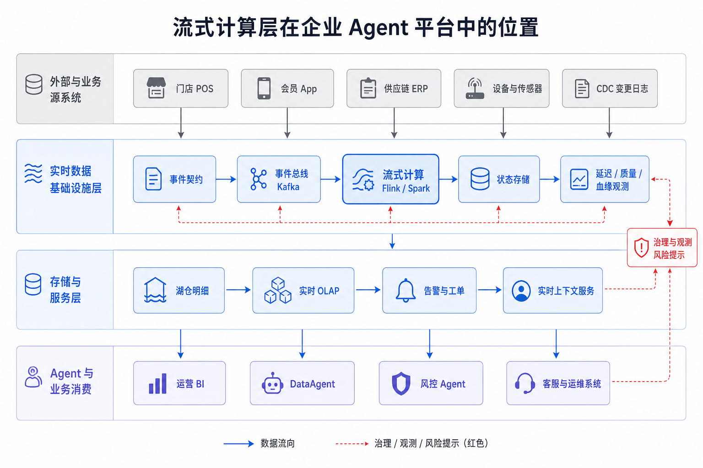
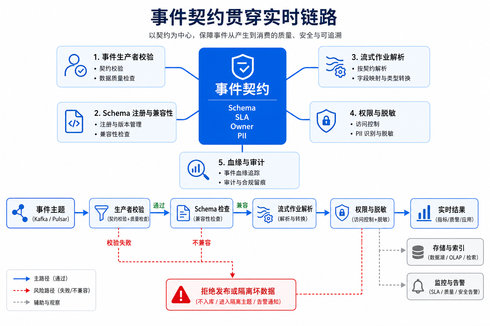
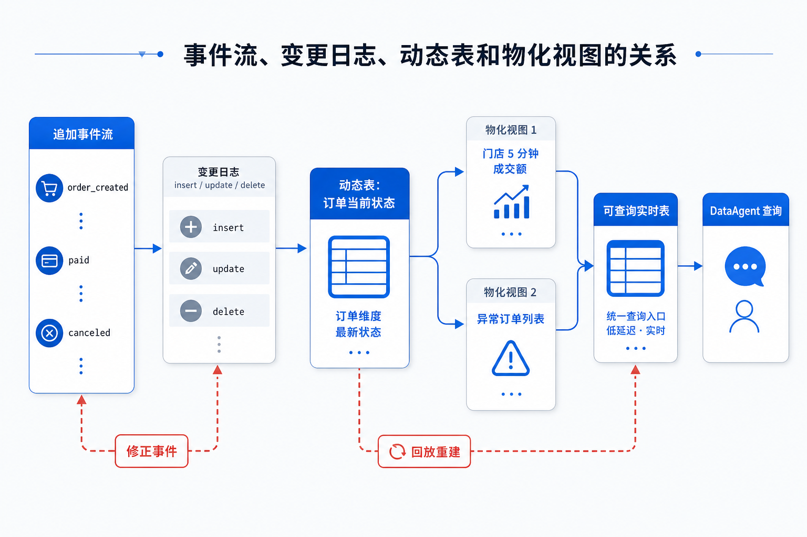
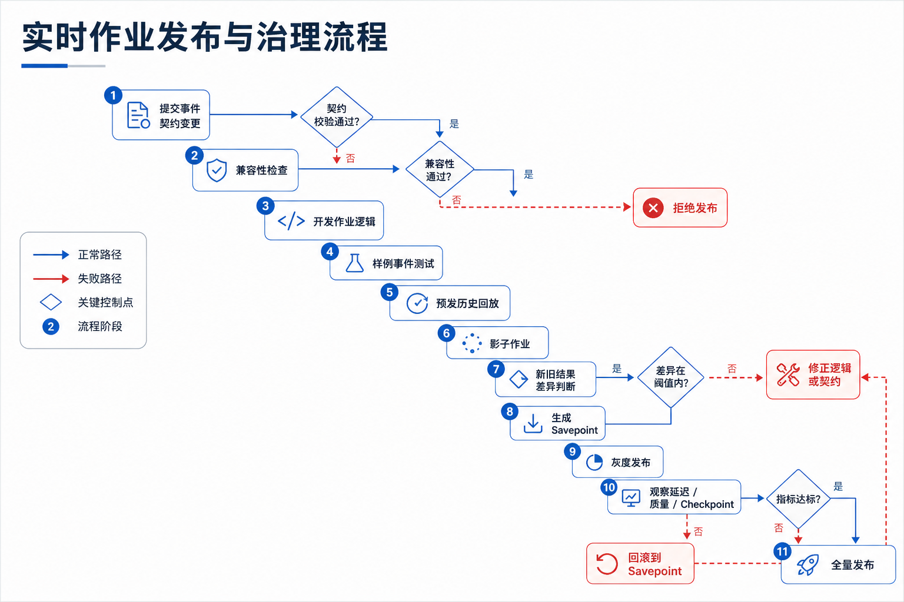
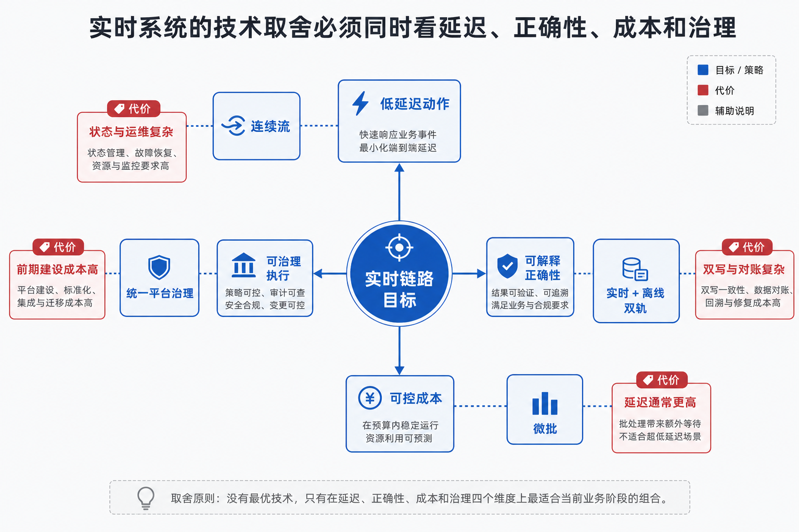

# 第13章 流式计算与实时数据

---

实时数据的价值来自业务动作，而非“越快越好”。并非所有场景都需要实时，但风控、监控、实时大屏这类任务一旦延迟就失去价值。事件时间、窗口、状态、Exactly-once 语义和实时特征，构成判断实时链路价值、代价和 Agent 消费方式的基础。经营、风控和运维场景经常要求系统在分钟级甚至秒级内响应。支付失败率突然升高、库存快速扣减、设备温度异常、工单积压加剧时，DataAgent 如果只能查询昨日批量快照，就无法支持告警、拦截和调度。实时链路是否值得投入，取决于这些低延迟动作是否真实存在，以及实时结果能否带着质量状态和回放能力提供给上层 Agent。实时数据并不天然比离线数据高级。它的价值取决于业务动作是否真的需要低延迟。风控拦截、库存预警、设备异常和运维告警错过时间窗口后，答案再准确也失去意义；月度经营复盘则更关心口径稳定和可审计。把所有链路都改成实时，只会增加状态管理、乱序处理和运维成本。

Agent 引入后，实时链路还多了一层消费语义。一个告警事件被 DataAgent 读取后，系统可能生成解释、触发工单、推荐动作，甚至调用外部工具。此时实时结果必须带着事件时间、窗口范围、质量状态和回放入口。否则模型只能看到“当前指标异常”，却不知道这是迟到数据、重复事件、窗口未闭合，还是确实发生了业务波动。企业做实时链路时，最容易漏掉的是恢复路径。Flink 任务重启、Kafka 积压、状态后端膨胀、下游写入失败，都会改变 Agent 看到的数据。若平台没有把这些状态暴露给上层，Agent 可能在数据追赶期间给出错误判断。实时系统要在低延迟下仍能解释、回放和修复；只追求更低延迟，会把恢复和责任问题留给上层 Agent。

## 13.1 实时数据在企业 Agent 场景中的价值与边界

一家多业务线企业的数据平台已经具备批量采集、湖仓存储和联机分析处理（Online Analytical Processing，OLAP）查询能力。门店交易、会员行为、仓储履约、设备质检、客服工单每天都会进入湖仓，并通过经营看板和 DataAgent 被业务人员消费。问题是，有些业务动作不能等到第二天。运营负责人会问 DataAgent：“最近 10 分钟哪些门店支付失败率异常？”供应链团队需要在缺货风险出现前触发补货提醒；风控团队希望在异常下单行为扩散前拦截；客服主管需要看到正在堆积的高优先级工单。此类问题的共同点不在数据量，而在事件正在发生，业务动作也要跟上。


*图13-1：离线数据与实时数据服务不同业务动作。来源：本书自绘。Alt text：左侧离线数据对应报表、复盘等可容忍延迟的动作，右侧实时数据对应告警、风控、大屏等延迟敏感动作，对比两类数据服务的业务场景。*

图 13-1 表明，离线链路服务复盘、归因和正式报表，实时链路服务告警、拦截、调度和上下文注入。若问题是“上季度华东区毛利率为什么下降”，批量湖仓和 OLAP 引擎更合适，因为它需要稳定口径、完整数据和可追溯快照。若问题是“过去 5 分钟支付失败率是否超过正常波动”，实时链路更合适，因为它需要在数据尚未沉淀成正式报表前先发现异常。

实时链路不等于把所有数据都变快。它引入常驻计算资源、状态存储、消息积压、乱序事件、重复消费、迟到数据和复杂恢复流程。对企业 Agent 平台而言，实时数据的价值是让 Agent 在正确时间拿到足够新的上下文，同时在数据迟到、重复、修正时仍能解释结果的可靠性。


*图13-2：实时链路立项判断路径。来源：本书自绘。Alt text：决策树从"延迟是否影响业务价值"出发，分出需要实时、准实时、离线足够三条路径，提醒先确认实时必要性再投入。*

图 13-2 给出立项边界。只有业务动作依赖分钟级或秒级数据时，实时链路才值得承担额外复杂度；一旦涉及审计和追溯，实时结果还要能回放和对账。一家多业务线企业的支付异常告警可以使用实时链路，但月度财务结算仍应以湖仓快照和人工确认后的正式口径为准。实时能力进入 Agent 平台后，边界会发生四类变化：

- DataAgent 不只能查询历史表，还能读取实时指标和实时事件上下文。
- 业务 Agent 不只能回答“发生了什么”，还可以触发告警、派单、冻结、降级、补货等动作。
- 可观测性平台不只能事后分析慢查询和失败任务，还要实时发现数据延迟、消费堆积和状态膨胀。
- 数据治理不只能管表和字段，还要管事件契约、延迟承诺、重放窗口和异常修正流程。

### 13.1.1 流批一体视角：事件流、变更日志、实时宽表与实时指标

流式计算围绕持续到达的事件构建。一个事件可以是支付成功、库存扣减、设备温度异常、用户点击、工单创建，也可以是数据库行变更。这些事件随业务运行进入消息系统，由流式作业持续消费、计算和写出。


*图13-3：从原始事件到实时数据产品的端到端链路。来源：本书自绘。Alt text：横向链路依次为事件采集、事件总线、流计算、状态/窗口、实时存储、数据服务，箭头表示原始事件逐步加工为可消费的实时数据产品。*

图 13-3 中有三条边界需要明确。消息系统和计算系统职责不同：Kafka 这类系统提供事件日志、分区、有序追加和消费进度管理，但不会自动完成窗口聚合、状态关联和迟到修正。流式计算和 OLAP 查询职责也不同：Flink 或 Spark Structured Streaming 负责持续处理新事件，Doris、StarRocks、ClickHouse 等 OLAP 引擎负责让用户以低延迟查询当前结果。实时数据产品更不能按临时脚本治理；只要结果会被 DataAgent 或业务系统用于决策，就要有事件契约、延迟目标、血缘、权限和回放策略。

流批一体是一种平台视角，不是单独产品名。同一份业务事实可以以事件流进入实时链路，也可以以明细表进入湖仓；同一套指标口径可以生成实时窗口结果，也可以被离线链路复算对账。对一家多业务线企业而言，支付成功率可以每 5 分钟生成实时结果用于告警，也可以每天用湖仓明细重算，解释实时结果和最终结果之间的差异。

*表13-1：事件流、变更日志、实时宽表、实时指标四个概念的定义与区别。来源：本书整理。*

| 概念 | 定义 | 与相邻概念的区别 |
|---|---|---|
| 事件流 | 按时间持续追加的业务事实记录，例如订单创建、支付成功、库存变更 | 强调事实发生；区别于定时生成的批量文件 |
| 变更日志 | 数据库行级变更形成的日志流，常由变更数据捕获（Change Data Capture，CDC）产生 | 强调表状态变化；区别于带领域语义的业务事件 |
| 流式计算 | 持续消费事件并进行过滤、转换、窗口聚合、关联和状态更新的计算方式 | 强调持续计算；区别于一次性批处理 |
| 实时宽表 | 把事件流与维表、规则、历史状态关联后形成的可查询明细或状态表 | 强调当前上下文；区别于只追加不更新的原始日志 |
| 实时指标 | 按事件时间和窗口口径持续更新的指标结果 | 强调低延迟服务；区别于正式离线报表 |
| Watermark | 系统对“事件时间已经推进到某个位置”的估计 | 用于处理乱序与迟到；不等于所有事件都已到齐 |
| Checkpoint | 流式作业对状态和输入位置的一致性快照 | 用于故障恢复；区别于业务审计快照 |
| Savepoint | 运维人员主动触发的可迁移状态快照 | 用于升级、迁移和有计划恢复；区别于周期性 Checkpoint |
| Exactly-once | 在特定源、状态和下游协议配合下实现的一致性处理语义 | 不等于业务世界绝对只发生一次，仍需幂等键和对账 |
| 背压 | 下游处理能力不足导致上游处理速度被迫下降 | 是容量和瓶颈信号，不等同于“任务慢” |

实时链路的风险通常集中在五处：把实时默认看成优于离线；认为 Kafka 或流引擎提供 Exactly-once 后，业务就不会重复；把 Watermark 当成所有迟到数据的解决方案；让实时链路替代湖仓；单纯追求更低延迟。实时提升的是动作时效，不一定提升数据质量。系统一致性语义只覆盖特定边界，业务侧仍需 event_id、幂等写入和对账。Watermark 是进度估计，不是完整性承诺。审计、回放、训练样本、长期归因仍依赖湖仓。秒级链路通常需要更多常驻资源、更复杂状态管理和更严格值班；若业务只要求 10 分钟内发现异常，把延迟压到 1 秒往往是成本浪费。

---

## 13.2 流式基础设施：Kafka、Flink、Spark Streaming 与存储系统协作

在企业 Agent 平台中，流式计算层位于数据采集之后、湖仓和服务层之前。它接收 第10章 产生的业务事件和 CDC 日志，把结果写入第11章的湖仓表、第12章的 OLAP 服务层、第15章的元数据与血缘系统，以及面向 DataAgent 的实时上下文服务。



*图13-4：流式计算层在企业 Agent 平台中的位置。来源：本书自绘。Alt text：分层图中流式计算层位于数据采集之上、实时存储与特征服务之下，向 Agent 平台提供实时特征与告警，标出其"实时供给"职责。*

图 13-4 说明，实时层不能简化成 Kafka 集群或 Flink 集群。它从事件契约、消息总线、状态计算延伸到服务层和治理系统。这里有两条输出路径容易混淆。第一条是事实沉淀路径：原始事件或清洗后的明细写入湖仓，用于审计、回放、训练样本和长期分析。第二条是服务路径：窗口指标、实时宽表、告警事件和在线特征写入 OLAP、缓存或业务系统，用于分钟级查询和动作触发。成熟平台不会只保留服务路径，否则当 DataAgent 被追问“这次告警依据哪些事件”时，平台无法回溯。实时链路的组件可以按入口、处理、状态、输出、治理五类划分。

*表13-2：事件总线、流计算引擎等流式组件的职责、输入输出与失败模式。来源：本书整理。*

| 组件 | 职责 | 输入 | 输出 | 失败模式 |
|---|---|---|---|---|
| 事件生产者 | 将业务动作、日志或数据库变更写入事件总线 | 业务事务、CDC 日志、设备消息 | 标准事件 | 重复发送、乱序、字段漂移、时间戳错误 |
| 事件总线 | 保存事件日志、提供分区、有序追加和消费进度 | 标准事件 | 可消费的分区日志 | 分区倾斜、消息堆积、保留期不足 |
| 流式计算作业 | 持续消费事件，执行过滤、转换、窗口、关联和聚合 | 事件流、维表、规则 | 实时指标、告警、宽表、明细 | 状态膨胀、背压、Checkpoint 失败 |
| 状态存储 | 保存窗口状态、关联状态、去重状态和聚合中间结果 | key、窗口、事件 | 可恢复状态快照 | 状态过大、恢复过慢、状态不兼容 |
| 服务层 | 对外提供查询、告警和在线上下文 | 实时结果 | 查询结果、告警事件、特征值 | 写入重复、查询超时、结果不一致 |
| 治理与观测 | 管理 Schema、血缘、延迟、质量、权限和审计 | 作业元数据、运行指标、事件契约 | 告警、审计、影响分析 | 指标缺失、Owner 不清、事故不可定位 |

框架和存储系统的选择要服务于业务场景，不能按流行程度堆叠。Kafka 适合做可重放事件日志，不适合承载复杂窗口计算。Flink 适合复杂事件时间、低延迟状态计算和精细恢复，不适合由缺少流式运维能力的团队直接大规模铺开。Spark Structured Streaming 适合已有 Spark 和湖仓基础的团队做微批增量处理，不适合把所有秒级拦截场景都压到微批模型。Kafka Streams 适合嵌入单个服务做局部流处理，不适合作为全公司统一实时数据平台。替代方案包括 Pulsar、Redpanda、RisingWave、Materialize、ksqlDB 以及云厂商托管流处理服务；选择时要看事件保留、状态恢复、Schema 治理、权限、成本和团队运维能力。

#### 批处理、微批与连续流

*表13-3：批处理与流处理在延迟、成本、对账上的取舍。来源：本书整理。*

| 方案 | 优势 | 代价 | 适用场景 | 本书建议 |
|---|---|---|---|---|
| 批处理 | 简单、成本低、易对账 | 延迟高，不能及时触发动作 | 日报、月报、离线特征、财务对账 | 默认保留，作为最终事实和对账底座 |
| 微批 | 工程复杂度适中，吞吐好 | 延迟通常以秒到分钟计 | 近实时报表、轻量告警、湖仓增量写入 | 适合大多数企业准实时场景 |
| 连续流 | 延迟低，适合复杂状态计算 | 运维复杂，状态和恢复成本高 | 风控拦截、设备告警、实时规则 | 只用于业务动作确实依赖低延迟的链路 |

#### Flink、Spark Structured Streaming 与 Kafka Streams

*表13-4：Flink、Spark Streaming 等流计算引擎的优势、代价与适用场景。来源：本书整理。*

| 方案 | 优势 | 代价 | 适用场景 | 本书建议 |
|---|---|---|---|---|
| Flink | 原生流处理、事件时间和状态能力强，适合复杂实时计算 | 运维和调优门槛高 | 高吞吐、低延迟、复杂窗口、实时关联 | 作为企业实时计算主力选项，同时配套状态、发布和观测平台 |
| Spark Structured Streaming | 与 Spark 批处理生态一致，适合湖仓和微批 | 超低延迟和复杂状态场景不如专用流引擎自然 | 湖仓增量处理、近实时 ETL、已有 Spark 团队 | 适合从离线团队平滑进入近实时 |
| Kafka Streams | 嵌入应用，部署轻，和 Kafka 生态贴合 | 大规模集中治理、复杂运维能力较弱 | 单服务内局部流处理、轻量状态应用 | 用于局部服务，不作为全公司统一实时平台首选 |

### 13.2.1 时间语义：事件时间、处理时间、Watermark、窗口与迟到数据

实时系统通常同时处理三类时间。事件时间是业务事件实际发生的时间，例如支付完成时间。摄入时间是事件进入消息系统或流式平台的时间。处理时间是计算任务处理这条事件的时间。


*图13-5：事件时间、摄入时间、处理时间和 Watermark。来源：本书自绘。Alt text：时间轴上标出同一事件的三个时间戳（发生、进入系统、被处理）及其间隔，Watermark 线表示允许的乱序边界，超过即视为迟到。*

图 13-5 强调实时计算应按业务发生时间计算指标，不能简单按系统处理时间计算。以支付成功率为例，如果按照处理时间统计，10:00:03 发生但 10:00:11 才处理的支付事件会被计入后续窗口，导致 10:00:00 到 10:05:00 的成功率偏低。对于“刚才是否异常”的告警，这种偏差会直接触发误报。

企业事件天然可能乱序。门店网络抖动、移动端离线缓存、数据库日志同步延迟、跨地域链路抖动都会导致较早发生的事件较晚到达。Watermark 的作用是给系统一个进度判断：大多数事件已经推进到某个事件时间，窗口可以先输出。它不是“该时间之前所有事件都已到达”的证明。Watermark 策略需要与业务契约绑定。例如，一家多业务线企业门店支付事件一般 30 秒内到达，但山区门店偶发 5 分钟延迟。若 Watermark 只允许 30 秒迟到，实时大屏更快，但山区门店会频繁被漏算；若允许 10 分钟迟到，结果更完整，但告警变慢。平台应让业务明确选择：实时告警用快速但可修正的结果，财务口径用延迟更高但更完整的结果。

#### 速度优先与完整性优先

*表13-5：速度优先与正确性优先两种时间语义策略的取舍。来源：本书整理。*

| 方案 | 优势 | 代价 | 适用场景 | 本书建议 |
|---|---|---|---|---|
| 速度优先 | 告警快，用户感知好 | 迟到事件会造成修正或误报 | 异常预警、运营监控、设备告警 | 输出标注 Watermark 与是否最终 |
| 完整性优先 | 结果稳定，少修正 | 延迟更高，可能错过动作窗口 | 财务口径、监管报送、正式复盘 | 用离线或长 Watermark 链路确认 |
| 双轨输出 | 快速结果和最终结果都保留 | 存储和治理复杂度更高 | 高价值指标、风控、供应链调度 | 用于关键业务指标，并建立对账说明 |

实时指标服务响应不宜只返回一个数值。DataAgent 如果只拿到 `0.982`，就无法判断这个数值是否是完整窗口、是否包含迟到修正、是否正在回放。
```json
{
  "metric": "payment_success_rate",
  "window_start": "2026-06-11T10:00:00+08:00",
  "window_end": "2026-06-11T10:05:00+08:00",
  "value": 0.982,
  "watermark": "2026-06-11T10:04:30+08:00",
  "is_final": false,
  "late_event_policy": "update_until_10_minutes",
  "source_lag_seconds": 35,
  "lineage": {
    "source_topics": ["payment-events-v3"],
    "job": "payment-success-rate-stream",
    "contract": "payment.succeeded.v3"
  }
}
```

#### 示例 13-1：实时指标服务响应示例

这是生产工程示例。`is_final=false` 告诉 DataAgent 当前窗口还可能被迟到事件修正，回答时应标注“截至当前 Watermark”。

### 13.2.2 状态管理：Checkpoint、Savepoint、Exactly-once 与端到端一致性

窗口聚合、去重、流式关联、规则匹配都需要状态。状态可以理解为流式作业的记忆：当前窗口累加到多少、哪些 event_id 已处理、某个订单是否已经支付、某个用户最近 5 分钟是否连续失败。


*图13-6：状态、Checkpoint、Savepoint 与失败恢复关系。来源：本书自绘。Alt text：流作业的运行状态周期性写出 Checkpoint，手动触发 Savepoint，故障时从最近 Checkpoint 恢复、升级时从 Savepoint 恢复，箭头标出两类恢复路径。*

图 13-6 说明，状态使实时计算能够跨事件记忆上下文，也让故障恢复变得复杂。Checkpoint 用于把状态和输入位置保存成一致性快照。作业失败后，系统从最近一次成功 Checkpoint 恢复状态，并从对应输入位置继续消费。没有 Checkpoint，作业只能从最新位置丢数据，或从很早位置重放并产生大量重复结果。

Savepoint 是有计划运维动作中的可迁移快照，常用于版本升级、状态结构迁移、并行度调整和跨集群迁移。Checkpoint 关注自动故障恢复，Savepoint 关注可控变更。二者都不是业务对账的替代品，因为它们解释的是计算状态，不解释业务事实是否完整。Exactly-once 通常需要源、计算状态和下游共同参与。输入要可重放，状态要可恢复，下游要支持事务提交或幂等写入。缺任何一环，都只能获得较弱的一致性。在业务层，还要补充幂等键和对账。例如告警系统如果不支持事务提交，就应使用 `alert_id = rule_id + store_id + window_start` 做幂等写入，避免作业恢复后重复派单。湖仓写入如果支持事务提交，也要确保每次提交包含唯一批次号，避免回放产生重复文件。以下事件契约示例展示实时链路的入口边界。它是生产工程示例，不是 mini-platform 配置。
```json
{
  "event_id": "evt_20260611_000001",
  "event_type": "payment.succeeded",
  "schema_version": "v3",
  "event_time": "2026-06-11T10:00:03+08:00",
  "source": "pos-payment",
  "partition_key": "store_1024",
  "trace_id": "trace_8f4a",
  "producer_time": "2026-06-11T10:00:04+08:00",
  "payload": {
    "order_id": "ord_10086",
    "store_id": "store_1024",
    "amount": 128.50,
    "payment_method": "card",
    "status": "succeeded"
  },
  "quality": {
    "is_replay": false,
    "source_lag_ms": 1000
  },
  "governance": {
    "owner": "payment-platform",
    "pii_tags": ["customer_id"],
    "retention_days": 30
  }
}
```

#### 示例 13-2：实时事件契约示例

事件信封的重点，是把业务时间、生产时间、Schema 版本、分区键、质量标记和治理属性放到同一处。图 13-6 展示这些字段如何包住业务 payload，让下游既能处理事件，也能解释事件的治理状态。



*图13-7：事件契约贯穿实时链路。来源：本书自绘。Alt text：同一份事件契约（字段、类型、时间戳、主键）从生产者、事件总线到流计算、消费端逐段标注，表示契约在全链路一致约束。*

图 13-7 说明，事件契约不能停留在文档附件里。生产、消费、治理和审计都依赖它。一个合格的事件契约至少要回答八个问题：这是什么事件；事件唯一键是什么；事件时间字段是什么；分区键是什么；Schema 版本如何演进；哪些字段属于个人可识别信息（Personally Identifiable Information，PII）；事件保留多久；迟到、补发、撤销、修正事件如何表达。

### 13.2.3 Stream-table Duality：从实时流到可查询表与物化视图

流与表的二象性（Stream-table Duality）提供了理解实时数据产品的关键模型。追加事件流记录发生过什么，表表达某个时刻的当前状态；变更日志则连接二者。订单创建、支付成功、取消订单是一组事件；把它们按 order_id 折叠后，就得到订单当前状态表；再按门店和 5 分钟窗口聚合，就得到可查询的实时指标表。



*图13-8：事件流、变更日志、动态表和物化视图的关系。来源：本书自绘。Alt text：事件流经聚合变为变更日志，变更日志物化为动态表，动态表再生成物化视图，箭头双向标注流与表可相互转换（流表二象性）。*

图 13-8 提醒平台团队，DataAgent 不应该直接消费原始事件流来回答经营问题。它应该访问受控的实时表、物化视图或指标服务，并同时获得窗口、Watermark、是否最终、口径和血缘。原始流用于计算、回放和审计；可查询表用于服务 DataAgent、BI 和业务系统。

#### 实时结果写入湖仓还是服务层

*表13-6：直接写 OLAP 与保留事件流两种实时服务方式的取舍。来源：本书整理。*

| 方案 | 优势 | 代价 | 适用场景 | 本书建议 |
|---|---|---|---|---|
| 直接写 OLAP | 查询快，服务 BI 和 DataAgent 简单 | 审计和回放能力不足 | 高频实时看板、最近窗口查询 | 只保存服务结果，不作为唯一事实 |
| 写湖仓明细 | 可追溯、可回放、可训练 | 查询延迟较高，服务链路还需加工 | 原始事件、清洗明细、修正记录 | 关键事件保留，用于对账和回放 |
| 同时写湖仓和服务层 | 兼顾可追溯与低延迟 | 双写一致性和治理复杂 | 关键实时指标和告警 | 默认推荐，同时设计幂等键和对账链路 |

### 13.2.4 面向 Agent 的实时特征、实时告警与实时上下文注入

Agent 使用实时数据有三类常见方式。第一类是实时特征，例如用户最近 10 分钟失败支付次数、门店最近 5 分钟订单量、设备最近 1 分钟温度斜率。这类数据通常进入特征服务或上下文服务，供风控 Agent、调度 Agent 或 DataAgent 查询。第二类是实时告警，例如支付失败率异常、仓储积压、设备异常、客服工单激增。这类数据通常进入告警系统或工作流系统，并由 Agent 解释原因、推荐动作或生成工单。第三类是实时上下文注入，例如 DataAgent 回答“现在是否异常”时，把当前窗口指标、Watermark、最近事件样本和历史基线一起注入推理上下文。

实时上下文注入需要设置访问边界。Agent 不应无限制读取 Kafka 主题，因为原始事件中可能包含敏感字段、坏数据、重复事件和未稳定口径。更合适的模式是由实时指标服务、实时特征服务或实时上下文服务提供受控接口，返回值包含数据新鲜度、是否最终、血缘和脱敏状态。这样 DataAgent 的回答可以区分“已确认事实”“当前窗口初步结果”和“正在回放修正的结果”。

#### 实时数据直供 Agent 还是经过服务层

*表13-7：Agent 直读事件流与经特征服务两种实时供给方式的取舍。来源：本书整理。*

| 方案 | 优势 | 代价 | 适用场景 | 本书建议 |
|---|---|---|---|---|
| Agent 直接读事件流 | 延迟低，灵活 | 权限、脱敏、口径、重复和迟到难治理 | 调试、内部实验、有限主题 | 不作为生产默认路径 |
| Agent 读实时 OLAP | 查询表达能力强，接入成本低 | 需要管理 SQL 安全、资源限额和窗口完整性 | 实时指标查询、运营看板问答 | 适合 DataAgent，响应要带新鲜度与血缘 |
| Agent 读上下文服务 | 契约清晰，易脱敏和限流 | 服务层建设成本更高 | 风控、客服、供应链调度等动作型 Agent | 关键业务动作优先使用 |

下面这段伪代码目的在于说明受控上下文接口应怎样表达实时语义，给出某个框架的标准实现只是手段之一。读代码时重点看输入边界、时间语义和返回对象的责任分配。
```yaml
# 示例：实时上下文服务响应，不包含真实凭证
context:
  subject: store_1024
  window: 5m
  generated_at: "2026-06-11T10:05:12+08:00"
  watermark: "2026-06-11T10:04:30+08:00"
  freshness_seconds: 42
  finality: provisional
signals:
  payment_success_rate:
    value: 0.982
    baseline: 0.995
    severity: warning
  order_count:
    value: 438
    baseline: 410
    severity: normal
governance:
  lineage:
    - payment-events-v3
    - payment-success-rate-stream
  pii_status: masked
  allowed_actions:
    - explain
    - create_ticket
    - request_human_review
```

#### 示例 13-3：实时上下文服务响应示例

该接口让 Agent 能说明“数据截至哪个 Watermark”“结果是否最终”“允许触发哪些动作”。有了这些语义，前端和审批链才能区分临时结果、最终结果和禁止自动动作的结果。

### 13.2.5 实时链路的恢复窗口与补偿策略

背压表示下游处理速度低于上游输入速度。它可能发生在消息消费、计算算子、状态读写、网络 Shuffle、下游写入任意一环。


*图13-9：背压沿实时链路向上游传播并触发恢复动作。来源：本书自绘。Alt text：下游消费变慢后，背压信号沿链路逐级向上游传递，箭头标出各级触发的限流、扩容、缓冲等恢复动作。*

图 13-9 说明，下游写入变慢会逐步影响计算、消费和 Kafka 堆积，最终表现为链路延迟上升。背压通常由容量、状态和下游服务共同触发，不能只按单个组件“任务慢”处理。排查时除了看作业是否运行，还要看输入速率、输出速率、消费延迟、Watermark 延迟、Checkpoint 耗时、状态大小和下游写入耗时。

*表13-8：背压、重复消费、状态膨胀等流式失败模式的检测与恢复策略。来源：本书整理。*

| 失败模式 | 触发条件 | 影响 | 检测方式 | 恢复策略 |
|---|---|---|---|---|
| 消息堆积 | 生产速度高于消费速度 | 指标延迟，告警滞后 | 消费延迟、端到端延迟 | 扩容消费者、优化慢算子、下游限流 |
| 分区倾斜 | 少数 key 流量远高于其他 key | 单个任务拖慢全链路 | 分区吞吐、任务负载差异 | 重设计分区键、热点拆分、局部聚合 |
| 迟到事件增加 | 网络抖动、移动端离线、上游补发 | 窗口结果反复修正或漏算 | 迟到率、Watermark 延迟 | 调整 Watermark、设置迟到修正表 |
| Checkpoint 失败 | 状态过大、下游提交慢、存储不稳定 | 作业恢复点变旧，失败后重算变多 | Checkpoint 耗时与失败率 | 缩减状态、增加并行度、优化状态后端 |
| 状态膨胀 | 关联无上界、去重保留期过长 | 内存或磁盘压力，恢复变慢 | 状态大小、恢复耗时 | 设置状态保留时间、清理无效 key |
| 下游写入重复 | 恢复后重复提交结果 | 告警重复、指标翻倍 | 幂等冲突、对账差异 | 事务提交、幂等键、结果去重 |
| Schema 不兼容 | 上游删除字段或变更类型 | 作业解析失败或数据错误 | Schema 校验失败 | 兼容性策略、灰度发布、回滚契约 |
| 原始事件保留期不足 | 需要回放时日志已过期 | 无法重算或解释历史结果 | 回放任务失败、审计缺口 | 同步写湖仓明细，提高关键主题保留期 |

回放修正是实时链路的基础能力。一家多业务线企业如果发现某批门店支付事件的 `event_time` 被上游写错，只在服务层手工改指标会留下审计缺口。更稳妥的流程是隔离坏数据、修正事件或生成补偿事件、从保留日志或湖仓明细回放指定时间范围、对比新旧结果、更新服务层，并把修正原因写入审计记录。否则 DataAgent 后续回答无法解释为什么同一窗口指标发生变化。

---

## 13.3 实时链路的部署、监控与治理

生产方案需要说明部署拓扑、发布流程、监控指标、扩缩容策略和治理边界。图 13-8 展示实时链路进入企业平台时必须交代的几个面，不能被简化成某个框架的标准架构图。



*图13-10：实时作业发布与治理流程。来源：本书自绘。Alt text：发布流程含版本打包、Savepoint 触发、状态兼容校验、灰度、回滚等步骤，箭头表示流作业升级须经状态兼容检查而非直接替换。*

图 13-10 表明，流式作业不应直接从开发环境发布到生产。预发回放和影子对比是发现口径偏差的关键步骤；Savepoint 是有状态作业升级和回滚的关键控制点；灰度发布后要观察延迟、结果质量和 Checkpoint 指标，而非只看进程存活。

下面这份配置示例展示的是实时作业进入生产后的配置形态，并不绑定 `mini-platform`。真正要看的，是时间语义、状态保留和治理开关如何被显式写进配置。
```yaml
# 示例：实时作业配置，不包含真实凭证
job:
  name: payment-success-rate-stream
  owner: payment-data-team
  version: 2026.06.11
  mode: streaming

source:
  type: kafka
  topic: payment-events-v3
  consumer_group: payment-success-rate
  start_from: committed-offset
  event_time_field: event_time
  partition_key: store_id

watermark:
  max_out_of_orderness: 2m
  allowed_lateness: 10m
  late_event_output: payment-events-late

state:
  checkpoint_interval: 30s
  checkpoint_timeout: 10m
  state_retention: 2h
  savepoint_required_for_upgrade: true

sink:
  lakehouse_table: dwd.payment_events_rt
  olap_table: ads.payment_success_rate_5m
  idempotent_key: window_start,window_end,store_id

governance:
  contract: payment.succeeded.v3
  pii_policy: mask_customer_id
  lineage_enabled: true
  alert_on_lag_seconds: 180
```

#### 示例 13-4：实时作业配置示例

关键配置应把事件时间、Watermark、状态保留、幂等键和治理策略显式写出来。只罗列一串框架参数，后续很难判断这条实时链路究竟按什么口径在运行。
```sql
-- 伪代码：用 SQL 表达 5 分钟支付成功率窗口
CREATE TABLE payment_events (
  event_id STRING,
  store_id STRING,
  status STRING,
  event_time TIMESTAMP(3),
  WATERMARK FOR event_time AS event_time - INTERVAL '2' MINUTE
);

CREATE TABLE payment_success_rate_5m (
  window_start TIMESTAMP(3),
  window_end TIMESTAMP(3),
  store_id STRING,
  success_rate DOUBLE,
  total_count BIGINT,
  updated_at TIMESTAMP(3),
  PRIMARY KEY (window_start, window_end, store_id) NOT ENFORCED
);

INSERT INTO payment_success_rate_5m
SELECT
  TUMBLE_START(event_time, INTERVAL '5' MINUTE) AS window_start,
  TUMBLE_END(event_time, INTERVAL '5' MINUTE) AS window_end,
  store_id,
  SUM(CASE WHEN status = 'succeeded' THEN 1 ELSE 0 END) * 1.0 / COUNT(*) AS success_rate,
  COUNT(*) AS total_count,
  CURRENT_TIMESTAMP AS updated_at
FROM payment_events
GROUP BY TUMBLE(event_time, INTERVAL '5' MINUTE), store_id;
```

#### 示例 13-5：窗口指标伪代码

这段只表达计算意图：按事件时间生成 5 分钟窗口，用主键保证下游可幂等更新。生产部署至少应满足以下要求。

*表13-9：实时链路在发布、监控、扩缩容、治理各领域的必备能力。来源：本书整理。*

| 领域 | 必备能力 | 说明 |
|---|---|---|
| 发布 | 版本号、配置快照、Savepoint、回滚方案 | 流式作业升级涉及状态兼容，替换镜像只是其中一步 |
| 监控 | 输入速率、输出速率、消费延迟、Watermark 延迟、Checkpoint 成功率 | 这些指标共同解释端到端延迟 |
| 扩缩容 | 按吞吐、延迟、状态大小和下游写入能力调整并行度 | 扩容前要确认瓶颈不是下游 |
| 治理 | 事件契约、Owner、SLA、血缘、权限、数据保留期 | 实时结果进入 DataAgent 前要可解释 |
| 恢复 | Checkpoint、Savepoint、回放、幂等写入、对账 | 恢复流程要提前演练 |
| 成本 | 常驻资源、状态存储、消息保留、重复计算 | 实时链路不是按查询付费，空闲时也会产生成本 |


*图13-11：实时链路延迟诊断路径。来源：本书自绘。Alt text：诊断流程从端到端延迟升高出发，沿生产、总线、消费、状态算子逐段排查，箭头指向各段对应的延迟来源与处理动作。*

图 13-11 是值班人员排查延迟的最小路径。消费延迟升高不一定意味着 Kafka 有问题；Watermark 延迟升高可能是迟到事件增加；Checkpoint 变慢通常指向状态膨胀或下游提交慢；下游写入耗时上升会反向制造背压。



*图13-12：实时系统的技术取舍需要同时看延迟、正确性、成本和治理。来源：本书自绘。Alt text：以延迟、正确性、成本、治理为四轴的雷达图，标注"无法四者同时最优"，说明实时方案选择是四维平衡而非单点优化。*

图 13-12 把技术取舍汇总到四个维度。低延迟通常引入状态和运维复杂度；可解释正确性通常要求实时与离线双轨；成本治理要求限制常驻资源和事件保留；治理能力要求统一契约、血缘、权限和审计。平台负责人应在立项评审中写清这些约束，避免等事故发生后再补流程。

### 13.3.1 实时链路进入 Agent 的发布条件

实时链路接入 Agent 前，先确认它服务的是告警、拦截、调度、在线上下文等低延迟动作，而非为了让页面“看起来实时”。关键事件应带有 `event_id`、`event_time`、`schema_version`、`partition_key`、owner、retention 和 PII 标记；关键指标要说明使用事件时间、摄入时间还是处理时间，并给出 Watermark 和允许迟到范围。运行层还要守住恢复边界。下游写入需要幂等键或事务提交，告警和工单不能因为重放重复触发；去重、窗口、关联状态要有保留时间和清理策略；Checkpoint 要定义间隔、超时、存储位置、失败阈值，并定期演练恢复；升级、迁移、扩缩容前应生成 Savepoint，并确认新版本状态兼容。

治理层要保证可解释和可追溯。关键实时指标应有离线对账链路，能够解释实时值和最终值差异；平台要保留足够长的原始事件日志或湖仓明细，支持按时间范围重算；消费延迟、Watermark 延迟、下游写入耗时、状态大小和 Checkpoint 耗时都要进入监控。当下游不可用时，系统应能暂停告警、降级指标、缓冲写入或切换到只写湖仓。还要明确权限、成本和运营责任。DataAgent 和业务系统只能访问授权后的实时结果，敏感字段按策略脱敏；每个实时结果都应追溯到源 topic、作业版本、事件契约和输出表；常驻计算、消息保留、状态存储和回放成本要有预算和归因；核心实时链路还需要明确 Owner、告警接收人、升级路径和事故复盘模板。

#### 用处理时间做支付成功率，促销高峰误报

- 现象：促销开始后，部分门店 5 分钟支付成功率突然下降，风控 Agent 自动触发支付通道降级。
- 根因：事件按处理时间进入窗口。高峰期消费堆积后，早发生的成功支付被计入后续窗口，当前窗口成功率被低估。
- 修复：支付指标改为事件时间窗口，设置 2 分钟乱序容忍和 10 分钟迟到修正；DataAgent 回答中展示 Watermark 和是否最终。

#### Kafka 分区键使用城市导致核心城市单分区过热

- 现象：全国大部分门店指标正常，上海和深圳门店指标持续延迟。
- 根因：分区键选择 `city_id`，大城市流量集中在少数分区，单个流式任务成为瓶颈。
- 修复：分区键改为 `store_id`，热点门店再做二级拆分；窗口聚合先局部汇总再全局合并。

#### 去重状态没有过期时间，作业恢复越来越慢

- 现象：作业运行数周后 Checkpoint 时间从几十秒增长到十几分钟，失败恢复超过业务可接受时间。
- 根因：去重状态保存所有历史 event_id，没有按事件时间或业务周期清理。
- 修复：按事件保留期设置状态过期时间；超过迟到窗口的 event_id 进入离线对账，不再占用实时状态。

#### 告警 Sink 不幂等，恢复后重复派单

- 现象：一次集群重启后，同一门店的支付异常工单被创建多次。
- 根因：流式作业从 Checkpoint 恢复后重放部分结果，告警系统只提供追加写入，没有基于业务键去重。
- 修复：设计 `alert_id = rule_id + store_id + window_start`，告警系统改为按 `alert_id` upsert；恢复后只更新已有告警状态。

#### 只保留实时聚合结果，无法解释 DataAgent 回答

- 现象：业务质疑“为什么说某门店近 10 分钟异常”，DataAgent 只能给出聚合值，无法列出支撑事件。
- 根因：原始事件保留期过短，清洗明细没有写入湖仓；实时服务层成为唯一事实来源。
- 修复：所有关键事件同时写入湖仓明细，实时聚合结果保存血缘字段；DataAgent 回答可附上窗口、事件数量和样例事件引用。

---

### 13.3.2 实时上下文的使用边界

实时数据很容易让 Agent 看起来更聪明，但它也会放大不确定性。事件可能迟到，状态可能还在修正，窗口结果可能只是暂时值。DataAgent 使用实时上下文时，应明确区分“实时信号”“已发布指标”和“可审计事实”。实时信号可以用于提醒和候选解释，已发布指标可以用于问数和看板，可审计事实才适合进入正式报告。实时上下文还要带上时间语义。回答里不能只说“当前库存异常”，还要说明数据截至时间、窗口大小、延迟水位和是否包含迟到修正。对于经营分析场景，实时信号可以提示“华东订单取消率在最近 30 分钟升高”，但不能直接替代日结指标。对用户来说，实时性的价值来自及时发现问题；可信度来自清楚知道这个信号还处于哪个确认阶段。

这条边界也影响第32章的 DataAgent 产品形态。问数和报告更依赖稳定指标，实时告警和任务工作台可以使用实时信号触发后续分析。平台应把实时链路的状态写入 Trace，让第38章的观测系统能解释一次回答使用的是流式窗口、实时物化视图还是已发布快照。实时链路上线后，平台要同时看业务延迟和系统延迟。事件从源系统产生到 Kafka、Flink、存储和 Agent 可见，每一段都可能积压。只看端到端延迟平均值不够，还要看 P95、迟到比例、丢弃比例和补偿次数。Exactly-once、窗口和状态这些概念最终都要落到业务含义上。重复扣减库存、漏掉一次支付失败、把迟到事件计入错误日期，都会直接改变用户看到的结论。实时计算的复杂度只有在这些后果存在时才值得承担。

对于 Agent 平台，实时数据应以产品形式交付：字段定义、窗口语义、更新时间、质量状态、回放范围和消费权限都要清楚。模型可以基于它解释异常，但不能替代实时链路本身的状态管理。实时链路还要把“未完成”状态表达出来。窗口尚未闭合、迟到数据仍在进入、状态任务正在恢复、下游存储写入积压，这些状态对用户结论都有影响。若 Agent 只看到当前聚合值，就可能在数据尚未稳定时解释趋势。平台可以把窗口状态和水位线暴露给语义层，让回答带上必要保留。业务动作决定实时精度。风控拦截可能需要秒级判断，库存补货可能只需要 5 分钟粒度，管理看板可能接受 15 分钟延迟。把这些场景都按最低延迟建设，会增加资源和运维负担。团队应先写清楚动作时限，再选择 Kafka、Flink、Spark Streaming 或增量批。

实时特征进入 Agent 时还要处理权限。异常设备状态、客户行为、交易风险和门店销售都可能包含敏感信息。实时链路速度快，不代表可以绕过数据权限。每个实时数据产品仍要声明可见范围、脱敏规则和审计要求，否则 Agent 会把高速链路变成高速泄露通道。回放能力是实时系统的安全垫。模型基于实时数据做出错误解释后，团队需要回放同一时间窗口的事件，确认是数据迟到、计算错误、规则不当，还是模型归因错误。没有回放，只能看当前状态，很多问题会随着窗口推进而消失，复盘也失去证据。实时链路成熟后，Agent 可以更主动地参与运营：发现异常后解释可能原因，生成临时报告，提醒责任人检查。前提是它能看到数据状态和质量信号，而非只看到一个不断变化的数字。

实时数据产品还要定义迟到数据策略。迟到事件是补入历史窗口、进入修正流，还是只记录异常，会直接影响指标解释。Agent 如果不知道窗口后来被修正，可能把早期不完整结果写进报告。平台可以把修正次数和最终确认时间暴露出来，让用户理解实时结果和最终口径之间的差异。状态存储是实时链路的核心风险点。窗口聚合、去重、会话分析和实时特征都依赖状态；状态膨胀、TTL 设置错误或恢复失败，都会改变结果。运维看板需要显示状态大小、checkpoint 耗时、恢复耗时和失败次数。Agent 消费实时结果时，这些状态健康度也应该成为质量信号。事件 schema 要稳定演进。新增字段、修改枚举、调整事件时间含义，都会影响下游计算。实时链路比离线批处理更难人工修复，因为错误会快速传播到看板、告警和 Agent 回答。schema registry、兼容性检查和灰度消费，是实时数据进入 Agent 平台前的基础要求。

实时告警和 Agent 解释之间也要有分工。告警系统负责快速发现异常，Agent 可以补充解释、关联历史和生成处理建议。若让 Agent 直接决定是否告警，模型不确定性会进入关键监控链路；若只给 Agent 最终告警结果，又会缺少分析上下文。更稳的方式是规则和流计算先产生可审计事件，再由 Agent 解释。实时链路的复盘要包含业务误报和漏报。系统延迟很低但误报太多，业务团队会关闭通知；系统解释很流畅但漏掉关键异常，信任会迅速下降。实时 DataAgent 的质量要同时看延迟、准确性、告警疲劳和人工处理结果。实时链路还要处理模型解释的时效性。用户看到异常时，Agent 给出的解释可能只适用于当前窗口；几分钟后迟到数据补齐，解释就可能变化。平台可以在回答中标注数据窗口和确认状态，并在最终窗口闭合后刷新结论。这样用户知道哪些判断是临时运营信号，哪些可以进入正式报告。

实时特征用于自动动作时，需要更严格门禁。比如风控拦截、设备停机或库存调拨，不能只依赖模型解释。实时计算先产生规则化信号，策略系统再决定动作，Agent 可以辅助说明原因和生成处理建议。把模型放在解释层，比放在直接控制层更容易审计。实时数据的成本也要被看见。低延迟通常意味着更高资源、状态存储和运维成本。平台应定期复盘哪些实时链路真正触发了业务动作，哪些只是为了看起来及时。没有动作价值的实时链路，可以降级到分钟级或批处理，把资源留给真正需要低延迟的场景。与离线口径的对齐也很重要。实时指标为了速度可能使用近似口径，离线指标用于最终结算。Agent 在回答时要区分“实时监控口径”和“财务确认口径”，避免把运营预警当作正式结论。口径差异写进元数据后，模型才能正确表达。

实时链路还要给运维留出人工接管入口。任务积压、状态恢复失败或源系统异常时，值班人员需要能暂停消费、切换备用流、标记数据不可信，并通知上层 Agent 暂停强结论。没有接管入口，实时系统会在异常时继续把不稳定数据送给模型。实时数据还应明确最终确认口径。运营看板可以先展示临时窗口，财务和合规报告只能引用确认后的结果。Agent 在生成不同用途的答案时，应根据用途选择实时值、修正值或最终值，而非把最新值默认当成最终事实。实时任务还要和告警值班制度衔接。谁接收异常、谁确认数据状态、谁决定降级或暂停上层 Agent，都要提前写清。否则实时系统发现问题很快，组织响应却很慢，最终用户仍然会拿到不可靠结论。

## 13.4 湖仓数据发布与 Agent 消费边界

湖仓数据进入 Agent 平台前，需要明确发布边界。原始层、清洗层、宽表层、特征层、语义层并不适合被同样暴露给 Agent。原始层适合溯源和排障，不能直接进入问答；清洗层适合工程复用，但业务口径可能还没有稳定；语义层和经过验证的数据产品更适合作为 DataAgent 的默认入口。若 Agent 可以任意访问湖仓里的所有表，生成的回答会混杂临时字段、实验口径和未审核数据。

发布边界要通过数据产品说明来表达。每个可被 Agent 消费的数据集应说明 owner、刷新频率、字段含义、权限标签、质量阈值、适用任务、不可用场景和历史变更。数据集发布后，Agent 侧应记录使用版本，而不是只记录表名。这样当报告或回答出现争议时，团队能回到具体版本复盘，而不是在湖仓里查找“当时到底用了哪张表”。

湖仓发布还要考虑撤回。某个数据集发现质量问题后，平台应能阻止新的 Agent 查询，标记已生成产物，通知下游 owner，并在修复后重新跑代表样本。撤回机制比简单删除更重要，因为已经生成的报告、Trace 和评测样本仍然引用旧数据。数据发布和撤回都有证据，湖仓才能成为 Agent 平台的可信底座。

## 13.5 数据质量告警进入 Agent 运行链路

数据质量告警如果只停留在数据平台后台，Agent 仍可能继续使用有问题的数据。字段缺失、重复行、异常波动、主键漂移、维度映射错误和延迟回补，都会影响问答、报告和审批建议。平台需要把质量状态写入 Agent 上下文，让 Runtime 在回答前知道哪些数据可以使用，哪些需要标注，哪些必须拒绝。

质量告警要有业务严重度。一个低频字段缺失可能只影响明细导出，一个核心指标异常会影响报告结论，一个权限标签质量失败会带来安全风险。告警不能只按技术规则排序，还要说明受影响任务、数据域、租户和可降级方式。DataAgent 可以据此决定展示旧数据、等待修复、请求人工确认，或切换到只读解释。

早期可以让数据质量平台输出统一状态：正常、观察中、受影响、禁止使用。每个状态绑定证据、影响范围、owner 和预计恢复时间。Agent 工具调用时读取状态，报告层引用状态，Trace 保存状态快照。这样数据质量会进入任务执行链路，而不是成为事故后才被查到的后台告警。

## 13.6 实时数据链路的延迟承诺

实时数据链路进入生产后，平台需要把事件时间、处理时间、水位线、乱序窗口、失败重放、下游消费者和告警阈值放进统一证据口径。证据口径会减少事后解释成本，让业务、平台、数据、安全和运营团队能够围绕同一组事实讨论问题。没有这些材料，故障发生后只能凭经验判断；有了这些材料，团队可以知道哪些输入有效、哪些动作已经执行、哪些产物可以继续使用、哪些结果需要撤回。

这类证据应和第11章数据接入、第14章质量治理和第42章 SLO连起来。上游章节提供能力基础，下游章节使用运行结果，本章则负责说明中间环节如何被验证。若某个能力只在本章看起来完整，却无法进入 Trace、Eval、发布记录或合规证据包，生产系统仍然会出现断点。读者在实现时应把章节之间的接口看成工程契约，而不是阅读顺序上的相邻关系。

常见风险包括延迟指标只看平台内部、乱序数据改变结果、消费者不知道当前数据是否完整。这些问题通常不会在一次成功演示中暴露，因为演示样本往往干净、短小、路径明确。真实业务会带来旧数据、异常输入、权限变化、用户撤回、预算限制和长时间运行状态。平台如果没有把这些情况纳入样本和台账，后续扩展场景时就会重复遇到同类问题。

实时链路应说明数据可用性的条件，让 Agent 在数据未完整时能够降级解释。执行记录至少要说明 owner、版本、样本、影响范围、处置动作和复查时间。记录不需要写成流程报告，但要足够让后来者理解当时的判断。对于高风险能力，还应说明哪些条件满足后才能扩大使用，哪些条件失败时必须降级或撤回。

落地时可以先选择少量代表场景建立这种习惯。实践上，应先把高频、高风险、外部可见的路径做扎实，再把样本、台账和复盘方式复制到其他能力中。这样做能让能力说明落到接入、验证、运营和退出，而不是停留在概念描述。

## 本章小结

实时链路服务低延迟动作，但不能替代离线湖仓。关键业务指标应同时保留实时结果和可回放事实，否则团队很难解释某个窗口结果是否完整、能否对账、是否已经被后续修正覆盖。事件时间、Watermark、Checkpoint 和状态管理决定了流式结果的可靠性。Exactly-once 也是链路级系统语义，依赖可重放输入、可恢复状态以及事务或幂等下游；它不能替代业务幂等和对账。排查延迟时，背压通常是最有用的容量信号，需要同时看输入、Watermark、状态、Checkpoint 和下游写入。DataAgent 使用实时数据时，回答里必须带上时间窗口、Watermark、是否最终、来源血缘和延迟信息。没有这些上下文，模型很容易把未完成窗口当作最终事实，或者把实时近似值写成可审计结论。

## 参考文献

Apache Flink. (n.d.). [Documentation](https://nightlies.apache.org/flink/flink-docs-stable/).

Apache Kafka. (n.d.). [Documentation](https://kafka.apache.org/documentation/).

Apache Spark. (n.d.). [Structured Streaming Programming Guide](https://spark.apache.org/docs/latest/structured-streaming-programming-guide.html).

Akidau, T. et al. (2015). [*The Dataflow Model*](https://www.vldb.org/pvldb/vol8/p1792-Akidau.pdf). VLDB.
