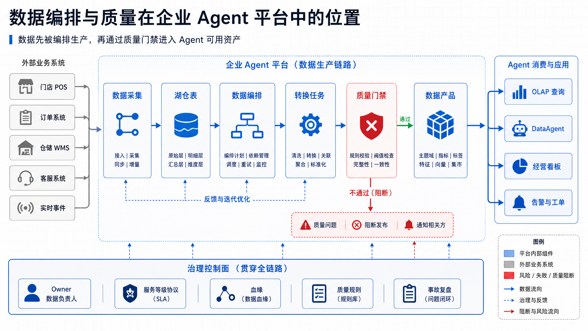
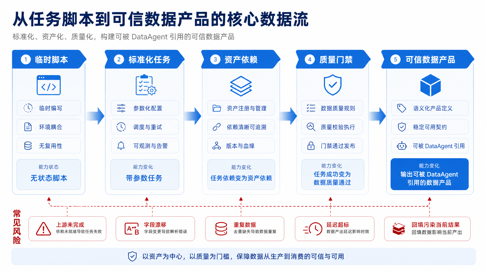
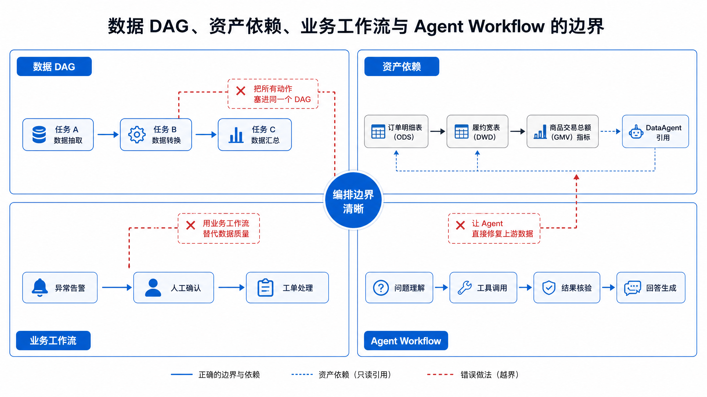
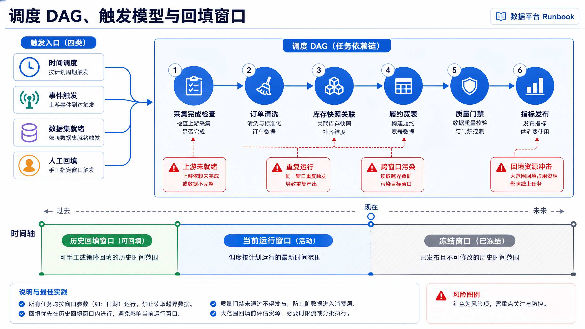
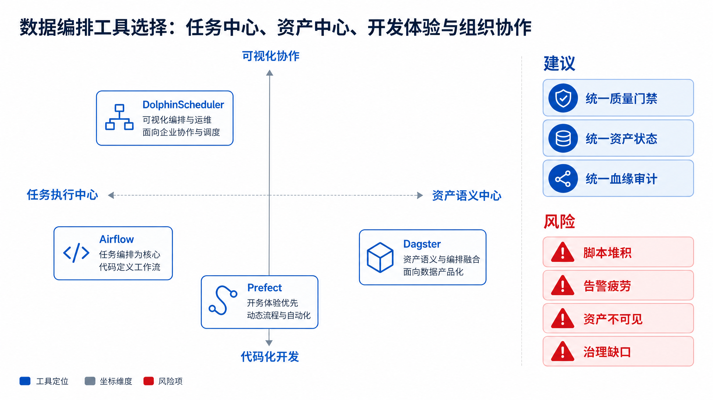
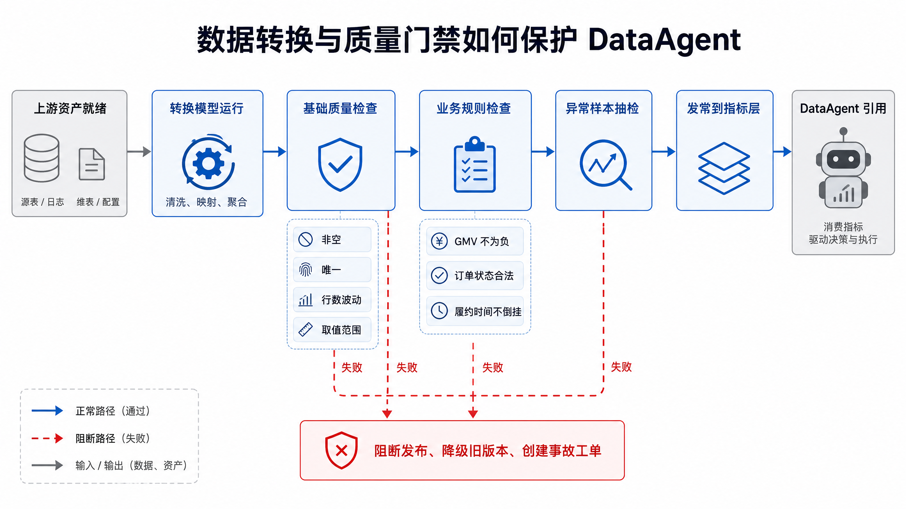
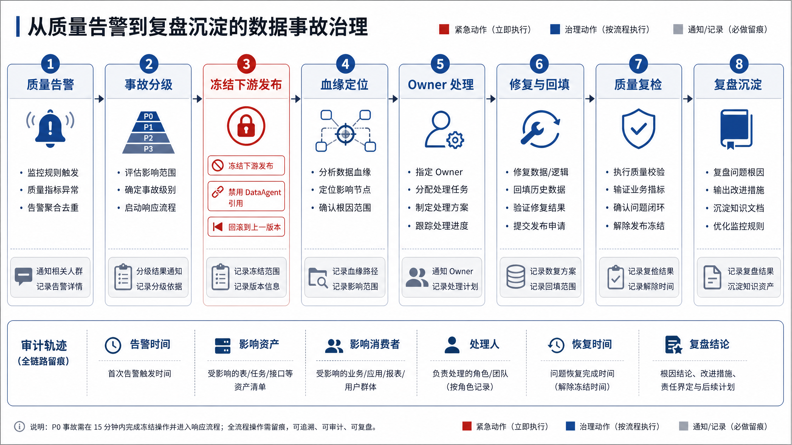
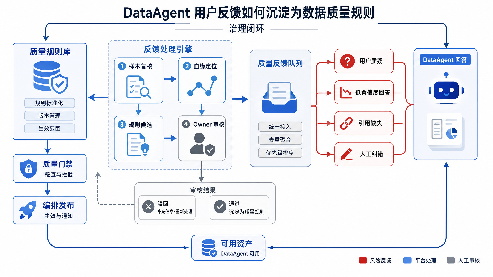
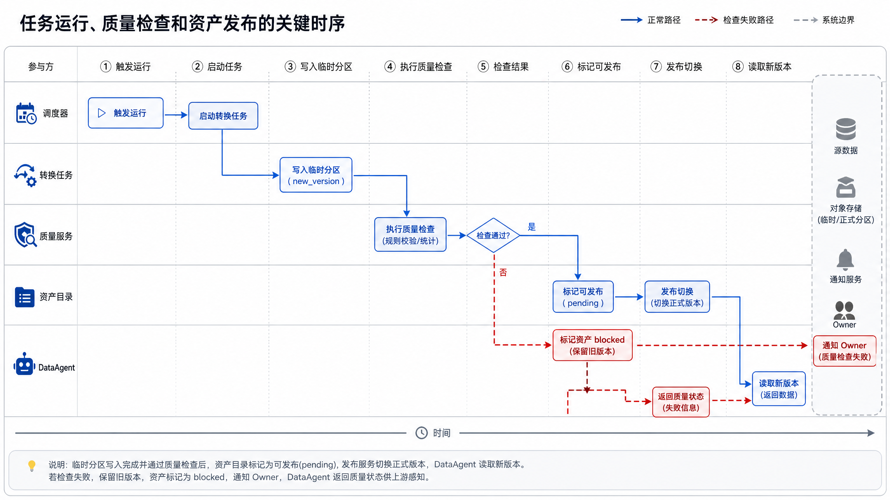
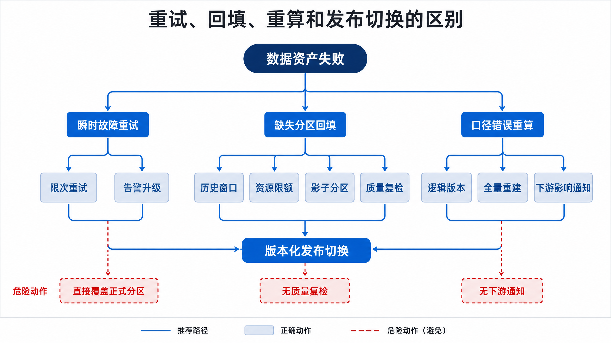

# 第14章 数据编排与质量

---

数据编排与质量控制把脚本集合变成可运营的数据链路。零散的定时脚本能跑通一次，但在依赖变化、任务失败、口径漂移时很难保持可信。任务依赖、调度恢复、质量门禁、数据产品发布和 mini-platform 的实现方式共同决定数据能否稳定交付给 DataAgent。编排引擎负责用 DAG 管理依赖与重试，质量门禁负责在数据进入下游前拦截问题。

DataAgent 引用的数据通常不是单表直接产生的结果。订单事实表、履约宽表、库存快照、区域维表和指标汇总要按依赖顺序产出，中间任何一个任务失败、延迟或质量异常，都会让上层回答失真。编排、质量门禁和事故恢复要一起工作，才能把“脚本能跑”推进到“数据产品可信”。

数据编排看起来像调度脚本，实际承担的是数据产品的交付责任。一个 DataAgent 回答得是否可信，取决于上游事实表、维表、指标表和质量规则是否按依赖顺序产出。某个中间表延迟、某个任务重跑漏了分区、某条质量规则被临时关闭，都会让最终回答偏离真实业务。

许多团队早期用 cron 和脚本拼出数据链路。任务少的时候足够，业务扩展后就会出现依赖不清、失败没人接、补数靠手工、质量检查写在脚本里的问题。Agent 把这些问题放大了，因为用户会即时追问，系统也可能把分析结果写入报告或流程。数据链路的不可解释，会变成 Agent 的不可解释。

编排与质量应一起设计。DAG 说明数据如何产生，质量规则说明数据何时可以被使用，告警和恢复说明失败后谁来处理。只有任务状态、质量状态和血缘一起进入平台，DataAgent 才能判断某个指标是否适合回答，前端也才能在数据延迟时给出明确提示。

## 14.1 从任务脚本到可信数据产品：编排与质量的共同目标

一家多业务线企业的数据平台已经能采集业务事件、沉淀湖仓表、提供 OLAP 查询和实时指标。新的问题随之出现：DataAgent 回答“昨日华东区履约延迟为何上升”时，依赖的订单事实表、履约宽表、库存快照和区域维表要按正确顺序产出；其中任一环节延迟、失败或质量异常，都会让回答变成不可信的猜测。

早期团队通常用定时脚本解决问题。每天凌晨执行抽取脚本，随后执行清洗脚本，再执行指标汇总脚本。脚本能跑起来，但它无法清楚表达三件事：上游资产是否已经准备好；产出数据是否满足质量规则；失败后应该重试、跳过、回滚还是回填。数据编排与质量治理的共同目标，是把一组脆弱脚本变成有依赖、有状态、有质量门禁、有责任人、有恢复路径的数据产品生产线。



*图14-1：编排不是孤立的调度器，质量也不是事后报表。来源：本书自绘。Alt text：左侧"传统观念"中调度器与质量报表彼此分离，右侧"数据产品观念"中编排与质量门禁嵌在同一发布流程里，对比两种组织方式。*

图 14-1 表明，编排不是孤立的调度器，质量也不是事后报表。二者共同夹在数据生产和数据消费之间：编排保证资产按依赖关系被生产出来，质量门禁保证资产进入 DataAgent 之前具备最低可信度。



*图14-2：脚本任务到数据产品的成功标准变化。来源：本书自绘。Alt text：左列"脚本任务"成功标准是"跑完不报错"，右列"数据产品"成功标准升级为契约满足、质量达标、可订阅、可追溯，对比成功定义的变化。*

图 14-2 的关键不在于工具替换，而在于成功标准改变。脚本时代只关心“任务是否退出码为 0”；数据产品时代要同时关心“输入是否完整、依赖是否满足、口径是否正确、产出是否准时、失败是否可恢复、结果是否能被追溯”。企业 Agent 平台还会把数据结果转化为自然语言判断，质量问题会被放大成错误解释和错误动作。

### 14.1.1 编排边界：数据 DAG、资产依赖、业务工作流与 Agent Workflow 的区别

数据编排常被误解为“把所有流程都放进一个 DAG”。在企业 Agent 平台中，至少有四类流程需要区分。

*表14-1：数据 DAG、编排、质量门禁等概念的定义与区别。来源：本书整理。*

| 概念 | 定义 | 与相邻概念的区别 |
|---|---|---|
| 数据 DAG | 用有向无环图表达任务执行顺序，例如先清洗订单，再聚合指标 | 关注任务执行；不必天然理解数据资产语义 |
| 资产依赖 | 用表、视图、指标、特征等资产表达上游和下游关系 | 关注产物关系；比任务 DAG 更接近 DataAgent 消费语义 |
| 业务工作流 | 围绕业务动作的人机流程，例如审批、派单、补货、退款 | 关注业务状态流转；不等同于数据生产依赖 |
| Agent Workflow | Agent 为完成任务而调用工具、检查结果、请求人工确认的执行路径 | 关注推理与行动；可以消费数据资产，但不应该替代数据编排 |
| 质量门禁 | 在数据进入下游消费前执行规则检查、阻断、降级或告警 | 关注可信度；不是单纯的监控图表 |



*图14-3：边界清晰能降低系统耦合。来源：本书自绘。Alt text：左侧职责混杂的任务相互交叉连线、耦合高，右侧编排、转换、质量、发布各司其职、连线清晰，对比边界清晰前后的耦合度。*

图 14-3 说明，边界清晰能降低系统耦合。数据 DAG 负责稳定生产，资产依赖负责解释影响范围，业务工作流负责组织处理，Agent Workflow 负责受控调用和解释。让 Agent 直接在数据 DAG 中“自由修复问题”通常会带来审计困难；让调度器承载复杂业务审批，则会让数据平台变成难以维护的业务流程引擎。

一家多业务线企业的履约延迟分析可以这样划边界：数据编排负责每日生成订单履约宽表；质量门禁检查订单量、主键唯一性、字段有效性和产出延迟；DataAgent 只读取通过门禁的数据产品；当质量失败时，业务工作流创建数据事故工单，由 Owner 处理；Agent 可以解释事故影响范围，但不能绕过门禁给出正式分析。

### 14.1.2 调度模型：时间调度、事件触发、数据集触发与回填

编排系统要解决的第一个工程问题是“什么时候运行”。常见触发模型包括时间调度、事件触发、数据集触发和人工回填。

*表14-2：时间、事件、数据集触发与回填四种调度模型的优势与适用场景。来源：本书整理。*

| 调度模型 | 触发条件 | 优势 | 代价 | 适用场景 |
|---|---|---|---|---|
| 时间调度 | 固定时间或固定周期 | 简单、可预测、易值班 | 可能在上游未就绪时空跑或失败 | 日报、月报、稳定批处理 |
| 事件触发 | 上游事件到达或文件落地 | 响应快，减少等待 | 需要事件可靠性和去重 | 小时级增量、准实时同步 |
| 数据集触发 | 上游数据资产达到可用状态 | 更贴近资产依赖 | 需要资产状态和元数据平台支持 | 多团队共享数据产品 |
| 人工回填 | 人员指定历史区间重新运行 | 可修复历史错误 | 容易污染当前结果，资源冲击大 | 事故修复、口径重算、历史补数 |



*图14-4：调度触发模型与回填治理边界。来源：本书自绘。Alt text：图中并列时间触发、事件触发、数据集触发三种模型，下方标出回填场景的特殊处理边界，说明常规调度与回填须分开治理。*

图 14-4 强调两点：触发模型要与数据资产状态绑定，而不是只依赖时钟；回填也不等于“把历史日期再跑一次”。它需要冻结窗口、资源限额、幂等写入、质量复检和下游影响通知。若回填直接覆盖正在被 DataAgent 查询的正式指标，用户会在同一会话中看到前后不一致的结果。

这里需要避免四类判断偏差：把任务成功等同于数据正确；认为 DAG 越细越好；认为质量检查越多越好；低估回填对当前链路的影响。任务可以成功写出空表、重复表或过期数据。过细的任务会放大调度开销和失败噪声；过粗的任务又会掩盖故障位置。没有 Owner、阈值和处理动作的检查只会制造告警疲劳。历史回填可能触发下游重算、缓存刷新和 DataAgent 引用变化，应进入变更流程。

---

## 14.2 编排工具对比：Airflow、Dagster、Prefect 与 DolphinScheduler

编排工具的差异不只在界面和语法，而在它们对“任务、资产、状态、开发体验和治理”的建模方式。

*表14-3：Airflow、Dagster、Prefect 等编排工具的优势、代价与适用场景。来源：本书整理。*

| 方案 | 优势 | 代价 | 适用场景 | 本书建议 |
|---|---|---|---|---|
| Airflow | 生态成熟，调度模型稳定，运维经验丰富 | 以任务 DAG 为中心，资产语义需要额外治理 | 传统批处理、复杂依赖、已有数据平台团队 | 适合作为通用批调度底座，但要补资产状态和质量门禁 |
| Dagster | 资产建模强，适合把数据产品作为一等公民 | 团队需要接受新的资产开发范式 | 数据产品治理、质量驱动开发、强血缘场景 | 适合新建可信数据产品平台 |
| Prefect | 开发体验轻，动态流程表达灵活 | 大规模集中治理需额外设计 | 数据科学任务、轻量流程、混合云任务 | 适合快速迭代和应用团队自助编排 |
| DolphinScheduler | 可视化和任务类型丰富，适合多团队协作 | 复杂资产语义和代码化治理需补强 | 企业内部多角色调度、国产生态适配 | 适合重可视化协同的组织，仍需质量与契约体系 |

这些工具都不能替代数据质量体系。Airflow 能告诉平台“任务有没有运行”，不能自动证明订单金额没有异常；Dagster 能把资产建模得更清楚，也仍然需要质量规则、阈值、Owner 和失败动作；Prefect 让开发更灵活，但灵活性过高会带来流程碎片化；DolphinScheduler 对多任务可视化友好，但若缺少代码评审和资产契约，容易演变为图形化脚本堆积。



*图14-5：工具选择应回到组织能力。来源：本书自绘。Alt text：以"团队工程能力"和"资产治理需求"为轴的矩阵，把 Airflow、Dagster、Prefect 等工具落入不同象限，强调选型回到组织实际能力。*

图 14-5 表示工具选择应回到组织能力。若团队已经有大量 Airflow DAG，可以先补数据集状态、质量检查和事故流程；若目标是把数据资产作为平台产品经营，资产中心的建模更有价值；若应用团队需要快速编排自助任务，则需要在灵活性外加统一模板和审计。

### 14.2.1 转换与测试：dbt 模型、dbt tests、Great Expectations 与 Soda

编排负责“何时、按什么依赖运行”，转换与测试负责“产出什么、是否可信”。在湖仓和 OLAP 场景中，dbt 常用于把 SQL 转换逻辑工程化，dbt tests 用于表达唯一性、非空、关系完整性和自定义断言。Great Expectations 和 Soda 更偏向通用数据质量检查，适合跨数据源、跨表、跨业务规则的质量监控。

*表14-4：dbt tests、Great Expectations 等转换与测试工具的优势与适用场景。来源：本书整理。*

| 方案 | 优势 | 代价 | 适用场景 | 本书建议 |
|---|---|---|---|---|
| dbt tests | 与 SQL 模型贴近，适合开发阶段即写测试 | 复杂跨系统质量规则表达有限 | 指标模型、维表、事实表、开发工作流 | 作为模型内置测试的默认起点 |
| Great Expectations | 规则表达丰富，文档化和数据剖析能力强 | 规则维护和平台集成需要治理 | 跨源质量检查、数据合同验证、审计报告 | 用于核心资产和跨团队契约 |
| Soda | 质量检查配置简洁，适合持续监控 | 深度定制能力取决于集成方式 | 日常监控、规则巡检、轻量门禁 | 用于标准化巡检和告警 |
| 自定义 SQL 检查 | 最灵活，容易贴合业务口径 | 容易碎片化，缺少统一血缘和报告 | 特殊业务规则、临时事故排查 | 允许存在，但要纳入统一登记和 Owner |



*图14-6：质量门禁的最小闭环。来源：本书自绘。Alt text：环形流程，产出数据、运行质量校验、通过则发布、不通过则阻断并告警，箭头表示失败样本回流修正规则，构成质量门禁闭环。*

图 14-6 展示的是质量门禁的最小流程。质量失败后的动作需要预先定义：阻断发布、继续发布但标记风险、回退到上一版本、降级到离线快照、创建事故工单或请求人工确认。没有动作的质量规则只是噪声。

一个面向 DataAgent 的质量事件契约可以这样表达。

```json
{
  "asset_id": "ads.fulfillment_delay_daily",
  "run_id": "run_20260611_020000",
  "partition": "dt=2026-06-10",
  "status": "blocked",
  "severity": "critical",
  "checks": [
    {
      "name": "order_id_unique",
      "dimension": "uniqueness",
      "expected": "duplicate_count = 0",
      "actual": "duplicate_count = 184",
      "action": "block_publish"
    },
    {
      "name": "row_count_range",
      "dimension": "completeness",
      "expected": "between 950000 and 1200000",
      "actual": "612340",
      "action": "keep_previous_partition"
    }
  ],
  "owner": "fulfillment-data-team",
  "lineage": {
    "upstream_assets": ["dwd.orders_daily", "dim.store_region"],
    "downstream_consumers": ["DataAgent", "operations_dashboard"]
  }
}
```

#### 示例 14-1：质量事件契约示例

这是生产工程示例。它让 DataAgent 和看板知道某个分区是否可用、为什么被阻断、临时应该使用哪种降级策略。

### 14.2.2 数据质量维度：完整性、唯一性、准确性、及时性、一致性与有效性

质量规则要按维度组织，否则容易堆成无法维护的检查清单。

*表14-5：完整性、唯一性、准确性等数据质量维度的关注问题与示例规则。来源：本书整理。*

| 质量维度 | 关注问题 | 示例规则 | 失败后的典型动作 |
|---|---|---|---|
| 完整性 | 数据是否缺失 | 当日订单行数不低于历史同星期均值的合理范围 | 阻断发布或等待上游补齐 |
| 唯一性 | 主键是否重复 | `order_id` 在分区内唯一 | 阻断发布并定位重复来源 |
| 准确性 | 数值是否符合业务事实 | 支付金额不能为负，履约时长不能倒挂 | 隔离异常记录，进入修复流程 |
| 及时性 | 是否在 SLA 前产出 | 每天 08:00 前完成核心指标 | 告警、降级旧版本、通知下游 |
| 一致性 | 跨表或跨系统是否对齐 | 订单事实表和支付事实表金额差异在阈值内 | 暂停关键回答，触发对账 |
| 有效性 | 字段是否符合取值域和格式 | 门店状态只能是营业、暂停、关闭 | 拒收坏数据或写入隔离表 |

质量规则还要区分硬门禁和软告警。硬门禁阻断下游发布，用于主键唯一、核心字段非空、金额合法、权限分类等不可妥协条件。软告警允许产出继续进入下游，但要带风险标记，用于行数轻微波动、延迟接近阈值、历史分布变化等需要观察的问题。

#### 硬门禁、软告警与旁路隔离

*表14-6：硬门禁与软告警两种质量拦截策略的取舍。来源：本书整理。*

| 方案 | 优势 | 代价 | 适用场景 | 本书建议 |
|---|---|---|---|---|
| 硬门禁 | 防止坏数据进入核心消费链路 | 可能造成数据不可用，业务等待 | 主键重复、核心字段缺失、权限违规、金额非法 | 用于高风险核心资产 |
| 软告警 | 保持数据可用，减少阻断 | Agent 可能引用有风险结果 | 分布波动、轻微延迟、可解释异常 | 响应中带质量状态 |
| 旁路隔离 | 坏记录隔离，主链路继续运行 | 需要后续修复和对账 | 少量异常记录、可局部剔除的数据 | 用于明细表清洗，但隔离比例要告警 |

### 14.2.3 数据事故治理：SLA、告警、血缘定位、责任人、修复与复盘

数据事故不是“任务失败”的同义词。任务成功但产出错误数据、质量门禁误放行、回填覆盖正式分区、DataAgent 引用了未发布资产，都属于数据事故。事故治理需要定义发现、分级、止血、定位、修复、验证、复盘和规则沉淀的完整流程。



*图14-7：数据事故处理的止血与修复路径。来源：本书自绘。Alt text：事故流程分两段，先止血（下游降级、回退旧版本、告警），后修复（定位根因、回填重算、复盘），箭头表示先恢复可用性再追根因。*

图 14-7 的核心是先止血再修复。对 DataAgent 而言，止血动作通常包括隐藏问题资产、返回质量状态、降级到上一可用分区、禁止触发动作型建议。若平台只通知数据工程师而不通知 DataAgent 服务层，用户仍可能持续获得错误回答。

*表14-7：上游未就绪、数据漂移等数据事故的检测方式与恢复策略。来源：本书整理。*

| 失败模式 | 触发条件 | 影响 | 检测方式 | 恢复策略 |
|---|---|---|---|---|
| 上游未就绪 | 源系统延迟、采集任务失败 | 下游空跑、产出空表或旧数据 | 数据集状态、行数波动、上游心跳 | 等待、重试、降级上一分区 |
| 字段漂移 | 上游新增、删除或修改字段类型 | 转换失败或隐性错误 | Schema 校验、契约兼容性检查 | 阻断发布，执行变更评审 |
| 主键重复 | CDC 重放、回填重复写入 | 指标翻倍、Join 膨胀 | 唯一性测试、对账差异 | 幂等重写、隔离重复记录 |
| 质量规则误报 | 阈值未考虑促销、节假日或季节性 | 无效阻断，影响业务可用性 | 告警确认率、历史分布分析 | 引入动态阈值和业务日历 |
| 质量规则漏报 | 规则覆盖不足或阈值过宽 | 坏数据进入 DataAgent | 用户质疑、下游对账、抽样审计 | 复盘补规则，扩大门禁范围 |
| 回填污染当前结果 | 历史重算覆盖当前分区或缓存 | 同一指标前后不一致 | 发布审计、版本差异、缓存命中检查 | 使用版本化分区、先影子回填再切换 |
| 告警无人处理 | Owner 缺失或升级路径不清 | 故障持续扩大 | 告警未确认时长、值班日志 | 强制 Owner 登记和升级机制 |

### 14.2.4 Agent 反馈链路：从用户质疑、回答置信度到质量规则沉淀

企业 Agent 平台多了一个传统数据平台没有的质量信号：用户会直接质疑回答。用户可能问“这个数是不是太低了”“为什么和看板不一样”“你引用的是哪个日期的数据”。这些反馈不应只当作客服问题处理，它们应进入数据质量治理流程。



*图14-8：从事故复盘到规则沉淀的反馈链路。来源：本书自绘。Alt text：链路从一次数据事故出发，经复盘提炼出新的质量规则，沉淀进门禁，下次同类问题被提前拦截，箭头构成持续改进的反馈环。*

图 14-8 展示了一条可落地的反馈链路。低置信度回答、用户质疑、人工纠错和引用缺失都可以成为规则候选，但不能直接自动变成阻断规则。候选规则要经过样本验证、误报评估、Owner 审核和灰度启用。否则平台会把个别异常反馈扩大成大面积误阻断。

DataAgent 的质量响应也应显式表达数据状态。例如，当核心分区被阻断时，回答不应伪装成正常结果，而应说明“当前使用上一可用分区，今日分区因唯一性检查失败未发布”。这类回答需要编排系统、质量系统和元数据系统共同提供状态。

---

## 14.3 质量链路的状态、告警与恢复

本节给出一组生产工程示例，重点是接口、状态和操作流程自洽。

编排平台至少要维护四类状态：任务运行状态、资产可用状态、质量检查状态和发布状态。任务成功不等于资产可用；质量通过也不等于已发布；发布成功也不代表所有下游缓存已刷新。



*图14-9：把“写入临时分区”和“切换正式版本”拆开。来源：本书自绘。Alt text：发布分两步，先写入临时分区并校验，再原子切换正式版本指针，箭头表示校验通过才切换，避免半成品数据直接对外可见。*

图 14-9 把“写入临时分区”和“切换正式版本”拆开。这样质量失败时，坏数据不会覆盖线上资产；质量通过后，发布动作可以成为一个可审计的版本切换。DataAgent 只读取正式版本和明确允许的降级版本。

以下 YAML 展示一个数据资产的编排与质量配置示例。

```yaml
# 示例：数据资产编排与质量配置，不包含真实凭证
asset:
  id: ads.fulfillment_delay_daily
  owner: fulfillment-data-team
  schedule: "0 6 * * *"
  partition_key: dt
  publish_mode: versioned_partition

dependencies:
  - asset_id: dwd.orders_daily
    freshness: 2h
  - asset_id: dim.store_region
    freshness: 24h

quality_gates:
  hard:
    - name: order_id_unique
      dimension: uniqueness
      expression: duplicate_count(order_id) = 0
      on_failure: block_publish
    - name: required_columns_not_null
      dimension: completeness
      columns: [order_id, store_id, promised_at, delivered_at]
      on_failure: block_publish
  soft:
    - name: row_count_anomaly
      dimension: completeness
      expression: row_count within historical_band(weekday, 0.2)
      on_failure: publish_with_warning

fallback:
  strategy: keep_previous_partition
  max_age: 2d

notifications:
  severity: critical
  channels: [data-incident-queue]
```

#### 示例 14-2：资产编排与质量配置示例

这段 YAML 不对应某个工具的专有语法，而是表达生产系统需要保存的关键字段：依赖、新鲜度、门禁、失败动作、降级策略和通知路径。

以下伪代码展示发布动作如何避免坏数据覆盖正式分区。

```python
# 伪代码：质量门禁通过后再切换正式版本
def publish_asset(run):
    write_temp_partition(run.asset_id, run.partition, run.output)
    quality_result = run_quality_checks(run.asset_id, run.partition)

    if quality_result.has_blocking_failure:
        mark_asset_state(run.asset_id, run.partition, "blocked", quality_result)
        keep_previous_version(run.asset_id)
        notify_owner(run.asset_id, quality_result)
        return "blocked"

    version = commit_versioned_partition(run.asset_id, run.partition)
    mark_asset_state(run.asset_id, run.partition, "published", quality_result)
    refresh_downstream_cache(run.asset_id, version)
    return "published"
```

#### 示例 14-3：质量发布伪代码

核心思想是先写临时结果，再检查，通过后切换版本；失败时保留旧版本并暴露质量状态。

失败恢复需要区分重试、回填和重算。重试面向瞬时故障，回填面向缺失历史窗口，重算面向逻辑或口径错误。三者不能共用同一按钮。



*图14-10：重试、回填与重算的恢复决策路径。来源：本书自绘。Alt text：决策树按"是瞬时失败、上游缺数据还是逻辑变更"分出重试、回填、重算三条恢复路径，帮助选择合适的恢复动作。*

图 14-10 是运维 Runbook 的核心。瞬时网络故障可以自动重试；源数据缺失需要等待或回填；业务口径错误则要走变更和重算流程。平台如果把所有失败都配置为自动重试，会在 Schema 不兼容、质量失败或权限错误时制造更多无效运行。

### 14.3.1 质量规则怎样进入生产链路

质量规则进入生产链路前，评审对象不应只是规则数量，而应是规则能否控制数据发布。核心资产、视图、指标和特征都要有资产 ID、Owner、SLA、分区策略和下游消费者；调度系统需要区分任务依赖和资产依赖，DataAgent 只消费资产可用状态。

规则覆盖要贴近业务风险。完整性、唯一性、准确性、及时性、一致性和有效性都要有核心规则；每条规则都有严重级别、失败动作、降级策略和 Owner。发布时先写临时分区或影子版本，质量通过后再切换正式版本。

回填和事故处理也属于门禁范围。历史回填要定义窗口、资源限额、幂等写入、质量复检和下游通知；告警要有分级、去重、抑制、升级路径和确认记录；质量事故要能冻结下游发布、定位血缘、修复、复检和复盘。

Agent 集成层还要验证资产状态、质量状态、新鲜度和降级版本能被 DataAgent 读取。调度并发、回填资源、质量扫描频率和历史数据保留要有预算；发布、阻断、回填、重算和规则变更都要留下审计记录。

#### 任务成功但订单事实表为空，DataAgent 正常回答了错误结论

- 现象：运营团队询问昨日履约延迟，DataAgent 回答“无明显延迟”，但实际是订单事实表上游采集失败，产出为空表。
- 根因：调度器只检查任务退出状态，没有对行数、分区新鲜度和上游资产状态做质量门禁。
- 修复：核心资产增加行数波动、分区新鲜度和非空检查；质量失败时阻断发布并让 DataAgent 返回“数据不可用”状态。

#### 回填历史分区刷新线上缓存，用户看到指标跳变

- 现象：数据团队回填上月履约口径时，经营看板和 DataAgent 的当前指标短时间内出现跳变。
- 根因：回填任务复用了正式发布流程，未区分历史影子分区和线上分区，也没有通知下游缓存刷新策略。
- 修复：回填先写影子版本，通过质量复检和差异报告后再人工切换；当前窗口缓存与历史回填缓存隔离。

#### 促销日行数暴涨触发质量误报，核心日报被阻断

- 现象：大促当天订单量超过历史阈值，质量系统判断为异常并阻断发布。
- 根因：行数规则只按过去 7 天均值计算，没有引入业务日历、促销标记和星期效应。
- 修复：把业务日历纳入阈值模型；对促销期采用单独基线；硬门禁仅保留不可妥协规则，波动类规则改为软告警。

#### 质量规则没人认领，告警持续数周无人处理

- 现象：某个维表有效性告警每天触发，但既没有阻断，也没有修复。
- 根因：规则没有 Owner，告警没有升级路径，质量平台只记录失败次数。
- 修复：规则绑定资产 Owner；超过确认时限自动升级；长期误报规则关闭、调整或转为观察。

#### Agent 用户反馈没有进入质量体系，同类错误反复出现

- 现象：多名业务人员反馈“门店区域口径和看板不同”，但 DataAgent 一周后仍给出同类错误回答。
- 根因：用户反馈只进入产品客服队列，没有沉淀为数据质量规则或语义口径检查。
- 修复：建立 DataAgent 反馈队列，按资产和字段聚合质疑样本；经 Owner 审核后新增区域映射一致性规则。

---

### 14.3.2 质量状态在 Agent 链路中的传播

数据质量状态不能只留在调度系统里。DataAgent 查询前需要知道资产是否已发布、是否阻断、是否处于回填、是否只有影子版本、是否存在软告警。查询后，报告层也需要知道结果是否来自降级数据。若质量状态没有进入 Agent 链路，模型会把不稳定数据包装成确定结论，用户很难发现问题。

质量状态可以分成四类传播。第一类是阻断状态，核心资产未通过门禁时，DataAgent 应拒答或提示数据不可用。第二类是降级状态，数据可用于探索，但不能用于正式报告。第三类是观察状态，规则有告警但不影响主要结论，回答中可以标注限制。第四类是正常状态，结果可以进入下游分析和报告。不同状态对应不同产品行为，而不是只在后台显示红黄绿灯。

用户反馈也应进入质量传播链。业务用户指出某个结果异常时，平台要把反馈关联到资产、字段、指标和 Run，而不是只记录一条客服工单。经 Owner 确认后，这条反馈可以转成质量规则、语义层修正或评测样本。这样 DataAgent 的使用过程会反向提升数据质量，而不是不断暴露同一类问题。

质量门禁的价值在于提前拦截，而不是事后生成报告。空值率异常、主键重复、分区缺失、指标波动过大，若已经进入下游宽表，Agent 很难在查询时识别。门禁把问题挡在数据产品入口，能减少后续解释成本。

编排系统还要保存恢复证据。一次补数改了哪些分区、跳过了哪些失败文件、哪些下游任务被重跑、哪些报告需要刷新，都应该有记录。没有这些记录，业务问“这个数什么时候修好”时，团队只能靠人肉沟通。

对 Agent 平台来说，编排结果应暴露为可消费状态。某个指标今天未通过质量检查，Agent 可以拒绝回答或标注风险；某个任务正在补数，Agent 可以延后生成报告。这样的交互比给出一个错误但流畅的答案更可靠。

编排系统还要区分技术成功和业务可用。一个 SQL 任务返回 0 行可能是正常结果，也可能是上游分区缺失；一个任务耗时变短可能是优化生效，也可能是没有读到数据。质量规则需要结合业务预期，而不是只看任务是否退出码为 0。

告警设计也要减少噪声。所有失败都发到同一个群，久了没人处理；只告警最终宽表，又会错过关键上游问题。更好的方式是按数据产品分责任人，按影响范围分级，并在告警里给出上游失败、下游影响和建议动作。这样业务团队知道问题是否影响今天的 Agent 回答。

补数流程要和 Agent 产物联动。数据修复后，哪些缓存要失效，哪些报告要刷新，哪些评测样本要重跑，哪些用户需要通知，都不能靠人工记忆。编排系统记录补数范围后，平台可以触发下游刷新，避免用户继续看到旧结论。

质量规则本身也要版本化。阈值调整、异常检测方法更换、字段规则放宽，都会改变数据产品是否可用。若规则变化没有记录，后续复盘无法判断某天的异常是数据改善了，还是门禁变松了。

当编排和质量进入平台后，DataAgent 会获得一种重要能力：在数据不可信时停止。停止回答是系统保护业务的表现，不能简单视为失败。比起给出错误答案，明确说明数据产品未通过质量门禁更符合企业使用场景。

DAG 设计要反映数据产品边界。把所有任务放进一张大图，调度看起来集中，失败影响范围却难以判断；把任务拆得太散，又会让依赖和补数复杂。通常可以按数据产品、业务域和 SLA 划分 DAG，让每个 DAG 有明确负责人、输入、输出和质量门禁。

重试策略不能只按技术错误设计。网络抖动可以自动重试，源数据缺失需要等待或告警，质量异常需要隔离，业务口径变化需要人工确认。若所有失败都重试三次，系统会延迟暴露真实问题；若所有失败都立即告警，团队会被噪声淹没。编排系统要根据失败类型选择动作。

质量检查要覆盖分布变化。行数、空值和主键只是基础，很多业务问题体现在指标突然波动、类别比例变化、金额单位异常或日期分布偏移。DataAgent 会基于这些数据做解释，质量规则越贴近业务，回答越可靠。规则可以先从高价值指标开始，不必一次覆盖所有字段。

数据产品发布需要验收人。工程团队可以确认任务运行，业务负责人要确认口径和可用性，平台团队要确认状态能被 Agent 消费。没有验收人，数据产品容易停留在“表已经产出”，但上层系统不知道是否可以放心使用。

质量事故复盘应沉淀为规则。一次库存分区缺失、一次金额单位错误、一次维表延迟，都可以转成新的检查或告警。编排与质量体系的成熟，来自这些事故不断转化为自动控制，而不是依赖团队记住教训。

编排系统还应把 SLA 暴露给 Agent。某个数据产品约定每天 8 点可用，当前 8 点 30 仍未产出，Agent 就应该知道这是异常；另一个产品只承诺中午前可用，早上查询为空不一定是故障。SLA 进入元数据后，回答可以更准确地解释数据状态。

质量门禁要支持临时豁免，但豁免必须可追踪。月末关账、供应商延迟或历史补数时，业务可能允许某些质量规则短期放宽。平台应记录豁免原因、负责人、到期时间和影响范围。没有到期时间的豁免，会让质量规则逐渐失效。

编排结果还可以反哺评测。DataAgent 评测失败时，如果对应数据产品当天未通过质量门禁，失败不应完全归咎于模型。评测系统读取数据状态后，可以区分模型退化和数据异常。这样质量链路和模型评测才不会互相误伤。

## 本章小结

数据编排不只是让脚本按时运行，还要让数据产品按依赖、状态、质量和版本被可靠生产。任务 DAG、资产依赖、业务工作流和 Agent Workflow 应分层治理；混在一起会让权限、审计和恢复边界变得模糊。

数据质量规则要包含维度、阈值、严重级别、失败动作和 Owner。没有动作的规则只会制造告警噪声。DataAgent 只能消费通过门禁或明确降级的数据资产，并在回答中暴露质量状态和新鲜度。

回填、重试和重算是三类不同恢复动作。它们都需要版本化发布、质量复检和下游通知，否则 Agent 很容易引用正在修复中的数据并给出看似确定的结论。


## 参考文献

Apache Airflow. (n.d.). [Documentation](https://airflow.apache.org/docs/).

Dagster. (n.d.). [Documentation](https://docs.dagster.io/).

Prefect. (n.d.). [Documentation](https://docs.prefect.io/).

Great Expectations. (n.d.). [Documentation](https://docs.greatexpectations.io/).

Soda. (n.d.). [Documentation](https://docs.soda.io/).
