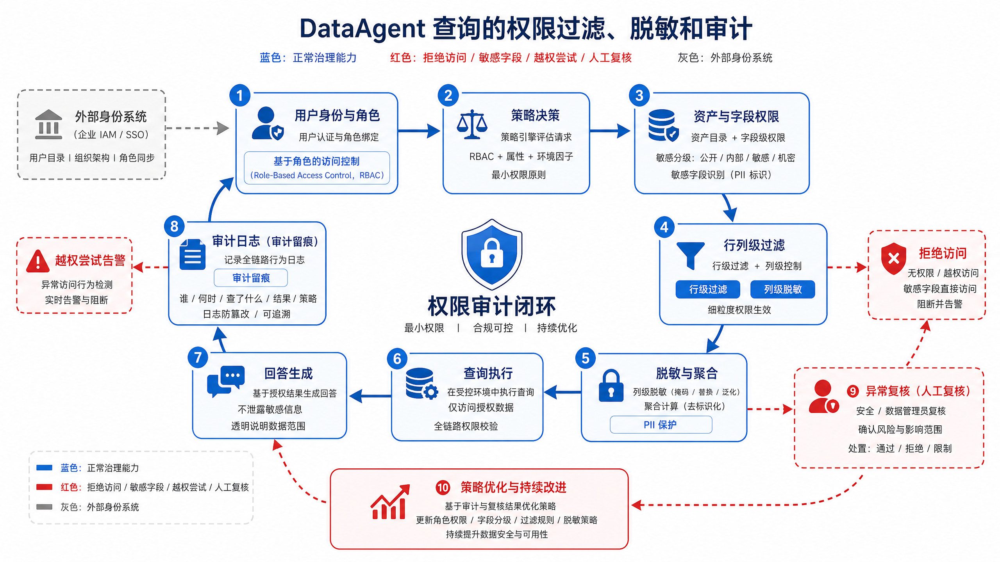
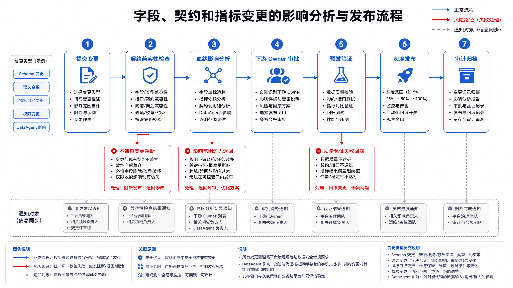

# 第15章 元数据、血缘、契约与指标

---

DataAgent 要回答“这个数从哪来、口径是什么、能不能信”，不能靠模型临场猜测。它需要数据底座提前给出四类材料：元数据说明资产和字段含义，血缘说明数据从哪里来，数据契约约束上游变更，指标口径定义统一的计算方式。这些材料共同组成数据控制面，并进入问数、分析和审计流程。

业务用户问“本月 GMV 为什么下降”，DataAgent 选中了 `sales_amount` 字段并给出结论。复盘时数据团队发现，管理层口径里的 GMV 应使用支付成功金额，且要剔除内部调拨订单；`sales_amount` 只是订单明细里的原始销售额。模型没有“胡说”，它只是缺少可查询的字段含义、指标定义和适用边界。

元数据、血缘、数据契约和指标口径要提前进入平台控制面。它们告诉 Agent 哪些资产可用、字段代表什么、指标从哪里来、上游变化会影响谁，也让一次回答在事后能够被审计和复盘。

元数据和血缘常被放在数据平台的后台页面里，到了 Agent 时代，它们会直接影响用户答案。用户问“GMV 为什么下降”，模型需要知道 GMV 的定义、字段来源、过滤条件、适用范围和更新时间。若这些信息不可查询，模型只能从表名和字段名猜测业务含义，猜对一次也无法长期依赖。

企业的数据口径通常散落在指标平台、数仓文档、代码、Excel 和团队经验里。DataAgent 接入后，口径不一致会暴露得更快。销售额、收入、毛利、活跃客户、有效订单这些词在不同部门可能有不同定义；如果平台没有统一指标服务和数据契约，模型生成的 SQL 很容易使用错误字段，却仍然给出自信解释。

数据控制面要把资产、字段、血缘、质量、权限和指标口径连起来。元数据说明“这是什么”，血缘说明“从哪里来”，契约说明“上游怎么变更”，指标说明“如何计算”。这四类材料共同决定 DataAgent 能否回答“这个数能不能信”。

## 15.1 元数据是 Agent 平台的数据控制平面

一家多业务线企业的 DataAgent 能访问湖仓表、OLAP 引擎、实时指标和质量状态。若没有元数据控制面，Agent 面对自然语言问题时会遇到四类不确定性：该用哪张表；字段是什么意思；指标口径是否一致；当前用户是否有权查看结果。传统 BI 可以通过固定看板和人工培训减少这些问题，DataAgent 则需要把这些判断自动化、可解释化、可审计化。

元数据不能退化成“表的备注”。它是企业 Agent 平台的数据控制平面，负责登记资产、描述语义、连接血缘、约束契约、服务指标、执行权限和记录审计。没有这个控制面，Agent 只能把物理表名、字段名和历史查询样例拼在一起猜测，回答质量会随着数据规模增长迅速下降。


*图15-1：元数据控制面横跨数据基础设施层和 Agent 消费层。来源：本书自绘。Alt text：中间一条贯穿的元数据控制面，向下连接采集、湖仓、编排等基础设施，向上连接 DataAgent、看板等消费方，表示元数据是连接两层的统一控制平面。*

图 15-1 表明，元数据控制面横跨数据基础设施层和 Agent 消费层。它不直接替代湖仓或 OLAP 引擎，而是告诉 DataAgent 哪些资产可用、哪些字段可信、哪个指标可复用、回答引用来自哪里、变更会影响谁。


*图15-2：元数据如何进入 Agent 推理链路。来源：本书自绘。Alt text：Agent 处理问题时从元数据服务拉取表结构、口径、权限和血缘，注入推理上下文，箭头表示元数据作为运行时输入参与每次问数。*

图 15-2 展示了元数据如何进入 Agent 推理链路。用户问的是自然语言问题，但平台需要把问题映射到资产、字段、指标、权限和引用。这个过程若只依赖大语言模型记忆，很容易把“GMV”“销售额”“实收金额”混为一谈。控制面应提供可查询、可验证、可审计的上下文。

### 15.1.1 数据目录：搜索、标签、Owner、分级分类与资产画像

数据目录是元数据控制面的入口。它回答“有什么数据、谁负责、能不能用、适合什么问题”。一个可用于 DataAgent 的目录不应只展示表名和字段，还应包含资产类型、业务说明、Owner、分级分类、质量状态、新鲜度、使用热度、下游消费者和示例问题。

*表15-1：技术元数据、业务元数据、操作元数据等概念的定义与区别。来源：本书整理。*

| 概念 | 定义 | 与相邻概念的区别 |
|---|---|---|
| 技术元数据 | 表名、字段、类型、分区、存储位置、刷新时间等系统属性 | 描述物理结构；不解释业务语义 |
| 业务元数据 | 业务含义、指标口径、Owner、适用场景、禁用场景 | 面向业务理解；是 DataAgent 解释口径的关键 |
| 操作元数据 | 运行状态、质量结果、服务等级协议（Service Level Agreement，SLA）、成本、访问频率 | 反映资产运行健康；用于可用性判断 |
| 治理元数据 | 数据分级、个人可识别信息（Personally Identifiable Information，PII）标签、权限策略、审计要求、保留期 | 约束谁能访问、如何脱敏、如何留痕 |
| 资产画像 | 汇总技术、业务、操作和治理元数据形成的资产视图 | 面向搜索、推荐和影响分析；不能当作静态字段备注 |


*图15-3：资产画像要服务消费行为。来源：本书自绘。Alt text：资产画像（Owner、分级、质量、热度、口径）逐项连向具体消费行为（能否信任、能否使用、找谁问），强调画像服务于消费决策而非堆元数据。*

图 15-3 强调资产画像要服务消费行为。DataAgent 选择表时，除了字段匹配，还要看质量状态、刷新时间、Owner 和适用场景。例如“履约延迟”可能同时出现在明细表、日报表和实时宽表中。若用户问“昨日原因分析”，日报表和明细表更合适；若用户问“现在是否异常”，实时宽表更合适。

元数据治理中需要避免四类偏差。数据目录不能退化成表名搜索框；没有业务语义、质量状态和权限信息，目录对 Agent 价值有限。Owner 不是展示字段，它要参与告警、审批、变更和事故复盘。字段标签除了服务合规，还应帮助 Schema Linking，例如“门店”“区域”“履约时长”的业务别名。目录采集之后还要持续治理，无人维护、无人审核、无人下线的目录会快速失真。

### 15.1.2 端到端血缘：从采集任务、转换作业、查询语句到 Agent 回答

血缘描述数据从哪里来、经过哪些处理、影响哪些下游。对 Agent 平台而言，血缘用于工程排障，也用于回答引用、影响分析和合规审计。DataAgent 如果回答“华东区延迟上升主要来自夜间仓配”，平台应能说明这个结论使用了哪些资产、哪些分区、哪些指标口径和哪些质量状态。


*图15-4：血缘要覆盖四层。来源：本书自绘。Alt text：血缘自上而下分四层，系统级、表级、字段级、指标级，箭头表示越往下定位越精细，说明完整血缘需覆盖四层而非只到表级。*

图 15-4 说明，血缘要覆盖四层：源系统到湖仓、湖仓到指标、指标到 Agent 查询、Agent 查询到回答引用。只采集表级血缘不够，字段级血缘能解释某个字段变更会影响哪些指标；查询级血缘能解释某次回答用了哪些表和过滤条件；回答级血缘能把自然语言结论和底层数据证据连接起来。

血缘采集通常要接多类系统。编排系统给出任务依赖，SQL 解析给出表字段关系，数据集成系统给出源到目标映射，查询网关记录实际访问，Agent 运行时再补上工具调用和回答引用。OpenLineage 可以作为事件标准，DataHub 或 OpenMetadata 可以作为元数据平台；资产命名、Owner、标签和权限规则仍要由企业自己定义。

---

## 15.2 Data Contract：Schema、语义、SLA、权限、质量规则与变更流程

数据契约（Data Contract）是生产者和消费者之间对数据资产的正式约定。它不只约束字段 Schema，还应覆盖业务语义、刷新 SLA、质量规则、权限分类、兼容性策略和变更流程。


*图15-5：Data Contract 把隐性约定显性化。来源：本书自绘。Alt text：左侧"隐性约定"是生产者口头承诺的字段与口径，右侧"数据契约"把这些约定写成 schema、SLA、质量规则等可校验条款，对比约定从隐性到显性。*

图 15-5 的重点是把隐性约定显性化。一家多业务线企业如果把 `delivered_at` 从实际签收时间改成系统确认时间，即使字段名和类型不变，业务语义也发生了不兼容变更。没有契约，DataAgent 会继续使用旧口径解释新数据，造成难以发现的错误。

一个生产工程中的数据契约可以这样表达。

```yaml
# 示例：数据契约，不包含真实凭证
contract:
  id: contract.fulfillment_delay.v2
  asset_id: ads.fulfillment_delay_daily
  owner: fulfillment-data-team
  consumers:
    - DataAgent
    - operations_dashboard

schema:
  fields:
    - name: order_id
      type: string
      required: true
      pii: false
    - name: store_id
      type: string
      required: true
      pii: false
    - name: delivered_at
      type: timestamp
      required: true
      meaning: actual_customer_receipt_time
    - name: delay_minutes
      type: integer
      required: true
      rule: delivered_at - promised_at

semantics:
  metric_refs:
    - fulfillment_delay_rate
  grain: order_id
  valid_questions:
    - "按区域分析履约延迟原因"
    - "查看昨日履约延迟趋势"

slo:
  freshness: "08:00 Asia/Shanghai daily"
  availability: "99.5% monthly"

quality:
  hard_rules:
    - order_id_unique
    - delay_minutes_non_negative
  soft_rules:
    - row_count_anomaly

governance:
  classification: internal
  retention_days: 730
  access_policy: region_level_aggregation_only

change_policy:
  compatible:
    - add_nullable_field
  incompatible:
    - remove_field
    - change_business_meaning
    - tighten_access_policy
  approval_required_from:
    - asset_owner
    - downstream_owner
```

#### 示例 15-1：数据契约示例

这个契约让平台能自动判断字段变更、语义变更、SLA 违约和权限变化是否会影响 DataAgent。

*表15-2：元数据采集器、血缘解析等组件的职责、输入输出与失败模式。来源：本书整理。*

| 组件 | 职责 | 输入 | 输出 | 失败模式 |
|---|---|---|---|---|
| 元数据采集器 | 从湖仓、编排、质量、查询网关和 Agent 运行时采集元数据 | 表结构、运行状态、质量结果、查询日志 | 统一资产元数据事件 | 采集延迟、字段缺失、重复资产 |
| 数据目录 | 提供资产搜索、标签、Owner、质量状态和资产画像 | 元数据事件、人工维护信息 | 资产详情、搜索结果、推荐资产 | 目录失真、Owner 缺失、标签过期 |
| 血缘服务 | 维护表级、字段级、查询级和回答级血缘 | 作业依赖、SQL 解析、Agent 调用记录 | 血缘图、影响分析、引用链路 | 解析失败、动态 SQL 缺失、跨系统断点 |
| 契约服务 | 管理 Schema、语义、SLA、质量和权限约定 | 契约配置、变更请求 | 兼容性判断、审批结果、发布验收 | 只校验 Schema、不校验语义 |
| 指标服务 | 统一指标定义、维度、时间粒度和查询接口 | 语义层定义、物理模型、权限上下文 | 指标结果、口径解释、SQL 或查询计划 | 口径重复、维度错误、权限绕过 |
| 审计服务 | 记录访问、变更、授权、回答引用和人工审批 | 查询请求、策略决策、发布事件 | 审计日志、合规报告、追责证据 | 日志缺失、身份不一致、保留期不足 |

### 15.2.1 指标体系：业务口径、维度关系、时间粒度与可复用计算逻辑

指标体系是 DataAgent 查数能力的核心。没有统一指标层，Agent 只能在物理表上生成 SQL，容易出现同名不同义、分母不一致、时间粒度错误和权限绕过。


*图15-6：语义层把业务问题和物理存储解耦。来源：本书自绘。Alt text：上层业务问题（如"上月华东 GMV"）经语义层映射到下层物理表与字段，中间语义层隔离两侧，使业务口径变化不直接依赖物理表结构。*

图 15-6 表明，语义层把业务问题和物理存储解耦。DataAgent 问“昨日 GMV 环比变化”，应调用指标定义，而不是自己临时选择订单表、支付表和退款表拼出口径。指标定义应包含名称、说明、计算公式、过滤条件、维度、粒度、时区、默认聚合方式、权限策略和废弃状态。

*表15-3：直接查物理表与经指标层两种问数方式的取舍。来源：本书整理。*

| 方案 | 优势 | 代价 | 适用场景 | 本书建议 |
|---|---|---|---|---|
| 直接查物理表 | 灵活，开发初期快 | 口径分散、权限难控、回答不可复用 | 探索分析、一次性排查 | 不作为 DataAgent 生产默认路径 |
| 指标宽表 | 查询快，BI 接入简单 | 口径容易固化，维度扩展成本高 | 高频报表、稳定指标、低延迟查询 | 可作为服务层，但定义仍应进入语义层 |
| Headless BI / 语义层 | 口径统一，跨消费端复用 | 建模和治理成本较高 | 多团队共享指标、DataAgent 查数、指标 API | 生产环境优先建设 |
| 特征平台 | 统一在线和离线特征 | 更偏机器学习特征生命周期 | 风控、推荐、调度 Agent | 与指标层协作，不替代经营指标体系 |

指标层工具的选择也要看边界。Cube 适合把指标和维度以服务方式暴露给应用和看板；MetricFlow 和 dbt Semantic Layer 适合与 SQL 模型和指标定义协同；Feast 更偏特征平台，适合在线特征查询和训练服务一致性，不适合作为经营指标口径的唯一载体。替代方案包括自研语义层、BI 工具内置指标层、湖仓引擎物化视图和 OLAP 指标宽表。

### 15.2.2 语义层与指标层工具：Cube、MetricFlow、dbt Semantic Layer 与 Feast

工具不是本章的中心，但工具边界必须讲清楚。

*表15-4：Cube、MetricFlow、dbt Semantic Layer 等语义层工具的优势与适用场景。来源：本书整理。*

| 方案 | 优势 | 代价 | 适用场景 | 本书建议 |
|---|---|---|---|---|
| Cube | 面向应用的指标服务能力强，缓存和 API 形态成熟 | 需要维护语义模型与底层表的一致性 | 面向产品、看板和 DataAgent 的指标查询服务 | 适合把核心指标服务化 |
| MetricFlow | 与指标定义、维度和时间粒度建模贴近 | 需要配合模型治理和开发流程 | 指标口径统一、分析工程团队主导 | 适合与 dbt 模型协同 |
| dbt Semantic Layer | 与 dbt 生态和模型测试结合紧密 | 依赖 dbt 项目治理质量 | 已有 dbt 转换体系的组织 | 适合把模型、测试和指标定义打通 |
| Feast | 在线和离线特征一致性强 | 不面向通用 BI 指标语义 | 风控、推荐、供应链预测、实时特征 | 用于 Agent 的在线特征，不替代指标层 |
| 自研语义层 | 可完全贴合组织权限、口径和审计要求 | 成本高，容易重复造轮子 | 强监管、复杂组织、特殊权限模型 | 只有在现有工具无法满足治理要求时采用 |


*图15-7：经营查数与在线决策的数据服务边界。来源：本书自绘。Alt text：左侧"经营查数"走指标层、容忍秒级延迟，右侧"在线决策"走实时特征、要求毫秒级，对比两类数据服务在延迟与一致性上的不同边界。*

图 15-7 的结论是，经营查数和在线决策不能混用同一抽象。DataAgent 解释经营结果时需要指标口径和维度关系；风控 Agent 判断某个用户是否异常时可能需要实时特征。二者可以共享底层事实和元数据，但接口、时效、权限和审计要求不同。

### 15.2.3 面向 DataAgent 的元数据能力：Schema Linking、口径解释、引用溯源与影响分析

DataAgent 使用元数据时，最先发生的是 Schema Linking。平台要把自然语言中的“华东区”“履约延迟”“昨日”“门店”映射到候选资产、字段、维度和指标。映射过程需要字段别名、业务标签、示例问题、使用热度和权限过滤共同参与。

随后是口径解释。Agent 给出数值时，还要说明指标口径、过滤条件、时间范围和分母分子。例如“履约延迟率”应说明是否按订单数计算、是否剔除取消订单、承诺时间来自下单页还是履约系统。

回答生成后，还要留下引用溯源。每次回答应记录使用的指标、资产版本、分区、查询语句、质量状态和权限策略。用户追问“这个结论从哪里来”时，平台能返回可读引用。

影响分析也要进入同一条链路。字段、表、质量规则或指标口径变化前，平台应知道会影响哪些看板、Agent 能力、历史回答和告警规则。


*图15-8：元数据进入 Agent 运行时。来源：本书自绘。Alt text：左侧"离线文档"是静态 wiki，右侧"运行时元数据"被 Agent 在每次问数时实时查询调用，对比元数据从文档变为在线服务。*

图 15-8 说明，元数据需要进入 Agent 运行时，不能停留在离线文档里。每一次工具调用都应携带身份、权限、资产版本和质量状态；每一次回答都应沉淀引用和审计。

以下接口契约示例展示 DataAgent 如何向元数据服务请求查询上下文。

```json
{
  "request_id": "req_20260611_0001",
  "user_context": {
    "user_id": "user_demo",
    "roles": ["regional_ops"],
    "region_scope": ["east"]
  },
  "question": "华东区昨日履约延迟为何上升？",
  "intent": "metric_explanation",
  "required_capabilities": [
    "asset_search",
    "metric_resolution",
    "policy_filter",
    "lineage_trace"
  ]
}
```

响应应同时返回候选指标、可访问资产、口径说明、质量状态和限制。

```json
{
  "resolved_metrics": [
    {
      "metric_id": "fulfillment_delay_rate",
      "display_name": "履约延迟率",
      "definition": "延迟订单数 / 已履约订单数",
      "grain": "day, region",
      "allowed_dimensions": ["region", "store_type", "warehouse_type"]
    }
  ],
  "authorized_assets": [
    {
      "asset_id": "ads.fulfillment_delay_daily",
      "partition": "dt=2026-06-10",
      "quality_status": "passed",
      "freshness": "2026-06-11T07:10:00+08:00"
    }
  ],
  "policy": {
    "row_filter": "region = 'east'",
    "masking": ["customer_id"],
    "allowed_actions": ["query", "explain"]
  },
  "lineage_hint": {
    "upstream_assets": ["dwd.orders_daily", "dwd.delivery_events_daily"],
    "contract": "contract.fulfillment_delay.v2"
  }
}
```

#### 示例 15-2：DataAgent 元数据上下文接口示例

这是生产工程示例。重点是把语义解析、权限过滤、质量状态和血缘提示放在同一个响应中，避免 Agent 自行猜测。

### 15.2.4 治理链路：权限过滤、脱敏策略、审计日志与合规留痕

Agent 平台的数据治理难点在于自然语言查询比固定看板更灵活。用户可能用模糊表达绕过固定报表边界，例如“列出华东区延迟最严重的客户明细”。如果元数据控制面不能把身份、资产、字段、指标和输出动作关联起来，权限策略很容易被绕过。



*图15-9：数据治理闭环。来源：本书自绘。Alt text：环形流程，权限过滤、脱敏、审计、合规留痕四个环节首尾相连，箭头表示每次数据访问都留痕并反馈到策略，构成持续治理闭环。*

图 15-9 展示了治理链路。权限不能只是查询前的一次判断，它要贯穿资产发现、指标选择、SQL 生成、结果脱敏、回答措辞和审计留痕。某些用户可以看区域聚合指标，但不能看门店明细；可以看延迟率，但不能看客户手机号；可以解释原因，但不能导出明细。

*表15-5：仅数据库授权与多层治理两种权限脱敏策略的取舍。来源：本书整理。*

| 方案 | 优势 | 代价 | 适用场景 | 本书建议 |
|---|---|---|---|---|
| 只在数据库授权 | 利用现有权限体系，落地快 | Agent 语义层和回答输出仍可能泄露 | 早期内部分析、单一数据源 | 只能作为底层防线 |
| 语义层权限 | 能按指标、维度、动作控制访问 | 需要维护语义模型和策略一致性 | DataAgent 查数、跨看板指标复用 | 作为生产默认控制点 |
| 结果级脱敏 | 能控制最终展示内容 | 无法阻止中间查询过度访问 | 聚合回答、敏感字段展示控制 | 必须与查询前授权配合 |
| 全链路审计 | 可追责、可复盘、可合规证明 | 日志存储和检索成本增加 | 涉及敏感数据、监管或关键业务动作 | 核心 Agent 能力必须具备 |

---

## 15.3 元数据平台、血缘采集与指标服务

本节给出元数据平台、血缘采集与指标服务的生产方案，重点是接口和治理流程。


*图15-10：元数据平台、血缘与指标服务的最小架构。来源：本书自绘。Alt text：架构图含元数据存储、采集器、血缘图谱、指标服务、查询 API 五个组件，箭头标出采集、解析、对外服务的数据流向。*

图 15-10 是可落地的最小架构。元数据采集不应只从湖仓 Catalog 读取表结构，还应从编排系统读取任务状态，从质量平台读取门禁结果，从查询网关读取实际访问，从 Agent 运行时读取回答引用，从权限系统读取策略决策。控制层再把这些信息统一服务给 DataAgent 和治理工具。

以下 YAML 展示一个指标定义示例。

```yaml
# 示例：指标定义，不包含真实凭证
metric:
  id: fulfillment_delay_rate
  display_name: 履约延迟率
  description: 延迟订单数占已履约订单数的比例
  owner: fulfillment-data-team
  status: active

calculation:
  numerator: count_orders(where: delay_minutes > 0)
  denominator: count_orders(where: delivered_at is not null)
  expression: numerator / denominator
  default_time_grain: day
  timezone: Asia/Shanghai

dimensions:
  - region
  - store_type
  - warehouse_type
  - carrier_type

source:
  asset_id: ads.fulfillment_delay_daily
  required_quality_status: passed
  contract: contract.fulfillment_delay.v2

governance:
  access_policy: region_scoped
  minimum_aggregation_level: region
  pii_exposure: none

examples:
  - question: 华东区昨日履约延迟率是多少？
    intent: metric_lookup
  - question: 为什么昨日履约延迟率上升？
    intent: metric_explanation
```

#### 示例 15-3：指标定义示例

这类定义让 DataAgent 可以复用指标口径，避免每次动态拼出口径。

以下伪代码展示 DataAgent 查询前的元数据检查。

```python
# 伪代码：DataAgent 查询前的元数据控制面检查
def prepare_query_context(user, question):
    candidates = metadata.search_assets_and_metrics(question)
    authorized = policy.filter(user=user, candidates=candidates)
    if not authorized:
        return deny("no_authorized_asset")

    selected = semantic_layer.resolve_metric(question, authorized)
    quality = quality_service.get_status(selected.source_asset)
    if quality.status == "blocked":
        return degrade_with_reason(selected, quality)

    lineage = lineage_service.trace(selected.source_asset)
    audit.record_intent(user=user, question=question, selected=selected)

    return {
        "metric": selected,
        "policy": authorized.policy,
        "quality": quality,
        "lineage": lineage,
    }
```

#### 示例 15-4：查询前元数据检查伪代码

核心路径是搜索、授权、指标解析、质量与血缘检查，再记录审计。

变更流程也需要进入控制面。



*图15-11：把变更前置到发布之前。来源：本书自绘。Alt text：流程显示 schema 或口径变更先经契约校验和影响分析，确认下游无碍后才发布，箭头表示变更检查前置而非上线后救火。*

图 15-11 把变更前置到发布之前。若 `delay_minutes` 的计算公式变更，平台应先判断影响哪些指标、看板、Agent 问题模板和历史引用，再决定是否需要灰度、重算和公告。没有影响分析的变更流程只是在事故后补救。

### 15.3.1 元数据发布给 Agent 的准入标准

元数据发布给 Agent 前，平台要证明它能支撑资产选择、口径解释、权限过滤和审计复盘。核心表、视图、指标、特征和实时结果都应具备资产画像、Owner、状态和下游消费者；关键业务词、字段别名、指标别名和禁用同义词要进入元数据系统。

血缘与契约决定 Agent 是否能解释自己的回答。平台至少覆盖采集、转换、指标、查询和 Agent 回答引用；核心资产支持字段级血缘；核心资产还要具备 Schema、语义、SLA、质量、权限和变更策略。指标治理要落到唯一 ID、口径、维度、粒度、时区、Owner、状态和废弃流程。

权限与质量要进入查询前路径。策略应支持用户身份、角色、区域范围、行列级过滤、聚合级别和脱敏；DataAgent 查询前能读取资产质量状态和新鲜度，质量 blocked 时可降级或拒绝；每次回答都记录使用资产、分区、指标、查询、质量状态和权限策略。

元数据平台还要覆盖变更和成本。字段、契约、指标和权限变更前能识别下游看板、Agent 能力和告警规则；访问、拒绝、脱敏、导出、回答、审批和变更均有可检索日志；资产、指标和字段有创建、发布、废弃、下线和历史兼容策略；元数据采集频率、血缘解析深度、审计日志保留和指标缓存有成本边界。


*图15-12：将上线标准压缩为六个门禁。来源：本书自绘。Alt text：纵向列出六个上线门禁，元数据登记、血缘可查、契约就位、质量达标、权限脱敏、口径统一，每项标注通过条件，构成数据资产发布前的检查项。*

图 15-12 将上线标准压缩为六个门禁。只要任一门禁缺失，DataAgent 都可能在资产选择、口径解释、权限过滤或审计复盘中出现不可控风险。

#### 同名指标散落在多个看板，DataAgent 口径前后不一致

- 现象：业务人员连续追问“销售额”和“GMV”，DataAgent 在不同问题中使用了订单金额、支付金额和扣除退款后的净额。
- 根因：指标定义分散在看板 SQL、临时宽表和分析脚本中，没有统一指标 ID、口径和废弃状态。
- 修复：建立指标注册流程；将核心指标迁入语义层；DataAgent 只能调用 active 状态指标，并在回答中显示口径。

#### 字段类型没变但业务含义变了，契约检查没有发现

- 现象：履约延迟率突然下降，但仓配实际没有改善。
- 根因：上游把 `delivered_at` 从实际签收时间改为系统确认时间，字段类型仍是 timestamp，Schema 校验通过。
- 修复：数据契约加入业务语义和不兼容变更类型；涉及语义变更必须走影响分析和下游 Owner 审批。

#### 血缘只到表级，无法判断字段变更影响

- 现象：门店区域字段调整后，多个区域指标异常，但平台只能看到表依赖，无法定位哪些指标受影响。
- 根因：只采集任务级和表级血缘，没有解析字段级 SQL 和指标定义。
- 修复：核心资产补字段级血缘；指标定义显式声明依赖字段；变更前自动列出受影响指标和 Agent 问题模板。

#### 权限只在数据库层控制，Agent 回答泄露敏感聚合维度

- 现象：区域经理无权查看客户明细，但通过自然语言追问获得了过细粒度的异常客户列表。
- 根因：数据库权限阻止了部分字段访问，但语义层没有最小聚合粒度和回答级脱敏策略。
- 修复：策略服务增加指标级、维度级、动作级权限；DataAgent 输出前执行聚合粒度检查和敏感字段脱敏。

#### 元数据采集延迟导致 Agent 使用已废弃资产

- 现象：某张履约旧表已经迁移，但 DataAgent 仍在少数问题中选择旧表。
- 根因：目录采集延迟，资产废弃状态没有及时同步到 Agent 检索索引。
- 修复：资产状态变更采用事件推送；废弃资产进入查询阻断列表；索引刷新失败时回退到在线目录查询。

### 15.3.2 元数据与第33章语义层的分工

元数据和语义层经常被混在一起讨论，但在平台里应承担不同责任。元数据回答“有哪些资产、谁负责、状态如何、从哪里来、影响谁”；语义层回答“业务问题应使用哪个指标、哪个维度、哪个口径、哪个时间粒度”。前者偏资产控制面，后者偏问数语义面。DataAgent 同时需要两者，但不能让其中一方替代另一方。

一个常见误区，是把表注释、字段别名和指标说明都塞进 Prompt，让模型自行判断。这样短期能回答一些问题，长期会让口径、权限和血缘都不可控。更稳妥的做法是：元数据系统提供资产状态、Owner、质量、新鲜度、血缘和权限标签；语义层在这些资产之上定义 Metric、Dimension、View 和 Glossary；DataAgent 通过 Schema Linking 把用户问题连接到语义层，再由元数据判断可用性和风险。

这条分工也影响变更治理。字段下线、表迁移、质量阻断属于元数据和数据契约变更；指标口径调整、同义词变化、默认时间粒度变化属于语义层变更。两类变更都可能影响 Agent，但审批人、回归样本和发布节奏不同。平台需要在 Trace 中同时记录资产版本和语义版本，才能在事故复盘时判断是底层资产变化，还是业务口径变化。

---

数据契约的作用是把变化前置。源系统新增字段、修改枚举、改变删除语义或调整 SLA，都要先说明影响范围，再进入下游。否则 Agent 可能继续使用旧字段解释新业务，错误会在自然语言答案中被包装得更难发现。

血缘也要服务运行时。用户看到一张图表时，平台应能追溯到指标、表、任务、源系统和数据版本。事故发生后，团队可以沿血缘找到哪一层发生变化，而不是在模型、SQL 和数据之间来回猜。

元数据建设的验收标准不应只是页面可搜索。更重要的是 Agent 能通过接口读取这些信息，并在生成 SQL、解释答案和拒绝回答时使用它们。只有这样，数据控制面才真正进入 Agent 平台。

指标口径要有可执行定义。自然语言说明能帮助人理解，但 Agent 生成 SQL 时还需要字段映射、过滤条件、时间口径、聚合方式和适用粒度。若指标平台只保存一段描述，模型仍然会在实现层面猜测。把指标定义转成可调用接口，是语义层和 DataAgent 协作的基础。

血缘信息也要分层呈现。数据工程师需要看到任务、表和字段级血缘；业务用户更关心某个指标来自哪些系统、今天是否完整、是否经过修正。Agent 在回答时可以根据用户角色选择解释深度，而不是把复杂血缘图直接塞进答案。

数据契约的变更流程要包含下游验证。上游系统修改字段枚举后，数据平台不仅要检查 schema 是否兼容，还要跑关键指标和问数样本。字段类型没变，不代表业务含义没变。很多 Agent 错误都来自这种“技术兼容、语义不兼容”的变化。

权限元数据也应和业务语义绑定。某个字段是手机号、某张表包含薪酬、某个指标只允许区域负责人查看，这些信息要能被查询计划和回答生成使用。否则模型可能生成正确 SQL，却在展示阶段泄露敏感明细。

元数据工作最终要减少口头解释。用户质疑一个数字时，平台能展示指标定义、血缘、更新时间、质量状态和权限范围；审计复盘时，团队能还原当时 Agent 看到的语义材料。做到这一步，数据控制面才从文档变成了运行时能力。

指标服务要处理同名不同义。销售额、收入、GMV、成交额在不同业务线里可能接近，也可能差别很大。指标平台应允许多个指标共存，但必须说明适用组织、场景和计算规则。Agent 在用户问题含糊时，应请求澄清或展示候选口径，而不是自动选择一个看起来最常用的字段。

元数据的质量也需要治理。字段描述为空、血缘长期不更新、负责人离职、指标定义和代码不一致，都会让 Agent 使用错误材料。元数据平台不能只收集资产，还要有完整度、更新频率和责任人检查。否则“有元数据”会变成另一层不可信信息。

血缘采集要覆盖代码和运行时。静态解析 SQL 可以得到大部分表级关系，但动态 SQL、Notebook、流式任务和外部工具也会产生数据依赖。Agent 平台中的工具调用同样应写入血缘，使某个报告、图表或回答能追溯到具体数据资产。

指标变更要通知消费者。修改计算公式、调整过滤条件、切换源表后，依赖该指标的 Agent、看板、评测样本和报告模板都可能受影响。变更流程应输出影响清单，并在发布后触发关键问题回归。这样业务用户不会在同一个问题上突然得到无法解释的新答案。

元数据还可以帮助模型少问无效问题。若平台知道某个字段只在月度粒度可用，用户问日级趋势时，Agent 可以提前说明限制；若某个表今天质量未通过，Agent 可以换用替代指标或暂停回答。这种能力来自结构化元数据，而不是模型临场推理。

语义层和元数据要处理别名。业务用户常说“销售额”“营收”“流水”，系统里可能对应不同指标。别名映射应由业务负责人确认，并记录适用范围。Agent 可以用别名提高理解能力，但不能在多个候选口径之间静默选择。需要澄清时，系统应把候选指标和差异展示给用户。

数据资产负责人要进入运行流程。字段缺描述、指标有争议、血缘异常或权限申请时，平台需要知道找谁处理。负责人信息不是目录装饰，而是问题流转入口。没有负责人，Agent 暴露的数据问题会回到平台团队，平台团队却无法决定业务口径。

元数据接口要保证低延迟和高可用。Agent 每次生成 SQL 或解释指标都可能查询元数据，若元数据服务慢或不可用，问数链路也会受影响。重要元数据可以缓存，但缓存要跟随版本失效。数据控制面进入运行时后，它本身也需要 SLO。

血缘可以帮助影响分析。上游表变更前，平台能列出受影响指标、Agent、评测样本和报告模板。这样数据变更不再只影响数仓团队，而能提前通知使用这些资产的 Agent 应用。影响分析越准确，数据变更越敢推进。

## 本章小结

元数据是企业 Agent 平台的数据控制平面，负责资产发现、语义解释、权限过滤、血缘溯源和审计留痕。数据目录不能停留在表名搜索，应提供 Owner、质量状态、新鲜度、分级分类、使用场景和下游消费者等资产画像。

血缘需要覆盖源系统、湖仓、指标、查询和 Agent 回答引用，核心资产还应具备字段级和回答级血缘。数据契约也不能只做字段类型校验，还要覆盖 Schema、业务语义、SLA、质量规则、权限和变更流程。

DataAgent 生产查数应优先经过语义层和指标服务，避免直接在物理表上临时拼接口径。元数据越完整，Agent 越容易给出可解释、可复核、可审计的回答。


## 参考文献

OpenLineage. (n.d.). [Documentation](https://openlineage.io/docs/).

DataHub. (n.d.). [Documentation](https://datahubproject.io/docs/).

Marquez. (n.d.). [Documentation](https://marquezproject.ai/docs/).

dbt Labs. (n.d.). [MetricFlow documentation](https://docs.getdbt.com/docs/build/metricflow-time-spine).

Cube. (n.d.). [Semantic layer documentation](https://cube.dev/docs/product/semantic-layer).
