# Ch.12 湖仓引擎与 OLAP

> **本章目标**：读者学完能基于业务负载、开放性、延迟、治理和成本要求，为企业湖仓选择合适的查询与分析引擎，并能设计一套可落地的引擎接入层。
> **关键议题**：Databricks、Snowflake、Apache Doris、StarRocks、Trino、ClickHouse、DuckDB
> **前置阅读**：Ch.10 数据采集与集成 / Ch.11 数据湖与湖仓 / Ch.15 元数据、血缘、契约与指标
> **估计阅读**：L1 15 min / L1+L2 45 min / 全章 90 min
> **mini-platform 关联**：`infra/lakehouse/`
> **实战项目**：`projects/12-lakehouse-engine/`
> **按角色推荐阅读层**：CTO ⇒ L1+L2 ｜ 架构师 ⇒ L1+L2 ｜ 工程师 ⇒ L1+L2+L3

---

## L1 概念  〔约 30% 篇幅〕

### 1.1 业务场景：为什么企业需要这个能力

山岚集团的数据平台已经完成第一阶段湖仓建设：门店销售、会员行为、供应链履约、工厂质检和金融风控数据通过 CDC、批处理和流式采集进入对象存储，核心明细表以 Iceberg、Delta Lake、Hudi 或 Paimon 等开放表格式管理。上一章解决的是“数据如何长期、可靠、可治理地存放”；本章要解决的是“这些数据如何被不同业务以合适的成本和延迟消费”。

同一份湖仓数据面对的负载并不一致。经营分析团队希望 BI 看板在秒级返回；会员增长团队要对当天行为数据做高并发漏斗分析；数据科学团队需要在 Notebook 中直接读 Parquet 做探索；平台团队希望跨 MySQL、Kafka、Iceberg 和对象存储用一个 SQL 入口查询；AI 应用团队还要把宽表、特征、日志和非结构化数据加工成 RAG 或 Agent 工具可消费的数据产品。若所有场景都交给一个引擎，企业会在延迟、成本、治理或开放性上付出明显代价。

因此，湖仓之后必须讨论引擎。湖仓表格式让数据从单一数据库里释放出来，OLAP 引擎、联邦查询引擎、云数仓和嵌入式分析引擎则把同一份数据变成可查询、可服务、可运营的能力。

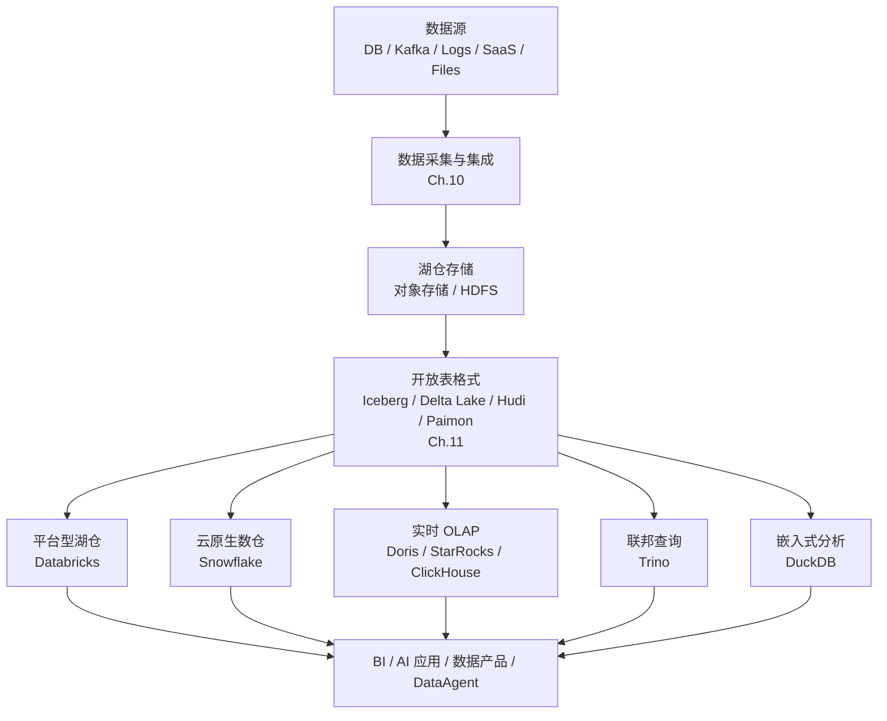

**图 12-1：湖仓引擎在数据基础设施中的位置。** 自上而下是一条数据流：最上游的数据源和最下游的 BI / AI 应用属于平台外部的生产者与消费者，中间的采集集成、湖仓存储、开放表格式和各类引擎是平台内部能力，本章聚焦其中的引擎层。

图 12-1 里从开放表格式向下分出五条引擎路径，这不是“五选一”，而是“同一资产、多种消费方式”。山岚集团的门店销售明细以 Iceberg 落在对象存储后，财务 BI 可能走 Snowflake warehouse 做标准报表，会员运营大屏可能把热点聚合同步到 StarRocks 做秒级刷新，DataAgent 临时跨 MySQL 会员库和 Iceberg 订单表做探索时走 Trino，数据科学家在 Notebook 里用 DuckDB 读抽样 Parquet 做假设验证——底层是同一份湖仓资产，上层按延迟、并发和治理要求选不同引擎。若强行只留一条路径，要么探索分析被报表 SLA 拖慢，要么报表为了迁就联邦查询而成本失控。

### 1.2 核心概念与边界

OLAP，即在线分析处理，关注扫描、过滤、聚合、Join、排序、窗口函数和大结果集计算。它与 OLTP 的差异不是“是否用 SQL”，而是负载模型不同：OLTP 追求短事务、点查、行级更新和高并发写入；OLAP 追求大范围读取、列式压缩、并行执行和交互式分析延迟。

本章讨论的“湖仓引擎”不是一个产品类别，而是一组在湖仓表之上或周边工作的计算系统。Databricks 和 Snowflake 是平台型产品；Doris、StarRocks、ClickHouse 是实时分析数据库；Trino 是分布式 SQL 查询引擎；DuckDB 是进程内分析数据库。它们都能执行分析查询，但系统边界完全不同。

| 概念 | 定义 | 与相邻概念的区别 |
|---|---|---|
| 湖仓表格式 | 管理对象存储上数据文件、元数据、快照、Schema 和事务语义的表层协议 | 解决“数据怎么存、怎么演进、怎么多版本访问”，不直接等于高性能查询引擎 |
| OLAP 引擎 | 面向分析查询优化的计算与执行系统 | 关注扫描、聚合、Join、并行执行和低延迟，不承担所有数据治理职责 |
| MPP 数据库 | 将查询拆分到多节点并行执行的分析数据库 | 通常自带存储或分片副本，区别于只做联邦查询的引擎 |
| 联邦查询引擎 | 通过连接器访问多个数据源并统一执行 SQL | 强在跨源访问，弱在自有存储、物化管理和极致低延迟服务 |
| 云原生数仓 | 以托管服务方式提供计算存储分离、弹性数仓和治理能力 | 强在低运维和企业体验，开放表格式与多引擎共享能力需要逐项确认 |
| 嵌入式分析数据库 | 运行在应用或 Notebook 进程内的分析引擎 | 强在本地分析和文件处理，不适合替代大规模多租户数仓 |

一个现代 OLAP 引擎通常围绕七类能力优化：

1. 列式存储：只读取查询需要的列，降低 I/O。
2. 编码与压缩：利用同一列数据类型相近的特点，减少存储和传输成本。
3. 向量化执行：一次处理一批值，降低逐行解释执行的开销。
4. MPP 并行：把查询拆成 stage、fragment、task 或 pipeline，在多节点并行执行。
5. 优化器：通过统计信息、代价模型和规则改写决定 Join 顺序、谓词下推和聚合策略。
6. 数据跳过：通过 min/max、zone map、稀疏索引、排序键、分区和物化视图减少扫描量。
7. 缓存与冷热分层：在对象存储的低成本和本地 SSD 的低延迟之间做平衡。

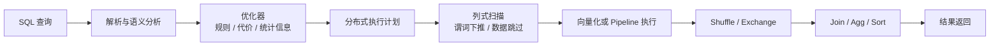

**图 12-2：现代 OLAP 查询执行链路。** 不同产品命名不同，但解析、优化、分布式计划、扫描、交换和聚合是共性。

按链路拆开看，每一环解决的是不同瓶颈。**解析与语义分析**把 SQL 变成逻辑计划，并做权限、类型和表引用校验——DataAgent 生成的 SQL 若在这里失败，通常是表名或列名与 catalog 不一致，而不是执行层慢。**优化器**依赖统计信息决定 Join 顺序、是否下推谓词、能否走物化视图；没有统计信息时，引擎往往退化为全表扫描，这也是“换了更快的引擎仍然慢”的常见根因。**列式扫描与数据跳过**只读需要的列，并通过 min/max、分区裁剪、稀疏索引跳过无关文件——数据布局（Ch.11）在这里直接决定扫描量。**Shuffle / Exchange** 是分布式 Join 和全局聚合的代价中心：中间结果要在节点间重分区，网络与磁盘 spill 往往比本地扫描更贵。**向量化或 Pipeline 执行**则把 CPU 从逐行解释拉回到批量算子，是 OLAP 相对 OLTP 在单核效率上的关键差异。

### 1.3 常见误区

1. 误区一：有了湖仓表格式就不需要数仓或 OLAP 引擎。湖仓表格式提供开放数据资产，查询性能仍取决于执行引擎、数据布局、统计信息、缓存和并发控制。
2. 误区二：所有分析场景都应统一到一个引擎。统一能降低治理复杂度，但会牺牲特定负载的成本或延迟。更现实的做法是统一元数据、权限和血缘，允许多个引擎围绕同一份数据协同。
3. 误区三：选型只看基准测试排行榜。基准测试只能说明某类数据和查询下的表现，不能替代对写入模式、并发、数据新鲜度、权限、运维能力和云成本的评估。
4. 误区四：联邦查询可以替代数据建模。联邦查询适合探索和跨源访问，但复杂报表、高并发服务和核心指标仍需要建模、预计算、物化视图或服务化宽表。

以山岚集团为例：DataAgent 可以用 Trino 临时 `JOIN` 门店 Iceberg 明细和 MySQL 促销配置表做一次性分析，但 CFO 每日看的“同店同比”不应每天现场跨源 Join——正确做法是在语义层定义指标，由 StarRocks 物化视图或 Snowflake 汇总表在服务层预计算。联邦查询解决“能不能问到”，建模解决“能不能稳定、便宜、可治理地问到”。

---

## L2 架构  〔约 40% 篇幅〕

### 2.1 在平台中的位置

在企业 Agent 平台里，湖仓引擎不是孤立的数据工具，而是 DataAgent、语义层、评估平台和业务系统共同依赖的数据服务层。它位于湖仓表格式之上、语义层和应用查询之下，承担三项职责：为不同工作负载选择合适执行引擎；把权限、审计、成本和查询状态纳入平台治理；将查询结果交给 BI、DataAgent、RAG 数据准备或业务应用。

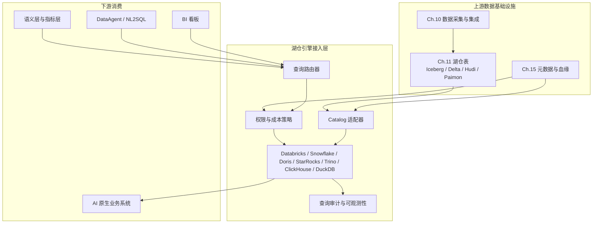

**图 12-3：湖仓引擎接入层在 Agent 平台中的位置。** 本章不要求平台在 v0.1 实现真实查询代理，但要求架构上预留路由、权限、审计和成本控制边界。

图 12-3 把接入层拆成五个组件，各自对应一类平台风险。**查询路由器**回答“这次查询该进哪个引擎”，依据是工作负载标签、延迟预算和数据集位置，而不是让 BI 和 DataAgent 各自维护连接串。**策略控制器**在路由之前做权限、行列级脱敏和成本预算校验——Agent 连续发起查询时，这里必须能拒绝超预算的全表扫描，而不是等引擎跑完再记账。**Catalog 适配器**把 Ch.15 的统一元数据映射成各引擎的 catalog / schema / table 名，并携带表格式快照 ID；多引擎协同时，这是避免“同名不同表、同表不同快照”的唯一稳定边界。**执行适配器**屏蔽各引擎协议差异（JDBC、REST、Native），上层只认统一的 query_id 和 result_ref。**可观测性采集器**把一次查询的用户、引擎、扫描量、耗时和血缘写入审计链路，供成本归因和 DataAgent 失败解释使用。山岚集团若让财务分析师和会员 DataAgent 共用同一接入层，即使底层同时存在 StarRocks 和 Trino，平台侧也只暴露一个受控入口。

产品层面可以按系统边界分为四组。

| 类型 | 代表产品 | 核心特征 | 典型场景 |
|---|---|---|---|
| 平台型湖仓与云数仓 | Databricks、Snowflake | 托管体验、治理能力、弹性计算和企业生态 | 统一数据平台、企业 BI、AI/ML、数据共享 |
| 实时 OLAP 数据库 | Apache Doris、StarRocks、ClickHouse | MPP、列存、向量化、低延迟聚合 | 实时报表、用户行为、日志分析、运营大屏 |
| 联邦查询引擎 | Trino | 连接器生态、无自有存储、分布式 SQL | 跨源查询、数据虚拟化、开放湖仓入口 |
| 嵌入式分析引擎 | DuckDB | 进程内、零运维、直接读文件、向量化 | Notebook、本地分析、轻量 ETL、单机数据应用 |

#### Databricks：以 Spark、Photon 与 Unity Catalog 为中心的平台路线

Databricks 的定位不是单点 OLAP 数据库，而是围绕湖仓构建的数据与 AI 平台。官方参考架构将湖仓组织为 Source、Ingest、Transform、Query/Process、Serve、Analysis、Storage 等泳道，底层通常使用云对象存储，转换和查询由 Apache Spark 与 Photon 支撑，治理由 Unity Catalog 统一管理。Databricks 官方文档还说明，Unity Catalog 可作为数据与 AI 治理中心，覆盖表、卷、特征和模型等资产，并支持运行时血缘采集。


**图 12-4：Databricks 官方 Lakehouse 参考架构。** 来源：[Databricks Lakehouse reference architectures](https://docs.databricks.com/aws/en/lakehouse-architecture/reference)。图片用于展示官方泳道式端到端视角，本文架构解读以官方页面为准。

架构中的泳道式划分，核心是把**写入路径、转换路径、服务路径**分开治理。**Source / Ingest** 负责把 ERP、POS、Kafka 等源数据落到对象存储；**Transform** 由 Spark 批流一体作业完成清洗、建模和特征加工，Photon 在这里加速 SQL/DataFrame 算子；**Query / Process** 承接交互式 SQL 和 ad-hoc 分析；**Serve** 面向 BI 仪表盘、模型推理特征和在线数据产品；**Storage** 统一承载 Delta 或开放格式文件；**Analysis** 覆盖 ML 实验与模型注册。Unity Catalog 横切这些泳道，统一管理表、卷、特征和模型的权限与血缘。对山岚集团而言，若同一平台既要跑 nightly 供应链宽表加工，又要服务门店 AI 补货模型和 CFO 周报，Databricks 的价值在于“一条平台链路覆盖工程 + 分析 + AI”，而不是单点 SQL 加速。代价是：只为一个固定看板引入整套平台，运维和 license 成本往往高于 Doris / StarRocks 这类专用 OLAP。

#### Snowflake：云原生数仓的计算存储分离范式

Snowflake 代表云原生数仓路线。官方文档将其架构分为 Database Storage、Compute、Cloud Services 三层，并明确说明其架构结合 shared-disk 的集中数据管理和 shared-nothing 的 MPP 查询处理。数据加载进 Snowflake 表后，会被重组为内部优化的压缩列式格式并存储在云存储中。


**图 12-5：Snowflake 官方架构概览。** 来源：[Snowflake key concepts and architecture](https://docs.snowflake.com/en/user-guide/intro-key-concepts)。图片体现 Storage、Compute、Cloud Services 三层边界。

Snowflake 的三层分工可以这样理解。**Database Storage** 是所有租户共享的逻辑数据层：数据以内部列式格式落在云存储上，多个 Virtual Warehouse 读同一份存储，这就是 shared-disk——存储只写一份，避免各团队各自复制。**Compute** 由一组可独立启停的 Virtual Warehouse 构成，每个 warehouse 是一组 MPP 节点，查询在 warehouse 内 shared-nothing 并行，warehouse 之间资源隔离——山岚集团可以把“财务月结”和“会员日报”分到不同 warehouse，避免大查询互相抢 CPU。**Cloud Services** 是无状态控制面，负责认证、元数据、优化器、事务协调和查询调度，本身不参与重计算。这种“集中存储 + 分布式计算 + 独立控制面”的组合，使 Snowflake 在“少运维、弹性扩缩、多租户隔离”上体验很好；但若核心诉求是毫秒级高并发明细聚合，仍常需要 Doris / StarRocks / ClickHouse 做补充加速层。

#### Apache Doris：数据库化体验的实时 OLAP

Apache Doris 的经典架构由 FE 和 BE 组成：FE 负责 MySQL 协议接入、SQL 解析、元数据、权限、查询规划和调度；BE 负责列式存储、Tablet 分片、副本和查询执行。官方文档同时描述了存算一体和存算分离两种架构，后者增加 Meta Service，将元数据、计算和共享存储分层。


**图 12-6：Apache Doris 官方存算一体架构。** 来源：[Apache Doris System Architecture](https://doris.apache.org/docs/dev/features-architecture/system-architecture/)。图片用于展示 FE/BE 的官方组件边界。

Doris 采用经典的 FE / BE 分离，背后是把**控制面**和**数据面**拆开扩展。FE 集群通常包含三类角色：**Master FE** 负责元数据写入与集群协调——建表、删表、副本修复、导入事务提交等 DDL/DML 控制流只经由 Master 落盘，保证全局 catalog 一致；**Follower FE** 持有元数据副本，参与 Master 选举，也可承接只读查询和元数据读取，Master 故障时可选举出新 Master；**Observer FE** 只同步元数据、不参与选举，专门用来分担高并发 SQL 的连接与解析压力，适合 BI 峰值时段横向加 FE 而不影响选主逻辑。客户端走 MySQL 协议连任意 FE，由 FE 完成 SQL 解析、CBO 优化和 fragment 调度，再把执行计划下发给 BE。**BE（Backend）** 负责本地列存、Tablet 分片、多副本和实际扫描聚合；一个 Tablet 是表的一个水平分片，多副本分布在不同 BE 上，查询时 FE 按副本健康度和 locality 选路。存算一体模式下，BE 本地磁盘即主存储，延迟低、布局可控；存算分离模式则引入 Meta Service，把 Tablet 元数据和对象存储上的数据文件分离，计算节点可独立扩缩——适合山岚集团促销季临时加 BE/CN 扛流量、淡季缩容省成本。若只部署一个 FE，它是单点；生产环境至少 1 Master + 2 Follower，Observer 按连接数弹性添加。

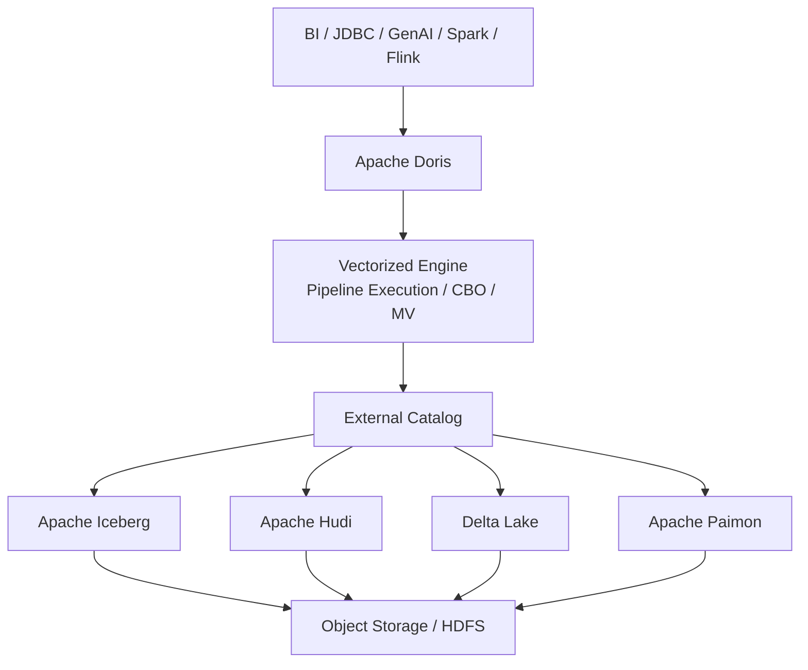

**图 12-7：Doris 作为湖仓查询加速层。** 该图表达一个核心判断：Doris 不只可以使用自有存储，也可以通过外部 catalog 查询开放湖仓表。

该流程描述的是 Doris 的**双模式消费**。**内置表**路径下，数据通过 Stream Load、Routine Load 或 Flink 写入 Doris 本地 Tablet，适合已明确的热点指标和秒级看板——山岚集团“当日门店 GMV Top 50”若每天被数百个 BI 会话并发访问，把聚合结果物化在 Doris 内表通常比每次扫 Iceberg 源表更稳。**External Catalog** 路径下，Doris 不搬数据，而是通过 Hive Metastore / Glue / REST catalog 读取 Iceberg、Hudi、Paimon 等湖仓表的元数据和 Parquet/ORC 文件位置，由向量化引擎直接扫描对象存储。这条路径的优势是“一份湖仓资产、零复制接入”；代价是首次查询或缓存未命中时，延迟和 scan 成本受对象存储 I/O 制约。工程上常见做法是：冷数据、探索查询走 catalog 外表；经过验证的高频报表再同步或物化到 Doris 内表，而不是“所有 SQL 都直接打湖”。


**图 12-8：Apache Doris 官方湖仓一体概览。** 来源：[Apache Doris Lakehouse Overview](https://doris.apache.org/docs/4.x/lakehouse/lakehouse-overview/)。

#### StarRocks：面向极速分析的 MPP 数据库

StarRocks 的官方架构同样强调简单组件边界：FE 负责元数据管理、客户端连接、查询规划和调度；后端节点分为 BE 和 CN，BE 用于 shared-nothing 架构，负责本地存储与计算；CN 用于 shared-data 架构，只负责计算和缓存，数据存放在对象存储或 HDFS。官方文档说明 StarRocks 不依赖外部组件，支持横向扩容，并兼容 MySQL 协议。


**图 12-9：StarRocks 官方架构选择。** 来源：[StarRocks Architecture](https://docs.starrocks.io/docs/introduction/Architecture/)。该图展示 shared-nothing 与 shared-data 两类部署模式。

StarRocks 的 FE 层与 Doris 类似，也区分 **Leader FE** 与 **Follower FE**：Leader 负责元数据变更和调度，Follower 同步元数据并可分担查询规划；Follower 数量通常为偶数，以便 BDB 类协议选举 Leader。后端则按部署模式二选一。**BE（Backend）** 在 shared-nothing 模式下同时持有本地列存和计算能力，Tablet 多副本分布在 BE 集群中，查询尽量在本地完成扫描以减少网络 shuffle——适合山岚集团会员行为明细的固定维度聚合，延迟可预测。**CN（Compute Node）** 在 shared-data 模式下不持久化主数据，Tablet 元数据和数据文件放在对象存储，CN 只负责执行和本地缓存；扩 CN 即可扛促销高峰的并发 BI，而不必复制整份存储。shared-nothing 换更低延迟和更强本地优化，shared-data 换存储成本和弹性；许多企业会先 shared-nothing 跑核心看板，再把冷历史或湖仓加速层迁到 shared-data。

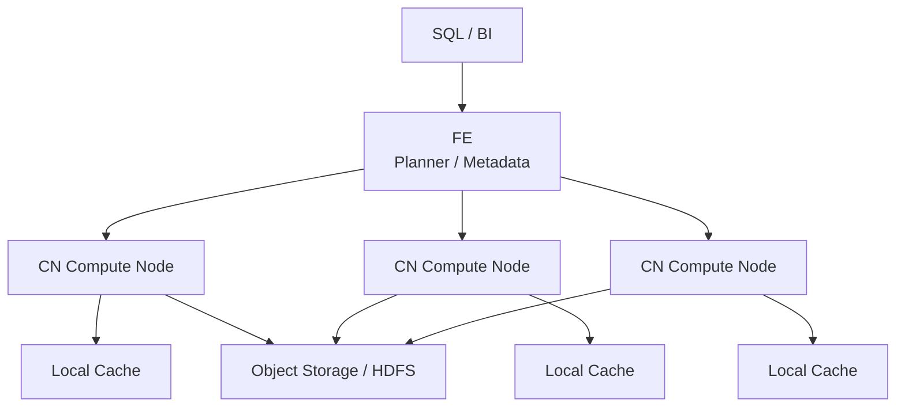

**图 12-10：StarRocks shared-data 架构抽象。** shared-data 将主数据放在对象存储或 HDFS，计算节点保留本地缓存，适合云上弹性和资源隔离。

流程中三个 CN 各自维护 **Local Cache**，这是 shared-data 能否接近 shared-nothing 延迟的关键。首次查询某 Tablet 时，CN 从对象存储拉取 Parquet/ORC 块并写入本地 SSD 缓存；后续相同分区、相同快照的查询可直接命中缓存，避免重复远端 I/O。FE 在规划时会尽量把同一 Tablet 的 scan 调度到已有缓存的 CN 上（cache affinity）。若缓存容量不足，会出现“性能抖动”——同一 SQL 有时 200ms、有时 2s——因此生产环境需要按热分区大小规划 CN 本地盘，并对核心看板使用物化视图或预聚合把 scan 范围固定下来。山岚集团若把 Iceberg 历史订单放在 S3、仅用 StarRocks 做查询加速，必须接受“冷启动慢、热查询快”的两段式 SLA，而不是用 Trino 或 StarRocks 直接替代已物化好的内表看板。

#### Trino：SQL on Everything 的联邦查询入口

Trino 是分布式 SQL 查询引擎，不是传统意义上的数据库。官方概念文档说明，一个 Trino 集群由 coordinator 和 workers 组成，用户连接 coordinator 提交查询，coordinator 负责解析、规划和管理 worker；worker 从 connector 拉取数据并交换中间结果。Trino 通过 catalog 和 connector 访问 Hive、Iceberg、Delta Lake、Hudi、MySQL、PostgreSQL、Kafka、ClickHouse、Snowflake 等数据源。

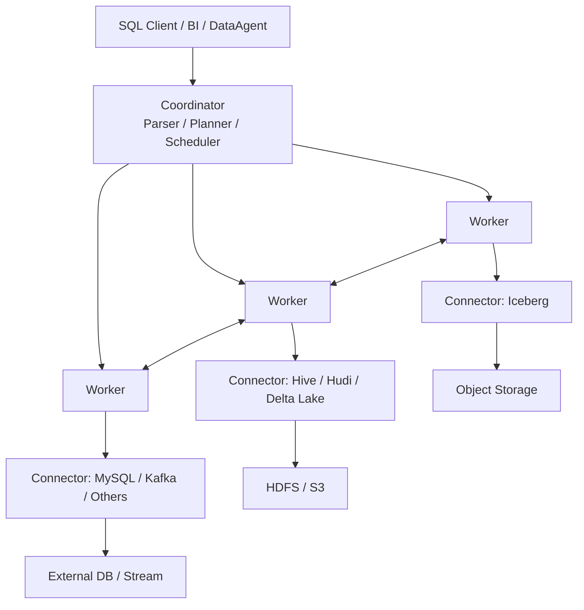

**图 12-11：Trino 联邦查询架构抽象。** Trino 官方文档没有稳定的总览图片可直接复用，本图依据 [Trino concepts](https://trino.io/docs/current/overview/concepts.html) 的 coordinator、worker、connector 和 catalog 概念绘制。

Trino 集群里通常只有**一个 active Coordinator**（可配 standby 做 HA，但查询调度仍由 leader 负责）。Coordinator 接收 SQL 后完成解析、全局优化、stage 切分和 worker 调度，本身不读大表数据——若把重 scan 放在 Coordinator 上，整个集群会被单点拖垮。**Worker** 是无状态执行节点，通过 Connector 从 Iceberg、MySQL、Kafka 等源拉取 splits，在本地执行 filter/project/agg，再通过 Exchange 把中间结果 shuffle 给其他 worker。Connector 按 catalog 隔离：一个 Trino 实例可同时挂载 `iceberg` catalog 和 `mysql` catalog，SQL 里写 `iceberg.mart.orders JOIN mysql.member.profile` 即可跨源——这正是 DataAgent 早期“一个 SQL 入口探全库”的理想形态。但要警惕：跨源 Join 意味着两个 Connector 各自拉数据到 Trino 内存再 Join，成本和延迟都不可控，山岚集团应把 Trino 限定在探索、低频和已审批的联邦场景，而不是替代 StarRocks 上的固定报表。

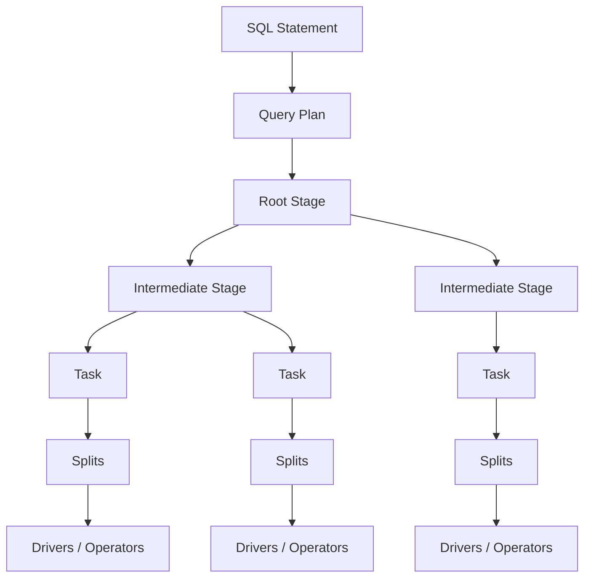

**图 12-12：Trino stage-task-split-driver 执行模型。** Trino 官方文档对这些概念有明确解释：stage 是分布式计划片段，task 是 worker 上执行 stage 的实体，split 是数据切分，driver 是最低层并行执行单元。

这四层是 Trino 把“一条 SQL”拆成“可并行执行单元”的粒度链。**Stage** 是有 shuffle 边界的逻辑阶段：例如 scan 阶段只读源表，join 阶段消费两侧 stage 的输出；stage 之间通过 Exchange 连接。**Task** 是某个 stage 在某个 worker 上的一份实例——同一个 stage 会在多个 worker 上各有一个 task，并行处理不同数据分片。**Split** 是数据源侧的最小可读单元，例如 Iceberg 的一个 file split 或 MySQL 的一段主键范围；worker 从 split 队列领取工作。**Driver** 是在单个 task 内对单个 split 执行算子链的线程级执行单元，一个 task 可跑多个 driver 以提高 CPU 利用率。理解这条链有助于诊断 Trino 慢查询：若 stage 卡在 Exchange，多半是 shuffle 过大；若 split 数极少，可能是分区过滤没下推；若 driver 空闲，可能是 Coordinator 调度或源端 I/O 瓶颈。

#### ClickHouse：极致列式分析性能

ClickHouse 是高性能列式 OLAP 数据库。ClickHouse 官方架构概览将系统分为 query processing layer、storage layer、integration layer，并说明 access layer 负责多协议会话通信，另有线程、缓存、RBAC、备份和监控等横切能力。其 VLDB 2024 架构论文页面强调 ClickHouse 面向高摄取率、大规模数据集、并发查询和实时延迟，执行层采用向量化查询执行，并通过剪枝技术减少无关数据扫描。

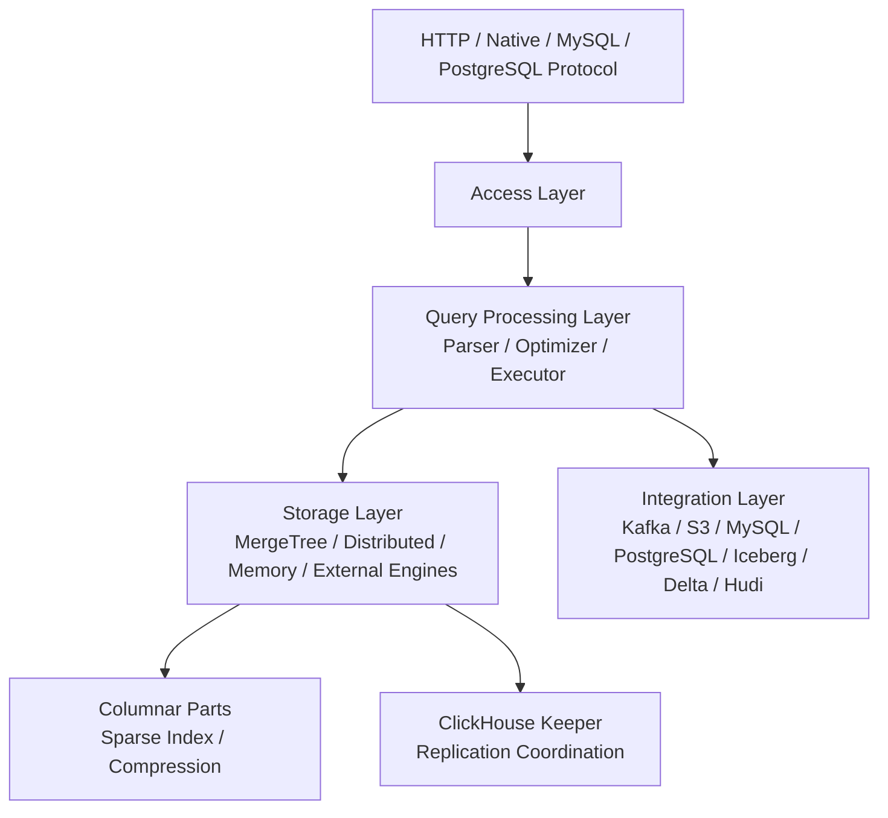

**图 12-13：ClickHouse 高层架构抽象。** 本图依据 [ClickHouse Architecture overview](https://clickhouse.com/docs/academic_overview) 绘制，核心是查询处理层、存储层和集成层三层边界。

ClickHouse 把职责拆成三层加一组横切能力。**Access Layer** 接受 HTTP、Native、MySQL 兼容等多种协议，负责会话、认证和查询提交——同一集群可同时服务 BI 工具和应用程序。**Query Processing Layer** 包含 parser、optimizer 和向量化 executor；ClickHouse 的 optimizer 相对轻量，更多依赖表引擎设计和排序键把 scan 范围压小。**Storage Layer** 以 MergeTree 家族为核心，数据按 part 组织，**ClickHouse Keeper**（或 ZooKeeper）协调副本 leader 选举和 replication log，保证 Distributed 表跨 shard 写入一致。**Integration Layer** 则通过 Kafka 引擎、S3 表函数、Iceberg/Delta 外表等把摄取和分析接进同一条 SQL 链路。与 Doris / StarRocks 的 FE/BE 相比，ClickHouse 更强调“表引擎 + 排序键 + 物化视图”的建模驱动优化：架构组件不多，但表设计错了性能差距极大。山岚集团的埋点日志、工厂质检时序和广告曝光事件，若写入模式是 append-only、查询模式是窄过滤 + 大聚合，ClickHouse 往往比通用数仓更省成本。

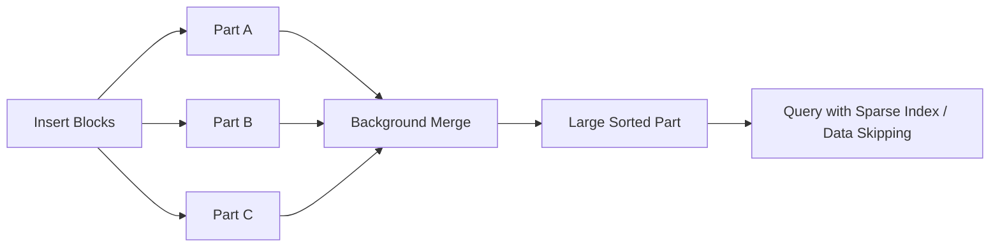

**图 12-14：ClickHouse MergeTree 数据组织抽象。** MergeTree 将表数据拆成按主键排序的 parts，并在后台持续 merge；稀疏索引和数据跳过能力直接影响查询性能。

MergeTree 的设计逻辑是“**写入时拆、查询时跳、后台再并**”。每次 bulk insert 产生新的 part（Part A/B/C），part 内数据按 **ORDER BY** 排序键有序存放；后台 merge 线程把多个小 part 合并成大 part，减少文件数和元数据开销。查询时，引擎用**稀疏索引**（每 N 行一个索引条目）定位可能相关的 granule，再对 granule 做 min/max 等数据跳过——若 WHERE 条件与排序键前缀对齐，scan 量可下降一个数量级；若查询列与排序键完全无关，则退化为宽 scan。山岚集团若用 ClickHouse 存会员点击流，常见建模是 `(event_date, app_id)` 分区、`(user_id, event_time)` 排序，这样“某用户最近 7 天行为”可高效跳过无关分区与 granule；若把高基数 UUID 放在排序键首位而无过滤，稀疏索引几乎失效。MergeTree 不是免费午餐：过多小 part 会拖慢 merge 和查询，需要监控 part 数量和 merge 队列。

#### DuckDB：把 OLAP 放进进程内

DuckDB 是嵌入式分析数据库。官方介绍将其类比为采用简单安装和进程内操作思想的分析数据库，并说明它不作为独立服务进程运行，而是嵌入宿主进程。DuckDB 官方执行格式文档说明，执行时用 Vector 表示内存中的单列数据，用 DataChunk 表示多个 Vector 的集合；它采用向量化查询执行模型，默认 STANDARD_VECTOR_SIZE 为 2048 tuples。

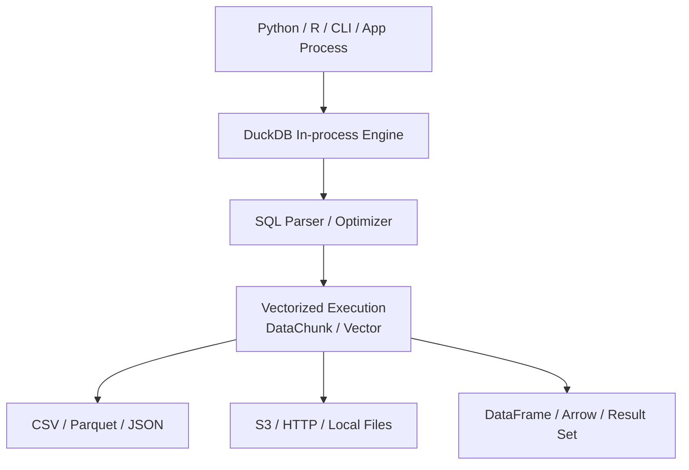

**图 12-15：DuckDB 嵌入式分析架构抽象。** 本图依据 [DuckDB Why DuckDB](https://duckdb.org/why_duckdb) 和 [DuckDB Execution Format](https://duckdb.org/docs/current/internals/vector.html) 绘制。

DuckDB 与前面六类引擎的根本差异是**没有独立 server 进程**：引擎库嵌入 Python、R、Java 或 CLI 进程，SQL 在应用内存空间内解析和执行。好处是零部署、零网络 hop、直接读本地 Parquet/CSV 或通过 httpfs 读 S3 对象——数据科学家在 Notebook 里 `import duckdb; duckdb.sql("SELECT ... FROM 's3://.../*.parquet'")` 即可，无需申请集群资源。代价是没有多租户隔离、没有集群级资源队列、也不适合数百并发 BI 会话：所有查询共享同一进程的 CPU 和内存。山岚集团适合用 DuckDB 做三类事：一是对 Iceberg 表抽样做 ad-hoc 验证；二是在 CI 或小样本上跑指标口径回归；三是嵌入式场景（如门店离线诊断工具）在边缘设备本地分析。任何 DuckDB 结论若要进入生产看板，必须回到 Ch.15 语义层和受治理引擎复现。

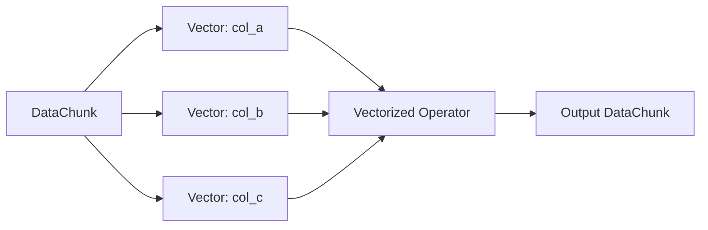

**图 12-16：DuckDB DataChunk 与 Vector 执行抽象。** DuckDB 官方文档还展示了 Flat Vector、Constant Vector、Dictionary Vector 等不同 Vector 物理表示。

DataChunk 是一次向量化批处理的固定大小容器（默认 2048 行），每列是一个 **Vector**。算子（filter、hash join、aggregate）以 Vector 为单位批量执行，CPU 缓存友好且便于 SIMD。DuckDB 还为同一逻辑列维护多种 Vector 物理表示：**Constant Vector** 表示整列同一值（如 `WHERE country = 'CN'` 后的字面量列），**Dictionary Vector** 表示低基数枚举的压缩存储——这在日志分析里常见。理解这一层有助于解释“为什么 DuckDB 读本地 Parquet 常常比 Pandas 逐行循环快”：不是 SQL 魔法，而是列式批处理减少了 Python 解释器开销。但它也解释了 DuckDB 的上限：超大 shuffle 或超过单机内存的 Join 会 spill 到磁盘或直接 OOM，无法像 Trino / StarRocks 那样横向加节点。

#### 七类引擎的架构分野

横向对比是本章的主线，应放在 L2 架构层来看。原因是企业选型不是逐个产品背参数，而是识别产品背后的系统边界：平台型、数据库型、查询引擎型、嵌入式型。

| 产品 | 产品定位 | 是否自带存储 | 是否分布式 | 湖仓开放性 | 典型优势 |
|---|---|---:|---:|---|---|
| Databricks | 湖仓 + 数据/AI 平台 | 依赖云存储 + Delta/开放格式 | 是 | 强 | 数据工程、AI/ML、治理、平台化 |
| Snowflake | 云原生数据仓库 | 托管存储 | 是 | 中到强，取决于 Iceberg/外表能力 | SQL 数仓、弹性、易用、数据共享 |
| Doris | 实时 OLAP 数据库 | 是，也可查湖仓外表 | 是 | 增强中 | 实时报表、高并发聚合、MySQL 生态 |
| StarRocks | 极速 MPP OLAP 数据库 | 是，也支持 shared-data | 是 | 强化中 | 高性能 BI、物化视图、湖仓加速 |
| Trino | 联邦 SQL 查询引擎 | 否 | 是 | 很强 | 多源查询、开放湖仓统一入口 |
| ClickHouse | 高性能列式 OLAP 数据库 | 是，也可接外部数据 | 是 | 增强中 | 日志/事件/时序/大宽表极速分析 |
| DuckDB | 嵌入式单机 OLAP | 本地文件/内嵌存储 | 否 | 强 | 本地分析、Notebook、轻量 ETL |

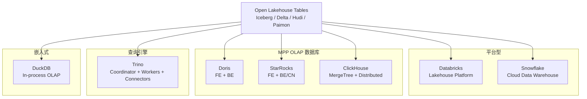

**图 12-17：湖仓与 OLAP 引擎的架构模式分布。** 同样都能查数据，它们的“系统边界”完全不同。

这里把七种产品归入四种架构模式，选型时应先问“我需要哪种边界”，而不是先问 benchmark 分数。**平台型**（Databricks、Snowflake）卖的是端到端治理和托管体验，适合作为企业级主平台。**MPP OLAP 数据库**（Doris、StarRocks、ClickHouse）卖的是低延迟服务化查询，适合承接从平台型引擎分流出来的热点负载。**联邦查询引擎**（Trino）卖的是连接能力，适合虚拟化和探索。**嵌入式**（DuckDB）卖的是零运维本地分析。同一张 Iceberg 表可以同时出现在图的五条边里——这正是开放表格式的意义——但企业必须为每条边准备不同的 SLA、成本模型和运维 playbook。

| 优化方向 | Databricks | Snowflake | Doris | StarRocks | Trino | ClickHouse | DuckDB |
|---|---|---|---|---|---|---|---|
| 列式存储 | Delta/Parquet | 内部列式格式 | 内置列存 | 内置列存 | 依赖数据源 | MergeTree 列存 | 内置/文件列式 |
| 向量化执行 | Photon/Spark | 托管引擎内部实现 | 支持 | 支持 | 部分依赖实现 | 支持 | 核心机制 |
| MPP | 支持 | 支持 | 支持 | 支持 | 支持 | 支持 | 不支持分布式 |
| 物化视图 | 支持 | 支持 | 强 | 强 | 非核心 | 支持 | 有限 |
| 联邦查询 | 支持 federation | 支持外部表/连接 | 支持外部 catalog | 支持外部 catalog | 核心能力 | 支持外部引擎 | 支持读外部文件 |
| Serverless | 强 | 强 | 取决于发行版/云服务 | 取决于发行版/云服务 | 通常自建/托管 | ClickHouse Cloud | 本地嵌入式 |

上表横向看“能力有无”，纵向看“能力落在哪一层”。例如 **联邦查询** 对 Trino 是核心，对 ClickHouse 是集成层能力；**物化视图** 对 Doris / StarRocks 是生产报表标配，对 Trino 则非核心——这意味着“Trino 上跑通的 SQL”未必能原样搬到 StarRocks 做 SLA 保障，迁移时要重评估预计算和服务化路径。**Serverless** 对 Snowflake / Databricks 是产品原生体验，对 Trino 通常意味着托管 Trino 服务而非引擎自带——成本模型从“租 warehouse”变成“租 worker 集群”，预算方式不同。

### 2.2 组件划分与接口契约

平台化接入湖仓引擎时，不建议让 DataAgent、BI 工具或业务系统直接裸连所有引擎。更稳妥的做法是在平台侧保留轻量查询接入层，统一处理路由、权限、审计、成本和超时。

| 组件 | 职责 | 输入 | 输出 | 失败模式 |
|---|---|---|---|---|
| 查询路由器 | 根据负载、数据源、延迟目标和成本策略选择引擎 | 查询意图、SQL、用户、工作负载标签 | 引擎选择、查询提交请求 | 路由规则过期、误把低延迟查询路由到慢引擎 |
| Catalog 适配器 | 把平台数据资产映射到各引擎 catalog、schema、table | 元数据、权限、表格式、连接参数 | 引擎可识别的数据源定义 | 元数据漂移、表快照不一致、凭证失效 |
| 策略控制器 | 执行权限、行列级策略、查询预算、并发限制 | 用户身份、角色、数据分级、成本预算 | 允许、拒绝或降级策略 | 权限漏放、预算失控、策略冲突 |
| 执行适配器 | 适配 Databricks、Snowflake、Doris、StarRocks、Trino、ClickHouse、DuckDB | 查询请求、连接信息、超时参数 | 查询状态、结果句柄、错误码 | 连接池耗尽、查询超时、引擎不可用 |
| 可观测性采集器 | 记录查询耗时、扫描量、费用、错误和血缘 | 查询生命周期事件 | Trace、Metrics、审计日志 | 日志缺失、成本归因失败、链路无法追踪 |

接口契约示例：

```text
POST /api/lakehouse/query
Request:
{
  "principal": "user:finance_analyst_01",
  "workload": "realtime_bi",
  "sql": "select city, sum(amount) from mart.sales group by city",
  "latency_budget_ms": 3000,
  "cost_budget": "low",
  "result_mode": "preview"
}

Response:
{
  "query_id": "q_20260603_001",
  "engine": "StarRocks",
  "state": "submitted",
  "result_ref": "lakehouse-results/q_20260603_001"
}

Errors:
{
  "code": "POLICY_DENIED | ENGINE_UNAVAILABLE | QUERY_TIMEOUT | COST_BUDGET_EXCEEDED",
  "reason": "...",
  "retryable": true
}
```

这个接口不是要求所有企业都自研查询网关，而是表达平台边界：用户和 Agent 提交的是“受控查询请求”，不是绕过权限和成本治理的裸 SQL。

以上述请求为例逐项解读：`principal` 标识调用方身份，供策略控制器做行列级权限和预算归属；`workload: realtime_bi` 告诉路由器这是高并发看板类负载，应优先 StarRocks 而非 Trino；`sql` 是待执行语句，生产环境通常还会附带 SQL 摘要 hash 用于审计去重；`latency_budget_ms: 3000` 是调用方 SLA，路由器会取 min(平台策略, 调用方预算) 作为生效超时；`cost_budget: low` 触发扫描量预估，若 `mart.sales` 全表超过 200GB 阈值则直接拒绝；`result_mode: preview` 表示只返回前 N 行或采样，避免 Agent 把大结果集拉进 LLM 上下文。响应里的 `engine` 和 `query_id` 供后续轮询与 Trace 关联；`result_ref` 指向对象存储上的结果文件，DataAgent 再按需读取解释——这与图 12-19 时序中“不内联返回大结果”的设计一致。

### 2.3 状态机 / 时序 / 失败模式

湖仓引擎接入层至少需要跟踪一次查询从提交到结束的状态。状态机越清晰，越容易做超时、取消、重试、审计和成本归因。

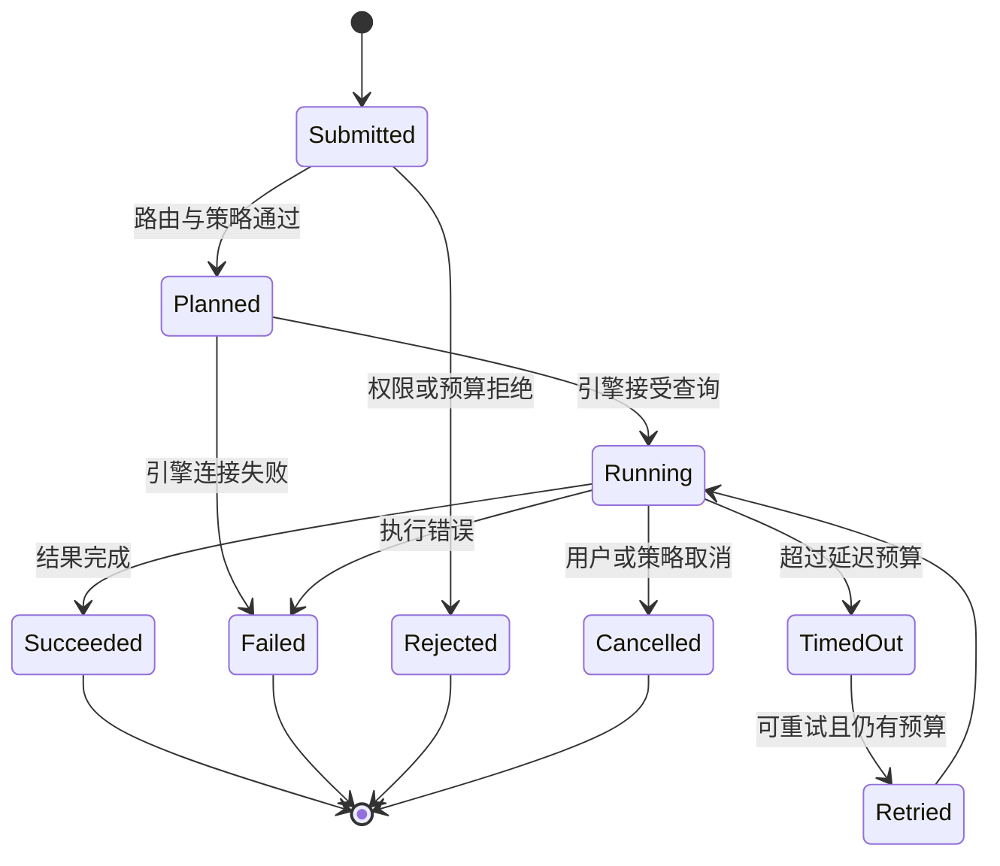

**图 12-18：湖仓查询状态机。** 对 DataAgent 尤其重要，因为 Agent 可能连续发起多次查询，必须知道失败是权限问题、超时问题还是路由问题。

状态机里几个分支值得单独说明。**Submitted → Rejected** 发生在策略层，Agent 应停止重试并改写意图（例如缩小时间范围），而不是换引擎裸试。**Running → TimedOut → Retried** 表示在预算内可重试一次——通常换更窄过滤或降级到预聚合表，而不是原样重跑。**Running → Cancelled** 常见于用户中断或 Agent 多步推理中前序步骤已得出否定结论，接入层应主动 cancel 引擎侧查询释放资源。DataAgent 若只看“查询失败”而不区分 `Rejected` / `TimedOut` / `Failed`，容易陷入无效重试循环，这也是 Ch.34 NL2SQL 工程化里必须把引擎错误码映射到 Agent 工具语义的原因。

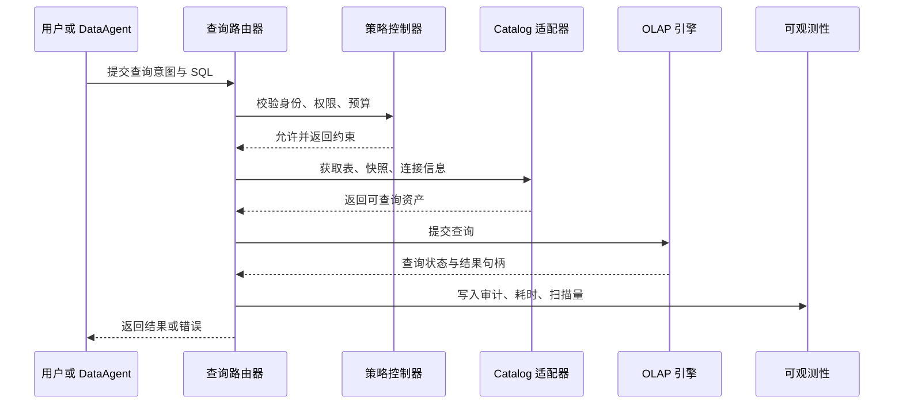

**图 12-19：一次受控湖仓查询的时序。** 实际工程中，结果通常不会直接内联返回，而是返回结果句柄、分页游标或对象存储位置。

时序图里 **Catalog 适配器在 Policy 之后、Engine 之前** 被调用，顺序不能颠倒：先确认“谁可以查”，再解析“查哪张表、哪个快照”。Catalog 返回的不只是 JDBC URL，还包括 Iceberg snapshot id、分区裁剪 hint 和引擎特有 session 参数。Router 提交 Engine 后拿到的是**结果句柄**而非完整结果集——山岚集团一次 `GROUP BY city` 可能返回几千行，DataAgent 只需 preview 前 20 行做自然语言总结，其余落对象存储供 BI 下载。Observe 步骤异步写入审计，不阻塞用户首字节时间。若 Engine 执行 30s 而 Observe 写日志失败，查询仍算成功，但平台必须告警——否则成本归因和合规审计会出现空洞。

失败模式与恢复策略：

| 失败模式 | 触发条件 | 恢复策略 |
|---|---|---|
| 元数据漂移 | 表已演进，但引擎 catalog 缓存未刷新 | 刷新 catalog，记录快照 ID，必要时按旧快照重放 |
| 查询超时 | 扫描量过大、Join 顺序差、缓存未命中 | 中止查询，建议改写 SQL、增加过滤条件、走物化视图或换引擎 |
| 权限不一致 | 平台策略与引擎内部权限未同步 | 平台侧拒绝优先，定期对账权限和行列级策略 |
| 成本失控 | 临时查询扫描全表或跨源 Join 爆炸 | 预估扫描量，设置 per-user 和 per-workload 预算，超预算拒绝 |
| 写读快照不一致 | 流式写入、compaction 或表格式提交正在发生 | 读取固定快照，等待提交完成，或为看板使用已发布数据集 |
| 热点看板击穿 | 多用户同时请求同一慢查询 | 结果缓存、物化视图、查询合并和限流 |
| 引擎不可用 | 集群故障、云服务异常、连接池耗尽 | 降级到备用引擎或返回可解释错误，不自动绕过权限 |

### 2.4 设计取舍

**取舍 1：单引擎统一 vs 多引擎协同**

| 方案 | 优势 | 代价 | 适用场景 | mini-platform 选择 |
|---|---|---|---|---|
| 单引擎统一 | 治理简单、运维集中、用户体验一致 | 容易在特定负载上性能或成本不优 | 组织规模较小、负载单一、平台团队早期 | 可作为初始策略 |
| 多引擎协同 | 可按负载选择成本和性能最优解 | 路由、权限、审计和数据一致性复杂 | 多团队、多负载、既有系统复杂 | 默认建模方式 |

**取舍 2：平台型湖仓 vs 实时 OLAP 数据库**

| 方案 | 优势 | 代价 | 适用场景 | mini-platform 选择 |
|---|---|---|---|---|
| Databricks / Snowflake | 托管治理、生态完整、工程与分析统一 | 单点查询加速不一定最便宜，平台学习成本较高 | 统一数据平台、AI/ML、企业 BI、数据共享 | 作为平台级候选 |
| Doris / StarRocks / ClickHouse | 低延迟、高并发、报表和事件分析能力强 | 数据建模、集群治理和冷热分层要求高 | 实时数仓、行为分析、日志分析、看板服务 | 作为实时分析候选 |

**取舍 3：自带存储 vs 开放湖仓外表**

| 方案 | 优势 | 代价 | 适用场景 | mini-platform 选择 |
|---|---|---|---|---|
| 自带存储 | 本地数据布局可控、低延迟、索引和物化优化强 | 数据复制、同步和存储成本增加 | 核心指标看板、服务化宽表、热点数据 | 热点数据可选 |
| 开放湖仓外表 | 数据不搬迁、多引擎共享、治理边界清晰 | 远端 I/O 和缓存未命中会影响延迟 | 探索分析、冷数据、统一湖仓访问 | 默认保持开放 |

**取舍 4：联邦查询 vs 预建数据集**

| 方案 | 优势 | 代价 | 适用场景 | mini-platform 选择 |
|---|---|---|---|---|
| Trino 联邦查询 | 快速跨源探索，不必先搬数 | 跨源 Join 成本和稳定性难预测 | 数据探索、临时分析、低频查询 | 作为探索入口 |
| 预建数据集或物化视图 | 延迟稳定、成本可控、权限清晰 | 需要建模、调度和维护 | 高频报表、DataAgent 常用指标 | 作为生产路径 |

**取舍 1** 里，山岚集团若只有单一 BI 团队、负载以 Snowflake 报表为主，单引擎可以撑过早期；一旦 DataAgent、实时大屏和日志分析并存，多引擎协同几乎不可避免——关键是用图 12-3 的接入层统一治理，而不是让各团队自行选库。**取舍 3** 的典型落地是：Iceberg 存全量历史，StarRocks 物化近 30 天热点，Trino 查冷数据做临时 Join——三引擎读同一份逻辑资产，但物理布局和 SLA 不同。**取舍 4** 决定 DataAgent 的默认路径：探索工具默认 Trino + preview 模式；进入生产指标目录的查询必须带 `workload: realtime_bi` 或走语义层预定义指标。

**选型决策树**

选型建议可以压缩为一个工程决策树。它不是绝对答案，而是第一轮 shortlist：先按负载收敛候选，再用真实数据、真实查询和真实并发压测。

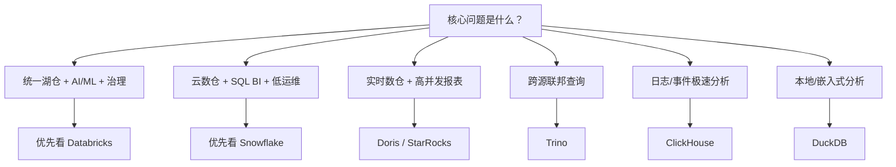

**图 12-20：湖仓与 OLAP 引擎选型决策树。** 企业不应问“谁最好”，而应先问“负载是什么、延迟目标是什么、数据是否需要共享、治理边界在哪里”。

决策树每个叶节点都应对应一组可验证的负载假设，而不是产品信仰。走 **Databricks** 分支时，要确认是否存在 Spark 工程、ML 特征和 Unity Catalog 级治理的刚性需求；走 **Snowflake** 分支时，要确认是否以 SQL BI 和 warehouse 隔离为主、能否接受按 warehouse 计费；走 **Doris / StarRocks** 分支时，要准备 FE 高可用、BE/CN 容量和物化视图运维；走 **Trino** 分支时，要接受跨源 Join 的成本不可预测，并设置并发与 scan 上限；走 **ClickHouse** 分支时，要把排序键和 merge 监控纳入建模流程；走 **DuckDB** 分支时，要限定在单机/Notebook 范围并建立结果回流生产的治理流程。山岚集团典型组合是：Databricks 或 Snowflake 做平台主仓 + StarRocks 扛实时 BI + Trino 做 DataAgent 探索入口 + DuckDB 做 Notebook 抽样——决策树给出 shortlist，真实数据压测才给出最终答案。

**趋势判断：湖仓引擎正在走向融合**

开放表格式正在成为共同底座。Iceberg、Delta Lake、Hudi、Paimon 让“表”从某个数据库内部对象变成跨引擎共享的数据资产。Databricks、Snowflake、Doris、StarRocks、Trino、ClickHouse、DuckDB 都在不同程度增强对开放表格式和对象存储的支持。

存算分离与 shared-data 架构会持续强化。云上对象存储便宜、弹性好、可共享，越来越多 OLAP 引擎都在支持 shared-data 或存算分离形态。StarRocks shared-data、Doris 存算分离、ClickHouse Cloud、Snowflake Virtual Warehouse、Databricks Serverless SQL，本质上都在解决同一组问题：计算资源如何更弹性、存储资源如何更便宜、多工作负载隔离如何更清晰。

查询引擎也会越来越多服务 AI 数据工作负载。传统 OLAP 关注报表和聚合，但 Agent 平台会把特征工程、向量检索、非结构化数据处理、语义查询、RAG 数据准备和 Agent 工具调用都推向数据引擎层。Databricks 在 AI/ML 平台化上走得较深；Snowflake 在强化 Cortex、Iceberg 和 AI Data Cloud；DuckDB 在本地 AI 数据处理中越来越常见；ClickHouse、Doris、StarRocks 也在围绕向量、文本和半结构化数据增强能力。

---

## L3 工程实现  〔约 30% 篇幅〕

### 3.1 mini-platform 中的实现路径

本章的 mini-platform 实现不直接连接 Databricks、Snowflake、Doris、StarRocks、Trino、ClickHouse 或 DuckDB，而是先实现“负载到候选引擎”的规则模型。这样做的原因是：企业平台在接入真实引擎前，必须先把工作负载分类、选型理由和替代方案固化下来，否则后续所有 SQL 代理、权限、成本和可观测性都会缺少统一语义。

- 入口：`mini-platform/infra/lakehouse/__init__.py`
- 核心类与函数：`mini-platform/infra/lakehouse/engine_selector.py`
- 测试：`mini-platform/tests/test_lakehouse_engine_selector.py`
- 项目：`mini-platform/projects/12-lakehouse-engine/run.py`

### 3.2 可运行代码与配置

核心用法（调用 `mini-platform/infra/lakehouse/engine_selector.py`）：

```python
from infra.lakehouse import Workload, choose_engine

choice = choose_engine(Workload.REALTIME_BI)
print(choice.primary)
print(choice.alternatives)
print(choice.reason)
print(choice.latency_budget_ms, choice.max_scan_gb)
```

预期输出：

```text
StarRocks
('Apache Doris', 'ClickHouse')
高并发看板、低延迟聚合、物化视图和 MySQL 协议生态。
3000 200
```

`choose_engine` 只回答“哪个引擎”。要让 L2 的受控查询接口契约落到代码上，再叠加一层 `route_query`：它接收一次查询请求，结合负载默认引擎、平台延迟预算和调用方预算产出路由决策，但只决策、不执行 SQL。

```python
from infra.lakehouse import route_query

decision = route_query({
    "principal": "user:finance_analyst_01",
    "workload": "realtime_bi",
    "latency_budget_ms": 1500,
})
print(decision["engine"], decision["latency_budget_ms"], decision["latency_feasible"])
```

预期输出：

```text
StarRocks 1500 False
```

当调用方要求的 1500ms 严于该负载在 StarRocks 上的目标延迟 3000ms 时，路由器仍选定 StarRocks，但把生效预算收紧到更严格的 1500ms，并以 `latency_feasible=False` 提示上层：可能需要改写 SQL、增加过滤、走物化视图或更换引擎。

这段代码与图 12-18 状态机、图 12-20 决策树形成闭环：`choose_engine` 对应决策树的叶节点，`route_query` 对应接入层的 Policy + Router 子集，`latency_feasible=False` 对应状态机里“不应盲目提交 Engine”的前置判断。完整生产路径还需叠加权限拒绝（→ Rejected）、引擎连接失败（→ Failed）和 Observe 审计——这些在 v0.1 代码中刻意省略，留给 Ch.15 元数据层和后续章节的执行适配器实现。

测试方式：

```bash
cd enterprise_agent_platform_book/mini-platform
python3 -m pytest tests/test_lakehouse_engine_selector.py -q
```

项目运行方式：

```bash
cd enterprise_agent_platform_book/mini-platform/projects/12-lakehouse-engine
PYTHONPATH=../.. python3 run.py
```

如果要把该规则扩展为真实查询路由器，建议增加以下配置结构：

```yaml
lakehouse:
  default_engine: trino
  workloads:
    realtime_bi:
      primary: starrocks
      fallback: [doris, clickhouse]
      latency_budget_ms: 3000
      max_scan_gb: 200
    federated_query:
      primary: trino
      fallback: [databricks]
      latency_budget_ms: 30000
      max_scan_gb: 1024
    local_analytics:
      primary: duckdb
      fallback: []
      latency_budget_ms: 10000
      max_scan_gb: 50
```

这段配置没有在当前代码中落盘，是因为当前仓库还没有统一配置加载器。工程上应先在 Ch.15 的元数据与契约层定义资产、权限和工作负载标签，再让查询路由器读取配置。

### 3.3 生产化 checklist

- [ ] 权限：查询路由器必须接入统一身份系统，行列级权限以平台策略为准，不允许 Agent 绕过策略裸连引擎。
- [ ] 审计：记录用户、SQL 摘要、引擎、数据集、快照、扫描量、耗时、错误码和结果去向。
- [ ] 成本：按用户、团队、工作负载和引擎维度设置预算；对全表扫描、跨源 Join 和无过滤大查询做预估拦截。
- [ ] 性能：为高频查询建立物化视图、结果缓存或预建数据集；对低频探索保留 Trino 或 DuckDB 入口。
- [ ] 稳定性：设置超时、取消、连接池上限、并发上限和降级策略；不要让失败查询无限重试。
- [ ] 可观测性：接入 OpenTelemetry 或等价追踪系统，打通 DataAgent 调用、SQL 生成、查询执行和结果解释链路。
- [ ] 灾难恢复：核心报表数据应有备份路径和备用引擎；元数据、权限和路由规则需要版本化。
- [ ] 数据一致性：生产看板读取发布快照或稳定数据集，不直接读取正在 compaction 或流式提交中的中间表。

### 3.4 踩坑记录

**踩坑 1：把 Trino 当成高并发报表数据库**

- 现象：DataAgent 和 BI 看板共用 Trino，临时跨源查询拖慢固定经营看板，用户看到秒级查询变成分钟级。
- 根因：Trino 适合开放湖仓入口和跨源探索，但它不负责热点数据物化和报表服务隔离。Coordinator 单点调度、worker 内存被大 shuffle 占满、Iceberg 冷文件 scan 叠加，都会让固定报表 SLA 失效。
- 修复：固定看板迁移到 StarRocks、Doris、ClickHouse 或 Snowflake warehouse；Trino 保留为探索入口，并设置并发与扫描量上限。接入层用 `workload` 标签把 `realtime_bi` 路由到 OLAP，`federated_query` 才进 Trino。

**踩坑 2：只看引擎性能，不看数据布局**

- 现象：ClickHouse 或 StarRocks 压测表现很好，上线后部分查询仍然慢。
- 根因：排序键、分区、物化视图、统计信息和数据倾斜没有按真实查询模式设计。例如 StarRocks 把高基数列放首位导致 tablet 分布不均，ClickHouse part 过多导致 merge 跟不上写入，Doris 外表未做分区裁剪每次扫全湖。
- 修复：先收集 Top 查询模板，再设计主键、排序键、分区、物化视图和冷热分层；用真实数据分布做回归压测。把“引擎调优”和“表建模”绑在同一个迭代里，而不是先买集群再补建模。

**踩坑 3：多个引擎权限口径不一致**

- 现象：同一用户在 BI 中看不到某列，在另一个 SQL 客户端却能查到。
- 根因：平台元数据、引擎内部权限和外部 catalog 没有统一发布流程。Doris FE 里手工 GRANT、Snowflake role 与 Unity Catalog 标签各管一套，DataAgent 通过 Trino 连 MySQL catalog 时甚至绕开了湖仓行列策略。
- 修复：统一由平台策略生成权限配置；查询接入层先做策略拒绝；定期对账引擎权限和平台权限。新增引擎时先接 Catalog 适配器和策略控制器，再接执行适配器。

**踩坑 4：本地 DuckDB 分析结果无法复现到生产**

- 现象：数据科学家在 Notebook 中用 DuckDB 直接读文件得出结论，生产看板复现时口径不同。
- 根因：本地分析绕过了语义层、数据版本和指标口径管理。Notebook 读的是昨日导出的 Parquet 抽样，生产 StarRocks 读的是实时物化视图；DuckDB 内嵌进程没有记录 snapshot id，指标定义也未走 Ch.15 契约。
- 修复：DuckDB 用于探索，但必须记录输入文件、湖仓快照、SQL 和指标定义；进入生产前转为受治理的数据集或指标层查询。平台可为 Notebook 提供“带 snapshot 的 DuckDB 沙箱”模板，降低口径漂移概率。

---

## 本章小结

### 关键结论

1. 湖仓表格式解决数据资产开放性，OLAP 引擎解决分析查询性能、并发、服务化和成本问题。
2. Databricks 和 Snowflake 更偏平台化与托管数仓；Doris、StarRocks、ClickHouse 更偏实时 OLAP；Trino 更偏联邦查询；DuckDB 更偏本地与嵌入式分析。
3. 企业不应只问“哪个引擎最好”，而应先定义工作负载：统一平台、云数仓、实时 BI、联邦查询、事件分析或本地分析。
4. 多引擎协同的关键不是多装几个数据库，而是统一 catalog、权限、审计、成本预算、查询状态和失败恢复。
5. DataAgent 接入湖仓时必须走受控查询接口，不能绕过平台策略直接生成任意 SQL 访问底层引擎。

### 上线检查清单

- [ ] 能上线吗？已定义工作负载分类、默认引擎、备用引擎、权限策略、超时策略和审计字段。
- [ ] 能扩展吗？新增引擎只需增加执行适配器和路由规则，不影响上层 DataAgent 与 BI 接口。
- [ ] 能治理吗？查询请求、数据资产、用户身份、成本预算和结果去向都能被追踪。
- [ ] 能控成本吗？大扫描、跨源 Join、无过滤查询和高并发看板都有预算、限流或物化策略。
- [ ] 能解释失败吗？错误码能区分权限拒绝、引擎不可用、查询超时、预算超限和数据不一致。

### 延伸阅读

- 官方文档：[Databricks Lakehouse reference architectures](https://docs.databricks.com/aws/en/lakehouse-architecture/reference)
- 官方文档：[Snowflake key concepts and architecture](https://docs.snowflake.com/en/user-guide/intro-key-concepts)
- 官方文档：[Apache Doris System Architecture](https://doris.apache.org/docs/dev/features-architecture/system-architecture/)
- 官方文档：[Apache Doris Lakehouse Overview](https://doris.apache.org/docs/4.x/lakehouse/lakehouse-overview/)
- 官方文档：[StarRocks Architecture](https://docs.starrocks.io/docs/introduction/Architecture/)
- 官方文档：[Trino concepts](https://trino.io/docs/current/overview/concepts.html)
- 官方文档：[ClickHouse Architecture overview](https://clickhouse.com/docs/academic_overview)
- 官方文档：[DuckDB Why DuckDB](https://duckdb.org/why_duckdb)
- 官方文档：[DuckDB Execution Format](https://duckdb.org/docs/current/internals/vector.html)
- 相关章节：[Ch.10 数据采集与集成](ch10.md)、[Ch.11 数据湖与湖仓](ch11.md)、[Ch.15 元数据/血缘/契约/指标](ch15.md)、[Ch.34 NL2SQL 工程化](../part06-dataagent/ch34-nl2sql.md)
