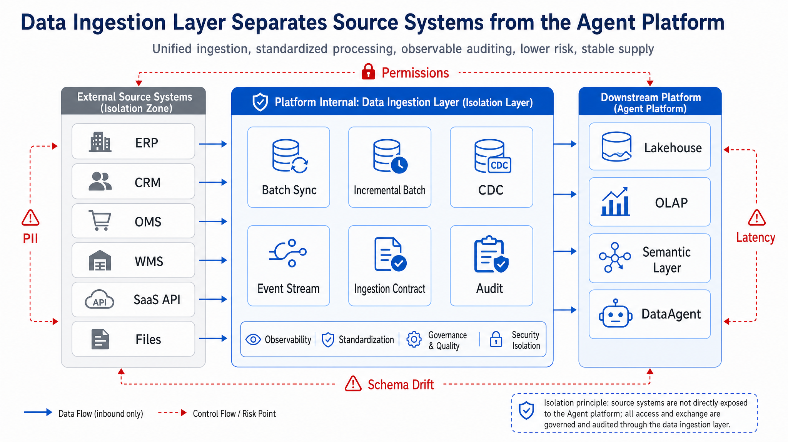
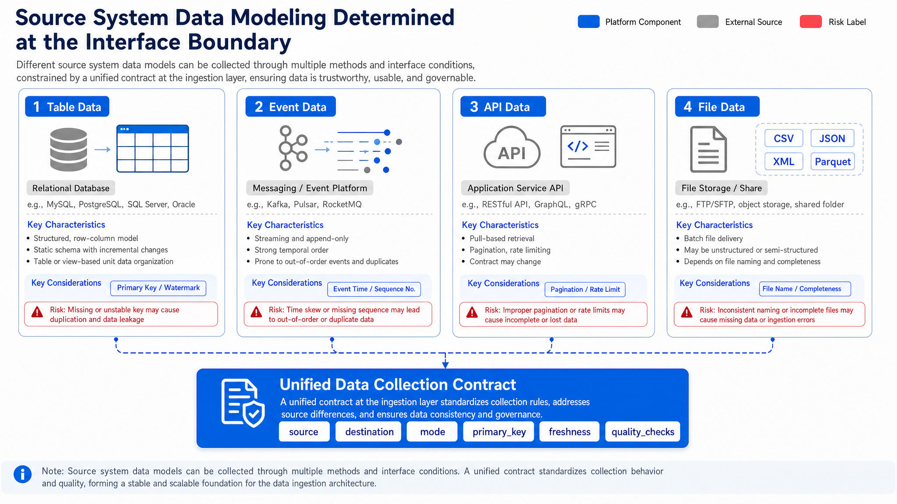
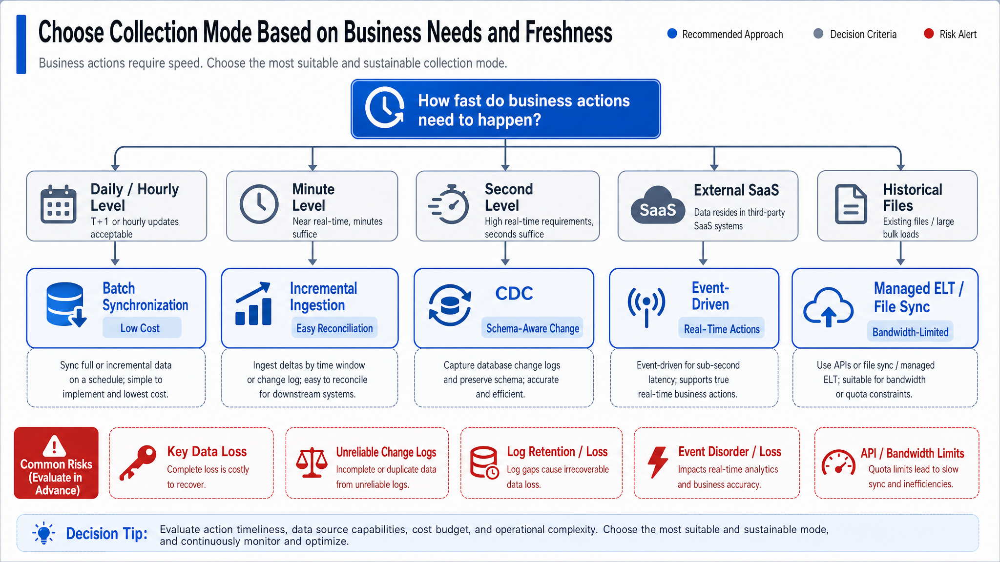
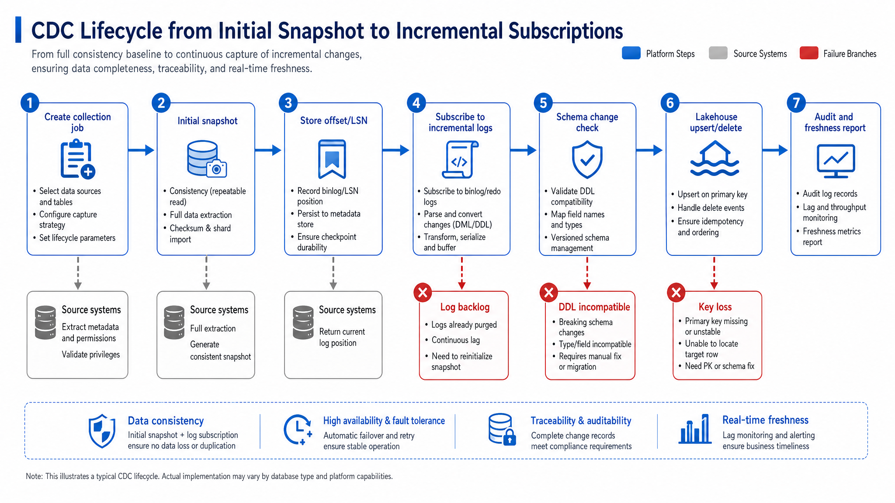
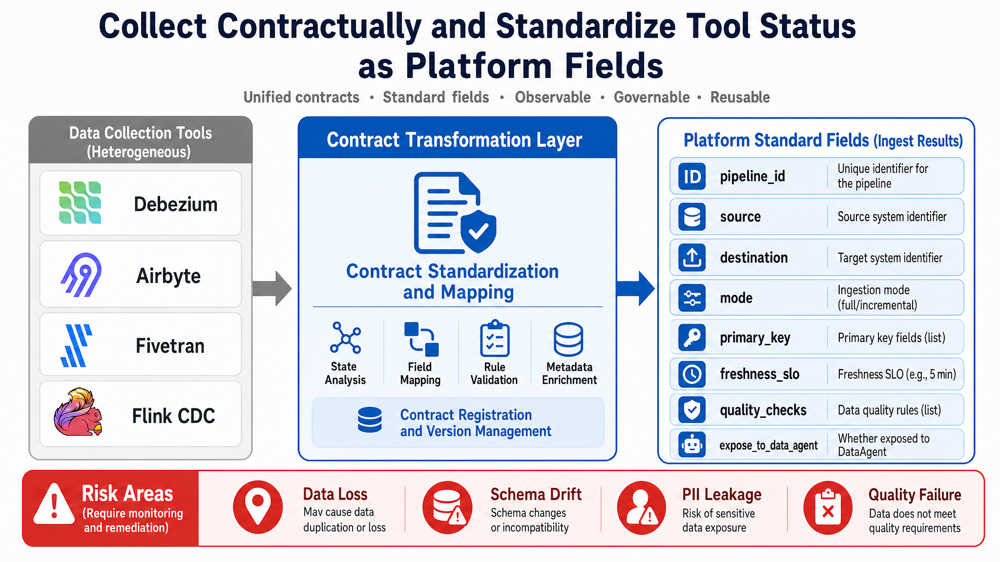
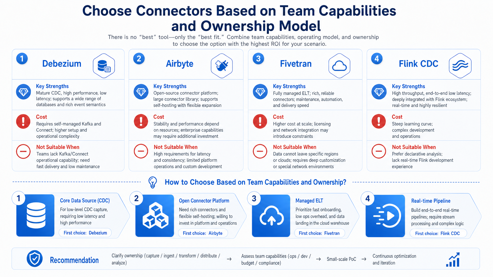
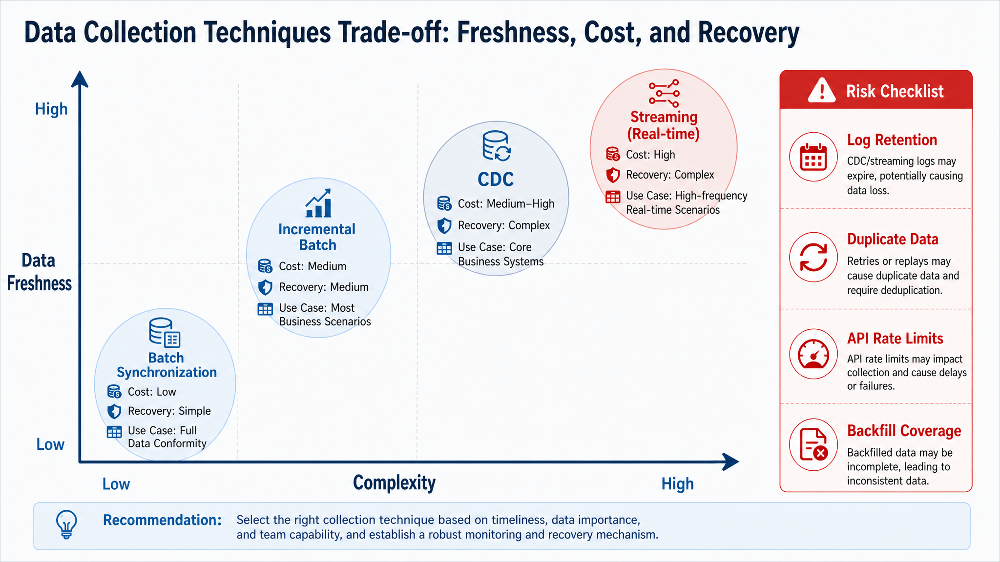
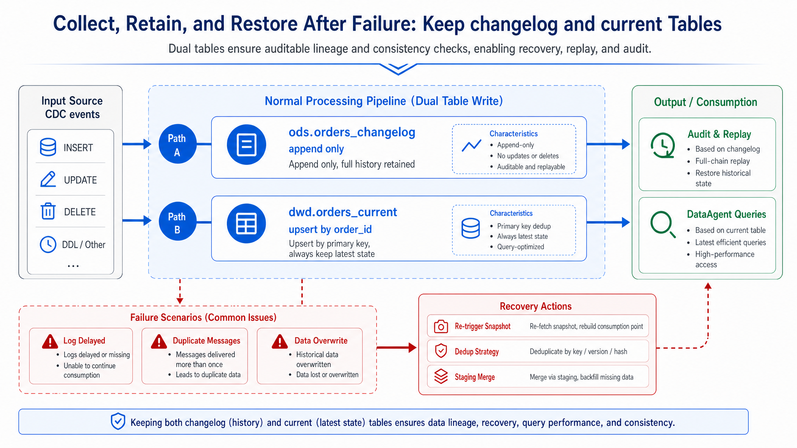
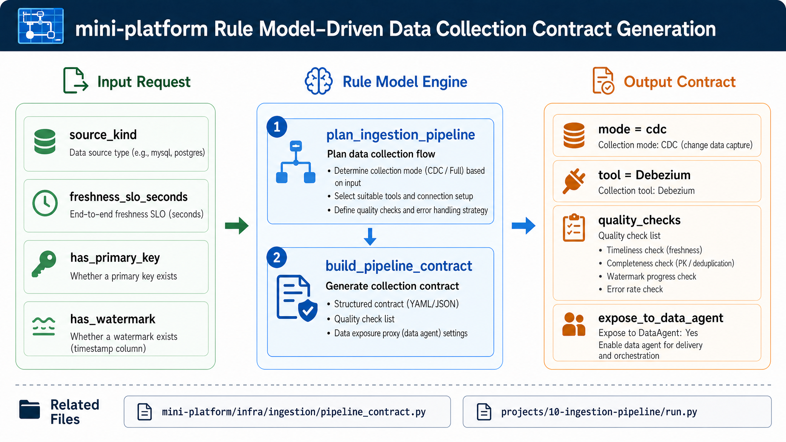

# Chapter 10 Data Ingestion and Integration

---

This chapter starts from the data ingestion layer in the enterprise Agent platform and discusses how source system integration, CDC, file and API ingestion, contract management, and failure recovery affect the quality of subsequent query results. Whether DataAgent answers correctly often depends not on the model itself but on whether the upstream data collected is fresh, complete, and consistent in definition. This chapter provides criteria for choosing between batch, CDC, file, and API ingestion methods, explains why the ingestion layer needs data contracts to constrain source system changes, and describes how failed ingestion avoids polluting downstream data.

A DataAgent incorrect answer may seem like a model misunderstanding on the surface, but at the core could be ingestion latency, schema changes, conflicting metric definitions, or missing permission filtering. By clarifying the data ingestion layer's role in the enterprise Agent platform, the CDC architecture, and mini-platform implementation, teams can first confirm data entities, then confirm how changes propagate, and finally confirm how quality and freshness are exposed to upper Agent layers.

## 10.1 The Role of the Data Ingestion Layer in the Enterprise Agent Platform

A multi-line business enterprise operates retail, manufacturing, finance, and logistics. Store orders come from the Order Management System (OMS), inventory status from the Warehouse Management System (WMS), customer info from the Customer Relationship Management system (CRM), supplier settlements from the Enterprise Resource Planning system (ERP), and equipment quality inspection from the factory data collection platform. When DataAgent answers "Which stores are currently out of stock," "Does a supplier delay impact gross profit," or "What open orders remain after a customer credit change," it cannot query these production systems directly.

Production systems prioritize transaction processing, short transactions, permission isolation, and stability. The Agent platform focuses on analysis, explanation, Q&A, and automation, requiring queryable, traceable, and manageable data copies. Therefore, the data ingestion layer does copy data and transforms business facts from source systems into platform-usable data products.

The key transformation is that a record in the source system only becomes suitable for Agent use once it gains information about source, timestamp, version, quality, and permission semantics in the platform. The field `orders.status` in the order database is just a field; after ingestion, it must be interpreted as the "current order fulfillment status," indicating which system it came from, which sync point it corresponds to, whether deletions are included, and whether DataAgent can query it. Without this transformation, Agents cannot determine the data's freshness, completeness, or interpretability.

The ingestion layer also acts as "rhythm isolation." Production systems change at transactional business pace, lakehouses and semantic layers organize data at analytical pace, and Agents query at user question pace. These rhythms differ. If Agents query production directly, analytical queries can impact transactions, field changes break Q&A chains, and permission rules scatter across entry points. The ingestion layer separates these rhythms, letting source systems continue stable transaction processing while downstream consumes data according to unified contracts.



*Figure 10-1: The ingestion layer isolates source systems and the Agent platform. Source: Author. Alt text: On the left are heterogeneous source systems like ERP, CRM, files, and APIs; in the middle is the unified ingestion layer; on the right is the Agent platform's data foundation. The ingestion layer buffers source system changes from directly impacting downstream systems.*

Figure 10-1 shows boundaries rather than tools. Source systems expose only controlled interfaces to the ingestion layer; lakehouse, OLAP, semantic layers, and DataAgent consume only contract-stabilized data. This lowers four risks: business disruption from querying source, Agents answering with outdated definitions after field changes, personal data bypassing governance, and inability to explain delays or quality failures. The figure shows two flows: data flows from sources into lakehouse and analysis layers, and control flows push permissions, quality, freshness, and lineage downstream via ingestion contracts.

### 10.1.1 From Business Events to Analytic Data

Data enters the platform in four common forms:

*Table 10-1: Data forms such as table data, events, files - their sources, ingestion concerns, and significance to Agents. Source: Author.*

| Data Form         | Typical Sources            | Ingestion Focus                  | Significance for Agent                                     |
|-------------------|---------------------------|---------------------------------|------------------------------------------------------------|
| Table data        | OMS, WMS, ERP, CRM DBs    | Primary key, watermark, deletion, field evolution | Provide structured facts like orders, inventory, customers, settlements |
| Event data        | Payments, risk control, devices, user behavior | Event timestamp, event ID, idempotency, replay | Provide real-time context and triggers                       |
| API data          | SaaS, ad platforms, customer service | Pagination, throttling, incremental cursors, permission scopes | Extend external business info, but freshness limited by API constraints |
| File data         | Suppliers, finance, historical archives | Naming, partitioning, completeness, duplicate import | Support low-frequency batch loads and backfill               |

DataAgent does not care "where the data comes from" per se, but whether it can be used with trust. The ingestion layer collapses source differences into unified contracts defining data source, target table, sync mode, primary key, partitioning, freshness, quality checks, lineage, and exposure policies.

Differences mainly lie in "how changes are recognized." Table data usually rely on primary key, watermark, update timestamp, or DB logs to detect changes; event data are themselves change facts needing duplicate and out-of-order handling; API data must obey pagination, throttling, and cursor rules; file data rely on filename, partition directories, manifest files, and checksums for completeness. Ignoring these differences and treating all sources as "batch pulls" leads to errors in deletes, backfills, duplicate imports, and field drift.

Thus, the integration boundary is choosing a connector and first answering three questions: does the platform receive "current state" or "change stream"? Can the source provide stable identity, time, and version markers? Does downstream need queryable latest state, replayable history, or low-frequency archives? Answers drive target schema, quality checks, and failure recovery.



*Figure 10-2: Source data forms determine ingestion boundary. Source: Author. Alt text: Four data forms-table data, event stream, files, API-each connect to respective ingestion methods and checks (primary keys and watermarks, disorder handling, parsing, throttling), showing form affects ingestion boundary.*

Figure 10-2 shows the ingestion boundary depends on data form. Table data need primary keys, watermarks, and delete semantics; event data need event time, event ID, and idempotency; API data need cursors, throttling, and permission scopes; file data need naming, partitioning, and completeness checks. These controls determine if data can be replayed, reconciled, and explained.

### 10.1.2 Choosing Between Batch, Stream, CDC, and API Synchronization

Choosing an ingestion mode should start from business actions, not tools. A multi-line business's monthly financial closing requires stable, complete, auditable data; batch ingestion fits best. When store inventory nears out-of-stock, triggering replenishment alerts every few minutes calls for incremental batch or Change Data Capture (CDC). For second-level payment anomaly detection, event streams and real-time processing apply. SaaS marketing platform data, constrained by APIs throttling, often are extracted with managed ELT or connector platforms.

A practical choice approach decomposes needs into five dimensions: freshness, completeness, delete semantics, replay capability, and source system retrofit cost. Freshness determines daily, hourly, minute, or second level; completeness requires reconciliation and backfills; delete semantics decide append-only or full mutation handling; replay capability requires changelog retention; retrofit cost decides if the source system can emit events actively. Only considering these five together prevents bias from buzzwords like "real-time," "open-source," or "managed."

For example, real-time may sound high-risk for stock, but if business only needs replenishment suggestions every 10 minutes, incremental batch can be more stable than CDC. Order status could be extracted incrementally by update time, but cancellations, refunds, and rollbacks benefit from CDC's change ordering. Marketing SaaS data looks incremental, but limited by external API throttling and field changes; managed ELT or mature connectors are often more maintainable than homegrown scripts.

*Table 10-2: Benefits, costs, and suitable scenarios of batch sync, incremental batch, CDC, and API sync. Source: Author.*

| Mode             | Working Mechanism                            | Advantages                        | Costs                             | Suitable Scenarios                             | Book Recommendation          |
|------------------|---------------------------------------------|---------------------------------|---------------------------------|-----------------------------------------------|------------------------------|
| Batch sync       | Timed full or partitioned extraction       | Simple, cheap, easy to reconcile | High latency, weak delete capture | Finance, historical backfill, low-frequency dimension tables | Default baseline              |
| Incremental batch | Extraction by watermark or cursor per cycle | Moderate complexity, better freshness | Reliability depends on watermark | Near real-time syncing of store inventory, order status | Default option in mini-platform |
| CDC              | Reads DB logs to propagate row-level changes | Low intrusion, retains change semantics | Depends on logs, primary keys, DDL management | Core fact tables like orders, inventory, work orders | Enhanced for key tables       |
| Managed ELT      | Connector or service periodic sync          | Low operation cost, broad SaaS coverage | Cost, compliance, vendor lock-in | CRM, customer service, marketing platforms   | Choose based on org capabilities |
| Event stream     | Business system actively sends events       | Low latency, clear semantics    | Requires business system retrofit | Payments, risk controls, device alerts        | Expanded in Chapter 13        |



*Figure 10-3: Choosing ingestion mode starts with business actions and freshness requirements. Source: Author. Alt text: Decision flowchart branching by freshness requirements (seconds, minutes, hours, days) pointing to CDC/stream, CDC, batch sync, etc., illustrating mode choice by latency.*

Figure 10-3 funnels ingestion mode choice into two questions: how fresh does the business need data, and can the source provide stable primary keys, cursors, or event semantics? Answer these first, then select batch, incremental batch, CDC, managed ELT, or event stream, avoiding tool-biased architecture. The arrows show order: business defines freshness target, source system capability defines feasible methods, finally tools and table designs are chosen.

### 10.1.3 Misjudgment Risks in Ingestion Modes

First, "real-time is always better." Low latency involves always-on computation, state recovery, message backlogs, and operational costs. If business tolerates hourly freshness, pushing chains to second-level is wasteful. Whether real-time is needed depends on "do late-arriving data cause wrong actions?" Reports often tolerate delay if annotated; payment interceptions or inventory freezes suffer direct losses from delay.

Second, "CDC replaces all batch processing." CDC excels at capturing DB row changes but not external files, historical backfills, low-frequency dimension tables, or restricted APIs. Mature platforms keep batch sync, incremental batch, CDC, and event streams concurrently. Also, CDC answers "how do changes happen" but not "how to fix history." Missed syncs or past incorrect fields still need batch backfills and reconciliation.

Third, "buying connector tools completes data governance." Tools like Debezium, Airbyte, Fivetran, Flink CDC solve ingestion, but not field semantics, PII masking, quality gates, lineage, permissions, or metric consistency. Connectors move data into the platform; governance answers "who uses it, which version, responsibility on failure, explainability." These are distinct concerns.

---

## 10.2 CDC Architecture: Snapshots, Incremental Logs, Schema Evolution, and Consistency

A CDC pipeline typically has two stages. Stage one is an initial snapshot syncing existing source table data to targets. Stage two is incremental subscription reading insert, update, and delete operations from DB transaction logs. A consistent position checkpoint (like PostgreSQL WAL LSN or MySQL binlog position) is maintained between stages.

CDC should not be seen simply as "faster sync." Batch syncing focuses on snapshot states at points in time, while CDC focuses on the process of transitioning from one state to another-covering inserts, updates, deletes, transaction order, and source positions. To DataAgent, this process explains "why did stock go from 10 to 4" or "which order status rollback changed the report" instead of just giving a latest number.

The challenge is no data gaps between snapshot and incremental. If the snapshot is not finished but new changes occur, the platform must know if these changes are covered by the snapshot or still need log replay. Mature pipelines store consistent source positions at snapshot start, end, and incremental subscription start, and sinks write idempotently by primary key and version. Otherwise, restarts risk data loss or duplication.



*Figure 10-4: CDC lifecycle from initial snapshot to incremental subscription. Source: Author. Alt text: Timeline showing one-time initial snapshot phase, then ongoing incremental log subscription phase, with a marked handoff position, illustrating smooth transition.*

Figure 10-4 illustrates two CDC phases: initial snapshot establishes full baseline, incremental subscribes changes from log position onward. Position checkpoints enable breakpoint recovery, duplicate control, and historical reconciliation. The platform records: which primary key ranges snapshot covered, incremental start log position, and batch commit point in target.

CDC faces four core challenges:

*Table 10-3: Typical CDC landing challenges, manifestations, and handling strategies. Source: Author.*

| Challenge            | Manifestation                 | Handling Strategy                        |
|----------------------|------------------------------|-----------------------------------------|
| Snapshot pressure    | Large table scans slow source DB | Use read-only replicas, low-traffic periods, sharded snapshots, rate limiting |
| Position recovery    | Connector crashes lose resume point | Persistent offset storage, validate log retention before recovery |
| Schema evolution    | Source table schema adds, deletes, or changes types | Establish compatibility rules, change approval, schema versioning |
| Delete semantics    | Downstream append-only unable to reflect deletes | Explicit tombstone, soft deletes, or merge-on-read policies |

### 10.2.1 Interface Contracts for Ingestion Pipelines

The platform should not require lakehouse writers, metadata systems, and DataAgent to interpret each connector's internal state independently. The ingestion layer exposes unified interface contracts downstream.

Contracts translate "what tools do" into "what platform guarantees." Connectors track topics, partitions, offsets, cursors, job IDs, or internal checkpoints; DataAgent needs to know table source, update frequency, primary keys, quality status, and query permissions. Without contracts, downstream guesses data state, impeding fault accountability.

Contracts also define failure recovery semantics. If contract declares `primary_key`, sink can do idempotent merges; if declares `freshness_slo_seconds`, observability can detect freshness violations; if declares `quality_checks`, orchestration can halt exposure on quality failures. Contracts are machine-readable protocols integrating ingestion, governance, and query systems.

*Table 10-4: Components' roles, inputs, outputs, and failure modes in ingestion pipelines. Source: Author.*

| Component         | Role                          | Input                                  | Output                         | Failure Mode                |
|-------------------|-------------------------------|--------------------------------------|-------------------------------|-----------------------------|
| Source Connector  | Connects source and extracts data | DB logs, APIs, files, events          | Normalized records or events    | Permissions, throttling, log expiration |
| Offset Store      | Saves read progress             | Connector checkpoints                  | Offset, LSN, cursor            | Lost position, duplicate consumption |
| Schema Manager    | Manages field structure changes | DDL, schema registry                   | Schema version                | Field drift, type incompatibility |
| Buffer / Queue    | Buffers change events           | CDC events, business events            | Topics, partitioned events    | Backlog, disorder, duplicates |
| Sink Writer       | Writes to target tables         | Normalized events                      | Lakehouse/OLAP tables          | Idempotency failures, write conflicts |
| Audit Logger      | Logs running state              | Run state, metrics                     | Audit logs, lineage events     | No accountability             |

Sample contract JSON:

```json
{
  "pipeline_id": "orders-postgres-to-iceberg",
  "source": {
    "type": "postgres",
    "database": "oms",
    "table": "public.orders"
  },
  "destination": {
    "type": "iceberg",
    "table": "dwd.orders"
  },
  "mode": "cdc",
  "primary_key": ["order_id"],
  "freshness_slo_seconds": 60,
  "expose_to_data_agent": true,
  "quality_checks": [
    "row_count_reconciliation",
    "primary_key_uniqueness",
    "freshness_slo",
    "schema_compatibility"
  ]
}
```



*Figure 10-5: Ingestion contracts collapse tool status into platform-specific fields. Source: Author. Alt text: Left shows raw records with tool-specific formats from multiple connectors; ingestion contract layer normalizes into unified platform-standard fields on right, representing contract normalization.*

Figure 10-5 illustrates that ingestion contracts map diverse connector internal states into a unified platform contract including sync mode, primary key, freshness, quality checks, and exposure policy. The left-to-right conversion expresses translation from "tool state" to "platform semantics." Source details vary, but contract fields stay stable.

Three downstream consumers use this contract. Lakehouse writers choose append, merge, or backfill by `mode` and keys; metadata systems record source table, target table, schema version, and freshness; DataAgent decides if data is fresh enough and rejects answers if data is stale or quality fails.

### 10.2.2 Comparison of Tool Ecosystem

Tool introductions must serve architectural tradeoffs. Debezium suits Kafka-centric DB CDC event buses; Airbyte fits open-source connector platforms; Fivetran suits managed ELT reducing connector ops; Flink CDC suits real-time transformation and multi-sink CDC pipelines.

Choose tools relative to organizational capabilities. Teams already streaming with Kafka have higher control using Debezium or Flink CDC; teams focused on rapid SaaS onboarding prioritize Airbyte or Fivetran connector coverage; handling sensitive data and complex internal permissions requires careful managed service compliance checks. Tools are not absolutely better or worse but must match pipeline roles and team skills.

*Table 10-5: Usage scenarios and limitations for tools like Debezium and Flink CDC. Source: Author.*

| Tool       | Why Use                         | Not Suitable For                    | Alternatives               | Book Recommendation         |
|------------|---------------------------------|-----------------------------------|----------------------------|-----------------------------|
| Debezium  | Mature DB log capture, core CDC  | Large SaaS API loads, low-frequency files | Flink CDC, DB-native replication | Use for core fact tables like orders, inventory |
| Airbyte   | Wide connector coverage, self-hosted control | Connector quality and maintenance need platform effort | Fivetran, Meltano, batch scripts | Use for multi-source, rapid onboarding |
| Fivetran  | Managed, reduces connector ops    | Cost, compliance, vendor lock-in  | Airbyte, homegrown batch sync | Use for external SaaS and low-ops teams |
| Flink CDC | Real-time transformation and multi-sink | High cost without Flink ops skills | Debezium + sinks, Spark micro-batching | Use for real-time data pipelines  |



*Figure 10-6: Connector tools chosen by organizational engineering ability and pipeline criticality. Source: Author. Alt text: 2D matrix with axes "organizational engineering capability" and "pipeline criticality" positioning Debezium, Flink CDC, SaaS connectors, and home-built connectors in quadrants with guidance.*

Figure 10-6 compares four connector types' boundaries. Debezium acts as DB log event source; Airbyte as a self-built connector platform; Fivetran as managed ELT; Flink CDC as CDC plus real-time compute in one chain. The "tool responsibilities" should be read with prior contract fields: whichever tool is chosen, the platform must produce consistent source, destination, mode, freshness, and quality metadata.

### 10.2.3 Freshness, Latency, Cost, and Reliability Tradeoffs for DataAgent

DataAgent's freshness need is often misunderstood as "faster is smarter." In reality, Agent needs "to know on which time point the answers are based." If the platform declares data valid as of 10 minutes ago, Agent can qualify its answers; if second-level chains produce frequent duplicates, disorder, or quality issues, Agent may give seemingly precise but untraceable conclusions.

Thus, the tradeoff is not "slow vs. fast" but balancing business value, recovery complexity, and explainability. Key fact tables tolerate higher pipeline cost; low-frequency dimension tables should not be forcibly real-time; sensitive data demands controllable pipelines while low-risk external data can use managed connectors.

#### Batch sync and CDC

*Table 10-6: Batch sync vs CDC tradeoffs in freshness, cost, reliability. Source: Author.*

| Option     | Advantages                     | Costs                          | Suitable Scenarios                     | Book Recommendation          |
|------------|-------------------------------|--------------------------------|---------------------------------------|------------------------------|
| Batch Sync | Low cost, easy to reconcile, straightforward recovery | Poor freshness, weak delete capture | Finance, dimension tables, backfills | Default fundamental capability |
| CDC        | Good freshness, preserves insert/update/delete semantics | Depends on logs, keys, schema management, 24/7 ops | Core fact tables like orders, inventory, work orders | Enable only for high-value tables |

#### Home-built connectors and managed ELT

*Table 10-7: Connector procurement vs home-built tradeoffs. Source: Author.*

| Option          | Advantages                       | Costs                             | Suitable Scenarios                       | Book Recommendation               |
|-----------------|---------------------------------|---------------------------------|-----------------------------------------|----------------------------------|
| Home-built      | Controllable, auditable, tailored to governance | Need to maintain connector, scheduling, alerts | Core systems, sensitive data, complex permissions | Platform team handles core pipelines |
| Managed ELT     | Fast onboarding, less ops, broad SaaS support | Cost, compliance, vendor lock-in | External systems, low-sensitivity data, standardized connectors | Supplementary path                |



*Figure 10-7: Data ingestion tradeoffs factoring freshness, cost, and recovery difficulty in a radar chart. Source: Author. Alt text: Radar chart with three axes-freshness, cost, recovery difficulty; lines for batch sync, CDC, and streaming illustrate relative strengths.*

Figure 10-7 emphasizes ingestion tech tradeoffs go beyond latency alone. For DataAgent, freshness, cost, fault recovery, auditability, and operational capabilities must factor into decisions; otherwise low-latency pipelines become expensive, fragile production burdens. Every pipeline faces the same test: if a failure occurred overnight, can impact scope be explained and correct data backfilled by next morning?

### 10.2.4 Breakpoints and backfill strategy for ingestion pipelines

*Table 10-8: Detection and recovery of failure patterns like duplicate, disorder, schema drift. Source: Author.*

| Failure Pattern      | Trigger Condition                    | Impact                           | Detection Method                 | Recovery Strategy                         |
|---------------------|------------------------------------|---------------------------------|--------------------------------|--------------------------------------------|
| Log expiration      | Connector stopped longer than log retention | Cannot resume from original point | Monitor replication slot backlog, binlog/WAL retention | Resnapshot affected tables and reconcile   |
| Duplicate consumption | At-least-once delivery or recovery replay | Inflated metrics, duplicate records | Primary key uniqueness check, event version check | Sink-side idempotent merges, keep changelog |
| Out-of-order arrival | Network jitter, cross-partition consumption, large transactions | Latest state overwritten by stale event | Event time and version monitoring | Update by version number or source position |
| Schema drift        | Source schema adds/deletes/changes type | Write failures or field misalignments | Schema diff, compatibility checks | Auto-compat new fields; manual approval for breaking changes |
| Backfill overwriting real-time | Historical fix and CDC write same current table | Latest status overwritten by older data | Write batch audits, update time comparisons | Backfill into staging; atomic merge by version |

These failure modes commonly appear during restarts, backfills, schema changes, and traffic spikes rather than initial launches. Platforms must monitor "task success" and "data trustworthiness." For example, sync succeeded but duplicate keys cause overcounts; CDC runs but lagging log positions delay answers; schema auto-admits new fields but semantics are undocumented causing Agent misinterpretation.



*Figure 10-8: Failure recovery requires both changelog and current tables. Source: Author. Alt text: Side-by-side tables-append-only changelog table recording every change, and current table storing latest state. Arrows indicate changelog can replay to rebuild current on failures.*

Figure 10-8 illustrates a practical principle: each ingestion pipeline should retain both append-only changelog and query-optimized current tables. Changelog supports audit, replay, and recovery; current supports DataAgent's latest business queries. Only storing current reduces traceability; only storing changelog pushes query complexity downstream. These tables serve "explain the past" and "query the present" goals respectively rather than duplicating effort.

---

## 10.3 Mini-Platform Implementation: Ingestion Configuration, Landing Tables, and Minimum Viable Pipeline

This chapter's mini-platform implementation does not connect to real DBs or Kafka but codifies ingestion mode selection and DataAgent-readable contracts as testable code. This reflects the reality that enterprise platforms must first unify semantic definitions of "which data can be exposed to Agent" before integrating real tools.

This implementation starts from rule models rather than connector clients. Real connectors introduce network, permission, DB version, and environment differences distracting beginners to tool parameters. The mini-platform models source types, freshness, primary keys, watermarks, and exposure policies clearly, showing the platform's minimal closed-loop: requirements input, mode selection, contract output, and test verification.

- Entry: `mini-platform/infra/ingestion/__init__.py`
- Core logic: `mini-platform/infra/ingestion/pipeline_contract.py`
- Tests: `mini-platform/tests/test_ingestion_pipeline_contract.py`
- Sample project: `mini-platform/projects/10-ingestion-pipeline/run.py`



*Figure 10-9: Mini-platform generates ingestion contracts using rule models. Source: Author. Alt text: Flowchart showing source schema analyzed by rule model to auto-generate ingestion contract (fields, types, watermark, keys), then deliver to connectors illustrating semi-automated contract generation.*

Figure 10-9 presents this chapter's mini-platform minimal loop: input source system type, freshness, keys, and target table info; rule model chooses mode and tool; outputs a DataAgent-readable ingestion contract.

`mini-platform/infra/ingestion/pipeline_contract.py`:

```python
class SourceKind(str, Enum):
    DATABASE = "database"
    SAAS_API = "saas_api"
    FILE = "file"
    EVENT_STREAM = "event_stream"

class IngestionMode(str, Enum):
    BATCH = "batch"
    INCREMENTAL_BATCH = "incremental_batch"
    CDC = "cdc"
    MANAGED_ELT = "managed_elt"
    EVENT_STREAM = "event_stream"
```

The same file's `plan_ingestion_pipeline` makes primary mode choice based on source type, freshness, primary key presence. Excerpt:

```python
def plan_ingestion_pipeline(request: dict[str, Any]) -> PipelineDecision:
    source_kind = SourceKind(request["source_kind"])
    freshness = int(request.get("freshness_slo_seconds", 86_400))
    has_primary_key = bool(request.get("has_primary_key", False))

    if source_kind is SourceKind.DATABASE and freshness <= 300 and has_primary_key:
        return PipelineDecision(
            mode=IngestionMode.CDC,
            tool="Debezium",
            reason="数据库关键事实表需要分钟级新鲜度，且具备稳定主键。",
            freshness_slo_seconds=freshness,
            requires_primary_key=True,
            requires_watermark=False,
        )
```

`build_pipeline_contract` converts decisions to downstream consumable contract objects:

```python
def build_pipeline_contract(request: dict[str, Any]) -> PipelineContract:
    decision = plan_ingestion_pipeline(request)
    primary_key = tuple(request.get("primary_key", ()))
    quality_checks = (
        "row_count_reconciliation",
        "primary_key_uniqueness" if primary_key else "source_file_completeness",
        "freshness_slo",
        "schema_compatibility",
    )

    return PipelineContract(
        pipeline_id=request["pipeline_id"],
        source=request["source"],
        destination=request["destination"],
        mode=decision.mode,
        primary_key=primary_key,
        freshness_slo_seconds=decision.freshness_slo_seconds,
        expose_to_data_agent=bool(request.get("expose_to_data_agent", False)),
        quality_checks=quality_checks,
    )
```

Run tests:

```bash
cd enterprise_agent_platform_book/mini-platform
python3 -m pytest tests/test_ingestion_pipeline_contract.py -q
```

Run project:

```bash
cd enterprise_agent_platform_book/mini-platform/projects/10-ingestion-pipeline
PYTHONPATH=../.. python3 run.py
```

Expected output:

```text
orders-postgres-to-iceberg -> cdc
tool=Debezium freshness=60s
checks=row_count_reconciliation,primary_key_uniqueness,freshness_slo,schema_compatibility
```

This output corresponds to Figure 10-9's minimal loop: input is a multi-business order table ingestion requirement; the rule picks CDC and Debezium; output is a DataAgent-readable contract. Production systems must write this contract into the metadata system of Chapter 15 and link running status, lineage, quality checks, and alerts in the orchestration and quality platform of Chapter 14.

### 10.3.1 Release gates before ingestion data enters the Agent chain

- [ ] Permissions: CDC users, API tokens, and file credentials granted minimum necessary scope.
- [ ] Secrets: All credentials managed securely, never committed, sampled, or logged.
- [ ] Table scope: Use allowlists to specify synced tables; disallow syncing entire DB by default.
- [ ] PII: Sensitive fields must be labeled, masked, or filtered before entering lakehouse or semantic layer.
- [ ] Positions: Offsets, LSNs, binlog positions, and API cursors persistently stored and auditable.
- [ ] Log retention: Source DB log retention exceeds maximum recovery window.
- [ ] Snapshot: Large initial snapshots rate limited, sharded, and scheduled in low traffic windows.
- [ ] Schema: Add/delete/type change require compatibility rules.
- [ ] Idempotency: Sinks handle duplicate events; duplicate consumption cannot directly corrupt metrics.
- [ ] Backfill: Historical data loads write staging; atomic merge per version after completion.
- [ ] Freshness: Key tables define freshness SLO and expose to DataAgent.
- [ ] Quality: Automated checks on row counts, primary key uniqueness, not-null, enum values, and schema compatibility.
- [ ] Lineage: Record source, connector, destination, schema version, and runtime.
- [ ] Alerts: Delay, error rate, backlog, sync failures, and log disk usage must alert.

### 10.3.2 Recovery strategy for ingestion delay, duplication, and backfill

#### Insufficient log retention blocks connector recovery

When a CDC Connector stops over the weekend and cannot find the original binlog or WAL position on Monday, the platform has lost the ability to continue from its recorded offset. The immediate repair is to increase log retention and monitor replication backlog, but the affected tables also need a bounded resnapshot and reconciliation between changelog and current tables. DataAgent should not consume those tables as "fresh" until the repair window is closed and freshness evidence is updated.

#### Full snapshots slow source databases

Large initial snapshots can make the source business database slower because the connector competes for I/O, buffer cache, and sometimes locks. Production repair should move the snapshot to a read-only replica when possible, lower concurrency, shard the scan by primary key range, and schedule it outside business peaks. The ingestion contract should record that the initial snapshot is still in progress, so downstream Agent answers do not confuse partial baseline data with a complete table.

#### Missing primary keys cause repeated target upserts

If the source table has no stable primary key, the sink writer cannot tell whether two rows describe the same business object. The symptom is often duplicate order rows in the lakehouse and inflated metrics in DataAgent answers. Teams should confirm a business unique key with the source owner; if no reliable key exists, the safer path is to keep an append-only changelog and derive current state through downstream window logic rather than pretending the table supports clean upserts.

#### Backfill jobs overwrite real-time increments

Historical backfills become dangerous when they write directly into the same current table as the CDC stream. A stale repair batch can overwrite a newer order status and make DataAgent explain an outdated state as if it were current. Backfills should first land in staging, then merge atomically by source update time and source position. For high-value tables, the platform should pause affected partitions or run conflict detection before exposing repaired data.

### 10.3.3 Ingestion contracts and the DataAgent evidence chain

After an ingestion repair, DataAgent needs more than a refreshed table. It needs evidence that identifies the source system, ingestion mode, offset or cursor, snapshot range, quality checks, and freshness timestamp used for the answer. These fields allow the platform to explain whether a result came from the current table, a recovered partition, or a backfilled historical window.

In production, this evidence chain should connect Chapter 10's ingestion contract with Chapter 14's quality state, Chapter 15's metadata and lineage records, and Chapter 38's Trace. If a user challenges an answer, the platform can then walk from the natural language response to the SQL, the table snapshot, the ingestion run, and the source offset. Without that link, ingestion may be operationally successful while the answer remains impossible to audit.

---

## Chapter Recap

1. The data ingestion layer is the enterprise Agent platform's data gateway, determining DataAgent freshness, trustworthiness, and auditability.
2. Batch sync, incremental batch, CDC, managed ELT, and event streams have distinct boundaries; no single tool covers all sources.
3. Ingestion pipelines must expose unified contracts including source, target, mode, primary key, freshness, quality checks, and Agent exposure policy.
4. Production-grade CDC challenges cover snapshots, positions, schema evolution, delete semantics, idempotent writes, and backfill recovery.
5. The mini-platform minimal implementation codifies rules and contracts before real connector integration.

- Official documentation: [Debezium Documentation](https://debezium.io/documentation/)
- Official documentation: [Airbyte Documentation](https://docs.airbyte.com/)
- Official documentation: [Fivetran Documentation](https://fivetran.com/docs)
- Official documentation: [Apache Flink CDC Documentation](https://nightlies.apache.org/flink/flink-cdc-docs-stable/)
- Reference projects: Debezium, Airbyte, Fivetran, Apache Flink CDC
- Related chapters: [Chapter 11 Data Lakes and Lakehouses](ch11.md), [Chapter 13 Stream Computing and Real-Time Data](ch13.md), [Chapter 14 Data Orchestration and Quality](ch14.md), [Chapter 15 Metadata, Lineage, Contracts, and Metrics](ch15.md), [Chapter 34 NL2SQL Engineering](../../part06-dataagent/en/ch34-nl2sql.md)

## References

Debezium. (n.d.). [Documentation](https://debezium.io/documentation/).

Airbyte. (n.d.). [Documentation](https://docs.airbyte.com/).

Apache Flink. (n.d.). [Flink CDC documentation](https://nightlies.apache.org/flink/flink-cdc-docs-stable/).

Apache Kafka. (n.d.). [Documentation](https://kafka.apache.org/documentation/).
