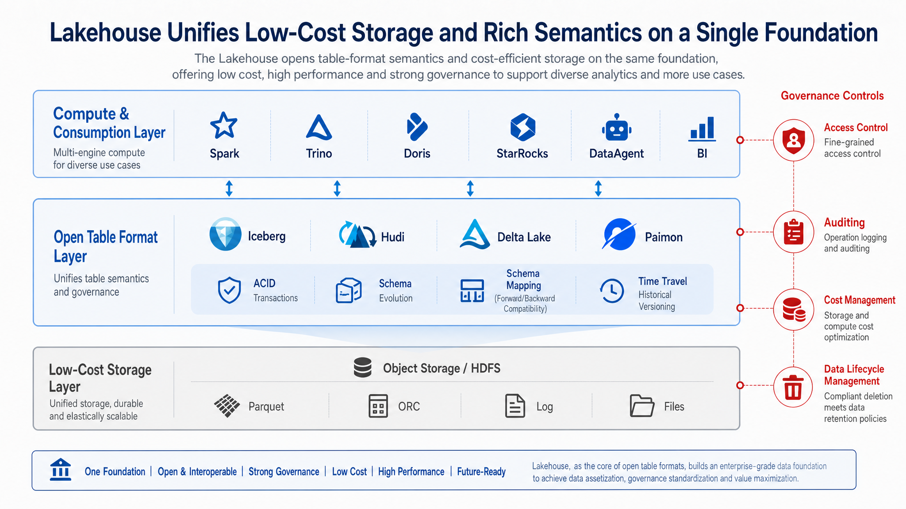
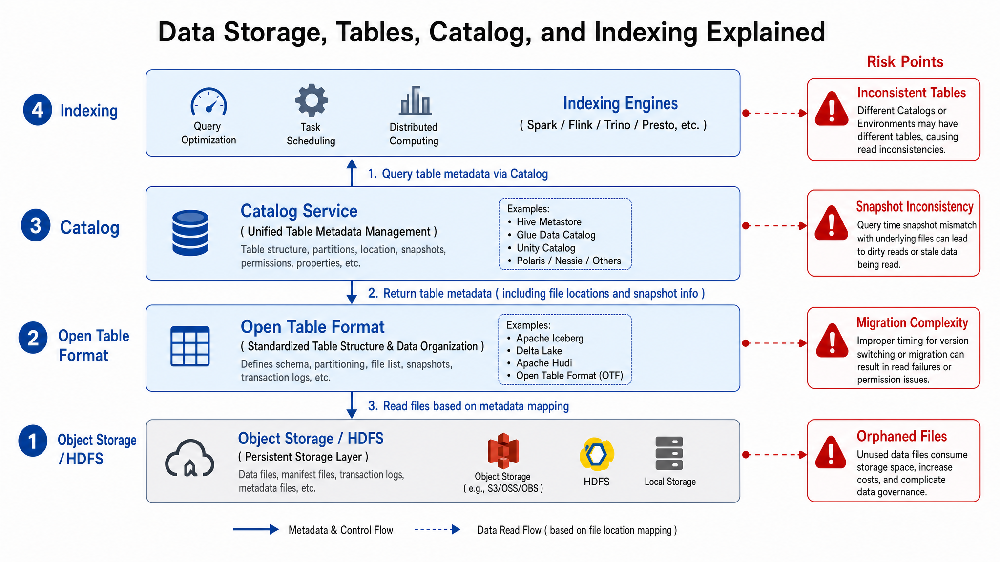
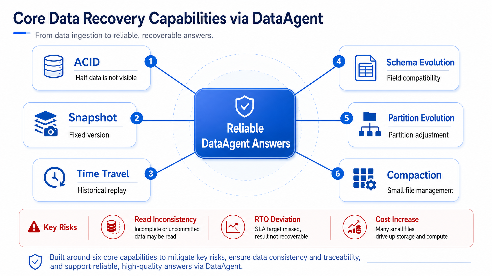
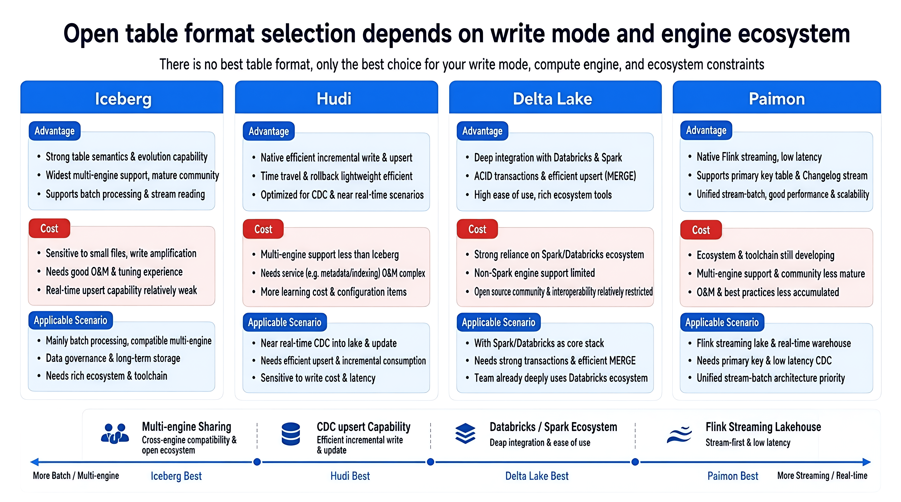
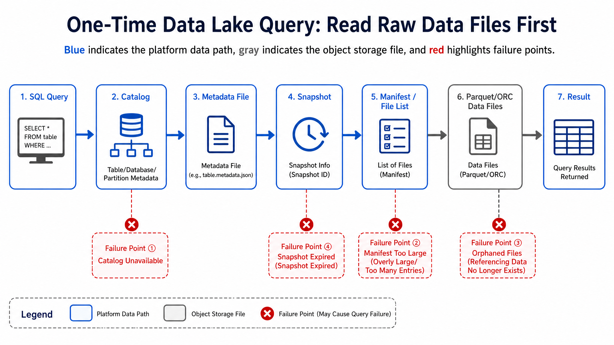
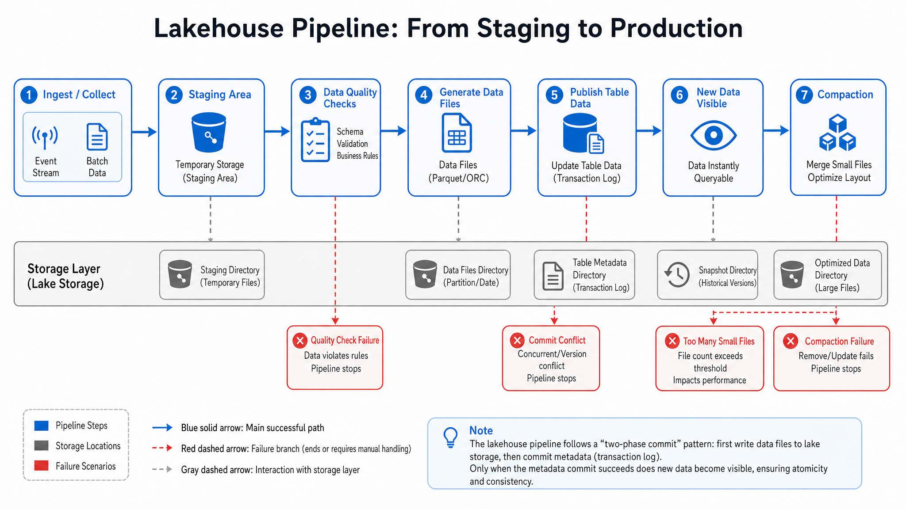
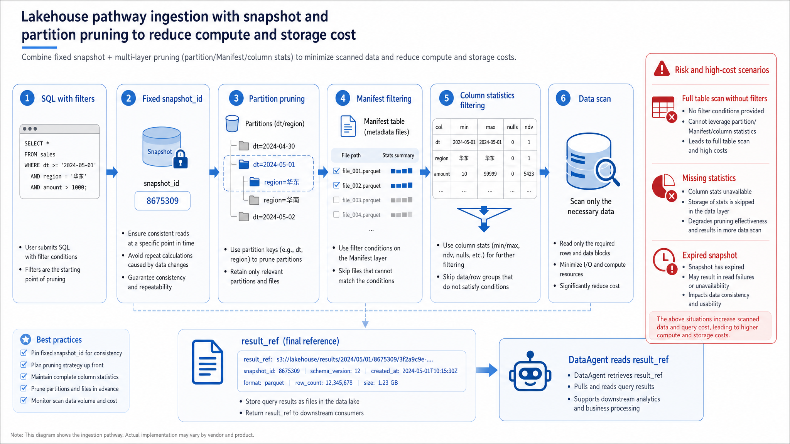
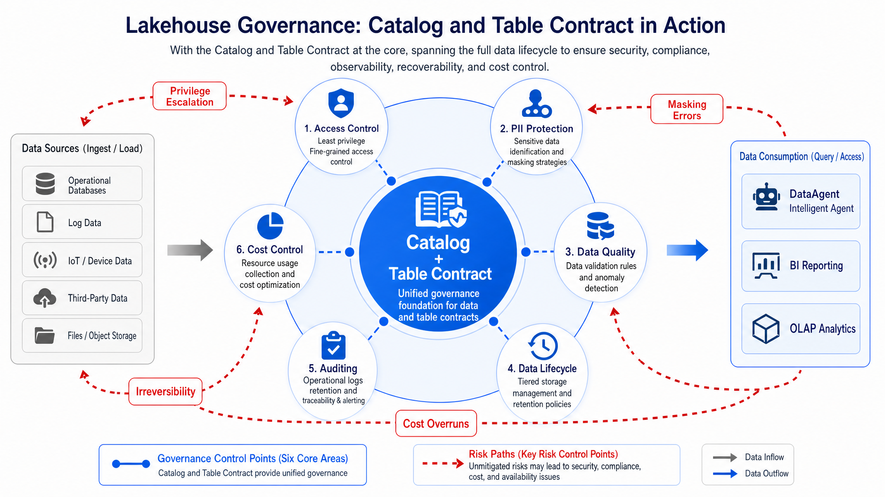

# Chapter 11 Data Lake and Lakehouse

---

This chapter introduces the core boundaries between data lakes and lakehouses, focusing on how open table formats, Catalogs, transaction commits, file layouts, and governance controls support reusable data assets. Agents need to confidently analyze and replay historical data, requiring a foundation that provides transactional consistency and time travel capabilities-precisely the value that open table formats (Iceberg, Delta, Hudi) offer over raw file lakes. This chapter compares these table formats, explains how Catalogs and file layout impact query performance and governance, and discusses why lakehouses have become the default data foundation for DataAgent platforms.

A DataAgent's wrong answer may superficially look like the model misunderstood the question, but underlying causes often include collection delay, schema changes, metric conflicts, or missing permission filters. Discussing why Agent platforms require traceable and replayable data foundations, comparing open table formats, and reviewing mini-platform implementation to clarify data lineage helps teams first identify data objects, then how changes propagate, and finally how quality and timeliness surface to upper-layer Agents.

## 11.1 Why the Agent Platform Needs a Traceable, Replayable Data Foundation

Chapter 10 resolved "how data enters the platform," and this chapter tackles "how to reliably store data after ingestion." A multi-business line company's DataAgent also answers current inventory and order status but must explain "which data the answer came from," "whether the same question's result can be reproduced last week," and "whether a field change affected past answers." Without a table-level foundation, only raw files exist, and Agent answers lack auditable evidence.

Data lakes provide low-cost, open-format multi-type storage suitable for raw files, logs, details, and historical archives. Data warehouses provide transactions, modeling, authorization, query optimization, and stable definitions suitable for reports and analytics. The lakehouse architecture aims to combine both: object storage or distributed files hold large-scale data, and open table formats manage transactions, snapshots, schemas, partitions, and versions, enabling multiple compute engines to collaborate over the same dataset.

For beginners, the easiest confusion is the difference between "storing many files" and "having a single table." Files answer "where are the bytes," while a table also answers "which data version do these files collectively represent." When an order sync generates 100 Parquet files, without a table format the query engine only sees files in a directory and cannot determine which files belong to the same commit, which files were deleted, or what schema is current. Agent answers must be explainable by data lineage, so what it needs is table semantics instead of isolated files.

Lakehouses also solve a long-term evolution problem. Enterprise data is rarely designed once: fields are added, partitioning adjusted, write engines replaced, query engines expanded. If data is tied to a single database or engine, migration and reuse costs become high. Open table formats externalize table transactions, snapshots, and file listings from engines, allowing data assets to be shared by multiple engines while preserving governance and audit boundaries.



*Figure 11-1: Lakehouse combines low-cost storage provided by object storage with transactional and schema semantics from open table formats into a unified foundation. Left annotation notes cost advantage; right annotation notes governance capability.*

The key of Figure 11-1 is "table semantics." Object storage only knows files and cannot inherently express "these files belong to the same transaction commit," "what the current table version is," "when a certain field appeared," or "which snapshot a query should read." Open table formats push this info into metadata layers, enabling lakehouse data to offer near-warehouse table management capabilities. Object storage is the low-cost physical base; table formats provide transactional, versioning, and governance control over those files.

### 11.1.1 From Data Lake to Lakehouse: Decoupling Object Storage, Open Table Formats, and Compute Engines

A lakehouse is more than dumping all data into object storage and querying it. It at least includes four boundary layers.

The value of these four boundaries is clearly defining "who is responsible for what." The storage layer handles file persistence but does not determine current table version; the table format layer manages which files belong to which snapshot but not all permissions or business catalogs; the Catalog layer registers table names, namespaces, permissions, and metadata locations but does not execute queries; the compute layer reads, writes, and computes but should not lock data assets into its private directory structures. The clearer the boundaries, the less chance of conflicts like same-name tables, stale schema, or permission drift when collaborating across multiple engines.

*Table 11-1: Responsibilities and boundaries of storage, table format, and compute engine layers. Source: Compiled by this book.*

| Layer         | Responsibility                                               | Typical Components                       | Difference from Adjacent Layers               |
|---------------|--------------------------------------------------------------|----------------------------------------|-----------------------------------------------|
| Storage Layer | Stores physical files                                         | Object storage, HDFS, Parquet, ORC     | Provides file read/write only; no table transactions understanding |
| Table Format  | Manages snapshots, transactions, schema, partitions, file listings | Iceberg, Hudi, Delta Lake, Paimon      | Defines table semantics; not responsible for all query optimizations |
| Catalog Layer | Registers table names, databases, permissions, metadata locations | Hive Metastore, REST Catalog, Unity Catalog | Handles discovery and governance; does not directly store all data files |
| Compute Layer | Reads and writes tables; runs SQL or jobs                     | Spark, Flink, Trino, Doris, StarRocks, DuckDB | Runs computations; should not monopolize data assets |



*Figure 11-2: Decoupling storage, table format, Catalog, and compute engines. Source: Compiled by this book. Alt text: Four independently replaceable blocks-object storage, open table format, Catalog, compute engines-connected by interface lines indicating any layer can upgrade independently without affecting others.*

Figure 11-2 shows the four boundaries: storage holds files, table formats define transactions and snapshots, Catalog handles discovery and governance, compute executes queries and writes. Clear boundaries prevent data assets being locked by a single engine. Bottom-up is the physical files gradually becoming governable table assets; top-down is query engines parsing user requests into file scans.

Decoupling yields two direct benefits. First, data assets are not locked to a single compute engine. The same Iceberg order table can be written by Spark, explored by Trino, accelerated by StarRocks, and queried semantically by DataAgent. Second, governance control points become clearer. Permissions, lineage, audit, and lifecycle policies can be managed around Catalog and table contracts instead of each engine's private config.

### 11.1.2 Core Lakehouse Capabilities

Enterprise Agent platforms especially depend on six lakehouse capabilities.

These are not a feature checklist but a trustworthy answer chain. ACID ensures Agents never read half-committed data; snapshots fix answers at a particular version; time travel enables auditing and replaying past answers; schema evolution allows traceable field changes; partition evolution allows layout adjustments as data grows; compaction prevents frequent writes from degrading query performance permanently. Lack any link, and Agents risk breaking between "can answer" and "can be trusted."

*Table 11-2: Core lakehouse capabilities such as ACID and time travel and their value to DataAgent. Source: Compiled by this book.*

| Capability                                | Meaning                                                | Value to DataAgent                              |
|-------------------------------------------|--------------------------------------------------------|------------------------------------------------|
| Atomicity, Consistency, Isolation, Durability (ACID) | Multi-file commits are either fully visible or fully invisible | Prevents Agent from reading partial commit data |
| Snapshot                                  | Each commit forms a stable version                      | Allows answer reproducibility; fixes query version |
| Time Travel                              | Reading by historical snapshot or timestamp             | Auditing past answers; replaying incidents      |
| Schema Evolution                         | Structured rules for adding, renaming, changing field types | Enables Agents to recognize field changes and impact scope |
| Partition Evolution                      | Partition strategy adjustable with business growth      | Avoids early partition design lock-in of long-term queries |
| Compaction                              | Merging small files and optimizing layout               | Reduces OLAP query cost and latency             |



*Figure 11-3: Core lakehouse capabilities supporting reproducible answers. Source: Compiled by this book. Alt text: ACID commit, snapshot, and time travel capabilities pointing to the goal "same query on same snapshot yields reproducible result," indicating these capabilities jointly support Agent answer auditability.*

Figure 11-3 connects lakehouse capabilities to Agent answer reliability. ACID, snapshots, time travel, schema evolution, partition evolution, and compaction are more than storage features; together they determine whether an answer can be reproduced, explained, and trusted even when fields evolve. Each capability corresponds to questions the user may ask: Was data fully committed? Which version was read? Did schema changes affect conclusions? Why did query cost suddenly spike?

### 11.1.3 Misjudgment Risks in Lakehouse Governance

First, equating object storage with lakehouse. Object storage stores files but does not provide table transactions, snapshot isolation, or schema evolution. Without table formats and Catalogs, a lakehouse degrades to an ungovernable heap of files. Determining if a system truly supports lakehouse semantics requires checking if it can answer current snapshot, historical version, field evolution, permissions, and cleanup policies-more than whether it uses object storage.

Second, assuming open table formats automatically bring high-performance queries. Table formats provide metadata and transactional semantics, but query performance depends on Chapter 12's engines, statistics, partitioning, file size, sorting, and caching. Table formats help engines identify relevant files but cannot replace proper data layout and execution plans.

Third, selecting formats for a single tool only. Lakehouse foundations should prioritize long-term openness and governance of data assets, more than cater to a specific compute engine's default format. If an organization is deeply tied to a platform, evaluate export, cross-engine reading, and historical migration costs. Format choices on core assets affect ingestion, scheduling, permissions, metrics, and Agent semantic layers.

---

## 11.2 Comparing Open Table Formats: Iceberg, Hudi, Delta Lake, and Paimon

Choosing an open table format depends on write mode, query engines, streaming and batch unification, community ecosystem, and existing organizational platforms. The following comparison emphasizes enterprise deployment scenarios rather than feature listings.

When selecting, first judge the table's primary write pattern. If most tables are batch-written, read across engines, and archived long-term, Iceberg's snapshot, partition evolution, and multi-engine ecosystem feel natural. If the main use is CDC ingestion, frequent upsert, and incremental consumption, Hudi or Paimon's update pipelines are worth evaluating. If the organization is deeply invested in Spark or Databricks, Delta Lake's platform integration lowers engineering costs. The format affects sinks, Catalog, compaction, read/write engines, and governance tools.

*Table 11-3: Advantages, costs, and applicable scenarios of Iceberg, Hudi, and Delta Lake open table formats. Source: Compiled by this book.*

| Solution      | Advantages                                               | Costs                                         | Suitable Scenarios                              | Recommendation by this book              |
|---------------|----------------------------------------------------------|-----------------------------------------------|------------------------------------------------|-----------------------------------------|
| Iceberg      | Mature snapshot, schema/partition evolution, multi-engine ecosystem; clear REST Catalog path | Streaming updates and incremental consumption require engine capability evaluation | Multi-engine shared lakehouse, long-term open data assets | Default table format for mini-platform  |
| Hudi         | Rich experience with upsert, incremental pull, and streaming-batch unification | More table services and parameters; higher operational complexity | CDC ingestion, near real-time updates, incremental consumption | Suitable for high-frequency upsert pipelines |
| Delta Lake   | Tight integration with Spark/Databricks ecosystem; smooth transactions | Non-Databricks environments require verifying compatibility item by item | Organizations invested in Databricks or Spark as main platform | Prioritized under platform lock-in scenarios |
| Paimon       | Designed for streaming lakehouses and real-time updates; fits Flink ecosystem | Multi-engine ecosystem still to be verified per version | Flink real-time pipelines and streaming-batch unified tables | Focus on real-time scenarios in Chapter 13 |



*Figure 11-4: Open table format selection depends on write mode and engine ecosystem. Source: Compiled by this book. Alt text: 2D matrix with write mode (append/upsert/stream) and engine ecosystem breadth axes, placing Iceberg, Delta, and Hudi in distinct regions to guide selection.*

Figure 11-4 reminds us not to pick formats solely by feature lists. Differences among Iceberg, Hudi, Delta Lake, and Paimon ultimately come down to write mode, query engines, streaming-batch needs, community ecosystems, and existing platforms. Write mode and engine ecosystem are equally important: writes determine table changes; engine ecosystem determines which systems can correctly read those changes.

### 11.2.1 Catalog, Manifest, Metadata Files, and Table Management on Object Storage

Lakehouse table reading is usually not "list all files in a directory." Compute engines first locate the table metadata through Catalog, then read table format metadata, manifests or transaction logs to determine which data files belong to the current snapshot, and finally prune partitions and predicates to read only necessary files.

Understanding this process is important because lakehouse performance and consistency start here. Catalog handles "where is the table" and "who can access it"; metadata files define "what is the current table definition"; manifests or file lists define "which files belong to this snapshot"; data files store the actual scans. If any layer is missing or misaligned, queries may run but deliver incorrect versions, permissions, or file sets.

*Table 11-4: Responsibilities and failure modes of Catalog, Manifest, metadata file, and other table management components. Source: Compiled by this book.*

| Component     | Responsibility                                         | Input                                  | Output                     | Failure Mode                                      |
|---------------|---------------------------------------------------------|---------------------------------------|----------------------------|--------------------------------------------------|
| Catalog       | Manage table names, namespaces, permissions, metadata locations | Table name, user identity, operation type | Metadata entry point, permission results | Same name but different tables, permission drift, Catalog unavailable |
| Metadata File | Records table-level schema, partitions, snapshot list      | Commit operation, schema changes      | Current table metadata      | Excessive metadata versions, commit conflicts    |
| Manifest / File List | Records data files and their statistics for snapshot    | Data files, partitions, statistics    | Prunable file list           | Too many small files, missing statistics          |
| Data File     | Stores actual business data                              | Parquet, ORC columnar files           | Scannable column data       | File corruption, poor layout, orphaned files     |
| Snapshot      | Fixes visible files after a commit                        | Commit ID, timestamp                   | Stable read version          | Snapshot inconsistencies between read/write, premature expiry |



*Figure 11-5: One lakehouse query first reads metadata and then data files. Source: Compiled by this book. Alt text: Query flow locates table via Catalog, reads manifest metadata for partition/file pruning, then reads only matched data files. Arrows show "metadata first to reduce scan volume."*

Figure 11-5 shows lakehouse queries do not directly scan directories. Engines locate metadata via Catalog, then read snapshots, manifests, and file statistics, then prune and scan only relevant data files. This explains why Catalog unavailability, manifest bloat, or missing statistics degrade query quality even if data files remain intact.

Example interface contract:

```json
{
  "table": "dwd.orders",
  "table_format": "iceberg",
  "catalog": "demo",
  "snapshot_id": "742",
  "primary_key": ["order_id"],
  "partition_fields": ["order_date"],
  "schema_version": "orders.v7",
  "data_freshness_seconds": 60,
  "time_travel_enabled": true
}
```

This contract lets DataAgent know also the table name but which snapshot to read, whether time travel is enabled, primary keys and partitions clear, and if freshness meets SLA. Without these fields, Agents cannot explain "up to what time data is included" or "why results are reproducible." Readers can treat this contract as DataAgent's access pass for lakehouse tables: existence is step one; with clear version, freshness, keys, partitions, and time travel, the table can enter automated analytic pipelines.

### 11.2.2 Data Write Paths: Batch Import, Streaming Writes, Upsert, Compaction, and Small File Management

Lakehouse writes are more than uploading files directly to a directory. Writers generate data files first, then use table format transactional commits to add files into new snapshots. CDC or upsert pipelines also handle keys, deletes, version comparisons, and conflict detection before committing.

"Write files first, then commit metadata" is the core lakehouse write principle. Data files can first be written to a staging area, and only when all files, stats, and checks pass does the writer atomically commit them into a new snapshot. This prevents readers seeing half-baked data if a write fails midway. To Agent platforms, it means queries see either the old snapshot or the new one, never half-updated.



*Figure 11-6: Lakehouse write path from staging files to atomic commit. Source: Compiled by this book. Alt text: Write pipeline first writes data files into staging, then creates a new snapshot and atomically switches Catalog pointer. Arrow indicates downstream reads old snapshot until commit, then new snapshot becomes fully visible.*

Figure 11-6 illustrates key control points. Writers generate files in staging, then atomically commit through the table format to a new snapshot; CDC/upsert pipelines handle keys, deletes, and conflicts pre-commit. Staging isolates uncommitted files; commit establishes visible versions; compaction later optimizes layouts.

#### Append tables and upsert tables

*Table 11-5: Tradeoffs between append and upsert write modes, their advantages, costs, and applicable scenarios. Source: Compiled by this book.*

| Solution  | Advantages                                   | Costs                             | Suitable Scenarios           | Recommendation                     |
|-----------|----------------------------------------------|----------------------------------|------------------------------|----------------------------------|
| Append Tables | Simple writes; audit-friendly; full event retention | Latest state queries require windows or aggregation | Behavioral logs, audit logs, changelogs | Raw layers prefer append         |
| Upsert Tables | Simple queries for latest state; fits business current tables | Requires primary key, version, and delete semantics | Orders current status, inventory current status, customer state | Common for service-facing dwd tables |

#### Immediate writes and asynchronous compaction

*Table 11-6: Tradeoffs between batch versus immediate visibility and small file costs. Source: Compiled by this book.*

| Solution       | Advantages                         | Costs                          | Suitable Scenarios                | Recommendation                      |
|----------------|----------------------------------|--------------------------------|---------------------------------|----------------------------------|
| Immediate Write | Faster visibility; simpler pipelines | Many small files; increased query cost | Low throughput, low latency pipelines | high-risk tables okay with monitoring |
| Async Compaction | More stable queries; better file layouts | Delay between result visibility and compaction | High-frequency writes, CDC ingestion, real-time detail data | Default production requires table services |

Append vs upsert reflects the tradeoff between retaining full historical changes and querying latest state simply. Raw layers usually keep full change records for audit and replay. Detail or service layers for Agents often maintain current tables to reduce query complexity. Immediate write vs async compaction tradeoff is between faster visibility and long-term stable queries. Frequent micro-batches lower freshness but without compaction, Chapter 12's OLAP queries will slow due to excessive small files and metadata overhead.

### 11.2.3 Data Read Paths: Snapshot Isolation, Predicate Pushdown, Partition Pruning, and Version Fixing

When reading lakehouse tables, compute engines reduce scanning in three ways. First, fix snapshots to ensure the entire query reads a consistent version. Second, use partition pruning and predicate pushdown to read only relevant date, store, or business partitions. Third, use columnar file statistics to skip data blocks unlikely to match.

These three techniques solve different problems. Fixed snapshot ensures consistency: multiple queries in one response process must read the same version. Partition pruning narrows scope by date, city, or business line. Predicate pushdown and column statistics skip unnecessary columns and data blocks even within chosen files. Beginners often attribute read performance entirely to engines, but table format metadata and file layout strongly influence scan size before execution.



*Figure 11-7: Lakehouse read path uses snapshot and pruning layers to control cost. Source: Compiled by this book. Alt text: Read path marks four filters-fixed snapshot version, partition pruning, column pruning, and file statistics skipping-gradually reducing actual data scanned.*

Figure 11-7 shows the read path serves both consistency and cost control. Fixed snapshots guarantee consistent versions for multiple query rounds, while partition pruning, predicate pushdown, and columnar stats reduce unnecessary files and columns scanned. The order-fix version, prune files, then scan data-forms the foundation for reproducible queries with controllable cost.

For Agent platforms, version fixing is even more important than pure performance optimization. DataAgent may query order totals, then abnormal stores, then supplier impacts in multiple turns. If these read different snapshots, answers may contradict. Platforms should write `snapshot_id` or equivalent version info into query context and audit logs.

### 11.2.4 Lakehouse Governance: Permissions, Lifecycle, Audits, Data Layering, and Cost Control

Lakehouse governance cannot rely solely on object storage directory permissions. Table-level, column-level, and row-level access; PII tagging; lifecycle policies; snapshot retention; audit logs; and cost attribution must be managed centrally around Catalogs and table contracts.

This is because lakehouses are often accessed by multiple engines concurrently. If permissions are only on object storage directories, Spark, Trino, Doris external tables, and notebooks may circumvent or diverge. If authorization only happens inside one engine, others may not see or enforce identical policies. Governance must revolve back to table assets, attaching permissions, lifecycle, snapshots, PII, and auditing to Catalog and table contracts, then publishing to all compute engines.



*Figure 11-8: Lakehouse governance control points center on Catalog and table contracts. Source: Compiled by this book. Alt text: Diagram radiates permissions, lifecycle, audit, layering, and cost control outward from Catalog center, indicating governance unified on Catalog and table contracts.*

Figure 11-8 converges lakehouse governance controls into Catalog and table contracts. Permissions, lifecycle, snapshots, PII, cost, and audits must unify around the table asset or fragmented engine-specific policies will conflict. Catalog is the governance entry point; table contracts carry the governance rules; query engines act as enforcement endpoints.

*Table 11-7: Recommended control points and risks from missing governance objects such as permissions, lifecycle, audits. Source: Compiled by this book.*

| Governance Object | Recommended Control Points                       | Risks If Missing                       |
|-------------------|-------------------------------------------------|--------------------------------------|
| Permissions       | Catalog authorization, row/column policies, engine permission reconciliation | Different engines see different data |
| Lifecycle        | Retention defined per raw, detail, and aggregate tiers | Uncontrolled storage costs or lack of history traceability |
| Snapshot         | Retention windows set by table value              | Historical answers cannot be reproduced |
| PII              | Field labeling, masking policies, audits          | Agents may leak sensitive information |
| Cost              | File sizes, partitions, query scan volume attribution | Object storage and compute costs become uncontrollable |
| Audit             | Records of commits, reads, deletes, permission changes | Incidents cannot locate root cause or impact |

## 11.3 Lakehouse tables exposed to DataAgent

Currently, the mini-platform does not connect to a real Iceberg Catalog nor embed DuckDB queries in this chapter. Instead, it first implements a minimal contract and readability check for lakehouse tables exposed to DataAgent, laying foundation for Chapter 12's engine routing.

The teaching point is concretizing lakehouse capabilities into inspectable fields. Real platforms have complex Catalog and metadata implementations for Iceberg, Hudi, Delta Lake, or Paimon; mini-platform retains only the minimal set DataAgent cares about most: table format, Catalog, snapshot, primary key, partition fields, freshness, and time travel. This lets readers grasp "which tables are suitable for Agent queries" before diving into real engine and Catalog integrations.

- Entry point: `mini-platform/infra/lakehouse/__init__.py`
- Core implementation: `mini-platform/infra/lakehouse/table_contract.py`
- Tests: `mini-platform/tests/test_lakehouse_table_contract.py`
- Demo project: `mini-platform/projects/11-lakehouse-contract/run.py`

`mini-platform/infra/lakehouse/table_contract.py`:

```python
class TableFormat(str, Enum):
    ICEBERG = "iceberg"
    HUDI = "hudi"
    DELTA = "delta"
    PAIMON = "paimon"
```

Core contract object:

```python
@dataclass(frozen=True)
class LakehouseTableContract:
    table: str
    table_format: TableFormat
    catalog: str
    snapshot_id: str
    primary_key: tuple[str, ...]
    partition_fields: tuple[str, ...]
    schema_version: str
    data_freshness_seconds: int
    time_travel_enabled: bool
```

Readability checks keep four minimal controls: primary key, partitions, freshness, and time travel.

```python
def validate_agent_readiness(contract: LakehouseTableContract) -> dict[str, Any]:
    missing: list[str] = []
    if not contract.primary_key:
        missing.append("primary_key")
    if not contract.partition_fields:
        missing.append("partition_fields")
    if contract.data_freshness_seconds > 3600:
        missing.append("freshness_slo")
    if not contract.time_travel_enabled:
        missing.append("time_travel")

    return {
        "table": contract.table,
        "ready": not missing,
        "missing_controls": tuple(missing),
        "snapshot_id": contract.snapshot_id,
    }
```

Run tests:

```bash
cd enterprise_agent_platform_book/mini-platform
python3 -m pytest tests/test_lakehouse_table_contract.py -q
```

Run demo:

```bash
cd enterprise_agent_platform_book/mini-platform/projects/11-lakehouse-contract
PYTHONPATH=../.. python3 run.py
```

Expected output:

```text
dwd.orders snapshot=742 format=iceberg
agent_ready=True missing=()
```

This output indicates `dwd.orders` has primary key, partitions, snapshot, freshness, and time travel controls, qualifying it as an Agent readable candidate table. Missing any control results in `ready=False` with missing list. Real platforms should surface these signals via Chapter 15's data catalog and Chapter 34's NL2SQL table selection logic.

### 11.3.1 Gatekeeping and Operational Constraints

- [ ] Catalog: Production tables are uniformly registered under one governed Catalog; no multi-engine private maintenance of same-named tables.
- [ ] Table Format: Core lakehouse tables clearly specify Iceberg, Hudi, Delta Lake, or Paimon and record version compatibility.
- [ ] Snapshot: Key tables retain sufficiently long snapshot windows to satisfy audit and Agent answer replay needs.
- [ ] Schema: Additions, deletions, renames, and type changes must pass compatibility checks and announcements.
- [ ] Partitioning: Partition fields should serve main query patterns, avoiding over-partitioning or high cardinality.
- [ ] Small Files: Monitor file counts, average file size, manifest counts, and compaction latency.
- [ ] Permissions: Regular reconciliation of Catalog, object storage, and compute engine permissions.
- [ ] PII: Field tags and masking policies embedded in table contracts; Agent queries must enforce filtering.
- [ ] Lifecycle: Retention policies defined per raw, detail, aggregate, and sandbox layers.
- [ ] Audits: Record table commits, snapshot reads, deletes, permission changes, and cleanup jobs.
- [ ] Cost: Track scan volumes and object storage requests by table, team, and engine.
- [ ] Disaster Recovery: Backup and restoration drills for Catalog metadata, object storage data and key snapshots.

### 11.3.2 Failure Scenarios and Remediation Paths

#### Object storage directories are deleted as if they were tables

Cleanup scripts sometimes delete production data files by path because the table looks like an ordinary object storage directory. The actual failure is a governance bypass: the script skips the table format and Catalog, so snapshots still reference files that no longer exist. Production deletes should go through table format tools and Catalog audits, and direct write permissions on table directories should be limited to table service accounts.

#### Snapshot retention windows are too short for historical replay

If snapshot retention is tuned only for storage cost, a business team may be unable to reproduce a DataAgent answer from a week ago. Key tables need retention windows based on audit value, also data volume. Query logs should store `snapshot_id`, and essential metadata should be archived long enough to support incident review, compliance review, and answer replay.

#### Small files drive sudden OLAP query cost increases

CDC ingestion often creates many small files when micro-batches are too frequent or compaction falls behind. Trino and StarRocks may still read the table correctly, but manifest overhead and file open cost push latency and cost upward. The repair is to increase write batch size where freshness allows, schedule compaction with alerts, and materialize hot query paths into service layers when repeated Agent queries hit the same data.

#### Engines maintain inconsistent Catalog namespaces

When Spark, Trino, BI tools, and notebooks maintain private table definitions, the same logical name can resolve to different data. Spark may write `dwd.orders` while Trino reads an older path, causing DataAgent answers to diverge from reports. A unified Catalog and publishing workflow should be the production default, and query audits should record catalog, table, and `snapshot_id`. Private paths belong in exploration, not production Agent access.

---

## Chapter Recap

1. The core of lakehouse is not object storage, but providing table transactions, snapshots, schema, partitions, and governance semantics over open storage.
2. Iceberg, Hudi, Delta Lake, and Paimon can all build lakehouses, but differ in supported write modes, engine ecosystems, and organizational assumptions.
3. DataAgent needs contract fields beyond the table name, including Catalog, snapshot, primary key, partitions, freshness, and time travel capability.
4. Small files, snapshot cleanup, schema evolution, Catalog drift, and orphan files are common causes of lakehouse production incidents.
5. The mini-platform crystallizes Agent readability with minimal contracts first; real lakehouse connections come after contracts and governance boundaries are well defined.

- Official Docs: [Apache Iceberg Documentation](https://iceberg.apache.org/docs/latest/)
- Official Docs: [Apache Hudi Documentation](https://hudi.apache.org/docs/overview/)
- Official Docs: [Delta Lake Documentation](https://docs.delta.io/)
- Official Docs: [Apache Paimon Documentation](https://paimon.apache.org/docs/master/)
- Analogous Projects: Apache Iceberg, Apache Hudi, Delta Lake, Apache Paimon, Apache Hive Metastore
- Related Chapters: [Chapter 10 Data Collection and Integration](ch10.md), [Chapter 12 Lakehouse Engines and OLAP](ch12-olap.md), [Chapter 13 Streaming Computing and Real-Time Data](ch13.md), [Chapter 15 Metadata, Lineage, Contracts, and Metrics](ch15.md), [Chapter 34 NL2SQL Engineering](../../part06-dataagent/en/ch34-nl2sql.md)

## References

Apache Iceberg. (n.d.). [Documentation](https://iceberg.apache.org/docs/latest/).

Delta Lake. (n.d.). [Documentation](https://docs.delta.io/).

Apache Hudi. (n.d.). [Documentation](https://hudi.apache.org/docs/overview/).

Apache Paimon. (n.d.). [Documentation](https://paimon.apache.org/docs/).
