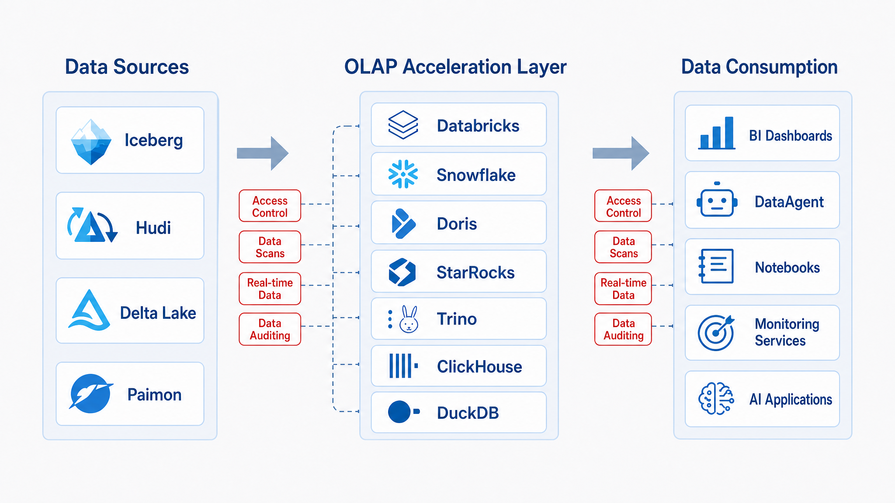
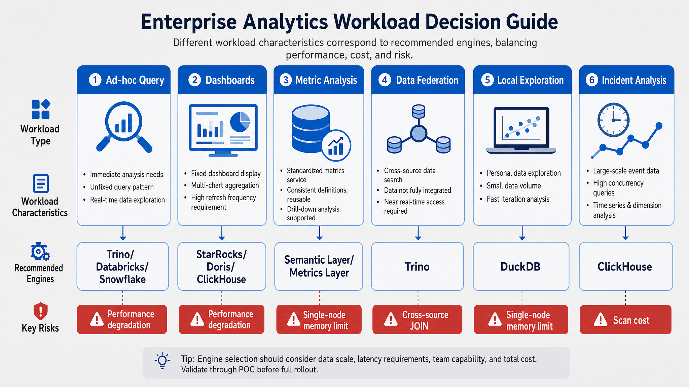
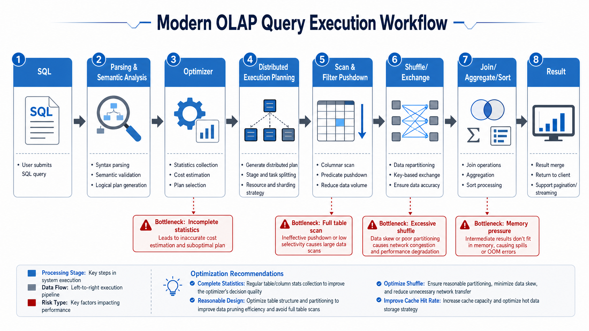
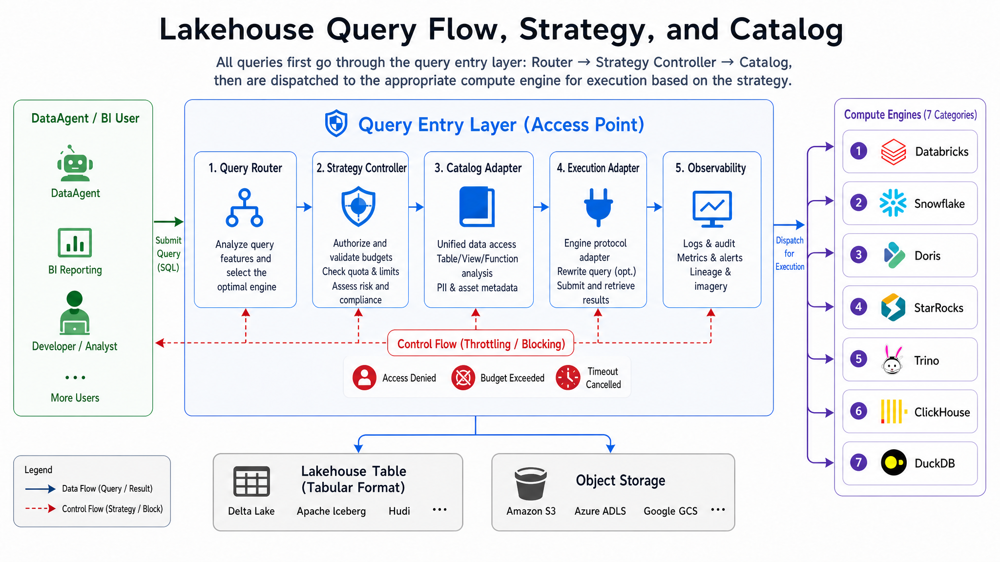
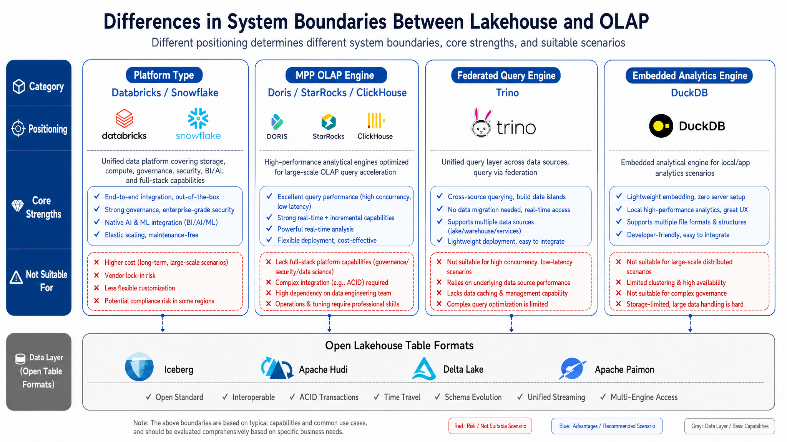
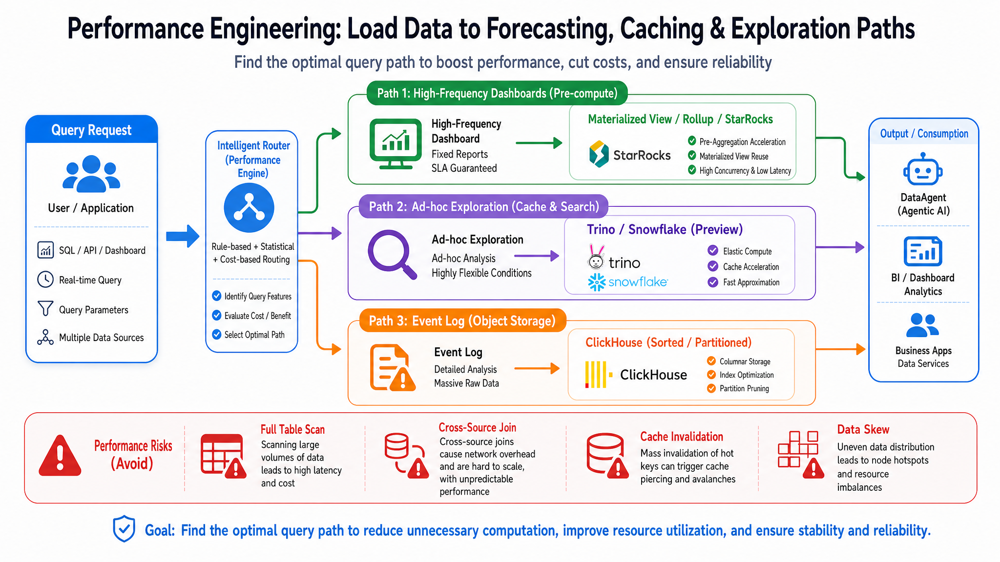
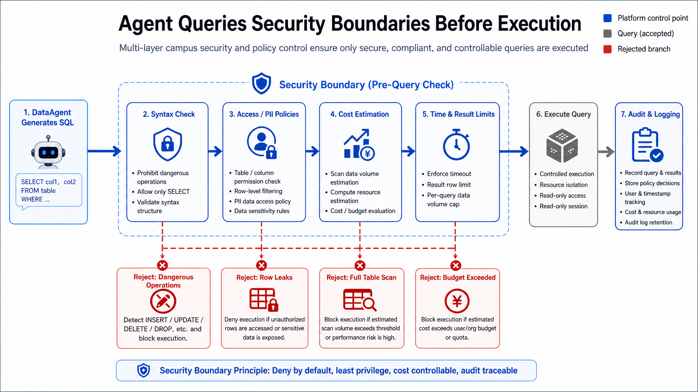
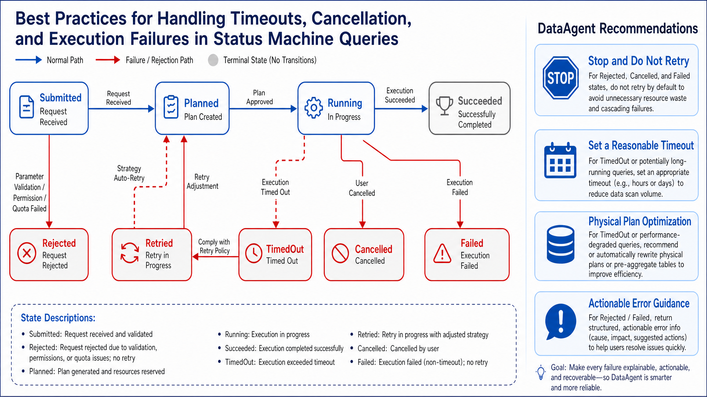
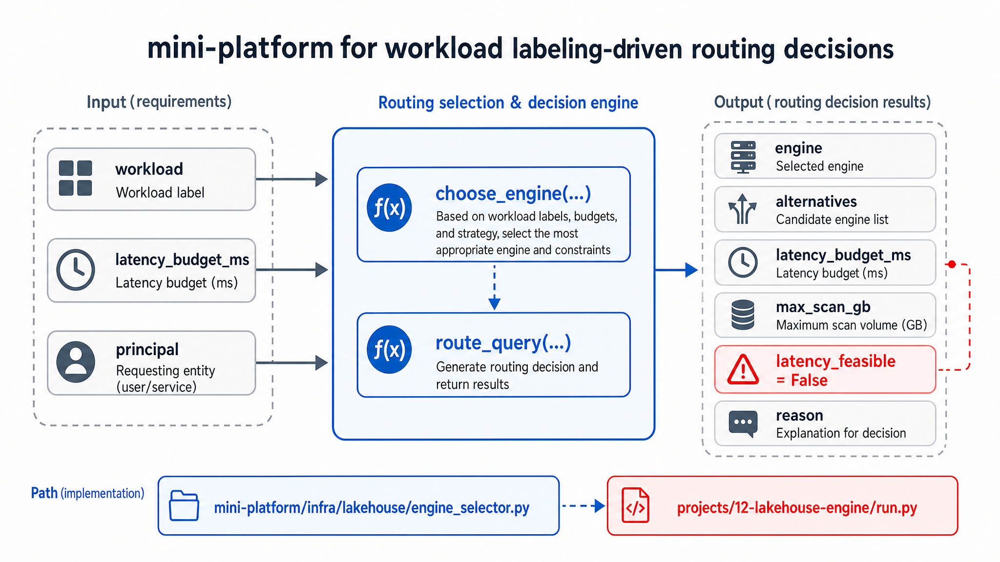

# Chapter 12 Lakehouse Engines and OLAP

---

This chapter discusses the role of lakehouse engines and OLAP within the Agent analytics pipeline, explaining how multi-engine routing, query governance, security boundaries, and performance engineering collectively determine execution quality. The SQL generated by DataAgent ultimately lands on a specific engine for execution; choosing Trino, ClickHouse, or StarRocks directly impacts latency, concurrency, and cost. The chapter presents methods for routing queries by type across engines, explains how query resource controls, timeouts, and security boundaries prevent runaway SQL from overwhelming the platform, and outlines common performance engineering practices.

When DataAgent returns a wrong answer, superficially it may seem like the model did not understand the question, but underlying causes could be ingestion delays, schema changes, metric definition conflicts, or missing permission filters. By clarifying the role of OLAP engines in DataAgent's analytics execution pipeline, lakehouse query paths, and mini-platform implementation, teams can first confirm data objects, then understand how changes propagate, and finally verify how quality and timeliness surface to upstream Agents.

## 12.1 Role of OLAP Engines in the DataAgent Analytics Execution Pipeline

Chapter 11 addressed how lakehouse tables can be reliably stored; Chapter 12 tackles how these tables are queried, analyzed, and served. A multi-line-of-business enterprise's data has entered the lakehouse via ingestion pipelines-orders, inventory, members, tickets, and device data are managed as open tables. But not all business questions fit the same compute system. Finance dashboards require stable sub-second responses; operations teams need high concurrency querying same-day sales; data scientists want to read sampled data in Notebooks; DataAgent needs to explore across MySQL, Iceberg, and metric layers.

The role of an online analytical processing (OLAP) engine is to optimize broad scans, filtering, aggregations, joins, sorting, and window functions. This differs from online transaction processing (OLTP) databases, which serve short transactions, point lookups, row-level updates, and high-concurrency writes. Pushing complex analytics directly onto OLTP source systems harms production; funneling all analytics into a single generic engine incurs latency, cost, or governance tradeoffs.

You can think of the OLAP engine as the "compute adapter layer" between lakehouse tables and business consumption. The lakehouse stores data assets, but users want metrics, reports, exploration results, and explainable SQL outputs. Different consumption modes demand different compute adapter attributes: dashboards require stable low latency, ad hoc analyses need flexible SQL, event analytics demand high write throughput and time filters, local exploration requires low cost and embeddability. Without this layer, the platform ends up jamming all queries into one system, causing slow queries to drag down dashboards or forcing sacrifices in exploratory flexibility to achieve low latency.

For DataAgent, the OLAP engine also enforces "controlled execution." After Agent generates a query, the platform must choose the appropriate engine, limit scan volume, apply permission policies, enforce timeouts, record audits, and return explainable errors. The engine is not passive storage but an execution boundary within the Agent analytics chain.



*Figure 12-1: OLAP engines transform lakehouse data into consumable data services. Source: author. Alt text: Underlying lakehouse tables are queried by OLAP engines and served upward to dashboards, APIs, DataAgent, etc. Engines act as the query service layer between storage and consumption.*

Figure 12-1 illustrates "one lakehouse asset, multiple consumption modes." DataAgent's ad hoc exploration may use Trino; fixed operational dashboards use StarRocks or Doris; log and event analytics use ClickHouse; unified data engineering and ML use Databricks; cloud data warehouse standard reports use Snowflake; local sampling validation uses DuckDB. The key is not adding engines for the sake of it, but controlling routing, permissions, cost, and audits through a unified entrypoint. Two questions arise: which workloads follow which paths, and whether these paths remain under unified governance.

### 12.1.1 Enterprise Analytics Workload Classification

Engine selection should start with workload classification.

Workload type matters more than product name because the same SQL engine can behave very differently under different workloads. Ad hoc queries prioritize flexible joins and fault tolerance; fixed dashboards emphasize concurrency and stable latency; metric queries require consistent definitions and cacheability; federated queries hinge on connector capabilities; local exploration values single-node efficiency and usability; event analytics require time filters and high write throughput. Identifying workloads lets platforms assign distinct latency targets, budgets, permissions, and degradation strategies.

*Table 12-1: Latency targets and engine recommendations by analysis workload (source: author)*

| Workload         | Typical Question                             | Latency Target   | More Natural Engine(s)                 |
|------------------|---------------------------------------------|-----------------|--------------------------------------|
| Ad hoc query     | "Which suppliers relate to this anomalous store?" | Seconds to minutes | Trino, Databricks, Snowflake          |
| Dashboard       | "Refresh today's store sales by city"       | Subsecond to several seconds | StarRocks, Doris, ClickHouse, Snowflake |
| Metric query    | "Same store YoY, repurchase rate, payment success rate" | Stable seconds   | Materialized views, metric layers, real-time OLAP |
| Federated query | "Join lakehouse orders with MySQL promotions" | Seconds to minutes | Trino, Databricks federation          |
| Local exploration | "Sample Parquet to validate definitions"  | Interactive single-node | DuckDB                               |
| Event analytics | "Recent 5-minute clickstream anomaly"       | Seconds          | ClickHouse, StarRocks, Doris          |



*Figure 12-2: Enterprise analysis workloads determine candidate engines. Source: author. Alt text: Left lists workloads like ad hoc query, fixed reports, point lookups, real-time dashboards, connected by arrows to suitable engine types, illustrating workload characteristics guide engine selection.*

Figure 12-2 shows engine choice starts with workload identification. Different workloads have distinct latency, concurrency, cost, and governance requirements, naturally aligning with different candidate engine sets. These candidates are not fixed answers but a prompt to clarify "why the query exists" before choosing execution systems.

### 12.1.2 Core OLAP Mechanisms

Modern OLAP engines optimize around six mechanisms: columnar storage reading only necessary columns; encoding and compression reducing I/O; vectorized execution processing data in batches; massively parallel processing (MPP) distributing workload across nodes; optimizers using statistics to select plans; caching and materialized views reducing repeated computation.

Together, these address how to scan large data volumes cheaply and quickly aggregate. Columnar storage lets queries read only needed columns like `city` and `amount` instead of whole rows; compression reduces disk and network load; vectorized execution batches CPU processing; MPP splits scans and aggregation across nodes; optimizers decide filter vs join order; caching/materialized views avoid recomputation. Understanding these helps diagnose slow queries as layout, stats, join plan, or resource isolation issues.



*Figure 12-3: Modern OLAP query execution pipeline. Source: author. Alt text: horizontally shows SQL parse, logical plan, optimizer, distributed execution, result return, each annotating key steps to illustrate flow from query text to results.*

Figure 12-3 shows easily overlooked optimizer and data layout roles. Without stats, engines may pick poor join orders; if partitions and sort keys do not align with filters, even vectorized execution becomes full scans. Chapter 11's table formats, partitions, file size, and snapshot management directly affect query cost here. Queries go through parse, optimize, split, schedule, then scan and aggregate. Missing inputs at any stage amplify costs downstream.

### 12.1.3 Misjudgment Risks in Engine Selection

First, "Having lakehouse table formats means OLAP engines are unnecessary." Table formats solve openness, but query performance depends on execution engine, data layout, stats, caching, concurrency control. Table format answers "which files yield consistent reads," OLAP engines solve "how to efficiently read and compute over those files." They address different layers.

Second, "All analytics workloads should unify on one engine." Unification reduces governance complexity but sacrifices cost or latency for certain workloads. A pragmatic approach unifies metadata, permissions, and audit while enabling multiple engines to co-exist over one data source. The unified plane is control, not forcibly single execution.

Third, "Choose engines solely by benchmark rankings." Benchmarks can't replace assessment of real data distributions, realistic SQL, concurrency, write patterns, permission models, cost, and operations capabilities. An engine fast on synthetic tests may not suit a complex multi-line business with skew, hot-cold tiers, and Agent query patterns.

---

## 12.2 Lakehouse Query Path: Collaboration among Catalog, Open Table Formats, Object Storage, and Compute Engines

A controlled lakehouse query typically passes five steps: user/DataAgent submits intent; query router selects engine; policy controller validates permissions, budgets, timeouts; catalog adapter resolves tables, snapshots, connections; execution adapter submits to engine and returns result handle.

The core idea is "control before execution." DataAgent's SQL merely expresses intent and cannot be directly submitted. The platform must first decide workload type, user permission, scan budget, snapshot fixation, and usage of masked views. Only after these checks, the execution adapter sends the query to Trino, StarRocks, Snowflake, or others.



*Figure 12-4: Controlled lakehouse queries pass routing, policy, and catalog. Source: author. Alt text: Query flows through query router, policy engine (permissions/quotas), and catalog (metadata/row-column level permissions) before submission to engine.*

Figure 12-4 shows the essential path for controlled queries. Queries first pass routing and policy validations, then catalog resolves tables, snapshots, and connections, finally submitting to the execution engine. Ordering routing, policy, and catalog upstream makes governance a gate, not an audit patch after query completion.

Platforms should not allow DataAgent, BI, or business systems to connect directly bare to all engines. Bare connections cause three problems: inconsistent permissions, untraceable cost attribution, and inexplicable failures. A unified ingress need not be a heavy gateway; starting with rule-based routing and audit records suffices. Early-stage platforms capturing workload tags, engine choice, user identity, snapshot, and error codes already enable troubleshooting and auditing.

### 12.2.1 Engine Ecosystem Comparison

*Table 12-2: Representative products and use cases for platform lakehouses, MPP, real-time OLAP, etc. (source: author)*

| Type             | Representative Products   | Why Use                   | Not Suitable For                      | Alternatives                    |
|------------------|---------------------------|---------------------------|-------------------------------------|--------------------------------|
| Platform Lakehouse | Databricks                | Integrated data engineering, SQL, ML, governance | High cost for single low-latency dashboards | Snowflake, Doris/StarRocks + Spark |
| Cloud-Native DW   | Snowflake                 | SQL warehouse, elastic warehouses, low ops | Ultra-low latency events or strong local deployments | Databricks, ClickHouse, Doris   |
| Real-time OLAP    | Doris, StarRocks          | High concurrency reporting, materialized views, MySQL ecosystem | Cross-source exploration, heavy data engineering | Trino, Databricks, Snowflake   |
| Event Analytics   | ClickHouse                | Logs, events, time series, wide table aggregation | Unclear schema or frequent transactional updates | StarRocks, Doris               |
| Federated Query   | Trino                     | Multi-source joins, open lakehouse SQL entry | High-frequency fixed reporting, costly cross-source joins | Pre-built datasets, materialized views |
| Embedded Analytics | DuckDB                    | Local files, notebooks, lightweight ETL | Multi-tenant, high concurrency, cluster-level governance | Trino, Spark, local service engines |

This table is not a "product ranking." Databricks and Snowflake function more as platforms or managed services covering broad governance and engineering; Doris, StarRocks, ClickHouse lean toward low-latency service analytics; Trino excels in connectors and federated queries; DuckDB shines locally and embedded. Enterprises usually identify main paths, reserving specialized tools for niche workloads.



*Figure 12-5: System boundaries differ among seven lakehouse and OLAP engines. Source: author. Alt text: Seven engine types aligned horizontally, annotating storage coupling, latency profiles, concurrency, and suitable workloads to contrast system boundary distinctions.*

Figure 12-5 shows system boundaries. Databricks, Snowflake, Doris, StarRocks, ClickHouse, Trino, and DuckDB can serve analytics but lean toward platformization, managed warehouses, real-time serving, event analysis, federated queries, or local exploration. Selection depends on "where the responsibility ends": some include governance and engineering platforms, others primarily execution, some embed locally.

The message: first determine system boundaries, then compare product capabilities. Databricks and Snowflake favor platform/managed experiences; Doris, StarRocks, ClickHouse favor low latency service analytics; Trino fits connectors and federated queries; DuckDB suits single-node local analysis. The same Iceberg table can be read by multiple engines, but each access path requires distinct SLAs, budgets, and operational playbooks.

### 12.2.2 SQL Dialects, Permission Models, Resource Pools, and Multi-Tenancy Isolation

In multi-engine collaboration, platforms often underestimate non-performance issues. SQL dialect differences cause DataAgent-generated statements to run in one engine but fail in another; permission model differences make the same user see different columns on different endpoints; resource pools and warehouse configurations cause unpredictable cost and concurrency.

Routers cannot return just an engine name. They must also indicate workload type, SQL dialects used, table and column access rights, scan budgets, and fallback permissions on failure. For DataAgent, dialect differences are high-risk: the same date function, JSON function, or approximate aggregation may differ in syntax and semantics across engines. Platforms must either fix dialect before SQL generation or perform syntax transformation and validation before submission.

*Table 12-3: Responsibilities, inputs/outputs, and failure modes of query router, policy engine, etc. (source: author)*

| Component         | Responsibility                                | Input                              | Output                                     | Failure Mode                 |
|-------------------|-----------------------------------------------|----------------------------------|--------------------------------------------|-----------------------------|
| Query Router      | Select engine based on workload, data location, latency, and budget | Query intent, SQL, user, workload tags | Engine choice, query submit request         | Stale routing rules, misrouting |
| Catalog Adapter   | Map platform assets to engine catalog/schema/table | Metadata, permissions, snapshots | Engine-recognized data source definitions   | Metadata drift, credential expiration |
| Policy Controller | Enforce permissions, row/column policies, budget, concurrency | User, roles, data classification, budget | Allow/deny or degrade                      | Permission leakage, budget runaway |
| Execution Adapter | Adapt to different engine protocols            | Query requests, connection info, timeout | Query states, result handles                 | Connection pool exhaustion, engine down |
| Observability Collector | Record duration, scan amount, cost, errors, lineage | Query lifecycle events           | Traces, metrics, audit logs                   | Missing logs, cost attribution failure |

Example interface contract:

```text
POST /api/lakehouse/query
Request:
{
  "principal": "user:finance_analyst_01",
  "workload": "realtime_bi",
  "sql": "select city, sum(amount) from mart.sales group by city",
  "latency_budget_ms": 3000,
  "cost_budget": "low",
  "result_mode": "preview"
}

Response:
{
  "query_id": "q_20260611_001",
  "engine": "StarRocks",
  "state": "submitted",
  "result_ref": "lakehouse-results/q_20260611_001"
}

Errors:
{
  "code": "POLICY_DENIED | ENGINE_UNAVAILABLE | QUERY_TIMEOUT | COST_BUDGET_EXCEEDED",
  "reason": "...",
  "retryable": true
}
```

The contract splits query execution into observable states rather than simply returning result tables. The `workload` helps routing; `latency_budget_ms` and `cost_budget` help policy evaluation; `result_mode` determines preview versus materialized results. The `retryable` flag is important-permission denials and budget overruns usually should not trigger automatic retries; temporary engine unavailability may trigger failover or rerouting.

### 12.2.3 Performance Engineering: Materialized Views, Rollups, Data Distribution, Hot-Cold Layers, and Query Acceleration

Performance engineering begins with query patterns and data layout, not throwing more machines at the problem. Fixed dashboards prioritize materialized views, aggregates, rollups, or service-wide wide tables; exploratory queries limit scan size and concurrency; log/event analytics design around sort keys, partitions, compression; cold historical queries accept higher latency or use low-cost engines.

Step one is to separate queries into "recurring" and "ad hoc." Recurring queries should push cost forward via precomputation, materialized views, caches, and wide tables; ad hoc queries require controlled scanning and concurrency to avoid a few exploratory requests overwhelming the cluster. This is high-risk for DataAgent, which can automatically launch multiple exploratory queries in a conversation-without budgets or cache, a simple follow-up can become an expensive query batch.



*Figure 12-6: Performance engineering directs workloads to precomputation, caching, and exploration. Source: author. Alt text: Queries routed by characteristic-high-frequency fixed queries to materialized views/rollups, repeated queries to cache, low-frequency exploratory queries to federated/direct scanning, each path annotated with benefits.*

Figure 12-6 shows performance engineering's core is workload steering, not simple scale-up. High-frequency dashboards leverage precompute and cache; exploratory queries enforce scan and concurrency limits; cold queries accept higher latency or use low-cost engines. The routing logic in this figure maps directly to workload classification in 12.2: classify, then choose precompute, cache, throttle, or degrade.

#### Single-engine unification and multi-engine collaboration

*Table 12-4: Tradeoffs of single-engine unification and multi-engine routing (source: author)*

| Approach        | Advantages                      | Cost                              | Suitable Situations            | mini-platform Choice          |
|-----------------|--------------------------------|---------------------------------|-------------------------------|------------------------------|
| Single Engine Unification | Simple governance, centralized ops, consistent UX | Suboptimal cost or performance for specific loads | Early-stage organizations, homogeneous loads | Initial recommended strategy |
| Multi-Engine Collaboration | Choose cost/performance optimal by workload | Complex routing, permissions, audit, consistency | Multiple teams, multiple loads, complex legacy | Default modeling approach    |

#### Federated queries and pre-built datasets

*Table 12-5: Benefits and costs of materialized views, federated queries, etc. (source: author)*

| Approach         | Advantages                       | Costs                              | Suitable Situations         | mini-platform Choice             |
|------------------|---------------------------------|----------------------------------|----------------------------|---------------------------------|
| Federated Query  | Fast cross-source exploration without data movement | Unpredictable costs/stability in cross-source joins | Temporary analysis, low-frequency exploration, data discovery | `federated_query` routed to Trino |
| Pre-Built Dataset | Stable latency, controllable cost, clear permissions | Requires modeling, scheduling, maintenance | High-frequency reports, common DataAgent metrics | Production query path preferred |

Single-engine unification suits early platforms but once loads diversify, execution paths should be logically distinct. Federated queries serve exploration, not long-term reporting; frequent federated queries should be converted to pre-built datasets, materialized views, or metric layers. This conversion is key to moving platforms from "can query" to "stable service."

### 12.2.4 Agent Query Security: Read-Only Execution, Timeouts, Quotas, Result Masking, and Auditing

Agent-generated SQL must run within a secure execution boundary. Minimum controls include read-only enforcement, forbidding dangerous statements, scan size limits, timeouts, row limits, sensitive column masking, recording SQL summaries and result destinations. On failure, error codes must distinguish permission denials, budget overruns, engine downtime, and SQL semantic errors to avoid meaningless retries.

Security here is broader than preventing table drops; "legal but dangerous" queries must be prevented. Even a read-only `SELECT` can scan full history, join huge cross-source tables, leak sensitive details, or aggregate unauthorized dimensions. The stronger the Agent automation, the more proactive the boundary must be. SQL security, data permissions, cost budgets, and result masking should be seen as a unified chain, not independent toggles.



*Figure 12-7: Agent query security boundary enforces controls before engine submission. Source: author. Alt text: Prior to SQL submission, four gates enforce read-only check, timeout, row limit, and masking, with arrows showing any failure blocks submission.*

Figure 12-7 stresses security enforcement must precede submission. Read-only enforcement, dangerous statement blocking, scan limits, timeouts, masking, and auditing are unified platform responsibilities-not relying on Agent to produce safe SQL. These gates are before execution adapters, meaning unauthorized queries should never reach back-end engines.

State machine example:

*Table 12-6: Agent query states, entry conditions, and failure handling (source: author)*

| State       | Entry Condition             | Next State                     | Failure Handling                 |
|-------------|-----------------------------|--------------------------------|---------------------------------|
| Submitted   | User or Agent submits request | Planned or Rejected             | Deny on permission or budget failure |
| Planned     | Routing and policy passed    | Running or Failed              | Engine connection failure returns explainable error |
| Running     | Engine accepts query         | Succeeded, TimedOut, Cancelled, Failed | Timeout cancels query to avoid infinite retries |
| Succeeded   | Result complete              | Audit and return result_ref    | Large results paged or stored    |
| TimedOut    | Exceeds budget              | Retried or Failed              | Query rewritten, filtered, or use materialized views |
| Cancelled   | User or policy cancels      | Terminated                    | Release engine resources and log reason |



*Figure 12-8: Lakehouse query state machine supports timeouts, cancellations, and explainable failures. Source: author. Alt text: States include Submitted, Planned, Running, Succeeded, Failed, Cancelled, showing transitions for timeouts and cancellations with clear explanation for each failure.*

Figure 12-8 outlines the query lifecycle state boundaries. Platform distinguishes submit, plan, run, success, timeout, cancel, failure to decide retries, degradations, and error messages. The state machine prevents naive "retry on failure"-permission denials should stop retries, timeouts should narrow queries or switch to materialized views, engine downtime may consider alternate engines.

## 12.3 mini-Platform Implementation: Lakehouse Engine Router and Query Execution Contract

The mini-platform does not connect directly to Databricks, Snowflake, Doris, StarRocks, Trino, ClickHouse, or DuckDB but first implements a "workload to candidate engine" rules model. This is because before real execution adapters, the platform must define workload classifications, default engines, fallback engines, latency and scan budgets.

This embodies the chapter's core idea: routing rules precede execution adapters. Real engine connections involve accounts, networking, drivers, deployment environments; but before those details, the platform must know why `realtime_bi` defaults to StarRocks, `federated_query` to Trino, `local_analytics` to DuckDB. The mini-platform's rules model lets readers see selection rationale before getting lost in connection strings or client parameters.

- Entry point: `mini-platform/infra/lakehouse/__init__.py`
- Core logic: `mini-platform/infra/lakehouse/engine_selector.py`
- Tests: `mini-platform/tests/test_lakehouse_engine_selector.py`
- Project: `mini-platform/projects/12-lakehouse-engine/run.py`



*Figure 12-9: mini-platform generates engine routing decisions based on workload tags. Source: author. Alt text: Queries tagged with workload labels like adhoc, report, realtime enter router, which outputs target engines by tags and data location, showing label-driven routing.*

Figure 12-9 shows the mini-platform routing closed loop: input workload tag and latency budget; rules return primary engine, alternatives, scan budget, feasibility.

`mini-platform/infra/lakehouse/engine_selector.py`:

```python
class Workload(str, Enum):
    PLATFORM = "platform"
    CLOUD_WAREHOUSE = "cloud_warehouse"
    REALTIME_BI = "realtime_bi"
    FEDERATED_QUERY = "federated_query"
    EVENT_ANALYTICS = "event_analytics"
    LOCAL_ANALYTICS = "local_analytics"
```

Sample rules excerpt:

```python
_RULES: dict[Workload, EngineChoice] = {
    Workload.REALTIME_BI: EngineChoice(
        primary="StarRocks",
        alternatives=("Apache Doris", "ClickHouse"),
        reason="High concurrency dashboards, low latency aggregation, materialized views, and MySQL protocol ecosystem.",
        latency_budget_ms=3000,
        max_scan_gb=200,
    ),
    Workload.FEDERATED_QUERY: EngineChoice(
        primary="Trino",
        alternatives=("Apache Doris", "Databricks Lakehouse Federation"),
        reason="Connector-based multi-source access, suited as open lakehouse SQL gateway.",
        latency_budget_ms=30000,
        max_scan_gb=1024,
    ),
}
```

`route_query` combines `choose_engine` outcome with caller latency budget:

```python
def route_query(request: dict) -> dict:
    choice = choose_engine(request["workload"])
    requested = request.get("latency_budget_ms")
    effective_budget = choice.latency_budget_ms
    latency_feasible = True
    if requested is not None:
        effective_budget = min(effective_budget, requested)
        latency_feasible = requested >= choice.latency_budget_ms

    return {
        "engine": choice.primary,
        "alternatives": choice.alternatives,
        "latency_budget_ms": effective_budget,
        "max_scan_gb": choice.max_scan_gb,
        "latency_feasible": latency_feasible,
        "reason": choice.reason,
    }
```

Run tests:

```bash
cd enterprise_agent_platform_book/mini-platform
python3 -m pytest tests/test_lakehouse_engine_selector.py -q
```

Run project:

```bash
cd enterprise_agent_platform_book/mini-platform/projects/12-lakehouse-engine
PYTHONPATH=../.. python3 run.py
```

Expected output:

```text
realtime_bi -> StarRocks
federated_query -> Trino
local_analytics -> DuckDB
route realtime_bi@1500ms -> StarRocks budget=1500ms feasible=False
```

The last line shows: caller requests 1500ms latency but `realtime_bi` target is 3000ms. Router still returns StarRocks but marks `latency_feasible=False` to signal upper layers to narrow query scope, use materialized views, or adjust SLAs rather than blindly submit slow queries.

### 12.3.1 Release gates for the query execution chain

- [ ] Permissions: unified identity management at query ingress; row/column-level authorizations per platform policies.
- [ ] Auditing: record user, SQL summary, engine, dataset, snapshot, scan volume, duration, error codes, result destinations.
- [ ] Cost: budget by user, team, workload, and engine; preemptively block full scans and costly cross-source joins.
- [ ] Performance: build materialized views, result caches, or pre-built datasets for high-frequency queries; limit concurrency and scan volume for exploration.
- [ ] Stability: enforce timeouts, cancellations, connection pool limits, concurrency caps, and fallback policies.
- [ ] Observability: trace full DataAgent invocation, SQL generation, query execution, and result interpretation.
- [ ] Disaster recovery: backups and fallback engines for core reports; version control routing rules, permissions, and catalog configuration.
- [ ] Data consistency: production dashboards read published snapshots or stable datasets, never uncommitted intermediate tables.

### 12.3.2 Locating query failures across engines, permissions, and data layout

#### Treating Trino as a high-concurrency reporting database

When DataAgent exploration and BI dashboards share the same Trino cluster, ad hoc cross-source joins can slow fixed operational reports. The issue is not that Trino is weak; it is being used outside its natural boundary. Trino works well as an open lakehouse gateway and exploration engine, while high-concurrency reports usually need StarRocks, Doris, ClickHouse, Snowflake warehouses, or another serving path with materialization and isolation.

#### Engine performance is judged without data layout

Load tests can look healthy while production queries remain slow because the data layout does not match real filters, joins, and skew. Engine benchmarks rarely reveal missing sort keys, stale statistics, unsuitable partitions, or absent materialized views. The repair path starts with top query patterns, then adjusts keys, partitions, hot-cold tiers, and precomputation before running regression tests with realistic distributions.

#### Multiple engines enforce inconsistent permissions

If the same user cannot see a column in BI but can query it through another SQL client, the platform has a policy publishing problem. Metadata policies, engine-local permissions, and external catalogs have drifted apart. Platform policies should take precedence; engine permissions should be generated from the same source, and a new engine should connect the catalog adapter and policy controller before it receives a production execution adapter.

#### Local DuckDB analysis cannot be reproduced in production

DuckDB is effective for local exploration, but conclusions from notebooks may diverge from governed dashboards if the analysis bypasses semantic layers, data versions, or metric definitions. Productionization requires recording input files, lakehouse snapshots, SQL, and metric definitions, then converting the logic into governed datasets or metric-layer queries. Local analysis should inform production logic; it should not become an untracked production answer path.

### 12.3.3 Evidence management for OLAP execution results

Every executed query should return more than rows. The platform should persist the query ID, user or Agent run ID, SQL fingerprint, selected engine, catalog, table snapshot, scan volume, duration, result reference, masking policy, and final state. These fields let DataAgent explain why a result was accepted, rejected, retried, or downgraded.

Evidence management also protects the feedback loop. A timeout can become a performance sample, a permission denial can become a policy sample, and a wrong result can become an evaluation case for Chapter 39. Without execution evidence, failures remain anecdotes; with it, the platform can route improvement work to SQL generation, semantic definitions, engine layout, permissions, or user interface messaging.

---

## Chapter Recap

1. Lakehouse table format addresses data asset openness; OLAP engines address analytic query performance, concurrency, serviceability, and cost.
2. Databricks and Snowflake lean towards platform and managed warehouses; Doris, StarRocks, ClickHouse target real-time OLAP; Trino favors federated queries; DuckDB focuses on local analysis.
3. Multi-engine collaboration's key is not number of products but unified catalog, permissions, auditing, cost budgeting, query states, and failure recovery.
4. DataAgent access to lakehouse must go through controlled query interfaces; cannot bypass platform policies to submit arbitrary SQL directly.
5. mini-platform `route_query` implements a first-version rule-based router; real production requires execution adapters, permission sync, and query observability.

- Official docs: [Databricks Lakehouse Architecture](https://docs.databricks.com/aws/en/lakehouse-architecture/)
- Official docs: [Snowflake Architecture](https://docs.snowflake.com/en/user-guide/intro-key-concepts)
- Official docs: [Apache Doris Documentation](https://doris.apache.org/docs/)
- Official docs: [StarRocks Documentation](https://docs.starrocks.io/)
- Official docs: [Trino Documentation](https://trino.io/docs/current/)
- Official docs: [ClickHouse Documentation](https://clickhouse.com/docs)
- Official docs: [DuckDB Documentation](https://duckdb.org/docs/)
- Comparable products/projects: Databricks, Snowflake, Apache Doris, StarRocks, Trino, ClickHouse, DuckDB
- Related chapters: [Chapter 10 Data Ingestion and Integration](ch10.md), [Chapter 11 Data Lake and Lakehouse](ch11.md), [Chapter 15 Metadata, Lineage, Contracts, and Metrics](ch15.md), [Chapter 34 NL2SQL Engineering](../../part06-dataagent/en/ch34-nl2sql.md)

## References

DuckDB. (n.d.). [Documentation](https://duckdb.org/docs/).

Trino. (n.d.). [Documentation](https://trino.io/docs/current/).

ClickHouse. (n.d.). [Documentation](https://clickhouse.com/docs/).

Apache Doris. (n.d.). [Documentation](https://doris.apache.org/docs/).
