# Chapter 13 Stream Processing and Real-Time Data

---

This chapter discusses stream processing and real-time data, explaining how event time, windows, state, exactly-once semantics, and real-time features enter the online analytics pipeline of an Agent. Not all scenarios require real-time-however, tasks like risk control, monitoring, and real-time dashboards lose value once delayed. The chapter first defines the value and cost of real-time, then clarifies the essential concepts of event time vs processing time, various window types, state management, and exactly-once semantics. It also explains how real-time features are stably supplied to the Agent.

When DataAgent returns a wrong answer, it may seem like the model didn't understand the question, but the underlying cause could be delays in data collection, schema changes, conflicting metric definitions, or missing permission filters. Clarifying the value and boundaries of real-time data in enterprise Agent scenarios, the stream infrastructure, and engineering implementation helps teams first confirm data entities, then confirm how changes propagate, and finally confirm how quality and timeliness expose to upper-level Agents.

## 13.1 The Value and Boundaries of Real-Time Data in Enterprise Agent Scenarios

A multi-line-of-business enterprise's data platform already supports batch ingestion, lakehouse storage, and Online Analytical Processing (OLAP) queries. Store transactions, membership behavior, warehousing fulfillment, device quality checks, and customer service tickets flow daily into the lakehouse, then are consumed by business users via operational dashboards and DataAgent. The problem is-some business actions cannot wait until the next day.

The operations manager asks DataAgent: "Which stores have abnormal payment failure rates in the last 10 minutes?" The supply chain team needs to trigger restock reminders before stockout risks appear; the risk control team wants to block abnormal orders before spreading; the customer service manager needs to see accumulating high-priority tickets. The commonality of these questions is not data volume, but that events are happening now, and business actions must happen accordingly.

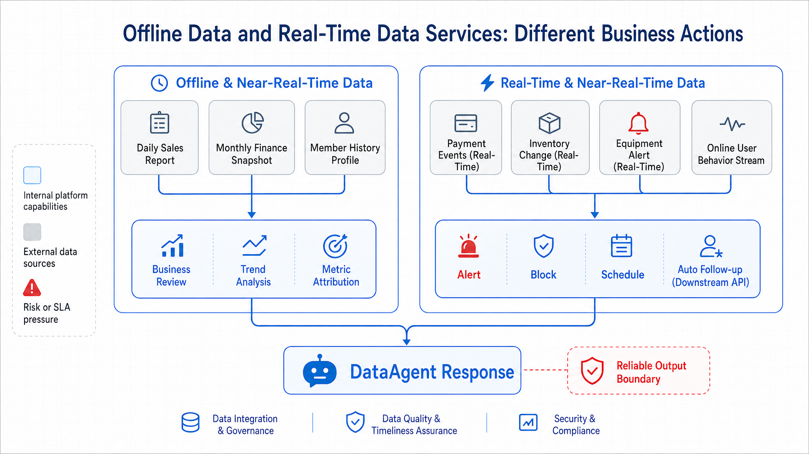

*Figure 13-1: Offline data corresponds to reports, postmortems, and other delay-tolerant actions on the left; real-time data supports alerts, risk control, dashboards, and other latency-sensitive actions on the right. Source: Author's drawing.*

Figure 13-1 shows that offline pipelines serve postmortem analyses, attribution, and formal reports; real-time pipelines serve alerts, blocking, scheduling, and context injection. If the question is "Why did gross margin in East China region drop last quarter?", batch lakehouse and OLAP engines are better since they require stable definitions, complete data, and traceable snapshots. If the question is "Did payment failure rate exceed normal fluctuations in the past 5 minutes?", real-time pipeline is better since it needs to detect anomalies before data formalizes into reports.

Real-time pipeline does not mean simply making all data faster. It introduces always-on computing resources, state storage, message backlog, out-of-order events, duplicate consumption, late data, and complex recovery processes. For enterprise Agent platforms, the value of real-time data is enabling the Agent to get sufficiently fresh context at the right time, while also explaining result reliability despite data lateness, duplicates, or corrections.

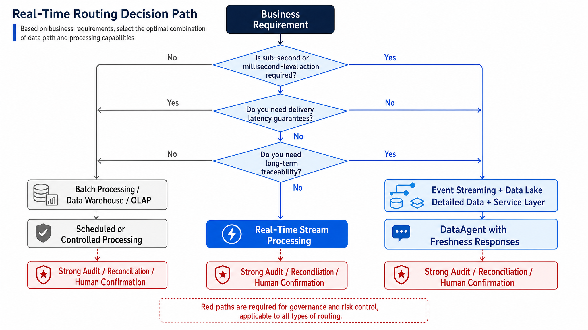

*Figure 13-2: Decision tree for initiating real-time pipeline projects. Source: Author's drawing.*

Figure 13-2 defines project initiation boundaries. Real-time pipelines justify the extra complexity only when business actions depend on minute- or second-level data; auditing and traceability require results that can be replayed and reconciled. For a multi-business enterprise, payment anomaly alerts can use real-time pipelines, but monthly financial closing still relies on lakehouse snapshots and finalized definitions after manual confirmation.

When real-time capabilities enter the Agent platform, boundaries change in four ways:

- DataAgent can query historical tables and real-time metrics and event context.
- Business Agents can answer "what happened" and trigger alerts, dispatch, freeze, downgrade, restock, and other actions.
- Observability platforms do retrospective analysis of slow queries and failed jobs as well as real-time detection of data delays, consumption buildup, and state inflation.
- Data governance oversees tables and fields and event contracts, delay SLAs, replay windows, and anomaly correction processes.

### 13.1.1 Unified Batch-Stream Perspective: Event Stream, Change Log, Real-Time Wide Table, and Real-Time Metrics

Stream processing is built around continuously arriving events. An event can be payment success, inventory deduction, device temperature anomaly, user click, ticket creation, or even a database row change. These are not files generated daily but business facts flowing continuously into message systems, then consumed, computed, and output by streaming jobs.

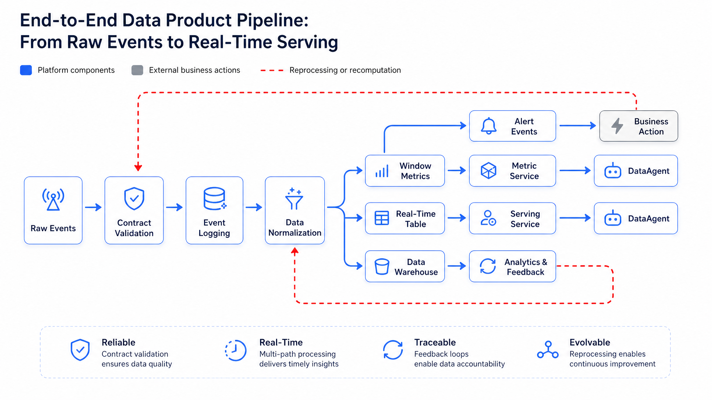

*Figure 13-3: Pipeline from raw events through event bus, stream processing, state/windowing to real-time storage and data services. Source: Author's drawing.*

Figure 13-3 clarifies three boundaries. First, messaging systems are not compute systems. Kafka-type systems provide event logs, partitions, ordered append, and consumption tracking, but do not automatically perform window aggregation, state joins, or late arrival correction. Second, stream processing is not OLAP queries. Flink or Spark Structured Streaming continuously process new events; Doris, StarRocks, ClickHouse and similar OLAP engines enable users to query current results with low latency. Third, real-time data products are not throwaway scripts. If results get used by DataAgent or business systems for decision-making, they must have event contracts, delay targets, lineage, access control, and replay policies.

Unified batch-stream is a platform perspective, not a product name: the same business fact can enter real-time pipelines as event streams and enter the lakehouse as detailed tables; the same metric definition can produce real-time windowed results and be re-computed offline for reconciliation. For a multi-business enterprise, payment success rate might generate real-time alerts every 5 minutes, and be recomputed daily with lakehouse details for variance explanation.

*Table 13-1: Definitions and Distinctions of Event Stream, Change Log, Real-Time Wide Table, and Real-Time Metrics.*

| Concept | Definition | Difference from Adjacent Concepts |
|---|---|---|
| Event Stream | Business fact records appended over time, e.g., order creation, payment success, inventory changes | Emphasizes occurrence of facts; differs from batch files generated periodically |
| Change Log | Database row-level change stream, usually produced by Change Data Capture (CDC) | Emphasizes table state changes; differs from domain semantic business events |
| Stream Processing | Continuously consuming events and performing filtering, transformation, windowed aggregation, joins, and state updates | Emphasizes continuous computation; differs from one-time batch processing |
| Real-Time Wide Table | Queryable detailed or state table formed by joining event streams with dimension tables, rules, historical state | Emphasizes current context; differs from raw logs which only append without updates |
| Real-Time Metrics | Metric results continuously updated by event time and window logic | Emphasizes low-latency serving; differs from formal offline reports |
| Watermark | System estimate that event time has advanced past a certain point | Used for dealing with out-of-order and late data; does not mean all events have arrived |
| Checkpoint | Consistent snapshot of stream job state and input offsets | Used for fault recovery; differs from business audit snapshots |
| Savepoint | Operator-triggered migratable state snapshot | Used for upgrade, migration, planned recovery; differs from periodic checkpoint |
| Exactly-once | Consistency semantics achieved jointly by source, state, and downstream protocols | Does not equal business-level absolute single occurrence; still requires idempotent keys and reconciliation |
| Backpressure | When downstream cannot keep up, upstream processing slows down | Signals capacity bottlenecks; more than "job slowdown" |

Common misunderstandings of real-time pipelines:

1. Real-time is always better than offline. Real-time improves action timeliness but not necessarily data quality.
2. Exactly-once from Kafka or stream engines guarantees no business duplicates. Consistency semantics cover only limited boundaries; business still needs event IDs, idempotent writes, and reconciliation.
3. Watermark solves all late data. Watermark is progress estimation, not completeness guarantee.
4. Real-time pipelines can replace the lakehouse. Audit, replay, training samples, and long-term attribution still rely on lakehouse.
5. Lower latency is always better. Subsecond pipelines require more resources, complex state management, and stricter on-call; if business requires 10-minute anomaly detection, pushing latency to 1 second wastes cost.

---

## 13.2 Stream Infrastructure: Coordination of Kafka, Flink, Spark Streaming, and Storage Systems

In an enterprise Agent platform, the stream processing layer sits after data ingestion, before the lakehouse and service layers. It receives business events and CDC logs generated in Chapter 10, writes output to lakehouse tables in Chapter 11, OLAP service layer in Chapter 12, metadata and lineage systems in Chapter 15, and real-time context services for DataAgent.

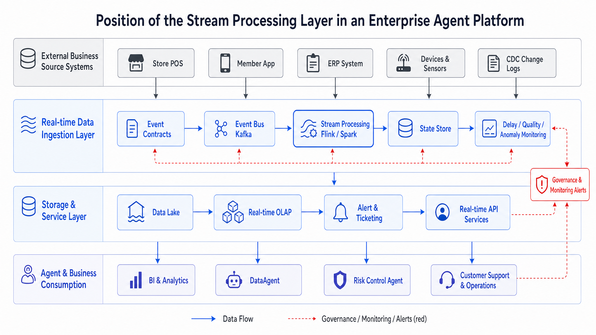

*Figure 13-4: Stream processing layer position in the platform. Source: Author's drawing.*

Figure 13-4 shows the real-time layer is a Kafka or Flink cluster and an end-to-end pipeline from event contract, messaging bus, stateful computation to service layer and governance. It has two output paths easily confused. One is fact persistence: raw or cleaned details written to lakehouse for audit, replay, training, and long-term analytics. The other is serving: windowed metrics, real-time wide tables, alert events, and online features written to OLAP, caches, or business systems for minute-level queries and action triggers. Mature platforms preserve both paths; otherwise, when DataAgent is asked "Which events caused this alert?", it cannot trace back.

Components in the real-time pipeline can be categorized by ingress, processing, state, output, and governance.

*Table 13-2: Roles, Inputs/Outputs, and Failure Modes of Stream Components.*

| Component | Role | Input | Output | Failure Mode |
|---|---|---|---|---|
| Event Producer | Writes business actions, logs, or DB changes to event bus | Business transactions, CDC logs, device messages | Standardized events | Duplicate send, out-of-order, schema drift, timestamp errors |
| Event Bus | Stores event logs, provides partitions, ordered append, consumption tracking | Standardized events | Partitioned, consumable logs | Partition skew, message backlog, insufficient retention |
| Stream Processing Job | Continuously consumes events for filtering, transformation, windowing, join, aggregation | Event streams, dimension tables, rules | Real-time metrics, alerts, wide tables, details | State bloat, backpressure, checkpoint failure |
| State Store | Stores window, join, deduplication state and aggregation intermediates | Keys, windows, events | Recoverable state snapshot | Oversized state, slow restore, state incompatibility |
| Serving Layer | Provides external query, alerting, and online context | Real-time results | Query results, alert events, features | Duplicate writes, query timeout, inconsistency |
| Governance & Observability | Manages schema, lineage, latency, quality, permissions, audit | Job metadata, runtime metrics, event contracts | Alerts, audit logs, impact analysis | Missing metrics, unclear ownership, incident untraceable |

Framework and storage selection must serve business scenarios, not follow popularity trends. Kafka is suitable as replayable event log but not for complex windowed computing. Flink excels at complex event-time, low-latency stateful computation and fine-grained recovery but requires mature stream ops capabilities. Spark Structured Streaming suits teams with existing Spark and lakehouse for micro-batch incremental processing but is less natural for sub-second or complex state. Kafka Streams embeds lightweight local streaming in a service but lacks large-scale governance for company-wide real-time platform. Alternatives include Pulsar, Redpanda, RisingWave, Materialize, ksqlDB, and managed cloud stream services; choices involve evaluating event retention, state recovery, schema governance, permissions, cost, and teams' operational maturity.

#### Batch processing, micro-batches, and continuous streams

*Table 13-3: Trade-offs Between Batch and Stream Processing on Latency, Cost, and Reconciliation.*

| Approach | Advantages | Cost | Suitable Scenarios | Recommendation |
|---|---|---|---|---|
| Batch | Simple, low cost, easy reconciliation | High latency, no timely action triggers | Daily/monthly reports, offline features, finance reconciliation | Keep as baseline source of truth and reconciliation |
| Micro-batch | Moderate engineering complexity, good throughput | Latency in seconds to minutes range | Near-real-time reports, lightweight alerts, lakehouse incremental loads | Fits most enterprise near-real-time needs |
| Continuous Stream | Low latency, complex state management | Complex ops, expensive state and recovery | Risk control interception, device alerts, real-time rules | Use only when actions really require low latency |

#### Flink, Spark Structured Streaming, and Kafka Streams

*Table 13-4: Flink, Spark Streaming, Kafka Streams Strengths, Costs, and Suitable Scenarios.*

| Approach | Advantages | Cost | Suitable Scenarios | Recommendation |
|---|---|---|---|---|
| Flink | Native stream processing, strong event time and state capabilities | High ops and tuning complexity | High throughput, low latency, complex windows, real-time joins | Enterprise real-time computing main option with supporting platform |
| Spark Structured Streaming | Consistent with Spark batch ecosystem, fits lakehouse and micro-batch | Not as natural for ultra-low latency and complex state | Lakehouse incremental loads, near-real-time ETL, existing Spark users | Good for teams transitioning from offline to near-real-time |
| Kafka Streams | Embedded in apps, lightweight deployment, Kafka-native | Weak centralized governance and complex ops | Local flow processing within single services, lightweight state | For local service use, not as unified enterprise real-time platform |

### 13.2.1 Time Semantics: Event Time, Processing Time, Watermark, Window, and Late Data

Real-time systems usually deal with three clocks simultaneously. Event time is the actual business occurrence time, e.g., payment completion time. Ingestion time is when the event enters the messaging or streaming system. Processing time is when the computation actually processes that event.

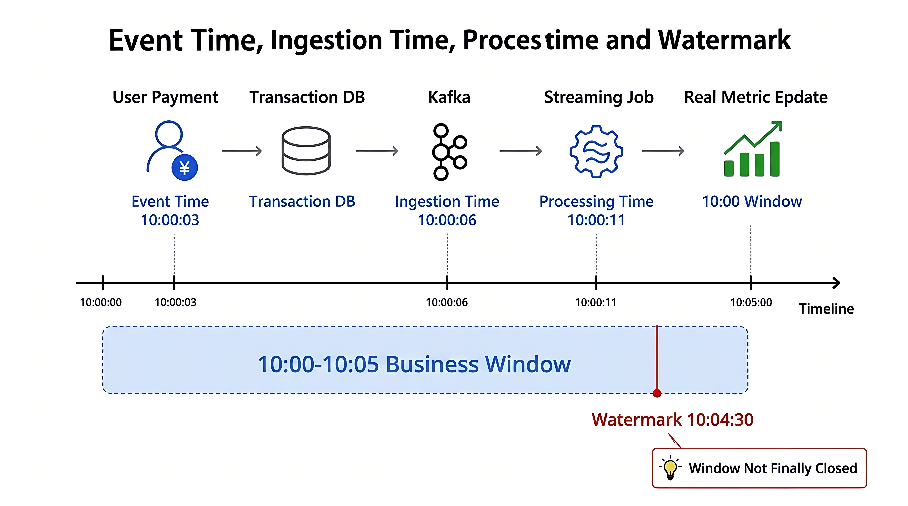

*Figure 13-5: Three timestamps (event occurrence, enter system, processed) and watermark line indicating the allowed out-of-order boundary; beyond which data is late.*

The key in Figure 13-5 is that real-time computation calculates metrics based on event time rather than processing time. For instance, for payment success rate, if counted by processing time, a payment at 10:00:03 processed only at 10:00:11 will be counted in a later window, biasing the 10:00:00 to 10:05:00 window's success rate downwards. For anomaly alerting on "just now," this causes false alarms.

Enterprise events are naturally out of order. Network jitter in stores, mobile offline caching, database log sync delays, cross-region link jitter all cause earlier events to arrive late. Watermark provides a progress estimate: most events have advanced past a certain event time, so windows can emit their output proactively. It is not a guarantee that all events before that time have arrived.

Watermark strategies must be bound to business SLAs. For example, store payment events in a multi-business enterprise usually arrive within 30 seconds; some mountain area stores occasionally have 5-minute delays. A watermark allowing 30 seconds lateness gives faster real-time dashboards but more frequent misses in those stores; a 10-minute lateness watermark yields more complete results but slower alerts. The platform should let business explicitly choose between "quick but fixable" real-time alerts and "delayed but more complete" financial definitions.

#### Speed priority and completeness priority

*Table 13-5: Trade-offs Between Speed-First and Correctness-First Time Semantics.*

| Approach | Advantage | Cost | Suitable Scenarios | Recommendation |
|---|---|---|---|---|
| Speed Priority | Fast alerts, better user experience | Late events cause corrections or false alarms | Anomaly detection, ops monitoring, device alerts | Output must indicate watermark and finality status |
| Completeness Priority | Stable results, fewer corrections | Higher latency, may miss action windows | Financial metrics, regulatory reporting, formal postmortems | Use offline or long watermark pipelines for confirmation |
| Dual-Track Output | Both fast and final results retained | Higher storage and governance complexity | High-value metrics, risk control, supply chain scheduling | Use for key business metrics with reconciliation documentation |

Real-time metric service responses need more than a single number. If DataAgent only sees `"0.982"`, it cannot tell if the value is from a complete window, includes late event corrections, or is in replay.

```json
{
  "metric": "payment_success_rate",
  "window_start": "2026-06-11T10:00:00+08:00",
  "window_end": "2026-06-11T10:05:00+08:00",
  "value": 0.982,
  "watermark": "2026-06-11T10:04:30+08:00",
  "is_final": false,
  "late_event_policy": "update_until_10_minutes",
  "source_lag_seconds": 35,
  "lineage": {
    "source_topics": ["payment-events-v3"],
    "job": "payment-success-rate-stream",
    "contract": "payment.succeeded.v3"
  }
}
```

#### Example 13-1: Real-time metric service response

This production engineering example shows why `is_final=false` matters. DataAgent can tell the user that the current window may still be corrected by late events, and the response can say "as of the current watermark" instead of presenting the number as a finalized fact.

### 13.2.2 State Management: Checkpoint, Savepoint, Exactly-Once, and End-to-End Consistency

Window aggregation, deduplication, stream joins, and rule matching all require state. State can be understood as the memory of the stream job: how much has been accumulated for current window, which event IDs have been seen, whether an order has been paid, whether a user failed consecutively in last 5 minutes.

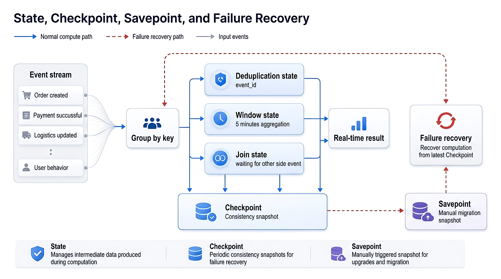

*Figure 13-6: State snapshots by periodic Checkpoints, manual Savepoints; recovery from latest Checkpoint on failure, from Savepoint on upgrade. Arrows show two recovery paths.*

Figure 13-6 illustrates how state enables remembering context across events but makes failure recovery complex. Checkpoints create consistent snapshots of state and input offsets. After failure, the system recovers from the latest successful checkpoint and resumes consuming from matching offsets. Without checkpoints, jobs must either drop data from current offsets or replay from earliest offsets causing duplicates.

Savepoints are operator-triggered migratable snapshots used for upgrades, state schema evolution, parallelism adjustments, and cluster migration. Checkpoints serve automatic failure recovery; Savepoints enable controlled changes. Neither replace business audit, since they capture computation state, not completeness of business facts.

Exactly-once semantics is usually not achieved by a single component but requires cooperation of input source, state, and downstream protocols. Input must be replayable; state must be recoverable; downstream sinks must support transactional commit or idempotent writes. Missing any part yields weaker consistency. Business layer still needs idempotent keys and reconciliation. For example, if alert system has no transactional commit, use `alert_id = rule_id + store_id + window_start` as deduplication key to avoid repeated dispatches after recovery. If lakehouse writes support transactions, submissions should include unique batch IDs to avoid duplicate files from replays.

The following event contract example shows the ingress boundary of a real-time pipeline. It is a production engineering sample, not a mini-platform config.

```json
{
  "event_id": "evt_20260611_000001",
  "event_type": "payment.succeeded",
  "schema_version": "v3",
  "event_time": "2026-06-11T10:00:03+08:00",
  "source": "pos-payment",
  "partition_key": "store_1024",
  "trace_id": "trace_8f4a",
  "producer_time": "2026-06-11T10:00:04+08:00",
  "payload": {
    "order_id": "ord_10086",
    "store_id": "store_1024",
    "amount": 128.50,
    "payment_method": "card",
    "status": "succeeded"
  },
  "quality": {
    "is_replay": false,
    "source_lag_ms": 1000
  },
  "governance": {
    "owner": "payment-platform",
    "pii_tags": ["customer_id"],
    "retention_days": 30
  }
}
```

#### Example 13-2: Real-time event contract

This example focuses on encapsulating business time, production time, schema version, partition key, quality flags, and governance metadata in a unified envelope. It is the contract boundary that lets downstream jobs, quality systems, and DataAgent interpret event meaning consistently.

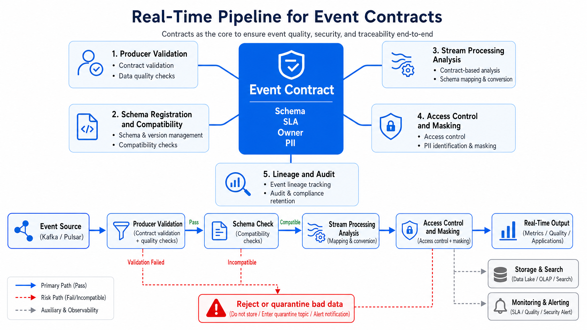

*Figure 13-7: The same event contract (fields, types, timestamp, key) annotated at producer, event bus, stream processing, and consumer stages, indicating consistent enforcement through the pipeline.*

Figure 13-7 emphasizes that event contracts are not documentation attachments but control planes jointly depended on by production, consumption, governance, and auditing. A qualified event contract answers at least these eight questions: What event is this? What is the event unique key? Which field is event time? What is the partition key? How does schema version evolve? Which fields are Personally Identifiable Information (PII)? How long to retain event? How to represent late, replayed, revoked, or corrected events?

### 13.2.3 Stream-Table Duality: From Real-Time Stream to Queryable Tables and Materialized Views

The duality of streams and tables provides a key mental model for understanding real-time data products. Append-only event stream records what happened; a table expresses the current state at a moment; change logs link the two. Order creation, payment success, and cancellation form a set of events; folding them by order_id produces an order state table; aggregating by store and 5-minute window produces queryable real-time metrics table.

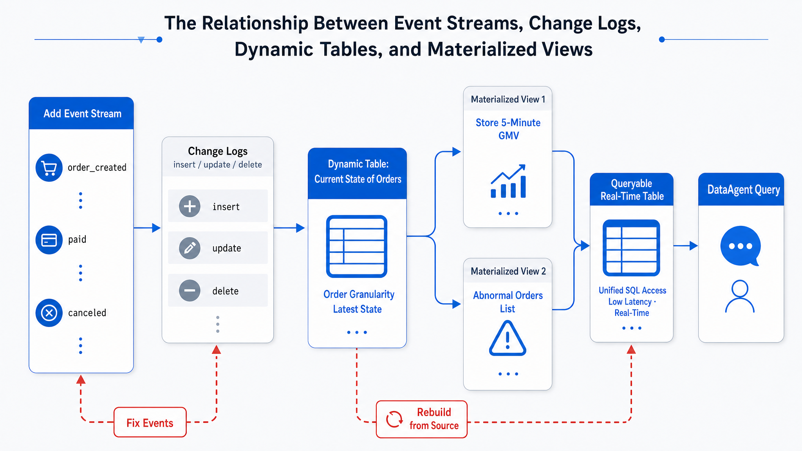

*Figure 13-8: Event stream aggregates into change log, which materializes into dynamic table, which forms materialized views. Bidirectional arrows annotate that streams and tables can convert mutually (stream-table duality).*

Figure 13-8 reminds platform teams that DataAgent should not directly consume raw event streams for business questions. It should access controlled real-time tables, materialized views, or metric services and receive window metadata, watermark, finality, definitions, and lineage. Raw streams are for compute, replay, and audit; query tables serve DataAgent, BI, and business systems.

#### Real-time results written to the lakehouse or service layer

*Table 13-6: Trade-offs Between Direct OLAP Writes and Retaining Raw Events for Real-Time Serving.*

| Approach | Advantages | Costs | Suitable Scenarios | Recommendation |
|---|---|---|---|---|
| Direct OLAP Write | Fast queries, simple for BI and DataAgent | Poor audit and replay ability | High-frequency dashboards, recent window queries | Store service results only; not single source of truth |
| Write Lakehouse Details | Traceable, replayable, trainable | Higher query latency, needs further compute chain | Raw events, cleaned details, correction records | Must keep for reconciliation and replay |
| Write Both Lakehouse and Serving | Balance traceability and low latency | Dual-write consistency and governance complexity | Key real-time metrics and alerts | Default recommendation with idempotent keys and reconciliation |

### 13.2.4 Real-Time Features, Alerts, and Context Injection for Agent

Agents consume real-time data mainly in three ways. First, real-time features-for example, user's failed payments in last 10 minutes, store's order count in last 5 minutes, device temperature slope in last 1 minute. These typically enter feature or context services queried by risk control, scheduling, or DataAgent. Second, real-time alerts-for example, payment failure rate anomalies, warehouse backlogs, device faults, ticket surges. These feed alert or workflow systems, with Agents explaining causes, recommending actions, or generating tickets. Third, real-time context injection-e.g., when DataAgent answers "Is there an anomaly now?", the current window metrics, watermark, recent event samples, and historical baselines are injected into inference context.

Real-time context injection requires access boundary controls. Agents should not read Kafka topics directly without limits because raw events may contain sensitive fields, dirty data, duplicates, or unstable definitions. A safer model uses real-time metric services, feature services, or context services that provide controlled interfaces returning freshness, finality, lineage, and masked status. This way DataAgent responses can label answers as "confirmed facts," "interim window results," or "results under replay correction."

#### Direct Agent stream access and service-layer mediation

*Table 13-7: Trade-offs Between Agent Direct Stream Reads and Feature Service Real-Time Supply.*

| Approach | Advantages | Costs | Suitable Scenarios | Recommendation |
|---|---|---|---|---|
| Agent Direct Stream Reads | Low latency, flexible | Hard to enforce permissions, masking, definitions, duplicates, and lateness | Debugging, internal experiments, limited topics | Not default for production |
| Agent Reads Real-Time OLAP | Strong query expressiveness, low integration cost | Needs SQL security, resource limits, window correctness management | Real-time metric queries, operational Q&A | Suitable for DataAgent with freshness and lineage tagging |
| Agent Reads Context Service | Clear contract, supports masking and throttling | Higher service layer construction cost | Action-oriented Agents in risk, customer service, supply chain | Prefer for key real-time business actions |

Below pseudocode shows how a controlled context interface expresses real-time semantics.

```yaml
# Example: Real-time context service response (without real credentials)
context:
  subject: store_1024
  window: 5m
  generated_at: "2026-06-11T10:05:12+08:00"
  watermark: "2026-06-11T10:04:30+08:00"
  freshness_seconds: 42
  finality: provisional
signals:
  payment_success_rate:
    value: 0.982
    baseline: 0.995
    severity: warning
  order_count:
    value: 438
    baseline: 410
    severity: normal
governance:
  lineage:
    - payment-events-v3
    - payment-success-rate-stream
  pii_status: masked
  allowed_actions:
    - explain
    - create_ticket
    - request_human_review
```

#### Example 13-3: Real-time context service response

This interface lets Agents explain which watermark the data is based on, whether the result is final, and which actions are allowed. It also keeps raw event access behind a governed service instead of exposing topics directly to the Agent.

### 13.2.5 Failure Modes: Backpressure, Duplicate Consumption, Data Skew, State Bloat, Replay Correction

Backpressure means downstream processing speed is slower than upstream input speed, and can happen anywhere in message consumption, compute operators, state read/write, network shuffle, or downstream write.

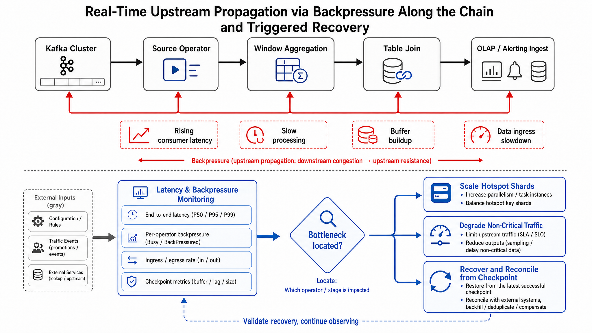

*Figure 13-9: When downstream slows, backpressure signals propagate stepwise upstream, triggering throttling, scaling, and buffering recovery actions.*

Figure 13-9 shows downstream slow writes gradually affect compute, consumption, and Kafka backlog, resulting in rising end-to-end latency. Backpressure is not a single component's "slow job" but a symptom involving capacity, state, and downstream service interaction. Troubleshooting must consider input/output rates, consumption delay, watermark lag, checkpoint duration, state size, and downstream write time.

*Table 13-8: Detection and Recovery Strategies for Stream Failure Modes including Backpressure, Duplicate Consumption, State Bloat.*

| Failure Mode | Trigger | Impact | Detection | Recovery |
|---|---|---|---|---|
| Message Backlog | Production rate exceeds consumption | Metric latency, alert delays | Consumption and end-to-end latency | Scale consumers, optimize slow operators, downstream rate limiting |
| Partition Skew | Few keys far heavier traffic | Single task slows entire pipeline | Partition throughput, task load variance | Redesign partition keys, hot key splitting, local aggregation |
| Increasing Late Events | Network jitter, mobile offline, upstream retries | Window results repeatedly corrected or missed | Late event rates, watermark lag | Adjust watermark, set late correction tables |
| Checkpoint Failure | Large state, slow downstream commit, unstable storage | Old recovery points, more re-computations | Checkpoint duration and failure rate | Reduce state size, increase parallelism, optimize state backend |
| State Bloat | Unbounded joins, long dedup retention | Memory/disk pressure, slow recovery | State size, restore time | Set state retention, clean invalid keys |
| Duplicate Downstream Writes | Replayed results after recovery | Duplicate alerts, metric inflation | Idempotency conflicts, reconciliation gaps | Transactional commit, idempotent keys, result deduplication |
| Schema Incompatibility | Upstream field removal or type changes | Job parse failures or data errors | Schema validation failures | Compatibility policies, canary deploys, contract rollback |
| Insufficient Raw Event Retention | Log expired when replay needed | Cannot recompute or explain old results | Replay job failure, audit gaps | Sync lakehouse details, increase key topic retention |

Replay and correction are must-have capabilities for real-time pipelines. If a multi-line enterprise finds a batch of store payment events with incorrect `event_time` upstream, they should more than manually patch service-level metrics. The correct process is to isolate bad data, fix or compensate events, replay a time range from retained logs or lakehouse details, compare old/new results, update serving layer, and write correction reasons to audit logs; otherwise DataAgent responses cannot explain changes over time.

---

## 13.3 Engineering Implementation: Real-Time Pipeline Deployment, Monitoring, Scaling, and Governance

The engineering focus is on production deployment topology, release process, monitoring metrics, scaling strategies, and governance boundaries.

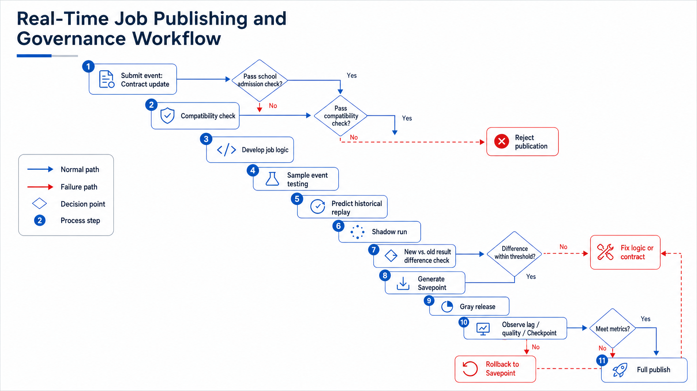

*Figure 13-10: Release flow includes version packaging, Savepoint triggering, state compatibility checks, canary, rollback steps. State compatibility must be verified before upgrading stream jobs.*

Figure 13-10 shows that stream jobs should not be deployed direct from dev to production. Pre-release replay and shadow comparisons are key to detecting definition deviations; Savepoints are high-risk control points for stateful job upgrades and rollbacks; after canary rollout, monitoring latency, output quality, and checkpoint metrics is essential, more than process health.

The following config example shows a production real-time job config, not tied to any mini-platform.

```yaml
# Example: Real-time job configuration (without credentials)
job:
  name: payment-success-rate-stream
  owner: payment-data-team
  version: 2026.06.11
  mode: streaming

source:
  type: kafka
  topic: payment-events-v3
  consumer_group: payment-success-rate
  start_from: committed-offset
  event_time_field: event_time
  partition_key: store_id

watermark:
  max_out_of_orderness: 2m
  allowed_lateness: 10m
  late_event_output: payment-events-late

state:
  checkpoint_interval: 30s
  checkpoint_timeout: 10m
  state_retention: 2h
  savepoint_required_for_upgrade: true

sink:
  lakehouse_table: dwd.payment_events_rt
  olap_table: ads.payment_success_rate_5m
  idempotent_key: window_start,window_end,store_id

governance:
  contract: payment.succeeded.v3
  pii_policy: mask_customer_id
  lineage_enabled: true
  alert_on_lag_seconds: 180
```

#### Example 13-4: Real-time job configuration

The point of this configuration is explicit control over event time, watermark, state retention, idempotent keys, and governance strategy. Framework parameters matter, but production reliability depends on these business and operational fields being visible.

```sql
-- Pseudocode: SQL for 5-minute payment success rate window
CREATE TABLE payment_events (
  event_id STRING,
  store_id STRING,
  status STRING,
  event_time TIMESTAMP(3),
  WATERMARK FOR event_time AS event_time - INTERVAL '2' MINUTE
);

CREATE TABLE payment_success_rate_5m (
  window_start TIMESTAMP(3),
  window_end TIMESTAMP(3),
  store_id STRING,
  success_rate DOUBLE,
  total_count BIGINT,
  updated_at TIMESTAMP(3),
  PRIMARY KEY (window_start, window_end, store_id) NOT ENFORCED
);

INSERT INTO payment_success_rate_5m
SELECT
  TUMBLE_START(event_time, INTERVAL '5' MINUTE) AS window_start,
  TUMBLE_END(event_time, INTERVAL '5' MINUTE) AS window_end,
  store_id,
  SUM(CASE WHEN status = 'succeeded' THEN 1 ELSE 0 END) * 1.0 / COUNT(*) AS success_rate,
  COUNT(*) AS total_count,
  CURRENT_TIMESTAMP AS updated_at
FROM payment_events
GROUP BY TUMBLE(event_time, INTERVAL '5' MINUTE), store_id;
```

#### Example 13-5: Window metric pseudocode

This pseudocode expresses the calculation intent for 5-minute event-time windows. The primary key on `(window_start, window_end, store_id)` gives downstream systems an idempotent update boundary.

Production deployment must at least include the following capabilities.

*Table 13-9: Essential Capabilities for Real-Time Pipelines in Release, Monitoring, Scaling, and Governance.*

| Domain | Essential Capabilities | Description |
|---|---|---|
| Release | Version numbering, config snapshots, Savepoint, rollback strategy | Stateful stream job upgrades require state compatibility checks, more than image replacement |
| Monitoring | Input/output rate, consumption delay, watermark delay, checkpoint success rate | Metrics together explain end-to-end latency |
| Scaling | Adjust parallelism by throughput, latency, state size, downstream write capacity | Confirm bottleneck is not downstream before scaling out |
| Governance | Event contracts, ownership, SLAs, lineage, permissions, data retention | Real-time results must be explainable before entering DataAgent |
| Recovery | Checkpoint, Savepoint, replay, idempotent writes, reconciliation | Recovery processes must be rehearsed in advance |
| Cost | Always-on compute, state storage, message retention, duplicate compute | Real-time pipelines incur costs even when idle, not pay-per-query |

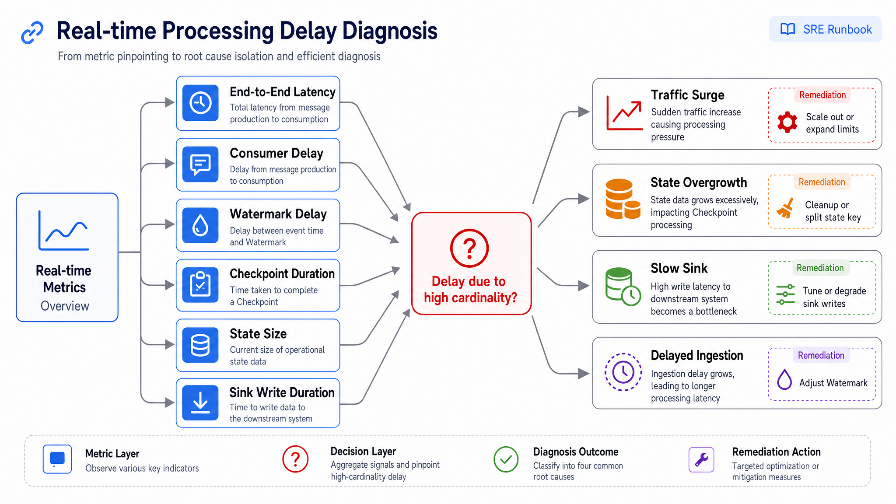

*Figure 13-11: Diagnosis flow starting from end-to-end latency rise, sequentially checking production, bus, consumption, state operators, with arrows indicating delays cause and actions.*

Figure 13-11 shows the minimal path for on-call to troubleshoot latency. Increased consumption delay is not necessarily Kafka's fault; elevated watermark delay may mean more late events; checkpoint slowdown often points to state bloat or slow downstream commits; increased downstream write time causes backpressure upstream.

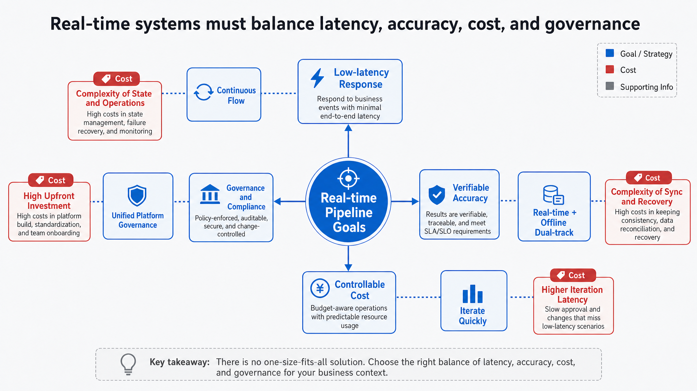

*Figure 13-12: Radar chart of latency, correctness, cost, governance. Labels state "cannot optimize all four simultaneously," emphasizing real-time solution trade-offs across multiple dimensions.*

Figure 13-12 summarizes technical trade-offs into four dimensions. Low latency introduces state and ops complexity; explainable correctness often requires dual pipelines (real-time + batch); cost and governance limit always-on resources and event retention; governance demands unified contracts, lineage, permissions, and audit. Platform leaders should incorporate these constraints into project approval, not patch processes after incidents.

### 13.3.1 Release Gates and Failure Recovery

- [ ] Business value: Confirm real-time pipeline serves low-latency actions like alerts, blocking, scheduling, and online context-more than for "looking real-time."
- [ ] Event contract: Each event has event_id, event_time, schema_version, partition_key, owner, retention, and PII tags.
- [ ] Time semantics: Declare use of event time, ingestion time, or processing time; high-risk metrics specify watermark and allowed lateness.
- [ ] Idempotency: Downstream writes have idempotent keys or transactional commits; alerts and tickets don't duplicate upon replay.
- [ ] State boundaries: All deduplication, windows, and join state have retention and cleanup policy.
- [ ] Checkpoint: Define interval, timeout, storage, failure thresholds, and regularly rehearse recovery.
- [ ] Savepoint: Can generate savepoints before upgrade, migration, scaling; check new version state compatibility.
- [ ] Replay ability: Retain enough raw event logs or lakehouse details for time-range recomputation.
- [ ] Reconciliation: Key real-time metrics have offline reconciliation pipelines explaining real-time vs final values.
- [ ] Backpressure monitoring: Track consumption delay, watermark delay, downstream write time, state size, and checkpoint latency.
- [ ] Throttling and degradation: When downstream unavailable, can pause alerts, degrade metrics, buffer writes, or fall back to lakehouse-only writes.
- [ ] Permission and masking: DataAgent and business systems can only access authorized real-time results; sensitive fields masked per policy.
- [ ] Lineage and audit: Each real-time result traceable to source topic, job version, event contract, and output table.
- [ ] Cost governance: Budgets and chargeback for always-on compute, message retention, state storage, and replay.
- [ ] On-call: Clear owners, alert receivers, escalation paths, and incident postmortem templates for core real-time pipelines.

#### Processing-time payment success rate causes false alarms during promotions

After a promotion starts, some stores' 5-minute payment success rate may suddenly drop and trigger a risk-control Agent to downgrade a payment channel. The root cause is often that events are windowed by processing time: peak backlog pushes early payment events into later windows, depressing the current window. The repair is to calculate the metric by event time, allow bounded out-of-order arrival and late updates, and expose watermark plus finality flags in DataAgent responses.

#### City-based Kafka partition keys create hot partitions

When the partition key is `city_id`, traffic from large cities such as Shanghai or Shenzhen can concentrate in a few partitions. Nationwide metrics may look normal while these cities experience persistent delay. A better key is often `store_id`, with secondary splitting for known hot stores and local partial aggregation before global merging.

#### Deduplication state without expiration increases recovery time

A deduplication job that stores all historical event IDs will eventually make checkpoints and recovery too slow. State should expire according to event retention and the allowed late-arrival window. Events beyond that window should move to offline reconciliation rather than remaining in live stream state forever.

#### Non-idempotent alert sinks create duplicate tickets after recovery

After a cluster restart, a stream job may replay partial results and create duplicate anomaly tickets if the alert sink only appends. Alert systems need a business key such as `alert_id = rule_id + store_id + window_start`, and the sink should upsert by that key. Recovery then updates an existing alert instead of creating multiple business actions.

#### Aggregate-only retention cannot explain DataAgent answers

If the platform keeps only aggregate results, DataAgent can report an abnormal store but cannot explain which events drove the anomaly. Key events should be written to lakehouse detail tables, and real-time aggregates should retain lineage fields. Answers can then include window information, event counts, and sampled event references instead of a single unsupported value.

### 13.3.2 Usage boundaries for real-time context

Real-time context should be treated as provisional unless the service explicitly marks it as final. DataAgent can use it for alerts, triage, routing, and short-term explanations, but formal reporting and financial attribution still require reconciliation with lakehouse snapshots. A response based on real-time context should show window boundaries, watermark, freshness, finality, lineage, and any degradation state.

The platform should also restrict which actions can follow from provisional data. Explaining an anomaly, creating a review ticket, or asking for human confirmation is acceptable in many scenarios; automatically freezing inventory, downgrading payment channels, or changing supplier settlement rules requires stronger evidence and approval. This boundary keeps real-time data useful without letting incomplete windows drive irreversible decisions.

---

## Chapter Recap

1. The value of real-time pipelines lies in low-latency actions, not replacing offline lakehouse. Key business metrics should keep both real-time results and replayable facts.
2. Event time, watermark, checkpoint, and state management are core to stream processing; misunderstanding these precludes explaining result reliability.
3. Exactly-once is an end-to-end system semantics requiring replayable input, recoverable state, and transactional or idempotent downstream; it does not replace business idempotency and reconciliation.
4. Backpressure is the key capacity signal in real-time pipelines. To troubleshoot latency, check input, watermark, state, checkpoint, and downstream write altogether.
5. When DataAgent uses real-time data, it must receive window bounds, watermark, finality, source lineage, and delay info to avoid treating incomplete windows as final facts.

- Official docs: [Apache Flink - Timely Stream Processing](https://nightlies.apache.org/flink/flink-docs-stable/docs/concepts/time/), supports chapter explanations of event time, processing time, watermark, and window completeness.
- Official docs: [Apache Flink - Checkpointing](https://nightlies.apache.org/flink/flink-docs-stable/docs/dev/datastream/fault-tolerance/checkpointing/), supports chapter explanations of checkpoint, consistent snapshots, and recovery boundaries.
- Official docs: [Apache Flink - Savepoints](https://nightlies.apache.org/flink/flink-docs-stable/docs/ops/state/savepoints/), supports chapter explanations of stateful job upgrades, migration, and rollback.
- Official docs: [Apache Kafka - Message Delivery Semantics](https://kafka.apache.org/documentation/#semantics), supports chapter coverage of message delivery semantics and end-to-end exactly-once boundaries.
- Official docs: [Apache Spark - Structured Streaming Programming Guide](https://spark.apache.org/docs/latest/structured-streaming-programming-guide.html), supports chapter coverage of micro-batch, event time, and stream query model.
- Paper: [The Dataflow Model](https://research.google/pubs/the-dataflow-model-a-practical-approach-to-balancing-correctness-latency-and-cost-in-massive-scale-unbounded-out-of-order-data-processing/), supports chapter discussion of correctness, latency, cost, and out-of-order trade-offs.
- Reference projects: [Apache Flink](https://flink.apache.org/), [Apache Kafka](https://kafka.apache.org/), [Apache Spark Structured Streaming](https://spark.apache.org/streaming/), [ksqlDB](https://ksqldb.io/), for comparing enterprise real-time computation, event log, and stream-table service approaches.
- Related chapters: [Chapter 10 Data Ingestion and Integration](ch10.md), [Chapter 11 Data Lake and Lakehouse](ch11.md), [Chapter 12 Lakehouse Engines and OLAP](ch12-olap.md), [Chapter 14 Data Orchestration and Quality](ch14.md), [Chapter 15 Metadata, Lineage, Contracts, and Metrics](ch15.md), [Chapter 34 NL2SQL Engineering](../../part06-dataagent/en/ch34-nl2sql.md), [Chapter 38 Observability and Trace](../../part07-observability-eval/en/ch38-trace.md), [Chapter 51 Security Guardrails](../../part10-security-org/en/ch51-guardrails.md).

## References

Apache Flink. (n.d.). [Documentation](https://nightlies.apache.org/flink/flink-docs-stable/).

Apache Kafka. (n.d.). [Documentation](https://kafka.apache.org/documentation/).

Apache Spark. (n.d.). [Structured Streaming Programming Guide](https://spark.apache.org/docs/latest/structured-streaming-programming-guide.html).

Akidau, T. et al. (2015). [*The Dataflow Model*](https://www.vldb.org/pvldb/vol8/p1792-Akidau.pdf). VLDB.
