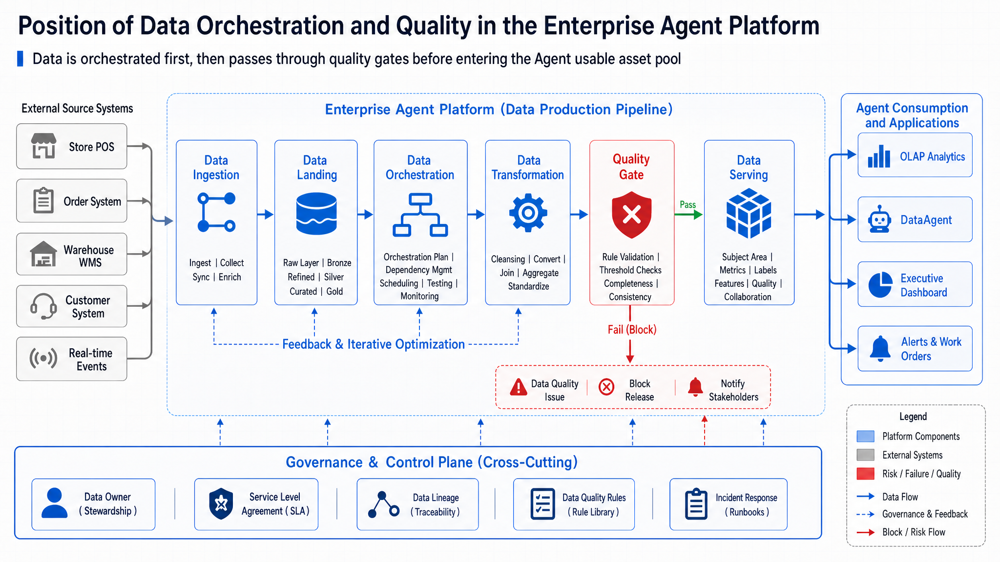
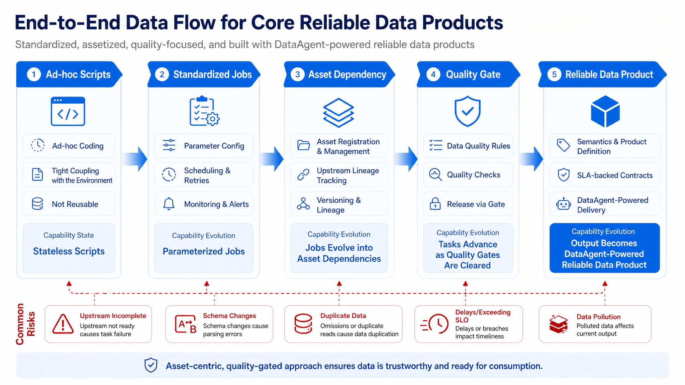
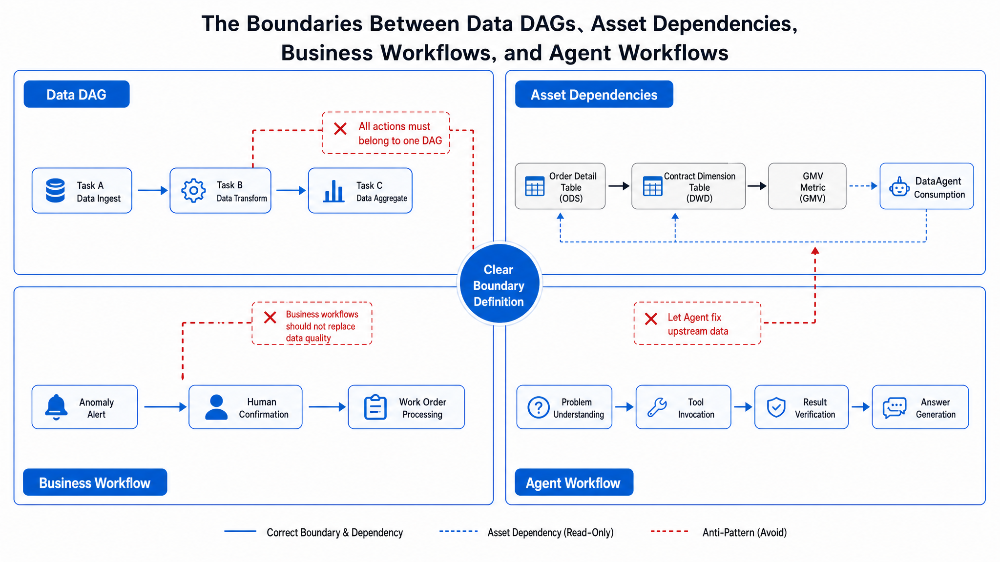
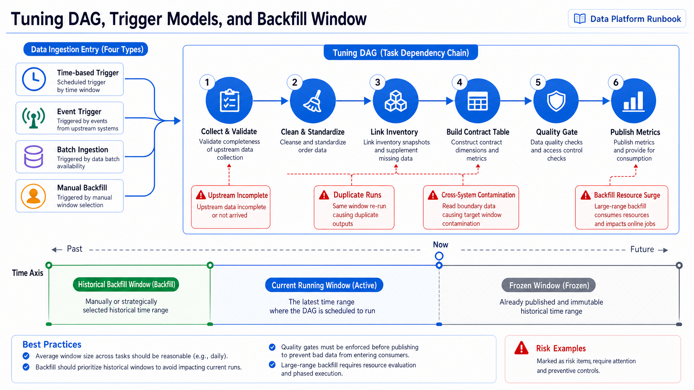
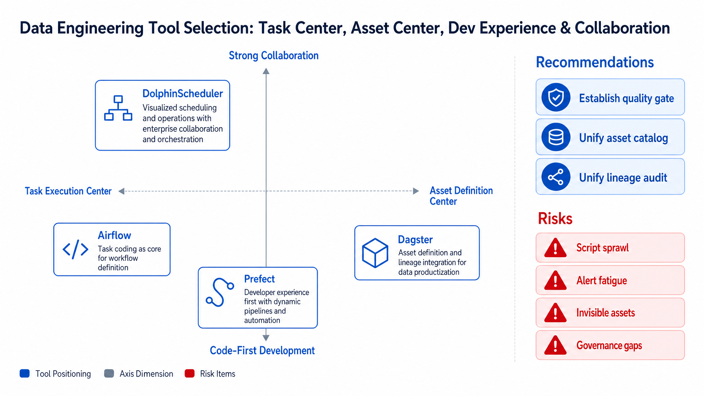
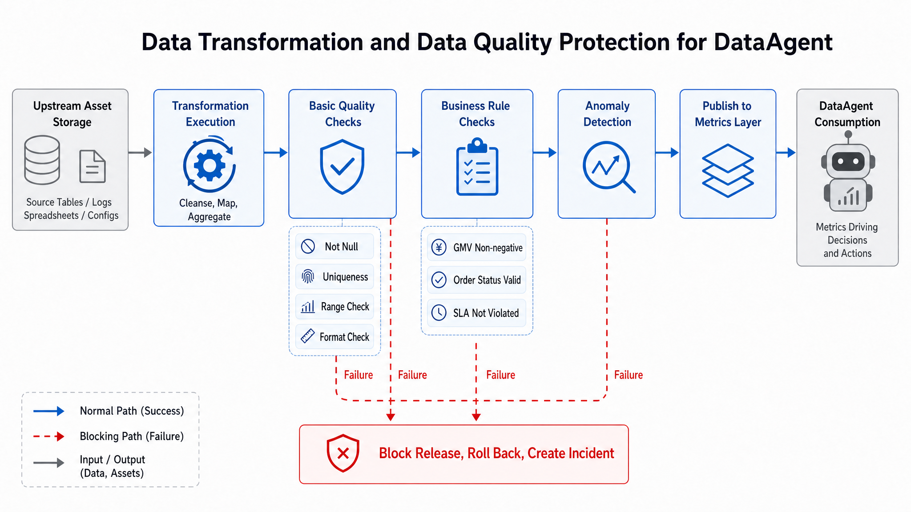
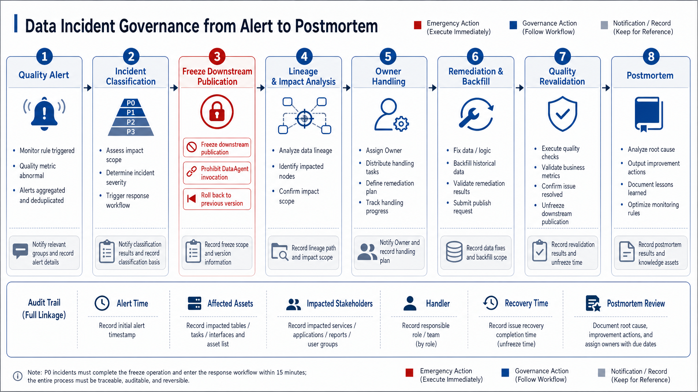
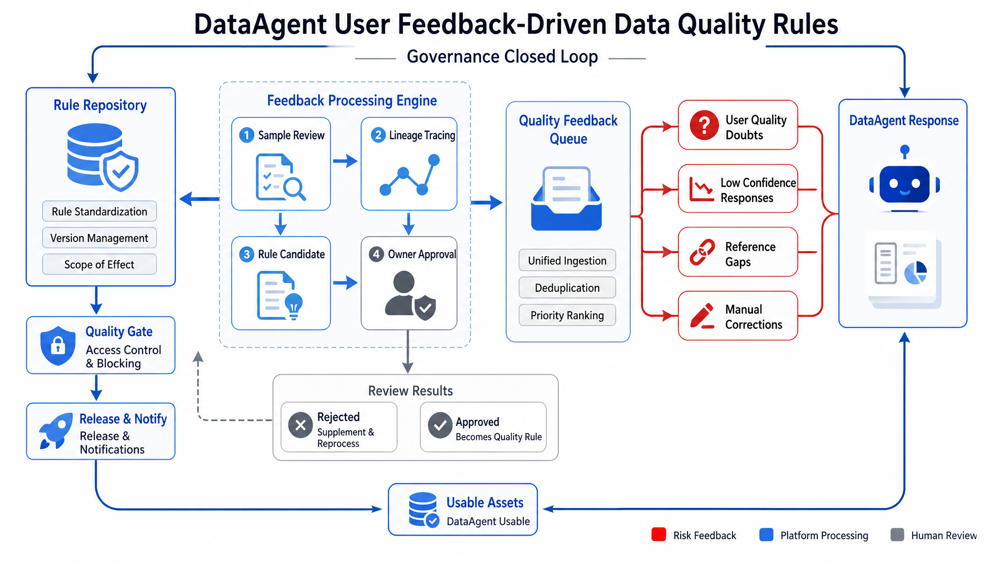
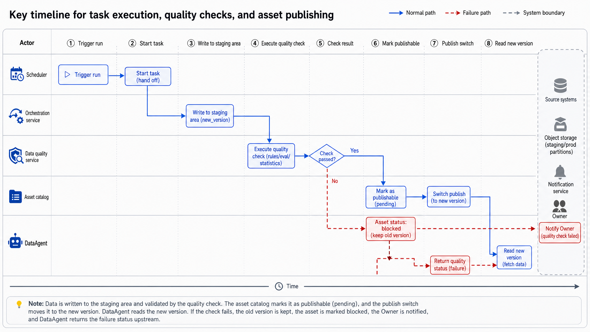
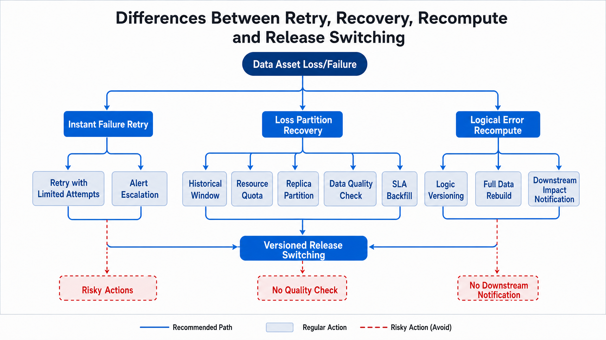

# Chapter 14 Data Orchestration and Quality

---

This chapter discusses data orchestration and quality control, focusing on task dependencies, scheduling recovery, quality gates, data product release, and how a mini-platform enables operational management of data pipelines. Scattered scheduled scripts may run successfully once, but cannot maintain trustworthiness when dependencies change, tasks fail, or data definitions drift. This chapter explains how orchestration engines use DAGs to manage dependencies and retries, how quality gates intercept issues before data enters downstream systems, and how a data pipeline evolves from a "collection of scripts" into a "publishable, subscribable data product."

A single wrong answer from a DataAgent may seem like the model simply failed to understand the question, but underneath it could actually be caused by data collection delays, schema changes, metric definition conflicts, or missing permission filtering. By systematically analyzing the data pipeline-from task scripts to trusted data products, comparing orchestration tools, and engineering implementation-the team can first confirm the data objects, then understand how changes propagate, and finally verify how quality and timeliness issues are exposed to the upper-level Agent.

## 14.1 From Task Scripts to Trusted Data Products: The Shared Goal of Orchestration and Quality

A data platform in a multi-line-of-business enterprise can already collect business events, persist lakehouse tables, and provide OLAP queries and real-time metrics. But new challenges arise: when DataAgent answers "Why did fulfillment delays in East China rise yesterday?", the underlying order fact tables, fulfillment wide tables, inventory snapshots, and regional dimension tables must be produced in the correct order. Any delay, failure, or quality anomaly in these components turns the answer into an unreliable guess.

Early teams typically solved this with scheduled scripts. Extraction scripts run in the early morning, followed by cleaning scripts, then metrics aggregation scripts. These scripts do run, but they cannot clearly express three things: whether upstream assets are ready; whether output data meets quality rules; and what to do on failure-retry, skip, rollback, or backfill. The shared goal of data orchestration and quality governance is to transform a fragile set of scripts into a data product production line that is dependency-aware, stateful, quality-gated, ownership-assigned, and recoverable.



*Figure 14-1: Orchestration is not an isolated scheduler, and quality is not an after-the-fact report. Source: Author. Alt text: On the left under "Traditional concept" schedulers and quality reports are separated, on the right under "Data product concept" orchestration and quality gates are embedded in the same release flow, showing comparison between two organizational modes.*

Figure 14-1 shows orchestration is more than an isolated scheduler, nor is quality simply a post hoc report. They jointly sit between data production and data consumption: orchestration guarantees assets are produced according to dependencies, and quality gates ensure that assets entering DataAgent meet minimum trustworthiness.



*Figure 14-2: Change in success criteria from script tasks to data products. Source: Author. Alt text: Left column "Script task" success defined as "runs without error", right column "Data product" success upgraded to contract fulfillment, quality compliance, subscribability, traceability, illustrating change in success definition.*

The key in Figure 14-2 is not tool replacement but the change in success criteria. In the script era, success meant "task exit code 0." In the data product era, success means simultaneously ensuring "inputs are complete, dependencies met, semantics correct, output timely, failures recoverable, and results traceable." This also distinguishes an enterprise Agent platform from traditional report scripts: Agents translate data results into natural language judgements, amplifying quality problems into erroneous interpretations and mistaken actions.

### 14.1.1 Boundaries of Orchestration: Differences among Data DAGs, Asset Dependencies, Business Workflows, and Agent Workflows

Data orchestration is often misunderstood as "putting all processes into a single DAG." In an enterprise Agent platform, at least four types of processes must be distinguished.

*Table 14-1: Definitions and differences among Data DAG, orchestration, quality gates, and related concepts. Source: Author.*

| Concept | Definition | Difference from Adjacent Concepts |
|---|---|---|
| Data DAG | Directed acyclic graph expressing task execution order, e.g., clean orders before aggregating metrics | Focuses on task execution; does not inherently understand data asset semantics |
| Asset Dependency | Upstream and downstream relationships expressed by tables, views, metrics, features | Focuses on product relationships; closer to DataAgent consumption semantics than task DAG |
| Business Workflow | Human-machine processes around business actions, e.g., approval, dispatch, restocking, refund | Focuses on business state transitions; not equal to data production dependencies |
| Agent Workflow | Agent's execution path calling tools, checking results, requesting human confirmation | Focuses on reasoning and actions; may consume data assets but should not replace data orchestration |
| Quality Gate | Rules-checking, blocking, degrading, or alerting before data enters downstream consumption | Focuses on trustworthiness; more than monitoring dashboards |



*Figure 14-3: Clear boundaries reduce system coupling. Source: Author. Alt text: Left side shows tangled tasks with intersecting lines and high coupling; right side shows clear role separation among orchestration, transformation, quality, publishing with cleaner connections, comparing coupling before and after boundary clarity.*

Figure 14-3 illustrates that clear boundaries reduce system coupling. Data DAGs ensure stable production; asset dependencies explain impact scope; business workflows organize processing; Agent workflows control invocation and interpretation. Allowing Agents to "freely fix issues" inside data DAG usually causes auditing difficulties; burdening schedulers with complex business approvals makes the data platform an unmanageable business process engine.

An enterprise's fulfillment delay analysis can define boundaries this way: data orchestration generates daily order fulfillment wide tables; quality gates check order volume, primary key uniqueness, field validity, and output latency; DataAgent only reads quality-gated data products; upon quality failure, the business workflow creates an incident ticket for the owner; Agent can interpret the incident impact but cannot bypass quality gates to deliver formal analysis.

### 14.1.2 Scheduling Models: Time-based Scheduling, Event Trigger, Dataset Trigger, and Backfill

The first engineering problem for orchestration systems is "when to run." Common trigger models include time-based scheduling, event triggers, dataset triggers, and manual backfill.

*Table 14-2: Advantages and suitable scenarios of four scheduling models: time, event, dataset triggers, and backfill. Source: Author.*

| Scheduling Model | Trigger Condition | Advantages | Cost | Suitable Scenario |
|---|---|---|---|---|
| Time-based Scheduling | Fixed time or fixed interval | Simple, predictable, easy to monitor | May run empty or fail if upstream not ready | Daily/Monthly reports, stable batch |
| Event Trigger | Arrival of upstream event or file | Fast response, reduces wait time | Requires event reliability and deduplication | Hourly incremental, near-real-time sync |
| Dataset Trigger | Upstream data asset reaches ready state | Closer to asset dependency semantics | Requires asset status and metadata platform support | Shared data products across teams |
| Manual Backfill | Human specifies historical interval to rerun | Can fix historical errors | Risks polluting current results and high resource impact | Incident repair, recalculation, historical supplement |



*Figure 14-4: Scheduling trigger models and backfill governance boundary. Source: Author. Alt text: Three parallel trigger models shown: time-based, event, dataset triggers; below is a distinct boundary marking special handling for backfill, illustrating the need to govern regular schedule and backfill separately.*

Figure 14-4 stresses two points. First, trigger models must be bound to data asset status, more than clock time. Second, backfill is more than "rerunning historical dates"; it requires frozen windows, resource quotas, idempotent writes, quality rechecks, and downstream impact notifications. If backfill writes overwrite official metrics queried by DataAgent, users will see inconsistent results within the same session. Four common misunderstandings:

1. Task success equals data correctness. Tasks can succeed while writing empty, duplicated, or stale data.

2. Finer-grained DAGs are always better. Too fine granularity increases scheduling overhead and failure noise; too coarse hides fault location.

3. More quality checks are better. Checks without owners, thresholds, or remediation cause alert fatigue.

4. Backfill affects only history. Historical backfill may trigger downstream recomputation, cache refresh, and DataAgent reference changes, requiring change management.

---

## 14.2 Comparison of orchestration tools: Airflow, Dagster, Prefect, and DolphinScheduler

The differences among orchestration tools go beyond interface and syntax; they lie in how these tools model "tasks, assets, states, developer experience, and governance."

*Table 14-3: Advantages, Costs, and Suitable Scenarios of Orchestration Tools like Airflow, Dagster, and Prefect. Source: Compiled by this book.*

| Solution | Advantages | Costs | Suitable Scenarios | Recommendation by this Book |
|---|---|---|---|---|
| Airflow | Mature ecosystem, stable scheduling model, rich operational experience | Task DAG-centric, asset semantics require additional governance | Traditional batch processing, complex dependencies, established data platform teams | Suitable as a general-purpose batch scheduling foundation, but needs to supplement asset state and quality gates |
| Dagster | Strong asset modeling, suitable for treating data products as first-class citizens | Team needs to adopt new asset development paradigm | Data product governance, quality-driven development, strong lineage scenarios | Suitable for building new trusted data product platforms |
| Prefect | Lightweight developer experience, flexible dynamic workflow expression | Large-scale centralized governance requires extra design | Data science tasks, lightweight workflows, hybrid cloud tasks | Suitable for rapid iteration and self-service orchestration by application teams |
| DolphinScheduler | Rich visualization and task types, suitable for multi-team collaboration | Complex asset semantics and code-based governance need enhancement | Multi-role internal enterprise scheduling, domestic ecosystem adaptation | Suitable for organizations emphasizing visual collaboration, still needs quality and contract systems |

None of these tools replace a data quality system. Airflow can tell the platform "whether tasks ran," but cannot automatically prove there are no anomalies in order amounts; Dagster models assets more clearly, but still requires quality rules, thresholds, owners, and failure actions; Prefect improves development flexibility, but too much flexibility can fragment workflows; DolphinScheduler is friendly for multi-task visualization but without code review and asset contracts, it can turn into a pile of graphical scripts.



*Figure 14-5: Tool choice should align with organizational capability. Source: Drawn by this book. Alt text: A matrix with "team engineering capability" and "asset governance needs" as axes, placing Airflow, Dagster, Prefect, etc. into different quadrants, emphasizing selections based on actual organizational ability.*

Figure 14-5 illustrates that tool selection should return to organizational capabilities. If the team already has many Airflow DAGs, it can first supplement dataset state, quality checks, and incident processes; if the goal is to treat data assets as platform products, asset-centric modeling is more valuable; if application teams require rapid self-service orchestration, flexibility must be paired with unified templates and auditing.

### 14.2.1 Transformation and Testing: dbt Models, dbt Tests, Great Expectations, and Soda

Orchestration handles "when and on what dependencies to run," while transformation and testing handle "what is output and whether it is trustworthy." In lakehouse and OLAP scenarios, dbt is often used to engineer SQL transformation logic; dbt tests express uniqueness, non-null, relational integrity, and custom assertions. Great Expectations and Soda lean more towards general-purpose data quality checks, suitable for quality monitoring across data sources, tables, and business rules.

*Table 14-4: Advantages and Suitable Scenarios of Transformation and Testing Tools like dbt tests and Great Expectations. Source: Compiled by this book.*

| Solution | Advantages | Costs | Suitable Scenarios | Recommendation by this Book |
|---|---|---|---|---|
| dbt tests | Close to SQL models, suitable to write tests during development | Limited expression of complex cross-system quality rules | Metric models, dimension tables, fact tables, development workflows | Default starting point for model-embedded tests |
| Great Expectations | Rich rule expression, strong documentation and data profiling | Rule maintenance and platform integration require governance | Cross-source quality checks, data contract verification, audit reports | Used for core assets and cross-team contracts |
| Soda | Simple quality check configuration, suitable for continuous monitoring | Deep customization depends on integration method | Daily monitoring, rule inspection, lightweight gating | Used for standardized inspection and alerting |
| Custom SQL Checks | Most flexible, can closely match business logic | Easily fragmented, lacks unified lineage and reporting | Special business rules, ad hoc incident investigation | Allowed, but must be centrally registered and have an owner |



*Figure 14-6: Minimal closed-loop of quality gates. Source: Drawn by this book. Alt text: Circular flow - data output, run quality checks, if passed publish, if failed block and alert; arrows indicate failed samples feeding back for rule revision, forming a quality gate loop.*

Figure 14-6 shows the minimal closed-loop for quality gates. The actions after quality failure must be predefined: block publishing, continue publishing but mark risk, rollback to previous version, degrade to offline snapshot, create incident ticket, or request manual confirmation. Quality rules without actions are just noise. A quality event contract oriented to DataAgent can be expressed as follows.

```json
{
  "asset_id": "ads.fulfillment_delay_daily",
  "run_id": "run_20260611_020000",
  "partition": "dt=2026-06-10",
  "status": "blocked",
  "severity": "high-risk",
  "checks": [
    {
      "name": "order_id_unique",
      "dimension": "uniqueness",
      "expected": "duplicate_count = 0",
      "actual": "duplicate_count = 184",
      "action": "block_publish"
    },
    {
      "name": "row_count_range",
      "dimension": "completeness",
      "expected": "between 950000 and 1200000",
      "actual": "612340",
      "action": "keep_previous_partition"
    }
  ],
  "owner": "fulfillment-data-team",
  "lineage": {
    "upstream_assets": ["dwd.orders_daily", "dim.store_region"],
    "downstream_consumers": ["DataAgent", "operations_dashboard"]
  }
}
```

#### Example 14-1: Quality event contract

This production engineering example allows DataAgent and dashboards to know whether a partition is available, why it was blocked, and what temporary fallback strategy to use. The event should be consumed by orchestration, metadata, observability, and Agent runtime instead of staying inside a quality dashboard.

### 14.2.2 Data Quality Dimensions: Completeness, Uniqueness, Accuracy, Timeliness, Consistency, and Validity

Quality rules should be organized by dimensions; otherwise, they tend to become unmaintainable checklists.

*Table 14-5: Attention Points and Example Rules for Data Quality Dimensions like Completeness, Uniqueness, Accuracy. Source: Compiled by this book.*

| Quality Dimension | Attention Points | Example Rules | Typical Actions After Failure |
|---|---|---|---|
| Completeness | Is data missing? | Daily order row count should not fall below a reasonable range of historical weekday averages | Block publishing or wait for upstream to fill |
| Uniqueness | Are primary keys duplicated? | `order_id` is unique within the partition | Block publishing and locate duplicate source |
| Accuracy | Do values reflect business facts? | Payment amount cannot be negative; fulfillment time cannot be reversed | Isolate abnormal records and enter repair process |
| Timeliness | Is output before SLA? | Core metrics completed before 08:00 daily | Alert, degrade to old version, notify downstream |
| Consistency | Are cross-table or cross-system values aligned? | Amount differences between order fact and payment fact tables within threshold | Pause high-risk queries and trigger reconciliation |
| Validity | Are fields within domain and format? | Store status can only be open, paused, or closed | Reject bad data or write to quarantine table |

Quality rules also need to distinguish between hard gates and soft alerts. Hard gates block downstream releases and apply to uncompromising conditions such as primary key uniqueness, core field non-null, valid amounts, and permission classifications. Soft alerts allow the output to continue downstream but must carry risk tags, suited for minor row fluctuations, delays close to thresholds, or historical distribution changes needing observation.

#### Hard gates, soft alerts, and sideband isolation

*Table 14-6: Tradeoffs between Two Quality Interception Strategies - Hard Gates and Soft Alerts. Source: Compiled by this book.*

| Solution | Advantages | Costs | Suitable Scenarios | Recommendation by this Book |
|---|---|---|---|---|
| Hard Gates | Prevent bad data entering core consumption pipelines | May cause data unavailability, business wait times | Primary key duplication, missing core fields, permission violations, illegal amounts | Use for high-risk core assets |
| Soft Alerts | Maintain data availability, reduce blocking | Agents may reference risky results | Distribution fluctuations, minor delays, explainable anomalies | Must carry quality state in responses |
| Sideband Isolation | Isolate bad records, core pipelines continue running | Requires later repair and reconciliation | Small quantities of exceptions, locally removable data | Use for detail table cleaning, but isolation rate should be alerted |

### 14.2.3 Data Incident Governance: SLA, Alerts, Lineage Location, Responsible Owner, Repair, and Retrospective

Data incidents are not synonymous with "task failure." Successful tasks outputting incorrect data, quality gates incorrectly passed, backfills overwriting official partitions, and DataAgent referencing unpublished assets all count as data incidents. Incident governance requires defining a complete process of discovery, classification, containment, localization, repair, verification, retrospective, and rule sedimentation.



*Figure 14-7: Data incident handling's containment and repair paths. Source: Drawn by this book. Alt text: Incident flow divided in two phases - containment (downstream degradation, rollback to old version, alerts) and repair (root cause localization, backfill & recompute, retrospective), arrows indicate restore availability first, then root cause.*

The core in Figure 14-7 is to contain first, then repair. For DataAgent, containment actions usually include hiding problematic assets, returning quality status, degrading to the last available partition, and prohibiting triggering action-type suggestions. If the platform only notifies data engineers without informing the DataAgent service layer, users may still get wrong answers continuously.

*Table 14-7: Detection Methods and Recovery Strategies for Data Incidents like Upstream Not Ready, Data Drift, etc. Source: Compiled by this book.*

| Failure Mode | Trigger Condition | Impact | Detection Method | Recovery Strategy |
|---|---|---|---|---|
| Upstream Not Ready | Source system delay, ingestion task failure | Downstream no-op, output empty tables or outdated data | Dataset state, row fluctuations, upstream heartbeat | Wait, retry, degrade to previous partition |
| Field Drift | Upstream adds, deletes, or modifies field types | Transformation failure or silent errors | Schema validation, contract compatibility checks | Block publishing, perform change review |
| Primary Key Duplication | CDC replay, backfill duplicate writes | Metrics doubling, join inflation | Uniqueness tests, reconciliation discrepancies | Idempotent rewrite, isolate duplicate records |
| Quality Rule False Positive | Thresholds not considering promotions, holidays, seasonality | Invalid blocks affecting business availability | Alert confirmation rate, historical distribution analysis | Introduce dynamic thresholds and business calendars |
| Quality Rule False Negative | Insufficient coverage or too loose thresholds | Bad data entering DataAgent | User doubts, downstream reconciliation, sampling audit | Retrospective to add rules, expand gating scope |
| Backfill Polluting Current Results | Historical recompute overwriting current partition or cache | Inconsistent metric values over time | Publish audit, version differences, cache hit checks | Use versioned partitions, shadow backfill before cutover |
| Alert Unhandled | Owner missing or unclear escalation path | Faults expand | Unconfirmed alert duration, on-call logs | Enforce owner registration and escalation mechanisms |

### 14.2.4 Agent Feedback Closed-Loop: From User Doubts and Answer Confidence to Quality Rule Sedimentation

Enterprise Agent platforms have an additional quality signal that traditional data platforms don't: users directly challenge answers. Users might ask "Is this number too low?", "Why is it different from the dashboard?", or "Which date's data did you use?" These feedbacks should not be treated as mere customer support issues; they must enter the data quality closed-loop.



*Figure 14-8: Feedback chain from incident retrospective to rule sedimentation. Source: Drawn by this book. Alt text: The chain starts from a data incident, distills new quality rules through retrospective, deposits them into gating, intercepting similar future problems early, forming a continuous improvement feedback loop.*

Figure 14-8 shows a practical feedback chain. Low confidence answers, user doubts, manual corrections, and missing citations can all become candidate rules, but cannot directly become blocking rules automatically. Candidate rules must undergo sample validation, false positive assessment, owner review, and staged rollout. Otherwise, the platform risks turning individual feedback into widespread excessive blocking.

DataAgent's quality responses should explicitly express data status. For example, when a core partition is blocked, the answer should not masquerade as normal but clarify, "Currently using the last available partition; today's partition was not published due to failure of uniqueness checks." Such answers need orchestration, quality, and metadata systems to jointly provide status.

---

## 14.3 Engineering Implementation: Quality Gates, Task Status, Alerts, and Failure Recovery

Chapters 13-15 do not require incorporating the mini-platform. This section provides examples of production engineering, focusing on self-consistent interfaces, states, and operational workflows. A scheduling platform must maintain at least four categories of status: task runtime status, asset availability status, quality check status, and publication status. Task success does not equal asset availability; passing quality checks does not mean the data is published; successful publication does not guarantee all downstream caches have been refreshed.



*Figure 14-9: Separating "write to temporary partition" and "switch to official version." Source: drawn by the authors. Alt text: Publishing happens in two steps-first write to a temporary partition and validate, then atomically switch the official version pointer; the arrow shows switching only after validation passes to avoid exposing partial data.*

Figure 14-9 separates "write to temporary partition" and "switch to official version." This ensures that when quality fails, bad data does not overwrite production assets; after quality passes, publication becomes an auditable version switch. DataAgent only reads the official version and explicitly allowed fallback versions. The YAML below shows an example configuration of data asset scheduling and quality settings.

```yaml
# Example: data asset orchestration and quality config, no real credentials included
asset:
  id: ads.fulfillment_delay_daily
  owner: fulfillment-data-team
  schedule: "0 6 * * *"
  partition_key: dt
  publish_mode: versioned_partition

dependencies:
  - asset_id: dwd.orders_daily
    freshness: 2h
  - asset_id: dim.store_region
    freshness: 24h

quality_gates:
  hard:
    - name: order_id_unique
      dimension: uniqueness
      expression: duplicate_count(order_id) = 0
      on_failure: block_publish
    - name: required_columns_not_null
      dimension: completeness
      columns: [order_id, store_id, promised_at, delivered_at]
      on_failure: block_publish
  soft:
    - name: row_count_anomaly
      dimension: completeness
      expression: row_count within historical_band(weekday, 0.2)
      on_failure: publish_with_warning

fallback:
  strategy: keep_previous_partition
  max_age: 2d

notifications:
  severity: high-risk
  channels: [data-incident-queue]
```

#### Example 14-2: Asset orchestration and quality configuration

This is not proprietary syntax. It shows the fields production systems need to store: dependencies, freshness requirements, gates, failure actions, fallback strategies, and notification channels. The following pseudocode shows how publication avoids overwriting the official partition with bad data.

```python
# Pseudocode: switch official version only after passing quality gates
def publish_asset(run):
    write_temp_partition(run.asset_id, run.partition, run.output)
    quality_result = run_quality_checks(run.asset_id, run.partition)

    if quality_result.has_blocking_failure:
        mark_asset_state(run.asset_id, run.partition, "blocked", quality_result)
        keep_previous_version(run.asset_id)
        notify_owner(run.asset_id, quality_result)
        return "blocked"

    version = commit_versioned_partition(run.asset_id, run.partition)
    mark_asset_state(run.asset_id, run.partition, "published", quality_result)
    refresh_downstream_cache(run.asset_id, version)
    return "published"
```

#### Example 14-3: Quality publication pseudocode

The core idea is to write temporary results first, validate quality, and switch versions only after the checks pass. On failure, the platform retains the old version and exposes quality status to downstream systems. Failure recovery must distinguish retry, backfill, and recomputation. Retry addresses transient failures, backfill covers missing historical windows, and recomputation handles logic or definition errors. These three actions cannot share the same button.



*Figure 14-10: Recovery decision flow for retry, backfill, and recomputation. Source: drawn by the authors. Alt text: Decision tree splitting recovery paths by transient failure, upstream missing data, or logic change, helping select the appropriate recovery action.*

Figure 14-10 is the core of the operational Runbook. Transient network failures can be automatically retried; missing source data requires waiting or backfilling; business logic errors must follow change and recomputation processes. If a platform configures all failures as automatic retry, it will cause many invalid runs in cases of schema incompatibility, quality failures, or permission errors.

### 14.3.1 How quality rules enter production chains

- [ ] Asset registration: Every core table, view, metric, and feature has an asset ID, owner, SLA, partition strategy, and downstream consumers.
- [ ] Dependency modeling: Distinguish task dependencies and asset dependencies; DataAgent only consumes asset availability status.
- [ ] Trigger strategies: Clear boundaries for time scheduling, event triggers, dataset triggers, and manual backfill.
- [ ] Quality dimensions: Integrity, uniqueness, accuracy, timeliness, consistency, and validity all have core rule coverage.
- [ ] Gate actions: Each quality rule has severity level, failure action, downgrade strategy, and owner.
- [ ] Publication isolation: Output first writes temporary partitions or shadow versions; after quality passes, switch the official version.
- [ ] Backfill governance: Historical backfill has windows, resource quotas, idempotent writes, quality rechecks, and downstream notifications.
- [ ] Alert governance: Alerts have classification, deduplication, suppression, escalation path, and confirmation logs.
- [ ] Incident process: Quality incidents can freeze downstream publication, trace lineage, fix, recheck, and retrospect.
- [ ] Agent integration: DataAgent can read asset status, quality status, freshness, and fallback versions.
- [ ] Cost control: Budget schedules concurrency, backfill resources, quality scan frequency, and historical data retention.
- [ ] Audit trails: Every publish, block, backfill, recompute, and rule change has audit records.

#### Task succeeds but the order fact table is empty

The operations team asks about yesterday's fulfillment delay, and DataAgent answers "no obvious delay" because the upstream order fact table is empty. The scheduler only checked task exit status, with no row count, partition freshness, or upstream asset checks. Core assets should add non-empty, row count fluctuation, and freshness gates; on failure, publication should be blocked and DataAgent should return a data-unavailable status.

#### Historical backfills refresh online caches

When the data team backfills last month's fulfillment criteria, operational dashboards and DataAgent current metrics may temporarily spike. Backfill tasks reused the official publication process without distinguishing historical shadow partitions from online partitions. The safer path is to write shadow versions first, run quality rechecks and diff reports, switch manually, and isolate current-window cache from historical backfill cache.

#### Promotion-day row count spikes trigger false quality alarms

On a major sale day, order volume can exceed normal historical thresholds, causing the quality system to block core daily reports. Row count rules should incorporate business calendars, promotion tags, and weekday effects. Only non-negotiable rules, such as primary key uniqueness and illegal amounts, should remain hard gates; distribution fluctuation rules often belong in soft warnings with owner review.

#### Quality rules have no owners

An alert on a dimension table may trigger every day for weeks without blocking, fixing, or retirement. The root cause is that the rule has no owner and no escalation path. Each quality rule should bind to an asset owner, confirmation timeout, and closure state; long-running false alarms must be closed, adjusted, or converted to observation.

#### Agent user feedback never enters the quality system

Multiple business users may report that the store-region definition differs from dashboards, yet DataAgent repeats the same incorrect answer a week later. The feedback stayed in product support queues and never became a quality or semantic consistency sample. Platforms should maintain DataAgent feedback queues, aggregate dispute samples by asset and field, and add reviewed consistency rules for mappings such as region, store type, and channel.

### 14.3.2 Propagating quality status into the Agent chain

Quality status should travel with the data asset into DataAgent. The Agent should know whether a partition is published, blocked, degraded to a previous version, under backfill, or available with warning. This state affects table selection, SQL execution, answer wording, and whether the Agent may recommend an action.

The propagation path usually crosses orchestration, metadata, query gateway, and Agent runtime. Orchestration records task and publication state; quality systems record checks and failure actions; metadata exposes asset status; the query gateway blocks or tags access; the Agent runtime adds freshness and quality statements to responses. This chain prevents a successful but unsafe data run from becoming a confident natural-language answer.

---

## 14.4 Data Quality Samples And Agent Failure Write-Back

After data quality governance connects to Agents, quality samples should come from real failures. Traditional quality rules often cover nulls, duplicates, ranges, and latency. Agent scenarios expose additional issues: field names are understandable to the model but vague for business meaning, similar enum values cause wrong filters, time grain conflicts with metric definitions, dimension tables lack aliases, or outliers are explained as business changes. If these issues do not return to data quality work, Agents will fail on the same classes repeatedly.

Failure write-back should include user question, generated query, actual result, human correction, faulty field, quality rule, and repair state. After a DataAgent query fails, the team should determine whether the model generated wrong SQL or the data lacked quality constraints. If field aliases caused the error, metadata should be repaired. If dimension mapping is missing, data rules should be added. If an outlier is real but needs explanation, business notes should be added. If latency caused a wrong conclusion, refresh-state prompts should be added. The closer quality samples are to tasks, the more useful rules become for Agents.

Quality review needs priority. The first version does not need every possible rule. It should first cover data that affects external output, high-risk decisions, core metrics, and cross-business reuse. Low-risk exploratory data can be marked unstable and kept out of formal reports. Data quality work then grows around production Agent tasks instead of becoming unbounded rule engineering.

## 14.5 Business Explanation For Quality Rules

Data quality rules need business explanations. Null rate, uniqueness, range checks, and latency thresholds are clear to data teams, but business users see different questions: why the Agent did not answer, why the report is delayed, or why a metric is marked abnormal. If rules remain only in technical alerts, frontend and reports cannot explain them, and users may read quality blocking as system failure.

Each high-risk quality rule should have a business note. "Order partition not refreshed in the last three hours" maps to "today's real-time sales may be understated." "Duplicate customer master data" maps to "customer attribution analysis may double count." "Currency missing" maps to "cross-region revenue cannot be aggregated." These notes can enter DataAgent failure messages, report comments, and human-review material. The more understandable quality rules are, the more trust the Agent can preserve during exceptions.

Quality explanation also needs owners. Data owners repair data. Business owners confirm impact. The platform passes the exception to Agents and user interfaces. Rules without owners create alert noise. A first version can start by adding business explanations for core metrics and high-risk fields, then expand the rule library as failure samples grow.

## 14.6 Replay after data-quality rule changes

After a data-quality rule changes, the team should replay affected Agent samples. Threshold changes, null rules, primary-key uniqueness, enum ranges, freshness alerts, and anomaly logic all change how DataAgent judges whether data is trustworthy. If rules become looser, the system may explain low-quality data as business fact. If rules become stricter, the system may reject usable data too often. Quality rules need version governance as well.

Replay should record old rule, new rule, affected tables, affected metrics, historical failure samples, current pass rate, and human ruling. For business reporting and automatic report generation, the team should also check whether quality notices in reports changed with the rule. Quality rules should not live only in orchestration systems or data-test scripts. They should reach the semantic layer and Trace so the Agent knows whether data is suitable for the current question.

A first version can keep a quality-rule ledger for core data products. Each rule has owner, applicable table, business explanation, last change time, and rollback method. During an online dispute, the team can decide whether the data was truly abnormal, the rule produced a false alarm, the rule missed a defect, or the Agent failed to use the quality signal. Data quality then becomes part of the intelligent workflow instead of an internal data-team alert.

## 14.7 Joint review of quality rules and orchestration state

After data-quality problems enter Agent workflows, the platform should not check only whether rules passed. Orchestration state matters as well: whether the task started on time, whether dependencies waited too long, whether rerun triggered downstream refresh, whether failure was marked correctly, and whether alerts reached the owner. A wrong metric answer may come from a missed quality rule, delayed upstream task, incomplete backfill, stale downstream cache, or DataAgent using an old partition. Quality rules and orchestration state should appear in the same review material.

Joint review should start from a business task. For a revenue anomaly in an operating report, the team should inspect null rate and key uniqueness on the sales table, but also data ingestion, cleaning, aggregation, metric publication, and semantic-layer refresh. If quality rules passed while task state was abnormal, the Agent should tell users that data is refreshing or that an older version is being used. If task state is normal while quality rules failed, the Agent should stop producing firm conclusions and return an explainable degraded result.

A first version can create a joint review template for core data products. The template records DAG run, asset version, quality rule, alert owner, downstream Agent, affected artifact, and recovery action. Data quality then moves from table-level checking into the runtime chain of query execution, report generation, and Trace. The value of orchestration shifts from tasks finishing to business evidence remaining trustworthy.

## 14.8 User-visible degradation during orchestration incidents

When a data-orchestration incident happens, the Agent platform must decide what the user sees. Upstream delay, failed quality rules, incomplete backfill, scheduler retry, and paused metric release can all put data into a temporarily unavailable or limited-use state. If DataAgent still gives a firm conclusion, users treat the system as a trusted data entry point. If the system returns only a technical error, users cannot tell whether to wait, rephrase, or inspect the previous version. Degradation design should translate data-production state into answer boundaries that users can understand.

User-visible degradation can follow task type. For synchronous data questions, delayed latest partitions may allow the platform to return the previous version with a cutoff time. For operating reports, failed quality rules may pause publication and list affected metrics. For automatic root-cause analysis, a missing upstream table should stop inference and keep the task in a waiting queue. Low-risk trend analysis may use degraded samples, but the artifact must carry the incomplete-data mark. Different tasks have different time and accuracy expectations, so one generic error page is not enough.

Degradation also needs Runtime state. When data is unavailable, a Run should not be marked simply as `failed` or `succeeded`. It should preserve whether it is waiting, completed with degradation, under human review, or scheduled to rerun after refresh. Trace should record the data asset, quality rule, orchestration state, and user-visible message that triggered degradation. Later review can then check whether the user received the right explanation, and Chapter 42 can split availability into compute availability, data availability, and answer trust.

A first platform version can prepare three degradation messages for frequent data products: delayed data, quality failure, and permission trimming. The message does not need to expose internal DAG detail, but it should state data version, affected scope, and follow-up action. Orchestration and quality states then move from internal alerts into Agent interaction and audit evidence. For enterprise DataAgent, knowing when to withhold an answer, how to explain waiting, and how to recover is part of data engineering capability.

## 14.9 Ruling process for data contract disputes

After data contracts go live, disputes often come from boundary samples. The business team may believe the field meaning is clear, the data team may believe the data satisfies the schema, while the Agent team sees wrong explanations in real tasks. The dispute should not remain a debate about whose definition is correct. The platform needs to pin the sample and inspect field definition, source-table interpretation, transformation logic, permission labels, historical data, and user question together.

The ruling process should keep evidence. Each disputed sample should include user question, involved fields, current contract, actual data fragment, downstream tool result, model explanation, human ruling, and suggested repair. If the ruling says the field definition is unclear, the contract document and semantic layer should change. If source data is abnormal, the case enters quality repair. If the Agent overstated interpretation, prompt or output validation should change. If the business has several valid interpretations, the business owner should define scope.

A first version can connect data contract disputes to release flow. While a dispute remains open, high-risk metrics should not enter automatic reports. Once the ruling is complete, the sample enters regression. A data contract then becomes a shared fact agreement among business, data, and Agent teams, with the schema file serving as one part of that agreement.

## 14.10 Cross-layer review of data-quality incidents

After data quality reaches production, a successful demo is not enough evidence. The platform needs stable fields for metric versions, abnormal samples, validation rules, owners, affected reports, and repair time, and those fields should connect to release records, Trace, evaluation samples, and incident notes. When a production issue appears, teams can follow one set of facts to understand scope, ownership, and repair order instead of stitching together model logs, business logs, and verbal explanations.

This evidence also connects the surrounding chapters. It links to Chapter 33 on the semantic layer, Chapter 34 on NL2SQL, and Chapter 36 on report generation: upstream capabilities provide assumptions, downstream capabilities consume the result, and governance capabilities preserve evidence and review decisions. If these materials do not share identifiers and versions, the production system splits apart. Business owners see user complaints, platform owners see system errors, and security or compliance teams see explanations written after the fact. That separation makes it hard to decide whether the issue came from data, model behavior, tool contracts, workflow state, or organizational ownership.

Common production risks include source-table delay being mistaken for business movement, null-handling changing a metric definition, and anomalies being cached into reports. These risks are less visible during demos because demos usually exercise the successful path. Production users bring boundary cases, repeated requests, permission changes, and long-running state. The platform team should turn such failures into release samples. Some samples should block launch, some can be handled by degradation, and some require the business owner to accept the remaining risk with a review date.

Data-quality reviews should record engineering repair and business explanation separately. The record can stay compact, but it should include time, version, owner, sample, action, and the next review condition. Without those fields, review remains informal experience. With them, one production issue can become material for later releases, evaluation suites, and training.

A first platform version can start with a small set of high-risk paths. Choose flows with high traffic, high business impact, or sensitive data, require an evidence package for each change, and then expand the practice to ordinary scenarios. This keeps the capability at the engineering level: runnable, explainable, and recoverable.
## 14.11 Business versioning for quality rules

Data-quality rules change with the business. Stockout, refund, channel migration, organization change, and metric rename can all make old anomaly thresholds invalid. If a rule lives only inside a validation job, business teams cannot tell whether an anomaly is a data error or an expired rule. The platform should give quality rules business versions that record scope, threshold source, approver, start time, and retirement condition.

Business versions also help Agents explain results. When the same metric differs before and after a rule change, DataAgent should state which quality-rule version is in use. The report layer should avoid explaining rule change as business movement. For high-impact metrics, rule change should trigger sample replay and user notice so old reports, caches, and evaluation samples do not keep using stale judgment.

A first version can start with core business metrics. Each rule change records reason, affected fields, affected reports, replay samples, and rollback method. Quality governance then moves from background validation jobs into the platform evidence system for data questions, reports, and incident review.

## Chapter Recap

1. The goal of data orchestration is not simply to run scripts on schedule, but to reliably produce data products according to dependencies, states, quality, and versions.
2. Task DAGs, asset dependencies, business workflows, and Agent Workflows must be governed in layers. Mixing them together leads to difficulties in permissions, auditing, and recovery.
3. Data quality rules must include dimensions, thresholds, severity levels, failure actions, and owners. Rules without actions only generate alert noise.
4. DataAgents should only consume data assets that pass gates or are explicitly downgraded, and must expose quality status and freshness in their responses.
5. Backfill, retry, and re-computation are three distinct recovery actions, requiring versioned releases, quality re-checks, and downstream notifications.

- Official Documentation: [Apache Airflow Documentation](https://airflow.apache.org/docs/). Supports the chapter's engineering discussion on task DAGs, scheduling, and run states.
- Official Documentation: [Dagster Documentation](https://docs.dagster.io/). Supports explanations of asset-centric orchestration and data product modeling.
- Official Documentation: [dbt Tests](https://docs.getdbt.com/docs/build/data-tests). Supports built-in model tests and SQL transformation quality explanations.
- Official Documentation: [Great Expectations Documentation](https://docs.greatexpectations.io/). Supports general data quality rules and validation processes.
- Official Documentation: [Soda Documentation](https://docs.soda.io/). Supports lightweight quality monitoring and rule checks.
- Reference Projects: [Prefect](https://docs.prefect.io/), [Apache DolphinScheduler](https://dolphinscheduler.apache.org/), [OpenLineage](https://openlineage.io/). Used for comparison of orchestration, visual collaboration, and lineage collection implementations.
- Related Chapters: [Chapter 10 Data Ingestion and Integration](ch10.md), [Chapter 11 Data Lakes and Lakehouses](ch11.md), [Chapter 12 Lakehouse Engines and OLAP](ch12-olap.md), [Chapter 13 Streaming Computing and Real-time Data](ch13.md), [Chapter 15 Metadata, Lineage, Contracts, and Metrics](ch15.md), [Chapter 34 NL2SQL Engineering](../../part06-dataagent/en/ch34-nl2sql.md), [Chapter 38 Observability and Tracing](../../part07-observability-eval/en/ch38-trace.md), [Chapter 42 SLO and Reliability](../../part07-observability-eval/en/ch42-slo.md).

## References

Apache Airflow. (n.d.). [Documentation](https://airflow.apache.org/docs/).

Dagster. (n.d.). [Documentation](https://docs.dagster.io/).

Prefect. (n.d.). [Documentation](https://docs.prefect.io/).

Great Expectations. (n.d.). [Documentation](https://docs.greatexpectations.io/).

Soda. (n.d.). [Documentation](https://docs.soda.io/).
