# Chapter 15 Metadata, Lineage, Data Contracts, and Metrics

---

This chapter concludes the governance layer of the data foundation, explaining how metadata, lineage, data contracts, and metric definitions provide DataAgent with queryable, interpretable, and traceable business semantics. When DataAgent answers questions like "Where does this data come from? What is its definition? Can it be trusted?", it relies not on models but on the metadata and lineage accumulated in the foundational platform. This chapter treats metadata as the platform's data control plane, explains how lineage supports impact analysis and incident troubleshooting, how data contracts constrain producers, and why unified metric definitions are a prerequisite for trustworthy data queries.

A mistaken answer by DataAgent may appear to be caused by the model misunderstanding the question, but the root cause may lie in delayed data ingestion, schema changes, metric definition conflicts, or missing permission filters. Treating metadata as the Agent platform's data control plane and using Data Contracts plus engineering rollout to clarify the data lineage enables teams first to confirm data assets, then verify how changes propagate, and finally identify how quality and freshness expose themselves to upper-layer Agents.

## 15.1 Metadata as the Agent Platform's Data Control Plane

A multi-business-line company's DataAgent can access lakehouse tables, OLAP engines, real-time metrics, and quality status. Without a metadata control plane, the Agent faces four types of uncertainty when dealing with natural language queries: which table to use; what fields mean; whether metric definitions are consistent; whether the current user has permission to see the result. Traditional BI reduces these issues via fixed dashboards and human training, but DataAgent requires these decisions to be automated, interpretable, and auditable.

Metadata is more than "table comments." It is the enterprise Agent platform's data control plane responsible for asset registration, semantic description, lineage linkage, contract constraints, metric service, permission enforcement, and audit recording. Without this control plane, the Agent can only guess by combining physical table names, field names, and past queries, and answer quality rapidly degrades as data scale increases.

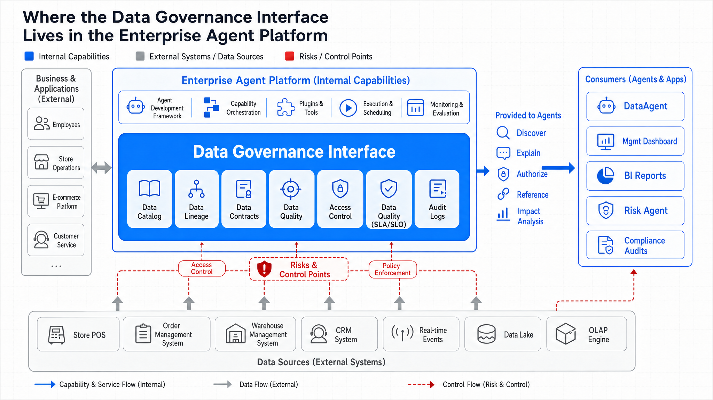
*Figure 15-1: Metadata control plane spans data infrastructure layer and Agent consumption layer. Source: Author. Alt text: a central metadata control plane connects downward to ingestion, lakehouse, orchestration, etc., and upward to DataAgent, dashboards, indicating metadata is a unified control plane linking the two layers.*

Figure 15-1 illustrates that the metadata control plane spans the data infrastructure layer and the Agent consumption layer. It doesn't replace the lakehouse or OLAP engines but informs DataAgent which assets are available, which fields are reliable, which metrics can be reused, where answers reference from, and who is impacted by changes.

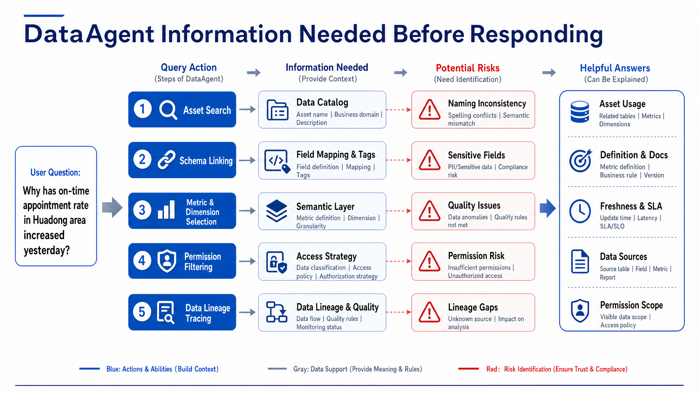
*Figure 15-2: How metadata enters the Agent inference chain. Source: Author. Alt text: Agent pulls table schema, definitions, permissions, and lineage from metadata service, injecting into reasoning context, showing metadata as runtime input used in each query.*

Figure 15-2 shows how metadata enters the Agent inference chain. Users ask natural language questions, but the platform must map questions to assets, fields, metrics, permissions, and references. Relying only on LLM memory easily confuses "GMV," "sales," and "net revenue." The control plane should provide queryable, verifiable, auditable context.

### 15.1.1 Data Catalog: Search, Tags, Owner, Classification, and Asset Profile

The data catalog is the entry point of the metadata control plane. It answers "What data exists? Who owns it? Can I use it? For which questions is it suitable?" A catalog fit for DataAgent should show table and field names and asset type, business description, owner, classification, quality status, freshness, usage heat, downstream consumers, and sample queries.

*Table 15-1: Definitions and distinctions of technical metadata, business metadata, operational metadata, etc. Source: Author.*

| Concept       | Definition                                                                 | Distinction from Related Concepts               |
|---------------|-----------------------------------------------------------------------------|-------------------------------------------------|
| Technical Metadata | System attributes like table name, fields, types, partitions, storage location, refresh time | Describes physical structure; does not explain business semantics |
| Business Metadata  | Business meaning, metric definition, owner, applicable scenarios, forbidden scenarios | Oriented to business understanding; key for DataAgent explanation of definitions |
| Operational Metadata | Runtime status, quality results, service level agreements (SLA), cost, access frequency | Reflects asset health; used for availability judgment |
| Governance Metadata  | Data classification, personally identifiable information (PII) tags, permission policies, audit requirements, retention period | Constrains who can access, how to anonymize, and how to trace |
| Asset Profile      | Aggregated view combining technical, business, operational, and governance metadata | Supports search, recommendation, impact analysis; not static field comments |

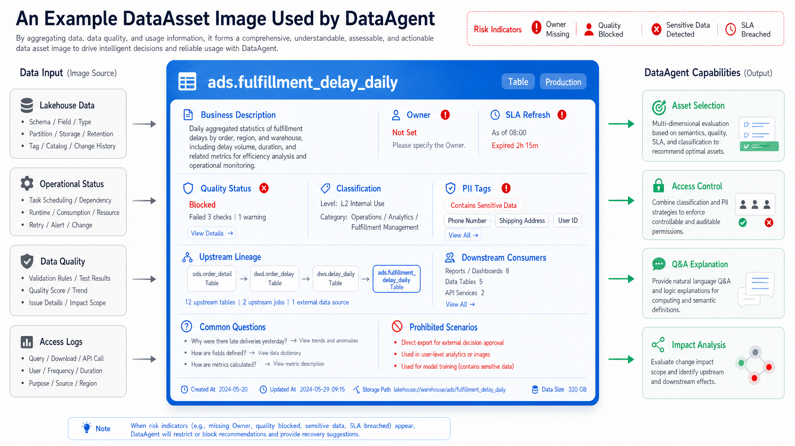
*Figure 15-3: Asset profiles serve consumption behavior. Source: Author. Alt text: Asset profile elements (owner, classification, quality, heat, definitions) connect to specific consumption behaviors (trustworthiness, usability, contact person), emphasizing profiles support consumption decisions instead of metadata dumping.*

Figure 15-3 emphasizes that asset profiles must serve consumption behavior. When DataAgent selects tables, it should consider field matches and quality status, freshness, owner, and applicable scenarios. For example, "fulfillment delay" might exist in detail tables, daily summary tables, and real-time wide tables. For "yesterday's root cause analysis," daily or detail tables suit better; for "real-time anomaly," the wide table fits.

There are four common mistakes:
1. Treating data catalog as a simple table name search box. Without business semantics, quality, and permissions, catalog value to Agent is limited.
2. Showing owner as just another field. Owner must participate in alerts, approvals, changes, and incident retrospectives.
3. Field tags serve only compliance, not semantics. Tags should also help schema linking, e.g., aliases for "store," "region," "fulfillment duration."
4. Catalog only ingests, no governance. Without maintenance, audits, or deprecation, catalogs quickly become stale.

### 15.1.2 End-to-End Lineage: From Ingestion Jobs, Transformation Tasks, Queries, to Agent Answers

Lineage describes the source of data, what processing it underwent, and which downstream objects it affects. For the Agent platform, lineage is used for engineering troubleshooting and for answering citation, impact analysis, and compliance audit. If DataAgent answers "The rise in East China delays mainly comes from night warehouse distribution," the platform should reveal which assets, partitions, definitions, and quality states were used.

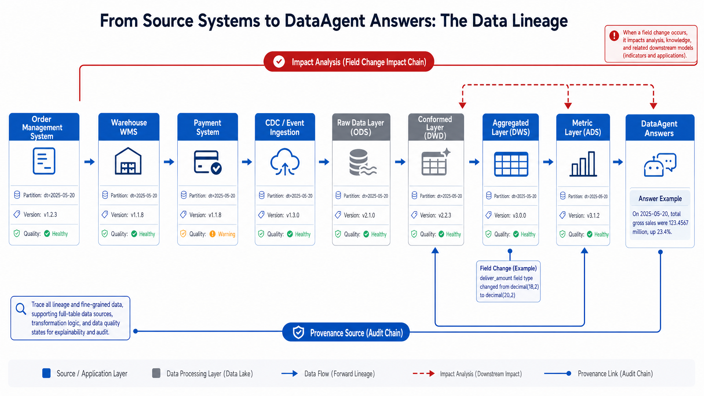
*Figure 15-4: Lineage must cover four layers. Source: Author. Alt text: Lineage top-down covers system-level, table-level, field-level, and metric-level; downward arrows indicate increasingly fine-grained localization, showing complete lineage covers all four layers instead of table-level only.*

Figure 15-4 shows lineage should cover four layers: source system to lakehouse, lakehouse to metrics, metrics to Agent queries, Agent queries to answers citations. Collecting only table-level lineage is insufficient-field-level lineage explains which metrics are affected by a field change; query-level lineage clarifies which tables and filters were used in a given response; answer-level lineage connects natural language conclusions to underlying data evidence.

Lineage collection usually involves multiple sources: orchestration systems provide job dependencies, SQL parsing shows table and field relationships, integration systems provide source-to-target mapping, query gateways provide actual access records, Agent runtime provides tool calls and answer references. OpenLineage can serve as an event standard; DataHub or OpenMetadata as metadata platforms; enterprises still need to define asset naming, owners, tags, and permission rules.

---

## 15.2 Data Contract: Schema, Semantics, SLA, Permissions, Quality Rules, and Change Process

A Data Contract is a formal agreement between producers and consumers on data assets. It constraints schema and business semantics, refresh SLA, quality rules, permission categories, compatibility policies, and change processes.

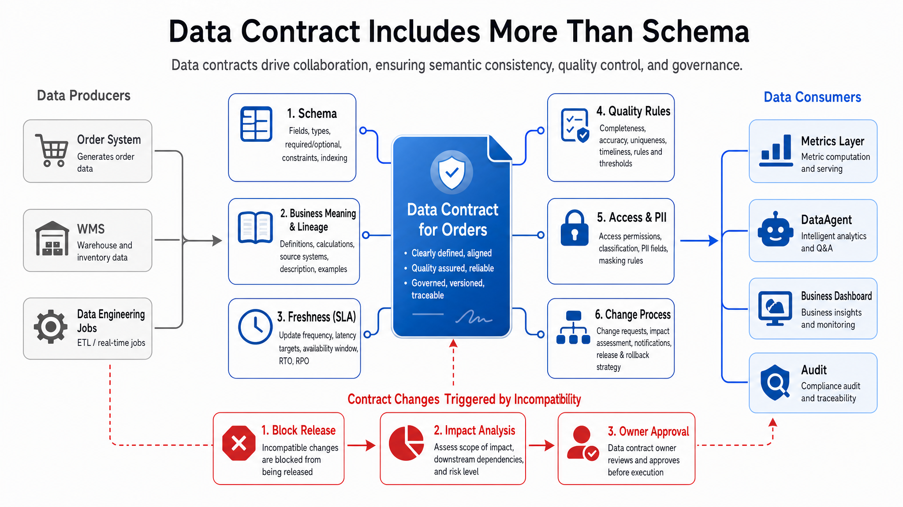
*Figure 15-5: Data Contract makes implicit agreements explicit. Source: Author. Alt text: Left side "implicit agreement" shows producers' verbal commitments on fields and definitions; right side "data contract" translates these to schema, SLA, quality rules, and verifiable clauses, contrasting implicit vs explicit.*

The key in Figure 15-5 is making implicit agreements explicit. If a multi-business-line company changes `delivered_at` from actual receipt time to system confirmation time, even if field name and type remain unchanged, the business semantics have incompatible changed. Without a contract, DataAgent will keep using the old definition to interpret the new data, causing undetectable errors. A data contract in production engineering might look like this:

```yaml
# Example: Data Contract, without real credentials
contract:
  id: contract.fulfillment_delay.v2
  asset_id: ads.fulfillment_delay_daily
  owner: fulfillment-data-team
  consumers:
    - DataAgent
    - operations_dashboard

schema:
  fields:
    - name: order_id
      type: string
      required: true
      pii: false
    - name: store_id
      type: string
      required: true
      pii: false
    - name: delivered_at
      type: timestamp
      required: true
      meaning: actual_customer_receipt_time
    - name: delay_minutes
      type: integer
      required: true
      rule: delivered_at - promised_at

semantics:
  metric_refs:
    - fulfillment_delay_rate
  grain: order_id
  valid_questions:
    - "Analyze fulfillment delays by region"
    - "View yesterday's fulfillment delay trend"

slo:
  freshness: "08:00 Asia/Shanghai daily"
  availability: "99.5% monthly"

quality:
  hard_rules:
    - order_id_unique
    - delay_minutes_non_negative
  soft_rules:
    - row_count_anomaly

governance:
  classification: internal
  retention_days: 730
  access_policy: region_level_aggregation_only

change_policy:
  compatible:
    - add_nullable_field
  incompatible:
    - remove_field
    - change_business_meaning
    - tighten_access_policy
  approval_required_from:
    - asset_owner
    - downstream_owner
```

#### Example 15-1: Data contract

This contract enables the platform to detect whether field changes, semantic changes, SLA breaches, or permission changes affect DataAgent. It also creates a review object for producers and consumers before a breaking change reaches production.

*Table 15-2: Responsibilities, Inputs/Outputs, and Failure Modes of Metadata Collectors, Lineage Parsers, etc. Source: Author.*

| Component       | Responsibility                                    | Input                                         | Output                 | Failure Mode                         |
|-----------------|-------------------------------------------------|-----------------------------------------------|------------------------|------------------------------------|
| Metadata Collector | Collects metadata from lakehouse, orchestration, quality, query gateway, Agent runtime | Table schemas, runtime state, quality results, query logs | Unified asset metadata events | Collection latency, missing fields, duplicate assets |
| Data Catalog    | Provides asset search, tags, owners, quality, asset profiles | Metadata events, manual maintenance info     | Asset details, search results, recommended assets | Catalog staleness, missing owners, expired tags |
| Lineage Service | Maintains table-level, field-level, query-level, and answer-level lineage | Job dependencies, SQL parsing, Agent call logs | Lineage graph, impact analysis, citation links | Parsing failures, missing dynamic SQL, cross-system breaks |
| Contract Service | Manages schema, semantics, SLA, quality, permission agreements | Contract configs, change requests             | Compatibility judgment, approval results, release gating | Only schema validation, no semantic checks |
| Metric Service | Unifies metric definitions, dimensions, time grains, query interfaces | Semantic layer definitions, physical models, permission contexts | Metric results, definitions explanations, SQL or query plan | Duplicate definitions, wrong dimensions, permission bypass |
| Audit Service  | Records access, changes, authorizations, answer citations, manual approvals | Query requests, policy decisions, release events | Audit logs, compliance reports, accountability evidence | Missing logs, identity mismatch, insufficient retention |

### 15.2.1 Metric System: Business Definitions, Dimension Relationships, Time Granularity, and Reusable Logic

The metric system is central to DataAgent's data querying capability. Without a unified metric layer, the Agent generates SQL on physical tables leading to same-name-different-meaning, numerator-denominator mismatches, wrong time granularity, and permission bypass issues.

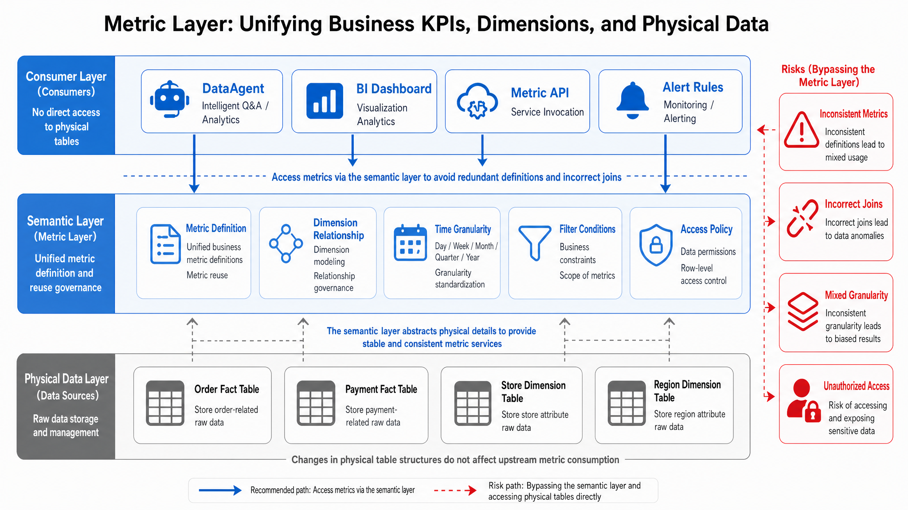
*Figure 15-6: Semantic layer decouples business questions and physical storage. Source: Author. Alt text: upper-layer business question "Last month East China GMV" maps via semantic layer to lower physical tables and fields; semantic layer isolates changes on either side from tightly coupling.*

Figure 15-6 shows how the semantic layer decouples business questions and physical storage. When DataAgent asks "Yesterday's GMV month-over-month change," it should call the metric definition instead of arbitrarily joining order, payment, refund tables. Metric definitions should include name, description, calculation formula, filters, dimensions, granularity, timezone, default aggregation, permission policies, and deprecation status.

*Table 15-3: Tradeoffs Between Querying Physical Tables Directly vs Using Metrics Layer. Source: Author.*

| Approach           | Advantages                             | Costs                            | Suitable Scenarios                                 | Recommendation                          |
|--------------------|------------------------------------|---------------------------------|-------------------------------------------------|---------------------------------------|
| Direct Physical Table Queries | Flexible and quick early development | Dispersed definitions, weak permission control, unreusable answers | Exploratory analysis, one-off investigations | Not recommended as default production path |
| Metric Wide Tables | Fast queries, easy BI integration  | Definitions easily fixed, dimension extension costly | High-frequency reports, stable metrics, low-latency queries | Suitable as service layer but still define metrics semantically |
| Headless BI / Semantic Layer | Unified definitions, reusable across consumers | Modeling and governance cost      | Multi-team metric sharing, DataAgent querying, metric APIs | Priority for production environments |
| Feature Platform     | Unifies online/offline features   | ML feature lifecycle focus       | Risk control, recommendations, scheduling Agents | Complementary to metric layer, not replacement |

Choosing metric layer tools depends on boundaries. Cube excels at exposing metrics and dimensions as service APIs to applications and dashboards; MetricFlow and dbt Semantic Layer fit closely with SQL models and metric definitions; Feast focuses on online/offline features and consistency for ML, not general BI metrics. Alternatives include self-built semantic layers, BI built-in metric layers, lakehouse engine materialized views, and OLAP metric wide tables.

### 15.2.2 Semantic Layer Tools: Cube, MetricFlow, dbt Semantic Layer, and Feast

Tools are not the chapter's main focus but boundaries must be clear.

*Table 15-4: Strengths and Use Cases of Semantic Layer Tools Like Cube, MetricFlow, dbt Semantic Layer. Source: Author.*

| Tool             | Strengths                                  | Costs                                | Suitable Use Cases                          | Recommendation                        |
|------------------|--------------------------------------------|------------------------------------|--------------------------------------------|-------------------------------------|
| Cube             | Strong application-facing metric service, mature caching and API | Requires maintaining semantic model consistent with base tables | Product-facing dashboards and DataAgent metric queries | Suitable for core metric service |
| MetricFlow       | Close to metric definitions, dimensions, time grain modeling | Requires governance and development process coordination | Unified metric definitions led by analytics engineering | Fits integration with dbt models |
| dbt Semantic Layer | Tight integration with dbt ecosystem and model testing | Depends on dbt project quality governance | Organizations with existing dbt transformation pipelines | Ideal to unify models, tests, and metric definitions |
| Feast            | Strong online-offline feature consistency | Not for general BI metric semantics | Risk control, recommendation, supply chain prediction, real-time features | For Agent online features, not metric layer replacement |
| Self-Built Semantic Layer | Fully aligned with organizational permissions, definitions, audit | High cost, risk of redundant reinvention | Strict regulations, complex organizations, special permission models | Use only if existing tools cannot meet requirements |

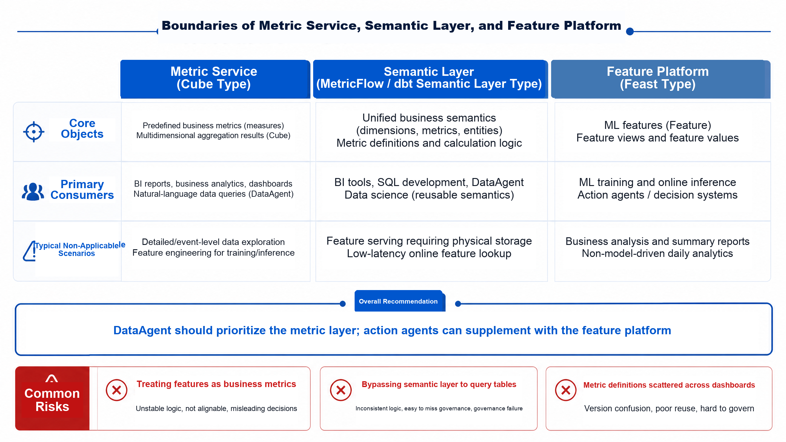
*Figure 15-7: Data services boundary between business queries and online decisions. Source: Author. Alt text: left "business queries" use metric layer with tolerable second-level latency; right "online decisions" use real-time features requiring millisecond latency, highlighting different latency and consistency boundaries of two data service types.*

Figure 15-7 concludes that business querying and online decision-making cannot share the exact same abstraction. When DataAgent explains business results, it needs metric definitions and dimension relationships; when a risk control Agent detects anomaly for a user, it may require real-time features. They can share underlying facts and metadata but differ in interfaces, timeliness, permissions, and auditing.

### 15.2.3 Metadata Capabilities for DataAgent: Schema Linking, Definition Explanation, Citation Trace, and Impact Analysis

DataAgent's use of metadata involves four key aspects. First, **Schema Linking:** the platform must map natural language terms like "East China," "fulfillment delay," "yesterday," "store" to candidate assets, fields, dimensions, and metrics. This mapping needs field aliases, business tags, sample questions, usage heat, and permission filters. Second, **Definition Explanation:** Agent should return values and explain metric definitions, filters, time ranges, numerator/denominator. For example, "fulfillment delay rate" should clarify if calculated by order count, whether canceled orders are excluded, whether promised time comes from order or fulfillment system. Third, **Citation Trace:** each answer must record used metrics, asset versions, partitions, query statements, quality status, and permission policies. When users ask "Where does this conclusion come from?," the platform provides readable citations. Fourth, **Impact Analysis:** before changing fields, tables, quality rules, or metric definitions, the platform should know what dashboards, Agent capabilities, historical answers, and alert rules will be affected.

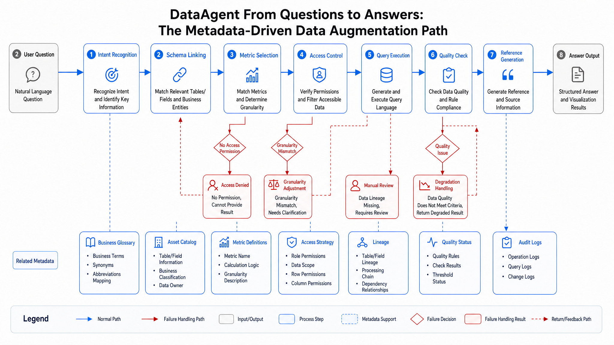
*Figure 15-8: Metadata as part of Agent runtime, not offline documentation. Source: Author. Alt text: Left "offline docs" are static wiki pages; right "runtime metadata" is queried in real-time by Agent at each query, showing metadata evolving from documentation into online service.*

Figure 15-8 illustrates metadata is not offline documentation but part of Agent runtime. Each tool call should carry identity, permissions, asset version, and quality state; each answer should embed citations and audits. Example interface request showing how DataAgent queries metadata service for context:

```json
{
  "request_id": "req_20260611_0001",
  "user_context": {
    "user_id": "user_demo",
    "roles": ["regional_ops"],
    "region_scope": ["east"]
  },
  "question": "Why did East China's fulfillment delays rise yesterday?",
  "intent": "metric_explanation",
  "required_capabilities": [
    "asset_search",
    "metric_resolution",
    "policy_filter",
    "lineage_trace"
  ]
}
```

The response returns candidate metrics, accessible assets, definition explanations, quality status, and constraints:

```json
{
  "resolved_metrics": [
    {
      "metric_id": "fulfillment_delay_rate",
      "display_name": "Fulfillment Delay Rate",
      "definition": "Number of delayed orders / number of fulfilled orders",
      "grain": "day, region",
      "allowed_dimensions": ["region", "store_type", "warehouse_type"]
    }
  ],
  "authorized_assets": [
    {
      "asset_id": "ads.fulfillment_delay_daily",
      "partition": "dt=2026-06-10",
      "quality_status": "passed",
      "freshness": "2026-06-11T07:10:00+08:00"
    }
  ],
  "policy": {
    "row_filter": "region = 'east'",
    "masking": ["customer_id"],
    "allowed_actions": ["query", "explain"]
  },
  "lineage_hint": {
    "upstream_assets": ["dwd.orders_daily", "dwd.delivery_events_daily"],
    "contract": "contract.fulfillment_delay.v2"
  }
}
```

#### Example 15-2: DataAgent metadata context interface

This production example places semantic parsing, permission filtering, quality status, and lineage hints in one response. The goal is to make table and metric selection a governed platform decision instead of an Agent guess.

### 15.2.4 Governance Closed Loop: Permission Filtering, Masking, Audit Logs, and Compliance Tracing

Data governance on Agent platforms is challenging since natural language queries are more flexible than fixed dashboards. Users may bypass report boundaries with vague queries like "List customers with worst delays in East China." Without linking identity, assets, fields, metrics, and output actions, permission policies are easily bypassed.

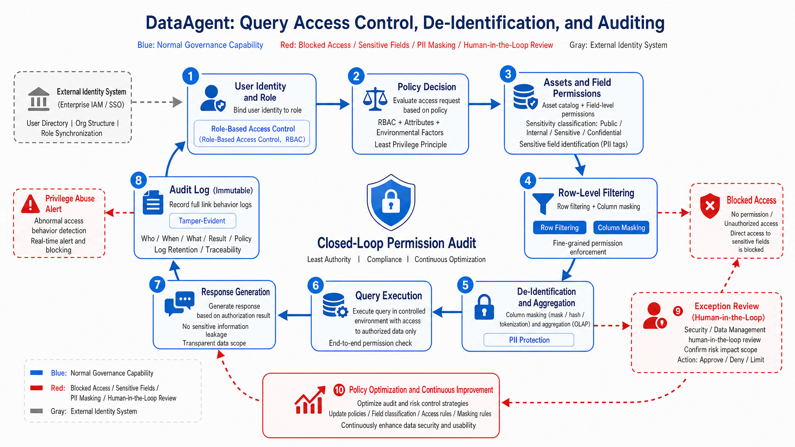
*Figure 15-9: Data governance closed loop. Source: Author. Alt text: circular flow showing permission filtering, masking, auditing, compliance tracing connected end-to-end with arrows depicting trace and feedback on every data access, forming continuous governance loop.*

Figure 15-9 shows that permissions are not a one-off check before queries but span asset discovery, metric selection, SQL generation, result masking, answer wording, and audit tracing. Certain users may see regional aggregated metrics but not store details; see delay rates but not customer phone numbers; can explain reasons but not export details.

*Table 15-5: Trade-offs Between Database-Only Authorization and Multi-Layer Governance Permission/Masｋing Strategies. Source: Author.*

| Approach             | Advantages                        | Costs                                   | Suitable Scenarios                         | Recommendation                       |
|----------------------|----------------------------------|----------------------------------------|--------------------------------------------|------------------------------------|
| Database-Only Authorization | Leverages existing permission system, fast implementation | Agent semantic layer and answers may leak data | Early internal analysis, single data source | Only as baseline defense           |
| Semantic Layer Permissions | Controls access by metric, dimension, action | Needs consistent semantic models and policies | DataAgent queries, cross-dashboard metric reuse | Default production control point   |
| Result-Level Masking  | Controls final presentation       | Cannot prevent over-access in intermediate queries | Aggregated answers, sensitive field display control | Must complement pre-query authorization |
| Full-Chain Auditing   | Enables accountability, retrospection, compliance proofs | Increased log storage and retrieval costs | Involving sensitive data, regulated or high-risk operations | Core Agent capability              |

---

## 15.3 Engineering Implementation: Metadata Platform, Lineage Collection, and Metric Service Integration

Chapters 13-15 do not require showing a mini-platform. This section gives a production engineering solution focused on interfaces and governance processes.

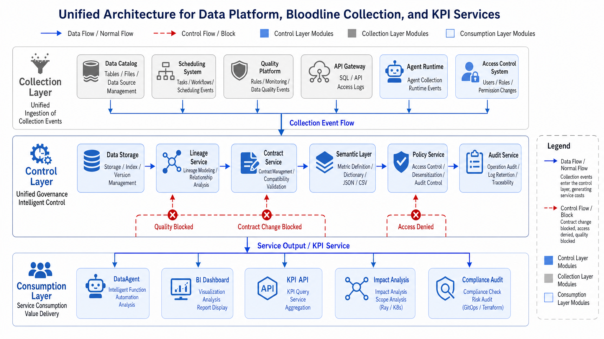
*Figure 15-10: Minimal architecture of metadata platform, lineage, and metric services. Source: Author. Alt text: architecture diagram showing metadata storage, collectors, lineage graph, metric service, query API components, arrows indicating data flow through collection, parsing, and external service.*

Figure 15-10 is a deployable minimal architecture. Metadata collection should read table schemas from lakehouse catalogs, and task status from orchestration, gating results from quality platforms, actual access logs from query gateways, citations from Agent runtime, and policy decisions from permission systems. The control layer then unifies and serves this info to DataAgent and governance tools. Below YAML shows a metric definition example.

```yaml
# Example: Metric definition, without real credentials
metric:
  id: fulfillment_delay_rate
  display_name: Fulfillment Delay Rate
  description: Proportion of delayed orders among fulfilled orders
  owner: fulfillment-data-team
  status: active

calculation:
  numerator: count_orders(where: delay_minutes > 0)
  denominator: count_orders(where: delivered_at is not null)
  expression: numerator / denominator
  default_time_grain: day
  timezone: Asia/Shanghai

dimensions:
  - region
  - store_type
  - warehouse_type
  - carrier_type

source:
  asset_id: ads.fulfillment_delay_daily
  required_quality_status: passed
  contract: contract.fulfillment_delay.v2

governance:
  access_policy: region_scoped
  minimum_aggregation_level: region
  pii_exposure: none

examples:
  - question: What was East China's fulfillment delay rate yesterday?
    intent: metric_lookup
  - question: Why did yesterday's fulfillment delay rate increase?
    intent: metric_explanation
```

#### Example 15-3: Metric definition

Such definitions allow DataAgent to reuse approved metric logic instead of dynamically stitching definitions for every query. The definition also gives reviewers a stable place to manage dimensions, timezone, source asset, quality requirements, and access policy. Below pseudocode shows DataAgent's pre-query metadata checks.

```python
# Pseudocode: DataAgent pre-query metadata control checks
def prepare_query_context(user, question):
    candidates = metadata.search_assets_and_metrics(question)
    authorized = policy.filter(user=user, candidates=candidates)
    if not authorized:
        return deny("no_authorized_asset")

    selected = semantic_layer.resolve_metric(question, authorized)
    quality = quality_service.get_status(selected.source_asset)
    if quality.status == "blocked":
        return degrade_with_reason(selected, quality)

    lineage = lineage_service.trace(selected.source_asset)
    audit.record_intent(user=user, question=question, selected=selected)

    return {
        "metric": selected,
        "policy": authorized.policy,
        "quality": quality,
        "lineage": lineage,
    }
```

#### Example 15-4: Query-time metadata check pseudocode

The core logic is search, authorize, resolve the metric, check quality and lineage, then record audit. This process happens before SQL execution, which means unsafe or stale assets can be rejected before the Agent creates a confident answer. Change management must also enter the control plane.

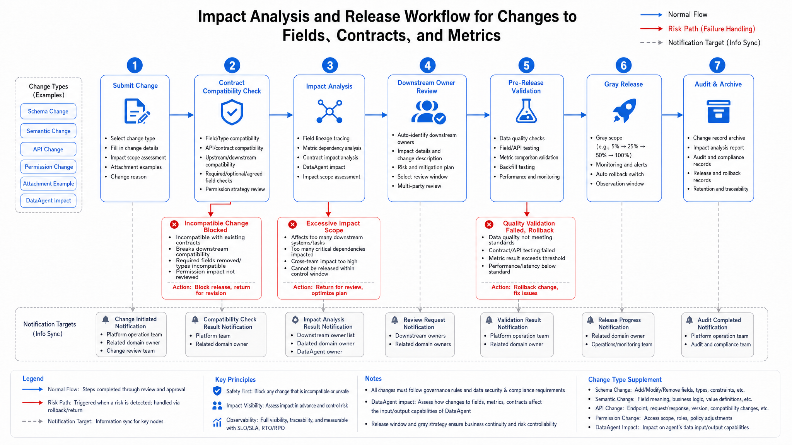
*Figure 15-11: Moving change validation before release. Source: Author. Alt text: flowchart showing schema or definition changes go through contract validation and impact analysis to confirm no downstream issues before release, with arrows indicating prevention instead of firefighting post-deployment.*

Figure 15-11 shows change validation occurs prior to release. If the calculation formula of `delay_minutes` changes, the platform should first assess affected metrics, dashboards, Agent question templates, and historical citations before deciding on canary, recomputation, and announcement. Change processes without impact analysis are only reactive fixes.

### 15.3.1 Release gates before metadata is exposed to Agent

**Production Readiness Checklist**

- [ ] Asset catalog: core tables, views, metrics, features, real-time results all have asset profiles, owners, status, and downstream consumers.
- [ ] Terminology and aliases: key business terms, field aliases, metric aliases, and banned synonyms have been registered in metadata.
- [ ] Lineage coverage: covers ingestion, transformation, metrics, queries, and Agent answer citations; core assets support field-level lineage.
- [ ] Data contracts: core assets have schema, semantics, SLA, quality, permission, and change policy.
- [ ] Metric governance: metrics have unique ID, definition, dimensions, granularity, timezone, owner, status, and deprecation process.
- [ ] Permission policies: supports user identity, roles, regional scopes, row/column-level filtering, aggregation levels, and masking strategies.
- [ ] Quality integration: DataAgent reads asset quality status and freshness before queries; blocks degrade or reject.
- [ ] Citation traceability: each answer records used assets, partitions, metrics, queries, quality, and policies.
- [ ] Impact analysis: detects affected dashboards, Agent capabilities, alert rules before field, contract, metric, or permission changes.
- [ ] Audit logging: records access, denial, masking, export, answers, approvals, and changes with searchable logs.
- [ ] Lifecycle management: assets, metrics, and fields have creation, release, deprecation, retirement, and backward compatibility policies.
- [ ] Cost governance: metadata collection frequency, lineage parsing depth, audit log retention, and metric cache have cost boundaries.

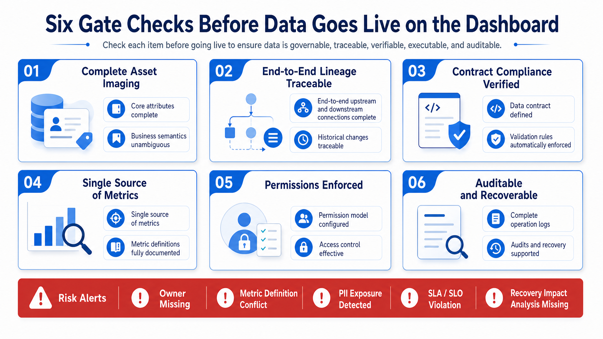
*Figure 15-12: Six release gates condensed. Source: Author. Alt text: vertically lists six release gates-metadata registration, lineage traceability, contract inplace, quality met, permission masking, definition unified-with pass criteria for each, forming release checklist for data assets.*

Figure 15-12 condenses release standards into six gates. If any gate is missing, DataAgent risks uncontrollable asset selection, definition explanation, permission filtering, or audit retrospection failures.

#### Same-name metrics scattered across dashboards

Business users repeatedly ask about "sales" and "GMV," and DataAgent alternates between order amount, payment amount, and net amount after refunds. The cause is scattered metric logic in dashboard SQL, temporary wide tables, and analysis scripts. Core metrics need registered IDs, definitions, owners, and deprecation states; DataAgent should call active metrics and show definitions in answers.

#### Field types stay stable while business meanings change

Fulfillment delay rate may suddenly drop even though warehouse distribution has not improved. The upstream team changed `delivered_at` from actual receipt time to system confirmation time, while the timestamp type stayed the same and schema validation passed. Contracts must cover business semantics and incompatible change types, and semantic changes require impact analysis plus downstream owner approval.

#### Table-level lineage cannot assess field-change impact

After a store-region field adjustment, several regional metrics show anomalies but the platform can only see table dependencies. It cannot pinpoint which metrics depend on the changed field. Core assets should collect field-level lineage, metrics should declare dependent fields explicitly, and the change process should list affected metrics and Agent question templates.

#### Database-only permission leaks sensitive aggregated dimensions

Regional managers who cannot view customer details may still obtain detailed anomalous customer lists through natural-language follow-up questions if governance stops at database permissions. The semantic layer also needs metric, dimension, and action-level policies. DataAgent should check minimum aggregation levels and mask sensitive fields before output.

#### Metadata collection latency leaves deprecated assets searchable

An old fulfillment table may remain searchable after migration because catalog collection lag has not synchronized the deprecation state into the Agent search index. Asset state changes should be pushed as events, deprecated assets should be blocked at query time, and the Agent should fall back to live catalog checks when index freshness is below the required threshold.

### 15.3.2 Metadata and Chapter 33 semantic-layer division of responsibility

Metadata provides the control plane for assets, lineage, contracts, quality state, ownership, and permissions. Chapter 33's semantic layer builds on that foundation to expose business metrics, dimensions, calculation logic, and queryable APIs. The two layers should not be merged into a single loose catalog: metadata answers "what exists, who owns it, what state it is in, and who may use it"; the semantic layer answers "which metric or dimension should be queried for this business question."

This division matters for DataAgent. Schema linking and NL2SQL should first consult metadata to filter inaccessible, deprecated, or low-quality assets, then use the semantic layer to resolve approved business definitions. If a metric changes, metadata records the contract, lineage, quality, and audit impact, while the semantic layer manages calculation and API exposure. Keeping the boundary clear prevents physical table discovery from becoming metric definition by accident.

---

## 15.4 Data Product Operations And Agent Adoption Evidence

After data products enter an Agent platform, operating metrics should expand from availability to correct use. A data product may have a stable API, complete fields, and clear permissions, while the Agent still uses it poorly: choosing the wrong grain, ignoring refresh delay, using exploratory fields in formal reports, or repeatedly hitting permission denial. Data product owners need this usage evidence to judge whether product notes, semantic layer, and tool interfaces are clear enough.

Adoption evidence should record call count, scenario, failure type, human correction, report citation, user feedback, and downstream artifact. If a data product is frequently used in DataAgent reports, release stability and regression coverage should increase. If it often causes permission denial, visibility prompts or data-domain separation may need work. If some fields are never used correctly, the owner may add examples, rename fields, or retire them. Operating evidence turns data products from static assets into Agent capabilities that can improve over time.

Version parallelism also belongs to data product operations. Old versions cannot be deleted immediately because historical reports, Trace, and evaluation samples may still cite them. New versions should not replace every Agent at once because metric explanations and field meanings may change. The platform should record which data product version each Agent uses and keep comparison samples during migration. Data product iteration then preserves reviewability for intelligent chains.

## 15.5 Business review mechanism for metadata quality

Metadata quality cannot be judged only by automated platform checks. Whether a field is clear, whether a metric matches business definition, whether lineage covers the path actually used, and whether SLA matches user expectation all require business-owner review. Once DataAgent uses this metadata to generate queries and explain conclusions, metadata defects become answer defects visible to users. Treating metadata as an internal data-platform asset underestimates its effect on intelligent workflows.

Business review can start from high-frequency questions. The team collects common queries from DataAgent, BI Copilot, and reporting systems, then checks whether the involved tables, fields, metrics, permissions, quality rules, and owners are complete. If a field is frequently used in data questions but lacks business explanation or validity period, it should not be exposed directly to natural-language querying. If a metric has several definitions, the semantic layer should consolidate them or mark their scope. Review material should be written back to the data catalog, not left in meeting notes.

A first version can stay lightweight. Each core data product has an owner. Each month, the team samples common questions. Each online dispute triggers a metadata review and a catalog update. Metadata governance then moves from registering fields to making fields safe for intelligent systems. This matters to DataAgent because models amplify metadata quality: clear descriptions support stable composition, while vague descriptions are often turned into confident-looking answers.

## 15.6 Release gates for data contract changes

Data contract changes should pass release gates, not remain internal data-platform notices. For an Agent platform, added fields, removed fields, type changes, enum changes, SLA changes, permission-label changes, and business-definition changes can all affect natural-language queries, report generation, and tool calls. A field type may stay the same while its meaning changes. A permission label may stay the same while a new aggregation grain changes what users can infer. Release gates should divide changes into schema, semantics, SLA, permission, and quality, then define sample checks for each class.

Schema gates focus on compatibility. Adding an optional field is usually low risk. Removing a field, changing a type, tightening an enum, or changing primary-key semantics requires downstream review. In DataAgent, downstream consumers include the SQL executor, semantic layer, metric service, report templates, evaluation samples, and frontend charts. Before release, the platform should list affected Metrics, Views, Agent question templates, cache keys, and historical report citations. If the impact range cannot be listed, the change should not go straight to production. The change note should also state the rollback path: restore the old field, keep a compatibility view, or suspend Agent use of the asset.

Semantic gates are easier to miss. An upstream team may change "payment completed time" into "system confirmed time" while the type remains timestamp. Schema checks pass, but fulfillment, revenue, and timeliness metrics may all change. Semantic gates should require the owner to state business meaning, effective time, whether historical data is recomputed, and whether the metric needs a new version. The Agent platform should replay common questions and confirm that explanations still hold. If old reports cited the old definition, the platform should preserve that version instead of reinterpreting history under the new definition.

SLA and quality changes alter Agent behavior as well. If data latency changes from fifteen minutes to two hours, a user asking for today's live status should see a freshness warning instead of a confident answer. If quality rules become stricter and an asset enters a blocked state, DataAgent should choose an alternative asset, return a degraded explanation, or route the work to human analysis. Release gates should verify that Runtime and the frontend can read these states. If the state exists only on a data-platform page, the Agent may still bypass it.

Permission changes need answer-level acceptance. After row or column permissions, aggregation grain, masking, or export policy changes, successful SQL execution does not prove that the answer can be shown. The platform should test how different roles see the same question and confirm that refusal, aggregation downgrade, and request-access paths match policy. Sensitive domains need samples for unauthorized questions, boundary roles, historical cache hits, and report citations. Permission changes should also invalidate related caches so old results do not remain visible under a new policy.

The output of the gate should be a replayable record. It names the change source, affected assets, affected Agents, regression samples, failure handling, approver, and rollback target. When a dispute appears online, the team can return from Trace to the data contract version used at the time instead of inspecting only a natural-language answer. Once data contract gates are reliable, data changes become normal events the Agent platform can absorb, instead of incidents that require after-the-fact explanation.

## 15.7 Adjudication flow for data-contract disputes

After data contracts go live, disputes appear at several layers. Business teams may believe field meaning has not changed, while data teams consider the schema upgraded. The platform may believe a quality-rule block is correct, while business users still want the data for draft analysis. Security teams may require tighter permission labels, while the DataAgent team worries about data-question experience. Contract disputes need an adjudication flow and reproducible material.

Adjudication material should include contract version, change record, field samples, quality rules, lineage impact, permission labels, affected data products, affected Agent samples, and business-owner opinion. If the dispute concerns field meaning, the business owner should rule on the definition. If it concerns quality thresholds, the data owner should state acceptable risk. If it concerns permission labels, the security owner should state the compliance basis. If it concerns Agent behavior, the platform owner should provide degradation and messaging options. Each dispute needs a named owner.

The result should enter the metadata system. Continued field use, field retirement, looser quality rules, tighter quality rules, permission-label changes, and metric-version updates should all become traceable records and trigger downstream sample replay. If the decision remains only in meeting notes, DataAgent will keep using stale context in the next query and the dispute will repeat. The metadata control plane should turn adjudication into machine-readable contract change.

A first version can keep a contract-dispute ledger for core data products. The ledger records disputed issue, evidence material, adjudicator, decision, effective time, handling of historical results, and review date. Data contracts then support pre-release checks, runtime dispute handling, and platform correction together.

## 15.8 Regression validation for permission-label changes

Permission labels are one of DataAgent's security boundaries. Organization changes, customer ownership changes, project membership updates, and masking-policy changes can all change which fields and rows a user can see. If permission-label updates lack regression validation, an Agent may generate reports under old permission or reject normal queries under new permission. Permission change should verify real tasks along with synchronization jobs.

Regression validation should include allowed and denied samples. Allowed samples prove that ordinary users can still do permitted work. Denied samples prove that overreach is still blocked. Each sample should include user role, tenant, data domain, fields, row-level filter, tool call, and final output. Reports and artifacts also need export-state checks, because users consume model-organized material, with raw SQL results acting as evidence underneath.

A first version can replay a DataAgent sample set after permission-label release. If allowed samples fail, the policy may be too strict or labels may be missing. If denied samples pass, there is exposure risk. If report output does not preserve permission evidence, the report layer needs stronger EvidenceRef. Permission governance then moves from backend synchronization into Agent task acceptance.

## 15.9 End-to-end validation of the data-permission chain

When end-to-end validation of the data-permission chain reaches production, the platform needs a shared evidence standard for user identity, role, field-level permission, masking result, query scope, export record, and audit receipt. This standard is not paperwork for its own sake. It lets business, platform, data, security, and operations teams discuss the same facts. Without this material, incident review depends on memory and personal judgment. With it, the team can see which inputs were valid, which actions executed, which artifacts can still be used, and which results need correction or withdrawal.

This evidence should connect to Chapter 33 on the semantic layer, Chapter 34 on query execution, and Chapter 52 on compliance. The upstream chapters provide the capability base, downstream chapters consume the runtime result, and this chapter explains how the middle layer is verified. If a capability looks complete inside one chapter but cannot enter Trace, Eval, release records, or the compliance evidence package, the production system still has a break in the chain. Readers should treat cross-chapter interfaces as engineering contracts, not as a reading order.

Common risks include permission checked only at entry, cache bypassing field masking, exported files missing audit records, and cross-tenant samples not covered. A successful demo rarely exposes these problems because demo samples are usually clean, short, and direct. Real business traffic brings stale data, abnormal input, permission changes, user withdrawal, budget limits, and long-running state. If the platform does not turn those situations into samples and ledgers, later scenarios will hit the same class of issues again.

Permission checked only at entry should be turned into a tracked review item when it appears repeatedly. The operating record should at least state owner, version, sample, affected scope, action, and review time. It does not need to become a long process report, but it must be clear enough for a later maintainer to understand the decision. For high-risk capability, the record should also state which conditions allow wider use and which failures require degradation or withdrawal.

A first version can build this habit in a few representative scenarios. It is better to make high-traffic, high-risk, externally visible paths solid first, then copy the sample, ledger, and review method to related capabilities in other chapters. This makes the chapter read like engineering guidance: it explains how the capability is integrated, validated, operated, and retired.

## Chapter Recap

1. Metadata is the enterprise Agent platform's data control plane responsible for asset discovery, semantic explanation, permission filtering, lineage tracing, and audit logging.
2. Data catalogs must evolve past table name search to rich asset profiles including owner, quality status, freshness, classification, usage scenarios, and downstream consumers.
3. Lineage must cover source systems, lakehouse, metrics, queries, and Agent answer citations; core assets should support field-level and answer-level lineage.
4. Data contracts must cover schema, business semantics, SLA, quality rules, permissions, and change processes-more than field type validation.
5. DataAgent's production querying should prioritize semantic layers and metric services, avoiding ad hoc physical table queries.

- Official documentation: [DataHub Documentation](https://docs.datahub.com/) supports chapters' discussion on data catalog, metadata modeling, and governance workflows.
- Official documentation: [OpenMetadata Documentation](https://docs.open-metadata.org/) supports unified metadata platform and asset profile descriptions.
- Official documentation: [OpenLineage Documentation](https://openlineage.io/docs/) supports lineage event collection and cross-system lineage standards.
- Official documentation: [Cube Documentation](https://cube.dev/docs) supports metric services and semantic modeling.
- Official documentation: [MetricFlow Documentation](https://docs.getdbt.com/docs/build/metricflow-commands) supports metric definitions, dimension, and time grain modeling.
- Official documentation: [Feast Documentation](https://docs.feast.dev/) supports explanations on boundaries between online and offline feature platforms.
- Benchmark projects: [DataHub](https://datahubproject.io/), [OpenMetadata](https://open-metadata.org/), [OpenLineage](https://openlineage.io/), [Cube](https://cube.dev/), [Feast](https://feast.dev/) illustrate different implementation approaches for metadata, lineage, metric service, and feature platforms.
- Related chapters: [Chapter 10 Data Collection and Integration](ch10.md), [Chapter 11 Data Lake and Lakehouse](ch11.md), [Chapter 12 Lakehouse Engine and OLAP](ch12-olap.md), [Chapter 13 Streaming and Real-time Data](ch13.md), [Chapter 14 Data Orchestration and Quality](ch14.md), [Chapter 32 DataAgent Overall Architecture](../../part06-dataagent/en/ch32-dataagent.md), [Chapter 34 NL2SQL Engineering](../../part06-dataagent/en/ch34-nl2sql.md), [Chapter 38 Observability and Tracing](../../part07-observability-eval/en/ch38-trace.md), [Chapter 51 Security Guardrails](../../part10-security-org/en/ch51-guardrails.md).

## References

OpenLineage. (n.d.). [Documentation](https://openlineage.io/docs/).

DataHub. (n.d.). [Documentation](https://datahubproject.io/docs/).

Marquez. (n.d.). [Documentation](https://marquezproject.ai/docs/).

dbt Labs. (n.d.). [MetricFlow documentation](https://docs.getdbt.com/docs/build/metricflow-time-spine).

Cube. (n.d.). [Semantic layer documentation](https://cube.dev/docs/product/semantic-layer).
