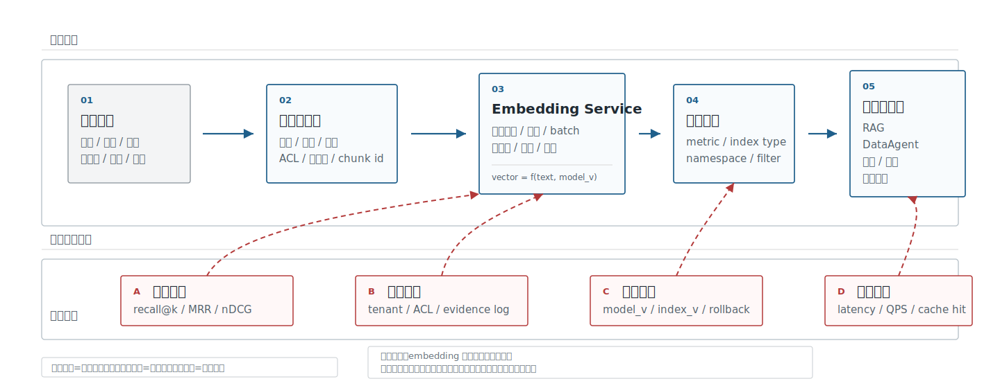
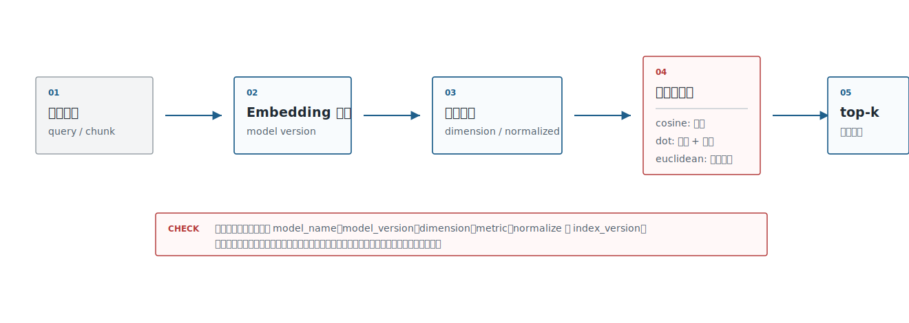
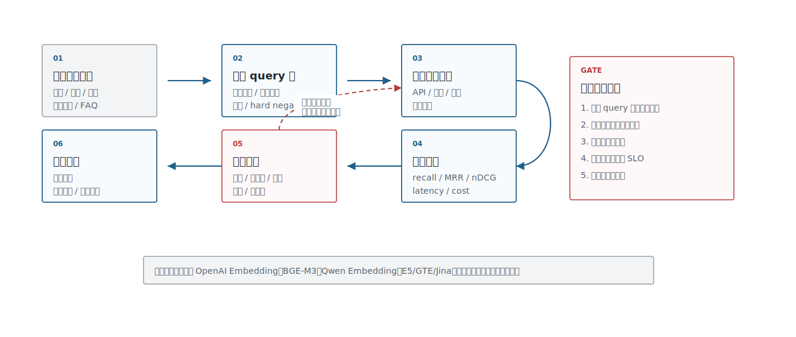
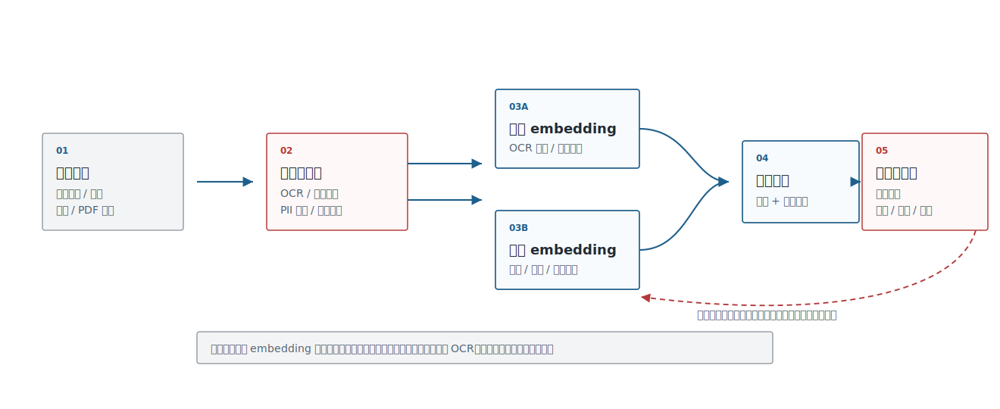
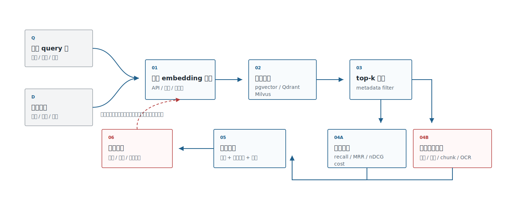

# 第16章 嵌入模型

---

企业做 RAG、DataAgent、客服 Agent 或多模态检索时，第一反应常常是选向量数据库。更早需要决定的是 embedding：什么内容要被表示成向量，谁来生成向量，向量能解决哪部分问题，哪些问题要交给关键词检索、权限系统、重排模型或人工复核。主流云产品已经把 embedding 放进搜索和 Agent 平台的基础设施层。Azure AI Search 把向量检索、混合检索和过滤检索放在同一个搜索体系里；Google Vertex AI Vector Search 用向量索引支撑语义搜索、推荐和生成式 AI 应用；Amazon Bedrock Knowledge Bases 把文档切分、embedding 生成、向量库写入和 RAG 检索编排成托管流程。这些路线不完全相同，但都把 embedding 放在“业务内容接入大模型应用”的中间层，而非当成独立的模型玩具。

嵌入决定了企业知识能否被准确召回。员工问“出差回来多久要报销”，制度写的是“返回后十五个工作日内提交申请”；分析师问“高客单门店”，数据仓库里可能是 `avg_order_value_store_segment`；法务问“自动续费风险”，合同里写的是“续展条款”。这些表达在人看来相关，在模型向量空间里未必足够接近。开箱即用的嵌入如果不懂企业术语、字段别名和口径关系，相关内容就会排到结果靠后的位置，后面的 RAG、NL2SQL 和报告生成都会被带偏。

embedding 的价值也容易被夸大。它负责把文本、代码、图片和结构化语义表示为可检索的向量，先找出候选证据、候选字段或候选图片；它不负责判断事实是否正确，也不负责权限、引用和最终业务动作。一个相似条款不能直接成为法务结论，一个相似工单不能直接成为故障根因，一个相似字段也不能直接授权 SQL 执行。企业平台要把 embedding 放在候选召回的位置，再用 metadata filter、reranker、语义层、规则校验和人工复核收口。

本章讨论嵌入模型、向量表示、相似度度量、多模态嵌入、模型选型和召回质量。工程上要先判断哪些业务场景值得接入 embedding，再决定相似度度量、文本模型选型、多模态补位方式和内部评估框架。读者需要特别关注两个问题：哪些检索失败确实来自向量表示，哪些其实来自解析、权限、chunk、字段说明和评估集缺失。很多 embedding 事故都不是模型分数低造成的。某次制度问答召回了过期文档，因为索引里没有生效时间过滤；某次 DataAgent 选错字段，因为字段注释缺少业务别名；某次合同检索漏掉关键条款，因为 PDF 解析把页眉页脚和正文混在一个 chunk 里；某次客服相似工单推荐越权，因为向量索引没有租户和部门 metadata。模型在这些事故里只是链路中的一环，真正需要改的可能是文档解析、权限过滤、chunk 策略、索引版本或评估样本。

因此，embedding 上线时应从“可复盘的召回链路”设计，而非从“调用哪个模型”开始。一次检索至少要记录 query、模型版本、索引版本、过滤条件、候选列表、reranker 结果、最终引用和用户反馈。这样当业务方质疑答案时，平台可以判断是候选没召回、召回了但排序靠后、排序正确但引用被生成层忽略，还是权限过滤把关键材料排除了。没有这条链路，embedding 系统看起来只是一个向量库，实际会成为 RAG 和 DataAgent 难以解释的黑盒。

---

## 16.1 嵌入模型的企业应用场景

企业里常见的问题不在数据数量，而在同一件事有多种表达。员工会用口语问“出差回来多久要报销”，制度文档写的是“返回后十五个工作日内提交申请”；业务分析师会说“高客单门店”，数据仓库里可能是 `avg_order_value_store_segment`；现场照片、票据扫描件和看板截图里还会出现无法直接用文本字段描述的信息。这些表达之间如果没有稳定映射，RAG、DataAgent 和客服 Agent 都会在第一步检索上出错。Embedding 在这里提供语义候选能力：把自然语言问题、制度片段、字段说明、合同条款、图片说明等内容放进一个可检索的表示空间。它不直接保证答案正确，但可以先找出“可能相关”的证据、字段、案例或图片。企业常见入口不必拆成七八套孤立方案，可以先看成同一层语义候选能力在不同业务流程中的分工。

在企业知识库里，embedding 处理员工口语化问题、制度文档和操作手册，先召回相关制度片段、FAQ 和引用证据，再交给知识助手生成回答。在客服和工单系统里，它处理新工单描述、历史处理记录和质检标签，先找相似故障、根因和处理方案，再由客服 Agent 或工单路由系统判断。DataAgent 更关注指标口径、字段注释、SQL 示例和历史查询，把它们召回为 NL2SQL 与语义层编译的候选。法务、合规、商品、运维和多模态巡检也是同样逻辑：embedding 找候选，后续系统再做规则校验、权限过滤、引用确认和人工复核。这些下游系统各不相同，但 embedding 在场景里的职责是一致的：先找候选，不直接做决策。客服场景先找相似处理记录，DataAgent 先找字段和指标解释，法务场景先找相似条款，RAG 场景先找可引用文档。后面能否回答、能否执行动作，还要看权限过滤、重排、引用校验、工具调用和人工审批。

对 DataAgent 来说，embedding 的第一批高价值对象是语义层资产，而非长文档：指标口径、维度说明、字段注释、表关系、历史 SQL、业务术语和报表截图。用户问“高客单门店的复购趋势”时，系统先把“高客单”链接到指标定义，把“门店”链接到维度，把“复购趋势”链接到可计算字段，再交给 NL2SQL 或分析 Agent。这个链路里 embedding 负责候选，语义层和执行引擎负责约束。

从平台负责人视角看，下一步是给这些入口分风险，而非继续扩业务入口。同样是语义检索，不同场景对错误的容忍度完全不同。制度问答、产品手册、FAQ 和内部百科属于低风险高频检索，目标是高召回、低延迟和低成本，可以先用 API 模型或轻量开源模型建立 baseline。工单、DataAgent schema linking 和研发运维属于中风险业务辅助，候选要准确，错误要可分析，结果要可回放，因此需要内部评测集、hard negatives 和 reranker。合同、财务、法务、安全审计属于高风险合规场景，质量目标还涉及召回准确，还包括权限正确、证据充分和可复核，私有化、审计、字段级权限和人工复核应优先进入设计。这一步先把讨论从模型强弱拉回风险边界。同一个 embedding 模型，在员工制度问答里可能已经够用，在合同审查里可能只能做第一阶段召回。企业平台要写清楚使用边界：embedding 返回的是候选，不是事实本身；相似条款不能直接作为风险判定；相似工单不能直接作为根因确认；相似字段也不能直接授权 SQL 执行。

有了风险分层，平台决策才不会停留在“embedding 是否有用”。非敏感知识库和试点场景可以先接商业 API 建质量 baseline；敏感合同、财务、人事数据则要优先评估私有化。是否微调不应凭直觉决定，而要先建立内部 query 集和 hard negative；没有评测集时，微调结论不可复现。是否单独建设 embedding 平台，也取决于复用范围：多业务共享知识库、DataAgent、客服、法务时值得平台化；单应用低频检索可以先轻量接入。多模态 embedding 只有在票据、截图、巡检照片、报表页面等视觉证据进入业务链路时才有必要，纯文本知识库不必提前复杂化。最小上线门槛则很清楚：权限过滤、模型版本、索引版本、召回评测、失败样例和人工复核边界必须齐全。

这三步会在后续模型、向量库和评估讨论中反复出现：先看 embedding 能接入哪些业务入口，再按错误风险分层，然后决定平台化投入和上线门槛。回到图 16-1 的企业能力链路，embedding 只是其中一段：它从业务内容生成语义表示，上线还要经过索引、权限、评测和应用编排。落地时还要把“业务内容”拆成可管理对象。制度文档要有发布版本和生效日期，字段注释要有 owner 和业务别名，历史 SQL 要有执行成功记录和数据域，报表截图要有来源系统和脱敏状态。embedding 服务只负责把这些对象编码成向量，不能替它们补齐治理信息。对象元数据越完整，向量检索越容易被权限、时间、租户和质量门禁约束；对象元数据越薄，检索结果越容易变成一串看似相关但无法使用的候选。



*图16-1：企业 embedding 能力链路。来源：本书自绘。Alt text：横向链路依次为文档/查询输入、嵌入模型编码、向量入库、相似度检索、结果返回，箭头表示原始内容经嵌入后进入可检索状态。*

如果图 16-1 关注单条能力链路，图 16-2 关注的就是平台横截面。文档、图片、语义层资产和业务应用之间需要一层稳定语义接口，embedding 的平台价值也主要体现在这里。


*图16-2：企业级 Agent 平台中的语义接口层。来源：本书自绘。Alt text：分层图中嵌入服务作为语义接口层，向下对接向量库与文档源，向上为 RAG、知识助手等多个 Agent 提供统一的向量化与检索接口。*

## 16.2 向量表示与相似度计算

Embedding 模型输出一组浮点数，可以作为内容的“语义指纹”：相似内容在向量空间里更接近，不相似内容距离更远。OpenAI 的 embeddings 文档把它用于衡量文本相关性，Google 的 embeddings 文档也把 embedding 解释为固定维度的数值向量。这个定义会影响索引设计、版本管理、权限过滤和线上排障。

表 16-1 列出工程上最常见的三种相似度度量。选择哪一种，取决于它能否和模型输出、归一化策略、索引创建参数保持一致，而非单看数学偏好。

*表16-1：常见向量相似度度量对比。来源：本书整理。*

| 度量 | 直觉 | 常见用法 | 工程注意点 |
|---|---|---|---|
| Cosine similarity | 比较向量方向 | 文本语义检索、相似案例、知识库问答 | 向量是否归一化要在模型服务和向量库中保持一致 |
| Dot product | 方向和长度一起参与 | 很多 embedding API 和向量库支持 | 不同模型、不同归一化策略不能混用 |
| Euclidean distance | 比较几何距离 | 聚类、传统机器学习、少量检索任务 | 高维空间中距离直觉容易失效 |

这些度量会落到图 16-3 这条很短但很关键的计算链路上：原始内容先进入模型服务生成向量，再由向量库按统一 metric 计算相似度，然后返回候选。排障时也应沿这条链路检查模型版本、归一化、metric 和索引版本是否一致。



*图16-3：向量生成与相似度计算链路。来源：本书自绘。Alt text：左侧文本经分词与编码生成向量，右侧查询向量与库中向量做相似度计算（余弦/点积）并排序，箭头展示从文本到相似度排序的完整过程。*

如果向量都已经归一化，cosine similarity 和 dot product 在排序上通常会接近；如果没有归一化，长度会影响排序结果。企业系统除了在代码里写 `similarity="cosine"`，还要记录模型是否输出归一化向量、索引创建时使用的度量、查询时是否二次归一化。否则模型升级或向量库迁移时，分数变化很难解释。几个工程事实值得提前写进平台契约:同一索引不应混用不同模型的向量。 模型 A 和模型 B 生成的向量不在同一个空间。文档向量用旧模型，查询向量用新模型，线上表现可能明显变差。更稳的做法是把 `model_name`、`model_version`、`dimension` 和 `index_version` 放进索引元数据，模型升级时新建索引或做双写灰度。维度是成本变量。 高维向量会增加存储、内存、索引构建时间和查询延迟。Cohere 的 embedding 文档支持通过 `output_dimension` 调整输出维度，相当于把质量与成本的折中显式交给调用方。开源模型也一样，除了离线分数，还要看吞吐、GPU/CPU 成本和索引体积。

向量相似不等于可回答。 用户问“报销超期怎么处理”，系统可能召回“报销额度”“审批权限”这类相近材料，但它们不能支持最终答案。成熟 RAG 通常会把 embedding 作为第一阶段召回，再叠加关键词检索、metadata filter、reranker 和引用校验。权限要在向量外显式处理。 向量空间不会自动理解某个用户是否能看某份合同、某张报表或某条员工信息。租户、部门、角色、文档状态、生效时间应作为 metadata 进入索引。Azure AI Search 的 filtered vector search 就是这类需求的产品化体现：向量负责相似，过滤字段负责访问边界。一个生产级 embedding record 至少要支撑追责、回滚和重建。
```json
{
  "source_id": "policy-2026-hr-001",
  "chunk_id": "policy-2026-hr-001#p12#c03",
  "content_type": "text",
  "text_hash": "sha256:...",
  "embedding": [0.014, -0.031],
  "model_name": "bge-m3",
  "model_version": "2026-embedding-baseline",
  "dimension": 1024,
  "normalized": true,
  "metric": "cosine",
  "index_version": "kb-hr-v7",
  "metadata": {
    "tenant_id": "tenant-a",
    "department": "hr",
    "acl": ["hr", "finance_manager"],
    "source_version": "v3",
    "effective_at": "2026-01-01",
    "created_at": "2026-06-03"
  }
}
```

这份记录的价值在事故发生后才会显出来。当业务方质疑某条回答时，平台团队要能回答：用了哪个模型、哪版索引、哪批文档、什么权限过滤、召回了哪些 chunk、引用了哪些证据。缺少这些字段，embedding 系统就会变成一个难以复盘的黑盒。索引升级也要按这份记录来做。模型版本变化、chunk 策略变化、归一化方式变化、metadata 字段变化，都会让旧分数和新分数不可直接比较。生产系统通常需要双写或影子索引：旧索引继续服务线上流量，新索引用同一批 query 和 hard negatives 评估，确认召回、权限和延迟都达标后再切流。否则一次看似普通的模型升级，可能让 DataAgent 字段链接、知识库引用和客服相似工单同时发生漂移。

## 16.3 文本嵌入模型选型

文本 embedding 选型不建议从“排行榜第一”开始。MTEB 这样的 benchmark 很有价值，它能把模型放在统一任务集上比较；但企业要上线的是自己的制度、合同、商品、工单、字段注释和业务术语。公开榜单可以提供候选，不能替代内部评测。第一轮候选可以覆盖表 16-2 里的四条路线。这里先比较路线，不急着比较具体模型，因为商业 API、开源私有化、国产生态和行业专用模型背后的组织约束完全不同。

*表16-2：文本 embedding 模型路线取舍表。来源：本书整理。*

| 方案 | 优势 | 代价 | 适用场景 | mini-platform 选择 |
|---|---|---|---|---|
| 商业 API，如 OpenAI Embedding、Cohere Embed、Voyage | 接入快、稳定性好、文档和 SDK 完整，适合作为第一条质量 baseline | 需要评估数据出域、单价、配额、供应商锁定和跨区域合规 | 快速试点、非敏感知识库、跨语言知识库、SaaS 优先团队 | 作为可选 provider，用于非敏感数据的基线评测 |
| 开源通用模型，如 BGE-M3、E5、GTE、Jina Embeddings | 可私有化、可控性强，便于长期沉淀平台能力 | 需要推理服务、模型评测、资源调度、版本治理和日常运维 | 中文/多语言知识库、客服工单、字段说明、长期平台能力建设 | 作为默认私有化候选，优先进入 benchmark |
| 国产生态模型，如 Qwen3 Embedding | 便于进入国产模型链路，与国产 LLM、私有云和国产硬件生态更容易协同 | 要关注版本更新节奏、推理适配、长文本成本和生态成熟度 | 国内企业、私有云、国产化要求较强的组织 | 作为国产生态候选，与默认私有化模型并行评测 |
| 行业专用模型，如金融、医疗、法务、客服方向定制模型 | 可能提升垂域术语、行业表达和专业语料的召回表现 | 迁移成本、透明度、授权边界和评测成本更高，泛化能力需要单独验证 | 专业术语密集、错误成本高、已有行业语料积累的场景 | 不作为默认模型；垂域评测明确胜出时再纳入场景模型 |

BGE-M3 的模型卡强调 multi-lingual、multi-functionality、multi-granularity，适合作为中文和多语言企业知识库的开源 baseline。Qwen3 Embedding 系列强调多语言能力，适合已经采用 Qwen 模型体系的团队做本地化评估。OpenAI Embedding 的优势是接入快、文档完整、服务稳定，适合作为第一条 SaaS baseline。Cohere 的 embedding 文档把 query 和 document 区分为不同 `input_type`，这个细节很适合写进企业规范：用户问题和被检索文档属于不同文本角色，模型服务要明确区分。路线确定后，再进入表 16-3 的选型维度，把“模型强不强”拆成可评估的问题。这样团队讨论会从排行榜名次转向语言覆盖、部署边界、成本、版本治理这些会影响上线的条件。

*表16-3：文本 embedding 模型选型维度。来源：本书整理。*

| 维度 | 要问的问题 | 影响 |
|---|---|---|
| 语言和术语 | 中文、英文、跨语言、行业缩写、内部黑话是否覆盖 | 召回质量和 hard negative 难度 |
| 文本长度 | 制度、合同、字段说明、表格转写是否超出模型有效长度 | chunk 策略和长文档召回 |
| 部署方式 | API、私有云、离线环境、国产硬件是否支持 | 数据合规、运维成本、上线周期 |
| 向量维度 | 维度、是否可降维、是否归一化 | 存储、内存、索引重建、延迟 |
| 推理性能 | batch、并发、CPU/GPU 成本、p95 延迟 | 在线查询和离线重建速度 |
| 生态能力 | 是否有 reranker、sentence-transformers、TEI、向量库适配 | 工程集成成本 |
| 版本治理 | 模型升级是否可控、是否能保留旧索引回滚 | 线上稳定性 |

这些维度会直接影响第一轮候选池。更稳的做法是每条路线至少选一个代表模型，用同一套内部评测集跑出来，避免过早押注单一模型。OpenAI Embedding 可以作为 SaaS baseline，在非敏感知识库里先跑质量和延迟基线；BGE-M3 可以作为开源私有化 baseline，重点评估中文制度、客服工单和字段说明；Qwen3 Embedding 适合作为国产生态候选，与 Qwen LLM 和国产推理环境一起评估；E5、GTE、Jina 等模型可以作为对照组，验证公开模型路线是否足够，避免单模型偏见。候选池不是最终结论。它用于保证评测覆盖不同路线：SaaS baseline 用来给质量上限做参照，私有化 baseline 用来评估长期平台能力，国产生态候选用来评估部署协同，对照组用来避免单模型偏见。把前面的路线、维度和候选池连起来，图 16-4 的选型流程就不再追求“选一个最强模型”。它用业务风险和部署边界筛路线，再用内部评测集比较候选，并给不同场景分层结论。这套流程不鼓励“全公司一个模型打到底”。选型报告也应像表 16-4 这样保持分层，而非只给一个模型名。



*图16-4：文本 embedding 模型选型流程。来源：本书自绘。Alt text：决策流程从语言/术语覆盖、数据敏感度、延迟成本要求出发，逐步筛出 API 模型或私有化模型，并以评测基线收尾，体现按约束选型。*

*表16-4：文本 embedding 选型报告的分层结论。来源：本书整理。*

| 场景 | 推荐结论写法 |
|---|---|
| 普通知识库 | 选择召回质量和延迟都稳定的模型，先保证引用证据能进 top-k |
| 敏感数据 | 优先选择可私有化、可审计、可长期维护的模型 |
| 业务术语密集场景 | 先补术语表、字段注释和 hard negatives，再决定是否微调 |
| 高风险问答 | embedding 只做第一阶段召回，需要配合 reranker、引用校验和人工复核 |

企业选 embedding 模型，是在建立一条持续迭代的检索基线。模型会更新，文档会变化，业务术语也会变化。没有内部评测集，今天的选型结论很快就会失效。内部评测集要跟业务语言一起维护。新产品上线、组织架构调整、指标口径变化、合同模板更新后，原有 query 和 golden docs 可能不再覆盖真实问题。平台可以从失败会话、人工搜索日志、DataAgent schema linking 失败样例和客服转人工记录中持续抽样，把它们沉淀成 hard negatives 和回归样本。这样 embedding 选型就不再是一年一次的模型采购讨论，而是检索质量运营的一部分。

## 16.4 多模态嵌入与视觉检索

多模态 embedding 把文本、图片、截图、扫描页等内容放进可比较的语义空间。CLIP 是经典起点，证明了图像和自然语言可以通过对比学习对齐；SigLIP 改进了图文预训练目标；ColPali 把页面作为视觉对象处理，适合视觉丰富的文档检索。Cohere Embed v4 也把图片 embedding 和可调输出维度放进产品文档，说明企业文档检索正在从“纯文本 chunk”走向“文本、图片、页面版面共同参与”。多模态 embedding 主要补传统流水线的短板：当关键信息藏在页面布局、图像相似性或截图上下文里时，纯文本检索往往不够。表 16-5 同时列出场景和发布控制，是为了避免把多模态检索理解成单纯的“以图搜图”。

*表16-5：多模态 embedding 的企业场景与上线控制。来源：本书整理。*

| 场景 | 传统问题 | 多模态 embedding 的作用 | 发布控制 |
|---|---|---|---|
| 质检巡检 | 缺陷照片很难靠文字描述完整 | 用图片找相似缺陷、供应商批次和历史处理单 | 图片权限、拍摄规范、误判复核 |
| 合同和票据 | OCR 能抽字，但印章、版式、表格关系容易丢 | 用页面图像找相似条款、金额区域、审批痕迹 | 页码引用、金额校验、人工复核 |
| 数据看板截图 | 用户只给截图，不知道指标字段名 | 将截图和指标说明、报表文档、字段注释对齐 | 截图脱敏、版本识别、字段映射 |
| 商品检索 | 图片、标题、评论分别表达相似性 | 图文联合召回相似商品、替代品和重复 SKU | 类目过滤、库存价格约束 |
| 设备运维 | 现场照片和故障描述不一致 | 找相似设备状态、维修记录和 Runbook | 设备权限、时间地点、低质量图片处理 |

多模态检索不能替代文档解析。合同里的金额、票据里的日期、报表里的指标仍然需要 OCR、表格解析、规则校验和业务系统数据确认。更稳的架构是：OCR 和版面解析提供可引用、可校验的结构化内容；多模态 embedding 负责视觉相似、版面相似和图文相关的候选召回。因此，多模态检索更适合按图 16-5 拆成两条互补路径：OCR/解析负责生成可引用文本和结构化字段，多模态 embedding 负责生成视觉相似候选。两条路径在证据校验和人工复核处汇合。



*图16-5：多模态检索数据流。来源：本书自绘。Alt text：图片与文本分别经各自编码器映射到同一向量空间，查询可跨模态检索，箭头表示以图搜图、以文搜图共享同一向量索引。*

企业落地时，容易踩两个坑。第一个是把截图、票据和巡检照片直接进入共享索引，结果把客户姓名、地址、金额、设备编号一起扩散到检索系统。第二个是把视觉相似当成业务等价：两张缺陷图相似，不代表根因相同；两页合同版式相似，不代表条款风险相同。多模态 embedding 在生产里更适合做候选生成器，后续判断仍要依赖业务规则、结构化字段、引用证据和人工复核。落到需求访谈时，还要反过来问业务里到底有没有图 16-6 这类视觉证据：截图、票据、巡检照片、看板页面是否真的影响检索和判断。如果没有，就不必过早引入多模态 embedding。

如果确实需要视觉证据，平台还要先设计采集规范。巡检照片要有设备编号、拍摄角度和时间地点；票据图片要有脱敏规则和金额校验；报表截图要能绑定报表版本和字段口径；合同扫描页要保留页码和原文件引用。没有这些元数据，多模态 embedding 只能找“长得像”的内容，无法支撑责任判断。视觉检索的上线门槛，应该和文本检索一样包含权限、引用、版本和人工复核。


*图16-6：企业多模态检索场景。来源：本书自绘。Alt text：列举质检巡检、合同截图、商品图、工单照片等场景，各自标注用图像嵌入解决的检索问题，展示多模态嵌入的企业落点。*

## 16.5 企业级嵌入模型评估框架

企业评估 embedding，目标是判断某个业务场景能不能上线、代价是否可接受、出了问题能不能复盘，而非给模型排一个总榜。公开 benchmark 适合用来筛候选，真正决定上线的是内部 query 集。

表 16-6 中的五类对象构成一个最小可用评估集。它们共同定义了“什么算找对”，也让不同模型、不同索引和不同过滤策略具备可比性。

*表16-6：embedding 评估集的基本对象。来源：本书整理。*

| 对象 | 内容 | 示例 |
|---|---|---|
| Query | 真实用户问题、改写问题、口语化问题、跨语言问题 | “出差回来后多久必须提交报销？” |
| Golden docs | 应该被召回的文档、chunk、字段说明或页面区域 | `travel-policy#p12#c03` |
| Hard negatives | 语义相近但不能回答问题的材料 | 报销额度制度、审批权限说明 |
| Metadata filter | 部门、租户、权限、时间、文档状态 | `department=finance` |
| Judgment | 相关、部分相关、不相关；是否支持最终答案 | `relevant / partial / irrelevant` |

指标也要像表 16-7 这样分层看。只看 recall@10 很容易让团队误判，因为候选进了 top-10 不代表回答引用了正确证据；质量、延迟、成本和权限都要进入同一份报告。

*表16-7：企业 embedding 评估指标。来源：本书整理。*

| 指标 | 看什么 | 适合谁看 |
|---|---|---|
| recall@k | 正确证据是否进入前 k 个候选 | 检索工程师、架构师 |
| MRR | 正确证据是否排得靠前 | 检索工程师 |
| nDCG | 多个相关结果的排序质量 | 评测负责人 |
| answer citation hit rate | 回答是否引用正确证据 | RAG 负责人、业务 Owner |
| p50/p95 latency | 查询延迟是否可接受 | 平台负责人 |
| cost/query | 单次查询或千次查询成本 | CTO、平台负责人 |
| index size / rebuild time | 存储、灾备、升级成本 | 架构师、运维 |
| permission violation rate | 是否召回无权访问内容 | 安全/合规负责人 |

评估报告还要覆盖表 16-8 这些工程检查项。这里不需要写成很长的审计文档，但要让平台负责人知道“能不能上线”和“出了问题怎么退回去”。

*表16-8：embedding 发布前工程检查项。来源：本书整理。*

| 检查项 | 要确认的内容 | 常见失败 |
|---|---|---|
| 权限过滤 | query 和召回结果都经过租户、部门、角色、文档状态过滤 | 先召回后过滤导致无权内容进入日志或 trace |
| 模型版本 | 文档向量、查询向量、索引版本使用同一模型空间 | 查询模型升级后旧索引未重建 |
| 索引重建 | 有全量重建、增量更新、失败续跑和回滚计划 | 文档更新后索引版本混乱 |
| 成本口径 | 区分离线建库成本、在线查询成本、reranker 成本 | 只看 embedding 单价，忽略重排和重建 |
| 可观测性 | 记录 query、top-k、过滤条件、引用证据、latency 和模型版本 | 线上质量下降时无法复盘 |
| 人工复核 | 高风险场景有审批、拒答和申诉入口 | 合同、财务、合规问答被当成自动结论 |

这套评估后续可以固化成 mini-platform 的向量检索实验。当前 `mini-platform/infra/vectorstore/__init__.py` 还是占位，本章只把实验输入、配置和报告结构设计清楚，不把它写成当前可运行项目。
```text
mini-platform/projects/embedding-vector-benchmark/
├── README.md
├── requirements.txt
├── run.sh
├── data/
│   ├── docs/
│   │   ├── travel-policy.md
│   │   ├── reimbursement-guide.md
│   │   └── product-quality-faq.md
│   └── evals/
│       └── retrieval_queries.jsonl
├── configs/
│   ├── openai.yaml
│   ├── bge_m3.yaml
│   └── qwen3_embedding.yaml
├── reports/
│   └── embedding_benchmark.md
└── src/
    ├── embed.py
    ├── index.py
    ├── retrieve.py
    └── evaluate.py
```

评测样例可以这样写：
```json
{
  "query_id": "q-001",
  "query": "出差回来后多久必须提交报销？",
  "golden_chunk_ids": ["travel-policy#p12#c03"],
  "hard_negative_chunk_ids": ["reimbursement-guide#p02#c01"],
  "metadata_filter": {
    "department": "finance"
  },
  "risk_level": "medium"
}
```

配置文件里不能只留一个模型名。维度、归一化、batch、索引度量和费用口径都要写清楚，否则同一套向量结果在不同环境里很容易跑出不同解释。
```yaml
provider: local
model_name: BAAI/bge-m3
model_version: 2026-embedding-baseline
dimension: 1024
normalized: true
metric: cosine
batch_size: 32
top_k: 10
cost:
  unit: local_gpu_hour
  estimate: manual
index:
  backend: qdrant
  collection: enterprise_policy_benchmark
  version: kb-hr-v7
```

报告应该输出分数，也要输出失败样例。对企业来说，失败样例往往比平均分更有价值：它能告诉团队问题在模型、chunk、OCR、权限过滤、字段注释，还是 query 改写。图 16-7 中 Project 13 的实验数据流也要围绕这个原则设计：同一批 query、golden docs、hard negatives 和 metadata filter 同时进入多个模型/索引组合，避免“模型 A 用一批题、模型 B 用另一批题”的不可比问题。在这种数据流之上，企业内部报告才适合输出表 16-9 这样的分层结论。



*图16-7：embedding benchmark 数据流。来源：本书自绘。Alt text：评测流程从标注查询集出发，经各候选模型编码、检索、计算 recall@k 与延迟，输出对比报告，箭头表示同一评测集横向比较多个模型。*

*表16-9：embedding benchmark 报告结论示例。来源：本书整理。*

| 结论项 | 示例 |
|---|---|
| 默认模型 | BGE-M3 在中文制度问答中召回稳定，适合作为私有化 baseline |
| SaaS baseline | OpenAI Embedding 延迟和稳定性较好，适合非敏感知识库快速上线 |
| 高风险场景 | 合同和财务问答必须增加 reranker、引用校验和人工复核 |
| 主要失败原因 | “高客单”“账期”“返利”这类业务词需要补术语表和 hard negatives |
| 下一步 | 扩充评测集，加入表格型文档和多模态截图检索 |

上线后，评估不应停止。每次模型升级、chunk 策略调整、向量库迁移、文档重建，都要重新跑 benchmark，并保留旧模型和旧索引的回滚路径。企业平台要沉淀“每次语义检索变更都可评估、可解释、可回滚”的机制，而非只沉淀某个模型名。

## 16.6 Embedding 上线后的质量运营

Embedding 模型上线后，质量不会自动稳定。文档会更新，业务术语会变化，权限策略会调整，用户提问方式也会随着产品使用而变化。平台要把 embedding 当成持续运营的检索能力，而非一次性模型选型结果。每次模型升级、chunk 策略调整、索引重建和权限过滤改动，都可能改变召回结果。质量运营要保留失败样例。用户点踩、人工纠错、答案引用错误、SQL 字段链接错误，都应转成 query、golden docs 和 hard negatives。没有 hard negatives，embedding 很容易把语义相近但业务含义不同的材料排在前面。例如“返利”和“折扣”在文本上接近，但财务口径不同；“华东大区”和“东部仓配区”都有区域含义，却属于不同组织维度。

权限过滤也要进入评测。很多团队只评估 recall@k，却没有检查 top-k 中是否出现无权内容。企业检索链路必须区分“先过滤后召回”和“召回后过滤”的差异。前者更安全但可能牺牲召回，后者更容易暴露敏感候选。高风险场景应优先保证无权内容不进入模型上下文，再通过 reranker、术语表和查询改写补质量。Embedding 的成本也会在上线后放大。在线查询成本、离线重建成本、reranker 成本、索引存储成本要分开统计。若只看单次 embedding API 价格，团队会低估全量重建、双版本并行和多租户隔离带来的开销。第41章的成本治理应覆盖这些维度，避免检索质量优化变成不可解释的长期账单。模型评估记录也应保留到后续复盘中。

## 16.7 Embedding 资产复审与样本回流

Embedding 资产复审要把模型、索引、chunk 策略、metadata、过滤规则和评测集放在一起看。很多检索事故并非模型突然变差，而是文档重建时丢了字段、chunk 规则改变了段落边界、权限过滤把关键候选排除、reranker 版本与向量空间不匹配，或者业务术语在新季度发生了变化。若复审只看模型名称和向量维度，团队会把所有问题都归因到“换模型”，进而错过真正的修复点。

复审材料应从失败样本开始。用户点踩、引用被驳回、人工改选文档、DataAgent 字段链接失败、RAG 回答缺少证据，都可以转成检索样本。样本要记录 query、用户角色、可访问范围、期望文档、错误候选、错误原因、chunk id、文档版本和修复动作。这样的记录比抽象的“召回不好”有用得多，因为它能告诉团队到底该补术语、改 metadata、调 chunk、换 reranker，还是修权限过滤。样本回流后，要进入固定回归集，并在模型升级、索引迁移、文档重建前重新运行。

Embedding 资产还要有生命周期。旧索引在双版本并行结束后要归档或删除，过期文档要从向量库清理，失效 metadata 要重建，长期不用的租户索引要进入成本复审。删除动作不能只由存储团队判断，因为它可能影响 RAG、知识库问答和 DataAgent 字段链接。更稳妥的方式是让知识库 owner、检索 owner、安全 owner 和业务 owner 共同确认：哪些材料仍有业务依赖，哪些材料只需保留静态归档，哪些可以从在线索引移除。这样，Embedding 不会变成只增不减的向量仓库，也不会因为清理过急破坏上线能力。

## 16.8 Embedding 评测集的业务覆盖

Embedding 评测集不能只覆盖通用语义相似。企业检索需要覆盖制度条款、产品名称、客户简称、组织层级、指标别名、合同条款、表格标题、截图文字和历史项目代号。很多失败并非模型不懂中文，而是业务词在不同部门有不同含义。评测集应把这些容易混淆的词放进 hard negatives，让模型、chunk 和 reranker 都接受同一组业务检验。

业务覆盖还要按使用场景分层。客服知识库关注用户表达和制度引用，财务知识库关注口径和金额，销售知识库关注客户与产品，研发知识库关注版本和故障，DataAgent 关注字段、指标和语义层连接。一个 embedding 模型在客服场景表现好，不代表它适合 DataAgent 字段链接。评测报告应按场景拆分结论，而不是给出一个总分。

评测集维护需要业务专家参与。平台团队可以设计指标，数据团队可以准备文档，业务专家要确认哪些候选是真相关、哪些只是词面相似。没有这一步，评测集会奖励“看起来像”的结果，却无法保证 Agent 引用正确材料。Embedding 的业务覆盖越充分，后续 RAG 和 DataAgent 越少依赖事后纠错。

## 16.9 Embedding 模型的业务退化监控

Embedding 模型上线后，退化往往先出现在业务样本里。新产品、新字段、新政策、新缩写和新文档格式进入系统后，原有向量空间可能仍能召回相似文本，却不能区分新的业务边界。用户看到的是“引用看起来相关，但答非所问”。这类退化很难通过平均 recall 发现，需要按业务域观察失败样本。

退化监控可以从几类信号开始：正确证据排名下降，hard negative 排名上升，权限过滤后候选不足，用户频繁改引用，报告复核退回，DataAgent schema linking 选错字段。每个信号都要回到具体样本和知识库版本。若退化来自新术语，可能需要补样本或微调；若来自文档解析，先修 chunk 和 metadata；若来自权限过滤，先修策略。不同原因对应不同处理路线。

早期不必建立复杂监控系统，可以从评测集和线上反馈结合做起。每月抽样一批真实 query，对比当前 embedding、索引版本和重排结果，记录退化样本。Embedding 模型的价值不在于一次选型完成，而在于它能随业务知识变化持续被校准。

## 16.10 Embedding 变更的跨链路验收

Embedding 变更会影响 RAG、知识库、DataAgent、报告引用和权限过滤，验收不能只停在召回分数。一次模型替换可能让制度问答更好，却让 DataAgent 字段链接更差；一次 chunk 策略调整可能让长文档引用更完整，却让短问题召回变慢；一次 metadata 重建可能修复权限过滤，也可能丢失业务标签。跨链路验收要把 embedding 放回完整任务中检查。

验收样本应覆盖三类链路。第一类是知识问答链路，检查 query、候选文档、引用段落、回答和用户可见证据。第二类是 DataAgent 链路，检查自然语言问题、字段候选、指标候选、语义层版本和最终 SQL。第三类是权限链路，检查不同角色能否只看到自己有权访问的候选。若某个变更在单独 recall@k 上提升，却让权限或字段链接变差，就不能直接进入默认配置。

早期可以为每次 embedding 变更生成一份跨链路验收记录：模型版本、索引版本、chunk 策略、metadata 版本、reranker 版本、样本结果、失败类型和回滚目标。这样 embedding 团队、知识库团队、DataAgent 团队和安全团队能看到同一组证据。向量空间的变化只有通过任务链路验收，才能成为可靠的平台能力。

## 16.11 向量空间迁移的业务风险复盘

Embedding 模型、chunk 策略和索引参数共同决定一个向量空间。企业平台升级其中任何一项，都可能改变用户看到的证据候选。迁移风险常常不会表现为系统不可用，而是表现为引用顺序变了、相近制度被混淆、字段链接更容易选错、权限过滤后的候选不足。这样的风险比接口报错更难发现，因为回答仍然流畅，用户需要事后核对才会发现证据偏移。

向量空间迁移前，应先确定受影响业务域。客服制度、财务口径、合同条款、产品资料和 DataAgent 字段链接，对召回错误的容忍度不同。低风险知识库可以先用 shadow index 对比候选变化，高风险知识库应要求业务 owner 抽查样本。评审材料要展示旧空间 top-k、新空间 top-k、被权限过滤的候选、hard negative 排名变化和最终进入上下文的片段。只给一个平均 recall 提升，很难说明迁移是否适合生产。

迁移后还要观察用户修正行为。若用户频繁改引用、报告复核退回增加、DataAgent schema linking 失败上升，说明新空间可能在局部业务语言上退化。平台应允许按知识库、租户或任务类型局部回滚，而不是要求全部回到旧模型。局部回滚需要发布台账记录模型版本、索引版本、chunk 版本和路由规则，否则事故时无法复现当时的检索条件。

早期可以把向量空间迁移复盘放入每次 embedding 发布流程。发布前跑固定样本，发布中保留旧索引，发布后观察失败反馈，稳定后再清理旧版本。这个流程会增加一些存储和运维成本，但它能把向量检索从“模型接口升级”变成可解释的知识链路变更。对于企业 Agent，稳定的证据候选比单次榜单分数更重要。

## 16.12 Embedding 评测结果的业务解释

Embedding 评测结果不能只给技术团队看。召回率、MRR、nDCG、向量维度和相似度分布，对业务用户来说很难直接判断价值。企业上线嵌入模型时，需要把评测结果翻译成业务解释：哪些问题更容易找到正确文档，哪些文档类型仍然不稳定，哪些业务域需要补样本，哪些场景不能直接依赖向量召回。

业务解释要从样本开始。比如政策问答中，模型能否把“报销额度”和“费用标准”关联起来；合同检索中，能否区分付款条款、违约条款和保密条款；客服知识库中，能否把口语化问题映射到正确知识条目。评测报告应给出这些样本的成功和失败，而不只给平均指标。平均分提高不代表所有业务域都变好，某些小样本但高风险场景反而可能退化。

评测解释还要连接发布决策。若模型在通用知识库上提升明显，但在法律文档上退化，就可以只在低风险知识问答中发布；若模型对短问题表现好，对长查询表现差，就需要限制查询改写策略；若模型对某类术语混淆严重，就应先补 Glossary 和 Hard Negative。Embedding 评测的价值，在于指导发布范围，而不是证明某个模型总体更强。

早期可以为每次 Embedding 变更生成一页业务解释。内容包括受益任务、风险任务、样本差异、发布范围、回滚条件和需要补充的数据。这样第16章的模型评估会自然连接第17章微调、第18章向量库和第20章 RAG，而不是停留在技术指标比较。

## 16.13 Embedding 选型后的业务解释

Embedding 模型选型完成后，平台还要能解释为什么选它。业务团队通常不会关心向量维度和训练语料细节，但会关心搜索为什么变准、哪些问题仍然找不到、哪些语言或术语需要额外处理、切换模型后历史索引是否会变化。Embedding 是检索链路的基础能力，选型结果应被翻译成业务可理解的影响说明。

解释材料要连接评测样本。平台可以说明新模型在哪些查询类型上改善召回，例如专有名词、短语义问题、长文档摘要或跨语言检索；也要说明哪些场景没有改善，例如表格编号、合同条款编号、罕见缩写和权限过滤。若选型只报告整体 nDCG 或 Recall@K，业务 owner 很难判断它是否适合自己的知识域。

早期可以为 Embedding 模型维护选型说明：评测集、主要收益、失败类别、索引重建成本、灰度策略和回滚方式。这样 Embedding 不会被当成后台参数，而会成为知识检索能力的可解释基础。后续 RAG、GraphRAG 和 DataAgent 引用证据时，也能追溯到向量空间的版本和适用边界。

## 16.14 嵌入模型选型的上线判断

嵌入模型选型进入生产后，平台需要把语料类型、语种、向量维度、召回样本、成本、延迟、权限过滤和退役计划放进统一证据口径。证据口径会减少事后解释成本，让业务、平台、数据、安全和运营团队能够围绕同一组事实讨论问题。没有这些材料，故障发生后只能凭经验判断；有了这些材料，团队可以知道哪些输入有效、哪些动作已经执行、哪些产物可以继续使用、哪些结果需要撤回。

这类证据应和第17章微调、第18章向量库和第20章 RAG连起来。上游章节提供能力基础，下游章节使用运行结果，本章则负责说明中间环节如何被验证。若某个能力只在本章看起来完整，却无法进入 Trace、Eval、发布记录或合规证据包，生产系统仍然会出现断点。读者在实现时应把章节之间的接口看成工程契约，而不是阅读顺序上的相邻关系。

常见风险包括只看公开 benchmark、忽略企业语料、向量维度增加导致成本上升、旧模型退役缺少计划。这些问题通常不会在一次成功演示中暴露，因为演示样本往往干净、短小、路径明确。真实业务会带来旧数据、异常输入、权限变化、用户撤回、预算限制和长时间运行状态。平台如果没有把这些情况纳入样本和台账，后续扩展场景时就会重复遇到同类问题。

嵌入模型选型应以本地语料和生产约束为准，再决定是否进入平台标准目录。执行记录至少要说明 owner、版本、样本、影响范围、处置动作和复查时间。记录不需要写成流程报告，但要足够让后来者理解当时的判断。对于高风险能力，还应说明哪些条件满足后才能扩大使用，哪些条件失败时必须降级或撤回。

落地时可以先选择少量代表场景建立这种习惯。实践上，应先把高频、高风险、外部可见的路径做扎实，再把样本、台账和复盘方式复制到其他能力中。这样做能让能力说明落到接入、验证、运营和退出，而不是停留在概念描述。

## 本章小结

嵌入模型决定知识、文档和多模态材料能否进入可检索的语义空间，通用榜单只能作为候选来源。企业场景还要比较语言覆盖、领域术语、向量维度、索引成本、延迟和私有化约束。多模态嵌入适合截图、票据、报告和复杂版式材料，但仍要配合 OCR、版面结构和引用校验。Benchmark 应使用同一批 query、golden docs、hard negatives 和过滤条件横向比较候选方案。模型、chunk、索引和向量库变更都要可评估、可解释、可回滚。长期方案不能建立在某个模型名上，而要建立在评测集、证据链和版本迁移流程上。

Embedding 的长期价值来自稳定运营。团队要能持续吸收失败样例、补充业务术语、清理过期文档、重建索引并解释分数变化。只有这些日常动作成立，向量检索才会从一次模型接入变成企业知识工程的基础能力。在平台路线里，embedding 还应和第17章的向量库、第18章的知识库治理、第20章的 RAG、第33章的 DataAgent 语义层连起来看。模型生成向量只是第一步，向量库负责检索性能和过滤，知识库负责来源和版本，RAG 负责引用与回答，DataAgent 负责把指标和字段链接到可执行查询。任何一层薄弱，用户看到的都会是“Agent 找错资料”。因此，embedding 团队的工作不应只停在模型服务。它还要和数据治理团队一起维护 metadata，与业务专家一起维护术语和 hard negatives，与评估团队一起维护召回回归集，与安全团队一起验证权限过滤。只有这些角色共同参与，向量空间里的相似性才能变成业务系统里的可信候选。这也要求平台把召回失败作为一等事件处理。用户点踩、引用被驳回、人工改选文档、SQL 字段链接失败，都应被收集到评测池，而非只作为一次会话反馈结束。持续积累这些失败，embedding 系统才会随着业务语言变化而进化。失败样例越具体，后续模型、索引和 chunk 策略的调整才越有方向。

## 参考文献

- Azure AI Search vector search overview：[https://learn.microsoft.com/en-us/azure/search/vector-search-overview](https://learn.microsoft.com/en-us/azure/search/vector-search-overview)
- Azure AI Search hybrid search overview：[https://learn.microsoft.com/en-us/azure/search/hybrid-search-overview](https://learn.microsoft.com/en-us/azure/search/hybrid-search-overview)
- Google Vertex AI Embeddings APIs overview：[https://cloud.google.com/vertex-ai/generative-ai/docs/embeddings](https://cloud.google.com/vertex-ai/generative-ai/docs/embeddings)
- Google Vertex AI Vector Search overview：[https://cloud.google.com/vertex-ai/docs/vector-search/overview](https://cloud.google.com/vertex-ai/docs/vector-search/overview)
- Amazon Bedrock Knowledge Bases overview：[https://docs.aws.amazon.com/bedrock/latest/userguide/knowledge-base.html](https://docs.aws.amazon.com/bedrock/latest/userguide/knowledge-base.html)
- Amazon Bedrock Knowledge Bases supported models and vector stores：[https://docs.aws.amazon.com/bedrock/latest/userguide/knowledge-base-supported.html](https://docs.aws.amazon.com/bedrock/latest/userguide/knowledge-base-supported.html)
- OpenAI Embeddings guide：[https://platform.openai.com/docs/guides/embeddings](https://platform.openai.com/docs/guides/embeddings)
- BGE-M3 model card：[https://huggingface.co/BAAI/bge-m3](https://huggingface.co/BAAI/bge-m3)
- Qwen3 Embedding model card：[https://huggingface.co/Qwen/Qwen3-Embedding-8B](https://huggingface.co/Qwen/Qwen3-Embedding-8B)
- MTEB leaderboard：[https://huggingface.co/spaces/mteb/leaderboard](https://huggingface.co/spaces/mteb/leaderboard)
- Cohere Embeddings docs：[https://docs.cohere.com/docs/embeddings](https://docs.cohere.com/docs/embeddings)
- Cohere Embed Multimodal v4：[https://docs.cohere.com/changelog/embed-multimodal-v4](https://docs.cohere.com/changelog/embed-multimodal-v4)
- OpenAI CLIP：[https://openai.com/index/clip/](https://openai.com/index/clip/)
- SigLIP paper：[https://arxiv.org/abs/2303.15343](https://arxiv.org/abs/2303.15343)
- ColPali paper：[https://arxiv.org/abs/2407.01449](https://arxiv.org/abs/2407.01449)
