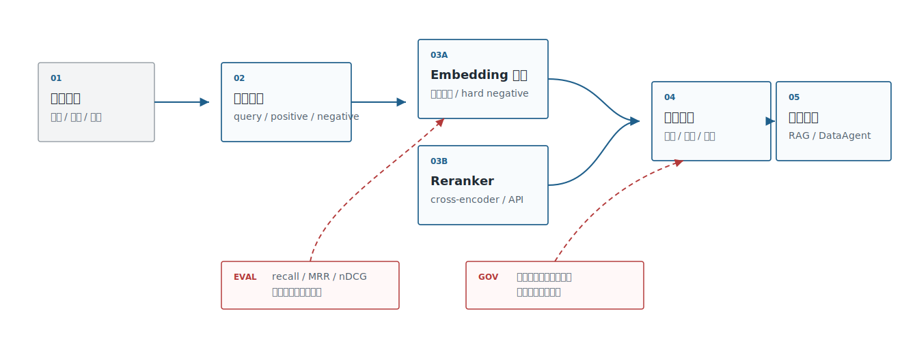
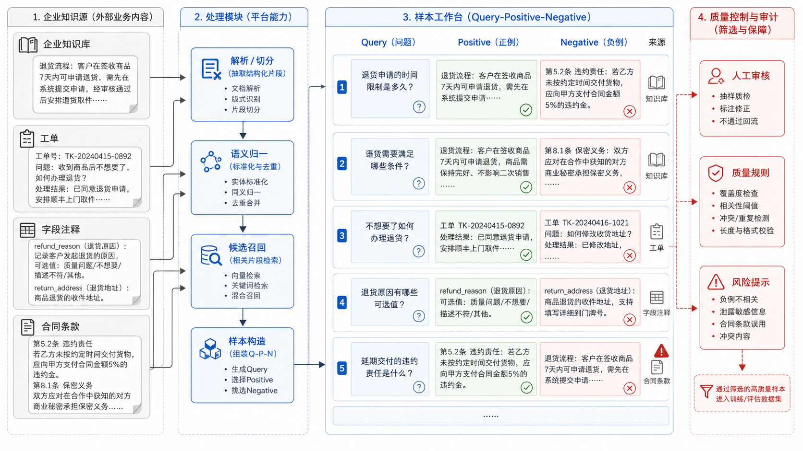
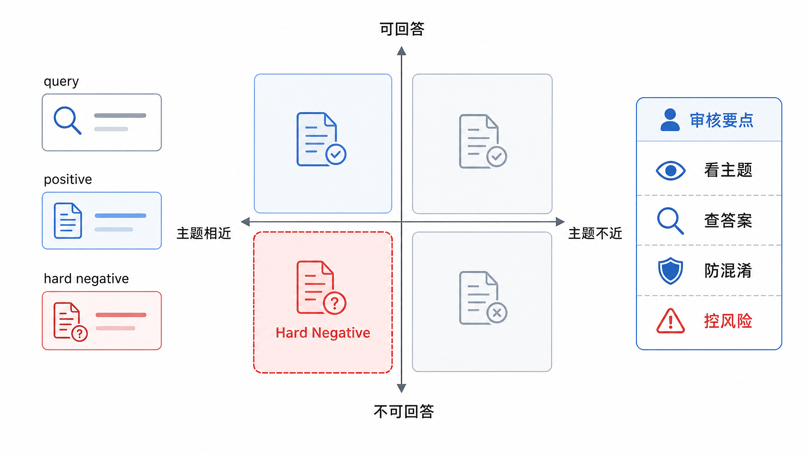

# 第17章 嵌入微调与重排

---

第16章解决的是“先选一个可用 embedding baseline”。上线后，团队很快会遇到第二层问题：公开模型能召回大部分高频问题，却在内部术语、字段别名、合同条款、工单根因和长尾表达上出错。零售企业的员工问“KA 门店坏账风险”，财务制度里写的是“大客户应收账款逾期”；业务分析师问“团购转化”，指标库里写的是 `group_buying_paid_ratio`；客服问“会员黑卡退差价”，制度里可能写的是“高等级权益补偿”。这些表达在业务里互相指向，在通用语料里却未必足够接近。

这类错误在演示阶段不一定明显。团队准备的 demo 问题通常来自文档标题、FAQ 或字段说明，baseline 很容易答得不错。真正上线后，用户会带着口语、缩写、历史叫法和系统字段名提问，检索结果开始偏向“主题相似但不能回答”的材料。DataAgent 里尤其危险：`customer_level`、`customer_segment` 和 `customer_risk_grade` 都属于客户主题，模型如果只学到“客户相关”，生成 SQL 时就可能把分群字段当成风险字段。法务和合规场景也类似，续约通知、自动续费条款和服务到期提醒看起来相近，却不能互相替代。

很多团队的第一反应是换更大的 embedding 模型。这个动作有时有用，但经常只是把问题往后推。检索失败可能来自文档解析、chunk 切分、字段说明缺失、权限过滤、query rewrite 偏移，也可能来自向量空间不懂企业语义。前几类问题靠训练解决不了，甚至会被训练掩盖。平台团队需要先把失败样例摆出来：正确材料到底有没有进入 top-k，进入后是不是排序靠后，错误候选为什么看起来相似，权限过滤后是否还剩足够证据。只有瓶颈落在语义匹配或排序阶段，微调和重排才值得投入。

Embedding 微调和重排会改变检索链路的工程形态。微调会改变向量空间，牵动索引重建、版本回滚和线上稳定性；重排会增加第二阶段计算，影响延迟、成本和解释链路。训练脚本跑通只是开始，真正麻烦的是发布：新模型需要重新编码文档，新旧索引不能混用，灰度期间要能比较同一批 query 的候选差异，失败时要回到旧索引。重排上线也一样，服务超时、外部 API 出域、候选过多导致 p95 上升，都可能把一个质量优化变成稳定性事故。

本章围绕嵌入微调、重排、对比学习、难负例、回归评测和灰度发布展开。读者需要先学会判断检索质量问题属于哪一类，再决定补语义资产、构造 hard negative、训练 embedding，还是在召回后增加 reranker。企业检索系统真正需要的是在内部术语、字段别名、合同条款和长尾表达上更可诊断、可回滚、可持续改进；模型分数只是发布判断的一部分。

---

## 17.1 领域语义适配需求

企业需要领域适配，通常源于企业内部同时存在几套语言：业务口径里的“战略客户”，CRM 里的 `tier_a_account`；分析师口中的“团购转化”，指标平台里的 `group_buying_paid_ratio`；一线人员说的“页面闪退”，研发日志里的 `SIGABRT`。公开 embedding 模型可以给出语义近邻，却不知道这些表达在当前企业里哪些可以互相替换，哪些只是主题相似。领域适配应先识别语言错配出现在哪里，再决定是否训练。读表 17-1 时，可以把触发信号、线上表现和优先动作连起来判断：问题是该补语义资产、补样本，还是进入训练和重排。这里的关键是“先归因，后训练”。如果用户问题和文档字段完全不共词，先补术语表、字段注释和 query 改写样本，往往比直接微调更快；如果正确 chunk 已经进入 top-50，但一直排在错误证据后面，reranker 的风险低于重建 embedding 空间；如果召回结果被权限过滤清空，训练模型只会让错误更隐蔽，真正要修的是 metadata、ACL 和索引写入契约。

*表17-1：领域语义适配的触发信号。来源：本书整理。*

| 触发信号 | 典型表现 | 优先动作 |
|---|---|---|
| 内部术语召回弱 | 用户问题和文档字段不共词，top-k 常漏掉正确 chunk | 先补术语表、字段注释和 query 改写样本 |
| hard negative 混淆 | top-k 里经常出现“看起来相关但不能回答”的材料 | 构造 query-positive-negative 三元组，训练或重排 |
| 长尾业务表达多 | 客服、研发、门店输入很口语化，公开语料覆盖不足 | 从真实日志和历史工单抽样，做小规模评测集 |
| 合规场景证据要求高 | top-k 命中不够，需要把正确证据排在前几位 | 优先引入 reranker 和引用校验，再考虑微调 |
| 多语言或跨系统别名 | 中英文缩写、系统字段、业务别名交叉出现 | 建立别名词表、schema linking 样本和跨语言评测 |

这些触发信号还不能直接推出“应该微调”。平台团队需要继续把检索错误分成四类：召回不到、召回到了但排序靠后、召回了相似但无法回答的材料、召回结果被权限过滤后不足。第一类和部分第二类适合用 embedding 微调解决；第三类通常需要 reranker、规则和证据校验；第四类属于权限与索引治理，用训练掩盖会让事故更难复盘。平台负责人的第一轮决策也应该沿着表 17-2 的顺序展开。这里先不讨论模型选型，而是把“是否值得训练”放到错误归因、样本条件、合规边界和回滚能力里判断。

*表17-2：平台负责人微调与重排决策要点。来源：本书整理。*

| 决策问题 | 推荐判断 |
|---|---|
| 是否先微调 embedding | 只有当错误稳定、样本可标注、baseline 可复现时才微调；否则先补术语、字段说明和 query 改写。 |
| 是否先上 reranker | 正确证据已经进入 top-k 但排序靠后时，优先上 reranker，风险和回滚成本低于改 embedding 空间。 |
| 是否允许外部 reranker | 非敏感知识库可以评估 API；合同、财务、人事、客户资料要优先私有化或做脱敏候选。 |
| 是否能进入生产 | 必须有 hard negative、失败样例、索引回滚、模型版本和候选日志。 |
| 何时停止投入 | 如果错误来自文档解析、权限过滤或 chunk 切分，继续训练 embedding 只会掩盖问题。 |

决策顺序应从错误类型开始，再检查样本是否足够，然后选择微调或重排。否则团队很容易把文档解析、权限过滤、chunk 切分的问题错误地归因给 embedding 模型。回到图 17-1 的检索链路，边界会更清楚：微调影响第一阶段向量召回，重排影响候选排序，权限和引用校验则属于平台控制面。



*图17-1：嵌入微调与重排在检索链路中的位置。来源：本书自绘。Alt text：检索链路依次为查询编码、向量召回（嵌入模型负责）、重排精排（reranker 负责）、返回 top-k，标出微调作用于召回、重排作用于精排两个不同环节。*

链路边界确定之后，样本治理不能停留在训练脚本旁边的临时文件。图 17-2 里的每一条用于微调或重排的样本，都要能追溯到真实 query、业务场景、正负样本、权限范围和复核状态。



*图17-2：企业语义适配样本工作台。来源：本书自绘。Alt text：界面分区展示查询、正样本、难负例标注列表与标注进度，右侧是样本质量统计，体现把线上日志转化为训练样本的人工工作台。*

## 17.2 对比学习与样本构造

Embedding 微调要定义企业关心的相似关系，而非简单多喂一些公司文档。sentence-transformers 的训练文档把模型、数据集、loss、训练参数和 evaluator 拆成训练组件；常见检索训练会使用 pairs、triplets 或带标签的相关性样本。企业应先把样本定义清楚，再讨论训练资源。表 17-3 列出的样本形态并不多，它们和上一节的错误归因是一一对应的：召回不到时需要正样本 pair，排序混淆时需要 hard negative，重排评估时需要多级相关性，冷启动时才考虑伪标签。

样本构造的难点不在格式，而在业务判断。一个问题和一个 chunk 是否构成正样本，不能只看语义相似，还要看它能否支撑答案；一个 negative 是否足够难，也不能只看模型分数，还要看业务人员是否会把它误认为可用证据。比如“续费折扣政策”和“自动续费责任”都和续约有关，但前者不能回答合同责任；“客户等级”和“客户风险等级”都在客户表里，但前者不能支撑风控分析。训练样本如果绕过这些判断，模型会更自信地召回错误材料。

*表17-3：检索微调样本形态。来源：本书整理。*

| 样本形态 | 示例 | 适合任务 | 风险 |
|---|---|---|---|
| 正样本 pair | “报销多久到账” ↔ “财务付款周期说明” | FAQ、制度问答、字段别名 | 太容易的正样本会让模型学不到边界 |
| 三元组 | query、正确 chunk、相似但错误 chunk | 合同、工单、DataAgent schema linking | negative 质量差会引入错误偏好 |
| 多级相关性 | 相关、部分相关、不相关 | reranker 训练和评估 | 标注成本更高，需要一致性检查 |
| 伪标签样本 | LLM 或历史点击生成的候选标签 | 冷启动、无标注场景 | 需要抽样人工复核，防止模型放大旧系统偏差 |

样本形态越复杂，越需要业务复核。伪标签适合冷启动，但不能替代人工判断；多级相关性适合训练 reranker，但如果标注标准不一致，最终只会把噪声训练进模型。标注口径要在训练前写清楚。标注人需要知道“可回答”“部分可回答”“主题相关但不可回答”“无权限可见”这些标签如何区分；数据团队需要知道样本来自哪个业务域、哪个索引版本和哪个权限范围；平台团队需要知道这些样本未来是否会进入训练、评估，还是只作为事故复盘材料。没有这些元数据，训练集很快会变成一堆看似有用、实际无法追责的 JSON。Hard negative 是企业微调里最有价值的样本。它指“很像正确答案，但业务上不能支持回答”的材料，而非随机不相关文档。报销额度制度不能回答报销时限，合同续约通知不能证明自动续费风险，字段 `customer_level` 也不能替代 `customer_risk_grade`。如果 negative 太容易，模型只学会粗粒度主题；如果 negative 本身标错，模型会把正确路径打歪。

表 17-4 将 hard negative 的来源分开，是因为 LLM 批量生成只能补候选，不能替代真实失败样例。最可靠的 negative 通常来自真实失败的 top-k，因为它直接暴露了当前模型已经混淆的边界。

*表17-4：hard negative 的来源与处理。来源：本书整理。*

| 来源 | 获取方式 | 使用建议 |
|---|---|---|
| baseline top-k 错误 | 用现有 embedding 检索，人工标出相似但不可用结果 | 最优先，直接来自真实失败模式 |
| BM25 高分错误 | 关键词命中但语义不支持答案的文档 | 适合处理共词误导 |
| 同类字段或同类条款 | 同一表、同一合同模板、同一业务流程内的相邻对象 | 适合 DataAgent 和法务场景 |
| LLM 生成近似问题 | 让 LLM 改写 query，再检索出混淆项 | 只能做候选，不能免人工复核 |

这几类来源可以组合使用，但优先级不同。线上失败样例优先，业务相邻对象其次，LLM 生成只能补候选池。否则 hard negative 会看起来很丰富，实际却没有覆盖企业真实的错误分布。样本进入训练前要先进入数据治理流程。每条样本至少记录 `query_id`、`positive_id`、`negative_id`、`labeler`、`source`、`scenario`、`acl_scope`、`created_at` 和 `review_status`。这样做看起来繁琐，但它决定模型升级后能否解释“为什么这个模型把某类字段排前了”。

DataAgent 的 hard negative 要特别谨慎。字段名相似不代表可替换，`customer_level`、`customer_segment`、`customer_risk_grade` 都可能出现在客户主题下，但它们对应的业务含义、权限边界和 SQL 计算完全不同。用于训练或重排的 negative 应该带上表、字段、指标、SQL 示例和业务口径，否则模型可能学到“主题相近即可召回”的错误偏好。到了标注会，团队需要图 17-3 这种能把错误来源和修复动作对齐的工作底稿。横向看错误来源，纵向看修复动作，才能把“继续训练”“补字段说明”“改 chunk”“加权限过滤”分开讨论，而非把所有失败都推给 embedding 模型。



*图17-3：hard negative 错误分析矩阵。来源：本书自绘。Alt text：矩阵按"语义相近但不相关"和"字面相近但语义无关"等维度归类难负例，每格给出典型例子，帮助定位难负例的来源类型。*

## 17.3 嵌入模型微调路线

企业微调要从低风险路线开始。起点通常是让检索系统可诊断，而非直接训练：固定一批真实 query，补齐 golden docs，标出 hard negatives，记录失败原因。错误能稳定复现，业务团队也能解释“什么是正确相似、什么是危险相似”时，微调才有意义。较成熟的企业路线通常分四个阶段，表 17-5 把这些阶段背后的取舍压缩成可比较的路线。第一阶段的产出不应该是模型，而是一份可复现的失败清单。清单里要有 query、正确证据、错误候选、权限条件、当前排名和业务解释。只有这份清单稳定，后面的训练或重排才有参照物。很多微调项目失败，是因为团队还没弄清楚错误分布，就先追逐训练 loss；模型看起来提升了，线上用户抱怨的问题却没有变少。

路线的起点是检索基线和数据补强。先用第16章选出的 baseline 模型跑内部 query 集，把失败样例按业务场景拆开。很多问题在这一阶段就能解决：字段注释太短，就补字段说明；制度文档缺少别名，就补术语表；客服工单缺根因标签，就补结构化标签；DataAgent 找不到指标，就把指标口径、历史 SQL 和表血缘写进语义层。这个阶段不改变模型，回滚成本最低。有了几百到几千条稳定样本后，团队可以进入小规模监督对比学习，用 sentence-transformers 这类生态做 pairs、triplets 或 ranking loss 训练。训练样本不追求大而杂，而要覆盖高频业务混淆：同主题不同口径、同字段不同含义、同合同不同条款、同故障不同根因。训练后需要重新编码文档向量并构建新索引，不能把新 query 向量打到旧索引上。

企业已有私有化 embedding 模型服务时，可以继续评估 LoRA、adapter 或继续预训练式的轻量适配。但这一步要克制：它会增加模型发布、推理服务、向量重建、A/B 测试和安全审计复杂度。客服、法务、DataAgent schema linking 等高价值场景持续受益时，才值得进入长期维护。微调、reranker 和检索策略要放在同一条链路里判断。微调解决“候选能不能进来”和“向量空间是否更懂业务边界”；reranker 解决“候选进来后谁排在前面”。如果正确材料已经进入 top-50，只是排序靠后，优先加 reranker 往往更稳；如果正确材料长期进不了 top-k，再考虑微调 embedding。企业上线评审要看组合效果，而非只看训练 loss；表 17-5 进一步比较了这几条路线的优势、代价和适用边界。

*表17-5：嵌入微调路线取舍表。来源：本书整理。*

| 方案 | 优势 | 代价 | 适用场景 | mini-platform 选择 |
|---|---|---|---|---|
| 不微调，只补 query 改写、术语表和 metadata | 风险低、上线快、不需要重建模型能力 | 对深层语义混淆改善有限 | baseline 刚建立、错误主要来自语料缺失或字段说明不足 | 默认第一阶段，先建立可复现评测集 |
| 用 sentence-transformers 做小规模对比学习 | 工程生态成熟，适合 pairs/triplets 和 hard negatives | 需要样本治理、训练环境和索引重建 | 内部术语、工单、schema linking 有稳定错误样例 | 作为实验路线，不直接进入生产默认 |
| 用 LoRA/adapter 做轻量适配 | 训练成本相对可控，便于版本化 | 部署复杂度高于纯 embedding baseline | 有私有化模型和推理平台基础的团队 | 作为后续扩展，不在本章实现 |
| 不改 embedding，引入 reranker | 不改变向量空间，回滚简单，常能改善前排排序 | 增加二阶段延迟和成本 | 正确证据已进 top-k，但排序靠后 | mini-platform 优先实现 reranker 插槽 |

微调路线要有明确退出条件。数据补强后如果 recall@10 已经满足业务阈值，就没有必要进入训练；小规模对比学习如果只提升平均分、却让高风险场景变差，就不能上线；引入 reranker 如果 p95 延迟超过交互要求，也要回到检索候选数量和模型大小上重新折中。退出条件要写进发布评审。比如合同检索要求正确条款进入 top-5，DataAgent schema linking 要求同名字段错误率低于阈值，客服知识库要求 p95 仍在交互可接受范围内。某个平均指标变好，不代表所有场景都能放量；如果高风险场景退化，哪怕总体 recall 上升，也应该停止发布。企业微调的上线门槛应该高于普通模型替换。模型版本变化意味着文档向量、query 向量和索引空间都变了。生产上不要把新模型直接写进旧索引。更稳的流程是：新模型离线编码一份新索引，离线评测通过后做 shadow query，再做小流量灰度，并保留旧索引回滚窗口。图 17-4 把训练、重建索引、shadow query、灰度和回滚放在同一条链上，用来提醒团队：embedding 微调属于检索平台版本变更，不能作为模型团队的孤立动作处理。


*图17-4：embedding 微调版本灰度流程。来源：本书自绘。Alt text：流程从新版本嵌入模型上线小流量，到回归评测对比基线、逐步放量、异常回滚，箭头表示按评测结果控制放量节奏。*

## 17.4 重排模型架构位置

Reranker 的位置在召回之后、答案生成之前。第一阶段 embedding 或混合检索负责从百万级文档里找出几十到几百个候选；reranker 逐个判断 query 和候选内容的匹配程度，把能支持回答的证据排到前面。sentence-transformers 的 Retrieve & Re-Rank 文档把 bi-encoder 用于高效召回、cross-encoder 用于重排；Cohere Rerank 这类商业 API 也遵循同样的二阶段思路。表 17-6 拆开召回、重排和答案生成前过滤，是为了避免把 reranker 误用成权限系统或坏 chunk 的补救工具。

*表17-6：召回与重排的职责边界。来源：本书整理。*

| 环节 | 输入规模 | 模型形态 | 主要目标 | 常见指标 |
|---|---|---|---|---|
| 第一阶段召回 | 全量文档、字段、工单 | embedding、BM25、混合检索 | 正确候选不要漏 | recall@k、latency、filter hit rate |
| 第二阶段重排 | top-50 或 top-100 候选 | cross-encoder、reranker API、轻量 LLM judge | 正确证据尽量排前 | MRR、nDCG、answer citation hit |
| 答案生成前过滤 | top-3 到 top-10 | 规则、权限、引用校验 | 不把不可用证据交给 LLM | policy violation、citation coverage |

Reranker 不应该变成“万能纠错器”。如果正确文档没有进入第一阶段 top-k，重排没有机会修复；如果 chunk 切坏了，reranker 只能在坏候选里排序；如果权限过滤放在 reranker 后面，模型可能已经看到了用户无权访问的内容。平台契约要规定：权限过滤必须在召回和重排之间可配置，敏感场景优先 pre-filter；重排请求本身也要记录 query、candidate ids、model version 和分数。
```json
{
  "query_id": "q-2026-0617-00031",
  "retrieval_index": "policy-kb-v7",
  "retrieval_top_k": 80,
  "reranker": "bge-reranker-large",
  "reranker_version": "2026-06-baseline",
  "candidates": [
    {"chunk_id": "travel-policy#p12#c03", "retrieval_score": 0.74, "rerank_score": 0.91},
    {"chunk_id": "expense-limit#p02#c01", "retrieval_score": 0.78, "rerank_score": 0.21}
  ]
}
```

## 17.5 标注评测与版本治理

微调和重排能否上线，取决于评测反馈链路。一个可用的企业评测集要覆盖真实 query、golden docs、hard negatives、权限过滤、业务场景标签和失败原因。评测报告除了平均分，还要说明哪些场景变好、哪些场景变坏、成本和延迟变成多少；表 17-7 的上线检查项也围绕这些问题展开。

*表17-7：嵌入微调与重排上线检查项。来源：本书整理。*

| 检查项 | 要求 |
|---|---|
| 样本治理 | 所有训练样本有来源、标注人、复核状态和权限范围 |
| 离线质量 | recall@k、MRR、nDCG 至少和 baseline 对比，输出失败样例 |
| 线上成本 | reranker p95 延迟、QPS、token/请求成本可观测 |
| 版本隔离 | embedding 模型、reranker、索引、chunk 策略分别有版本号 |
| 回滚策略 | 旧模型和旧索引保留到新版本稳定后再下线 |
| 数据合规 | 敏感候选是否会发送给外部 reranker 必须显式审批 |

第16章的 embedding benchmark 后续可以扩展成“微调 + 重排”报告：同一批 query，对比 baseline embedding、微调 embedding、baseline+reranker、微调+reranker 四种组合。报告输出不只包含分数，还要包含失败样例和版本元数据，这样平台负责人才能判断能不能上线，工程师也能定位下一轮该修模型、修索引，还是修文档解析。当前仓库尚未包含这一路径，本章不提供可运行命令。评测报告不能停在一行分数。图 17-5 这种页面把不同组合的质量、延迟、成本、失败样例和版本信息放在一起，平台负责人才有依据决定上线、灰度或回滚。

报告还要让业务复核人员看得懂。只展示 nDCG、MRR 和 recall 曲线，平台工程师能判断趋势，业务团队却很难知道模型到底改好了什么。更好的做法是把分数和样例放在一起：这条 query 旧版本排第一的是错误条款，新版本把正确条款排到第二；这条 DataAgent 问题旧版本混淆了两个字段，新版本虽然命中正确字段，但仍把无关报表放进候选。这样的报告能把模型发布讨论从“分数升了多少”拉回“业务风险还剩什么”。


*图17-5：重排评测报告页面。来源：本书自绘。Alt text：报告页展示加入重排前后的 recall@k、nDCG、延迟对比图表与逐条 case 差异，体现重排带来的质量提升与代价。*

## 17.6 Hard Negative 与业务样本治理

嵌入微调最容易被低质量样本带偏。正例通常比较容易收集，真正决定区分能力的是 hard negative。企业知识库里常见的 hard negative 包括名称相似但口径不同的指标、同一产品不同版本文档、同一合同模板不同条款、同一客户不同主体，以及语义相近但权限不同的资料。若负样本只来自随机采样，模型会学到表面相似度，却无法区分真实业务边界。

样本治理要记录来源和适用范围。用户点击、人工标注、事故复盘、评测失败和业务专家整理，都可以产生训练样本，但置信度不同。线上点击不一定代表正确，用户可能只是点开查看；事故样本很有价值，但通常数量少且分布偏向高风险场景。训练集应保留样本来源、标注人、业务域、时间和使用目的，避免把临时修复样本长期混入通用模型。Hard negative 还要随知识库演进而更新。新产品上线、新政策发布、指标口径调整后，原本不相似的文档可能变成容易混淆的候选。平台应从线上检索失败、人工重排和用户反馈中持续抽取负样本，进入下一轮评测和训练。这样嵌入微调才会跟随业务变化，而非一次训练后长期不动。

## 17.7 重排模型的上线边界

重排模型可以改善检索结果，但它也会增加延迟和成本。上线前要先判断哪些场景需要重排。普通 FAQ、短文档检索和低风险问答可以只用向量召回；法规、合同、指标口径、技术文档和 DataAgent 证据检索更适合增加重排。重排不应全局打开，而应按知识库、任务类型和风险等级启用。重排结果也要进入 Trace。平台至少记录召回候选、重排分数、最终入选片段和被排除的高分候选。用户质疑引用时，团队需要知道证据是召回不到，还是重排排错，还是上下文组装截断。没有这些记录，重排模型会变成另一个黑盒。上线边界还包括降级策略。重排服务超时或失败时，系统可以退回向量召回结果，但要降低证据置信度；高风险任务则应停止或转人工复核。把重排失败静默隐藏，会让回答质量波动却难以解释。第20章的 RAG 证据链、第38章的 Trace，都需要这层中间证据。

## 17.8 嵌入微调的评测闭环

嵌入微调的评测不应只看 Recall@K。企业检索更关心证据是否覆盖关键结论、错误证据是否被排除、权限过滤后是否仍能召回足够候选、以及重排后进入上下文的片段是否能支撑回答。一个模型 Recall@10 提升，但把多个口径相近的指标混在一起，对 DataAgent 反而是风险。评测样本要按任务类型分层。事实问答样本关注命中文档，指标解释样本关注口径消歧，合同和政策样本关注条款级证据，DataAgent 样本关注指标、维度和报告证据。每类样本都应保留正例、hard negative 和不可回答样本。不可回答样本很重要，它能验证模型不会把相似但错误的文档强行推到上下文里。评测反馈链路还要连接线上反馈。用户点击引用、人工改引用、报告复核退回、事故复盘发现证据错误，都可以进入样本池。样本进入训练前需要审核，进入评测前需要脱敏和版本化。这样微调才会变成知识检索质量持续改进的机制，而不是一次性模型项目。

## 17.9 与索引生命周期的协同

嵌入模型升级后，索引生命周期必须同步规划。旧文档向量、新模型 query 向量和新重排模型如果混在一起，检索结果会变得不可解释。平台应为 embedding model、chunk 策略、索引构建任务和 reranker 版本建立组合版本，发布时以组合版本为单位灰度，而非单独替换某个组件。重建索引也要考虑业务连续性。大知识库重建可能需要数小时甚至数天，期间不能让查询在旧索引和新索引之间随机跳转。比较稳妥的做法是构建影子索引，跑评测和抽样比对，确认后按知识库或租户切流。切流后保留旧索引一段时间，便于回滚和事故复盘。索引生命周期还涉及删除和权限变化。某份文档撤回后，向量索引、重排缓存和评测样本都要同步处理；某个部门权限调整后，检索候选也要改变。嵌入微调如果不和这些生命周期事件协同，就会把已失效知识继续推给模型。知识检索的质量，最终取决于模型、索引和治理三者一起稳定。

## 17.10 微调收益的成本边界

嵌入微调不是每个知识库都需要。若问题主要来自文档缺失、chunk 过粗、权限过滤过严或 query rewrite 偏移，微调不会解决根因。上线前应先用失败样本判断瓶颈：召回不到、召回到了但排序靠后、排序正确但上下文被截断，还是模型没有使用证据。只有瓶颈落在语义匹配和排序阶段，微调或重排才值得投入。成本边界还包括维护成本。训练样本、评测集、索引重建和灰度切流都需要持续维护。小规模、变化频繁的知识库，可能用更好的 chunk、元数据过滤和重排就足够；稳定且高价值的领域知识库，才适合建立专门 embedding 或 reranker。这个判断能防止团队把所有 RAG 问题都推给模型微调。

## 17.11 生产验证与线上反馈回流

微调和重排上线前，平台需要准备一套生产验证路径。第一步是离线回归，同一批 query 在旧 embedding、旧索引、新 embedding、新索引、旧 reranker、新 reranker 的组合上分别运行，比较 top-k 候选、引用命中、错误候选和权限过滤结果。第二步是 shadow query，把线上真实请求复制到新链路，但不把结果返回给用户，只记录候选差异和延迟变化。第三步是小流量灰度，选择低风险知识库或内部用户，把新链路接入真实回答，并要求 Trace 同时记录旧链路和新链路的关键差异。第四步才是按知识库、租户或任务类型逐步放量。

生产验证不能只看平均指标。合同、财务、HR、DataAgent schema linking 这些场景，即使总体 recall 提升，也不能容忍高风险样本退化。发布报告要把“变好样本”和“变坏样本”分别列出来，并解释变坏样本是否可接受。比如某个客服 FAQ 从 top-8 提升到 top-2 是好事，但如果一个合同续约条款从 top-1 掉到 top-7，且错误候选会误导法律责任，就应停止放量。平台评审要允许局部回滚：某个知识库可以启用新 reranker，另一个知识库继续使用旧版本；某类低风险问答可以使用微调 embedding，高风险合同检索则继续走 baseline 加人工复核。

线上反馈回流要保持克制。用户点击某条引用，不等于这条引用一定正确；用户没有点击，也不代表结果错误。平台可以把点击、复制、人工改引用、点踩、报告复核退回和事故样本都放进候选池，但进入训练集前必须经过抽样复核。反馈回流的价值，是让样本池跟随真实使用变化，而不是让模型盲目学习用户行为。若某个字段长期被用户改引用，可能说明字段说明写得差，也可能说明 query rewrite 把问题改偏了；若某类制度问答经常被驳回，可能需要补文档版本和生效日期，而不是继续训练 embedding。生产验证和反馈回流连起来后，嵌入微调才会成为检索平台的持续工程，而不是一次训练实验。

## 17.12 发布台账与责任分工

嵌入微调和重排上线后，应进入知识检索发布台账。台账至少记录 embedding 模型、reranker、索引版本、chunk 策略、评测集版本、灰度范围、回滚窗口和业务 owner。它的作用是让检索质量变化能被解释。一次 RAG 回答引用错误时，平台不能只看到“当前知识库版本”，还要能回到当时使用的向量空间、重排模型、权限过滤策略和上下文组装规则。否则团队很容易把问题归因给生成模型，忽略检索链路已经发生变化。

发布台账还要记录责任。数据团队负责文档来源、权限和删除事件；知识工程团队负责 chunk、索引和元数据；模型团队负责 embedding 与 reranker；业务团队负责样本标注和风险接受；平台团队负责灰度、Trace 和回滚。责任分清后，线上反馈才不会全部落到模型团队。比如用户指出引用条款过期，可能需要数据团队更新版本；用户指出字段解释混乱，可能需要业务团队重写说明；用户指出正确证据排在后面，才更像重排或 embedding 问题。

台账也能帮助控制微调冲动。每次质量下降都先回查发布台账：最近是否重建索引，是否换过 chunk 规则，是否新增权限过滤，是否改过 query rewrite，是否更换重排模型。若这些变化没有记录，继续训练模型只会把故障掩盖得更深。早期平台可以先用轻量方式维护台账，把每次知识链路发布和回滚记录成结构化 Markdown 或配置文件，后续再接入发布系统。只要能回答“变了什么、影响谁、怎么退回”，它就已经比散落在聊天记录里的发布说明可靠。

## 17.13 检索变更的回放样本

嵌入微调、重排和索引切流都需要回放样本。回放样本不能只包含容易命中的 FAQ，还要覆盖字段消歧、指标口径、同名文档、旧版制度、权限边界、不可回答问题和事故样本。每条样本应保存 query、期望证据、不能出现的 hard negative、权限上下文、业务域、风险等级和上一次线上失败原因。这样新 embedding 或 reranker 发布时，团队才能看到它改善了哪些真实问题，又引入了哪些新风险。

回放不能停留在最终答案，还要比较候选变化。旧链路 top-k、新链路 top-k、重排前后顺序、被权限过滤掉的候选、进入上下文的片段、最终引用和回答质量都应放在同一份报告里。若新链路把正确文档从第八名推到第二名，这是质量改善；若它同时把一份无权限文档推到前列，只是被后置过滤挡住，平台也要记录这类风险。检索链路的很多事故发生在“差一点被模型看到”的候选里，发布评审不能只看最终输入给 LLM 的片段。

线上反馈进入回放集前要复核。用户点击、复制、追问和点踩都只是信号，不能直接变成训练标签。平台可以先把这些行为作为候选样本，再由业务或知识工程人员判断真实原因：是文档过期、字段说明不清、chunk 切分错误、权限过滤过严，还是 embedding 匹配不准。经过复核的样本再进入评测和训练，才能让微调和重排沿着正确方向改进。回放集会随着业务变化持续更新，它是知识检索平台的质量资产，不是一次发布的附件。

## 17.14 向量库迁移与索引版本复盘

向量库迁移不能只比较检索延迟和存储成本。企业知识链路里，向量库承担索引版本、metadata 过滤、权限隔离、混合检索和召回证据。迁移时如果只把向量搬过去，很容易丢掉过滤语义、排序行为或索引构建参数。用户看到的变化通常是“Agent 找资料不稳定”，但根因可能是 HNSW 参数、分片策略、metadata 类型或 rerank 接口改变了。

迁移复盘要保留旧索引和新索引的对比样本。样本应包含 query、用户角色、过滤条件、top-k 文档、分数、rerank 结果、引用命中和权限结果。迁移前后如果候选集变化，要判断变化是否合理；若权限过滤顺序变化，要确认无权文档没有进入模型上下文；若分数分布变化，要调整阈值和降级提示。向量库迁移只有经过这些对比，才能进入生产。

索引版本也要进入生命周期管理。新文档入库、chunk 策略调整、embedding 模型升级、metadata 重建，都应生成索引版本。旧索引在并行窗口结束后要归档或删除，不能无限期占用成本；但删除前要确认历史报告、Trace 和评测样本是否仍需引用。向量库治理的目标，是让检索结果能被解释和回放，而不是只追求更快的相似度搜索。

## 17.15 微调项目的停止条件

嵌入微调项目还需要明确停止条件。很多团队在检索质量不稳定时会继续收集样本、继续训练、继续调参，却没有判断是否已经到达当前知识库和任务设计能够支持的上限。若文档版本混乱、字段说明缺失、权限过滤错误或 chunk 策略不稳定，继续微调只会把这些问题压进模型空间，短期指标可能变好，长期排查会更困难。

停止条件可以从三个方面设定。第一是质量边界：高风险样本没有退化，核心任务样本达到发布阈值，且不可回答样本没有被强行匹配。第二是成本边界：索引重建、重排延迟、训练样本维护和灰度回滚的成本能被业务价值覆盖。第三是治理边界：模型版本、索引版本、样本版本和权限策略都能被记录和回放。三类条件中任意一类不满足，都应暂停发布，回到文档治理、样本治理或产品边界，而不是继续训练。

这个停止条件也能保护团队注意力。Embedding 和 reranker 是知识检索链路里的重要部件，但它们不是所有问题的答案。一次失败可能来自 query rewrite，也可能来自数据目录、证据组装、权限过滤或最终回答生成。评审时先定位失败阶段，再决定是否微调，才能让模型工作服务于平台质量，而不是把平台治理问题外包给训练任务。

## 17.16 检索实验的发布纪律

嵌入、重排和混合检索实验很容易在离线环境里越做越复杂。团队会尝试新的 loss、新的 hard negative、新的 reranker、新的 RRF 权重和新的 metadata filter，但如果实验记录无法回到线上链路，最后只能得到一组分数更高、生产风险不清的配置。检索实验从一开始就应记录实验目的、样本版本、模型版本、索引版本、参数、成本、延迟和失败样例。

实验报告要保留反例。只展示提升最大的 query，会让评审高估模型收益。每次实验至少要列出三类样本：明显变好的样本、明显变差的样本、分数变化不大但业务风险高的样本。高风险样本包括合同条款、权限边界、财务指标、HR 制度和 DataAgent schema linking。若这些样本退化，即使平均 nDCG 提升，也不应直接发布。

发布纪律还要求实验能被复现。训练数据、负样本构造、评测脚本、索引构建参数和 reranker 配置都要有版本。实验在 notebook 里跑通不代表能进生产；只有当同一配置能在 CI 或发布流水线中重跑，才具备灰度资格。这样模型团队和平台团队才能围绕同一份证据讨论，而不是各自拿一套脚本解释结果。

检索实验也要有退出路径。某个实验被放弃时，应说明原因：成本过高、延迟超标、高风险样本退化、权限过滤难以解释，还是收益被更简单的 chunk 策略覆盖。记录失败实验不是浪费，它能防止团队几个月后重复同样尝试。企业检索平台的成熟度，体现在实验能否稳定转化为发布候选，也体现在无效方向能否及时停止。

## 17.17 检索质量的跨团队复盘

嵌入微调和重排进入生产后，质量复盘不应只由模型团队完成。一次引用错误可能来自文档版本，可能来自 chunk 边界，也可能来自 query rewrite、metadata 过滤、权限裁剪、重排阈值或答案生成。若复盘只看模型指标，团队会把所有问题继续推向训练任务。更有效的做法，是把失败样本拆到检索链路的各个阶段：用户问题是否被改写，候选是否召回，正确证据是否被权限过滤，重排是否改变了顺序，上下文组装是否截断，最终回答是否使用了证据。

跨团队复盘要有共同材料。模型团队需要样本和分数，知识工程团队需要文档版本、chunk、metadata 和索引状态，数据治理团队需要权限和删除记录，业务 owner 需要判断证据是否符合业务口径，平台团队需要 Trace、延迟、成本和回滚记录。每次复盘至少应输出三类结论：需要修模型的样本，需要修知识资产的样本，需要修产品边界或权限策略的样本。这样下一轮改进才不会只堆训练数据。

复盘节奏也要跟发布节奏连接。模型升级、索引重建、知识库大批量更新、权限策略调整和 DataAgent 语义层变更后，都应抽样运行检索质量复盘。低风险知识库可以按月复盘，高风险合同、财务、合规和 DataAgent schema linking 场景应在每次发布后复盘。复盘结果进入回放集、发布台账和业务验收材料，形成下一次发布的证据。

早期平台可以从一个轻量机制开始：每周抽取线上失败、人工改引用、报告退回和事故样本，标注失败阶段和责任 owner；每次发布前回放最近一批高风险样本；每次发布后观察变坏样本和用户修正。这个机制不会让检索质量立刻完美，但能让团队知道问题应由哪一层解决。企业检索的长期质量，靠的是这种持续定位和复盘能力，而不是某一次模型微调的分数。

## 17.18 微调样本的版权与敏感信息复核

嵌入微调和重排训练会收集大量查询、文档片段、点击、人工标注和 Hard Negative。企业内部很容易把这些材料当成普通训练数据处理，但其中可能包含客户名称、合同内容、内部项目、员工信息和受版权保护的文档片段。若样本进入长期训练集，后续模型、评测和迁移都会继承这些风险。检索质量优化必须包含样本合规复核。

复核要发生在样本进入训练集之前。平台应检查样本来源、授权范围、脱敏状态、保留期限、可导出范围和可删除方式。用户查询可以保留语义意图，但要去除个人身份和敏感字段；文档片段可以保留引用 id 和结构标签，但要控制原文暴露；人工标注要记录标注人和使用范围。这样样本既能用于质量改进，又不会在训练资产中扩散敏感信息。

样本合规还会影响模型迁移。若训练集包含只能在某租户内部使用的片段，微调模型就不能直接共享给其他租户；若样本来自受限文档，评测报告也不能随意外发；若用户要求删除相关记录，平台要知道哪些训练样本、评测样本和索引版本受到影响。没有这些记录，后续响应合规请求会非常困难。

早期可以为检索微调样本建立数据卡。数据卡记录来源、范围、脱敏方式、owner、保留时间、删除入口和可共享级别。这样第17章的检索优化会和第50章安全治理、第52章合规审计形成连接，避免把质量提升建立在不可控样本上。

## 17.19 微调样本的合规复核

嵌入微调和重排训练会把企业样本带入模型优化流程。样本可能包含客户名称、合同条款、内部制度、审批意见和用户查询。即使训练目标只是改善排序，样本仍然需要合规复核。平台要确认样本来源、脱敏方式、授权范围、保留时间和可删除路径，不能把线上失败样本直接汇总成训练集。

合规复核要和样本价值一起看。有些样本对检索质量很有价值，但包含敏感字段，可以通过脱敏、字段替换或只保留结构特征进入训练；有些样本包含过期口径或争议事实，不能进入正样本；有些样本来自人工裁定，可以作为高价值标注，但要保留裁定 owner 和适用范围。训练数据的质量不只影响效果，也影响后续审计。

早期可以为微调样本建立准入状态：候选、已脱敏、已授权、已训练、需删除、已退役。每个状态记录样本来源、用途、数据域和 owner。这样嵌入微调不会成为绕过数据治理的捷径，而会成为可审计的检索质量改进流程。

## 17.20 嵌入微调后的检索复测

嵌入微调进入生产后，平台需要把训练样本、负样本、召回集合、线上查询、权限过滤、索引版本和回滚模型放进统一证据口径。证据口径会减少事后解释成本，让业务、平台、数据、安全和运营团队能够围绕同一组事实讨论问题。没有这些材料，故障发生后只能凭经验判断；有了这些材料，团队可以知道哪些输入有效、哪些动作已经执行、哪些产物可以继续使用、哪些结果需要撤回。

这类证据应和第16章嵌入模型、第18章向量库和第20章 RAG连起来。上游章节提供能力基础，下游章节使用运行结果，本章则负责说明中间环节如何被验证。若某个能力只在本章看起来完整，却无法进入 Trace、Eval、发布记录或合规证据包，生产系统仍然会出现断点。读者在实现时应把章节之间的接口看成工程契约，而不是阅读顺序上的相邻关系。

常见风险包括离线指标提升但线上召回变差、热门查询变好长尾查询变差、微调后权限过滤样本缺失。这些问题通常不会在一次成功演示中暴露，因为演示样本往往干净、短小、路径明确。真实业务会带来旧数据、异常输入、权限变化、用户撤回、预算限制和长时间运行状态。平台如果没有把这些情况纳入样本和台账，后续扩展场景时就会重复遇到同类问题。

嵌入模型更新应和向量索引、RAG 样本、权限样本一起复测。执行记录至少要说明 owner、版本、样本、影响范围、处置动作和复查时间。记录不需要写成流程报告，但要足够让后来者理解当时的判断。对于高风险能力，还应说明哪些条件满足后才能扩大使用，哪些条件失败时必须降级或撤回。

落地时可以先选择少量代表场景建立这种习惯。实践上，应先把高频、高风险、外部可见的路径做扎实，再把样本、台账和复盘方式复制到其他能力中。这样做能让能力说明落到接入、验证、运营和退出，而不是停留在概念描述。

## 本章小结

Embedding 微调适合解决稳定、可标注、可复现的领域语义问题；reranker 适合在正确候选已经进入 top-k 后提升前排证据质量。两者都不能绕开样本治理、权限审计和版本回滚。企业平台应先建立 baseline，再用 hard negatives 找到真实边界。微调前要区分召回不到、排序靠后、候选不可用、权限过滤不足等错误类型，因为它们对应的修复手段不同。Hard negative 也应成为有来源、复核和版本记录的资产。新的 embedding 模型需要新建索引或双写灰度，不能混进旧向量空间。微调、重排、索引和 chunk 策略应进入同一份评测报告，由数据和证据说明是否值得发布。

## 参考文献

- Sentence Transformers Training Overview: https://www.sbert.net/docs/sentence_transformer/training_overview.html
- Sentence Transformers Losses: https://www.sbert.net/docs/package_reference/sentence_transformer/losses.html
- Sentence Transformers Retrieve & Re-Rank: https://www.sbert.net/examples/sentence_transformer/applications/retrieve_rerank/README.html
- Cohere Rerank: https://docs.cohere.com/docs/reranking-with-cohere
- BAAI bge-reranker model cards: https://huggingface.co/BAAI
